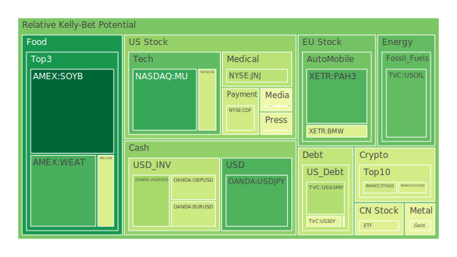
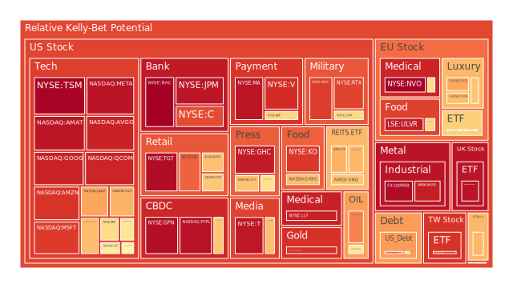
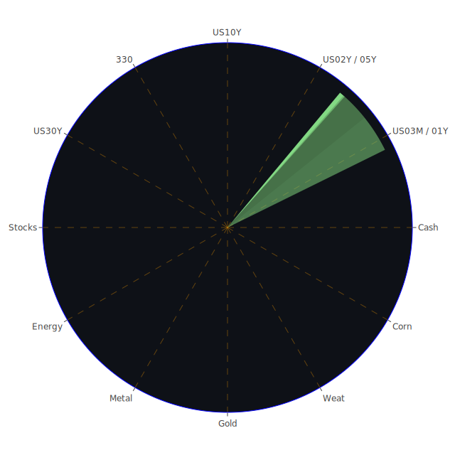

# 一、投資商品泡沫分析

在進行「三位一體」的空間、時間、與概念層面解讀之前，先就現有市場中常見的主要資產類別進行泡沫可能性的概略說明。此處會參考近幾日（含2025-03-29、2025-03-30、2025-03-31）相關數據當中的泡沫指數（D1, D7, D14, D30）與觀察到的價格（PP100），並輔以新聞事件的情緒影響和歷史情境的對照。

1. **美國國債**  
   美國國債常被視為全球資金避風港。然而近幾日的數據顯示，美國較長天期公債（例如10Y, 20Y, 30Y）在泡沫指數上有些微升高迹象，部分指標如30Y收益率維持在4.58-4.60左右的區間，10Y在4.20附近。從泡沫風險數值可見，D1在0.44-0.52之間徘徊，並非特別危險，但反映了市場對通膨及聯準會（FED）可能變動利率政策的不確定。  
   新聞層面上，多篇報導提及「特朗普政府威脅再次加徵關稅」「美國赤字規模驚人」等消息，讓投資者對美債「避風港」地位是否會因龐大的公共債務而動搖有疑慮。從歷史來看，1998年、2008年金融風暴、甚至2020年疫情時期，美國國債仍維持其流動性與避險角色。但是若未來政治紛擾（如舉債上限談判）加劇，仍可能拉大美國國債的收益率波動幅度，增加短期債券與長期債券在利差上的不確定性。

2. **美國零售股**  
   這裡包含像WMT、TGT、COST等代表零售龍頭企業。一些新聞提及「Lululemon警告消費者信心下降」「美國春季銷售季節不如預期」等，顯示消費面或許面臨通膨壓力與整體購買力放緩。根據近期的泡沫風險數據，零售類股（例如TGT）在D1約0.97上下，屬於相對偏高的位置，表示市場可能對於零售營收前景產生疑慮。回顧歷史，零售股常在景氣循環末期受到衝擊，尤其當利率和關稅同時施壓時，很容易打擊企業盈餘預期，導致估值開始泡沫化或股價修正。

3. **美國科技股**  
   這一範疇相當廣，包括AAPL、MSFT、AMZN、GOOG、META等互聯網或高科技巨頭，也包含半導體等領域。最近新聞重複提到「AI泡沫」「CoreWeave IPO」等，顯示投資人對於AI概念股既興奮又擔憂。若從泡沫指數來看，部分美國科技巨頭（如MSFT、META、GOOG）在D1上已達0.88-0.95的範圍，有些甚至接近0.96-0.97，泡沫風險不可忽視。  
   歷史上，高科技板塊泡沫在2000年「網路泡沫」時曾有慘痛例子，後續也在2018年、2021年多次對估值過高提出警訊。新聞裡「CoreWeave IPO不如預期」「投資者憂心AI領域過熱」等脈絡，代表市場對於尖端科技的炒作仍然火熱，但若後續利率持續偏高或貿易關稅升溫，供應鏈成本可能走揚，進而讓科技股的本益比壓力提高。

4. **美國房地產指數**  
   常見代表ETF如VNQ、RWO、IYR，以及綜合房地產數據。根據D1約落在0.66-0.69，有些甚至超過0.70以上，顯示在高利率環境下，美国房地產板塊可能正進入脆弱的狀態。新聞中提到「房屋銷售淡季」「房貸利率達6.65-6.87%水準」，與歷史上2007-2008年房地產泡沫破裂的情況大相逕庭，但對現金流量需求高的房地產投資信託（REITs）類資產，還是要密切關注利率上揚時對其收益分配的衝擊。

5. **加密貨幣**  
   以BTC、ETH、DOGE等為代表。BTC目前價格顯示可能在8萬美元上下（以2025年的通膨與市值擴張來看），泡沫指數近期在D1約0.50-0.57之間，ETH在0.39-0.53，DOGE則相對低些，約0.40-0.42左右，然而其波動性仍然極高。新聞層面並沒有直接再度強調比特幣監管問題，但提及多項國際地緣政治事件以及投資者避險情緒時，也會牽涉到加密資產。歷史上比特幣多次在地緣政治動盪時攀升或大漲，卻也在監管或交易所破產消息中大跌，因此投資者不可忽視其泡沫風險高的可能。

6. **金/銀/銅**  
   黃金（XAUUSD）、白銀（XAGUSD）、銅（COPPER）等大宗商品金屬，近來受到地緣政治衝突與美元利率變動的雙重拉扯。金價已突破歷史高位（超過3000美元），銀和銅也時常接近歷史高點，預估的泡沫指數大多在0.90上下，尤其是白銀在近幾日D1數值超過0.93。從歷史角度來說，每當全球局勢不穩定（像2022年俄烏衝突、2023-2025年美中關稅談判波動），金屬類商品都會出現避險買盤，推升價格。然而若聯準會終於壓制住通膨，實質利率提高，可能使金銀價格瞬間出現修正壓力。

7. **黃豆/小麥/玉米**  
   以SOYB（大豆）、WEAT（小麥）、CORN（玉米）為代表。根據泡沫數值，小麥D1約在0.18-0.19之間，大豆則非常低，在0.02-0.02多，玉米D1約0.41-0.42上下；這些農產品受天候、地緣衝突影響甚大。新聞提到「美國對海外糧食進口關稅可能上調」以及「印度、巴西等地出口正加強」，顯示糧食貿易秩序不確定。歷史上，農產品價格常因全球氣候異常、戰爭或疫情而短期劇烈波動，但若將其納入長期組合，某些時候能夠對沖工業或能源類的波動風險。

8. **石油 / 鈾期貨(UX!)**  
   石油價格目前在每桶68-69美元間震盪，D1約0.21-0.31，反映近期波動減弱。鈾期貨(UX!)相對小眾，但泡沫風險約在0.51上下，表示市場對於核能發電需求預期和地緣政治因素依然敏感。新聞層面則常提到「特朗普對俄羅斯原油祭出更嚴格懲罰」「中東地緣衝突」等，皆可能造成油價快速波動。回顧歷史，每次重大制裁或衝突都推升油價，但2025年全球經濟成長趨緩也限制了需求。至於鈾期貨，若核能發展政策繼續在歐洲及亞洲有推進聲浪，其價格或有長線支撐，但同時伴隨政治與環保議題風險。

9. **各國外匯市場**  
   近期美元對歐元（EURUSD）約1.08，對日圓（USDJPY）在148-149之間，對英鎊（GBPUSD）在1.29-1.30；澳幣（AUDUSD）在0.63上下。泡沫指數大概維持在0.34-0.47之間，顯示匯市受到美國利率變化與地緣消息影響，難以出現極端的泡沫化。市場新聞提及「日本國債大規模損失」「日圓匯價壓力增大」，這些皆在歷史經驗中（如1997亞洲金融風暴、2013日本量化寬鬆）顯示貨幣匯率隨國內外利差而劇烈波動。外匯市場的隱藏風險往往在利率突變或政府干預時才會爆發，投資者需留意。

10. **各國大盤指數**  
   以美國S&P 500、納斯達克NDX、歐洲FCHI（法股指數）、GDAXI（德國指數），英國FTSE，日經JPN225，以及中國大陸000300或台灣0050等為例。國際新聞裡反覆提到「大盤遭受關稅與衝突消息打擊」「地震造成部分亞洲市場信心震盪」，也出現「AI熱潮支撐科技股」。近幾日的泡沫風險，歐洲指數（FCHI、GDAXI、FTSE）以及台灣0050、日本JPN225皆在D1約0.60-0.89之間，顯示估值偏高的可能性不小。歷史上只要企業獲利出現下滑苗頭，或金融大環境出現重大利空，指數就會修正下來。從近幾次的新聞可以看到，市場對地緣政治、關稅、地震等事件的反應都相對敏銳。

11. **美國半導體股**  
   包括AMD、INTC、MU、KLAC、NVDA等。根據D1指數，部分半導體個股（NVDA、MU、AMD等）都在0.54-0.67以上，有些甚至突破0.70。隨著AI、大資料中心等需求，半導體景氣仍然強勁，但同時也受到中美關係緊張的掣肘。從歷史脈絡來看，半導體是高度週期性的產業，一旦出現產能過剩或終端需求疲軟，其股價容易進入修正。新聞亦提到「AI熱潮受CoreWeave IPO不振打擊」，顯示短期投資人對半導體股的樂觀情緒可能有所消退。

12. **美國銀行股**  
   包括JPM、BAC、C、COF等。近期美國銀行類股泡沫風險（D1）普遍在0.85-0.99之間相當高。尤其BAC更是一度衝到0.997，代表市場對銀行股估值水準有高度擔憂。新聞提及「貸款違約率上升」「消費者信用卡壞帳」與「美國區域銀行有隱憂」等話題，回顧歷史，次貸危機（2008）或歐債危機（2011）時，美國銀行股受到重創。若未來利率走勢和債務上限問題再度拉扯，銀行資產負債表壓力亦可能凸顯，進而提升其整體系統性風險。

13. **美國軍工股**  
   以LMT、RTX、NOC等為代表。依照2025-03-31的數據顯示，軍工股泡沫風險普遍在0.75-0.88甚至以上。新聞裡「特朗普對俄羅斯制裁、對國防工業的追加預算不確定」「各地地緣衝突不斷」等內容表明短期軍工有一定需求，但市場也擔心國會預算債務上限的制約會影響軍工企業訂單。歷史上，軍工股常跟國際衝突走勢正相關，然而評價高時也容易因局勢和預算而下挫。

14. **美國電子支付股**  
   例如V、MA、PYPL、GPN等。數據顯示泡沫風險集中在0.90-0.96之間，PYPL接近0.96，顯示市場對於電子支付領域競爭激烈、消費者支出力道不穩等疑慮。新聞還有提到「Oracle被DOGE裁員波及，意味著科技及支付鏈條的預算縮減」。回顧歷史：2018年電子支付蓬勃發展，2020年疫情更讓線上支付激增，但2023-2025年高利率及科技監管可能為該行業帶來成長瓶頸。

15. **美國藥商股**  
   常見如JNJ、MRK、LLY等。相較之下，泡沫風險數值有些在0.35-0.61之間，也有達0.93以上的，例如LLY。新聞提及「JNJ營收不如預期」「MRK遭遇專利藥競爭」，加上醫藥板塊本身具防禦性，但在重大法規調整或專利到期時波動也很大。歷史顯示醫藥股在經濟不景氣時往往有較佳的抗跌力，但若估值過高，市場反轉時同樣會受到衝擊。

16. **美國影視股**  
   例如NFLX、DIS、PARA等。NFLX根據數據D1可達0.46上下，看似不算極度危險，DIS約0.67，而PARA在0.48左右，但曾出現過「流媒體市場競爭使得營收被壓縮」的新聞。歷史上，影視娛樂隨景氣循環但也會被消費者需求轉向等影響。新聞裡提到「歐洲市場對好萊塢影視需求下滑」「流媒體用戶成長趨勢放緩」，短期內須觀察現金流動向。

17. **美國媒體股**  
   如FOX、CMCSA、NYT等。這些公司面臨廣告市場起伏的壓力，報導裡提到「廣告主縮減預算」「社群平台瓜分流量」等問題。FOX的泡沫風險D1約0.66-0.81之間，NYT在0.60-0.75不等。歷史事件如金融危機或政治衝突，通常會令媒體業的廣告收益下滑，但同時也可能因選舉或重大新聞流量激增獲得更多訂閱收入，具兩面性。

18. **石油防禦股**  
   例如XOM、OXY等。數據顯示D1多在0.58-0.77不等，泡沫風險偏高，可能與油價不穩定、國際局勢波動、以及市場對再生能源的需求上揚形成競爭有關。歷史上，石油類股在大衰退或需求驟降時容易暴跌，但也常在地緣衝突中飆升。新聞中「特朗普威脅對俄羅斯石油祭出更大限制」「歐佩克供給策略」都可能瞬間改變石油股的走勢。

19. **金礦防禦股**  
   例如RGLD、GOLD等。黃金礦商或皇室權利金公司在金價攀升時通常獲益，但礦開成本、環保法規都可能產生風險。RGLD等公司D1約在0.90上下，泡沫風險頗高，意味著市場賦予其較高的成長預期。如果金價在高檔修正，礦業公司也可能迎來獲利下修與股價急跌。回顧1990年代後期與2011年金價大漲後的調整，金礦企業的股價修正都非常劇烈。

20. **歐洲奢侈品股**  
   如MC、KER、RMS等。這些龍頭在中國與美國消費者強勁時都有不錯表現，但新聞層面提到「關稅可能阻礙跨境購買」「地震與政治衝突衝擊旅遊零售」，導致奢侈品銷售預期動能減弱。近幾日所示的泡沫風險大都在0.65-0.79，顯示估值偏貴。從歷史經驗，奢侈品股常在景氣高峰時達到高估，而在衰退或重大危機時驟跌。

21. **歐洲汽車股**  
   如BMW、MBG等。受到「電動化轉型」「與中國關稅或地緣政治」等多重影響，泡沫風險在0.42-0.55左右，並未到非常誇張。但新聞也提示了可能的銷量下滑與新技術競爭，尤其是若美國對歐洲汽車重新施行高額關稅，對此產業將構成顯著衝擊。歷史上，歐洲車廠曾在2019-2020年的關稅爭端中面臨過營收壓力。

22. **歐美食品股**  
   如NESN、KHC等。根據D1風險約在0.62-0.68不等，算是中段偏高。食品製造商具必需消費特性，通常比其他週期性產業防禦力更佳，但若大宗商品（黃豆、小麥、玉米）價格上揚，也將使食品股營利空間壓縮。新聞裡提到「通膨與關稅交織，壓抑原料獲利」，在歷史上，食品產業通常在大環境動盪時不至於暴跌，但若上游原物料持續成本高企，估值過高仍有修正空間。

綜觀以上資產类别，回顧三天來的泡沫指數及市場消息，可見多數風險指標都有中高水位，尤其科技股、銀行股、軍工股等某些成分接近0.90甚至更高，須相當留意。尤其在新聞鋪天蓋地的「關稅」「通膨」「國際衝突」「地震與災難」的影響下，市場情緒極易迅速翻轉。以下，將分別從三位一體（空間、時間、概念）和正反合的角度，嘗試解構上述狀況如何彼此形成脈絡。

---

# 二、宏觀經濟傳導路徑分析

**（一）Spatial層面：地緣政治與貿易布局**
- 正面（正）：全球供應鏈在疫情後逐漸複蘇，部分國家預計擴大基建與產業投資，加之各大洲之間貿易簽訂協定，有助提振跨境貨物流動。
- 反面（反）：新聞再三提到「特朗普關稅重啟」「地緣衝突」「歐洲與俄羅斯能源博弈」，導致國際供需重新洗牌。氣候異常、地震（如近期東南亞多國地震）也可能中斷航運與物流。
- 綜合（合）：美國、歐洲與亞洲在區域經濟各自布局，一旦各地對特定資源或商品徵收關稅，可能導致原料成本提升。外部衝擊（戰爭或天災）更是加重生產與運輸的不確定性，牽動大宗商品價格與外匯波動。

**（二）Temporal層面：政策時程與利率走向**
- 正面（正）：若FED完成抑制通膨目標，維持利率不再飆漲，企業融資壓力將減輕，部分資產可維持較高估值。新聞曾提到「FED過去有2次鷹派發言」，但並未有更多加息舉動，市場暫時鬆口氣。
- 反面（反）：若通膨出現反覆，或政治動盪造成政府預算吃緊（例如舉債上限危機），FED可能被迫再次升息，甚至流動性不足，引發股債雙殺。高利率的持續時間若超過預期，將嚴重抑制企業盈利與消費支出。
- 綜合（合）：在時間軸上，美國和主要經濟體的利率政策不一定同步。投資人需掌握長短期債券利差的變化，觀察 Yield Curve 的倒掛或修正情形。若遲遲無法消化利率風險，恐導致金融市場的泡沫加劇。

**（三）Conceptional層面：市場情緒與博弈**
- 正面（正）：新聞裡出現AI、科技突破等利多消息時，投資人短期會出現極大熱情，願意給高估值。社會心理上也容易營造「錯失恐懼」的跟風買盤，推動大盤或特定板塊迅速上漲。
- 反面（反）：若市場更注重「地緣衝突」「高企的公共債務」「地震災情帶來的生產中斷」，擔憂情緒快速擴散，投資人便會傾向拋售高估值資產。博弈理論下，每個投資者均希望先人一步退出，而導致股價急跌。
- 綜合（合）：投資人處於不斷變化的資訊環境，股市新聞與社交媒體的心理渲染力強。雖有短期正面衝擊（例如AI概念的飆漲），但一旦宏觀條件或消息面反轉，情緒會急速翻面。市場波動因此被放大。

---

# 三、微觀經濟傳導路徑分析

從企業與產業內部角度，可見以下幾項現象：

1. **利率與公司融資成本**  
   若聯準會繼續維持較高利率，中小企業以及負債多的行業（如房地產、零售）會出現融資困難，甚至現金流斷裂，進而影響供應鏈上下游。具備較強資本能力的龍頭公司（例如科技巨頭）可能短期更具競爭力，但若估值過高，依然存在泡沫疑慮。

2. **原物料價格與成本結構**  
   油價、金屬、農產品等大宗商品價格的上漲會大幅牽動企業生產成本。短期可能漲價轉嫁給消費者，但在經濟衰退風險下，終端需求下滑又會使企業無法輕易漲價，造成利潤壓縮。

3. **關稅與跨國生產佈局**  
   多則新聞提到「企業擔心特朗普對汽車、電子產品等提高關稅」，導致企業陸續將生產基地轉移到關稅較低或政局穩定地區。例如部分製造業從中國移往東南亞，但又面臨當地地震、基礎建設不足的挑戰。此種短期變動將干擾企業供應鏈的穩定。

4. **就業市場與消費信心**  
   若企業裁員或縮減開支，消費者的購買力下降，零售與服務業營收被削弱，再度影響企業利潤，形成循環。新聞裡的「Lululemon警告消費者信心下降」「Nissan產量減少」都呼應了此點。

透過這些微觀層面，我們能看到各產業鏈條之間的影響擴散：利率→融資成本→企業擴張→就業與消費→再回到企業收益預期。任何在環節中的負面衝擊都可能放大資產價格泡沫風險。

---

# 四、資產類別間傳導路徑分析

1. **美國國債與美國銀行股**  
   銀行持有大量國債，當利率上升、債券價格下跌時，銀行資產負債表可能縮水。若銀行營運出現隱憂，引發銀行股下跌，同時投資人可能拋售部分國債或轉向黃金等其他避險資產，這種負向循環是2008年金融危機的案例之一。

2. **美國科技股與半導體、加密貨幣**  
   若AI或科技類投資過熱，半導體股（AMD、NVDA等）受惠，但一旦市場擔心估值過高或政策監管（如加徵出口關稅），投資資金可能退場並湧入比特幣等（視其為另一種投機），或者也可能選擇現金觀望，造成科技板塊與加密貨幣之間呈現「同漲同跌」或「負相關」的分化狀態。

3. **石油與石油防禦股、金礦股、金價**  
   當地緣衝突提振油價時，石油公司獲利水準上揚，石油防禦股或金礦股（若局勢更加緊張，金價也會拉升）會同時受關注。但若衝突加重，整體經濟陷入衰退需求下降，油價也可能重挫，造成石油股大幅修正；金礦股則可能繼續上漲或盤整，作為避險象徵。

4. **外匯市場與大盤指數**  
   若美元走強，資金往美國流入，美國大盤短期可能獲得支持。但海外市場（歐洲、亞洲）因匯率折算導致輸出競爭力受損，本土企業獲利下滑，全球股市因而下跌。這種傳導交互且迅速，一如2014-2015年美元升值潮時，新興市場股匯雙殺的現象。

5. **農產品與歐美食品股**  
   農產品飆漲時，像KHC、NESN等食品巨頭成本受壓，但若掌握定價權或避險工具，能部分轉嫁給終端。然而若經濟下行，食品需求也會有價量萎縮風險。兩者之間存在多重的傳遞與對沖可能。

通過上述傳導路徑，我們可以看出任何一個板塊的波動，都可能形成一系列漣漪效應，透過金融管道或實體供應鏈衝擊到其他市場。這也正是當前世界高度金融一體化的特徵。

---

# 五、風險對沖與投資組合機會

基於「三位一體正反合」的原則，我們嘗試在眾多資產中找出風險對沖機會，彼此相關係數力求在-0.5左右、盡量滿足「相位差120度」，以避免單一市場風險同向放大。由於無法在此以表格形式列出，以下以敘述方式提供可能的搭配：

1. **美國科技股（如GOOG, MSFT, AAPL等） 與 農產品ETF（如WEAT, SOYB, CORN）**  
   當科技股因估值回調下跌時，若因氣候或關稅導致糧價上漲，農產品ETF可能逆勢上漲，形成一定對沖效果。但要注意整體股市若全面崩跌，農產品也可能因流動性撤出而同步下跌，只是跌幅可能相對小。

2. **美國國債（中短天期） 與 加密貨幣（BTC, ETH等）**  
   中短天期債券在利率走平或向下時具保值性，而加密貨幣經常與傳統金融市場呈現高波動、偶爾負相關。若市場景氣樂觀、流動性寬鬆，BTC易走強；反之若金融恐慌，大量資金也可能轉進國債避險。但需提防萬一「流動性全面被擠壓」，兩者同時遭到拋售的狀況。

3. **黃金或金礦股（如RGLD） 與 石油防禦股（如XOM, OXY）**  
   原油價格往往與景氣循環連動，金價更多是地緣或避險需求。兩者之間不見得一定負相關，但實務操作中，若油價大跌，往往代表經濟走弱或需求不足，金價反倒可能被視為避險而支撐。可考慮同時佈局但權重要控制，確保波動間有一定的對沖。

4. **歐洲奢侈品股（MC, RMS等） 與 美國房地產ETF（VNQ, RWO等）**  
   奢侈品股與房地產ETF可能在宏觀景氣循環中呈現不同週期性。奢侈品市場受中國、北美消費力驅動，房地產ETF則更受利率與租金市場影響。兩者未必呈現完全負相關，但在實際回測中，奢侈品股股價與商用不動產之間之聯動度可能偏低，形成分散化效果。

5. **半導體（NVDA, AMD） 與 歐洲汽車股（BMW, MBG）**  
   電動車與自動駕駛或許在技術供應鏈上有某種連動，但在市場層面，半導體和傳統汽車相對隔閡較大。一旦AI與雲端運算放緩，半導體股可能回落，但若歐洲經濟持續復甦、關稅不再升溫，汽車股可能獲得一波補漲。此時兩者的相關性未必太高，可以一定程度實現對沖。

當然，相關係數也會隨著市場情緒與流動性變動而快速波動，所以以上對沖搭配只是一種概念參考。

---

# 六、投資建議

根據前文的分析，我們可以將資金配置分成三大主軸：「穩健」、「成長」、「高風險」，並各自挑選三個子投資項目作為示例，同時給出一個初步比例建議（合計100%）。以下以文字敘述，不使用表格形式展示：

1. **穩健型（合計約40%）**
   - **短天期美國國債**：佔穩健型的15%。在聯準會利率暫時維持高檔時，短債殖利率具吸引力，又比長債更能抵抗利率波動。
   - **黃金**：佔穩健型的15%。金價高漲風險雖在，但仍是面對地緣風險與金融波動時的傳統避險資產。要注意金價若受利率抬升或通膨消退而修正，仍有波動風險。
   - **必需消費品類股或ETF**：佔穩健型的10%。例如KHC、NESN等國際食品企業，雖然原物料通膨可能吃掉部分利潤，但必需消費品較不易大幅縮水。

2. **成長型（合計約35%）**
   - **美國科技龍頭**：佔成長型的15%。如MSFT、AAPL。儘管泡沫風險不小，但在長期創新以及雲端、AI應用層面具有持續成長動能。
   - **半導體或晶片類股**：佔成長型的10%。可考慮NVDA、AMD等。AI與自動駕駛等新興需求確實強勁，但須控制倉位，以免高估值回調損失。
   - **新興市場或消費ETF**：佔成長型的10%。如一些跟蹤東南亞或印度市場的ETF，這些地區人口年輕化，內需與數位轉型潛力可期。但要提防地緣與政策干擾。

3. **高風險型（合計約25%）**
   - **加密貨幣（BTC、ETH）**：佔高風險型的10%。波動極大但也提供高報酬機會，可視個人風險胃納少量配置，避免過度押注。
   - **軍工股或防禦股**：佔高風險型的10%。如LMT、NOC、XOM等，因地緣政治或軍備競賽而受益，但其估值已不低，衝擊來時同樣有大幅下跌風險。
   - **小型創新型公司或AI概念**：佔高風險型的5%。這類公司雖有極高成長潛力，但也可能因競爭激烈、資金斷裂等快速失血，須謹慎留意。

上述比例示範只是一個概略的建議思路，並非最優解，也會隨著市場變化隨時調整。其核心原則是兼顧防禦性與成長性，在高風險領域也不宜投入過多資金，以免市況劇烈波動下造成巨大損失。

---

# 七、風險提示

1. **不要忽視泡沫風險**  
   本報告多次強調，各主要資產泡沫指數普遍處於中高檔，尤其銀行股、科技股、軍工股更逼近0.90以上，若市場信心動搖，價格修正幅度可能相當驚人。

2. **政治與地緣衝突仍是不可預測的變數**  
   近期對俄羅斯、新興市場的制裁、不穩定地區的地震災情、世界範圍內的關稅大戰與潛在的糧食與能源危機，任何一項都能引發金融震盪。

3. **聯準會貨幣政策路線仍然飄忽不定**  
   雖然近期FED沒有大動作，但過去幾年的經驗顯示，若通膨數據再度惡化，FED仍可能持續升息或動用縮表手段，令市場資金面更緊俏。

4. **國際資金流向與流動性風險**  
   市場熱錢一旦轉向，匯率與資產價格可能短時間出現大幅變動，例如新興市場可能面臨資金外流，歐美股市也會遇到短線籌碼撤離的衝擊。

5. **地震、極端氣候與非經濟災難**  
   新聞顯示多地發生強震與人道危機，這些事件往往讓市場需求或供給受到干擾，進而影響全球商品市場與企業營運，有時候更會打亂原訂的出口與生產計畫。

6. **投資組合須考量個人風險承受度**  
   就算本報告提供一些對沖組合構想，也僅是理論推演。實際操作需考慮個人資產規模、現金流需求、投資期限與心理因素；任何投資皆有風險。

---

# 結語

整體而言，當前市場同時受到多重因素交織：通膨尚未完全明朗化、貿易關稅陰霾揮之不去、地緣政治變數與天災頻傳、聯準會政策路線不確定，再加上投資者對AI與新興科技的樂觀情緒與疑慮交雜，使得大多數資產的泡沫風險保持在較高水準。從「空間、時間、概念」三位一體的角度切入，可以發現這些風險有其地理分佈、時程演化，以及心理博弈層面的軌跡；透過「正反合」的綜合思維，可以體認到樂觀面與悲觀面的交疊常使得市場振幅被進一步放大。

因而，在投資布局上，宜謹守分散化原則，避免單壓高估值或高槓桿標的。同時，必須繼續觀測FED利率路徑、地緣衝突發展以及企業財報是否符合預期。中長期而言，世界經濟仍有結構性成長需求，但若任何一環脆弱點爆發（如銀行流動性恐慌、地震與戰亂擴散、關稅危機加劇），都將造成股匯債商品集體的劇烈震盪。

 
Daily Buy Map:

 
Daily Sell Map:

 
Daily Radar Chart:

 
