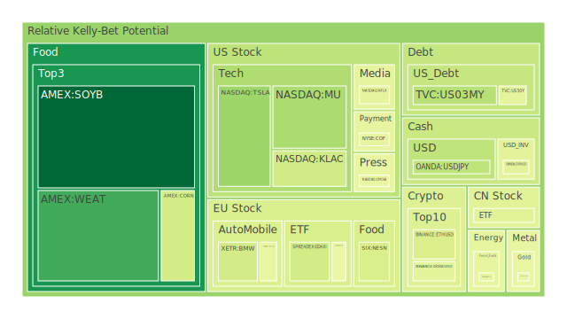
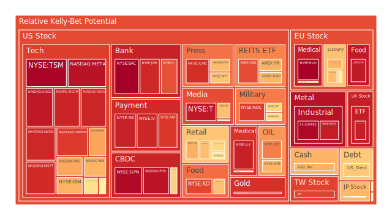
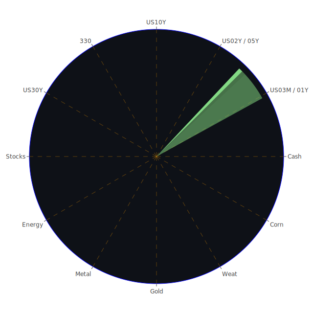

在正式展開分析前，先說明本報告所謂的「三位一體」觀點，以及整體的分析脈絡。所謂三位一體：其一為「空間」層面的審視，強調全球市場多樣性與地域性（如不同國家或地區的大盤指數、不同區域的商品與資產類型），以及國際新聞在不同地區所造成的情緒、政策和經濟互動；其二為「時間」層面的檢視，側重市場的短期震盪與長期趨勢、資產價格的週期變動以及政策與心理預期的轉折時點；其三為「概念」層面的思辨，著重於人性（心理學）、互動（社會學與博弈論）以及稀缺性或流動性（經濟學）如何交織成各種市場行為的深層結構。透過此三重面向的正反合，我們可以嘗試在極度複雜的全球市場亂局中，梳理出關鍵脈絡並發現潛在機會。

同時，新聞事件中的情緒（正面或負面）就像漣漪般傳導，既影響市場預期也可能被市場劇烈波動所放大。近幾日新聞消息普遍顯示出高比例的負面情緒：包括多國政治局勢緊張（如中東地區的軍事衝突、俄羅斯與歐洲的制裁話題、各地的地震與人道危機）、美國正在推進新一輪關稅的討論、日本、韓國等國也面臨債市動盪或短賣禁令到期、企業財報頻繁下調收益指引、美國又出現進一步的封關或關稅威脅等。這些重大議題使得投資人短期情緒偏向悲觀，對多項資產形成壓力。與此同時，FED總資產下降、BTFP與貼現窗口使用量雖不算高，但整體信用環境開始趨向緊縮，種種跡象都暗示市場可能正處於波動放大的初期或中期階段。

然而，也不能忽視若干正面因素：如部分AI與新科技領域的持續發展、部分金屬與大宗商品需求的潛力、以及新興市場有時傳出的樂觀數據。正負參半的訊息交織在一起，形成了複雜的博弈態勢，也反映了市場對於未來通膨與經濟成長的不確定性。

以下將依照報告既定結構，先針對主要投資商品的泡沫風險做闡述，再從宏觀與微觀層面解析經濟傳導路徑，以及資產之間如何互動造成漣漪效應，最後再提出穩健、成長與高風險三大類配置建議及比例。

---

# 投資商品泡沫分析

## 美國國債
美國國債通常視為避險資產，然而現今的美國公債利率曲線呈現倒掛或接近倒掛，10年期與3個月期之間時而出現負利差。根據最新的收益率資料，美國2年期報3.89，美國10年期大約4.21，長短端劇烈波動。新聞面上，多項報導顯示全球對美國債務的疑慮升高，甚至有分析師暗示若繼續貿易保護主義與高額舉債，美國失去「特權地位」的風險提高。歷史上，1970年代與1980年代初期也出現過公債收益率大幅跳升，但當時美國通膨壓力明顯，而今在利率升高與政治面緊張的狀況下，市場對公債的安全性仍有爭議。短期可能因避險需求維持一定購買力，但若地緣政治惡化或聯邦政府再度面臨舉債上限僵局，公債價格也可能面臨震盪。近期泡沫風險指標D1到D30都不算極高，但因長期結構性赤字問題，後續波動不可小覷。

## 美國零售股
零售股在今年初面臨消費力下滑的壓力，多家企業財報或預期下調，引發市場對「消費信心」的疑慮。新聞指出「消費者信心達十二年低點」，而通膨與關稅政策又使得零售股利潤空間承壓。回顧2008年金融海嘯前後，零售股曾一度遭受重創，但若經濟快速反彈時也會有超跌反彈的空間。從資料看，一些零售股的D1與D7風險指數在中高檔區，預示價格波動性依然較高。若關稅持續、就業不振或財政刺激不足，零售股恐將繼續低迷。

## 美國科技股
過去幾年，美國科技巨頭帶動大盤不斷創高，但近期的報告顯示其中若干龍頭企業（例如NVDA、MSFT、META等）的風險指數D1都接近0.9甚至更高，代表短期已有相當泡沫疑慮。新聞也顯示部分科技股在第一季度表現欠佳，且一些大型機構對「高估值」議題提出警告。歷史對照2000年網路泡沫前後，美國科技股在投資人狂熱情緒中往往創出天價，但一旦市場流動性下滑或宏觀環境惡化，就容易大幅回調。雖然AI與新世代科技應用帶來長期機遇，但短期的股價波動仍須提防風險集體釋放。

## 美國房地產指數
數據顯示利率走高，房貸30年固定利率已站上6.65，市場對房地產的需求有壓力。多則新聞談到美國境內地產交易量下滑，加上部分地區存在「高槓桿商業不動產」違約擴大疑慮。歷史上，2008年房地產泡沫破裂曾令全球市場震動，故若再出現估值過度高漲、無力付貸等狀況，房地產類股指數容易出現劇烈回跌。最新的D1、D7指標對美國房地產ETF或REITs顯示在0.6～0.7之間，屬於中高區間，要特別留意商用不動產違約或流動性不足所帶來的風險。

## 加密貨幣
比特幣與ETH等主流加密貨幣，近來受到市場對風險性資產回避的影響，價格雖時有反彈，但波動劇烈。歷史上，加密貨幣的泡沫風險多次被討論，從2017年底到2018年初的崩跌、2021年的高點到2022年的下殺，都顯示該資產類型脆弱且與市場流動性息息相關。根據近期資料，BTC與ETH的短期泡沫指標D1雖非極高，但在0.5上下，顯示有一定中度風險。新聞面不斷提及對區塊鏈與AI的結合預期，但監管的陰影與宏觀資金緊縮也令走勢難以穩定。建議投資人如果介入，應採小部位、高風險偏好、或以期權等方式風險對沖。

## 金／銀／銅
貴金屬往往被視為避險資產。金價近幾個交易日雖有高檔震盪，但消息面提到「金觸及新高，迎來40年來最佳季度」，顯示投資人仍在尋找避險工具。同時，油價與銅價也分別受到地緣政治與供需影響，金油比、金銅比自去年以來已明顯抬升。歷史上，金價在政治動盪或美元走弱時常受資金青睞；銀、銅則更多反映工業需求，若經濟下滑，可能抑制這些金屬上漲空間。風險指數方面，金和銀最近的D1高達0.93上下，顯示短線上投機資金活躍，若短期震盪加劇，不排除急漲急跌。銅也接近0.98的高檔區間，市場對其需求的預期過度樂觀或悲觀，都可能帶來大幅波動。

## 黃豆／小麥／玉米
大宗農產品部分，受到烏俄地區農糧供給與國際貿易環境的不確定影響，加上新聞裡提及的氣候異常或關稅變動，都可能導致期貨價格波動。黃豆、玉米、小麥等的泡沫指數目前大多處於中度至相對低度區間，例如WEAT、CORN與SOYB的D1大致落在0.02～0.4之間，顯示暫時未有極端炒作的情況。但若全球保護主義再度抬頭，各國或祭出糧食出口管制，則供需結構可能迅速惡化，帶動期貨價格上漲。歷史上，農糧危機常與極端天氣和地緣衝突交織，需持續關注。

## 石油／鈾期貨UX
石油價格雖在近期出現波動，但新聞面顯示對俄羅斯油禁令與OPEC供給策略的討論反反覆覆。最新的WTI或Brent雖不是極高，但金油比偏高。就泡沫風險D1而言，近來石油並未達到最警示區域，不過仍有超過0.4～0.5的水準，意味在行情多空爭奪下，隨地緣因素而動。歷史層面看，1970年代石油危機曾造成全球通膨衝擊，也使得能源股大漲大跌。鈾(UX)期貨的特殊性在於核能需求的前景，一旦新能源政策轉向或地緣衝突加劇，鈾價也可能被推高。但資料中顯示UX1! D1在0.51左右，尚未出現狂熱炒作。

## 各國外匯市場
新聞裡反覆提及美元占全球儲備比例雖略增，但總量下滑，同時歐洲、亞洲多國債市波動加大，顯示避險資金與套利資金交互流動。日本10年國債面臨壓力，韓國解除短賣禁令後股債震盪等，皆顯示貨幣市場亦存在不安。以美元對其他貨幣而言，目前仍處於強勢區間，但關稅戰若擴大，美元流動性及全球外匯儲備角色的疑慮加深，可能引發外匯市場聯動大幅波動。過往，如1997年亞洲金融風暴或2008年危機，貨幣貶值往往引發連鎖反應，需要格外留意。

## 各國大盤指數
目前歐美日主要大盤指數，大多面臨企業獲利下修與地緣政治風險，美股四大指數本季表現慘澹，尤其是納斯達克、標普500指數收到關稅與通膨因素的雙重壓力。歐洲方面，英國、德國、法國等主要股市同樣遭遇能源困境與政治不穩；亞洲方面，日本股市一度受日元波動與貨幣寬鬆退出的爭議衝擊，韓國與中國大陸市場則因出口與內需下滑出現階段性回調。台灣0050指數近期數據顯示，風險指數在0.89上下，依然高企。歷史教訓顯示，若主要大國關稅與貿易衝突急遽升級，全球股指有可能同步下挫。

## 美國半導體股
半導體產業被視為科技成長的關鍵支柱，然而近期新聞談到AMD、MU、NVDA等公司，都面臨「庫存調整週期」與「關稅衝擊」可能性。D1資料顯示有些企業接近0.60～0.90不等，似乎泡沫化程度不一，但整體景氣周期下行時，若消費電子不振或地緣衝突干擾供應鏈，半導體股也曾在2000、2008等時期面臨大修正。近期AI概念雖支撐了部分晶片股，但仍可能在宏觀風險下遭遇大幅波動。

## 美國銀行股
全球利率上行，一方面可以讓銀行利差擴大，但另一方面信用風險可能增加，也引發銀行的呆帳與壞帳的擔憂。新聞裡提到「消費者信用卡違約率上升」「商業不動產違約增多」等。歷史上，銀行股對景氣循環的敏感度頗高，一旦經濟收縮或債務風險爆發，銀行股就會下跌。近期如JPM、BAC等風險指數已經在0.90到1.0左右，顯示市場對後續發展相當擔憂。投資銀行股需特別留意潛在信用衝擊所帶來的急跌風險。

## 美國軍工股
軍工產業得益於全球地緣局勢緊張，如RTX、LMT、NOC等往往在衝突加劇之際出現股價上漲。不過，他們的泡沫風險也不容忽視：根據資料顯示，LMT與RTX等D1大約在0.6～0.8之間，有顯著的上行波動空間。歷史上，冷戰時期美國軍工企業長期受政府支持，但也經歷過預算削減時期，股價出現大幅回調。近期若國會對軍費預算產生爭議，或地緣局勢緩和，也可能壓抑軍工股表現。

## 美國電子支付股
電子支付（如V、MA、PYPL、GPN等）在網路與數位經濟蓬勃之際曾長期牛市，但新聞提到對消費者支出下滑、利率走高可能衝擊商業交易量，而且關稅與政治衝突也讓跨國交易或匯款面臨更多不確定性。這些股票近期D1甚至有的高達0.96～0.97，顯示潛在泡沫頗大。若消費者信心持續疲弱或國際貿易萎縮，支付股營收與交易量將受到衝擊。

## 美國藥商股
過去藥商被視為較具防禦性的產業，但新聞裡也提到FDA人事變動、醫療支出政策調整等因素。另外，通膨壓力與保險政策可能影響藥價與需求。部分藥商（如JNJ、MRK、LLY）的D1風險在0.54～0.93之間不等，顯示投資人對業績與未來研發成果有分歧。歷史上，藥廠因專利期或訴訟風險也有可能股價劇烈波動。倘若未來政府政策不利或競爭激烈，該板塊也不排除回檔風險。

## 美國影視股
流媒體戰爭方興未艾，舊有好萊塢模式正面臨轉型。Netflix、Disney、PARA等都在分食市場，但近來市場對他們的付費用戶成長趨勢開始質疑。新聞顯示，部分快速擴張的影視公司甚至虧損嚴重，同時AI浪潮也衝擊傳統製作模式。D1顯示NFLX與DIS在0.44～0.67間，尚未到極端泡沫，但也須提防若用戶增長不及預期，股價可能下修。

## 美國媒體股
媒體業如FOX、NYT、CMCSA、GPN（後者部分涉足媒體支付平台），面臨廣告收入與付費訂閱模式的激烈競爭。新聞報導媒體傳統收益被新興社群平台分流，且廣告商受經濟不確定性影響而縮減預算。FOX與NYT等公司風險指數在0.66～0.90，顯示市場正在消化營收下滑、訂閱成長衰退以及政治壓力等各種因素。若後續貿易保護主義更強，海外市場開拓受阻，恐進一步壓縮媒體股的上行空間。

## 石油防禦股
石油防禦型股票，如XOM、OXY等，收益與油價聯動，但也會受國際政治博弈左右。過去地緣緊張常伴隨油價上揚，利多此類股票。然而，一旦戰爭或制裁引發需求大幅緊縮，或替代能源趨勢迅速加強，也可能使其陷入不利。XOM近期泡沫指標接近0.58～0.64，並非極端，但也顯示價格波動相對高。歷史上，在1970與1980年代油價劇烈波動時，石油股亦經歷大幅漲跌循環。

## 金礦防禦股
金礦股受金價帶動，金價創高時，金礦股往往上漲幅度更大。但在金價下挫時，金礦股也容易加倍回跌。RGLD等金礦相關公司D1處於0.90上下，一旦金價隨著市場避險情緒再度飆高，金礦股或有機會續漲；反之若市場恢復風險偏好，也可能迅速出現獲利了結。歷史經驗顯示，金礦股對金價變動相當敏感，投資者應注意波動風險。

## 歐洲奢侈品股
歐洲奢侈品在全球經濟擴張時期往往增長亮眼，但若遇到逆風，如中國經濟放緩、地緣衝突或全球消費者信心降低，則可能銷售衰退。新聞中提及歐盟內部對於關稅政策或奢侈品稅負增加的討論，若實施則不利出口。RMS、MC、KER等近期泡沫風險指數超過0.65，歷史上奢侈品也曾在歐債危機、金融危機時期遭受重挫。

## 歐洲汽車股
BMW、MBG等歐洲車廠面臨全球關稅與電動車轉型壓力。新聞報導指出日本、韓國、甚至美國本土車廠都在新能源領域展開激烈競爭。過去歐洲車廠在品質與品牌上具競爭力，但若電池技術、關稅壁壘等因素不利，股價亦可能動盪。泡沫風險指標在0.42～0.54不等，短期並不算極端，但若後續銷量不振或關稅擴大，仍要注意回跌風險。

## 歐美食品股
KHC、NESN等食品巨頭，受到通膨成本上漲影響，利潤壓力不小。同時，貿易壁壘可能導致原材料採購成本上揚。儘管食品股常被視為防禦類型，但若經濟疲弱，整體需求下滑亦會損及盈利。KHC與NESN風險指數落在0.62～0.67區間，既不算特別安全，也不至於完全陷入泡沫邊緣。

---

# 宏觀經濟傳導路徑分析

從宏觀面看，美國持續關稅政策，歐洲面臨能源與經濟放緩，亞洲若不能完全擺脫出口依賴模式，整體全球供應鏈可能再度分裂。貨幣方面，FED雖然口頭鷹派，但真正的終端利率走向仍飄忽不定；根據OIS FED Fund Rate最新數字顯示一度到5.33又回落至4.33。市場對聯準會是否還會進一步升息存在分歧，整體信用環境在高息下逐漸收緊，銀行放貸意願降低，企業債務利率上揚，信用卡違約率與商業不動產違約率有擴張趨勢。這些因素均會透過金融市場和實體經濟產生負向回饋，使股市與債市在風險事件下放大波動。

新聞裡提到大範圍的地震災害、戰爭衝突、地緣政治緊張與政府關稅強硬態度，綜合形成了投資人高度警戒的狀況。就博弈論的角度，各國政府都希望保護自身產業並穩定就業，但此舉往往造成對手國也採取反制，導致世界貿易量與經濟成長受阻。當整體經濟減速或停滯，失業率升高、消費信心不足，最終會回頭打擊自身。從心理學角度看，投資人在市場不確定時容易過度恐慌或急於避險，變動加劇。

---

# 微觀經濟傳導路徑分析

在個別企業層面，利率上升導致融資成本增加，特別是高槓桿的科技公司、初創企業以及半導體、房地產開發商都會受到衝擊。同時關稅不斷變動意味著供應鏈的不確定：原本跨境佈局的企業必須承擔更高的關稅成本或重新布局新產能地點。各種要素成本上升，可能造成企業獲利能力削弱。在心理學層面，消費者一旦預期經濟不景氣，往往減少不必要支出，導致零售、服務、旅遊等行業進一步承壓。最終又影響企業裁員，繼而影響就業並惡化信用卡與消費信貸違約率。如此循環在歷史上多次出現，2008年也有類似現象。

---

# 資產類別間傳導路徑分析

透過空間、時間與概念三位一體互相聯動，各資產類別之間的漣漪效應可以如下簡要歸納：

1. **利率變動與債市**：美國公債收益率攀升→銀行股與房地產股的融資成本提升→企業債務風險擴大→整體股票市場避險情緒升溫→貴金屬價格受青睞。
2. **國際貿易關稅與外匯市場**：關稅升高→國際供應鏈割裂→各國GDP成長下滑→全球資金避險轉向美元或黃金→新興市場貨幣承壓→大宗商品與農產品需求萎縮或價格波動。
3. **地緣政治風險與軍工、能源股**：戰爭或軍事衝突升溫→軍工股與石油公司股價短期受益→若衝突導致經濟大幅衰退，整體需求降溫→能源股亦可能回跌→投資者再次轉向防禦型或固定收益資產。
4. **科技股與市場風險偏好**：市場流動性充足時，資金湧入科技與成長股→一旦利率走高或金融信心驟降→高估值科技股先行回調→衝擊整體股指→人們轉投避險板塊。
5. **原物料與大宗商品傳導**：若全球衝突影響主要產區(如農糧、金屬產出地)，供給端收縮→價格上漲→製造業或消費終端成本上升→進一步打擊消費意願或刺激通膨。

在這些傳導路徑中，任何一環若被重大新聞或政策激化，就能引發連鎖反應。從博弈論看，市場參與者彼此猜測他人行為，如果大多數人預期風險提升，資金就會向避險資產集中，導致風險資產瞬間下挫。反之若出現寬鬆訊號或地緣緩和，也可能帶來急彈行情。

---

# 投資建議

在充滿不確定性的當下，適度分散、重視風險對沖顯得尤為重要。若要進行「風險對沖的各種投資組合機會」，理想情況是不同資產間相關係數能拉到-0.5左右，甚至在波動時間點上互不同步，彼此角度接近120度。以下給出三種配置方向示例，各自比例合計為100%，並從穩健、成長、高風險三類著手，盡量融合上文所提到的風險：

1. **穩健型 (合計100%)**  
   - (1) 部位A：美國短期國債或投資級公司債（約50%）。因其波動相對較低，在市場震盪時能提供一定程度避險。儘管公債泡沫風險不是全無，但短天期受價格波動影響較小。  
   - (2) 部位B：黃金實體或金礦股(約30%)。由於多重地緣事件可能推升金價，但需留意金礦股波動性較大，因此可混合金礦股與現貨黃金ETF，以分散內部風險。  
   - (3) 部位C：高股息防禦型股票(約20%)。選擇相對穩定的必需消費或公用事業板塊，目的在於獲取相對穩健的股息收益，並以較低波動度面對市場下行風險。

2. **成長型 (合計100%)**  
   - (1) 部位A：科技龍頭與半導體股(約40%)。即使短期可能大幅震盪，長期AI與雲端需求仍被看好，但須挑選財務體質好、估值相對合理且研發實力雄厚的龍頭。如MU、NVDA、AMD等，留意其已累積一定漲幅，波動可觀。  
   - (2) 部位B：新興市場指數或ETF(約30%)。在貿易戰陰霾中，部分新興市場若能因內需與產業升級逆勢成長，長期回報可觀。歷史上若全球景氣回溫，新興市場往往彈性較高。  
   - (3) 部位C：軍工與能源轉型股(約30%)。地緣風險高企下，軍工股短期仍可能有支撐；能源轉型有長期需求，可佈局部份新能源相關標的以平衡傳統石油。此配置波動相對高，但成長潛力亦大。

3. **高風險型 (合計100%)**  
   - (1) 部位A：加密貨幣核心標的(約40%)。含BTC、ETH等主流幣種，可能因市場流動性與投機熱錢而短線飆漲，也可能暴跌。此配置非常高風險，僅適合能承擔巨大波動的投資人。  
   - (2) 部位B：個別新創概念股或高成長領域(約30%)。包括AI相關小型股或具備特定技術壁壘的生技、電動車上下游等，但要謹慎篩選財務穩健度。  
   - (3) 部位C：槓桿ETF或期權策略(約30%)。意在利用波動放大收益，但同樣放大虧損風險，需有嚴謹的停損機制與動態調整能力。

上述三種配置示例僅供參考，每一類內部也可再做微調，以達到資產間相關性較低的效果。比如，若想對沖科技股風險，可在組合中配置一定黃金或原油空單；若擔心農產品波動過大，可透過選擇權避險等。核心觀念在於從不同資產間的負相關性或時序分散著手，避免單一集中風險。

---

# 風險提示

投資有風險，市場總是充滿不確定性。面對全球關稅、地緣政治衝突、利率上行、通膨壓力、企業財報不及預期等複雜變數，任何一種資產都可能遭遇劇烈波動。本報告所提建議僅為客觀觀察與分析，投資者應根據自身的資金狀況、風險承受能力及投資目標，獨立做出最終決策。

同時，不要忽視可能出現的泡沫跡象。根據上文所述之泡沫風險指標，部分資產（例如科技巨頭、加密貨幣、軍工股、支付股等）已在相對高風險區間，容易受到任何負面新聞或政策變化衝擊。就算是傳統防禦類型資產，如黃金與房地產，也不代表絕對安全，一旦市場情緒反轉或政策面出現顯著調整，價格同樣可能劇烈震盪。

歷史上，我們在網路泡沫(2000)、金融危機(2008)乃至歐債危機(2011)都看過資產價格短時間內高速上衝又迅速崩落的情景。如今在疫情之後的全球經濟重置期，通膨、地緣對抗、科技競賽與保護主義抬頭，使得市場更難預測。空間(Spatial)層面上，各國或各地區的衝擊方式不盡相同，但在全球化下彼此影響；時間(Temporal)層面上，短線波動與長期趨勢常常背離，投資者易在錯誤時點進出；概念(Conceptional)層面上，人性的恐懼與貪婪、博弈論中的策略互動、社會情緒的渲染，皆可能在關鍵事件後集中爆發。

因此，面對市場的不確定，要保持謹慎，並隨時注意新聞事件與宏觀政策走向。正如本文三位一體「正反合」所揭示：正面因素（技術進步、政策刺激）與負面因素（地緣衝突、金融收緊）相互搏鬥，最終如何融合、反轉或超越，仍有待時間與人性共構的結果。投資者宜秉持多元分散、動態調整、嚴控風險的原則，在機會與風險共存的市場中保持靈活應對。

 
Daily Buy Map:

 
Daily Sell Map:

 
Daily Radar Chart:

 
