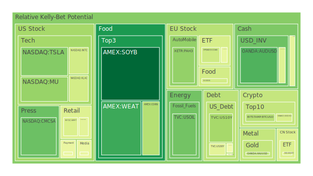
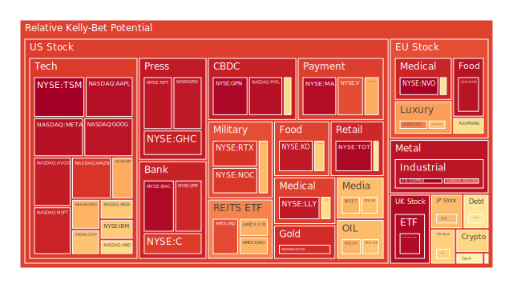
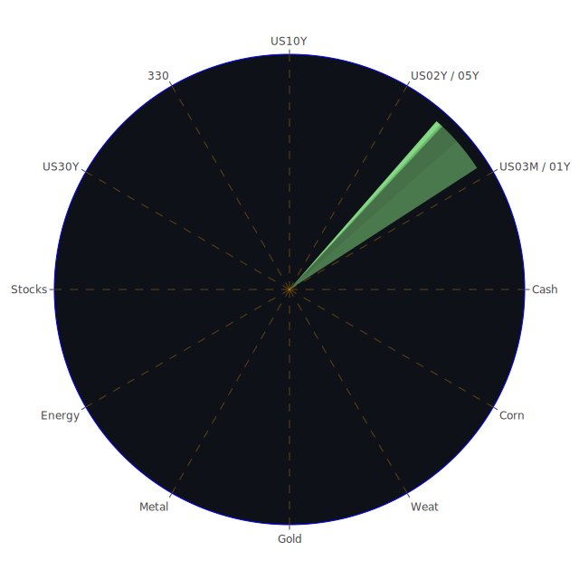

# 投資商品泡沫分析

在此部分，我們先以經濟學、社會學、心理學、博弈論四個角度，嘗試從空間、時間、概念三位一體的方式，逐一概覽與市場相關的投資標的，並探討可能的正反合演變。

## 美國國債
近期數據顯示，美國2年期、5年期、10年期與30年期公債殖利率均處於走高後回落的狀態。新聞面上，美國政府持續受到高債務占GDP比重的壓力，根據最新報導「Soaring US debt may start to overwhelm America’s ‘exorbitant privilege’」，透露市場對長期國債的吸納能力仍存在疑慮。  
- **Spatial**：在全球資金流動的空間維度上，美國國債曾被視為避險資金的主要收容所，但當前多國可能因政治或地緣因素減少對美債的持有，使部分流動性出現轉向。  
- **Temporal**：近期新聞指出「Trump即將啟動新一輪關稅措施」，市場在短期內擔憂可能引發經濟波動，導致資金回到國債避險；然而長期看，負債水準、通膨壓力和美國聯準會縮表趨勢，仍使美國國債價格承壓，殖利率可能階段性波動。  
- **Conceptional**：從經濟學的政府財政可持續理論，到社會心理上對政府信用的信任度，再到博弈論角度，美國與外國主要央行之間的互動，都決定了美國國債的需求。當前聯準會縮表與貨幣政策尚未完全鬆口，顯示對未來可能存在波動。  
- **正反合**：正面論點認為美國國債仍是長期避險資產；反面則指出高負債加上利率與資金流出風險；合則是投資人需要動態調整部位，而非單純過度集中於長天期債券。

## 美國零售股
以Walmart（WMT）、Target（TGT）、Costco（COST）等為代表的零售類股，受到新聞面「Walmart continues to push Chinese suppliers to cut prices」等消息影響，顯示供應鏈壓力與成本考量持續升高。加之近期多份報導指向「Companies are slashing earnings forecasts as consumer confidence reaches 12-year low」，零售消費前景並不樂觀。  
- **Spatial**：零售股在不同地區的渠道布局，會受到區域性消費力、物流成本與國際局勢的影響。中國供應鏈如果遭遇美國關稅壓力，零售商的利潤空間將進一步壓縮。  
- **Temporal**：新聞提及「Stocks close out their worst quarter since 2022 amid tariff uncertainty」，顯示美國零售商可能遭遇到新一輪的業績下修。短期股價易受財報衝擊，中長期若通膨放緩，零售利潤有機會改善，但仍取決於經濟復甦的穩定度。  
- **Conceptional**：經濟學角度可看產業供給鏈的成本轉嫁；社會學則關注消費者信心與收入水準；心理學層面上，消費者對物價敏感度提升；博弈論或許體現在供應商、零售商與政府之間的關稅與成本談判。  
- **正反合**：正面看法是假使通膨速度趨緩，零售商可於未來恢復利潤率；反面看法是持續的供應鏈與關稅問題，令毛利率受壓迫；合則建議投資人應審視各家零售商對通膨、供應鏈困境的管控能力。

## 美國科技股
美國科技股包含巨頭AAPL、MSFT、GOOG、META，以及半導體股如NVDA、AMD、INTC、QCOM等。新聞面顯示「Why the Magnificent Seven Stocks Just Had Their Worst Month and Quarter on Record」，也有「OpenAI to raise $40 billion to boost AI efforts」等消息。在泡沫評估方面，部分科技股的指標性泡沫分數較高。  
- **Spatial**：科技股生態系統遍及全球供應鏈，地緣衝突與關稅壁壘對硬體製造、雲端資料中心的設備採購成本均有影響。  
- **Temporal**：隨著AI話題持續發燒，投資人對未來科技創新的預期十分高漲。然而股價已於前期大幅上漲，若宏觀經濟進一步惡化，獲利增長放緩，市場情緒易出現顯著波動。歷史上如2000年科網泡沫曾帶來慘痛教訓，提醒投資人需留意過度炒作風險。  
- **Conceptional**：在經濟與博弈論層面，科技巨頭之間的競合與對市場壟斷度的談判是關鍵；心理學方面，散戶往往對明星科技股抱有「光環效應」，容易忽視實際本益比；社會學則體現在大眾對AI、半導體領域的熱切追捧乃至於對工作形態變化的擔憂。  
- **正反合**：正面認為創新驅動下的潛在收益；反面強調部分龍頭已估值偏高，且對宏觀利率敏感；合則建議中長期看好AI及高效能運算產業，但需留意短期震盪與市場過度追捧可能帶來的修正風險。

## 美國房地產指數
美國房地產指數可透過ETF如VNQ、IYR，或全球型不動產ETF RWO等作為觀察。近期，美國固定抵押30年房貸利率自6.87下滑到6.65，此數據與前一年3.13相比仍算高，對房屋需求有抑制作用。也有報導指「US Bank Total Deposits is at relatively high level」，一方面顯示資金尚未大規模外流，但商業不動產的違約風險日漸引發注意。  
- **Spatial**：在美國都會區與二三線城市之間，住宅與商業地產需求與庫存情形各異。若國際資金撤出，美國房地產進一步走跌的可能性也存在。  
- **Temporal**：2022～2023年美國房地產經歷了相對高點後的降溫，現階段利率仍不算低，消費者購買力有限，短期需求維持低迷；長期若利率趨穩，可能帶來部分反彈，但仍須留意商用不動產的延遲風險，尤其在企業預算縮減及遠端工作趨勢下，辦公室空置率居高不下。  
- **Conceptional**：經濟學理論顯示利率對於房地產需求影響巨大；社會學層面則關注人們對都市人口流動、遠距辦公的接受度；心理上，若經濟前景不佳，潛在買家容易延期購買；博弈論或許存在銀行、建商、投資人之間對延遲拋售或持有策略的博弈。  
- **正反合**：正向觀點認為供給有限與美國都市化趨勢中長期仍可支撐價格；負面觀點強調高利率與銀行緊縮貸款可能進一步壓抑需求；綜合而言，投資人需審慎看待利率走勢與銀行體系風險，謹慎配置房地產相關標的。

## 加密貨幣
加密貨幣如BTC、ETH、DOGE等，價格波動在近年極為劇烈。新聞顯示「Bitcoin一度漲至8萬美元以上」，泡沫分數在某些時段顯示偏高，但也有技術性回調。  
- **Spatial**：全球許多地區對加密貨幣的監管態度漸趨嚴格，尤其在反洗錢、防詐騙與金融穩定考量下，監管政策對各國的影響差異很大。  
- **Temporal**：歷史上加密市場多次出現暴漲暴跌，短期若宏觀經濟與股市震盪，加密貨幣有時被視為高Beta資產而同步波動；長期仍需看區塊鏈應用能否真正落地，以及投資人對數位資產共識的維持。  
- **Conceptional**：經濟學上，加密貨幣缺乏傳統現金流估值依據；從社會層面看，加密社群凝聚力強，但傳統金融投資者仍抱持懷疑；心理學上，投資人對「一夜致富」或「避險替代品」的幻想常導致泡沫化；博弈論上，挖礦者、交易者與監管機構的立場互相牽制。  
- **正反合**：正面是其區塊鏈潛力及分散性；反面則是市場過度投機與監管風險；合則建議僅在整體投資配置中佔小比重，適度觀察基本面發展或穩定幣機制等。

## 金/銀/銅
黃金、白銀與銅在市場上既是避險商品，也是產業金屬。新聞提及「Gold inches up on safe-haven demand ahead of US reciprocal tariffs」，同時，銅價仍受整體全球製造景氣變化的影響。  
- **Spatial**：在不同地區的供需結構中，地緣政治對黃金的需求常引發全球資金避險；白銀在科技及醫療領域也有使用；銅則與全球製造業與基礎建設需求掛鉤，若中國或美國基建計畫加碼，銅價可能受支撐。  
- **Temporal**：歷史上，避險需求常在金融市場動盪時推升金銀價格；銅則跟隨經濟周期波動。短期內，若「Trump關稅大棒」落實，產業金屬需求或受壓；長期看全球綠能轉型對銅的需求維持增長趨勢。  
- **Conceptional**：經濟學多透過供需曲線與通膨預期來解釋貴金屬與工業金屬價格；心理層面，投資人對「黃金保值」的信念深植；社會學考量國際貿易結構；博弈論則在各國貨幣與資源爭奪。  
- **正反合**：正面認為金銀因避險需求可能在地緣衝突下被推高；反面強調若全球經濟放緩，銅需求減少，金銀若遇美元轉強也可能被打壓；綜合看來，貴金屬可適度對沖，銅則中長期看多但短期易震盪。

## 黃豆 / 小麥 / 玉米
對應ETF如SOYB、WEAT、CORN，分別對應大豆、小麥、玉米。新聞面看不多，但美國農業出口及天候因素都會影響價格。從近期資料可見大豆的泡沫風險指數相對較低，小麥價格則受到地緣政治（如俄烏衝突）干擾，玉米供應則與生質能政策相關。  
- **Spatial**：在地緣分布上，若主要糧食出口國遇到氣候災害或政治衝突，價格會立刻受到衝擊。  
- **Temporal**：這些穀物商品往往有季節性，收穫期、颶風或天氣因素都會帶來短期行情。歷史上農產品價格也曾在緊張局勢下飆升後快速回落。  
- **Conceptional**：經濟學上關注期貨市場與供需預測；心理學上若市場擔心供應不足或惡性通膨，容易搶購期貨；社會學還要考慮消費國為了糧食安全積極囤糧；博弈論在各大農業出口國之間的關稅與補貼政策。  
- **正反合**：正面分析是農產品有剛性需求；負面分析是市場周期性與國際政策干預；合則建議投資人若要涉足農產品期貨或ETF，需兼顧天氣風險與政策走向。

## 石油 / 鈾期貨
石油與鈾同為能源相關標的。新聞顯示，「Oil Rally Wavers as Focus Turns to Impending US Tariff Measures」，暗示石油需求有受到貿易摩擦的風險衝擊；鈾期貨則因核能需求及地緣政治敏感度高而引發關注。  
- **Spatial**：主要油國分布在中東與俄羅斯，政治與制裁常牽動供給面；鈾礦則相對集中在少數國家，儲量與開採合約更敏感。  
- **Temporal**：歷史上，石油價格曾在衝突爆發或OPEC減產時急速攀升，也在經濟衰退需求下滑時暴跌；鈾價格則因核電政策週期而波動，若各國推動減碳計畫，核能需求或將上揚。  
- **Conceptional**：經濟學與社會學皆強調能源對整體經濟之影響；心理上，一旦市場對衝突擔憂升溫，投機資金就會湧入；博弈論方面，能源出口國之間的協調或對立都可能改變價格走勢。  
- **正反合**：正面是長期能源需求不斷增長；反面是替代能源和經濟衰退風險；合則建議對石油或核能概念股保持中性偏多，但須結合時局與產量政策來動態調整。

## 各國外匯市場
常見貨幣對包括EURUSD、GBPUSD、AUDUSD、USDJPY等。新聞端顯示不少地緣政治與關稅議題，美元時而因避險買盤走強，時而因美國經濟疑慮走弱。  
- **Spatial**：各國央行的利率政策分歧與經濟復甦步調不同，使得外匯市場出現分化。部分貨幣如日圓因日本央行政策變動，波動加劇。  
- **Temporal**：短期內，若「Trump關稅大棒」造成出口國貨幣貶值壓力或資金轉向美元，引發外匯市場一波震盪；長期仍要關注各國實際經濟表現與利差。歷史上金融危機期間，外匯市場常見劇烈波動。  
- **Conceptional**：經濟學強調購買力平價與利率平價；心理學層面，投資人對地緣與政治風險的恐懼常驅動避險貨幣交易；社會學則關心區域經濟整合與各國貿易互動；博弈論也出現在各國央行之間的利率政策協調或競爭。  
- **正反合**：正面觀點看好在升息周期中具備良好經濟體質的貨幣；反面示警若局勢失控或出現全球經濟放緩，避險需求反而推升美元；合則投資人宜多角度分散，留意貨幣對之間的相關性。

## 各國大盤指數
例如SSE 000300（中國市場）、JPN225（日經指數）、FCHI（法國CAC 40）、GDAXI（德國DAX）、FTSE（英國），乃至於美國NDX（納斯達克100）等。新聞顯示，歐洲與亞洲市場常因中美關稅爭端以及本身政治事件而震盪。  
- **Spatial**：各指數代表不同區域經濟，地緣衝突或關稅衝突對歐洲出口、亞洲製造業等影響不一。  
- **Temporal**：近一年以來，多數股市走勢分化，科技股集中的市場（如美國）先前漲幅較大，但也容易在利率或泡沫風險下先回調。亞洲市場若有政策刺激或AI、半導體需求回溫，則可能呈區間震盪中尋找向上機會。  
- **Conceptional**：經濟學面著重於各區域GDP增長、企業盈餘；社會學關注就業與消費結構；心理學在國際資金的情緒流動；博弈論可看各國政府對產業的補貼競賽與匯率政策。  
- **正反合**：正面是全球化下總有輪動機會；負面是保護主義及地緣衝突仍壓抑整體；合則建議分散布局全球，但需嚴控區域性風險。

## 美國半導體股
包括AMD、INTC、NVDA、MU、KLAC、QCOM、AVGO、AMAT等。新聞中提及「AMD CEO表示Trump關稅可能有短期衝擊」，亦有看多聲音，如AI加速帶來對晶片需求的飆升，然而市場已對此題材定價顯著。  
- **Spatial**：半導體製造重點地域在亞洲與美國等地，若有供應鏈或地緣衝突，將導致晶圓代工或設備供應斷層。  
- **Temporal**：短期，美中科技對抗、關稅與中間財供應限制，都牽動企業毛利；長期，車用半導體、AI、高速運算需求強勁，半導體仍有成長空間。歷史上的科技循環也常在景氣谷底後大漲，但頂峰泡沫化風險也需要警惕。  
- **Conceptional**：經濟學上半導體產業屬高研發投入、高邊際利潤；心理學面，散戶對AI芯片高度興奮；博弈論體現在美國、台灣、韓國與中國的技術與專利競賽。  
- **正反合**：正面是長期需求旺盛；反面是短期估值昂貴、關稅限制可能抑制出貨；合則建議使用分批布局，留意輪動節奏，特別防範過度炒作與供應瓶頸。

## 美國銀行股
如JPM、BAC、C、COF、AXP等。近期「US Bank Total Deposits is at relatively high level」，但新聞多提到消費者信用卡違約率逐漸上升，商業不動產壓力亦令銀行資產品質下降風險升高。  
- **Spatial**：美國大型銀行的跨國業務廣泛，全球景氣衰退或地緣衝突都可能影響其資本狀況。  
- **Temporal**：歷史上銀行股在利率升息初期往往利潤增加，但若緊縮過度或經濟下行，貸款違約率可能飆升。近期消費者與商用貸款都有升高的逾期跡象。  
- **Conceptional**：經濟學與博弈論皆關注銀行的槓桿與風險管理；心理層面當出現恐慌時，銀行最怕擠兌事件；社會學上，銀行與企業及民眾的信任鏈對整個金融系統穩定至關重要。  
- **正反合**：正面在於銀行若能管控風險，升息反而帶來利差收益；反面是資產質量可能劣化；綜合來看，投資人應衡量存款流動與放款組合質量，選擇資本實力充足者。

## 美國軍工股
包含LMT、NOC、RTX等。隨著地緣緊張不斷升溫，軍工股的預期訂單與收益增加。然而，若未來政治壓力與預算風向改變，亦可能導致股價震盪。  
- **Spatial**：美國軍工企業國際客戶遍布盟友陣營，但一些中立國或地緣對立國也可能選擇歐洲或俄製武器，導致供需複雜。  
- **Temporal**：歷史上，軍工股常在衝突加劇時上漲，衝突平息則出現獲利了結。若未來衝突趨緩或美國預算重新分配，也會造成資金流出。  
- **Conceptional**：經濟學中軍工預算與政府支出關聯；社會學層面對戰爭或軍事行動的支持度影響政策；心理上，投資人常將其視為「防禦型」產業；博弈論則強調國防訂單在國際權力格局中如何談判。  
- **正反合**：正面看法認為軍事需求大增；反面認為軍費若因內部債務或民生壓力削減，訂單將不確定；合則需要隨時關注預算法案與全球衝突走向。

## 美國電子支付股
涵蓋PYPL、GPN、V、MA等。受電商發展及移動支付風潮推動，而經濟景氣影響交易量成長率。新聞「Wells Fargo sees 5 reasons investors should brace for Tesla stock to drop another 50%」與電子支付無直接關連，但市場投資氛圍相似。  
- **Spatial**：在全球推廣電子支付時，新興市場增長潛力大，但也面臨當地政策與本土支付業者競爭。  
- **Temporal**：疫情後電子商務持續成長，但增速趨緩。利率與匯率波動可能影響跨境支付營收。歷史上支付股常擁有較穩定增長，但對交易量敏感。  
- **Conceptional**：經濟學上是持續擴大的交易使用場景；社會學則觀察大眾對無現金生活模式的接受度；心理學層面關乎用戶對支付安全與便利性的依賴；博弈論在各大國際支付巨頭之間對市場份額的爭奪。  
- **正反合**：正面可期電子支付深入人們生活；反面是國際監管與詐騙風險；綜合而言，行業中長期趨勢不變，但短期股價或因整體科技股表現而出現波動。

## 美國藥商股
像MRK、JNJ、LLY等，近期新聞如「Watch These Johnson & Johnson Levels as Stock Plunges After Judge Rejects Talc Settlement」，顯示訴訟或監管風險對制藥巨頭股價影響重大。  
- **Spatial**：醫藥企業在全球開展業務，但藥價與專利保護在不同國家規範差異大，市場集中度亦高。  
- **Temporal**：重大專利到期、研發新藥獲批或失敗皆可使股價短期巨幅波動；長期看人口老化與健康需求提升，醫藥產業仍具支撐力。  
- **Conceptional**：經濟學強調研發與行銷成本；社會學關注民眾對醫藥公司信任度與保險制度；心理學層面看病患對新療法的接受；博弈論則見於各藥廠對藥價、專利互相壓制的競合。  
- **正反合**：正面在於穩定成長的醫藥需求；反面為專利訴訟與審批風險；合則建議關注研發管線與法律風險，配置時適度分散。

## 美國影視股
如NFLX、PARA、DIS等。新聞顯示「Netflix先前訂戶成長趨緩，引發股價震盪」，「PARA對流媒體內容投資壓力大」。整體影視股一方面受串流媒體競爭激烈衝擊，另一方面亦期待海外市場開拓。  
- **Spatial**：北美市場競爭最激烈，歐洲、亞洲與拉美市場尚有增長空間，但當地營運模式與消費習慣不同。  
- **Temporal**：疫情期間串流高速成長，後疫情時代成長趨緩且競爭者日增。歷史上傳統有線電視走下坡，流媒體取而代之的趨勢已成定局，但公司之間的勝負難料。  
- **Conceptional**：經濟學上考慮訂戶規模與成本投入的平衡；社會學則關注文化差異與內容審核；心理學層面，影視內容是否能持續吸引受眾；博弈論在各大平台為爭奪內容版權與市場份額。  
- **正反合**：正面認為串流仍在全球擴張；反面是競爭與成本壓力；合則表示投資者需審視各家的內容布局與財務健康度。

## 美國媒體股
如FOX、NYT、CMCSA等，媒體環境正面臨數位化轉型，廣告收益模式與訂閱模式間的轉換，或面對政治與社會議題衝擊，皆令媒體股呈現高不確定性。  
- **Spatial**：國際化媒體集團在全球拓展，但政治敏感度也更高。  
- **Temporal**：報紙與電視等傳統媒體衰退，大多轉型至線上平台；歷史上看，媒體股會跟隨廣告投放的周期而波動。  
- **Conceptional**：經濟學分析廣告市場規模；社會學與心理學面則考慮受眾閱聽習慣；博弈論或見於媒體集團對議題設定的競爭。  
- **正反合**：正面在於成功轉型者可維持穩定訂閱收入；反面是不斷萎縮的紙本或傳統電視市場；綜合觀之，布局需挑選擁有多元平台與強勢內容者。

## 石油防禦股
如OXY、XOM等。石油大廠在油價走升時獲益豐厚，但也面臨替代能源興起與政治監管壓力。近期報導「Trump Threatens Russia Oil Penalties」，若落實制裁，供應端大幅受干擾，石油價格不免波動。  
- **Spatial**：大型油企佈局全球，產地政治風險難以避免。  
- **Temporal**：油價高時盈餘暴增，低時則削減投資，歷史上多次油價週期給石油股帶來巨大波動。  
- **Conceptional**：經濟學強調國際能源供需，社會學日益重視綠能轉型壓力，心理上投資人對短期資本回報仍存期待，博弈論則在油企與OPEC、主要輸油國等之間協調。  
- **正反合**：正面是能源消費短期仍離不開化石燃料；反面是長期碳排放法規和替代能源帶來衝擊；合則投資人宜在價格相對低點或市場恐慌時布局，設置停利機制。

## 金礦防禦股
代表如RGLD等。金礦股通常與金價同步，兼具一定對沖功能。新聞「Gold rises to new high on tariff, inflation worries with bullish trend 'firmly intact'」，亦在暗示金礦公司獲利可能增加，但也須評估開採成本。  
- **Spatial**：礦區所在地的政局與稅務穩定度是關鍵。  
- **Temporal**：金價在不確定時期常受追捧，但若經濟復甦強勁、利率走高，黃金需求會被壓抑。歷史上金礦公司在黃金牛市中股價成長速度可超過金價，但在熊市跌幅也更重。  
- **Conceptional**：經濟學看金價對產業獲利的槓桿；心理學中投資人對金價預期左右金礦需求；博弈論體現各國對金儲備策略的競合。  
- **正反合**：正面是通膨與地緣衝突下的保值需求；反面是開採風險與金價下修時的利潤大幅縮減；合則投資者可在對沖組合中納入一部分金礦股，但需嚴控部位。

## 歐洲奢侈品股
典型如LVMH集團旗下的MC、Hermès的RMS、Kering的KER等。近期新聞顯示歐美市場在通膨壓力下，對奢侈品需求仍相對抗跌，但也要注意中國與美國消費者需求波動。  
- **Spatial**：奢侈品品牌營收分布在歐洲本土、中國、美國與中東等地，任何一地消費力顯著增減都將影響業績。  
- **Temporal**：短期若經濟面臨衰退，奢侈品需求可能先收縮；歷史上觀察奢侈品在經濟復甦後又會有強力回彈。  
- **Conceptional**：經濟學上奢侈品需求具備高所得彈性；社會學層面奢侈品象徵地位地；心理學層面在消費心理的炫耀性消費；博弈論中則較少涉及，除非品牌之間爭奪限量款或經典款客群。  
- **正反合**：正面認為富裕族群支出相對穩定；反面是匯率波動與宏觀衰退衝擊；合則奢侈品股長期表現優於一般消費品，但需留意區域性衝擊。

## 歐洲汽車股
如BMW、MBG（賓士）等。新聞亦有提到「Europe braces for tariff impact」，顯示若美國和其他地區之間關稅加劇，歐洲車廠恐被波及。  
- **Spatial**：歐洲車企的主要銷售市場在全球，尤其中國與美國是大客戶，關稅或政治因素都會影響出口。  
- **Temporal**：疫情後產業復甦，加之電動車轉型，短期資本支出大，獲利壓力明顯。長期可能在政策支持與技術研發下迎來成長。  
- **Conceptional**：經濟學強調產業競爭與成本結構；社會學關注消費者對電動化認可度；心理層面品牌偏好深遠；博弈論體現在歐美關稅談判與車廠之間的技術專利競賽。  
- **正反合**：正面是歐系車在全球仍具品牌形象；反面是關稅與電動車競賽壓力；合則可適度關注龍頭車企，但需避開貿易衝突高風險時段。

## 歐美食品股
包括歐洲NESN，或美國KHC等，代表加工食品、飲料等產業。根據新聞，若經濟下行，日用品與食品需求相對穩定，但匯率和原物料成本影響不容忽視。  
- **Spatial**：食品生產與銷售遍布全球，各地營運成本、關稅與運輸影響利潤。  
- **Temporal**：歷史上食品類較具防禦性，但通膨或運費上漲都可能壓縮毛利。短期景氣若疲軟，食品需求相對不致大減，但長期競爭激烈或健康趨勢轉向不同品類。  
- **Conceptional**：經濟學面看原物料價格波動；社會學則關注消費習慣與健康意識；心理學在品牌忠誠度；博弈論則可能在大型食品集團合併或價格戰。  
- **正反合**：正面是必需品需求穩定，適合防禦；反面是利潤率有限且若原料大漲會侵蝕收益；合則配置比例可適度，但需關注原料風險與市場飽和度。

---

# 宏觀經濟傳導路徑分析
從宏觀角度，以下三位一體框架可概括當前市場各種影響途徑：

1. **Spatial**：美中、歐中、美歐等區域關稅與政治互動加劇，中東與俄烏局勢牽動能源供給，多國的貨幣政策各異，使資金在全球範圍內重新配置。
2. **Temporal**：短期內，關稅政策與政治突發事件帶來震盪；中期看聯準會與其他央行的利率動向；長期則是科技結構調整、人口老化與環境議題對整體需求的影響。
3. **Conceptional**：經濟面關稅與利率、財政政策、貨幣供給量的互動；社會層面包括地緣衝突對民眾心理與就業的影響；心理學角度則解釋市場恐慌與樂觀交替；博弈論方面，各國在貿易與貨幣上互有算計，難以迅速達成協調。

綜合來看，宏觀層面的風險主要是政治對立與保護主義升溫，造成全球貿易降溫、供應鏈變動、金融市場動盪。

---

# 微觀經濟傳導路徑分析
從企業及產業鏈切入：

1. **Spatial**：企業供應鏈多國佈局，一旦某一環節受關稅或政治動盪影響，整個生產成本與周轉速度就受干擾。
2. **Temporal**：短期財報可能因原物料或人力成本上漲而受壓，若需求端萎縮，營收也下滑；長期來看，若產業能適應新局勢或另闢市場，終能走出谷底。
3. **Conceptional**：企業在經濟學上透過規模經濟分攤成本；社會心理層面上要維持品牌忠誠度；博弈論則常見企業間協同或競爭，包括與政府的談判。

整體而言，大多企業都需面對供應鏈與市場需求的雙重不確定，加上勞動力成本變化與科技研發投入，微觀層面可見獲利的分化。

---

# 資產類別間傳導路徑分析
1. **股債關係**：當國債殖利率上升，部分資金從股市流向債市；相反，若利率趨緩，成長型股票再度吸金。
2. **原物料與外匯**：石油、金屬價格飆升時，出口型國家貨幣可能升值；同時也可能推升通膨引發利率調整。
3. **股市與房市**：若金融市場恐慌，資金或轉而投資實體資產；反之，房市若受利率壓制，資金便回到股市或短期避險工具。
4. **避險資產之間**：黃金、日圓、美國國債在市場恐慌時往往同向波動，但若FED緊縮過猛，美國國債價格又可能走弱。
5. **加密貨幣與科技股**：有時呈現同向波動（高Beta特性），投機資金盛行時漲勢互相推動；反之，在經濟緊縮或監管打擊下都可能同步大跌。

這些傳導路徑，如同漣漪效應，可能因某一突發新聞或政治宣示而被放大或縮小，投資人宜保持敏銳度。

---

# 投資建議

基於前述三位一體（Spatial、Temporal、Conceptional）以及正反合分析，我們試圖找出相位分散度高，相關係數較低（希望達到-0.5左右）的投資組合，藉此進行風險對沖。以下提供穩健、成長與高風險三種配置範例，供參考（比例三大類合計為100%）：

1. **穩健型（50%）**  
   - （1）美國國債（20%）：主要佈局在中期國債，避險與收益兼具。雖然長期仍有美國高債務風險，但短期避險功能仍在。  
   - （2）黃金相關標的（15%）：面對地緣衝突與通膨不確定，黃金或金礦股（僅少量）可作為對沖；不宜過度集中在金礦股，以免營運風險。  
   - （3）歐美食品股（15%）：穩定的食品需求具備防禦屬性，即使市場波動也相對抗跌，可分散於NESN、KHC等。

2. **成長型（30%）**  
   - （1）美國科技股（10%）：聚焦於大型龍頭，如AAPL或MSFT，兼顧AI、雲端等未來成長動能。仍需警惕估值較高時的回調風險。  
   - （2）美國半導體股（10%）：挑選具先進製程或車用半導體佈局的公司，如NVDA、AMAT、KLAC等，長期受益AI與電動車需求。  
   - （3）歐洲奢侈品股（10%）：LVMH或Hermès等，長期品牌價值強韌，等經濟復甦時有機會迎來需求反彈。

3. **高風險型（20%）**  
   - （1）加密貨幣（5%）：僅小比例配置BTC或ETH，利用其高波動性在特定條件下取得高報酬，但仍需設停損。  
   - （2）石油 / 鈾期貨或相關能源股（10%）：OXY、XOM或核能ETF等，博取地緣衝突或能源轉型中的收益，但價格波動大。  
   - （3）新興市場大盤指數（5%）：如中國或印度等，雖受關稅與政治因素干擾，但若長期轉型成功，收益潛力可觀。

三大類之間依投資人風險偏好調整比例，整體仍須注意不確定性與系統性風險。

---

# 風險提示

投資有風險，市場總是充滿不確定性。本報告所提之觀點與假設，目的僅在提供多方參考建議，不應視為絕對的投資指令。市場變化包含國際政治、地緣衝突、經濟週期、貨幣與利率政策、企業財報表現等皆可能瞬息萬變；資產泡沫風險亦會隨著資金流動和市場情緒大幅波動。特別提醒投資人務必密切留意新聞事件所帶來的結構性影響，如近期「Trump大規模關稅威脅」「歐洲奢侈品股與中國消費動能」「美國房地產指數與高利率環境」「地震或天災對供應鏈的影響」等，都可能在短期大幅度牽動價格走勢。

在投資組合中，請勿忽視任何泡沫風險跡象，尤其對於泡沫指數偏高的標的，更要謹慎衡量進場時機與部位大小。投資人應結合自身風險承受能力、資產配置目標以及財務狀況，搭配對市場情勢與數據的持續追蹤，才能在充滿變局的環境中謀求合情合理的報酬。切記無論任何資產都不能一味迷信單向上漲或所謂「永遠的防禦」，需隨時提防政策或市場人氣瞬間翻轉引發的劇烈波動。最終，理性地綜合經濟學、社會學、心理學與博弈論觀點，有助於從更宏觀與更紮實的層面，把握機會並有效控管風險。

 
Daily Buy Map:

 
Daily Sell Map:

 
Daily Radar Chart:

 
