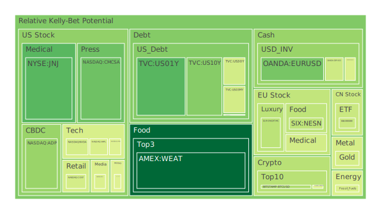
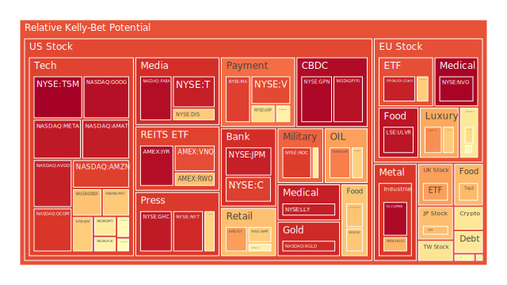
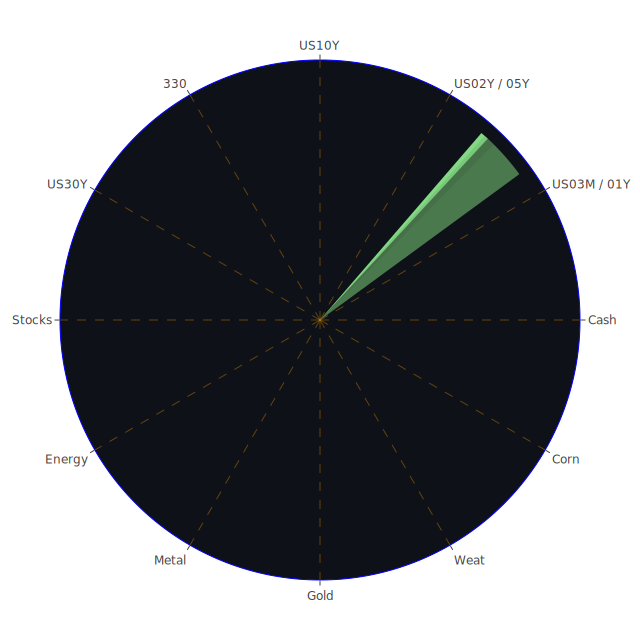

# 一、關於資訊航母的「三位一體」綜合觀點

在現有市場數據與新聞事件資料當中，若我們希望達到一種類似「資訊航母」的龐大格局彙整，可以從以下三個維度（Spatial、Temporal、Conceptional）來觀測「市場與新聞的三位一體」。每個維度都能折射出經濟學、社會學、心理學與博弈論的綜合運作模式。

1. **Spatial（空間）：「市場—新聞—政策」的三位一體交互影響**  
   - **市場層面**：當前國際金融市場中，股市、債市、原物料期貨、外匯與加密貨幣等資產出現泡沫風險的跡象時，往往會交織著空間性的資金流動。如近幾日對美國科技股、半導體股、加密貨幣、黃金、石油等資產的波動，都可能與市場對於新一輪關稅政策（美國所謂的「Liberation Day」關稅措施）以及地緣政治事件的理解有關。  
   - **新聞層面**：在新聞上，我們看到較高比例的負面消息，例如美國準備對若干國家祭出全球性關稅、以色列與周邊地區的衝突升溫、地震災害與政治動盪等，各種突發性或持續性的新聞事件交織，使得資金在不同地理區域之間調度變得急促。這些短期衝擊在空間維度常導致投資者的風險偏好大幅轉向，或是引起多空雙方交錯的交易狀態。  
   - **政策層面**（此處亦可視作「政策新聞」的一環）：特朗普最新宣佈的「全面互惠關稅」無疑在空間上快速傳導；同時也看到歐洲多國間的經貿協商出現雜音，如德國產業集團抱怨保護主義抬頭，法國在政治層面則面臨極右勢力的司法問題，整體在空間分佈上出現新的貿易路徑重組。博弈論上，這種政策宣示形同一種高壓姿態，其他國家選擇反制或退讓，造成空間上的關稅牆高漲或局部區域間貿易出現暫時性「跳島」現象。  

2. **Temporal（時間）：「市場—新聞—情緒」的三位一體大膽假設**  
   - **市場時間軸**：若觀察短週期（如日、周、月）的泡沫指數變化，常見的「D1 / D7 / D14 / D30」風險分數在極短期（幾日內）若大幅竄升，往往與突發性事件或政策落地有關；但中長期的觀察（如1個月到半年）則要看央行貨幣政策趨勢、美國聯準會（FED）縮表動向等。從最新資料看來，FED縮表與資產負債表走低的趨勢並未顯示明確的寬鬆，也沒有完全抑制通脹的強硬訊號。這種時間維度中的宏觀不確定性，與市場的預期博弈緊密纏繞。  
   - **新聞時間軸**：數天前的報導大量集中於新一輪關稅即將落地、地緣衝突加深、地震災害不斷等，中短期內不利於高風險資產。而過去幾季反覆提到的「美國科技股、半導體領域面臨成長天花板」之論點在新聞面也屢屢被提及。這些新聞在事件時間軸上持續發酵，投資人的心理往往也會隨著重複的負面訊息而防禦性升高。  
   - **情緒時間軸**：心理學與社會學層面而言，大量的負面新聞（「negative, 90%以上」的情緒）會在特定區間內帶來集中拋售壓力。例如新聞顯示嚴重的衝突與災害，股市端可能出現數個交易日的恐慌。若此時又有加速性的政策壓力（如突然宣布大規模的關稅計畫），投資者便容易將短週期訊息過度放大，形成人為踩踏。  

3. **Conceptional（概念）：「市場—新聞—人性」的三位一體推演**  
   - **市場概念**：經濟學和博弈論常強調「預期」的重要性。市場定價並不僅僅反映當前已知資訊，也體現投資人的「共同想像」。當「市場普遍相信」某科技股或加密貨幣將在未來若干時間裡遇到政策阻力或大量競爭時，泡沫危險就可能上升；反之，如果新聞面或公司財報顯示未來仍有強勁的獲利展望，則會支持較高的估值。  
   - **新聞概念**：一則新聞在現代社群媒體的擴散中並非單向度，而是多重立場的產物。同樣一項總統關稅公告，可能被詮釋為保護本土產業，也可能被視為嚴重的國際貿易衝擊。在概念層面，一些投資人會往正面解讀（例如特定領域受到保護或補貼），另一些則往負面解讀（跨國供應鏈被破壞），兩派之間的情緒碰撞也更易引發資金抽離與轉向。  
   - **人性概念**：心理學觀點下，當負面事件或衝擊密集發生時，人性傾向保本、追求安全資產，令避險商品（如黃金、短期美債）受到青睞。然而在博弈論的框架中，如果美國國債本身也因短期內升息與龐大的舉債形成隱憂，就會產生另一種矛盾：投資人或許會在避險與擔憂之間搖擺。這種「正反合」的張力，推動市場漣漪式波動。  

透過「空間—時間—概念」三大維度的綜合分析，可以更完整地呈現各類資產在當前局勢中的動態互動。此時，風險對沖配置成為必須考量的核心課題。

---

# 二、投資商品泡沫分析

以下針對主要資產類別進行概述，除了泡沫風險外，也參考最近新聞所帶來的市場情緒與潛在政策影響。文中將省略各券商前綴，只以資產簡稱討論。請特別注意，泡沫指數（如D1/D7/D14/D30）愈高代表風險愈高，這些數字顯示了近一日到近一個月的相對可能風險程度；我們僅在分析時簡要提及，不在此一一以表格形式列出。

1. **美國國債**  
   若觀察近幾日美國國債利率走勢，10年期、2年期、3個月期之利差仍然反覆，最新10Y Yield在4.13上下，較前期4.5甚至接近5.0的高點略有回落。美國國債被視為避險工具，但受到「全球性關稅」與高通脹影響，同時也面臨FED縮表、債務上限問題。新聞面顯示美國減少對外資金流依賴，但美國聯準會還未完全結束緊縮政策，加之近年債務壓力居高不下，國債可能仍有潛在的泡沫風險。

2. **美國零售股**  
   像Walmart、Target等大型零售商，根據4月3日的新聞，傳出因關稅上漲，可能將成本轉嫁給消費者，短期對股價施壓。Target在新聞裡更被點名「最壞住宅市場與消費不振」帶來的衝擊，泡沫風險主要來自估值的相對偏高。零售需求下滑或是通脹壓力導致的購買力收縮，都會干擾該產業的未來盈利。

3. **美國科技股**  
   特別是AAPL、MSFT、GOOG、META等，前陣子因ChatGPT、AI旋風與雲端業務曾推高估值，但新聞提及「Magnificent Seven Stocks」在若干月度表現甚至創下紀錄差。再加上特朗普祭出新一波的全球性互惠關稅，很可能衝擊科技股跨境供應鏈。新聞顯示AAPL（因生產中心受關稅影響）股價急跌，也有晶片股（NVDA、TSM）同時下挫。泡沫風險較高，因前期估值已被AI概念炒作到一個不低的水準。

4. **美國房地產指數**  
   新聞出現「最糟糕的房市」，有的地區性房屋交易量明顯下滑，抵押貸款利率仍在6.65上下徘徊。房地產上市信託（如VNQ）或全球地產ETF（如RWO）在最新泡沫指數上也不算低（多有0.6～0.8甚至更高的風險值），未來若美國景氣不如預期，房地產資金可能繼續抽離。  

5. **加密貨幣**  
   比特幣（BTCUSD）曾在上一波反彈衝擊到8萬以上，但新聞提到「Bitcoin, Crypto Stocks Fall After Trump Tariff News」。加密市場對政策敏感度高：關稅實際上會波及大量半導體（挖礦設備）與交易所合作架構的資金流動。心理層面：大量的負面新聞導致風險資金出走，因此泡沫風險有可能再次累積，且若後續市場流動性壓力加大，價格易波動。  

6. **金 / 銀 / 銅**  
   - **黃金**：從新聞可見，對地緣衝突與經濟不穩之際，金價往往受追捧。GOLD/OIL Ratio與GOLD/COPPER Ratio都在升高，代表黃金相對其他大宗商品價格漲幅較大。雖然黃金短線擁有避險買盤，但也要留意高位下若現金流緊俏，可能導致回調風險。  
   - **白銀**：雖然也有避險屬性，但其工業用途較高，容易受產業生產波動影響。  
   - **銅**：銅價對全球經濟景氣敏感，目前銅價在4.9～5.0區域浮動，新聞中反覆提到關稅與製造業不振，銅可能受到負面衝擊。

7. **黃豆 / 小麥 / 玉米**  
   糧食期貨（SOYB, WEAT, CORN）一向牽動通膨、供應鏈與地緣政治。若農業國家被關稅波及或地震災害損及產能，報價可瞬間拉升。短期看小麥（WEAT）泡沫風險相對較低，但也要留意天災或地緣戰事影響。另外，市場對糧食供應短缺的恐慌消息若再度升溫，也可能刺激這些農產品價格。  

8. **石油 / 鈾期貨**  
   - **石油**：美國原油（USOIL）先前一度從70多塊衝高，又因國際衝突消息、俄烏局勢或中東發展而振盪。新聞「Oil Retreats After Trump Announces Tariffs on China, Europe」顯示貿易戰陰影再起，擔心需求受壓抑。雖然石油也具備一定對沖通膨功能，但一旦全球景氣走弱，需求下滑，油價不一定能撐住。  
   - **鈾期貨（UX1!）**：一般市場較少關注，但核能議題在歐美能源結構轉變中常被提及。一旦避險情緒升溫，又因地緣衝突擴大，鈾期貨行情可能顯著波動。  

9. **各國外匯市場**  
   - **美元相關**：新聞顯示「美元小幅上漲」或「USD Reaction To Trump’s Tariffs Limited So Far」。FED的升息路徑與縮表仍在進行，但市場對美國財政疑慮，以及全球尋找其它避險資產，使得美元走勢易受情緒左右。  
   - **歐元 / 英鎊 / 日圓 / 澳幣**：歐元區受到俄烏衝突陰影、英鎊因英國政局與通膨問題而震盪，日圓通常與避險掛鉤，但日本本身國債與國際收支壓力也不容小覷；澳幣則在大宗商品與中國需求之間存在連動性，一旦關稅波及礦產品或農產品，澳洲經濟勢必受牽連。

10. **各國大盤指數**  
   - **美國NDX、道瓊指數、S&P 500**：因巨量科技股、金融股和零售股在權重上比重大，新關稅政策與企業獲利不確定性恐帶來下壓。  
   - **德國DAX（GDAXI）**：新聞看到德國境內也有警方打擊組織犯罪的大規模掃蕩，另有工業組織對全球貿易前景表示憂慮，可能拖累德國出口。  
   - **法國CAC（FCHI）**：法國政治局勢內外皆存動盪，奢侈品公司雖有一定抗跌力，但倘若全球高端消費轉弱，也難以幸免。  
   - **英國FTSE**：英國經濟受脫歐後續影響持續，新聞多次提及對俄制裁新規以及國內通膨壓力，若關稅衝擊擴散，英國也難置身事外。  

11. **美國半導體股**  
   包括AMD、NVDA、INTC、MU、KLAC、AMAT等。新聞提到「Nvidia, TSMC, chip stocks fall after Trump announces sweeping reciprocal tariffs」，代表相關半導體股短期衝擊深。考慮到全球對高階晶片需求仍在，但貿易壁壘會讓供應鏈轉移與生產成本上升，也增加了整體風險。

12. **美國銀行股**  
   BAC、JPM、C、COF等，曾在去年因升息與投資組合調整使得財報亮眼，但若整體經濟前景不佳、貸款違約率上升，美國銀行業可能面臨新一輪壓力。FED總資產下降、資金成本提高，也會壓縮銀行利差。泡沫風險並非來自估值失控，而是對衝擊的脆弱程度升高。

13. **美國軍工股**  
   LMT、NOC、RTX等，受地緣衝突及軍備需求所推動，市場原本看好軍工股具備防禦性，但新聞反應在新一輪政治紛擾中，歐洲也在談自建國防產業。若跨國合作受關稅與外交摩擦影響，軍工股可能先漲後有壓力，泡沫風險中等偏高。

14. **美國電子支付股**  
   包含V、MA、PYPL、GPN、ADP等，由於全球消費模式改變，長期仍看好。但是新聞提及關稅壓力與跨境支付業務，不少電子支付股估值已在高檔。若後續消費衰退加劇或政策限制跨國支付功能，都可能導致增長趨緩。

15. **美國藥商股**  
   JNJ、MRK、LLY等，部分受到疫情後的醫療需求延伸，另一部分則因研發管線與專利問題。現狀顯示若政治情勢不穩，醫療保險改革等議題也會左右這些巨頭的定價權。新聞提到JNJ因「滑石粉官司」再度面臨判決不利，其股價重挫，泡沫風險伴隨訴訟風險。

16. **美國影視股**  
   DIS、PARA、NFLX、CMCSA等，串流與傳統內容市場整合趨勢下，財務槓桿與成本壓力頗高。市場對串流訂閱成長已出現飽和預期，加上若經濟不振，消費者更可能縮減娛樂支出。這些公司的泡沫風險來自前幾年的高速成長定價模式，目前面臨現實獲利壓力。

17. **美國媒體股**  
   FOX、NYT、GHC等，新聞提到某些媒體IPO後大幅震盪，尤其是數位廣告市場與政治事件對媒體的兩面效應：一方面選舉與社會爭議帶來點擊率提升，另一方面廣告客戶預算削減也會衝擊收入。風險評估需留意其商業模式的可持續性。

18. **石油防禦股**  
   XOM、OXY等石油巨頭，在油價相對不穩的狀況下，也面臨成本調整與全球需求不確定。新聞「Oil Retreats After Trump Announces Tariffs」可見當前石油需求前景備受挑戰，股價易呈高波動。

19. **金礦防禦股**  
   RGLD等，金價上行一般利好金礦公司，但若金價漲幅無法長期維持、或地緣政治風險干擾礦區生產，也會導致評價落差。若避險需求爆發能帶動一波金礦企業獲利，但仍需警惕國際政經不確定因素。

20. **歐洲奢侈品股**  
   MC、KER、RMS等，雖具有一定抗通膨與品牌力，但若全球關稅壁壘或經濟衰退嚴重，奢侈品也會被削減。新聞顯示中國需求曾是奢侈品大漲的主力，一旦中美貿易紛擾再起，可能限制奢侈品增長。

21. **歐洲汽車股**  
   BMW等，歐洲汽車製造商需要全球市場支撐，一旦特朗普的汽車關稅落實，歐系車出口美國難免受衝擊。當前泡沫風險相對中等，不過後續若中國或美國市場銷售萎縮，預期還會對歐洲汽車股造成更明顯的拖累。

22. **歐美食品股**  
   NESN、KHC、WMT、KO等企業所屬的食品飲料乃至便利零售領域，在通膨與原物料價格動盪之下，毛利率承壓。消費者若減少非必需品開支，增長空間受限。若公司堅持產品提價，則需承擔消費者流失風險。

---

# 三、宏觀經濟傳導路徑分析

1. **金融與實體經濟的雙向撐壓**  
   隨著FED總資產下降、利率仍保持在相對高檔，流動性開始收緊，若企業融資成本上升，實體投資計畫減緩就會抑制經濟成長。而新聞事件顯示市場對未來尚有諸多擔憂，例如高收益債利率在高檔，商業不動產違約率也不斷上升，代表市場流動性開始出現裂縫。

2. **關稅壁壘對全球供應鏈的衝擊**  
   只要關稅層層加碼，製造成本必然攀升。博弈論上，美國可能透過貿易保護措施要求國內企業回流生產，但短期內供應鏈轉移成本高昂，全球經濟增長受阻。若歐洲與其他國家也推出對應關稅或反制措施，則世界經濟整合度可能下降，加深區域分割。

3. **地緣政治因素**  
   中東和歐洲局勢、亞太區軍事博弈都會讓資金呈現防禦姿態。新聞裡反覆提及的以色列與周邊衝突升級、緬甸地震災情、法國及德國內部政治爭議，都可能帶來全球範圍的資本避險傾向，使黃金、美國短天期國債等受到青睞，但也要看市場對美債信心是否足夠。

4. **心理層面與羊群效應**  
   大量負面新聞若在短時間累積，可能激發拋售潮；若投資人相信「關稅最壞已過」或「局勢即將好轉」，市場也可能瞬間反轉。這種宏觀傳導很大程度受心理預期左右，往往表現在資產的日內或周內大幅波動上。

---

# 四、微觀經濟傳導路徑分析

1. **企業獲利與成本**  
   關稅與供應鏈的重新配置會增加製造業成本，如蘋果產品要重新布局生產基地就得支付可觀代價。零售業則面臨進貨價格上升的壓力，必須在零售價格與利潤間權衡。如果最終消費意願降低，企業獲利就會壓縮，導致庫存去化與資本支出削減。

2. **勞動市場與消費**  
   關稅提高造成製造商、零售商、科技巨頭的一連串裁員或凍結招聘，會使消費者收入減少、信心轉弱。再者，若原物料上漲，基本生活成本提升，消費力下降，連帶壓縮娛樂與非必須開支。

3. **資金鏈與槓桿**  
   若銀行開始擔心經濟衰退而收緊貸款標準，許多中小企業將無法輕易取得融資。消費者若信用卡等債務違約率升高，將對銀行業獲利造成衝擊。一旦資金鏈產生斷裂，違約和倒閉可能開始增加。

---

# 五、資產類別間傳導路徑分析

1. **股債聯動**：若股市下挫，部分資金轉入公債避險，但同時對公債安全性的懷疑也可能升溫。最終局面可能是中短債價格上漲，長債利率仍保持在高位。  
2. **商品與外匯互動**：油價走低可能打壓石油出口國貨幣，如俄羅斯盧布、加拿大幣等；相對黃金上漲又會短期提升澳幣（澳洲是黃金產地），但若全球衰退風險加大，澳幣亦可能受波及。  
3. **加密貨幣與科技股**：許多加密貨幣投資者也持有科技股，一旦科技板塊信心受到動搖，往往加密貨幣也會同步修正。兩者之間存在一定的心理聯動。

---

# 六、風險對沖與投資建議

## （一）風險對沖與投資組合機會

根據三位一體的空間、時間與概念分析，可嘗試尋找相位差約120度、相關性在-0.5附近的資產組合。理想情況下，若其中一類資產因宏觀或地緣風險下跌，另一類資產可望有避險效果、或至少維持較低相關波動。以下舉幾種相對可能具對沖效果的資產對：

1. **黃金 vs. 美股零售股**：在消費遭受關稅與購買力下滑時，零售股走弱，但避險資金流入黃金，兩者有機會在波峰與波谷形成此消彼長的效果。  
2. **短期美國國債 vs. 高收益債**：一者是典型避險資產，另一者雖具高息但也承擔較高信用風險。若經濟轉弱，高收益債面臨違約率上升，短債或許會因資金避險需求而得到買盤。  
3. **半導體股 vs. 糧食期貨**：科技產業供應鏈受關稅打擊時，股價容易下滑；但若全球糧食供應偏緊造成農產品價格上升，糧食期貨表現相對抗跌，兩者在價格上可能出現弱負相關。

現實操作中，想要達到完美的120度相位差與-0.5相關並不容易，但可以依據當前政治與經濟走向，做適度調整。

## （二）穩健、成長與高風險三大類的配置建議

以下提出一種示範性分配方式，三大類總和為100%。請投資人根據自身風險承受度做最終決定：

1. **穩健型（約40%）**  
   - **短期美國國債（10%）**：考量利率相對高，且有美國政府信用背書，流動性強。  
   - **黃金（15%）**：面對大量負面新聞與地緣政治衝突，黃金可提供避險功能。  
   - **大型必需消費品股（15%）**：例如WMT或KO等，儘管新聞面提及關稅壓力，但必需品相對較能承受景氣震盪。

2. **成長型（約40%）**  
   - **半導體龍頭（15%）**：如AMD或NVDA，雖受貿易戰波動大，但若AI技術長期仍被看好，具成長潛力。  
   - **醫藥股（15%）**：如LLY或MRK等，醫療需求長期趨勢仍在，但要慎防訴訟或政策風險。  
   - **雲端/網路服務類（10%）**：例如MSFT或GOOG，短期或受關稅與全球經濟因素壓力，但長期智慧化服務需求不減。

3. **高風險型（約20%）**  
   - **加密貨幣（BTC或ETH）（5%）**：市場波動劇烈，但若看好未來數位資產需求，可小比例介入。  
   - **高收益債（5%）**：收益率高，但若經濟下滑，違約風險也會飆升。  
   - **原物料或能源（10%）**：包含石油與特定金屬期貨，預期若衝突加劇或通膨升溫，價格有機會走揚，但跌勢也可能劇烈。

以上只是基於當前環境的示範性建議，各比例可隨市場狀況動態調整。

---

# 七、多項資產間可能的漣漪效應與傳導路徑

透過兩兩相互驗證的假設分析，可以進一步得到：  
1. **美國科技股與加密貨幣間**：一旦科技巨頭裁員、資金緊縮，市場風險偏好降低，往往也連帶衝擊加密貨幣需求。這種漣漪效應來自投資人結構的疊合：同一批投資人同時參與科技股與加密貨幣投機。  
2. **農產品與能源間**：石油價格若大幅波動，運輸成本提高，也可能提升農產品價格。但若全球景氣驟降，能源需求反而萎縮，糧食期貨也可能受通膨走低或需求下修的負面影響。  
3. **歐洲奢侈品股與黃金**：高端消費可能因全球衰退而下滑，但當避險資金湧入貴金屬，投資人心態或會反向抽離高端商品，改買較保值的黃金。這種負相關的狀況若出現，奢侈品可能更加暴露在跌勢之中。  
4. **美國國債與新興市場外匯**：若美債收益率走高，資金回流美元，新興市場貨幣出現拋售壓力；但一旦聯準會釋放寬鬆訊號，新興市場又有機會迎來短暫資金湧入。這種拉鋸不斷形成階段性衝擊。  

在「Spatial—Temporal—Conceptional」三位一體下，所有資產之間就像疊加波：只要某條主波被強化或抵銷，就會帶動一連串漣漪式傳導。因此，各配置策略與風險控制措施，都需動態調整，並持續關注新聞與市場數據。

---

# 八、總結與風險提示

就當前情勢來看，新聞中所透露之高比例負面因素顯示投資市場正在面臨顯著的動盪。政治、地緣、經濟、通膨與貨幣政策皆存在交織的複合性風險。表面上看，某些資產如黃金、短期美債等可能是較穩健的避風港，但若長期結構性問題積累，連避險工具也不保證能提供絕對安全。各產業的泡沫風險並不一定在此刻完全破裂，但警訊已浮現：美國科技板塊的高估值、房地產市場買氣下滑、金融板塊面臨償債風險上揚，以及全球大範圍的關稅保護主義等，都為市場埋下不少隱憂。

**投資有風險，市場總是充滿不確定性。** 以上分析僅供參考，最終決定應該結合自身風險承受能力、資產配置需求與投資目標進行審慎研判。在當前的市場交錯中，不宜盲目追逐短期漲跌，也應警惕所有泡沫風險訊號，一旦發現市場情況快速惡化，應當適時調整持倉、做好資金保護，力求在動盪之中尋得較穩定的立足點。切勿忽視對任何高泡沫、估值過度膨脹標的的警告，如有投資高風險標的，務必保持足夠的備用資金與彈性風控機制，以免陷於流動性危機或過度虧損。願此報告能在不確定的環境中，為投資人提供多面向的觀察視角與策略參考。

 
Daily Buy Map:

 
Daily Sell Map:

 
Daily Radar Chart:

 
