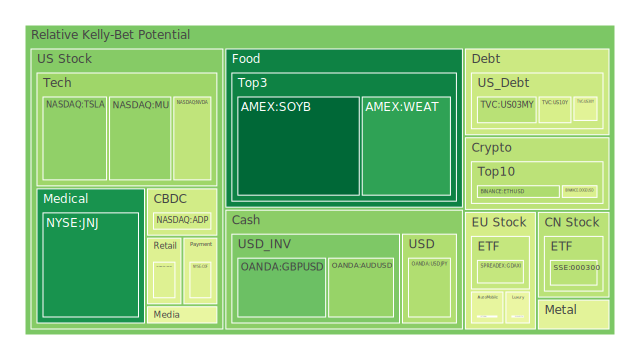
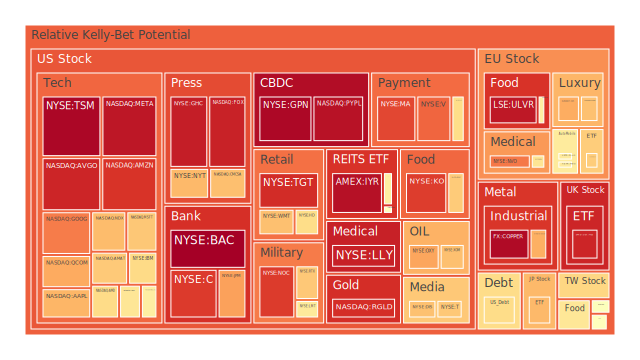
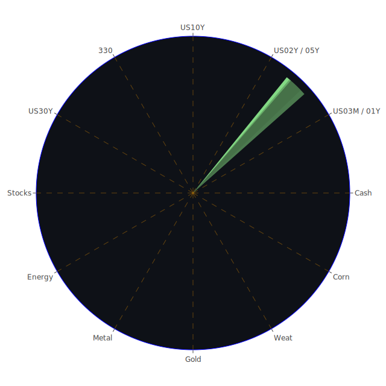

# 一、投資商品泡沫分析

以下將針對常見且市場關注度高的多種資產類別，進行當前泡沫風險與新聞佐證的解讀，盡量呼應近期新聞和歷史上類似場景，以提供多重視角。此處會參考使用者提供的數據中提及的「PP100」（當日現價）以及「泡沫指數D1 / D7 / D14 / D30」等風險度量，惟不深入使用太過技術的專業術語或敘述分析過程細節。

## 1. 美國國債
在近期多方新聞顯示，聯準會（FED）的資產負債表收縮趨勢持續、美國公債整體流通量相對壓力尚未完全釋放，以及美國長短期國債殖利率出現某種程度的倒掛（如10年期與3個月期之間的利差仍為負值或較為緊繃），都暗示著經濟疑慮並未消弭。從使用者提供的泡沫指數來看，美國2Y、3M、5Y、10Y、30Y等不同年期公債的風險分數雖然各有差異，但也顯示在4.0% - 4.5%的殖利率區間浮動，整體大幅跳動空間不如2022～2023的時候劇烈。  
**新聞事件面向**：近期特朗普（Trump）再度祭出大範圍關稅，引發市場對美國經濟衰退或高通膨併存的擔憂；同時Fed對通膨暫緩卻又擔憂經濟成長不振的態度，造成國債需求忽高忽低。投資人在風險情緒高度波動時仍可能傾向買進長天期美國國債避險，但如果關稅導致國際市場對美國信心動搖，也可能在某些時刻大舉拋售。  
**歷史相似場景**：2018年美中貿易戰開打時，美國國債殖利率也曾在幾個月內大幅震盪。2008年金融危機後的大規模量化寬鬆，讓美國國債成為資金避風港，但隨後也有交易擁擠（crowded trade）導致價格波動瞬間放大的案例。  
**總結**：美國國債相對於股票、商品或數位資產而言風險低，但在極度波動或大規模拋售下仍可能引起殖利率瞬間上升。就泡沫分數而言，整體仍處於中性偏高的區域，一旦經濟信心下滑，資金將重新湧入長天期公債。若市場錯判，短期拋售引發利率急上，也會在中長線吸引價值型資金搶進。

## 2. 美國零售股
沃爾瑪（WMT）、Target（TGT）等零售巨頭近來在新聞中常被提及，包括「Walmart繼續向中國供應商施壓要求降價」及「Walmart、Target股價同受可能關稅衝擊下跌」等，象徵整體零售業處於尷尬的位置：一方面通膨、關稅、新品進口成本飆升；另一方面消費者信心未完全回溫。  
**新聞事件面向**：最近的負面新聞多強調關稅對零售價格的上漲壓力，以及薪資成本攀升。像是「Walmart繼續向中國供應商施壓要求降價」暗示零售商對上游供應鏈成本極度敏感，也顯示業者利潤空間承壓。另一則則是「Walmart、Target、Nike股價大幅下挫，因預期全面關稅會抬高消費者購買成本」。  
**歷史相似場景**：早在1970年代至1980年代的石油危機及之後的關稅波動時期，零售業常因成本轉嫁失靈而拖累獲利。2008年金融海嘯後需求萎縮，也曾造成零售業獲利遭到顯著衝擊。  
**總結**：美國零售股存在潛在的獲利壓力，泡沫風險相對高，如果因關稅或通膨壓力造成需求下滑，零售商業績將面臨更大挑戰。根據數據顯示，WMT等的泡沫分數在短期內有提升趨勢，須警惕波動風險。

## 3. 美國科技股
近年科技股一直是市場焦點，包括蘋果（AAPL）、微軟（MSFT）、NVIDIA（NVDA）等龍頭公司。在最新新聞裡，科技股大多因特朗普祭出關稅、全球供應鏈動盪，以及對電子產品加徵高額關稅預期，而承受重挫。  
**新聞事件面向**：  
- 「Apple在關稅消息後市值瞬間蒸發3000億美元，為2020年3月疫情爆發以來最劇烈的一天跌幅」  
- 「Nvidia、TSMC、各大晶片股齊跌，市場擔憂國際關稅導致硬體製造成本飆升」  
- 同時也有「Intel與TSMC達成晶片製造合作協議」等正面消息，暗示部分廠商可能尋求多元分散佈局。  
**歷史相似場景**：2000年的網路泡沫最為明顯；2018年中美貿易戰亦曾壓制科技股表現。若貿易衝突升溫，曾經在全球供應鏈中地位穩固的科技公司，將面臨多重成本及銷售市場的考驗。  
**總結**：現階段科技股因本身估值常偏高，泡沫分數普遍較高，如AAPL在近期數據中就顯示接近或超過0.7～0.8區間，更別提部分半導體股甚至高達0.9以上。如果關稅衝擊持續發酵或市場增長不及預期，短期回檔風險不容忽視。

## 4. 美國房地產指數
美國房地產近來在新聞中相對低調，但房貸利率攀升、商用不動產風險高漲、以及貼現窗與BTFP（銀行定期資金計畫）使用度的此消彼長，都對房地產市場產生間接影響。資料顯示，有關房地產的指數或ETF，如IYR或RWO等，近期的泡沫分數也不斷攀升。  
**新聞事件面向**：較具威脅的訊息包括：「商用房地產違約率上升」、「部分主要零售地產空置率轉高」。另外，也有報導「RH（高端家具零售）收益大幅下滑，原因包括‘史上最糟糕的房市’」，代表高端家居市場需求疲弱可能與住宅成交量息息相關。  
**歷史相似場景**：2008年金融海嘯爆發前，美國房地產泡沫迅速膨脹；然而，目前市場結構與2008年不同，雖然某些地區仍過熱，但整體槓桿結構已有不同。  
**總結**：由於房貸利率仍居高不下、Fed緊縮政策雖趨於遲滯但尚未轉向寬鬆，房地產價格下行風險依然存在。商業不動產領域的泡沫潛能更高，投資人應留意此類資產的價格下修風險。

## 5. 加密貨幣
比特幣（BTC）、以太幣（ETH）、狗狗幣（DOGE）等加密貨幣，從使用者提供之數據可見，短期的泡沫分數時常偏高。特別是新聞提到「Bitcoin、Crypto Stocks Fall After Trump Tariff News」，顯示加密市場對政策與國際事件的反應越來越劇烈。  
**新聞事件面向**：除了關稅、通膨、Fed收縮等影響，有報導「比特幣價格短期回跌，是因市場大量獲利了結」，也有「高收益債利率升至相對高水平，造成挖礦企業融資困境」。  
**歷史相似場景**：2021年底至2022年初，比特幣自高點大跌；2018年時亦曾暴跌。加密市場具有高波動性與高槓桿特色，一旦避險情緒升高或監管措施收緊，都可能觸發快速回調。  
**總結**：在資金面與政策面都動盪的背景下，加密貨幣行情容易在短期內大幅波動。部分指標顯示，目前比特幣和以太幣的泡沫風險雖然略有緩和，但數據仍不低，投資人需審慎控管倉位。

## 6. 金 / 銀 / 銅
貴金屬（尤其是金、銀）長期被視為避險資產，而銅則常被視為工業景氣的敏感指標。數據顯示，金價近期在「金油比」及「金銅比」都創相對新高，市場避險需求明顯升溫。  
**新聞事件面向**：新聞裡多次提到「Gold rises to new high on tariff, inflation worries」，也有「Oil tanks 6% amid panic selling…」，推動金價與銀價相對堅挺。銅價則受到全球需求不明以及可能的製造業衰退影響。  
**歷史相似場景**：1970年代石油危機與高通膨期間，黃金價格飆漲並創出歷史高點；2008年金融危機後量化寬鬆也帶動金價走高。至於銅價常在全球製造業回溫時漲勢明顯，一旦遇到關稅壁壘或需求衰退，價格容易深幅回調。  
**總結**：金銀仍處於避險買盤支撐下，短期回調風險相對有限，但一旦地緣政治緊張趨緩或利率大幅回落，金銀也可能震盪。銅則處於供給與需求皆不確定的震盪期，目前泡沫風險據資料顯示相當高（部分指標高達0.98），須留意若國際製造活動再度放緩，銅價恐大幅下跌。

## 7. 黃豆 / 小麥 / 玉米
農產品市場（如黃豆、玉米、小麥）長期受到天候、地緣政治與關稅政策影響。近期數據顯示黃豆、玉米、小麥泡沫指數多處於中間或中高區域，並不算極端，但也未臻於穩定。  
**新聞事件面向**：如「Volvo Cars銷售大跌與玉米或小麥之間沒有直接新聞關聯」，但當前關稅與全球糧食通膨壓力仍在。小麥價格、玉米價格若遇到產區乾旱或戰爭（如烏俄局勢）再次升溫，都可能帶動波動。  
**歷史相似場景**：全球糧食價格在1970年代石油危機、2008年與2011年糧價飆漲時，都與氣候、能源價格、地緣緊張等因素息息相關。  
**總結**：農產品雖有基本面需求支撐，但易受氣候與政策衝擊。若全面關稅拉高飼料或肥料成本，農產品價格也會被推升。近期泡沫風險雖非最高，但仍須關注相關新聞。

## 8. 石油 / 鈾期貨UX!
石油作為全球最重要的能源商品之一，其行情牽動通膨、企業成本與地緣政治局勢。鈾期貨（UX）則相對小眾，但隨能源轉型議題興起，核能地位被部分國家重新重視。  
**新聞事件面向**：新聞裡提到「Oil tanks 6% amid ‘panic selling’」，顯示因關稅、OPEC+產量變動及經濟衰退疑慮，短期油價可能出現快速下挫。至於鈾期貨報價有維持在相對高位（64～65美元區間），可能暗示核能需求正逐漸增溫。  
**歷史相似場景**：石油每逢重大地緣衝突或經濟景氣變化都大幅波動，如1990年海灣戰爭、2008年金融海嘯、2020年疫情等。鈾價曾在2011年福島事故後大跌，但近年在多國重新評估核能需求下有反彈趨勢。  
**總結**：石油短期壓力大，泡沫風險處於中等偏上（新聞提及的恐慌拋售與市場避險資金流向金銀，對石油不利）。鈾期貨則相對小眾，交易量偏低，投資人若關注核能相關議題，可少量布局，但泡沫風險指數同樣不低。

## 9. 各國外匯市場
歐元（EURUSD）、英鎊（GBPUSD）、日圓（USDJPY）、澳幣（AUDUSD）等主要貨幣近期受美國通膨、關稅、美債殖利率、地緣政治等影響。  
**新聞事件面向**：  
- 「Dollar spirals amid a ‘confidence crisis’ sparked by Trump’s trade war」顯示美元指數一度重挫。  
- 歐元區與英國也面臨經濟衰退風險，但若美國經濟更動盪，歐元與英鎊短線可能相對走強。  
**歷史相似場景**：歷次貿易戰或金融危機期間，外匯市場波動常劇烈，1997年亞洲金融風暴、2008年金融危機皆是例子。  
**總結**：目前外匯市場對政策與關稅消息高度敏感，而部分新興市場貨幣如墨西哥披索逆勢走強的新聞也顯示避險資金尋求多元分散。投資人需注意匯率風險與潛在波動。

## 10. 各國大盤指數
使用者提供之數據顯示，美國的主要股指（S&P 500、NASDAQ、Dow Jones）在關稅消息後大幅回調；歐洲（如GDAXI、FTSE、FCHI）亦有不同程度下跌或震盪，亞洲市場（例如日經225、上證300）則各自表現分化。  
**新聞事件面向**：  
- 「S&P 500 loses $2.4 trillion in market value, biggest one-day loss since 2020」  
- 「FTSE、DAX同樣面臨關稅衝擊」  
- 中國則有可能進一步出臺刺激政策來抵消關稅造成的外需下滑。  
**歷史相似場景**：2018年貿易戰、2020年疫情爆發都曾造成全球主要股指的連動下跌。  
**總結**：全球主要股指受到政策與資金面因素的共同干擾，若關稅爭端繼續加劇，國際股市同步波動幅度會拉大。部分指數或許會因政府政策干預而暫時企穩，但中長期仍看全球經濟基本面。

## 11. 美國半導體股
半導體股如Nvidia、AMD、Intel、Qualcomm、Micron、AMAT、KLAC等，常被視為高風險高成長的科技類股。新聞顯示「Nvidia、TSMC、chip stocks fall after Trump announces sweeping reciprocal tariffs」，凸顯市場對全球供應鏈斷裂的焦慮。  
**歷史相似場景**：2018～2019年中美貿易衝突導致華為等公司被禁運，半導體類股震盪激烈。  
**總結**：若真正大規模關稅實施，半導體製造各環節可能面臨零件與設備成本飆升。短期看來，此類股票泡沫風險都在高檔，部分還超過0.9。投資人需留意估值與政策的雙重風險。

## 12. 美國銀行股
銀行股（JPM、BAC、C等）受利率走勢、經濟成長預期、資本充足率及貸款品質影響。新聞裡提到「Bank stocks tank after Trump promises sweeping tariffs」，意味市場預期海外業務與國內需求都可能受衝擊。  
**歷史相似場景**：2008年金融海嘯前後，銀行股波動劇烈；2018年利率正常化也讓銀行股獲利能力上升，但之後貿易戰陰霾再度給出負面衝擊。  
**總結**：銀行股在經濟不確定與潛在呆帳風險增高下，短期風險指數提高。若衰退加深或市場因關稅亂象出現流動性問題，銀行股可能再度面臨股價劇烈波動。

## 13. 美國軍工股
洛克希德馬丁（LMT）、雷神（RTX）、諾斯洛普格魯曼（NOC）等軍工股的走勢與政府支出、國防預算、地緣政治衝突相關。近期雖有零星新聞提到「美國擴軍備」或烏俄衝突持續，但特朗普政府的預算流向與當前關稅爭議，讓軍工股同樣承壓。  
**歷史相似場景**：地緣衝突時期，軍工股往往相對抗跌，但若美國內需或預算緊縮，也會出現壓力。  
**總結**：軍工股有其防禦特質，但若整體市場資金緊縮，也難免下修。泡沫風險處於中高位置，需持續追蹤美國國防預算趨勢。

## 14. 美國電子支付股
Visa（V）、Mastercard（MA）、PayPal（PYPL）等支付股，多半與消費需求、跨國交易量、電子商務活躍度緊密相關。最近關稅消息可能衝擊全球跨境支付交易，市場疑慮高。  
**新聞事件面向**：「Meta與Amazon的廣告業務恐受關稅影響」等相關訊息，也顯示全球供應鏈斷裂恐衝擊支付業生態。Visa、Mastercard若國際交易量萎縮，會影響手續費收入。  
**總結**：電子支付股在長期數位化趨勢中具成長潛力，但關稅動盪、經濟放緩可能壓抑消費者與企業的交易量，泡沫指數偏高顯示市場對其估值憂慮升溫。

## 15. 美國藥商股
默克（MRK）、禮來（LLY）、輝瑞（PFE）等醫藥股，在關稅衝擊與醫療政策因素下，近期也有不同程度波動。新聞中部分藥廠仍有研發管線突破，但也有「AbbVie下修財測」一類的負面訊息。  
**歷史相似場景**：醫藥股在2008年或經濟衰退期間通常被視為防禦性標的，但若遭逢法規改革或對海外供應鏈依賴性高，也會受衝擊。  
**總結**：醫藥股整體泡沫風險不算最高，但利潤空間可能因全球保護主義抬頭而受到挑戰，尤其原料藥若仰賴進口。

## 16. 美國影視股
Disney（DIS）、Netflix（NFLX）、Comcast（CMCSA）等影視及媒體大廠，主要收入來源包括串流訂閱、電影票房、廣告收入等。新聞顯示近期此類股同樣受到消費力道及全球貿易衝擊影響。  
**新聞事件面向**：  
- 「Disney股價小幅度下滑，傳言或將裁減部分人力」  
- 「Netflix內容投資成本上揚，且在關稅壓力下對某些海外製作協議存疑」  
**總結**：娛樂需求雖具抗性，但經濟衰退或關稅限制海外拍攝、授權合作，都可能增加成本與不確定性。泡沫風險中等偏高。

## 17. 美國媒體股
與影視產業接近，但著重於新聞、廣電、廣告等領域。Paramount（PARA）、Fox（FOX）、NYT等，新聞裡顯示部分媒體面臨廣告收縮威脅。  
**新聞事件面向**：「Newsmax IPO後大跌」、「Trump Media持續面臨不確定」等，反映政治與市場波動對媒體股的高度敏感性。  
**總結**：廣告市場若因關稅及消費緊縮受壓抑，媒體股恐持續震盪。部分公司所處的訂閱模式也面臨用戶成長趨緩之疑慮。

## 18. 石油防禦股
由於石油本身近期大幅震盪，不少投資人關注與能源相關的防禦型標的，例如通過鎖定上下游產業鏈進行整合的公司，或者特殊業務領域的油服股。但新聞中並未大量提及「石油防禦股」的正面表現，反而顯示整體石油企業面臨重挫。  
**總結**：石油相關標的短期內沒有太多防禦優勢可言，除非是能從關稅或區域能源供應中獲利的特殊企業。但目前泡沫風險整體仍偏中高，因為基本面與技術面都受到國際需求放緩與價格波動衝擊。

## 19. 金礦防禦股
金礦股常被視為對金價變動的槓桿投資。若金價因避險情緒飆升，金礦股可能表現優於大盤。但也面臨生產成本與政治風險等變數。  
**新聞事件面向**：某些報導強調金價向上有支撐，金礦公司獲利空間可能擴大，但人力、能源等成本若上漲，也會蠶食利潤。  
**總結**：金礦股存在潛在機會，但同樣要注意泡沫風險。若金價漲幅不及預期或大盤再次下殺，金礦股也可能急跌。

## 20. 歐洲奢侈品股
歐洲奢侈品（如LVMH、KER、RMS等）近期雖然在中國市場需求恢復上看似利多，但關稅紛爭及全球高通膨削弱部分購買力，也使其股價轉趨震盪。  
**新聞事件面向**：新聞顯示「歐洲奢侈品股一度走高」，但美國大幅徵收關稅可能影響美國消費者對進口奢侈品的購買。  
**總結**：奢侈品相對受地緣衝擊影響較小，但若全球經濟不振，對高端消費支出也會構成壓力，泡沫風險中高。

## 21. 歐洲汽車股
歐洲汽車如BMW、MBG等，前期新聞顯示銷售並不亮眼，且歐洲本身能源價格偏高，也影響生產成本。再加上特朗普宣布提高汽車關稅，歐洲車廠對美輸出恐受衝擊。  
**總結**：歐洲汽車股相對脆弱，若其泡沫分數同時升高，更凸顯估值風險。須關注美國市場的關稅政策走向。

## 22. 歐美食品股
食品產業如NESN、KHC等，雖具相對防禦性，但若關稅拉高原物料成本或壓抑消費者支出，也會承壓。新聞裡提到部份零售、食品巨頭都抱怨投入成本攀升。  
**總結**：食品股中長期需求相對穩定，但若原料價格驟升和渠道費用擴大，獲利空間也可能被擠壓，泡沫風險從數據上看中等，需要留意成本端走勢。

---

# 二、宏觀經濟傳導路徑分析

1. **貨幣與利率路徑**：聯準會持續處於縮表階段，市場對利率峰值的爭論依然存在。若關稅全面攪動通膨或需求，Fed在抑制通膨與支撐就業間的權衡將更艱困。高利率環境下，美國國債殖利率曲線可能持續倒掛，一旦經濟急劇放緩，又可能促使降息預期升溫，造成市場對未來政策方向疑慮加深。

2. **通膨與消費路徑**：關稅措施可能推高輸入性通膨，同時也壓抑企業利潤與家庭可支配所得。如果最終造成消費力下滑，就會形成惡性循環，進一步打擊企業投資與擴張意願。

3. **外貿與匯率路徑**：若美國進出口受大範圍關稅衝擊，美元地位可能面臨一些信心危機。部分新興市場貨幣可能受到資金流竄影響而劇烈波動，全球外匯市場不確定性上升。

4. **金融市場與避險情緒路徑**：市場若恐慌則資金流向黃金、美國國債等防禦資產；一旦股市大跌，也可能推升流動性風險。銀行股、保險股等金融部門壓力上升，造成信用市場更緊縮，衍生出實體經濟投資減弱的連鎖效應。

---

# 三、微觀經濟傳導路徑分析

1. **企業成本結構**：關稅提高會衝擊原料或半成品的進口成本，使企業利潤空間被壓縮。零售業、科技業、汽車業與工業製造尤其明顯。

2. **就業與薪資面**：若企業縮減投資、轉嫁成本，可能凍結人員招聘或削減員工福利，進而影響就業市場與整體消費能力。

3. **產業供應鏈**：跨國供應鏈若因關稅與地緣政治受阻，企業可能重新布局生產基地，如美國科技企業赴墨西哥或東南亞國家。但短期內的轉移必然帶來額外成本與營運風險。

4. **消費者行為**：價格上漲與不確定性可能削弱消費意願，對耐久財、奢侈品、旅遊娛樂等產業衝擊較大。必需品與食品仍有剛性需求，但價格敏感度也上升。

---

# 四、資產類別間傳導路徑分析

1. **股票與債券之間**：當股市因高估值或關稅風險而出現大幅修正，資金往往流向債券市場，進一步壓低債券殖利率。但若通膨攀升或國家信用風險被質疑，長債殖利率也可能同步上行。

2. **商品與外匯之間**：油價下跌可能帶動產油國貨幣貶值，也影響通膨預期；貴金屬上漲可能推升相關礦商股市值，但也反映市場避險情緒攀升，導致其他風險資產受壓抑。

3. **地區股市與匯率之間**：若美股大幅下挫，市場風險偏好下降，可能壓低商品貨幣（如澳幣、加幣），並推動部分避險貨幣（如日圓）短期升值。但如新聞所示，若對美國信心大降，美元亦可能重挫，造成複雜的多邊匯率互動。

4. **加密貨幣與股市/債市之間**：部分投資人將加密貨幣視為風險資產，行情波動與科技股有一定相關度，並不一定是穩定的避險標的。因此，若關稅衝擊市場流動性，可能也影響加密資金流向，導致波動更劇烈。

---

# 五、投資建議

在關稅陰霾持續籠罩、Fed政策不確定性高、企業成本壓力升溫的環境下，多樣化與對沖策略更顯重要。以下提供三種配置思路，總和為100%，讓投資人根據自身風險偏好與資金規模參考。其中每個策略僅點出三類代表性標的，並以概念做配置比例示意。

1. **穩健策略（約40%）**  
   - （a）**美國國債**：例如10年期或30年期。儘管短期利率仍有波動，但長天期債券在經濟下行時具避險功能。  
   - （b）**黃金**：避險特質明顯，近期新聞報導顯示市場對金價看漲動能不減，雖然泡沫指數中等偏高，但仍是分散風險的重要工具。  
   - （c）**防禦型消費品股**：如歐美食品股或必需性日用品企業（但應審慎篩選，因關稅導致原料成本上升仍是隱憂）。  
   這些標的相互之間的相關性相對較低，能在整體市場動盪中提供一定穩定度。

2. **成長策略（約40%）**  
   - （a）**高品質科技股**：如半導體龍頭（需篩選具有技術領先、下游需求穩固的廠商）。雖然新聞短期偏空，但長期成長潛力仍在。  
   - （b）**醫藥或生技股**：該領域長期成長空間較大，尤其在疫情後醫療需求仍顯著，雖然關稅或法規可能帶來成本挑戰，但防禦性與成長性兼具。  
   - （c）**新能源與核能相關**：包括部分鈾礦或再生能源設備企業，雖然短期波動大，但從政策與趨勢看，可能具長期發展潛力。  
   此類標的在關稅環境下仍有挑戰，但若全球經濟走向結構性轉型，或中長期需求升高，可能有超額報酬。

3. **高風險策略（約20%）**  
   - （a）**加密貨幣**：如BTC、ETH等具流動性的大型幣，波動極高，但有時與傳統金融市場存在一定程度的避險或投機機會。  
   - （b）**槓桿型大宗商品或原物料ETF**：如黃豆或石油的槓桿產品，行情若趨於劇烈時，投機獲利或虧損都十分可觀。  
   - （c）**特定區域高波動股市**：例如新興市場中的科技、網路、電商類股，可能受中美關稅戰波及，但若緩和則彈性亦大。  
   此組合適合能承受巨大波動的投資人，但需嚴控倉位並設立停損機制。

上述配置只是示意比例，若想更保守可增加債券、黃金或防禦型股票權重；若想更進取則可調高科技股或新興市場持股比重。整體目標在於讓不同資產間具備適度負相關（目標在-0.5上下），一旦某一市場遭受衝擊，可由其他領域對沖風險。

---

# 六、風險提示

1. **關稅與保護主義風險**：特朗普再次祭出大範圍關稅，若全球產業鏈重新洗牌，短期不確定性將劇增，可能使供應鏈斷裂或通膨急升。

2. **資產泡沫風險**：從泡沫指數來看，科技股、半導體、部分大宗商品和加密貨幣都在高檔區域。一旦市場出現恐慌拋售，估值修正幅度恐相當巨大。

3. **地緣政治與政策風險**：新聞顯示以色列與鄰國衝突、歐洲內部安全事件、各國大選與內部政治動盪等，都可能影響全球市場情緒。若美國內部或其他地區不斷爆出新的制裁與反制，金融市場動盪將延續。

4. **流動性風險**：Fed與全球央行對量化政策的取捨尚未明朗，若出現資金快速抽離或銀行體系壓力升高，會對高槓桿市場（例如加密資產、部分熱門成長股）帶來致命衝擊。

5. **經濟衰退風險**：多家機構下修GDP增長預期，若衰退確立，企業獲利與就業市場將受打擊，拖累整體投資表現。

6. **意外事件或黑天鵝**：如大規模網路安全事故、大型企業破產、地震或疫情復燃等，皆可能加劇金融市場脆弱度。

---

# 結語與投資風險聲明

現今市場環境因貿易壁壘與地緣衝突再度升溫，使得任何單一產業或區域都無法獨善其身。從空間角度（國際與區域市場互動）、時間角度（短中長期輪動）與概念角度（經濟、社會、心理、博弈等綜合因素）來看，資產價格的變動常呈現多重傳導機制。本文嘗試透過三位一體的「正反合」思維，捕捉主要市場對新聞與歷史案例的呼應，並適度提出大膽假設，例如：若關稅擴散至全球，多數風險資產將全面承壓，然後又在各國為了維持經貿命脈而可能回到談判桌，最終產生反覆的市場「過度恐慌 → 修正 → 反彈 → 新的壓力測試」的週期性波動。

而在投資組合的風險對沖上，盡量讓標的之間維持相位錯開與相關度在適度的負相關（例如-0.5左右），以達到分散化。金銀與加密貨幣、科技成長股與傳統價值股、債券與股票之間的對沖組合，都要因時因勢做出彈性調整。尤其在目前泡沫指數普遍不低的情況下，更要提高警覺，控管槓桿或部位。

最後，任何投資都有風險，市場無法被完全預測。本報告僅根據可得資訊進行整合分析，不代表任何保證或建議。投資者需根據自身風險承受能力、資金狀況與投資目標進行獨立決策，勿忽視高估值或高槓桿帶來的潛在風險。

**投資有風險，市場總是充滿不確定性。我們的建議僅供參考，投資者應根據自身的風險承受能力和投資目標，做出獨立的投資決策。**

 
Daily Buy Map:

 
Daily Sell Map:

 
Daily Radar Chart:

 
