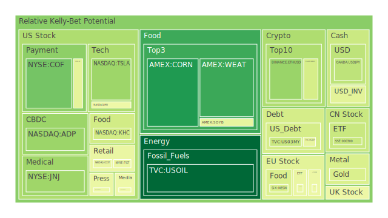
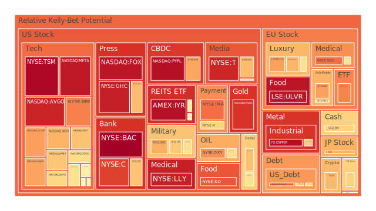
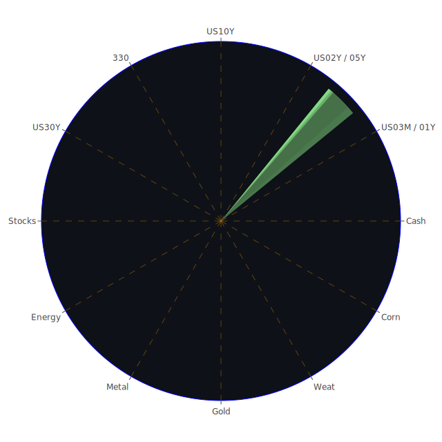

# 投資商品泡沫分析

以下從「空間面」（全球市場及區域板塊）、「時間面」（短期至長期趨勢）與「概念面」（市場情緒、博弈論、心理學、社會互動等）三位一體來審視各類主要資產可能出現的泡沫風險，以及近期新聞與歷史事件帶來的啟示。

## 美國國債
空間面來看，美國國債通常被視為全球金融市場的風向標，也是全世界資金尋求避險的主要方向。然而近期新聞顯示，美國在對外祭出大規模關稅（亦被稱為「Liberation Day」關稅），造成國際間的貿易與金融流動大幅動盪。時間面則顯示，美國各期限公債殖利率近期都在不同程度的下滑（2Y、3M、10Y等相對比去年已有顯著回落），在局勢緊張下，資金雖然有進入長天期國債的跡象，但短天期和長天期的收益率差依舊顯示倒掛或接近倒掛的狀態。概念面則可回顧2008年金融危機以及2019年貿易衝突時，當美國政府採取激烈政策舉措、全球陷入避險情緒時，美債殖利率曾一度波動劇烈。近期的泡沫指數尚未顯示美債有極度過熱的風險，但由於貨幣政策不確定與政治局勢互動，仍必須警惕潛在的長期性風險。

## 美國零售股
空間面上，美國零售股的市場較集中在內需與消費導向，但也受關稅政策衝擊而呈現壓力，如Walmart、Target等都在新聞中出現明顯下跌。時間面觀察，新聞連續數日報導「大幅下跌」、「零售商警示關稅造成物價上行消費力道可能放緩」，顯示可能出現下行風險。概念面從博弈論而言，一旦關稅帶來的價格轉嫁給消費者，削弱購買力，零售商之間將陷入激烈的促銷與成本轉嫁競爭，也容易造成獲利壓縮。2020年疫情期間亦曾見零售股大漲大跌的前例，若此時又遭遇貿易戰衝擊，加上經濟成長放緩，零售股泡沫風險相對較高，部分數據（如Target、Walmart近期泡沫指數在高檔區間）提示市場正對未來業績產生疑慮。

## 美國科技股
空間面上，美國科技股於全球市場具壟斷與關鍵技術地位，特別是半導體、電子裝置、網路服務等領域。新聞顯示特朗普關稅對晶片、智慧型手機等產業衝擊甚鉅，導致Apple、Nvidia、TSMC等相關廠商股價接連下挫；對Nasdaq指數也產生重大拖累。時間面來看，過去十年科技股曾多次因政策或經濟衝擊出現劇烈波動，如2018年中美貿易戰與2020年疫情初期。概念面可從心理學與資本市場對成長型產業的過度預期切入，一旦市場情緒翻轉，恐慌賣壓比傳統股更大，也可能在接下來的數月形成加速下跌的連鎖反應。目前Tesla、Nvidia、Apple等泡沫指數節節攀高，不少報導提到「市場對科技股泡沫可能已經累積」，務必警惕短期調整風險。

## 美國房地產指數
空間面：美國房地產市場同樣高度關注國內利率、購買力與企業資金流動。新聞面顯示，零售與高端房地產（商辦、豪宅）近期可能因關稅造成的總體經濟不確定性而受衝擊。時間面看，固定房貸30年利率去年在3%上下，如今已升至6%以上，借貸成本大增或造成房地產需求降溫。但就泡沫本身而言，目前並未顯示如2008年那種槓桿式崩解的徵兆。概念面來說，若再加上關稅衝擊，就業與經濟若受影響則房地產需求削弱。歷史上，利率變動與就業市場劇烈波動常成為誘發房市泡沫的因子。目前看起來雖不至於重演次貸危機，但風險累積仍須注意。

## 加密貨幣
空間面：加密貨幣交易遍及全球，且受市場情緒、政策、資金流動等影響甚深。報載「Bitcoin、Crypto Stocks下跌」，主要因對衝基金及散戶同時減少風險性資產配置，與全球對衝基金因關稅戰導致流動性緊張而可能縮減虛擬貨幣頭寸。時間面觀察加密貨幣的價格波動往往先行市場恐慌指標，不少歷史案例顯示每次政策或地緣衝擊，Bitcoin、ETH等都出現激烈震盪。概念面則牽涉心理學：投資人若擔憂系統風險加劇，將會瞬間湧現大筆拋售。加上近期泡沫指數亦不斷顯示，如BTCUSD、ETHUSD常在高位徘徊並有一定泡沫分數，建議對投資者而言要留意短期風險。

## 金/銀/銅
金屬商品具有不同屬性：黃金與白銀屬傳統避險資產，而銅更偏向產業需求指標。空間面：國際貿易衝突後，黃金常扮演對沖金融不穩定的角色，此次也觀察到GOLD OIL RATIO與GOLD COPPER RATIO均偏高，顯示市場對實物金可能存在避險買盤。時間面：歷史上，每逢重大政治風險或金融動盪，金銀價格往往獲得支撐，但若經濟深度衰退，工業金屬（如銅）反而可能下跌。概念面可以博弈論解析：貿易戰可能導致工業產品的全球需求減少，使得銅價承壓。黃金的泡沫風險相對可控，但若市場過度避險，加上ETF與槓桿資金湧入，也有短線過度炒作的可能。

## 黃豆 / 小麥 / 玉米
農產品受關稅與天氣及地緣政治影響最大，空間面：美中貿易歷來都有大豆、小麥等關稅摩擦的前例，此次新聞亦提到「農民憂心失去中國市場」。時間面：2018年貿易戰期間，美國農產品曾大幅下跌，並由政府出面補貼。概念面則包含社會學角度：農民與地方選民對貿易政策的反饋，若政府為了內政考量持續衝突，將對價格造成長期壓力。近期小麥、玉米數據顯示泡沫指數並不算太高，但若貿易戰擴大，供需關係失衡仍有可能令價格飆漲，或因需求銳減而暴跌，兩極風險並存。

## 石油 / 鈾期貨UX!
石油為地緣政治風向球，每逢衝突或制裁都可能劇烈波動。空間面：特朗普對中國與歐洲祭出關稅，使全球經濟成長預期下修，導致對石油需求面轉弱，油價近期大幅走跌，甚至連帶影響歐洲與美國的能源股。時間面：本次油價的下跌速度類似2020年疫情期間的快速回落，顯示市場對需求下滑的恐懼高漲。概念面：投資人一方面擔心經濟衰退，一方面擔心OPEC+產量協議變數。過去歷史中，當需求急跌時，石油價格常出現階段性暴跌。至於鈾期貨UX!較受核能發電需求與地緣政策（如核能擴張或安全疑慮）影響，屬於利基市場，若全球能源轉型更依賴核能，則可能有支撐。但近期整體泡沫指數中等偏上，短期不確定性高。

## 各國外匯市場
空間面：全球主要貨幣（USD、EUR、GBP、JPY等）均受美國貿易衝突及貨幣政策預期所左右。新聞提到「美元因特朗普對外發動關稅，引發市場對美國衰退的憂慮而出現賣壓」，顯示短期資金擔憂美國經濟前景。時間面：歷史上數次美元指數的顯著走弱常出現在美國對外衝突、聯準會鷹派轉向或是經濟轉差之際。概念面：心理層面和博弈論都指出，若市場認為貿易戰將自我傷害美國經濟，投資人就會拋售美元並轉向其他貨幣或黃金。2025年初以來，美元升勢逐漸被打斷，如今已看到EURUSD、GBPUSD呈現相對走強。然而若市場風險加大，日元或瑞郎等避險貨幣也可能成為資金停泊處。

## 各國大盤指數
空間面：美國S&P 500、Nasdaq、DJIA連番重挫，歐洲（FTSE、DAX等）以及亞太（Nikkei、上證300、台灣TWSE）亦同步下跌或呈現高波動。新聞提到「全球股市蒸發逾數兆美元」等負面標題，使投資人進一步恐慌。時間面：這種全球共振的下跌，往往在1-3週內有連續性且幅度驚人；若貿易衝突長期化，全球可能陷入長期熊市。概念面：社會學理論有指出，當指標國（美國）與世界其他經濟體脫鉤或衝突加劇，國際資金往往選擇系統性撤出風險市場，造成股市普跌。過去2002年與2008年的全球系統性風險都有類似擴散機制。如今大盤指數泡沫指數普遍偏高，更要防範若基本面沒撐住就可能迅速挫跌。

## 美國半導體股
空間面與美國科技股類似，但更聚焦於晶片製造、AI、資料中心等領域，如Intel、AMD、Nvidia、Micron等企業。新聞顯示，白宮擴大關稅措施，以及中國與歐洲反擊報復性關稅，晶片產業首當其衝。時間面：半導體產業周期性明顯，先前因AI、5G、電動車等需求而大幅上漲。一旦關稅及經濟衰退因素疊加，可能出現庫存積壓、出貨量萎縮，股價修正幅度甚大。概念面：投資人預期心理與產業前景評估在此關鍵，過去2018-2019年貿易戰時，半導體出貨曾經歷大震盪，許多公司市值大幅蒸發。近期 Nvidia 與 TSMC 股價頻遭新聞唱衰，市場泡沫風險分數高，意味投資人對該板塊抱持懷疑態度。

## 美國銀行股
空間面：銀行股對整體經濟景氣的敏感度極高，一旦有衰退跡象，銀行股風險首當其衝。新聞指出「銀行股坦克式下跌」或「市場擔心衰退及信用風險擴大」，尤其在大額關稅可能影響企業盈利能力、貸款違約風險提高。時間面：歷史上美國銀行股在2008年或2020年衝擊時都出現暴跌。概念面：銀行間博弈與聯準會貨幣政策相關度高，若市場認定聯準會為因應經濟衰退會壓低利率，銀行利差空間受壓縮，銀行盈利展望變差。近期BAC等銀行泡沫指數顯示在高檔區間，意味着市場對該股類的評價具爭議性或價格偏離內在價值。

## 美國軍工股
空間面：軍工產業多仰賴美國政府與外國軍購订单。若對外衝突或地緣風險升溫，理論上軍工需求可能增加。然而新聞顯示「歐洲與中國祭出反制關稅」，可能連帶衝擊某些武器系統的關鍵零組件。時間面：歷史數據顯示軍工股在大規模地緣緊張時能相對抗跌，但並不表示一定上漲，如2020年疫情中某些軍工股依然下挫。概念面：心理層面與政府預算是主導軍工股的因素，若美國聯邦支出在關稅造成的經濟壓力下被迫重新分配，也可能衝擊軍工股獲利前景。LMT與NOC近期泡沫指數偏高，但亦伴隨市場情緒波動，短期走勢充滿不確定性。

## 美國電子支付股
空間面：Visa、Mastercard、PayPal等公司業務雖遍布全球，但若跨境電商與旅行受到貿易或政治衝突影響，交易量可能下滑。時間面：2020年疫情期間，電子支付股因線上消費激增而大漲，但在2025年可能面臨新的挑戰：需求端增速見頂、貿易戰壓力、區域性支付系統崛起等。概念面：心理層面來看，一旦消費信心與跨境交易減少，支付企業可能同時面臨交易量萎縮與手續費收入減少，導致股價震盪。近期泡沫指數顯示PayPal頗高，市場也在關注它的成長動能能否維持。

## 美國藥商股
空間面：藥商受美國國內醫療保險政策、FDA審批，以及全球市場專利佈局影響。新聞提到「某些藥廠出現並購與專利訴訟」，如GSK與Pfizer的爭議也可能影響其他公司估值。時間面：藥商股過去多年在市場震盪時常被視為防禦性資產，但近年來研發成本與收購合併活動頻繁，估值也可能過熱。概念面：心理層面若市場將藥廠視為避險股，短期資金或許會流入，但長期必須看藥物管線與政策變動。不少泡沫指數（如MRK、JNJ等）顯示中高水位，投資者需持續關注研發進展與全球需求。

## 美國影視股
空間面：影視娛樂產業在流媒體平台之間競爭激烈，如Netflix、Disney、Paramount（前身ViacomCBS）等。新聞提到「媒體公司可能因廣告市場萎縮受到衝擊」，同時「Trump關稅戰」造成不少企業減少廣告投放支出。時間面：2020年疫情加速了串流媒體發展，但市場逐漸飽和，競爭壓力增強。概念面：觀眾觀影習慣若因經濟下滑而調整，訂閱增長或許面臨瓶頸。這些影視股的泡沫指數大多在中高檔，且新聞提到消費者削減娛樂支出跡象，值得注意短期的獲利衝擊。

## 美國媒體股
空間面：綜合報紙、電視台、媒體集團等（如NYT、FOX、CMCSA）。新聞提到「訂閱型模式成長趨緩」與「廣告主緊縮預算」，使得媒體類股在近期波動不斷。時間面：傳統媒體股因數位轉型而一度有亮眼表現，但如今市場預期廣告收入緊縮。概念面：社會學角度強調媒體對社會輿論形成影響，也會牽動政治博弈，一旦與政界產生衝突或依存，股價面容易受政治風向劇烈影響。近期FOX、NYT等泡沫分數高企，顯示市場擔憂其基本面或政治立場帶來的經營風險。

## 石油防禦股
此類公司通常在石油價大跌時會受到衝擊，但若企業同時有下游或其他綜合能源布局，仍可能平衡部分風險。新聞顯示，油價下跌嚴重時，防禦型石油公司（如OXY等）因資本支出與產能策略不同，展現的韌性也各異。若關稅、衰退預期不斷升溫，石油需求減少，股價仍難免下跌。概念上，除非該企業業務高度多元化，可以在低油價環境中藉併購或成本優勢取得更大市場份額，否則很難逆勢大漲。近期數據顯示OXY泡沫指數不低，暗示投資者對該股未來獲利能力抱持不確定心態。

## 金礦防禦股
金礦股對黃金價格高度敏感。若黃金需求因避險升溫而增強，金礦企業具備正面助力。但歷史上也常見金礦公司股價波動大，因開採成本、政治風險、環保議題等因素牽動。新聞面：目前戰爭或衝突消息多，關稅戰也可能讓投資人轉向黃金，利好金礦業。不過金礦股泡沫一旦堆高，若黃金價格反轉下跌時，跌幅也可能更劇烈。概念面：資金心理傾向囤黃金等硬資產，但如2020年3月的股市暴跌時，黃金與金礦股同樣曾出現流動性拋售，顯示短期也可能出現違背傳統邏輯的行情。

## 歐洲奢侈品股
空間面：歐洲奢侈品高度依賴全球高端消費者（包含美國、中國、中東等）。若關稅擴及奢侈品或全球富豪資產縮水，將影響其銷售。時間面：2008年金融危機與2020年疫情曾讓歐洲奢侈品股出現顯著下跌後又反彈的V型走势，但這次關稅涉及更廣泛且政治角力更深。概念面：奢侈品的消費帶有獨特的「社會身份象徵」，若對富裕族群財富打擊過大，奢侈品市場難逃衝擊。新聞裡點名的KER、RMS等企業之泡沫指數均高，需警惕估值下修風險。

## 歐洲汽車股
空間面：歐洲車廠在對美國出口以及對中國市場都相當依賴，若陷入雙邊關稅夾擊，整體銷售與供應鏈遭受巨大壓力。時間面：2018年歐美貿易戰時，德系車廠股價也出現大幅波動，這次恐重演歷史。概念面：博弈論中，一旦關稅連鎖擴散，汽車製造業從零組件到整車都會受影響，進而拖累區域性就業與經濟。新聞提到BMW、MBG等歐洲車廠股價波動加劇，投資人已顯露擔憂。

## 歐美食品股
空間面：美國與歐洲的食品業，從麥當勞等速食到雀巢等跨國食品公司，受農產品價格、關稅、運輸成本變動影響。新聞面有提及「某些速食股竟逆勢微漲」，可能因其對進口食材的依賴度較低，或市場預期其產品對價格較不敏感。但也有企業擔憂原物料成本上升或銷售下滑。概念面：消費者短期因關稅通膨壓力可能壓抑支出，但食品屬必需品也有一定防禦效果。然而若衰退嚴重，餐飲連鎖店的獲利也會遭受打擊。整體觀察，如KO、NESN等泡沫數據在相對高區，市場對食品巨頭抱有期待但也同時擔心評價過高。

---

# 宏觀經濟傳導路徑分析

以三位一體的「正反合」方式歸納：

1. **正面觀點**：部分產業如軍工、基礎民生、部分耐用消費品股因政府支出或民生必須可能獲得暫時支撐，避險資產（黃金、美國長天期國債）也可能吸引資金流入。美國部分就業數據仍顯示增加（新聞中的「Hiring Defied Expectations」），或許在短期內不致全面失控。

2. **反面觀點**：大規模關稅、政治衝突、金融市場恐慌、企業獲利預期下修，導致大多數資產承受下行壓力。美股科技、零售、銀行三大領域都重挫，國際市場亦共震下跌。聯準會雖然可能因顧及衰退風險而暫緩升息，但高通膨與政策不確定性使市場難以恢復信心。

3. **綜合思考**：在這樣的博弈態勢下，若各方不願退讓，貿易衝擊恐怕在接下來幾季持續發酵。市場將同時面對衰退、通膨、政治與地緣風險等多重因素。美國宏觀資金流向短期可能偏向黃金、美債，然而長期要看通膨走勢、企業獲利恢復與政治協商成果。

---

# 微觀經濟傳導路徑分析

1. **企業層次**：企業面對激烈的關稅與政經風險，第一步往往是壓縮成本、縮減資本支出、甚至減少人力。零售與科技產業特別明顯，因供應鏈多元卻又環環相扣，一旦某一環被關稅或禁令卡住，整個產銷流程就可能延誤，最終傳導為成本上升或營收減少。

2. **消費者層次**：關稅可能推高終端商品價格，特別是電子產品、服飾、汽車等領域。消費者在通膨與不確定的就業前景中趨於保守，減少可自由支配支出，衝擊各領域的銷售。同時高負債族群在利率上揚或經濟衰退時將更難以維持消費水準。

3. **投資人層次**：對未來不確定的心理預期造成避險情緒升溫，資金流向黃金、美國國債，或暫時退出股市、加密貨幣等高風險資產。投資組合呈現「風險資產拋售、防禦性標的買進」的典型狀況。這也形成了流動性下降、價格波動度加劇的市場結構。

---

# 資產類別間傳導路徑分析

1. **股債互動**：隨著美股大幅下挫，部分資金湧入美國國債以尋求避險，推動長天期殖利率下滑。若未來聯準會為刺激經濟而放緩升息或甚至降息，可能進一步推動債券價格。也可能加劇股市的分歧：高槓桿成長股與低槓桿價值股表現差異。

2. **商品聯動**：石油需求預期下滑，使油價與能源股走軟；黃金則因市場避險情緒攀升而獲得支撐；工業金屬（銅等）則受經濟成長疑慮壓抑。農產品視中國與其他新興市場的需求而定，一旦報復性關稅阻礙出口，價格恐下跌，但若天氣或地緣政治突發，亦可能引起另一波行情。

3. **外匯市場**：美元短線面臨拋壓，但若全球風險再擴大，或許會出現資金回流美元的矛盾走勢。歐元、英鎊、日元、商品貨幣（AUD等）也隨著大宗商品市場與地區政治情勢起伏波動，呈現短期難以預測的多邊動向。

---

# 投資建議

以下建議僅供參考，投資者應根據個人風險承受能力與財務目標謹慎決策。

1. **穩健配置（40%）**  
   - **美國長天期國債**（約15%）：利用其避險特性，抵禦股市短期下行風險。  
   - **黃金**（約15%）：在貿易衝突、政治動盪下的防禦性需求仍高，可對衝金融市場系統性波動。  
   - **高評級公司債或投資級債券基金**（約10%）：選擇財務穩健、違約風險低的企業，獲取相對穩定收益並兼具分散風險。

2. **成長配置（35%）**  
   - **AI與雲端概念龍頭股**（約15%）：如部分半導體（仍具領導地位且財務體質健全者）或雲端服務公司，雖然短期受衝擊，但在未來科技趨勢中仍保有成長潛力。  
   - **生技醫療股**（約10%）：全球人口老化趨勢下，長期需求穩定，若挑選擁有穩固管線的藥廠或創新技術公司，可望於經濟波動中維持一定韌性。  
   - **必需民生消費品龍頭**（約10%）：如大型食品飲料或生活用品公司，雖然目前泡沫風險不低，但中長期需求穩定，在貿易衝擊中相對受影響較小。

3. **高風險配置（25%）**  
   - **加密貨幣龍頭**（約10%）：Bitcoin、ETH 等，雖然波動極大且政策風險高，但若對衝傳統金融系統風險或追求高報酬，可納入小部分資金。  
   - **新興市場股票或ETF**（約10%）：如拉美或東南亞國家，短期可能劇烈波動，但部分市場有結構性成長潛力，若關稅戰使世界供應鏈重組，某些新興市場可能受益。  
   - **槓桿型商品ETF或期貨**（約5%）：包含油價反向、黃金槓桿等商品，做短線對沖或投機。但因高槓桿潛在虧損風險巨大，僅適合能承擔高波動的投資者。

上述比例僅為示意，投資者可依照個人財務目標與避險需求調整。整體分配以穩健為主、成長為次、高風險部位控制在可接受範圍內，並留意流動性與波動風險。

---

# 風險提示

1. **政治風險與政策變動**：特朗普突如其來的大規模關稅舉措，已經引發全球報復性措施，局勢若進一步升級，市場可能持續遭受系統性衝擊。

2. **泡沫風險高的投資警告**：若資金湧入避險資產過度炒作，也可能導致金銀或美國國債短期出現價格泡沫。一旦政策面翻轉或市場情緒改善，這些避險資產也可能大幅修正。

3. **全球景氣衰退風險**：若貿易戰持續，企業利潤惡化，就業市場疲弱，加上各國央行政策協調不力，可能誘發更深層的經濟衰退。各產業前景不明，需要嚴防長期性下行壓力。

4. **資金流動性壓力**：市場恐慌往往導致高槓桿或流動性不足的金融產品崩跌。投資者若在高波動時期持有衍生品或槓桿ETN，隨時面臨斷頭與資金回收困難的風險。

5. **歷史情景類比**：2008年金融海嘯、2018年貿易戰、2020年疫情均顯示當市場面臨大規模結構性衝擊時，恐慌情緒與連鎖效應可能超乎理性預測。投資人切勿忽視資本市場流動枯竭的可能性。

6. **地緣衝突擴散**：國際新聞裡亦有軍事衝突、恐攻、地區戰爭升溫等訊息，任何重大事件都可能突然打擊市場並引發外匯與商品行情劇烈震盪。

---

# 投資有風險，市場總是充滿不確定性。我們的建議僅供參考，投資者應根據自身的風險承受能力和投資目標，做出獨立的投資決策。

在當前關稅戰蔓延、地緣衝突頻發與金融市場脆弱性的環境下，應特別留意泡沫過度累積的危險信號，對於高槓桿投資以及短線博弈操作尤其要保持警覺。回顧歷史，每一次突發事件都可能帶來意想不到的雪崩式效應，任何單一因子都不足以全然解釋市場行為，但政治、心理、經濟、社會與博弈等多重因素交織往往會放大波動幅度。面對這樣的複雜局勢，投資人更須謹慎，務必做好風險控管與資金控管，平衡穩健性與成長潛力，避免盲目追高或盲目恐慌拋售。

整體而論，無論是透過空間、時間或概念層面的三位一體分析，都能觀察到全球市場與新聞脈絡間相互影響的廣度。正反合的辯證過程顯示，目前市場雖瀰漫負面情緒，但同時孕育著結構調整與長期佈局的可能。對於策略性投資者而言，抓住風險對沖原則（盡量選擇相關性低或負相關的資產），謹慎分配資產比例，方能在漫長的市場震盪中穩步前行。

 
Daily Buy Map:

 
Daily Sell Map:

 
Daily Radar Chart:

 
