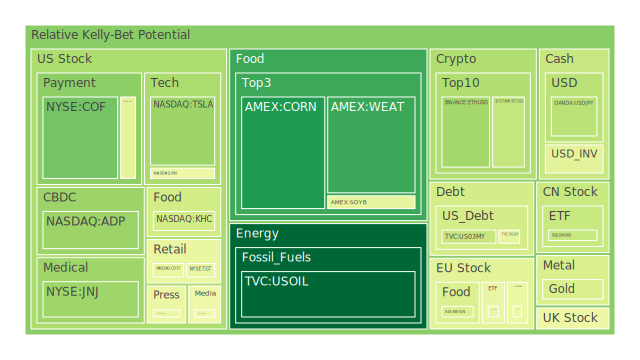

# 一、三位一體(Spatial、Temporal、Conceptional)的整合與初步觀察

## 1. Spatial：市場與新聞在不同地理區域之交織

「Spatial」層面強調各國市場與當地新聞所產生的交互影響。近日因美國對外祭出的關稅及對外政策爭端，全球市場出現劇烈動盪，無論是美國本土的科技、零售、能源等板塊，亦或歐洲的奢侈品、汽車產業，乃至新興市場國家，皆在不同程度上受到這些政策與新聞所帶來的震盪。從最新幾天的新聞可看到，與中國相關的關稅衝突再度升高，美國前總統特朗普祭出新一輪「互惠」措施，歐洲與英國則面臨其自身對外出口被「報復性關稅」波及的風險；同時，美國國內對移民議題、基礎建設、所得稅改革等的交鋒，也令各界對資金流動與財政預算前景產生不安。

再者，地緣政治因素如俄烏衝突或中東局勢對於能源供應、糧食供應及大宗商品價格也產生強烈的「空間效應」。從新聞裡可見：部分國家因關稅與國際對立升溫，暫停對美出口或重新協商供應鏈合約，尤其英國的 Jaguar Land Rover 決定暫停部分車款出口至美國，這凸顯了在「空間維度」上，不同區域間的政策、貿易保護手段會在各國股票與期貨市場引發顯著連鎖。

在投資上，可由空間視角大膽假設：不同區域的消息帶來心理預期差，並非所有區域都同步走跌，有些國家或許藉由「資源獨特性」脫穎而出。例如新聞指出墨西哥在面對美國關稅時相對「倖免」，該區股票甚至表現正向，這在短期會形成全球資金重新布局的空間轉移效應，帶動資金往相對安全與波動較小的市場移動。

## 2. Temporal：時間序列與週期性動盪

「Temporal」層面強調市場與新聞的時間軸疊加，以及週期性、季節性或事件性衝擊。觀察近期（2025-04-04 至 2025-04-06）的資金流向和泡沫數據發現：若以美股為例，近期大盤（如 NDX、DJI、S&P500）因關稅動盪引發恐慌性賣壓，多日重挫。從歷史場景看，市場對於「貿易壁壘」類新聞常在短時間內出現劇烈反應，回溯 2020 年疫情初期亦曾發生過「一日跌去數兆市值」的巨震狀況，而此類「黑天鵝」或「灰犀牛」事件往往在一段短期急跌之後，進入高波動徘徊或反彈。

同時，許多新聞報導諸如「特朗普關稅導致 S&P 500 再度重挫」「Nasdaq 再入熊市」等，都與以往美國政府頻繁出手干預經貿的時期相呼應。通膨、利率、就業報告等亦隨著時間節點的不同，不斷扮演推波助瀾或緩衝的角色。本次新聞也點出「JPMorgan 成為首個預測美國經濟將因關稅而陷入衰退的大行」，而失業率數據、消費者信心甚至房貸利率都在時間軸上有所變化。尤其從 FED 公佈的要點看：EFFR 交易量在 2023-08-16 停止上升趨勢，接著高收益債利率也在 2023-08-15 出現更嚴重的飆升。而在四月初的環境下，就業市場剛公佈出「招聘量大幅減少」，更添市場對往後幾個月資金流趨勢的恐慌。

在投資上，可由時間序列作大膽假設：當負面新聞「同時出現且頻率加快」之際，往往引發集中拋售或資產重估。隨著時間推移，若事件未持續惡化，市場則可能進入大幅震盪後的修復，或出現部分結構性調整。就算同樣的關稅政策，一旦市場在心理上「習慣」或做出對沖安排，後續的殺傷力就會遞減。這些推斷符合經濟學的黏性價格理論與心理學的習慣形成效應。

## 3. Conceptional：概念與敘事激烈碰撞

「Conceptional」層面聚焦於市場的主流敘事、心理預期及博弈論邏輯。近期對貿易爭端與整體經濟前景的悲觀情緒高漲，新聞鋪天蓋地報導「史上最嚴重關稅風暴」「市場再現 2020 式斷崖」等耸動標題，使投資人信心脆弱。當散戶在社交媒體上集體發出「再也不買期權了」「這是史上最慘崩跌」，形成了羊群效應與恐慌情緒。若從博弈論角度推演，市場中大機構經常利用散戶的恐慌進行對沖或反向操作，導致價格短期之間劇烈震盪。

同時，部分正面新聞雖然不多，但也時有出現。例如墨西哥股票市場有「未遭關稅波及」的上漲、個別企業（如 Guess、Nike、Lululemon）的財報優於預期等，為市場提供了「多空對決」的素材。若市場敘事被恐慌洗禮到一定程度，「正反合」的最後常出現一波反彈，或至少進入震盪格局，直到新的負面事件再度出現。就心理學而言，密集恐慌新聞與散戶集體驚慌賣出有時意味著市場過度反應，暗示後續可能會有超跌反彈或板塊輪動。

從概念層面推斷，當市場全面恐慌時，防禦性標的或避險資產（如黃金、金礦股、短天期美國國債）或許會吸引短暫買盤。新聞中亦可看到「Bank of America、JPMorgan 等華爾街巨頭股價暴跌」，然而也有人趁這種恐慌的風險溢價時機進場。如果後續爆發更大範圍的衰退風險，市場或出現「資產洩洪」轉向黃金或美元現金，但在當下的敘事裡，美元本身也受「貿易戰拖累」而震盪不小，投資人心理上難以找到明顯「零風險」標的。

---

# 二、三位一體的正反合：最少文字、最大意義之整合

以下以「空間（Spatial）－時間（Temporal）－概念（Conceptional）」的正反合方式，粗略歸納為：

- **正（Thesis）**：新聞大量負面，市場恐慌，關稅、通膨、利率與政治風險同時襲來，全球股債等資產急劇波動。  
- **反（Antithesis）**：局部地區和特定產業有脫鉤機會（如墨西哥、部分零售、部分消費必需品）；投資人常在極度恐慌時尋求低估機會或轉向避險品。  
- **合（Synthesis）**：最終或許形成新一輪資金布局；若政治或經濟面暫緩惡化，超跌板塊可能帶來技術性反彈。投資組合應重視風險分散與流動性。

以上三要素交織下，我們得到的核心結論是：大環境不確定性極高，投資人應保持謹慎看待短中期劇烈震盪，並適度考慮跨市場對沖、避險乃至不同相位的資產輪動。

---

# 三、各投資商品泡沫分析

以下針對多種投資品種進行泡沫與風險分數的綜合解讀（本報告中提到的「PP100」、「D1/D7/D14/D30」分別是即時現價與短期、中期及月平均的泡沫指數。數值較高者代表風險更高）：

1. **美國國債**  
   - 主要觀察對象：US10Y、US30Y、US05Y、US02Y、US03MY、US01Y 等。  
   - 近期受到 FED 收縮資產負債表、利率走勢與避險需求影響。從新聞來看，政治動盪加劇以及對經濟衰退的預期，通常會推動短期國債需求增加，部分收益率曲線倒掛現象依舊明顯（如 10Y-3M 在 -0.27 一帶）。  
   - 泡沫指數方面，短天期債券的 D1、D7 有時在中等水準，但因市場避險情緒升溫，有些指標顯示資金流入使得短端利率快速降溫。需注意若後續通膨或信用風險升高，長端國債也有可能再度面臨賣壓。

2. **美國零售股**  
   - 代表標的：WMT、TGT、COST、HD 等。  
   - 近期新聞顯示零售板塊行情兩極：Costco（COST）雖然一度遭遇拋售，但長期商業模式穩固；Walmart（WMT）受大盤影響和關稅衝擊一同下跌。TGT（TGT）之 D7、D14、D30 泡沫分數皆處於高檔，恐顯示市場短期對其預期偏悲觀。  
   - 從歷史案例看，零售類股易受消費支出與關稅政策直接衝擊，若關稅升高，進口商品成本增加，消費者購買力下降，零售板塊難以維持高估值。

3. **美國科技股**  
   - 代表標的：AAPL、MSFT、GOOG、AMZN、META 等。  
   - 新聞顯示此類股在本輪下跌中殺傷力很大，蘋果（AAPL）一度市值蒸發數千億美元，Nvidia、Tesla（歸於科技成分亦可）皆大幅波動。  
   - 泡沫指數方面，多家龍頭公司 D1 與 D7 皆在中高水準，甚至不少指標顯示逼近高泡沫區域，結合新聞「Magnificent 7 再度重挫」可見短期風險偏高。

4. **美國房地產指數**  
   - 代表標的：RWO、VNQ、IYR 等。  
   - 近期美國房市因利率高企而承壓，新聞也提到「房貸 30Y 固定利率曾超過 6.5%」，使市場對房地產需求與 REITs 前景堪憂，VNQ、IYR 的泡沫分數在 D14、D30 都處偏高，暗示此板塊風險不容小覷。  
   - 歷史上當利率持續上升，REITs 容易被拋售，但若之後利率走緩或降息預期抬頭，房地產類股也常有一波相對大反彈。

5. **加密貨幣**  
   - 代表標的：BTCUSD、ETHUSD、DOGEUSD 等。  
   - 新聞面上暫未強調加密貨幣的政策面衝擊，但整體市場恐慌時，加密貨幣時常與高風險資產同步回落。最新數據顯示，比特幣 BTCUSD 的 D1 接近 0.367924，D7 接近 0.476957，屬中高泡沫區域。ETHUSD、DOGEUSD 亦類似。  
   - 歷史經驗顯示，加密貨幣易受流動性與市場情緒顛簸，若股市連續大跌，投資者有時會拋售加密貨幣以換取現金，是典型的高 Beta 風險標的。

6. **金/銀/銅**  
   - 代表標的：XAUUSD、XAGUSD、COPPER。  
   - 在新聞面，地緣與經濟衝突升高時，黃金（XAUUSD）常作為避險選擇。近期泡沫分數在中等偏上，顯示資金有部分進場，不過也因美元波動使金價不夠穩定。白銀（XAGUSD）波動更激烈，D14、D30 皆在高檔區域（如 0.90 上下），投資風險更大。銅（COPPER）與全球製造需求關聯度高，受關稅衝擊與經濟衰退預期，泡沫指數幾近飽和，隨時可能崩跌或反彈皆有可能。  
   - 從歷史來看，金銀價格常與市場恐慌度正相關，但也要留意升息與美元走勢的反向作用。

7. **黃豆 / 小麥 / 玉米**  
   - 代表標的：SOYB、WEAT、CORN。  
   - 農產品易受貿易戰直接衝擊。數據顯示，小麥（WEAT）的泡沫分數在 D1 約 0.155488-0.166159，屬於偏低區段，相對風險不算過高；黃豆（SOYB）與玉米（CORN）則略高一些。若美中貿易糾紛升級，農產品可能面臨需求削弱或出口受限。  
   - 歷史上貿易戰對農產品常產生劇烈價格波動，一旦需求受到封鎖或補貼政策介入，價格就會出現非理性漲跌。

8. **石油 / 鈾期貨(UX!)**  
   - 代表標的：USOIL、UX1!。  
   - 石油（USOIL）在本次關稅爭端中下跌幅度顯著，新聞多次提及「油價重挫 6%」、「供需雙重不確定」。泡沫分數從 D1 約 0.015551 起算，顯示雖然價格來到低位，但市場對未來需求仍不樂觀。  
   - 鈾期貨（UX1!）雖然在整體報價中較冷門，但受到地緣政治與核能需求等議題干擾。數據顯示其 D1、D7、D14、D30 都是 0.510716 左右，顯示風險雖在中段，但一旦核能需求或能源轉型政策有重大進展，價格可能急漲；反之若全球經濟下行，需求也會被看淡。

9. **各國外匯市場**  
   - 代表標的：EURUSD、GBPUSD、AUDUSD、USDJPY 等。  
   - 新聞裡提及美元因「信心危機」而大幅震盪；若美國內部政治衝突加劇或經濟基本面惡化，美元指數可能下行。英鎊（GBPUSD）受英國本土通膨與政治動盪也較不穩定；澳幣（AUDUSD）常與大宗商品價格掛鉤，同樣波動加劇。  
   - 長期看，若美國進一步緊縮貨幣或全球資金風險偏好降低，日圓（USDJPY）有時反而成為臨時避險貨幣。但近期數據顯示 USDJPY 的 D1 約 0.349-0.356，市場對後市走勢分歧。

10. **各國大盤指數**  
    - 代表標的：SSE 000300（中國）、JPN225（日本）、GDAXI（德國）、FTSE（英國）、FCHI（法國）等。  
    - 中國市場由於美中關係與資金外流，不確定性高；日本則在貨幣政策趨勢下吸引部分投資者，但若全球衰退，日本外向型企業也會受衝擊；歐洲主要指數（GDAXI、FTSE、FCHI）則受到歐洲當地產業與對外貿易依存度牽動。  
    - 泡沫分數看，GDAXI、FTSE、FCHI 等的 D1、D7 介於中高區間。一旦關稅向歐洲擴散或歐元區經濟疲弱，可能進一步打擊。

11. **美國半導體股**  
    - 代表標的：NVDA、AMD、QCOM、INTC、MU、KLAC、AMAT、TSM 等。  
    - 美國祭出高科技管制與中國對等報復，半導體成為焦點。新聞多次點名 Nvidia、TSMC、Intel 等皆大跌，尤其 Nvidia 與 TSMC；AMAT、KLAC 作為設備類股也受到波及。泡沫分數普遍在高檔，如 AMAT 的 D30 接近 0.92-0.93，顯示估值壓力很重。  
    - 歷史經驗：半導體產業具有「晶片製造週期」，當終端需求放緩或關稅打擊供應鏈，股價往往出現深度修正。

12. **美國銀行股**  
    - 代表標的：JPM、BAC、C、COF 等。  
    - 新聞顯示銀行股近期表現不佳，除了利率走勢不確定之外，也與大盤恐慌有關。BAC、C 的泡沫分數在 D1 幾近 1.0，暗示市場對其風險已非常警惕。COF（Capital One）則在報表中顯示 D1 約 0.234411-0.439935（不同日期稍有差異），波動劇烈。  
    - 歷史經驗：銀行股易受經濟週期、信用風險與政策衝擊，若企業與消費者都陷入還款困難，銀行呆帳可能攀升。

13. **美國軍工股**  
    - 代表標的：LMT、NOC、RTX 等。  
    - 近期地緣衝突不斷，軍工股有時具備防禦屬性，但本輪美股系統性跌勢也拖累了這些標的，如 LMT 的 D14、D30 泡沫指數頗高；NOC 近期數據也顯示接近 0.70-0.83。整體看來，軍工產業雖然在衝突加劇時有訂單支撐，但金融市場的系統性風險依舊不可忽視。

14. **美國電子支付股**  
    - 代表標的：V、MA、PYPL、GPN 等。  
    - 電子支付受消費數位化趨勢支持，但若經濟轉差，交易量亦可能降低。PYPL（PayPal）過去一年股價動盪劇烈，如今泡沫分數在 D1-D30 都達 0.95 以上，風險極高；V、MA 則相對體質較穩。  
    - 歷史上景氣轉折期，信用卡消費、線上支付成長往往放緩，市值也會出現高估修正。

15. **美國藥商股**  
    - 代表標的：JNJ、MRK、LLY 等。  
    - 醫藥板塊相對於其他高 Beta 產業的抗跌性往往較佳，但本輪因大盤重挫，也不能獨善其身，MRK、LLY 的 D1、D7 都顯示在中高區域。  
    - 回顧歷史：醫藥股主要看研發、授權與訴訟風險等因素。但若經濟衰退，醫藥保險制度或政府管控成本也會波及這類股票。

16. **美國影視股**  
    - 代表標的：NFLX、DIS、PARA、FOX 等。  
    - Streaming 服務在疫情後發展迅速，但面臨同業競爭與大環境衰退壓力，新聞裡提到 Netflix（NFLX）股價之前大漲後又震盪，現今泡沫指數 D1 約 0.4629，D30 甚至可達 0.69 以上。  
    - 若消費者收緊預算，付費訂閱成長受限；電影產業則可能因院線不振而乏力。

17. **美國媒體股**  
    - 代表標的：NYT、GHC、CMCSA 等。  
    - 傳統媒體如 NYT 面臨數位轉型競爭；GHC（教育與媒體集團）較為穩定但市值不大，亦受廣告景氣影響。新聞稱「華爾街巨頭對媒體板塊的預期轉差」與整體廣告預算縮減。  
    - 歷史經驗：當廣告市場下滑、企業削減行銷費用，媒體股也常同步下跌。

18. **石油防禦股**  
    - 代表標的：XOM、OXY 等。  
    - 雖然是石油相關，但企業在大型整合或政治風險時，往往能藉併購、上下游垂直整合等方式減少衝擊，但這次關稅環境對能源需求前景的擔憂仍造成壓力。XOM、OXY 的 D1 與 D7 大多在 0.60-0.74 的區段上下波動。

19. **金礦防禦股**  
    - 代表標的：RGLD 等。  
    - 與黃金行情正相關。RGLD 近期 D1 已高達 0.90-0.91，意即市場雖將其視作防禦手段，但同時估值已非常昂貴，後續若金價回落，該類股恐面臨較大修正風險。

20. **歐洲奢侈品股**  
    - 代表標的：MC、RMS、KER 等。  
    - 歐洲奢侈品依賴海外消費，尤其中國與美國旅客。若貿易緊張、簽證或關稅阻礙旅遊與出口，都會衝擊消費量。RMS、KER 的泡沫指數在 D14、D30 也都較高。  
    - 回顧 2008 金融海嘯、2020 疫情時，奢侈品股雖有短暫回落，但因品牌溢價力強，之後能迅速修復，此為該領域的特殊歷史現象。

21. **歐洲汽車股**  
    - 代表標的：BMW、MBG、PAH3 等。  
    - 歐洲車廠在能源轉型、電動化、關稅風險等多重挑戰中掙扎，如 BMW 停止出口至某些市場的消息。具體看，BMW 泡沫分數在 0.45-0.49 區間，屬中等，代表市場對其前景尚存疑慮。  
    - 歷史經驗：車市疲軟時，歐洲汽車製造股常跟隨全球景氣下行，除非電動車轉型加速成功。

22. **歐美食品股**  
    - 代表標的：NESN、KHC、KO 等。  
    - 快速消費品在衰退時相對穩定，然而當前因關稅增高且原物料漲勢尚未緩解，食品公司成本上升，獲利空間受到擠壓。NESN、KHC、KO 的 D30 多在 0.60-0.87 區間不等，顯示估值仍不低。  
    - 歷史上食品行業具備抗週期性，但當全球金融市場全面性下跌時，也不免被資金拋售套現。

---

# 四、宏觀經濟傳導路徑分析

根據 FED 近期數據，總資產下降、RRP 下降、EFFR 交易量高位、BTFP 低位、Discount Window 低位等，都顯示流動性雖未見完全枯竭，但市場信心顯著下降，商業銀行信用卡呆帳與商業地產逾期率都在高位，暗示實體經濟隱憂。當利率與衰退預期攀升，金融機構更趨謹慎收貸，企業貸款或融資環境縮緊，又進一步壓抑投資意願與消費，造成就業減緩甚至失業增加，這些反饋回到整體市場的估值體系，可能引發連鎖拋售。

此外，美國債券市場收益率曲線持續倒掛，且新聞暗示「JPMorgan 預測衰退」，表明主流金融機構對未來 6-12 個月的經濟表現顯得悲觀。關稅政策如果持續升級，製造業與出口企業的營收受到影響，帶動新一輪營運調整、裁員，或許在未來幾季進一步惡化。這些都是宏觀層面「從金融到實體」的傳導路徑。

---

# 五、微觀經濟傳導路徑分析

微觀層面則涵蓋企業與個人行為。新聞顯示，一些美國大零售品牌與科技公司已預期供應鏈受關稅衝擊而暫緩招募計畫，有些公司甚至提高產品售價，並評估是否將生產轉移到關稅較低國家。個人消費端看到失業率若開始攀升，消費能力收縮。微觀角度裡，心理因素又扮演重要角色：散戶一旦目睹財報利空或新聞負面，就可能快速棄守某板塊，導致股價出現大幅向下跳空。

從歷史上幾次關稅衝擊案例看，一些中小型企業若對外貿易依賴高，受到的衝擊最大，並將影響當地就業與稅收。進一步惡化則可能引起地區性銀行的壞帳、地產價格下行，最終在微觀層面累積成區域經濟問題。

---

# 六、資產類別間傳導路徑分析

- **股、債關係**：市場通常在恐慌時拉升國債，壓低股價。但若通膨不斷、債券價格下跌，則「股、債同跌」可能發生。  
- **商品、貨幣關係**：當石油、農產品價格因貿易爭端而大幅波動，進出口國貨幣也會跟著升貶；若對通膨有明顯推升效應，將影響全球央行政策。  
- **避險資產與風險資產**：黃金與加密貨幣有時都被視為替代的避險選擇，但兩者性質迥異；當市場動盪極端化，加密資產常被先拋棄，反而黃金在長久以來的「硬通貨」地位更穩。  
- **地理區域互動**：歐洲、亞洲與美國之間的關稅糾紛，導致全球供應鏈重整；有些新興市場受益，另一些則因地緣衝突或財政脆弱性遭拋售。

在相位角度上，若某些資產與另外一個資產之間的相關程度能落在 -0.5 左右，可能成為對沖組合。例如石油與部分科技股的走勢有時呈負相關，但須考量中長期大環境。

---

# 七、投資建議

**1. 穩健型配置（約 100% 的資金中，分配如下）**  
   - 40%：美國短天期國債（如 US03MY、US01Y）或高信用評等的企業債，鎖定基礎利息、降低波動。  
   - 30%：防禦性股票，例如金礦防禦股（RGLD 需留意其已高泡沫），或穩定型消費必需品（如 KO），但要注意它們的 D30 風險已不算低。  
   - 30%：黃金現貨/黃金 ETF，或許能在地緣、金融動盪時作避險。

**2. 成長型配置**  
   - 35%：美國科技龍頭（如 MSFT、AAPL），雖然短期泡沫分數高，但長期競爭力仍具吸引力；然而要預留對沖空間，例如買入部分看跌期權。  
   - 35%：半導體設備股（如 AMAT、KLAC）或部分晶片龍頭（NVDA），博取中長期 AI 與雲端需求；泡沫分數雖高，可在大跌時分批承接。  
   - 30%：歐洲奢侈品（如 RMS、KER）或新興市場中具備逆勢成長潛力的股份，若全球衰退有限，奢侈品牌往往於復甦期大幅反彈，但要密切追蹤關稅發展。

**3. 高風險配置**  
   - 40%：加密貨幣（BTCUSD、ETHUSD），承擔極高波動度；需嚴設停損與部位管理。  
   - 30%：高槓桿原物料交易，如石油期貨（USOIL）或銅期貨（COPPER），在劇烈波動中尋求投機空間。  
   - 30%：新興市場高 Beta 股票（如部分拉丁美洲市場股、或部分結構轉型國家），利用政治博弈與低估值差異做「短期衝浪」，但要注意一旦消息面惡化容易陷入流動性危機。

---

# 八、對沖組合機會與相關係數(-0.5)的篩選示意

在三種配置之外，若想透過不同相位（120 度）來分散風險，可考慮以下示意作法：  
- 以大宗商品（如黃金、石油）和部分債券或貨幣做對沖，觀察它們在歷史數據中短期的走勢相關度是否能達到相近 -0.5。  
- 例如石油（USOIL）對美國短天期國債在某些時期呈現負相關，若評估過去一年數據是相對穩定，即可嘗試建立「商品＋國債」對沖部位。  
- 再搭配部分高波動科技股，檢視長期 Beta 值與商品/債券間的協同度，力求使整體組合達到相位分散。

---

# 九、漣漪效應傳導路徑：三位一體的兩兩相互驗證

基於前述三位一體（Spatial、Temporal、Conceptional）之框架，若我們嘗試兩兩相互驗證：

1. **Spatial x Temporal**：  
   - 美國突然對某國或地區祭出嚴厲關稅（空間事件） → 當地股市瞬間跳水，若該地區占全球供應鏈比重高，於數日或數週（時間維度）內，全球多個市場陸續受衝擊 → 形成第一輪流動性危機。

2. **Temporal x Conceptional**：  
   - 新聞報導集中化、散戶情緒在短時間達到高潮（時間維度），再加上概念面上的「劇烈悲觀敘事」帶動市場非理性賣壓 → 大型機構或內部人於超跌時反向佈局，隨著時間推移出現技術性反彈或局部資金回流 → 市場進入新的博弈階段。

3. **Conceptional x Spatial**：  
   - 某種「關稅是愛國主義象徵」的概念論述在特定國家傳播（概念與空間結合） → 政府決策更趨強硬 → 另一方國家則從情緒對抗出發進行報復 → 兩國經濟雙輸，而第三國（如墨西哥）相對收益 → 資本於空間層次上的轉移加劇。

綜合上述路徑，各國市場間可能出現連續的漣漪效應，牽動匯率、債券利率、公司融資成本、消費支出等。最終若在全球層面形成共振，則有進一步引發系統性金融風險的可能性。

---

# 十、投資結論與風險提示

1. **綜合判斷**：從三位一體正反合來看，全球市場短期籠罩在關稅壓力、地緣政治衝突，以及貨幣政策不確定性當中，泡沫指數在多數大類資產上呈現中高水準，意味風險並未完全釋放。  
2. **投資建議**：穩健投資人應保持充足的現金或債券部位以抵禦短期風險，並小幅配置防禦性股票；成長型投資人可集中於具有核心競爭力的科技、半導體，但宜分批進場並設對沖；高風險投資人可利用加密貨幣、大宗商品期貨等行情波動較大標的嘗試搏擊，但必須嚴控倉位。  
3. **關注泡沫警訊**：本報告引用的 PP100 與 D1/D7/D14/D30 泡沫指數顯示，多個板塊已處高風險狀態，一旦消息面進一步惡化，不排除會出現流動性風險或踩踏。  
4. **歷史視角**：2020 年疫情或更早的金融危機，皆在高槓桿、高估值環境下被突發事件引爆；當下關稅戰與政治不確定性同樣具有「潛在導火線」性質。  
5. **中長期布局**：若關稅紛爭能稍微趨緩、利率與通膨漸趨穩定，部分遭錯殺的板塊可能釋放機會。投資者需同時關注全球供應鏈重組，以及新興市場可能的增長潛力。  
6. **警惕泡沫風險**：莫忽視任何高估值、高槓桿或基本面疲弱之標的，市場仍暗藏泡沫破裂的可能。

---

# 風險提示

投資有風險，市場總是充滿不確定性。本報告根據近期新聞與歷史案例，嘗試從經濟學、社會學、心理學與博弈論多重角度做出分析與大膽假設，但任何結論皆僅供參考，不構成投資建議。投資者應依據自身財務狀況、風險承受能力與投資目標，做出獨立而審慎的決策，並隨時留意市場動向。尤其面對當前關稅爭端、地緣政治變數與利率走勢反覆等因素，都可能令資本市場在短時間內出現劇烈而難以預測的波動。當泡沫指數飆升或市場上出現系統性風險端倪時，應適度調整部位、保留流動性，以應對突如其來的下行衝擊。

 
Daily Buy Map:

 
Daily Sell Map:

 
Daily Radar Chart:

 
