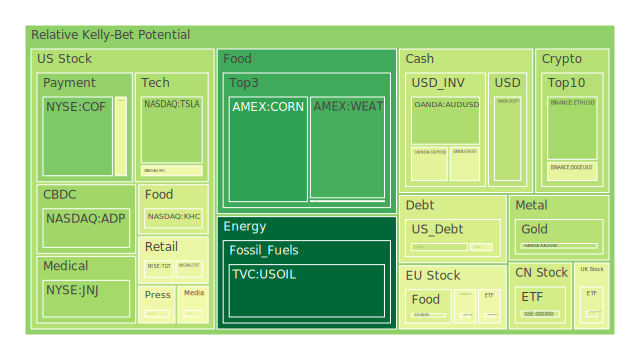
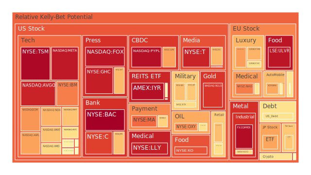
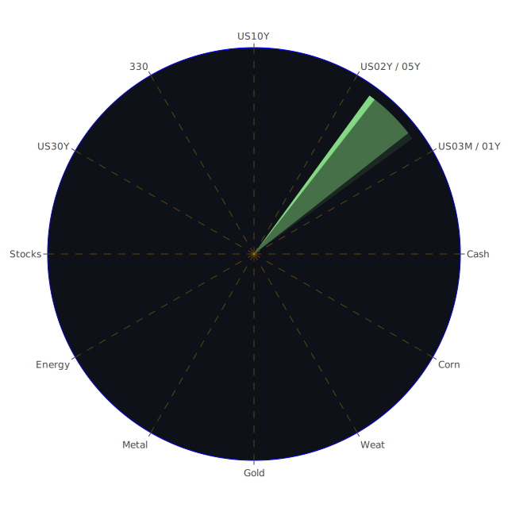

# 一、三位一體（資訊航母）之整體脈絡：空間（Spatial）、時間（Temporal）、概念（Conceptional）

在正式進行各資產類別泡沫風險分析前，先運用「空間、時間、概念」三位一體的三重視角，進行簡要的「正、反、合」大膽假設，作為後續深入探討之基礎：

1. **空間性（Spatial）三位一體**  
   - **正面（正）**：全球主要市場（美國、歐洲、亞洲）同時面臨地緣政治或國際貿易摩擦，然而部分區域仍有基礎需求與人口結構等中長期動能。例如新能源議題、AI/半導體研發布局在一些國家仍持續擴張，形成長期多頭力量的空間潛在支撐。  
   - **反面（反）**：國際新聞多次顯示因貿易關稅、通膨與貨幣緊縮影響，各國或跨國企業可能減少投資計畫、產業鏈遷移困難等，這在不同地區之間同時帶來資金流向的不確定性，引爆區域資本市場間的競爭與衝突風險，也可能加劇對部分板塊的泡沫擔憂。  
   - **綜合（合）**：區域之間因政策及產業動能差異，而形成「分化併進」的局面。若各國在貿易上持續博弈，卻在某些關鍵產業上必須互相合作，投資者或能藉由空間性的分散方式，鎖定不同國家或區域內之相互對沖機制，以取得風險分散與潛在收益。

2. **時間性（Temporal）三位一體**  
   - **正面（正）**：短期內，由於國際關稅爭端與各種負面新聞的集中爆發，市場情緒悲觀，資產價格受到壓抑。然而，歷史上幾經「利率高峰—衰退—復甦」的循環後，中長期往往能伴隨企業調整與供應鏈再布局，一旦市場確定新的政策基調或衰退風險釐清，資金可能重新進場。  
   - **反面（反）**：一旦市場持續在利率高位區震盪過久，或就業、企業獲利數據長期不及預期，某些高泡沫風險的品項可能面臨較大跌幅。另外，若地緣衝突或國際對立持續拉長，對於全球供應鏈的時間節點帶來遞延性風險，任何一環斷裂都可能在不確定的時點引發多米諾效應。  
   - **綜合（合）**：時間軸的投資策略宜精準分層，短期觀察資金流動與避險行為，中期關注各國重新協商貿易細節的進展，長期佈局則聚焦於可持續發展與政策配合度高的產業，以時間層次拉開風險承擔與獲利空間。

3. **概念性（Conceptional）三位一體**  
   - **正面（正）**：從經濟學、心理學、社會學、博弈論四大面向來看，一部分投資人仍深信在通膨趨緩、中央銀行操作漸進、地緣政治局勢最終會達成某種妥協，市場情緒可望在「壞消息出盡」後反彈。  
   - **反面（反）**：心理與社會層面若持續被悲觀、恐慌訊息所籠罩，投資信心疲弱容易造成「過度拋售」，加上貿易保護主義與宏觀數據疲弱的陰影，長期下來有引發更深層不安。博弈論則指向若各國政治角力加大，各自都不願輕易讓步，全球資本市場可能繼續陷入震盪。  
   - **綜合（合）**：投資行為終究需要落實在「經濟與企業基本面」與「人性情緒循環」之間的動態平衡。因此，透過政策觀察、利率周期、風險平價等不同層面的分析，可以在概念層次上找到特定的價值洼地，也可察覺到哪些品項的泡沫程度已經高於合理範圍。

---

# 二、投資商品泡沫分析

以下針對各種資產類別進行概述性泡沫風險討論，依據提供的泡沫分數（包含D1、D7、D14、D30等不同平均維度），以及新聞事件中多次負面情緒衝擊的內容，嘗試由基本面、情緒面、歷史類比等角度給出觀察：

## 1. 美國國債
美國國債在近期的FED資料中顯示，整體殖利率曲線呈現持續倒掛修正的現象。短天期（如2Y、1Y、3M）債券殖利率數值從高位回落，其中2Y Yield降至3.48左右，而10Y Yield則大約在3.90上下徘徊。據報FED總資產負債表雖仍在縮表，但面對通膨和金融市場動盪，倘若FED再度轉向過度鷹派，長端利率未來波動恐再加劇。歷史上當美債殖利率曲線嚴重倒掛又突然修復時，往往暗示經濟衰退風險可能逼近，投資人需提防美國國債短線價格波動。若負面新聞持續，避險買盤可能湧入長天期美債，一時拉低收益率，但任何對通膨的負面訊號，都能再度衝擊債市定價。過往金融危機（如2008年）與多次「Fed轉鷹」歷程顯示，美國國債仍是避險焦點，但其波動度在這種特殊週期裡會放大。

## 2. 美國零售股
美國零售板塊如TGT、WMT、COST等，近期新聞充斥對就業、消費支出降溫的疑慮，關稅與經濟動盪加重成本壓力。雖然零售股有些在歷史上於消費旺季或降息週期會表現不錯，但目前新聞中對市場前景的負面報導不少，尤其近期有關「市場大跌、需求萎縮」的說法，並提到美國國內信用卡違約率、消費信貸壓力等都在蠢動。TGT出現D1約0.447～0.454之間的泡沫風險值，也不算極低；而WMT則在0.667左右的區域（短期），顯示市場有一定的擔心。須留意到：零售業毛利率受進口關稅與庫存調整牽制，再加上新聞負面情緒很高，如果貿易戰與通膨問題遲遲無法解決，部分企業盈餘將會繼續承受壓力。

## 3. 美國科技股
此範疇包含了AAPL、MSFT、GOOG、AMD、NVDA、QCOM等大型科技龍頭，也囊括部分半導體類（例如AMAT、KLAC）或網路服務商（META、NFLX等）。新聞事件顯示，貿易、關稅、地緣爭端衝擊供應鏈，而AI伺服器需求也可能因國際政策擔憂而出現調整。觀察到NVDA的泡沫風險分數在0.55～0.69區域，AMD約在0.61上下，GOOG則也高於0.54，尤其META更是0.94之上，顯示若市場進一步惡化，科技股下殺空間不可小覷。歷史上科技板塊波動度較高，也常成為資金湧入或撤出的先鋒。雖然有部分投資人期待AI或雲計算的大趨勢可以帶來長期增長，但短期新聞中明顯的負面情緒與地緣不確定性，足以使投資者保持警戒。

## 4. 美國房地產指數
房地產ETF與相關類股，如VNQ、RWO等，目前D1泡沫分數約介於0.50～0.54之間，中長期數值甚至達到0.69上下。另一方面，FED紀要顯示固定房貸30年利率正處於6.64的水平，相較2020年、2021年僅3%多的超低利時代已經大幅升高，這會壓抑抵押貸款需求與購屋意願，開發商庫存壓力增加。新聞裡也提到建商為減少庫存與刺激成交，正在祭出降價及補貼貸款利率的方案。歷史上，美國房市往往在利率快速升降的輪替之間，最容易出現價格大幅震盪。如果就業若放緩或失業率走高，房地產估值可能面臨更大的下行壓力。

## 5. 加密貨幣
BTC、ETH、DOGE等。新聞報導顯示，比特幣、以太幣在「關稅戰升溫、風險資產普遍重挫」的氛圍中同樣表現疲弱，部分交易員擔憂監管因素或市場資金流出。數據顯示BTC雖然在先前短暫上衝，但當前D1在0.58～0.68左右，ETH則在0.30上下浮動，DOGE近期有高達0.58～0.59的水準（亦有波動）。回顧2018年、2022年加密貨幣的高峰與崩盤，情緒與流動性是最關鍵的驅動因子。目前新聞大多負面，市場資金在全球不穩定的情況下傾向撤離風險資產。雖然加密世界仍有長期信仰者，但此刻投機資金有限，故易出現大起大落行情。

## 6. 金 / 銀 / 銅
貴金屬與工業金屬的走勢常受地緣政治與市場風險偏好影響。當前黃金XAUUSD在D1約0.33～0.41之間，呈現稍微偏向中高風險的狀態；白銀XAGUSD較高，在0.60～0.64甚至0.85（週期不同）都顯示市場對銀的投機比重較大；銅COPPER則泡沫分數偏向0.97之高，表示市場對銅價的炒作或許已有過熱嫌疑。歷史上常在避險情況下，黃金受到追捧，銀則同時具備工業與貴金屬雙重屬性，其波動度往往更甚；銅則主要看全球工業需求，一旦衰退風險加劇，銅價有大回調的可能。  
近期新聞多次提到「銅牛市轉空」與「經濟衰退擔憂」，加上各國對基建與供應鏈重新分配，使銅價變得極度敏感。2020年的時候，銅也出現過類似波動，一旦需求成長前景轉弱，銅價便易大幅修正。

## 7. 黃豆 / 小麥 / 玉米
農產品方面，如SOYB（黃豆）、WEAT（小麥）、CORN（玉米）等，泡沫風險整體處於中間或稍高位置，例如CORN約0.12～0.46之間，小麥則在0.15上下波動，黃豆約0.44～0.48。新聞亦提到農業關稅與國際糧食供應鏈轉移，並有農民擔憂成本激增。歷史上，農產品價格除受天氣及自然災害影響，也跟地緣政治（關稅政策、出口禁令）密切相關。若貿易衝突未解，則農產品需求與流通受限，可能推升或壓抑價格，並產生結構性風險。2020年疫情初期也曾見到農產品期貨的劇烈波動，投資者應保持警惕。

## 8. 石油 / 鈾期貨(UX!)
石油(USOIL)短線PP100約在59～62美元之間，新聞面屢屢顯示經濟衰退風險拖累能源需求，美國原油庫存可能過剩。另外，鈾期貨(UX1!)在D1約0.51左右，顯示對核能需求的投機情緒並不算特別低；隨著地緣政治安全關注度上升，若歐美對核能政策態度轉向積極，鈾價格有潛在走高空間；反之，若再度爆發安全爭議或替代能源突破，鈾價也可能快速冷卻。石油從歷史看，多次在地緣衝突升溫時飆漲，但本次各新聞主要聚焦「全球經濟成長趨緩」造成需求疑慮，市場對石油的熱情度低且泡沫風險暫不算極端（D1落在0.003～0.015附近，顯示短期風險偏低，但要注意經濟面衰退陰影）。

## 9. 各國外匯市場
如USDJPY、EURUSD、GBPUSD、AUDUSD等。根據消息，美國利率略有放緩空間，使日圓、瑞士法郎等避險貨幣在市場恐慌時短線走強；日圓報145～147的區間，GBPUSD、EURUSD的D1風險約在0.42～0.57之間，此時匯市波動也容易受國際情勢驅動。歷史經驗顯示，美元指數多半在市場劇烈動盪時先獲得資金青睞，但若美國本身利率走緩、而歐洲或亞洲爆發新的問題，就會有更複雜的擺盪。新聞裡亦有提到多國因貿易戰在尋找替代幣種結算或調整外匯儲備，可能帶來周期性或事件驅動的波段行情。

## 10. 各國大盤指數
包含NDX、FTSE、GDAXI、FCHI、JPN225、000300(中國滬深300)等，近期新聞顯示全球股市普遍承壓；美國Nasdaq指數(NDX)在泡沫分數接近0.69～0.73區域，歐洲FTSE與GDAXI也有相當程度的波動（D1大約0.45～0.76不等），顯示市場對歐洲經濟下行風險與地緣政治不安的警戒。中國滬深300(000300)表面D1約0.39，短期並非特別高風險，但在國際資金流向轉變時仍易被波及。觀察歷史，金融海嘯或歐債危機時，全球大盤同步慘跌的情形並不罕見，區域間恐互相放大影響。

## 11. 美國半導體股
AMAT、KLAC、NVDA等前面提到的個股，D1約在0.55～0.65上下；從新聞看，許多負面消息集中在關稅、供應鏈、AI需求增速放緩的憂慮。半導體一旦進入週期性下行，股價殺傷力極大，回想2000年網路泡沫、2008年金融危機、2018～2019年中美關稅戰，都曾讓半導體板塊劇烈修正。但若長期看，先進製程、市場對高階晶片需求依舊存在成長空間，現階段主要是談判籌碼與全球分工再調整的風險仍在發酵。

## 12. 美國銀行股
JPM、BAC、C等，泡沫風險數值從0.66～0.99不等，特別是BAC已衝至0.99左右，顯示市場對該銀行體系的信心脆弱度提高。新聞指出信用卡違約率與商業不動產貸款違約隱憂增大，銀行盈餘可能受壓。此外，若市場繼續對金融板塊缺乏信心，股價就算前期有反彈，也會面臨較大回檔可能。歷史上2008年雷曼事件在銀行板塊引爆金融風險，2023年矽谷銀行等區域銀行危機，也提醒投資人不能忽視隨時可能潰堤的壓力。

## 13. 美國軍工股
LMT、NOC、RTX等。軍工板塊常在地緣政治不穩定時受到青睞，但新聞裡對美國內部經費、預算限制的憂慮，還有對產業鏈供應壓力的擔心，讓此類股票也受到不小干擾。LMT的D1約0.64～0.65；NOC在0.70上下，如貿易摩擦或國際競爭升溫，軍火出口訂單和預算可能增加，但同時也面臨成本飆升、海外客戶財政狀況不穩等風險。歷史上軍工股雖然抗跌性較佳，但也並非絕對安全，當整體股市下行或預算被削減時，殺傷力不容小覷。

## 14. 美國電子支付股
PYPL、GPN等，從數據看PYPL的D1高達0.96以上，GPN也超過0.71～0.93之間。新聞顯示消費市場走弱、利率走高，對電子支付服務需求有壓抑，同時科技競爭可能搶奪部分市占。歷史上此類公司在網路泡沫或經濟衰退時常波動劇烈，一旦收入增長趨緩、交易量下降，估值勢必面臨重估。

## 15. 美國藥商股
JNJ、MRK、LLY等，D1大約0.29～0.93不等。製藥產業與大盤之間的聯動性相對低些，因需求較為剛性。不過新聞談到美國醫保改革或政策風險，以及通膨帶來的研發成本上漲，也令投資人顧慮。歷史經驗裡，藥廠股雖較能抗波動，但若遇到重要藥證失敗、法規變更或專利糾紛，也會短期遭受沉重打擊。

## 16. 美國影視股
NFLX、PARA、DIS、FOX等。新聞顯示消費信心下滑、廣告收入衰退或平台訂閱增長放緩是現階段主要風險。NFLX在D1約0.46左右，但長期風險仍不明朗；PARA逾0.52～0.74，迪士尼DIS則約0.67～0.68，該區間顯示市場認為娛樂和媒體在經濟壓力之下，營運空間有限。回顧過去經驗，影視產業會受宏觀情緒及內容產出週期影響而有大幅波動。

## 17. 美國媒體股
NYT、CMCSA等。CMCSA D1約0.45上下，NYT約0.67。新聞負面報導極多，導致傳統媒體廣告收入或訂閱數受到影響也非罕見。大環境若持續走弱，媒體類股的營收支柱亦難以維持樂觀。

## 18. 石油防禦股
XOM、OXY等。XOM D1約0.59～0.60，OXY則高達0.74上下。石油公司既受油價波動影響，也需面對綠能轉型壓力、國際地緣衝突風險。歷史上油價若大幅度下跌，石油企業的利潤馬上受到侵蝕；若地緣政治衝突發生，油價急升時雖能帶動短期獲利，卻也引發更大經營成本與風險。

## 19. 金礦防禦股
RGLD等。金礦股在市場避險情緒升高時通常有題材，D1超過0.89，屬相對高泡沫區域，表示市場投機情緒並不低，一旦金價出現反轉，金礦股可能遭遇快速回調。過去黃金牛市時，金礦股可以漲幅倍增，但若金市急劇回落也同樣面臨高波動。

## 20. 歐洲奢侈品股
MC、KER、RMS等，D1約0.59～0.72上下。歐洲奢侈品在消費疲弱、遊客銳減或關稅戰衝擊全球貿易時備受考驗。歷史經驗顯示，奢侈品需求雖在富裕族群較為穩定，但遇全球經濟收縮，股價仍會出現較深修正。當前新聞裡雖少數正面提到部分亞洲市場解封，但整體大環境悲觀，使其泡沫風險仍不可忽視。

## 21. 歐洲汽車股
MBG、BMW等。看數字BMW D1曾在0.49～0.72之間波動，MBG約0.45～0.51，歐洲車廠近年因電動車轉型、關稅不確定性（美歐之間的衝突）而備受壓力。若國際需求放緩，加上貿易壁壘上升，歐系車廠營收恐難樂觀。歷史上汽車製造業往往在景氣循環低點飽受打擊。

## 22. 歐美食品股
KHC、NESN、KO等，這些較偏民生必需類股，D1在0.39～0.84不等。一方面，必需品公司往往被視為防禦性，但也面臨成本上升與新競爭者的挑戰。新聞也提到營運壓力可能導致多品牌提價，消費者若可支配所得下降，長期銷售恐受衝擊。

---

# 三、宏觀經濟傳導路徑分析

根據提供的FED數據，當前有以下幾個可能的宏觀傳導焦點：

1. **利率與流動性路徑**：  
   OIS FED Fund Rate降至4.33附近，顯示市場認為利率趨勢可能已接近高峰，但未來仍不確定。短期殖利率(3M、1Y、2Y)下滑，長天期(10Y、20Y、30Y)也有同步回落走勢，形成微妙的收益率曲線動態。企業融資成本仍維持在一定水準，銀行體系承壓，連帶影響商業投資意願，進而衝擊就業與消費。

2. **通膨與就業路徑**：  
   雖然CPIYOY目前顯示約2.83%，相對先前高點已有明顯緩和，但新聞及FED訊號都指向就業市場仍相當吃緊，工資增速與企業成本壓力不容小覷。若未來經濟面出現衰退端倪，通膨與就業之間的矛盾可能加劇，政策調控有難度。

3. **國際貿易與金融市場路徑**：  
   新聞強調特朗普關稅政策，引發的全球連鎖反應仍在持續，不少跨國企業資本開支和供應鏈布局面臨不確定性。市場恐慌情緒高漲，避險資金涌向黃金或短債，風險性資產表現受到壓制，產生對股市和部分高收益債的負面衝擊。

---

# 四、微觀經濟傳導路徑分析

1. **企業成本結構**：  
   關稅加劇原材料、零組件的成本，同時全球物流和供應鏈需要重新配置。若某些企業在採購和生產端議價能力不足，利潤率會嚴重下滑。長期將影響研究發展與擴充計畫。

2. **消費者信心與零售**：  
   面對新聞的密集負面報導，包含股市大跌、就業不穩等，消費者更謹慎。零售業必須以打折促銷、優惠貸款等方式刺激消費，卻進一步壓縮利潤。若就業市場大幅轉弱，消費則更難回升。

3. **產業集中度與競爭策略**：  
   博弈論角度看，關稅使得部分產業的市場集中度提高，龍頭公司可利用規模優勢消化衝擊；中小企業若被擠壓，則反而可能被併購或退出。微觀層面，這種行業整合過程也將造成股價結構性分化。

---

# 五、資產類別間傳導路徑分析

1. **股債間互動**：  
   當股市恐慌時，資金轉進債市，推升債券價格並壓低殖利率，但如果市場預期通膨壓力再起，債市也不會一味上漲。歷史上常見股債輪動互有「跷跷板效應」，但在高利率、高通膨或衰退疑慮並存時，有可能「股債雙殺」。

2. **商品與能源、貴金屬**：  
   國際原物料與能源市場的震盪，透過成本與物價傳導到各國CPI、PPI，影響企業獲利與國民可支配所得。若石油或黃金價格出現大漲，會推升通膨預期，也進一步影響央行貨幣政策。

3. **外匯與股市的反饋**：  
   當某國貨幣走強，可能打擊該國出口，影響上市公司營收；當貨幣走弱，對於出口商有利但若進口成本上升，將傷及內需企業並助長通膨。這些匯率變動透過上市公司財報最終反映在股價上。

---

# 六、根據以上所有資訊，風險對沖之各種投資組合機會

依照「三位一體正反合」精神，在空間（區域）、時間（短中長期）、概念（多維理論）之下，嘗試找出若干互相關聯度約-0.5、相位盡量滿足120度的投資標的，用來對沖潛在風險。以下以文字敘述的方式概略示意，並非完整清單：

1. **高流動性債券（如短天期美國國債）與部分黃金現貨之搭配**  
   - 短天期國債與黃金的歷史走勢在市場恐慌時往往呈現負相關。當股市重挫時，黃金與短債的需求可能一起升溫，但互相之間仍維持一定的資產分散效果。  
   - 透過將短天期債（預估泡沫風險較低）與黃金現貨（有時高波動）結合，可以一定程度對沖通膨風險與市場恐慌。

2. **歐美大型指數ETF（如S&P500或歐洲Stoxx 50）與農產品期貨（如黃豆、玉米）**  
   - 當整體股市下跌時，有時農產品因極端天氣或供需衝擊逆勢上漲；反之股市表現強勁時，農產品可能平穩回落。  
   - 這類組合或許在區域上（美國、歐洲）與行業屬性（農業）上呈現分散度。

3. **銀行股與防禦型公用事業股**  
   - 銀行股在利率走高時理應受惠息差，但衰退風險會打擊貸款品質；防禦型公用事業則在利率高時成本更重，但若經濟不佳，公用事業需求相對穩定。  
   - 整體而言，兩者在經濟周期中的表現有一定互補，若搭配適當槓桿與避險工具，或可達到約-0.5的相關度以分散投資。

若要更精確地追求相位差120度、相關性-0.5，需透過量化模型持續調整權重。此處僅提出概念性方向說明，實際投資配置須依更細緻的統計檢驗。

---

# 七、對上述所有組合的三位一體、兩兩相互驗證之篩選假設分析

1. **空間面檢驗**：  
   不同區域市場（美國、歐洲、亞洲）的資金流動與政治策略有所分別。若在歐洲通膨壓力高、美國利率已至高檔、亞洲需求尚未強勁復甦的情境下，投資人可同時持有美國短債（避險）與亞洲高股息標的（成長），並搭配歐洲能源或大宗商品做風險對沖，進行空間分散。

2. **時間面檢驗**：  
   短期觀察「市場恐慌指數」(VIX)與資金動能指標，中期則檢測政策走向，長期關注經濟結構轉型。透過多時段回測，若發現某組合在短期行情下較不穩，但中長期卻能平滑收益，即可納入投資池，反之就應剔除。

3. **概念面檢驗**：  
   結合經濟學(產業結構、利率循環)、社會學(投資人情緒、媒體報導)、心理學(群體恐慌與羊群效應)、博弈論(國與國之間政策角力)，反覆驗證該組合在不同情境下能否持續對沖風險。若相關度開始偏離-0.5過多，或泡沫風險迅速攀升，就要重新調整持倉比重。

---

# 八、引用與歷史類比之觀察視角

1. **2008年金融危機案例**：  
   大量避險資金湧入美債與黃金，導致資金排擠股票與公司債。最終當流動性短缺蔓延，股債雙殺狀況也出現，顯示過度集中於單一「安全資產」可能並不安全。

2. **2018～2019年關稅戰前期**：  
   中美貿易衝突初起，農產品、科技股頻繁震盪；部分歐洲奢侈品、汽車股也接連受到衝擊，說明貿易爭端跨區域擴散的威力。

3. **科技泡沫（2000年）與加密貨幣多次大跌的參照**：  
   過度樂觀的市場情緒使估值脫離基本面，一旦利空消息出現（升息、監管、需求急降），股價或幣價瞬間狂瀉，足見高泡沫風險资产的脆弱性。

---

# 九、投資建議

根據前文的三位一體分析和市場狀況，謹慎提出以下三種配置方向：

1. **穩健型（約佔總資產的40%）**  
   - **短期美國國債**：由於目前短天期債殖利率仍具吸引力，避險特性佳，資金可有效保值。  
   - **黃金實體或黃金相關ETF**：面對高通膨與地緣政治變數時，金價有不錯的抗跌性，但也要注意前述黃金泡沫風險不低，適度配置即可。  
   - **高股息公用事業股**：在經濟下行風險下，公用事業需求相對穩定，能提供穩定現金流且波動度相對溫和。

2. **成長型（約佔總資產的30%）**  
   - **部分大型科技股（篩選財務健康、避險現金流充足者）**：如MSFT、AAPL等，長期仍具AI生態或高端設備拓展空間，但短期應觀察關稅事件進展與估值是否過高。  
   - **選擇具國際布局的半導體龍頭**：如NVDA、AMAT等，但避免一次性重倉，分批建倉因應波動。  
   - **防禦型消費必需品**：如大型食品或飲料品牌（KO、NESN），雖然本身也面臨原物料成本風險，但需求彈性相對較低，可望在經濟走弱時維持營收。

3. **高風險型（約佔總資產的30%）**  
   - **加密貨幣（BTC或ETH）**：純粹視為高風險標的，若對區塊鏈前景有信仰可少量配置，但需高度戒備监管、流動性風險。  
   - **美國銀行股**：如JPM、BAC，若看好未來利率有轉向或衰退風險有限，銀行會有較大漲幅空間，但目前泡沫分數也高，一旦風向不利則回調猛烈。  
   - **能源類股或鈾期貨**：包含OXY、XOM、UX!等，若地緣政治再度引爆能源危機，或核能重新受到青睞，該領域會有巨大上漲潛力；反之世界需求若持續疲弱，也可能大幅下跌。

以上三大類加起來總計100%（40%穩健、30%成長、30%高風險），並非絕對固定，而是參考在目前風險和機會交織下的配置雛形。在實際操作時，仍須根據個人風險承受度、資金規模、投資期限以及對產業與市場的判斷進行動態調整。

---

# 十、風險提示

1. **泡沫風險高的投資警告**：  
   根據資料，TSM、BAC、PYPL、META等泡沫分數已接近或超過0.95，顯示市場對其持續高估值或重大不確定性的疑慮濃厚，一旦出現負面催化，股價可能迅速下殺。銅(COPPER)與部分金屬（XAGUSD）也有過度炒作嫌疑，需格外謹慎。

2. **地緣政治與國際關稅衝擊**：  
   新聞報導中，貿易戰打擊供應鏈並引發企業信心下滑，各國間的外交、軍事摩擦皆有可能擴大。任何突發事件都可能使金融市場快速反轉。

3. **利率與流動性風險**：  
   即使目前市場對利率見頂有所期盼，但若通膨數據再次反覆，FED或其他央行仍有可能持續收緊，進而惡化企業融資環境，衝擊脆弱資產。

4. **信用與違約風險**：  
   資料顯示信用卡違約率與商用不動產貸款違約率維持在相對高水準。未來若經濟轉差，銀行體系可能面臨更大壓力，連鎖效應甚至擴及其他金融商品。

5. **投機與心理因素**：  
   2025年以來，新聞負面情緒比例相當高，且過往經驗顯示在人心動盪時，市場行情可能過度放大漲跌幅度。一旦情緒面「反轉」或「惡化」，投機資金轉向或抽離會引發資產價格劇烈波動。

---

## 結語

總的而言，面對當前市場多重危機：關稅戰、地緣政治、利率高檔與企業獲利壓力並存，投資人需要站在空間（跨市場、跨國區域）、時間（短中長期循環）與概念（經濟、社會、心理、博弈）三位一體的角度，謹慎評估各類資產的泡沫風險與潛在回報。根據前文分析，已有多類資產泡沫指標偏高，任何不利消息都會引發恐慌拋售；然而，在悲觀情緒中也不乏佈局機會。例如透過多元對沖策略、細分資金在穩健型、成長型、高風險型投資，利用相對低相關或負相關標的降低單一市場的劇烈波動。當然，投資無法保證獲利，風險始終存在。報告中強調的各項訊號與建議，目的在於提供多元化的觀察思路，而非替代個人專業顧問與獨立研究。最終仍要依照個人風險承受度作出最適合的決策。

---

## 風險提示

投資有風險，市場總是充滿不確定性。我們的建議僅供參考，投資者應根據自身的風險承受能力和投資目標，做出獨立的投資決策。面對高泡沫風險或地緣政治波動時，切記做好停損與資金管理，分散配置至關重要。若市場進一步惡化，資金安全與風險控制絕對應該放在首位。祝投資順利。

 
Daily Buy Map:

 
Daily Sell Map:

 
Daily Radar Chart:

 
