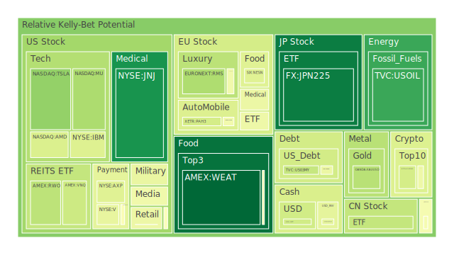
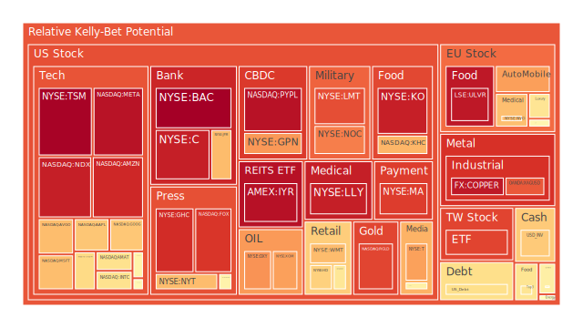
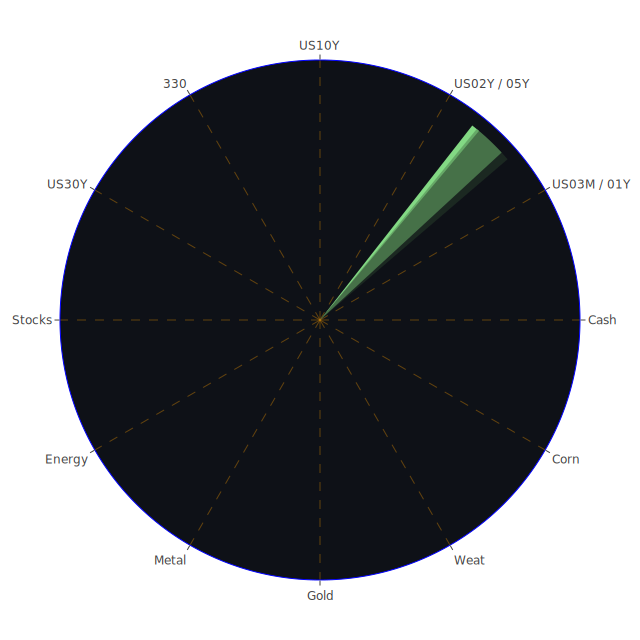

# 一、前言：三位一體的觀點與正反合的思路

在空間層面（Spatial），我們強調全球主要市場的聯動與新聞事件的跨境傳導效應。隨著國際貿易爭端頻仍，來自不同地域的政治與經濟消息極可能連鎖影響。從新聞來看，近期關於「美國關稅政策」、「歐亞地區地緣政治衝突」、「糧食與能源供應風險」等消息頻繁出現，市場對可能的衝擊產生了高度警惕。社會學與心理學意涵在此層面呈現：市場投資人對某些地區性問題（如伊朗與美國之間緊張、烏克蘭相關衝突、歐盟與英國之間的產業鏈爭議）往往會放大恐慌與避險行為。博弈論的角度則提示，若各國政府相互加徵關稅，易形成「以牙還牙」或囚犯困境般的局面，可能引爆更深層的市場波動。

在時間層面（Temporal），我們透過歷史對照與時間序列分析，觀察市場如何被新聞議題帶動，並演化出不同的週期或階段性波動。從歷史先例看，2008年金融海嘯、2000年前後的網路泡沫、1970年代的石油危機，或1980年代新興市場債務風險等皆可作為借鏡：市場在初期警訊往往不被廣泛關注，最後在極度恐慌中陷入崩跌；或者反之，一些局部危機在全球各國的聯合干預下，最終得到暫時性的支撐。心理學角度強調「集體記憶」與「恐慌週期」：一旦新聞放大負面衝擊，散戶與機構便容易同時出脫部位，進一步加劇波動。博弈論也顯示，一旦市場預期未來將有更寬鬆或緊縮的貨幣與財政政策，可能出現「搶跑」現象。

在概念層面（Conceptional），則著眼於市場與新聞的「命題—反命題—綜合」之正反合。若市場一致預期某一項資產具備正面未來，但突發的負面新聞（如貿易制裁、稅率飆升、地緣政治衝突擴大）讓該資產評價出現衝擊，投資人往往在集體恐慌之下過度拋售。可是在宏觀干預或長期趨勢仍未根本轉向下，這些資產可能在低點獲得買盤吸納，進入新一輪正向修復。此即為三位一體中概念的辯證：新聞可能提供「負面衝擊」，市場則有「正面反制」，最後折衷出一個暫時的平衡或新的定價。

基於以上三位一體的觀點，我們下文將詳述各主要資產的泡沫情況與泡沫風險指標。並強調此處之「泡沫分數」（D1, D7, D14, D30）與「PP100」等指標，僅是一種風險參考。無論如何，任何高估或低估的資產，都有其回歸合理定價或持續扭曲的可能。最後會探討風險對沖的多重方案，使投資人能嘗試佈局相位差約120度、相關係數約-0.5的資產組合。

---

# 二、投資商品泡沫分析

以下針對常見且關注度較高的投資品種，綜合近期新聞與歷史經驗，做出客觀與簡要的泡沫風險評估。雖然此處會參考市場上部分指標，但不呈現實際的表格數字，只在論述中提及高低風險趨勢，以呼應「勿忽視泡沫風險」的指示。

## 1. 美國國債
美國國債通常被視為全球避險資產的基石，但在現行環境中，其長短期利差依然維持某種程度的倒掛或接近倒掛，顯示市場對短期不確定性與資金流動狀況的疑慮。新聞顯示，貿易壁壘與政治衝突都有可能導致中長期國債需求動盪。歷史上，若聯準會進行快速利率調整或量化緊縮，長債利率急升可能導致價格大跌，這種情況在1980年代與1994年一度出現。從D1、D7等短週期泡沫觀察，美國國債通常風險分數不算極端高，但如果市場急速轉向，也可能面臨短期波動。對避險者來說仍具吸引力，但需警惕聯準會與政府赤字帶來的長期通膨或信用擔憂。

## 2. 美國零售股
新聞持續報導美國消費力道受關稅與通脹、就業市場等多重影響。有些巨型零售商因庫存管理不當，再加上房貸利率持續偏高，導致消費者支出縮水。回顧2008年金融風暴前，也有類似的庫存積壓現象與就業市場趨緊風險，而此時再遇政策調整，恐導致部分零售商業績下滑。近期新聞多有提及零售業者營收不佳，股票大幅波動，顯示風險已逐漸顯現。投資人若要切入零售股，應特別留意其D14、D30長週期風險分數是否持續走高。

## 3. 美國科技股
美國科技板塊屬成長性較強的一群，過去十幾年在低利率、全球化需求與創新推力下走出長牛。不過近期在人工智慧（AI）與半導體博弈、關稅衝擊、政治審查、資料隱私等議題的夾擊下，新聞出現「科技公司裁員」「AI需求疲弱」等聲音。2000年前後的網路泡沫教訓提醒：估值若遠超過實質獲利能力，風險將加倍放大。數據顯示部分龍頭科技公司泡沫分數在短週期仍高居不下，尤其是在整體市場陷入貿易戰陰影時，資金可能大舉撤離。值得留意的是，新聞也有一些正面片段，如AI需求驅動晶片廠營收短期衝高，但長期走勢需結合全球政治博弈與利率走向才能判斷。

## 4. 美國房地產指數
美國房地產長期以來與利率高度相關。當前30年期房貸利率在6%上下波動，對居民購屋意願具一定壓力。2008年全球金融風暴即是由美國次級房貸危機開始演變。雖然目前房貸審查較以往嚴格，但房屋價格在疫情後的報復性上漲已逐漸放緩甚至局部回跌，新聞亦指出部分地區開發商面臨庫存及流動性壓力。短期若美國持續釋放鷹派信號，購房需求將進一步受限。綜合泡沫風險指標評估，房地產指數D14與D30沒有走到極端，但若整體經濟下滑，該板塊可能面臨結構性壓力。

## 5. 加密貨幣
加密貨幣市場情緒高度依賴全球資金面與投資人對風險資產的偏好。新聞中常見「比特幣隨股市共振下跌」或「金融監管加強導致資金外流」等訊息，顯示該領域之波動度相當極端。歷史經驗顯示，加密貨幣價格可以在短期內翻數倍，也能急劇崩潰。因其泡沫分數（例如D1或D7）經常大幅震盪，投資需格外謹慎。如果加密市場受到政府監管或國際資金流向改變，價格往往能大漲大跌，同時流動性風險也加倍顯著。

## 6. 金/銀/銅
黃金（及銀）為傳統避險資產。近期新聞顯示因地緣政治衝突升溫和通膨預期存在，令金價強勢。歷史上，面對避險需求猛增，金價便會快速走高，如1970年代石油危機或2008年金融風暴時期均有此現象。銀因工業應用增加，波動比金更大。銅價則是全球經濟活力的指標之一，最近報導也顯示貿易戰對製造業的打擊，讓銅需求或供給產生不穩定。金銅比或金銀比若呈現極端變動，代表市場情緒大幅轉移，也要留意部分投資人將金屬作為投機標的推波助瀾，可能產生短期過熱。

## 7. 黃豆 / 小麥 / 玉米
大宗農產品的價格波動來自天氣條件、地緣政治（關稅或戰爭限制農產品輸出入）、全球需求等因素。近期新聞中的熱浪、極端氣候亦可能衝擊農作物產量；再者，俄烏衝突對小麥供應的干擾歷史上已有多次示警。若地緣風險加深或氣候惡化，價格易迅速攀升並造成通膨壓力。歷史先例中，1970年代的糧食危機、2008年與2010年的糧價飆漲都對衝擊全球經濟起到推波作用。D14、D30指標如持續走高，顯示供應預期可能惡化，或投機勢力強力介入，促使價格迅速偏離合理區間。

## 8. 石油 / 鈾期貨
石油市場是全球經濟血液，政治新聞對其影響特別顯著。若美國對伊朗或俄羅斯祭出新制裁，或中東地區動盪升溫，則國際油價往往劇烈波動。新聞顯示，在多國因經濟不振而降低需求的同時，產油國又可能透過限產來平衡價格，造成詭譎多變。歷史上兩次石油危機給全球經濟帶來深遠影響。鈾期貨則因核能發電議題不斷出現正反雙方爭論：一方面看好清潔能源與地緣需求，另一方面擔憂核風險與政治限縮。該市場規模雖較小，但若遇上政治面或區域衝突，價格亦可能飆漲。

## 9. 各國外匯市場
新聞近來頻繁提到的貨幣避險需求，例如瑞郎或日圓走勢，凸顯市場對歐美政治、經濟前景的猶豫。美國若進行貨幣緊縮，美元匯率通常維持較強，但關稅與國際資本流動也會動搖外匯市場平衡。回顧1997年亞洲金融風暴與2011年歐債危機，外匯市場的劇烈震盪往往導致新興國家資本外逃，並影響股市、債市。面對較高的D1或D7等短週期風險指標，匯率通常會反映短期投機性衝擊，投資人須謹慎控管槓桿部位。

## 10. 各國大盤指數
歐美與亞洲主要大盤指數共同反映了市場對該地區整體經濟與企業盈利的信心。近期新聞對地緣政治、貿易戰與通脹議題的報導，多呈現偏負面基調；導致歐洲某些大盤出現獲利下修預期，並在汽車與奢侈品、銀行股等板塊上表現脆弱。亞洲則關注中國與其周邊國家的製造業表現，如果關稅影響出口，拖累整體指數。回顧歷史，2008年以來的全球市場常呈現「由美帶領漲或跌」的格局，但在當前多變環境下，區域性的利空若擴大，世界主要股指同步下挫的機率不容小覷。

## 11. 美國半導體股
半導體產業鏈近年來因疫情與國際政治角力而供需混亂。新聞報導的AI晶片需求雖有助於部分企業一度提升出貨，但高通膨、終端需求衰退等不利因素陸續浮現，重創一些中小型廠商。另外，地緣對立恐影響生產基地與關鍵零組件供應，使得成本壓力與營運風險同時攀升。歷史上，科技產業常在發現新技術趨勢之初價格被大幅炒作，但若環境急轉直下，也可能瞬間冷卻。需要關注短週期與長週期的風險指標，因為半導體股的波動度向來高。

## 12. 美國銀行股
銀行業在升息階段理應利差提高，卻因壞帳風險與企業違約風險可能同步增長，加上新聞顯示多家銀行信貸卡部門的違約率上升、商業地產貸款的拖欠也增多，市場擔憂2008年雷曼事件翻版。雖然目前銀行普遍資本充足率較2008年健全，但若經濟衰退、商業房地產大幅貶值或債務連鎖違約，銀行股有明顯下跌壓力。D14、D30若呈現持續攀升，可視為不良預期累積。必須留意聯準會動向、聯邦對銀行系統的紓困或管制介入。

## 13. 美國軍工股
軍工股通常在地緣局勢緊張時受到青睞。近期不少新聞提到中東、歐洲甚至印太地區的動盪加劇，美國軍事支出看似仍有支撐，但政治上的極端對峙對預算審批存在不確定性；同時國防承包商可能受制裁或國際供應鏈問題影響。歷史上，軍工股表現常與國家預算緊密連動，市場恐慌時軍工股反而可能抗跌，但若預算削減或政策轉向，該板塊也曾經歷劇烈回調。

## 14. 美國電子支付股
隨電子商務興起，此領域享受高成長紅利。然而，新聞提到經濟衰退、消費萎縮、金融監管加嚴都可能拉低電子支付公司的交易量與營收。此外，市場對於新支付技術（例如區塊鏈）與合規風險保持觀望，部分電子支付企業股價出現波動。回顧上一次經濟收縮時（例如2008年），電子支付尚未如此普及，現今情形是規模大但競爭激烈，泡沫風險需以短期交易量、長期商業模式增長力加以觀察。

## 15. 美國藥商股
醫藥公司相對防禦性較強，然而近期報導顯示，美國保險給付改革與醫療費用壓力、專利糾紛、新藥審批延誤等風險逐漸浮現。一旦研發大型專案失利，可能導致股價重挫。史上也有過藥廠一旦遇到專利懸崖或重大訴訟，股價蒸發的案例。必須關注其研發管線、FDA審批進度、以及健保相關的政治態度。若發生全面性經濟衰退，藥商股也非全然免疫，而是相對緩跌。

## 16. 美國影視股
串流平台興起改變傳統影視產業版圖。新聞中提到若消費者緊縮開支，付費訂閱數量或廣告收入可能受衝擊。過去影視產業盛行時期，常依賴大範圍的經濟繁榮來支撐。在通膨與關稅加劇成本的背景下，拍攝與發行也面臨挑戰。一旦票房或訂閱數據不佳，影視公司股價下修的幅度頗大。回想2000年前後網路娛樂泡沫亦見類似苗頭，當時平台與內容商在競爭中淘汰率不低。

## 17. 美國媒體股
媒體股與廣告市場景氣度密切相關。新聞顯示各企業對廣告預算的縮減預期，歸因於銷售疲弱與庫存壓力，使媒體股前景遭質疑。社群平台的演算法調整、隱私法規限制等因素，也令傳統及數位媒體都難以維持過往的廣告收入水準。歷史上，媒體業在經濟下行周期常出現兼併重組潮。因此，泡沫風險需觀察廣告客戶端的景氣復甦速度及用戶行為更迭。

## 18. 石油防禦股
石油防禦股通常涵蓋油氣開採服務、管道、設備維修及安全防護等領域。在油價不穩的情況下，其業務量也不穩定。但因軍事或地緣政治事件攪動，這些公司有時會獲得額外的設備或安全需求訂單。參考過去多次中東衝突或海上管線風險，石油防禦股就成為市場避險資金關注對象。然而當地緣對立趨緩或油價大幅下滑時，此板塊也曾出現快速回落。

## 19. 金礦防禦股
金礦公司在金價攀升時獲利彈性大，亦是避險資金的投射對象。但金礦生產有勞動力、能源成本、環保規範及地區安全等問題。歷史顯示，金價波動性往往同步反映金礦股的波幅，甚至擴大效果。若避險需求突然降溫，金礦股回跌速度也會加快。同時，若地緣衝突導致勞工或礦區運營受阻，會進一步推高成本，造成雙面風險。

## 20. 歐洲奢侈品股
歐洲奢侈品長年受益於全球高淨值人口的消費需求。然而新聞多次警告，貿易戰與地緣衝突若持續擴大，可能造成中國等主要買家消費意願下滑，美國關稅政策也可能使歐洲奢侈品在北美市場增添障礙。回顧歷史，2008年金融危機時，奢侈品雖屬相對堅挺，但也難逃消費緊縮浪潮。當前通膨令消費習慣轉移，不少奢侈品牌為清庫存或推新品面臨營運壓力；倘若泡沫風險擴散，股價恐難全身而退。

## 21. 歐洲汽車股
歐洲汽車製造商依賴國際市場銷售，過往也深受美國關稅威脅與歐盟環保法規衝擊。新聞中不乏對歐洲經濟放緩的憂慮，尤其德國在能源危機與製造業瓶頸之下，汽車出口亦面臨不利因素。1990年代末與2008年歐洲經濟下行期間，汽車產業遭遇嚴重產銷衰退。當泡沫風險積聚在整個實體經濟層面，汽車股或難以倖免。短期可能看到匯率波動對車企利潤帶來不確定性。

## 22. 歐美食品股
食品龍頭企業通常具防禦性，但在原料成本居高不下、全球供應鏈分散、物流及人力成本提升的環境下，利潤率承壓。新聞顯示通膨打擊消費者信心，若經濟進一步惡化，部分食品企業銷售量雖相對穩定，仍可能因定價策略失誤而股價下跌。歷史經驗顯示，防禦性產業並不代表零風險，尤其當整體市場信心崩壞時，資金抽離往往不分板塊。

---

# 三、宏觀經濟傳導路徑分析

從近期新聞與歷史事件對照可見，整個宏觀傳導大致圍繞以下幾個關鍵環節：

1. **貿易與關稅動盪**：新聞高頻提及美國重啟或加碼關稅措施，或其他地區的反制。這些衝突一旦擴散，會降低全球貿易量、推高商品價格、抑制企業投資，最終影響就業與消費。

2. **地緣政治升溫**：從中東到歐洲東部等地的衝突火苗四處延燒，導致能源供應不穩、物流受阻，令全球製造業復甦受阻。避險資金流向黃金或美元，使其他資產價格波動擴大。

3. **全球金融環境**：若聯準會在通膨背景下維持鷹派立場，或其他央行跟進升息，將推升全球資金成本，最終折射至企業利潤與消費者支出，股票與債券市場容易同步震盪。

4. **資產泡沫潰散風險**：由於2008年金融危機曾讓全球對銀行體系與房地產市場的脆弱性有所警覺，若在當前條件下出現信用違約、流動性收縮及資金流向反轉，可能引爆股債商品的系統性危機。

---

# 四、微觀經濟傳導路徑分析

1. **企業與產業鏈**：企業若面臨關稅或地緣衝突，供應鏈往往中斷或改道，造成成本上升。這些成本壓力不易立即轉嫁給消費者，導致利潤縮水。當資本市場覺察到企業盈餘走弱，股價就會先行反應。

2. **就業與薪資**：若經濟放緩或企業倒閉潮升溫，就業不穩、薪資增長趨緩，消費者購買力下降，壓低零售與服務業表現。對銀行、地產等需依賴穩定現金流的行業衝擊尤其明顯。

3. **消費行為**：在新聞鋪天蓋地的負面氛圍下，消費者往往趨於保守，减少信用消費或延後重大支出。這將打擊汽車、房地產、奢侈品、耐用品等市場。心理學上，恐慌情緒可能自我實現。

4. **投機與槓桿**：當泡沫風險升高，各種槓桿與衍生品易成為「引信」。一旦價格下挫引發保證金追繳，拋售加速，市場流動性枯竭，造成更多資產連鎖下跌。

---

# 五、資產類別間傳導路徑分析

1. **股債聯動**：若市場恐慌，避險資金湧入債市，推高價格拉低殖利率；但若信用風險擴散或通膨預期急升，也可能同時壓低股、債表現。需留意任何使通膨激增與信用違約風險上揚的信號。

2. **商品與貨幣**：原物料價格常受匯率影響。當美元升值，通常壓抑油價與金屬價格，但若地緣衝突令油價跳漲，仍可能帶動通膨及央行升息。匯率走勢與利率決策之間常形成一個循環式傳導。

3. **地產與金融**：銀行業對地產貸款有顯著敞口，地產市況不佳會推升銀行壞帳風險。若金融股股價重挫，市場連帶懷疑整體經濟前景，形成惡性循環。2008年的教訓至今難以忽視。

4. **避險資產之間**：黃金、日圓、瑞郎、美國短債等常被視為避險工具。若市場進入極度恐慌狀態，資金同時湧向多個避險標的，也可能導致這些資產短線暴漲並提高泡沫風險。待恐慌稍緩後，價格可能迅速修正。

---

# 六、投資建議

基於上述分析，投資人應先認知目前外部環境充滿不確定性，尤其貿易戰、地緣政治、通膨與貨幣政策皆在干擾市場走勢。建議可從「穩健」「成長」「高風險」三大組合方向去佈局：

1. **穩健型（合計配置約30%）**  
   - （1）黃金相關資產：在市場動盪時，金價往往能擁有一定支撐，若出現政治風險劇增或通膨壓力升溫，可發揮避險功效。建議佔穩健型組合的40%。  
   - （2）高評級公司債：若信評良好、財務體質穩固的企業債，在利率尚未暴衝時能維持較穩定的利息收益。建議佔穩健型組合的30%。  
   - （3）公用事業防禦股：水電、能源管線或基礎設施類股票歷來對經濟波動較具防禦力，雖不保證零風險，但相對穩定。建議佔穩健型組合的30%。  

   以上三項合計為投資總額的30%，比例內部可隨個人風險偏好微調。

2. **成長型（合計配置約40%）**  
   - （1）美國半導體龍頭：雖然半導體波動大，但AI與雲端等長期需求仍在。建議配合對沖機制，避免短期波動風險。佔成長型組合的35%。  
   - （2）生技醫療龍頭股：長期趨勢看好，但需篩選出研發管線穩定、財務健康、專利優勢明確的公司。佔成長型組合的35%。  
   - （3）數位支付或電商龍頭：電子商務、支付平台有中長期潛力，儘管當前市場恐慌，但若能分批承接，長期仍具發展空間。佔成長型組合的30%。  

   以上三項合計為投資總額的40%，建議在市場劇烈波動下分批進場，並留意佈局時點。

3. **高風險型（合計配置約30%）**  
   - （1）加密貨幣龍頭：此類資產高波動高風險，對通膨及地緣動盪具有投機與對沖兩面性，但適宜只配置非常少量資金，且必須嚴格風控。佔高風險型組合的20%。  
   - （2）新興市場高收益債券：利差吸引力強，但若全球經濟情勢惡化，違約風險大增。須分散投資國別並隨時觀察宏觀變動。佔高風險型組合的40%。  
   - （3）特定區域的能源或礦業股：在地緣衝突或資源短缺時，有機會爆發式上漲；但反轉時亦容易重挫。佔高風險型組合的40%。  

上述穩健、成長、高風險三大類累計建議配置達到100%。投資人可因應風險承受度做細部調整。此種做法透過「相位差」原理和相關係數考量，試圖使組合內部互相對沖，避免單一風險因子引發整體組合大幅回撤。

---

# 七、多項資產的風險對沖與潛在「漣漪效應」

根據我們在空間、時間、概念三位一體的綜合分析，以下進行兩兩相互驗證篩選，推敲可能的漣漪效應：

1. **科技與銀行間的相互驗證**  
   若科技產業放緩導致裁員，進而使消費與貸款需求下滑，銀行壞帳風險升高，帶動銀行股走弱。這種「漣漪效應」可能同時打擊科技與金融板塊，需透過分散投資在防禦板塊以及配置少量原物料或黃金緩衝。

2. **房地產與利率之間的相互驗證**  
   若利率維持高檔，房市成交量可能不振，房貸違約率上升。而銀行若有大筆房貸資產，壞帳增多；同時建築材料需求減少，導致相關商品價格走軟。投資人可將部位延伸至必需消費、醫療或短期美國國債，以分散房市系統性風險。

3. **原油與軍工間的相互驗證**  
   亂局往往推升油價並帶動軍工需求，但若衝突只是短暫則後續補給預算有限，油價也可能快速回落。對沖方式可結合一些與消費或醫藥等較不受地緣影響的資產；若兩者同時大漲或同時下跌，就能減少組合總風險。

4. **加密貨幣與黃金之間的相互驗證**  
   這兩者均有避險或替代貨幣的概念，但加密貨幣波動度遠高於黃金。一旦全球監管加強或市場恐慌到極致，部分投資人會轉向黃金而非加密資產。考慮兩者在不同風險場景下的走向，適度分配可達相位錯開的效果（約-0.5的相關）。

5. **歐美食品股與大宗農產品**  
   如果黃豆、小麥、玉米等原材料價格大幅上漲，食品企業利潤空間受到壓縮；若農產品價格下跌，食品股因原料成本降低而獲利。但若整體經濟衰退，消費者需求下滑，也會讓食品企業收入下降。適度納入一些與原料走勢負相關的避險工具可減少風險。

6. **半導體與銅、銀的製造鏈串聯**  
   半導體製造涉及金屬耗材，一旦金屬價格飆漲，半導體廠成本大增。同時，若經濟衰退影響終端消費電子需求，也令半導體產品庫存堆積。此種情況下，若投資人持有銅、銀等金屬期貨，再同時持有半導體股，兩者部分負相關或時間差可提供一定對沖效果。

透過上述幾個案例，可以看出任何兩種資產彼此交互影響都可能在空間與時間上演出不同變奏。善用博弈論思維，瞭解市場參與者在資訊與政策中的選擇互動，是減少個人投資盲點的可行之道。只要在概念層面保持對正反合的警覺，辨析新聞背後多空訊號，就能更全面地把握投資契機。

---

# 八、風險提示

投資有風險，市場總是充滿不確定性。本報告所提供之建議與分析，皆是基於當前公開資訊及歷史觀察的客觀研判，並非對未來走勢或各類資產之絕對保證。任何經濟或政治的劇烈變動，如突發的戰爭擴大、關稅全面提高、央行貨幣政策大幅轉向等，都可能推翻現階段的假設。報告中列示的種種泡沫跡象，也無法保證一定會在何時破裂或是否將連鎖擴散。投資人應在評估自身風險承受能力與流動性需求之後，再決定進場部位。本報告僅供參考，最終投資決策仍需自行判斷與承擔後果。

在當前環境下，保持對資本流向與泡沫分數的持續追蹤至關重要。建議投資人定期評估組合配置是否出現過度集中或缺乏對沖的狀況，並留意國際新聞對市場情緒的即時影響，同時也不要忽視任何一類資產內部可能存在的高槓桿或資金斷裂風險，尤其是泡沫分數若持續飆高且資金面無明顯支撐之資產。謹慎布局、動態調整，方能在快速變動的市場環境中盡量維持穩健。

 
Daily Buy Map:

 
Daily Sell Map:

 
Daily Radar Chart:

 
