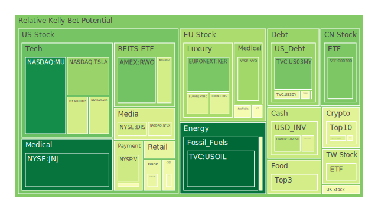
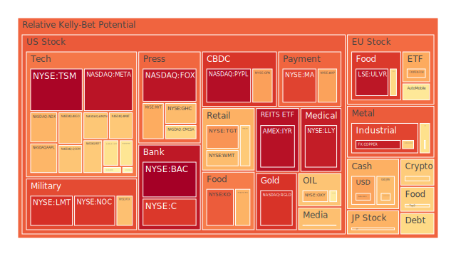
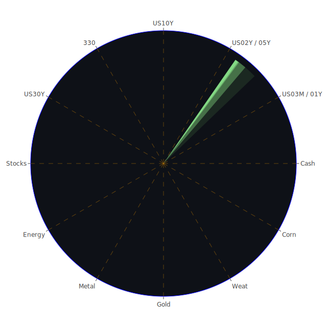

自「空間(Spatial)」角度來看，各市場在全球分布的聯動網路日益複雜，無論是美國、中國、歐洲各國，或其他新興國家，都因關稅、匯率、經濟成長與政策變化而緊密相互影響。近來由於美國前總統特朗普所延續之關稅政策再度擴大，也有多則新聞顯示部份國家對美國的報復性關稅正在加劇，形成了一場「以牙還牙」的全球貿易緊張局勢。從美國視角來看，多種報導指出美國國內企業(特別是美國零售股與製造業)因這些關稅再起承受了銷售衰退與獲利下滑的壓力。新聞顯示，尤其在美國汽車(如Tesla之類的電動車廠)及傳統車廠，都面臨供應鏈關稅衝擊或市場品牌危機。反觀部分歐洲企業，如歐洲奢侈品股(近來雖在新聞中顯示了一些負面情緒，但同時也有部分奢侈品牌在中國以外市場的銷售成長)，呈現兩極化的走勢。新聞亦提到巴西咖啡、阿根廷豆類等農產品於美國關稅之下，隱約面臨拓展機會，顯示全球供需變動隨著衝突而「移轉」：有的產業遇到壓力，也有的產業找到了缺口。這些地理位置上(Spatial)的轉換反映出，不同產業、不同地區若要尋找對沖空間，必須瞭解全球供需佈局之改變。

自「時間(Temporal)」角度觀察，新聞中頻頻提到的一些驟起或擴大的事件，往往不是一朝一夕的結果，而是長期累積而在現階段爆發。舉例來說：Fed資產負債表總額(FED Total Assets)呈現走低、RRP(逆回購)數字變化、BTFP低水位等，都能隱含Fed從緊縮到再觀望的政策週期；而FHLB、GSE、TGA種種資金面流動亦顯示了金融體系的微妙失衡。再配合新聞裡提到的全球股票市場劇烈波動，多次出現「期貨大跌、股市熔斷、關稅制裁」等標題，則是在短期內釋放出相當強烈的負面情緒。就如2020年前後爆發的疫情，初期造成世界經濟停滯，各國央行相繼祭出寬鬆政策，但是到了2025年，通脹和利率回升的影響不斷浮現，再配合貿易戰訊息，看似已在較長週期中累積下諸多結構性問題。若我們參考歷史上的類似場景，例如1970年代末的石油危機、2008年的金融海嘯、2020年疫情衝擊，或歷經數次美中貿易衝突，我們會發現：時間軸的演進往往隨政策、流動性和投資人信心的波動而出現「階段式」的行情高低點。此時，若缺乏對風險的長遠佈局，就可能在短期大漲或大跌之間被情緒拉扯。相反地，若能及時看見長期景氣循環的框架，便能合理布陣，包括避開泡沫風險的高點，或把握某些供給短缺造成的利多。

自「概念(Conceptional)」角度，則著眼於市場心理、博弈平衡與政策傾向之間的衝突或互補。心理學層面來看，當新聞訊息一致負面時，投資人恐慌指數往往瞬間飆高，尤其近期關於特朗普的關稅政策與多家企業股價大跌的消息鋪天蓋地，緊接而來的是散戶及部分對沖基金的踩踏。可是，也有新聞提到Buffett等「長期投資者」在這些混亂之際財富仍持續增長，反映出在集體焦慮之下，一旦資金向某些防禦性標的(例如黃金、債券或必需消費品)流動，或轉而追求超長期價值(例如特定大型科技股的底部籌碼)，就有逆勢獲利的機會。博弈論的觀點指出，各國在關稅或地緣衝突中互相施壓，但也試圖透過私下談判以謀共識，這會使市場忽漲忽跌，同時加劇資金流動的投機性。最後再輔以社會學理論：人們通常會放大極端新聞的影響，導致帶有「放大鏡效應」的資本市場反應，形成所謂「訊息泡沫」；也即資產價格與實際基本面產生脫節，成為真正泡沫風險的溫床。

---

# 資訊航母表格：三位一體正反合(文字呈現)

以下以文字方式概述「資訊航母表格」的概念。此表格主要分為三層(Spatial、Temporal、Conceptional)，又在每層進行三位一體的「正(機會) - 反(風險) - 合(平衡)」假設推演。為遵循「報告內不要出現表格」的規範，此處僅用文字呈現要點如下：

1. **Spatial層面：**  
   - **正**：供應鏈與資源配置重新洗牌，有些地區反而受惠於貿易轉向，農產品與能源可能由原先受壓抑的國家找到新出口市場。  
   - **反**：某些高度仰賴單一市場的企業遭遇關稅打擊，出口重挫；或地緣政治衝突帶來斷供、物流中斷等衝擊。  
   - **合**：投資人在空間配置上，應分散多地布局、同時注重供需重新匹配，可考慮關稅避風港國家或區域(例如部分南美產油國或東南亞電子零組件基地)，降低地緣集中度風險。

2. **Temporal層面：**  
   - **正**：短期政策寬鬆或貼現視窗(Discount Window)較低時，可能出現一波技術性反彈；未來若關稅談判出現緩解，市場有機會迎來階段性利好。  
   - **反**：中長期若通脹升溫、利率回升、企業獲利壓力持續，股債齊跌風險加大；若關稅大戰持續僵化，也將導致長期結構性放緩。  
   - **合**：在時間軸上應考慮「週期性」與「事件驅動」的雙重影響，為了避免錯判，應該依據Fed與各國央行的流動性操作(如BTFP、RRP、SOFR等數值)做動態調整，同時觀察企業財報週期、關稅政策進展、地緣衝突是否緩解或再度升溫。

3. **Conceptional層面：**  
   - **正**：歷史顯示，當市場大幅恐慌時，亦是長線佈局的機會。若投資者能客觀評估資產真實價值，或利用心理落差進行部位配置，往往可能低價吸納優質標的。  
   - **反**：群體恐慌與「政治化標的」(如Tesla被視為美國政治象徵)有機會持續發酵；資訊過量或假消息流竄，易使市場定價更多依賴情緒，形成真正的泡沫風險。  
   - **合**：透過博弈策略與風險對沖機制，尋找在不同市場具有相對低相關、相位接近120度、相關係數約-0.5之組合，以提升抗震性。也需記住「防禦與成長並重」，而不是一味追求短期熱點。

以上「正 - 反 - 合」的思路可綜合在「三位一體」的各角度中進行假設與驗證，不斷篩選合情合理的佈局路徑。

---

# 投資商品泡沫分析

以下針對各重要投資標的，綜合本次提供的D1/D7/D14/D30風險分數(泡沫分數)以及新聞事件所釋放的市場情緒，逐一進行概述(請注意，symbol僅提及資產名稱，不保留券商代碼前綴)。若數據截斷或出現「-1.00」表示當前報價未列於報表或未更新完整，僅能以近似新聞觀察與過去趨勢補足。

1. **美國國債**  
   根據資料，美國2Y、5Y、10Y、30Y殖利率近期大幅走高，特別是10Y已達約4.29，30Y更達4.76～4.77，說明市場對利率走升與通脹的擔憂仍在。長短天期利率倒掛一度嚴重，如今10Y-3M約為-0.02，稍微緩和，但依舊顯示出經濟衰退隱憂。新聞面則顯示多數報導提到關稅與貿易衝突下，美債短期或許出現避險買盤，但若政治因素持續惡化，不排除長端利率繼續攀升，對當前美債價格形成壓力。歷史上，1970年代和1994年等幾次升息周期，都曾讓長債出現持續下跌。本次風險指數顯示(例如US02Y、US05Y、US10Y等泡沫分數在0.4～0.6區間浮動)，暗示風險雖非極端，但利率風險仍不容小覷。

2. **美國零售股**  
   本次數據中如TGT(Target)、COST(Costco)、WMT(Walmart)等零售相關企業，不少新聞顯示其正面臨關稅衝擊或通膨壓力。TGT的泡沫風險在一週前接近0.82～0.92，如今股價又有下滑顯示，整體仍處高風險區。COST雖被新聞提到進行「生產性對話」，並可能在某些領域受益於平價需求，但其泡沫風險亦不低，前後在0.45～0.61之間波動。WMT近期雖出現正面消息(例如短期來看必需消費應該有抗跌力)，但資料顯示其泡沫指數也走高到約0.83上下，連帶顯示在市場避險或防禦心態下，該類股容易被「抱團」買進，但其股價已有一定漲幅，風險開始積累。

3. **美國科技股**  
   巨頭包含AAPL(Apple)、MSFT(Microsoft)、GOOG(Google)、META(Meta)等。數據顯示這些股票之泡沫風險指數多在0.6～0.9區間，甚至部分(如TSM在0.98、NVDA在0.55～0.69之間)仍居高不下。新聞層面，科技業近來深受關稅以及供應鏈重整影響，特別是半導體、伺服器產業，若全球經濟放緩，終端需求恐下滑。但也有訊息顯示，人工智慧(AI)應用帶來新一波需求浪潮，帶動相關晶片廠(如NVDA、AMD、KLAC)股價在前期飆漲，只是近期面臨關稅變數、地緣政治衝突等因素，漲勢回吐壓力大。歷史上(如2000年科網泡沫)亦見類似現象：「前景題材」若短期漲幅過大，隨時可能回檔修正。

4. **美國房地產指數**  
   相關數據顯示房地產REITs，如VNQ、IYR等，泡沫風險在0.70～0.96之間波動。新聞也多次提到美國住房市場價格下修、建商打折、降息優惠方案等，但整體來說利率高企仍抑制房地產交易。此外，商用地產方面更因疫情後遠距工作盛行、辦公需求縮減而呈現壓力。2008年金融危機的經驗顯示，房地產市況一旦進入下行循環，將形成較長週期的調整。儘管如此，部份防禦型REITs(如大型公共基礎設施)仍可能因租金鎖定而較具防護力，但投資人需謹慎看待估值。

5. **加密貨幣**  
   BTC(BTCUSD)、ETH(ETHUSD)、DOGE(DOGEUSD)等。資料顯示BTC 泡沫指數曾在0.58附近，ETH則約0.43～0.55區間波動，DOGE約0.43～0.46之間，雖然尚非極端高點，但新聞面經常出現「比特幣暴跌」「市場對加密貨幣恐慌」等標題，可見情緒較為負面。歷史上，幾輪加密貨幣牛熊週期大約在2017、2021出現高峰，2022–2023則大幅回檔。若再度面臨全球資金緊縮，加密市場恐持續震盪。若政治衝突或跨境支付受限，部分資金會流向加密貨幣避險，形成短線上漲，但長期穩定性仍受質疑。

6. **金/銀/銅**  
   黃金(XAUUSD)與白銀(XAGUSD)近幾日新聞表達：黃金因避險需求而一度衝高，但又受美元走勢等干擾，呈現高檔震盪。泡沫分數顯示黃金0.42～0.59不等，白銀更高(0.60～0.90都有)，銅(COPPER)則接近0.97～0.98，顯示工業金屬泡沫風險較高。新聞裡也提到「銅牛市變成銅崩盤」的論調，主因在於關稅衝突放緩需求，加上建築與製造不振。黃金和白銀相對具防禦特性，但若漲幅已大，也需警戒短期回調。

7. **黃豆/小麥/玉米**  
   農產品方面，SOYB(黃豆)、WEAT(小麥)、CORN(玉米)在數據內可見：黃豆在0.24～0.48，算是中等偏高；小麥約0.30～0.37；玉米則時常在0.43～0.62之間。新聞則提到極端天氣、區域熱浪、地緣衝突導致部分農糧供應緊張。歷史經驗顯示，農產品價格受到氣候與政治因素高度牽動，短期或大漲大跌。若貿易戰升溫，某些農產品恐受限制，但同時也使他國出口得利，如巴西咖啡或阿根廷黃豆有機會分食市場。

8. **石油 / 鈾期貨UX!**  
   石油(USOIL)本次風險指數在0.19～0.33左右，顯示先前漲勢回落後，目前尚未達極端泡沫階段。但新聞多數為負面，如「經濟衰退疑慮減弱需求」，「油價延續跌勢」，如貿易戰加劇亦抑制全球成長。此外，鈾期貨(UX1!)大致上風險指數落在0.51左右，顯示中性略偏高。因核能發電在部分地區再次被重視(如歐洲能源缺口），鈾的戰略地位也提高，但政治因素往往造成此類資源價格暴漲暴跌。

9. **各國外匯市場**  
   資料中如AUDUSD、GBPUSD、EURUSD、USDJPY等匯價與泡沫風險顯示：AUDUSD在0.66～0.67、GBPUSD在0.51～0.54、EURUSD在0.42～0.44、USDJPY則約0.34～0.71不等。新聞裡提到日本實質薪資下跌、全球避險時日圓一度升值，但若日本本土通脹與貨幣政策轉向，也可能轉為貶值壓力。歐系貨幣同樣面臨歐洲經濟走緩與地緣政治陰影。歷史觀點如1997亞洲金融風暴、2008歐債危機，都曾讓外匯市場劇烈波動。因此，在外匯市場的多空佈局尤其要留意央行動作與地緣因素。

10. **各國大盤指數**  
   資料顯示：像中國大盤SSE:000300約在0.38～0.47間，英國FTSE約0.64～0.88間，歐洲GDAXI(DAX)亦在0.48～0.65上下，美國NDX(那斯達克指數)約0.69～0.93浮動，日本JPN225(日經)有時甚至破0.60～0.86。新聞標題也數度出現「美股期貨重挫」「歐洲股市開低走低」等看空訊息。歷史上多次顯示若美國帶頭下跌，全球普遍跟進。然而在局部題材(如科技、軍工、能源)帶動下，也可能出現短線反彈。風險層面不可小覷，尤其當泡沫指數跨越0.8或以上，就須警惕急跌可能性。

11. **美國半導體股**  
   代表如NVDA、AMD、INTC、KLAC、AMAT等，普遍泡沫分數相對較高(NVDA曾達0.69，AMD約0.58，INTC約0.61，AMAT約0.80～0.90之間不等)。新聞提到美國對中國的半導體出口管制與新的關稅政策，可能擴及高階晶片與機器製造設備，衝擊該類股需求。歷史上的類似案例如1980年代日美半導體大戰、2020年中美科技衝突，都使該產業出現結構性洗牌。

12. **美國銀行股**  
   如JPM、BAC、C等皆在報表中顯示泡沫指數介於0.86～0.99之間，屬於非常高的區域。新聞指出信用卡違約率爬升、消費者金融壓力增加，若經濟惡化，不良貸款和商業地產違約可能讓銀行承壓。歷史經驗(2008金融海嘯)告訴我們，銀行股一旦爆發流動性或信用風險，跌幅可相當慘重。然而只要在Fed或財政當局及時干預下，短期有可能維持穩定，但此穩定性仍取決於是否再出現連鎖倒閉。

13. **美國軍工股**  
   NOC、LMT、RTX等。泡沫分數顯示大多高於0.60甚至到0.88，因地緣緊張加上防禦預算升高，短期股價獲得支撐。然而新聞提及若地緣風險降溫或預算轉向，軍工可能修正。歷史上(如冷戰結束後)，軍工類股面臨需求銳減。但只要政治局勢對抗不斷，該類股長期仍具防禦特色。

14. **美國電子支付股**  
   PYPL、VISA、MA 等。新聞顯示電子支付在通膨環境下，部分交易量成長，但同時受到FinTech競爭與高估值壓力。數據顯示泡沫指數多在0.80～0.96(尤其MA、V高達0.84～0.91)。參考歷史案例(如2010年代移動支付浪潮)也能發現，一旦成長趨緩或手續費架構被調整，股價容易修正。若國際衝突導致跨境交易受到限制，也會影響支付平台營收。

15. **美國藥商股**  
   JNJ、MRK等為代表。數據中JNJ約0.02～0.30之間相對偏低泡沫風險，MRK則介於0.50～0.60附近。新聞顯示藥廠短期受惠於醫療剛需與保險理賠政策，但高成本通脹會壓縮利潤，也要留意監管法規可能有所轉變。歷史上(如2009年H1N1疫情期)醫藥股常有短期亮眼表現，但長期還是得看研發進度與專利保護期。

16. **美國影視股**  
   如NFLX、DIS、PARA、FOX等。數據顯示NFLX一度到0.45～0.69，DIS約0.61～0.67，PARA約0.51～0.74，FOX則高達0.78～0.95不等。新聞指出傳媒業面臨消費者支出縮減、廣告預算壓力，也有部分企業在進行內容支出刪減(如Disney與Netflix近年逐漸調整成本)。回顧歷史，在經濟下行時，消費者可能減少娛樂支出，但串流平台也存在防禦特質，呈現複雜的多空交織。

17. **美國媒體股**  
   與影視股重疊，但更著重新聞、廣告與社交平台等。新聞提及多家媒體企業面臨反壟斷與政治監管風險(如Meta與Google)。泡沫分數也不低，顯示投資人對未來盈利能否支持高估值感到猶豫。

18. **石油防禦股**  
   XOM、OXY等。資料顯示XOM風險在0.56～0.67，OXY也接近0.74～0.76。新聞報導油價下滑及全球經濟放緩，但另一面也隨時可能因地緣緊張或減產協議而反轉。歷史經驗顯示，油價對需求極為敏感，跌起來很快，漲勢也可以很猛烈。

19. **金礦防禦股**  
   RGLD、NEM(不在清單中但同屬金礦概念)、GOLD(巴里克黃金)等通常和金價行情連動。RGLD泡沫分數已到0.88～0.90，顯示評價不算便宜。若金價再度衝高，金礦公司有機會獲利，但也可能面臨生產成本上升與政策稅負干擾。

20. **歐洲奢侈品股**  
   LVMH(MC)、KER(Kering)、RMS(Hermès)等。新聞指出部分奢侈品牌在中國疫情後復甦，但歐美需求放緩；報表中MC約0.44～0.58不等、KER約0.66～0.74，RMS則0.58～0.74，可見風險偏高。歷史上，奢侈品在經濟下行期有時仍能維持高端客戶消費，但對股價來說一旦預期轉弱也能造成大回檔。

21. **歐洲汽車股**  
   代表如BMW(BMW)、MBG(Mercedes-Benz)，前者泡沫指數約0.49～0.72，後者在0.45～0.52。新聞顯示歐洲汽車市場仍受半導體短缺、供應鏈脫歐衝擊，以及電動車轉型的巨大成本所壓。歷史上，歐洲車企在1990年代末和2008金融危機都曾受大衝擊，但也多次迅速復甦，因具備全球品牌與高階市場。

22. **歐美食品股**  
   包含KHC、NESN等。報表顯示KHC(卡夫亨氏)約0.39～0.68風險，NESN(雀巢)約0.41～0.61。新聞提到零售通路衝擊以及原物料漲價是否轉嫁給消費者。歷史觀察顯示食品龍頭在衰退期間有防禦力，但若估值過高，仍有估值修正之可能。

---

# 宏觀經濟傳導路徑分析

1. **貨幣與利率傳導**：  
   Fed縮表趨勢、RRP、SOFR、EFFR Volume等指標顯示，市場流動性雖有回彈，但整體仍偏緊。當前高利率讓企業融資成本攀升，直接打擊了高負債和擴張性的公司。再者，若關稅不斷攀高，通脹壓力或仍居高不下，Fed可能陷入「高通脹 vs. 維持經濟增長」的兩難。

2. **財政與關稅傳導**：  
   新聞中屢次提到特朗普續推對中、對歐、對各國的關稅政策，其他國家也以報復性關稅回擊。此將導致全球貿易下降、企業出口成本增加、供應鏈重新分配。最終反映於國內通脹上升、企業獲利壓縮，帶動就業與投資受影響。

3. **匯率與資本流動**：  
   高利率或政治不確定性，往往驅使資金流向安全資產(如美國國債、黃金)，也可能帶動美元匯率反覆波動。歐洲與日本若維持或轉向更寬鬆，資本可能外流。此時，新興市場貨幣易受衝擊，尤其若自2020以來累積了高美元債務。

---

# 微觀經濟傳導路徑分析

1. **企業營收與成本**：  
   對製造業或消費品企業而言，關稅帶來原材料或零件成本上升，加上國際競爭可能喪失優勢。短期若沒能將成本順利轉嫁給消費者，就會侵蝕獲利。營收端也因全球需求萎縮而減少。

2. **融資與研發**：  
   在高利率環境下，企業融資困難，進而壓抑研發或擴產計畫，特別是高科技產業如半導體股或電動車股，成長速度可能減緩，導致股價波動。

3. **市場情緒與消費**：  
   居民可支配所得若因物價上漲或信用卡費用飆升而縮水，消費性支出受到負面衝擊，尤其是可有可無的奢侈品或旅遊休閒。社會情緒的悲觀也會進一步抑制投資與消費慾望。

---

# 資產類別間傳導路徑分析

1. **股債替代關係**：  
   當股市泡沫風險過大，資金或流入債市，但若長債殖利率顯著走升，也意味價格走跌。股債可能同跌，投資人或又轉向黃金、外匯或其他實體資產。

2. **大宗商品與貨幣的互動**：  
   石油價格下跌可能帶動通脹預期降低，使央行政策轉趨寬鬆，但若關稅造成供應中斷，反而使部分商品價格跳升，如黃豆、小麥、玉米等。

3. **避險與高風險資產的跷跷板**：  
   貨幣市場動盪時，加密貨幣有時被視為另類避險工具而獲資金青睞，但其波動極大，又可能瞬間崩跌。黃金、白銀及國債是傳統避險工具，但當估值過高，也隱含下行風險。

---

# 根據對沖需求與投資機會：相位120度、相關係數-0.5之配置

依照前述「三位一體」的視角，若我們想要風險對沖並把相關係數控制在-0.5上下，就得找到在不同市場或不同產業中彼此呈現負相關或低相關的標的。舉例幾種對沖思路：

1. **美國科技成長股**與**貴金屬(黃金或銀礦股)**：在過往歷史常呈現相對負相關，科技股大漲時，金銀往往偏弱；當市場風險意識增強，科技股下跌，金銀或金礦股可能上漲。  
2. **防禦性民生必需品**(如部分食品股)與**能源/石油股**：若經濟衰退加深，能源需求下滑，油價落難；民生必需品雖承壓，但相對能保持營收穩定；兩者有機會成為較低相關或某種負相關。  
3. **高收益債券**(或風險較高的新興市場股債)與**美國國債長天期**：在風險情緒與利差驅動下，這兩者的價格波動往往背道而馳。

---

# 兩兩相互驗證的篩選假設分析：漣漪效應傳導路徑

1. **科技—半導體—消費電子**：若半導體受關稅打擊，那麼科技業整體成長放緩，最終削弱消費電子需求；接著消費者支出再下跌，使零售股也顯示營收不力。  
2. **農產品—化肥與能源—貨幣波動**：農產品價格走高則農企盈利上升，若其多半使用天然氣或石油做為化肥和運輸成本，油價波動也牽動農產行情；最後反映在大宗商品貨幣(如澳幣、加幣)的升貶價中，進而影響其他匯率對。  
3. **房地產—利率—銀行股**：若房地產市場價值下滑，銀行的商業地產貸款風險增高，壞帳率上升；如果銀行對此提列損失，可能利潤減少並限制放貸能力，進而影響更多行業的融資。

透過以上假設與篩選，我們嘗試讓各產業、各資產的聯動和對沖關係更清晰，以降低單一事件的衝擊。

---

# 投資建議：穩健、成長、高風險三類配比(總和100%)

以下依照三大風格進行示意性配置，每個類別各選三個子投資項目，並標示建議比例(僅作為示範，不具最終效力)：

1. **穩健型 (約40%)**  
   - **美國短中期國債**(如2Y-5Y區間、泡沫指數相對中性；佔穩健部位15%): 雖然殖利率上升會壓低價格，但相較於股票波動，仍具避險地位，可調節資金的流動性。  
   - **黃金實體或金礦股**(佔穩健部位15%): 雖然金價已有漲幅，但在貿易戰與地緣政治變數下仍是傳統避險選項，可視狀況小幅配置金礦股分散。  
   - **必需消費品股**(如部分歐美食品龍頭，KHC或NESN；佔穩健部位10%): 需求穩定、具有品牌定價能力，能在經濟下行時較具防禦性。

2. **成長型 (約35%)**  
   - **美國科技龍頭**(如AAPL、MSFT、GOOG；佔成長部位15%): 雖然泡沫風險不低，但其長期研發、全球市占較高，短期波動之後或有反彈機會，可採逢低分批布局。  
   - **部分新能源 / 軍工股**(如RTX、LMT等；佔成長部位10%): 地緣政治衝突與能源轉型趨勢支撐需求，但其估值偏高，需要嚴控持倉比重。  
   - **歐洲奢侈品或高端消費**(如RMS、MC；佔成長部位10%): 在中國與部分亞洲市場需求回溫下仍具潛力，但已累積一定漲幅，宜觀望回調再進。

3. **高風險型 (約25%)**  
   - **選擇性加密貨幣**(BTC或ETH等；佔高風險部位10%): 高波動高風險，也可能在局部政治事件中成為資金避風港，但需嚴控倉位。  
   - **美國半導體類股**(如NVDA、AMD、AMAT；佔高風險部位10%): 趨勢性強勁，但估值高、對景氣敏感，在利率與關稅陰影下波動劇烈。  
   - **新興市場ETF**(佔高風險部位5%): 藉由分散海外，若全球經濟復甦，可能獲得較大漲幅，但同時匯率與政治風險並存。

以上整體配置為40%穩健、35%成長、25%高風險，合計100%。投資人可視自身風險屬性進行調整，例如若無法承擔過大波動，可再下修加密貨幣或半導體類股比重。相對的，若看好關稅爭端最終緩解、景氣反轉，亦可提高成長類比重。

---

# 風險提示

1. **泡沫風險加劇**：  
   當前多項資產泡沫分數偏高(如TSM、BAC等逼近0.98～0.99)，一旦市場出現流動性壓力或獲利了結潮，價格下跌幅度恐遠超預期。

2. **地緣政治與關稅變數**：  
   新聞頻繁報導中美對立，歐洲因俄烏問題耗損，下階段若再爆發新制裁或報復措施，對全球供需衝擊可能更深。

3. **利率與債務違約問題**：  
   美國商業地產違約率、信用卡壞帳率上升，若經濟進一步下行，銀行股更易受信用風險衝擊。歷史顯示連鎖違約事件往往在市場最脆弱時出現。

4. **極端氣候與疫情突襲**：  
   若極端天氣衝擊農作物，或新疫情導致再度封鎖，皆可能引發物價或供應動盪，令資金市場加劇擾動。

5. **市場流動性突變**：  
   若Fed或其他央行政策急轉彎，或金融機構現金流枯竭，都會造成市場資金鏈扭曲，對高估值標的尤其不利。

---

## 總結

本報告透過空間、時間、概念三位一體的角度觀察當前市場，綜合經濟學、社會學、心理學、博弈論等多重理論，輔以歷史案例和新聞事件進行推演。可見在全球通脹、關稅與地緣政治壓力之下，主要資產普遍顯現出中度到高度的泡沫指標。投資者在面對此局勢時，宜謹慎評估不同類別資產的風險收益比，選擇能夠在相位120度左右、相關係數約-0.5的多元化組合，使整體投資組合具備更好的抗震力。穩健型可以偏重國債、黃金與必需消費品；成長型可留意科技龍頭、軍工或歐洲奢侈品；高風險型則關注加密貨幣、美國半導體及新興市場基金。需留意的是，以上配置僅為示例，實際操作依投資人風險偏好與資產狀況調整。投資總有風險，尤當各界對經濟衰退預期與政治對抗加深之際，更需留意保本與流動性，謹慎應對。

## 風險提示

投資有風險，市場總是充滿不確定性。本報告所提之觀點和建議僅供參考，投資者應根據自身風險承受能力和投資目標，做出獨立決策；若有需要，也可諮詢專業人士，以建立更契合自身財務狀況的投資策略。切記，泡沫風險高企時，風險管理與資產配置的彈性佈局顯得尤為關鍵。祝各位投資順利，審慎規劃、適度分散、理性決策。

 
Daily Buy Map:

 
Daily Sell Map:

 
Daily Radar Chart:

 
