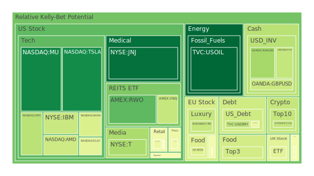
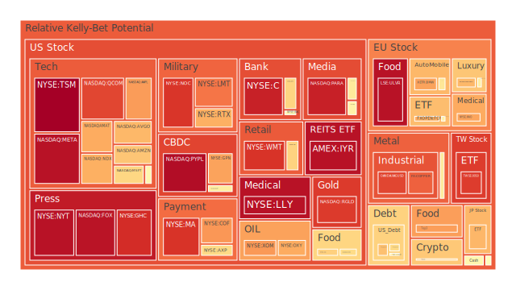
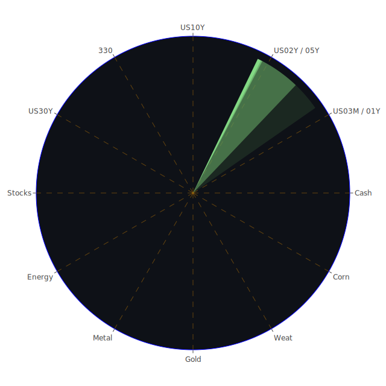

# 一、三位一體（Spatial/Temporal/Conceptional）整合簡述

在正式進入各資產類別的泡沫分析之前，先以三個面向進行高度濃縮的歸納，並以「正 - 反 - 合」的思路提煉。其中所謂「空間」強調市場在全球及區域層次的交織、「時間」強調短、中、長周期的演繹、「概念」則著重各種理論根基、情緒、社會文化與博弈邏輯的整合。

## （一）空間層次（Spatial）的三位一體

1. **正面觀點（正）**：  
   - 部分區域市場受到積極新聞的刺激，或因政府提供政策與資金支持而走強。例如近期新聞顯示，美國政府對某些關鍵產業短期內暫緩關稅計畫，或推出針對部分新創公司、電動車與替代能源的扶持，使得部分產業板塊由恐慌轉為略微樂觀。而墨西哥與巴西之間加強貿易合作的正面消息，也有助於兩國之農業與能源板塊的長期競爭力。
   - 另外，REITs市場於新聞中被點名或能在不確定環境下有所表現，一些投資機構指出其防禦性或可在某些領域顯現，提供地域配置的分散效果。

2. **反面觀點（反）**：  
   - 同樣也有區域市場因政治紛擾、關稅壓力或局勢動盪而陷入顯著風險，新聞裡多次出現美國對中國、歐洲等地的關稅措施再次波動，導致歐美食品股、歐洲汽車股乃至美國本土零售相關企業備受衝擊。韓國對於美方貿易障礙格外擔憂，出現加速降息與政策干預的呼聲，顯示該區在國際貿易戰中備感壓力。
   - 地緣政治衝突依然存在，如新聞所及的以巴衝突、烏克蘭局勢等，對全球原物料、能源運輸，以及歐美企業布局形成各層面隱憂。

3. **綜合共識（合）**：  
   - 從空間的角度看來，各主要區域的政策環境、資金進出與政治氛圍對資產表現的影響相當顯著。一旦國際關係從對抗轉向暫時的和緩，或某些地區取得新的市場機遇，都會改變整體空間佈局下的資本流向。短期內世界主要經濟體仍陷在關稅、地緣政治、貨幣政策分歧的困境中，但也可能暗藏某些區域性利多機會，這是接下來在投資組合中需要透過區域多元分散去掌握的。

## （二）時間層次（Temporal）的三位一體

1. **正面觀點（正）**：  
   - 短週期（D1或D7）上的泡沫指數顯示，有些資產正面臨修正或已出現放量上漲。部分美國科技股與加密貨幣近期曾在新聞中受到負面情緒衝擊，但稍後在暫緩關稅或政策逆轉的消息下強勢反彈，且有些公司獲得如「強力技術領先」或「優勢客戶群」的認同。例如近期提到Tesla、有關Nvidia的暫緩出口管制消息，雖同時出現正反新聞，但市場一旦聽聞「暫緩」的蛛絲馬跡，短時間就能湧現資金追捧。
   - 中長周期方面，新聞裡提到部分公司獲得來自政府的補貼或稅務減免，新創領域如AI、電動車、可再生能源等仍被視為中長線潛力標的，故從Temporal的角度，若投資人能承受波動，則可能於中長期有增益空間。

2. **反面觀點（反）**：  
   - 面臨短週期危機的投資品眾多，新聞連番報導的關稅提升、與「市場恐慌是否為經濟衰退前兆」等議題，讓許多人擔心短期進場會踩到急跌風險。尤其在3M～1Y美國公債收益率仍相對高企、股市又經歷一連串大跌之後，短線資金是否有動能繼續逢低承接，存在疑慮。
   - 更長週期看來，一旦地緣衝突或國際關稅政策反覆，那些原本指望全球擴張或國際供應鏈順暢的大型企業，未來幾季可能業績下修，導致股價壓力持續。

3. **綜合共識（合）**：  
   - 時間層面上的最優配置，往往在於準確辨識短期政治或政策波動的假象與真正的長期趨勢。投資人若聚焦在能持續受惠於產業升級、政策紅利等因素的資產，且願意忍受短期震盪，或許能在未來兌現收益。然而對風險不耐受者，當下暫停觀望或分批進場亦是理性之舉。就Temporal三位一體的正反合中，可建議投資人同時規劃短中長策略，並鎖定新聞訊息中「臨時逆轉」可能帶來的擇時空間。

## （三）概念層次（Conceptional）的三位一體

1. **正面觀點（正）**：  
   - 經濟學：若市場在一定利率水平下，仍有各類資金尋找相對安全、成長與投機性標的，則部分具備真實需求的板塊還能堅挺。  
   - 社會學：許多投資者在面對突如其來的波動或新聞時，往往傾向群體行動，若社群輿論轉向樂觀，往往能在短期帶來顯著投資熱潮。  
   - 心理學：恐慌過後的反撲，經常帶有追漲陷阱，但也可能是踏入復甦期的早期信號。部分大眾若相信市場修正接近尾聲，就會再次投入資金。  
   - 博弈論：若主要經濟體（如美國、歐盟、中國）在關稅與利率決策上都已在暗中試探，勢必會在一定臨界點協商或退讓，一旦出現停火或進一步折衷，市場情緒或急速反彈。

2. **反面觀點（反）**：  
   - 經濟學：高利率與緊縮貨幣環境下，企業與消費者需求都縮水，導致衰退風險上揚，新聞一再提及CEO與投資大佬認為經濟已在「衰退邊緣」或「可能在衰退中了」。  
   - 社會學：由於全球政治對立，以及不同國家內部的社會分裂，也可能加速資產價格分化、資本外流或隱藏資金坐視不動。  
   - 心理學：若出現「再度巨震」或長期利空醞釀，恐慌情緒將在群體中再度爆發，帶來次波大規模拋售，形成負面循環。  
   - 博弈論：各國對貿易摩擦都拿出不同的反制方案或威脅手段，即便某些關稅得以暫緩，也不能排除下一輪協商又破局，使市場陷入重複的恐慌—希望—恐慌往復循環。

3. **綜合共識（合）**：  
   - 在概念層面，關鍵是衡量這些理論與行為面如何動態交織。心理層面常使市場短期反應過度，經濟與社會結構決定了中長期走勢能否拉回正常軌道，而博弈論不斷提醒我們，主要決策者之間的利益計算會左右各種政策放鬆或緊縮。如果某方痛感超過臨界點，就可能促成新的協議與修正。因此投資人需小心觀察國際新聞與各國政治經濟動態的即時變化，並結合長期產業趨勢與風險控管手段。  

---

# 二、投資商品泡沫分析

以下將就主要投資標的進行描述，包含其風險分數（D1、D7、D14、D30）之高低、近期新聞提及程度以及歷史相似場景參考。所有代號將省略券商名稱，譬如「NASDAQ:TSLA」只寫作「TSLA」，並同時兼顧價格現狀（PP100）與泡沫指數的狀態作敘述，提醒讀者亦應持續關注相關新聞的後續發展。

---

## 1. 美國國債

美國國債近來因短端與長端利率波動劇烈而備受矚目。新聞顯示，美國3M與2Y公債利率持續微調，導致市場對未來貨幣政策不確定性上升。數據顯示，2Y收益率於3.91上下震盪，3M達4.34，顯示依舊處於相對高點。  
歷史上，每當美債殖利率曲線倒掛較深，就往往伴隨經濟衰退風險上升。目前雖然3M與10Y之間的利差略有收斂（甚至在最新數據中接近-0.01），但幅度仍然不足以使市場安心。短期泡沫風險對美債而言不在於價格失控上漲，而在於殖利率在政經局勢瞬息萬變下隨時暴起暴落。投資人若抱持防禦立場，可能還是會視美國國債為「短暫避風港」，但也需注意流動性收緊的影響。

---

## 2. 美國零售股

美國零售股近期波動相當明顯。新聞中提及許多零售類股（如TGT、WMT等）在高通膨與關稅政策波動的雙重衝擊下走勢疲弱。尤其TGT根據泡沫分數顯示D1約在0.48～0.58上下攀升，D30甚至接近0.89～0.91，可見市場對該類股懷疑情緒增加。此處亦可參考過去2008年金融危機與2020年初疫情之初，零售類股在需求急速收縮時受損頗深，但隨後有一波報復性消費也帶來修復。短期而言，若消費者信心繼續疲弱，零售板塊可能仍有壓力，不過若後續關稅或經濟衰退疑慮緩解，這類基本民生相關股亦可能得到資金青睞。

---

## 3. 美國科技股

新聞中的重點公司包含TSLA、NVDA、AMD、GOOG、MSFT、AAPL等皆有較高能見度。有報導顯示科技類股近期在政府政策「暫緩某些關稅」的利多消息下反彈，然而同時也有市場對美中科技戰的長期風險疑慮。以TSLA為例，其在前幾日一度因「品牌危機」、「關稅衝擊」等利空下股價下滑，但之後又趁市場情緒略為好轉而大漲，其泡沫指數在D1～D7段約0.08～0.29之間變動，D14甚至逼近0.37，顯示短期買盤進出異常活躍。若比較2020年疫情後Tesla的表現，當年也是在先跌後漲的過程中，不斷創新高。  
NVDA與AMD等半導體相關則易受供應鏈政策與地緣政治衝擊。歷史上，美國對中國的先進晶片限制、或全球晶片供需失衡時常讓半導體類股出現劇烈波動。就心理層面看，市場對於AI與高效能運算需求仍相當熱烈，長期成長趨勢未改，但短期若發生政策限制或市場情緒再度大轉向，仍可能面臨波動。

---

## 4. 美國房地產指數

如RWO、VNQ等追蹤全球或美國不動產投資信託的ETF，近期在利率上升、消費力道疲弱下受到不小挑戰。新聞裡指出REITs仍有機會在資產配置中扮演分散風險的角色，但考量30Y房貸固定利率約在6.64上下，消費者貸款壓力加大。回顧2008年次貸危機與2020年疫情初期，若就業市場一旦下行或信用擴張受限，房地產板塊易受到較深層衝擊。然而有些REITs聚焦於物流、醫療等需求相對穩定的領域，或有一定防禦力。

---

## 5. 加密貨幣

比特幣（BTCUSD）與ETH等，在新聞中反覆出現。近期因美國可能對部分數位資產關稅與管制上有所鬆動，但也有市場傳聞許多政策搖擺，或大型交易所面臨合規疑慮。整體泡沫指數顯示BTC D1大約在0.36、D7約0.47、D14與D30接近0.48上下，凸顯投資人對其未來仍帶著高度投機心態。歷史上，加密貨幣常在大環境動盪或貨幣政策寬鬆時獲得資金流入，但也容易因政策監管放緊而迎來速跌。  
一如2017或2021年的劇烈牛市，波動幅度極大。若市場氛圍一旦重回避險，可能出現大幅獲利了結或空頭打擊。但也有新聞顯示，新興國家與部分民間企業持續採用加密支付，有助於長期基礎的拓展。

---

## 6. 金 / 銀 / 銅

貴金屬與工業金屬在新聞與數據中同樣呈現分化。黃金（XAUUSD）一度接近2980～3084區間，泡沫分數在D7、D14維持在0.40～0.44；白銀（XAGUSD）則在D7～D30一度逼近0.74～0.90，波動更大。銅（COPPER）之黃金/銅比率在近期出現波動（698～700左右，也曾一度上衝至749），暗示黃金受到避險需求青睞，而銅則是全球景氣的領先指標，若經濟衰退陰影依舊，銅可能面臨壓力。歷史上，2008金融危機時銅價從高位急速下挫，而金價因避險需求反而震盪上行。對於投資者而言，金銀比或金銅比的變化可看作景氣興衰的早期訊號。

---

## 7. 黃豆 / 小麥 / 玉米

農產品如WEAT（小麥）、SOYB（黃豆）、CORN（玉米）等，近期新聞中對其關注度並不算極高，但墨西哥、巴西加強貿易合作的訊息，加上某些農產品關稅措施暫緩，多少對這些商品帶來轉機。從歷史經驗看，糧價同樣易受天候、國際衝突、運輸成本等影響。如報告中提及，2025年全球已有極端氣候與不穩定季風，若季節性極端降雨或乾旱加劇，都將干擾農作物產量，使價格波動增大。泡沫指數顯示CORN與WEAT在D1到D30區間多在0.30～0.47之間，尚未顯示極度泡沫，但需謹防突發糧荒或地緣危機。

---

## 8. 石油 / 鈾期貨

石油（USOIL）的走勢近期顯得詭譎多變，新聞顯示美國對OPEC政策以及俄烏局勢均有關鍵影響。報告中油價波動頗大，曾於幾日內跌破60後又在暫緩關稅或地緣消息下快速回升至62～63之間，泡沫指數D1一度低至0.00～0.14，顯示短期情緒驟降後略有修復。歷史上，每逢經濟放緩或需求下滑時，油價就遭到壓力，但一旦局勢緊張或產量被削減，價格可能又驟漲。  
鈾期貨（UX1!）則是更具特殊性，與核能議題緊密相關。根據資料顯示，其泡沫分數約在0.50上下波動，變化不大，顯示投資人對核能前景雖有關注，但尚未達到狂熱。回顧2011年福島事件後，鈾價急跌並長期低迷，若未來全球能源轉型使核能再度受到矚目，鈾期貨或有長線潛力，但也得警惕核能政策的反覆。

---

## 9. 各國外匯市場

近期EURUSD、GBPUSD、AUDUSD、USDJPY等主要貨幣在新聞中顯示多重因素牽動。EURUSD接近1.09～1.10區間，GBPUSD約1.28，泡沫指數大多在0.30～0.50之間，意味著市場對歐英貨幣後市尚存觀望。澳幣（AUDUSD）一度探到0.59～0.60，顯示對全球商品需求疲軟的擔憂。日圓（USDJPY）出現147左右的匯率，市場對日銀政策寬鬆與經濟結構有疑慮。歷史經驗顯示，若美國繼續緊縮，其他貨幣將面臨資金外流與匯率走貶壓力，但若美國經濟明顯轉差，美元本身也可能轉弱。對衍生商品或外匯投資者來說，此時波動甚大，但同時蘊含套利空間。

---

## 10. 各國大盤指數

包括美國NDX（那斯達克100）、中國000300（滬深300）、德國DAX（GDAXI）、英國FTSE、法國FCHI、日本JPN225等，都顯示高波動。新聞裡面，FTSE、DAX、JPN225等皆曾出現劇烈漲跌，尤其在關稅、政治局勢擾動時更甚。JPN225甚至衝高至接近35000之上，泡沫指數在D7～D30某些數據達到0.60～0.82不等，可見市場熱錢仍喜愛投機日本市場的某些板塊。回顧1990年前後日本股市泡沫，以及2013年安倍經濟學初啟動時的大波動，可見該國股市長期以來常成為寬鬆貨幣政策的試驗場，也要留意任何突發的政策轉向。

---

## 11. 美國半導體股

除前述NVDA、AMD外，尚包含INTC、KLAC、AMAT、QCOM等龍頭。半導體產業常常是景氣的先行指標，一旦終端消費需求下降或地緣限制升高，就會使該類股獲利下修。該板塊在新聞中同樣多次被點名，正面包括「AI與數據中心需求強勁」、負面則包括「美中科技對立恐升級，部分出口管制繼續」。歷史上，每當晶片產業週期進入庫存調整，就會形成股價深度修正；反之，在經濟復甦前段它又可能率先反彈。因此短期或存風險，但若長線仍看好AI或高階運算需求，可適度關注中長期價值。

---

## 12. 美國銀行股

近期新聞凸顯銀行股（如JPM、BAC、C等）遭受利率政策與經濟衰退疑慮的夾擊，同時，美國金融機構有些仍籠罩在資金流動問題的陰影之中。也有報導指部分美國區域銀行風險仍高，但龍頭銀行憑藉規模與資本充足率尚能相對穩定。歷史上，2008年與2023年部分銀行倒閉案例，使市場對金融體系的信心時有動搖。一旦信貸市場緊縮或壞帳率攀升，銀行股會先行反映風險。如果投資者偏好低估值且有分紅收益的標的，龍頭銀行還有些吸引力，但風險控管不能忽視。

---

## 13. 美國軍工股

軍工股（如LMT、NOC、RTX等）時常受到地緣衝突刺激而相對抗跌，但也可能受預算削減與政治因素影響。新聞裡可見以巴衝突、烏克蘭局勢等，加上各國軍備競賽升溫，使軍工股中長期需求被視作穩定。然而也要留意美國內部財政狀況與聯邦預算批核是否順利，若政府赤字壓力巨大，軍費未必會繼續無上限擴張。歷史上，美國軍工板塊在戰亂升級或國際局勢動盪時往往走強，但一旦國際趨於緩和或政局調整，也會進入守勢。

---

## 14. 美國電子支付股

Visa（V）、Mastercard（MA）、PayPal（PYPL）等，在全球消費交易增長的趨勢下，長期展望相對穩定。但若經濟緊縮、消費者支出下降，交易量亦會受到影響。近期新聞顯示，PayPal股價一度面臨較大壓力，泡沫指數甚至衝到0.96上下，透露出對其前景的熱炒與疑慮並存。從歷史上看，電子支付系統在宏觀經濟衰退中也會遭遇瓶頸，但長期來看，線上消費、電子轉帳普及度只會越來越高。市場若回歸理性，這些股可能恢復溫和成長。

---

## 15. 美國藥商股

一些大型製藥公司或保健公司（如MRK、JNJ、LLY等），報告中顯示他們的泡沫指數多在0.02～0.93之間，區間相當廣。新聞也提到醫療保險支付相關問題，以及對消費者支出與醫保政策的辯論。在2020年的疫情高峰期，部分疫苗、檢測與治療廠商股價飆漲，後續即出現修正；但如癌症、糖尿病等長期需求領域，業績相對穩定。投資人應觀察保險給付制度是否產生重大變化，以及美國政府在藥價改革上的舉措。

---

## 16. 美國影視股

Netflix（NFLX）、Disney（DIS）等，其泡沫指數一度高達0.45～0.67之間。新聞顯示流媒體戰爭持續，但同時也有市場對娛樂支出在經濟衰退中會否下降的擔憂。回顧2020年疫情初期，串流股大漲，後期則面臨成長放緩與競爭者激增的難題。若經濟放緩嚴重，消費者或會縮減娛樂支出，但若新作頻出或服務生態持續優化，也能吸引訂閱成長。因此該類股的波動常與全球經濟信心緊密相連，並且要留意平台間競爭帶來的成本壓力。

---

## 17. 美國媒體股

與影視股相近，但更偏向新聞、廣告收益或綜合傳播（如NYT、CMCSA、PARA、FOX）。廣告景氣與經濟景氣息息相關，經濟衰退時廣告預算削減，媒體股獲利萎縮。此外，新興媒體平台的競爭也造成傳統媒體股價震盪。歷史上，若大型併購或政策鬆綁（如廢除某些媒體跨區經營限制）出現時，媒體股能受惠。近來泡沫數據顯示有些媒體股風險分數偏高（甚至接近0.95～0.96），投資人需警覺市場炒作或獲利了結的風險。

---

## 18. 石油防禦股

如XOM、OXY等部分能源企業，因石油市場價格多變，企業獲利有時呈現大幅波動。新聞裡提到，油價近期雖然下滑，但若關稅政策或地緣衝突導致供給受阻，價格又可能被推升。過去幾次油價大漲大跌的週期都證實，石油防禦股既能在油價上漲時獲利飆高，也可能因成本與產量等不確定性而蒙受重創。尤其經濟衰退時，全球需求轉弱，對該類股帶來壓力。

---

## 19. 金礦防禦股

金礦企業（如RGLD等）動態與金價表現緊密相關。若黃金避險需求高漲，金礦公司可望獲利成長；反之若金價回落，其盈餘相應下滑。近期報告顯示RGLD泡沫分數曾衝至0.88～0.90之間，顯示市場對黃金板塊的追捧。歷史上，當全球金融市場動盪或通膨高漲時，投資人往往湧向黃金或其開採相關標的。然一旦局勢緩和或利率走高，金價承壓，金礦股自然也下跌。

---

## 20. 歐洲奢侈品股

如RMS、KER等，新聞指出歐洲消費與奢侈品在中國及全球旅遊復甦的預期中有所走揚，但經濟衰退風險仍讓投資人擔憂。這些股在前幾週泡沫指數可達0.58～0.70，有的甚至更高，顯示資金熱度不低。然而歷史上，若市場從「報復性消費」走到「消費低迷」的轉折期，奢侈品需求也會大幅下滑。再者，歐美本土若繼續受到關稅或政治風險干擾，也會削弱該產業的穩定性。

---

## 21. 歐洲汽車股

如BMW、MBG等，歐洲車廠面臨美國關稅與全球整車需求放緩的挑戰。新聞提及韓國、歐洲等國家對美方保護主義政策頗多抱怨，顯示業者出海受阻。回看2008年金融危機與2018年美歐貿易摩擦時，歐洲車企多次陷入需求萎縮和關稅壁壘的雙重難關。因此在現行環境下，短期維度的波動風險較大，但若長線看電動化與綠能轉型，歐洲車企仍在豪華與技術領先上擁有優勢，或能持續維持特定市場份額。

---

## 22. 歐美食品股

包含一些跨國食品與飲料集團（如KO、NESN等），傳統上屬於較防禦性的產業，但新聞顯示其亦受到原料成本飆漲、關稅衝擊、運輸成本與匯率波動的影響。根據2020～2021年的經驗，食品業在疫情中相對穩定，但若全球經濟惡化，銷售量雖未必大幅下滑，卻會受原料端成本上升而侵蝕利潤。從泡沫分數看，有些食品巨頭甚至逼近0.90以上，顯示市場對其防禦地位抱持高度期望，也暗藏估值過高之隱憂。

---

# 三、宏觀經濟傳導路徑分析

1. **央行與利率**：根據FED關鍵數據顯示，美國貨幣政策仍有變數，OIS FED Fund Rate曾在5.13，近期卻報4.33，顯示預期快速轉變。若美國走向更寬鬆，可能提振股市與商品市場，但也加重通膨威脅。若利率維持高檔太久，又會壓抑消費投資並衝擊銀行體系。  
2. **國際貿易與關稅**：新聞裡關於特朗普關稅的種種波折，再加上各國以牙還牙，可能重創全球供應鏈。對於受影響最重的汽車、零售、科技產品而言，其盈利不確定性將大幅升高。  
3. **地緣政治與能源**：以巴衝突、烏克蘭戰事，以及OPEC在原油供應上的策略，都左右能源價格與通膨預期。石油、鈾等原物料行情波動，又會間接影響半導體產能、運輸成本等領域，形成連鎖反應。  
4. **企業盈利與就業**：一旦整體消費力疲弱，零售、服務業會先見業績下滑，企業削減人力並影響就業，進一步又降低消費能力，可能觸發惡性循環。此時政府若主動財政支出或改善失業福利，會加強公共債務壓力，造成債市波動。

---

# 四、微觀經濟傳導路徑分析

1. **供應鏈斷層**：半導體、汽車、電子支付等高度仰賴跨國供應鏈，一旦關稅或禁令升溫，零組件斷供或延遲，最先衝擊企業的生產周期與成本，導致毛利下降或成品售價上漲。  
2. **融資與信用**：銀行股若處於系統性壓力，企業貸款利率勢必上升，風險資金難以獲得，創新企業與中小企業資金斷流，進一步促使就業惡化。  
3. **市場情緒與消費心理**：社交媒體與新聞對短期市場情緒的放大效果，導致多數投資人追漲殺跌；零售股就尤其仰賴消費者心理，若輿論導致悲觀預期，銷售下滑即時體現在財報上。

---

# 五、資產類別間傳導路徑分析

1. **股債之間**：若美債殖利率持續高企，投資人可能棄股投債，導致股市賣壓。反之，若預期FED放鬆，則股市回暖，債券價格下跌。  
2. **黃金與美元**：避險情緒高漲時，黃金與美元往往存在此消彼長的互動，但也有同漲情況。若美國國內政治與財政動盪，市場對美元信心下滑，黃金就成為更強的避險。  
3. **科技與半導體 vs. 能源與原物料**：若科技公司需求旺盛，會推高能源與金屬使用量，反之若半導體景氣下滑，也使金屬需求同步減弱。地緣衝突對能源與原物料價格的影響，再反向壓迫科技或製造業成本，形成循環。

---

# 六、投資建議

綜合上述分析，投資者在面對當前環境時，不應忽視任何高泡沫風險的警訊。以下嘗試從穩健、成長、高風險三大類給出最佳化配置建議，並各自挑選三種子投資項目。三大類合計應為100%，投資人可依自身風險承受度與資金規模做權重調整。

1. **穩健型（約40%）**  
   - **短天期美國國債**：考慮到美國仍具有避險與流動性優勢，適度配置3M～1Y國債可鎖定利率收益並維持資金彈性。  
   - **黃金**：若地緣政治持續緊張與通膨壓力不明，黃金作為傳統避險資產仍可配置部分比重，對沖貨幣與金融市場不確定性。  
   - **醫療或必需消費（大型藥商股、必需品零售）**：這些領域需求相對穩定，如JNJ或穩定型必需消費股。在經濟衰退中通常較能抗跌。

2. **成長型（約40%）**  
   - **科技龍頭與半導體（具長期競爭力者）**：如MSFT、AAPL、NVDA等，雖現階段因政經不確定而波動，但長期科技驅動力仍強，預期未來AI、大數據等需求帶動該領域成長。  
   - **綠能與電動車供應鏈**：全球對節能減碳仍是中長期目標，一些相關的供應鏈若能持續創新與擴展市占，或有成長空間。  
   - **REITs中優質板塊**：如專注物流、數據中心的REITs，若其財務穩健、出租率佳，仍有機會隨著新經濟的需求擴張而受惠。

3. **高風險型（約20%）**  
   - **加密貨幣或區塊鏈相關**：波動巨大，但若短線情緒轉好或監管出現利多，可能短時間出現高回報。但需嚴控部位。  
   - **新興市場股票**：如部分東南亞或拉丁美洲市場，若政治穩定與對外貿易擴張，一旦美元走弱，此類市場可能逆勢上漲。  
   - **小型高增長科技新創**：在AI、5G、元宇宙、醫療創新等領域，一旦資本市場重拾風險偏好或利率回落，能帶來爆發性成長，但需承擔較大下跌風險。

整體而言，上述比例只是範例參考，合計為100%，實際操作可視資金量、年齡與風險承受度調整。同時考量投資組合間相關係數盡量分散，將高相關度或高泡沫資產進行適度稀釋。

---

# 七、兩兩相互驗證的篩選假設分析

為了使各種資產之間的配置能夠達到120度相位、相關係數約-0.5的對沖效果，需要同時檢視以下條件：

1. **不同產業、不同地區**：例如把歐美與新興市場的指數結合，再搭配美國國債與黃金，增加資產間負相關性。  
2. **高波動對沖**：加密貨幣與傳統防禦資產（如美國短債、黃金）同時配置，可在局部互補。但要注意它們在流動性緊繃時可能同步下跌，故非完美避險而是部分對沖。  
3. **時序驗證**：透過觀察D1、D7、D14、D30泡沫分數之走勢，若某兩項資產在短期（D1～D7）呈高度反向波動，但中長期（D14～D30）卻出現收斂，需審慎衡量是否真正可以分散風險。  
4. **假設修正**：考慮新聞裡出現的暫緩關稅與地緣衝突事件常常「朝令夕改」，投資人須謹記博弈論中的不確定性常態，避免過度自信於任何單一對沖策略。

這些條件交互作用後，有助於將過度泡沫化的資產剔除、或降低比重，並同時鎖定在高成長與避險並存的分佈上，使整個組合在各種市場情境下都能有一定防禦力，或在行情轉好時能有成長空間。

---

# 八、結論與風險提示

1. **泡沫風險不容忽視**：  
   當前許多資產之泡沫分數（D1～D30）動輒接近0.90甚至更高，如TSM、PYPL、META、NYT等，都顯示市場對這些標的有過度追捧的可能。一旦市場情緒逆轉或政策面轉向緊縮，這些高泡沫資產可能遭遇急跌。  
2. **不可忽略政治與社會因素**：  
   新聞連日報導的以巴衝突、烏克蘭局勢、國際關稅戰，甚至天災事故，都可能在瞬間改變供需關係與全球資金流向，投資人須保持對突發事件的警覺。  
3. **歷史場景參照但不盲從**：  
   回顧2008、2020或其他重大危機時期，金融市場都曾以不同方式演化，歷史能提供類比，但每一次危機的細節與成因有差異，仍需結合當前的政策與宏觀條件做判斷。  
4. **分散佈局與風險管理**：  
   建議採用多資產、多區域、多週期的策略，並透過動態調整對衝，如配合黃金、短期國債、REITs、部分高增長科技股，搭配避險部位以保持穩定。特別是面對任何高泡沫或高估值資產，宜謹慎衡量進場時機並設定停損或停利機制。  
5. **投資建議非絕對**：  
   本報告內容僅為參考，投資者最終仍應依自身風險偏好、財務狀況、投資期限作綜合評估，並可諮詢專業顧問或分階段進場。

---

## 風險提示

投資有風險，市場總是充滿不確定性。任何試圖利用宏觀數據與新聞事件的分析，都只能提供概率性參考，而非保證結果。政治、經濟、社會、心理與博弈論等因素交織，往往使市場走勢出現超出預期的波動。尤其當下各國關稅政策搖擺、地緣政治衝突未平、氣候危機可能擾亂農作物供給，以及金融市場對泡沫風險的焦慮，都提醒我們務必保持高度警覺，設好停損與控管槓桿。報告所提建議僅供參考，最終投資決策仍應由投資者依自身風險承受能力與投資目標獨立判斷。

縱使全球在未來數月或數季有望出現部分轉圜的訊號，仍須小心面對突發性政策反轉、流動性緊縮、或地緣衝擊導致的劇烈行情。不論佈局任何標的，都應定期檢討並因應新資訊做適度調整，將風險分散在不同資產與區域之間。透過上述對市場的三位一體理解（空間、時間、概念），或能在複雜環境中看出更為合情合理、且兼顧風險控管的投資之道。切記，財務安全永遠比追逐短期暴利來得更為重要。祝投資順利。

 
Daily Buy Map:

 
Daily Sell Map:

 
Daily Radar Chart:

 
