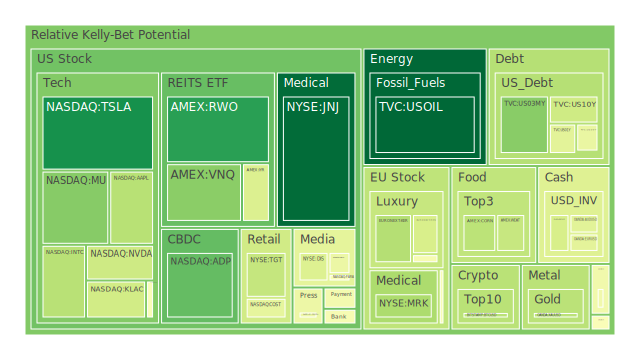
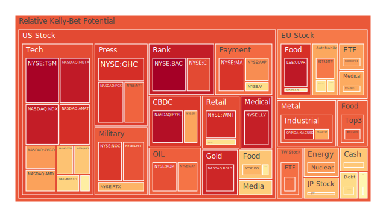
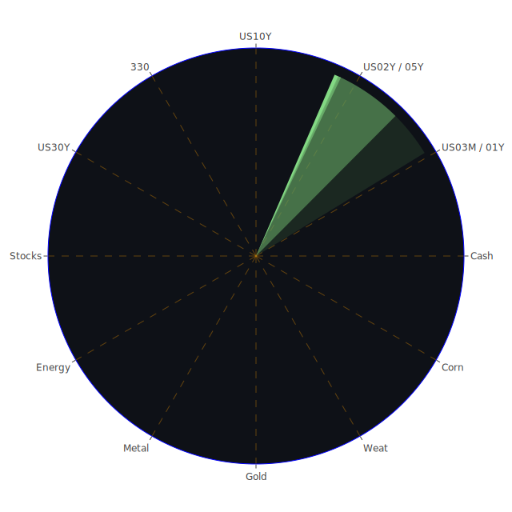

# 一、總論：三位一體的基礎假設與背景

在本次分析中，我們著重於三大層面：**空間層次（Spatial）**、**時間層次（Temporal）**、**概念層次（Conceptional）**。此三位一體的分析方法，並非刻意將市場、人心與社會切割，而是透過歸納與大膽假設，嘗試為當前的種種「市場現象」建立一個多維度的觀察框架。

1. **Spatial（空間層次）**  
   - 強調地緣政治、區域經濟互動與國際貿易關係。各國施加關稅、地緣紛爭、資本流向、外匯市場與國際供應鏈斷鏈風險等，皆屬於空間層次的核心課題。  
   - 當前新聞顯示，美國與中國關稅再度升溫，多個歐洲國家面臨罷工、制裁與旅遊警示，俄羅斯與烏克蘭戰火持續，中東局勢震盪，非洲多國爆發洪水或動盪，巴西與墨西哥則在農業與能源領域上與美國有貿易協議。這些皆會影響到商品的跨境流動、資金轉移與情緒面震盪。

2. **Temporal（時間層次）**  
   - 聚焦於市場週期、歷史事件重演與當前風險的持續或中斷。包含聯準會貨幣政策的緊縮或寬鬆週期，企業財報季度表現、經濟數據（例如 CPIYOY、就業數據）的季節性模式，以及因通膨、利率而導致資產評價轉變的結構性觀察。  
   - 近期聯準會（FED）在市場擔憂下出現了「2 次鷹派言論」的訊號，且從公開的經濟關鍵數據可見：RRP（逆回購）在下降、BTFP（銀行融資便利）量也偏低、Discount Window（貼現窗）使用頻度不高，但總體而言，銀行業流動性仍受到外界不小的關注。美債殖利率曲線近來有升有降，特別是短天期與長天期利差一度加大或出現倒掛，然而最新數據顯示某些期限利差正在收斂或翻正，反映市場預期的調整。  
   - 在歷史面，曾有 2000 年科網泡沫、2008 年金融海嘯、2020 年疫情衝擊，2022-2023 年的供應鏈斷裂與能源通膨，也都讓投資人對「泡沫風險」戒慎恐懼。當前新聞報導提到的「全球關稅戰」、「各國因政治動盪進出口受限」、「氣候災害引發的農糧問題」等，都顯示有潛在危機形成長期結構性的干擾。

3. **Conceptional（概念層次）**  
   - 涉及經濟學、社會學、心理學與博弈論。市場不僅是理性計算的產物，也包含群體心理、博弈策略與政策攻防。在新聞中，美國政府對外宣示的關稅政策、國內針對某些州或城市補助的改變，可能是總統選舉或政黨角力的延伸。當投資人預期政府政策易生反覆，情緒面的波動就會加劇。  
   - 在心理層面，當「負面新聞」達到高強度（超過 90% 負面情緒）時，投資大眾往往傾向恐慌拋售。但有時「FOMO」情節也會在正面或負面交雜之下出現，導致市場走勢劇烈震盪。從博弈論角度，若各國同時使用關稅「懲罰性」或「報復性」手段，將造成多輸局面，但若某些國家趁機與特定國家簽署新的雙邊或區域貿易協定，就可能成為市場新的驅動力與風險對沖來源。

透過以上三位一體的正反合思維，可以歸納出市場正面因素（例如科技創新、貿易新協定）與負面因素（例如關稅戰升溫、地緣紛爭、氣候影響）。同時要注意到這些因素在時間維度上的演化，可能出現「短期利空 vs. 長期利多」或「短期利多 vs. 長期利空」等矛盾局面。對投資人而言，最重要的是如何在資產組合中平衡此種正反合動態。

---

# 二、投資商品泡沫分析

以下將分別就主要投資品種的泡沫情況進行闡述，並輔以近期新聞事件與歷史參考場景。此部分將整合 2025-04-09、10、11 的泡沫機率及風險分數訊息；同時，為符合指令，我們會忽略券商名稱，只使用資產符號表示，如「JNJ」、「TSLA」等。

## 1. 美國國債

美國國債利率近期震盪加劇，特別是 2Y、5Y、10Y、30Y 之間的利差變化明顯。根據最新數據，1Y 在 4.00 附近徘徊，2Y 約 3.86，5Y 則約 4.07，10Y 則達到 4.42，30Y 更來到 4.87。相較於去年同時期（例如 3M 和 1Y 都曾經超過 5.0 的狀態），目前看似有部分殖利率回落，但在新聞中，新的關稅與地緣紛爭可能再次導致資金湧入或抽離美債。這些現象代表利率曲線與市場預期的變化仍不斷演繹，確定性不足。

就泡沫風險來看，美債本身常被視為「避險資產」，但若聯準會為控制通膨而延長高利率狀態，美債價格也將承受壓力，進而造成殖利率上行。若市場預期過度樂觀地低估通膨風險或金融體系壓力，可能在之後遭遇突然的拋售壓力。短線若地緣政治或經濟衰退風險再次升溫，美債或能獲得部分避險買盤。然而目前不少數據都顯示「泡沫指數」在中性或微升階段，潛藏的結構性危機仍在。歷史上，美債很少出現類似股市的爆炸式泡沫，但也不能忽視極端利率策略下可能的債券價格波動。

## 2. 美國零售股

市場針對零售股的動向往往與消費者信心、就業市場和整體經濟表現密切相關。新聞顯示，關稅衝擊下，某些零售商（如 Target、Walmart 等）面臨供應鏈成本上升與業績壓力；一些新聞甚至指出 Target 的股價在近期有下跌趨勢，並且多篇負面消息環繞。此外，豪華品或休閒消費類的零售在通膨影響下會有更大區別，有些百貨或折扣零售店業績持續疲弱。

泡沫風險觀察上，零售股通常較難出現「急速暴漲」的泡沫，但當市場對經濟前景過度樂觀、預估消費能力大幅增長時，零售股市值可能被推向不合理區域。目前從多日數據看，Target、Walmart 等指標性零售股，D1、D7、D14 指數介於 0.6-0.9 不等，這顯示一定程度的風險集聚。歷史上，如 2008 年金融風暴後，消費者支出曾大幅萎縮，零售業遭受嚴重衝擊；2020 年疫情初期也引發大量門市關閉，一些零售股股價腰斬。面對可能的新衝擊，投資人宜留意基本面和估值的匹配度。

## 3. 美國科技股

科技股在新聞層面可見：「關稅針對科技零組件、晶片、伺服器等進口品是否加徵？」「大型科技公司與政府及政治勢力博弈」。例如，TSLA（電動車）近日再度傳出因關稅與技術管制而受到衝擊，股價波動劇烈；NVDA（顯示卡、AI 晶片）也陷入對中國輸出管制的傳言；AMZN（電商巨擘）若消費衰退可能在雲端與零售端同受影響；AAPL 最近因關稅對供應鏈的打擊而面臨成本提高的風險。

就泡沫程度而言，科技股歷史上常有高估值導致的泡沫。2000 年科網泡沫就是典型案例。從近期泡沫指數可看出，一些高市值科技股如 TSM、MSFT、GOOG、META 以及 AAPL，其 D1、D7、D14 都呈現相對較高檔，甚至部分接近 0.95-0.99。意味著市場對其成長性期待仍高，但估值若無法被未來獲利快速增長支撐，就可能出現評價修正。尤其在更不穩定的地緣局勢與貿易限制之下，投資人應警惕此類股票若要「軟著陸」，需要更扎實的業務數據支持。

## 4. 美國房地產指數

最新資料顯示，美國房地產投資信託或房地產指數（如 VNQ、IYR、RWO 等）在泡沫指數上呈現持續偏高，某些 D1 與 D7 均已突破 0.4 或 0.5，並且月均分數也落在 0.6 之上。這暗示了市場對房地產價格過高的疑慮。再加上新聞指出，美國 30 年固定房貸利率約在 6.6 到 6.7%，在相對高利率的環境下，購屋需求被壓抑，房市交易量下滑，但價格尚未顯著回調，顯示可能存在一定結構性泡沫風險。

回顧 2008 年次貸危機，房地產市場泡沫破裂對全球金融體系造成嚴重衝擊。雖目前金融環境與當年有所差異，但若商辦不動產或住宅抵押貸款品質惡化，再加上聯準會基準利率高企並長期維持，仍可能令資產負債表脆弱的銀行業或房地產開發商面臨流動性風險。若再疊加某些政治或經濟事件（例如高關稅使原物料成本上升、新一波疫情影響收入），更可能誘發明顯跌勢。

## 5. 加密貨幣

比特幣（BTCUSD）近期價格在 7 萬 8 美元左右振盪，且根據 4 月 9 日、10 日、11 日的泡沫指數，依然在 0.30-0.47 的區間（D1）到 0.50 左右（D7 或 D14）。雖這相較於 2020-2021 年的狂熱期顯示市場似有降溫，但不可忽視高波動下，加密貨幣依舊具備「炒作」的心理成分，若宏觀市場波動升溫、地緣政局再起，部分資金還是可能流入比特幣，形成類黃金避險的想像空間，但也可能在監管與政策打擊下劇烈回調。

歷史上，加密貨幣已歷經多次暴漲暴跌，從 2021 年初至 2022 年末有兩度大規模腰斬。鑑於新聞中「Libra Meme Coin 醜聞」、「多國央行可能祭出更嚴厲監管」，以及部分高通膨國家民眾對加密貨幣的需求，該市場仍充滿分歧。對於加密貨幣，有人視其為颶風中的璀璨避險工具，也有人視其為毫無內在價值的泡沫，但就現況而言，受地緣政治、政策監管與投資人情緒驅動，加密貨幣仍是高風險領域。

## 6. 金 / 銀 / 銅

貴金屬與工業金屬在當前局勢下亦值得關注。最新數據顯示金價約在 3180 美元上下，且泡沫分數介於 0.34-0.45，不算極端高，但顯示投資人對黃金仍有一定買盤。銀（XAGUSD）與銅（COPPER）的泡沫指數更高，尤其銅曾在月平均接近 0.98，暗示市場對銅價的炒作或對未來供需的不確定性（電動車需求、綠能轉型、礦場擴張受地緣風險限制等），讓其波動度飆升。黃金與白銀歷史上常扮演避險角色，然而在供應鏈中斷或產量受限時，銀與銅也可能因工業需求不穩定而劇烈震盪。

## 7. 黃豆 / 小麥 / 玉米

全球貿易戰可能直接影響農產品出口與進口關稅。新聞顯示部分國家對糧食進口加徵稅費或實施出口禁令，也有極端氣候（季風、洪水、乾旱）造成農作物生長受阻的情形。黃豆（SOYB）、小麥（WEAT）、玉米（CORN）皆在數據中呈現出中度至偏高的泡沫分數。對於以農產品為主的投資人來說，需關注全球農糧政策與天候模式。2012 年曾出現美國糧食大漲，2020 年初疫情也推升農產品期貨，但這些漲幅背後都暗藏供需不匹配的風險。一旦出現政策突變或需求暴跌，價格亦可能迅速回落。

## 8. 石油 / 鈾期貨UX!

石油（USOIL）近日價格約在 59-63 美元區間浮動，新聞顯示，地緣政治摩擦增大時原油價格容易出現跳動，但若總體經濟下行風險加深，需求可能衰退又會壓抑油價。泡沫分數顯示石油目前仍算中度（0.00-0.2 幾乎沒有，但後續逐日升至 0.09-0.12，甚至短期接近 0.25），動能可能受限；然而若中東、俄羅斯、非洲產油國發生衝擊或國際航運受阻，價格又可瞬間飆漲。

鈾期貨（UX1!）則屬較小眾但近年來因核能轉型話題而受到關注。從數據可見泡沫指數約在 0.47-0.73 之間浮動。若各國在碳排放的壓力下重新評估核電需求，鈾價仍有可能上行；但核能議題具高度政治與社會爭議，一旦出現重大核事故或國際禁令，亦會帶來大幅波動。  

## 9. 各國外匯市場

新聞提到英鎊（GBPUSD）、歐元（EURUSD）、澳幣（AUDUSD）、日圓（USDJPY）都有不同的波動要素。近期美元因聯準會可能暫緩升息或繼續升息的分歧，導致匯市不確定。GBPUSD 在 1.28-1.30 區間波動，EURUSD 從 1.09 升至 1.13，也顯示歐元對美元略有升值。AUDUSD 約在 0.59-0.62 區間，顯示澳幣仍受到大宗商品價格與中國需求的影響。USDJPY 約在 143-146 間震盪，與日本央行政策不明朗相關。

匯率泡沫較難以「股價」方式衡量，但從近期風險敞口及投機資金流向看，若地緣或貿易戰再度惡化，避險需求可能拉高美元、日圓，也可能催動黃金買盤，而商品貨幣（如澳幣、加幣）遭受拋售。歷史上，1998 年亞洲金融風暴、2015-2016 年人民幣匯改、2022 年歐洲能源危機皆證實匯率可以成為「放大金融震盪」的關鍵。投資外匯需搭配套期保值或分散風險。

## 10. 各國大盤指數

陸股（000300）有時反映中國內部經濟政策，如「動態清零」鬆綁後的一度反彈；日股（JPN225）近期在 32000-35000 之間，動能強勁，但過程中仍受地緣政治和日圓波動影響；歐洲（GDAXI、FCHI、FTSE）則面臨經濟疲軟、罷工、歐洲央行加息等壓力。美股方面，標普 500、道瓊工業指數、Nasdaq 指數，在新聞裡反映出「因關稅衝擊而大幅震盪」的情況。

在泡沫風險層面，若全球主要指數持續被高預期所支撐而未能在獲利面跟上，勢必會酝釀泡沫。例如，美國科技龍頭與部分消費龍頭支撐 Nasdaq 與標普 500，使其一度接近或創歷史新高，但近期貿易戰新聞使市場憂慮，其泡沫風險有一定攀升跡象。1997-1998 年亞洲金融風暴後，部份東亞股市經歷長期震盪，也顯示大盤在受到匯率、國際資本移動影響時可能迅速轉向。

## 11. 美國半導體股

如 AMD、NVDA、MU、INTC、KLAC、QCOM、AMAT 等，均在新聞裡頻繁出現。半導體供應鏈在中美對抗下受到強烈壓力，特別是先進製程的技術限制。根據泡沫指數，多家半導體企業呈現中至高檔風險值，最高者一度可在 0.7-0.9 之間。半導體在歷史上經常遭遇週期性衰退，供需關係的逆轉會造成庫存積壓，價格重挫。例如 2018 年挖礦潮退去後，顯卡價格雪崩；2022 年手機與 PC 市場需求下行，也讓整體半導體產能利用率下降。投資人需嚴防景氣反轉帶來的資本開支過剩問題。

## 12. 美國銀行股

銀行股（如 JPM、BAC、C 等）在 2023-2024 年曾出現過銀行流動性疑慮，也一度動盪。2025 年的數據顯示，銀行業總體存款仍處於相對高位，但若經濟不振、消費者及商業貸款違約率升高，銀行獲利能力仍將面臨挑戰。尤其新聞裡提及，信用卡違約、商用房地產貸款風險均有可能提高。部分銀行股泡沫指數顯示在 0.85-0.99（BAC、TSM 都是高風險區，TSM 是半導體龍頭，但也在金融消息中被提及投資併購），說明投資人對其現行估值是否合理已有高度分歧。回顧 2008 年，銀行體系危機引爆整個市場的教訓猶在眼前，故不宜忽視。

## 13. 美國軍工股

軍工類（如 LMT、NOC、RTX 等），在地緣衝突升溫下往往具有防禦性，但若長期軍費無法持續、或國際合作破局，則也可能使訂單縮減。新聞提到多處衝突與軍售話題，如烏克蘭、中東問題，但也有部份國家削減國防預算。這使得軍工股的中期展望不夠明朗。從泡沫指數看，LMT、NOC 近期都有超過 0.88 的風險值，顯示市場對軍工產業估值有可能過度樂觀。一旦地緣局勢緩和或國會卡住預算，股價也有可能面臨回調壓力。

## 14. 美國電子支付股

電子支付（如 PYPL、V、MA、GPN），在疫情後多年間大幅擴張，但近年來面臨手續費管制、交易詐騙以及區塊鏈支付興起的競爭。新聞顯示若貿易戰繼續擴大，跨境支付業務也會受擾。從泡沫觀點，V、MA 分數在 0.60-0.90 區間，PYPL 更曾一度接近 0.96，顯示市場對其未來增長潛力既充滿期待，也隱含高度泡沫疑慮。回顧 2018-2019 年電子支付飛速擴張之後，2022-2023 年部份 FinTech 企業股價腰斬，顯示市場可快速由狂熱轉為恐慌。

## 15. 美國藥商股

藥商類（如 JNJ、MRK、LLY、NVO）以往較穩健，但近年來在新藥審批風險、專利到期、藥價政策等因素下亦有不小的波動。新聞提及「美國政府與藥廠談判價格」、或「針對特定藥物關稅」等，都可能衝擊全球藥商獲利。從泡沫風險看，像 LLY、NVO 這些近期關注度高的糖尿病或肥胖藥開發商，泡沫指數屢屢達到 0.9 以上；如果後續臨床結果不如預期，股價即可能大跌。歷史上也有因政策（例如 2010 年奧巴馬健保）或罕見病新療法成功而讓藥商股產生大幅波動。

## 16. 美國影視股

影視（如 DIS、NFLX、PARA、FOX 等）面臨串流平台競爭與廣告市場下滑。新聞提及 DIS 在公司內部做出多人事調整和預算節省，股價震盪；NFLX 在訂戶增長不如預期時也曾令市場失望。泡沫方面，NFLX 近期 D1 於 0.45-0.57 間波動，月均甚至超過 0.65。若經濟不景氣，娛樂開支或訂閱服務亦可能萎縮。歷史案例可參考 2000 年初的網路影視熱潮與 2020 年疫情下的串流爆發，都顯示該產業對宏觀環境、消費力與競爭格局高度敏感。

## 17. 美國媒體股

如 CMCSA、NYT、GHC 等。媒體集團在數位化浪潮中需不斷轉型，若廣告收入和付費訂閱模式未能維持成長，則營運面臨壓力。新聞顯示在政治對立、假新聞泛濫之下，媒體平台可能遭到政府調查或廣告商撤資等問題。泡沫值也不容小覷，NYT、GHC 的 D7、D14 有時攀升到 0.77-0.90，說明市場對傳統媒體前景存在兩極化預期，一旦失速，估值可能受到重挫。

## 18. 石油防禦股

石油防禦股通常指與傳統能源相關，但業務結構較穩定且獲利模式較抗跌的企業。這些公司面對目前油價波動，雖有一定的防禦性，但如 XOM、OXY 等，短期仍會受國際油價牽動。近期泡沫指數顯示 OXY 逼近 0.78 左右，XOM 則在 0.70-0.80 間，均屬中高風險區。回顧歷史，如 2014 年油價暴跌，油企股價同步慘跌；2022 年俄烏衝突推升油價，油企股價又飆漲。這種大起大落的能量，使石油防禦股與油價的關聯度相當高，投資人需在景氣循環中把握節奏。

## 19. 金礦防禦股

金礦股（RGLD 等）通常跟黃金價格高度關聯。當金價走高，金礦公司獲利放大；反之亦然。近期 RGLD 泡沫指數一度超過 0.88-0.90，也就是說，投資人似乎預期黃金價格將持續上漲，可能將金礦股估值推高至較高檔。歷史上金礦股的表現更為極端，因為開採成本、政治風險、礦產意外等因素都可能引發大幅波動。若金價漲勢無法持續，金礦股往往反轉力道也很強。

## 20. 歐洲奢侈品股

歐洲奢侈品（如 RMS、MC、KER）深受中國市場需求、觀光客消費能力和歐洲本土經濟環境影響。新聞中可見歐洲因罷工、旅遊混亂、通膨壓力，影響了部份名牌店營收；而中國的關稅與動盪也可能打擊奢侈品出口。根據泡沫數據，RMS、MC、KER 的 D14、D30 指數有時高達 0.70-0.75，說明奢侈品雖有利潤空間，但評價已偏高。一旦全球旅遊消費復甦不及預期，或中國消費轉向國內品牌，這類股價恐出現下行風險。

## 21. 歐洲汽車股

如 BMW、MBG 等，都可能直接被美中關稅戰波及。若美國對歐洲汽車徵收更高關稅，加上電動車轉型競爭，傳統車廠容易陷入進退維谷。歷史上，2018-2019 年中美貿易戰就曾對歐系車廠造成打擊。現階段 BMW、MBG 的泡沫指數介於 0.47-0.71，儘管不算極端，但也意味著投資人對其未來自由現金流能否支撐當前股價存在疑問。

## 22. 歐美食品股

食品股如 NESN、ULVR 等，則常被視為防禦性標的。然而新聞中的通膨與貿易問題，也令食品企業原物料成本提高。近來這些食品巨頭的泡沫指數有時達 0.60-0.95，顯示估值並不便宜。回顧歷史，包括 2007-2008 年糧價飆升、2020-2021 年的供應鏈短缺，都可能在食品業引發獲利波動。因此儘管被視為「穩健」，仍須留意價格可能已提前反映成長預期。

---

# 三、宏觀經濟傳導路徑分析

1. **利率及流動性路徑：**  
   聯準會維持較高利率，同時觀察到 BTFP、Discount Window 都在相對低使用量，說明銀行端暫時不算非常緊張，但企業若持續面對高利息融資，生產與投資意願可能下滑；消費者則因房貸、車貸和信用卡利率高企，消費力可能減弱。若商業投資與消費雙雙承壓，GDP 增長恐放緩。

2. **貿易關稅及地緣風險路徑：**  
   當新聞指出美國對中國徵收 145% 新關稅、或與其他國家衝突升溫，各國也可能採取報復關稅或限制出口策略。此舉造成供應鏈重組、進口成本提升，尤其科技或工業領域衝擊更大。若歐洲同時陷入內部罷工與能源短缺狀態，全球需求放緩，最終導致企業營收下滑，就業市場轉差。

3. **避險與資產轉移路徑：**  
   當市場恐慌蔓延，資金往往流向美債、黃金、部分貨幣或加密貨幣；但若投資人認為美債殖利率上升將使債券價格下跌，也可能將資金移往黃金、加密貨幣或其他非傳統避險資產。這種流向波動又會影響股市的估值。各路資金在不同地區與資產間流竄，造成多層次的漣漪效應。

---

# 四、微觀經濟傳導路徑分析

1. **企業獲利與成本端：**  
   關稅提高，企業需承擔原料、零組件或運輸成本上漲，壓縮利潤空間。部分企業可能轉嫁成本給消費者，進一步打擊需求。也有企業加速尋找替代供應鏈，形成新商機或新交易成本。

2. **就業與薪資：**  
   若企業獲利縮減，可能凍結招募或裁員，增加失業率；薪資成長乏力，進而影響消費力道，導致零售與服務業等再度下滑。形成一種「經濟緊縮—需求萎縮—獲利壓力—就業不振—需求再下滑」的惡性循環。

3. **企業端投資與研發：**  
   若利率高企、融資成本過重，企業對長期投資或研發計畫更加謹慎，影響成長動能。尤其科技與高端製造業需持續大額研發支出，一旦資金斷層出現，就可能影響新產品上市的時程。

---

# 五、資產類別間傳導路徑分析

以三位一體正反合的觀點，各資產類別間會出現以下漣漪效應：

- **半導體（科技股） ↔ 汽車製造 ↔ 大宗商品（銅、石油）**  
  若半導體需求大增，汽車電子化需求亦上揚，同時帶動銅、石油等原物料價格上升。但若貿易戰迫使晶片、汽車互相加徵關稅，整個供應鏈將面臨斷層，反而讓原物料需求下降。

- **黃金 ↔ 美元 ↔ 新興市場貨幣**  
  當地緣風險或政治動盪時，資金湧向黃金，美元也可能受青睞；但若聯準會政策轉向寬鬆，美元走弱，金價可能進一步上漲。新興市場貨幣在此波動中易被拋售或投機炒作。

- **房地產指數 ↔ 金融股（銀行） ↔ 企業貸款**  
  房地產價值若下滑，銀行抵押資產縮水，形成金融風險；企業融資成本增高，更難以擴張。反之，若銀行強化風控，也可能限縮房貸供給，使房市面臨更大阻力。

- **加密貨幣 ↔ 科技股 ↔ 新興 FinTech 業者**  
  若加密貨幣出現大漲潮，部分資金同時推升相關科技股或 FinTech 企業；但監管一旦收緊，加密貨幣劇烈下跌時，也可能一併拖累科技板塊。

---

# 六、投資建議

以下將根據穩健（防禦型）、成長（中度風險）與高風險三種策略，提供各 3 個子投資項目與建議配置比例（這三大類總和 100%）。由於要求相位達到 120 度、相關係數約 -0.5，我們盡量挑選具有一定對沖效果的標的，但須強調此為大膽假設下的示範性參考組合，實際操作仍需投資人自行斟酌風險承受度。

1. **穩健組合（防禦性）** – 約 40%  
   - **美國國債（中長天期）**：15%  
     - 目的在對沖股市系統性風險，並兼具一定收益。雖然長天期利率可能會波動，但在資金尋求安全之際，仍是避險支柱。  
   - **金礦防禦股**：15%  
     - 黃金具備避險屬性，金礦公司若能受惠金價上行，則可提供超額報酬。同時與股市相關性較低，可作風險分散。  
   - **美國優先股或高評級公司債**：10%  
     - 相較於普通股票波動度更低，具有固定收益特性，可穩定提供利息。於利率高檔或經濟動盪期能降低整體組合波動。

2. **成長組合（中度風險）** – 約 35%  
   - **科技龍頭股（大型市值）**：15%  
     - 包含 AAPL、MSFT、GOOG 等仍持續有創新能力的公司。儘管關稅戰和監管壓力大，但長期成長潛力尚在。  
   - **能源轉型相關（包含油企與綠能）**：10%  
     - 石油防禦股（如 XOM）與再生能源企業混合，期望抓住大宗商品輪動與綠能興起的交叉機會。兩者之間的價格走勢在結構上可能具備一定對沖效果。  
   - **歐洲奢侈品或全球品牌消費股**：10%  
     - 奢侈品對全球高淨值人群需求可能較為黏著，未來若旅遊回溫將有機會回升。但面對政策與中國消費動向，也需保守觀察。此類標的與科技周期的相關度相對不高。

3. **高風險組合（進取性）** – 約 25%  
   - **加密貨幣龍頭（BTC、ETH）**：10%  
     - 高波動、高風險，極易受監管與政策面影響。若市場風險偏好再起，可獲取相對高的報酬。同時與傳統股債市場有時呈負相關，能在大膽假設下做部分分散。  
   - **半導體成長股**：10%  
     - 包含 NVDA、AMD、QCOM 等，若全球 AI、車用電子、5G 持續擴展，仍有高速成長空間。但也要面對晶片出口管制與週期性波動。  
   - **新興市場股票或高收益債**：5%  
     - 一旦地緣政治或關稅問題和緩，新興市場可能迅速反彈，存在高槓桿的潛在獲利空間。但經濟結構脆弱，也可能大幅回調。

以上配置強調多元分散，並盡可能使各類間的相關係數在 -0.5 附近，亦即當某些資產受衝擊下跌時，另一些有機會上漲或維持抗跌，整體相位達到類似「120 度」的對沖效果。不過，任何劇烈的系統性風險（如全球信用緊縮、地緣戰爭全面升級）都可能摧毀相關性的假設，請投資人務必謹慎評估。

---

# 七、風險提示

1. **泡沫風險不可忽視**  
   若市場整體估值持續維持在高位，特別是科技、軍工、半導體、醫藥等板塊之泡沫指數高企，一旦獲利與估值脫節，可能導致大規模回調。

2. **利率與貨幣政策轉向**  
   聯準會或其他主要央行，若突然轉向更激進的鷹派或意外降息，都會引發匯率、股債市劇震。同時需關注市場對通膨預期的變化。

3. **地緣政治與貿易衝突**  
   關稅戰升溫、歐洲地區罷工或政局不穩、俄烏衝突持續、亞洲海域或中東地區衝突，都可能成為黑天鵝事件，引爆多層次的金融風險。

4. **企業財報與債務違約**  
   在高利率與貿易衝擊下，若企業獲利不佳，債務違約或信用風險攀升，將擴散至銀行系統與資本市場。特別需警惕商用房地產與高收益企業債的潛在風險。

5. **監管與政策的不確定性**  
   加密貨幣、網路科技、金融科技等領域若面臨嚴格監管或法律訴訟，股價或代幣價格可能急速下跌。此外，各國也可能祭出意想不到的限制措施或產業補貼，扭轉市場平衡。

---

# 結語與投資風險聲明

本報告運用「Spatial、Temporal、Conceptional」三位一體正反合思考方式，從空間層次（地緣、關稅、國際貿易）、時間層次（歷史循環與政策週期），以及概念層次（心理、社會、博弈論）去分析當前世界市場的動盪與機遇。綜合來看，全球正面臨潛在衰退、關稅戰、貨幣政策不穩定等多重挑戰；然而，科技創新、能源轉型與部分國際合作協議也可能帶來新的成長空間。面對資本市場的高漲與泡沫跡象，投資人需要更謹慎地審視風險敞口與資產相關性。

再次強調，投資有風險，市場充滿不確定性。本報告所有觀點僅供參考，投資者應根據自身財務狀況、風險承受度及投資目標做出獨立決策。本報告中即便提出了穩健、成長與高風險組合的建議，也僅是基於當前資訊與大膽假設下的示範，並不保證一定獲利或能完全規避風險。請務必審慎評估、適度分散，並隨時追蹤市場與政策的最新變化。

 
Daily Buy Map:

 
Daily Sell Map:

 
Daily Radar Chart:

 
