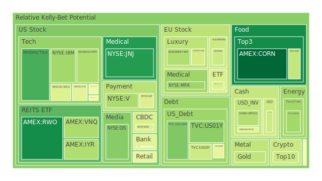
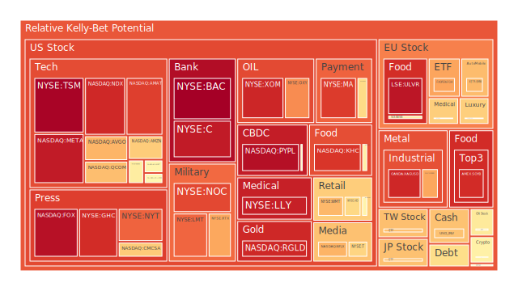
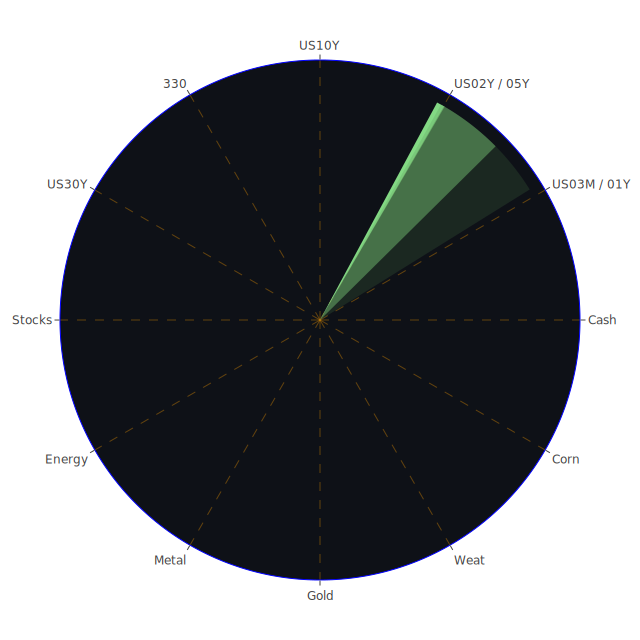

以下報告以客觀、公正且不帶偏見的角度，嘗試從多面向來探討各種資產所可能面臨的風險與潛在機會，並參考了近期市場數據、新聞事件、歷史對照與各種經濟學、社會學、心理學、博弈論觀點。請注意，本文之內容僅供參考，投資決策必須同時考量自身之風險承受能力與目標。同時，市場上總是充滿不確定性，無論任何分析或假設都不該忽視高泡沫風險的警告。

以下報告會分為幾個階段進行討論：

---

# 一、空間面（Spatial）之三位一體觀察：經濟學、社會學、心理學與博弈論

在空間面向中，針對「市場與新聞」之交互影響，我們可以同時結合經濟學、社會學、心理學與博弈論的「正、反、合」來進行多角度的大膽假設。

1. **經濟學觀點（正）**：  
   - 假設在空間分佈上，各國市場的資產價格存在結構性錯配。一些市場在面臨重新定價時，常伴隨資金流向變化，大部分資金可能從前期過度炒作的資產轉往相對低估或防禦性標的。  
   - 近期新聞顯示，石油價格浮動劇烈，局部地區債券殖利率飆升，引發通膨及經濟成長疑慮。空間上來看，美國與歐洲部分資產出現高風險跡象，如油價於某些交易日動能過強或反轉太劇烈，都可能影響全球資金配置。

2. **社會學觀點（反）**：  
   - 若從社會情緒與市場投資者行為來觀察，一旦國際衝突、制裁、或貿易關稅反覆變化，社會層面的風險情緒便可能放大。舉例來說，一系列新聞顯示特朗普（Trump）對中國、歐洲或其他國家關稅政策時常出現「大動作後又暫停」的戲劇性發展，造成各產業或群體的恐慌與疑慮迭起。  
   - 這種恐慌情緒在不同地緣位置並不相同：農業州、石油工業重鎮或半導體園區對政治言論和關稅消息尤為敏感。投資人如果在選擇標的時，不考慮這些區域與社會脈動，容易忽略潛在的風險放大效應。

3. **心理學與博弈論觀點（合）**：  
   - 心理學上，投資者常有「損失規避」與「過度反應」的傾向。若新聞在短期內頻繁釋出雙向訊號（如某日宣布145%關稅、隔日又暫停九成關稅），容易讓市場短線波動加劇。  
   - 從博弈論角度出發，各國在地緣貿易的談判中都抱持試探與反制行動，導致實際政策落地前市場便先行恐慌或過度預期。這些心理與博弈互動，會使得空間分佈的市場風險呈現區塊化。  
   - 綜合來看，空間面的正、反、合代表：經濟基本面若暫時回穩，一些高估標的有修正壓力，而地緣與政策心理層面又使得部分地區的投資人加大避險部位或狂熱炒作，形成局部「過熱泡沫」與「突然翻轉」的空間風險。

---

# 二、時間面（Temporal）之三位一體觀察：經濟學、社會學、心理學與博弈論

聚焦於不同時間尺度的轉變，我們從短期、中期與長期的角度探討「市場與新聞」的三位一體，並結合正、反、合。

1. **經濟學觀點（正）**：  
   - 短期：近期新聞層面顯示，市場在數日內反覆經歷劇烈震盪；例如某些交易日中，油價大幅下跌後，隔日又因突發地緣消息而跳漲。短期基金或程式交易者容易跟隨新聞情緒，造成收益率曲線之突然抽升或壓回。  
   - 中期：聯準會資產負債表縮表趨勢逐漸顯現，RRP持續下降，而市場對短天期利率與長天期利率的分歧依舊明顯，部分投資人憂心通膨中期難以下降。  
   - 長期：美國國債收益率在30年期與20年期都接近4.9%以上，此為多年罕見的高位，再加上美債持有結構的改變，可能導致對未來通膨預期升高的擔憂。

2. **社會學觀點（反）**：  
   - 短期：社交媒體與新聞推播常在極短時間內爆發「利好」或「利空」情緒風暴，如某些新聞對特斯拉電動車在美國中國兩地市場的混亂行銷，或在科技股中對半導體禁令的反覆報導，都會令投資者產生情緒化波段。  
   - 中期：社會情緒的發酵，一旦進入「對峙或懷疑」階段，就容易演化成新一輪抗爭或集體心理失衡。例如，零售投資者對高風險資產的慾望和恐懼亦在半年度之間不斷震盪；數據顯示某些科技股或加密貨幣於中期風險指標偏高，象徵社會面對這些標的興趣濃厚卻又始終不安。  
   - 長期：貿易或政治衝突若拖延，多年累積下來會在民眾之間形成深層的對立或偏見。若政府或企業未有恰當溝通，某些延宕的制裁或新關稅措施可能在長期引爆公民抗議或針對外資企業的抵制。

3. **心理學與博弈論觀點（合）**：  
   - 短期：市場逐波洶湧，交易者常採用「順勢追漲殺跌」的心態，容易形成急速泡沫或雪崩式拋售。尤其當聯準會官員對未來利率存在強硬鷹派口風時，短線市場更易惶恐。  
   - 中期：博弈論角度表示，若各國在三至六個月的談判週期裡互相試探，資產價格波幅會疊加。不少新聞顯示，美國對汽車、半導體的關稅動作來回調整，已使相關行業陷入中期猶豫，資本支出或募資規劃無法確定。  
   - 長期：在長期博弈中，各國若沒有明確長期協議，市場就像一個無所適從的「遊樂場」，投資者一方面期待未來衝突能和緩，一方面又擔憂更大危機或制裁以致難以做出長期投資，誘發結構性泡沫。  
   - 綜合而言，時間面的正、反、合反映：市場短期震盪加速，中期觀望逐漸升溫，長期對通膨、地緣風險與貨幣政策不確定性形成結合，使得市場波段與週期互相疊合，形成多層次的風險迴圈。

---

# 三、概念面（Conceptional）之三位一體觀察：經濟學、社會學、心理學與博弈論

這裡聚焦於「抽象面向」，如市場對「價值」與「泡沫」的定義與主觀解讀，以及由此衍生的正反合辯證。

1. **經濟學觀點（正）**：  
   - 概念層面中，一些投資者偏好用成長數據或貨幣供給量來評價資產。若名目利率和通膨高度相關，則某些防禦性標的如黃金、部分金礦防禦類股，或某些抗通膨貨幣可能於理論上吸引資金避險。但要留意如金價被過度炒作，或某些金礦類股本身公司負債高、管理不佳，就可能掀起反向暴跌。  
   - 同樣地，加密貨幣若被視為數位黃金，理論層面上具備某種「通膨避風港」想像，但其實際風險往往來自整體市場流動性驟變以及監管政策。

2. **社會學觀點（反）**：  
   - 概念層面不僅是資產「應該值多少」，還包含社會共識或流行文化的想像。例如，當某些企業品牌或名人帶動了對特定加密貨幣或科技股的信仰，而社群因短期漲勢產生「狂熱崇拜」時，泡沫就會快速膨脹。反之，一旦出現負面消息（如對環保議題的批判、對隱私權之指控、或領導人物的醜聞），這些憧憬也會急轉直下地崩盤。  
   - 從新聞可見，多個科技巨頭都面臨爭議，像是利用使用者數據、對青少年心理影響等。這些社會觀感的負面變化，往往在概念層面顯示：市場價值評估不再只看財報，而是包含形象與社會反饋。

3. **心理學與博弈論觀點（合）**：  
   - 在概念層面，社會在觀察「泡沫」或「合理估值」的過程，本身就帶有集體心理暗示。一旦大多數人認同某商品「背後的故事」或「未來潛力」，價格就可能背離傳統基本面，在博弈動態裡一路推升。  
   - 然而，互為賽局對手的機構與政府也可能利用此集體想像，透過政策性宣傳、關稅威脅或產業補貼來製造特定收益或損害對手。同時，一些對沖基金或投機機構也會在最關鍵的時刻逆勢操作，觸發全局翻轉。  
   - 因而在概念層面，正、反、合的辯證讓我們看見：同一件資產有時被視為「新時代的開創者」，有時卻被同一批投資者在隔天視為「巨大泡沫」。只要掌握市場情緒切換的誘因，整個觀念便可能一夕翻轉。

---

# 四、運用三位一體正反合的最少文字整合觀點

基於前述空間、時間、概念三個維度的三位一體觀察，可以濃縮出以下「正、反、合」核心：

- **正（繁榮假設）**：在經濟學、社會學、心理博弈的最佳情形下，新技術與低利率環境促進企業成長，加上貿易談判有望穩定，資產評價可望持續抬升。
- **反（崩解假設）**：衝突言論突然加劇、地緣風險升溫或緊縮政策力度過猛，都可能引爆恐慌與大量拋售，尤其泡沫高企的部分科技股與高槓桿操作標的。
- **合（動態均衡）**：在全球市場博弈不斷反覆以及社會情緒多變的環境，資產價格走向往往在「崩解」與「繁榮」的交叉中找尋某種平衡，並以局部輪動、板塊輪漲方式表現。

此三者的辯證並非靜態結果，而是隨著新聞與政策出現不斷調整。投資者應把握其主軸，警惕前文所揭示的泡沫風險。

---

# 五、風險對沖的各種投資組合機會（相位盡量120度、相關係數約-0.5）

以下以文字陳述，闡明幾種在近期市場可考慮的對沖組合方向。由於不同資產在短中長期與其他標的之間的相關性可能動態改變，我們先以理想化狀態，嘗試尋找負相關或小幅負相關，且盡量相位分散的機會：

1. **組合機會A：黃金 / 半導體科技股 / 美國短年期公債**  
   - 在近期，黃金常被視為抗通膨、避險工具；某些半導體科技股處在政策與市場需求博弈之下，時常跟股市整體風向正向連動但波動極大；短年期公債則相對穩定，且在利率變動時可能提供與科技股負相關的緩衝。此三者若權重經過適度調整，可能彼此之間出現負相關(或低相關)的情形，且部分時間段可近似120度相位差。  
   - 不可忽視的是：若市場遇上流動性緊縮劇烈，金價與科技股也可能同步下跌，但幅度往往不同，仍有對沖空間。

2. **組合機會B：加密貨幣 / 美元 / 農產品期貨（黃豆或小麥等）**  
   - 部分加密貨幣與傳統金融市場之間的相關性時而高時而低，但在特定階段，尤其當市場不信任法定貨幣或熱錢湧入加密圈時，可能與美元指數或商品市場存在逆向波動。  
   - 農產品期貨則易受到氣候、地緣衝突、運輸物流等因素影響，與美元走勢偶爾呈現負相關。若在農產品與加密資產之間做一部分佈局，再加上美元現貨或相關外匯操作，或可取得某種程度的對沖效果。

3. **組合機會C：美國房地產投資信託 / 歐洲奢侈品股 / 短期能源商品**  
   - REITs往往跟利率走勢有高度敏感性；當利率升降變動較大時，REITs走勢也可能與股市或其他商品發生反向關係。  
   - 歐洲奢侈品則受高端消費心理、國際遊客消費等推動，與美國內需結構有時聯動性較小。在某些階段，奢侈品與房地產或能源商品呈現負相關。  
   - 短期能源商品（如原油、鈾期貨）價格波動劇烈，可能在需求高峰與地緣消息時大漲，但一旦談判或政策干預出現也能大跌，所以與房地產或奢侈品整體有機會分散風險。

上述僅為幾個示意，實務上投資人需透過更精準的量化研究，觀察資產之間的即時相關係數與趨勢共振現象，並留意市場流動性可能大幅突然改變而令相關性瞬間失效。

---

# 六、多項資產之間可能的漣漪效應傳導路徑與兩兩篩選假設分析

1. **房地產與金融股的互動**：  
   - 近期資料顯示，部分地區房地產指數泡沫風險較高。一旦升息預期轉強或經濟下滑，房地產價格下跌時，金融機構的壞帳也可能升溫，進而打擊銀行股。從歷史上2008年金融風暴就可見此傳導。  
   - 在經濟學與心理學層面，購屋者心理一旦惡化，會進一步抑制消費信心。新聞中也可見部分零售業績走弱，暗示房地產價格調整已經在某些家庭資產負債表上產生壓力。

2. **科技股與加密貨幣市場的共震或背離**：  
   - 過去幾年曾出現多次科技股行情與加密貨幣同漲或同跌的現象，但有時兩者脫鉤。若大型投資機構同時重倉科技龍頭與主流加密資產，只要流動性風險升溫，二者皆可能快速被拋售。  
   - 歷史上也出現過科技股回落時，部分熱錢流往比特幣等加密資產的短暫案例，但這種背離通常時間不長，容易被監管消息或黑天鵝事件所打斷。

3. **商品市場（石油、黃金、農產品）交互影響**：  
   - 石油價格波動大時，通常會影響整體通膨預期，進而影響黃金需求。但也存在「資金轉向工業金屬或農產品」的情況。近期新聞顯示，油價有走低跡象，對經濟成長預期帶來微妙暗示，同時也暗示原本高通膨壓力可能放緩，但若地緣衝突再次影響產能，油價又會回頭暴漲。  
   - 農產品如黃豆、小麥、玉米也受到天氣、運輸以及國際政治動盪影響。新聞裡提及墨西哥、巴西等國與美國在貿易上互有協商或糾紛，這些糾紛加大農產品的行情變動。

4. **半導體股與軍工股／銀行股的交互關係**：  
   - 半導體產業若遭逢關稅衝擊或出口管制，短期內股價容易大幅震盪，銀行股則可能因企業融資、貸款違約風險而受影響。尤其當科技長期被抑制時，銀行的企業貸款組合損失風險會浮現。  
   - 軍工股則往往跟地緣新聞正相關，若國際局勢升溫，一些國家提高軍備預算，軍工股可能走強。但若同時帶動全球避險需求上揚，又可能使部分資金撤出風險資產，流入債券或黃金。

5. **歐洲奢侈品股與歐美食品股的擴散效應**：  
   - 歐洲奢侈品需求常仰賴新興市場、觀光客與高端消費者。一旦貨幣波動或簽證政策變動，都可能影響全球富裕階層的購買力。疫情之後，旅遊復甦對奢侈品股有正面幫助，但若通膨過高與關稅施壓，可能使部分顧客轉向更實惠的消費選擇。  
   - 歐美食品企業則受到原料價格（農產品、包材、能源）及物流影響，也有部分企業依賴出口。因此，奢侈品股與食品股雖分屬不同消費階層，卻在全球供需的網絡裡產生交錯影響。

綜觀上述「漣漪效應傳導」路徑，我們在兩兩篩選假設下可發現，一旦地緣政治或重大金融事件發生，市場資金有可能瞬間由高風險資產轉移到中等風險或防禦型標的，接著再流竄到其他區塊。任何一個環節若出現監管或政治力干擾，都可能逆轉傳導路徑。

---

# 七、引用新聞事件與歷史相似場景

1. **新聞事件觀察**：  
   - 新聞提及對某些企業（例如車廠、零售商）的關稅沖擊與取消，再度印證市場的短線失衡，如特朗普暫停或重啟關稅政策時，引爆市場漲跌幅度巨大。  
   - 多則負面新聞，如大型科技公司爆發勞資爭議、個資濫用、甚至地緣戰爭新聞牽涉到科技出口禁令等，都可能在幾天甚至幾小時內引發板塊輪動。  
   - 此外，糧食危機與農作物減產新聞，與天氣異常、地緣衝突有關；世界多地發生暴雨、熱浪都會影響農作物產量，推升相關期貨價格。

2. **歷史上出現過的相似場景**：  
   - 1970年代石油危機：能源價格飆漲與通膨大幅升溫，株連到幾乎所有產業，迫使消費者減少非必需品消費，奢侈品與部分成長股慘遭拋售。  
   - 2000年科網泡沫：科技股在前期爆炸性上漲後，一旦市場對「未來收益」開始存疑，股價迅速崩盤。類似的情緒傳導，也常在新興產業（如近年的電動車、人工智慧等）重演。  
   - 2008年金融海嘯：房地產與金融商品結構扭曲，最後引爆全球銀行流動性問題，凸顯房地產風險與金融體系緊密相關。  
   - 近期則有類似的「疫情後通膨與供應鏈瓶頸」之狀況，部分市場復甦帶來需求急增，但能源與運輸成本也同時飆漲，再加上地緣政治衝突，使商品價格易於劇烈波動。

---

# 八、針對各投資品種之專業論述（與現狀的導引）

以下簡要論述多種資產類別之現況。重申：此僅作為參考方向，並非鼓勵或勸誘買賣。

1. **美國國債**  
   - 現狀：長天期殖利率於高檔徘徊，中短期債券亦有升息與縮表壓力。對於穩健投資者，此類標的常被視為避險，但若殖利率繼續走高，債券價格會下跌，亦有可能短期承受波動。

2. **美國零售股**  
   - 現狀：新聞顯示，多家零售商對未來預期皆相對謹慎，一旦關稅與物流成本再次上揚，零售獲利空間易被擠壓。投資者須留意泡沫風險指數對部分零售股給出的警示。

3. **美國科技股**  
   - 現狀：數據顯示部分科技龍頭風險指標逐漸增高，市場對其成長性有信心，但也擔憂估值過高、監管或地緣衝突。一旦資金面或政治面出現風險，泡沫程度高的標的可能瞬間遭拋售。

4. **美國房地產指數**  
   - 現狀：在升息階段與高通膨下，房地產承壓。部分數據顯示風險分數頗高。若就歷史場景，如次貸危機或區域性泡沫，價格翻轉往往很突然，需特別謹慎評估。

5. **加密貨幣**  
   - 現狀：由於監管態度、交易所流動性狀況、以及國際政策反覆，幣價起伏劇烈。雖有部分投資者視其為「數位黃金」，但短期與股市間既有正向連動跡象，也偶爾出現背離，風險甚高。

6. **金/銀/銅**  
   - 現狀：金銀常在避險需求增強時受青睞，銅則與工業需求綁定。近期金價走高但也易受到強美元或緊縮貨幣政策的壓制。銅價則可能受到中國、歐洲需求面消息的極大影響。

7. **黃豆 / 小麥 / 玉米**  
   - 現狀：天氣與地緣政治成關鍵。若某些地區糧食產量受天災或戰亂影響，價格容易急漲。但一旦取得協議或天氣好轉，價格又能快速回落。投資者可做短期或對沖操作，但泡沫風險也不容小覷。

8. **石油 / 鈾期貨**  
   - 現狀：石油近期下跌後反彈幅度驚人，交易動能大，新聞亦顯示地緣或產能干擾隨時可能令價格扭轉。鈾期貨相對小眾，但因能源轉型與政策支持核電，都可能驟然升溫，也容易在負面政治聲音時重挫。

9. **各國外匯市場**  
   - 現狀：美元指數在高通膨、貿易糾紛背景下震盪劇烈，歐元、日圓、英鎊等也受自國央行政策與政治動蕩影響。外匯市場易受消息面突襲，須謹慎風險管理。

10. **各國大盤指數**  
    - 現狀：美國、歐洲及亞洲主要指數，近期均受通膨與緊縮疑慮衝擊。某些指數風險分數顯示即將或已觸及高點，若市場情緒突然反轉，下跌幅度恐慌性加大。

11. **美國半導體股**  
    - 現狀：在貿易摩擦、出口管制消息中起伏，短期波動龐大，估值高的龍頭更容易成為拋售目標。若長期看科技需求增長仍是趨勢，但週期風險與產能過剩都值得留意。

12. **美國銀行股**  
    - 現狀：利差擴大理應有利銀行利潤，但若經濟放緩或房市不振，壞帳率恐上升。歷史上金融危機也曾多次由不良貸款率升溫所引爆，因此對銀行股的泡沫風險數值不可掉以輕心。

13. **美國軍工股**  
    - 現狀：受地緣衝突與國防預算拉抬，短期內看似具備題材。但此類股若地緣衝突忽然降溫，或預算出現重大刪減，也可能迅速回跌。

14. **美國電子支付股**  
    - 現狀：受電商蓬勃與無現金交易趨勢推動，但也受到監管與黑客攻擊風險。若市場消費力下滑，交易量可能驟降。部分龍頭泡沫風險較高，一旦獲利預期不如預期就會大幅修正。

15. **美國藥商股**  
    - 現狀：有時具防禦屬性，但受藥物專利、價格管控、政治壓力影響。若遇集體訴訟或審批延宕，股價也會顯著波動。

16. **美國影視股**  
    - 現狀：流媒體競爭激烈、消費者喜好轉變，同時也可能面臨廣告商的預算縮減。若全球經濟轉差，人們或許減少娛樂支出，特別是院線電影，導致市場景氣下滑。

17. **美國媒體股**  
    - 現狀：受廣告收入與觀眾訂閱數影響，若景氣走軟，廣告商首當其衝減少支出，媒體公司營收易衰退。新媒體崛起亦分流傳統媒體受眾。

18. **石油防禦股**  
    - 現狀：油價雖然前陣子下修，但任何地緣衝突、產量調整皆能帶來利好。不過高槓桿石油企業也潛藏財務風險。

19. **金礦防禦股**  
    - 現狀：若金價高企，金礦企業預期利潤會增加。但經營效率、地區風險、環保規範都可能影響股價走勢。一旦市場對風險偏好上揚，金價也會下來，股價不排除同步轉弱。

20. **歐洲奢侈品股**  
    - 現狀：仰賴全球旅遊與高端消費，一旦中國、俄羅斯、或中東富裕人士減少海外購買力，該板塊易遭重擊。若歐元波動劇烈，也恐影響獲利預估。

21. **歐洲汽車股**  
    - 現狀：面臨電動化轉型與排放法規，對研發資金需求大，也怕關稅反覆。日前新聞提到對美國及中國關稅政策懸而未決，使公司生產決策掣肘，泡沫風險不容小視。

22. **歐美食品股**  
    - 現狀：在通膨環境下，原物料成本走高，物流鏈成本亦增。若消費者縮衣節食，食品業雖是必需品，但企業利潤空間仍可能被壓縮，股價隨之波動。

---

# 九、宏觀經濟傳導路徑分析

從宏觀角度來看，聯準會縮表與升息政策、地緣衝突對能源與食品價格的衝擊、以及全球資產輪動，構成了三大關鍵傳導路徑。新聞顯示多地的政治局勢仍不穩定：美國與中國關稅拉鋸、歐洲內部對財政改革的爭論、南美洲與中東國家面臨嚴峻貨幣動盪；這些因素在宏觀面會影響資金往避險或風險資產流動，並牽動各國匯率與債券殖利率之走勢。再者，高盛、摩根大通等大型金融機構常在利率變化時調整對全球市場的資金配置，引發接續連鎖效應。

---

# 十、微觀經濟傳導路徑分析

在微觀層面，企業端受到原物料、運費、關稅、勞動力成本等多重因素疊加，必須不斷調整產銷與財務規劃。零售業若庫存過多，又受消費力不振，易出現壓力。科技與製造業若研發或產能投資出現時機錯誤，或因政策干預導致關鍵零組件受限制，也會使企業獲利大幅波動。另外，社會心理層面也會影響微觀決策：管理層若過度樂觀或悲觀，可能在採購與併購方面做出不恰當選擇。再者，消費者的需求層次與品牌忠誠度，也會帶來不同的庫存管理與現金流風險。

---

# 十一、資產類別間傳導路徑分析

此部份綜合宏觀、微觀兩種視角，闡述當某一類資產在泡沫高峰或忽然翻轉時，其他類資產可能受到的衝擊：

- 若**科技股**發生估值泡沫化，並遭遇監管與投資人拋售，資金可能流向**黃金與債券**防禦；此時也會對半導體供應鏈銀行授信帶來壓力。  
- 若**石油與大宗商品**暴漲，在通膨帶動下，金價可能獲得進一步支撐，但同時房地產與消費行業的成本上升，EPS被壓縮。  
- 若**外匯市場**出現美元大幅走弱，可能刺激外幣計價的原物料或黃金上漲，但也可能提振美國出口企業利潤。  
- 若**房地產**走跌，銀行體系壞帳風險升溫，該衝擊可能導致金融股被拋售，接著各大指數同步下挫。  
- 若**加密貨幣**在泡沫高峰忽然爆炸，部分機構投資者連動虧損，為補保證金，會拋售其他傳統資產，加劇整體波動。

---

# 十二、投資建議：穩健、成長與高風險三種配置

以下提出一個示範型的三類資產配置（合計100%），並分別挑選三個子項目，提供參考。請注意，這非投資建議定論，僅作研究性示範，且實務需依個人資金狀況、風險屬性與市場變動及時調整。

1. **穩健型（合計約40%）**  
   - 子項目A：短年期美國公債（比重約15%）  
     - 理由：流動性高且較能抵禦市場劇烈波動，對於可能的資金避險可提供緩衝。  
   - 子項目B：黃金現貨或金礦防禦股（比重約15%）  
     - 理由：在通膨升溫或地緣衝突中表現往往抗跌，但仍須留意金價若在高位也有回調風險。  
   - 子項目C：防禦型高股息企業（比重約10%）  
     - 理由：可考慮公用事業或必需消費品行業，於不景氣時仍有較穩定現金流。

2. **成長型（合計約40%）**  
   - 子項目A：中長期投資之半導體與雲端服務龍頭（比重約15%）  
     - 理由：長期仍受數位化趨勢支撐，但需承擔短期政策與估值波動風險。  
   - 子項目B：歐洲奢侈品與醫療保健類股（比重約15%）  
     - 理由：奢侈品在旅遊回溫時或可帶動收益，醫療保健則作為成長兼具穩定的中間路線。  
   - 子項目C：可再生能源或電動車供應鏈（比重約10%）  
     - 理由：因政策與全球趨勢提供成長前景，但須謹慎審視競爭與成本結構。

3. **高風險型（合計約20%）**  
   - 子項目A：加密貨幣或相關概念股（比重約5%）  
     - 理由：波動極高的領域，可能帶來超額報酬，也可能瞬間大幅回吐，投資金額宜小、須嚴控風險。  
   - 子項目B：新興市場高收益債（比重約7%）  
     - 理由：殖利率優勢，但地緣政治、匯率及經濟體質不穩定性令其風險較高。  
   - 子項目C：農產品或能源短期期貨操作（比重約8%）  
     - 理由：價格可能因天氣或地緣因素急漲急跌，若抓準週期可獲利，但不宜超額槓桿。

---

# 十三、風險提示

1. **泡沫風險警告不容忽視**：  
   - 當前多項資產有一定程度的高估迹象，若市場流動性發生顯著改變，泡沫可能在短時間內破裂，帶來重大損失。
2. **市場總是充滿不確定性**：  
   - 地緣政治、政策宣示、突發災害皆可能在數日內大幅扭轉趨勢。投資者應隨時檢視基本面與市場情緒。
3. **本報告僅供參考**：  
   - 建議讀者根據自身之財務結構、風險承受度，並結合專業顧問意見或自行深入研究後，再做投資決策。

總結而言，儘管市場消息漫天、政治局勢反覆，若能透過空間、時間、概念三個維度的三位一體思考，並善用正、反、合之自省態度，以及審慎觀察各資產間傳導路徑、外部事件干擾，投資者仍可在高度變動的市場中，依照自身目標與風險承受度挑選合適的配置。然而，面對可能不斷加大的金融泡沫風險與地緣衝擊，每一步都需評估最壞情境，時時警戒。投資有風險，入市需謹慎，切勿盲信任何單一訊息或短期漲勢。在多重博弈的全球舞台，耐心、分散與風控永遠是關鍵守則。

 
Daily Buy Map:

 
Daily Sell Map:

 
Daily Radar Chart:

 
