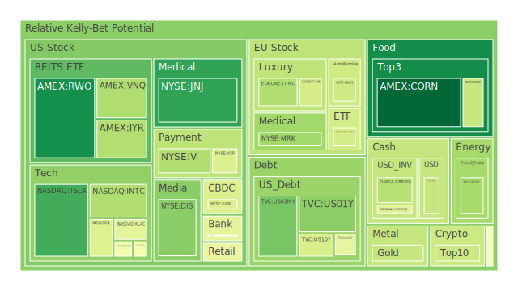
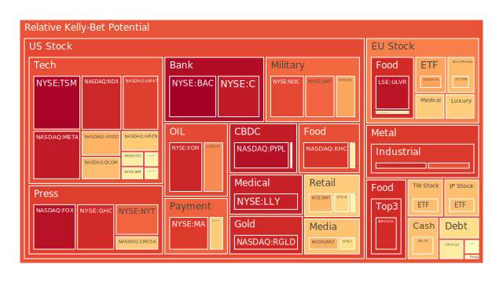
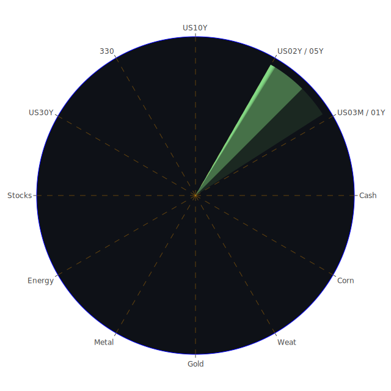

# 一、整體背景：空間、時間與概念三位一體的思考

## （一）空間（Spatial）的三位一體
1. **經濟學的視角**  
   當前各國在地緣政治與貿易環境中所處的位置或區域聯結，極大地影響資金流向與供應鏈結構。新聞顯示，美國對中國祭出高達145%的關稅，引起市場普遍的避險情緒，亦造成全球資金瞬間重分配。這種空間上的重組在歷史上也常見於大型貿易衝突，如過去歐盟與美國之間互祭鋼鋁稅時，若某些地區產品無法輸入美國，資本就會尋找替代市場。對照現在可看到，歐盟與美國在科技領域雖出現部分關稅互免消息，但也衍生了與他國（例如中國）的進出口關係再度洗牌。  
   以經濟學角度大膽假設：空間層面上的關稅重組、供應鏈轉移，會帶來區域內不平衡成長，最終影響全球資產定價。例如美國國債（US Treasury）長短年期殖利率上揚，部分可視為海外資金對美元資產產生避險需求，又或部分國家在外匯儲備上減少配置美債改投黃金、石油等實體資源。

2. **社會學的視角**  
   從社會層面來看，空間層級的不平衡也反映在不同社群或文化衝擊上。新聞多次提到的「消費者對部分產品產生排擠，或是因政策壓力而壓縮購買意願」，皆可能引發跨區域的對立或民族主義聲浪。例如新聞裡曾出現「Nike、Skechers 等美國品牌在中國面臨抵制」的聲音，呼應了地緣政治演變與跨國企業社會聲譽的此消彼長。這讓投資人可能對「跨國零售」或「國際品牌」類股產生疑慮，其股價波動因社會情緒高漲而放大，帶有區域性的高度不確定性。  
   此類區域/社會情緒的動盪，在歷史上也可回溯至如 1990 年代某些國家爆發金融危機後引起的排外潮，或 2018 年度美中貿易爭端時的一波波「抵制美貨／抵制中貨」浪潮。該種以社會認同為核心的消費行為，其擴散性往往借助社群媒體迅速放大，可能在短時間對零售、科技硬體、快速消費品形成較高波動度。

3. **心理學與博弈論的視角**  
   心理學層面，空間不只是地理，也包含「市場認知」的邊界。在投資人心中，市場恐慌時往往湧向「避險區域」（如黃金、白銀、國債），形成資金空間的重新配置。此處亦可對照新聞裡不斷提及「債券市場大幅波動」、「長期公債殖利率創下自 1982 年以來最嚴重單週升幅」等線索。投資者行為可能因群體恐慌而蜂擁出脫風險資產，轉進被視為「較安全的地方」。  
   若從博弈論角度大膽假設：空間分布與群體博弈往往出現在各國政策亦相互試探與報復的模式下。美中若互相提高關稅，會讓周邊經濟體因權力真空或供應鏈再結構而得利或受損。投資人預期決策也會轉向那些「未捲入衝突」或「享有關稅優惠」的國家與市場。這種空間重組，最後成為投資版圖的再洗牌。

## （二）時間（Temporal）的三位一體
1. **經濟學與歷史脈絡**  
   觀察現今市場訊息顯示：從聯準會（FED）到美國政府的相關政策宣示，都存在階段性與周期性。RRP（逆回購）下降、EFFR 交易量上升、FED 資產負債表下降幅度加大，類似的狀況在過去金融環境收縮時期也曾發生。以 2008 年金融風暴或 2013 年「退場恐慌」（Taper Tantrum）為例，當貨幣市場流動性從寬鬆轉向趨緊，在「時間軸」上通常帶動兩至三個月甚至更長週期的資金再分配。  
   目前新聞亦顯示關稅與利率變動經常在短週期內輪動。例如有報導指出，美國政府在非常短的時間內屢次拉高或豁免部分科技類產品關稅，導致市場信心反覆。此種「時間上的割裂」導致許多資本難以進行穩定的長期配置，進而催化價格波動。回溯 1970 年代的石油危機，可知當時數個月內原油價格劇烈漲跌曾令大宗商品市場隨之翻騰，也波及債券與股票的定價。如今高通膨（雖近期顯示通膨率有放緩趨勢，但仍存不確定性）結合大國貿易戰陰霾，時間上的不確定性再次加劇。  

2. **社會學的長期與短期影響**  
   社會上對關稅、利率、通膨的感受，有時存在「慢性麻痺」與「瞬間爆發」兩種時序面的不同風險。短期內，新聞大幅報導「市場再現崩跌、企業財報不佳」，可能產生群體的焦慮情緒，消費與投資行為被壓抑。中長期，若市場習慣了某些程度的關稅或交易壁壘，社會情緒可能逐漸轉向「自我修復」，企業會尋找新供應商或新市場，並有各種誘因去調整生產模式。過往歐盟與英國脫歐前後的幾年，就是此種「社會逐漸適應政策變局」的例子。  
   然而市場有時會在「突然的政策轉向」或「地緣局勢突變」下瞬間再度被驚醒，導致二次衝擊。在時間軸的長短兩端，社會適應與恐慌交互影響，最終可能讓消費端需求大起大落，也讓企業難以做出穩定預期。

3. **心理學與博弈論的時序博弈**  
   從時間角度看，投資人經常採取「前置部署」或「事後反應」。博弈論裡常提到的「可預期性」或「承諾機制」，若政府或央行的操作過於頻繁反覆，就會使市場缺乏對未來的可預期性，升高心理不安感。新聞提及「某 CEO 稱之為末日來臨」，或「市場分析師憂心年底前再跌一波」，都代表此種時間層面上的恐慌累積。  
   歷史上，較為出名的短時間劇烈波動如 2020 年初新冠疫情期間，許多國家政府在短時間內祭出封鎖或量化寬鬆，投資人一度深陷巨幅波動。而今雖然不再是疫情衝擊，但貿易戰、關稅、地緣政治衝突等疊加，使投資人的心理週期仍舊緊繃，顯示時間層面上的「不確定性」尚未完全化解。

## （三）概念（Conceptional）的三位一體
1. **經濟學的理論脈絡**  
   在概念層次，市場如同動態網路系統，由各種資金流、政策干預、投資心理組合而成。根據理性預期、效率市場假說或行為經濟學等理論，我們可大膽假設：假使市場頻繁受到外生衝擊（如全球性的關稅戰、貨幣緊縮），那麼對「理性」或「效率」本身就是挑戰。新聞裡談到的「美國國債殖利率創多年新高」及「油價大幅波動」，印證了資金正在尋找新的流向，可能違背部分傳統的教科書理論，也顯示泡沫風險分布正在變異。  

2. **社會學與心理框架**  
   概念層面也要思考「認知共識」的重要性。當所有人都相信某項資產是避險天堂，該資產往往出現過度追捧，最終產生泡沫並自我實現地爆破。歷史上，如 1970 年代黃金的狂飆、1990 年代網路科技股泡沫、2008 年金融海嘯前房地產與房貸資產證券化的膨脹，皆在前期形成一種「新的共識：該資產是不可或缺的」、或「科技永遠進步」、或「房價永遠只漲不跌」。一旦資本挹注過量，價格遠離基本面，泡沫自然累積。  
   如今在新聞多處看到：加密貨幣（如 BTC, DOGE, ETH）在若干消息裡被直言「最終將災難性失敗」，也出現不同聲音認為「加密貨幣仍是未來趨勢」。這種概念對立與社會分化，顯示社會心理框架尚未達成共識，因而波動巨大，也意味潛在泡沫與風險機會並存。

3. **博弈論的策略思維**  
   在概念的維度，博弈論揭示各參與者往往根據他人的期望修正行為，形成重複與動態的賽局。不僅僅是政府之間互相祭出關稅或豁免，投資者也會根據新聞裡是否提及「對科技業的豁免」而加碼半導體或電子支付類股，或者見到「對石油產業」不友善的言論就抽離能源股。當所有人同時進行策略互動，市場容易出現過度反應或鴕鳥心態，最後產生正反合的結果：最初利空解讀（反）與原有利多預期（正）交互激盪，在市場形成某種妥協（合），讓部分資產的定價暫時取得平衡，但只要新變數介入，就會再次震盪。

---

# 二、正反合思維的歸納（文字敘事呈現）

上述空間、時間、概念三個維度，每個維度內我們都嘗試以經濟學、社會學、心理學、博弈論去做「正、反、合」推演：

**（1）正向觀點（正）**  
- 地緣政治摩擦雖多，但局部已出現鬆動跡象。如美國對科技產品或部分晶片業者豁免关稅，歐盟也積極推動新貿易協定，嘗試改善全球供應鏈瓶頸。對少數領域（如某些半導體、AI、電動車供應鏈）或許是利好。  
- 央行與政府若對市場動盪採取適度監管或增強流動性，仍可能穩住大部分資本市場情緒。  
- 長期的改革與調整，可能培養投資人對「永續趨勢」及「新技術應用」的信心。

**（2）反向觀點（反）**  
- 高達145%关稅等激烈舉措重創國際貿易，新聞裡多次提到各行各業「結構性衝擊」：零售、汽車、工業製造皆受波及。  
- 美國國債利率創新高，債券市場大幅波動；相關資料顯示不只長天期殖利率攀高，甚至中短天期也在攀升，會使企業融資成本提高、消費信貸壓力上升。  
- 金融市場出現「債券看空勢力擴大」、對未來經濟增長的擔憂再度升溫，主流指數一度大跌的頻率升高。

**（3）綜合觀點（合）**  
- 在全球化深度連結的今日，無論任何衝擊，市場最終常會出現因應方案：像歐盟與一些國家加快簽訂自由貿易協定、國際大企業重新配置生產基地、投資人也分散於多元資產對沖風險等。  
- 隨著部分寬鬆或保護政策陸續出臺，可能使震盪趨勢在短期內獲得暫時緩解。  
- 但長期來看，若這種貿易與政策干預頻仍、地緣風險長期不退，仍將持續對全球資本市場和產業供應鏈造成龐大不確定性。

---

# 三、泡沫風險與各資產觀察

以下就新聞資料與歷史情境，簡要敘述多種重要資產的可能泡沫分數與其潛在風險。為避免文章冗長，將各資產濃縮為要點，並盡可能引用近期發生之新聞（例如關於關稅、油價、科技豁免、加密貨幣議題等）以及歷史類比做說明：

1. **美國國債**  
   資料顯示美國中長天期公債殖利率從 4% 升至 4.5% 以上，甚至 5 年、2 年期的利率也大幅上揚。在過去，長天期債券殖利率不斷攀高容易造成債券價格暴跌，引發所謂的「債市殺手級風險」。新聞亦多次提到「債券市場賣壓沉重」、「美國國債總流通量處於低檔但殖利率卻飆升」，顯示市場對美國未來財政前景相對謹慎。歷史上如 1982 年當時長債殖利率快速升至高點後，經濟雖進入某種調整期，但資本市場波動劇烈。若殖利率持續攀升，可能代表市場需要更高的風險補償，亦突顯美國財政疑慮。

2. **美國零售股**  
   新聞指出多家零售商對於關稅戰感到壓力，如 Target（TGT）一度出現下修財測。疫情時期線上零售成長雖快，但若持續面臨高關稅與全球供應鏈不穩，零售股泡沫風險增高。例如社會情緒若對美國品牌產生抵制，或該品牌生產成本提升，都會壓縮利潤，股價或有進一步回跌空間。歷史上可參考 2019-2020 年的貿易摩擦，一旦零售業利潤被壓縮，股價波動幅度往往頗大。

3. **美國科技股**  
   包含 AAPL、MSFT、NVDA、META、TSLA 等龍頭。新聞反覆強調關稅與出口管制的一再改變，曾令電動車、晶片等科技公司股價大跌又反彈。如今雖偶爾聽到「對智能手機或晶片有部分豁免」，但同時也提到「特斯拉暫停對中國市場輸入部分美製車型」。泡沫分數中不少科技股位於中高區間，如果政策風險再起，或全球需求下滑，都可能使科技板塊繼續波動。

4. **美國房地產指數**  
   有些 REITs（如 RWO、VNQ、IYR）顯示泡沫風險逐漸增高。長期房貸利率漲至 6-7% 左右，消費者購房意願下降，一旦交易量大跌，就可能使房地產產業鏈承壓。歷史上，2008 年時房地產引爆金融危機，提醒投資人不能忽視房地產可能形成的系統性風險。即便近幾年尚無 2008 年時那種次級房貸大規模違約的危機跡象，但若經濟衰退風險升高，房地產恐怕仍是高泡沫區。

5. **加密貨幣**  
   Bitcoin（BTC）、Ethereum（ETH）、Dogecoin（DOGE）等。新聞指出部分意見領袖視其最終會「災難性失敗」，也有人看好其為下個世代金融體系。加密資產價格深受社會情緒與國家政策左右，尤其若法規取締力度升級，或是流動性收縮，加密價格可能再次大跌；但也存在一派資金認為它能對沖法幣動盪。歷史上比特幣曾經數度腰斬又翻倍上漲，其高泡沫、超高波動的特性仍然未變。

6. **金／銀／銅**  
   金銀等貴金屬價格時常與地緣政治、通膨及避險需求相關，新聞提到金價創新高，銀價也表現強勢，而銅價則反映全球景氣需求。有觀點認為在地緣衝突升溫及全球貨幣寬鬆或緊縮不定下，黃金仍是最重要的對沖品。但若美債殖利率持續走高，黃金也不一定能一路攀升，因為持有黃金的機會成本在上升。歷史上如 1980 年代黃金狂漲後曾大幅回調，但之後幾次金融危機又成市場追捧標的，顯示其泡沫風險與機會並存。

7. **黃豆／小麥／玉米**  
   這些大宗農產品（SOYB、WEAT、CORN）常受國際貿易與氣候影響。新聞中提到氣候異常引起乾旱或水災，造成某些區域農作減產，也有提到關稅使原本來自某國的糧食出口受阻。這些變數往往推動大宗農產品價格飆漲。歷史場景如 2008 年糧價危機，也曾造成相關期貨價格狂飆，最後政府或國際組織介入穩定糧食供應。故大宗農產品看似保守，實則也可能有大波動或泡沫風險。

8. **石油／鈾期貨（UX!）**  
   油價大幅波動，新聞裡指出近期油價已回落至 60 美元上下，也有分析指關稅、需求不振等壓力使油價難再上漲。然而地緣政治衝突常使石油面臨供應風險，任何動盪都能讓油價迅速走高。鈾期貨則涉及核能發電需求，與國際能源政策連動，變數不少。歷史上中東若局勢動盪，油價往往受刺激暴漲或暴跌，同時鈾價也會跟著出現避險買盤或拋盤。泡沫風險在高地緣政治敏感度下，極易放大。

9. **各國外匯市場**  
   若以 GBPUSD、EURUSD、AUDUSD、USDJPY 等為例，新新聞中也提到美元指數因國內政治與債券殖利率攀升而走勢詭譎。英鎊、歐元近年常因歐盟內部動盪、英國脫歐後續影響而呈現大起大落。澳洲則受大宗商品景氣影響較大，日圓在避險情緒高漲時常被推升，但若本國政策偏向寬鬆，則可能繼續貶值。外匯市場瞬息萬變，歷史上著名的英鎊狙擊事件，或數度貨幣危機，都可見大行情爆發時常在意料之外的新聞衝擊下產生。

10. **各國大盤指數**  
   富時（FTSE）、德國 DAX（GDAXI）、法國 CAC（FCHI）、台灣 0050（TWSE:0050 類），以及中國上證 300（000300）等。新聞顯示中歐等地也因貿易戰受到波及，尤其德國、法國的市場對於全球供應鏈敏感度極高，任何關稅或地緣因素都使其大盤擺盪。台灣大盤則與科技供應鏈息息相關，美中一旦有相關限制，半導體、電子零組件外銷即受到影響。此外，過往也有日本股市在泡沫期高漲後長達數十年橫盤的先例，提醒投資者大盤同樣有泡沫風險。

11. **美國半導體股**  
   NVDA、AMD、INTC、KLAC、AMAT、QCOM、AVGO 等近期雖受 AI 與高效能運算浪潮帶動，但新聞陸續顯示，關稅衝擊與出口管制可能衝擊中長期成長動能。也有消息指出美國豁免部分關稅，短線有利好，但若中方祭出反制手段，整體產業鏈依舊緊繃。歷史上一旦晶片供應受阻，整個高科技生態鏈便遭擾動，若市場對該產業前景過度樂觀，亦易形成泡沫。

12. **美國銀行股**  
   JPM、BAC、C、COF、AXP、MA、V 等金融支付相關公司。雖然新聞裡有提到「Dimon 認為銀行可在此時發揮市場修復功能」，但若美國國債出現風險、整體利率環境轉變、消費貸款違約率走高，銀行股的信用風險必然上揚。歷史上如 2008 年、2023 年區域銀行風波，均顯示銀行股恐在市場突然失去流動性或資本信心時遭遇大幅衝擊。若泡沫分數偏高，投資人需審慎評估。

13. **美國軍工股**  
   LMT、NOC 等，地緣衝突加劇時，短線常受資金青睞。但若衝突有變數（例如國際和談或預算縮減），該板塊恐瞬間被拋售。也要留意政府開支挪用、財政風險升高時，國防預算未必持續增長。歷史上也有軍工訂單大幅削減後股價腰斬案例。

14. **美國電子支付股**  
   例如 PYPL、Square 等，以及前面提到的 MA、V。電子支付在疫情後發展迅速，但若消費力萎縮、交易額降低，再加上監管強化，也會衝擊該板塊。新聞顯示部分銀行支付股的泡沫指數已非常高，意味若市場氣氛逆轉，跌勢也會快速擴大。

15. **美國藥商股**  
   JNJ、MRK、LLY 等。醫藥防禦性本質常被視為抗衰退標的，然而新聞裡也提到關稅可能造成藥品原料成本上升，或政局使得藥價管制法規介入。歷史上藥品股有時在巨大風險環境下表現相對穩健，但投資人仍需留意政治面衝擊。

16. **美國影視股**  
   NFLX、PARA、FOX、DIS 等。新聞中提及部份產業衝擊，如串流平台廣告收入、拍片成本受通膨影響等。若消費者預算緊縮，娛樂支出縮水，會導致收入端壓力。投資泡沫假設：影視產業短期若狂熱追捧，股價易隨市場情緒波動。

17. **美國媒體股**  
   CMCSA、NYT、GHC 等媒體類型。與影視類似，若廣告市場降溫，公司營收被壓縮。也有消息指出部分媒體在政治言論或社會爭議中受波及。歷史上廣告景氣循環常帶動媒體股走勢大起大落，宜注意新聞寫到「市場所謂對傳統媒體不再信任」等情緒面影響。

18. **石油防禦股**  
   OXY、XOM 等。油價一旦重挫，這類石油企業往往面臨利潤衰退壓力；若國際衝突或減產協議推升油價，又能迅速收益。新聞裡預測油價在 60 美元附近持續震盪，但也要觀察 OPEC+ 後續是否進一步干預。油股泡沫風險取決於全球需求與地緣政治孰能壓倒對方。

19. **金礦防禦股**  
   RGLD 等。若金價攀升，有助推升金礦公司盈餘；但萬一金價大幅回調，該板塊也會跟著受創。尤其若此波黃金上漲受避險與通膨預期推動，一旦市場氛圍轉變或利率走高導致持有黃金機會成本上升，金礦股就可能下跌。歷史上一旦金價拐頭，礦業股票跌幅通常大於現貨金價。

20. **歐洲奢侈品股**  
   KER（Kering）、RMS（Hermès）、MC（LVMH）等。新聞曾提到歐洲與其他地區貿易協定談判，但若關稅衝突或經濟衰退，頂級消費市場也會受衝擊。歷史上奢侈品股在經濟成長週期大放異彩，但衰退來臨時消費力驟降亦造成股價顯著回調。

21. **歐洲汽車股**  
   BMW、MBG 等。汽車在中美歐貿易壁壘中屬敏感產業，如美國提到對車輛或零件徵收高關稅，德國汽車出口也會受衝擊。回溯 2018-2019 年貿易戰時期，德國車廠一度大幅削減北美產線。現在若類似狀況再起，汽車股泡沫易破裂。

22. **歐美食品股**  
   NESN、KHC、ULVR 等食品消費類。此領域雖具防禦性，但若消息面顯示通膨推升原料成本，同時消費者購買力下降，也會使獲利空間被擠壓。過往重大通膨期，食品公司利潤不一定能順利轉嫁成本，若股價已被看作「絕對防禦」，一旦營收或毛利率不及預期也可能大幅回檔。

---

# 四、宏觀經濟傳導路徑分析

1. **貨幣政策與公債**：聯準會（FED）針對緊縮或寬鬆的舉措，透過公債殖利率影響市場利率，再影響到企業與個人貸款，最後影響就業與消費。新聞顯示美國債券利率高企，加劇企業成本，若企業因利率偏高而投資縮手，就進一步壓抑經濟增長。  
2. **關稅戰與大宗商品**：高關稅使全球供應鏈成本提升，大宗商品（石油、金屬、農產品）若供應鏈斷裂或重新布局，短期可能引發價格飆漲。若經濟放緩，需求下滑，又可能使價格下跌，兩面擾動加劇波動。  
3. **地緣政治與投資動能**：若地緣衝突升級，軍工、能源等領域短線受惠；若相關地區是原物料供應重鎮，市場又恐慌性拉抬某些資源類股。最終造成資金從股票、債券或其他市場大幅流出或流入。

---

# 五、微觀經濟傳導路徑分析

1. **企業層級**：財報顯示，若原材料價格因關稅或匯率上升，企業毛利受壓；若最終市場因消費力下降銷售不振，企業獲利也被進一步打擊。新聞裡一再提到「零售業訂單減少」、「汽車出口回流不易」，均是此類實例。  
2. **消費者行為**：通膨與利率上漲令消費者貸款變貴，購買意願降溫。地緣衝突升溫也削弱旅遊、娛樂等支出。消費端縮手必然反饋至各行各業營收。  
3. **產業供應鏈**：科技業一旦被關稅或出口管制點名，上游（半導體零組件）、中游（組裝廠）、下游（品牌商）都會連帶受創。此種微觀衝擊逐層傳導，最終反映在整個市場情緒上。

---

# 六、資產類別間傳導路徑分析

1. **美元與黃金**：若美國殖利率攀升導致美元資產吸引力上升，則黃金可能被拋售；但若市場恐慌轉強，資金反而湧入黃金。兩者間的相互傳導有時亦會失靈，但歷史經驗顯示避險需求常推升黃金與美元同向上揚，也能出現負相關情況，視當下主導情緒為何。  
2. **加密貨幣與科技股**：不少加密貨幣投資者同時是科技股投資人，兩者在流動性寬鬆時都容易被追捧；若市場風險偏好突然大降，則兩者都可能在短期內大幅下挫。  
3. **石油、防禦類股與大盤**：地緣衝突升級時，油價上漲、防禦類股也上漲；若衝突趨緩或經濟下行，油價與防禦股需求不再高漲，則大盤或另有新主流板塊崛起。這些轉折對整體股市有牽一髮動全身之效。

---

# 七、投資建議

以下建議僅供參考，市場風險始終存在，投資人應依自身風險承受度與財務目標做出決策。此處提出三種組合：穩健、成長、高風險，三大類合計為 100%，每類再選三種子項目並給出比例示意。

## （一）穩健配置（約佔 40%）

1. **美國國債或高評級公債**（約 15%）  
   雖然美國債券殖利率近期高企，價格存在波動，但它在金融市場仍具流動性與安全性，適合作為核心避險資產之一。然而殖利率上揚也代表持有成本變化，仍需注意盯市風險。

2. **黃金**（約 15%）  
   當前高通膨與地緣政治風險並存，黃金是歷史悠久的避險選擇。雖然泡沫風險也不容小覷，但仍可做穩健性配置的一環，一旦市場再度出現動盪，黃金或能維持防禦特性。

3. **大型食品或防禦性消費股**（約 10%）  
   如 ULVR、NESN、KHC 等，雖然新聞指出它們可能遭到原料成本上漲或利潤受壓，但在經濟衰退情境下仍相對抗跌。不過若估值偏高，進場需更謹慎挑選。

## （二）成長配置（約佔 40%）

1. **半導體龍頭**（約 15%）  
   包含 NVDA、AMD、AVGO 等，儘管關稅與出口管制讓其泡沫風險不小，但 AI、電動車、自動化等長期趨勢可能支撐其成長動能。投資者需留意高波動與政策衝擊。

2. **生技醫藥**（約 15%）  
   如 JNJ、MRK、LLY，此類公司在人口高齡化與醫療需求升溫的背景下，長期具成長空間。風險在於藥品法規、關稅與競爭壓力，需慎選具研發優勢或管線豐富的標的。

3. **新能源相關**（約 10%）  
   不論是電動車產業鏈（TSLA 等）或再生能源基礎設施（部分歐洲綠能公司），都有中長期潛力。但新聞裡若美中之間產生新爭端，或供應鏈斷裂，也會造成股價震盪。

## （三）高風險配置（約佔 20%）

1. **加密貨幣**（約 5%）  
   BTC、ETH 等高波動標的，泡沫風險高，但長期有資金認可其數位黃金或去中心化價值。適合小比例嘗試，隨時警惕監管與流動性收縮衝擊。

2. **新興市場高收益債**（約 5%）  
   一些開發中國家債券收益率高，但受地緣政治、匯率與經濟體質影響，風險相對顯著。若衝突或資本外流，價格震盪會很大。

3. **航太軍工或極端題材股**（約 10%）  
   包含 LMT、NOC 或小型航太防務公司，若地緣衝突再升級，短線或大漲；但若局勢趨於和緩，軍工預算削減，就可能急跌。此類題材可視為高風險進攻性配置。

---

# 八、風險提示

1. **泡沫風險**  
   報告中多次提到「泡沫指數」與市場對部分資產的過度炒作風險。無論是國債、股票、房地產或加密貨幣，都可能因資金或情緒過度集中而產生泡沫。一旦泡沫破滅，跌幅往往甚劇，請切記「泡沫分數越高風險越高」的警訊。

2. **關稅與政策不確定性**  
   新聞可見美國對中國持續升高關稅或豁免的反覆舉措，其他國家也有相對應的報復或調整。政策若反覆，市場預期會陷入混亂，價格瞬間波幅或擴大。要注意短線政策動向及國際談判結果。

3. **地緣政治與突發事件**  
   世界各地衝突、制裁、貿易壁壘都可能在短時間內升溫。新聞裡屢見某地爆發空襲、他國祭出援助或制裁、意外事故（如直升機意外、基礎建設坍塌）都可能擴大金融市場不確定性。投資時務必留意各種突發性系統風險。

4. **流動性風險**  
   當市場情緒恐慌，投資者爭相出脫風險資產時，甚至看似穩定的債券也可能暴跌、流動性枯竭。2023 年部分美國地區銀行爆發流動性危機就是典型案例，提醒投資者在高不確定時代應該預留充足現金或具有高流動性的標的作為緩衝。

5. **企業營運基本面惡化**  
   關稅與經濟衰退可能打擊企業利潤，導致違約與裁員上升。即使是大型龍頭公司，也可能因政府補貼、法規或地緣局勢改變而動搖根基。歷史上，太多傳統百年企業也曾因結構性衝擊而陷入經營困境。

6. **歷史不代表未來**  
   雖然本文大量援引過往歷史作比較，但每次危機與市場結構都不盡相同。投資人切勿過度依賴過去經驗而忽視全新的風險模式。尤其科技發展、國際政治、多元金融工具的誕生，讓市場動能變化更為複雜。

---

## 投資有風險

市場總是充滿不確定性。本報告所提供之內容與建議，僅為整合多重新聞與歷史觀點後的參考，非任何投資指令。投資者必須根據自身的財務狀況、風險承受能力與投資目標做獨立判斷與決策。面對當今紛繁多變的環境，包括高關稅、地緣政治衝突、貨幣政策轉向、泡沫風險飆升等多重因素，務必隨時保持警惕，注意資金管理與部位控管，切莫因一時恐慌或盲目樂觀而忽略了整體風險。

（全文完）

 
Daily Buy Map:

 
Daily Sell Map:

 
Daily Radar Chart:

 
