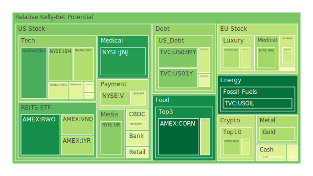
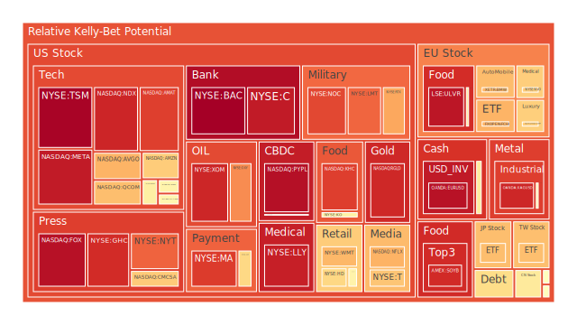
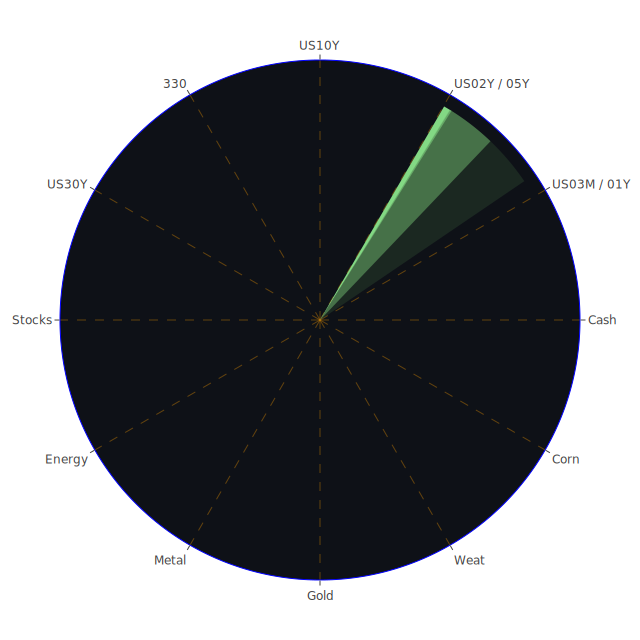

# 一、投資商品泡沫分析

## （一）美國國債
美國國債在近期因長短天期殖利率變動而受到極大關注。根據提供之數據，2Y殖利率大約在3.98%至3.70%之間波動，10Y殖利率約為4.50%，30Y殖利率則逼近4.88%。從新聞可看出，美國持續與他國進行關稅與貿易爭端，使整體國際資本對於美債的避險需求有所起伏。同時，有報導指稱「債券市場賣壓‘嚴重’」，且「長期殖利率創1982年以來最大單週漲幅」，皆暗示著美國國債價格在高通膨、地緣政治與聯準會壓力之下存在顯著風險。  
然而，歷史曾多次證明，美國國債在全球市場動盪時仍具備相對的安全性。當前泡沫分數觀之，雖然美債的D1或D7數值（例如US02Y、US05Y、US10Y、US30Y等）有時偏高，但長期仍有一定支撐力。若聯準會再次展開不預期的寬鬆或市場避險情緒飆升，美國國債仍可能扮演資金流向的安全港。但也要注意到，若通膨與利率調整幅度超越預期，長債部位價格恐下跌，並引發持有成本與風險升高。

## （二）美國零售股
以大型連鎖零售企業為代表，零售股在新聞上常被提及。近期新聞多次透露消費力道不穩，以及通膨對消費者的購買行為可能產生壓力。例如有報導提到「通膨的消費者行為恐讓美聯儲更難控制通膨」，亦有「美國零售股」於新聞面受貿易戰衝擊（如關稅與進口商品價格上漲），使得零售庫存與成本管理難度大增。歷史上，當美國面臨大幅加稅、關稅或經濟衰退疑慮時，零售股往往顯著波動。在泡沫風險指標中，一些零售龍頭可能D1或D7呈現中度泡沫，暗示投資人對該板塊後市預期較為猶豫。當市場焦點重新回到消費支出意願時，若新聞面出現更正面的報導（例如「零售支出意外強勁成長」），零售股可能得到短線支撐，但其風險還是來自於長期利率與就業市場狀態。

## （三）美國科技股
科技股長期以來是美股的成長引擎，但近期新聞可見「關稅、出口管制、半導體領域禁令」等，亦有「美國對中國的半導體產品展開國安調查」之聲浪，可能衝擊部分晶片與電子支付相關企業的獲利。新聞指出「特斯拉在中國暫停對某些美國製車款接單」，顯示跨國生產與關稅變動的複雜性。另有「美國科技股可能因貿易衝突面臨後續壓力」，但相對也有「針對電子產品暫緩課稅」的正面消息為部分廠商提供短期喘息。  
以泡沫指數觀察，知名科技企業例如AAPL、MSFT、META、NVDA等都出現相對較高的D14或D30泡沫風險分數，反映市場對高估值的成長股擔憂加劇。但歷史告訴我們，每當科技板塊遭遇利空洗禮後，若創新動能強，或是市場資金重回成長股懷抱時，它們能迅速反彈。因此，科技股雖具備成長潛力，卻也可能在利率與地緣政治干擾下形成劇烈震盪，投資人應加倍留意評價面的風險。

## （四）美國房地產指數
房地產相關ETF或REITs如VNQ、IYR等，根據泡沫分數統計，過去幾日的D1、D7與D14都有明顯攀升。新聞面提示，美聯儲在面臨居高不下的通膨與資產負債表調整時，按揭貸款利率不斷走高，30年固定房貸利率現已超過6.6%，遠高於一年前的2.97%。這意味房地產投資成本正快速攀升。過去歷史階段，當房貸利率陡峭上升，房地產價格常遭受壓力，或至少出現交易量銳減。近期市場謠言與新聞則不斷強調「商業不動產呆帳風險增加」、「某些地區的商業地產空置率上升」，使該領域更具短期波動風險。儘管近年來不少資金湧入REITs追求股息收益，但在高利率環境下，投資報酬可能被侵蝕，長線需要精挑地段與租金成長潛力。

## （五）加密貨幣
根據數據顯示，BTCUSD在數日前曾處於8萬美元以上區間，其D1泡沫指數在0.38至0.40之間，ETHUSD則約在0.51上下，DOGEUSD則曾在0.56到0.51之間做波動。新聞事件部分提到「Larry Summers警告DOGE最終將以災難收場」，顯示市場對投機性強的加密貨幣抱持擔憂。然而，也有投資人認為比特幣在“去美元化”與“通膨顧慮”情境中會獲得青睞。歷史上，加密貨幣於2021年前後因寬鬆貨幣環境與投機情緒而暴漲，然而當貨幣政策收緊時，價格也可能大幅回調。對沖基金與專業投資人時常利用加密貨幣之高波動特性在短線進出，若無足夠風險承受能力，普通投資者宜謹慎。

## （六）金／銀／銅
黃金（XAUUSD）對應泡沫分數雖不算極端，但D1與D30都維持中等以上水準，象徵市場對金價已有一層防禦需求。近期新聞出現「金價創下新高，部份礦業股票走高」，亦有專家稱「黃金可能優於公債以應對市場風暴」。從地緣政治與高通膨風險來看，黃金傳統上是避險首選，歷史經驗如2008年金融危機後，金價於恐慌期亦曾短暫下跌，最終因恐慌資金流入而翻升。至於白銀（XAGUSD）與銅（COPPER），新聞面顯示「金銅比接近700-900左右的高檔」，代表黃金與銅的價格差距十分顯著，通常這可能隱含經濟走緩或通膨因素；若未來基建或新能源需求擴大，銅價也可能再次回暖。就風險面看，白銀與銅波動度往往高於黃金，投資人需格外留意全球經濟景氣以及產業需求變遷。

## （七）黃豆／小麥／玉米
觀察CORN、WEAT、SOYB這些農產品，新聞中提到「關稅與國際貿易擾動」可能影響全球糧價，尤其當進出口關稅對穀物交易衝擊重大。從泡沫風險指數來看，CORN與WEAT的D1較低，但D7與D14偶有攀升，也顯示投資人預期價格可能有中長期波動。歷史上若出現極端天氣、地緣政治衝突或糧食出口禁令，農產品期貨往往急漲。近來尚有報導指出「阿根廷擬取消外匯管制」，雖然主題不直接在穀物上，但阿根廷是南美農產品大國，一旦其金融市場動盪，也或可帶動農產品價格劇烈波動。

## （八）石油／鈾期貨UX!
USOIL最近跌破每桶60美元後企圖反彈，但新聞點出「沙烏地可能再度出手」，顯示未來油價或又面臨波動。同時，若各國對可再生能源投資加大力道，長線上石油需求可能承壓。但短線而言，舉凡地緣政治或是歐佩克減產，都能瞬間推升油價。至於鈾期貨UX!，由於核能議題長期受到政策與環保等因素影響，價格波動較特殊；一旦各國推進核電政策，UX!就可能大漲，反之市場恐慌時也會使鈾相關產業處於高不確定風險。現階段根據D1與D7泡沫風險並無極端，但仍須密切注意地緣局勢和對核能的政策態度。

## （九）各國外匯市場
GBPUSD、EURUSD、USDJPY、AUDUSD等在最近新聞中，不斷地被關注關稅與國際政治角力的風險。新聞提到「美元成為本週市場動盪的犧牲品」，但也有報導指出「美元暫時獲得支撐」。現階段，英鎊與歐元面臨歐洲內部政治經濟挑戰與美國關稅漩渦，日本則因多種國內通膨及國際對日元利率政策的疑慮而使日元走勢反覆。若從歷史角度觀察，當美國啟動貿易制裁或資金回流時，往往帶動美元短期升值，但一旦美國本身也陷入通膨與債務僵局，投資人對美元信心反而顯著降低，會導致匯市輪動變化巨大。

## （十）各國大盤指數
FTSE、GDAXI、FCHI或亞洲的TWSE等指數，近期受到全球貿易戰情緒與區域地緣危機的干擾。根據所提供數據，FTSE的D1約為0.46-0.48間，上升趨勢持續，而GDAXI也呈現風險攀升的狀態，TWSE（0050代表台灣大型成分股）之D7或D30都有高度警示。新聞也談及「台灣因美中關稅衝擊短賣限制延長」，或「歐盟積極拓展其他貿易協定」等事件，都直接反映了大盤在政治、經濟與貨幣政策下難以穩定。歷史上，國際衝突或金融危機都能讓全球股市同步遭遇大跌，但也可能在決策者協調後迅速反彈，這樣的高波動週期往往測試投資者對各地市場的信心。

## （十一）美國半導體股
半導體企業（如INTC、NVDA、AMD、KLAC、AMAT等）一向被視為科技產業的生命線，但報導顯示「中美關係緊張致使芯片出口面臨安全審查」。短期內，若出口管制加深，營收動能恐下修。從泡沫指數看，KLAC與NVDA的D14、D30在0.58-0.62左右，AMAT更是逼近0.88上下，顯示市場對高估值和中長期訂單的擔憂。一旦地緣衝突或技術阻斷再度升溫，可能觸發該類股高位急跌的風險。然而，半導體一直是工業與消費電子不可或缺的元素，歷史上當產業週期回春之際，股價也能火速拉回，因此投資該領域必須承擔週期性波動。

## （十二）美國銀行股
銀行類股（如JPM、BAC、C、COF等）的泡沫風險指標在近期逐漸增高，像BAC的D1一度逼近0.998，顯示投資人對於金融機構的穩健度持謹慎態度。新聞中多次見到「貸款呆帳率提升」、「信用卡逾期率上升」、「聯邦儲備的資產負債表壓力」等暗示金融環境處於微妙關鍵點。一旦大幅升息或商業房地產違約事件擴大，銀行資產可能出現裂縫。回顧2008年金融海嘯時期，銀行股成為最主要的系統性風險中心；雖然目前的情況與當年不同，但高利率與商業地產風險足以擴大銀行業動盪。投資者應持謹慎態度關注相關新聞與財報。

## （十三）美國軍工股
軍工股（如LMT、NOC、RTX等）通常在地緣政治緊張時能吸引資金流入。根據資料顯示，LMT與NOC的D1泡沫指數分別逼近0.81、0.86，顯示市場對軍工企業已抱持高度預期。歷史上，軍工類型與國防預算密切相關，一旦國防支出擴張或有大型衝突跡象，該類股往往獲得支撐。然而，若國際局勢走向和緩，或國防預算被砍，便會成為利空。新聞面提到「以色列對加薩展開大規模軍事行動」、「多國在衝突地區投入軍備」，這些都與軍工企業的訂單與預期收益息息相關。整體而言，軍工板塊既可能在衝突時大漲，也承受政治變化帶來的不確定性。

## （十四）美國電子支付股
電子支付服務類型（如V、MA、PYPL、GPN等），正面臨全球電子交易量成長的大趨勢，但也與全球經濟循環密切。若消費陷入衰退，交易量也將下滑。同時，貿易壁壘與跨境交易限制或科技競爭，都可能減損支付服務的成長性。新聞面提及「部分金融監管或數位支付條款變動」，雖無直接列明，但長期看仍可能牽動他們的業績。數據顯示V與MA的D14與D30已達0.70-0.90附近，明示市場對這些高估值龍頭的預期相當高；若任何政策或經濟層面出現利空，該板塊可能瞬間抽回。

## （十五）美國藥商股
製藥龍頭（如JNJ、MRK、LLY等）通常是防禦性與成長性並存的板塊。根據所提供之D1與D7，部分藥商股維持在0.12-0.30不等，但也有如LLY在D1已達0.93左右，顯示市場對特定新藥或擴張計畫抱持極高期待。一旦臨床試驗或新藥法規出現波動，恐怕引發不小的股價修正。歷史上，生技與藥廠股時常在大盤趨弱時成為資金避風港，但若市場情緒反轉，部分個股估值和業績也面臨質疑。新聞端如果出現重大藥政改革或專利失效，也會極大影響股價。

## （十六）美國影視股
電影娛樂產業（如DIS、PARA、NFLX、FOX等）在疫情後的市場復甦相當受到矚目。然新聞指出「流媒體競爭激烈」，「好萊塢內部面臨版權與AI著作權法律糾紛」等，增加了該產業的不確定性。DIS在D1約0.26-0.27，屬中度泡沫，顯示投資人對其大規模IP資產仍有防禦性期待；然若消費支出放緩或競爭加劇，後續成長不確定。對流媒體（如NFLX、PARA）而言，核心在訂閱成長與內容投資報酬率；歷史上，若經濟一旦衰退，廣告營收或訂閱可能下滑。投資人需持續追蹤收視趨勢與競爭格局。

## （十七）美國媒體股
與影視產業相近，媒體股包含新聞集團、報紙、新興平台等。部分傳統媒體股（如NYT）D1可達0.81-0.82之間，意味這些公司因廣告收入對經濟景氣更敏感，也受到數位轉型以及社群媒體興起的競爭衝擊。歷史上，當經濟轉弱或廣告投放壓力加大，往往導致媒體營收縮減。但另一方面，政治或地緣衝突可能使新聞媒體流量大增。對於投資人而言，媒體股的業績易受瞬息萬變的網路流量與廣告市場影響，建議留意專案性活動或大型賽事可能帶來短期衝擊。

## （十八）石油防禦股
如XOM、OXY等石油企業，不僅從事上游勘探與生產，也涉及下游分銷。近期油價在60美元出頭上下震盪，若沙烏地或OPEC釋出減產消息，油價可能再度走揚，石油企業因盈餘改善而獲利。可是，長線看，各國ESG與淨零排放政策增強，對傳統化石燃料產業的遠景帶來挑戰。短期泡沫分數顯示XOM、OXY D1都在0.72-0.92區間，顯示市場預期仍相對偏高。一旦油價再次崩跌，該類防禦股也恐遭殃，但歷史經驗顯示，石油公司在通膨或地緣風險時往往具備支撐。

## （十九）金礦防禦股
金礦股與黃金現貨密切相關。當金價上行時，金礦股的槓桿效應往往使漲幅放大。然而，若營運成本（如能源、人工）大幅增加，淨利潤可能被蠶食。新聞面指出「礦業股隨金價高漲而走揚」，亦有一些司法或環保議題（例如對金礦開發的監管），可能壓低估值。此類防禦型資產在市場動盪時頗受青睞，但也要注意，若黃金價格回落，金礦股跌幅往往甚於金價本身，投資人需承擔較高波動。

## （二十）歐洲奢侈品股
奢侈品（如MC、KER等）通常倚賴全球高端消費。新聞面顯示「歐盟與美國、英國、部分亞洲地區關稅紛擾」，或「歐洲消費者受到通膨打擊」，皆可能讓奢侈品銷售不如預期。但同時，奢侈品牌常具備定價權及品牌忠誠度，往往能在經濟下行時依舊穩住獲利，甚至吸引來自新興市場的消費者。歷史經驗顯示，在金融市場動盪期間，奢侈品股通常經歷短暫調整後，仍可能走出獨立行情。故這類個股或ETF有其防禦及成長並存的特色，但要小心當全球經濟明顯收縮或地緣衝突加大時，銷售業績衝擊也不容忽視。

## （二十一）歐洲汽車股
歐洲汽車品牌（如BMW、MBG等），受全球供應鏈短缺、原材料價格高漲、以及貿易稅率波動影響而股價變動。新聞可能聚焦於「新能源車產業競爭」、「晶片缺貨」等議題。歷史顯示，當關稅上揚時，歐洲汽車業者對美出口或從亞洲進口零件的成本均會提高，導致利潤空間受壓縮。相關泡沫風險指標顯示BMW的D1約0.68上下，屬偏高區域，意味市場有警訊。投資人需衡量電動車與傳統車之銷售表現差異，以及各國綠能法規之變動。

## （二十二）歐美食品股
全球食品龍頭（如KO、NESN等）在通膨趨勢下仍具一定抗跌屬性，但高原物料成本可能壓縮毛利。新聞面討論到「消費者對基礎民生用品需求韌性」，故部分食品股在大盤動盪時能提供避險。歷史案例如2000年科網泡沫或2008年金融海嘯，食品股雖會跟隨下跌，但通常相對穩定。從泡沫風險觀察，KO的D14、D30已達0.82以上，若未來營收不如預期，該估值恐面臨回調；但倘若市場繼續動盪，不排除防禦資金介入令股價仍保持一定支撐。

－－－－－－－－－－－－－－－－－－

# 二、宏觀經濟傳導路徑分析
在「空間（Spatial）、時間（Temporal）、概念（Conceptional）」的三位一體下，整體宏觀環境如下：

1. 空間層面：全球主要經濟體之間因關稅拉鋸，使資本流動產生分歧。一方面，美國因基礎設施需求和通膨因素，持續面臨債務與利率的交叉壓力；另一方面，歐亞新興市場在地緣衝突與能源轉型下，更易出現資金動能斷裂與局部集中。  
2. 時間層面：近期聯準會與各國央行的利率調整速度，讓資金於短時間內快速位移，造成股票、債券市場之大幅震盪。新聞顯示，未來數月關稅與政府預算案交織，將是另一輪市場震盪的潛在爆點。歷史經驗指出，當貨幣緊縮循環接近尾聲，市場可能先預期反轉行情，但若實體經濟衰退信號同步出現，仍恐引爆更深層的風暴。  
3. 概念層面：投資心理、社會氛圍與博弈策略互相交織。新聞大量報導貿易戰、地緣衝突時，市場情緒易趨於保守，而當政府或大企業釋出利多訊息時，投資人又快速翻多。博弈論下，不同機構勢力嘗試領先佈局，試圖預判政策走向並壓低或炒高特定標的。

宏觀經濟的傳導路徑，往往由利率、匯率、市場流動性影響企業融資成本，最終反應在就業與消費信心上。當前Fed的經濟關鍵數據顯示RRP在下降，但EFFR交易量仍高企，並且美債總流通量呈現微妙趨勢。此種資金面的博奕可能使短債與長債市場同時緊張，對房地產、銀行資產負債及企業融資意願皆有負面衝擊。

－－－－－－－－－－－－－－－－－－

# 三、微觀經濟傳導路徑分析
微觀層次更多聚焦於企業與消費者的行為：

1. 信用卡與個人消費：報告內提及Charge-off Rate on Credit Card正在高水平，信用卡逾期雖為低，但一旦失業率或消費信貸成本上升，逾期率可能惡化。  
2. 商業地產與租金市場：商業房地產的空置率與呆帳風險升溫，銀行對企業融資的貸款標準更嚴格，可能抑制中小企業投資意願。  
3. 新聞面之商品與供應鏈：關稅牽動的原材料與中間財成本，使製造業或零售業鏈條上的中小企業承擔更大利潤壓力。當利潤受壓時，企業縮減擴張或人力開支，進一步影響就業與薪資。

微觀層面與宏觀密切呼應。如果國際環境與政策面短期內不見緩和，企業端或有多重成本疊加，消費者則面臨物價高企且可支配所得減少，兩方交互作用造成連鎖的需求與產出壓力。

－－－－－－－－－－－－－－－－－－

# 四、資產類別間傳導路徑分析
基於三位一體正反合的觀點，我們可以在空間維度看到各市場板塊環環相扣；在時間維度上，每次貨幣緊縮與地緣衝突訊息一出，資金便瞬間從高風險成長股流向防禦標的，再從防禦標的出脫流向債券或黃金；在概念維度中，投資人由恐慌到逐漸樂觀，或短期翻轉。當前從新聞可觀察到：

1. 科技股與半導體板塊：若面臨關稅及出口限制，可能資金流出；但一旦關稅暫緩或科技補貼消息釋出，資金又回流。  
2. 債券與黃金：均屬避險需求。若利率持續上行，長天期債券價格面臨壓力，投資人改轉向黃金，造成金價上漲。然而，若市場認為美國經濟開始衰退或聯準會快要結束緊縮週期，長債也會突然轉強。  
3. 房地產與銀行股：房地產壓力往往衝擊銀行貸款資產質量；銀行股下跌會加重市場恐慌，連動企業融資成本，使其他產業板塊雪上加霜。  
4. 加密貨幣：與高風險科技股常有一定聯動性；當股市快速反彈，主流加密貨幣也可能同步上揚，但若市場全面風險趨避升溫，加密資產又最先遭拋售。

這些互動關係構成漣漪效應：任何一個市場或產業的利空，皆可能透過投資組合或金融機構的連鎖融資，傳導至其他板塊。相位若能做到約120度差異，且彼此相關係數約-0.5，則能對沖風險，使投資組合波動相對平滑。

－－－－－－－－－－－－－－－－－－

# 五、投資建議
綜合上述宏觀與微觀脈絡，並評估當前泡沫風險，以下提供穩健、成長及高風險三種風格的配置方向，供參考。配置比例合計100%，其中各類再細分三個子投資項目。此配置旨在嘗試實現相位約120度、相關性約-0.5的對沖效果，但需注意實際市場狀況會隨時變化。

## （一）穩健配置（約35%）
1. **短期美國國債**：因市場對通膨的恐慌仍在，短期國債波動相對小，可視為基本避險。  
2. **黃金實體或黃金ETF**：兼具保值與避險的特色，在地緣與通膨風險下，可作資金保全。  
3. **歐美高品質食品股**：例如NESN或KO，此類基本民生與廣泛品牌具相對防禦性，但也須留意股價已有一定泡沫風險。

## （二）成長配置（約35%）
1. **大型科技股**：儘管科技股評價不低，但若貿易與關稅暫時趨緩，再次帶動市場風險偏好，AAPL、MSFT、GOOG等仍有中長期成長潛力。  
2. **半導體關鍵企業**：如NVDA、AMAT，掌握AI與雲端需求，不過需承擔短期出口管制波動。  
3. **奢侈品或消費類龍頭**：MC、KER等在全球經濟復甦階段具有超額利潤空間，前提是疫情與地緣衝突不再惡化。

## （三）高風險配置（約30%）
1. **加密貨幣主流**：BTC、ETH等，波動極大，須嚴控部位，但於通膨或貨幣政策極端環境下，可能具高報酬。  
2. **軍工股**：如LMT、NOC，地緣衝突持續下可能保有訂單，但一旦局勢緩和，估值回檔風險也高。  
3. **石油類股或油價相關期貨**：沙國政策與供需錯配常帶來劇烈波動，若預判油價將重新上行，此類標的可在短期享受漲幅，但若油價再度破底則承擔大幅下滑。

這三大類投資組合力求在不同情境下互相緩衝。例如當科技股受利空衝擊下跌，黃金與短債能發揮避險；當加密或軍工股因地緣或政策消息而暴漲時，也能彌補其他板塊整理帶來的短期損失。由於相關係數約-0.5且相位不同，期望能在各種行情中減緩組合的整體波動。

－－－－－－－－－－－－－－－－－－

# 六、風險提示
1. **泡沫風險高企**：從美國國債長端殖利率飆升、科技股與半導體高估值、加密貨幣持續波動等現象可知，市場存在顯著的泡沫或過度槓桿危機。一旦資金面趨緊或政策反轉，價格可能猛烈修正。  
2. **地緣政治與關稅不確定性**：新聞已顯示美中關係反覆拉鋸、油價或商品價格持續受到地緣影響，而在歐洲、中東等地亦存在軍事衝突。貿易限制一旦升級，供應鏈恐更趨複雜。  
3. **貨幣政策與利率波動**：Fed與各國央行對通膨反應速度不一，若再度大幅升息，將衝擊高槓桿的投資人與企業；反之，若過早寬鬆而通膨依舊頑強，市場亦可能出現更複雜的震盪。  
4. **商業與住宅房地產**：融資環境變動、房貸利率攀升、商業不動產呆帳風險可能引發銀行端壓力，需留意金融體系健康度。  
5. **加密貨幣監管與流動性風險**：許多國家正強化監管，交易所或區塊鏈生態系若產生信心危機，將造成加密貨幣巨幅震盪。

整體而言，當前市場充斥各種不確定因素，投資者需緊盯全球新聞與政策變動，務必分散資產並做好資金管理，不要忽視任何泡沫風險高的警訊。在歷史經驗中，每一次市場狂熱後都可能伴隨劇烈回調，而危機與機遇往往同時並存。若能掌握空間、時間、概念三位一體之正反合互動，搭配注重負相關性之資產配置策略，也許能在多變的市況中取得較佳防禦力與潛在回報。

－－－－－－－－－－－－－－－－－－

# 投資有風險，市場總是充滿不確定性。以上內容僅供參考，投資者應根據自身風險承受能力與投資目標做出獨立決策。切勿忽視任何潛在泡沫高風險之警告，也要持續追蹤最新新聞與市場數據，方能在多變的局勢中獲得相對穩健的佈局與報酬。

 
Daily Buy Map:

 
Daily Sell Map:

 
Daily Radar Chart:

 
