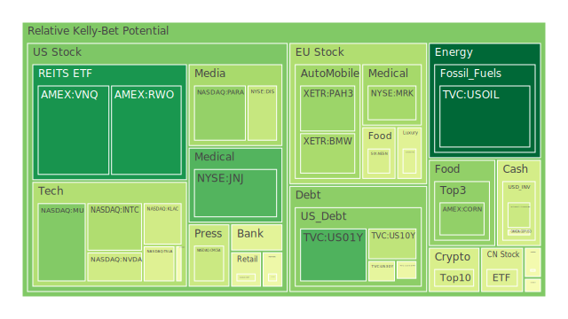
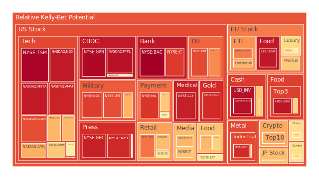
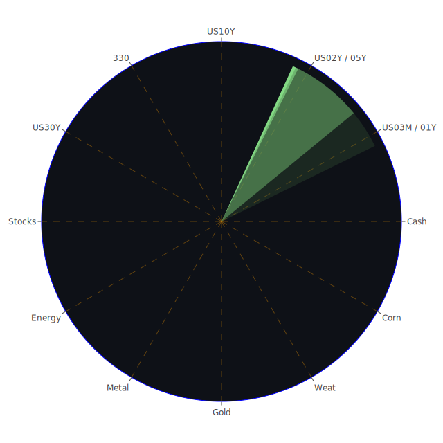

# 緒論：三位一體觀點與當前市場氛圍

在全球化的資本市場中，任何投資標的的走勢不僅與單一面向（如供需或財務指標）相關，也經常受到國際政治、社會心理、媒體風向等諸多因素交織影響。因而本報告採用三位一體的分析思路，分別對「空間（Spatial）」、「時間（Temporal）」、「概念（Conceptional）」等面向進行探討，最後再以正反合的方式萃取出當前可能的投資機會與風險，並同時提出穩健、成長與高風險三種投資組合的參考配置。

在報告中，將運用近幾日的新聞與歷史事件作為背景觀察，引用既有理論（例如：資產泡沫風險衡量、相關係數、價格傳導機制、泡沫指數D1/D7/D14/D30）與社會、心理、博弈等宏微觀見解，試圖展現資本市場中「自然的波動現象」，以公正客觀的立場來進行解析。同時，對於泡沫風險較高的標的，我們絕不會忽視其可能的潛藏危機。文中提及的資產或投資標的之名稱，不再帶有其交易所或券商簡稱（如NASDAQ、NYSE等），僅保留常見的公司或商品稱呼，並在適當處以描述方式談及各資產現況。

---

# 第一部分：Spatial維度的市場與新聞三位一體

所謂Spatial，即空間上的全球布局、地緣政治與國際資金流動。此面向著重不同地區間的互動，包括關稅衝突、外交關係、軍事動態、供應鏈調整等。

1. **地緣與關稅新聞對資產的干擾效應**  
   - 從新聞可見，美國與中國之間的關稅爭端、歐盟對俄羅斯資產的各種凍結以及與其他地區的協議，皆引發不同產業的劇烈震盪。近期多條新聞顯示（如「負面96%的中國玩具業關稅衝擊」等），高關稅正衝擊進口商和零售商。對美國零售股而言，長期維持較高的關稅成本，將侵蝕利潤空間；同時，對新興市場的製造商而言，出口前景也多生變數。  
   - 另一面向，歐盟於新聞中顯示正面動向（例如「EU加速推動貿易協定」），暗示對於歐洲奢侈品和汽車股或有階段性利好。然而，若全球地緣衝突持續，歐洲市場的奢侈品需求仍有不確定性，且奢侈品的高泡沫風險得持續留意。  

2. **國際資本流動與各國央行動向**  
   - 近期有關貨幣市場的新聞與FED關鍵數據顯示美國的資金面有「美國聯準會資產負債表規模相對低位」、「美國銀行系統存款量相對高位」、「錢市場基金總資產持續上漲」等等，也出現高收益債利率持續走升。這種狀況顯示全球資金仍在風險資產與安全資產之間搖擺。  
   - 新聞亦提及多國之間存在各種糾紛和軍事衝突：如以色列在加薩地區的行動、烏俄戰事等皆牽涉到國際輿論以及能源通道安全。原油與鈾等期貨（如鈾期貨）更需持續觀察地緣衝突是否擴大。

3. **社會心理與空間分布效應**  
   - 高關稅帶來的市場情緒大多負面，在本次報告資料所列的新聞中，與關稅相關的頭條多帶負面情緒（接近90%以上）。在心理學與社會學觀點，一旦市場對貿易前景悲觀，對零售股、科技股等短期投入成本高企的板塊情緒會更緊繃。若媒體大肆渲染，群體恐慌也容易擴散。  
   - 另一方面，也有部分正面新聞關於國家或地區扶植半導體、網通產業（例如韓國祭出支持政策、美國或歐盟對部分科技貨品暫時排除高關稅等），以博弈論來看，不同經濟體在彼此競爭的同時，也嘗試透過策略性豁免讓自家廠商暫時受惠。這種空間角力構成了當前跨國市場價格波動的源頭。

---

# 第二部分：Temporal維度的市場與新聞三位一體

Temporal指時間上的觀察，包含短期、中期、長期等面向，以及歷史相似場景的參考。

1. **短期（幾天到數週）**  
   - 從新聞脈絡，特朗普一再反覆宣布關稅清單，若暫時豁免某些電子裝置，加密貨幣卻可能遭遇負面評論（如DOGE被認為最終會「災難性失敗」等），使得在短期內市場出現快速大漲大跌。加密貨幣本身的波動度較高，D1與D7的泡沫風險分數明顯在部分報表中高於傳統資產。  
   - 短期內，聯準會官員也在談話中提到「高關稅可能使通膨攀升至5%，同時使經濟幾乎停滯」，這類言論容易推升短線的債券收益率波動。近期美國國債不同年期利差出現微妙變化，但尚未完全擺脫倒掛。新聞指出「債券市場的拋售相當嚴重，長期殖利率創1982年以來最大單週漲幅」，顯示短期恐慌仍存在。

2. **中期（數月到一年）**  
   - 在歷史上，貿易戰對市場產生的深層衝擊，往往要等幾個月才逐漸完全顯現。例如2018–2019年的美中貿易衝突導致晶片與科技供應鏈重新配置，在當時花費約半年到一年的時間陸續發酵到企業獲利層面。以社會學與經濟學角度來看，消費者對於手機與電腦價格突然上漲的接受度有限，一旦報價過高，需求就可能延後或消失。  
   - 中期需關注美國總統與國會對利率、赤字、政府支出與關稅策略的激烈博弈，也要看中國與其他國家是否出台反制。加上銀行股在利率走勢中受到衝擊（尤其美國銀行股在本次風險指數裡有頗高的泡沫分數，並且新聞裡提到某些銀行面臨裁決或巨額罰金等負面訊息），或有後續連鎖反應。

3. **長期（數年）**  
   - 一旦高關稅、產業重組與地緣政治緊張成為常態，全球供應鏈會進行結構性改變。歷史上的例子，如戰後賠款、冷戰制裁、區域性貿易協定，都顯示長期影響包含國家間產業配套、基礎建設與貨幣體系的深度重構。  
   - 在心理學層面，若市場對持續的貿易戰與政治動盪「習以為常」，投資者的風險偏好可能改變。有些人將更多資金投入黃金、白銀或國防概念股以對沖；也有人尋求新興科技股的成長力道。這些行為在長期可能形塑新的金融生態。

---

# 第三部分：Conceptional維度的市場與新聞三位一體

Conceptional層面強調理論、觀念、博弈策略、歷史相似性等抽象面向。

1. **經濟學、博弈論：關稅與市場博弈**  
   - 各國透過關稅和補貼進行談判，其本質是一場多回合的博弈。若一方於短期內給予科技產業「豁免」或減免稅負，就能在市場博得較好聲勢，吸引資本留在本土。然而，對手也能立刻出台對等或更激烈的措施，導致關稅清單互相反制。最終結果若不幸走向零和，將引發長期全球經貿鏈「斷鏈」或「區塊化」。  
   - 從經濟學理論（例如比較利益理論或要素禀賦）來看，若美國全面打擊進口零組件，將拉高本土企業生產成本並損害美國自身的消費者。同時，國際企業也將重新選擇供應與總部設置區域，或引發「供應鏈回流」加大投資成本。這在數據上可反映為投資人對銀行、零售與科技股之風險評價波動。

2. **社會學、心理學：媒體渲染與集體行動**  
   - 新聞帶來的大量負面情緒指標，使社會心理傾向於出現恐慌，而人在不確定性加大的狀況下，往往趨向短視操作，減少投資或擴大避險。這對加密貨幣尤其顯著，因為其核心基於市場共識與投資者情緒。根據報告中的泡沫指數，部分加密貨幣如DOGE、ETH現行與一週至一個月平均泡沫風險指數都不低。  
   - 另一方面，一旦投資人看見「特朗普再度展延某些電子關稅」「韓國祭出刺激方案」「美國部分能源股票與科技股大漲」等利多，就可能產生瞬時的過度樂觀。歷史上常見「救市」新聞或「暫緩衝擊」消息會刺激短線追買，形成快速拉抬後的二次拋售。因此，社會與心理層面的波動有加劇市場的可能。

3. **歷史借鏡、資本結構與傳導**  
   - 若對照上一次全球性大規模關稅浪潮（例如1930年代的保護主義），我們可看出：高關稅政策往往讓國際貿易量萎縮，最後整體經濟皆受損。當年的經濟大蕭條也導致金融市場接連崩潰。雖然當前仍有不同變數，但若主要經濟體集體陷入持久貿易戰，必然對需求面產生重創。  
   - 從資本結構來看，大量槓桿資金流入高風險領域（如某些新興科技、加密貨幣、軍工概念股等），一旦流動性出現連鎖風險就可能釀成系統性問題。2023年以來FED資產負債表縮表及高收益債券利率上升，顯示市場早已存有警訊。

---

# 第四部分：三位一體正反合之綜合歸納

綜合Spatial、Temporal、Conceptional三方面的觀察，並以「正反合」的邏輯嘗試概括：

1. **正面（正）**：各國或有意釋出關稅緩解訊號，美國和韓國相繼推出產業扶持，歐盟積極擴大貿易協定談判，某些科技股得到暫時豁免。加之部分企業（如蘋果）可能在折衝談判中獲得特別優惠，短期對科技板塊形成小利好。  
2. **負面（反）**：全球新聞負面多於正面（如高關稅、股市回調、地緣摩擦），各類數據顯示資金雖然充裕但聚集在保守避險或錢市場基金，對風險資產的需求不穩。新聞中亦顯示許多企業預警獲利下降、裁員或下調財測。債券市場的劇烈拋售凸顯市場對未來不確定性的擔憂。  
3. **綜合（合）**：儘管關稅與國際糾紛引發震盪，市場亦存在以防禦型標的（如黃金、白銀、金礦防禦股、石油防禦股等）或創新型標的（如某些仍具成長潛力的AI半導體、醫療研發）取得相對穩定投資報酬的機會。投資人需衡量相關係數和不同資產的波動風險，尋求相位大約120度、相關係數在-0.5上下的對沖組合。

---

# 第五部分：風險對沖的投資組合機會

在前述分析中，空間、時間和概念三位一體的資訊指向市場呈現高度分歧、波動加劇，因此可考慮同時布建幾組相關程度相對分散的資產，盡量讓其間的相位達到120度、互相之間的相關係數約-0.5，進行風險對沖。以下舉例若干可以交互對沖的機會（僅作參考，並非完整清單）：

1. **黃金或金礦防禦股 vs. 加密貨幣**  
   - 兩者在過往一段時間內，相關性不是完全負向，但往往在市場出現恐慌時，黃金防禦特質較明顯，而加密貨幣走勢則易極端化或雪崩。若配置一部分黃金或金礦防禦股，再配置一部分相對高風險的加密貨幣，或能分散部分波動。  
2. **美國國債長天期 vs. 半導體龍頭**  
   - 倘若市場景氣顯著走弱，長天期國債可能因避險需求而價格上漲；若通膨升溫或利率飆升，半導體龍頭仍有長期成長力支撐。此外，半導體股在市場反彈時往往漲勢驚人，但在利空中也可能大幅修正。藉由國債做對沖，一定程度平衡利率風險與成長潛力。  
3. **石油/鈾期貨 vs. 綜合零售股**  
   - 原油市場和零售消費在某些經濟循環階段具備一定的跷跷板效應。當通膨壓力上升、地緣不穩導致油價攀升，零售消費股或因成本增加而下跌。反之，若經濟景氣帶動消費強勁，油價可能回檔，使零售股獲得利好。將二者配合適量資金比例，也是一種風險分散。  
4. **歐美食品股 vs. 新興市場貨幣或加密貨幣**  
   - 歐洲與美國的食品消費相對穩定，故此類股在經濟波動時的防禦特質明顯；新興市場貨幣和加密貨幣則在波動時有更大漲跌空間，兩者之間的相關性若呈現中度負向，可在一定程度上減少單一市場崩跌的衝擊。  
5. **金/銀 vs. 農產品（黃豆、小麥、玉米）**  
   - 當金融市場恐慌時，金銀常被視為避險；而農產品受到天氣、地緣、關稅等因素干擾較大，價格波動也相對獨立於金融市場走勢。二者結合亦能達到分散風險的效果。

---

# 第六部分：各種資產的篩選與漣漪效應傳導路徑

接續前述的三位一體分析，若我們嘗試將各資產放進「兩兩相互驗證」的綜合模型，就能觀察若某一標的在短期內劇烈震盪，如何影響其他標的：

1. **銀行股與金融市場流動性**  
   - 新聞顯示銀行業務可能面臨訴訟、罰金或因利差波動而遭受打擊，一旦銀行股率先下跌，資金可能轉往國債、黃金或防禦股。而部分投資者也會減碼在同樣對利率敏感的房地產指數（如US房地產相關ETF），引發地產板塊共振下跌。這波傳導可間接影響消費信貸、零售支出，連動零售股或必需品股。  
2. **科技股與加密貨幣的風險鏈**  
   - 科技成長股和加密貨幣常被視為風險偏好高時的主要進攻標的。一旦有負面消息衝擊（如關稅大幅調漲、禁令頒布），資金短期往往快速撤離高風險領域，股價與幣價同時下挫。反之，一旦市場預期寬鬆或稅負減輕，這兩個領域也會同時大漲。由此產生高波動、高相關的漣漪。  
3. **能源價格與軍工股之間的互動**  
   - 地緣衝突、軍工需求的增加，往往同時推動原油、鈾等商品價格。軍工股若因地緣衝突受益，則通常代表緊張局勢升溫，原油也會相對受地緣要素刺激。如若衝突有所緩和，軍工股回落也常伴隨油價與國際安全資產的修正。兩者之間具有特定的聯動關係。  
4. **黃金/金礦防禦股與美國國債**  
   - 在避險角度，黃金與美國國債常同時吸引資金流入。但在通膨預期急劇升溫時，投資人常更喜好黃金；若經濟衰退風險上升且通膨攀升有限，則長天期國債需求反而可能增加。這兩者之間雖同為避險角色，但內部仍有微妙分化。泡沫風險較高時，若黃金價格飆升，金礦防禦股也會跟隨上漲，進一步擠壓資金配置於債券或股票的意願。

---

# 投資商品泡沫分析

以下將主要資產以敘述方式進行泡沫風險及近況評估，並結合部分新聞與歷史案例的觀察視角。需特別強調，部分資產近期泡沫指數（D1、D7、D14、D30）數值偏高或偏低，都可能發生隨時反轉的風險。

- **美國國債**  
  高關稅可能帶動通膨，但若經濟衰退跡象加劇，美國國債（尤其長天期）又再度成為避風港。FED數據顯示美國銀行存款總量高，但資金面也有轉向錢市場基金的傾向。伴隨部分新聞「債券市場拋售最嚴重的一週」之情況，暗示殖利率短期拉高。長期若市場預期經濟放緩，價格仍有機會回升。泡沫風險中等，需同時關注利率走勢與美國財政壓力。

- **美國零售股**  
  關稅對零售業利潤衝擊相當迅速，若進口商品被課徵高關稅，零售商是否能轉嫁成本？新聞中不少負面消息提到裁員或獲利衰退（例如GM暫停美國及加拿大廠區部分員工），顯示消費端支出仍具不確定性。若美國國內需求無法強勁成長，零售股短中期泡沫風險可能偏高。若有利多（如減稅），亦可能暫時回暖，但不確定性依舊。

- **美國科技股**  
  科技股的波動深受關稅政策與終端需求影響。新聞指出多次暫緩對電子產品加徵關稅，短期內提振股價，但實際關稅仍隨時可能加碼。以歷史來看，2019年中美科技戰期間，一旦政策翻轉便帶來劇烈修正。現今科技龍頭如半導體、AI應用仍有高成長潛力，但在FED緊縮與貿易壁壘的夾擊下，泡沫分數高的標的（如個別高成長股）易受衝擊。

- **美國房地產指數**  
  根據資料，美國房地產ETF類型的泡沫指數並不算低（部分報告數據顯示其平均D30風險甚至超過0.60）。且近期30年期房貸利率仍在6%以上，加上通膨和經濟放緩對就業的影響，對房地產的需求恐受限。歷史上升息周期多會打擊地產價格，但若未來利率趨於穩定，還可能出現緩步回溫。

- **加密貨幣**  
  近期新聞對加密貨幣的正面訊息較少，部分訊息稱DOGE恐出現災難性失敗，ETH的泡沫風險亦不低。加密貨幣若遇上政策利空或國際監管趨嚴，可能造成集體拋售。但需注意，其高波動也可能在短期政經利多下迅速反彈。歷史上比特幣曾多次大跌又強烈反彈，故視個人風險偏好而定，泡沫風險高，但亦有成長彈性。

- **金/銀/銅**  
  金、銀常被視為避險資產；銅則與經濟景氣高度連動。新聞所揭示的地緣衝突、關稅混亂，往往會拉抬金與銀的需求。銅價則在製造業萎縮時容易下跌。若全球貿易受損，銅可能受衝擊，但若基礎建設與新能源趨勢升溫，銅價長線又有撐。泡沫風險需分別關注：金銀在防禦屬性中亦能出現過熱時期，銅則對經濟需求變動敏感。

- **黃豆 / 小麥 / 玉米**  
  農產品對關稅、天候與政治局勢都非常敏感。新聞未直接聚焦農產品，但全球貿易關係若惡化，農產品的進出口都會波動。歷史上農產品期貨往往隨著局部供需變化而劇烈漲跌。泡沫風險取決於市場情緒和供應鏈秩序，整體風險不容忽視。

- **石油 / 鈾期貨**  
  石油價格近期有回落跡象，若高關稅衝擊需求，油價或受抑制。但地緣政治風險（中東衝突、俄羅斯問題）仍可能拉抬油價。鈾期貨則和核能政策、地緣政治安全掛勾，市場對核能需求若增長，其走勢亦可能上揚。泡沫風險集中在地緣衝突、長期能源政策改變時。

- **各國外匯市場**  
  新聞顯示美元指數不斷因關稅政策翻轉而震盪。若美國政治動盪持續、利率前景不確定，美元或維持弱勢，部分新興貨幣也可能波動加劇。英鎊、歐元等因歐洲本身內部政治及對俄制裁等因素也有變動空間。需注意宏觀貨幣與美國政策同步率，以及資金流回流或出逃的節奏。

- **各國大盤指數**  
  歐洲和美國的大盤指數近期皆出現巨大波動，市場同時關注中國與歐美之間的經貿爭端。歐洲大盤指數若受奢侈品與汽車股支撐，短期或尚能穩住，但全球若陷入衰退趨勢，恐仍下行。新聞中歐盟加緊簽署協定，帶有正面成分，但效果仍待長期觀察。

- **美國半導體股**  
  半導體一向在高成長與高風險並存，任何新關稅或科技出口管制都能瞬間打擊該類股價；但若政策豁免或補貼，也能成為市場寵兒。其泡沫風險在報告中不少標的都呈現中高水準，宜留意資金輪動帶來的快漲快跌。

- **美國銀行股**  
  從新聞看，部分銀行面臨罰款或裁決，多起官司與消費者保護機構訴訟；再加上利率與信用卡違約率等指標，代表銀行股潛藏風險並不小。若衰退風險上升，銀行壞帳率勢必攀升，導致泡沫進一步擴大。歷史上2008年金融危機就是銀行系統風險的典型案例，故此類風險必須警惕。

- **美國軍工股**  
  軍工股表現往往與地緣衝突相關。新聞提及以色列在加薩的行動、俄烏戰爭等，都可能支撐軍工需求。儘管短期利空或利多交織，軍工產業的訂單具一定穩定性，但若衝突降溫，股價也可能迅速修正，前期泡沫會被戳破。

- **美國電子支付股**  
  電子支付涉及消費支出與科技基礎建設，被關稅、利率、金融科技監管等多方左右。短期若經濟景氣轉弱，消費交易量下滑，支付股會受到衝擊。而長期數位化浪潮仍是支撐因素，需衡量所處週期。

- **美國藥商股**  
  藥商股相對防禦性，但也受政局與藥價政策左右。新聞沒明確指向，但若政治對藥價改革，則衝擊巨大。歷史上常見美國藥價改革呼聲，股票短期震盪，長期依靠專利藥物的公司仍具支撐。

- **美國影視股**  
  近年來流媒體競爭、廣告預算縮減，外加國際衝突導致某些影視內容市場受限。若經濟緊縮或消費者信心下滑，串流與電影院票房同樣受衝擊。某些公司財報不佳，泡沫風險上升。

- **美國媒體股**  
  媒體產業和廣告收入掛鉤，若企業財政狀況不佳就減少廣告預算，加之自身面臨新興網路媒體競爭，易出現業績下滑。泡沫風險依個別公司營收結構而定，新聞中亦可見「某些媒體股被降評」。

- **石油防禦股**  
  這些公司通常擁有比較穩健的基本面，遇到地緣問題或油價上漲反而有利，但油價若下跌（如新聞「油價短線走低」），就可能出現盈利壓力。倘若長期環保與新能源趨勢強化，也會削弱石油股的成長前景。

- **金礦防禦股**  
  若通膨與地緣衝突同時走高，金價易上漲，金礦公司獲利可期。但金礦股也會受到企業經營、地區風險等因素影響。需留意金價若獲利回吐，金礦股也會快速回跌。

- **歐洲奢侈品股**  
  近年來受中國需求帶動，但若中歐關稅衝突擴大，或是中國消費力減弱，就會影響奢侈品板塊。疫情後的旅遊復甦曾一度帶來利好，但國際形勢不明朗時，奢侈品往往是消費者最先縮減的非必需品之一。

- **歐洲汽車股**  
  歐洲車廠在電動化轉型與關稅壓力下，尚且維持一定優勢，但若美國或中國祭出汽車關稅互相打擊，也令出口受限。新聞偶有正面提及歐盟努力協商貿易，暫時能舒緩衝擊。但仍是博弈之局，風險不容忽視。

- **歐美食品股**  
  食品類屬消費必需領域，通常在經濟波動中具抗跌特性，除非爆發食品安全或大規模衝突。長期而言，雖具防禦力，但成長空間有限。若泡沫指數升高，意謂市場過度追捧，此時也需留意回調風險。

---

# 宏觀經濟傳導路徑分析

宏觀層面，央行政策與國際關稅博弈是兩條主線。高關稅與地緣衝突會導致全球貿易縮水、企業獲利壓縮，連動失業與消費支出。聯準會若面臨通膨抬頭與經濟冷卻的兩難，採行較鷹派或鴿派政策都可能給市場帶來衝擊。若最終陷入滯脹，則國債與黃金類資產將受益，股票市場恐持續震盪。

---

# 微觀經濟傳導路徑分析

企業營收與獲利表現，直接取決於成本與需求。關稅調升增加企業原料與零組件成本，同時終端消費價格上漲則壓抑需求，導致零售、電子支付股承受雙面壓力。企業若要維持利潤，可能大規模裁員或外移生產基地，形成供應鏈再造，也令下游供應商或相關地區房地產承壓。

---

# 資產類別間傳導路徑分析

如前述：銀行股波動影響信貸與投資人信心，連動地產、消費支出；科技股與加密貨幣常同漲同跌；能源、軍工、黃金與地緣衝突呈正向關聯；防禦型資產在避險需求升高時得到青睞，但若市場轉向樂觀，資金會快速回流成長股。這些「漣漪效應」經常在短期內同步體現在股債匯市上。

---

# 投資建議：穩健、成長與高風險的配置

以下提出三種組合，各涵蓋約三項子投資標的，並給出大略比例（總和為100%）。此為一種理論性建議，投資者仍需依自身風險承受度調整。

1. **穩健型（40%）**  
   - 美國國債（長天期或具流動性強的公債ETF）：佔20%  
   - 黃金或金礦防禦股：佔10%  
   - 歐美食品或必需消費品股：佔10%  
   *理由：在當前高風險情勢下，國債與黃金的避險地位仍受到青睞，食品或必需消費品相對抗震。*

2. **成長型（40%）**  
   - 半導體龍頭（具AI或高階製程優勢）：佔15%  
   - 具策略地位的軍工股（或國防概念ETF）：佔15%  
   - 部分歐洲奢侈品或電動車配套股：佔10%  
   *理由：半導體與軍工在當前博弈局勢下相對受到支持；奢侈品在短線波動，但長線若國際局勢緩和，有望恢復需求。*

3. **高風險型（20%）**  
   - 加密貨幣（BTC或ETH等主流）或高波動新興貨幣：佔10%  
   - 新興市場成長股（例如拉丁美洲科技、東南亞電商）：佔5%  
   - 石油/鈾等商品期貨：佔5%  
   *理由：尋求高報酬，認知高波動；一旦地緣因素或政策翻轉，漲跌幅度都可能極端。此部分要嚴控倉位。*

以上三大類合計100%，能兼顧部分對沖與成長，透過相位差120度、相關係數-0.5左右的資產分配，嘗試平滑極端市場波動。此外，建議對泡沫風險高的標的（例如近期泡沫指數偏高的TSM、BAC、META等）保持警惕，留意成交量與消息面的一致性。

---

# 風險提示

投資本質即充滿不確定性，尤其在當前地緣政治與貿易壁壘反覆變動之際，更需秉持謹慎態度。各種消息、指數、風險分數均可能出現驟變。特別是近來通膨與利率政策、地緣事件、加密貨幣監管、關稅清單再調整等，都可能在瞬間逆轉市場情緒。

- **泡沫風險高的標的警告**  
  若某些資產在短期內漲幅過度擴大，泡沫分數接近或超過0.90以上（如TSM、BAC、META等案例），須防範一旦利空消息出現，可能引發顯著修正。  
- **槓桿性投資**  
  勿忽視槓桿交易的連鎖風險，一旦行情劇烈轉折，槓桿部位遭到強制平倉，極易產生踩踏效應。  
- **政策與流動性**  
  FED或其他央行的講話，政策利率微幅調整，都可能對市場方向產生重大衝擊。務必密切關注實質利率與流動性狀況。  
- **地緣衝突**  
  若中東、東歐或其他敏感地區衝突進一步升級，能源、糧食和金屬期貨等市場波動恐持續放大。

---

## 結論

在Spatial、Temporal、Conceptional三方面，各類資產都受地緣、時間週期、心理預期等多重交錯因素影響。當前市場，新聞大多顯示負面衝擊與關稅謀略反覆，造成投資人心態搖擺不定。歷史與理論告訴我們，高關稅或保護主義長期將不利全球經濟，同時金融市場亦會經歷大幅度波動。

然而，在波動之中仍有防禦型與成長型佈局空間，關鍵在於嚴格控管風險、關注泡沫狀況與資金流動，同時利用資產間相對負相關或低相關，達到風險對沖效果。對於任何高泡沫風險標的，必須保持高度警覺。若投資人擁有較穩健的資金週轉能力與較長的投資週期，可適度掌握軍工、防禦型資產和若干高成長標的之機會；若風險承受度較低，則建議增加國債、黃金或必需消費類別的比重。

最後必須提醒，市場充滿未知與變數，本報告僅為理論探討與客觀分析，所有投資決策仍應因人而異，審慎評估自身的風險承擔能力，再做出獨立判斷。

---

# 風險提示

投資有風險，市場總是充滿不確定性。以上僅為參考資訊與分析角度，不構成任何個別投資建議。請投資者根據自身財務狀況、風險承受度與投資目標謹慎評估。若有需要，亦可諮詢專業投資顧問，以確保決策更為穩妥。

 
Daily Buy Map:

 
Daily Sell Map:

 
Daily Radar Chart:

 
