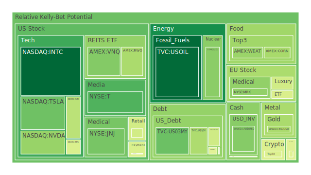
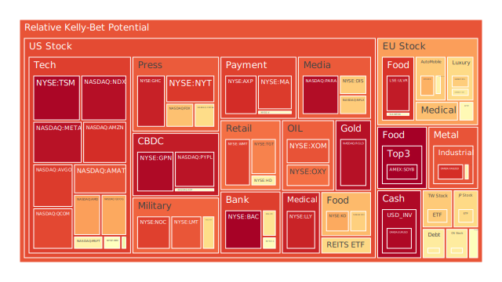
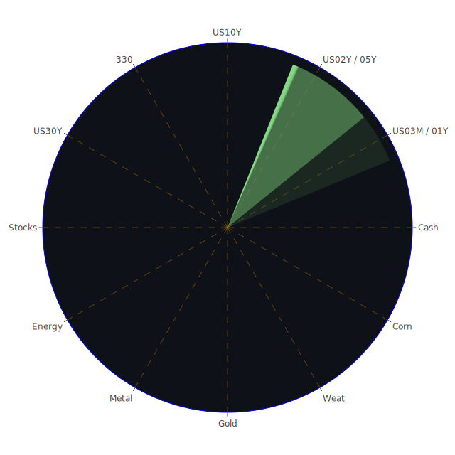

# 投資商品泡沫分析

在下文開始各資產分析之前，先概略說明「空間性（Spatial）」「時間性（Temporal）」「概念性（Conceptional）」三位一體的正反合思維框架：

- **空間性（Spatial）**：從不同市場區域、資產種類橫向拓展，觀察各市場同時可能受到的國際政治、供需、物流、地緣衝突等多元影響。
- **時間性（Temporal）**：從歷史到現在，再到未來可能的演化，考慮短期投機與長期結構變遷，以及新聞事件可能帶來的動態改變。
- **概念性（Conceptional）**：以經濟學、社會學、心理學與博弈論切入，探討市場投資人信心、群體行為、對沖操作、政策博弈等內涵。

藉由上述三個面向，再用「正面（Thesis）—反面（Antithesis）—綜合（Synthesis）」的方式來理解不同資產以及新聞訊息，如此能做出較客觀且多元的思考。此處亦將融合「歷史類似場景」「既有理論」以及「新聞事件觀察」。

以下依據所列出的各大資產類別進行風險與泡沫潛勢的綜合探討。

---

## 1. 美國國債

美國國債在當前資料中，10年期、20年期、30年期殖利率都有顯著上揚趨勢，雖較前一週至一個月略為上升，但相較於一年之前，收益率整體偏高或曾出現更大變動。新聞資料顯示近期可能有美國財政部與政府舉債上限的風險，在政策角力加劇時常帶來市場不安。從時間性看來，美國政府債券在過往金融風暴或經濟衰退時常被視為避險標的；然而，若市場對政府財政可持續性產生疑慮，短端或長端殖利率都可能劇烈波動，尤其是當通膨預期、貨幣政策緊縮與政經紛擾交織時。從經濟學面向，國債流動性佳且需求量穩定，但若貨幣政策立場轉變急速，殖利率仍有再度被推高或下壓的風險。社會心理層面顯示，投資人傳統上信任美國國債的地位，但目前負面新聞，如新一輪關稅、政府赤字爭議，都影響到市場心態。若債務僵局再度上演，這對國債定價與美國政府信用度恐產生漣漪。短期看來，美國國債的泡沫風險不算顯著，但需留意殖利率跳躍造成的價格大幅震盪。

---

## 2. 美國零售股

美國零售板塊近期有新聞提及大型零售商對消費緊縮的預期與對關稅衝擊的擔憂。例如有分析指出關稅使得進口零件與商品成本變動，最終轉嫁於消費者。短期內，如關稅豁免和增加之間反覆拉鋸，零售股走勢易被政策消息牽動；從心理學觀之，消費者若感受到未來可能的通膨壓力或經濟動盪，支出動能將下降，零售商利潤亦受壓縮。此外歷史上如2008年金融危機或2020年初疫情爆發時都曾見到零售業在恐慌情緒帶動下股價劇烈波動。當前有若干零售商被市場批評存貨壓力過大，可能也會進一步影響營運與股價。整體而言，零售股的泡沫指數尚未到極端高位，但在市場對未來經濟走向不安的情況下，其風險仍不可小覷。

---

## 3. 美國科技股

美國科技板塊向來是資本市場焦點。近期新聞顯示，若關稅對半導體和電子零組件構成限制，可能衝擊某些龍頭企業（如晶片公司面臨對華輸出管制、智慧財產權爭議等）。實際觀測資料也顯示數檔科技龍頭近來風險係數已經提升到不容忽視的程度。心理學層面上，過去科技股常因「未來成長故事」吸引大批投資人，形成樂觀的群聚效應，而一旦貿易戰、成本結構、國際關係等出現重大利空，市場情緒可能瞬間翻轉。自歷史看，2000年網路泡沫時期，科技股曾因高本益比與過度樂觀預期而泡沫破裂。雖然現在科技產業與當年環境不同，但若估值高昂、利率環境又趨緊，整個市場仍易遭資金抽離。建議對科技股的泡沫風險保持高度警戒，分散投資、嚴控部位是明智之舉。

---

## 4. 美國房地產指數

根據觀測，某些美國房地產相關ETF或REITs反映出風險指數有中高等程度，部分個股或房地產信託在近月的平均泡沫指數相對偏高。伴隨利率走高，房貸成本加劇，一般家庭購屋支出壓力增加，亦有報導提及30年期固定房貸利率有升溫趨勢。從歷史借鏡，2008年次貸危機與2010年前後美國房地產市場動盪，都說明房地產泡沫一旦破裂，資產價格會大幅修正。當前政府對於低利或購屋補貼相對保守，再加上部分地區疫情後移民人口流動結構改變，使得投資客對未來價格漲勢預期分歧。就博弈論來看，投資人若評估後續政策介入有限，或認為租金回報未必撐得起高房價，投資需求可能快速下降，形成價格掉落。建議對房地產進行謹慎觀察，如對租售比等基本面數據做深入研究。

---

## 5. 加密貨幣

比特幣與其他加密貨幣近幾日據資料顯示，風險係數時而偏高。加密市場向來因為市場投機性強、情緒波動大，若再受到政策面干擾，如政府對礦場用電或交易課稅等，有可能造成資金急速撤離。以心理學而言，投資人對加密市場常懷抱「一夜致富」的期望，泡沫風險常常在市場狂熱中累積。歷史上，比特幣多次經歷過顯著漲跌，如2017年底至2018年初的大漲後崩盤，以及2021年中對政策監管疑慮時的雪崩式修正。就當前國際新聞脈絡來看，全球政治局勢未見趨於穩定，資金往往在加密市場出現短線避風轉移或快速套利行為。這種劇烈波動意味著若投資人進場過深，一旦市場翻空會面臨較大風險。暫時觀察顯示，部分加密貨幣之泡沫可能有中上水平，需特別警惕。

---

## 6. 金 / 銀 / 銅

貴金屬與工業金屬在新聞與數據上也呈現不同面向。金價通常與避險需求相關，近期受地緣衝突消息（如中東地區反覆戰火）及美國通膨預期影響，金價多半維持在高檔。若以正面觀點看，多數投資組合持有黃金作為安全墊。負面觀點則是當利率快速上行，黃金雖無利息收益，資金可能流向債券，影響金價上漲動力。至於白銀與銅，則更多與工業需求、全球經濟成長連動。若全球貿易戰、科技零組件關稅紛擾導致製造業景氣放緩，白銀與銅需求可能疲軟。歷史上，在經濟衰退預期階段，銅價常先下挫，被視為經濟「晴雨表」。截至目前的泡沫風險指數顯示部分工業金屬已經有偏高風險跡象，表示價格或許超漲於實際需求。投資人須衡量國際供需面與地緣政治干擾。

---

## 7. 黃豆 / 小麥 / 玉米

農產品期貨價格常受到天氣、戰爭（若影響農業生產）以及運輸成本變化影響。近期新聞報導的貿易戰、進出口關稅、人為政策干預，都可能加劇農產品波動。資料顯示黃豆與小麥的風險分數有些處於中高區間，玉米則因其在飼料、能源替代方案等領域需求較為廣泛，也可能遭遇價格干擾。回顧歷史，2012年美國大旱、2008年金融危機時，農產品曾因天氣與市場資金流動造成劇烈行情。社會學層面上，若國際局勢不穩定，糧食安全意識提高，有時會形成恐慌性搶購，使期貨價格飆升。博弈論切入時，若多個糧食出口大國皆有保護主義抬頭，關稅壁壘叢生，則會進一步推高價格，或造成市場分割。農產品雖然不似科技股等資產具備「爆炸型泡沫」，但仍需警惕高波動風險。

---

## 8. 石油 / 鈾期貨

石油方面，近期有消息指出石油輸出國家可能進一步減產；然而也有新聞顯示沙烏地阿拉伯動向不明確，當油價過高時，市場對需求下滑的恐慌也會湧現。從觀測數據來看，油價短期對貿易戰、全球經濟數據敏感度極高。長期則還要看再生能源替代、各國戰略儲備、地緣衝突等因素。歷史上，一旦爆發大規模衝突或石油輸出國限產，都會讓油價瞬間飆漲，但後期因需求衰退或替代能源興起又會迅速回落。心理學層面投資人對石油的「地緣政治溢價」往往高於實際需求，因而有投機泡沫的可能。

至於鈾期貨，核能議題近年因各國減碳需求再度受矚目，但反核聲浪與投資風險一直較大。國際核能供應鏈以及全球安全疑慮會影響鈾的需求端與政治可行性。投資人若有相關部位需關注政治風險與核能政策轉向，一旦發生重大意外或政策阻力，鈾期貨可能走跌。歷史事件可見日本福島事故後，鈾價長期低迷；而近年歐洲能源危機又帶動核能發展呼聲，鈾價曾經快速反彈，但泡沫風險亦隨之升高。

---

## 9. 各國外匯市場

主要外匯對美元表現牽動全球貿易。不少新聞透露：新一輪關稅爭議可能對美元帶來負面衝擊，另有消息稱歐洲可能面臨經濟放緩風險，英鎊、歐元也受各自內部經濟議題影響。近期消息顯示美元匯率不若先前強勢，甚至有「最弱勢年」的論調。歷史上，如特朗普時期初段落出現過多次對外匯政策的口頭干預，經常造成劇烈波動。現今多國央行貨幣政策差異仍大，若美國利率趨緩，部分新興市場貨幣可能趁勢反彈。心理學層面，投資人對地緣政治敏感度高，易激發市場擁抱日圓或瑞郎等避險貨幣，或在突然之間反轉。整體而言，外匯市場是詭譎多變，凡涉足需嚴控槓桿。

---

## 10. 各國大盤指數

歐美與亞洲多國大盤指數近來持續波動。歐洲可能因工業、汽車、奢侈品股同時面臨貿易戰與中國需求放緩疑慮；美國大盤則受科技、零售、銀行等多板塊雜音影響；亞洲市場，如台股對半導體與電子業倚賴度高，也會因全球科技需求波動。歷史上，大盤指數往往代表經濟景氣與投資人整體風險偏好，若經濟基本面良好，大盤可延續漲勢，但若遇到關鍵地緣政局或貨幣緊縮信號轉強，大盤容易深度修正。從博弈論看，大型機構可能在全球市場同時佈局或撤退，一旦資本轉移加劇，各國大盤恐齊步下滑。泡沫風險方面，若看本益比或技術面高檔背離，部分市場恐出現高風險徵兆。

---

## 11. 美國半導體股

半導體公司近年雖然飽受疫情後供應鏈錯配問題，但在AI浪潮、車用電子、雲端運算需求的帶動下仍被視作長線前景看好。不過貿易戰時常點名半導體出口限制或關稅政策。若美國大廠對中國市場受阻，未來營收不確定性將提高。心理層面上，市場對半導體企業的期待很高，一旦業績或產品研發不及預期，跌幅恐急速放大。回顧2000年網路泡沫與2008年金融危機，也有不少半導體龍頭在股價大幅震盪中蒙受重擊。以目前觀察，一些半導體股的風險分數高企，需要充分留意政策面和供需層面的細微變動。

---

## 12. 美國銀行股

新聞顯示近期美國銀行業對利率走勢較為謹慎；同時，若關稅戰導致經濟衰退風險升高，消費貸款與信用卡壞帳可能攀升，商業不動產貸款亦面臨風險。此外，美國銀行股在歷史上（特別是2008年）曾深陷流動性與資本不足等困境，一旦對衰退或市場流動性風險的恐慌升溫，銀行股將率先遭拋售。社會心理層面上，投資人對銀行體系的信任非常脆弱，負面新聞或信用評級調降都能激發恐慌賣壓。若讀到近期有官方要求大型銀行進行壓力測試等，也可見官方對金融市場穩定的顧慮。雖然目前未到系統性危機的程度，但高泡沫風險可能隨政治與經濟局勢而攀升。

---

## 13. 美國軍工股

中東與歐洲地緣衝突不斷，加上多國軍事支出上升趨勢，軍工企業在歷史上常受到政府合約的支撐。新聞提及某些國家軍費增加或是對武器出口的需求，使美國軍工股過去一段時間走勢頗強。就博弈論而言，若全球衝突延燒，軍工需求將維持甚至上升，但若出現意外的外交和解或預算縮緊，也可能衝擊軍工板塊。整體看，此類股常被部分投資人視為防禦性資產，但其實也受到地緣事件高度影響。需留意近期對外軍售是否受關稅波及，或主要交易對手國家經濟情形惡化導致縮減軍購。以心理學而言，一旦社會輿論轉向反戰等立場，也可能壓抑軍工股估值。

---

## 14. 美國電子支付股

電子支付的需求隨電商成長與消費習慣改變而擴張，但當前市場對關稅、全球經濟成長趨緩皆存在疑慮。若消費者支出下降或跨國交易受限，支付業者手續費收入恐受影響。近幾年電子支付市場競爭激烈，新玩家與傳統金融巨頭同台競技，行業合併收購頻率高。從歷史觀之，電子支付股大體上與消費景氣同步度較高，若出現像2008年金融危機時期，該板塊亦可能同步下挫。根據目前泡沫風險數據，某些電子支付公司已經達到接近警戒線，須小心估值過高情況。一旦利潤或交易量不如預期，股價恐顯著修正。

---

## 15. 美國藥商股

藥商股一般被視為防禦性標的，但偶爾也受政策面衝擊，如藥價管制、美國醫療保險改革等議題。近期醫藥產業新聞較少提及重大負面變數，但也不能忽視全球衛生事件尚未完全平息，或許還有潛在疫病風險。社會層面，人口老化、慢性疾病需求成長，長期對醫藥產業正面；但是若經濟衰退加劇，政府補助醫療支出可能有限，藥企利潤成長也有天花板。歷史經驗，制藥巨頭在面臨專利到期或研發失利時，股價可能迅速下跌。眼下泡沫風險雖不算最突出，但也須謹慎評估。

---

## 16. 美國影視股

影視產業受到疫情後觀影習慣改變、串流平台崛起影響。若經濟環境動盪，廣告收入和娛樂支出有機會減少，衝擊影視公司財報。政策面對國際版權、關稅對文化產品輸出的限制等，也會形成波動因素。從歷史經驗來看，影視公司常在經濟繁榮時獲得高估值，但不景氣階段，廣告及周邊收入嚴重萎縮。就新聞面而言，一些影視巨頭近期業務略顯疲態，國際佈局可能也受阻。需要深入檢視財報細節以及消費者行為轉變。

---

## 17. 美國媒體股

媒體行業與影視有一定重疊，但更多仰賴廣告與訂閱收入。若政治紛擾、經濟衰退，廣告客戶預算縮減；或若科技巨頭持續鯨吞市場份額，也影響傳統媒體股。新聞中提及某些廣告支出下滑的跡象。心理層面上，大眾傳播市場正在被各式自媒體瓜分，部分投資者對傳統媒體盈利能力有所質疑。回顧歷史，報紙、雜誌等企業在網路衝擊下，股價曾長期滑落。現在雖然不少媒體公司積極數位轉型，但仍然充滿競爭。整體看泡沫風險中高，未來若廣告費進一步緊縮，恐出現估值壓力。

---

## 18. 石油防禦股

石油相關的防禦股，包含那些專營中下游產業或與石油供應鏈綁定的公司，往往在油價上漲期因穩定現金流而受到青睞。然而若整體石油需求因經濟放緩而大減，也會拖累整體收益。以歷史角度來看，石油價格1980年代中期、1998年亞洲金融風暴、2014年油價大跌時，均對石油企業產生衝擊。社會心理面，上游勘探和下游煉化的不同行業差異極大，投資人需精細分辨。若本身公司負債比高、現金流不足，油價只要出現較大震盪，就可能引發財務風險。暫時的數據顯示該類股風險不算最低，應多加防備。

---

## 19. 金礦防禦股

金礦股往往和金價連動，而金價在地緣衝突或通膨預期升高時可能上揚。若市場重新追求避險或通膨保值，金礦股也可能受追捧。然而，此類公司也受到開採成本、環保法規、所在國政治穩定度等因素影響。回首歷史，金礦股在黃金牛市時能暴漲，但亦在金價回落時經歷慘痛回檔。博弈論觀點：各國央行若大量購入黃金儲備，金價或被推升，金礦股直接受惠；相反地，若利率或其他政策吸引資金離開貴金屬市場，金礦股恐下挫。若其泡沫風險屬高位，投資人需謹慎留意金價走勢的任何風吹草動。

---

## 20. 歐洲奢侈品股

歐洲奢侈品市場通常倚賴全球旅遊、觀光購買力，以及中國等新興市場對名牌消費的熱衷。新聞提到若對中國消費品關稅增加或限制，奢侈品牌可能遭連帶衝擊。歷史上，奢侈品股於經濟榮景期間飆漲，金融危機或地緣政治緊張時則大幅回落。社會學層面，大部分奢侈品牌透過品牌力與消費者心理維持高價位，而在經濟不佳時依然能保持一定銷售，但當全球衰退嚴重且政治關係受損，新興市場消費力降低，業績也會轉弱。當前數據顯示該類股的泡沫估值有中高可能，投資需評估全球旅遊需求恢復與地緣衝突之間的拉扯。

---

## 21. 歐洲汽車股

歐洲汽車股受美歐關稅談判影響，加上在中國市場的銷售也至關重要。若美國和中國分別對歐洲汽車課稅或出現限令，將使出口量大幅萎縮。再者，歐洲整體經濟成長趨緩、轉向電動車政策推行，也可能影響傳統車廠利潤。回顧2008年金融危機時，歐洲汽車股連同全球汽車產業都經歷產量和股價雙重衰退。社會層面，大眾對環保與電動車的偏好持續擴增，傳統車款或面臨庫存積壓。當前觀察，部分歐洲汽車龍頭的風險分數正逐步攀升。投資人應持續關注全球供應鏈與消費力趨勢。

---

## 22. 歐美食品股

此類消費必需品防禦性相對較佳，但若全球農產品漲價、供應鏈運輸成本增加，食品公司也難以完全轉嫁成本。就博弈論而言，消費者若預期通膨或實際收入降低，轉而購買平價替代品，導致高端食品需求萎縮。歷史顯示2008年危機期間，大型食品公司營收相對穩健，但股價仍隨大盤下跌。如今若再加上貿易戰中糧食或原料被課徵關稅，成本管理可能出現壓力。一些資料指出某些食品股的泡沫風險並不算最低，特別是過去幾年市場資金湧入防禦型標的，推升估值，需要提防估值拉高帶來的回調可能。

---

# 宏觀經濟傳導路徑分析

在宏觀層面，各種金融資產與整體經濟因素緊密相關。根據所提供的美國聯準會（FED）關鍵數據：  
- 回購機制（RRP）數據下降，但EFFR量能較高，顯示市場仍有資金需求與銀行間利率往往處於高檔，對信用流動的難易度有影響。  
- FED總資產水準處於相對低位，顯示量化寬鬆早已退場，市場資金不再能輕易依賴央行灌水。  
- BTFP（銀行定期融資計畫）、貼現窗（Discount Window）與FHLB等數據相對低位或高位的互動，也反映市場的流動性結構微妙。  
- 美國國內存款水準維持高檔，而債務占GDP比例同樣也較高。若美國政府為應對財政壓力或對外關稅措施，可能又借貸更多，進一步攀高債務規模，卻同時擠壓民間資金。  
- 就收益率曲線（2年與10年、3個月與10年等利差）看，仍時有倒掛現象，只是程度略有緩解。若長短端利差再次擴大，通常會是衰退隱憂。  

透過這些宏觀指標的「空間性」──全球資金流動；「時間性」──過往升息週期或量化退場的歷史對照；「概念性」──政府與市場之間的博弈，能看出貨幣緊縮環境下的潛在衝擊。一旦市場避險需求飆升，將推動黃金、政府公債等價格，但也可能壓抑股票與高收益債券的估值。綜觀而言，宏觀環境正在進入較高警戒階段。

---

# 微觀經濟傳導路徑分析

在微觀層面，企業端最擔心的是成本上升與需求萎縮並存。新聞中多次提到關稅提高：  
1. 若企業對中國採購零件被加徵關稅，將抬升製造成本，最終零售價上揚或利潤被壓縮。  
2. 消費者心理預期價格上升而減少購買，多數零售商反映銷售成長放緩。  
3. 若企業因不確定性而延後投資或減少庫存，也會衝擊當期訂單。  

對銀行業、信用卡、商業貸款而言，經濟下滑會提高逾期率。已有新聞顯示可能有信用卡壞帳上升與商業地產違約風險。當微觀基礎不穩固，連鎖反應又可能回到市場，推升資金避險需求，引發金融市場進一步波動。

---

# 資產類別間傳導路徑分析

若將上述各資產再度融入三位一體的「正反合」視角，可歸納以下幾條潛在連鎖反應：

1. **美國國債殖利率變動 → 信用成本抬升 → 企業融資成本走高 → 美國科技、零售、房地產股獲利空間被擠壓 → 股價壓力增大。**  
2. **關稅與地緣衝突風險→ 工業金屬與能源價格波動 → 生產成本與消費者物價同步波動 → 消費降溫 → 影視、媒體、零售股營運壓力上升 → 傳導至銀行逾期率升高。**  
3. **資金避險情緒上揚 → 黃金、金礦、部分防禦型資產上漲 → 資金可能從高風險科技或加密貨幣撤出 → 加密市值大幅波動 → 整體風險資產評價下修。**  
4. **歐洲市場不穩與中國市場需求走弱→ 奢侈品與歐洲汽車股衝擊 → 全球大盤指數承壓 → 連帶重創美國及亞洲科技股（因跨區供應鏈或銷售占比高）。**  

簡單而言，以上路徑顯示不同資產之間存有約負相關的對沖機制，但在高度不確定性下，許多資產可能同向下跌，唯有貨幣、黃金等偶爾提供對沖。投資人若要在同一時間點布局多個市場，需留意資產之間的相位差距與相關係數。

---

# 投資建議

基於前文分析，以下提出穩健、成長與高風險三大類的配置方向，總和佔比為100%。因投資人風險承受能力不同，此處所列僅為示意性概念與比例參考：

1. **穩健型（約40%）**  
   - **美國短年期國債或高評級公司債（約15%）**：相對安全，收益雖不高，但能在不確定時期提供避險效果。  
   - **黃金現貨或金礦相關企業（約15%）**：面對地緣衝突與通膨疑慮，黃金往往具防禦特性，但須留意短線波動。  
   - **大型醫藥或民生必需品企業（約10%）**：防禦性較佳，對經濟景氣循環的敏感度相對較低，提供穩定股息與基本需求支撐。  

2. **成長型（約40%）**  
   - **科技股中具長期競爭力且基本面扎實者（約15%）**：如半導體、雲端基礎架構，但盡量避開過度炒作的公司。  
   - **再生能源或電動車供應鏈（約15%）**：全球減碳趨勢暫時不會逆轉，若地緣政治及政策支持度仍在，該領域長期有潛力。  
   - **歐洲或美國大型零售龍頭（約10%）**：雖然零售情緒不佳，但領導品牌在衰退期也可能鯨吞市佔，長期仍有成長空間。  

3. **高風險型（約20%）**  
   - **加密貨幣（約5%）**：若能承受高波動，可在短線極端行情中尋找投機機會，但需要小比例投資。  
   - **軍工產業（約10%）**：地緣衝突若加劇或各國軍費拉抬，軍工公司獲利可觀，但也有道德爭議與政策轉彎風險。  
   - **選擇性新興市場股票或ETF（約5%）**：部分新興市場可能受益於全球供應鏈重組或原物料出口，但政治及匯率風險頗大。  

如上配置旨在達到在不確定環境中，透過多元化布局、利用負相關與對沖特性，盡量分散風險。此外，投資組合內若想再降低相關性，可考慮適度納入商品期貨、外匯衍生品等，但風險控管需更審慎。

---

# 風險提示

投資必然伴隨風險，且市場充滿未可知的變數。短期內政治議題（例如對外關稅再起、美國債務上限危機）與地緣衝突皆可能令金融市場劇烈波動。報告中所提及的高泡沫風險資產更需特別警戒，如部分科技股、加密貨幣或高槓桿企業，一旦宏觀環境變臉，恐有大幅修正壓力。另外，各種不同資產間的負相關性有時也會在市場極度恐慌中破裂，使所謂的「對沖」失靈。投資者宜謹慎評估自身承受度，適度降低槓桿，並持續追蹤國際新聞與經濟基本面。

最後強調，本文觀點僅供參考。投資人宜綜合個人財務狀況、風險胃納及市場動態後再做決定。倘若不具備較高專業度，可諮詢合格的財務顧問或選擇更為穩健的工具。也請勿忽視任何潛在泡沫風險，更需留意市場上針對風險較高標的的不斷警告。市場變化的速度往往超乎預期，一切皆須合宜的研究與因應。

 
Daily Buy Map:

 
Daily Sell Map:

 
Daily Radar Chart:

 
