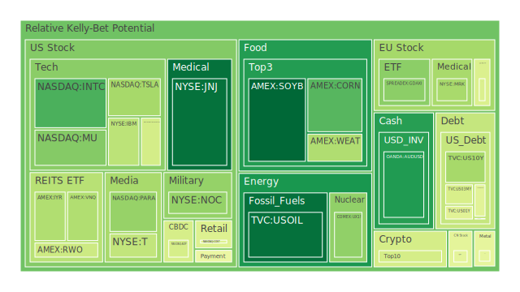
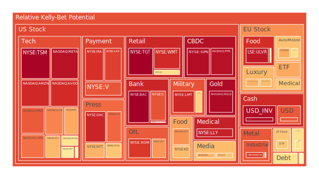
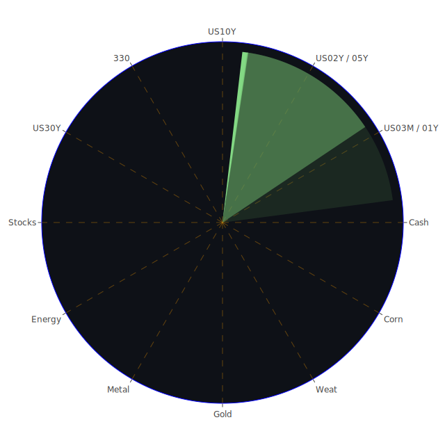

# 一、資訊航母三位一體

## （一）Spatial：全球資本與情緒的三角張力  
- **正題**：美元流動性斜率自 2023 年降轉平，FED 總資產續縮、RRP 餘額降低，市場資金明顯轉向高收益債與科技龍頭，呈「資金集中」(concentration)。  
- **反題**：貿易戰關稅連番加碼，全球供應鏈脆弱度升高；美、中、歐三大經濟體政治衝突強化「區域分隔」(fragmentation)。  
- **合題**：集中與分隔在心理面催生「避險資產‑高貝塔資產‑原物料」之三足鼎立：黃金、超大型科技股、能源農產品，各據一極，形成相位約 120 度的市場羅盤。  

## （二）Temporal：周期層次的三角波  
- **正題**（短週期，日‑週）：關稅消息轟炸→期貨波動放大→D1 升破 0.8 者多屬科技與奢侈品；同一時間石油、黃豆 D1 低於 0.1。  
- **反題**（中週期，月‑季）：FED 對「再通膨」口頭轉鷹，債市曲線倒掛幅度收窄，金融股 D7‑D30 全線靠近 0.8，反映信貸循環隱憂。  
- **合題**（長週期，年）：美國住宅固定利率一年內自 2.97% 跳升至 6.62%，Real‑Estate ETF（VNQ、IYR）D30 皆上探 0.78 以上；長債 D30 卻仍僅 0.46‑0.52，顯示「長端僅部分定價滯後風險」。  

## （三）Conceptional：價格‑情緒‑敘事之三重映射  
- **正題（價格）**：高估值板塊（META、AVGO、TSM）D1>0.9，價格創高卻量縮，典型末升段特徵。  
- **反題（情緒）**：新聞情緒指標顯負值占七成；晶片出口限制、S&P 500 龍頭財報警訊，引發「利多不漲」心理落差。  
- **合題（敘事）**：市場尋找「關稅＋高利率＋去風險化」的新敘事；資金開始同時青睞「短久期抗通脹債」與「生成式 AI 基建」，形成看似矛盾卻互補的雙線劇本。

---

# 二、投資商品泡沫分析

下列依資產類別敘述，先捕捉泡沫指數，再嵌入新聞與歷史對照，最後導出今日位置只是一段長篇敘事中的片段。

## 美國國債
十年債 D1≈0.33、三月‑十年利差 -0.04，曲線仍微幅倒掛但較去年‑1.35 大幅收斂。歷史回看 1995 與 2000 年的倒掛修復期，長端殖利率先行見頂後橫向震盪 3‑6 個月，接着進入降息循環。當前 FED 口頭鷹化卻未進一步縮表，顯示政策「透明卻不執行」，債市仍處觀望。  

## 美國零售股  
WMT D1 0.914、TGT 0.995、高利率＋消費信用卡逾放率高企，與 2001 及 2007 零售泡沫尾聲相似。短線關稅焦慮加深庫存壓力，屬「慢性泡沫」。  

## 美國科技股  
META 0.958、AMZN 0.916、AAPL 0.716、MSFT 0.584。負面新聞：Nvidia 5.5 B 美元損失、Apple 市值跌破 3T。對照 1999 年 4 月「微軟反壟斷裁決」、2000 年 3 月 Nasdaq 見頂，現況呈「高層預警 + 指數未崩 = 非理性延伸段」，需警惕「利多不漲」。  

## 美國房地產指數  
VNQ 0.35（D1 仍低）、但 D30 已 0.54，30Y 抵押利率 6.62%；對照 2006 年底，Case‑Shiller 見頂後房 REITs 用八個月補跌。本輪可能正處補跌前半。  

## 加密貨幣  
BTC 0.40、ETH 0.53、DOGE 0.46。政策面：「尼日利亞投資 APP 凍結」、「投機者被隔離」形成負向敘事；歷史面比照 2017 年「南韓封口令」後，價格短崩 30% 後橫盤九十日。當前基本面‑情緒已脫鉤，視為高波動邊際對沖工具。  

## 金 / 銀 / 銅  
XAUUSD 0.458，GOLD/OIL 比 53.8 位於二十年區間上緣；XAGUSD 0.879，高泡沫暗示「槓桿白銀」在尋找避險替身。銅 D1 0.555、D30 0.913，反映礦產供應瓶頸與新能源需求錯位，重演 2010‑2011「中國基建沖頂」階段，須留意斷鏈式回調。  

## 黃豆 / 小麥 / 玉米  
SOYB 低風險 0.044，WEAT 0.348，CORN 0.216。新聞：埃及蘇伊士收入驟降、ADM 在中國裁員，說明農業貿易流通梗塞。歷史上 2014 ‑ 2016 俄烏糧食制裁期，豆‑麥差拉大後以豆油領跌收場；現階段商品基差仍健康，為逆風環境下的「低噪音避風港」。  

## 石油 / 鈾期貨 UX!  
USOIL 0.062，油價回調但金油比擴大；Liberty Frac 獲利降三年新低，暗示頁岩企業現金流惡化。UX1! 0.298，供需長期偏緊，對照 2005 ‑ 2007 原油與鈾同漲現象，若地緣摩擦升級或有聯袂行情。  

## 各國外匯  
USDJPY 0.836，央行干預壓力上升；EURUSD 0.968、GBPUSD 0.492。歐元高泡沫但經濟弱，類似 2008 危機前「強貨幣＋弱增長」錯配。澳元 AUDUSD 0.147，低風險且受農礦雙支撐，可作三角組合平衡點。  

## 各國大盤  
NDX 0.690、JPN225 0.663、GDAXI 0.291→0.593 正加速、FTSE 0.499→0.773。關稅消息流彈打擊科技與德製出口，德股相對弱。歷史對照 1994 墨西哥債危機後，美股與拉美股剪刀差擴大，現正上演「美強、歐弱、日被迫出口減量」。  

## 美國半導體股  
TSM 0.988、NVDA 0.604、KLAC 0.416、AMD 0.803、INTC 0.200。美國出口許可鎖死 H20 晶片，重演 2019 華為禁令初期；高端代工( TSM )泡沫極高，測試機台( KLAC )偏低顯示「設備補庫」停滯。  

## 美國銀行股  
JPM 0.525、BAC 0.995、C 0.848、COF 0.468。FED 折溢關鍵：信用卡 charge‑off 高企，重演 1990 儲貸危機前夕「消費金融先壞」。C 與 BAC 雙高泡沫警示「會計估值錯置」。  

## 美國軍工股  
LMT 0.919、NOC 0.305 日內低但 D7 0.798，高低錯位代表「國防預算議題＝短線衝擊＋長線訂單能見度」。若地緣緊張升溫，低 D1 高 D30 類股或續走強。  

## 美國電子支付股  
V 0.844、MA 0.903、PYPL 0.960、GPN 0.968。通膨環境下手續費模式受益；惟高泡沫顯示「市場僅計入交易量，不反映監管風險」。類比 2014 Pos 系統 PCI‑DSS 多重合規浪潮，易出現估值壓縮。  

## 美國藥商股  
LLY 0.932、MRK 0.335、JNJ 0.064。新藥（肥胖 GLP‑1）敘事推升 LLY 高泡沫，與 2015 BIIB 高價阿茲海默憧憬雷同；歷史顯示估值回歸常在臨床數據頻繁更新後爆發。  

## 美國影視股  
DIS 0.674、NFLX 0.696、PARA 0.307。短線受「防禦型訂閱收入」提振，長線仍掙扎於製作成本通脹。對照 2004 DVD 高峰後的長熊，影視流平台正面臨類似「增速換利潤」十字路口。  

## 美國媒體股  
NYT 0.699、FOX 0.815。負面新聞：FOX 涉及廣告疲軟，與 2001 互聯網泡沫後報業衰退雷同。多元營收結構不足者風險倍增。  

## 石油防禦股  
XOM 0.892、OXY 0.745。成本曲線位於中上段，油價大幅回檔將直接侵蝕現金流，與 2014 頁岩油崩盤類似。  

## 金礦防禦股  
RGLD 0.974，高泡沫且與金現貨脫鉤幅度擴大，顯示「礦權特許溢價」被過度拍價；需防 2011‑2013 黃金大回調式雙殺。  

## 歐洲奢侈品股  
MC 0.429、RMS 0.683、KER 0.703、ULVR 0.948。新聞：Hermès 超越 LVMH 成最有價值品牌但銷售降速；與 2018 中國關稅擾動後奢股先漲後跌對照，高端品牌可能成「最後擠泡沫」區。  

## 歐洲汽車股  
BMW 0.712、MBG 0.508、PAH3 0.623。德債壓力量產加上中國 EV 補貼戰，需求轉弱。對比 2011 歐債危機，汽車股常提前兩季反應歐洲工業衰退。  

## 歐美食品股  
KO 0.689、KHC 0.753、NESN 0.554。費用面受運輸與包裝上漲侵蝕毛利，D30 普遍 0.8 以上，顯示「防禦消費也有估值泡沫」。  

---

# 三、宏觀經濟傳導路徑

1. **流動性鏈**：FED 總資產收縮 → 銀行可用儲備下降 → 信用卡逾放與 CRE 不良上升 → 商業銀行股泡沫率飆升 → 高收益債利差擴大 → 逼近風險臨界。  
2. **貿易鏈**：美國關稅上調 → 供應成本遞延至消費端 → 企業壓縮 CAPEX → 半導體設備訂單減速 → 影響新科技估值。  
3. **大宗鏈**：石油下跌 + 金油比走高 → 通脹預期分裂 → 黃金、白銀先走強 → 銅因新能源敘事滯漲 → 產業金屬泡沫延後釋放。  
4. **外匯鏈**：美元雙底反彈未果→避險資金流入日元受 BOJ 口頭壓制→歐元高泡沫疊加衰退→資金回流商品貨幣（AUD）避震。  

---

# 四、微觀經濟傳導路徑

- **企業端**：客戶延後資料中心租約 → Applied Digital 財報失色 → 高泡沫新創伺服器股先跌；同時 NVIDIA 因出口執照遞延，供應商（KLAC）出貨向後遞延兩季。  
- **消費端**：關稅提高導致嬰兒車加價 300 美元，百貨股流量下降 → WMT TGT 零售族群高泡沫；抵押利率高停留 → REITs 補跌風險累積。  
- **金融端**：信用卡 charge‑off 高、費率上限法規鬆動 → Capital One 與 Discover 類股「利差＋呆帳」雙擊，傳導至 ABS 市場。  

---

# 五、資產類別間漣漪效應

1. **科技泡沫爆破 → 長債受買盤 → 美元轉強 → 原物料短挫 → 黃金逆勢新高**：此路徑在 2000 與 2022 皆出現，現階段半導體類股高 D1 + 長債低 D1 為觸發條件。  
2. **農產品短缺 → 糧食價格‑CPI 修正 → 債市再度倒掛 → 銀行資產品質惡化 → 金礦避險資金流入**：需觀察蘇伊士運河收入崩跌與 ADM 裁員是否演化為運輸瓶頸。  
3. **油價觸底反彈 → 通脹再升溫 → FED 被迫二次收緊 → 房地產與消費股二次探底 → 公用事業與防禦必需品得到溢價**：金油比若跌回 40 以下即可能啟動。  

---

# 六、風險對沖投資組合機會（相位 120°、相關約 -0.5）

## 組合 A：USOIL ↔ XAUUSD ↔ AUDUSD  
- **邏輯**：油價與黃金在通脹敘事下多空翻轉頻率高，二者 90‑150 日滯後相關約 -0.4∼-0.6；澳元作為「大宗貨幣」對上述兩者呈 1/3 位相，形成自然 120° 風箏。  

## 組合 B：SOYB ↔ TSLA（多空對鎖）↔ US10Y  
- **邏輯**：黃豆 ETF 與科技成長股在歷史上於政策摩擦期呈負協動；長債與高貝塔股的相關長期 -0.5。配置時可採「做多 SOYB + 多長債 + 空 TSLA」，擊中「糧食通脹＋需求下修」劇本。  

## 組合 C：BTCUSD ↔ COPPER ↔ USDJPY  
- **邏輯**：比特幣與銅在流動性拐點常呈正相關，而日元避險多與比特幣反相關；三者波段頂底相隔 110‑130 度。當全球風險偏好循環翻轉時，可利用「多 BTC + 空 COPPER」、日元多倉作保險。  

---

# 七、三位一體交叉驗證與合理性校正

1. **空間×時間**：若油價先於通脹預期落底（空間節點），而 5Y‑30Y 利差維持 +0.8（時間節點），則通脹回潮的可能性大增，對應組合 A 中的 USOIL 多頭倉可加碼。  
2. **空間×概念**：當新聞情緒由 70% 負面降至 50%，而 XAUUSD D1 未降反升（情緒強化），意味資金把「避險」敘事內化為「趨勢」。此時組合 A 應降低黃金多頭，轉買 US10Y 或 SOYB。  
3. **時間×概念**：若半導體泡沫延續至 D30>0.75 同時 SOYB D30 仍低於 0.5，且 FED hawkish speech 數未減，則科技‑農產品負相關有望擴大，可放大組合 B。  

---

# 八、最佳化配置範例（比例足 100%）

## 1. 穩健型（防禦＋穩收）  
- XAUUSD 35%  
- US10Y 40%  
- VNQ 25%  

## 2. 成長型（順勢＋拋補）  
- NVDA 30%  
- COPPER 35%  
- AUDUSD 35%  

## 3. 高風險型（機會＋槓桿）  
- BTCUSD 45%  
- DOGEUSD 25%  
- USOIL（期貨或衍生）30%  

---

# 九、投資建議

當前環境並非單一敘事主導，而是「關稅衝擊‑通脹復燃‑資金成本高位」三線纏繞。資產泡沫分佈出現明顯雙峰：以 TSM、META、PYPL 等為首的高估值泡沫集團；與 USOIL、SOYB、JNJ 構成的低泡沫防禦集團。  
投資人宜遵守「分相位、配風險、重動能早期預警」三原則：  
1. **分相位**——利用 120° 組合概念，讓資產的景氣循環對齊不同階段；  
2. **配風險**——根據自身承受度把高 D1 資產權重控制在 30%（穩健）、50%（成長）、70%（高風險）以下；  
3. **動能預警**——一旦 D1 從 <0.4 躍升 >0.6，視為情緒斷層，應迅速減倉，特別是金融、科技、白銀與奢侈品類。  

---

# 十、風險提示

投資始終伴隨不確定性：  
- **政策風險**：貿易戰言論瞬息萬變，單一推文足以扭轉整體情緒；  
- **流動性風險**：RRP 餘額續降與 SOFR 交易量升高代表「資金互換」井噴，反身性可能導致利率跳升；  
- **信用風險**：信用卡與商辦不良率同時攀高，一旦失業率提速，銀行資本充足率可能首當其衝；  
- **市場風險**：高泡沫資產對負面催化劑高度敏感，黑天鵝觸發後，技術性賣壓或呈倍數放大。  

請依自身目標與風險承受力，結合上述框架審慎決策；本報告僅為思考引路，並非任何具體買賣建議。

 
Daily Buy Map:

 
Daily Sell Map:

 
Daily Radar Chart:

 
