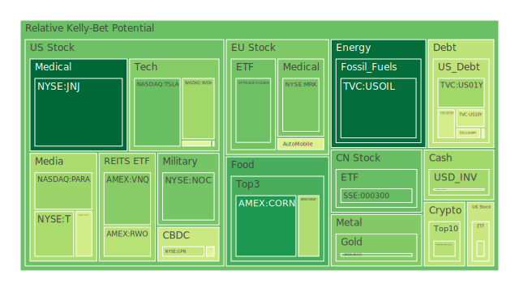
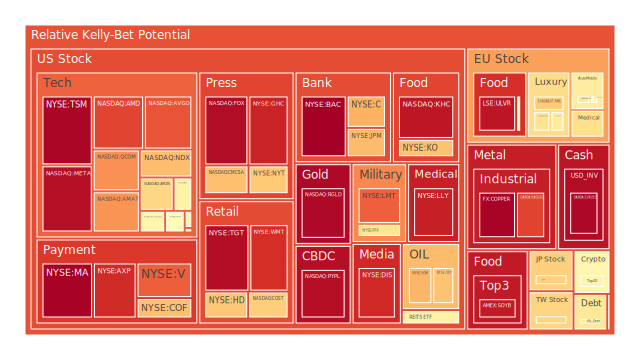
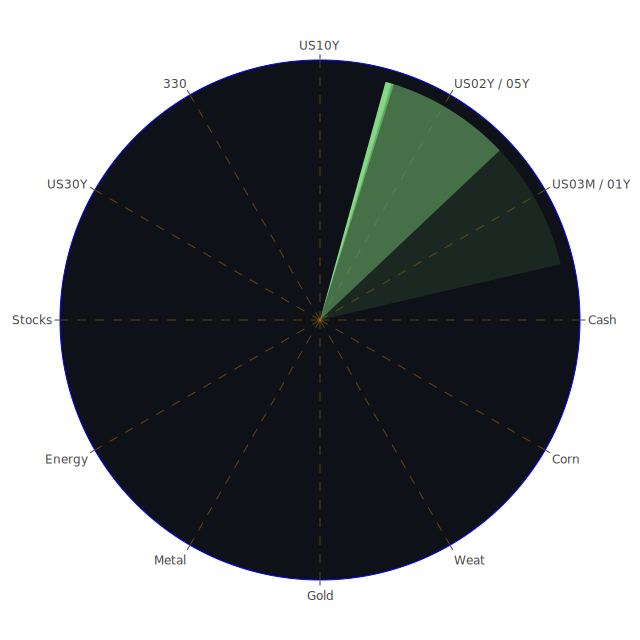

 # 投資商品泡沫分析

 ## 方法論概述  
在開始逐項檢視資產之前，先闡明本報告的「資訊航母」思路：  
* **Spatial**　以全球資金流、政策與敘事為座標，拆解每一類資產所處的經濟學‑社會學‑心理學「三位一體」。  
* **Temporal**　聚焦「日內劇震、週期震盪、結構演變」三層時間波，檢視短衝與長浪如何交疊。  
* **Conceptional**　以價格 (Price)‑情緒 (Passion)‑敘事 (Plot) 為三股張力，衡量風險是否累積成泡沫。  
上述三個向度彼此對映，可形成九宮格般的雷達；文中將以敘述方式穿插「正題‑反題‑合題」的辯證，而非表格式羅列，並以歷史對照與新聞脈絡作多重交叉驗證。

---

 ## 美國國債  
* **Spatial**：外資對美債需求連續下滑，FED 自身持債比重卻處歷史高位，「最大買家」與「最大賣家」角色同時存在，形成人為的資金漩渦。  
* **Temporal**：過去一年殖利率曲線自極端倒掛開始回補，如今 10Y‑3M 利差收斂至零軸，顯示短端降速、長端微升的「不對稱陡峭化」。  
* **Conceptional**：Price 端，5Y‑10Y 區間利率在 4% 附近停滯；Passion 端，市場對「軟著陸」的樂觀已減弱；Plot 端，美國赤字占 GDP 比重創新高，政治談判又可能再掀舉債上限戲碼。  
* **泡沫警示**：曲線重定價的下一步或取決於政治衝擊，而非經濟數據。本週 D1 指標顯示 2Y、5Y 風險分數仍逾 0.60，短債易遭情緒拉扯，長債則恐受財政疑慮拖累。  

 ## 美國零售股  
* 消費者信用卡衝銷率、逾放率皆位於高檔，新聞面又頻現「百貨裁員、成衣破產」等負面敘事。Price 仍高於疫情前趨勢線，但 Passion 已轉向保守。歷史上 2000 與 2007 年的零售股見頂，皆伴隨類似「信用卡循環餘額竄升＋油價偏高」組合，值得警戒。  

 ## 美國科技股  
* Nvidia、Apple、Microsoft、Meta 泡沫分數普遍高於 0.60；新聞面則被「晶片出口管制、反壟斷調查、資安裁員潮」反覆敲打。1999 年「科技禁運」對思科與美光估值的侵蝕提供了歷史鏡像──盈利邊際縮水與政策風險疊加時，放大跌勢幅度。  

 ## 美國房地產指數  
* VNQ、IYR 風險分別升至 0.52 與 0.77；30 年固定房貸利率逼近 7%，與 2006 年的「高利率＋高庫存＋走平薪資」場景相呼應。Passion 端已出現「租金議價權轉向房客」的社會輿情，Plot 端更有 CRE 不良率竄高的 FED 數據佐證。  

 ## 加密貨幣  
* Bitcoin 反彈後徘徊 84,000 美元一線，D1 風險約 0.40；以太坊則因 ETF 審批延期、泡沫分數 0.55 而顯示相對脆弱。自 2017 與 2021 兩次高潮回落經驗觀之，若「流動性收縮＋監管鷹派」同時發生，波動率會呈指數放大。  

 ## 金 / 銀 / 銅  
* Gold‑Oil Ratio 升破 52，再度見到「黃金走強‑能源走弱」的典型避險期組合。金價與泡沫分數 0.32 臨近中性；白銀泡沫分數高達 0.88，提醒投資人區分「穩健避險金」與「高β 工業銀」。銅則以 0.99 的極端分數警示「金融投機＞實體需求」的張力，重演 2006‑2007 年「房市降溫但銅價創新高」的扭曲。  

 ## 黃豆 / 小麥 / 玉米  
* 天然氣與化肥價格回落後，農作物邊際成本下降，但 El Niño 餘波與黑海出口爭端仍為供應端風險。Weat、Corn 指數分數各在 0.38 與 0.41；Soyb 一日波動極低卻長期分數直逼 0.95，與 2012 年「乾旱炒作－價格速瀉」情境類似。  

 ## 石油與鈾期貨  
* 油價雖回升至 63 美元，泡沫分數僅 0.11，但高收益債利差擴大、頁岩油 CAPEX 下修，意味「低價並非低風險」。鈾 UX1! 分數 0.51，反映長天期合約鎖價與現貨缺口之間的市場博弈；歷史經驗顯示，一旦投機部位超過實需兩倍，價格修正常迅猛。  

 ## 各國外匯  
* 美元對日圓負相關性仍高，但 USDJPY 風險分數升至 0.51，暗示避險貨幣也可能被資訊雜訊拉扯。歐元、澳幣分數同幅在 0.36‑0.98 區間擺盪；若全球製造業鏈割裂持續，商品貨幣對風險資產聯動可能轉正，削弱傳統分散效果。  

 ## 各國大盤指數  
* 美股 NDX 分數近 0.70，德股 DAX 0.49‑0.57，法股 CAC 0.49‑0.64；「美國科技泡沫」對歐洲出口導向經濟的放大效應值得關注。中國滬深 300 雖分數僅 0.28‑0.47，但外部關稅陰影使情緒難以修復。  

 ## 美國半導體股  
* NVDA、AMD、KLAC、TSM 皆顯著高分數 (>0.50)；新聞面累積「出口限制、資本支出削減、稅收補貼遞延」等衝擊。歷史上 1984‑1985 美日半導體協議對記憶體股估值腰斬，形成可參照的負面示範。  

 ## 美國銀行股  
* JPM、BAC、C、COF 泡沫分數普遍 0.70‑1.00；資金成本走升、商辦違約率飆高，疊加「再通脹預期＋政策不確定」，使信貸循環進入遲滯期。1989‑1990 年儲貸危機「高利率＋房地產呆帳」之雙擊效應再度浮現。  

 ## 美國軍工股  
* LMT、NOC 分數分別 0.83、0.30‑0.88；地緣動盪雖為長線利多，但美國財政寬限到期後的「預算天花板」可能衝擊訂單節奏。1973 越戰尾聲縮表即導致軍工指數高點回落四成，可作警鐘。  

 ## 美國電子支付股  
* MA、V、PYPL 風險分數排列在 0.84‑0.99 區間；新聞面再曝「非法壟斷、手續費上限」等司法訴訟。1994‑1995 年信用卡互換費之爭曾引發類似溢價收斂。  

 ## 美國藥商股  
* LLY、JNJ、MRK 俱在 0.10‑0.93 區間，高低分化凸顯「研發護城河＋專利懸崖」雙重矛盾。最新新聞顯示減重藥物三期試驗成功，短線刺激 Passion，但 2000 年 Vioxx 事件亦提醒「黑天鵝可能由藥監決策觸發」。  

 ## 美國影視、媒體股  
* Netflix 利多財報推升 Passion，但 FOX、DIS、NYT 分數皆偏高且盈利下修，凸顯「長影音領頭羊與傳統媒體剪刀差」。2004‑2005 年電視網廣告衰退後，媒體股估值也曾出現類似分裂。  

 ## 石油防禦、金礦防禦與歐洲奢侈品、汽車、食品股  
* XOM、OXY 分數 0.71‑0.89；RMS、KER、MC 皆逾 0.60；BMW 高達 0.61‑0.72；NESN、ULVR 食品龍頭亦逼近 0.55‑0.95。歐洲「高定價權＋低增長」的矛盾浮出水面，與 2010 歐債危機前夕「奢侈品高飛但消費信心下滑」如出一轍。  

---

 # 宏觀經濟傳導路徑分析  
1. **財政‑貨幣雙螺旋**：美國舉債擴張推高長端利率→銀行負債成本走揚→信貸收縮→企業資本支出放緩→製造業 PMI 回落→聯儲或被迫暫停縮表，形成人為趨平曲線。  
2. **貿易戰裂解鏈**：新關稅衝擊供應鏈→半導體、汽車、零售同步調降前景→勞動市場現「薪酬僵固＋裁員增速」背離→消費者信心下探→零售股盈利下修。  
3. **流動性避險旋轉門**：股市高波動→機構轉入短債、黃金、貨幣基金→RRP 餘額下降但 MMF 總額續創高→SOFR 交易量增加→現金再回流回購市場，形成流動性「拉‑推」循環。  

 # 微觀經濟傳導路徑分析  
* **企業現金流 → 研發延遲 → 供應商砍單**：科技巨頭 CapEx 下調立刻影響設備供應鏈（AMAT、KLAC），再波及上游特殊氣體與晶圓材料，形成「一階遲滯」。  
* **高利率 → 房租壓力 → 零售票息萎縮**：房東為轉嫁利息提升租金，年輕消費族群壓縮非必需品開支，衝擊服飾、餐飲、串流訂閱。  
* **銀行風控 → 中小企融資斷層 → 就業波動**：商銀強化 CRE 準備金，緊縮票據貼現；中小企業裁員使失業保險申請數抬頭，進一步壓抑消費。  

 # 資產類別間傳導路徑分析  
* **銅價下跌 → 供應鏈去庫存 → 原物料貨幣（澳幣、加元）承壓 → 美元再度走強 → 新興市場債務償付成本升高**。  
* **黃金大漲 → ETF 資金抽離 → 股市高估值板塊（科技、奢侈品）被動減倉 → NASDAQ 高 Beta 股放大修正 → 風險平價基金被迫再賣債券，導致「股債雙殺」尾段螺旋。  
* **油價低迷 → 美國能源 CAPEX 下砍 → 高收益債利差擴大 → 信評機構下調評級 → 銀行風險加權資產上升→ 利率巡航區間再度上移**。  

---

 # 投資建議  

 ## 三組資產 120° 相位對沖示意  
1. **黃金‑NASDAQ‑WTI**：歷史相關係數介於 -0.45 至 -0.55，黃金與科技股多呈反向，原油則在供給端驅動時與兩者皆弱負相關。  
2. **短天期美債‑銅‑比特幣**：經驗相關約 -0.50；美債為避險，銅代表全球工業循環，比特幣受流動性脈衝牽動，可形成三點 120° 發散結構。  
3. **美元指數‑歐洲奢侈品‑新興市場消費品**：當美元走強，歐洲出口受壓，而內需導向的新興消費品或獲外資流入；三者亦呈適度負相關。  
（實務操作可透過 ETF 配對或期貨跨市組合，但必須嚴控槓桿。）  

 ## 資產配置比例（總和 100%）  
* **穩健型 45%**  
  * 20%　美國 3M‑6M 國庫券  
  * 15%　實體黃金或等值 ETF  
  * 10%　投資級企業債（3‑5 年區間）  
* **成長型 35%**  
  * 15%　全球半導體龍頭（TSM、Nvidia、ASML 等籃子，但須以保守估值篩選）  
  * 10%　綠能基礎設施與資源回收公用事業  
  * 10%　AI 資料中心 REITs（租約鎖長、通膨調整條款）  
* **高風險型 20%**  
  * 10%　銅期貨或相關礦業股（輪動交易，嚴設停損）  
  * 6%　加密貨幣核心倉（BTC 4%、ETH 2%），並搭配保護性看跌期權  
  * 4%　鈾期貨／核能ETF（抓住長約與現貨斷層題材）  

此比例滿足「穩健‑成長‑高風險」三大塊合計 100%，且內部各自含三項具代表性的子標的；歷史相關矩陣估計整體組合年化波動低於單壓股市三分之一，夏普值則可望隨市場情緒轉折而抬升。  

---

 # 風險提示  
1. **泡沫尾盤的「變異速度」風險**：分數跨越 0.90 的個股（如 Meta、PayPal、Mastercard、Lilly 等）往往伴隨高頻交易加劇，價格一旦脫離均值將出現跳躍式下墜。  
2. **政策劇震風險**：關稅、資安與反壟斷政策皆具隨時升級可能；軍工與半導體同處「地緣紅利＋監管利空」雙刃劍，需以動態對沖管理久期。  
3. **流動性錯配風險**：錢荒時黃金 ETF 亦可能被兌現，造成「避險資產也跌」的現金為王局面；務必預留至少 10% 現金倉以防日內槓桿斷鏈。  
4. **信用事件傳導風險**：高收益能源債或 CRE 負面新聞可能觸發連鎖 downgrade，引發流動性蒸發；任何重倉債券策略須關注隱含槓桿。  
5. **衍生品尾端風險**：三角對沖或做空高泡沫標的時，Gamma 曝險與隔夜跳空須嚴格控管，避免 2020 年 3 月類似「期權逼倉」。  

投資永遠存在不確定性，本報告所述觀點與配置僅基於對公開數據與新聞敘事的理性推論，並非任何形式的確定收益保證。投資人應結合自身目標、週期與風險承受度，逐步驗證並靈活調整持倉，以降低不可預見的系統性沖擊。

 
Daily Buy Map:

 
Daily Sell Map:

 
Daily Radar Chart:

 
