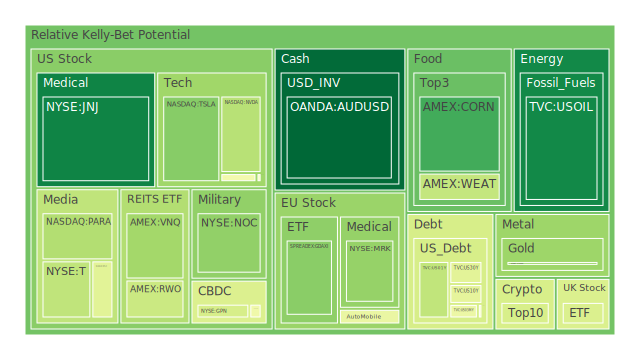
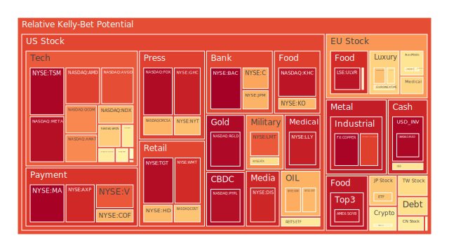
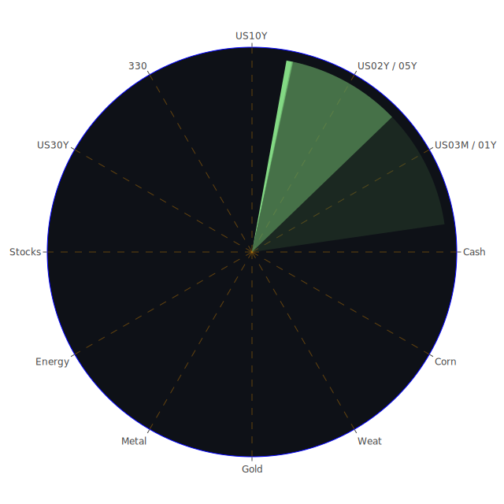

---$
title: "2025-04-19 投資日報"
category: "財經資訊宇宙"
subcategory: "投資日報"
date: "2025-04-19"
heroImage: {
    src: "./hero.jpg",
    alt: "易經算命",
    }
tags: ["投資日報", "照妖鏡", "債券", "股票", "匯率", "大宗商品", "gpt-o3"]
author: "Tim Chen"
isDraft: false
---

# 投資商品泡沫分析 

## 美國國債  
正題：三月以來，短端（1Y 4.00 %）回落，長端（30Y 4.81 %）微揚，殖利率曲線極度趨平；FED RRP 不斷萎縮、EFFR 交易量仍高，顯示貨幣市場流動性尚未崩裂但正快速重定價。  
反題：信用卡逾放率與商辦不良率齊高，沉默的信用風險正從金融深水區冒頭。歷史上 2000 年與 2019 年皆出現「平坦曲線＋科創泡沫」後快速變陡，對債市多頭是致命轉折。  
合題：利率「低波橫盤→信用事件→需求搶手」之三階段鏈已隱約可見；若高收益利差再擴，20Y+ 級公債或再現 2020 年三月般的搶購潮。D1‑D30 平均風險約 0.45，仍處可戰低檔，但一旦超 0.6，建議短端換長端、並為資金留彈性。

## 美國零售股  
正題：強勢消費股（Costco D1≈0.67）受惠「富裕客層囤貨＋通膨通道」，新聞亦見 Netflix、AmEx 對高端族群樂觀。  
反題：房貸 30Y 固定率破 6.8 %，首購族壓力帶動「分期購買延遲」；D.R. Horton 抱怨春季滯銷，暗示邊際消費開始刹車。  
合題：零售股內部分化，「必需品＋會員制」對抗滯脹、「大件耐用品」則面臨庫存山。1990 年代滯脹尾聲亦演此劇本：沃爾瑪跑贏百思買。PP100 離 PP80 持續擴大者宜審慎。

## 美國科技股  
正題：NVIDIA、Alphabet 受新一輪關稅與出口管制衝擊，新聞負面情緒 96‑97 %；半導體 ETF 近一週 D7 升破 0.83，與 2018 年中美關稅開打時相似。  
反題：Netflix 財報逆風翻盤，市場湧現「防禦型科網」新敘事，彷彿 2001‑2002 年網景崩潰後 eBay、亞馬遜迎來估值重估。  
合題：科技股將分裂為「硬體資本密集＋政策高敏感」與「軟體訂閱＋客戶鎖定」兩條線。若 E/P Spread 重新走高，軟體巨頭可成替代債券的收益載體。

## 美國房地產指數  
正題：商辦空置與 CMBS 拋售風聲未止，VNQ‑IYR 之 D14 均上破 0.72；Fed 數據顯示「Commercial Real Estate Delinquent」處高位。  
反題：美國南方與太陽帶尚有移民與勞務紅利，單戶住宅租金回報撐住部分估值，新屋開工並未腰斬。  
合題：歷史回看 1991 年 S&L 危機後 REITs 先跌後橫兩年；若利率在 4‑5 % 高檔平台徘徊，商用 REIT 仍將慢性折舊，而單戶租賃 REIT 或具抗跌性。策略上宜以「地產債」替代「地產股」。

## 加密貨幣  
正題：比特幣短線追高後首次見 D1 超 0.42；DOGE 與 ETH D1 漲到 0.54‑0.59，散戶情緒回暖。新聞揭露「近十億 DOGE 儲蓄一夜蒸發」之恐慌案例。  
反題：央行流動性交換額度擴大，若政策再祭美元流動性，BTC 或再成風險對沖；2019‑2020 年「保守貨幣政策→加密冷卻→量化寬鬆→牛市」循環或複製。  
合題：短期籌碼集中度高，技術面距移動平均擴散，與 2021 年 4 月高點前夕雷同；建議只將其視為「波動率票券」，用於對沖法定貨幣貶值，倉位勿過 5‑8 %。

## 金／銀／銅  
正題：金銀比持續 52 以上，黃金 D1 約 0.32、仍安全；銀 D1 高達 0.87，「跟風式通膨交易」擡頭。  
反題：GOLD‑COPPER Ratio 高達 700，遠超 2020 年 3 月恐慌峰值，若全球製造復甦，銅價補漲恐削弱金的相對強度。  
合題：黃金為「信用脫錨＋戰略風險」的長期對沖；銀與銅則分別對應「通膨‑綠能需求」與「工業再庫存」。歷史 2003‑2006 的大宗趨勢表明：金領漲後銀銅接棒，但銀波動倍增。配置中宜「長金、短銀對銅」。

## 黃豆 / 小麥 / 玉米  
正題：玉米、大豆 D1 仍 < 0.22，屬低位，對應埃及蘇伊士營收崩跌、烏俄黑海運輸不暢。  
反題：小麥 D1 0.38，偏高，新聞有尼日利亞儲蓄受阻、敘利亞乾旱等需求弱化消息。  
合題：以 2010‑2011 糧價危機為例，大豆先於小麥啟動；本輪若美元續強、航運費上升，玉米或先行拉抬，策略可做跨品種多／空對沖。

## 石油 / 鈾期貨 (UX!)  
正題：原油 D1 0.10‑0.12，油公司獲利下滑符合「供過於求」敘事；鈾 D1 0.30‑0.51 為中性偏高。  
反題：Trump 再審離岸風電、CSX 貨運受阻，供給鏈雜訊利多化石能源；若中東衝突再度升溫，油價或複製 2006‑2008 大升浪。  
合題：油鈾呈「內生替代」，當化石燃料受限、核電題材帶動鈾價；若再現 2022 年能源危機，「油跳漲→核能概念補漲」恐再演。可持續維護鈾多頭以對沖油沽空風險。

## 各國外匯市場  
正題：EURUSD D1 0.98 高燙手，但歐洲乾旱兼法院與政治衝突頻仍，資金找出口；AUDUSD D1 0.04 低檔，澳洲大宗循環或推進。  
反題：USDJPY D1 0.59，中期走勢取決於國際對日債信心；若 1998 年亞洲金融危機式外債擠兌重現，日圓恐穿 150。  
合題：美元指數受「美國殖利率微升＋避險」雙支撐，短期高位震盪；外匯最佳策略是採「商品貨幣 vs 負債貨幣」交叉對沖，如多 AUD、空 JPY。

## 各國大盤指數  
正題：NDX D7 0.83、GDAXI D7 0.51、FTSE D30 0.77，歐美指數泡沫積聚；陸股滬深 300 D1 0.58，但 D30 0.42，屬補跌後修復階段。  
反題：日本日經 JPN225 D1 0.66 仍強，與 1989 高點前夕「資金寬鬆＋財政刺激」情境相似。  
合題：指數間分化將帶來相對價值機會，「歐高‑亞低」配置或重演 2012‑2013 歐債危機後格局。

## 美國半導體股  
正題：TSM D1 0.98、NVDA D1 0.36 但 D30 0.59；出口管制新聞連日負面，庫存回補高峰恐已過。  
反題：Trump 關稅議題同時推升「在地化」補助，Micron 等北美廠商 D1 雖 0.48 但 D14 仍低。  
合題：供應鏈將「垂直在地化」壓縮全球產能冗餘；歷史 1985‑1987 美日半導體貿易戰亦誘發供應短缺與價格飆升。可對沖布局「設計 IP 多頭｜製造 代工適度放空」。

## 美國銀行股  
正題：JPM、BAC D1 超 0.70，FED 貸存差仍大，資金成本攀高，重演 1989‑1990 信貸緊縮前夜。  
反題：Money‑Market Fund 資產創新高，反映儲戶尚未極端抽離；資產質量仍優於 2008 次貸時代。  
合題：利息支出壓力＋地產風險傳導＝「慢性出血」；建議銀行敞口僅作價差交易，並利用 TLT／KRE 比價指標監控風險。

## 美國軍工股  
正題：NOC、LMT D1 約 0.30‑0.83，烏克蘭‑中東衝突支撐需求；民調顯示國防預算難以大砍。  
反題：國防採購長周期，即便訂單增加，現金流亦有遞延；歷史上 2011「預算封頂」仍重創軍工 PE。  
合題：把軍工看作「地緣衝突選擇權」，在戰火升溫時提供多元資產的負相關；但留意政府停擺與赤字談判。

## 美國電子支付股  
正題：MA、V D1 高達 0.99 與 0.84，反映市場對「費率壟斷＋跨境支付增長」過度樂觀。  
反題：加密廠商與 CBDC 試點或侵蝕手續費護城河，正如 2010 年 PayPal 衝擊信用卡時代。  
合題：若全球支付遷往鏈上，支付龍頭或淪為「資料流量股」，估值需折價；此板塊宜以「估值壓縮空頭」佐「成長加密多頭」對沖。

## 美國藥廠股  
正題：LLY D1 0.934，Novo Nordisk、Merck D1 0.30‑0.63，多年 GLP‑1 盛宴推高估值。  
反題：專利懸崖與監管風向急變；歷史 2015‑2016 類鴉片訴訟拖累整體醫藥板塊。  
合題：醫藥「創新‑訴訟」周期若進入訴訟階段，可考慮「高研發小型股對沖巨頭」。

## 美國影視、媒體股  
正題：Netflix 強韌財報帶動「防禦型訂閱」敘事；傳統媒體 FOX、NYT D1 > 0.97，估值飽和。  
反題：廣告支出在經濟轉折時大幅收縮。Dot‑com 崩潰與 2008 年金融危機皆見新聞媒體股率先跌破；「負面情緒 90 %‑以上」之裁員新聞亦增壓。  
合題：建議短期內「長 Netflix／空傳統媒體」作跨行業價差。

## 石油防禦股、金礦防禦股  
正題：Energy Major（XOM D1 0.71）具高分紅；金礦股 RGLD D1 0.97，但作為「黃金槓桿」仍值保險角色。  
反題：若需求不振、油價橫盤，股息難敵回購縮水；金礦成本曲線受燃料、工資雙擠壓。  
合題：將此二板塊視「收益型對沖」：在市場崩跌時可相對抗跌，但高泡沫分數提醒倉位需勤換手。

## 歐洲奢侈品、歐洲汽車、歐美食品  
正題：LVMH、Hermès 等 D1 0.67‑0.70，但中國 iPhone 失地新聞反映高端消費階層分流；BMW D1 0.61 食品巨擘 KO、KHC D1 0.69‑0.95。  
反題：歐洲乾旱＋法德政治摩擦升溫；奢侈品周期高點常領先經濟一季反轉。  
合題：食品為「通膨＝提價」的防禦，但健康趨勢、添加劑監管已壓縮估值。策略可「奢侈品空頭 vs 食品多頭」博價差回歸。

---

# 宏觀經濟傳導路徑分析  
1. **貨幣通道**：RRP 下降→錢市流動性移向 T‑Bill→短端利率下行→重挫美元 Funding 成本→推升高 Beta（加密、成長股）短線；若流動性轉折，將反噬高槓桿板塊。  
2. **信用通道**：信用卡逾放率高→銀行預備金需求上升→縮貸→中小企業就業降溫→消費週期下行→零售耐用品與房市先受打擊。  
3. **貿易通道**：關稅升級→製造鏈在地化→資本支出短期擴張→半導體設備景氣落差→中長期成本轉嫁至消費價格→再度推升 CPI 與利率期望。  
4. **地緣通道**：中東、東歐衝突→能源與軍工需求＋避險買金→油金比擴散→輸入型通膨→央行鷹派延長。

# 微觀經濟傳導路徑分析  
* Netflix 強勢財報 → 廣告模式轉向訂閱 → 傳統媒體市占下滑 → 內容成本壓縮 → 影視服務裁員 → 社會心理「緊縮預期」加劇。  
* Nvidia 出口限制 → GPU 供應緊張 → AI 新創成本升高 → 融資需求增 → 風投收緊 → 科技招聘放慢 → 高薪消費收縮。  
* 房貸利率飆升 → 首購族推遲 → 家具家電需求下行 → 工業金屬（銅）需求下修 → 銅價短修正，但綠能長驅仍在。

# 資產類別間漣漪效應傳導  
1. **債市→銀行→房地產**：曲線趨平迫使銀行壓縮 NIM，房地產貸款審核趨嚴，REIT 價值折現率上升。  
2. **貿易戰→科技→大宗→外匯**：出口管制抑制晶片供應，生產地外移拉高原料需求，帶動 AUD 反彈、JPY 承壓。  
3. **地緣衝突→能源→運費→糧價**：油價上行推高航運費，蘇伊士箱量下滑影響小麥出口，農產品 ETF 過度依賴單一路徑而震盪加劇。  
4. **流動性→加密→支付→銀行**：加密大漲帶動支付平台手續費增長，但若波動過大，監管壓力又回流銀行。

---

# 風險對沖投資組合機會（相位 120°、相關 ≈ −0.5）  
以下三組資產各自內部高度分散，組間呈逆向或時差動態，利於降低系統性風險。百分比係指整體投資組合比重；子項目內再均分。

* **穩健型 40 %**  
  * 短天期美國國庫券（1‑3 M）  
  * 實物黃金（長倉）  
  * 高品質消費必需股（例如 Costco）  
  ☛ 特色：收益穩＋市場恐慌時上漲；與成長與高風險部位負相關。

* **成長型 35 %**  
  * 半導體製造龍頭（台積電）  
  * 高現金流軟體訂閱（Microsoft）  
  * 再生能源與核燃料（鈾期貨 UX!）  
  ☛ 特色：受政策補貼與技術升級驅動；與黃金、國債相關係數低至負。

* **高風險型 25 %**  
  * 比特幣  
  * 工業金屬銅（多頭）  
  * 新興市場指數（含印度、拉美）  
  ☛ 特色：政策＋流動性雙刃劍；於高通膨或美元疲弱階段領漲，但亦最先回吐。

> 透過「避險／成長／動能」三角排列，可近似形成 120 ° 相位：當通縮恐慌來襲，穩健角吸收波動；當科技與去美元化故事延燒，成長角發力；若全球流動性泛濫，高風險角則推升整體收益。

---

# 投資建議  
1. **先求存活再求獲利**：整體泡沫指標顯示，多數熱門資產 D1>0.6 已進高位區，首務是嚴格控倉與動態再平衡。  
2. **重視流動性斷層**：留意 Money‑Market 基金與 RRP 變化；一旦出現「錢荒‑再寬鬆」拐點，即刻調整久期與槓桿。  
3. **跨品種相對價值**：利用出口管制‑本土補貼帶來的錯價，採「設計 IP long / 代工 short」或「澳幣 long / 日圓 short」策略。  
4. **階段性對沖**：逢泡沫分數超 0.8 之板塊（MA、PYPL、META 等）以期權或反向 ETF 管理尾端風險，不輕言做空基本面仍強之龍頭，以免踏空估值延伸。

---

# 風險提示  
投資一定有風險，市場瞬息萬變。本文所述觀點與情境推演，僅基於公開數據（泡沫指數、FED 指標、新聞情緒）進行邏輯推論，並非任何形式之保證。  
投資人應評估自身風險承受度、流動性需求與投資期限，審慎決策；同時應隨時追蹤政策與市場情緒動態，靈活調整組合。若對槓桿、衍生品或加密貨幣等高波動標的缺乏經驗，宜先透過小部位或紙上模擬熟悉其特性，再擴大操作。

 
Daily Buy Map:

 
Daily Sell Map:

 
Daily Radar Chart:

 
