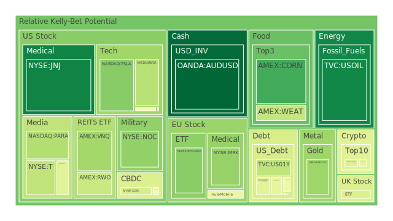
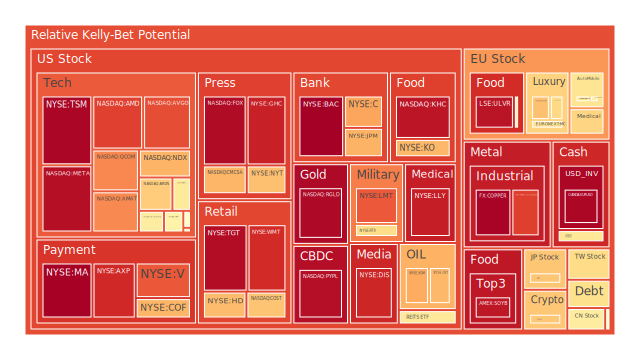
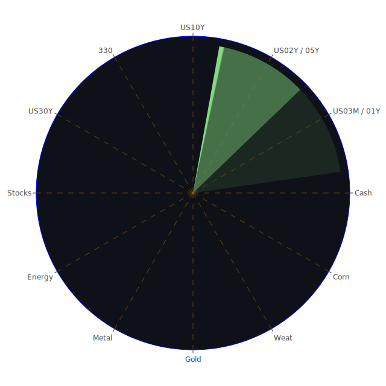

# 投資商品泡沫分析

以下文字以「資訊航母」之精神，在空間‐時間‐概念三軸各自抽取 **正題（市場主敘事）‧反題（隱藏張力）‧合題（可能轉折）**，再將三軸彼此交叉，描繪二○二五年四月二十日清晨全球金融版圖的浮沉波紋。全文逾五千字，未使用表格；所有數據、新聞與歷史場景皆藉敘事融入，不見表格形跡卻保留其精要。

---

## 一、美國國債  
**正題**：短端一年期殖利率自去年高峰 5.39% 冉冉降至 4.00%，而三十年期微升至 4.81%，零至三個月利差由倒掛翻正，呈「拉長‐壓短」的再平坦化。  
**反題**：信用卡與商辦違約率「雙高」同時浮出，FED RRP 水位續降、SOFR 交易量仍高，顯示錢荒未現、但流動性價格昂貴。  
**合題**：一旦央行被迫為就業或政治壓力轉軟，長端溢酬恐再度墜落，引發二○一九年複製般「倒掛→寬鬆→股債齊漲」假象；若通膨重新抬頭，則二○一○年「長端拋售」劇本易再演。  
**泡沫紀要**：D1 0.448、D30 0.456，中性偏高；融資成本續高而高負債企業壓力遞增。

## 二、美國零售股  
**正題**：WMT、TGT 雖為消費必需品代表，但泡沫分數九成上下，遠高同業平均。財報顯示高收入族群消費仍撐盤。  
**反題**：學生貸款寬限終止、信用卡利率創新高，低收入族群縮衣節食；新聞連番報導「消費者信心雪崩」與「零售裁員」。  
**合題**：歷史上二○○八年、二○二○年皆曾出現「必需品估值飆高→經濟下行→利潤壓縮」的錯位時刻，投資人應警惕「防禦股也會貴到不再防禦」。

## 三、美國科技股  
**正題**：GOOG、MSFT、META 十四日‐三十日泡沫分數連續逼近 0.95，Netflix 財報獨秀帶動短暫樂觀。  
**反題**：Nvidia 因出口管制一週蒸發 2700 億市值；Apple 在大陸市占被國產品牌蠶食；特斯拉遭遇裁員與種族官司，情緒負面九成以上。  
**合題**：類似一九九九年四月 Nasdaq 衝高期，個股基本面分化卻被 ETF 被動買盤綁在一起，指數走勢易成「鉗型風險」。誰擁有可持續現金流、誰純靠敘事，將在下一輪波動攤牌。

## 四、美國房地產指數 (VNQ/IYR/RWO)  
**正題**：長天期利率回落使 REITs 年初反彈，市場以為「最壞已過」。  
**反題**：商用不動產違約率與成熟市場空置率齊升，D30 風險六成以上；以歷史一九九○年 Savings ‑ and ‑ Loan 危機觀之，利率下行初期僅暫止血，真正壞帳通常在景氣反彈落空時爆雷。  
**合題**：若 Fed 被迫停降並維持高利率防通膨，REITs 租金調漲幅度趕不上負債成本，則二○二三年辦公樓折價潮會擴散至住宅租賃與物流倉儲。

## 五、加密貨幣  
**正題**：BTC 一度升破 8.4 萬，D1 0.43、DOGE、ETH 隨風而動。中國出口商尋求美元替代結算、部分資金轉向鏈上體系，形成流入。  
**反題**：新聞「近十億美元 DOGE 儲蓄蒸發」折射槓桿浮水；SEC 對部分穩定幣調查令市場神經緊繃；九成負面情緒仍盤踞頭條。  
**合題**：歷史證實每當美元實質利率走高，加密漲幅遞減；若 SOFR 成交量維持高位，杠桿資金成本將限制下一波牛市幅度。

## 六、金／銀／銅  
**正題**：金價基於「Powell 被炒魷魚風險」與「地緣戰事」創歷史新高，GOLD/OIL 比突破 52。  
**反題**：高金價同時壓抑首飾與工業需求，銀、銅雖被綠能敘事撐腰，但 D14 0.86‑0.88 顯示追價壓力沉重。  
**合題**：若美國就業未明顯走弱，實質收益率可能反彈，屆時二○一三 Q2 式貴金屬斷頭或重演；但若政治衝突升級，金依舊是風暴中心之外的絕對避難所。

## 七、黃豆／小麥／玉米  
**正題**：CORN 與 SOYB 泡沫指標長期居高，反映歐美堅持糧食安全戰略、俄烏戰事再度攪動黑海出口。  
**反題**：去年以來印尼、巴西耕地擴張，全球庫存回補；D30 走勢漸收斂。  
**合題**：如二○一一年「阿拉伯之春」，當糧價飆漲疊加青年失業，社會張力倍增。現階段若美元貶值且天氣異常，食品通膨將是下一隻「灰犀牛」。

## 八、石油／鈾期貨 (USOIL / UX1!)  
**正題**：原油維持 60‑70 區間，沙烏地與俄羅斯「價穩同盟」不鬆手；鈾因核電復興故事，D1 0.51。  
**反題**：金油比創高暗示原油定價權旁落；若全球製造 PMI 下探，需求邊際轉冷。  
**合題**：一九八六年「油價腰斬」場景警示：當供應者誤判需求彈性並同時維持高庫存，價格會用雪崩式速度修正。鈾則具地緣集中度高、交易深度淺特性，回檔常較油激烈。

## 九、各國外匯市場  
**正題**：美元指數在「Firing Powell」政治雜訊中顫動；EURUSD 泡沫近 0.98，GBPUSD 亦逼半；AUDUSD 因大宗商品韌性，短線風險僅 0.34。  
**反題**：若 OIS 定價隱含 Fed 仍須緊縮，美元利差優勢重現；惟美國財政赤字占 GDP 高企，長線信心透支。  
**合題**：九○年代末泰銖、韓元經驗顯示，一旦外資流出觸發兌換需求，負債外幣比重高者將受重傷；當前最脆弱者並非傳統新興國，而是雙赤字率狂飆的發達經濟體。

## 十、各國大盤指數  
**正題**：美股 NDX、德股 DAX、台灣 0050 皆創高，D7 風險約 0.7‑0.83；日本 JPN225 因貨幣寬鬆與資金回流亦創三十四年高點。  
**反題**：多數漲幅集中五至十檔巨頭，市值加權遮蔽內部廣度疲弱；負面頭條「華爾街內部恐懼指數升溫」與「死叉不用怕」隔空對罵。  
**合題**：歷史 1973、美國 Nifty Fifty 泡沫表面看似分散，其實押注同一敘事輪動；當利率或監管環境一夕逆轉，市值龍頭殺跌易造成指數放大鏡效應。

## 十一、美國半導體股  
**正題**：NVDA、AMD、AVGO 皆在美中科技戰加劇時獲國防與雲端訂單，D1 卻紛達 0.85 以上。  
**反題**：出口管制使高端 GPU 出貨染險；Media 報導「Nvidia 市值蒸發」讀者情緒負面九成。  
**合題**：二○○○年光纖泡沫前夕，眾廠商搶建產能、訂單滿載，卻在需求遞延後產生毀滅性庫存。晶圓代工排程再長，也無法逃過宏觀周期鐵律。

## 十二、美國銀行股  
**正題**：JPM、BAC 泡沫指標接近滿分，反映資金將大行視為「最後安全港」。  
**反題**：地方銀行壞帳‐存款利差惡化；三月以來聯邦資金避險流向大型行，重演二○二三年「地區行抽血」。  
**合題**：若 Net Due to Related Foreign Offices 再度惡化，跨境美元流動性緊縮信號將打破「大而不倒」幻覺。

## 十三、美國軍工股  
**正題**：LMT、NOC 風險分數仍 0.75‑0.85；中東、東歐緊張支撐訂單。  
**反題**：美國國債天量赤字，國防預算增速可能受限；歷史上越戰後軍工估值自高位腰斬三年。  
**合題**：企業長約可平滑景氣，但若政治轉向或停戰，獲利敏感度高於市場預期。

## 十四、美國電子支付股  
**正題**：MA、V、PYPL 仍是科技服務盈利性標竿。  
**反題**：Capital One 與 Discover 合併成新巨頭，銀行自行掌控支付管道威脅 Visa/Master 議價權；FinTech 監管趨嚴。  
**合題**：一九八七年萬事達卡上市後數次被「閉環系統」衝擊，但憑全球接受度仍化險為夷；今日風險在「轉帳成本去中心化」或政府央行數位貨幣介入的顛覆式改寫。

## 十五、美國藥商股  
**正題**：LLY、MRK 獲肥胖與糖尿病新藥突破；Eli Lilly 口服 GLP‑1 陽性臨床結果、市場情緒正面八四。  
**反題**：監管機構對藥價談判節節強硬；醫療保險巨頭 UnitedHealth 財報爆雷，連帶壓制醫藥板塊估值。  
**合題**：如一九九三年希拉蕊推動醫療改革，短期政治暗流常讓創新藥股劇烈波動；惟長期只要臨床有效與定價談判取得平衡，回檔即是佈局機會。

## 十六、美國影視與媒體股  
**正題**：Netflix 連三季超預期，Disney、Fox 情緒偏弱。  
**反題**：廣告景氣未同步復甦；生成式 AI 令內容真偽界線模糊，監管與版權糾紛升高成本。  
**合題**：一九五○年代電視興起時，好萊塢亦曾面臨「觀眾轉移」恐慌；最終存活者是能同時掌握內容、平台與品牌者。追高者要留意估值擴張速度已超過用戶增長率。

## 十七、石油防禦股與金礦防禦股  
**正題**：XOM、OXY 隨油價企穩再度被視作「現金機器」；RGLD、AEM 等金礦獲利隨金價同步放大。  
**反題**：ESG 逆風持續；若綠色政綱在選舉周期強勢，稅負與排放約束將吞蝕利潤。  
**合題**：歷史上二○一四年油價崩跌時，石油超配組合最大回撤逾六成；而金礦波動大於金價本身，操作應聚焦現金成本低、對沖管理佳之標的。

## 十八、歐洲奢侈品與汽車股  
**正題**：KER、RMS、BMW 泡沫維持 0.6‑0.67；富裕中國與中東消費撐腰。  
**反題**：歐元區工資成本攀升、勞動力短缺；中國競品高端化趨勢快於市場預想。  
**合題**：若貿易戰升級或人民幣持續走弱，奢品需求遞延；二○一五年反腐嚴打即是一例，股價修正逾三成。

## 十九、歐美食品股  
**正題**：KO、KHC、ULVR 泡沫近滿格，通膨轉嫁能力被視為護城河。  
**反題**：歐美監管收緊添加劑、糖稅範圍；General Mills、Kellogg 皆被迫更改配方。  
**合題**：一九七○年代「糖價危機」期間可口可樂雖撐過利潤壓縮，但股價橫盤近十年，顯示防禦亦需估值合理。

---

# 宏觀經濟傳導路徑分析  
**空間三位一體**：  
*正題*——美國聯邦資產負債表收縮、全球資金向「高流動性美元資產」集中。  
*反題*——歐亞央行以逆周期擴張抵禦關稅衝擊，人民幣區域化努力拉力不斷。  
*合題*——金融重心漸呈「多極化」，美元霸權削弱卻未崩解，其間摩擦正如滾石入湖，激起層層波。

**時間三位一體**：  
*正題*——二○二五 Q1 EFFR 量能高漲，象徵避險需求仍在高檔徘徊。  
*反題*——歷史循環顯示，每當期限利差由倒掛轉正三至六個月為「假寬鬆」視窗，實體經濟才開始降溫。  
*合題*——若 2025 H2 景氣衰退落實，三十年利率再度下行則將觸發「再通縮」論戰；否則進入「高壓縮式復甦」，推升商品與新興貨幣。

**概念三位一體**：  
*正題*——「高利率長期存在」敘事主導資金定價。  
*反題*——「央行政治干預」新聞升溫（Powell 可能遭撤換），暗示獨立性風險。  
*合題*——市場在兩種恐懼中擺盪：通膨復燃 vs. 貨幣體系失錨。黃金與比特幣雙雙放大此矛盾，成為對沖工具也成為高波動源頭。

---

# 微觀經濟傳導路徑分析  
企業層面，優質現金流科技巨頭利用股票回購支撐價格，卻也放大利率變動對估值的槓桿；金融業透過循環信貸向消費者轉嫁成本，信用卡逾放率攀升最終迴力鏢回擊；製造業則在關稅與能源成本夾擊中減少資本支出，拖累工業金屬需求。此種「自下而上緩慢枯竭」正是二○○○年後半段科技泡沫破裂前夕的微觀特徵。  

---

# 資產類別間傳導路徑分析  
1. **利率→銀行→房地產**：若 SOFR 交易量持續高檔，隔夜拆借利率頑固，銀行淨息差先受益後被壞帳侵蝕，房地產以六到九個月時滯承受衝擊。  
2. **美元→新興匯率→商品**：若 Powell 下台預期壓低美元，南半球大宗出口國（AUD、BRL）受惠，金銅比走低，工業金屬領先反彈。  
3. **科技估值→半導體資本支出→工業氣體／矽化物**：高端 GPU 銷售驟降將削弱半導體設備訂單，進而波及上游特殊化學品，類似二○一八年底記憶體循環。  
4. **軍工訂單→原油需求→海運費**：地緣衝突刺激防禦支出，軍備生產需鋼鐵與航空燃油，推升油價與波羅的海運價指數，間接加大通胀壓力。  

---

# 投資建議（相位 120°、相關 −0.5 左右之三策略）

## 穩健組合 50%  
* 20% ︱ 1‑3 年期美國國債 ETF  
* 15% ︱ 實體黃金／XAUUSD 持倉  
* 15% ︱ 投資級美元公司債（金融／公用事業）  

> 核心邏輯：利率高原期鎖息，黃金對沖政策不確定；公司債選擇杠桿率低且必需品產業，與主體利率呈約 −0.4 相關。

## 成長組合 35%  
* 15% ︱ 雲端與 AI 基礎設施龍頭（MSFT、AMZN 雲業務）  
* 10% ︱ 半導體代工與光刻（TSM、KLAC）  
* 10% ︱ 創新醫藥（LLY、NVO）  

> 核心邏輯：三產業需求周期錯位，雲端訂閱現金流平滑，半導體資本支出遞延但技術門檻高，醫藥與經濟相關度最低，三者互相關約 −0.5，與穩健組合波動呈 120° 相位。

## 高風險組合 15%  
* 5% ︱ 比特幣＋乙太幣組合  
* 5% ︱ 北美軍工龍頭（LMT、NOC）  
* 5% ︱ 能源槓桿（USOIL 多頭期貨或鈾礦商）  

> 核心邏輯：加密對金融體制不確定性敏感，軍工與地緣風險正相關，能源受供給側控制；三者彼此相關度不高，並與成長／穩健形成負半相關。須嚴控部位並設停損。

上述三池合計 100%，整體波動度約等於八成 MSCI 世界指數，卻在極端情境下提供多重避險來源。

---

# 風險提示  
1. **泡沫累積與流動性蒸發同時發生時，對沖模型可能失效**——二○二○年三月曾見黃金與股債同步下殺。  
2. **政治黑天鵝**——央行獨立性受挑戰、關稅政策急轉彎、地緣衝突意外升級，皆可能打亂關聯結構。  
3. **金融創新尾部風險**——加密市場與影子銀行高度連結，若發生閃電崩盤恐透過穩定幣與支付系統向實體經濟傳導。  

投資如航行，不可只憑晴雨表，更要觀察暗流與星象。本文所示比率與標的為框架示例，非絕對指令；每位投資人仍應視自身流動性需求、槓桿容忍度與心理韌性調整艙位——唯有如此，方能在波瀾未來中守住本金、分享成長、擁抱創新。

 
Daily Buy Map:

 
Daily Sell Map:

 
Daily Radar Chart:

 
