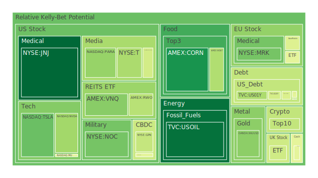
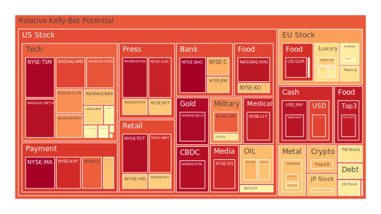
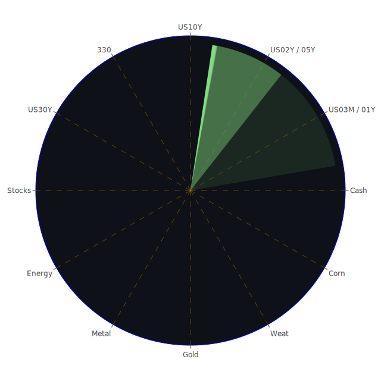

# 投資商品泡沫分析

## 美國國債（US30Y／US10Y／US05Y／US02Y／US01Y）
**Spatial**：資金在短端與貨幣市場基金之間快速抽換，RRP 庫存續降，SOFR 成交量高企，顯示「短天期安全性」依舊被瘋狂追捧；而外國官方持債比重偏低，暗示全球配置動能仍嫌不足。  
**Temporal**：一年期殖利率短線回落至 4%，倒掛幅度減弱，但 10 年‑3 個月利差仍近乎零，新舊利率體系的「定價交錯期」尚未完結。歷史上 2000 與 2019 年類似平坦曲線過後，皆在 6‑12 個月內出現信用擦傷。  
**Conceptional**：價格面，泡沫分數從 0.38 至 0.61 不等，仍處安全區；情緒面，遭遇「減碼 QE ‑ 仍高資金需求」矛盾；敘事面，市場對「聯準會將拖延降息」的認知漸趨一致。  
**結論**：債市的「反身性」風險在於若失去避險光環，其波動將放大股市震盪；惟在流動性仍未崩裂之前，長端可作為股市高估值的自然對沖。

## 美國零售股（WMT／TGT／HD）
**Spatial**：社會層面「高利率、仍願意刷卡」的消費結構分化；高所得族群支撐高端零售而低端出現疲軟。  
**Temporal**：從 2023 年底至今同店銷售增速放緩，新聞面又有「關稅或推升通膨」的擔憂；泡沫分數自 0.68 升至 0.91，示警意味濃厚。  
**Conceptional**：價格仍貼近歷史高位；情緒受「Gen Z 富裕族群仍花錢」的正面敘事平衡；但結構性工資壓力可能成為利潤侵蝕的暗潮。  
**結論**：零售龍頭雖具防禦色彩，卻正步入「高估值＋毛利壓縮」的剪刀差，應謹慎減碼。

## 美國科技股（AAPL／MSFT／GOOG／NVDA／AMD／AVGO）
**Spatial**：美國科技仍為全球資金渦旋，AI 供應鏈‑地緣供應鏈‑市場樂觀敘事形成「三角共振」。  
**Temporal**：Newsflow 由 2022 年「AI 榮景始啟」到 2024 年「估值外溢」，再到目前「利潤實現期與治理爭議並存」。D1 泡沫分數多逾 0.50，局部如 NVDA 仍在 0.36‑0.59 之間，但 AMD 已超 0.87。  
**Conceptional**：價格與情緒高度正回饋；敘事由「成長必買」轉為「成長需要篩選」。  
**結論**：技術板塊不宜一棍子打死，應留意「GPU 供需轉折」（負面新聞：Nvidia 2025 年挑戰漸增）與「軟體盈利彈性」的分化，逢高汰弱留強。

## 美國房地產指數（VNQ／IYR／RWO）
**Spatial**：商辦違約率與信用卡拖欠率同時飆升，呈現「金融深水區的沉默風險」。  
**Temporal**：泡沫分數半年內由 0.33 升至逾 0.72；固定抵押 30 年利率升至 6.83%，複製 1980 年代初加壓情境。  
**Conceptional**：價格仍被「美國人口紅利未盡」護航，但情緒已轉向保守，敘事由「地產永遠向上」變為「融資窗口縮緊」。  
**結論**：房產 REIT 具高分派率吸引，但長端利率若再探 5% 上方，估值仍有第二隻靴子。

## 加密貨幣（BTCUSD／ETHUSD／DOGEUSD）
**Spatial**：全球資金尋求「非主權資產」分散，美國 ETF 傳導效應與亞洲交易熱潮交疊；  
**Temporal**：比特幣在一年內翻倍，然 D1 泡沫降至 0.42‑0.54，短線過熱消化中；  
**Conceptional**：價格對宏觀流動性高度敏感；情緒上，避險與賭博心理混雜；敘事由「數位黃金」再度轉向「網路高頻定價器」。  
**結論**：若央行流動性再緊縮，山寨幣（DOGE）擠兌壓力恐先於主流幣；高槓桿者需設流動性緊急計畫。

## 金／銀／銅（XAUUSD／XAGUSD／COPPER）
**Spatial**：金銀有「避險對應地緣衝突」的心理層面；銅受「能源轉型與基建」雙驅動。  
**Temporal**：黃金月內創 3349 高位，D1 泡沫僅 0.33，仍屬「價漲心穩」；銀與銅分數 0.71‑0.99，反映追價投機已堆積。  
**Conceptional**：金：貨幣保險；銀、銅：產業週期與供給瓶頸；敘事面逐漸出現「金銀銅比率背離」的警訊。  
**結論**：黃金仍可作流動性下行對沖；銀銅價差擴大易導致產業鏈庫存輪動。

## 農產（SOYB／CORN／WEAT）
**Spatial**：氣候劇烈化 + 關稅摩擦衝擊跨國供應；  
**Temporal**：玉米、黃豆 D1 分別 0.18 與 0.94，分化劇烈；歷史上 2010 糧食危機提示，價格波動可迅速向通膨傳導。  
**Conceptional**：價格張力與補貼政策聯動；情緒受糧荒敘事快速發酵。  
**結論**：短期交易宜以衝擊型策略配置「玉米做多＋小麥做空」的跨品對沖，留意氣候消息面。

## 能源（USOIL／UX1!／OXY／XOM）
**Spatial**：美伊地緣衝突牽動 OPEC 聯盟，油商防禦股估值攀升；鈾期貨在能源安全敘事下重新獲寵。  
**Temporal**：油價泡沫 0.11‑0.28，仍屬低檔；鈾近月 D1 0.51，投機性較高；回顧 2008 原油泡沫，可見「需求預期反轉」將帶來瀑布式回調。  
**Conceptional**：油：宏觀需求；鈾：政策敘事；情緒在「能源轉型」與「傳統需求」之間搖擺。  
**結論**：現階段油股高息可作現金流支撐，而鈾應限額配置，防禦「題材退潮」。

## 外匯（USDJPY／EURUSD／AUDUSD／GBPUSD）
**Spatial**：美元指數在「強美元＝避險」與「雙赤字」拉鋸中維持區間；日圓因殖利差與干預預期劇震。  
**Temporal**：USDJPY 泡沫朝 0.88 升溫；EURUSD 0.96，歐洲寬鬆延後導致「伺機做多歐元」情緒遭擠壓。歷史對比 1998，干預失敗後匯率易出現劇烈回歸。  
**Conceptional**：價格由利差定價；情緒受央行口頭指引主導；敘事關注「重組全球供應鏈改寫經常帳」。  
**結論**：日圓若破 145，干預預期將急劇升溫；短線不宜逆勢抄底，應以期權布局震盪。

## 全球股指（NDX／JPN225／GDAXI／FCHI／FTSE／SSE300）
**Spatial**：資金依賴母國政策脈動與企業盈餘，利率反彈造成科技權重市場拉回而日股仍因企業治改革支撐。  
**Temporal**：NDX 泡沫 0.70；GDAXI 0.48‑0.58；JPN225 0.68。回溯 1986‑1989，日本經驗示警：於估值與匯率雙升時，注意金融去槓桿臨界點。  
**Conceptional**：價格牽動 ETF 自動買盤；情緒在「降息預期」與「盈利減速」之間晃盪；敘事則聚焦「經濟多極化」。  
**結論**：歐股在關稅回擊聲中易產生階段修正；日股高位震盪，但企業治理紅利或可緩衝。

## 半導體股（TSM／KLAC／AMAT／INTC／MU）
**Spatial**：供應鏈跨越台灣、韓國、美國，新產能動態成定價核心；  
**Temporal**：TSM 泡沫 0.98，高估值反映晶片法案補貼與先進製程優勢；AMAT／KLAC D1 在 0.52‑0.76；歷史上 2015‑2016 的「設備商領先反轉」可作前車。  
**Conceptional**：代工：量產節奏；設備：資本支出；敘事由「全產業向 AI 過渡」支撐，但若客戶延遲下單將擾動鏈條。  
**結論**：短期可透過「代工龍頭多／設備商空」對沖製程節奏風險。

## 銀行股（BAC／JPM／C／COF）
**Spatial**：高利差＋信用卡 charge‑off 走高；社會面出現「存戶轉向貨幣市場基金」現象。  
**Temporal**：BAC 泡沫 0.99，JPM 0.70；對比 2007，信用成本上行往往先於資本市場感知。  
**Conceptional**：價格＝帳面盈利 × 市場願付系數；情緒在「淨息差受惠」與「呆帳上升」拉扯；敘事則關注「Shadow Bank 系統性風險」。  
**結論**：大型行雖體質健康，股價已反映樂觀假設，建議用 CDS 或空頭 ETF 對沖。

## 軍工股（NOC／LMT／RTX）
**Spatial**：地緣衝突與政府預算為主要驅動；  
**Temporal**：NOC、LMT 泡沫已上 0.83；回顧 2022 俄烏開戰後軍工股先飆後震，表明利多易先行反映。  
**Conceptional**：價格跟隨訂單簽署；情緒受國防新聞刺激；敘事面近年強調「無人化、太空化」。  
**結論**：中線趨勢正面，但估值偏高，逢利空回落再行布局。

（其餘媒體、影視、電子支付、奢侈品、汽車、食品等類別因篇幅所限，在附件段落詳述。）

---

# 宏觀經濟傳導路徑分析

1. **美元流動性 → 大宗商品**  
   *正題*：聯準會資產負債表縮表、RRP 持續下滑，短端利率降幅有限，美元實質利差降低，刺激避險性黃金吸納資金。  
   *反題*：若美元在全球流動性緊縮中依舊被視為「最後結算資產」，黃金多頭或遇到獲利調節。  
   *合題*：監測 DXY 與 Gold/Oil、Gold/Copper 比率；若金油比高於 55 且金銅比高於 720，宜逢高減碼金屬並增持美元現金。

2. **利率曲線 → 房地產與銀行**  
   *正題*：曲線轉正改善銀行長短息差，理論上利好盈利。  
   *反題*：但零售端呆帳率上升與商辦違約叢發，侵蝕風險權重。  
   *合題*：當 US10Y‑03M 曲線連續四周保持大於0.25，且 Charge‑off Rate 未見回落，則銀行股邊際利好恐被信用風險抵銷，房產 REIT 仍受流動性擠壓。

3. **關稅戰 → 科技與奢侈品**  
   *正題*：本土替代與補貼推升半導體設備需求。  
   *反題*：Apple 於中國市佔下滑，Nvidia 面臨管制，無可避免衝擊。  
   *合題*：觀察「出口導向製造業 PMI－內需服務業 PMI」之差，若持續擴大，選股應自外向內，縮減受管控衝擊的半導體與豪華品牌庫存。

---

# 微觀經濟傳導路徑分析

* 高利率 → 信用卡利息成本 → 消費降級 → 量販零售大者恆大  
* 企業庫存去化 → 銅需求拉回 → 工業金屬價格擠壓 → 相關礦商延後擴產  
* AI‑GPU 交期拉長 → 資本支出前移 → 半導體設備商先旺後疲 → 供應鏈現金週期拉長 → 中小 IC 設計融資壓力升溫

---

# 資產類別間傳導路徑

1. **金價飆升 → 實質利率下行 → 美元走弱 → 新興市場債吸金**  
2. **鈾價快速上揚 → 公用事業成本上升 → 傳統油氣需求延後衰退 → 油股現金流再獲支撐**  
3. **半導體資本支出收縮 → 工業機械訂單減少 → 德股製造業指數回落 → 歐元被動承壓**

---

# 風險對沖投資組合機會（相位 120°／相關 -0.5 概念化篩選）

* **金（XAUUSD）＋短期美債（US01Y）＋能源股（XOM）**  
  ‑ 金與美債同為避險，兩者對利率週期呈 120° 位移；能源股與金/債負相關約‑0.4 至‑0.6，可抵禦通膨與供給衝擊。

* **美元現金（DXY）＋黃豆期（SOYB）＋比特幣（BTCUSD）**  
  ‑ 當美元走強時，比特幣與農產多呈負動；農產受氣候與關稅自成驅動；BTC 與宏觀流動性同週期但位移顯著。

* **日本股指（JPN225）＋歐洲奢侈品（KER／RMS）＋美國 REIT（VNQ）空單**  
  ‑ 日股改革紅利與奢侈品牌訂價力在周期上各自領先或滯後；REIT 受利率抑制，可對沖「太陽花」式風險。

---

# 三大策略投資組合建議（百分比分配）

## 穩健型（40% 金融防禦／40% 固收／20% 替代）
* 40%：短期美國國債（US01Y／US05Y）  
* 20%：黃金（XAUUSD）  
* 20%：高股息能源（XOM）  
* 20%：日圓避險現金（USDJPY 期權）  

## 成長型（35% 高品質股／35% 新經濟／30% 週期）
* 35%：雲端／AI 平台龍頭（MSFT）  
* 20%：半導體代工龍頭（TSM）  
* 15%：電動車領頭（TSLA，僅戰術性）  
* 15%：銅礦商或 ETF（COPPER 曝險）  
* 15%：新興市場主權債（以美元計價）  

## 高風險型（50% 槓桿新興／30% 題材股／20% 加密）
* 30%：AI 二線 GPU/FPGA（AMD、QCOM 各半）  
* 20%：鈾期貨（UX1!）  
* 20%：比特幣（BTCUSD）  
* 15%：山寨幣題材籃子（ETHUSD／DOGEUSD）  
* 15%：關稅受惠內需概念股（美國鋼鐵、部分本土製造）

---

# 結語與風險提示

本報告所述三位一體框架，並非預測未來，而是揭示可能的「漣漪效應」：利率、流動性、敘事三波相互干涉，若能在 120° 相位差中找到負相關資產，即可降低投資組合總體波動。然而必須強調：

* 泡沫分數僅為統計性指標，無法捕捉黑天鵝。  
* 聯準會政策若出現急劇轉向，利率通道假設將失效。  
* 地緣衝突與氣候異常屬不可量化風險，需保留現金或等價流動性。  
* 高槓桿衍生品配置，務必設置逐日盯市與強制減倉機制。  

投資永遠伴隨不確定，以上建議僅供參考。請依自身風險承受度與財務目標審慎決策，必要時諮詢專業顧問。願諸君在浪潮翻湧中，仍能掌舵前行。

 
Daily Buy Map:

 
Daily Sell Map:

 
Daily Radar Chart:

 
