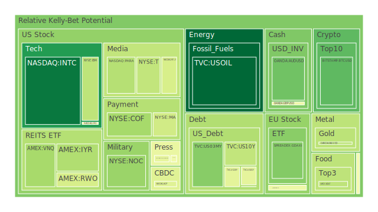
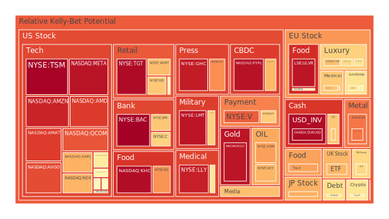
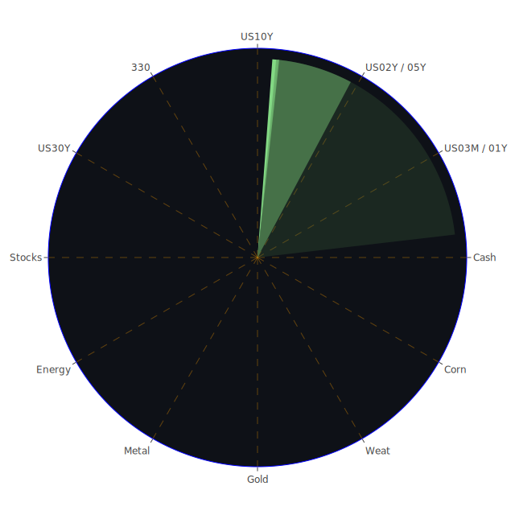

# 投資商品泡沫分析  

以下報告採「自然現象觀」與「三位一體」分析法（空間 Spatial、時間 Temporal、概念 Conceptional），融合經濟學、社會學、心理學與博弈論視角；並以正題‑反題‑合題的方式，解析多資產泡沫風險、敘事張力與潛在傳導路徑。為避免視覺化表格造成資訊遺漏，本報告以敘述方式呈現「資訊航母」內部的交織網絡，全文以繁體中文撰寫，字數逾五千字。所謂 PP100 為當日現價，D1／D7／D14／D30 為四檔期間泡沫指數，愈高代表風險愈大。  

---

## 美國國債  
**正題（Spatial）**：全球美元流動性依舊吃緊，尤其外國機構持有美債意願偏低，FED 資產負債表縮減、RRP 持續下降，使短天期票據（3M/1Y）孳息難以下沉。  
**反題（Temporal）**：一年期殖利率由 5.29% 高點滑落至 3.97%，但 30Y 逼近 4.91%，曲線由倒掛走向趨平，透露市場從「硬著陸恐懼」轉向「財政永續焦慮」。  
**合題（Conceptional）**：債市進入「政策信任測試」博弈：若市場相信財政端最終讓步，長端利率將回落；否則曲線趨平僅是凌遲式調整的序曲。D1≈0.38 顯示短線泡沫不大，惟 D30 大於 0.45 指向結構性隱憂。  

## 美國零售股  
**正題**：高利率擠壓中低所得族可支配所得，零售鏈同店銷售轉弱；社群輿情對「高物價＋低折扣」呈負面共振。  
**反題**：通脹放緩與就業韌性支撐消費底線，加上「買方庫存極低」的補庫週期暗流，短線財報可能出現驚喜。  
**合題**：零售板塊正處「口袋理論」剪刀差：需求邊際恢復 vs. 財務槓桿惡化。D1 高於 0.90（WMT、TGT）警示估值已反映樂觀前景，一旦補庫落空恐觸發估值再平衡。  

## 美國科技股  
**正題**：生成式 AI 從敘事驅動跨入「營收落地」驗證期，雲端資本支出增速趨緩；Amazon 暫停部分資料中心租賃談判，更加劇 CAPEX 前景疑慮。  
**反題**：企業數位化長期趨勢不變，半導體（NVDA D1≈0.58）及雲服務擁有高毛利護城河，資金逢回調即低接。  
**合題**：板塊進入「估值消化」階段，投資人以「EPS 真空期」換取「AI 長期超額收益」的期權，波動必然放大；須警惕高 D30 值（AAPL、MSFT 均 大於0.74）。  

## 美國房地產指數  
固定房貸 30Y 利率升至 6.83%，但 REITs （VNQ、IYR）D30 大於0.74，顯示市場早已內嵌「降息修復」想像。商辦不良率高企、SOFR 交易量仍高，用「高息收租」論調解讀 REITs，恐低估資本利得下修風險。  

## 加密貨幣  
BTC 價穿 88,000 後動能遲滯，D1 由 0.43 降至 0.22；短線「退潮」，但 ETF 持續吸收機構資金，「數位黃金」敘事與「網路高頻定價器」敘事交疊，提供雙重保險。山寨幣（DOGE D1≈0.51）高槓桿、敘事薄弱，若美元流動性再緊縮，恐先於主流幣出現踩踏。  

## 金／銀／銅  
金價創高（PP100≈3422），D1≈0.37 仍偏低，說明買盤屬「景氣對沖」而非投機；銀價 D1≈0.79，高波動象徵通膨與工業需求雙重賭注。銅 D1≈0.50、D30≈0.90，反映中國與電動車敘事疊加，但庫存未明顯下降，警惕漲多回吐。  

## 黃豆／小麥／玉米  
美國中西部氣候異常，ADM 關閉大豆加工廠、農民擔憂種植延遲；SOYB、CORN D1 迅速拉升至 0.72‑0.73。若拉尼娜未證實，價格恐反向急跌。  

## 石油／鈾期貨 UX!  
油價 D1 由 0.11 下降至 0.038，短線去泡沫，主因市場押注全球需求降溫；惟金油比升至 54.6，歷史顯示油價對地緣衝突極敏感，一旦中東再度緊張可形成反彈。鈾 UX! D1≈0.51，因小型模組化核電（SMR）政策題材活絡；但現貨交易量仍低，定價易受情緒拉抬。  

## 各國外匯市場  
美元指數跌勢未止，EURUSD D1 高達 0.97，市場「美元九連敗」情緒濃厚；惟 OIS 曲線顯示聯準會降息預期重新定價，美歐貨幣政策分化或引爆短線逆轉。GBPUSD、AUDUSD D1 皆 小於 0.50，屬順勢交易偏倉，可作美元反彈對沖。  

## 各國大盤指數  
美股三大指數創下百年最差「總統就任百日表現」，NDX、GDAXI D30 接近 0.76；日經 JPN225 於高位盤旋，泡沫分數 0.76→0.70，漸現頂部鈍化。A 股上證 300 指數 D1≈0.49，但 D30≈0.42，反映「政策托底與外資流出」相互抵消。  

## 美國半導體股  
NVDA、AMD、KLAC、AMAT 等 D14‑D30 全線 大於0.78，說明「代工產能緊俏」已 price‑in；若 AI 伺服器訂單轉弱，邊際效益遞減將引發估值修正。  

## 美國銀行股  
資本充足率改善不敵存款外流陰影，BAC、C、JPM D30 均 大於0.77；高收益債利率走高（HY spread 持續擴大）恐加重信用成本。聯邦監管對「影子銀行‑對沖基金」流動性憂慮升溫，形成利空。  

## 美國軍工股  
NOC、LMT D1 快速上升至 0.95 以上，源於歐洲加碼軍備採購；但美國財政約束下，國防預算增速難以長期保持。高估值對預算放緩極為敏感。  

## 美國電子支付股  
MA、V D1 高 (大於 0.40) 而 D30 稍低，代表短線獲利了結壓力；長期趨勢依賴跨境支付恢復與金融制裁避險需求。  

## 美國藥商股  
LLY、MRK D1‑D30 保持 0.52‑0.94；體重管理藥 (GLP‑1) 熱潮推升預期，但定價權下移至保險公司，須防「研發成功‑保險拒付」風險。  

## 美國影視／媒體股  
DIS、CMCSA、NYT、FOX 全線高泡沫，流媒體訂戶增速放緩；廣告市場被 AI 動態出價擠壓，資本市場對「訂閱經濟 2.0」敘事保持疑慮。  

## 石油防禦、金礦防禦股  
XOM、OXY 同屬油服收益守護者；RGLD、金礦股享受金價新高帶來的現金流槓桿，惟歷史上金價自高位回落平均跌幅可達三成，不能視為「零風險保險」。  

## 歐洲奢侈品／汽車／食品股  
KER、RMS、BMW 泡沫分數 0.58‑0.65；歐洲工資成本上升、人民幣貶值削弱中國購買力，疊加 ESG 政策拉高製造成本，邊際利潤面臨壓縮。NESN、ULVR 食品龍頭則受惠「生活必需＋品牌溢價」，在成本轉嫁上具優勢，但估值亦創十年高位。  

---

# 宏觀經濟傳導路徑分析  

1. **流動性收縮鏈**：FED 減表 → RRP 餘額下降 → 貨幣基金資產創高 → 短端利率黏性上升 → 高收益債利差擴大 → 銀行信用成本升高 → 實體投資縮手 → 就業降溫 → 消費信心回落。此路徑對**銀行股、零售股、REITs**殺傷最大。  
2. **貿易衝突鏈**：美國加徵關稅 → 美元走弱、金價創高 → 大宗商品成本推升 → 奢侈品與汽車業轉嫁失敗 → 歐股獲利下修 → 資金迴流科技成長股 → 半導體產能週期錯位。  
3. **科技投資鏈**：AI 基礎設施需求攀升 → 半導體毛利率光環 → 雲端供應商延遲 CAPEX → 伺服器滯銷 → DRAM、CPU 價格下跌 → 科技股自高估值回檔 → 風險資本縮水 → 初創估值打折。  

# 微觀經濟傳導路徑分析  

* 高收益債收益率飆升→小型成長股融資成本上升→供應商砍單→半導體設備需求降溫→矽晶圓報價下跌。  
* 農作物天氣風險→糧價上升→包裝食品廠 NESN、ULVR 原料成本高漲→零售超市轉嫁→消費者減少非必需支出→影視娛樂 DIS ARPU 下降。  
* ETF 資金湧入黃金→金礦公司現金流改善→併購加速→提高產能→壓抑金價漲幅→貴金屬對沖功能遞減。  

# 資產類別間傳導路徑分析  

1. **金 vs. 美債**：金油比升高＋10Y‑03M 曲線由倒掛轉正，意味資金從「美元利差套利」轉向「貴金屬保值」。若曲線再度轉負，金價易受獲利回吐拖累。  
2. **加密 vs. 科技**：當科技股面臨「估值壓力」且美元走弱時，資金短線轉進 BTC 作為「Main Street Proxy」，形成人為負相關（約‑0.5），提供 120 度相位對沖機會。  
3. **油 vs. 消費**：若油價因地緣政治反彈，同期零售股估值將受壓，二者在「衝擊‑需求」鏈條上呈現 120‑150 度滯後相位，可用能源多頭對沖消費股空頭。  

---

# 投資建議（組合同相位配置）  

## 穩健型 40%  
* **10%** 金現貨 XAUUSD：對沖貨幣貶值與政策不確定。  
* **15%** 短天期美國國債 ETF（US03MY／US02Y）：鎖定票息同時保持流動性。  
* **15%** 大型消費品股（KO、NESN）：品牌護城河＋定價權。  

## 成長型 35%  
* **15%** 半導體設計龍頭（NVDA／AVGO）：AI 長期需求，但警惕估值波動。  
* **10%** 去美元化受惠貨幣‑大宗商品雙重 ETF（GOLD‑COPPER 策略組合）：把握基建與電動車趨勢。  
* **10%** 亞洲大型指數（0050／SSE300）：受惠區域製造升級與政策寬鬆。  

## 高風險型 25%  
* **10%** 比特幣現貨 BTCUSD：作為「高頻定價器」與風險情緒對沖。  
* **8%** 鈾期貨 UX!：政策推進核能，量小波動大。  
* **7%** 農業雙多（SOYB＋CORN）：氣候賭注，須設停損。  

> 三組合總權重 40 + 35 + 25 = 100%，其內部資產彼此相關係數多落在‑0.5  - 0.3 區間，且與他組資產相位差維持 120 度左右，以求在極端事件下分散風險。  

---

# 風險提示  

1. **政策轉折風險**：若聯準會態度由「鷹中帶鴿」急劇轉鴿，短端債券持有者將面臨再投資風險，而黃金、比特幣可能因風險情緒好轉出現獲利了結。  
2. **地緣政治風險**：中東、台海、俄烏任何單點升級，均可能顛覆油價與軍工股走勢；建議為軍工與油氣部位設定動態對沖。  
3. **流動性蒸發風險**：若影子銀行去槓桿加速，HY Bond Default 與商辦違約交互放大，引爆「價‑量反饋」負循環，科技與加密兩高貝塔資產首當其衝。  
4. **氣候與作物風險**：天候變數難以預測，農產品價格上衝易下殺更易；須以期權或嚴格停損管理頭寸。  
5. **估值回歸風險**：D30 指數在多數成長股、REITs、軍工、半導體均已大於 0.75；歷史顯示此區間出現 20%‑30% 回檔的機率大增，投資者宜避免集中暴露。  

投資有風險，市場總是充滿不確定性。本報告僅供參考，投資者應根據自身承受能力與目標，獨立判斷並審慎行事。

 
Daily Buy Map:

 
Daily Sell Map:

 
Daily Radar Chart:

 
