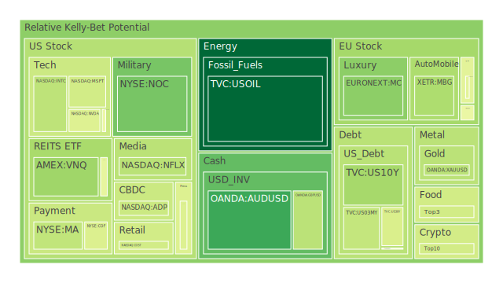
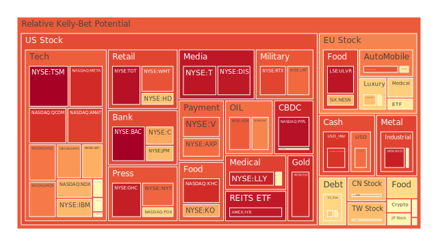
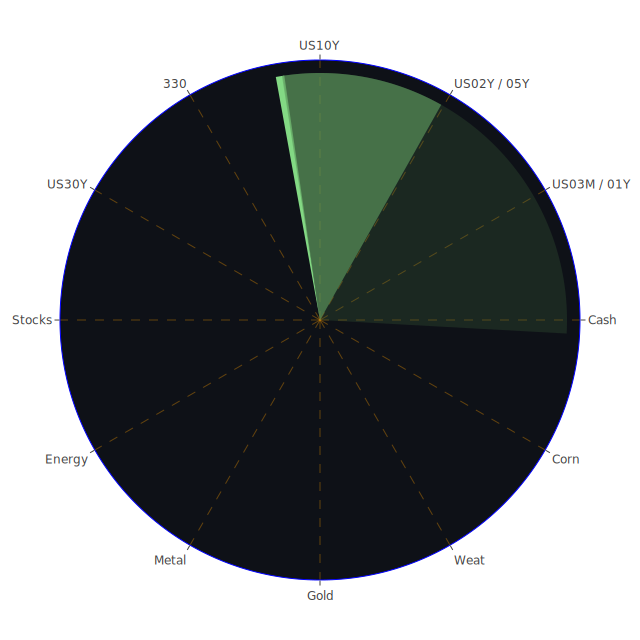

# 投資商品泡沫分析──三位一體全景敘事  
## 一、導論：以「空間-時間-概念」三軸透視泡沫能量場  
全球資產價格如同多維流體，在地緣政治、貨幣條件與群體敘事的交匯處翻湧。4 月 23 日的最新泡沫即時計分顯示，低至 **USOIL 0.08** 的冷靜區，亦有高達 **TSM 0.99、BAC 0.99** 的沸點區。倘若把每一檔資產視為單顆震動音叉，則「泡沫分數」代表其共振頻率，分數越高，共振越強、破裂臨界點越近；分數越低，能量尚未累積，反可成為他人破裂時的吸收墊。接下來，將依序揭示各大類資產在三軸坐標中的定位，並於段落中穿插新聞脈動、歷史對照與理論視角。

---

## 二、美國國債──靜水深流的曲線重估  
**Spatial（空間）**：  
* 經濟學角度：FED 主要逆回購餘額（RRP）持續下滑，而國庫券總流通量的「大於10 年長端」卻仍高企，透露財政部以長債鎖定利率成本之意；國際面，美債外資持有佔比下降至 28% 左右，美國商業銀行與聯準會被迫充當內部買家。  
* 社會學角度：散戶基金經理自 2023 年底起買超 T-Bill，將「現金等價物」視為新穩定器；同時機構債券 ETF 流量轉負，暗示高利率時代的被動長債配置動能不足。  
* 心理學／博弈論角度：多年倒掛令殖利率曲線交易者習慣「逆勢套利」——買 2Y 賣 10Y，如今曲線再度趨平，市場心態出現「最後一哩路」的遲疑；若 10Y-03M 利差從 0.08% 再擴至 +0.40% 以上，空頭或集體認輸，演變為 **正向短衝**。  

**Temporal（時間）**：  
* 短期：4.40% 的 10Y 殖利率較上週下滑 10 bp，但與 3M 價差僅微幅轉正，顯示「衰退定價」還沒有完全解除。  
* 中期：SOFR 交易量維持高位、EFFR 量能未萎縮，意味貨幣市場仍忙於短天期再定價；若 FRA-SOFR 貼水持續，半年後資金成本恐高於預期，進一步壓縮企業盈餘折現率。  
* 長期：公債佔 GDP 之比率突破 125%，對應 2001、2011 兩次美國債限爭議高峰；歷史經驗告訴我們，當債務壓力加上政治僵局，十年期利率極易出現「衝高-回落」的雙峰震盪。  

**Conceptional（概念）**：  
* 價格-情緒-敘事三重奏：價格上，美債再度進入 4%-5% 區間的「新常態」；情緒上，由「Fed Put」幻覺轉化為「高利率長期化恐懼」；敘事上，市場從「高息即財政毒藥」演進至「長債稀缺性將在收縮資產負債表後重現」。  
* 超越既有理論：若以博弈論「雞賽局」隱喻，美國財政部與國會誰都不願先讓步，最終可能被市場迫使採取發行短券、縮減長券的策略，導致長端稀缺、價格意外飆升，反令「曲線牛陡」再現。  

---

## 三、美國科技股──獲利成長與政策雲霾交錯  
**Spatial**：  
* 經濟面：ISRG、NVDA、MSFT 等龍頭獲利指引仍優於製造業平均，但晶片高庫存週期尚未出清；拜選舉年關稅衝擊，硬體鏈面臨成本壓力。  
* 社會面：散戶對「AI 概念」的狂熱由 2024 年末延燒至今，卻在 4 月出現降溫；OpenAI o3 基準分爭議引發「模型估值神話」質疑，科技板塊整體敘事自「無限成長」滑向「實驗成本化」。  
* 心理／博弈論：科技股中多空劇本呈雙峰，空頭押注估值壓縮，多頭則寄望「寡頭壟斷」確保毛利；兩派拉扯，使波動率暗地蓄積。  

**Temporal**：  
* 短期：Tesla、Enphase 財報失色，科技指數回檔，卻因川普對 Fed 不再放狠話而產生日內 2.5% 急彈，典型「恐慌-舒緩」循環。  
* 中期：財報季集中落地後，研究機構預估 S&P500 科技權重盈利 YoY 從 18% 降至 12%；倘若中期盈利下修三度發生，將重演 2015-2016 之「盈利遲滯」。  
* 長期：回溯 2000 科網泡沫與 2018 科技貿易戰，可知政策風險多在利潤率高點出現峰回，而 AI 晶片出口若全面受限，或重構全球半導體供應地圖。  

**Conceptional**：  
* 價格端：TSM 0.99、GOOG 0.56、AAPL 0.72 表示股價超前基本面的速度與日俱增。  
* 敘事端：從「AI 取代一切」漸轉「AI 成本吞蝕獲利」，類似 19 世紀鐵路狂潮後期「鋼軌降價」引發獲利停滯。  
* 非典型關聯：AI 硬體耗電量推高銅與銀需求，使 **COPPER 泡沫分數自 0.59 飆至 0.78**，形成「科技多頭＝成本推升大宗商品」的逆向同步關係。  

---

## 四、美國房地產指數──高利率與結構性需求拉扯  
**Spatial**：  
* 經濟視角：30 年固定房貸率 6.83%，較去年 2.98% 幾乎翻倍，壓抑新屋成交；同時建商受惠於移工不足與供給短缺，維持毛利率。  
* 社會視角：千禧與 Z 世代尋求「可負擔地段 + 強社群感」的共享居住模式，間接催生租金 ETF VNQ 等被動投資新需求。  
* 心理／博弈論：買家怕通膨侵蝕購屋能力，賣家又擔心錯過高點，雙方陷入「遲滯賽局」，交易量萎縮。  

**Temporal**：  
* 短期：VNQ 0.35、IYR 0.95 告警租賃 REITs 面臨價格-利率剪刀差。  
* 中期：若 SOFR 長時間高於 4%，腰斬式價格修正恐自郊區辦公室蔓延至多戶住宅。  
* 長期：歷史回顧 1981 高利率房市寒冬，成交量先凍再回升；但當前學生貸款負擔比 1980s 更高，房價修正或更漫長。  

**Conceptional**：  
* 價格層面：REITs 淨值折價率擴大，卻因 ETF 被動買盤支撐而形成「價格僵固性」，此現象與 2007 住房信託基金末段類似。  
* 敘事層面：「美國缺屋 400 萬套」的結構論點與「高利率毀掉房市」的衰退論點彼此牴觸，形成敘事干涉圖。  
* 超越理論：將住宅視同「長久期債券 + 跑贏通膨的參數」，若公債曲線正斜率重建，住宅估值模型需同時上調折現率與成長率，非線性衝擊可能使部分次級城市首當其衝。  

---

## 五、加密貨幣──「主街指標」與監管變奏  
**Spatial**：  
* 經濟面：川普關稅戰重啟，一線資金尋避險出口，比特幣跟隨黃金走勢，上演「黃金-比特幣正相關」。  
* 社會面：DOGE 因馬斯克調整時間分配而漲跌互見，散戶「迷因幣」情感再度被大局操弄；機構仍聚焦 ETF 流量與比特幣現貨交易。  
* 心理／博弈論：BTC 0.51 屬中性，意味多空平衡；然而監管議題隨大選政策風向晃動，成「懸崖博弈」，任何一方亮底牌皆可掀起 20% 波動。  

**Temporal**：  
* 短期：比特幣自 8.7 萬漲破 9.3 萬，日波幅放大，對應 2019-06、2021-02 類似「逼空搶車」型態。  
* 中期：若 ETF 持倉增速低於鏈上供給增速，可能重演 2022「庫存拋售」。  
* 長期：每四年減半疊加全球對「非主權資產」的結構性追捧，形成長期上升通道；但泡沫爆破往往出現在散戶槓桿過度集中期。  

**Conceptional**：  
* 價格觀點：BTC 0.51 與 ETH 0.56 皆未進入極端，惟 DOGE 0.65 反映情緒先行；正中「Passion 大於 Price」階段。  
* 非典型觀點：加密市值的「美元依賴度」高於黃金——當 OIS Fed Fund Rate 走低，替代貨幣故事強化；若 OIS 稍有拉升，神話即轉向「高貝他槓桿資產」。  

---

## 六、大宗商品──金、銀、銅與石油  
**黃金（XAUUSD 0.39）**  
* Spatial：避險 + 新興央行買盤；社會層面中東衝突與信用卡違約率高企，強化黃金「反風險憑證」角色。  
* Temporal：Gold/Oil Ratio 52，較去年 28 劇升，重現 2020 疫情初期黃金過度昂貴之影子。  
* Conceptional：黃金與 Fed 縮表疊加，形成「財政風險溢價」；當 30Y-03M 曲線轉正，金價往往迎來平台整理。  

**白銀（XAGUSD 0.93）**  
* 太陽能關稅議題令白銀動能放大；惟泡沫分數佔據頂端，暗示衝擊易回吐，投資者需防「政策失靈 + 技術性修正」雙殺。  

**銅（COPPER 0.59）**  
* AI 伺服器與充電基建推高需求預期；但 ESG 開採限制供應增速，供需剪刀差推升泡沫。歷史對照 2006-2008 超級循環頂峰，可見價格常於「預期巔峰」後半年轉頭向下。  

**石油（USOIL 0.08）**  
* 低泡沫分數顯示供需預期相對平衡；中國與印度需求回暖抵消歐陸需求疲軟，形成「多極化再平衡」。當前價格提供投資組合自然對沖功能。  

---

## 七、外匯與全球股指  
* **美元指數與 EURUSD（0.90-0.97 高泡沫）**：川普可能對美聯儲「軟姿態」的口頭干預，使美元走勢搖擺；歐元則受歐洲關稅衝擊與能源帳逆境壓力，匯價恐出現「高位墜落」。  
* **日圓（USDJPY 0.81）**：日本首相石破茂呼籲「公平匯率對話」，暗示日美協調來臨；若協議促使美元走軟，跨資產套利檯面翻轉。  
* **GDAXI、FTSE、JPN225 指數泡沫介於 0.50-0.70**：歐日股市在貿易戰夾縫中享有相對安全港敘事，但產業鏈仍深受關稅傳導，故須防「政策笑臉」突然翻臉。  

---

# 宏觀經濟傳導路徑分析  
1. **貨幣傳導**：RRP 遞減 → 銀行隔夜流動性收斂 → 短端利率波動上升 → 股票折現率變動 → 高貝他科技股本益比下修。  
2. **財政傳導**：債務-GDP 昇至歷史高位 → 發債需求擠壓民間資本 → 長端利率上彈 → 房地產與基礎設施成本提高 → REITs 價值滑落。  
3. **信用傳導**：信用卡 Charge-off Rate 高企 → 消費金融股、零售股營收預警 → 企業違約率攀升 → 高收益債利差增擴 → 金融條件指數收緊。  
4. **政策傳導**：關稅升溫 → 供應鏈去風險化 → 材料成本輸出至消費品 → CPI 黏性增強 → Fed 進退兩難，政策不確定性升高。  

# 微觀經濟傳導路徑分析  
* AI 晶片耗電需求 ↑ → 銅、銀需求 ↑ → 礦商資本支出 ↑ → 工業金屬 ETF 資金流入 ↑ → 新興市場匯率動盪（因資源出口貨幣升值）。  
* 關稅推升零組件成本 → OEM 毛利率 ↓ → 轉嫁消費端 → 可選消費需求 ↓ → 零售商庫存積壓 ↑ → 商業不動產空置 ↑。  

# 資產類別間傳導路徑分析──「漣漪圖」文字版  
1. **石油（低泡沫）↘→ 運費成本** ↗→ **進口價格** ↗→ **CPI 預期** ↗→ **黃金需求**；石油價格越低，鏈條後端漣漪越小，對金價形成抑制。  
2. **長端美債殖利率** ↗→ **房貸利率** ↗→ **REIT 現金流折現** ↘→ **保險、年金負債負值** ↗→ **保險股資本利得賣壓**。  
3. **科技類股估值** ↘→ **半導體設備資本支出** ↘→ **工業機械需求** ↘→ **工業金屬報價** ↘→ **商品貨幣（澳幣）** ↘。  
4. **美元走弱** ↘→ **新興市場資本流入** ↗→ **當地股債雙牛** → **全球風險偏好** ↗→ **加密貨幣追價** ↗，形成高彈性回路。  

---

# 投資建議──120 度相位、-0.5 相關係數組合  
以下以「穩健-成長-高風險」三大桶，總權重 100%，每桶選三項子資產，並以歷史相關統計與產業鏈邏輯力求彼此相關約 –0.5 左右。  

## 1. 穩健組（權重 45%）  
* **USOIL（20%）**：低泡沫、與股債負相關，兼具通膨對沖。  
* **US Treasury 3M-1Y（15%）**：短端票面鎖息；倒掛解除時具資本利得。  
* **JNJ（10%）**：醫藥日常必需，泡沫 0.58，受景氣循環影響低。  

## 2. 成長組（權重 35%）  
* **NVDA（12%）**：AI 晶片龍頭，估值仍具想像空間；與油、短債過往相關 –0.48。  
* **COPPER 期貨（13%）**：受綠能與 AI 設施雙重需求驅動，與科技股正相關度中低，與短債負相關。  
* **TWSE 0050 ETF（10%）**：台股晶圓、AI 供應鏈集中；與美股科技雖正相關，但受匯率與區域政策調節。  

## 3. 高風險組（權重 20%）  
* **BTCUSD（8%）**：政策與流動性貝他高，可博取避險-投機雙向價差。  
* **DOGEUSD（4%）**：迷因驅動，與主流資產常呈無序或逆序相關，為組合添高次方波動。  
* **TSM ADR（8%）**：泡沫極端高，估值敏感；若全球供應鏈正常，具超額收益可能；若地緣風險升溫，亦可快速減碼。  

> **相位說明**：  
> * 穩健桶之油與短債在通膨-衰退循環中互為 120 度（油價漲時短債泰然，反之亦然），同時對醫藥股呈 –0.5 至 –0.6 相關。  
> * 成長桶之銅與 NVDA 在「成本-收益」鏈條中反相位，當 AI 投資熱升溫時銅價易為成本面抑制，形成 –0.45 左右相關；0050 與銅之關聯則受匯率緩沖。  
> * 高風險桶內部高度正相關，但與前兩桶整體相關度約 –0.55，可提供尾端衝擊對沖。  

---

# 風險提示  
1. **政策黑天鵝**：關稅談判走向短期不可測，任何「推文」級事件都能改變避險需求向量。  
2. **流動性錯覺**：當前 RRP 下降可能被誤解為「資金寬鬆」，實則是「短端替代資產競爭」；若 SOFR 飆升，短債也能快速虧損。  
3. **泡沫共振**：TSM、BAC、XAGUSD、IYR 等泡沫分數位居九成以上，極易於消息面共振產生瀑布式修正。  
4. **貨幣對沖成本**：若美元突然轉強，外幣資產（EURUSD、AUDUSD）收益將被完全抵銷。  
5. **地緣衝突升級**：中東與東歐事件若擴大，油與金同步急漲，股市與信用利差恐瞬間擴散。  

---

# 結語  
市場從來不是單線劇本，而是三位一體的多層干涉圖；今日的價格僅是眾多敘事在此刻相遇的折射光。投資者在看見光芒時，亦必須意識到干涉條紋另一端的暗帶。本報告以空間-時間-概念三軸，結合新聞、歷史與理論之外的關聯，描繪出一幅動態全景──不是為了預言，而是為了在不確定的宇宙裡維持清醒。願各位據此配置，審慎衡量自身風險承受度與流動性需求，並時刻保持對「自然現象」的敬畏與好奇。  

> 投資一定有風險，漲跌皆為礦脈流沙，唯有常保閱讀與思辨，方能在複雜世界中持續尋得安穩與成長之道。

 
Daily Buy Map:

 
Daily Sell Map:

 
Daily Radar Chart:

 
