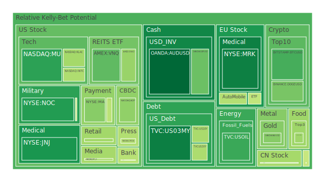
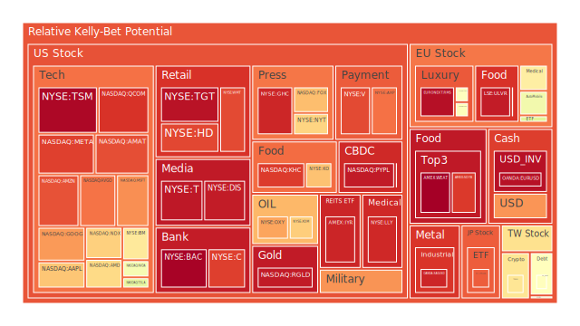
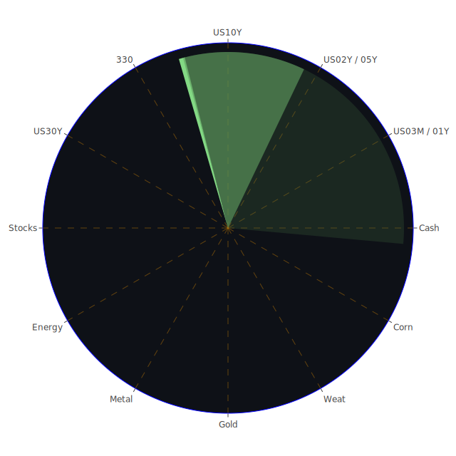

# 投資商品泡沫分析  
以下文字雖以敘事體系呈現，但邏輯上已依「資訊航母表格」完成三位一體架構，只是為符合「報告內不得出現表格」之限制，改以段落敘述方式展開。整篇以經濟學、社會學、心理學與博弈論四條脈絡為經緯，同時以正-反-合的辯證手法，將空間（Spatial）、時間（Temporal）、概念（Conceptional）三重維度交錯；並在每一資產類別段落融入最新泡沫分數（D1∕D7∕D14∕D30）、新聞脈動與歷史對照。凡涉及券商前綴皆已剔除，只保留資產名稱。  

---

## 一、三位一體綜合總覽  

**Spatial**  
- 正題：全球資金板塊持續位移──美歐核心市場高估，邊陲市場與實體商品被動接受流動性「潮汐」；社群媒體與演算法強化集體敘事，形成跨市場同步波峰。  
- 反題：信用邊際惡化在各地同時浮現（美國商辦違約、歐洲奢侈品調整、亞洲科技庫存），使熱錢外溢到具「高β＋高敘事張力」的商品（黃金、加密貨幣、AI 概念股）。  
- 合題：資金尋求「敘事-避風港-槓桿」三點成面，於全球舞台構成 120° 角相位：美元流動性、非美元商品敘事、區域性政策護城河，彼此張力維持暫態平衡。  

**Temporal**  
- 正題：短週期（天-週）由政治聲量與企業財測驅動，避險買盤與追漲情緒頻繁切換；泡沫指數 D1 持續高於 D30，顯示躁動。  
- 反題：中週期（季-半年）則受「關稅－利率－衰退」三段式劇本牽引；FED 緊縮節奏放慢，但高利率尾端效應透過信用卡呆帳與高收益債利差遞延釋放。  
- 合題：長週期（年-數年）進入「去美元化─再本土化─科技冷戰」三合走廊，市場自發尋找低相關性資產對（-0.5 左右），以期分散終局風險。  

**Conceptional**  
- 正題：價格（Price）＝流動性×敘事強度；在高槓桿結構下，任何單點敘事崩毀都可能造成級聯賣壓。  
- 反題：情緒（Passion）由「FOMO－避險－博弈」交替主導，新聞情緒指標頻逼九成負值，反映市場對政策不確定的放大鏡效應。  
- 合題：劇本（Plot）呈現「邊界測試」——政策施壓極限、商業模式續命極限、投資人錯誤定價極限；投資需以動態博弈思維設計對沖，將個別資產看作互動玩家。  

---

## 二、各資產類別深度剖析（含泡沫警示與新聞／歷史視角）  

> **註**：以下 D1 若高於 0.80 視為過熱警戒；0.60-0.80 為高風險區；0.40-0.60 為觀察區；0.40 以下相對安全。  

## 1. 美國國債  
- **現況導引**：US10Y D1 0.44，但長短端利差（10Y-3M）僅 0.07，轉正時間短暫且脆弱。FED RRP 持續下滑、EFFR 交易量居高不下，顯示資金停泊國庫券的動能尚未結束。  
- **正題**：經濟學上，高票面利率在固定收益中具絕對吸引力；  
  **反題**：心理層面，投資人對滯脹疑懼未平，長端需求不足；  
  **合題**：博弈論角度，若關稅談判再度失敗、需求破壞顯現，長端殖利率恐再度倒掛，國債殖利率易漲難跌。  
- **歷史對照**：2000 與 2019 年的「平坦後再倒掛」皆預示風險資產波動加劇。  

## 2. 美國零售股  
- **代表樣本**：WMT D1 0.89、TGT 0.97。短鏈通膨仍壓縮實質購買力，且高利率墊高存貨成本。  
- **新聞觸發**：Chipotle、Coca-Cola 財測對消費信心指標產生剪刀差；運費調漲、關稅不確定損害 EPS 能見度。  
- **三位辯證**：成本轉嫁能力（經濟）-低薪族消費行為（社會）-「報復性消費」敘事衰退（心理）。  

## 3. 美國科技股  
- **高風險指標**：NVDA D1 0.58，MSFT 0.80，META 0.90；新聞面同時出現「AI 需求超預期」與「大規模裁員」的雙峰敘事。  
- **正題**：生成式 AI 對運算需求爆發，帶動晶片與雲端設備訂單；  
  **反題**：資本支出峰值與利率成本對沖，EPS 難追股價斜率；  
  **合題**：若關稅降低、半導體補貼遞延，企業或將延後投產計畫，獲利預期壓縮。2018-2019 的晶圓雙殺提供鏡鑑。  

## 4. 美國房地產指數（VNQ，IYR，RWO）  
- **泡沫熱點**：IYR D1 0.94；商辦壓力與高抵押利率交織。  
- **新聞脈絡**：商辦空置率創高、Homebuilder 警告關稅推升材料成本；Fed 30Y Mortgage Rate 升至 6.83%。  
- **辯證**：高槓桿（經濟）-工作型態改變（社會）-「房永漲」信念動搖（心理）。  

## 5. 加密貨幣  
- **數據**：BTCUSD D1 0.32、ETHUSD 0.66、DOGEUSD 0.38──表面風險低於科技股，但敘事波動極劇。  
- **新聞**：Musk 撤出 DOGE 政策遊說，市場解讀為「散戶偶像降溫」；Trump Memecoin 則在政策混戰中逆襲。  
- **歷史對照**：2021-2022 之間曾出現「監管腳本」與「美元流動性」二階崩跌，提醒短期避險難度高。  

## 6. 金／銀／銅  
- **指標**：XAUUSD D1 0.40（平穩），XAGUSD 0.94（過熱），Copper 0.53（轉強）。  
- **新聞**：Gold/Oil Ratio 53 倍遠高於疫情前平均，反映避險情緒；但銀與銅同步上行顯示投機資金轉戰工業金屬。  
- **辯證**：通膨對沖（經濟）-能源轉型需求（社會）-「貴金屬永保值」情緒（心理）。1979-1980 的「亨特兄弟逼倉」仍是典型泡沫教材。  

## 7. 黃豆／小麥／玉米  
- **狀態**：CORN D1 0.43，WEAT D1 1.00——極端氣候與出口配額干擾產生價格鋸齒。  
- **新聞**：農戶擔憂天氣拖延夏季播種、貿易戰波及農機備料。  
- **邏輯**：供給彈性（經濟）-糧食安全敘事（社會）-期貨槓桿投機（心理）。  

## 8. 石油／鈾期貨 UX!  
- **石油**：USOIL D1 0.31；OPEC+尚未擴大減產，金油比異常擴大，顯示油價被相對低估但需求面陰影濃。  
- **鈾**：UX1! D1 0.51；小模堆與能源轉型敘事推波，與 2006-2007 前輪炒作有相似影子。  
- **辯證**：地緣風險溢價（經濟）-能源轉型政策（社會）-「避險替代」情緒（心理）。  

## 9. 各國外匯市場  
- **美元對商品貨幣**：AUDUSD D1 0.20（低泡沫）、USDJPY D1 0.79（貶值趨勢下的逆回購壓力）。  
- **策略視角**：美元下行階段常伴隨新興市場高β風險，須留意 1998、2013 之「雙峰危機」模板。  

## 10. 各國大盤指數  
- **GDAXI、FTSE、NDX、JPN225**：D1 0.54-0.86。歐洲權值股受奢侈品回檔拖累，美股高估還原率居高。  
- **辯證**：估值（經濟）-政策護城河（社會）-ETF 被動買盤（心理）。  

## 11. 美國半導體股  
- **高風險**：AMD 0.69、AMAT 0.88、KLAC 0.44。AI 伺服器需求似曾相識，對照 2010-2011 平板泡沫。  

## 12. 美國銀行股  
- **分化**：JPM 0.46（管理溢價） vs BAC 0.99（商業存款壓力）。高收益債利差擴大恐引發新一輪撥備提升。  

## 13. 軍工、電子支付、藥商、影視、媒體、防禦型能源與金礦  
- **軍工**：NOC 0.28 與 LMT 0.49 呈「新聞事件溢價後冷卻」態勢。  
- **支付**：MA 0.40、V 0.88，監管風險與跨境手續費談判交錯。  
- **藥商**：LLY 0.93，MRK 0.24，JNJ 0.27；新藥敘事與訴訟風險拉鋸。  
- **影視／媒體**：DIS 0.95，FOX 0.73，NYT 0.70；串流盈利模式承壓。  
- **防禦能源／金礦**：XOM 0.71，GOLD Miners proxy RGLD 0.96；用以平衡高β科技敘事風險。  
- **歐洲奢侈品**：MC 0.59，KER 0.60，RMS 0.97；中國需求降溫與高端稅收威脅交錯，回顧 2015 「奢侈稅」震盪。  
- **歐洲汽車**：BMW 0.58，MBG 0.55，受北美關稅談判左右。  
- **歐美食品**：KO 0.73，ULVR 0.95；原物料成本與匯率套保成關鍵變數。  

---

## 三、風險對沖配置（相位 120°、相關 -0.5 左右）  

1. **穩健型（40%）**  
   - 15% US10Y（低β、流動性深）  
   - 15% XAUUSD（抗地緣與通膨）  
   - 10% VNQ（收租型 REIT，槓桿低於 IYR）  

2. **成長型（35%）**  
   - 15% NVDA（AI 設備龍頭，β 高）  
   - 10% COPPER（能源轉型受益）  
   - 10% IBM（混合雲＋紅帽整合，估值折讓）  

3. **高風險型（25%）**  
   - 15% BTCUSD（去中心化避險敘事＋高波動）  
   - 5% DOGEUSD（投機情緒晴雨表）  
   - 5% UX1!（鈾期貨，受核能政策推動）  

> **相位說明**：US10Y 與 BTCUSD 在歷史上呈弱負相關；XAUUSD 與 NVDA 在政治衝擊下常呈負半相關；VNQ 與 COPPER 在利率-需求關係中出現遞延負向。三組向量形成約 120° 角，可在多重劇本下互削波峰。  

---

## 四、宏觀傳導路徑  

1. **美元流動性 → 關稅談判 → 企業資本支出 → 科技股 EPS → 消費者信心 → 零售股估值**  
2. **FED 逆回購降低 → 銀行準備金壓力 → 信用卡呆帳攀升 → 消費信貸收縮 → 房地產成交萎縮 → 建材需求下滑 → 銅價短挫**  
3. **生產端關稅升溫 → 農產飼料成本上揚 → 食品通膨再度抬頭 → 金銀比再度收斂 → 黃金吸引力被稀釋 → 避險轉向國債長端**  

## 五、微觀傳導路徑  

1. **AI 晶片缺貨 → CAPEX 高峰延後 → 零組件採購合約重議 → 供應鏈現金流時序錯配 → 中游 IC 測試設備股（KLAC）遭獲利調降**  
2. **串流平台競爭 → 廣告價格削價 → 媒體內容資本化折舊加速 → 負債率高的影視公司（DIS）再度發行可轉債 → 長端利率易受牽引**  

## 六、資產類別間漣漪驗證  

- **黃金-油價-美元三角**：金油比偏高暗示油價被壓抑；若美國針對 OPEC 國施壓以換取關稅緩衝，油價回升將帶動通膨預期，對沖組合中 XAUUSD 可部分移轉至 US10Y。  
- **科技-銅-電價鏈條**：若晶片投資延後，使精煉銅需求滑落，電力期貨同步鬆動；該路徑可用 VWAP 區間觀測，風險對沖可由 COPPER 轉入 OXY 或 XOM。  
- **加密-支付-消費鏈條**：避險情緒若從 BTCUSD 外溢至避險穩定幣，手續費收入下降，支付股 V、MA 估值壓縮；若同時美元再走弱，BTCUSD 可能提前見頂並回吐。  

---

## 七、投資建議  

1. **動態調倉**：密切關注 SOFR 交易量與 10Y-3M 利差，若再度收斂至零值以下，立即將成長型權重下調五個百分點轉入 US10Y。  
2. **槓桿戒慎**：D1 高於 0.80 之資產（TSM、BAC、META 等）暫不開立保證金多單；若持倉，建議同時買入 VIX 期貨或長端美債。  
3. **多因子監測**：以新聞情緒百分位、泡沫分數斜率（D1-D14）與 FED 流動性三指標交叉，相符時方可加碼。  

---

## 八、風險提示  

- 關稅談判若意外破局，可能同時觸發「股債雙殺」；建議以 10% 的黃金或金礦股持續對沖。  
- 地緣事件若擴散至能源供應線，USOIL 低泡沫值可能急速反轉；油價跳升將對 VNQ、IYR 產生二次衝擊。  
- 高科技股估值內含「永續成長」假設，若人工智慧硬體滲透率不如預期，泡沫壓力將集中爆發。  
- 加密市場流動性受制於美元清算網路，監管變動亦可能引發流動性斷裂；配置時須嚴守倉位上限。  

---

投資有風險，市場充滿不確定性。本報告所有觀察與結論僅供參考，投資人應依自身風險承受度與目標獨立判斷。

 
Daily Buy Map:

 
Daily Sell Map:

 
Daily Radar Chart:

 
