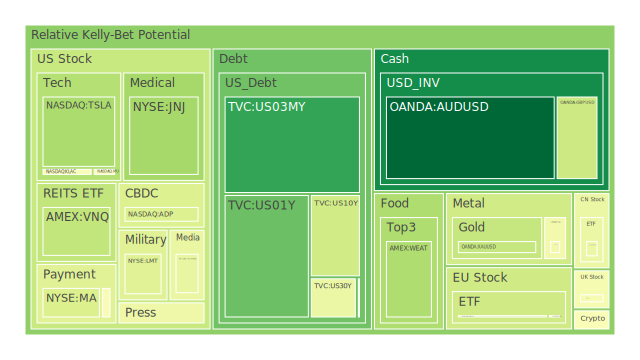
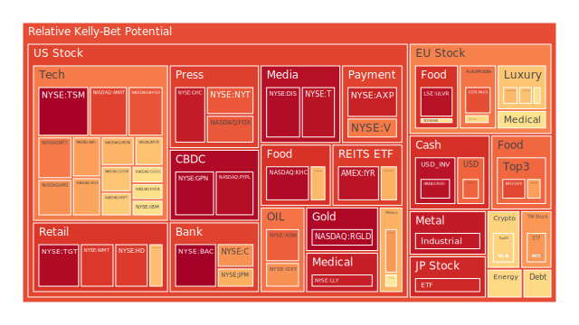
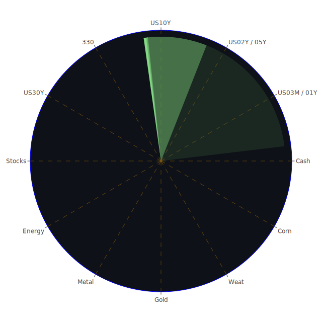

## **投資商品泡沫分析**

在當前錯綜複雜的全球經濟環境下，評估各類資產的潛在泡沫風險，並理解其背後的驅動因素，對於制定審慎的投資策略至關重要。以下將針對各主要資產類別，結合近期價格（PP100）與風險指標（D1, D7, D14, D30），輔以經濟學、社會學、心理學、博弈論等多維度視角，並參考歷史經驗與新聞事件，進行分析。

* 美國國債 (US Treasuries)  
  觀察美國各期限國債，截至2025年4月25日，殖利率呈現微妙格局。短期國債如3個月期 (US03MY，現價4.31，D1約0.14) 和1年期 (US01Y，現價3.98，D1約0.21) 的短期風險指標相對較低，但月平均風險(D30)仍在0.4以上，顯示短期資金尋求避險的同時，對未來利率路徑仍存不確定性。中長天期如5年期 (US05Y，現價3.93，D1約0.50)、10年期 (US10Y，現價4.32，D1約0.39) 和30年期 (US30Y，現價4.78，D1約0.45) 的風險指標處於中等水平，且D7/D14/D30指標相對穩定或略有下降。從歷史角度看，殖利率曲線的平坦化（例如10年期與3個月期利差 US Yield 10Y-03M 接近零）往往預示經濟增長放緩的可能。近期FED的鷹派發言（3次鷹派 vs 0次鴿派）以及持續相對較高的EFFR交易量、高位的銀行存款與貨幣市場基金總資產，共同描繪出一幅流動性充裕但信貸環境趨緊的圖景。心理層面上，市場參與者在通膨數據 (CPIYOY 2.4%，低於去年) 與央行鷹派立場之間進行博弈，試圖判斷未來利率走向。新聞中關於川普無意解僱鮑威爾的言論，雖短暫提振市場，但根本性的不確定性依然存在。社會層面，政府公共債務佔GDP比例持續上升，引發對長期財政健康的擔憂。整體而言，國債市場反映了對經濟前景的謹慎預期與政策不確定性的拉鋸。  
* 美國零售股 (Retail Stocks)  
  以沃爾瑪 (WMT，現價95.84，D1約0.88) 和塔吉特 (TGT，現價95.31，D1約0.97) 為代表的零售股，以及好市多 (COST，現價975.48，D1約0.66) 均呈現較高的風險指數，特別是TGT的D1接近極值，雖然其D30風險略有下降。這反映了市場對消費者支出韌性的擔憂。經濟學角度，儘管部分數據如資本第一銀行 (COF) 的利潤增長顯示消費者仍具彈性，但信用卡拖欠率 (Charge-off Rate on Credit Card) 和消費者拖欠率 (Consumer Delinquent) 的相對高位，暗示了潛在的壓力。社會心理學上，高通膨的記憶、利率上升對借貸成本的影響、以及新聞中提及的對經濟前景的悲觀情緒（CEO信心達金融危機以來低點），都可能抑制消費意願。關稅相關新聞（如PulteGroup警告關稅壓力）也可能間接影響消費者成本和零售商利潤。零售業績是經濟健康的重要指標，其高風險狀態值得警惕。歷史上，消費降級或消費信心滑落往往是經濟週期的轉折信號。  
* 美國科技股 (Tech Stocks)  
  科技股板塊呈現分化。大型科技股如微軟 (MSFT，現價387.30，D1約0.64)、谷歌 (GOOG，現價161.47，D1約0.60)、亞馬遜 (AMZN，現價186.54，D1約0.66)、蘋果 (AAPL，現價208.37，D1約0.72) 和Meta (META，現價533.15，D1約0.69) 的短期風險指標處於中高水平，但META的周、月平均風險 (D7/D30) 均超過0.9，顯示其泡沫擔憂尤為顯著。納斯達克100指數 (NDX，現價19214.40，D1約0.71) 也處於相似的風險區間。經濟學上，科技股對利率變動高度敏感。儘管FED數據顯示流動性充裕，但高利率環境和潛在的經濟放緩預期對估值構成壓力。社會層面，科技巨頭面臨反壟斷審查、數據隱私爭議（如Instagram創始人與祖克柏的矛盾新聞），以及AI倫理等問題，都可能影響其長期發展。心理學上，市場對科技股存在路徑依賴和“害怕錯過”（FOMO）情緒，但也對高估值和監管風險感到不安。博弈論角度，投資者在科技股的長期增長潛力與短期宏觀逆風之間權衡。歷史上，科技泡沫破裂（如2000年）往往伴隨著估值極度擴張和宏觀環境轉向。  
* 美國房地產指數 (Real Estate Index)  
  以 VNQ (現價87.16，D1約0.36) 和 IYR (現價92.33，D1約0.95) 為代表的房地產指數顯示出截然不同的短期風險信號，但兩者的月平均風險(D30)都相對較高（分別為0.48和0.75）。IYR 的D1風險急劇升高值得關注。這反映了房地產市場內部的複雜性。經濟學角度，30年期固定抵押貸款利率 (Fixed Morgage 30Y Rate) 處於6.81%的高位（顯著高於去年同期），直接抑制了購房需求和再融資活動。同時，商業地產拖欠率 (Commercial Real Estate Delinquent) 和房地產整體拖欠率 (Real Estate Delinquent) 處於相對高位，顯示該領域面臨壓力。新聞中，PulteGroup警告關稅對房價的壓力，亦增添了不確定性。社會心理層面，高房價和高利率使得購房可負擔性下降，可能導致市場降溫。歷史經驗表明，房地產週期與信貸週期密切相關，當前的信貸收緊和高拖欠率是潛在風險信號。  
* 加密貨幣 (Cryptocurrencies)  
  比特幣 (BTCUSD，現價93710.00，D1約0.49) 和以太坊 (ETHUSD，現價1763.50，D1約0.64) 的風險指標處於中等偏高水平。狗狗幣 (DOGEUSD，現價0.1818，D1約0.61) 風險亦相近。加密貨幣市場高度受到市場情緒和流動性影響。經濟學上，其與風險資產（如科技股）的相關性時有體現。FED數據顯示的充裕流動性可能為其提供支撐，但監管不確定性和宏觀經濟風險是主要制約。社會心理學角度，加密貨幣社群文化、名人效應（如馬斯克關於DOGE的新聞）和投機心理是價格波動的重要推手。博弈論觀點，投資者在押注其未來應用（如價值儲存、去中心化金融）與擔憂其內在價值和監管打擊之間博弈。近期風險指標的波動（D1與D7/D30對比）顯示市場情緒變化迅速。  
* 金/銀/銅 (Precious & Industrial Metals)  
  黃金 (XAUUSD，現價3356.32，D1約0.36) 的短期風險相對溫和，但周、月平均風險維持在0.4左右，顯示其作為避險資產的吸引力仍在，但並未出現極端恐慌性買盤。白銀 (XAGUSD，現價33.65，D1約0.94) 風險指標顯著偏高，特別是與黃金相比，可能反映了其工業屬性疊加投機因素的影響。銅 (COPPER，現價4.88，D1約0.46) 的風險指數處於中等水平，但其D14和D30風險值（0.71和0.85）顯著高於D1，表明其長期看漲預期或風險積累較強。經濟學上，黃金通常被視為抗通膨和避險工具，其價格受到實際利率、美元強弱和地緣政治風險影響。金油比 (GOLD OIL RATIO) 和金銅比 (GOLD COPPER RATIO) 處於歷史相對高位，可能暗示相對於能源和工業金屬，黃金的避險價值被市場高度認可。白銀兼具貴金屬和工業金屬屬性，其高風險可能與工業需求預期（如太陽能）和投機交易有關。銅價常被視為經濟的“溫度計”，其風險升高可能反映對未來經濟復甦的預期，但也可能是供應鏈問題或投機推動。社會心理層面，地緣政治緊張（新聞中多處提及衝突和緊張局勢）和對經濟衰退的擔憂會推升黃金需求。  
* 黃豆 / 小麥 / 玉米 (Grains)  
  黃豆 (SOYB，現價21.88，D1約0.86)、小麥 (WEAT，現價4.62，D1約0.32) 和玉米 (CORN，現價19.13，D1約0.72) 的風險指標呈現分化。黃豆和小麥的短期風險指標差異巨大，而玉米風險居中。WEAT的D1風險從前一日的1.0驟降至0.32，波動劇烈。農產品價格受到供需基本面（天氣、種植面積、庫存）、地緣政治（影響出口）、能源成本（影響化肥和運輸）以及投機資金的多重影響。經濟學上，全球糧食供應鏈的穩定性至關重要。社會層面，糧食安全問題與地緣政治息息相關。心理層面，對極端天氣事件或供應中斷的擔憂會引發價格波動。博弈論中，國家間的糧食貿易政策和大型農業企業的套期保值行為也影響市場。近期數據的分化可能反映了不同品種 spezifische 的供需情況或資金流動。  
* 石油/ 鈾期貨 (Energy Futures)  
  美國原油 (USOIL，現價62.94，D1約0.62) 的短期風險回升至中等水平，但其D7和D14風險指標（約0.20和0.14）處於低位，表明近期價格波動加大，但中期風險看似受控。鈾期貨 (UX1\!，現價66.15，D1約0.51) 風險處於中等水平，且近期相對穩定。石油市場受到供需關係（OPEC+政策、全球經濟增長需求）、地緣政治風險（中東局勢、俄烏衝突）、美元強弱以及能源轉型政策的影響。經濟學上，油價是通膨的重要驅動因素。新聞中提及能源盜竊（英國）、俄羅斯彈藥庫爆炸等間接關聯事件。社會心理上，對能源供應穩定性的擔憂和環保政策的推進形成拉鋸。鈾作為核燃料，其價格受到核電發展政策、地緣政治（主要生產國穩定性）和能源安全考量的影響。  
* 各國外匯市場 (Forex)  
  美元兌日元 (USDJPY，現價142.84，D1約0.81) 風險仍高，但較前幾日有所下降，可能反映對美日利差巨大但干預風險的博弈。歐元兌美元 (EURUSD，現價1.14，D1約0.96) 風險極高，顯示市場對歐元區經濟前景或美元相對強勢的擔憂。英鎊兌美元 (GBPUSD，現價1.33，D1約0.38) 風險相對溫和。澳元兌美元 (AUDUSD，現價0.64，D1約0.01) 風險驟降至極低水平。外匯市場是全球宏觀經濟預期、利率差異、資本流動和風險偏好的集中體現。經濟學上，購買力平價理論和利率平價理論是長期匯率的錨，但短期波動受多重因素影響。社會心理層面，市場對主要經濟體政策（如FED鷹派 vs. 其他央行）的解讀差異導致貨幣相對強弱變化。博弈論角度，央行干預預期（如日本央行對日元貶值）與市場趨勢力量的對抗是常見戲碼。  
* 各國大盤指數 (Global Indices)  
  除美國指數外，日本日經225 (JPN225，現價35547.18，D1約0.92)、英國富時100 (FTSE，現價8437.90，D1約0.47)、德國DAX (GDAXI，現價22173.40，D1約0.37)、法國CAC40 (FCHI，現價7553.20，D1約0.48) 和中國滬深300 (000300，現價3784.36，D1約0.45) 以及台灣加權指數相關ETF (0050，現價161.90，D1約0.73) 的風險水平各異。日本指數風險最高，歐洲指數風險相對較低，中國指數風險居中，台灣指數風險較高。這反映了各國經濟基本面、貨幣政策、地緣政治風險和市場結構的差異。例如，日元貶值可能提振了日本出口企業的盈利預期，但同時累積了高風險讀數。歐洲市場可能受到能源價格、俄烏衝突和自身經濟週期的影響。中國市場則在經濟復甦力度、房地產問題和政策支持之間尋找平衡。  
* 美國半導體股 (Semiconductor Stocks)  
  半導體行業股票如英偉達 (NVDA，現價106.43，D1約0.60)、AMD (AMD，現價94.47，D1約0.74)、英特爾 (INTC，現價21.49，D1約0.78)、高通 (QCOM，現價147.21，D1約0.65)、應用材料 (AMAT，現價150.17，D1約0.87)、科磊 (KLAC，現價689.42，D1約0.49)、美光 (MU，現價77.42，D1約0.49) 和台積電 (TSM，現價164.18，D1約0.99) 風險普遍偏高，尤其是TSM的風險指數接近頂點。半導體是現代經濟的基石，但也具有強烈的週期性。經濟學上，其需求受到消費電子、汽車、數據中心、AI等多方面驅動，但也容易受到庫存週期和資本支出的影響。高利率環境對高估值的半導體股構成壓力。社會層面，芯片是地緣政治競爭的核心領域，供應鏈安全和技術主權是各國關注焦點。新聞中的關稅問題可能影響其成本和市場准入。心理學上，市場對AI浪潮寄予厚望，推高了相關股票的估值，但也潛藏著預期過高的風險。歷史上，半導體行業經歷過多次繁榮與蕭條的週期。  
* 美國銀行股 (Bank Stocks)  
  主要銀行股如摩根大通 (JPM，現價244.64，D1約0.70)、美國銀行 (BAC，現價39.58，D1約0.99)、花旗集團 (C，現價68.16，D1約0.74) 和資本第一金融 (COF，現價185.05，D1約0.48) 風險水平不一，但BAC風險極高。銀行業績與宏觀經濟和利率環境密切相關。經濟學上，淨息差是銀行盈利的關鍵，通常受益於陡峭化的殖利率曲線，但當前曲線平坦。FED數據顯示的信貸壓力（高拖欠率、高壞賬率）對銀行資產質量構成威脅。儘管COF和墨西哥Banorte的利潤增長顯示出韌性，但整體信貸環境的惡化是潛在風險。社會心理層面，對金融系統穩定性的擔憂（儘管BTFP和貼現窗口使用率低表明急性壓力不大）可能影響投資者信心。  
* 美國軍工股 (Defense Stocks)  
  洛克希德馬丁 (LMT，現價466.81，D1約0.42)、諾斯洛普格魯曼 (NOC，現價463.07，D1約0.57) 和RTX公司 (RTX，現價121.97，D1約0.73) 的風險指標處於中高位。軍工股受益於地緣政治緊張局勢加劇和國防預算增加。經濟學上，國防開支相對獨立於經濟週期，具有一定防禦性。社會層面，全球衝突和地區不穩定性（新聞中多有提及）直接推動了對軍工產品的需求。心理學上，戰爭或衝突的爆發會刺激對該板塊的關注。歷史上，軍工股在戰爭時期或冷戰時期表現往往較好。目前的風險水平可能反映了市場對持續地緣政治緊張的預期。  
* 美國電子支付股 (Electronic Payment Stocks)  
  Visa (V，現價335.71，D1約0.78)、萬事達 (MA，現價535.46，D1約0.41)、美國運通 (AXP，現價267.32，D1約0.92)、PayPal (PYPL，現價64.77，D1約0.97) 和Global Payments (GPN，現價72.06，D1約0.98) 的風險指標普遍偏高，尤其是AXP, PYPL, GPN接近極值。電子支付行業受益於現金向數字支付的長期轉變，但也面臨日益激烈的競爭和監管壓力。經濟學上，其交易量與消費者支出密切相關。高通膨和經濟放緩擔憂可能影響交易額增長。社會心理層面，支付便捷性和安全性是核心競爭力。高風險讀數可能反映了市場對其高估值、競爭加劇或宏觀經濟逆風的擔憂。  
* 美國藥商股 (Pharmaceutical Stocks)  
  大型藥廠如禮來 (LLY，現價859.73，D1約0.93)、諾和諾德 (NVO，現價62.63，D1約0.60)、嬌生 (JNJ，現價154.93，D1約0.30) 和默克 (MRK，現價79.84，D1約0.58) 的風險水平分化。禮來風險持續處於高位，嬌生風險相對較低。醫藥行業具有防禦性，因其需求相對不受經濟週期影響，但也面臨藥品專利懸崖、政策控價和研發失敗的風險。經濟學上，人口老齡化和醫療保健支出增長是長期驅動力。社會心理層面，新藥研發的突破（如減肥藥、癌症療法）能極大提振公司估值。禮來和諾和諾德的高風險可能與其在特定治療領域（如GLP-1藥物）的巨大成功和市場的高預期有關。  
* 美國影視股 (Entertainment Stocks)  
  迪士尼 (DIS，現價90.01，D1約0.97) 和奈飛 (NFLX，現價1096.87，D1約0.44) 以及派拉蒙 (PARA，現價11.43，D1約0.50) 代表了影視娛樂行業。迪士尼風險指數極高，奈飛和派拉蒙風險居中。該行業正經歷流媒體轉型帶來的激烈競爭和盈利模式挑戰。經濟學上，廣告收入和訂閱用戶增長是關鍵指標，易受宏觀經濟影響。社會心理層面，內容創作的吸引力、品牌忠誠度和用戶體驗至關重要。迪士尼的高風險可能反映了其轉型陣痛、主題公園業務的周期性以及內容成本壓力。奈飛風險相對可控，可能得益於其全球領先地位和盈利改善。  
* 美國媒體股 (Media Stocks)  
  福斯 (FOX，現價45.74，D1約0.83) 和紐約時報 (NYT，現價50.61，D1約0.83) 以及康卡斯特 (CMCSA，現價33.19，D1約0.46) 代表傳統媒體和電信媒體集團。FOX和NYT風險較高，CMCSA風險居中。媒體行業面臨數字化轉型、廣告市場變遷和內容競爭的挑戰。經濟學上，廣告收入對經濟週期敏感。社會心理層面，新聞的公信力、內容的吸引力和政治極化都影響其經營。高風險讀數可能反映了對傳統媒體商業模式和宏觀經濟逆風的擔憂。  
* 石油防禦股 (Oil Defense Stocks)  
  埃克森美孚 (XOM，現價108.63，D1約0.82) 和西方石油 (OXY，現價40.37，D1約0.74) 作為大型石油公司，風險處於較高水平。這些公司受益於高油價，但也面臨能源轉型、環保法規和價格波動的長期挑戰。經濟學上，其盈利與油價直接相關。社會心理層面，ESG（環境、社會、治理）投資理念對其估值構成壓力。新聞中，康菲石油裁員和貝克休斯警示關稅影響，暗示行業可能面臨調整。其高風險可能反映了油價波動性、轉型壓力以及近期業績預期的不確定性。  
* 金礦防禦股 (Gold Mining Defense Stocks)  
  皇家黃金 (RGLD，現價183.60，D1約0.98) 作為黃金權利金公司，風險指數極高。金礦股通常被視為黃金價格的槓桿化投資，但也受到運營成本（能源、勞動力）、礦山品位、地緣政治（礦山所在地風險）和環保法規的影響。其極高風險讀數可能反映了對黃金價格未來走勢的高度敏感性，以及市場對其盈利能力的擔憂或過高預期。  
* 歐洲奢侈品股 (European Luxury Stocks)  
  LVMH (MC，現價499.70，D1約0.60)、開雲 (KER，現價173.24，D1約0.66) 和愛馬仕 (RMS，現價2385.00，D1約0.68) 等歐洲奢侈品股票風險處於中高水平。奢侈品行業對全球經濟狀況，特別是高淨值人群的財富效應敏感。經濟學上，其銷售依賴於消費者信心和可支配收入。社會心理層面，品牌價值、稀缺性和文化象征意義是核心。地緣政治和匯率波動（如歐元強弱）也影響其全球業務。中高風險讀數可能反映了對全球經濟放緩影響奢侈品消費的擔憂，以及對其高估值的考量。  
* 歐洲汽車股 (European Auto Stocks)  
  梅賽德斯-奔馳 (MBG，現價53.81，D1約0.51)、寶馬 (BMW，現價74.80，D1約0.61) 和保時捷控股 (PAH3，現價35.98，D1約0.85) 的風險水平不一，保時捷控股風險較高。歐洲汽車業正經歷電動化轉型、供應鏈挑戰（特別是芯片）和日益激烈的全球競爭（尤其來自中國）。經濟學上，汽車銷售是典型的週期性消費。新聞中提及德國車廠預計中國市場競爭加劇，以及美國可能尋求英國降低汽車關稅，都增加了不確定性。高風險讀數反映了轉型壓力、競爭格局變化和宏觀經濟對需求的潛在影響。  
* 歐美食品股 (Food & Beverage Stocks)  
  可口可樂 (KO，現價72.52，D1約0.67)、卡夫亨氏 (KHC，現價29.64，D1約0.97)、雀巢 (NESN，現價87.44，D1約0.60) 和聯合利華 (ULVR，現價4791.00，D1約0.96) 等食品飲料巨頭風險普遍偏高，特別是KHC和ULVR。食品飲料行業通常被視為防禦性板塊，但目前也面臨成本上漲（原材料、能源、運輸）、定價能力挑戰和消費者行為變化的壓力。經濟學上，成本傳導能力和品牌忠誠度是關鍵。社會心理層面，健康意識提升和對可持續性的關注影響消費趨勢。高風險讀數可能反映了市場對其利潤壓力、高估值或增長放緩的擔憂。

## **宏觀經濟傳導路徑分析**

當前的宏觀經濟環境呈現多重力量交織的複雜局面，其傳導路徑深刻影響著各類資產的表現。

1. **央行政策與利率路徑 \-\> 信貸環境 \-\> 實體經濟與資產估值:**  
   * **起點:** FED維持相對鷹派立場（3次鷹派發言），儘管CPIYOY已降至2.4%。短期利率 (US03MY, US01Y, US02Y) 維持高位，長端利率 (US10Y, US30Y) 雖略有回落但仍處高位，導致殖利率曲線平坦 (US Yield 10Y-03M 近零)。  
   * **傳導:** 高利率環境 \-\> 提高借貸成本 \-\> 抑制企業投資和消費者信貸（尤其體現在高位的30年期抵押貸款利率 Fixed Morgage 30Y Rate 6.81%） \-\> 信用風險上升（高位的信用卡壞賬率、商業地產和消費者拖欠率） \-\> 銀行惜貸（高位的銀行準備金 FED Reserve）-\> 實體經濟活動降溫（CEO信心低迷）。  
   * **影響:** 對利率敏感的成長型資產（科技股 NDX, 半導體 TSM）估值承壓；房地產市場 (VNQ, IYR) 受高利率和信貸收緊雙重打擊；銀行 (BAC, JPM) 面臨信貸質量惡化風險，但可能受益於部分利差；高負債企業壓力增大；現金和短期債券吸引力相對提升。  
2. **全球貿易摩擦與關稅 \-\> 供應鏈與企業利潤 \-\> 通膨與經濟增長:**  
   * **起點:** 新聞中大量提及關稅問題（涉及汽車、科技、能源、塑料、鋼鐵、太陽能等多個行業）。  
   * **傳導:** 關稅增加進口成本 \-\> 企業利潤受損（TSLA, BHGE, ISRG 等發出警告）或成本轉嫁給消費者 \-\> 推高特定領域通膨壓力 \-\> 可能擾亂全球供應鏈布局 \-\> 影響企業投資決策（如現代鋼鐵投資引發爭議） \-\> 拖累全球貿易和經濟增長（IMF下調全球展望）。  
   * **影響:** 受關稅影響的行業（汽車 MBG, BMW, 科技 AAPL, INTC）面臨壓力；可能有利於受保護的國內產業（如美國太陽能股反彈）；增加整體經濟的不確定性，可能推升避險情緒（利好黃金 XAUUSD）。  
3. **地緣政治風險 \-\> 能源與商品價格 \-\> 風險偏好與資本流動:**  
   * **起點:** 新聞提及俄羅斯彈藥庫爆炸、以色列加沙衝突、布基納法索政變圖謀等。  
   * **傳導:** 地緣政治緊張 \-\> 增加能源供應中斷風險（推高油價 USOIL 預期） \-\> 刺激國防開支（利好軍工股 NOC, LMT, RTX）-\> 提升市場避險情緒 \-\> 資金流向避險資產（黃金 XAUUSD, 美元 USDJPY 高位, 美債 US10Y 等）-\> 可能抑制風險資產（股市 NDX, 加密貨幣 BTCUSD）表現。  
   * **影響:** 能源價格波動加大通膨不確定性；軍工板塊受益；避險資產受追捧；風險資產承壓；特定區域（如衝突地區）經濟活動受損。  
4. **流動性狀況與市場情緒 \-\> 資產價格波動:**  
   * **起點:** FED數據顯示EFFR交易量高、RRP下降、貨幣市場基金資產增加、銀行存款高位。  
   * **傳導:** 整體流動性看似充裕，但資金可能從風險較低的RRP流向其他領域（MMF、存款），顯示一定謹慎情緒 \-\> 充裕流動性仍可能追逐特定熱點（如AI概念的半導體 NVDA）或高風險資產（加密貨幣 BTCUSD） \-\> 市場情緒（受新聞、財報、政策預期影響）變化迅速，容易引發資產價格大幅波動（如 WEAT 風險驟降，TSLA 因財報後言論股價跳漲）。  
   * **影響:** 市場波動性可能維持高位；情緒驅動的交易增多；不同資產間的相關性可能快速變化。

## **微觀經濟傳導路徑分析**

在宏觀背景下，微觀層面的事件和數據也通過特定路徑影響市場。

1. **企業財報與指引 \-\> 個股與行業表現 \-\> 市場信心:**  
   * **起點:** 各公司發布財報（TSLA 利潤下滑、ENPH 預期疲軟、COF 利潤增長、ISRG 業績超預期但發出關稅警告等）。  
   * **傳導:** 財報結果直接影響個股股價及其風險評分 (D1 等指標可能隨之變動) \-\> 超預期或不及預期的財報會影響同業或上下游企業的股價（行業聯動效應）-\> 整體財報季的表現會塑造市場對經濟健康狀況和企業盈利能力的整體看法，影響投資者信心。  
   * **影響:** 個股價格劇烈波動；行業估值重估；整體市場情緒受到感染。例如，特斯拉的疲軟業績和對DOGE的言論，不僅影響自身股價，也可能影響市場對電動車行業和馬斯克概念股的看法。  
2. **企業特定事件（併購、醜聞、戰略調整）-\> 公司價值與聲譽 \-\> 投資者行為:**  
   * **起點:** 新聞提及馬斯克減少DOGE投入專注特斯拉、Instagram創始人與祖克柏矛盾、巴斯夫退出新疆、康菲石油裁員、現代鋼鐵投資爭議等。  
   * **傳導:** 公司特定事件會影響其基本面（如裁員影響成本、戰略調整影響未來增長）和市場聲譽（如新疆問題、品牌爭議） \-\> 投資者根據這些信息重新評估公司價值 \-\> 可能引發買入、賣出或觀望行為 \-\> 進而影響股價和交易量。  
   * **影響:** 特定公司股價波動；可能引發對公司治理或社會責任的關注；影響品牌形象和消費者選擇。  
3. **行業內部競爭與創新 \-\> 市場份額與利潤率 \-\> 行業格局重塑:**  
   * **起點:** 新聞提及德國車廠預計中國市場競爭加劇、電子支付行業競爭激烈、大型藥廠在新療法領域的競爭（隱含在LLY, NVO 的高風險中）。  
   * **傳導:** 激烈的市場競爭迫使企業加大研發投入、進行價格戰或尋求差異化 \-\> 創新（如AI、新藥、電動車技術）可能帶來領先優勢，但也伴隨高投入和不確定性 \-\> 競爭格局變化導致市場份額重新分配 \-\> 影響企業的利潤率和長期生存能力。  
   * **影響:** 行業龍頭地位可能鞏固或被挑戰；新興企業獲得機會；整體行業利潤可能受壓或因創新而擴大。例如，半導體行業圍繞AI芯片的激烈競爭正在重塑市場格局。  
4. **監管政策與法律訴訟 \-\> 經營成本與合規風險 \-\> 企業估值與發展前景:**  
   * **起點:** 新聞提及美國法院維持對小企業的關稅、美國尋求英國降低汽車關稅、對科技巨頭的反壟斷擔憂（隱含）、巴斯夫因維吾爾人權報告退出新疆（合規壓力）。  
   * **傳導:** 新的監管政策（如環保、數據隱私、反壟斷）或法律訴訟會增加企業的經營成本和合規負擔 \-\> 可能限制企業的業務擴張或經營方式 \-\> 增加未來盈利的不確定性 \-\> 投資者在估值時會考慮這些風險溢價。  
   * **影響:** 增加企業運營成本；限制某些商業模式；導致罰款或業務拆分；影響投資者對企業長期價值的判斷。

## **資產類別間傳導路徑分析**

不同資產類別之間並非孤立存在，而是通過多種路徑相互影響，形成複雜的市場生態。

1. **利率預期傳導：美債 \-\> 美元 \-\> 全球資產**  
   * **路徑:** 市場對FED政策和美國經濟的預期首先反映在美債殖利率 (US10Y, US02Y) 上 \-\> 美債殖利率變動及與其他主要經濟體利差影響美元匯率 (USDJPY, EURUSD, GBPUSD) \-\> 美元強弱進一步影響以美元計價的商品價格（黃金 XAUUSD, 石油 USOIL, 銅 COPPER），以及新興市場資產（資金流動）和跨國公司（匯兌損益）。  
   * **現狀觀察:** 當前美債殖利率高企且曲線平坦，美元相對強勢（USDJPY, EURUSD 風險高企），可能對黃金、石油價格構成一定壓力（儘管地緣政治提供了支撐），並可能影響依賴美元融資的新興市場。  
2. **風險偏好傳導：科技/加密貨幣 \-\> 廣泛市場 \-\> 避險資產**  
   * **路徑:** 高波動性的科技股 (NDX, NVDA) 和加密貨幣 (BTCUSD, ETHUSD) 常被視為市場風險偏好的“風向標” \-\> 當這些領先指標大幅下跌時，往往引發市場恐慌情緒蔓延 \-\> 導致更廣泛的股票市場 (FTSE, GDAXI, 0050\) 拋售 \-\> 資金尋求避險，流入傳統避險資產如美國國債 (US10Y)、黃金 (XAUUSD)，或特定避險貨幣（美元 USDJPY 上升，或瑞郎、日元在某些情況下）。  
   * **現狀觀察:** 科技股和加密貨幣風險處於中高水平，若出現大幅回調，可能觸發連鎖反應，推升黃金和美債的需求，打壓其他風險資產。  
3. **通膨預期傳導：商品 \-\> 債券 \-\> 股票**  
   * **路徑:** 原油 (USOIL)、銅 (COPPER)、農產品 (SOYB, WEAT, CORN) 等大宗商品價格上漲 \-\> 可能推升通膨預期 (CPIYOY 的未來走向） \-\> 引發市場對央行更快加息或維持高利率更久的擔憂 \-\> 打壓債券價格（推高殖利率 US10Y）-\> 高利率環境和成本上升壓力進而影響企業盈利預期，對股票估值（尤其是成長股）構成壓力。  
   * **現狀觀察:** 銅價風險持續累積，油價短期反彈，黃豆風險高企，這些可能構成潛在的通膨壓力，儘管當前CPIYOY為2.4%。市場密切關注這些信號對未來利率路徑的影響。  
4. **信貸週期傳導：房地產/信貸市場 \-\> 銀行 \-\> 消費/投資**  
   * **路徑:** 房地產市場 (VNQ, IYR) 的健康狀況和企業/消費者的信貸質量（高位的拖欠率和壞賬率） \-\> 直接影響銀行 (BAC, JPM, C, COF) 的資產負債表和放貸意願 \-\> 銀行信貸收緊會抑制企業的投資擴張和消費者的信貸消費 \-\> 進一步拖累整體經濟增長和相關股票（零售 WMT, TGT, 耐用品等）的表現。  
   * **現狀觀察:** 高位的商業地產和消費者拖欠率，以及部分銀行股的高風險評分，提示信貸週期可能正進入下行階段，這可能對經濟構成逆風。  
5. **供應鏈與成本傳導：原材料/能源 \-\> 製造業/運輸業 \-\> 消費者價格/企業利潤**  
   * **路徑:** 能源 (USOIL)、金屬 (COPPER)、農產品 (SOYB) 等原材料成本上升，或關稅導致進口部件成本增加 \-\> 增加製造業（汽車 MBG, 半導體 TSM）和運輸業的運營成本 \-\> 企業若能成功轉嫁成本，則推高終端消費品價格（影響 CPIYOY 和零售股 TGT）；若無法轉嫁，則侵蝕企業利潤（影響企業盈利和股價）。  
   * **現狀觀察:** 關稅新聞頻發，疊加部分商品價格風險累積，成本壓力是許多行業（如汽車、零售、能源服務）面臨的現實挑戰。  
6. **跨市場情緒聯動：地緣政治 \-\> 避險/風險資產 \-\> 特定行業**  
   * **路徑:** 地緣政治事件（戰爭、制裁、選舉） \-\> 引發市場情緒波動，資金在避險資產（黃金 XAUUSD, 美元）和風險資產（股票 NDX）之間流動 \-\> 同時直接利好特定行業（軍工 LMT, NOC）或利空受影響區域的資產。  
   * **現狀觀察:** 全球多點地緣政治風險持續存在，為黃金和軍工股提供支撐，同時也給全球經濟增長蒙上陰影。

## **投資建議**

基於上述分析，當前市場環境充滿挑戰，但也並非全無機會。投資者應根據自身的風險承受能力、投資目標和對宏觀經濟路徑的判斷，構建多元化的投資組合。以下提供三種不同風險偏好的配置建議，每種配置內部三個子項目的比例總和為100%。

**一、 穩健型配置 (Conservative Portfolio)**

此組合旨在保本增值，規避較大風險，適合風險承受能力較低的投資者。

1. **短期美國國債 (例如 US01Y 或 US03MY) (45%):** 鑒於當前較高的短期利率和相對較低的短期風險評分 (D1分別約0.21和0.14)，短期國債提供了相對安全的收益來源和流動性。雖然FED立場鷹派，但短期利率已在高位，進一步大幅上升空間可能有限。  
2. **黃金 (XAUUSD) (30%):** 黃金的短期風險評分 (D1約0.36) 相對溫和，且在地緣政治不確定性持續、全球經濟增長放緩擔憂存在的背景下，其避險屬性具有配置價值。高位的金油比和金銅比也顯示其相對強勢。  
3. **防禦性消費必需品股票 (例如 NESN 或 ULVR) (25%):** 雀巢 (NESN, D1約0.60) 和聯合利華 (ULVR, D1約0.96) 代表的消費必需品行業，需求相對穩定。儘管其風險評分不低（尤其ULVR），反映了成本壓力或估值擔憂，但相較於週期性行業，其業績波動性通常較小。選擇其中風險相對較低或基本面更穩健者，作為組合中的權益部分，提供長期增長潛力。

**二、 成長型配置 (Growth Portfolio)**

此組合旨在尋求資本增長，願意承擔中等程度的風險，適合對市場復甦持有謹慎樂觀態度的投資者。

1. **大型科技股指數或精選個股 (例如 MSFT 或 GOOG) (40%):** 儘管面臨利率壓力，但領先的科技公司 (MSFT D1約0.64, GOOG D1約0.60) 擁有強大的市場地位、持續的創新能力和健康的現金流。其風險評分雖在中高位，但相較於某些泡沫指數極高的科技股，風險相對可控。可選擇配置於納斯達克100指數 (NDX, D1約0.71) 或精選基本面穩健的龍頭股。  
2. **醫療保健精選個股 (例如 MRK 或 JNJ) (35%):** 醫藥行業兼具成長性和防禦性。選擇風險評分相對較低（JNJ D1約0.30）或估值相對合理、產品線多元化的大型藥企 (MRK D1約0.58)，可以捕捉醫療保健領域的長期增長機會，同時風險相較於高風險的生物科技股更低。  
3. **工業金屬/銅 (COPPER) (25%):** 銅 (COPPER, D1約0.46) 的風險評分雖在中等，但其長期風險指標 (D14, D30) 較高，反映市場可能預期未來工業需求復甦或綠色轉型帶來的需求增長。作為對經濟週期敏感的資產，若全球經濟避免深度衰退，銅價有上行潛力，可作為組合中捕捉週期性機會的部分。

**三、 高風險配置 (Aggressive Portfolio)**

此組合旨在追求高回報，願意承擔較高風險，適合對市場判斷有較高信心且風險承受能力強的投資者。

1. **半導體行業ETF或精選個股 (例如 NVDA 或 AMD) (40%):** 半導體行業處於技術創新的前沿，尤其受益於AI發展趨勢。儘管風險評分普遍較高 (NVDA D1約0.60, AMD D1約0.74)，波動性大，但其高增長潛力也吸引著尋求高回報的投資者。可配置於行業ETF以分散風險，或精選技術領先、市場地位穩固的公司。  
2. **加密貨幣 (例如 BTCUSD 或 ETHUSD) (30%):** 比特幣 (BTCUSD, D1約0.49) 和以太坊 (ETHUSD, D1約0.64) 作為主要的加密資產，提供了與傳統金融市場不完全相關的潛在回報來源。其高波動性和監管不確定性意味著高風險，但對於看好區塊鏈技術長期發展或尋求超額收益的投資者，可適量配置。  
3. **特定主題/轉機股票 (例如 TSLA 或 新興市場指數 000300\) (30%):** 特斯拉 (TSLA, D1約0.31) 雖然近期面臨挑戰且風險評分波動，但其在電動車和儲能領域仍具領導地位，存在困境反轉的可能。或者，選擇配置於新興市場指數如滬深300 (000300, D1約0.45)，以捕捉不同區域的增長潛力，儘管其同樣面臨自身特定的風險。

## **風險提示**

**投資有風險，市場總是充滿不確定性。** 本報告基於截止至2025年4月25日的可用數據和信息進行分析，並融入了多維度的觀察視角，但無法預測所有未來市場變化。數據中的泡沫風險評分 (D1, D7, D14, D30) 僅為量化參考指標，不構成最終的投資決策依據。

宏觀經濟環境、地緣政治局勢、央行政策、技術變革、市場情緒等因素都可能隨時發生變化，對資產價格產生重大影響。特別需要關注的風險包括但不限於：全球經濟超預期衰退、通膨粘性導致利率維持更高更久、地緣政治衝突升級、特定行業監管政策變化、以及高風險資產的泡沫破裂等。

**我們的建議僅供參考，不構成任何投資邀約或保證。** 投資者應充分認識到各類資產的潛在風險，結合自身的財務狀況、風險承受能力、投資期限和投資目標，在必要時尋求獨立的專業財務建議，做出審慎的投資決策。過往業績並不能預示未來表現，投資可能帶來本金損失。

 
Daily Buy Map:

 
Daily Sell Map:

 
Daily Radar Chart:

 
