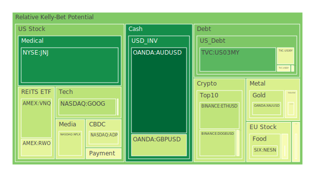
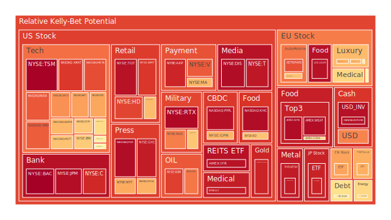
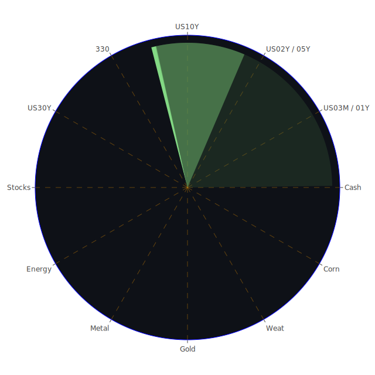

# 投資商品泡沫分析

當前全球金融市場呈現高度複雜且相互關聯的景象。我們將依據提供的數據，從多個維度，包括經濟學、社會學、心理學、博弈論，結合歷史視角與新聞事件，對各主要資產類別進行泡沫風險分析，力求客觀呈現當前市場的潛在風險與機會。我們的分析將嘗試體現空間、時間與概念上的「三位一體」關聯，探索市場、新聞與理論之間的互動。

**美國國債**

美國國債市場作為全球資產定價之錨，其動態備受關注。根據最新數據（2025-04-26），各期限美國國債的泡沫指數（D1）呈現分化：短期國債如三個月期（US03MY, D1: 0.185）和一年期（US01Y, D1: 0.483）的泡沫分數相對較低至中等，而兩年期（US02Y, D1: 0.610）則略高，五年期（US05Y, D1: 0.495）、十年期（US10Y, D1: 0.547）及三十年期（US30Y, D1: 0.448）的泡沫分數也處於中等水平。觀察近期（D7, D14, D30）數據，短期國債泡沫指數波動較大，而中長期則相對穩定在中等區間。

從經濟學角度看，聯準會（FED）釋出的數據顯示，關鍵利率指標如隔夜逆回購（RRP）量降低、有效聯邦基金利率（EFFR）交易量處於相對高位、聯準會總資產處於相對低位、銀行定期融資計畫（BTFP）和貼現窗口使用量低，而準備金（Reserve）處於高位，顯示市場流動性狀況複雜。一方面，充裕的準備金可能抑制短期利率上行壓力；另一方面，聯準會總資產下降和持續的鷹派言論（近期3次鷹派發言，0次鴿派）則對利率構成上行壓力。30年期與3個月期（US Yield 30Y-03M: 0.42）、20年期與3個月期（US Yield 20Y-03M: 0.43）的利差為正，但10年期與3個月期（US Yield 10Y-03M: -0.05）呈現倒掛。歷史上，殖利率曲線倒掛常被視為經濟衰退的先行指標，但此次倒掛伴隨著相對較低的整體消費者物價指數年增率（CPIYOY: 2.40%），情境有所不同。高收益債券利率（High Yield Bond Interest Rate）處於相對高位，暗示市場對信用風險的擔憂仍在。

社會心理學層面，新聞中關於貿易戰不確定性（如 Knight-Swift 財測下調、IMF 對日本央行升息的擔憂、川普關稅言論）可能引發避險情緒，推升對國債的需求，壓低殖利率（提升價格）。然而，持續的鷹派預期和高企的公共債務佔 GDP 比例可能限制這種避險需求的強度。投資者心理在避險需求與通膨/利率預期之間搖擺。

博弈論視角下，市場參與者（投資者、聯儲、外國機構）正在進行一場複雜的博弈。聯儲試圖透過鷹派信號管理通膨預期，但市場似乎並未完全買單，長期利率並未隨短期利率同等幅度上升。外國機構持有的美國國債比例相對較低，可能意味著國際買家在當前價格和匯率水平下的猶豫。

綜合來看，美國國債市場並未呈現極端的泡沫跡象（泡沫指數多在中等水平），但其內部結構（殖利率曲線形態）和外部環境（聯儲政策、地緣政治、貿易摩擦）充滿張力。短期國債受聯儲政策預期影響較大，而長期國債則更多反映對未來經濟增長和通膨的看法。中等泡沫分數可能反映了市場對這些複雜因素的拉鋸，尚未形成一致的極端預期。

**美國零售股**

零售股方面，以目標百貨（TGT）和沃爾瑪（WMT）為代表。目標百貨（TGT）的泡沫指數（D1: 0.957）在2025-04-26達到了非常高的水平，且近期（D7: 0.971, D14: 0.782, D30: 0.848）持續攀升，顯示短期風險急劇升高。沃爾瑪（WMT）的泡沫指數（D1: 0.884）同樣偏高，且近期（D7: 0.858, D14: 0.814, D30: 0.788）也維持在高位。好市多（COST）泡沫指數（D1: 0.668）相對較低，但月平均（D30: 0.513）仍在中等偏上。家得寶（HD）泡沫指數（D1: 0.861）亦處於高位。

從經濟學角度，消費者拖欠率（Consumer Delinquent）和商業地產拖欠率（Commercial Real Estate Delinquent）處於相對高位，信用卡壞帳率（Charge-off Rate on Credit Card）也偏高，這對依賴消費者支出的零售業構成了壓力。然而，美國銀行總存款（US Bank Total Deposits）仍處於高位，顯示部分消費者仍有儲蓄。固定房貸利率（Fixed Mortgage 30Y Rate: 6.81%）上升可能抑制房地產相關消費（影響HD），而高通膨壓力雖然有所緩和（CPIYOY: 2.40%），但累積效應可能影響非必需品的消費。

新聞方面，Chipotle（非直接零售股，但反映消費趨勢）出現疫情以來首次同店銷售下滑（負面，97%），Alaska Air 下調展望（負面，97%），這些信號可能預示著更廣泛的消費放緩。然而，也有如 Knight-Swift 運輸銷售優於預期（正面，95%）的信號，顯示物流需求尚可。

社會心理學上，高泡沫分數可能反映了市場對某些零售商（如TGT、WMT）在壓力環境下維持市場份額和盈利能力的過度樂觀預期，或是資金從其他風險更高的領域輪動至相對「穩健」的消費領域，造成了擁擠交易。歷史上，消費股通常被認為具有防禦性，但在高利率和消費壓力下，其估值仍可能受到衝擊。

博弈論角度，投資者可能在押注這些零售巨頭能夠通過規模效應、供應鏈管理和品牌忠誠度來抵禦經濟逆風。然而，如果宏觀經濟進一步惡化，或者競爭加劇（如新聞中 Windsurf 大幅降價），高估值可能難以為繼。

綜合分析，美國零售股，特別是TGT和WMT，呈現較高的泡沫風險。儘管這些公司可能具備一定的經營韌性，但宏觀經濟壓力（消費者信貸狀況、高利率）和極高的泡沫指數預示著潛在的回調風險。投資者需警惕市場情緒與基本面之間可能存在的脫節。

**美國科技股**

科技股板塊呈現顯著分化。大型科技股如微軟（MSFT, D1: 0.657）、谷歌（GOOG, D1: 0.337）、亞馬遜（AMZN, D1: 0.677）、蘋果（AAPL, D1: 0.716）的泡沫指數多處於中高水平，其中GOOG相對較低。Meta（META, D1: 0.849）泡沫指數非常高，且近期（D7, D14, D30）持續處於極高位。特斯拉（TSLA, D1: 0.547）泡沫指數中等，但波動性較大。

半導體相關股票，如輝達（NVDA, D1: 0.831）、超微（AMD, D1: 0.822）、高通（QCOM, D1: 0.643）、博通（AVGO, D1: 0.740）、應用材料（AMAT, D1: 0.882）、科磊（KLAC, D1: 0.539）、美光（MU, D1: 0.493）、英特爾（INTC, D1: 0.604）和台積電（TSM, D1: 0.989），泡沫指數普遍偏高，特別是AMAT和TSM接近頂點。

經濟學上，科技股對利率變動高度敏感。儘管聯儲維持鷹派立場，但部分市場參與者可能預期未來降息，這對高成長性的科技股估值有利。AI熱潮持續推動相關半導體和軟件公司的需求，如新聞中 Lam Research 營收超預期、Nvidia 供應商 SK Hynix 利潤飆升（儘管提示關稅風險）。然而，貿易戰的不確定性（新聞中多處提及，如美國指責歐盟罰款、川普關稅言論、谷歌關注貿易戰影響、IMF擔憂關稅影響日本央行政策）對高度全球化的科技供應鏈構成威脅。英特爾據報裁員20%（負面，96%）則反映了行業內部的結構性調整和壓力。

社會心理學方面，AI敘事仍在主導市場情緒，投資者對相關龍頭企業抱有極高期望，可能導致估值泡沫化（如META、NVDA、TSM）。歷史上的科技泡沫（如2000年網路泡沫）警示我們，過高的期望往往伴隨著巨大的風險。Musk退出政府工作可能影響DOGE（負面，82%），也間接反映了科技領袖個人行為對市場情緒的影響力。

博弈論視角，投資者在追逐AI趨勢的同時，也在評估貿易戰、監管（如歐盟對蘋果、Meta的罰款）和宏觀經濟放緩的風險。大型科技公司之間的競爭（如Windsurf與Cursor價格戰）也是博弈的一部分。持有高泡沫股票的投資者在享受上漲的同時，也在與潛在的回調風險博弈。

綜合看，美國科技股，尤其是AI相關和大型平台公司，整體泡沫風險處於中高至極高水平。AI帶來的結構性增長機遇與宏觀經濟逆風、貿易摩擦、高估值風險並存。TSM的極高泡沫指數尤其值得警惕。投資者需要仔細甄別個股基本面與市場情緒的差異，認識到高回報預期伴隨著高波動和潛在的大幅回調風險。

**美國房地產指數**

以VNQ（D1: 0.351）和IYR（D1: 0.958）以及RWO（D1: 0.433）為代表的美國房地產指數ETF，呈現出明顯的分化。VNQ和RWO的泡沫指數處於中低水平，而IYR的泡沫指數則非常高。這可能反映了不同指數涵蓋的房地產子行業（如住宅、商業、工業、數據中心）的表現差異。

經濟學上，房地產市場對利率極為敏感。持續上升的30年期固定房貸利率（6.81%，遠高於去年2.96%）顯著增加了購房成本，抑制了需求。商業地產拖欠率（Commercial Real Estate Delinquent）和房地產拖欠率（Real Estate Delinquent）均處於相對高位，特別是辦公樓和部分零售地產面臨結構性挑戰（如遠程辦公趨勢）。然而，新聞中提到三月新屋銷售跳升，顯示部分區域或類型地產仍有需求韌性。

社會心理學角度，對房地產市場的看法往往存在區域差異和情緒波動。高利率環境下，投資者對REITs的派息吸引力與其對利率的敏感性進行權衡。IYR的高泡沫分數可能反映了市場對特定類型REITs（或許是數據中心、物流倉儲或某些住宅領域）的過度追捧，而VNQ和RWO的較低分數則可能反映了對整體市場，特別是受困領域（如辦公樓）的擔憂。

博弈論視角，開發商、業主、租戶和投資者在利率、空置率和租金水平之間進行博弈。高利率增加了再融資的難度，可能迫使部分業主出售資產。投資者則在尋找能夠抵禦週期性壓力、具備長期增長潛力的房地產資產。

總體而言，美國房地產市場整體面臨壓力，但內部結構分化。IYR的高泡沫指數需要特別警惕，可能存在針對特定熱門子行業的投機行為。VNQ和RWO的相對低位可能提供了更安全的切入點，但也反映了市場對廣泛房地產市場復甦的謹慎態度。商業地產的風險尤其值得關注。

**加密貨幣**

比特幣（BTCUSD, D1: 0.486）和以太坊（ETHUSD, D1: 0.350）的泡沫指數目前處於中等水平。狗狗幣（DOGEUSD, D1: 0.369）也類似。觀察近期數據，BTC和DOGE的泡沫指數有所回落，而ETH則相對穩定。

經濟學上，加密貨幣作為一種新興資產類別，其價格受到宏觀流動性、風險偏好、監管政策和技術發展等多重因素影響。聯儲的鷹派立場和縮減資產負債表對風險資產（包括加密貨幣）構成壓力。然而，部分投資者將比特幣視為「數位黃金」，在特定情境下可能展現出一定的避險屬性（儘管波動性遠高於黃金）。Money Market Funds 總資產上升表明部分資金尋求低風險資產，但同時也可能意味著場外有潛在資金等待入市。

社會心理學層面，加密貨幣市場情緒波動極大，容易受到新聞事件和社交媒體影響。例如，新聞中提到Elon Musk退出政府工作可能影響DOGE（負面，82%），凸顯了意見領袖對特定幣種的影響力。投資者群體中既有長期信仰者，也有短期投機者，其行為模式差異巨大，容易形成羊群效應和劇烈的價格波動。

博弈論視角，加密貨幣市場是典型的多方博弈場所，涉及礦工、開發者、交易所、機構投資者、散戶和監管機構。監管政策的不確定性是最大的博弈變數之一。機構投資者的逐漸入場改變了市場結構，但其行為模式與散戶可能存在差異。

綜合來看，主流加密貨幣目前的泡沫指數處於中等水平，相較於歷史高點有所降溫，但其內在的高波動性和易受情緒影響的特點並未改變。中等的泡沫分數可能表示市場在經歷了前期的劇烈波動後，處於一個相對平衡但仍不穩定的狀態，既有潛在的上行空間（如機構採用增加），也面臨宏觀流動性收緊和監管不確定性的下行風險。

**金/銀/銅**

貴金屬黃金（XAUUSD, D1: 0.385）和白銀（XAGUSD, D1: 0.939）的泡沫指數呈現顯著差異。黃金泡沫指數處於中等偏低水平，而白銀則非常高。工業金屬銅（COPPER, D1: 0.457）的泡沫指數處於中等水平，但其月平均（D30: 0.854）非常高，顯示近期有所回落但長期熱度仍高。相關的金礦防禦股如 RGLD（D1: 0.920）泡沫指數也處於高位。

經濟學上，黃金通常被視為避險資產和抗通膨工具。當前相對較低的CPI（2.40%）可能削弱了其抗通膨吸引力，但地緣政治風險和對經濟衰退的擔憂（如殖利率曲線倒掛）為黃金提供了支撐。美元強勢（USDJPY走高）通常對黃金構成壓力，但近期黃金價格與美元的負相關性似乎有所減弱。高企的金油比（GOLD OIL RATIO: 52.58）和金銅比（GOLD COPPER RATIO: 685.06）可能反映了相對於能源和工業金屬，黃金的估值相對偏高，或市場對避險的需求超過了對工業復甦的預期。白銀兼具貴金屬和工業金屬屬性，其高泡沫指數可能與工業需求預期（如太陽能板）或投機性買盤有關。銅價與全球經濟增長預期密切相關，其中等偏高的泡沫指數可能反映了市場對經濟軟著陸或特定工業領域（如電動車、綠色能源）需求的樂觀預期，但近期回落可能與貿易戰擔憂有關。澳洲計劃建立關鍵礦產戰略儲備（新聞，正面，63%）可能對相關金屬價格提供長期支撐。

社會心理學上，黃金具有悠久的價值儲存歷史，在全球不確定性增加時，投資者心理上傾向於增持黃金。白銀由於價格相對較低，更容易吸引散戶投資者，其價格波動性也更大，高泡沫分數可能部分源於散戶的投機熱情。銅價則被視為「銅博士」，其價格波動常被用來判斷市場對經濟前景的整體情緒。

博弈論角度，央行購金、機構配置、散戶投機以及工業用戶的套期保值行為共同影響著貴金屬和銅的價格。白銀的高泡沫指數可能意味著投機者與基本面之間存在較大偏離，增加了回調的風險。

總體來看，黃金泡沫風險相對可控，仍是地緣政治和經濟不確定性環境下的潛在對沖工具。白銀和相關金礦股泡沫風險極高，需謹慎對待。銅價在中期熱度很高後有所降溫，反映了對全球經濟前景的複雜預期，貿易戰是其主要風險點。

**黃豆 / 小麥 / 玉米**

農產品方面，黃豆（SOYB, D1: 0.969）、小麥（WEAT, D1: 0.966）和玉米（CORN, D1: 0.609）的泡沫指數呈現分化。黃豆和小麥的泡沫指數極高，而玉米則處於中等偏高水平。

經濟學上，農產品價格受供需關係、天氣狀況、地緣政治（如影響黑海糧食出口的俄烏衝突）、能源價格（影響化肥和運輸成本）以及美元匯率等多重因素影響。極高的黃豆和小麥泡沫指數可能反映了市場對供應短缺或地緣政治風險的極度擔憂，或是投機資金的大量湧入。歷史上，極端天氣事件或主要出口國的政策變化都曾導致農產品價格飆升。美元強勢通常會壓低以美元計價的農產品價格，但供應端的衝擊可能蓋過匯率影響。

社會心理學角度，糧食安全擔憂在全球範圍內普遍存在，任何供應中斷的信號都可能引發恐慌性購買或囤積，進一步推高價格。農產品期貨市場也容易吸引尋求高波動性的投機者。

博弈論視角，農民、貿易商、食品加工企業和投機者在價格預期、庫存水平和天氣預報之間進行博弈。政府的農業補貼、進出口政策也是影響市場的重要因素。極高的泡沫指數意味著價格對負面消息的反應可能非常劇烈。

綜合來看，黃豆和小麥市場存在極高的泡沫風險，其價格可能已脫離基本面，受到供應擔憂和投機因素的雙重推動。玉米市場風險相對較低，但仍處於較高水平。投資這些資產需要密切關注天氣、地緣政治和供應鏈的最新動態，並意識到潛在的劇烈回調風險。

**石油/ 鈾期貨UX!**

能源方面，美國原油（USOIL, D1: 0.623）的泡沫指數處於中等偏高水平，但近期（D7, D14, D30）指數較低，表明短期內有所降溫。鈾期貨（UX1!, D1: 0.511）泡沫指數處於中等水平。相關的石油防禦股，如埃克森美孚（XOM, D1: 0.870）和西方石油（OXY, D1: 0.781）的泡沫指數則處於較高水平。

經濟學上，油價受OPEC+供應政策、全球經濟需求、地緣政治風險（特別是中東地區）、美元匯率以及能源轉型趨勢影響。中等偏高的油價泡沫指數可能反映了市場在地緣政治風險溢價與需求放緩擔憂之間的平衡。例如，新聞中莫斯科遭襲擊（負面，62%）可能短暫提升風險溢價。石油公司股票（XOM, OXY）的高泡沫分數，可能不僅反映了油價，還包括了公司自身盈利能力、股票回購或分紅政策的吸引力。鈾價則主要受核電發展前景、供應狀況和地緣政治因素（如對俄羅斯鈾供應的依賴）影響，中等泡沫分數顯示市場對其長期前景看法積極但非極度狂熱。

社會心理學上，油價波動直接影響消費者生活成本和通膨預期，容易引發廣泛關注。能源安全擔憂也使得石油公司在特定時期受到投資者青睞。核能在能源轉型中的角色辯論影響著鈾的投資情緒。

博弈論角度，OPEC+國家、非OPEC產油國、消費國、石油巨頭和交易員在全球供需平衡、市場份額和價格目標之間進行博弈。石油公司股票的高泡沫分數可能意味著投資者押注其在高油價環境下持續獲得超額利潤，或者認為其估值相對於其他行業仍具吸引力。

總體來看，原油市場泡沫風險中等偏高，但近期有所緩和，地緣政治和需求前景是關鍵變數。鈾市場熱度適中。然而，石油相關股票的泡沫指數較高，可能已計入了較多樂觀預期，需要警惕油價回落或公司業績不及預期的風險。

**各國外匯市場**

外匯市場方面，澳元兌美元（AUDUSD, D1: 0.001）泡沫指數極低，英鎊兌美元（GBPUSD, D1: 0.368）處於中低水平，歐元兌美元（EURUSD, D1: 0.960）則處於極高水平，美元兌日元（USDJPY, D1: 0.761）處於高位。

經濟學角度看，匯率主要受各國經濟基本面（增長、通膨）、利率差異、資本流動和央行政策影響。AUDUSD的極低泡沫可能反映了市場對澳洲經濟（可能受中國經濟影響）的擔憂或對美元的相對強勢預期。GBPUSD的中低水平可能顯示市場對英國經濟前景的謹慎。EURUSD的極高泡沫指數令人費解，數據顯示其價格為1.140，若此價格屬實，相對歷史水平偏高，可能反映了對歐洲央行緊縮力度超預期，或對美國降息預期過高，亦或是數據本身存在異常。USDJPY的高位則清晰反映了美日之間巨大的利率差距和日本央行持續寬鬆（或緊縮緩慢）的預期，儘管IMF提示貿易不確定性可能延遲日本央行加息。FED的鷹派立場和相對較高的美國利率水平為美元提供了支撐。美國淨欠外國關聯機構款項（Net Due to Related Foreign Offices）處於高位，可能意味著美元流動性在某些渠道偏緊。

社會心理學上，市場對主要經濟體前景的看法差異導致了匯率波動。對某國貨幣的信心或悲觀情緒會自我強化。日元持續貶值引發了日本國內對進口成本上升的擔憂。

博弈論視角，各國央行在穩定匯率、控制通膨和刺激增長之間進行權衡。外匯交易者則在預測央行政策、經濟數據和資本流向。EURUSD的極高泡沫指數可能是一個危險信號，暗示當前匯率水平可能難以持續，或者存在基於特定（可能錯誤的）預期的擁擠交易。

綜合分析，外匯市場呈現顯著分化。AUDUSD風險極低，GBPUSD風險中等偏下。USDJPY風險較高，反映了利差交易的持續，但需警惕日本央行干預或政策轉向的風險。EURUSD的極高泡沫指數尤其需要關注，可能預示著劇烈的反轉風險，建議投資者極度謹慎。

**各國大盤指數**

股指方面，美國納斯達克100（NDX, D1: 0.707）泡沫指數較高。英國富時100（FTSE, D1: 0.476）、德國DAX（GDAXI, D1: 0.533）、法國CAC40（FCHI, D1: 0.476）等歐洲主要股指泡沫指數處於中等水平。日本日經225（JPN225, D1: 0.924）泡沫指數非常高。中國滬深300（000300, D1: 0.712）泡沫指數也較高。台灣加權指數相關ETF（0050, D1: 0.693）泡沫指數處於中高水平。

經濟學角度，全球股市表現受到全球經濟增長、通膨、利率水平、地緣政治風險和各國自身經濟狀況的綜合影響。美國科技股權重較高的NDX表現強勁，但高泡沫指數反映了對其估值的擔憂。歐洲股指相對溫和，可能反映了經濟增長預期較弱或估值相對合理。日本股市的高泡沫指數可能與日元貶值有利出口、企業治理改革以及資金流入有關，但需警惕其可持續性。中國股市的較高泡沫指數可能與政策刺激預期或市場情緒修復有關，但仍面臨房地產風險和結構性問題。台灣股市（以0050為代表）受半導體週期影響巨大，TSM的極高風險值得關注。新聞中關於貿易戰、地緣政治的消息對全球股市情緒均有影響。

社會心理學上，不同市場的投資者情緒差異顯著。日本市場可能處於較樂觀的氛圍中，而歐洲市場則相對謹慎。技術分析和動量交易在全球股市中也扮演重要角色。

博弈論視角，全球資金在不同區域市場間流動，尋找相對價值和增長機會。估值差異、匯率預期和風險判斷共同影響著跨國資產配置決策。

總體而言，全球主要股市泡沫程度不一。日本股市風險最高，其次是美國納斯達克、中國A股和台灣股市。歐洲股市風險相對居中。高泡沫指數的市場對負面衝擊更為敏感。

**美國半導體股**

已在美國科技股部分詳細分析。總體泡沫風險高，尤其AMAT, TSM接近頂點，NVDA, AMD風險亦高。受AI驅動，但也面臨貿易戰、週期性風險和高估值壓力。

**美國銀行股**

銀行股方面，摩根大通（JPM, D1: 0.966）、美國銀行（BAC, D1: 0.995）、花旗集團（C, D1: 0.912）和第一資本金融（COF, D1: 0.466）泡沫指數分化。BAC和JPM泡沫指數極高，C也很高，而COF相對較低。

經濟學上，銀行利潤受淨息差（NIM）、信貸增長、資產質量和監管環境影響。當前較高的利率水平有利於擴大淨息差，但同時也可能抑制信貸需求並增加信貸風險（如信用卡、商業地產拖欠率上升）。聯儲數據顯示銀行總存款處於高位，但貸款增長可能放緩。高收益債券利率高企也反映了信用環境的壓力。

社會心理學上，大型銀行被視為經濟的支柱，但也常在危機中首當其衝。極高的泡沫指數可能反映了市場對大型銀行在當前環境下盈利能力的過度自信，或者認為其估值相對科技股仍有吸引力。

博弈論角度，銀行在吸引存款、發放貸款、管理風險和應對監管之間進行平衡。投資者則在評估銀行的盈利前景與潛在風險（如信貸損失、監管處罰）。BAC和JPM的極高泡沫指數可能意味著市場忽略了潛在的信貸週期下行風險。

綜合看，美國大型銀行股（BAC, JPM, C）泡沫風險極高，可能已過度反映了高利率環境下的盈利預期，而低估了潛在的信貸風險。COF的風險相對較低。投資者應警惕信貸週期轉向對銀行股估值的衝擊。

**美國軍工股**

軍工股如洛克希德·馬丁（LMT, D1: 0.649）、諾斯洛普·格魯曼（NOC, D1: 0.770）和雷神技術（RTX, D1: 0.975）泡沫指數處於中高至極高水平，尤其是RTX風險極高。

經濟學與地緣政治角度，軍工股直接受益於全球地緣政治緊張局勢和國防開支的增加。俄烏衝突、中東局勢以及潛在的台海緊張等因素都刺激了各國增加軍費。軍工合同通常是長期且穩定的，提供了較好的盈利可見性。

社會心理學上，地緣政治風險加劇時，軍工股往往被視為「亂世」中的避風港或受益者，吸引投資者關注。

博弈論視角，國防開支的分配、國際軍售訂單的競爭以及技術發展是軍工企業博弈的關鍵。極高的泡沫指數（特別是RTX）可能反映了市場對未來國防開支持續高速增長的過於樂觀的預期。

綜合來看，軍工股受益於地緣政治環境，基本面有支撐，但RTX的泡沫指數極高，LMT和NOC也處於中高水平，顯示市場可能已過度計價了這種預期。投資者需評估當前估值是否可持續，以及地緣政治局勢緩和的可能性。

**美國電子支付股**

電子支付公司如Visa（V, D1: 0.827）、萬事達卡（MA, D1: 0.677）、美國運通（AXP, D1: 0.918）、環匯公司（GPN, D1: 0.683）和PayPal（PYPL, D1: 0.962）泡沫指數普遍偏高，尤其是AXP和PYPL接近頂點。

經濟學上，電子支付行業受益於現金支付向電子支付的長期結構性轉變以及消費支出的增長。然而，它們也受到宏觀經濟狀況（影響交易量）和利率（影響融資成本和估值）的影響。信用卡壞帳率和拖欠率的上升對AXP等發卡機構構成風險。行業競爭激烈，利潤率可能面臨壓力。

社會心理學上，支付便利性和數字化趨勢深入人心，使得支付公司股票具有較強的增長敘事。然而，高泡沫分數可能表明市場忽略了潛在的經濟放緩和競爭加劇風險。

博弈論視角，支付網絡（Visa, MA）、發卡機構（AXP）和金融科技挑戰者（PYPL, GPN）在市場份額、交易費用和技術創新方面進行競爭。監管機構對費率和市場壟斷的關注也是重要變數。

綜合來看，美國電子支付股泡沫風險顯著偏高，特別是AXP和PYPL。儘管行業長期趨勢向好，但當前估值可能已計入過多樂觀預期，且面臨宏觀經濟和競爭壓力。

**美國藥商股**

大型藥企如默克（MRK, D1: 0.615）、嬌生（JNJ, D1: 0.082）、禮來（LLY, D1: 0.934）和諾和諾德（NVO, D1: 0.617，丹麥公司但在美上市）泡沫指數分化。LLY泡沫指數極高，MRK和NVO處於中等偏高水平，而JNJ則非常低。葛蘭素史克相關公司（GHC, D1: 0.936，假設為Graham Holdings，業務多元，若指GSK需確認）泡沫指數也極高。

經濟學上，醫藥行業需求相對剛性，受經濟週期影響較小，具有防禦屬性。然而，藥品定價壓力、專利懸崖、研發失敗風險和監管審批是行業面臨的主要挑戰。LLY和NVO的高泡沫指數顯然與其在減肥藥和糖尿病領域的突破性產品及巨大市場潛力有關。JNJ的低泡沫指數可能與其近期面臨的訴訟、業務分拆或相對較慢的增長預期有關。

社會心理學上，對健康和長壽的追求使得創新藥企備受關注。減肥藥等現象級產品更是引發了市場的巨大熱情，可能導致相關公司估值脫離傳統標準。

博弈論視角，藥企在藥品研發、定價策略、市場准入和專利保護方面進行博弈。監管機構、支付方（保險公司、政府）和競爭對手都是博弈的重要參與者。

綜合看，美國藥商股內部高度分化。以LLY和NVO為代表的特定領域龍頭泡沫風險極高，反映了市場對其重磅產品的極高期望。JNJ風險較低。投資者需仔細評估高泡沫藥企的估值可持續性，以及產品管線、專利和監管風險。

**美國影視股**

影視股如迪士尼（DIS, D1: 0.969）和奈飛（NFLX, D1: 0.405）泡沫指數差異巨大。DIS泡沫指數極高，而NFLX處於中等水平。派拉蒙環球（PARA, D1: 0.499）也處於中等水平。

經濟學上，影視行業受到消費者可支配收入、內容創作能力、流媒體競爭格局和廣告市場狀況的影響。高利率可能影響大型媒體公司的債務負擔和併購活動。流媒體競爭激烈導致內容成本上升和用戶增長放緩。DIS的極高泡沫指數可能與其主題公園業務復甦、流媒體業務改善預期或潛在的資產重組相關，但也可能脫離了基本面。NFLX在經歷了前期的調整後，泡沫指數相對回落，可能反映了市場對其盈利能力和市場地位的重新評估。

社會心理學上，知名IP和內容平台的品牌效應對用戶和投資者具有強大吸引力。然而，行業變革（如流媒體崛起、AI對內容創作的影響）也帶來了不確定性。

博弈論視角，各大影視巨頭在內容投入、定價策略、平台合作與競爭、版權爭奪等方面進行博弈。用戶、廣告商和創作者也是博弈的參與方。

綜合來看，影視股同樣分化。DIS泡沫風險極高，需警惕市場預期與實際執行之間的差距。NFLX和PARA風險相對居中，但整個行業仍面臨激烈的競爭和宏觀經濟壓力。

**美國媒體股**

媒體股如康卡斯特（CMCSA, D1: 0.686）、福斯（FOX, D1: 0.969）和紐約時報（NYT, D1: 0.701）泡沫指數處於中高至極高水平，尤其是FOX。

經濟學上，傳統媒體（如有線電視、廣播）面臨用戶流失和廣告下滑的壓力，而數字媒體則面臨流量獲取成本上升和廣告市場波動的挑戰。高利率環境也影響媒體公司的財務狀況。FOX的極高泡沫指數可能與其在特定收視群體中的影響力、體育版權或政治週期的預期有關。CMCSA和NYT的較高指數可能反映了市場對其寬帶業務、內容資產或數字化轉型的信心。

社會心理學上，媒體在塑造公眾輿論和傳播信息方面扮演重要角色，其公信力和影響力是無形資產。政治週期對某些媒體股（如FOX, NYT）的情緒影響較大。

博弈論視角，媒體公司在內容獲取、渠道分銷、廣告定價和用戶訂閱方面競爭。平台公司（如谷歌、Meta）對新聞媒體的流量和廣告收入有巨大影響力。

綜合來看，美國媒體股，特別是FOX，泡沫風險顯著偏高。行業普遍面臨結構性挑戰和宏觀壓力，高估值可能難以持續。

**石油防禦股 / 金礦防禦股**

已分別在石油和金/銀/銅部分提及。XOM（D1: 0.870）, OXY（D1: 0.781）, RGLD（D1: 0.920）泡沫指數均處於高位或極高位。儘管這些股票可能受益於能源價格上漲或避險情緒，但其高泡沫指數表明市場可能已過度計價這些利好因素，潛在的回調風險不容忽視。

**歐洲奢侈品股**

奢侈品股如路威酩軒（MC, D1: 0.555）和開雲集團（KER, D1: 0.697）泡沫指數處於中等偏高水平。愛馬仕（RMS, D1: 0.679）也類似。

經濟學上，奢侈品消費對宏觀經濟波動相對不敏感，主要受高淨值人群財富效應和品牌力的影響。全球經濟增長放緩，特別是關鍵市場（如中國）的復甦力度，會對奢侈品銷售產生影響。歐元匯率（EURUSD極高泡沫）也會影響其以歐元計價的業績。

社會心理學上，奢侈品牌代表著地位、品味和稀缺性，具有強大的心理吸引力。品牌價值和文化傳承是其核心競爭力。

博弈論視角，各大奢侈品集團在品牌建設、產品創新、渠道控制和定價權方面進行博弈。維持品牌稀缺性和吸引力是關鍵策略。

綜合來看，歐洲奢侈品股泡沫風險處於中等偏高水平，相對其他一些板塊較為溫和，但仍需關注全球宏觀經濟放緩對其需求的潛在影響，以及高位歐元可能帶來的壓力。

**歐洲汽車股**

歐洲汽車股如保時捷（PAH3, D1: 0.845）、賓士（MBG, D1: 0.508）和寶馬（BMW, D1: 0.659）泡沫指數分化。PAH3風險較高，BMW中等偏高，MBG相對居中。特斯拉（TSLA, D1: 0.547）作為對比，風險居中。

經濟學上，汽車行業是典型的週期性行業，受經濟增長、消費者信貸、利率、油價和技術變革（電動化、智能化）影響。歐洲汽車製造商面臨來自特斯拉和中國電動車企的激烈競爭，同時也在努力應對自身的電動化轉型。高利率環境增加了消費者的購車成本。貿易戰風險（如新聞中川普對加拿大製造汽車加徵關稅的言論）也對汽車行業構成威脅。

社會心理學上，汽車品牌形象、技術創新和環保理念影響消費者的購買決策。電動化轉型的速度和成敗是市場關注的焦點。

博弈論視角，傳統車企、電動車新勢力、供應商和政府（提供補貼、制定排放標準）在技術路線、市場份額和盈利能力方面進行博弈。

綜合來看，歐洲汽車股泡沫風險不一。PAH3較高，可能反映了其品牌獨特性或與福斯集團的關聯。整體而言，行業面臨轉型壓力、激烈競爭和宏觀經濟逆風，估值需要謹慎評估。

**歐美食品股**

食品股如雀巢（NESN, D1: 0.399）、可口可樂（KO, D1: 0.657）、卡夫亨氏（KHC, D1: 0.968）、聯合利華（ULVR, D1: 0.957）泡沫指數分化。KHC和ULVR風險極高，KO中等偏高，NESN相對較低。

經濟學上，食品飲料行業通常被認為是防禦性行業，需求相對穩定。然而，它們也面臨原材料成本波動、定價能力、消費者偏好變化（如對健康食品的需求增加）和零售渠道議價能力的挑戰。高通膨環境下，企業能否成功將成本壓力轉嫁給消費者是關鍵。KHC和ULVR的極高泡沫指數可能反映了市場對其品牌力、成本控制或股息的過度樂觀預期，或者存在資金輪動至所謂「防禦股」導致的擁擠。

社會心理學上，知名食品飲料品牌具有強大的消費者忠誠度。健康、可持續性等社會趨勢也影響著行業發展。

博弈論視角，大型食品公司在品牌營銷、產品創新、供應鏈管理和與零售商的關係方面進行博弈。

綜合來看，食品股內部泡沫風險差異巨大。KHC和ULVR風險極高，需警惕估值回歸。KO風險中等偏高。NESN風險相對較低。投資者應關注公司的定價能力、成本控制以及應對消費者偏好變化的能力。

# 宏觀經濟傳導路徑分析

當前的宏觀經濟環境呈現多條潛在的傳導路徑：

1.  **聯儲政策路徑（鷹派持續 vs. 轉向預期）：**
    * *正向（鷹派持續）:* 聯儲維持高利率/繼續縮表 -> 借貸成本上升 -> 企業投資和消費者支出放緩 -> 經濟降溫 -> 可能壓低通膨（CPI已在2.4%） -> 債券殖利率維持高位（特別是短期） -> 壓制高估值股票（科技、成長股） -> 美元維持強勢 -> 壓低商品價格 -> 新興市場承壓。 FED數據顯示多項拖欠率上升，支持此路徑。
    * *反向（轉向預期）:* 市場預期聯儲因經濟放緩（殖利率曲線倒掛信號）或金融穩定風險而提前降息 -> 長期利率下降 -> 刺激風險偏好 -> 利好科技/成長股 -> 美元走弱 -> 支持商品價格 -> 緩解新興市場壓力。 當前數據中，部分資產（如TSM, META, LLY）的極高泡沫可能部分織入了這種樂觀預期。
    * *現狀博弈:* 市場似乎在這兩種預期間拉鋸，導致部分資產泡沫化，而債券市場則相對克制（泡沫指數中等）。

2.  **貿易/地緣政治風險路徑：**
    * *負向（風險加劇）:* 貿易戰升級（新聞多處提及）/地緣衝突惡化（俄烏、中東） -> 供應鏈中斷/成本上升 -> 推升通膨壓力 -> 增加經濟不確定性 -> 企業盈利受損 -> 避險情緒升溫 -> 資金流向黃金、美元、短期國債 -> 打擊全球股市（尤其依賴貿易的市場/公司）和風險資產（如銅、石油部分受供應影響可能上漲，但需求端受損）。新聞中軍工股（RTX, LMT, NOC）高泡沫反映此擔憂。
    * *正向（風險緩和）:* 貿易緊張關係緩和（新聞提及川普/Bessent可能軟化立場）/地緣局勢降溫 -> 降低不確定性 -> 改善企業信心 -> 緩解供應鏈壓力 -> 支持全球貿易和經濟增長 -> 利好風險資產（股市、商品） -> 壓低避險資產價格。

3.  **全球流動性與資本流動路徑：**
    * *緊縮路徑:* 全球主要央行（除日本外）逐步收緊流動性 -> 全球資金成本上升 -> 資本從風險較高的新興市場流出 -> 流向相對安全的已開發市場（特別是美國，儘管外資持有美債比例不高） -> 支持美元 -> 壓制新興市場貨幣和資產。
    * *分化路徑:* 各國經濟復甦步伐不一導致貨幣政策分化（如美強歐弱日更弱） -> 資本根據利差和增長前景進行套利交易（如USDJPY高企） -> 可能導致部分市場（如日本股市）因資金流入而出現泡沫。

4.  **債務與信用風險路徑：**
    * *風險暴露:* 全球（尤其美國）高企的政府債務和企業/消費者債務在高利率環境下面臨壓力 -> 信用利差擴大（高收益債利率高企） -> 違約風險上升（各項拖欠率數據偏高） -> 可能觸發信貸緊縮 -> 進一步拖累經濟增長 -> 對銀行股（BAC, JPM高泡沫）和週期性行業構成風險。

這些路徑相互交織影響，例如，聯儲政策會影響資本流動和美元，進而影響貿易和商品；地緣政治風險會影響能源價格，進而影響通膨和聯儲決策。

# 微觀經濟傳導路徑分析

微觀層面，信息和影響通過以下路徑傳導：

1.  **企業盈利與預期路徑：**
    * *財報季效應:* 公司發布的財報（如 Knight-Swift, Penumbra, TI, Lam Research, Chipotle, Alaska Air）直接影響自身股價，並通過行業比對效應傳導至同業。優於預期的業績提振信心，反之則打擊情緒。
    * *前景指引:* 公司對未來的展望（如 Alaska Air 撤回展望, Tyler Tech 上調預測, Knight-Swift 下調Q2展望）比歷史業績更能影響股價，因為市場是前瞻性的。指引變化會迅速傳導至分析師評級和目標價調整（如 Tesla 遭多家投行下調目標價）。
    * *管理層行動:* 公司重大決策如裁員（Intel）、併購、股票回購、管理層變動（Intel 新CEO首次財報）、戰略調整（Tesla 轉向傳統皮卡營銷）等，都會引發市場對公司未來價值的重新評估。

2.  **行業趨勢與主題投資路徑：**
    * *技術變革:* AI熱潮驅動半導體（NVDA, AMD, TSM）、軟件（MSFT, GOOG）和數據中心相關股票上漲，形成明顯的主題投資，但也積聚了泡沫風險。能源轉型利好鈾（UX1!），減肥藥突破利好LLY、NVO。
    * *競爭格局:* 行業內競爭加劇（如 Windsurf vs Cursor 價格戰）會影響相關公司利潤率和市場份額預期。流媒體競爭影響DIS, NFLX, PARA。電動車競爭影響TSLA及歐洲車企。
    * *監管影響:* 針對特定行業的監管行動（如歐盟對Apple, Meta罰款）或政策變化（如對醫藥定價、銀行資本要求）會直接影響相關公司估值和經營模式。

3.  **供應鏈傳導路徑：**
    * *上下游影響:* 關鍵供應商的業績或指引（如 Nvidia 供應商 SK Hynix）會影響其下游客戶（Nvidia）的預期。反之，終端需求的變化（如汽車、手機銷售）也會向上游傳導至零部件供應商。貿易戰對全球供應鏈的擾動是主要風險源。

4.  **市場情緒與新聞流路徑：**
    * *高頻新聞衝擊:* 重大新聞（地緣衝突、政策突變、公司醜聞、意見領袖言論如Musk）能在短時間內引發市場劇烈波動，尤其是在高槓桿或情緒驅動的市場（如加密貨幣）。
    * *敘事構建:* 市場傾向於圍繞某些「故事」或「敘事」（如AI革命、經濟軟著陸、減肥藥奇蹟）進行交易，這些敘事通過媒體和分析師報告不斷強化，可能導致資產價格偏離基本面。泡沫指數的高低部分反映了這些敘事的強度和市場的信念程度。

微觀傳導路徑最終匯聚影響宏觀指標，同時也受到宏觀環境的約束。例如，即使某公司發布利好財報，若宏觀環境極度悲觀，其股價上漲空間也可能受限。

# 資產類別間傳導路徑分析

不同資產類別之間存在複雜的相互作用和傳導關係：

1.  **利率 <-> 股/債/房/匯/商品：**
    * *利率上升:* 通常利空債券價格、高估值股票（科技）、房地產（ VNQ, IYR）；利好美元（USDJPY）；對商品影響複雜（需求端利空，但若因通膨上升則可能利好）；可能利好銀行淨息差（JPM, BAC）但增加信貸風險。
    * *利率下降:* 通常利好債券價格、高估值股票、房地產；利空美元；可能刺激商品需求。
    * *現狀:* 美債殖利率曲線部分倒掛，長短期利率博弈，對各類資產影響分化。

2.  **風險偏好（Risk-On/Risk-Off） <-> 股/債/商品/加密/貨幣：**
    * *Risk-On:* 資金流入股市（特別是成長股/週期股，如NDX, META, AMZN）、高收益債、新興市場資產、工業商品（銅）、加密貨幣（BTC, ETH）；流出避險資產如國債（US03MY, US10Y）、黃金（XAUUSD）、日元（USDJPY上漲）、美元（可能相對走弱）。
    * *Risk-Off:* 資金流向國債、黃金、美元、日元；流出股市、高收益債、新興市場、工業商品、加密貨幣。
    * *現狀:* 市場情緒波動，風險偏好不明顯呈單一方向，導致各資產表現分化。新聞中貿易戰擔憂與緩和信號交織，影響風險偏好。

3.  **美元 <-> 商品/非美貨幣/美股（跨國公司）：**
    * *美元強勢:* 通常壓制以美元計價的商品（黃金、石油、銅、農產品）；利空非美貨幣（AUD, GBP, EUR, JPY）；對美股影響複雜，有利於進口成本降低，但不利於跨國公司海外營收換算。
    * *美元弱勢:* 通常支持商品價格；利好非美貨幣；有利於美股跨國公司。
    * *現狀:* 美元相對強勢（USDJPY高位），但EURUSD泡沫指數極高顯示潛在反轉壓力。

4.  **通膨 <-> 債/股/商品/黃金：**
    * *通膨上升:* 通常利空債券價格（侵蝕固定收益價值）；對股市影響複雜（溫和通膨有利，惡性通膨利空）；利好實物商品（作為保值手段）；傳統上利好黃金。
    * *通膨下降（Disinflation）:* 通常利好債券；利好成長股（貼現率下降）；可能利空週期股和商品。
    * *通縮（Deflation）:* 對各類風險資產均構成嚴重威脅。
    * *現狀:* CPI 2.40%相對溫和，但高利率和地緣風險使通膨預期不穩。金油比、金銅比高企可能反映對未來風險的擔憂超過對當前通膨的反應。

5.  **經濟增長預期 <-> 週期股/防禦股/商品/債券利差：**
    * *增長預期向好:* 利好週期股（汽車、工業、非必需消費）、工業商品（銅、石油）；利空防禦股（醫藥、必需消費，相對表現）；債券信用利差收窄。
    * *增長預期轉差:* 利好防禦股（相對表現）；利空週期股、工業商品；信用利差擴大；殖利率曲線趨於平坦或倒掛（10Y-3M已倒掛）。
    * *現狀:* 經濟前景不明，多項拖欠率上升與部分積極信號（如新屋銷售）並存，導致市場預期混亂。

6.  **資產內部的輪動與傳導：**
    * *風格輪動:* 資金在成長股（科技）與價值股（銀行、能源）之間輪動。
    * *板塊輪動:* 資金從高估值板塊流向低估值板塊，或追逐熱點主題（AI、減肥藥）。
    * *市值輪動:* 資金在大型股與中小型股之間轉移。
    * *現狀:* 高泡沫指數集中在特定板塊（科技、支付、銀行、必需消費部分龍頭、醫藥部分龍頭）和市場（日本），可能存在擁擠交易和輪動壓力。例如，若科技股回調，資金可能流向防禦性板塊或債券。

**漣漪效應傳導路徑假設：**

* **假設路徑1（科技泡沫破裂）:** TSM/META/NVDA等高泡沫科技股因業績不及預期或監管壓力引發大幅回調 -> 拖累NDX指數 -> 引發市場恐慌情緒（Risk-Off）-> 資金拋售其他風險資產（加密貨幣、高收益債、新興市場）-> 湧入美元、短期美債、黃金 -> 進一步打擊非美貨幣和商品。
* **假設路徑2（信用事件爆發）:** 商業地產或高收益債領域出現超預期違約事件 -> 銀行（BAC, JPM）資產質量擔憂加劇，股價下跌 -> 信貸市場凍結，流動性收緊 -> 經濟衰退預期強化 -> 全面Risk-Off，現金為王，短期國債受追捧，股市、商品暴跌。
* **假設路徑3（地緣政治/貿易戰升級）:** 中東衝突擴大或中美貿易戰加劇 -> 油價飆升，供應鏈中斷 -> 通膨預期再起 -> 聯儲被迫更鷹派 -> 利率預期上調 -> 股債雙殺，經濟硬著陸風險大增 -> 黃金、美元、軍工股可能受益，但全球經濟受重創。
* **假設路徑4（美元/歐元異常波動）:** EURUSD極高泡沫破裂，歐元大幅貶值/美元急升 -> 衝擊全球匯率體系 -> 歐洲資產承壓，輸入性通膨加劇 -> 資本加速流向美國 -> 可能短暫推高美股，但全球失衡加劇，最終反噬美國。

這些路徑僅為假設，實際傳導可能更為複雜，並受到政策干預和市場預期的動態調整。

# 投資建議

基於以上分析，考慮到當前市場環境（部分資產泡沫風險高、宏觀經濟不確定性大、利率處於高位、地緣政治風險），我們提出以下三種不同風險偏好的資產配置建議。請注意，所有配置均為建議，投資者需根據自身情況獨立判斷。

**1. 穩健型投資組合 (Conservative Portfolio)**

* **目標：** 追求資本保值和較低波動性，抵禦市場下行風險。
* **核心邏輯：** 在不確定環境中，優先配置低風險、低泡沫或具有避險屬性的資產。
* **建議配置比例與子項目：**
    * **60% 短期美國國債/現金等價物：**
        * 子項目1: **美國短期國債ETF (類似SHY或BIL，選擇低費用率產品)**： US03MY (泡沫指數0.185) 和 US01Y (泡沫指數0.483) 風險相對較低，短期債券對利率變動敏感度低。
        * 子項目2: **高流動性貨幣市場基金：** FED數據顯示貨幣市場基金總資產上升，是短期資金的避風港。
    * **25% 低泡沫防禦性股票：**
        * 子項目3: **必需消費品龍頭 (如雀巢 NESN，泡沫指數0.399)**：選擇泡沫指數相對較低、品牌力強、現金流穩定的公司。 JNJ (泡沫指數0.082) 也是一個潛在選項，但需關注其訴訟風險。
    * **15% 黃金：**
        * 子項目4: **黃金ETF (類似GLD或IAU)**：XAUUSD泡沫指數中等偏低 (0.385)，在地緣政治和經濟不確定性下具有對沖價值。

**2. 成長型投資組合 (Growth Portfolio)**

* **目標：** 在可控風險下，尋求長期資本增值，平衡風險與回報。
* **核心邏輯：** 配置於具有長期增長潛力但泡沫風險相對可控的資產，並輔以部分穩定資產。
* **建議配置比例與子項目：**
    * **40% 全球多元化股票：**
        * 子項目1: **美國大型科技股 (如谷歌 GOOG，泡沫指數0.337 或微軟 MSFT，泡沫指數0.657)**：選擇泡沫指數相對較低或中等偏高，但基本面穩健、護城河深的龍頭。
        * 子項目2: **歐洲績優股 (如奢侈品龍頭 LVMH MC，泡沫指數0.555 或汽車股賓士 MBG，泡沫指數0.508)**： 選擇泡沫指數中等，具備全球競爭力的歐洲公司，實現地域多元化。
    * **30% 中期美國國債/優質公司債：**
        * 子項目3: **美國中期國債ETF (類似IEF)**： US05Y (泡沫指數0.495) 和 US10Y (泡沫指數0.547) 風險中等，可提供一定的收益率和對沖股票風險的作用。
    * **20% 特定主題/行業（謹慎選擇）：**
        * 子項目4: **工業金屬 (如銅 COPPER，泡沫指數0.457)**： 若看好全球經濟溫和復甦或綠色轉型帶來的需求，可適度配置。
    * **10% 另類資產：**
        * 子項目5: **房地產信託 (如VNQ，泡沫指數0.351)**： 選擇泡沫指數較低的房地產ETF，獲取租金收益和潛在的長期增值，但需注意利率風險。

**3. 高風險型投資組合 (Aggressive Portfolio)**

* **目標：** 追求最大化資本增值，願意承受較高的波動性和潛在損失。
* **核心邏輯：** 積極配置於高增長潛力但泡沫風險也較高的資產，或捕捉市場波動帶來的機會。
* **建議配置比例與子項目：**
    * **60% 高增長/高風險股票：**
        * 子項目1: **半導體龍頭 (如輝達 NVDA，泡沫指數0.831 或超微 AMD，泡沫指數0.822)**： 押注AI趨勢持續，但需認識到高泡沫風險和波動性。
        * 子項目2: **特定高風險科技股 (如Meta META，泡沫指數0.849 或特斯拉 TSLA，泡沫指數0.547)**： 選擇具備顛覆性潛力但爭議和風險較大的公司。
    * **20% 加密貨幣：**
        * 子項目3: **主流加密貨幣 (比特幣 BTCUSD，泡沫指數0.486 和 以太坊 ETHUSD，泡沫指數0.350)**： 配置於市值較大、共識較強的加密貨幣，但需嚴格控制倉位，認識到其極高波動性和監管風險。
    * **10% 商品期貨/相關股票：**
        * 子項目4: **鈾期貨/相關ETF (UX1!，泡沫指數0.511)**： 押注核能復興趨勢，但需注意政策風險和供需波動。
    * **10% 新興市場/特殊情況：**
        * 子項目5: **日本股市ETF (JPN225相關ETF，泡沫指數0.924)**： 追逐市場動能，但需警惕極高泡沫風險和日元匯率波動。

**重要提示：** 以上比例和子項目僅為示例，實際投資應結合更詳細的個股/資產研究、自身的風險承受能力、投資期限和財務目標進行調整。高泡沫指數的資產意味著潛在回報可能很高，但損失的風險也同樣巨大。分散投資是管理風險的基本原則。

# 風險提示

投資涉及風險，過往表現不預示未來回報。本報告基於截止至2025年4月26日的有限數據和信息進行分析，市場情況瞬息萬變。所有分析和建議僅供參考，不構成任何投資邀約或保證。

泡沫指數是基於特定模型計算的風險指標，不應作為唯一的投資決策依據。高泡沫分數不代表資產價格必然下跌，低泡沫分數也不代表資產價格必然上漲或沒有風險。宏觀經濟、地緣政治、監管政策等外部因素可能對市場產生重大影響，這些因素難以精確預測。

投資者在做出任何投資決策前，應充分了解相關資產的特性和風險，仔細評估自身的風險承受能力、財務狀況和投資目標，並在必要時尋求獨立的專業財務建議。市場總是充滿不確定性，請謹慎投資。

 
Daily Buy Map:

 
Daily Sell Map:

 
Daily Radar Chart:

 
