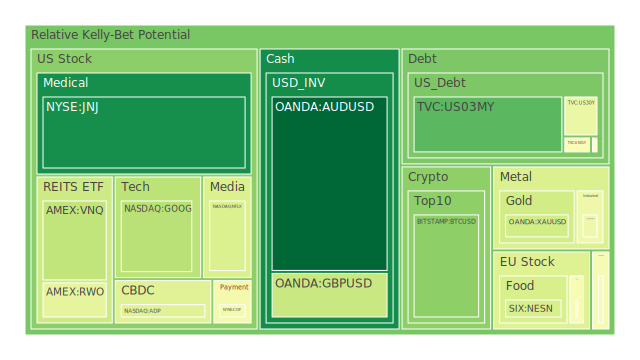
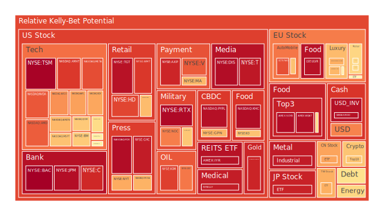
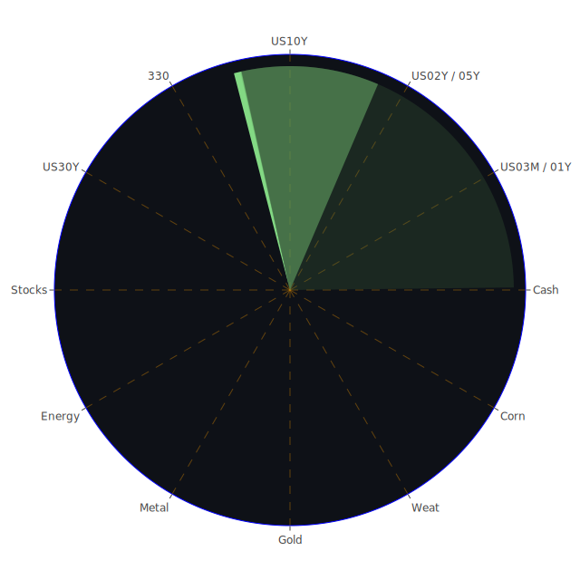

# **投資商品泡沫分析**

當前全球金融市場正處於一個極為複雜的十字路口，各種資產類別的表現呈現出顯著的分化，潛在的泡沫風險亦在不同領域醞釀。以下將針對各主要投資商品，基於2025年4月27日的數據與近期新聞事件，進行客觀的分析。

* 美國國債 (US Treasuries)  
  目前，美國國債殖利率曲線呈現部分倒掛的狀態（例如10年期減3個月期為負值），雖然近期各期限殖利率相較於上週有所下滑，但仍處於相對較高的水平，特別是與一年前相比。例如，10年期國債殖利率為4.25%，低於上週的4.28%和上個月的4.32%，但遠高於去年的4.63%。短天期的1年期與2年期殖利率亦呈現類似趨勢，分別為3.97%與3.76%。從泡沫指數來看，各期限國債的泡沫分數普遍處於中等水平，例如3個月期(US03MY)的D1約0.18，10年期(US10Y)的D1約0.55，2年期(US02Y)的D1約0.61，30年期(US30Y)則穩定在0.45左右。這反映出市場對於未來利率路徑及經濟前景存在分歧。  
  從經濟學角度看，殖利率下滑可能反映了市場對經濟放緩的擔憂增加，或是對聯準會（FED）未來可能降息的預期。然而，FED近期三次鷹派發言，以及居高不下的信用卡拖欠率（Charge-off Rate on Credit Card）和商業地產拖欠率（Commercial Real Estate Delinquent），又為降息預期蒙上陰影。社會學上，持續的利率不確定性影響著企業的投資決策與個人的借貸成本。心理學層面，投資者在避險需求（推升債券價格，壓低殖利率）與通膨擔憂（拋售債券，推升殖利率）之間搖擺。從博弈論角度，市場參與者正在猜測FED的下一步行動，以及經濟數據的真實走向。歷史上，殖利率曲線倒掛常被視為經濟衰退的前兆，但並非每次都準確應驗。近期FED數據顯示，貨幣市場基金總資產（Money Market Funds Total Assets）持續升高，顯示部分資金傾向停泊在短期、相對安全的資產中，等待更明確的信號。  
* 美國零售股 (US Retail Stocks \- WMT, TGT, COST, HD)  
  零售股表現分化，泡沫指數普遍偏高。沃爾瑪(WMT)的D1約為0.88，塔吉特(TGT)約為0.96，好市多(COST)約為0.67，家得寶(HD)約為0.86。這些高分數可能反映了市場對其在通膨環境下定價能力和必需消費屬性的信心，但也暗示著估值偏高的風險。  
  新聞方面，Skechers因經濟和關稅不確定性撤回2025年指引，導致股價下滑，凸顯了貿易摩擦對零售業的潛在衝擊。西南航空也表示受到關稅的「高度影響」，T-Mobile執行長更直言手機關稅最終將轉嫁給消費者。這些訊息從經濟學角度揭示了成本推動型通膨的壓力以及國際貿易政策對企業盈利能力的直接影響。社會學上，消費者的購買力受到通膨和潛在失業風險（如Intel裁員）的雙重壓力，可能導致消費降級或延遲非必需品支出。心理學角度，高泡沫分數可能反映了投資者在不確定環境下尋求「確定性」較高的必需消費龍頭股，形成一種抱團現象。博弈論觀點，企業和投資者都在評估關稅的實際落地程度及其對供應鏈和最終價格的影響。歷史上，貿易保護主義抬頭時期，依賴全球供應鏈的零售商往往面臨更大挑戰。  
* 美國科技股 (US Tech Stocks \- GOOG, MSFT, AAPL, AMZN, META, NVDA, IBM, TSLA)  
  科技股內部呈現顯著差異。大型科技股如Alphabet(GOOG)和微軟(MSFT)的泡沫指數D1分別約為0.34和0.66，雖然近期有波動，但月平均風險（D30）仍處於較高水平（均超過0.71）。亞馬遜(AMZN)和Meta(META)的D1則更高，分別達到0.68和0.85，且Meta的月平均風險分數高達0.94，顯示極高的泡沫風險。蘋果(AAPL)的D1約為0.72。相對而言，IBM的D1約為0.64。特斯拉(TSLA)的D1約為0.55，但其股價波動性一向較大，且近期有關於馬斯克可能減少對狗狗幣(DOGE)關注度的消息，增加了不確定性。輝達(NVDA)作為AI晶片的領頭羊，D1高達0.83，月平均風險也接近0.6，反映市場對其高成長預期，但也累積了相當的風險。  
  新聞事件對科技股影響巨大。Alphabet第一季財報超預期，主要歸功於AI發展，股價飆升。然而，英特爾(Intel)雖然第一季業績達標，但第二季預測不佳，且伴隨裁員和內部改革消息，股價大跌。這從經濟學角度說明，即使在同一行業，個別公司的基本面和前景預期差異可能極大。AI的發展是重要的驅動因素，但其商業化落地和盈利能力仍待驗證。社會學上，科技巨頭的影響力日益增大，但也面臨更多監管審查和社會責任壓力（如Ziff Davis對OpenAI的版權訴訟）。心理學層面，AI熱潮引發了強烈的FOMO（害怕錯過）情緒，推高了相關股票的估值，但也潛藏著期望落空的風險。博弈論觀點，科技公司之間在AI領域的競爭白熱化，投資者則在押注最終的贏家。歷史上，科技泡沫（如2000年網路泡沫）往往伴隨著過高的估值和對未來技術的過度樂觀預期。  
* 美國房地產指數 (US Real Estate Index \- VNQ, IYR)  
  美國房地產指數ETF，如VNQ和IYR，目前的泡沫指數相對複雜。VNQ的D1約為0.35，但月平均風險D30接近0.48。IYR的D1則高達0.96，但其7日和14日平均風險卻較低（約0.7），月平均風險約0.76。這顯示短期風險不高，但中長期累積的風險較大。  
  經濟學角度，房地產市場對利率極為敏感。雖然近期抵押貸款利率（Fixed Morgage 30Y Rate）從去年的低點（2.96%）飆升至6.81%，但仍低於某些時段的高點。聯準會數據顯示，商業地產拖欠率（Commercial Real Estate Delinquent）和總體房地產拖欠率（Real Estate Delinquent）均處於相對高位，顯示壓力正在累積。Digital Realty因數據中心需求強勁而上調年度FFO預測，顯示特定房地產領域（如數據中心、物流）仍有增長動力，但傳統住宅和商業辦公空間面臨挑戰。社會學上，高房價和高利率影響了居民的住房負擔能力和社會流動性。心理學層面，對房地產作為傳統抗通膨資產的信念，與對經濟衰退可能導致房價下跌的擔憂並存。博弈論觀點，開發商、購房者和投資者都在評估利率走向和經濟前景，決定買入、賣出或觀望。歷史上，房地產泡沫的破裂（如2008年次貸危機）往往對整體經濟產生深遠影響。  
* 加密貨幣 (Cryptocurrency \- BTCUSD, ETHUSD, DOGEUSD)  
  加密貨幣市場波動性較大。比特幣(BTCUSD)的D1泡沫指數約為0.26，遠低於前幾日的近0.5，顯示短期風險有所下降，但週、月平均風險仍在0.4左右。以太坊(ETHUSD)的D1約為0.67，較前幾日有所上升，週、月平均風險在0.5-0.6之間。狗狗幣(DOGEUSD)的D1約為0.53，同樣顯示出波動性。  
  新聞方面，美國銀行監管機構撤回對銀行加密活動的部分保護措施，可能為市場帶來更多不確定性。特斯拉與馬斯克對狗狗幣態度的相關消息，也持續影響市場情緒。經濟學角度，加密貨幣作為一種新興資產類別，其價值基礎、監管框架和在傳統金融體系中的定位仍在不斷演變。其價格受到宏觀流動性、市場風險偏好、技術發展（如以太坊升級）和監管政策等多重因素影響。社會學上，加密貨幣吸引了大量年輕投資者和技術愛好者，但也引發了關於金融穩定、能源消耗和非法活動的討論。心理學層面，加密貨幣市場充滿了高度的投機情緒和群體行為，價格容易出現劇烈波動。博弈論觀點，早期採用者、機構投資者、散戶和監管機構之間的互動，共同塑造了市場的發展路徑。歷史相對較短，但已多次經歷劇烈的牛熊轉換週期。  
* 金/銀/銅 (Gold/Silver/Copper \- XAUUSD, XAGUSD, COPPER)  
  貴金屬和工業金屬表現各異。黃金(XAUUSD)的D1泡沫指數約為0.38，較前幾日的0.36略有上升，但仍處於相對溫和的水平，月平均風險約0.43。白銀(XAGUSD)的泡沫指數則非常高，D1達到0.94，且各週期平均風險均在0.84以上，顯示極高的泡沫風險。銅(COPPER)的D1約為0.46，但其月平均風險高達0.85，表明近期風險有所緩和，但累積風險依然很高。  
  經濟學角度，黃金通常被視為避險資產和抗通膨工具。當前地緣政治風險（加薩、烏克蘭衝突）和對經濟衰退的擔憂，為黃金提供了支撐。然而，相對較高的實際利率環境限制了其上行空間。高企的金油比（GOLD OIL RATIO: 52.58）和金銅比（GOLD COPPER RATIO: 685.06）可能反映了市場對經濟前景的悲觀預期（相對於石油和銅所代表的工業需求）或黃金的相對強勢。白銀兼具貴金屬和工業金屬屬性，其極高的泡沫指數可能部分源於投機資金的湧入或對其在綠色能源轉型中（如太陽能板）需求的樂觀預期。銅價的高累積風險則與全球經濟復甦前景和供應鏈問題相關。社會學上，黃金在許多文化中具有儲備價值和財富象徵意義。心理學層面，對未來的恐懼和不確定性驅使部分投資者買入黃金，而對工業復甦的預期則影響銅價。博弈論觀點，央行、投資基金和散戶的買賣行為共同決定了貴金屬價格。歷史上，黃金在危機時期通常表現良好。  
* 黃豆 / 小麥 / 玉米 (Soybeans/Wheat/Corn \- SOYB, WEAT, CORN)  
  農產品相關ETF的泡沫指數呈現不同模式。黃豆ETF(SOYB)的D1高達0.97，但週、月平均風險在0.5-0.7之間，顯示短期風險急劇升高。小麥ETF(WEAT)的D1也高達0.97，且各週期風險從0.36（月平均）到0.55（週平均）不等，顯示風險近期顯著上升。玉米ETF(CORN)的D1約為0.61，週、月平均風險在0.4左右。  
  經濟學角度，農產品價格受供需基本面（種植面積、天氣、庫存）、地緣政治（如影響黑海穀物出口的烏克蘭戰爭）、能源價格（影響化肥和運輸成本）以及美元匯率等多重因素影響。近期風險指數的上升可能與天氣異常、供應鏈擔憂或投機性買盤有關。社會學上，糧食價格直接關係到民生福祉和社會穩定。心理學層面，對糧食短缺或價格上漲的擔憂可能引發囤積行為或預防性買盤。博弈論觀點，貿易商、農民、食品加工企業和投機者之間的博弈影響著價格發現過程。歷史上，極端天氣事件或地緣政治衝突常常導致農產品價格劇烈波動。  
* 石油/ 鈾期貨 (Oil/Uranium Futures \- USOIL, UX1\!)  
  能源期貨方面，美國原油(USOIL)的泡沫指數相對較低，D1約為0.62，但其週、月平均風險非常低（低於0.3），顯示近期價格相對穩定或偏弱，但今日有所反彈。鈾期貨(UX1\!)的D1約為0.51，各週期平均風險也維持在0.5左右，處於中等水平。  
  經濟學角度，油價受到全球經濟增長預期（影響需求）、OPEC+產量政策、地緣政治風險（中東、俄烏衝突）、美元匯率以及能源轉型等多方面因素影響。當前相對低的泡沫指數可能反映了市場對全球經濟放緩導致需求減弱的擔憂，蓋過了地緣政治風險帶來的供應中斷可能性。鈾作為核燃料，其價格與核電發展前景、地緣政治供應（俄羅斯是主要供應國之一）和能源政策相關。社會學上，能源價格波動直接影響通膨水平和民眾生活成本。心理學層面，對能源供應安全和價格穩定的預期影響著市場情緒。博弈論觀點，產油國、消費國、能源公司和交易員之間的策略互動決定了市場均衡。新聞中德國第一季綠色電力產出下降，煤炭和天然氣發電量上升，可能短期內增加了對化石燃料的需求。  
* 各國外匯市場 (Forex \- AUDUSD, GBPUSD, USDJPY, EURUSD)  
  主要貨幣對的泡沫指數分化。澳元兌美元(AUDUSD)的D1極低，接近0，月平均風險也僅約0.38，顯示澳元相對疲軟。英鎊兌美元(GBPUSD)的D1約為0.37，月平均風險約0.48。美元兌日圓(USDJPY)的D1高達0.76，雖然較前幾日的0.81有所回落，但仍處於高位，月平均風險約0.5，反映日圓相對弱勢。歐元兌美元(EURUSD)的D1則非常高，達到0.96，週、月平均風險也分別高達0.96和0.8，顯示極高的短期和中期風險。  
  經濟學角度，匯率主要受各國經濟基本面差異、利率政策分化（利差交易）、貿易平衡、資本流動和市場風險偏好影響。美元兌日圓的高位主要源於美日之間巨大的利差，以及日本央行（BOJ）相對鴿派的立場（即使BOJ行長上田維持加息承諾，但也警告美國關稅影響）。歐元兌美元的極高風險指數可能反映了市場對歐洲經濟前景的擔憂、能源依賴問題或地緣政治風險的定價，但也可能是短期投機或技術性因素導致。澳元的疲軟可能與中國經濟復甦緩慢（影響澳洲出口）和全球風險偏好下降有關。社會學上，匯率波動影響進出口企業的競爭力和國民的購買力。心理學層面，「美元微笑理論」等觀點影響著投資者對美元在不同宏觀情境下表現的預期。博弈論觀點，各國央行之間的政策協調與競爭，以及跨國資本的流動決策，共同塑造了匯率走勢。  
* 各國大盤指數 (Stock Indices \- NDX, 000300, FTSE, FCHI, GDAXI, JPN225, 0050\)  
  全球主要股指的泡沫指數普遍偏高。美國納斯達克100指數(NDX)的D1約為0.71，月平均風險約0.75。日本日經225指數(JPN225)的D1高達0.92，但月平均風險約0.75。台灣加權股價指數ETF(0050)的D1約為0.69，月平均風險高達0.8。歐洲方面，德國DAX指數(GDAXI)的D1約為0.53，英國富時100指數(FTSE)約為0.48，法國CAC40指數(FCHI)約為0.48，它們的月平均風險也都在0.5到0.7之間。中國滬深300指數(000300)的D1約為0.71，但月平均風險較低，約0.45。  
  經濟學角度，股指是各國經濟的晴雨表，但也受到全球流動性、投資者情緒、行業輪動和地緣政治等多重因素影響。美股和日股的高泡沫指數反映了科技股的強勢以及相對寬鬆的貨幣環境（或預期），但也累積了較高風險。歐洲股市的風險指數相對溫和，可能反映了更為謹慎的經濟前景預期。中國股市風險指數近期有所上升，但月平均仍不高，可能與政策刺激預期和經濟數據的逐步改善有關。社會學上，股市的財富效應影響著社會消費和投資信心。心理學層面，全球股市聯動性強，一個市場的劇烈波動容易引發其他市場的恐慌或追漲情緒。博弈論觀點，機構投資者、散戶、國家隊（某些市場）的行為相互影響，對指數走向產生作用。  
* 美國半導體股 (US Semiconductor Stocks \- NVDA, AMD, INTC, TSM, QCOM, AVGO, AMAT, KLAC, MU)  
  半導體行業泡沫風險普遍處於高位。台積電(TSM)的D1高達0.99，且各週期平均風險均接近1，顯示極度泡沫化。應用材料(AMAT)和博通(AVGO)的D1也分別高達0.88和0.74，月平均風險均超過0.85。高通(QCOM)的D1約為0.64，月平均風險0.82。輝達(NVDA)和超微(AMD)的D1分別為0.83和0.82，風險亦高。科磊(KLAC)的D1約0.54。相對而言，美光(MU)的D1約0.49，英特爾(INTC)的D1約0.60，且其月平均風險低於0.5，風險相對較低，但也與其近期較差的業績指引有關。  
  經濟學角度，半導體是現代經濟的基石，受到終端需求（手機、電腦、汽車、數據中心）、技術週期（AI驅動）、產能擴張和地緣政治（晶片法案、出口管制）的深刻影響。AI熱潮極大推動了對先進製程和AI晶片的需求，導致相關公司（如TSM、NVDA、AMD、AVGO、AMAT）估值飆升，泡沫指數高企。然而，英特爾的困境也提醒我們，行業競爭激烈，技術路線和市場份額可能快速變化。社會學上，半導體供應鏈的穩定性對國家安全和經濟發展至關重要。心理學層面，對AI革命性潛力的極度樂觀預期，是推高半導體股泡沫的核心動力。博弈論觀點，各國政府、晶片設計公司、製造商和設備供應商之間圍繞技術、產能和市場的競爭與合作，共同塑造行業格局。歷史上的半導體週期波動劇烈，供需失衡和技術換代常引發價格和股價的大幅調整。  
* 美國銀行股 (US Bank Stocks \- JPM, BAC, C, COF)  
  大型銀行股的泡沫指數普遍很高。美國銀行(BAC)的D1接近0.99，且各週期平均風險均在0.92以上，風險極高。摩根大通(JPM)的D1約為0.97，花旗集團(C)的D1約為0.91，第一資本金融(COF)的D1約為0.47，風險相對較低，但其月平均風險也在0.47左右。  
  經濟學角度，銀行股的表現與利率水平（影響淨息差）、信貸週期（影響壞帳損失）、監管環境和整體經濟活躍度密切相關。當前，雖然利率處於相對高位有利於銀行息差，但FED數據顯示的信用卡高拖欠率、商業地產和消費者貸款拖欠率上升，是銀行業面臨的顯著風險。美國銀行監管機構放鬆對銀行加密活動的限制，可能帶來新的業務機會，但也增加了潛在風險。高泡沫指數可能反映了市場對大型銀行在當前環境下盈利能力的信心，或者是一種資金集中的表現，但也極大增加了回調風險。社會學上，大型銀行的穩定性關乎整個金融體系的健康。心理學層面，投資者可能在尋求看似“大到不能倒”的標的，但忽略了潛在的信貸風險。博弈論觀點，銀行間的競爭、與監管機構的互動以及對宏觀經濟的預判，影響其經營策略和股價表現。歷史上，銀行危機往往是經濟衰退的催化劑或結果（如2008年）。  
* 美國軍工股 (US Defense Stocks \- LMT, NOC, RTX)  
  軍工股的泡沫指數處於中高水平。洛克希德·馬丁(LMT)的D1約為0.65，諾斯洛普·格魯曼(NOC)約為0.77，雷神技術(RTX)約為0.98。它們的月平均風險也普遍在0.7以上，顯示該板塊累積了較高風險。  
  經濟學角度，軍工行業的需求主要來自各國政府的國防預算，受地緣政治緊張局勢、國家安全威脅感知和軍事技術發展驅動。當前全球多點衝突（烏克蘭、中東）和主要大國間的戰略競爭，為軍工企業提供了持續的訂單預期。RTX的高泡沫指數可能與其近期表現或特定合約有關。社會學上，國防開支與社會福利開支之間常存在資源分配的討論。心理學層面，地緣政治不確定性增加，提升了市場對軍工股的關注度和避險屬性認知。博弈論觀點，國家間的軍備競賽、軍工企業間的訂單爭奪，共同影響行業發展。歷史上，戰爭或長期冷戰時期，軍工股通常表現強勁。  
* 美國電子支付股 (US Electronic Payment Stocks \- V, MA, PYPL, AXP, GPN)  
  電子支付行業泡沫指數普遍偏高。Visa(V)的D1約為0.83，萬事達(MA)約為0.68，美國運通(AXP)約為0.92，PayPal(PYPL)約為0.96，Global Payments(GPN)約為0.68。除了MA和GPN的月平均風險在0.7-0.8區間，其餘公司的月平均風險都相當高，特別是PYPL接近0.96，顯示該行業普遍存在較高的泡沫風險。  
  經濟學角度，電子支付行業受益於全球消費從現金向數字支付的長期結構性轉變，但也受到宏觀經濟（影響消費總額）、利率（影響交易費用相關收入）、競爭格局（金融科技公司挑戰）和監管變化的影響。高泡沫指數可能反映了市場對其商業模式護城河和持續增長潛力的認可，但也使其對經濟放緩和競爭加劇更為敏感。PYPL的極高風險可能與其近年面臨的增長挑戰和轉型壓力有關。社會學上，數字支付的普及改變了人們的消費習慣和金融行為。心理學層面，支付巨頭的品牌認知度和網絡效應給予投資者信心，但也可能導致估值溢價。博弈論觀點，傳統支付網絡、銀行、金融科技新貴之間的競爭與合作關係複雜。  
* 美國藥商股 (US Pharmaceutical Stocks \- LLY, JNJ, MRK, NVO)  
  大型藥廠表現分化，但整體泡沫指數偏高。禮來(LLY)的D1高達0.93，且各週期平均風險均在0.9以上，顯示極度泡沫。諾和諾德(NVO)的D1約為0.62，但月平均風險高達0.8。默克(MRK)的D1約為0.62，月平均風險約0.54。嬌生(JNJ)的D1則非常低，僅約0.08，月平均風險也僅0.3左右，是大型藥廠中風險最低的。  
  經濟學角度，製藥行業具有較強的防禦屬性，受人口老化、醫療保健支出增加和新藥研發突破驅動。禮來和諾和諾德的高風險指數，顯然與其在減肥藥和糖尿病治療領域的巨大成功和市場預期有關。嬌生的低風險指數可能反映了市場對其增長前景的擔憂或近期特定事件的影響。社會學上，藥品的可及性和定價是重要的公共衛生議題。心理學層面，對重磅新藥（Blockbuster drugs）潛力的極度樂觀預期推高了相關公司估值，但也存在研發失敗、專利懸崖或政策限價的風險。博弈論觀點，藥廠在新藥研發、市場准入、定價策略和併購活動中相互競爭。  
* 美國影視股 (US Entertainment Stocks \- NFLX, DIS, PARA)  
  影視娛樂股泡沫指數差異較大。Netflix(NFLX)的D1約為0.40，月平均風險約0.52，處於中等水平。迪士尼(DIS)的D1則高達0.97，但其月平均風險約為0.67。派拉蒙全球(PARA)的D1約為0.50，月平均風險約0.54。  
  經濟學角度，影視行業面臨從傳統有線電視向流媒體轉型的結構性變革，競爭激烈，內容投入巨大。同時，宏觀經濟狀況影響廣告收入和用戶訂閱意願。迪士尼的高風險指數可能與其轉型期的挑戰、主題公園業務的預期或特定內容的表現有關。Netflix的風險相對可控，可能反映了其在流媒體領域的領先地位和全球擴張。社會學上，影視內容塑造文化觀念和社會話題。心理學層面，投資者對內容為王、平台整合或併購潛力的預期影響著估值。博弈論觀點，各大平台在內容採購、定價策略、用戶獲取方面展開激烈競爭。  
* 美國媒體股 (US Media Stocks \- FOX, NYT, CMCSA)  
  媒體股泡沫指數也存在差異。福斯公司(FOX)的D1高達0.97，紐約時報(NYT)的D1約為0.70，康卡斯特(CMCSA)的D1約為0.69。FOX的月平均風險高達0.84，NYT約為0.77，CMCSA則相對較低，約0.47。  
  經濟學角度，傳統媒體（電視、報紙）面臨數字化轉型的巨大挑戰，廣告收入受到科技平台擠壓，有線電視訂戶持續流失。新聞媒體則在努力探索付費訂閱模式。FOX和NYT的高風險指數可能反映了市場對其在特定領域（如新聞、體育）的影響力或轉型成果的定價，但也暗示了較高風險。康卡斯特作為綜合性媒體和電信巨頭，風險相對分散。社會學上，媒體在信息傳播和輿論形成中扮演關鍵角色。心理學層面，對媒體公信力、內容質量和商業模式可持續性的擔憂影響投資者情緒。博弈論觀點，媒體公司在爭奪受眾注意力、廣告資源和內容版權方面相互競爭。  
* 石油防禦股 (Oil Defensive Stocks \- XOM, OXY)  
  大型石油公司埃克森美孚(XOM)和西方石油(OXY)的泡沫指數均處於高位。XOM的D1約為0.87，OXY約為0.78，兩者的月平均風險也都在0.7以上。  
  經濟學角度，儘管原油本身（USOIL）的泡沫指數不高，但大型石油公司的股票泡沫指數卻很高。這可能反映了市場對這些公司強勁的現金流、股息支付能力、股票回購計劃以及在能源轉型中仍將扮演重要角色的預期。但也可能是因為在不確定環境下，資金尋求具有穩定現金流和派息紀錄的大型藍籌股，導致估值被推高。社會學和心理學層面，對能源安全和傳統能源公司韌性的認知，可能支持了其股價。博弈論觀點，這些公司在傳統油氣業務和新能源投資之間進行平衡，並與OPEC+、政府政策等外部因素互動。  
* 金礦防禦股 (Gold Mining Defensive Stocks \- RGLD)  
  皇家黃金(RGLD)作為一家貴金屬權利金公司，其泡沫指數非常高，D1約為0.92，且各週期平均風險均在0.9以上，顯示極高風險。  
  經濟學角度，金礦股或權利金公司的股價通常與金價正相關，但具有更高的彈性（Beta）。RGLD的極高泡沫指數，一方面可能受益於近期金銀價格的相對強勢（尤其是白銀），另一方面也可能反映了市場對其商業模式（避免直接開採風險）和避險屬性的追捧。然而，如此高的指數也意味著一旦貴金屬價格回調或市場風險偏好上升，其股價可能面臨巨大壓力。心理學層面，這是尋求黃金敞口但期望獲得更高回報（也意味著更高風險）的投資者選擇。  
* 歐洲奢侈品股 (European Luxury Goods Stocks \- MC, KER, RMS)  
  歐洲奢侈品巨頭的泡沫指數呈現分化。LVMH(MC)的D1約為0.55，開雲集團(KER)約為0.70，歷峰集團(RMS)約為0.68。它們的月平均風險則分別為0.44、0.66和0.67。  
  經濟學角度，奢侈品行業對全球宏觀經濟，特別是高淨值人群的財富效應和消費信心高度敏感。中國市場的復甦情況、全球旅遊零售的恢復以及匯率波動都是關鍵影響因素。當前的泡沫指數處於中高水平，可能反映了市場對該行業品牌護城河和長期增長潛力的認可，但也織入了對全球經濟放緩和消費降級的擔憂。社會學和心理學層面，奢侈品消費涉及社會地位、身份認同和情感滿足等複雜因素。博弈論觀點，各大奢侈品集團在品牌建設、市場擴張、數字化轉型和併購方面相互競爭。  
* 歐洲汽車股 (European Auto Stocks \- MBG, BMW, PAH3)  
  歐洲汽車股的泡沫指數處於中高水平。梅賽德斯-賓士(MBG)的D1約為0.51，寶馬(BMW)約為0.66，保時捷控股(PAH3)約為0.84。它們的月平均風險都在0.5以上。  
  經濟學角度，汽車行業正經歷向電動化的巨大轉型，同時面臨來自中國電動車企的激烈競爭、供應鏈問題（如晶片）、以及宏觀經濟對汽車消費的影響。美國的關稅威脅也可能影響歐洲汽車製造商。高泡沫指數可能反映了市場對其品牌價值、技術實力或轉型前景的預期，但也蘊含著轉型失敗、競爭加劇或需求下滑的風險。社會學上，汽車是重要的交通工具和工業支柱。心理學層面，品牌忠誠度、對新技術的接受度以及環保意識影響消費決策。博弈論觀點，傳統車企、電動車新勢力、供應商和政府在電動化轉型路徑上進行博弈。  
* 歐美食品股 (European/US Food Stocks \- NESN, ULVR, KO, KHC)  
  大型食品飲料公司泡沫指數普遍偏高。雀巢(NESN)的D1約為0.40（近期有所下降），但月平均風險約0.56。聯合利華(ULVR)的D1高達0.96，且各週期平均風險均在0.95左右，風險極高。可口可樂(KO)的D1約為0.66，月平均風險高達0.81。卡夫亨氏(KHC)的D1也高達0.97，月平均風險約0.7。  
  經濟學角度，食品飲料行業屬於必需消費，具有較強的防禦性。然而，它們也面臨成本上漲（原材料、能源、運輸）、定價能力考驗、消費者健康意識提升以及自有品牌競爭等挑戰。高泡沫指數反映了市場在不確定時期對防禦性板塊的偏好，但也可能高估了它們的增長潛力和盈利能力，尤其是像ULVR和KHC這樣風險指數極高的個股。社會學上，食品安全、健康飲食和可持續發展是行業面臨的重要議題。心理學層面，品牌認知度和消費習慣具有粘性，但通膨壓力下消費者可能轉向更便宜的替代品。

# **宏觀經濟傳導路徑分析**

當前的宏觀經濟環境呈現出多條潛在的傳導路徑，彼此交織影響。

1. **貿易摩擦 \-\> 通膨 \-\> 利率 \-\> 資產價格路徑：** 新聞中反覆提及的美國關稅威脅（Skechers, Intel, Southwest, T-Mobile, Drewry預測）是關鍵的外部衝擊。若關稅落地或預期增強（正向），可能推高進口成本，加劇美國國內通膨壓力（CPI YoY目前為2.4%，可能難以下降）。持續的通膨壓力將迫使FED維持鷹派立場（近期3次鷹派發言），推遲降息甚至考慮進一步緊縮（反向影響利率預期）。高利率環境將對債券價格構成壓力（殖利率上升），尤其打擊對利率敏感的成長型股票（如高泡沫的科技股META, NVDA）和房地產市場（VNQ, IYR）。同時，強勢美元可能持續（USDJPY高泡沫指數），對新興市場和依賴出口的經濟體（如AUDUSD低泡沫指數）造成壓力。這是一個典型的負面反饋循環，從貿易政策的變動傳導至通膨、利率，最終影響各類資產的估值。  
2. **經濟衰退擔憂 \-\> 避險情緒 \-\> 資產輪動路徑：** 儘管部分經濟數據尚可，但多重信號指向衰退風險。FED數據顯示的各類貸款拖欠率上升（信用卡、商業地產、消費者）、殖利率曲線部分倒掛（10Y-3M為負）、以及Deutsche Bank等機構的預警（負面新聞）都在強化衰退預期。這種預期（正向）會激發市場的避險情緒（心理學），導致資金從風險較高的資產流向避險資產。這可能推升黃金、白銀價格（XAUUSD, XAGUSD高泡沫指數），利好防禦性股票（如JNJ低風險，或高風險但被視為防禦的LLY, ULVR），並可能推低長期國債殖利率（TVC:US10Y, US30Y，若通膨預期同時下降）。風險較高的週期性股票（如汽車MBG, BMW）、銀行股（高拖欠率背景下的BAC, JPM）以及高估值的科技股可能面臨拋售壓力。這條路徑體現了市場情緒和預期如何引導資金在不同風險等級的資產間流動。  
3. **地緣政治風險 \-\> 能源/國防 \-\> 市場波動路徑：** 全球地緣政治持續緊張（新聞中提及加薩、烏克蘭、俄羅斯彈藥庫、非洲衝突等）是常態化的風險源。這些事件（正向）直接利好軍工股（LMT, NOC, RTX高風險指數），並可能隨時引發能源供應擔憂，推升油價（USOIL低風險可能被打破）和鈾價（UX1\!中等風險）。更重要的是，地緣政治不確定性（社會學/心理學）會放大市場整體波動性，增加投資者的風險厭惡情緒，進一步強化對黃金等避險資產的需求，並對全球股市（特別是依賴全球貿易和供應鏈的指數如GDAXI, FTSE）造成壓力。這條路徑顯示了非經濟因素如何直接衝擊特定行業，並間接影響整體市場的風險偏好和穩定性。  
4. **流動性狀況 \-\> 信貸環境 \-\> 經濟動能路徑：** FED數據呈現複雜的流動性圖景。一方面，逆回購（RRP）下降、聯準會總資產下降、美國國債總流通量下降，顯示基礎流動性有所收緊。但另一方面，貨幣市場基金總資產（MMF）升高、美國銀行總存款（US Bank Total Deposits）處於高位，顯示大量資金停留在場外或銀行體系內，並未積極投入實體經濟或風險資產。同時，高收益債利率（High Yield Bond Interest Rate）處於高位，信貸息差擴大，加上高拖欠率，表明信貸環境正在趨緊（經濟學）。這種狀況（正向）可能抑制企業的投資和擴張意願，限制消費者的信貸能力，從而削弱整體經濟增長動能，形成負向的經濟反饋。

# **微觀經濟傳導路徑分析**

從企業和行業層面觀察，也存在多條傳導路徑：

1. **AI技術突破 \-\> 行業重塑 \-\> 贏家通吃路徑：** 人工智能（AI）是當前最主要的技術驅動力。Alphabet的強勁財報證實了AI對廣告和雲業務的提振作用。這條路徑（正向）的核心是AI技術的應用和商業化，它正在重塑從半導體（NVDA, TSM, AMD高風險）、軟件（MSFT）、互聯網服務（GOOG, META）到各行各業的效率和商業模式。然而，這也可能導致“贏家通吃”的局面，技術領先、擁有數據和資本優勢的巨頭（如MSFT, GOOG, NVDA）可能獲得不成比例的收益，而落后者（如Intel面臨的挑戰）或無法有效應用AI的企業可能被邊緣化。這種分化在科技股內部的高低泡沫指數差異中已有所體現。同時，AI發展也伴隨著倫理、監管（版權訴訟）和就業結構變化的社會挑戰。  
2. **成本壓力 \-\> 利潤擠壓 \-\> 企業應對路徑：** 無論是關稅（零售、汽車）、原材料價格波動（食品、工業）、還是勞動力成本上升，企業普遍面臨成本壓力（經濟學）。這種壓力（正向）會擠壓企業的利潤空間。企業的應對策略各不相同：一是轉嫁成本（如T-Mobile所言），可能導致需求下降或加劇通膨；二是壓縮內部成本，可能涉及裁員（如Intel）或減少投資；三是通過技術創新或效率提升來消化成本。無法有效應對成本壓力的企業（可能體現在較低的泡沫指數或盈利預警中）將面臨更大的經營困難，甚至可能被市場淘汰。這條路徑解釋了為何即使在同一行業，企業表現也會出現分化。  
3. **消費者行為轉變 \-\> 需求結構變化 \-\> 行業興衰路徑：** 消費者的偏好和行為模式在不斷變化。例如，對健康飲食的追求影響食品飲料行業（KHC, KO, NESN），對可持續性的關注影響能源和汽車行業，數字化生活方式推動電子支付（V, MA, PYPL）和流媒體（NFLX）的發展。同時，經濟壓力（心理學/社會學）可能導致消費降級，影響零售（WMT, TGT）、奢侈品（MC, KER）和非必需品行業。企業需要敏銳捕捉這些轉變（正向），調整產品和服務。成功適應者將獲得增長機會，而固守傳統模式或未能滿足新需求的企業則可能衰落。減肥藥的火爆（LLY, NVO）就是一個典型的例子，它源於社會健康觀念和醫療技術的結合，深刻改變了製藥行業格局。

# **資產類別間傳導路徑分析**

不同資產類別之間也存在複雜的相互影響：

1. **利率 \-\> 匯率 \-\> 商品/股市路徑：** 利率水平及其預期是核心紐帶。美國利率相對於其他主要經濟體（如日本、歐洲）的利差，直接影響美元匯率（USDJPY高位，EURUSD高風險）。強勢美元（正向）通常會壓制以美元計價的商品價格（如黃金XAUUSD、石油USOIL），因為對持有其他貨幣的買家來說更貴了。同時，強勢美元也可能影響美國跨國公司的匯兌收益，並可能吸引國際資本流入美國資產（包括股市和債市），但也會增加新興市場的資本外流壓力。反之，若美元走弱，則可能提振商品價格，減輕新ärk市場壓力。  
2. **股市風險偏好 \-\> 債市/黃金/加密貨幣路徑：** 當股市（如NDX）風險偏好高漲時（高泡沫指數），資金可能從相對安全的債券（TVC:US10Y）和黃金（XAUUSD）流出，追逐更高的股票回報（反向關係）。加密貨幣（BTCUSD, ETHUSD）作為一種高風險資產，其表現通常與股市風險偏好正相關，但也可能受到自身獨特因素（監管、技術）的影響而走出獨立行情。當市場風險偏好下降時（例如出現負面新聞衝擊），資金流向則相反，流向債券和黃金避險，加密貨幣可能與股市一同下跌。  
3. **商品價格 \-\> 通膨 \-\> 利率/股市路徑：** 能源（USOIL）和農產品（SOYB, WEAT, CORN）等大宗商品的價格波動，是影響通膨預期的重要因素。若商品價格持續上漲（正向），可能推升通膨預期，迫使央行採取更緊縮的貨幣政策（提高利率），從而對債市和股市（特別是成長股）造成壓力。同時，商品價格上漲也會影響相關企業的成本和利潤（如航空公司、食品加工廠），進而影響其股價表現。工業金屬（COPPER）價格則更多地反映全球工業活動的景氣程度，其上漲可能預示經濟復甦（利好股市），但也可能加劇通膨擔憂。  
4. **信貸市場壓力 \-\> 銀行股 \-\> 整體市場信心路徑：** 信貸市場的健康狀況是金融穩定的基石。當信用卡、房地產等領域的拖欠率上升（FED數據），高收益債利差擴大時（正向），表明信貸風險正在積聚。這首先會衝擊銀行股（BAC, JPM高風險指數），因為壞帳損失增加會侵蝕其利潤。如果信貸壓力蔓延，可能引發對整個金融系統穩定性的擔憂（心理學），導致市場信心崩潰，觸發更廣泛的資產拋售，形成系統性風險。這條路徑強調了金融體系內部的風險傳導機制。

# **投資建議**

基於上述分析，當前市場環境充滿挑戰，但也存在結構性機會。投資者應根據自身的風險承受能力、投資目標和對未來宏觀情景的判斷，構建多元化的投資組合。以下提供三種不同風險偏好的配置建議，請注意這僅為參考，不構成最終投資決策。

**1\. 穩健型投資組合 (Conservative Portfolio)**

* **目標：** 側重於資本保值，降低波動性，尋求穩定的利息或股息收入。  
* **核心觀點：** 在經濟前景不明、多數資產泡沫指數偏高的背景下，優先考慮風險控制。  
* **配置比例與項目：**  
  * **穩健類 (60%)：**  
    * **短期美國國債ETF (例如持有1-3年期國債的ETF) (30%)：** 受益於相對較高的短期利率，同時久期較短，利率風險相對可控。目前1年期和3個月期國債泡沫指數相對較低或中等。  
    * **黃金 (XAUUSD) (20%)：** 作為傳統避險資產，對沖地緣政治風險和潛在的經濟衰退。當前泡沫指數相對溫和。  
    * **美元現金或貨幣市場基金 (MMF) (10%)：** 保持流動性，應對市場波動，等待更佳的投資機會。MMF資產規模持續增長顯示其吸引力。  
  * **成長類 (30%)：**  
    * **防禦性必需消費股 (例如 可口可樂 KO 或 雀巢 NESN) (15%)：** 選擇泡沫指數相對較高但仍具備防禦屬性的龍頭企業，尋求穩定股息和相對抗跌性。KO月平均風險高，NESN相對溫和。需謹慎選擇，或考慮風險更低的JNJ (泡沫指數極低)。  
    * **優質大型科技股 (例如 微軟 MSFT) (15%)：** 選擇基本面穩健、護城河深厚、在AI領域佈局領先但泡沫指數相對META/NVDA/TSM等稍低的大型科技股，分享長期增長潛力。  
  * **高風險類 (10%)：**  
    * **公用事業股ETF (未在數據中直接體現，但作為例子) (10%)：** 通常具有穩定的現金流和派息，是傳統的防禦性板塊，可在高風險類別中選擇風險相對較低的品種。

**2\. 成長型投資組合 (Growth Portfolio)**

* **目標：** 在可控風險下，尋求長期資本增值，平衡風險與回報。  
* **核心觀點：** 認識到市場風險，但相信部分領域（如AI、特定防禦板塊）仍有增長潛力，通過多元化分散風險。  
* **配置比例與項目：**  
  * **穩健類 (30%)：**  
    * **中期美國國債ETF (例如持有7-10年期國債的ETF) (15%)：** 獲取一定的票息收益，同時若經濟走弱、利率下降，可獲得資本利得。10年期國債泡沫指數處於中等偏高水平。  
    * **黃金 (XAUUSD) (15%)：** 保留一定的避險配置。  
  * **成長類 (50%)：**  
    * **核心科技股 (例如 Alphabet GOOG, 蘋果 AAPL) (25%)：** 選擇具有強大生態系統和持續創新能力的大型科技股。GOOG泡沫指數相對溫和，AAPL處於中高水平。  
    * **半導體ETF (包含如NVDA, AMD, TSM等，但需注意高風險) (10%)：** 分享AI驅動的半導體行業增長紅利，但鑒於極高的泡沫指數，需嚴控倉位或選擇波動相對較小的ETF。  
    * **醫療保健股 (例如 嬌生 JNJ 或 默克 MRK) (15%)：** 配置於泡沫指數相對較低或中等的大型藥廠，獲取防禦性增長。  
  * **高風險類 (20%)：**  
    * **特定高增長科技股 (例如 特斯拉 TSLA 或 Palantir PLTR \- 未在數據中) (10%)：** 小倉位配置於具有顛覆性潛力但風險和波動性極高的個股。TSLA泡沫指數中等。  
    * **比特幣 (BTCUSD) (5%)：** 作為對沖傳統金融體系風險的另類資產，但需認識到其極高波動性和監管不確定性。目前泡沫指數有所回落。  
    * **新興市場股票ETF (未在數據中直接體現，但作為例子) (5%)：** 分散地域風險，尋求長期增長潛力，但需注意全球經濟放緩和強美元帶來的風險。

**3\. 高風險型投資組合 (Aggressive Portfolio)**

* **目標：** 最大化資本增值潛力，願意承受較高的波動性和潛在損失風險。  
* **核心觀點：** 相信高風險高回報，集中投資於判斷具有最大上行空間的領域，或利用衍生品、槓桿等工具放大收益（也放大風險）。  
* **配置比例與項目：**  
  * **穩健類 (10%)：**  
    * **短期流動性資產 (現金或短期債券) (10%)：** 保留少量資金以應對追加保證金或捕捉短期機會。  
  * **成長類 (40%)：**  
    * **領先AI半導體股 (例如 輝達 NVDA, 台積電 TSM) (20%)：** 重倉押注AI革命的核心受益者，即使泡沫指數極高。  
    * **雲計算與軟件股 (例如 微軟 MSFT, 亞馬遜 AMZN) (15%)：** 投資於持續受益於數字化轉型和AI應用的平台型公司。MSFT和AMZN泡沫指數均偏高。  
    * **特定生物科技股 (例如 禮來 LLY) (5%)：** 追逐具有突破性產品（如減肥藥）的高增長藥企，儘管泡沫指數極高。  
  * **高風險類 (50%)：**  
    * **加密貨幣 (比特幣 BTCUSD, 以太坊 ETHUSD) (20%)：** 更大比例配置於主流加密貨幣，博弈其長期潛力和機構採用趨勢。ETH泡沫指數高於BTC。  
    * **高波動性科技股/模因股 (例如 特斯拉 TSLA 或其他小型科技股) (15%)：** 尋求短期爆發性機會，風險極高。  
    * **槓桿ETF 或 期權策略 (未在數據中直接體現，但作為例子) (15%)：** 使用槓桿工具放大對市場方向的判斷（如做多科技股或做空高風險債券），風險極高，可能導致本金快速損失。

# **風險提示**

請務必注意，以上所有分析和建議均基於當前（2025年4月27日）可獲得的有限數據和新聞信息，並進行了基於經濟學、社會學、心理學和博弈論等角度的大膽假設。市場瞬息萬變，實際走勢可能與預期大相徑庭。

**泡沫風險**是當前市場的核心關切點，數據顯示多個資產類別（包括科技股、半導體、銀行股、支付股、部分必需消費股、白銀、部分農產品ETF等）的泡沫指數處於極高水平（D1或平均指數接近或超過0.8甚至0.9）。這意味著這些資產的價格可能遠超其內在價值，一旦市場情緒逆轉、流動性收緊或基本面不及預期，可能面臨劇烈下跌的風險。投資者在配置這些高風險資產時，必須極度謹慎，充分評估自身的風險承受能力。

**地緣政治風險、貿易政策風險、通膨和利率路徑的不確定性**仍然是影響市場的主要宏觀變數。任何突發事件都可能導致市場情緒劇變和資產價格重估。

**投資涉及風險，過往表現並不能預示未來回報。** 本報告提供的信息和觀點僅供參考，不應被視為任何形式的投資建議或邀約。投資者在做出任何投資決策前，應進行獨立思考，仔細評估自身的財務狀況、投資目標、風險承受能力，並在必要時尋求獨立的專業財務顧問意見。市場總是充滿不確定性，請謹慎決策。

 
Daily Buy Map:

 
Daily Sell Map:

 
Daily Radar Chart:

 
