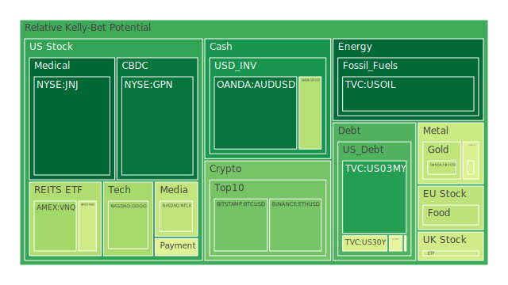
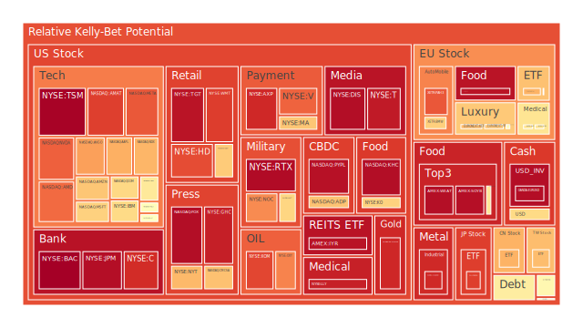
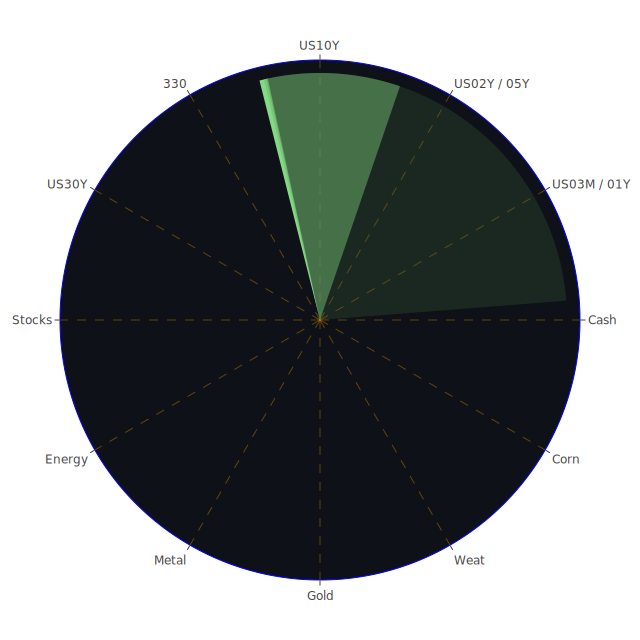

# **投資商品泡沫分析**

當前全球金融市場呈現高度複雜且分歧的景象。一方面，特定的科技與醫療領域展現出強勁的動能，另一方面，宏觀經濟的不確定性，特別是貿易政策的變動與持續的信貸壓力，為市場蒙上陰影。以下將針對各主要資產類別，基於提供的數據，進行泡沫風險的觀察與分析。

* 美國國債 (US Treasuries)  
  觀察美國各年期國債殖利率，例如3個月期 (US03MY)、1年期 (US01Y)、2年期 (US02Y)、5年期 (US05Y)、10年期 (US10Y)、以及30年期 (US30Y)，可以發現殖利率普遍處於相對歷史高位，反映了市場對通膨持續性以及聯邦儲備系統貨幣政策路徑的預期。短期國債 (如US02Y) 的風險評分相對較高，特別是月度風險趨勢指標顯示出上升壓力，暗示市場對於短期利率變動的敏感度增加。長天期國債 (如US10Y, US30Y) 的風險評分則呈現中等水平，但近期略有波動。從經濟學角度看，高殖利率通常抑制風險資產估值，但也為尋求固定收益的投資者提供機會。從歷史角度看，當前殖利率水平雖高，但相較於去年同期有所下降，顯示市場可能已部分消化了升息預期。然而，殖利率曲線 (如10Y-3M利差) 雖較去年大幅改善，但短期內仍處於接近倒掛的水平，歷史上常被視為經濟衰退的警訊，儘管其預測能力並非絕對。近期聯邦儲備系統官員的鷹派言論，以及持續高位的EFFR成交量和聯邦儲備金餘額，支持了利率可能在高位維持更長時間的觀點。從心理學角度，投資者在尋求避險與追求收益之間掙扎，使得國債市場的風險感知呈現波動。博弈論觀點則視其為市場參與者對未來利率路徑的集體下注。  
* 美國零售股 (US Retail)  
  以沃爾瑪 (WMT)、好市多 (COST)、塔吉特 (TGT) 為例，這些零售巨頭的風險評分普遍偏高。特別是TGT，其短期和中期的風險指標均處於極高水平，顯示市場對其近期表現存在高度不確定性或投機性。WMT和COST的風險評分同樣處於高位，特別是在月度趨勢上，反映了市場對其高估值的擔憂。新聞中提到亞馬遜賣家因關稅提高商品價格，以及塔吉特百貨的高風險評分，可能暗示著消費者購買力受到擠壓，或成本壓力向終端轉移。從社會學角度，消費模式的改變、線上線下的競爭格局，以及關稅對物價的影響，都直接衝擊零售業。經濟學上，高利率環境會抑制消費信貸，而高通膨預期則可能提前刺激部分消費，但也可能因實際購買力下降而最終抑制消費。歷史經驗表明，零售業績對經濟週期高度敏感。心理層面，消費者的信心指數是關鍵，而目前高位的信用卡拖欠率 (Charge-off Rate, Delinquent Rate) 數據，特別是針對次級借款人的指標，顯示消費端壓力正在累積。  
* 美國科技股 (US Technology)  
  科技股內部表現分化顯著。大型科技股如谷歌 (GOOG)、微軟 (MSFT)、亞馬遜 (AMZN)、蘋果 (AAPL) 等，普遍呈現中高至高位的風險評分。其中，AMZN和MSFT的月度風險趨勢尤為顯著，顯示市場對其未來增長與估值持續性的擔憂。臉書母公司Meta (META) 的風險評分在各個時間維度上均處於極高水平 (接近0.9或更高)，顯示其可能處於泡沫風險的風口浪尖，或是市場對其前景有極端分歧的看法。相比之下，英特爾 (INTC) 在強勁財報後股價下跌，新聞指原因是對關稅影響的擔憂，其風險評分相對較高，反映了市場對其轉型挑戰和外部風險的敏感。特斯拉 (TSLA) 在自動駕駛新規消息刺激下股價飆升，但其基礎風險評分仍在中高位，且波動性極大。從經濟學角度，科技股對利率變化極為敏感，高利率環境通常不利於高估值的成長股。然而，AI等結構性趨勢為部分公司帶來了強勁的增長敘事。社會學上，科技巨頭的市場力量、數據隱私問題、以及反壟斷壓力都是潛在風險。心理學角度，市場情緒在對創新前景的極度樂觀與對宏觀風險的擔憂之間快速切換。博弈論視角下，科技巨頭間的競爭與合作，以及與監管機構的互動，充滿了策略性考量。  
* 美國房地產指數 (US Real Estate Index)  
  以房地產信託基金 (REITs) 指數VNQ、RWO、IYR為代表，其風險評分呈現中等偏高的狀態。IYR的風險評分在近期有所攀升，特別是月度風險趨勢處於較高水平。VNQ和RWO的風險評分相對穩定，但也在中等偏上。美國聯邦儲備系統數據顯示，商業房地產拖欠率 (Commercial Real Estate Delinquent) 和整體房地產拖欠率 (Real Estate Delinquent) 均處於相對高位，這對REITs的基礎資產質量構成了壓力。30年期固定抵押貸款利率 (Fixed Mortgage 30Y Rate) 雖略有波動，但仍處於6.81%的高位，遠高於前幾年水平，顯著增加了購房成本，抑制了交易活動。從經濟學角度，高利率直接打擊房地產市場的融資成本和估值。社會學層面，遠程工作的普及改變了對商業地產（特別是辦公樓）的需求，而住房可負擔性危機則影響住宅市場。歷史上，房地產市場的調整往往伴隨著更廣泛的經濟衰退。心理上，對房價下跌的預期可能自我實現。  
* 加密貨幣 (Cryptocurrencies)  
  比特幣 (BTCUSD)、以太坊 (ETHUSD)、狗狗幣 (DOGEUSD) 的風險評分呈現中等水平，但波動性較大。比特幣和以太坊的近期風險評分有所下降，但狗狗幣的風險評分則出現波動，一度升高後又略有回落。新聞中提到Nike因關閉加密業務而被起訴，以及關於狗狗幣的負面評論，顯示該領域仍面臨監管不確定性和市場情緒的快速變化。從經濟學角度，加密貨幣作為一種新興資產類別，其價值儲存和交易媒介功能仍在爭議中，價格易受流動性、市場情緒和監管消息影響。社會學上，加密貨幣代表了一種去中心化的思潮，吸引了特定的社群。心理學角度，FOMO（害怕錯過）和FUD（恐懼、不確定、懷疑）情緒主導了市場波動。博弈論視角下，早期採用者、機構投資者、散戶和監管機構之間的互動塑造了市場格局。其相對於傳統資產的低相關性曾被視為優勢，但在市場壓力下，其與高風險科技股的聯動性有所增加。  
* 金/銀/銅 (Gold/Silver/Copper)  
  黃金 (XAUUSD) 的風險評分處於中等水平，近期略有回落，但整體仍在高位徘徊。白銀 (XAGUSD) 的風險評分則顯著偏高，特別是月度趨勢處於極高水平，顯示其價格波動劇烈或投機性較強。銅 (COPPER) 的風險評分同樣很高，特別是中長期風險趨勢指標持續攀升，反映了市場對其工業需求前景和供應鏈問題的高度關注。新聞中提到巴里克黃金公司在馬利的承包商裁員，可能影響黃金供應。黃金/石油比率和黃金/銅比率均處於歷史相對高位，可能反映了避險情緒或對特定商品供需的預期。經濟學上，黃金通常被視為抗通膨和避險資產，但在高利率環境下持有黃金的機會成本增加。白銀兼具貴金屬和工業金屬屬性。銅價是全球經濟活動的重要指標。社會學上，貴金屬在文化和歷史中具有特殊的價值地位。心理學上，不確定性時期會推升黃金的吸引力。  
* 黃豆 / 小麥 / 玉米 (Soybeans / Wheat / Corn)  
  以相關ETF SOYB (黃豆)、WEAT (小麥)、CORN (玉米) 來看，風險評分呈現分化。黃豆和玉米的風險評分處於中等偏高水平，且有波動。小麥ETF (WEAT) 的風險評分則非常高，特別是短期指標，但中長期風險趨勢卻相對較低，暗示近期可能有異常波動或事件驅動。農產品價格受天氣、地緣政治（如影響黑海糧食出口）、能源成本（影響化肥和運輸）、以及全球需求的綜合影響。從經濟學角度，糧食安全是各國核心利益，價格波動影響全球通膨和社會穩定。歷史上，糧食危機曾引發社會動盪。心理學上，對未來糧食供應的擔憂會影響囤積行為和價格預期。  
* 石油/ 鈾期貨 (Oil / Uranium Futures)  
  美國原油 (USOIL) 的風險評分出乎意料地處於較低水平，尤其是中長期風險趨勢指標很低。這可能反映了近期價格的相對穩定，或者數據模型捕捉到的特定模式。然而，考慮到地緣政治風險（中東局勢、俄烏衝突）和全球經濟前景的不確定性，低風險評分需要謹慎看待。鈾期貨 (UX1\!) 的風險評分處於中等水平，相對穩定。經濟學上，石油是全球經濟的血液，其價格影響通膨和經濟增長。鈾是核能的關鍵原料，其需求與能源轉型政策相關。地緣政治是影響這兩種能源價格的關鍵變量。歷史上，石油危機曾對全球經濟造成巨大衝擊。  
* 各國外匯市場 (Forex)  
  美元/日元 (USDJPY) 的風險評分處於高位，尤其近期波動加劇，月度風險趨勢也偏高，可能反映了市場對日本央行政策正常化和美日利差變化的預期。歐元/美元 (EURUSD) 和英鎊/美元 (GBPUSD) 的風險評分也處於高位，尤其是EURUSD的短期風險評分接近極值，顯示市場對歐洲經濟前景和相對於美國的利差存在高度不確定性。澳元/美元 (AUDUSD) 風險評分相對較低，但也在逐步上升。新聞提到美元可能創下尼克松時代以來最差的總統百日表現，以及摩根大通調查顯示市場對弱美元和美國滯脹的共識，都指向美元前景的不確定性。外匯市場是全球資本流動和相對經濟基本面的直接反映。經濟學上，利差、經濟增長預期、貿易平衡和央行政策是主要驅動因素。社會學和政治因素（如選舉、地緣政治）也會顯著影響匯率。心理學上，市場情緒和避險需求是短期波動的重要推手。  
* 各國大盤指數 (Major Indices)  
  美國納斯達克100指數 (NDX)、英國富時100指數 (FTSE)、法國CAC40指數 (FCHI)、德國DAX指數 (GDAXI)、日本日經225指數 (JPN225)、台灣加權指數 (0050)、中國滬深300指數 (000300) 的風險評分普遍處於中高到極高水平。納斯達克指數的月度風險趨勢很高，反映了對科技股估值的擔憂。歐洲主要股指的風險評分也處於高位，可能受到區域經濟增長放緩、能源依賴和地緣政治鄰近性的影響。日經指數風險評分極高，可能與日元波動、企業治理改革預期以及全球資金流向有關。台灣加權指數風險評分高，反映了其在全球科技供應鏈中的重要性以及地緣政治敏感性。滬深300指數風險評分相對較高，但低於其他一些主要市場，可能反映了中國經濟的特定挑戰與政策支持的對沖。全球股指的表現是宏觀經濟健康狀況、企業盈利能力和投資者風險偏好的綜合體現。  
* 美國半導體股 (US Semiconductor)  
  除英特爾 (INTC) 外，其他主要半導體公司如英偉達 (NVDA)、超微 (AMD)、博通 (AVGO)、應用材料 (AMAT)、科磊 (KLAC)、美光 (MU)、高通 (QCOM)、台積電ADR (TSM) 的風險評分普遍處於高位或極高水平。特別是TSM，其各項風險指標均接近飽和，顯示市場對其的預期極高，泡沫風險顯著。NVDA、AMD、AVGO、AMAT、QCOM的月度風險趨勢也處於高位。這反映了AI熱潮對該行業的巨大推動，但也累積了相當大的估值風險。英特爾的下跌和台積電的極高風險評分，凸顯了行業內部的競爭格局變化和供應鏈的關鍵節點地位。經濟學上，半導體是現代經濟的基石，具有強烈的周期性，但也受益於數字化、AI等長期趨勢。地緣政治（尤其是中美科技競爭和台灣地位）對該行業有著無可比擬的影響。  
* 美國銀行股 (US Banks)  
  大型銀行如摩根大通 (JPM)、美國銀行 (BAC)、花旗集團 (C) 以及區域性銀行相關的指標（如第一資本金融公司COF）的風險評分普遍處於極高水平。BAC的風險評分幾乎達到頂點。這與聯邦儲備系統數據顯示的信用卡和商業地產拖欠率上升，以及高利率環境對銀行淨息差的潛在壓力相吻合。儘管高利率最初可能有利於銀行，但持續的高利率和經濟放緩預期會增加信貸損失風險。歷史上，銀行業危機往往是系統性風險的放大器。心理學上，對銀行體系穩健性的擔憂會引發擠兌風險（儘管目前數據未顯示）。  
* 美國軍工股 (US Defense)  
  洛克希德·馬丁 (LMT)、諾斯羅普·格魯曼 (NOC)、雷神技術公司 (RTX) 的風險評分處於高位。LMT和NOC的月度風險趨勢尤其顯著。這與全球地緣政治緊張局勢加劇，各國增加國防開支的預期一致。從經濟學角度，國防開支受政府預算和地緣政治驅動，相對獨立於一般經濟周期。社會學上，戰爭與和平的議題影響公眾對軍工企業的態度。歷史經驗表明，衝突時期往往利好軍工股。  
* 美國電子支付股 (US Payments)  
  萬事達卡 (MA)、維薩 (V)、PayPal (PYPL)、Global Payments (GPN)、美國運通 (AXP) 的風險評分處於高位或極高水平。PYPL的風險評分在各時間維度上都非常高，可能反映了市場對其轉型挑戰或競爭壓力的極度擔憂。MA、V、AXP的風險評分也處於高位，特別是月度風險趨勢。GPN的風險評分波動較大，近期有所回落但整體仍高。電子支付行業受益於現金使用減少和電子商務的長期趨勢，但也面臨日益激烈的競爭（來自金融科技新創公司）和監管壓力。經濟學上，其收入與消費支出密切相關。  
* 美國藥商股 (US Pharmaceuticals)  
  嬌生 (JNJ) 的風險評分相對較低且穩定。但禮來 (LLY)、默克 (MRK)、諾和諾德 (NVO) 的風險評分則處於高位或極高水平。特別是LLY和NVO，其風險評分在各時間維度上都非常高，反映了市場對其重磅藥物（尤其是GLP-1類減肥/糖尿病藥物）前景的極高預期，泡沫風險顯著。製藥行業通常被視為防禦性行業，受益於人口老齡化和醫療保健需求的剛性，但也面臨藥品專利懸崖、政策限價和研發失敗的風險。  
* 美國影視股 (US Entertainment)  
  奈飛 (NFLX) 和迪士尼 (DIS) 的風險評分處於中高水平。NFLX的月度風險趨勢有所上升，而DIS的風險評分則非常高，尤其是在短期內，可能反映了其業務轉型（流媒體盈利、主題公園復甦、傳統電視下滑）中的不確定性。派拉蒙全球 (PARA) 的風險評分處於中等水平，但波動較大。影視行業正經歷流媒體戰爭、內容成本上升、廣告市場波動以及潛在的併購整合等多重挑戰。  
* 美國媒體股 (US Media)  
  康卡斯特 (CMCSA)、紐約時報 (NYT)、福克斯公司 (FOX) 的風險評分處於高位或極高水平。NYT和FOX的月度風險趨勢指標非常高，顯示市場對傳統媒體轉型和未來盈利模式的高度關注或擔憂。媒體行業面臨數字化轉型、廣告收入模式變革、假新聞挑戰以及政治極化對內容消費的影響。  
* 石油防禦股 (Oil Defense)  
  埃克森美孚 (XOM) 和西方石油 (OXY) 的風險評分處於高位，特別是月度風險趨勢指標很高。這通常反映了市場對油價持續高位或公司盈利能力的樂觀預期，但也可能包含了對油價波動的風險定價。大型石油公司在傳統能源領域具有規模優勢，部分也在向新能源轉型。  
* 金礦防禦股 (Gold Miner Defense)  
  以Royal Gold (RGLD) 為例，其風險評分處於極高水平，各時間維度指標均顯示高度風險。這可能反映了黃金價格本身的高波動性，以及礦業公司運營風險、地緣政治風險（如在馬里的運營問題新聞）的疊加。雖然黃金被視為避險資產，但金礦股的波動性通常遠大於黃金本身。  
* 歐洲奢侈品股 (European Luxury)  
  LVMH集團 (MC)、開雲集團 (KER)、愛馬仕 (RMS) 的風險評分處於中高水平。其中，RMS的月度風險趨勢較高。奢侈品行業對全球宏觀經濟，特別是高淨值人群的財富效應和主要市場（如中國）的消費情緒高度敏感。關稅和貿易摩擦也是潛在風險。  
* 歐洲汽車股 (European Autos)  
  寶馬 (BMW)、奔馳 (MBG)、保時捷 (PAH3) 的風險評分處於中高水平。BMW和PAH3的月度風險趨勢較高。歐洲汽車業正處於電動化轉型的關鍵時期，面臨來自特斯拉和中國電動車企的激烈競爭，同時也受到供應鏈問題、能源成本和宏觀經濟需求的影響。  
* 歐美食品股 (European/US Food)  
  雀巢 (NESN)、可口可樂 (KO)、卡夫亨氏 (KHC)、聯合利華 (ULVR) 的風險評分普遍處於中高至極高水平。KO、KHC、ULVR的月度風險趨勢指標很高，雀巢也處於較高水平。食品飲料行業通常被視為防禦性行業，但目前的高風險評分可能反映了成本壓力（原材料、能源、勞動力）、定價能力極限、以及消費者轉向更廉價替代品的擔憂。聯合利華的風險評分在所有時間維度都非常高，暗示市場對其存在極高的不確定性或估值擔憂。

# **宏觀經濟傳導路徑分析**

當前的宏觀環境，以美國為例，呈現出多條潛在的傳導路徑。

首先，**貿易政策衝擊路徑**：新聞中反覆提及的關稅威脅及其初步影響（如Intel、Saia股價下跌，亞馬遜賣家提價），構成了顯著的宏觀風險。其傳導路徑可能如下：關稅實施 → 進口成本上升 → 消費者物價指數(CPI)面臨上行壓力（目前CPI YoY 2.4%，尚屬溫和，但潛在上行風險增加）→ 強化聯邦儲備系統維持緊縮政策或延緩降息的理由（近期官員鷹派發言佐證）→ 高利率環境持續 → 壓抑對利率敏感的行業（如科技成長股、房地產）估值，同時增加企業和消費者的借貸成本 → 可能導致經濟增長放緩。此路徑中，社會心理層面的預期管理尤為重要，對關稅的恐慌可能導致企業推遲投資、消費者減少開支，形成負面循環。博弈論觀點下，這是典型的貿易衝突升級風險，各方反應將決定最終影響程度。

其次，**信貸緊縮與經濟放緩路徑**：聯邦儲備系統數據顯示，信用卡費用沖銷率（Charge-off Rate）、商業地產和消費者貸款拖欠率均處於相對高位。這表明部分經濟主體已感受到還款壓力。其傳導路徑為：早期信貸壓力顯現 → 銀行等金融機構收緊信貸標準（雖然目前銀行總存款量尚在高位，但風險偏好可能下降）→ 企業（特別是中小企業）和消費者融資難度加大、成本上升 → 投資和消費活動受到抑制 → 經濟增長動能減弱。此路徑若與高利率環境疊加，效果將更為顯著。歷史經驗（如2008年金融危機前夕）警示我們，信貸質量惡化往往是經濟下行的重要領先指標。銀行股（JPM, BAC, C）的極高風險評分可能已反映了市場對此路徑的擔憂。

第三，**通膨預期與實際利率路徑**：新聞提到通膨預期維持在1981年以來的高位，儘管最近的CPI數據相對溫和。高通膨預期會影響工資談判、企業定價策略和消費行為。如果通膨預期未能有效錨定，可能導致薪資-物價螺旋上升。聯邦儲備系統的應對（維持高利率）旨在控制通膨，但也推高了實際利率（名義利率減去通膨預期）。高實際利率會抑制投資和消費，對黃金等無息資產構成壓力，但可能吸引資本流入，支持美元（儘管新聞顯示市場預期美元走弱）。這條路徑的核心在於央行信譽和市場預期的相互作用。

第四，**全球地緣政治風險外溢路徑**：新聞中提及多個地區的衝突和緊張局勢（烏克蘭、加沙、尼日利亞、印巴、馬里等）。其傳導路徑包括：地緣衝突 → 能源（石油、天然氣、鈾）和糧食供應鏈中斷風險上升 → 推高相關商品價格，加劇全球通膨壓力 → 增加經濟不確定性，打擊投資者信心 → 資金流向避險資產（如美元、黃金、美國國債，但目前這些資產的風險評分也顯示其並非絕對安全）或特定受益行業（如軍工股LMT, NOC, RTX，其高風險評分反映此預期）。社會層面，衝突導致人道危機和難民流動，增加全球治理難度。

# **微觀經濟傳導路徑分析**

在企業和行業層面，也存在顯著的傳導路徑。

首先，**科技創新與行業顛覆路徑**：以AI和自動駕駛為代表的技術突破（如NVDA, AMD, GOOG, MSFT, TSLA等高風險評分所反映的市場狂熱）正在重塑多個行業。其傳導路徑是：技術突破 → 引發巨額投資和人才競爭 → 領先企業獲得巨大市場份額和高估值（如NVDA, TSM）→ 對傳統企業或技術落後者構成壓力（如INTC面臨的挑戰）→ 改變勞動力市場需求（需要新技能）→ 影響相關供應鏈（如半導體設備AMAT, KLAC）。此路徑充滿機遇，但也伴隨著巨大的不確定性和泡沫風險。心理學上，對革命性技術的過度樂觀可能導致估值脫離基本面。

其次，**成本壓力與利潤擠壓路徑**：關稅、能源價格波動、勞動力成本上升（如星巴克工會要求加薪新聞）以及高利率帶來的融資成本增加，正對企業的利潤率構成壓力。傳導路徑為：投入成本上升 → 企業試圖通過提價將成本轉嫁給消費者（如亞馬遜賣家提價）→ 若終端需求疲軟或競爭激烈，提價能力受限 → 企業利潤空間被壓縮 → 可能導致削減成本、裁員（如巴里克黃金承包商裁員）或投資放緩 → 影響企業盈利預期和股價表現。零售（WMT, COST, TGT）、食品飲料（KO, NESN, KHC, ULVR）等行業對此尤為敏感，其高風險評分可能部分反映了這種擔憂。

第三，**供應鏈韌性與重構路徑**：疫情和地緣政治促使全球供應鏈進行調整，從過去的效率優先轉向韌性優先。傳導路徑為：供應鏈中斷風險意識提高 → 企業尋求供應來源多元化（“中國+1”策略）、近岸外包或在岸生產（如新聞中討論蘋果在美國生產iPhone的可能性）→ 導致短期成本上升和效率損失，但長期可提高供應鏈穩定性 → 對不同地區和行業的製造業格局產生深遠影響 → 相關物流（如DHL新聞）、倉儲和基礎設施需求發生變化。半導體、汽車、醫療等關鍵行業是供應鏈重構的焦點。

第四，**監管環境變化路徑**：政府的監管政策（反壟斷、數據隱私、環境法規、金融監管）對特定行業產生直接影響。傳導路徑為：新監管政策出台或加強執法 → 增加企業合規成本 → 限制企業的某些商業行為（如併購、定價）→ 可能改變市場競爭格局 → 影響企業估值和投資吸引力。科技巨頭（GOOG, META, AMZN, AAPL）、金融機構（JPM, BAC, C）、能源行業（XOM, OXY）等都是重點監管對象。

# **資產類別間傳導路徑分析**

不同資產類別之間存在複雜的相互影響和傳導關係。

1. **利率與風險資產**：美國國債殖利率（特別是10年期）通常被視為無風險利率的基準。殖利率上升 → 提高借貸成本，增加貼現率 → 壓低股票（尤其是高估值的成長股如科技、半導體）和房地產的估值。目前高企的國債殖利率和科技股、半導體股、銀行股、支付股普遍的高風險評分印證了這種負相關性壓力，儘管AI等主題提供了對抗力量。  
2. **美元與全球資產**：美元匯率（如USDJPY, EURUSD）的變動影響全球資本流動和商品價格。強勢美元 → 通常對以美元計價的商品（如黃金、石油）構成壓力（但近期黃金/石油比率顯示關係複雜），增加美國跨國公司的匯兌損失，可能吸引資金流入美國資產，但不利於新興市場（增加其美元債務負擔）。近期美元波動加劇，市場對其前景分歧（新聞），增加了全球資產定價的不確定性。  
3. **商品價格與通膨/經濟活動**：能源（石油、鈾）、金屬（銅）和農產品（玉米、小麥、黃豆）的價格波動直接影響通膨水平和特定行業的成本。油價上漲 → 加劇通膨壓力，抑制消費者支出（擠壓可支配收入），增加運輸和工業成本。銅價被視為經濟“晴雨表”，其高風險評分可能預示對未來需求的樂觀預期或供應擔憂。商品價格的波動通過通膨預期傳導至利率市場，進而影響所有資產類別。  
4. **避險情緒與資產輪動**：當地緣政治風險加劇或市場出現恐慌時，投資者傾向於賣出風險資產（股票、高收益債券、加密貨幣），買入避險資產（傳統上是美元、日元、瑞士法郎、美國國債、黃金）。然而，當前數據顯示，即便是傳統避險資產（如國債、黃金）也存在不低的風險評分，表明避險邏輯可能正在改變，或者市場的風險定價極為複雜。資產可能在不同避險資產之間輪動，或者資金暫時離場觀望（體現在貨幣市場基金資產規模上升的數據上）。  
5. **信貸市場與實體經濟/股市**：信貸市場的健康狀況（如高收益債券利差、拖欠率）是實體經濟的領先指標。信貸利差擴大或拖欠率上升 → 預示企業違約風險增加 → 可能引發銀行收緊放貸，打擊股市信心 → 導致經濟放緩或衰退。目前高收益債券利率和各類拖欠率處於高位，銀行股風險評分極高，構成了顯著的負向傳導風險。  
6. **行業間的漣漪效應**：特定行業的衝擊會沿著供應鏈或需求鏈傳導。例如，半導體行業的波動（NVDA的崛起，INTC的困境）會影響到下游的電子產品製造商（AAPL）、汽車製造商（TSLA, BMW, MBG）以及更廣泛的科技生態。房地產市場的壓力會影響到建材（HD）、家居零售以及提供抵押貸款的銀行。

# **投資建議**

基於上述分析，當前市場環境的特點是：宏觀不確定性高（關稅、地緣政治、通膨路徑）、利率處於高位、信貸壓力初顯、多數資產估值偏高（高風險評分普遍存在）、但特定領域（AI、部分醫療）存在結構性機會。投資策略應注重風險管理、分散化以及對不同情景的適應性。

以下是根據穩健、成長、高風險偏好劃分的資產配置建議比例及子項目選擇（總比例為100%）：

* **穩健型配置 (佔總資產 40%)**：目標是保本、對抗部分通膨、降低波動性。  
  1. **短期至中期美國國債 (US02Y/US05Y 混合或相關ETF) (15%)**：提供相對穩定的票息收入，且在市場劇烈動盪時可能受益於資金流入，儘管目前風險評分顯示其並非全無風險。選擇較短期限可降低利率風險。  
  2. **精選必需消費品龍頭 (例如，雀巢 NESN 或 聯合利華 ULVR) (15%)**：儘管目前風險評分偏高，但其業務需求相對穩定，具有一定的定價能力和現金流，可在經濟下行時提供防禦。需關注其成本控制和市場份額變化。選擇風險評分相對較低者或分散投資。  
  3. **黃金 (XAUUSD 或相關低成本ETF) (10%)**：作為傳統避險資產，可在地緣政治風險加劇或通膨超預期時提供保護。儘管目前風險評分中等，且高利率環境不利，但作為分散化工具仍有價值。避免風險評分極高的金礦股。  
* **成長型配置 (佔總資產 40%)**：目標是捕捉長期增長趨勢，願意承受中等波動性。  
  1. **大型科技平台公司 (例如，谷歌 GOOG 或 微軟 MSFT) (15%)**：在AI、雲計算等領域具有領先地位和強大護城河，長期增長前景看好。需接受其相對較高的估值（高風險評分）和對宏觀環境的敏感性。  
  2. **全球醫療保健領先者 (例如，嬌生 JNJ 或 默克 MRK 的組合) (15%)**：受益於人口老齡化和醫療創新。選擇風險評分相對LLY/NVO較低的公司，或等待估值回調。關注其產品管線和政策風險。  
  3. **能源轉型相關領域 (例如，銅相關ETF 或 鈾期貨 UX1\!) (10%)**：銅是電氣化的關鍵金屬，鈾是核能復興的基礎，長期需求看好。但需承受商品價格的高波動性和相關政策風險。  
* **高風險配置 (佔總資產 20%)**：目標是追求高回報，願意承受較大波動甚至本金損失風險。  
  1. **領先的半導體設計公司 (例如，英偉達 NVDA 或 超微 AMD) (7%)**：AI浪潮的核心受益者，增長潛力巨大，但估值極高（高風險評分），波動性極大，對市場情緒和行業周期非常敏感。  
  2. **主流加密貨幣 (例如，比特幣 BTCUSD 或 以太坊 ETHUSD) (7%)**：作為另類資產，具有高增長潛力，但也伴隨極高的波動性和監管不確定性。只應投入可承受損失的資金。  
  3. **特定新興市場或主題ETF (例如，印度市場ETF 或 網路安全ETF \- 數據中未直接提供，僅為示例) (6%)**：尋找與主流市場相關性較低、具備獨特增長動力的領域。需要深入研究和承受更高的特定風險。

# **風險提示**

本報告的分析和建議完全基於提供的有限數據和新聞訊息，並未進行外部驗證或獨立研究。所有關於風險評分的解讀（高、中、低）是相對的，且基於特定模型，並不保證未來表現。

投資涉及固有風險，包括可能損失本金。市場狀況瞬息萬變，地緣政治事件、經濟數據發布、政策變化等都可能導致資產價格劇烈波動。過去的表現並不能預示未來的結果。

特別需要警惕的是，數據顯示當前多個資產類別（包括科技股、半導體、銀行股、支付股、部分醫療股、貴金屬、部分指數等）的風險評分處於歷史高位或極高水平，這可能預示著顯著的估值泡沫風險或市場過度投機。在這些領域進行投資需要極其謹慎，並有充分的風險承受能力。

投資者應根據自身的財務狀況、投資目標、風險承受能力和投資期限，獨立做出投資決策。在做出任何投資決定之前，建議諮詢合格的財務顧問。本報告不構成任何投資要約或建議。

 
Daily Buy Map:

 
Daily Sell Map:

 
Daily Radar Chart:

 
