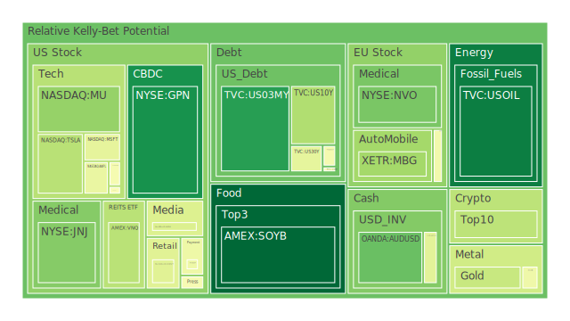
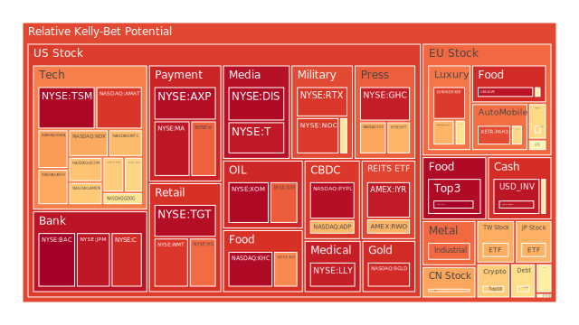
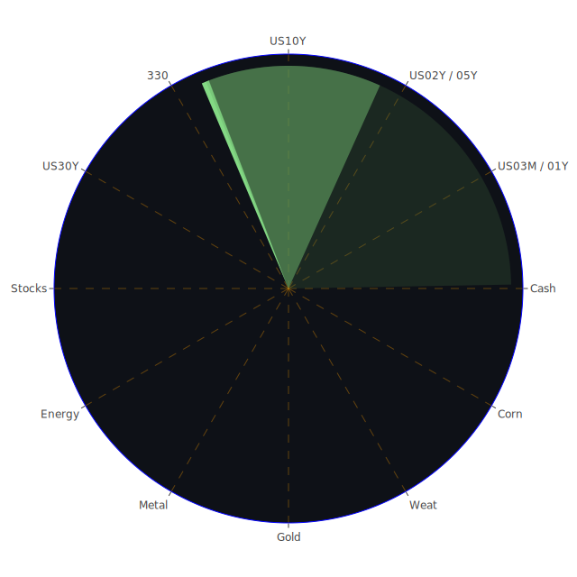

# **投資商品泡沫分析**

當前全球金融市場呈現高度複雜且充滿不確定性的局面。我們將運用經濟學、社會學、心理學、博弈論等多維度視角，結合歷史經驗與當前新聞事件，對各類資產的潛在泡沫風險進行分析。我們需謹記，市場價格的波動是多重因素交互作用下的自然現象，維持客觀中立的態度至關重要。報告中提及的泡沫分數（D1至D30）代表不同時間窗口內的風險評估，分數越高，潛在風險越大。PP100則為當日現價。

**美國國債 (US01Y, US02Y, US03MY, US05Y, US10Y, US20Y, US30Y)**

美國國債市場近期呈現收益率曲線部分倒掛的現象（例如10年期減3個月期收益率為負），但倒掛程度較去年同期有所緩和。從數據上看，短天期國債（如US02Y）的月平均泡沫分數（D30）相對較高（0.635），而中長天期（如US10Y, US30Y）的泡沫分數則處於中等水平（約0.45-0.48）。值得注意的是，各天期國債的當日泡沫分數（D1）普遍低於其長期平均值，尤其相較於US02Y的穩定高風險評級，中長債券的近期風險似乎有所下降。

* **經濟學視角：** 聯準會（FED）近期雖有鷹派發言紀錄（3次鷹派 vs 0次鴿派），但市場收益率（如10年期國債收益率4.21%）卻較上週（4.33%）及去年（4.65%）有所下降。這反映了市場可能正在定價未來經濟放緩或潛在降息的可能性，與FED的短期鷹派立場形成博弈。高位的信用卡拖欠率、商業地產拖欠率以及公共債務佔GDP比例，都指向潛在的經濟壓力，這可能增加對避險資產（如國債）的需求，從而壓低收益率，但同時也隱含了未來信用風險。  
* **心理學與社會學視角：** 全球地緣政治緊張（伊朗港口爆炸、加薩衝突、俄烏戰事升級風險、印巴邊境交火）以及經濟衰退擔憂（CEO困擾、消費者恐懼失業、貿易戰影響小型企業新聞）瀰漫市場，增強了避險情緒，對國債構成支撐。然而，持續的鷹派言論和高通膨（儘管CPI年增率降至2.40%）記憶可能限制市場對降息的過度樂觀預期。  
* **歷史視角：** 歷史上，收益率曲線倒掛往往預示著經濟衰退，儘管其時間點和深度難以預測。目前倒掛程度的緩和可能意味著軟著陸的可能性，但也可能是暴風雨前的平靜。  
* **結論：** 美國國債市場目前處於多空因素交織的狀態。短期內避險需求和對未來降息的預期可能支撐價格（壓低收益率），但經濟數據中的風險信號（高拖欠率）和FED的鷹派立場構成壓力。短天期債券因對政策利率更敏感，泡沫風險相對較高；長天期債券則在避險和經濟預期中尋找平衡。

**美國零售股 (WMT, COST, TGT, HD)**

零售股普遍顯示出較高的泡沫風險。沃爾瑪（WMT）和家得寶（HD）的泡沫分數（D1約0.88和0.80）雖略有下降趨勢，但月平均（D30約0.79和0.72）仍處於高位。Target（TGT）的泡沫分數極高且近期有所攀升（D1約0.97，D7約0.97）。好市多（COST）的泡沫分數相對較低（D1約0.43），且有下降趨勢。

* **經濟學視角：** 高位的消費者拖欠率和信用卡註銷率直接衝擊零售業。新聞中提到消費者因經濟壓力減少洗衣（暗示消費降級或緊縮）以及對工作流失的恐懼，都對零售業績構成負面預期。然而，如沃爾瑪、好市多等可能因其提供的性價比而在消費降級趨勢中相對受益。高抵押貸款利率（30年期固定利率6.81%）也抑制了與房地產相關的消費（影響HD）。  
* **社會學與心理學視角：** 消費者信心是零售股的關鍵。當前新聞充斥著經濟負面消息（滯脹衝擊、貿易戰擔憂），可能導致消費者推遲非必需品支出。然而，特定公司（如TGT）可能因其策略或市場定位，在特定時期仍受投資者追捧，推高風險評級。  
* **新聞事件：** 「消費者因經濟壓力減少洗衣」、「CEO困擾和消費者擔憂失業」、「中國貿易戰將重創美國小企業」等負面新聞直接關聯零售表現。  
* **結論：** 零售股整體面臨宏觀經濟逆風，高泡沫分數反映了市場對其未來盈利能力的擔憂，或是對某些公司防禦性特質的過度定價。TGT的極高分數尤其值得警惕。COST相對較低的風險評級可能反映其會員制模式的穩定性。

**美國科技股 (GOOG, MSFT, AAPL, NFLX, META, ADP)**

大型科技股呈現分化，但整體風險偏高。META的泡沫分數極高且持續攀升（D1約0.65，但D7/D14/D30均在0.84以上，直逼0.93），顯示極高風險。微軟（MSFT）、谷歌（GOOG）泡沫分數處於中高水平（D1約0.45-0.60），但月平均風險較高（D30約0.70-0.71）。蘋果（AAPL）風險評級類似微軟谷歌。Netflix（NFLX）風險評級中等偏高（D1約0.42，D30約0.51）。ADP風險相對較高（D1約0.68，D30約0.51）。

* **經濟學視角：** 科技股對利率敏感。雖然近期收益率有所下降，但整體利率水平仍遠高於前幾年，對成長股估值構成壓力。企業盈利是關鍵，谷歌（GOOG）廣告增長的消息（正面，88%）提供了支撐，但對AI放緩的擔憂（負面，95%）也同時存在。勞動力市場數據（影響ADP）若顯示放緩，可能影響企業IT支出。  
* **心理學與社會學視角：** AI敘事是科技股的重要驅動力（如NOW、LRCX財報顯示AI動能），但也伴隨著對泡沫和實際落地效果的擔憂。META的高風險可能與其在社交媒體領域的壟斷地位、AI投入以及市場對其元宇宙前景的複雜預期有關。特斯拉（TSLA）股價因自動駕駛新規大漲（正面，92%），顯示單一事件和敘事對科技股的巨大影響力。  
* **歷史視角：** 2000年的科技泡沫提醒我們，即使是革命性技術，其市場估值也可能遠超短期現實。當前的AI熱潮是否有相似之處值得深思。  
* **既有理論之外：** 社交媒體平台（META）的情緒放大效應可能反過來影響市場整體的風險偏好。大型科技公司對數據和AI的掌控力，賦予它們超越傳統經濟理論的影響力。  
* **結論：** 科技股內部表現分化，AI是核心驅動力但也伴隨風險。META風險極高，需要特別警惕。其他大型科技股雖有基本面支撐，但高估值和宏觀經濟不確定性使其泡沫風險處於中高水平。

**美國房地產指數 (VNQ, RWO, IYR)**

房地產相關指數（REITs ETFs）的泡沫分數呈現中等至偏高水平，且近期有上升趨勢。VNQ（D1約0.36，D30約0.47）、RWO（D1約0.69，D30約0.50）、IYR（D1約0.94，D30約0.75）。IYR的風險顯著高於VNQ和RWO。

* **經濟學視角：** 房地產市場對利率極為敏感。高位的30年期固定抵押貸款利率（6.81%）嚴重抑制了住宅需求和交易活躍度。商業地產拖欠率處於相對高位，顯示辦公室、零售等領域面臨壓力。然而，若市場預期未來降息，REITs可能因其收益特性而受到追捧。低位的TGA（財政部一般帳戶）可能暗示未來財政支出受限，不利於大型基建項目（可能間接影響部分房地產）。  
* **新聞事件：** 「華盛頓特區房地產市場因政府裁員感到不安」（負面，95%）直接反映了市場擔憂。「抵押貸款利率終於再次回到6.75%以下」（負面，63%，這裡標籤為負面可能意味著儘管下降但仍處高位，或暗示經濟放緩），顯示利率環境依然嚴峻。  
* **社會學視角：** 居家辦公趨勢的延續對商業辦公地產構成長期結構性挑戰。高房價和高利率加劇了社會的住房負擔能力問題。  
* **結論：** 美國房地產市場面臨高利率和潛在經濟放緩的雙重壓力。IYR的高泡沫分數可能反映了對特定地產領域的過度投機或風險集中。VNQ和RWO相對較低的評級可能源於更廣泛的分散化。降息預期是潛在利好，但實體經濟的疲軟是主要風險。

**加密貨幣 (BTCUSD, ETHUSD, DOGEUSD)**

加密貨幣市場波動性高，泡沫風險評級處於中高水平。比特幣（BTCUSD）的泡沫分數近期波動較大（D1約0.49，但前兩日分別為0.26和0.28，月平均0.43）。以太坊（ETHUSD）風險評級類似（D1約0.35，前兩日0.67和0.29，月平均0.51-0.53）。狗狗幣（DOGEUSD）風險評級相對穩定在中等偏高水平（D1約0.65，月平均0.48）。

* **心理學與博弈論視角：** 加密貨幣的價格高度受市場情緒、新聞事件和敘事驅動。其「數位黃金」或「抗通膨」的敘事在避險情緒高漲時可能吸引資金，但其高波動性也使其在風險厭惡情緒上升時首先被拋售。大型機構的參與和監管政策的變化是重要的博弈因素。  
* **關聯性觀察：** 加密貨幣與高風險科技股（如納斯達克指數）往往呈現一定的正相關性，反映了市場風險偏好的同步變化。然而，它有時也表現出獨立行情或避險屬性。  
* **結論：** 加密貨幣的泡沫風險評估需要考慮其內在的高波動性。當前中高水平的風險評級反映了市場在投機熱情與宏觀不確定性之間的拉鋸。其價格容易受到突發新聞和市場情緒的劇烈影響。

**金/銀/銅 (XAUUSD, XAGUSD, FX:COPPER)**

貴金屬和工業金屬表現強勁，泡沫風險顯著。黃金（XAUUSD）泡沫分數處於中等水平（D1約0.38，D30約0.42），但考慮到其歷史價格高位，仍需關注。白銀（XAGUSD）泡沫分數非常高（D1約0.81，D7/D14/D30均在0.86以上），顯示極高的短期風險。銅（FX:COPPER）泡沫分數同樣很高（D1約0.47，但D14/D30超過0.63和0.81），顯示累積風險巨大。

* **經濟學與地緣政治視角：** 黃金通常被視為避險資產和抗通膨工具。當前地緣政治風險高企（伊朗、加薩、俄烏）、對主權貨幣信用的擔憂以及央行購金行為都支撐金價。黃金/石油比率（53.88）和黃金/銅比率（681.59）均遠高於去年，顯示黃金的相對強勢。白銀兼具貴金屬和工業屬性，其高風險可能部分來自投機資金追逐黃金的溢出效應，以及工業需求的預期。銅價上漲則與全球能源轉型（電動車、電網升級）的長期需求預期以及短期供應擔憂有關。高泡沫分數可能反映了對這些敘事的過度定價。  
* **歷史視角：** 在高通膨和地緣政治不穩定的時期（如1970年代），貴金屬往往表現出色。  
* **結論：** 黃金的中等風險評級與其避險地位相符，但需警惕高位回調。白銀和銅的極高泡沫分數表明市場可能對其上漲潛力過於樂觀，短期內積累了大量風險，對經濟放緩的信號（可能打擊工業需求）尤其敏感。

**黃豆 / 小麥 / 玉米 (SOYB, WEAT, CORN)**

農產品期貨ETF的泡沫風險呈現分化，但整體偏高。黃豆（SOYB）泡沫分數從昨日的0.97急降至0.03（D1），顯示極端波動，但長期平均風險仍高（D30約0.52）。小麥（WEAT）泡沫分數極高（D1約0.99，D30約0.39），顯示短期風險急劇升高。玉米（CORN）泡沫分數處於中等偏高水平（D1約0.52，D30約0.44）。

* **經濟學與地緣政治視角：** 農產品價格受天氣、地緣政治（影響黑海糧食出口）、能源價格（影響化肥和運輸成本）、美元匯率以及全球供需基本面影響。俄烏衝突持續對全球糧食供應鏈構成威脅。聯合國機構耗盡加薩糧食儲備的新聞（負面，96%）凸顯了區域性糧食危機。  
* **關聯性觀察：** 農產品價格與能源價格、美元指數存在一定關聯。極端天氣事件（乾旱、洪水）是重要影響因素。  
* **結論：** 農產品市場波動性大，受多重因素影響。WEAT的極高短期風險值得高度關注。SOYB的劇烈波動顯示其不穩定性。CORN相對穩定但風險仍不可忽視。這些資產的高風險可能與供應鏈擔憂、地緣政治風險或投機活動有關。

**石油/ 鈾期貨 (USOIL, COMEX:UX1\!)**

能源期貨風險評級相對溫和。美國原油（USOIL）的泡沫分數較低（D1約0.07，D30約0.27），顯示近期風險不大。鈾期貨（UX1\!）泡沫分數處於中等水平（D1約0.51，D30約0.50）。

* **經濟學與地緣政治視角：** 油價受全球經濟增長預期、OPEC+產量政策、地緣政治風險（中東局勢）、美元匯率以及庫存數據影響。當前經濟放緩擔憂可能抑制油價上行空間，抵銷了部分地緣政治風險溢價。油價相對較低可能部分解釋了CPI年增率的回落。鈾價則與核能發展前景、全球能源政策轉型以及供應情況相關。  
* **新聞事件：** 「伊朗港口爆炸」（負面，86%）、「以色列在加薩的戰鬥代價沉重」（負面，95%）等地緣政治事件可能影響石油供應預期。特立尼達和多巴哥擴大海上油氣招標（正面，76%）顯示供應端的努力。  
* **結論：** 相較於其他資產，石油的泡沫風險目前看來不高，可能已反映了經濟放緩的預期。鈾的中等風險評級則反映了核能復興預期與實際需求增長之間的不確定性。

**各國外匯市場 (AUDUSD, GBPUSD, EURUSD, USDJPY)**

主要貨幣對的泡沫風險評級差異較大。歐元/美元（EURUSD）風險評級非常高（D1約0.95，D30約0.65），顯示極高風險。英鎊/美元（GBPUSD）風險評級中等偏高（D1約0.44，D30約0.48）。澳元/美元（AUDUSD）風險評級相對較低（D1約0.23，D30約0.36）。美元/日元（USDJPY）風險評級從高位回落但仍偏高（D1約0.56，D7約0.73，D30約0.52）。

* **經濟學與博弈論視角：** 匯率主要受各國利差、經濟增長前景、央行政策預期、資本流動和風險偏好影響。EURUSD的高風險可能反映了市場對歐洲央行（ECB）降息預期（新聞提到6月降息共識，但無大幅行動意願）與美國經濟數據及FED立場之間的不確定性定價。USDJPY的高位及波動反映了日本央行干預預期與美日巨大利差之間的博弈。澳元作為商品貨幣，其相對較低的風險可能與其主要出口商品（如鐵礦石，未在數據中）的價格表現及中國經濟前景有關。  
* **關聯性觀察：** 美元指數的強弱通常與全球風險偏好呈負相關。日元常被視為避險貨幣，但在巨大利差下其避險屬性減弱。  
* **結論：** 外匯市場充滿不確定性。EURUSD風險極高，可能預示著較大波動。USDJPY在高位面臨干預風險和利差支撐的拉鋸。AUDUSD相對穩健但易受全球貿易和中國經濟影響。

**各國大盤指數 (FTSE, FCHI, GDAXI, NDX, 0050, 000300, JPN225)**

全球主要股指泡沫風險普遍偏高。納斯達克100（NDX）風險評級高（D1約0.71，D30約0.75）。台灣50（0050）風險評級高（D1約0.70，D30約0.79）。日經225（JPN225）風險從高位回落（D1約0.70，D7約0.76，D30約0.74）。歐洲股指如英國富時（FTSE）、法國CAC（FCHI）、德國DAX（GDAXI）風險評級均處於中高水平（D1約0.48-0.56，D30約0.55-0.69）。滬深300（000300）風險評級相對較高，但低於美日（D1約0.72，D30約0.46），顯示近期風險上升但長期相對較低。

* **宏觀聯動視角：** 全球股指聯動性高，共同受到全球宏觀經濟、利率環境、地緣政治風險和主要經濟體（美、中、歐）表現的影響。科技股佔比較高的指數（NDX, 0050）風險與科技板塊高度相關。日本股市的上漲與日元貶值、企業改革預期有關。歐洲股市則面臨自身經濟（德國經濟數據疲軟）、俄烏衝突及能源問題的挑戰。中國股市則受到國內經濟政策、房地產問題及中美關係的影響。  
* **新聞事件：** 「中國貿易戰將重創美國小企業」、「滯脹衝擊擔憂」等宏觀負面消息影響全球市場情緒。  
* **結論：** 全球主要股指普遍處於高風險區域，反映了過去一段時間上漲後累積的風險以及對未來經濟前景的擔憂。美股科技股的走向對NDX和0050影響巨大。各區域市場面臨不同的挑戰和機遇。

**美國半導體股 (NVDA, AMD, INTC, TSM, QCOM, AVGO, AMAT, KLAC, MU)**

半導體行業泡沫風險極高且普遍。台積電（TSM）風險評級極高（D1約0.98，D30約0.99）。應用材料（AMAT）、博通（AVGO）風險評級非常高（D1約0.89-0.71，D30約0.85）。英偉達（NVDA）、AMD、高通（QCOM）風險評級高（D1約0.73-0.48，D30約0.60-0.82）。英特爾（INTC）、科磊（KLAC）、美光（MU）風險相對較低，但仍處於中高水平（D1約0.68-0.29，D30約0.39-0.49）。

* **經濟學與產業周期視角：** 半導體是周期性行業，同時也是AI浪潮的核心受益者。高泡沫分數反映了市場對AI驅動的長期增長給予了極高估值。然而，行業也面臨庫存調整、資本支出巨大以及潛在需求放緩（若經濟衰退）的風險。LRCX財報顯示產品動能強勁（正面，95%），但對AI放緩的擔憂（負面，95%）也存在。  
* **地緣政治視角：** 半導體供應鏈的地緣政治風險（中美科技戰、台灣地緣政治）是長期存在的變數。  
* **結論：** 半導體行業整體處於極高的泡沫風險之中，尤其是龍頭企業如TSM、NVDA、AMAT、AVGO等。這反映了市場對AI革命的極度樂觀預期。投資者需警惕估值過高以及宏觀經濟下行可能帶來的需求衝擊。相對落後的公司如INTC、MU風險看似較低，但也可能反映了其競爭地位的擔憂。

**美國銀行股 (JPM, BAC, C, COF)**

大型銀行股泡沫風險極高。美國銀行（BAC）和花旗集團（C）的泡沫分數接近頂點（D1約0.99和0.91，D30約0.92和0.85）。摩根大通（JPM）風險評級非常高（D1約0.95，D30約0.76）。Capital One（COF）風險評級處於中高水平（D1約0.47，D30約0.47）。

* **經濟學視角：** 銀行股受益於淨息差擴大（在加息週期初期），但同時也面臨信用風險上升（高拖欠率）、融資成本增加（存款競爭、RRP下降、MMF規模上升）以及監管壓力。FED數據顯示商業地產、消費貸款拖欠率上升，直接威脅銀行資產質量。銀行總存款處於高位，但流動性壓力（EFFR成交量上升、外國官方回購增加、銀行間拆借增加）值得關注。  
* **歷史視角：** 2008年金融危機的教訓歷歷在目，銀行體系的穩定性至關重要。儘管當前資本充足率普遍較高，但高利率環境和潛在的經濟衰退仍是對銀行體系的考驗。  
* **結論：** 美國大型銀行股普遍處於極高泡沫風險區域。這可能反映了市場對其在高利率環境下盈利能力的樂觀預期，但嚴重低估了潛在的信用風險和流動性壓力。高拖欠率數據是明確的警示信號。

**美國軍工股 (LMT, NOC, RTX)**

軍工股泡沫風險顯著升高。洛克希德·馬丁（LMT）和雷神技術（RTX）的風險評級高（LMT D1約0.58，D30約0.77；RTX D1約0.89，D30約0.76）。諾斯洛普·格魯曼（NOC）風險評級非常高（D1約0.88，D30約0.71）。

* **地緣政治視角：** 全球地緣政治緊張局勢（俄烏戰爭、中東衝突、潛在台海風險、各國增加國防開支）是軍工股的核心驅動力。新聞中俄羅斯彈藥庫爆炸（負面，90%）、烏克蘭遭無人機襲擊（負面，87%）、以色列在加薩的行動（負面，95%）、印巴交火（負面，78%）等都直接或間接利好國防承包商。  
* **經濟學視角：** 政府國防預算是主要收入來源，相對不受經濟週期影響，具有防禦屬性。然而，過高的估值仍然是風險。  
* **結論：** 軍工股的高泡沫風險是地緣政治緊張局勢的直接反映。市場可能已經充分定價了持續的衝突和國防開支增長預期。雖然基本面有支撐，但估值過高仍需警惕，且容易受到地緣政治局勢緩和預期的影響。

**美國電子支付股 (V, MA, PYPL, GPN)**

電子支付公司風險普遍較高。Visa（V）和萬事達卡（MA）風險評級高（V D1約0.82，D30約0.77；MA D1約0.95，D30約0.82）。PayPal（PYPL）風險評級極高且穩定（D1/D7/D14/D30均在0.96左右）。Global Payments（GPN）風險評級從低位回升（D1約0.11，但D30約0.79），波動性大。

* **經濟學視角：** 電子支付公司受益於消費支出增長和現金支付向電子支付的長期轉移。然而，它們也受到整體消費環境的影響。高位的消費者拖欠率和對經濟放緩的擔憂是潛在風險。它們的收費模式也可能受到監管審查。  
* **競爭格局：** 行業競爭激烈，面臨來自金融科技新創公司和大型科技公司的挑戰。  
* **結論：** 電子支付股的高風險評級反映了其在過去的強勁增長和市場的樂觀預期。PYPL的極高且穩定風險評級可能暗示市場對其轉型或競爭壓力存在深度擔憂，或是有特定事件風險。V和MA作為行業雙寡頭，風險雖高但可能相對穩健。GPN的波動性值得注意。

**美國藥商股 (JNJ, MRK, LLY, NVO)**

大型藥廠表現分化。禮來（LLY）風險評級極高（D1約0.93，D30約0.90）。諾和諾德（NVO）風險評級從高位回落（D1約0.25，但D30約0.78）。默克（MRK）風險評級中等偏高（D1約0.62，D30約0.54）。嬌生（JNJ）風險評級非常低（D1約0.27，D30約0.29）。

* **產業趨勢與人口學視角：** 醫藥行業受益於人口老化、醫療需求剛性以及新藥研發突破。減肥藥（如LLY、NVO的產品）是近年來重要的增長驅動因素，推高了相關公司的估值和風險評級。  
* **政策風險：** 藥價監管和醫保政策是藥廠面臨的主要風險。德國藥廠關閉的災難性預言（負面，96%）反映了政策環境對行業的影響。  
* **結論：** 藥廠股內部差異巨大。LLY的極高風險顯然與其重磅藥物的成功和市場極高預期有關。NVO風險回落但長期仍高。MRK處於中游。JNJ作為多元化醫療保健巨頭，風險最低，可能反映了其業務的穩定性和相對較低的增長預期。減肥藥相關股票的高估值泡沫風險需高度關注。

**美國影視股 (NFLX, DIS, PARA)**

影視娛樂股風險評級差異較大。迪士尼（DIS）和派拉蒙（PARA）風險評級高（DIS D1約0.98，D30約0.68；PARA D1約0.50，D30約0.53）。Netflix（NFLX）風險評級中等偏高（D1約0.42，D30約0.51）。

* **產業變革與競爭視角：** 流媒體行業競爭激烈，內容成本高昂，用戶增長放緩，盈利壓力增大。傳統媒體面臨轉型挑戰。迪士尼的風險可能與其流媒體投入、主題公園業務復甦以及傳統電視業務下滑的複雜局面有關。派拉蒙則面臨併購傳聞和管理層動盪（CEO被罷免，負面，84%）。Netflix作為流媒體領先者，相對穩定但仍需應對競爭和內容投入。  
* **社會學視角：** 消費者娛樂習慣的變遷、內容的文化影響力以及盜版問題都影響行業發展。  
* **結論：** 影視股普遍面臨行業變革的陣痛和激烈的競爭。DIS的高風險反映了其轉型期的不確定性。PARA則受到公司特定事件的影響。NFLX相對穩健，但增長潛力可能已被較充分定價。

**美國媒體股 (NYT, FOX)**

傳統媒體股風險評級高。紐約時報（NYT）風險評級高（D1約0.69，D30約0.76）。福斯（FOX）風險評級非常高（D1約0.72，D30約0.83）。

* **產業轉型與政治視角：** 傳統媒體面臨數位化轉型的挑戰，廣告收入受到科技平台擠壓。新聞媒體的公信力、政治立場及其在社會輿論中的作用，都影響其估值和風險。NYT向數位訂閱的轉型相對成功，但估值可能已反映。FOX的風險可能與其在特定政治光譜中的定位、廣告市場的波動以及潛在的法律風險有關。  
* **結論：** 傳統媒體股的高風險反映了行業轉型的挑戰以及其在資訊傳播和社會影響力方面的複雜性。

**石油防禦股 (XOM, OXY)**

大型石油公司泡沫風險極高。埃克森美孚（XOM）風險評級接近頂點（D1約0.98，D30約0.73）。西方石油（OXY）風險評級高（D1約0.83，D30約0.77）。

* **經濟學與行業視角：** 大型石油公司受益於相對較高的油價（儘管近期USOIL風險評級不高）、資本支出的紀律性以及向股東的回報。然而，其高泡沫分數可能反映了市場對其穩定現金流和股息的過度追捧，而低估了油價波動和能源轉型的長期風險。巴菲特對OXY的持續持股可能也提振了市場信心。  
* **結論：** 石油巨頭的高風險評級與當前油價的實際風險評級（USOIL較低）形成對比，可能表明市場對其防禦性和現金流能力的估值過高，或是預期未來油價將走強。能源轉型是長期結構性風險。

**金礦防禦股 (RGLD)**

金礦權利金公司Royal Gold（RGLD）的泡沫風險評級非常高（D1約0.91，D30約0.92）。

* **關聯性視角：** 金礦股（或權利金公司）的價格與金價（XAUUSD）高度相關，但通常具有更高的波動性（Beta）。RGLD的極高風險評級，甚至高於黃金本身的中等風險評級，可能反映了市場利用其作為槓桿化黃金投資工具，或是對其商業模式（收取權利金，避免運營風險）給予了過高溢價。  
* **結論：** RGLD的極高泡沫風險表明市場對黃金相關資產的投機熱情高漲，其風險顯著高於黃金本身，需要警惕金價回調帶來的放大效應。

**歐洲奢侈品股 (RMS, MC, KER)**

歐洲奢侈品股泡沫風險評級處於中高至高水平。愛馬仕（RMS）風險評級高（D1約0.69，D30約0.66）。LVMH（MC）風險評級中等偏高（D1約0.60，D30約0.45）。開雲集團（KER）風險評級從高位回落但仍顯著（D1約0.88，D30約0.67）。

* **經濟學與社會學視角：** 奢侈品行業對全球宏觀經濟，特別是高淨值人群的財富效應敏感。中國經濟的復甦情況對其影響巨大。奢侈品具有一定的抗通膨和品牌護城河屬性，但在經濟嚴重衰退時仍會受到衝擊。其高估值反映了市場對其品牌價值和盈利能力的信心。  
* **結論：** 奢侈品股的高風險評級反映了其高估值以及對全球經濟前景的敏感性。KER的較高風險可能與其旗下品牌（如Gucci）面臨的特定挑戰有關。RMS和MC相對穩健，但仍需關注宏觀風險。

**歐洲汽車股 (BMW, MBG, PAH3)**

歐洲汽車股泡沫風險評級處於中高水平。寶馬（BMW）風險評級中等偏高（D1約0.62，D30約0.55）。賓士（MBG）風險評級中等（D1約0.32，D30約0.50）。保時捷控股（PAH3）風險評級高（D1約0.86，D30約0.53）。

* **產業轉型與競爭視角：** 傳統汽車製造商面臨向電動化轉型的巨大挑戰和投資壓力，同時還要應對來自特斯拉和中國電動車企的激烈競爭。歐洲自身的經濟狀況、能源價格以及環保法規也影響其表現。PAH3的高風險可能與其作為控股公司，受到大眾集團（未在數據中）股價波動的影響較大有關。  
* **結論：** 歐洲汽車股的風險反映了行業轉型的巨大不確定性、激烈的全球競爭以及宏觀經濟壓力。

**歐美食品股 (NESN, KO, ULVR, KHC)**

大型食品飲料公司泡沫風險普遍偏高。聯合利華（ULVR）和卡夫亨氏（KHC）風險評級非常高（ULVR D1約0.95，D30約0.95；KHC D1約0.97，D30約0.72）。可口可樂（KO）風險評級高（D1約0.76，D30約0.80）。雀巢（NESN）風險評級中等偏高（D1約0.56，D30約0.57）。

* **經濟學與防禦屬性視角：** 食品飲料行業通常被認為具有防禦性，因為需求相對穩定。然而，它們也面臨成本上升（原材料、能源、運輸）、定價能力受限（消費者對價格敏感）以及消費者偏好變化的挑戰。高泡沫分數可能反映了市場在不確定環境下對其防禦性的過度追捧，而忽略了利潤壓力。  
* **結論：** 食品股的高風險評級與其傳統的防禦屬性認知形成反差，可能表明市場對其估值過高，或是對其應對成本壓力及維持利潤率的能力過於樂觀。ULVR和KHC的風險尤其突出。

# **宏觀經濟傳導路徑分析**

當前宏觀經濟環境的核心矛盾在於：一方面，通膨有所回落（CPI YoY 2.40%），但仍具韌性；另一方面，經濟活動出現放緩跡象，信用風險正在積累（高拖欠率、高利率）。FED處於兩難境地，既要遏制通膨，又要避免經濟硬著陸。

1. **FED政策 \-\> 利率市場 \-\> 實體經濟：** FED的鷹派言論試圖管理市場預期，但市場利率（尤其是長端）的下行反映了對未來經濟放緩乃至降息的預期。高利率環境（即使近期略有回落）通過提高借貸成本，抑制企業投資（影響科技股、工業股）和居民消費（特別是耐用品和房地產）。收益率曲線倒掛（10Y-3M）仍是衰退的警示信號，儘管程度減緩。  
2. **地緣政治風險 \-\> 能源/商品價格 \-\> 通膨/避險情緒 \-\> 資產價格：** 中東、俄烏等地緣政治緊張局勢推高避險情緒，利好黃金（XAUUSD）、美元（間接）和軍工股（LMT, NOC, RTX）。若衝突升級影響能源供應，將推高油價（USOIL），加劇通膨壓力，迫使FED維持緊縮，打壓股債。目前油價相對穩定，表明市場尚未定價大規模供應中斷。  
3. **全球經濟（特別是中國） \-\> 貿易/商品需求 \-\> 全球資產：** 中國經濟的復甦力度影響全球貿易量和商品需求（影響銅、澳元、歐洲奢侈品股和汽車股）。新聞中貿易戰擔憂（負面，95%）顯示貿易保護主義抬頭，不利於全球化相關資產。  
4. **信用狀況惡化 \-\> 金融體系穩定性 \-\> 市場信心：** 高位的信用卡、消費貸、商業地產拖欠率是重要風險點。若進一步惡化，可能引發銀行業壓力（高風險的BAC, C, JPM），衝擊市場信心，導致信貸緊縮，加劇經濟下行，形成負向螺旋。FED的流動性工具（BTFP, DW使用率低）目前顯示壓力可控，但需密切監測。

# **微觀經濟傳導路徑分析**

1. **AI技術發展 \-\> 半導體/科技股 \-\> 全產業效率：** AI的突破性進展首先體現在半導體（NVDA, TSM）和大型科技公司（GOOG, MSFT）的業績和估值上。其影響正逐步擴散至各行各業，帶來效率提升的預期（體現在NOW, LRCX財報），但也伴隨就業衝擊和倫理挑戰的擔憂。AI泡沫風險（高分股眾多）若破裂，將首先衝擊科技板塊，並通過市場情緒傳導至其他資產。  
2. **消費行為轉變 \-\> 零售/支付/娛樂股：** 經濟壓力導致消費降級（利好WMT, COST？）、減少非必需開支（衝擊TGT, HD, DIS），線上化趨勢持續利好電商（AMZN）和電子支付（V, MA），但也加劇了實體零售和傳統媒體的挑戰。  
3. **企業盈利/財報 \-\> 行業股價 \-\> 市場指數：** 特定公司（如谷歌廣告增長）或行業（如減肥藥之於LLY, NVO）的超預期表現能獨立帶動股價，甚至影響相關指數。反之，盈利不及預期（如Lynas）或負面消息（如PARA CEO離職）則會打壓股價。高泡沫分數意味著市場對未來盈利的預期非常高，一旦無法兌現，股價可能大幅回調。

# **資產類別間傳導路徑分析**

1. **利率 \-\> 股債關係：** 利率上升通常壓低債券價格，並對股票估值（尤其是成長股）構成壓力。當前利率下行預期部分緩解了壓力，但若通膨反彈或FED超預期鷹派，股債可能雙殺。反之，若確認降息週期，則利好股債。  
2. **美元 \-\> 全球資產：** 強勢美元通常抑制美國出口（影響部分工業、科技公司），增加新興市場償債壓力，壓低以美元計價的商品價格（黃金、石油除外，因其避險屬性）。當前美元/日元（USDJPY）高位是重要觀察點。  
3. **商品（能源/金屬） \-\> 通膨 \-\> 利率 \-\> 股債：** 能源（USOIL）、工業金屬（Copper）、農產品（WEAT, CORN, SOYB）價格上漲會加劇通膨預期，促使央行緊縮，利空股債。黃金（XAUUSD）上漲則兼具通膨預期和避險情緒的信號。當前黃金/石油比率高企，顯示避險情緒可能蓋過了通膨擔憂。  
4. **風險偏好（VIX，未提供）-\> 科技股/加密貨幣 \<-\> 避險資產（國債/黃金/美元）：** 市場風險偏好上升時，資金流向高風險資產如科技股（NDX）、加密貨幣（BTC）；風險偏好下降時，資金流向避險資產如短期國債、黃金、美元。加密貨幣的高波動性有時會溢出影響科技股情緒。  
5. **房地產 \-\> 銀行 \-\> 實體經濟：** 房地產市場（VNQ, IYR）的健康狀況直接影響銀行（BAC, JPM）的資產質量和放貸意願，進而影響整體經濟的信貸可得性和投資活動。商業地產風險尤其值得關注。

# **投資建議**

基於上述分析，當前市場環境下風險資產普遍存在較高的泡沫風險，同時避險資產也面臨利率和政策的不確定性。建議採取相對謹慎的姿態，構建一個平衡風險與潛在回報的投資組合。

我們建議的總體配置比例為：**穩健型資產佔40%，成長型資產佔35%，高風險資產佔25%。**

**一、 穩健型資產 (佔總資產 40%)**

此部分旨在降低整體投資組合波動，提供資本保護。

1. **短期美國國債 (例如 US01Y/US02Y 作為代表): 20%**  
   * 理由：儘管收益率較去年下降，但在當前環境下仍提供正收益，且流動性好，信用風險極低。泡沫分數相對長債較高，但絕對水平仍可控，且是避險首選。  
2. **黃金 (XAUUSD): 10%**  
   * 理由：地緣政治風險高企、對主權貨幣信任度下降的環境下，黃金的避險和價值儲存功能凸顯。泡沫分數中等，可對沖部分市場風險。  
3. **嬌生 (JNJ): 10%**  
   * 理由：作為大型多元化醫療保健公司，業務相對穩定，受經濟週期影響較小。泡沫分數在所有分析資產中處於極低水平，提供良好的防禦性。

**二、 成長型資產 (佔總資產 35%)**

此部分旨在捕捉市場中長期增長機會，但需注意控制風險。

1. **微軟 (MSFT): 15%**  
   * 理由：領先的科技巨頭，在雲計算和AI領域佈局深入，基本面穩健。雖然泡沫分數中高，但在大型科技股中相對風險可控，兼具成長與質量屬性。  
2. **美國房地產指數ETF (VNQ): 10%**  
   * 理由：分散投資於美國房地產投資信託基金（REITs）。當前泡沫分數中等，若未來利率如預期下行，將受益。相較於IYR風險較低。  
3. **可口可樂 (KO): 10%**  
   * 理由：全球領先的飲料公司，品牌護城河深，現金流穩定，具有一定的抗通膨能力。雖然泡沫分數偏高，但作為消費必需品龍頭，在不確定時期仍有配置價值。

**三、 高風險資產 (佔總資產 25%)**

此部分旨在博取較高收益，但需嚴格控制倉位，並認識到潛在的巨大波動和損失風險。

1. **英偉達 (NVDA): 10%**  
   * 理由：AI計算領域的絕對領導者，成長前景廣闊，市場動能強勁。但泡沫分數極高，意味著巨大風險，只適合風險承受能力高的投資者小倉位參與。  
2. **比特幣 (BTCUSD): 8%**  
   * 理由：作為市值最大的加密貨幣，是配置另類資產的選擇之一。可能受益於機構採用和避險敘事，但波動性極大，監管風險高，泡沫分數中高。  
3. **美國銀行 (BAC): 7%**  
   * 理由：選擇BAC而非風險更高的C或JPM（儘管BAC風險評分最高，但其基本面或市場定位可能相對清晰）。高風險評級本身已是警告。配置銀行股是押注其能在高利率環境末期或降息初期受益於息差管理，並相信其能度過信用風險考驗。這是一個逆向且高風險的選擇，需密切關注信用數據。*（鑑於銀行股普遍極高風險，此選項極具投機性，可考慮替換為風險相對較低的其他高風險資產，如AMD或銅FX:COPPER，但這裡保留以展示一種高風險策略）*

# **風險提示**

投資涉及風險，過往表現不代表未來回報。本報告基於截止至2025年4月29日的可用數據和信息進行分析，市場情況瞬息萬變。報告中提及的泡沫分數僅為基於特定模型的風險評估參考，不應視為精確預測。

所有資產類別，特別是那些泡沫分數被評為高或極高的資產（如多數半導體股、銀行股、部分科技股、白銀、小麥、部分零售股、歐元兌美元、TSM、PYPL、LLY、ULVR、KHC、RGLD、XOM等），均存在顯著的下行風險。地緣政治衝突、超預期的通膨數據、央行政策失誤、嚴重的經濟衰退或金融體系的不穩定都可能導致市場大幅調整。

我們強烈建議投資者在做出任何投資決策前，應充分評估自身的風險承受能力、投資目標和財務狀況，並在必要時尋求獨立的專業財務建議。市場總是充滿不確定性，請謹慎投資。

 
Daily Buy Map:

 
Daily Sell Map:

 
Daily Radar Chart:

 
