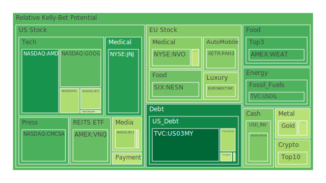
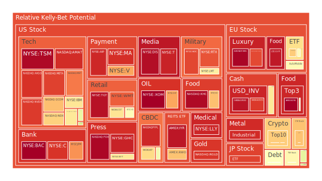
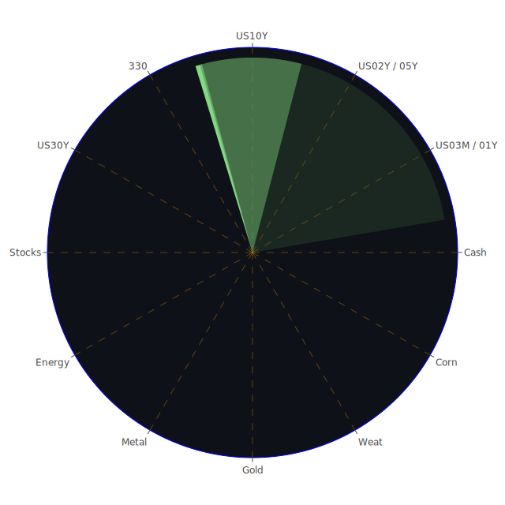

# **當前市場環境概述**

截至2025年4月30日，全球金融市場正處於一個充滿挑戰與機遇的交匯點。經濟數據呈現複雜景象，部分指標顯示韌性，而另一些則暗示潛在的衰退風險。聯準會（FED）的經濟數據顯示，雖然部分流動性指標如逆回購（RRP）使用量下降、貨幣市場基金總資產上升，顯示市場流動性結構的變化，但同時，信用卡壞帳率、商業地產及消費者貸款的拖欠率處於相對高位，高收益債券利率亦然。這與新聞中瀰漫的「停滯性通膨衝擊」擔憂、企業執行長困境以及消費者對失業的恐懼相互呼應，共同描繪出一幅經濟前景不明的畫面。聯準會官員近期的鷹派發言，以及去年同期相比顯著下降但仍處高位的各期限美國國債收益率，特別是持續的部分殖利率曲線倒掛（例如10年期減3個月期），更增添了市場對未來政策路徑及其經濟影響的不確定性。地緣政治方面，伊朗港口火災、加薩走廊人道危機、烏克蘭戰事持續等地緣政治緊張局勢，以及國際貿易關係（如川普關稅言論引發的談判與市場波動）的潛在變數，都在持續影響投資者情緒與資產定價。在這樣的背景下，對各類資產的泡沫風險進行評估，並探討宏觀與微觀層面的傳導路徑，對於制定審慎的投資策略至關重要。

# **投資商品泡沫分析**

* 美國國債 (US03MY, US01Y, US02Y, US05Y, US10Y, US30Y)  
  美國國債市場近期呈現收益率從高點回落的趨勢。以10年期國債為例，目前收益率約4.17%，顯著低於去年同期的4.64%，也低於上週與上月水平。然而，從風險指標來看，短期國債（如 US02Y）的月度風險分數相對較高，而較長天期的債券風險則呈現分化，部分固定在特定水平（如 US05Y, US30Y 的風險分數在不同時間段內保持不變，可能反映數據更新頻率或模型特性）。短天期（如 US03MY）的風險指標近期有上升趨勢。新聞中提到，債券市場正經歷「新世界秩序」，投資者對長債的恐懼感加深，這可能與通膨預期、財政赤字以及聯準會政策的不確定性有關。從歷史角度看，殖利率曲線倒掛（如 10Y-3M 利差為負）常被視為經濟衰退的前兆，儘管其預測能力並非百分之百。社會心理層面，對經濟前景的悲觀預期可能促使資金流向被視為避險資產的國債，但對通膨持續性的擔憂又可能抑制其吸引力。聯準會持有的美國國債部位仍處於高位，其縮減資產負債表的步伐是影響市場流動性與債券定價的關鍵變數。  
* 美國零售股 (WMT, TGT, COST, HD)  
  零售股表現分化。沃爾瑪 (WMT) 和家得寶 (HD) 的風險指標在近期和月度都處於相當高的水平（D30 分別約 0.78 和 0.72），顯示市場對其估值存在疑慮。Target (TGT) 的風險同樣居高不下，尤其是短期指標。好市多 (COST) 的風險評分雖略有波動，但整體偏高。這與新聞中提到的消費者對失業的恐懼以及經濟不明朗的狀態相符。從經濟學角度看，高利率環境、信用卡壞帳率上升（FED數據）可能抑制消費支出，對零售業績造成壓力。歷史上，經濟下行週期中，必需消費品零售商（如 WMT）通常較非必需品零售商（可能部分影響 HD, TGT）更具防禦性，但目前的數據顯示普遍存在風險。社會層面，消費習慣的改變（例如線上購物比例增加）以及對價格敏感度的提升，都可能影響各零售商的市場份額與利潤率。高風險評分可能反映了市場對於這些企業能否在潛在的「停滯性通膨」環境下維持增長和利潤率的擔憂。  
* 美國科技股 (AAPL, MSFT, GOOG, META, AMZN, NVDA, TSLA)  
  科技股普遍呈現較高的風險水平。Meta (META) 的風險指標在各時間維度均非常高（D30 接近 0.93），可能反映了其在AI領域的積極投入帶來的估值提升，但也伴隨著巨大的泡沫疑慮。亞馬遜 (AMZN)、微軟 (MSFT)、谷歌 (GOOG) 的風險評分也處於中高至高位。蘋果 (AAPL) 和輝達 (NVDA) 的風險指標同樣偏高，特別是NVDA的短期風險近期有顯著升高。特斯拉 (TSLA) 的風險評分雖有波動，但整體處於中等偏上水平。新聞層面，大型科技公司的財報季備受關注，但關稅不確定性（新聞提及可能影響 AAPL 等）為其前景蒙上陰影。AI的熱潮無疑是推動許多科技股（尤其是 NVDA, META, MSFT, GOOG）估值的重要因素，但從歷史角度看，技術革新往往伴隨著泡沫的產生與破滅（如2000年的網路泡沫）。心理學上，FOMO（害怕錯過）情緒可能在AI相關股票中扮演重要角色。經濟學上，高利率環境對成長型科技股的估值構成壓力，因為未來現金流的折現值會降低。然而，部分科技巨頭強勁的現金流和市場主導地位又為其提供了一定的支撐。風險指標普遍偏高，警示投資者需注意估值過高的風險。  
* 美國房地產指數 (VNQ, IYR, RWO)  
  美國房地產投資信託（REITs）指數顯示出顯著的風險。IYR 和 VNQ 的當日和近期風險指標非常高（D1 接近 0.96）。RWO 的風險指標近期也有所上升。這與聯準會數據顯示的商業地產拖欠率處於高位，以及30年期固定抵押貸款利率仍維持在6.81%的高水平（遠高於去年同期的2.96%）相吻合。經濟學角度看，高利率顯著增加了融資成本，抑制了房地產交易活動和開發意願。商業地產尤其面臨遠程辦公趨勢帶來的空置率上升壓力。歷史上，房地產市場的下行往往與更廣泛的經濟衰退相關聯。社會層面，居家辦公模式的普及可能長期改變對辦公空間的需求。心理層面，對房價下跌的預期可能導致潛在買家持幣觀望。儘管部分指數的月度風險指標（D30）相對緩和，但短期和中期的高風險警示該行業仍面臨嚴峻挑戰。  
* 加密貨幣 (BTCUSD, ETHUSD, DOGEUSD)  
  加密貨幣市場表現出較高的波動性和風險。比特幣 (BTCUSD) 的價格雖處於歷史高位附近，但其風險指標波動較大，近期D1有所回落後再度升高。以太坊 (ETHUSD) 的風險指標也處於中高水平，且近期有上升趨勢。狗狗幣 (DOGEUSD) 的風險指標則相對平穩但仍處於中等水平。從新聞角度看，缺乏直接相關的重大新聞，但整體市場情緒（受宏觀經濟、監管政策等影響）對加密貨幣影響顯著。經濟學上，加密貨幣常被視為風險資產，其表現與市場流動性、風險偏好高度相關。歷史上，加密貨幣經歷過多次劇烈的牛熊轉換，泡沫破裂的風險始終存在。心理學層面，投機情緒和社交媒體的影響力在加密市場中尤為突出。博弈論角度看，早期採用者的巨大收益吸引了後續參與者，但市場的零和或負和特性（考慮交易成本和能源消耗）意味著高風險。目前中高水平的風險指標反映了其內在的波動性和潛在的泡沫疑慮。  
* 金/銀/銅 (XAUUSD, XAGUSD, COPPER)  
  貴金屬和工業金屬表現各異。黃金 (XAUUSD) 價格處於歷史高位，其風險指標近期有所緩和但整體仍在中等偏上水平。白銀 (XAGUSD) 的價格也顯著上漲，其風險指標非常高，尤其是D7、D14、D30均值顯示風險持續累積，近期D1雖有波動但維持高位。銅 (COPPER) 的價格亦走強，風險指標，特別是月度指標 (D30 接近0.8)，顯示出較高的泡沫風險。新聞方面，地緣政治緊張局勢通常有利於黃金等避險資產。黃金/石油比率（Gold Oil Ratio）達到55.07，遠高於去年同期的27.95，顯示黃金相對於石油的強勢，可能反映了避險需求的提升或對經濟增長前景的擔憂（影響石油需求）。經濟學上，黃金通常被視為抗通膨和避險工具，但在高利率環境下，持有黃金的機會成本增加。白銀兼具貴金屬和工業金屬屬性，其高風險可能與投機活動和工業需求預期（如綠色能源轉型）有關。銅價上漲通常被視為經濟活動的領先指標（「銅博士」），其高風險可能反映了對未來需求的樂觀預期與供應緊張的擔憂，但也可能包含過度投機的成分。  
* 黃豆 / 小麥 / 玉米 (SOYB, WEAT, CORN)  
  農產品市場風險指標呈現分化且波動。黃豆 (SOYB) 的風險指標經歷了從極高水平回落的過程，但 D30 仍顯示過去一個月存在較高風險。小麥 (WEAT) 的風險指標近期大幅波動，從極高回落後又有所反彈，其月度風險指標相對較低。玉米 (CORN) 的風險指標處於中等偏上水平，近期有所上升。農產品價格受天氣、地緣政治（影響供應鏈和化肥成本）、全球需求以及投機等多重因素影響。例如，烏克蘭戰事對全球糧食供應格局產生了深遠影響。經濟學上，糧食價格是構成消費者物價指數（CPI）的重要部分，其波動會影響通膨預期和貨幣政策。社會層面，糧食安全問題在全球範圍內日益受到關注。歷史上，極端天氣事件或地緣政治衝突常導致農產品價格劇烈波動。目前波動的風險指標反映了該市場固有的不確定性。SOYB 和 WEAT 的 D1 指標在短短幾天內從接近1 跳動到較低再反彈，顯示短期市場情緒或供需信息的劇烈變化。  
* 石油/ 鈾期貨 (USOIL, UX1\!)  
  能源市場風險相對緩和，但存在不確定性。原油 (USOIL) 價格從近期高點回落，其風險指標目前處於較低水平，D1、D7、D14、D30均值顯示風險趨於下降。鈾期貨 (UX1\!) 的風險指標處於中等水平，相對穩定。新聞顯示，油價受到貿易戰擔憂和中國經濟前景的影響，但地緣政治風險（如伊朗港口火災、中東局勢）可能隨時為油價帶來上行壓力。經濟學上，油價是影響全球通膨和經濟增長的關鍵因素。高油價會侵蝕消費者購買力，增加企業成本。歷史經驗表明，地緣政治衝突是導致油價飆升的主要驅動因素之一。從博弈論角度看，OPEC+的產量決策對全球油價有著舉足輕重的影響。鈾作為核燃料，其價格與全球能源轉型政策、核電發展前景密切相關。目前 USOIL 的低風險評分可能反映了近期價格的回調，但潛在的地緣政治風險和需求前景的不確定性依然存在。  
* 各國外匯市場 (EURUSD, GBPUSD, USDJPY, AUDUSD)  
  外匯市場風險狀況各異。歐元/美元 (EURUSD) 風險指標極高，尤其是短期指標，顯示市場對其未來走勢存在巨大分歧或波動預期。英鎊/美元 (GBPUSD) 風險指標處於中等水平，相對穩定。美元/日圓 (USDJPY) 風險指標處於中高水平，且波動較大，近期有所回落。澳元/美元 (AUDUSD) 風險指標近期急劇升高，顯示短期不確定性大增。外匯市場受到各國經濟基本面、利率差異、央行政策、資本流動以及風險偏好等多重因素影響。例如，USDJPY 的高波動性與美日之間巨大的利率差異以及日本央行政策動向密切相關。EURUSD 的高風險可能反映了對歐元區經濟前景（受能源價格、烏克蘭局勢影響）和歐洲央行政策路徑的擔憂。AUDUSD 的波動可能與大宗商品價格（澳洲是主要出口國）和全球風險情緒有關。從博弈論看，各國央行之間的政策協調與競爭，以及市場參與者對政策意圖的解讀，都在塑造匯率走勢。  
* 各國大盤指數 (NDX, FTSE, GDAXI, 0050, 000300, JPN225, FCHI)  
  全球主要股指風險普遍偏高。美國納斯達克100 (NDX) 風險指標處於中高水平。英國富時100 (FTSE) 和德國DAX (GDAXI) 的風險評分亦在中高位徘徊，且 FTSE 的月度風險較高。台灣50 (0050)、日經225 (JPN225) 的風險指標均處於高位。法國CAC40 (FCHI) 和中國滬深300 (000300) 的風險評分也處於中高水平。這反映了全球經濟前景不明、通膨壓力、地緣政治風險以及貿易緊張局勢等多重負面因素對股市的普遍影響。新聞中充斥著對經濟衰退、企業盈利下滑以及關稅影響的擔憂。歷史上，全球股市同步下跌往往與系統性風險事件或全球經濟衰退相關。心理層面，恐慌情緒容易在各市場間傳染。儘管不同市場面臨的具體挑戰不同（如中國經濟的結構性問題、歐洲的能源依賴等），但全球化背景下，風險很容易跨市場傳播。高風險指標普遍存在，警示全球股市面臨調整壓力。  
* 美國半導體股 (NVDA, AMD, TSM, INTC, QCOM, MU, AVGO, AMAT, KLAC)  
  半導體行業整體處於高風險區域。輝達 (NVDA)、超微 (AMD)、台積電 (TSM)、應用材料 (AMAT)、博通 (AVGO)、高通 (QCOM) 的風險指標均處於高位甚至極高水平。美光 (MU) 和科磊 (KLAC) 的風險評分相對較低但仍在中等水平。英特爾 (INTC) 的風險評分波動較大，近期處於中等偏上。該行業是AI浪潮的最大受益者之一，但也因此積聚了相當大的估值泡沫風險。新聞顯示，儘管部分公司（如 Teradyne）預期需求強勁，但關稅不確定性和全球經濟放緩可能抑制需求。經濟週期對半導體行業影響顯著，歷史上經歷過多次供需失衡導致的榮枯循環。地緣政治因素（如晶片法案、出口管制）也對行業格局產生重要影響。社會層面，對先進技術的依賴日益加深，使得半導體成為戰略性產業。高風險評分反映了市場對該行業未來增長預期的極度樂觀與現實挑戰之間的巨大張力。  
* 美國銀行股 (JPM, BAC, C, COF)  
  美國主要銀行股普遍處於極高的風險水平。摩根大通 (JPM)、美國銀行 (BAC)、花旗集團 (C) 以及第一資本金融 (COF) 的風險指標在近期和月度均處於非常高的位置（D1 和 D30 普遍高於0.8甚至0.9）。這與聯準會數據顯示的信用卡壞帳率、商業地產和消費者貸款拖欠率上升密切相關。經濟學上，銀行業績與宏觀經濟狀況息息相關，經濟下行、利率上升（雖然近期有所回落但仍在高位）會增加銀行的信用風險和融資成本。歷史經驗（如2008年金融危機）表明，銀行體系的穩定對整體經濟至關重要。新聞中對經濟前景的擔憂，特別是「停滯性通膨」風險，對銀行業構成威脅。儘管聯準會數據顯示美國銀行總存款處於相對高位，但高企的風險指標強烈暗示市場對銀行資產品質和未來盈利能力的擔憂。  
* 美國軍工股 (LMT, NOC, RTX)  
  軍工股風險指標處於中高至高位。洛克希德·馬丁 (LMT)、諾斯洛普·格魯曼 (NOC) 和雷神技術 (RTX) 的風險評分均較高，且近期呈現波動或上升趨勢。從新聞角度看，持續的地緣政治緊張局勢（烏克蘭、中東等）以及各國增加國防開支的趨勢，為軍工企業提供了訂單支持。經濟學上，國防開支具有一定的逆週期性，但在財政壓力下也可能面臨削減。社會層面，關於軍費開支的倫理和效率爭議持續存在。歷史上，戰爭或長期武裝對峙時期往往是軍工企業的繁榮期。博弈論角度，國際軍備競賽的動態深刻影響行業需求。目前的風險評分可能反映了市場對地緣政治紅利的預期與高估值之間的平衡。  
* 美國電子支付股 (V, MA, AXP, PYPL, GPN)  
  電子支付行業風險普遍偏高。Visa (V)、萬事達卡 (MA)、美國運通 (AXP) 的風險指標處於高位。PayPal (PYPL) 的風險指標極高，且相當穩定地維持在高位。Global Payments (GPN) 的風險指標雖相對較低，但近期有抬頭趨勢。該行業受益於現金支付向電子支付的長期轉型趨勢，但同時也面臨日益激烈的競爭和監管壓力。經濟學上，其業績與消費支出密切相關，因此受到宏觀經濟波動的影響。聯準會數據顯示的信用卡壞帳率和拖欠率上升，對該行業構成直接風險。社會層面，支付方式的創新（如先買後付、數字貨幣）不斷改變行業格局。高風險評分可能反映了對經濟放緩影響消費支出、競爭加劇以及估值過高的擔憂，特別是 PYPL 可能還面臨轉型挑戰。  
* 美國藥商股 (JNJ, MRK, LLY, NVO)  
  大型藥廠表現分化。禮來 (LLY) 的風險指標極高，且持續處於高位，可能與其減肥藥等重磅產品的市場預期有關。諾和諾德 (NVO) 的風險指標也處於高位，並在近期有所上升。嬌生 (JNJ) 的風險指標相對較低且穩定。默克 (MRK) 的風險指標則處於中等水平，近期有所波動。製藥行業通常被視為防禦性板塊，因其需求相對不受經濟週期影響。然而，藥品定價壓力、專利懸崖、研發失敗風險以及監管政策變化是其面臨的主要挑戰。歷史上看，成功的重磅藥物能為公司帶來巨額利潤，但也可能導致估值泡沫。社會層面，人口老化和醫療保健需求的增加是行業長期增長的驅動力。心理層面，對突破性療法的期待可能推高領先企業的估值。LLY 和 NVO 的高風險可能反映了市場對其明星產品的極高預期，稍有不達預期就可能引發劇烈調整。  
* 美國影視股 (NFLX, DIS, PARA)  
  影視娛樂行業風險處於中高水平。Netflix (NFLX) 的風險指標處於中等偏上，相對穩定。迪士尼 (DIS) 的風險指標處於極高水平，尤其是短期指標。派拉蒙全球 (PARA) 的風險指標處於中等水平。該行業正經歷流媒體轉型帶來的激烈競爭和商業模式重塑。經濟學上，廣告收入和訂閱用戶增長受到經濟狀況和消費者可支配收入的影響。社會層面，內容創作的趨勢、版權保護以及消費者觀看習慣的改變都在塑造行業未來。歷史上看，技術變革（如從DVD到流媒體）曾多次顛覆行業格局。博弈論角度，內容庫的競爭、平台間的合縱連橫是關鍵。DIS 的高風險可能與其轉型挑戰、主題公園業務的經濟敏感性以及內容策略的不確定性有關。  
* 美國媒體股 (GOOG, META, NYT, FOX, CMCSA)  
  媒體股風險狀況不一。谷歌 (GOOG) 和 Meta (META) 作為數字廣告巨頭，風險已在科技股部分討論。紐約時報 (NYT) 的風險指標處於中高水平，且相對穩定。福斯 (FOX) 和康卡斯特 (CMCSA) 的風險指標也處於中高水平，FOX 的短期風險近期升高，而 CMCSA 則相對波動。傳統媒體面臨數字化轉型的巨大壓力，廣告收入受到科技平台擠壓，付費訂閱模式成為重要轉型方向。經濟學上，廣告支出是順週期性的，經濟放緩會對其造成衝擊。社會層面，假新聞、信息繭房以及公眾對媒體信任度的變化是行業面臨的挑戰。政治因素（如選舉週期、監管政策）對媒體行業影響顯著。高風險評分反映了行業轉型的陣痛以及宏觀經濟的不確定性。  
* 石油防禦股 (XOM, OXY)  
  大型石油公司風險指標處於高位。埃克森美孚 (XOM) 和西方石油 (OXY) 的風險評分均處於高位，且相對穩定地維持在高水平。儘管原油價格近期有所回落，風險指標趨緩，但這些整合型石油公司的風險評分依然居高不下。這可能反映了市場對其長期前景的擔憂，例如能源轉型壓力、環保政策風險以及未來油價波動的不確定性。經濟學上，其盈利能力與油價高度相關，但也受益於煉油和化工業務的多元化。歷史上，石油巨頭經歷過多次油價暴漲暴跌的週期。社會層面，ESG（環境、社會、治理）投資理念的興起對傳統能源公司構成壓力。高風險評分可能體現了市場對其在能源轉型大背景下長期價值的疑慮，以及對短期盈利波動的擔憂。  
* 金礦防禦股 (RGLD)  
  皇家黃金 (RGLD) 作為一家黃金權利金公司，其風險指標處於極高水平，並且持續維持在高位。這與黃金本身 (XAUUSD) 的風險狀況形成對比（黃金風險近期有所緩和）。通常金礦股或權利金公司被認為是黃金價格的槓桿化投資，其股價波動性往往大於黃金本身。經濟學上，其收入與黃金價格和合作礦山的產量直接相關，但也受到運營成本、地緣政治風險（礦山所在地）等因素影響。歷史上，金礦股在金價上漲週期中表現突出，但在下跌週期中跌幅也更深。極高的風險評分可能反映了市場對黃金價格能否持續維持高位以及對該公司特定風險（如合作夥伴運營狀況）的高度敏感性。  
* 歐洲奢侈品股 (MC, RMS, KER)  
  歐洲奢侈品股票風險呈現分化。LVMH (MC) 的風險指標處於中等水平，近期有所波動。愛馬仕 (RMS) 的風險指標處於高位，近期略有回落。開雲集團 (KER) 的風險指標處於高位，且近期有上升趨勢。奢侈品行業對宏觀經濟，特別是高淨值人群的財富效應較為敏感。經濟學上，全球經濟放緩、地緣政治風險（影響旅遊零售）以及主要市場（如中國）的需求變化是影響業績的關鍵因素。社會層面，品牌價值、設計潮流以及可持續發展理念對消費者選擇影響日益增加。歷史經驗表明，奢侈品行業具有一定的韌性，但也會受到嚴重經濟衰退的衝擊。不同公司的風險差異可能反映了其品牌定位、市場佈局和對當前宏觀環境的曝險程度不同。  
* 歐洲汽車股 (MBG, BMW, PAH3)  
  歐洲汽車製造商風險指標處於中等偏上至高位。賓士 (MBG) 風險指標處於中等水平。寶馬 (BMW) 風險指標處於中等偏上水平。保時捷控股 (PAH3) 風險指標處於高位，近期波動較大。汽車行業正經歷向電動化的深刻轉型，同時面臨供應鏈問題、成本上升、全球需求放緩以及日益激烈的競爭（尤其是來自中國電動車製造商）。新聞中提及，關稅不確定性可能影響通用汽車 (GM)，這也可能波及歐洲同行。經濟學上，汽車銷售是典型的順週期行業。高利率環境增加了消費者購車的貸款成本。社會層面，環保法規、自動駕駛技術的發展正在重塑行業格局。博弈論角度，在電動化轉型中的巨額投資和技術路線選擇充滿不確定性。風險評分反映了行業轉型期的挑戰和宏觀經濟壓力。  
* 歐美食品股 (NESN, ULVR, KHC, KO)  
  大型食品飲料公司風險狀況各異。雀巢 (NESN) 風險指標處於中等水平。聯合利華 (ULVR) 風險指標極高，且穩定維持在高位。卡夫亨氏 (KHC) 風險指標同樣處於極高水平。可口可樂 (KO) 風險指標處於中高水平。食品飲料行業通常被視為防禦性板塊，但目前普遍偏高的風險評分值得關注。經濟學上，成本壓力（原材料、能源、運輸）和定價能力是影響利潤率的關鍵。儘管需求相對穩定，但消費者可能轉向更便宜的自有品牌。社會層面，對健康、天然、可持續食品的需求不斷增長。ULVR 和 KHC 的極高風險可能反映了市場對其品牌組合、定價能力或轉型策略的擔憂。KO 的風險相對較低，可能得益於其強大的品牌和全球分銷網絡。

# **宏觀經濟傳導路徑分析**

當前宏觀環境下，幾條主要的傳導路徑值得關注：

1. **停滯性通膨風險路徑**：新聞中瀰漫的「停滯性通膨」擔憂，結合聯準會數據顯示的高壞帳率和拖欠率，以及相對較低的CPI年增率（2.40%，但仍高於目標），可能形成如下傳導：持續的物價壓力（即使增速放緩）+ 經濟增長疲軟（企業困境、消費者恐懼） \-\> 企業利潤受擠壓，裁員風險上升 \-\> 消費者支出進一步萎縮 \-\> 經濟陷入低增長、高失業、相對高通膨的困境 \-\> 對股市（尤其是週期性板塊和高估值成長股）和信用市場（高收益債、銀行貸款）構成壓力，可能推升避險資產（如黃金）需求。  
2. **地緣政治與貿易摩擦路徑**：中東、烏克蘭等地緣政治緊張，以及潛在的貿易保護主義抬頭（新聞中川普關稅言論引發的波動），可能通過以下方式傳導：能源和商品價格波動（影響 USOIL, COPPER, 農產品） \-\> 通膨預期不穩 \-\> 供應鏈擾動風險增加 \-\> 企業成本上升，全球貿易萎縮 \-\> 影響跨國公司業績（如科技、汽車、零售） \-\> 全球經濟增長承壓，市場避險情緒升溫 \-\> 資金流向美元、黃金等避險資產，或區域性回流（例如，若貿易壁壘增加）。  
3. **貨幣政策與流動性路徑**：聯準會維持相對鷹派立場（近期官員講話），儘管市場預期未來可能降息，但時點和幅度仍不確定。同時，聯準會縮減資產負債表。傳導路徑：相對較高的利率水平（各期限殖利率仍顯著高於疫情前）+ 流動性逐漸收緊（RRP下降，但M M F資產上升顯示資金尋求安全收益） \-\> 融資成本維持高位 \-\> 抑制企業投資和消費者信貸（房貸利率、信用卡利率高企） \-\> 經濟活動降溫 \-\> 對利率敏感的資產（如成長股、房地產）估值構成壓力，銀行面臨更大的信用風險。

# **微觀經濟傳導路徑分析**

從企業和行業層面看，傳導路徑更為具體：

1. **AI技術擴散路徑**：AI熱潮持續 \-\> 半導體 (NVDA, AMD, TSM 等) 和雲計算 (MSFT, AMZN, GOOG) 需求旺盛 \-\> 相關公司營收增長，但估值已處於極高水平（高風險指標） \-\> 若AI商業化落地不及預期或遭遇瓶頸，可能引發板塊估值劇烈修正 \-\> 影響整體科技股乃至大盤指數。同時，AI應用可能提升其他行業生產力（潛在利好），但也可能帶來就業結構調整（社會影響）。  
2. **成本壓力傳導路徑**：能源、原材料（如銅）、勞動力成本維持高位 \-\> 製造業、建築業、零售業、食品飲料業 (KHC, ULVR) 等利潤空間受擠壓 \-\> 企業可能通過提價轉嫁成本（加劇通膨）或削減成本（影響供應鏈、裁員） \-\> 影響企業盈利能力和股價表現，消費者購買力下降可能導致需求萎縮。  
3. **信用風險傳導路徑**：高利率環境 \+ 經濟放緩預期 \-\> 消費者和企業償債壓力增大（FED數據顯示拖欠率上升） \-\> 銀行 (BAC, JPM, C) 資產品質惡化，需計提更多壞帳準備 \-\> 信貸標準收緊 \-\> 中小企業和依賴信貸的消費者融資困難 \-\> 經濟活力下降，可能引發局部或系統性金融風險。電子支付公司 (V, MA, PYPL) 也面臨交易量增速放緩和壞帳風險。

# **資產類別間傳導路徑分析**

不同資產類別之間存在複雜的相互影響：

1. **股債關係傳導**：通膨預期和利率走向是關鍵。若通膨頑固、利率維持高位 \-\> 債券吸引力相對提升（尤其是短債），對股票（特別是高估值成長股 NDX, NVDA）構成壓力，形成「股債雙殺」或「債優於股」的局面。若經濟衰退擔憂加劇，避險情緒可能推動資金同時流入國債（壓低收益率）和黃金，而流出股票。目前 10Y-3M 利差為負，暗示市場對短期風險的擔憂高於長期。  
2. **商品與通膨傳導**：大宗商品價格（USOIL, COPPER, 農產品）上漲 \-\> 推升通膨預期 \-\> 可能迫使央行採取更緊縮政策 \-\> 不利於債券和對利率敏感的股票。反之，商品價格下跌有助於緩解通膨壓力。目前黃金/石油比率高企，可能反映市場對避險（黃金）的需求超過了對經濟增長驅動的商品（石油）的需求。  
3. **美元與全球資產傳導**：美元強弱受利率差異、避險情緒、美國經濟相對表現等因素影響。強勢美元 \-\> 可能壓抑以美元計價的商品價格（如黃金），增加美國跨國公司匯兌損失，對新興市場構成資本外流壓力。弱勢美元則反之。目前 USDJPY 的高風險和高波動，反映了利差交易和干預預期的複雜博弈。EURUSD 的極高風險則顯示對歐美經濟前景和政策分化的不確定性。  
4. **風險偏好傳導**：市場風險偏好上升時 \-\> 資金傾向於流入股票（尤其是科技股、週期股）、加密貨幣 (BTCUSD, ETHUSD)、高收益債等風險資產 \-\> 避險資產（如國債、黃金、美元）可能承壓。風險偏好下降時則反之。新聞情緒（如對經濟衰退的擔憂加劇）是影響風險偏好的重要因素。目前多數風險資產的高泡沫評分，暗示一旦風險偏好逆轉，可能出現劇烈調整。

# **投資建議**

基於上述分析，當前市場環境複雜多變，風險與機遇並存。投資者應根據自身的風險承受能力、投資目標和投資期限，審慎構建投資組合。以下提供三種不同風險偏好的配置建議，僅供參考：

1. **穩健型投資組合 (Conservative Portfolio)**  
   * **目標:** 追求資本保值，降低波動性，應對不確定性。  
   * **配置比例:**  
     * 50% 短期美國國債/類現金：例如，可參考 US03MY 或 US01Y 所代表的資產類別，提供流動性和相對安全性。  
     * 25% 黃金 (XAUUSD 代表類別)：作為傳統避險資產，對沖地緣政治風險和潛在的貨幣貶值風險。儘管 RGLD 風險高，但黃金本身風險相對可控。  
     * 25% 低波動防禦性股票：選擇風險指標相對較低、現金流穩定的必需消費品、醫療保健或公用事業股票，例如 JNJ (風險相對低)、KO (風險中高但品牌強勢)、NESN (風險中等)。  
   * **理由:** 在經濟前景不明、多數資產風險偏高的背景下，此組合優先考慮本金安全。短期國債提供穩定收益，黃金提供避險功能，防禦性股票在經濟下行時通常表現相對穩健。  
2. **成長型投資組合 (Growth Portfolio)**  
   * **目標:** 尋求長期資本增值，願意承受中等程度的風險。  
   * **配置比例:**  
     * 45% 全球多元化股票：可通過追蹤全球主要指數（如MSCI World）的基金實現，分散單一市場風險。涵蓋美股 (NDX 代表的部分科技股)、歐股 (GDAXI, FCHI 代表的部分藍籌股) 和部分新興市場。  
     * 20% 美國中期國債：可參考 US05Y 或 US10Y 所代表的資產類別，平衡股票風險，並可能在未來降息週期中受益。  
     * 10% 貴金屬 (黃金/白銀，XAUUSD/XAGUSD 代表類別)：保留部分避險功能，白銀的高波動性也帶來潛在增長機會（風險亦高）。  
     * 25% 精選成長主題股票：側重於具有長期增長潛力但估值相對合理的領域，例如部分基本面穩健的科技股 (MSFT 風險雖高但地位穩固)、醫療創新 (LLY 風險極高需謹慎，MRK 風險中等可考慮)、或受益於能源轉型的相關產業（避開風險極高的）。  
   * **理由:** 此組合試圖在風險可控的前提下捕捉增長機會。全球化配置降低地域集中風險，債券提供穩定性，貴金屬對沖尾部風險，精選成長股則力求超額收益。  
3. **高風險型投資組合 (Aggressive Portfolio)**  
   * **目標:** 追求最大化回報，能夠承受較大的市場波動和潛在損失。  
   * **配置比例:**  
     * 55% 高增長科技/半導體股票：集中投資於引領技術革新的公司，如AI相關的 NVDA, AMD, META 等，儘管其風險指標極高，但潛在回報也可能最高。  
     * 15% 加密貨幣 (BTCUSD/ETHUSD 代表類別)：作為高波動性的另類資產，尋求非相關性回報，但需認識到其巨大的泡沫風險和監管不確定性。  
     * 15% 新興市場股票：尋求更高的經濟增長潛力，但也伴隨著更高的政治和匯率風險。  
     * 15% 商品期貨/相關股票：例如投機性配置銅 (COPPER 代表類別) 或能源 (USOIL 代表類別)，或相關的高風險股票如 OXY，博弈價格波動。  
   * **理由:** 此組合高度集中於高風險、高潛在回報的資產類別，旨在最大化收益。投資者必須充分理解並接受可能出現的大幅虧損。這類配置適合風險承受能力極強、投資期限較長且對特定領域有深入研究的投資者。

# **風險提示**

本報告基於提供的歷史數據和新聞資訊進行分析，並融入經濟學、社會學、心理學及博弈論等多維度視角，旨在提供客觀、全面的市場觀察。然而，所有分析和預測均基於假設，未來市場的實際發展可能與預期存在顯著差異。

金融市場本質上充滿不確定性，各類資產的價格波動可能受到未預見事件的影響。數據顯示，當前多個資產類別，特別是部分科技股、半導體股、銀行股、房地產指數以及白銀等，呈現出較高的泡沫風險指標，投資者應對此保持高度警惕。高風險指標意味著相關資產價格遠超其歷史常態或基本面所能支撐的水平，一旦市場情緒逆轉或基本面惡化，可能面臨劇烈的價格回調。

地緣政治風險、宏觀經濟政策變化（尤其是主要央行的貨幣政策）、以及不可預測的黑天鵝事件，都可能對市場造成衝擊。本報告提供的投資建議僅為基於當前信息的判斷，不構成任何投資邀約或承諾。

投資涉及風險，過往表現不預示未來回報。投資者在做出任何投資決策前，應充分評估自身的財務狀況、投資目標、風險承受能力，並在必要時尋求獨立的專業財務建議。請謹記，投資決策的責任最終由投資者自行承擔。

 
Daily Buy Map:

 
Daily Sell Map:

 
Daily Radar Chart:

 
