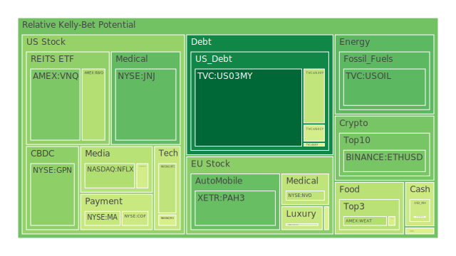
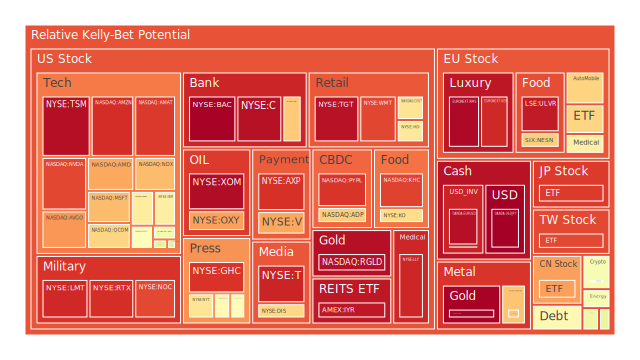
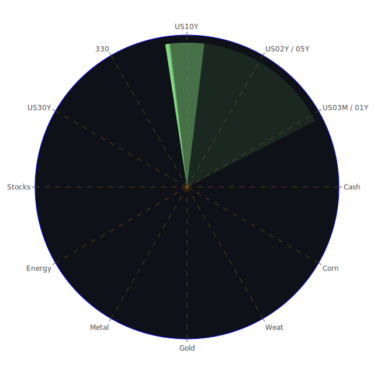

# **投資商品泡沫分析**

在當前複雜多變的宏觀環境下，評估各類資產的潛在風險至關重要。我們觀察到不同資產類別呈現出顯著分化的風險態勢，這既反映了市場參與者的預期差異，也暗示了潛在的資本流動方向。以下將針對各主要投資品種進行分析，旨在呈現一個基於客觀數據、經過深思熟慮的結論。

**美國國債**

美國國債市場近期呈現出有趣的動態。從短期來看，例如三個月期國債 (US03MY)，其風險感知度相對較低 (D1約0.15)，但相比於過去一個月 (D30約0.36)，風險似乎有所下降。這可能反映了市場對於短期內聯準會政策路徑的預期趨於穩定，或是避險需求的暫時性減弱。然而，觀察一年期 (US01Y)、兩年期 (US02Y)、五年期 (US05Y)、十年期 (US10Y) 乃至三十年期 (US30Y) 國債，其風險感知度普遍處於中等水平 (D1約在0.3至0.6之間)。值得注意的是，兩年期國債的風險感知度相對較高 (D1約0.61)，且短期與長期風險評估趨於一致，暗示市場對中期政策路徑的不確定性依然存在。

從經濟學角度看，聯準會的資產負債表規模處於相對低位，而準備金則處於高位，這表明銀行體系流動性相對充裕。然而，逆回購工具 (RRP) 使用量下降，同時貨幣市場基金總資產上升，可能意味著資金正在尋找新的去處，部分可能流向風險較低的資產，但也可能預示著對未來市場波動的擔憂。社會心理層面，聯準會近期偏鷹派的發言（3次鷹派，0次鴿派）可能強化了市場對利率維持高位的預期，進而影響債券的定價與風險感知。歷史上，在利率政策轉向預期不明朗的時期，債券市場常伴隨著波動加劇。收益率曲線方面，十年期與三個月期利差 (10Y-3M) 仍處於倒掛狀態 (-0.13)，雖然幅度較去年同期 (-1.33) 大幅收窄，但倒掛本身仍是傳統經濟衰退的警示信號。然而，長天期利差 (如30Y-3M) 為正值 (0.39)，顯示市場對遠期經濟前景並非全然悲觀。總體而言，美國國債市場呈現出短期風險緩和、中長期不確定性猶存的局面，不同期限的國債反映了市場對經濟與政策路徑的不同解讀，存在結構性的機會與風險。

**美國零售股**

零售行業面臨著複雜的經營環境。以大型零售商沃爾瑪 (WMT) 和塔吉特 (TGT) 為例，它們的風險感知度均處於較高水平。沃爾瑪的當前風險評估 (D1約0.88) 與月度平均 (D30約0.78) 相比有所上升，顯示短期風險顧慮增加。塔吉特的風險感知度更是居高不下 (D1約0.97)，且短期風險評估高於長期平均 (D30約0.85)，暗示市場對其前景的擔憂尤為顯著。倉儲式零售商好市多 (COST) 的風險感知度也處於中高水平 (D1約0.65)，近期有所緩和，但月度平均 (D30約0.51) 仍顯示持續的關注。家裝零售商家得寶 (HD) 的風險感知度亦不低 (D1約0.63)，且月度平均風險 (D30約0.71) 維持高位。

經濟學上，消費者信貸拖欠率（尤其是信用卡和一般消費貸款）處於相對高位，這直接影響了零售商的銷售前景和壞帳風險。雖然總體銀行存款水平尚高，但信貸緊縮的跡象不容忽視。社會層面，高企的房貸利率 (30年期固定房貸利率達6.81%) 擠壓了消費者的可支配收入，尤其對非必需品消費構成壓力。新聞事件中，關於關稅不確定性的討論頻繁出現，這對依賴全球供應鏈的零售商構成了潛在的成本壓力與經營風險。心理學角度看，持續的通脹擔憂（儘管年化CPI已降至2.40%）和對經濟前景的不確定感，可能導致消費者行為趨於保守。博弈論視角下，零售商之間可能陷入更激烈的價格競爭以維持市場份額，進一步壓縮利潤空間。歷史上，在經濟下行或高利率時期，非必需消費品零售商往往表現較為脆弱。目前的高風險評估反映了市場對這些挑戰的綜合考量。

**美國科技股**

科技股板塊內部呈現顯著分化，但整體風險感知度偏高。大型科技股如微軟 (MSFT) 和蘋果 (AAPL) 的風險感知度均不低，微軟D1約0.72，蘋果D1約0.51，兩者的月度風險評估 (D30分別約0.70和0.64) 也顯示市場對其估值和未來增長持續抱有疑慮。亞馬遜 (AMZN) 的風險感知度極高 (D1約0.92)，且月度風險評估 (D30約0.82) 也處於高位，暗示其電商和雲業務面臨的挑戰被市場高度關注。谷歌 (GOOG) 的風險感知度相對溫和 (D1約0.63)，但月度平均 (D30約0.68) 仍顯示一定程度的擔憂。值得注意的是臉書母公司 Meta (META)，其風險感知度雖有波動 (D1約0.58)，但月度平均風險極高 (D30約0.91)，反映了市場對其廣告收入前景、元宇宙投入以及監管風險的高度敏感。

從經濟學角度看，高利率環境對成長型科技股的估值構成壓力。雖然部分公司如輝達 (Nvidia，NVDA) 和超微 (AMD) 受益於人工智能 (AI) 的結構性需求，但其風險感知度也處於高位（NVDA D1約0.88，AMD D1約0.75），顯示市場對其高估值的擔憂。新聞事件中，關於AI發展、晶片需求（如Teradyne對測試工具需求樂觀）以及雲服務需求（如F5 Networks預期強勁）的消息提供了正面支撐，但同時關稅不確定性也給科技行業帶來陰影。社會心理層面，AI浪潮引發的樂觀情緒與對經濟前景的擔憂相互交織，使得科技股的投資情緒較為複雜。博弈論視角，科技巨頭之間在AI、雲計算等領域的競爭日趨激烈，投入巨大，但也面臨贏家通吃的風險。歷史上，科技泡沫的破裂往往伴隨著估值過高和宏觀環境的逆轉。納斯達克100指數 (NDX) 的風險感知度 (D1約0.72, D30約0.74) 也印證了科技板塊整體的謹慎氛圍。

**美國房地產指數**

美國房地產市場的風險信號值得高度關注。房地產指數ETF如VNQ和IYR的風險感知度均處於較高水平。VNQ的當前風險評估 (D1約0.35) 相對平穩，但IYR的風險評估則顯著偏高 (D1約0.96)，且高於其月度平均 (D30約0.75)，暗示市場對特定房地產領域或該指數構成的擔憂加劇。另一房地產相關ETF RWO 的風險感知度亦不低 (D1約0.43)。

經濟數據顯示，商業地產拖欠率和房地產貸款拖欠率均處於相對高位，這直接印證了房地產市場面臨的壓力。高企的30年期固定房貸利率 (6.81%) 大幅增加了購房者的負擔，抑制了需求，也增加了現有浮動利率貸款持有者的違約風險。社會層面，遠程辦公的普及對商業辦公樓需求產生了結構性影響，而高房價和高利率使得年輕一代的購房能力下降。歷史上，房地產市場的下行週期往往與利率上升和經濟放緩相伴。從心理角度看，對房價可能下跌的預期以及對經濟衰退的擔憂，使得投資者對房地產相關資產持謹慎態度。儘管聯準會總資產規模下降可能意味著市場流動性邊際收緊，但銀行體系的高準備金或可提供一定的緩衝。然而，信貸違約率上升的趨勢是明確的風險點。房地產市場的高風險評估反映了利率壓力、信貸風險以及潛在需求疲軟的多重困境。

**加密貨幣**

加密貨幣市場，以比特幣 (BTCUSD) 和以太坊 (ETHUSD) 為代表，呈現出中等偏高的風險感知度。比特幣的當前風險評估 (D1約0.57) 高於其月度平均 (D30約0.44)，顯示近期投機情緒有所升溫或波動性加大。以太坊的風險感知度相對較低 (D1約0.34)，但與月度平均 (D30約0.52) 相比有所回落。狗狗幣 (DOGEUSD) 的風險感知度也處於中等水平 (D1約0.53)。

從經濟學角度看，加密貨幣作為一種高風險資產，其價格對全球流動性狀況和市場風險偏好高度敏感。聯準會的鷹派立場和相對較高的利率環境，理論上不利於這類非生息資產。然而，其「數位黃金」的敘事在某些時候使其呈現出一定的避險屬性，儘管這種屬性並不穩定。社會心理層面，加密貨幣市場受到社群情緒、監管消息和技術發展等多重因素影響，波動性極大。近期風險評估的上升可能與特定事件或市場傳聞有關，也可能反映了在傳統資產風險增加時，部分資金尋求另類投資標的。博弈論視角下，加密貨幣市場是典型的投機者博弈場所，價格容易受到大戶操控和市場情緒的劇烈影響。歷史經驗表明，加密貨幣經歷過多次劇烈的牛熊轉換，泡沫與崩盤交替出現。當前中等偏高的風險評估，提示投資者需警惕其內在的高波動性和潛在的監管風險。

**金/銀/銅**

貴金屬和工業金屬市場呈現分化。黃金 (XAUUSD) 的風險感知度近期顯著升高 (D1約0.99)，遠超其月度平均 (D30約0.44)，這是一個非常值得警惕的信號，暗示短期內可能存在極高的投機熱度或避險情緒的集中爆發。歷史上，黃金價格的急劇拉升往往預示著市場對現有體系的信任危機或極端的避險需求，但也可能只是短期資金推動的結果。白銀 (XAGUSD) 的風險感知度也處於較高水平 (D1約0.71)，且持續高於月度平均 (D30約0.86顯示為長期高位)，表明市場對白銀的投機興趣或工業需求預期持續存在。銅 (COPPER) 的風險感知度處於中等水平 (D1約0.49)，但其月度平均風險評估極高 (D30約0.79)，顯示市場對銅的需求前景長期看好（可能與能源轉型相關），但短期內可能受到經濟放緩擔憂的壓制。

經濟學上，黃金通常被視為對抗通脹和貨幣貶值的工具，以及地緣政治風險的避險資產。近期黃金風險感知度飆升，可能與地緣政治緊張、對法定貨幣體系的擔憂，或是對未來降息的預期有關。黃金/石油比率 (56.15) 和黃金/銅比率 (708.12) 均處於歷史相對高位，顯示黃金相對於能源和工業金屬的強勢。白銀兼具貴金屬和工業屬性，其高風險評估可能反映了這兩方面因素的疊加。銅作為重要的工業金屬，其價格與全球經濟活躍度密切相關，長期高風險評估可能源於對綠色能源轉型帶來巨大銅需求的預期，但短期則受到經濟數據疲軟的影響。從社會心理角度看，對黃金的信仰根深蒂固，在不確定性時期容易吸引資金。銅的「厄運博士」稱號則反映了其價格與經濟預期的緊密聯繫。目前金、銀的高風險狀態，特別是黃金的極端短期風險信號，需要投資者高度警惕回調風險。

**黃豆 / 小麥 / 玉米**

農產品市場的風險狀況各異。黃豆 (SOYB) 的風險感知度近期有所上升 (D1約0.54)，但月度平均 (D30約0.54) 顯示風險水平相對穩定在中等區間。玉米 (CORN) 的風險感知度也處於中等水平 (D1約0.49)，且風險評估相對穩定。小麥 (WEAT) 的風險感知度則波動較大，前一日數據顯示極高風險 (0.99)，但今日數據回落至中等水平 (D1約0.42)，其月度平均風險 (D30約0.39) 相對較低，這可能反映了短期供需失衡或天氣因素引發的劇烈波動。

經濟學上，農產品價格受供需基本面、天氣狀況、地緣政治（如影響黑海糧食出口）、能源價格（影響化肥和運輸成本）以及美元匯率等多重因素影響。社會層面，糧食安全問題日益受到關注，極端天氣事件頻發也增加了供應的不確定性。心理學角度，對通脹的擔憂會傳導至食品價格，進而影響農產品期貨市場的情緒。博弈論視角，大型糧食貿易商和國家儲備機構的行為對市場價格有顯著影響。從歷史看，異常天氣或地緣衝突往往會導致農產品價格飆升。近期小麥市場的劇烈波動提示了該品種易受短期事件衝擊的特性。總體而言，農產品市場的風險水平相對溫和，但需關注個別品種因特定因素引發的短期波動風險。

**石油 / 鈾期貨**

能源市場方面，美國原油 (USOIL) 的風險感知度相對較低 (D1約0.31)，且低於月度平均 (D30約0.25顯示為長期低位)，這可能反映了市場對全球經濟增長放緩導致需求減弱的擔憂，或是供應相對充足的預期。新聞中提到廉價原油正在考驗美國頁岩油的盈虧平衡點，以及Petrobras產量略有下降，但同時蘇利南石油產業有望增長，這些多空因素交織。歷史上，油價常因地緣政治衝突、OPEC+產量決策和經濟週期而劇烈波動。當前較低的風險感知度可能暗示市場預期相對平穩，但也需警惕突發事件引發的價格波動。

鈾期貨 (UX1\!) 的風險感知度處於中等水平 (D1約0.56)，且月度平均 (D30約0.51) 也相對穩定。經濟學上，鈾價主要受核電發展前景的影響。隨著全球對能源安全和低碳轉型的日益重視，核電作為一種穩定且低排放的能源選項，其長期需求看好。新聞中提到中國批准新建十座核反應堆，這對鈾需求是長期利好。社會心理層面，公眾對核能的接受度、核廢料處理問題以及核安全擔憂，都會影響核電政策和鈾價預期。博弈論視角下，鈾供應相對集中，主要生產國的政策和產量對市場影響較大。當前中等風險水平可能反映了長期需求看好與短期經濟不確定性之間的平衡。

**各國外匯市場**

外匯市場的風險感知度呈現顯著差異。美元兌日元 (USDJPY) 的風險感知度極高，當前風險評估達到峰值1.00，月度平均 (D30約0.55) 也處於高位，顯示市場對日元匯率的極度關注和擔憂，可能與日本央行的貨幣政策、美日利差以及干預預期有關。歐元兌美元 (EURUSD) 的風險感知度也處於極高水平 (D1約0.97)，且月度平均 (D30約0.68) 也偏高，暗示市場對歐元區經濟前景或歐洲央行政策存在較大不確定性。英鎊兌美元 (GBPUSD) 的風險感知度相對溫和 (D1約0.47)，但月度平均 (D30約0.46) 顯示持續的關注。澳元兌美元 (AUDUSD) 的風險感知度也處於中等偏高水平 (D1約0.54)，可能受到大宗商品價格和中國經濟前景的影響。

經濟學上，匯率由利率差異、經濟增長前景、貿易平衡、資本流動以及央行政策等多重因素決定。聯準會的鷹派立場和相對較高的美國利率，為美元提供了支撐。然而，日本央行可能退出超寬鬆政策的預期、歐洲經濟的掙扎以及英國的通脹問題，都給各自貨幣帶來了壓力。社會心理層面，市場對央行干預的預期（尤其是日本）、對地緣政治風險的反應，都會影響匯率波動。新聞中西班牙和葡萄牙的大規模停電事件，雖然看似孤立，但也可能引發對歐洲基礎設施穩定性和經濟韌性的擔憂，間接影響歐元。博弈論視角，外匯市場是各國央行、大型金融機構和投機者之間複雜博弈的場所。USDJPY和EURUSD的極高風險評估，表明市場正處於關鍵的博弈節點，潛在波動性極大。

**各國大盤指數**

全球主要股市指數的風險感知度普遍偏高。美國納斯達克100指數 (NDX) 風險感知度為0.72 (D1)，道瓊斯工業平均指數和標普500指數雖然未直接給出數據，但從相關個股表現和新聞情緒（如市場對關稅和盈利前景的擔憂）推斷，風險亦不低。台灣加權指數ETF (TWSE:0050) 的風險感知度較高 (D1約0.88)，且月度平均 (D30約0.78) 也維持高位，可能與科技股佔比較高以及地緣政治風險有關。日本日經225指數 (JPN225) 風險感知度非常高 (D1約0.90)，月度平均 (D30約0.74) 也處於高位，顯示市場對日本股市經歷大幅上漲後的估值和未來走向存在擔憂。中國滬深300指數 (SSE:000300) 的風險感知度也相對較高 (D1約0.76)，但相比月度平均 (D30約0.48) 有所上升，可能反映了近期市場情緒的變化或對政策刺激的預期。

歐洲方面，德國DAX指數 (GDAXI) 風險感知度中等 (D1約0.49)，法國CAC40指數 (FCHI) 風險感知度較高 (D1約0.68)，英國富時100指數 (FTSE) 風險感知度中等偏高 (D1約0.53)。歐洲指數的風險評估普遍高於美國原油，但低於部分高風險科技股和貴金屬。經濟學角度，全球股市受到共同的宏觀因素影響，如利率水平、通脹預期、經濟增長前景，但也受到各自國內經濟狀況、產業結構和政策的影響。社會心理層面，投資者情緒的傳染效應在全球市場日益顯著，地緣政治風險和全球性事件（如歐洲停電）會引發普遍擔憂。博弈論視角，各國股市之間的資金流動和相對表現，反映了投資者對不同區域風險收益比的判斷。整體來看，全球主要股指普遍處於風險較高區域，特別是經歷了顯著上漲的市場如日本和台灣，以及科技股權重較高的市場，回調風險值得關注。

**美國半導體股**

半導體行業是當前市場關注的焦點，其風險感知度普遍較高。輝達 (NVDA) 作為AI浪潮的領軍者，風險評估極高 (D1約0.88)，儘管相比月度平均 (D30約0.63) 有所回落，但絕對水平仍顯示高度的市場熱情與擔憂並存。超微 (AMD) 的風險感知度也較高 (D1約0.75)。應用材料 (AMAT) 和科磊 (KLAC) 作為半導體設備製造商，風險感知度亦處於高位 (AMAT D1約0.90, KLAC D1約0.52)，且AMAT的月度風險評估 (D30約0.85) 持續偏高。高通 (QCOM) 和美光 (MU) 的風險感知度也分別達到0.68和0.49 (D1)。英特爾 (INTC) 風險感知度相對較低 (D1約0.45)，可能反映了其在競爭中相對落後的局面。台積電 (TSM) 作為行業龍頭，風險感知度極高 (D1約0.97)，且月度風險評估 (D30約0.99) 也處於極端高位，顯示市場對其產能、定價能力以及地緣政治風險的高度關注。

經濟學上，半導體行業具有明顯的週期性，同時也受到技術革新（如AI）帶來的結構性需求的強烈影響。當前高企的風險評估反映了市場對AI需求持續性的預期、高估值以及潛在的供應鏈風險和地緣政治緊張。新聞中Teradyne對測試工具需求的樂觀預測，以及Trump可能推動Nvidia等公司在美投資的消息，為行業提供了正面催化劑。然而，關稅不確定性依然是潛在的陰影。社會心理層面，AI的革命性敘事極大地提振了投資者對半導體行業的信心，但也容易引發非理性繁榮。博弈論視角，晶片設計、製造和設備領域的競爭格局正在發生變化，各國政府的產業政策也加劇了競爭的複雜性。歷史經驗表明，半導體行業的泡沫往往伴隨著產能過剩和需求不及預期。目前極高的風險評估，尤其是TSM，警示投資者需注意潛在的估值回調和地緣政治風險。

**美國銀行股**

美國銀行股的風險感知度普遍較高，甚至達到警戒水平。美國銀行 (BAC) 的風險評估極高 (D1約0.99)，且月度平均 (D30約0.93) 也居高不下。花旗集團 (C) 的風險評估同樣極高 (D1約0.97)，月度平均 (D30約0.86) 也處於高位。摩根大通 (JPM) 的風險感知度相對較低，但也達到了0.70 (D1)，且月度平均 (D30約0.74) 顯示持續的擔憂。第一資本金融 (COF) 的風險感知度處於中等水平 (D1約0.47)。

經濟數據中，信用卡和消費貸款的拖欠率上升，商業地產貸款拖欠率高企，這些都直接增加了銀行的信貸風險。儘管淨息差可能因利率上升而受益，但貸款損失撥備的增加可能侵蝕利潤。聯準會數據顯示銀行總存款處於高位，準備金也充足，顯示系統性風險相對可控，但個別銀行的壓力不容忽視。社會心理層面，對經濟衰退的擔憂、對商業地產風險暴露的疑慮，以及對監管可能加強的預期，都影響著銀行股的估值。歷史上，銀行業危機往往與信貸過度擴張和宏觀經濟惡化相伴。當前銀行股，尤其是BAC和C的極高風險評估，可能反映了市場對其資產負債表質量、特別是商業地產和消費信貸風險暴露的高度擔憂。

**美國軍工股**

美國軍工股的風險感知度顯著偏高。洛克希德·馬丁 (LMT)、諾斯洛普·格魯曼 (NOC) 和雷神技術 (RTX) 的風險評估均處於高位。LMT的D1約0.93，NOC的D1約0.88，RTX的D1約0.92。這三家公司的月度風險評估 (D30分別約0.76, 0.73, 0.76) 也顯示市場對該板塊的持續關注和擔憂。

經濟學上，軍工行業的景氣度與國防預算和地緣政治緊張局勢密切相關。當前全球地緣政治風險上升，理論上利好軍工企業的訂單前景。然而，高企的風險評估可能反映了幾方面因素：一是股價已經計入了較高的增長預期，估值偏高；二是供應鏈問題或成本上升可能影響利潤率；三是國防預算的實際增長可能不及預期。社會心理層面，持續的國際衝突和緊張局勢，使得軍工股成為市場關注的焦點，但也可能因人道主義擔憂而面臨一定的社會壓力。新聞中普京感謝朝鮮派兵參戰的消息，以及以色列與聯合國法庭的爭端，都突顯了持續的地緣政治不穩定性。歷史上看，軍工股在戰爭或冷戰時期通常表現較好，但在和平時期或預算削減時則面臨壓力。當前的高風險評估，可能意味著市場認為股價已充分反映利好，或者擔憂未來訂單的可持續性及利潤實現情況。

**美國電子支付股**

電子支付行業的風險感知度呈現分化，但整體偏高。Visa (V) 和萬事達卡 (MA) 的風險感知度較高，V的D1約0.75，MA的D1約0.46，兩者的月度平均風險 (D30分別約0.77和0.82) 都顯示持續的市場關注。PayPal (PYPL) 的風險感知度則處於極高水平 (D1約0.91)，且月度平均 (D30約0.96) 也維持極高位，顯示市場對其面臨的競爭壓力、增長前景和盈利能力存在嚴重擔憂。Global Payments (GPN) 的風險感知度相對較低 (D1約0.37)，但其月度平均風險 (D30約0.77) 則顯著偏高，暗示長期擔憂依然存在。美國運通 (AXP) 的風險感知度也處於高位 (D1約0.92)，月度平均 (D30約0.79) 同樣偏高。

經濟學上，電子支付行業的增長與消費支出和電子商務普及率密切相關。消費貸款拖欠率的上升可能影響交易量和壞帳風險。高利率環境可能抑制消費信貸的使用。行業內部競爭激烈，新興支付方式和金融科技公司的崛起對傳統支付巨頭構成挑戰。社會心理層面，支付習慣的改變、數據安全和隱私擔憂，以及監管政策的變化，都可能影響行業格局。PayPal的極高風險評估，可能反映了市場對其在競爭中失去市場份額、利潤率下滑以及轉型效果不佳的高度擔憂。Visa和Mastercard相對穩健，但高風險評估也顯示市場對其高估值和未來增長放緩的顧慮。

**美國藥商股**

大型製藥公司的風險感知度存在差異。禮來 (LLY) 的風險感知度極高 (D1約0.93)，且月度平均 (D30約0.91) 也維持極高位，這可能與其減肥藥等重磅產品的巨大成功帶來的極高估值以及對未來銷售持續性的擔憂有關。諾和諾德 (NVO) 作為另一減肥藥巨頭，風險感知度也偏高 (D1約0.45)，月度平均 (D30約0.75) 顯示持續的市場關注。默克 (MRK) 的風險感知度相對溫和 (D1約0.62)，月度平均 (D30約0.54) 顯示市場態度相對謹慎。強生 (JNJ) 的風險感知度則較低 (D1約0.31)，且月度平均 (D30約0.28) 也處於低位，顯示其作為傳統防禦性股票的特性。

經濟學上，製藥行業受專利保護、藥品審批、醫保政策以及人口老齡化趨勢的影響。特定藥品（如減肥藥）的巨大成功可以帶來爆發性增長，但也伴隨著專利懸崖和競爭加劇的風險。社會心理層面，藥價問題一直是社會關注的焦點，可能引發政策壓力和監管風險。投資者對創新藥研發成功的期待與對失敗風險的擔憂並存。禮來的極高風險評估，反映了市場對其高估值能否被未來業績持續證實的疑慮，以及對潛在競爭和政策風險的擔憂。強生的低風險評估則體現了其業務多元化和相對穩定的現金流。

**美國影視股**

影視娛樂行業的風險感知度分化。Netflix (NFLX) 的風險感知度處於中等偏高水平 (D1約0.42)，月度平均 (D30約0.50) 也顯示持續的關注，可能反映了流媒體競爭加劇、內容成本上升以及用戶增長放緩的擔憂。派拉蒙全球 (PARA) 的風險感知度處於中等水平 (D1約0.48)，月度平均 (D30約0.51) 相對穩定，但該公司面臨著傳統媒體轉型和流媒體業務盈利的挑戰。迪士尼 (DIS) 的風險感知度較高 (D1約0.67)，但相比月度平均 (D30約0.69) 有所回落，可能與其主題公園業務的韌性、流媒體虧損收窄以及管理層變動有關，但其高企的風險評估顯示市場對其全面復甦仍存疑慮。

經濟學上，影視行業受到消費者可支配收入、廣告市場景氣度、內容製作成本以及版權價值的影響。流媒體平台的訂閱模式提供了相對穩定的收入，但激烈的競爭迫使平台加大內容投入。社會心理層面，觀眾的內容偏好變化迅速，IP（知識產權）的價值成為核心競爭力。罷工、內容審查等社會事件也可能影響行業。博弈論視角，各大影視公司在內容採購、平台定價和市場擴張方面展開激烈博弈。迪士尼和Netflix較高的風險評估，反映了市場對行業競爭格局、盈利能力和高昂內容成本的持續擔憂。

**美國媒體股**

媒體行業同樣呈現風險分化的態勢。康卡斯特 (CMCSA) 的風險感知度中等偏高 (D1約0.58)，月度平均 (D30約0.48) 相對穩定，反映了其在寬帶業務的穩定性與傳統有線電視業務下滑、流媒體投入之間的平衡。福克斯公司 (FOX) 的風險感知度較高 (D1約0.59)，且月度平均 (D30約0.82) 顯示長期擔憂顯著，可能與其對傳統電視廣告和有線電視訂閱收入的依賴，以及政治立場引發的爭議有關。紐約時報公司 (NYT) 的風險感知度較高 (D1約0.65)，月度平均 (D30約0.75) 也處於高位，可能反映了數字化轉型的挑戰、廣告市場的波動以及對新聞行業公信力的擔憂。

經濟學上，媒體行業收入來源多元，包括廣告、訂閱、版權等，但普遍面臨數字化轉型的壓力。廣告收入對經濟週期敏感，而訂閱收入則面臨激烈競爭。社會心理層面，假新聞、信息繭房、媒體公信力下降等問題對行業構成挑戰。政治極化也影響著特定媒體的受眾和聲譽。博弈論視角，傳統媒體與數字平台之間在內容分發、用戶獲取和廣告收入方面存在複雜的競合關係。福克斯和紐約時報的高風險評估，顯示市場對其商業模式的可持續性、轉型效果以及潛在的社會和政治風險感到擔憂。

**石油防禦股**

大型綜合性石油公司通常被視為具有一定的防禦屬性，因其業務體量大、現金流相對穩定。埃克森美孚 (XOM) 的風險感知度處於極高水平 (D1約0.98)，雖然月度平均 (D30約0.76) 相對較低，但近期風險急劇上升值得警惕。西方石油 (OXY) 的風險感知度也較高 (D1約0.76)，且月度平均 (D30約0.76) 維持高位。

經濟學上，這些公司的業績與油價高度相關，但也受到煉油利潤、化工品價差以及資本支出的影響。油價雖然近期相對低迷 (USOIL D1約0.31)，但這些公司的風險評估卻處於高位，這可能反映了市場對其資本支出計劃、能源轉型壓力、潛在的超額利潤稅或環保訴訟風險的擔憂。XOM近期風險急升可能與特定公司事件或市場對其未來股息、回購計劃的預期變化有關。社會心理層面，環保壓力（ESG）對傳統能源公司構成長期挑戰。博弈論視角，大型石油公司在產量決策、投資方向（傳統能源 vs. 新能源）上面臨戰略抉擇。高風險評估可能暗示市場認為其股價未能充分反映油價波動風險或長期轉型壓力。

**金礦防禦股**

金礦公司股票通常被視為黃金價格的槓桿化投資，具有一定的防禦屬性，尤其是在黃金上漲週期中。然而，以皇家黃金 (RGLD) 為例，其風險感知度極高 (D1約0.97)，且月度平均 (D30約0.92) 也處於極高位。

經濟學上，金礦公司的盈利能力不僅取決於金價，還受到開採成本（能源、人工、設備）、礦石品位、地緣政治風險（礦區所在地）以及管理效率的影響。儘管黃金本身近期風險評估飆升 (XAUUSD D1約0.99)，但金礦股的極高風險評估可能不僅反映了對金價見頂回落的擔憂，也包含了對其運營成本上升、地緣風險或項目開發不確定性的顧慮。社會心理層面，礦業開採對環境和當地社區的影響，可能帶來ESG方面的壓力。博弈論視角，金礦公司在勘探、併購和產量控制方面進行博弈。RGLD的極高風險評估，顯示市場對其高估值、未來盈利能力以及潛在運營風險的高度警惕，即便在金價強勢的背景下，其風險也未被低估。

**歐洲奢侈品股**

歐洲奢侈品行業的風險感知度呈現分化。路威酩軒集團 (MC) 的風險感知度處於中等水平 (D1約0.46)，且低於月度平均 (D30約0.46顯示穩定)，顯示市場情緒相對平穩。開雲集團 (KER) 的風險感知度則處於極高水平 (D1約0.93)，月度平均 (D30約0.68) 也偏高，暗示市場對其前景存在顯著擔憂。愛馬仕 (RMS) 的風險感知度極高 (D1約0.98)，月度平均 (D30約0.68) 也偏高。

經濟學上，奢侈品銷售對全球宏觀經濟狀況、高淨值人群的財富效應以及特定市場（如中國）的消費情緒高度敏感。全球經濟放緩的擔憂、地緣政治不確定性都可能抑制奢侈品消費。開雲集團的高風險評估可能與其旗下品牌（如Gucci）的轉型挑戰和業績壓力有關。愛馬仕的極高風險評估則可能反映了市場對其能否維持超高增速和極高估值的擔憂。社會心理層面，品牌形象、設計潮流、可持續性以及對社會責任的關注，都影響著奢侈品的吸引力。博弈論視角，各大奢侈品集團在品牌定位、市場擴張、數字化轉型和人才爭奪方面展開競爭。KER和RMS的高風險評估，顯示市場對奢侈品行業在高基數、高估值背景下面臨的增長挑戰和潛在需求波動感到不安。

**歐洲汽車股**

歐洲汽車製造商的風險感知度處於中等偏高水平。梅賽德斯-賓士 (MBG) 的風險感知度為0.51 (D1)，寶馬 (BMW) 為0.69 (D1)，保時捷控股 (PAH3) 為0.32 (D1)。這三家公司的月度風險評估 (D30分別約0.50, 0.56, 0.53) 也顯示市場持續的關注。

經濟學上，汽車行業是典型的週期性行業，受到經濟增長、利率水平、消費者信貸、能源價格以及供應鏈狀況的影響。歐洲汽車製造商還面臨著向電動汽車轉型的巨大挑戰和投入，以及來自中國等新興競爭對手的壓力。新聞中本田全球產量下降的消息，以及對關稅的擔憂，都可能影響市場情緒。社會心理層面，消費者對電動汽車的接受度、充電基礎設施的完善程度、以及對環保政策的反應，都影響著行業發展。博弈論視角，傳統車企、新興電動車企以及科技公司在電動化、智能化和自動駕駛領域展開激烈競爭。歐洲汽車股的中高風險評估，反映了市場對其轉型進展、盈利能力以及宏觀經濟逆風的綜合考量。

**歐美食品股**

大型食品飲料公司的風險感知度普遍較高，顯示市場對這些傳統防禦性板塊也存在擔憂。可口可樂 (KO) 的風險感知度為0.66 (D1)，月度平均 (D30約0.79) 顯示長期擔憂更甚。卡夫亨氏 (KHC) 的風險感知度極高 (D1約0.89)，月度平均 (D30約0.75) 也處於高位。雀巢 (NESN) 的風險感知度為0.69 (D1)，月度平均 (D30約0.54) 相對較低。聯合利華 (ULVR) 的風險感知度極高 (D1約0.95)，月度平均 (D30約0.95) 也維持極高位。

經濟學上，食品飲料行業通常被認為需求相對穩定，但在成本端（原材料、能源、運輸、包裝）面臨通脹壓力，同時也面臨定價能力和消費者轉向自有品牌的挑戰。社會心理層面，消費者對健康、營養、可持續性的關注度提升，影響著產品開發和品牌形象。大型食品公司的併購活動、成本控制能力以及在新興市場的擴張策略，是影響其業績的關鍵因素。KO、KHC和ULVR的高風險評估，可能反映了市場對其成本壓力、定價能力、利潤率前景以及部分品牌增長潛力的擔憂。即使是防禦性板塊，在高通脹和經濟不確定性背景下，其風險也不容忽視。

# **宏觀經濟傳導路徑分析**

當前的宏觀經濟環境呈現出多條潛在的傳導路徑，交織影響著各類資產的表現。

首先，**利率與信貸路徑**是最為核心的一環。聯準會維持相對鷹派的立場，儘管市場預期未來可能降息，但短期內利率仍處於限制性水平 (觀察各期限美債收益率及FRA SOFR)。高利率通過以下方式傳導：

1. **估值壓力**：直接提升折現率，對長久期資產如高成長科技股 (NVDA, META, AMZN) 和部分高估值的奢侈品股 (RMS, KER) 構成壓力，體現在其較高的風險感知度上。  
2. **信貸成本上升**：增加企業和個人的借貸成本。企業方面，影響資本支出和併購活動；個人方面，抑制房地產需求 (VNQ, IYR風險高企) 和耐用品消費，進而影響零售股 (WMT, TGT) 和汽車股 (MBG, BMW)。  
3. **信貸風險暴露**：導致部分槓桿過高或資產質量較差的主體出現違約風險。數據顯示信用卡、消費貸款和商業地產的拖欠率上升，直接衝擊銀行股 (BAC, C, JPM) 的風險評估。  
4. **資金流向改變**：高利率使得現金和短期固收產品吸引力增加，可能導致資金從風險資產流出。貨幣市場基金規模上升是一個佐證。

其次，**通脹與成本路徑**依然不容忽視。雖然CPI年增率已回落至2.40%，但核心通脹壓力可能依然存在，且地緣政治風險（影響能源和供應鏈）可能帶來新的通脹衝擊。這條路徑的傳導體現為：

1. **企業利潤擠壓**：原材料、能源、勞動力成本上升，若無法有效轉嫁給消費者，將壓縮企業利潤率。這對定價能力較弱的行業（部分零售、食品飲料 KHC, ULVR）構成壓力。  
2. **消費者購買力下降**：持續的生活成本壓力可能改變消費行為，傾向於必需品和低價商品，不利於非必需消費品和服務。  
3. **政策應對**：若通脹頑固，可能迫使央行維持更長時間的緊縮政策，強化利率路徑的影響。

第三，**全球經濟與貿易路徑**。全球經濟增長放緩的擔憂影響著對能源 (USOIL風險感知度低) 和工業金屬 (COPPER短期風險回落) 的需求預期。同時，貿易保護主義抬頭和關稅不確定性（新聞頻繁提及）影響著全球供應鏈和跨國企業的經營：

1. **供應鏈成本與效率**：關稅和貿易壁壘增加企業成本，降低效率，影響依賴全球供應鏈的行業，如科技 (AAPL, TSM)、汽車 (MBG)、零售 (WMT)。  
2. **出口導向型經濟體壓力**：對歐洲 (GDAXI, FCHI) 和亞洲部分經濟體 (JPN225, TWSE:0050) 的出口構成挑戰，影響其股市表現。  
3. **匯率波動加劇**：貿易爭端和不同的經濟前景導致主要貨幣對（如USDJPY, EURUSD）波動加劇，風險感知度升高。

第四，**地緣政治與風險偏好路徑**。持續的地緣政治衝突（烏克蘭、中東等）和潛在的緊張局勢（台海等）影響市場風險偏好：

1. **避險資產需求**：推升對黃金 (XAUUSD風險飆升) 和美元的需求，儘管美元的避險屬性受到其自身利率前景的影響。  
2. **特定行業催化**：利好軍工股 (LMT, NOC, RTX) 訂單前景，但也可能因估值過高而風險積聚。  
3. **能源與商品價格波動**：地緣衝突可能擾亂能源和糧食供應，引發價格劇烈波動 (WEAT短期波動)。  
4. **市場情緒衝擊**：突發事件可能導致市場情緒迅速惡化，引發資產價格普遍下跌。

這些宏觀路徑相互作用，例如，高利率可能加劇經濟放緩擔憂，進而影響通脹預期和貿易前景；地緣政治風險可能推高能源價格，加劇通脹壓力，迫使央行採取更緊縮的政策。理解這些複雜的傳導機制是把握市場脈搏的關鍵。

# **微觀經濟傳導路徑分析**

在宏觀背景下，微觀層面的傳導路徑揭示了特定行業和公司如何受到影響，並相互作用。

1. **成本傳導與利潤壓力**：  
   * **上游至下游**：能源價格 (USOIL) 雖然不高，但若反彈，將增加製造業（如汽車 BMW, MBG）、運輸業和化工業的成本。原材料價格（如 COPPER）的波動影響建築、電子等多個行業。農產品價格 (SOYB, CORN, WEAT) 波動直接影響食品加工企業 (KHC, NESN, ULVR) 的成本。  
   * **勞動力成本**：持續緊張的勞動力市場可能推高工資，對服務業（如零售 WMT, TGT, COST；餐飲；支付 GPN）和勞動密集型製造業構成壓力。  
   * **融資成本**：高利率不僅影響大型企業的資本支出，也增加中小企業的經營壓力，可能導致供應鏈中的薄弱環節出現問題。  
   * **利潤傳導**：成本壓力能否順利向下游傳導，取決於企業的定價能力和行業競爭格局。奢侈品 (MC, RMS) 通常具有較強定價權，但面臨需求放緩；而競爭激烈的行業如部分零售 (TGT) 和食品 (KHC) 可能面臨利潤擠壓，體現在其高風險評估上。  
2. **技術創新與行業顛覆**：  
   * **AI的滲透**：人工智能技術的發展不僅利好直接相關的半導體 (NVDA, AMD, TSM) 和軟件公司 (MSFT, GOOG)，也在逐步改變其他行業。例如，AI可能提高媒體 (NYT, FOX) 內容生產效率，但也可能帶來版權和倫理挑戰；AI在藥物研發 (LLY, MRK) 中的應用加速了創新；AI可能優化零售 (AMZN, WMT) 的供應鏈和個性化推薦。  
   * **能源轉型**：向低碳經濟轉型推動了對可再生能源、儲能技術以及相關金屬（如銅 COPPER, 鈾 UX1\!）的需求，利好相關產業鏈，但同時對傳統能源行業 (XOM, OXY) 構成長期壓力，體現在其防禦股也存在高風險評估。  
   * **電動化與智能化**：汽車行業 (BMW, MBG, TSLA) 正經歷深刻變革，傳統車企面臨來自新勢力的競爭，供應鏈和商業模式都在重塑。  
   * **顛覆效應**：新技術可能顛覆現有商業模式，如流媒體對傳統影視 (DIS, PARA) 的衝擊，金融科技對傳統支付 (PYPL vs V/MA) 和銀行 (COF) 的挑戰。這反映在相關公司風險評估的分化上。  
3. **消費者行為變遷**：  
   * **線上化趨勢**：電子商務 (AMZN) 和數字支付 (V, MA, PYPL) 的普及改變了零售和服務業格局。  
   * **健康與可持續意識**：影響食品飲料 (KO, KHC, NESN)、個人護理 (ULVR) 和能源行業的產品需求與品牌形象。  
   * **體驗經濟**：相對於商品，消費者可能更偏好服務和體驗，影響旅遊、娛樂 (DIS, NFLX) 等行業。  
   * **價值敏感性**：在高通脹和經濟不確定時期，消費者可能更注重性價比，利好折扣零售商，對中端品牌構成壓力。這也解釋了為何 TGT 風險評估高於 WMT 或 COST。  
4. **供應鏈韌性與區域化**：  
   * **風險分散**：疫情和地緣政治風險促使企業重新評估全球供應鏈的脆弱性，尋求供應來源多元化或近岸/友岸外包。這可能增加短期成本，但提高長期韌性。  
   * **區域化影響**：貿易壁壘和產業政策（如晶片法案）可能加速供應鏈的區域化集聚，影響全球貿易格局和相關企業的佈局 (TSM 在美建廠)。  
   * **庫存週期**：企業在預期需求變化時調整庫存水平，可能引發庫存週期波動，影響製造業和零售業的短期表現。

這些微觀傳導路徑與宏觀因素相互疊加，共同塑造了不同行業和公司的風險收益狀況。例如，AI 技術的發展（微觀）在高利率環境下（宏觀）對科技股估值形成了拉鋸；消費者行為的變化（微觀）在全球經濟放緩（宏觀）的背景下對零售和奢侈品行業產生了複合影響。

# **資產類別間傳導路徑分析**

資產類別之間的相互影響構成了複雜的市場生態系統。理解這些傳導路徑有助於識別跨資產的機會與風險。

1. **利率 \-\> 跨資產估值與風險偏好**：  
   * **債券與股票**：美國國債收益率 (US10Y, US02Y) 的變動直接影響股票的估值，尤其是對利率敏感的成長股 (科技股 NDX, MSFT, AAPL) 和房地產股 (VNQ, IYR)。收益率上升通常壓制股價，反之亦然。當前債券收益率雖從高點回落但仍處高位，與科技股、房地產股的高風險評估相符。  
   * **利率與黃金/加密貨幣**：實際利率（名義利率減去通脹預期）是持有黃金 (XAUUSD) 和加密貨幣 (BTCUSD, ETHUSD) 等非生息資產的機會成本。高實際利率理論上不利於黃金和加密貨幣。然而，若利率上升是為了應對失控的通脹或貨幣信用危機，黃金的避險屬性可能凸顯，近期黃金風險飆升可能部分反映了這種複雜預期。  
   * **風險偏好傳導**：利率預期的變化影響市場整體風險偏好。降息預期升溫通常提振風險偏好，利好股票、高收益債和新興市場資產；加息或維持高利率則抑制風險偏好，利好現金、短債和防禦性資產。  
2. **商品 \-\> 通脹 \-\> 利率 \-\> 跨資產**：  
   * **能源與通脹**：油價 (USOIL) 是通脹的重要驅動因素。油價上漲會推升整體通脹水平，可能迫使央行採取更緊縮的貨幣政策（提高利率），進而影響債券和股票估值。當前油價相對溫和，可能部分緩解了通脹擔憂。  
   * **工業金屬與經濟**：銅價 (COPPER) 被視為經濟的領先指標。銅價上漲可能預示經濟復甦，利好週期性股票，但也可能加劇通脹擔憂。銅的月度風險評估高企，暗示市場對其長期需求（經濟復甦或能源轉型）有期待，但短期價格受抑。  
   * **農產品與食品通脹**：糧食價格 (SOYB, CORN, WEAT) 上漲直接影響食品通脹，影響消費者購買力和食品公司 (KHC, NESN) 利潤，也可能間接影響通脹預期和貨幣政策。  
3. **匯率 \-\> 國際資產與貿易**：  
   * **美元強弱**：美元匯率 (相對於 EUR, JPY, GBP, AUD) 影響美國跨國公司的海外收益（換算成美元后）和進口成本。強美元通常不利於美國出口企業和擁有大量海外收入的公司，但有利於進口商和抑制進口通脹。美元走強也可能給新興市場帶來資本外流壓力。USDJPY風險極高，顯示市場對其波動的極度關注。  
   * **交叉匯率**：例如，歐元兌日元匯率的變化影響歐洲和日本之間的貿易競爭力。  
   * **匯率與商品**：美元通常與以美元計價的商品價格（如石油、黃金）呈負相關關係。美元走強可能壓低商品價格，反之亦然。但避險情緒可能同時推高美元和黃金。  
4. **股票市場內部風格輪動**：  
   * **成長 vs. 價值**：在高利率和經濟不確定時期，資金可能從高估值的成長股（如科技股 META, NVDA）流向估值較低、現金流穩定的價值股或防禦性股票（如部分公用事業、必需消費品 JNJ）。但AI等結構性趨勢可能打破傳統輪動模式。  
   * **週期 vs. 防禦**：對經濟前景的預期影響週期股（如工業、非必需消費）和防禦股（如醫療保健 JNJ, MRK、必需消費 KO）的相對表現。當前消費貸款拖欠率上升，利空週期股。  
   * **大盤 vs. 小盤**：小盤股通常對經濟週期和流動性更敏感。在高利率和信貸收緊環境下，小盤股可能表現落後於大盤股。  
5. **風險事件的跨市場傳染**：  
   * **金融壓力**：特定機構（如銀行 BAC, C）或市場（如商業地產 IYR）出現壓力，可能通過信貸渠道、對手方風險或信心危機傳染到其他市場，引發系統性風險擔憂，推升避險資產（黃金、美債）需求，打壓風險資產。  
   * **地緣政治衝擊**：突發地緣政治事件可能同時衝擊股市、債市、匯市和商品市場，導致資產價格劇烈波動和相關性變化。  
   * **黑天鵝事件**：無法預測的極端事件（如大規模自然災害、新型疫情、系統性網絡攻擊）可能引發市場恐慌，導致資產價格無差別下跌，流動性枯竭。歐洲的大規模停電（新聞提及）雖然原因未明，但也提醒我們關注基礎設施的脆弱性。

理解這些資產間的傳導路徑和潛在的相互作用，對於構建能夠抵禦不同市場環境的、多元化的投資組合至關重要。例如，當利率上升壓制科技股時，價值股或短期債券可能提供相對保護；當地緣政治風險推高油價和黃金時，可能需要對沖通脹風險。

# **投資建議**

基於上述分析，我們在當前市場環境下提出以下穩健、成長與高風險三種投資組合配置建議。請注意，這些建議是基於截至2025年5月1日的數據和分析，市場瞬息萬變，投資者應結合自身風險承受能力、投資目標和對未來市場的判斷做出最終決策。

**1\. 穩健型投資組合 (目標：保本增值，低波動)**

此組合旨在提供相對穩定的回報，注重資本保值，適合風險承受能力較低的投資者。

* **核心配置：短期美國國債 (40%)**  
  * **理由**：鑑於當前利率水平相對較高，且短期國債 (US03MY, US01Y, US02Y) 風險感知度相對中等偏低，它們能提供一定的票息收入，同時流動性好，信用風險極低。在市場不確定性較高時，可作為資金的避風港。選擇較短期限可降低利率風險。  
  * **子項目示例**：可考慮配置不同期限的短期國債ETF或直接持有國債，如三個月期、一年期、兩年期國債，以分散再投資風險。  
* **衛星配置1：防禦性必需消費品股票 (30%)**  
  * **理由**：食品飲料、家庭用品等必需消費品行業需求相對穩定，受經濟週期影響較小。選擇其中風險感知度相對較低、基本面穩健、派息穩定的公司。  
  * **子項目示例**：  
    * **強生 (JNJ)**：風險感知度低 (D1=0.31)，業務多元化（製藥、醫療器械），歷史悠久，派息穩定。  
    * **雀巢 (NESN)**：風險感知度中等 (D1=0.69)，全球最大的食品飲料公司之一，品牌組合強大，地域分散。  
    * **可口可樂 (KO)**：風險感知度中等偏高 (D1=0.66)，但品牌護城河深厚，現金流穩定，派息記錄良好。（需注意其相對較高的風險評估）  
* **衛星配置2：優質投資級公司債券 (30%)**  
  * **理由**：提供高於國債的收益率，同時信用風險低於高收益債。選擇信譽良好、財務狀況穩健的公司發行的債券。  
  * **子項目示例**：可通過投資級公司債券ETF進行配置，或選擇特定行業龍頭公司（如大型科技公司、醫療保健公司）發行的中短期債券。需關注利率風險和個別公司的信用狀況。

**2\. 成長型投資組合 (目標：追求長期資本增值，中等波動)**

此組合旨在捕捉具有長期增長潛力的領域，願意承受一定的市場波動以換取更高回報，適合風險承受能力中等的投資者。

* **核心配置：全球科技股 (40%)**  
  * **理由**：儘管風險感知度偏高，但科技進步（特別是AI）仍是長期增長的核心驅動力。配置應側重於基本面紮實、護城河深厚、在關鍵技術領域領先的公司，並進行全球化分散。  
  * **子項目示例**：  
    * **微軟 (MSFT)**：風險感知度高 (D1=0.72)，但在雲計算、企業軟件和AI應用方面佈局廣泛，盈利能力強。  
    * **谷歌 (GOOG)**：風險感知度中等偏高 (D1=0.63)，在搜索、廣告、雲計算和AI領域具有領先地位，現金流充裕。  
    * **台積電 (TSM)**：風險感知度極高 (D1=0.97)，作為全球晶圓代工龍頭，受益於半導體需求增長，但需高度關注其估值和地緣政治風險。  
* **衛星配置1：醫療保健創新股票 (30%)**  
  * **理由**：人口老齡化、醫療技術進步（如基因編輯、新型療法）為醫療保健行業帶來長期增長機會。關注具有強大研發管線和創新產品的公司。  
  * **子項目示例**：  
    * **禮來 (LLY)**：風險感知度極高 (D1=0.93)，受益於減肥藥等重磅產品，但估值極高，需警惕風險。  
    * **諾和諾德 (NVO)**：風險感知度高 (D1=0.45)，減肥藥領域的另一巨頭，增長前景看好。  
    * **默克 (MRK)**：風險感知度中等 (D1=0.62)，擁有穩健的產品組合和研發管線，估值相對合理。  
* **衛星配置2：新興市場股票 (30%)**  
  * **理由**：新興市場具有更高的人口增長和經濟發展潛力，長期回報可能更高，但波動性也更大。可通過指數基金或主動管理基金進行配置，以分散風險。  
  * **子項目示例**：考慮投資涵蓋亞洲（除日本）、拉丁美洲等地區的綜合性新興市場ETF，或專注於特定國家/地區（如印度、巴西）的基金。需注意匯率風險、政治風險和市場波動性。中國股市 (SSE:000300) 風險感知度近期上升 (D1=0.76)，需謹慎評估。

**3\. 高風險型投資組合 (目標：最大化潛在回報，高波動)**

此組合旨在通過承擔較高風險來博取超額回報，適合風險承受能力高、投資期限較長的投資者。

* **核心配置：高風險科技/半導體股 (50%)**  
  * **理由**：押注於最具顛覆性潛力或處於高速成長階段的科技領域，即使其估值和風險感知度極高。  
  * **子項目示例**：  
    * **輝達 (NVDA)**：風險感知度高 (D1=0.88)，AI晶片領導者，增長迅猛但估值高企。  
    * **超微 (AMD)**：風險感知度高 (D1=0.75)，在CPU和GPU市場挑戰領導者，受益於AI。  
    * **Meta (META)**：風險感知度波動但月度高 (D30=0.91)，在社交媒體領域仍具優勢，大力投入AI和元宇宙，但面臨監管和競爭風險。  
* **衛星配置1：加密貨幣 (25%)**  
  * **理由**：作為一種潛在的高回報（也可能是高損失）資產類別，配置少量加密貨幣以博取非對稱收益。  
  * **子項目示例**：  
    * **比特幣 (BTCUSD)**：風險感知度中等偏高 (D1=0.57)，市值最大、共識最強的加密貨幣。  
    * **以太坊 (ETHUSD)**：風險感知度中等 (D1=0.34)，應用生態最豐富的智能合約平台。  
    * **狗狗幣 (DOGEUSD)** 或其他具有強大社群基礎的迷因幣：風險感知度中等 (D1=0.53)，純粹的投機性配置，比例需嚴格控制。  
* **衛星配置2：特定主題/困境反轉機會 (25%)**  
  * **理由**：尋找市場過度悲觀或存在特定催化劑的投資機會。  
  * **子項目示例**：  
    * **鈾期貨 (UX1\!) 或相關礦商**：風險感知度中等 (D1=0.56)，押注核能在能源轉型中的長期需求增長。  
    * **白銀 (XAGUSD) 或相關礦商**：風險感知度高 (D1=0.71)，兼具工業和貴金屬屬性，可能在特定環境下表現優於黃金。  
    * **PayPal (PYPL)**：風險感知度極高 (D1=0.91)，若其轉型成功，可能存在困境反轉的機會，但風險極大。

**重要提示**：以上比例僅為示例，實際配置應根據投資者具體情況調整。所有高風險評估的資產都意味著潛在的巨大波動和損失風險。分散投資是管理風險的關鍵原則。建議定期審視和調整投資組合。

# **風險提示**

投資涉及風險，過往業績並不代表未來表現，市場價格可能隨時波動。本報告提供的分析和建議僅基於有限的歷史數據和當前信息，並包含大量基於理論和假設的推演，不能保證其準確性或完整性。

我們特別提醒投資者注意數據中顯示的**高泡沫風險警告**。多個資產類別，包括部分科技股 (META, TSM, NVDA, AMAT)、銀行股 (BAC, C)、支付股 (PYPL, AXP)、奢侈品股 (KER, RMS)、金礦股 (RGLD)、白銀 (XAGUSD)、特定ETF (IYR)、部分必需消費品 (ULVR, KHC) 以及日元 (USDJPY) 和歐元 (EURUSD) 等，其風險感知度指標（無論是當日 D1 還是月度平均 D30）均處於極高水平（大於0.9甚至接近1.0）。這表明市場對這些資產的估值、未來前景或潛在風險存在極大的擔憂或投機熱情，其價格可能非常脆弱，面臨大幅回調的風險。投資者在考慮投資這些高風險資產時，必須極度謹慎，充分評估自身的風險承受能力，並考慮採取嚴格的風險控制措施。

宏觀經濟環境充滿不確定性，包括利率走向、通脹壓力、經濟增長前景、地緣政治風險等，都可能對市場產生重大影響。微觀層面的公司經營風險、行業競爭風險、技術變革風險等也始終存在。

本報告不構成任何投資要約或承諾。投資者應在進行任何投資決策前，尋求獨立的財務、法律和稅務建議，並根據自身的財務狀況、投資目標和風險承受能力，審慎做出獨立的投資決策。您需要對自己的投資行為負全部責任。

 
Daily Buy Map:

 
Daily Sell Map:

 
Daily Radar Chart:

 
