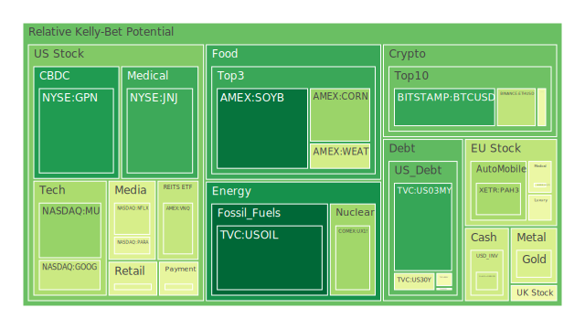
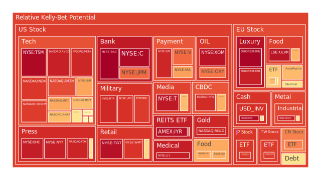
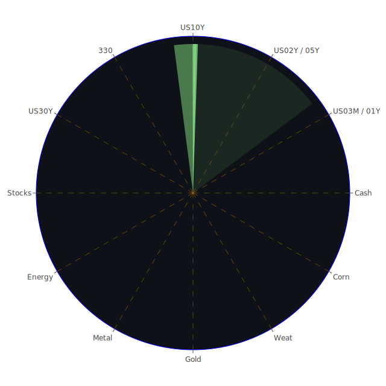

# **投資商品泡沫分析**

當前全球金融市場呈現高度複雜且相互關聯的景象。各種資產類別的價格波動與潛在風險，不僅反映了經濟基本面的變化，也深受市場心理、地緣政治、技術創新等多重因素的影響。以下將針對您所提供的各類投資商品，結合近期數據、新聞事件、歷史經驗、相關理論以及潛在的關聯性，進行泡沫風險的觀察與分析。我們將嘗試運用經濟學、社會學、心理學、博弈論等多維度視角，進行假設與推演，力求客觀呈現市場的自然現象。

* 美國國債 (US Treasuries \- e.g., US01Y, US02Y, US03MY, US05Y, US10Y, US30Y)  
  觀察近期美國國債各期限的收益率數據與風險指標，我們可以看到一個分化的局面。短天期國債（如 US02Y）顯示出相對較高的短期風險指數，而中長天期國債（如 US10Y, US30Y）的風險指數則相對較低，但近期呈現波動。從經濟學角度看，這反映了市場對於聯準會（FED）短期政策路徑的高度不確定性，以及對長期經濟增長和通膨前景的持續評估。FED數據顯示，儘管總資產在縮減（量化緊縮 QT），但銀行儲備仍處於高位，顯示流動性狀況複雜。近期收益率曲線部分倒掛（10Y-3M）雖較去年有所緩和，但仍預示著經濟衰退的潛在風險。歷史上，收益率曲線倒掛常被視為經濟衰退的先行指標，但其預測的精確時間點充滿變數。  
  社會心理層面，投資者對通膨的擔憂與對經濟衰退的恐懼交織，使得國債市場成為避險情緒與利率預期博弈的主戰場。FED近期多次的鷹派發言，加劇了市場對未來利率路徑的猜測。博弈論觀點認為，市場參與者正試圖預測FED的下一步行動以及其他參與者的反應，導致短期債券價格波動加劇。從空間維度看，全球資金流動對美債有顯著影響；外國機構持有量雖高，但近期流通量變化不大，顯示觀望氣氛濃厚。概念上，國債作為無風險資產的定價基準，其波動會傳導至所有風險資產。目前的狀況是：市場預期短期利率將維持高位（Thesis），但經濟放緩壓力可能迫使FED轉向（Antithesis），最終利率路徑可能呈現波動下降或在高位停留更久（Synthesis）。短期國債（如US02Y）的風險指數偏高，需留意利率預期的突然轉變。  
* 美國零售股 (e.g., WMT, TGT, COST, HD)  
  零售股板塊內部呈現明顯分化。沃爾瑪（WMT）、塔吉特（TGT）等大型零售商近期顯示出較高的泡沫風險指數，尤其是短期和中期風險指標持續處於高位。家得寶（HD）的風險指數也相對較高。好市多（COST）的風險指數雖然也不低，但近期波動顯示市場對其商業模式的韌性仍有一定信心。經濟學上，零售業績直接反映消費者支出狀況。FED數據顯示消費者信貸拖欠率處於相對高位，信用卡壞帳率也偏高，暗示部分消費者的財務壓力正在增加。然而，高收入群體的消費可能依然穩健，支撐了像好市多這樣針對特定客群的零售商。  
  新聞事件中，沃爾瑪在墨西哥的利潤下滑、塔吉特業績壓力、UPS因亞馬遜訂單減少而裁員等消息，都對零售業前景蒙上陰影。社會學角度看，消費降級與追求性價比成為趨勢，可能有利於折扣零售商，但整體消費力道可能減弱。心理層面，持續的通膨壓力、高利率以及裁員新聞，打擊了消費者的信心。博弈論視角下，零售商之間以及零售商與供應商之間的價格戰可能加劇，侵蝕利潤空間。歷史上，經濟放緩時期，必需消費品零售商通常表現較有韌性，但非必需品和房屋相關零售（如HD）則壓力較大。空間上，線上與線下零售的競爭格局持續演變。概念上，零售股估值受消費者信心、可支配收入、利率水平等多重因素影響。現狀是：部分零售龍頭憑藉規模和效率維持業績（Thesis），但宏觀經濟逆風和消費者壓力增大構成威脅（Antithesis），未來可能出現業績分化加劇，整體板塊承壓（Synthesis）。WMT、TGT的高風險指數值得警惕。  
* 美國科技股 (e.g., AAPL, MSFT, GOOG, AMZN, META, NVDA, AMD, INTC, MU, QCOM, IBM)  
  科技股，特別是大型科技股和半導體股，是市場關注的焦點，其風險指數普遍偏高且波動劇烈。META、NVDA、AMD、AVGO、AMAT、TSM 等股票的短期至長期風險指數均處於極高水平，顯示市場對其估值和未來增長存在顯著擔憂或高度投機。微軟（MSFT）、亞馬遜（AMZN）、蘋果（AAPL）、谷歌（GOOG）等巨頭的風險指數也處於較高區域。相對而言，IBM、英特爾（INTC）、美光（MU）等傳統或周期性較強的科技股風險指數波動較大，反映了產業內部不同領域的景氣差異。  
  經濟學角度，科技股對利率極為敏感。高利率環境增加了未來現金流的折現率，對高估值的成長股構成壓力。FED數據顯示的高收益債券利率高企，也反映了市場對風險較高資產的要求回報上升。新聞方面，Supermicro、Spotify 等公司的業績預警，以及Meta、EA 等公司的裁員消息，加重了市場對科技行業增長放緩的擔憂。然而，AI（人工智能）的發展浪潮持續為 NVDA、AMD 等相關公司帶來想像空間。  
  社會學角度，科技的滲透力持續增強，但在反壟斷監管、數據隱私保護、地緣政治（如晶片管制）等方面面臨的挑戰也日益嚴峻。心理層面，市場在 AI 狂熱（Greed）與對經濟衰退和高估值的恐懼（Fear）之間搖擺。博弈論視角，大型科技公司之間的平台競爭、生態系統構建以及對新興技術的爭奪日趨激烈。歷史經驗顯示，科技泡沫（如 2000 年的互聯網泡沫）破裂往往伴隨著巨大的市場衝擊。空間上，全球供應鏈重組、地緣政治風險對科技業影響深遠。概念上，科技股的估值常常超越傳統模型，融入了對未來技術突破和市場格局變化的預期。現狀是：AI 等新技術帶來巨大增長潛力（Thesis），但宏觀經濟壓力、高估值、監管風險和地緣政治緊張構成嚴重威脅（Antithesis），未來科技股可能出現劇烈分化，部分高風險個股面臨回調壓力，但具有核心技術和穩定現金流的公司仍具吸引力（Synthesis）。特別是 META、NVDA、AMD、AVGO、AMAT、TSM 等風險指數極高的個股，泡沫破裂的風險不容忽視。  
* 美國房地產指數 (e.g., VNQ, IYR, RWO)  
  美國房地產指數相關 ETF（如 VNQ, IYR, RWO）的風險指數處於中高水平，近期有所波動，其中 IYR 的短期風險指數較高。經濟學上，房地產市場對利率極為敏感。FED 數據顯示，30 年期固定抵押貸款利率遠高於去年同期，顯著增加了購房成本，抑制了需求。同時，商業地產（尤其是辦公樓）面臨空置率上升和再融資困難的挑戰，商業地產拖欠率處於相對高位。  
  社會學角度，遠程辦公的普及改變了對辦公空間的需求，而高房價和高利率則加劇了年輕一代的住房負擔。心理層面，對房價下跌的擔憂和對經濟前景的不確定性影響了購房和投資決策。博弈論視角，開發商、業主、租戶和銀行之間的利益博弈在市場下行壓力下變得更加複雜。歷史上，房地產危機（如 2008 年次貸危機）往往具有系統性影響。空間上，不同地區、不同類型的房地產（住宅 vs 商業，核心區域 vs 郊區）表現差異巨大。概念上，REITs 的價值受租金收入、資產估值和利率水平影響。現狀是：部分地區和類型的房地產仍有需求支撐（Thesis），但高利率、商業地產困境和潛在的經濟衰退對整個行業構成壓力（Antithesis），未來房地產市場可能面臨持續調整，尤其是商業地產風險較高（Synthesis）。IYR 等指數的高短期風險需關注。  
* 加密貨幣 (e.g., BTCUSD, ETHUSD, DOGEUSD)  
  加密貨幣市場，以比特幣（BTCUSD）、以太坊（ETHUSD）和狗狗幣（DOGEUSD）為代表，其風險指數處於中高至高位區間，且波動性極大。近期數據顯示風險指數有所回落，但絕對水平仍不低。經濟學角度，加密貨幣作為一種新興資產類別，其內在價值和定價邏輯仍在探索中，受流動性、市場情緒和監管政策影響巨大。FED 的 QT 政策可能減少市場總體流動性，對投機性資產構成壓力。  
  新聞方面，Celsius Network 創始人面臨長期監禁的消息，再次提醒市場加密貨幣領域的合規風險和欺詐問題。社會學角度，加密貨幣的接受度在特定社群中很高，但也面臨主流社會的質疑。其去中心化的理念與現有金融體系的關係仍在演變。心理層面，加密貨幣市場是投機情緒和 FOMO（害怕錯過）心理的放大器，價格波動劇烈。博弈論視角，早期採用者、機構投資者、散戶和監管機構之間的博弈塑造著市場格局。歷史經驗短暫但充滿劇烈波動，多次經歷“加密冬天”。空間上，全球監管政策的差異對加密貨幣的發展至關重要。概念上，其作為價值儲存、交易媒介或技術平台的定位仍在爭論中。現狀是：區塊鏈技術具有潛力，部分機構開始佈局（Thesis），但監管不確定性、高波動性、安全風險和宏觀流動性收緊構成巨大挑戰（Antithesis），未來加密貨幣市場將繼續劇烈波動，風險與機遇並存，投資者需極度謹慎（Synthesis）。  
* 金/銀/銅 (XAUUSD, XAGUSD, COPPER)  
  貴金屬和工業金屬表現分化。黃金（XAUUSD）價格處於歷史高位附近，但近期風險指數從極高位回落至中等偏上水平，顯示市場情緒有所降溫。白銀（XAGUSD）的風險指數則持續處於極高位，顯示其投機性更強或供需面臨更大壓力。銅（COPPER）作為重要的工業金屬，其風險指數處於中高位，且長期風險指數顯著高於短期，反映了對未來全球經濟復甦和能源轉型需求的預期與擔憂並存。  
  經濟學角度，黃金通常被視為避險資產和抗通膨工具。高利率環境通常不利於不生息的黃金，但地緣政治風險、對法定貨幣體系的擔憂以及央行的購買行為支撐了金價。FED數據顯示金油比（GOLD OIL RATIO）和金銅比（GOLD COPPER RATIO）均處於相對高位，可能暗示相對於能源和工業金屬，黃金的避險屬性更受青睞。白銀兼具貴金屬和工業屬性。銅價與全球工業活動密切相關。新聞中，智利國家銅業公司（Codelco）預計產量上升和需求強勁，為銅價提供一些支撐。  
  社會心理層面，在地緣政治緊張和經濟不確定性加劇時，黃金的避險需求上升。白銀因價格相對較低，也吸引部分投機資金。銅價則更多反映對實體經濟的預期。博弈論視角，央行、大型基金和投資者在貴金屬市場的配置決策相互影響。概念上，黃金的價值根植於歷史、文化和其金融屬性；白銀和銅的價值則更多來自工業需求。現狀是：避險需求和央行購買支撐貴金屬（Thesis），但高利率和經濟放緩可能抑制需求，尤其對工業金屬（Antithesis），未來黃金可能維持高位震盪，白銀波動性高，銅價則取決於全球經濟前景（Synthesis）。白銀的高風險指數尤其值得關注。  
* 黃豆 / 小麥 / 玉米 (SOYB, WEAT, CORN)  
  農產品相關 ETF（大豆 SOYB, 小麥 WEAT, 玉米 CORN）的風險指數近期波動較大。大豆的風險指數一度衝高後回落，小麥的風險指數相對較高且不穩定，玉米的風險指數則處於中等水平。經濟學上，農產品價格受供需基本面、天氣、地緣政治（如戰爭影響主要出口國）、能源價格（影響化肥和運輸成本）以及匯率等多重因素影響。  
  社會心理層面，糧食安全是各國政府和民眾關心的核心問題。極端天氣事件、地緣衝突等可能引發對供應短缺的擔憂，推高價格。博弈論視角，大型糧食貿易商、農民、政府（儲備和補貼政策）以及投機基金在市場中相互影響。歷史上，糧食價格危機曾引發社會動盪。空間上，全球主要產區（如美國、巴西、烏克蘭、俄羅斯）的收成狀況和出口政策至關重要。概念上，農產品是生活必需品，但也具有金融屬性，吸引投機資金。現狀是：全球人口增長和飲食結構變化提供長期需求支撐（Thesis），但供應鏈穩定性、天氣風險和地緣政治衝突帶來不確定性（Antithesis），未來農產品價格可能因供需失衡或突發事件而劇烈波動（Synthesis）。小麥和大豆近期較高的風險指數提示了潛在波動。  
* 石油/ 鈾期貨 (USOIL, UX1\!)  
  能源市場方面，美國原油（USOIL）的價格近期有所回落，其風險指數也從先前的高位下降至較低水平。鈾期貨（UX1\!）的風險指數則處於中等偏上水平，近期波動不大。經濟學上，油價受全球供需、OPEC+產量政策、地緣政治風險、經濟增長預期以及美元匯率影響。FED數據顯示金油比處於高位，可能暗示相對於黃金，市場對石油的風險評估更高或預期其價格上行空間有限。鈾價則主要受核電發展前景、供應狀況（如哈薩克斯坦、加拿大產量）和地緣政治（對俄羅斯依賴）影響。  
  新聞事件中，巴西國家石油公司（Petrobras）產量微降，對市場影響有限。社會心理層面，能源價格直接影響通膨和消費者生活成本，備受關注。對氣候變化的擔憂推動能源轉型，但傳統能源在短期內仍不可或缺。核能作為清潔能源的討論度提升，可能影響鈾的長期需求。博弈論視角，OPEC+與美國頁岩油生產商之間的產量博弈，以及各國在能源轉型路徑上的策略選擇，都對市場產生深遠影響。歷史上，石油危機曾多次衝擊全球經濟。空間上，中東、俄羅斯等主要產油區的地緣政治局勢是關鍵變量。概念上，能源是現代經濟的血液，其價格波動具有廣泛傳導效應。現狀是：全球經濟活動仍需依賴石油，能源轉型推升對某些資源（如鈾）的需求（Thesis），但經濟放緩擔憂、高利率抑制投資以及地緣政治風險帶來下行壓力（Antithesis），未來油價可能在供需博弈和地緣政治影響下波動，鈾價則取決於核電復興的實際進程（Synthesis）。目前石油的風險指數相對較低。  
* 各國外匯市場 (e.g., EURUSD, GBPUSD, USDJPY, AUDUSD)  
  外匯市場波動顯著。美元兌日元（USDJPY）的風險指數極高，且近期觸及頂點，反映出對日本央行干預或政策轉向的高度預期，以及美日利差懸殊的影響。歐元兌美元（EURUSD）和澳元兌美元（AUDUSD）的風險指數也處於非常高的水平，英鎊兌美元（GBPUSD）風險指數則處於中等偏上水平。這普遍反映了在全球經濟前景不明、各國央行政策分化的背景下，美元的相對強勢以及市場對其他主要貨幣的擔憂。  
  經濟學角度，匯率由利差、經濟增長預期、貿易差額、資本流動和央行政策決定。FED的鷹派立場和相對穩健（或說放緩速度較慢）的美國經濟支撐了美元。日本的超寬鬆貨幣政策導致日元大幅貶值。歐洲經濟面臨能源危機、通膨和地緣政治的多重壓力。澳洲經濟則受中國需求和全球大宗商品價格影響。  
  社會心理層面，對本國經濟前景的信心、對通膨的感受以及對央行信譽的評估，都會影響民眾和企業的換匯行為。博弈論視角，各國央行在穩定匯率、控制通膨和支持增長之間進行權衡，其政策信號和市場干預行為影響著匯率走勢。歷史上，匯率大幅波動往往伴隨著金融市場的動盪。空間上，全球資本流動是影響匯率的關鍵因素。概念上，匯率是國家之間經濟基本面的相對價格體現。現狀是：美國相對強勢的經濟和鷹派 FED 支持美元（Thesis），但其他國家可能被迫加息或干預以穩定本幣，美國經濟放緩也可能削弱美元（Antithesis），未來外匯市場可能持續波動，美元強勢或見頂回落，日元、歐元等非美貨幣面臨的壓力能否緩解，取決於各國政策應對和全球經濟格局的演變（Synthesis）。USDJPY、EURUSD、AUDUSD 的極高風險指數預示著潛在的劇烈波動或轉折。  
* 各國大盤指數 (e.g., NDX, FTSE, GDAXI, FCHI, 0050, 000300, JPN225)  
  全球主要股指表現分化，但普遍處於風險較高區域。美國納斯達克指數（NDX）、台灣 0050 指數、日本日經 225 指數（JPN225）的風險指數均處於高位，顯示科技股權重較高或前期漲幅較大的市場面臨調整壓力。英國富時指數（FTSE）、德國 DAX 指數（GDAXI）、法國 CAC 指數（FCHI）的風險指數也處於中高水平，歐洲市場同樣面臨經濟增長放緩和地緣政治風險。中國滬深 300 指數（000300）的風險指數相對較高，反映了投資者對中國經濟復甦力度的持續觀察。  
  經濟學角度，股指是宏觀經濟的晴雨表，受企業盈利、利率水平、通膨預期和投資者情緒等多重因素影響。全球經濟同步放緩的跡象日益明顯，各國央行的緊縮政策滯後效應可能逐步顯現。新聞中，英國商業信心下滑，德國企業呼籲新政府採取行動，西班牙和葡萄牙出現大範圍停電，中國餐館發生火災等負面消息，都可能影響市場情緒。  
  社會心理層面，地緣政治緊張（俄烏衝突持續、中東局勢等）、國內政治不確定性（如德國政府組閣）、社會事件（停電、事故）等，都會加劇市場的避險情緒。博弈論視角，國際投資者在全球不同市場間進行資產配置，尋求風險與回報的平衡，資金流動影響各國股指表現。歷史經驗顯示，全球性經濟衰退或金融危機往往導致各國股市普遍下跌，但幅度有所差異。空間上，區域經濟的相對強弱、產業結構的差異導致股指表現分化。概念上，股指代表了一國或地區最具代表性公司的整體表現。現狀是：部分國家的刺激政策或特定產業的韌性提供支撐（Thesis），但全球經濟放緩、高利率、地緣政治風險和企業盈利壓力構成普遍威脅（Antithesis），未來各國股指可能面臨進一步的下行風險，市場波動性將維持高位，不同市場間的表現差異可能持續（Synthesis）。NDX、0050、JPN225 的高風險指數需特別留意。  
* 美國半導體股 (e.g., NVDA, AMD, INTC, MU, QCOM, AVGO, AMAT, TSM, KLAC)  
  已在“美國科技股”部分詳細分析。此處強調，半導體行業整體處於極高的泡沫風險區域。NVDA、AMD、AVGO、AMAT、TSM 等領導廠商的風險指數居高不下，反映了市場對 AI 驅動的增長預期極高，可能已脫離基本面。英特爾（INTC）和美光（MU）等相對落後或周期性更強的公司，風險指數雖不及前者，但也處於較高水平或波動劇烈。KLA 公司（KLAC）作為半導體設備商，風險指數也處於中高位。  
  經濟學角度，半導體是典型的周期性行業，但 AI 的結構性需求可能改變其周期模式。然而，全球經濟放緩最終仍會影響終端需求（PC、手機、汽車等）。高利率環境不利於資本密集型的半導體行業擴張。  
  新聞事件影響複雜，一方面 AI 需求看似強勁，另一方面裁員、業績預警等負面消息頻傳。地緣政治風險（晶片法案、出口管制）對供應鏈和市場格局產生重大影響。社會心理層面，AI 狂熱可能導致非理性繁榮。博弈論視角，各國政府將半導體視為戰略產業，投入巨資進行補貼和競爭，加劇了市場的複雜性。歷史上，半導體行業經歷過多次繁榮與蕭條的循環。現狀是：AI 帶來歷史性機遇（Thesis），但宏觀逆風、地緣政治、高估值和潛在的產能過剩風險巨大（Antithesis），未來半導體行業可能面臨劇烈波動和分化，高估值個股風險極高（Synthesis）。投資者需極度警惕此行業的泡沫風險。  
* 美國銀行股 (e.g., JPM, BAC, C, COF)  
  美國大型銀行股如摩根大通（JPM）、美國銀行（BAC）、花旗集團（C）以及第一資本金融公司（COF）的風險指數普遍處於中高至極高水平。BAC 和 C 的風險指數尤其高，接近頂部，COF 風險指數近期有所回落但仍處於高位，JPM 相對穩健但風險指數也在上升。  
  經濟學角度，銀行業績受淨息差、信貸質量、貸款增長和監管政策影響。利率上升初期有利於擴大淨息差，但過高的利率和經濟放緩會導致信貸損失增加和貸款需求下降。FED 數據顯示，商業地產、消費者貸款的拖欠率上升，信用卡壞帳率高企，對銀行資產質量構成威脅。儘管 BTFP 等緊急流動性工具使用量不高，顯示系統性風險暫未爆發，但潛在壓力依然存在。  
  社會心理層面，儲戶對銀行體系的信心至關重要。歷史上的銀行危機（如 2008 年、2023 年區域性銀行危機）提醒人們關注銀行的穩定性。博弈論視角，大型銀行在市場中具有系統重要性，其風險管理和資本充足狀況受到監管機構的嚴格審視。銀行間的競爭以及與金融科技公司的競合關係也在演變。現狀是：大型銀行憑藉多元化業務和規模優勢展現一定韌性（Thesis），但信貸風險上升、經濟前景不明以及更嚴格的監管預期構成壓力（Antithesis），未來銀行股可能面臨盈利增長放緩和信貸成本上升的挑戰，資產質量是關鍵觀察點（Synthesis）。BAC 和 C 的極高風險指數需要高度關注。  
* 美國軍工股 (e.g., LMT, NOC, RTX)  
  美國主要軍工股洛克希德·馬丁（LMT）、諾斯洛普·格魯曼（NOC）、雷神技術（RTX）的風險指數均處於高位至極高位。RTX 和 NOC 的風險指數尤其高，LMT 緊隨其後。  
  經濟學角度，軍工行業的主要驅動力是國防預算和地緣政治局勢。在全球地緣政治緊張局勢加劇（俄烏衝突、中東衝突、亞太地區潛在衝突等）的背景下，各國普遍增加國防開支，為軍工企業帶來了訂單增長預期。  
  社會心理層面，國家安全擔憂的上升，以及對國際秩序變化的預期，提升了軍工行業的受關注度。然而，軍工行業也面臨 ESG（環境、社會、治理）方面的壓力。博弈論視角，國家間的軍備競賽、軍事同盟關係以及軍火貿易格局，都影響著軍工企業的發展。歷史上，戰爭或長期冷戰時期往往是軍工行業的繁榮期。空間上，訂單來源的地域分佈和國際合作項目對企業業績有重要影響。概念上，軍工股常被視為具有防禦屬性，受經濟周期影響相對較小，但在地緣政治緩和時期可能面臨壓力。現狀是：地緣政治緊張推升國防需求（Thesis），但預算限制、供應鏈問題以及對衝突緩和的預期可能帶來不確定性（Antithesis），未來軍工股可能在高位維持強勢，但需關注地緣局勢的變化和估值風險（Synthesis）。高企的風險指數表明市場可能已過度計入利好預期。  
* 美國電子支付股 (e.g., V, MA, AXP, PYPL, GPN)  
  電子支付行業內部同樣分化。Visa（V）、萬事達卡（MA）、美國運通（AXP）等傳統支付巨頭的風險指數處於中高至高位，近期 MA 和 AXP 的風險指數上升較快。PayPal（PYPL）的風險指數持續處於極高水平，顯示市場對其轉型和競爭壓力的高度擔憂。Global Payments（GPN）的風險指數則從高位大幅回落至較低水平，可能反映了估值修復或特定業務的改善。  
  經濟學角度，電子支付行業受益於現金支付向電子支付的長期結構性轉變，其收入與消費支出（尤其是跨境交易和服務消費）密切相關。高通膨環境下，名義消費額增長有利於支付公司收入，但實際消費量下滑或消費者轉向低費率渠道則構成挑戰。利率上升對依賴融資的支付業務（如部分先買後付 BNPL）不利。  
  社會心理層面，支付便捷性和安全性是用戶的核心訴求。新興支付方式（數字錢包、BNPL、加密貨幣支付等）的出現，改變了消費者的支付習慣，也加劇了行業競爭。博弈論視角，支付網絡的規模效應是核心護城河，但監管機構對費率、反壟斷的關注，以及新進入者的挑戰，使得行業格局並非一成不變。歷史上，支付行業在經濟擴張期表現良好。空間上，全球化和跨境電商的發展為支付公司帶來機遇，但也面臨各國不同的監管環境。概念上，支付股兼具科技股和金融股的特性。現狀是：電子支付滲透率持續提升，消費韌性尚存（Thesis），但宏觀經濟放緩、競爭加劇、監管壓力以及高估值構成風險（Antithesis），未來支付行業可能維持增長，但增速放緩，不同公司間的表現將持續分化，擁有強大網絡效應和多元化業務的公司更具優勢（Synthesis）。PYPL 的極高風險指數和 V、MA、AXP 的高位風險值得關注。  
* 美國藥商股 (e.g., JNJ, MRK, LLY, NVO)  
  大型製藥股表現各異。禮來（LLY）和諾和諾德（NVO）憑藉減肥藥和糖尿病藥物的巨大成功，股價大幅上漲，其風險指數也處於極高水平，顯示市場對其未來銷售預期極高，泡沫風險顯著。強生（JNJ）和默克（MRK）的風險指數則相對較低或處於中等水平，近期有所波動。  
  經濟學角度，製藥行業具有一定的防禦性，受經濟周期影響相對較小，但面臨藥品專利懸崖、藥價監管壓力以及研發失敗的風險。減肥藥等重磅藥物的出現，為相關公司帶來了巨大的增長動力，但也引發了對其可持續性和估值的擔憂。  
  社會心理層面，人口老齡化、慢性病發病率上升以及對健康生活方式的追求，為製藥行業提供了長期需求。然而，藥價過高也引發了社會爭議。博弈論視角，大型藥企之間的專利競爭、併購活動以及與政府（藥價談判、醫保政策）的博弈，深刻影響行業格局。歷史上，能夠持續推出重磅新藥的公司往往能獲得超額回報。空間上，藥品的全球銷售和不同國家的審批、定價政策是關鍵。概念上，製藥股的估值既要考慮現有產品的現金流，也要評估研發管線的潛力。現狀是：創新藥物（特別是減肥藥）帶來巨大市場機遇（Thesis），但專利到期、藥價壓力、研發風險和極高的估值構成挑戰（Antithesis），未來製藥行業將呈現結構性機會，擁有強大研發能力和成功商業化產品的公司將脫穎而出，但 LLY 和 NVO 的極高泡沫風險需重點警惕（Synthesis）。  
* 美國影視股 (e.g., NFLX, DIS, PARA)  
  影視媒體行業面臨轉型陣痛。奈飛（NFLX）的風險指數處於中等偏上水平，近期有所回落，顯示市場在評估其打擊密碼共享和廣告業務的效果。迪士尼（DIS）的風險指數處於高位，近期大幅波動，反映了其在流媒體轉型、主題公園復甦和傳統業務下滑之間掙扎。派拉蒙全球（PARA）的風險指數處於中等偏上水平，市場關注其潛在的併購交易和流媒體策略。  
  經濟學角度，流媒體行業競爭激烈，內容投入巨大，盈利壓力增加。廣告市場的波動、消費者訂閱疲勞以及宏觀經濟放緩都對行業構成挑戰。  
  社會心理層面，觀眾的內容偏好快速變化，爭奪用戶注意力成為關鍵。內容製作的政治正確性、文化衝突等也可能引發爭議。博弈論視角，各大媒體巨頭在內容庫、定價策略、捆綁銷售等方面展開激烈競爭，行業整合的可能性持續存在。歷史上，技術變革（從廣播到電視，從有線到流媒體）不斷重塑媒體格局。空間上，全球化內容製作和發行是趨勢，但也面臨本地化和文化差異的挑戰。概念上，媒體股的價值取決於其內容創造能力、用戶基礎、變現效率和品牌影響力。現狀是：流媒體仍是長期趨勢，優質內容具有吸引力（Thesis），但競爭白熱化、盈利壓力、用戶增長放緩和宏觀逆風構成嚴峻考驗（Antithesis），未來影視媒體行業將繼續整合，盈利能力成為關鍵，擁有強大 IP 和有效變現模式的公司有望勝出（Synthesis）。DIS 的高風險指數和 NFLX、PARA 的不確定性值得關注。  
* 美國媒體股 (e.g., NYT, FOX, CMCSA)  
  傳統媒體與綜合性媒體集團同樣面臨挑戰。紐約時報（NYT）的風險指數處於高位，顯示市場對其數字化轉型的肯定，但也反映了較高的估值。福克斯（FOX）的風險指數極高，可能與其在政治光譜中的定位、廣告市場依賴以及數字化轉型的壓力有關。康卡斯特（CMCSA）的風險指數處於中等偏上水平，其業務涵蓋寬帶、有線電視和內容製作（NBC環球），面臨多方面的競爭和挑戰。  
  經濟學角度，傳統媒體（報紙、有線電視）面臨訂閱下滑和廣告收入流失的壓力，數字化轉型是必然趨勢，但盈利模式仍在探索中。寬帶業務相對穩定，但競爭也在加劇。  
  社會心理層面，信息傳播方式的變革、公眾對媒體信任度的變化以及“假新聞”問題，都對媒體行業產生深遠影響。政治極化也影響著特定媒體的受眾和收入。博弈論視角，媒體公司在爭奪用戶、廣告商和內容資源方面進行競爭，同時也面臨來自科技平台（如 Google, Meta）的挑戰。概念上，媒體公司的價值在於其公信力、用戶觸達能力和內容影響力。現狀是：部分媒體成功實現數字化轉型，寬帶業務提供穩定現金流（Thesis），但傳統業務下滑、廣告市場疲軟、競爭激烈和技術變革壓力巨大（Antithesis），未來媒體行業將加速分化，數字化程度高、內容獨特、商業模式清晰的公司更具前景（Synthesis）。FOX 和 NYT 的高風險指數需留意。  
* 石油防禦股 (e.g., XOM, OXY)  
  大型綜合性石油公司埃克森美孚（XOM）和西方石油（OXY）的風險指數處於高位至極高位。XOM 風險指數極高，OXY 的風險指數也持續在高位徘徊。儘管近期油價有所回落，但這些公司的風險評級依然很高。  
  經濟學角度，這些公司受益於高油價，產生強勁的現金流，用於股票回購、分紅和能源轉型投資。然而，其業績與油氣價格高度相關，波動性大。對其能源轉型戰略的評估也影響其長期估值。巴菲特對 OXY 的持續投資吸引了市場關注。  
  社會心理層面，一方面是高油價帶來的利潤，另一方面是來自環保和氣候變化的壓力。博弈論視角，大型石油公司在維持傳統業務盈利與投資新能源未來之間進行平衡和博弈。現狀是：高油價和強勁現金流提供支撐（Thesis），但油價波動風險、能源轉型壓力以及 ESG 方面的擔憂構成挑戰（Antithesis），未來這些公司的股價表現將繼續與油氣價格緊密相連，同時市場也將關注其轉型進展（Synthesis）。極高的風險指數可能反映了對油價持續高位或公司價值的過度樂觀預期。  
* 金礦防禦股 (e.g., RGLD)  
  黃金權利金公司 Royal Gold（RGLD）的風險指數處於極高水平，且近期持續攀升，與黃金本身風險指數的回落形成對比。  
  經濟學角度，權利金和權益金模式（Royalty and Streaming）為金礦公司提供了一種風險相對較低、槓桿較高的參與黃金市場的方式。其收入直接受益於金價上漲和合作礦山的產量增加，同時避免了直接運營礦山的巨大成本和風險。  
  社會心理層面，在高金價和避險情緒升溫時，黃金相關股票通常受到追捧。權利金模式因其商業模式的獨特性，可能吸引特定投資者。博弈論視角，權利金公司需要在眾多礦業項目中篩選出優質資產，並以有利條件達成交易。現狀是：高金價和穩定的商業模式是利好（Thesis），但極高的風險指數表明市場可能已嚴重高估其價值，或存在其他未被充分認識的風險（Antithesis），未來其股價表現仍將與金價相關，但需警惕估值回調的風險（Synthesis）。RGLD 的極高風險指數是強烈的警示信號。  
* 歐洲奢侈品股 (e.g., MC, KER, RMS)  
  歐洲奢侈品巨頭 LVMH（MC）、開雲集團（KER）、歷峰集團（RMS）的風險指數呈現分化，但整體偏高。LVMH 風險指數處於中等偏上水平，相對穩健。開雲集團風險指數處於極高水平，可能反映了市場對其核心品牌（如 Gucci）轉型效果的擔憂。歷峰集團風險指數也極高，顯示市場對其前景同樣存在疑慮。  
  經濟學角度，奢侈品行業具有一定的抗周期性，但高端消費者的信心和財富效應仍會對其產生影響。全球經濟放緩，尤其是重要市場（如中國）的復甦力度，對奢侈品銷售至關重要。  
  社會心理層面，奢侈品消費與社會地位、品牌認同感和追求獨特性相關。品牌價值和稀缺性是其核心競爭力。博弈論視角，各大奢侈品集團在品牌建設、設計創新、渠道控制和併購方面展開競爭。歷史上，能夠成功穿越周期、維持品牌吸引力的奢侈品公司具有長期價值。空間上，全球化佈局和對新興市場的開拓是增長的關鍵。概念上，奢侈品股的估值依賴於其品牌力、盈利能力和增長潛力。現狀是：頭部品牌具有強大護城河和定價權（Thesis），但全球宏觀經濟不確定性、地緣政治風險以及部分品牌面臨的挑戰構成威脅（Antithesis），未來奢侈品行業可能出現分化，品牌力強、市場多元化的公司表現將相對較好，但整體增速可能放緩（Synthesis）。KER 和 RMS 的極高風險指數需要警惕。  
* 歐洲汽車股 (e.g., PAH3, MBG, BMW)  
  歐洲汽車股，以保時捷控股（PAH3）、梅賽德斯-奔馳（MBG）、寶馬（BMW）為代表，其風險指數處於中等偏上至高位水平。寶馬風險指數相對較高，保時捷控股和奔馳的風險指數居中。  
  經濟學角度，汽車行業是典型的周期性行業，受宏觀經濟、利率水平、消費者信心和供應鏈狀況影響。當前，歐洲汽車製造商普遍面臨向電動化轉型的巨大投入和來自特斯拉、中國品牌的激烈競爭。高利率抑制了汽車消費貸款。  
  新聞事件中，關於中國奇瑞汽車可能在德國大眾工廠生產汽車的報導，凸顯了行業格局的變化和競爭壓力。社會心理層面，消費者對電動車的接受度、對品牌價值的認知以及對環保性能的關注，都在影響購車決策。博弈論視角，傳統車企在維持燃油車利潤、投入電動化研發和應對新進入者之間進行艱難的戰略平衡。歷史上，汽車行業經歷過多次技術變革和市場洗牌。空間上，全球市場（尤其是中國市場）的表現對歐洲車企業績至關重要。概念上，汽車股的估值從傳統的市盈率、市淨率，逐漸融入對電動化轉型進度和軟件能力的評估。現狀是：歐洲車企擁有品牌和技術積累，積極推進轉型（Thesis），但轉型成本高昂、競爭空前激烈、宏觀經濟壓力大構成挑戰（Antithesis），未來歐洲汽車行業將面臨嚴峻考驗，轉型成功與否是關鍵，行業整合和優勝劣汰可能加劇（Synthesis）。  
* 歐美食品股 (e.g., NESN, ULVR, KO, KHC)  
  大型食品飲料公司雀巢（NESN）、聯合利華（ULVR）、可口可樂（KO）、卡夫亨氏（KHC）的風險指數普遍處於中高至極高水平。聯合利華和卡夫亨氏的風險指數尤其高，雀巢和可口可樂也處於較高區域。  
  經濟學角度，食品飲料行業屬於必需消費品，具有較強的防禦性。然而，它們也面臨原材料成本上漲、定價能力受限、消費者偏好變化（追求健康、天然）以及零售商議價能力強的挑戰。高利率環境對負債較高的公司構成壓力。  
  新聞事件中，澳洲 Coles 超市營收增長得益於消費者追求性價比和電商訂單激增，反映了行業趨勢。社會心理層面，品牌忠誠度、健康意識、可持續性考量等影響消費者的選擇。博弈論視角，大型食品公司利用規模優勢和品牌力進行市場競爭，同時也通過併購來獲取增長或進入新領域。現狀是：必需消費屬性提供韌性，品牌力是護城河（Thesis），但成本壓力、競爭加劇、消費者行為變化和高估值構成風險（Antithesis），未來食品飲料行業整體增長可能有限，但具有強大品牌、定價能力和有效成本控制的公司仍能實現穩健增長（Synthesis）。ULVR 和 KHC 的極高風險指數，以及 KO、NESN 的高風險指數，提示該板塊可能存在估值過高的風險。

# **宏觀經濟傳導路徑分析**

當前的宏觀經濟環境呈現多重壓力疊加的複雜局面。從 FED 的數據和行動來看，主要的傳導路徑可能如下：

1. **緊縮貨幣政策 \-\> 信貸條件收緊 \-\> 經濟活動放緩：** FED 縮減資產負債表、維持相對較高的政策利率（儘管近期市場預期有所鬆動，但 OIS、FRA SOFR 利率仍在高位），直接推高了短期借貸成本（如 3 個月、1 年期國債收益率仍高）。這導致固定抵押貸款利率處於高位，抑制房地產市場活動。同時，高收益債券利率高企，增加了風險較高企業的融資難度。信貸拖欠率（商業地產、消費者貸款、信用卡壞帳率）的上升，預示著信貸緊縮正在實質性地影響實體經濟，可能進一步抑制投資和消費，導致經濟增長放緩。  
   * *Thesis:* 緊縮政策有效抑制通膨。  
   * *Antithesis:* 過度緊縮可能導致嚴重衰退和金融不穩定。  
   * *Synthesis:* 經濟將經歷一段時間的低於趨勢增長，衰退風險依然存在，政策需要在控通膨和穩增長間尋找平衡。  
2. **高利率環境 \+ 經濟放緩預期 \-\> 企業盈利壓力 \-\> 資產價格重估：** 高利率不僅增加企業借貸成本，也提高了投資者要求的風險溢價。經濟放緩預期則意味著企業收入增長前景黯淡。兩者疊加，對企業盈利構成雙重打擊。這將傳導至股票市場，導致估值下調，尤其是對利率敏感、高估值的成長股（如科技股）壓力更大。近期多家公司（Starbucks, Supermicro, Spotify, Snap, GM 等）發布的令人失望的財報或指引，以及裁員潮（UPS, EA, Meta 等），正是這一傳導路徑的體現。  
   * *Thesis:* 市場已部分消化盈利預期下調。  
   * *Antithesis:* 實際盈利下滑可能超預期，引發更大幅度調整。  
   * *Synthesis:* 資產價格將持續波動，盈利能力和現金流成為關鍵，高估值板塊風險最大。  
3. **地緣政治風險 \+ 供應鏈擾動 \-\> 通膨壓力反覆 \+ 避險情緒升溫：** 俄烏衝突、中東局勢以及潛在的貿易摩擦，不僅擾亂全球供應鏈，也對能源、糧食等大宗商品價格構成上行風險，可能使通膨壓力持續存在或反覆。西班牙、葡萄牙的大範圍停電事件也提醒了基礎設施的脆弱性。這些不確定性會推升市場的避險情緒，資金可能流向黃金、美元或短期國債等避險資產，同時打壓風險資產。  
   * *Thesis:* 全球化放緩，區域化和供應鏈韌性增強。  
   * *Antithesis:* 地緣衝突升級或擴散可能引發更嚴重的經濟衝擊。  
   * *Synthesis:* 市場將持續對地緣政治事件保持敏感，避險資產可能階段性受益，全球經濟面臨碎片化風險。  
4. **全球央行政策分化 \-\> 匯率波動加劇 \-\> 資本流動變化：** 美聯儲維持鷹派，而日本央行仍在猶豫是否完全退出寬鬆，歐洲央行則在通膨和衰退之間權衡。這種政策分化導致主要貨幣對（如 USDJPY, EURUSD）劇烈波動，風險指數飆升。匯率的劇烈波動會影響跨境貿易、企業盈利（匯兌損益）和國際資本流動，增加全球金融市場的不穩定性。  
   * *Thesis:* 美元強勢周期可能接近尾聲。  
   * *Antithesis:* 若美國經濟相對其他地區更具韌性，或避險需求高漲，美元可能維持強勢。  
   * *Synthesis:* 外匯市場將維持高波動性，對跨國企業和國際投資者構成挑戰。

# **微觀經濟傳導路徑分析**

從企業和行業層面觀察，傳導路徑更為具體：

1. **成本上升（原材料、勞動力、融資）-\> 企業利潤擠壓 \-\> 價格傳導或需求破壞：** 通膨壓力雖有所緩解（CPIYOY 下降），但企業仍面臨較高的成本。企業試圖將成本轉嫁給消費者，但當消費者承受能力達到極限時，可能導致需求下降（如部分零售數據所示）。無法有效傳導成本的企業將面臨利潤率下滑的壓力。  
   * *Thesis:* 具有定價能力的龍頭企業能維持利潤。  
   * *Antithesis:* 普遍的成本壓力最終會侵蝕整體企業盈利。  
   * *Synthesis:* 企業盈利能力將出現分化，成本控制和品牌力是關鍵。  
2. **技術變革（AI、能源轉型）-\> 行業格局重塑 \-\> 贏家和輸家分化：** AI 的快速發展正在重塑科技、媒體等多個行業，為相關公司（如 NVDA）帶來巨大機遇，但也對傳統模式構成挑戰。能源轉型則影響著石油、汽車、公用事業等行業。這種變革導致行業內部出現劇烈分化，能夠適應並引領變革的公司獲得高估值，而落後者則面臨淘汰風險。  
   * *Thesis:* 技術進步帶來生產力提升和新的增長點。  
   * *Antithesis:* 技術變革伴隨巨大投資風險和不確定性，可能形成泡沫。  
   * *Synthesis:* 結構性機會與風險並存，需仔細甄別真正受益者。  
3. **消費者行為變化（追求性價比、健康意識、數字化）-\> 企業策略調整 \-\> 市場份額轉移：** 經濟壓力下，消費者可能更注重性價比（利好折扣零售商）。對健康和可持續性的關注影響食品、飲料和製藥行業。數字化趨勢則持續推動電商、電子支付和流媒體發展。企業需要快速調整產品、服務和渠道策略以適應這些變化，否則可能失去市場份額。  
   * *Thesis:* 靈活應變的企業能夠抓住新機遇。  
   * *Antithesis:* 轉型緩慢或策略失誤的企業將被邊緣化。  
   * *Synthesis:* 消費者偏好的演變將持續驅動行業內部競爭格局的變化。

# **資產類別間傳導路徑分析**

不同資產類別之間存在複雜的相互影響和傳導關係，尋找相關性較低（甚至負相關，理想狀態下如 \-0.5）且相位不同的資產組合是風險管理的關鍵：

1. **利率 \-\> 跨資產估值聯動：** 美國國債收益率（特別是長端利率如 US10Y, US30Y）是全球資產定價的錨。收益率上升，通常會壓低股票（尤其是成長股）、房地產等風險資產的估值，因為未來現金流的折現率提高。同時，高利率也增加了持有黃金等無息資產的機會成本。近期國債收益率波動，直接引發了科技股等風險資產的波動。債券與股票之間常呈現一定的負相關性，尤其在市場避險情緒升溫時。  
2. **經濟預期 \-\> 股債商品輪動：** 對經濟增長的預期影響著資金在不同資產間的流動。預期經濟強勁復甦時，資金可能從債券流向股票和工業金屬（如銅）。預期經濟衰退時，資金可能從股票流向債券和黃金等避險資產。當前經濟前景不明，導致股、債、商品之間呈現複雜的拉鋸和波動。  
3. **美元匯率 \-\> 商品與新興市場：** 美元匯率（如通過 EURUSD, USDJPY 反映）的強弱對以美元計價的大宗商品（石油、黃金、農產品）價格有顯著影響（通常呈負相關）。強美元也往往對新興市場國家的貨幣和資產構成壓力，因為會增加其美元債務負擔並可能引發資本外流。近期美元相對強勢，對黃金、石油等構成一定壓制，也加劇了日元等的貶值壓力。  
4. **風險情緒 \-\> 跨市場傳染：** 市場恐慌情緒具有高度傳染性。一個市場的劇烈下跌（如科技股泡沫破裂、加密貨幣崩盤、銀行危機）可能引發跨市場的拋售潮，導致流動性枯竭和資產價格螺旋式下跌。加密貨幣市場的高波動性、部分科技股和金融股的高風險指數，都提示了這種潛在的傳染風險。  
5. **特定行業衝擊 \-\> 相關資產聯動：** 某一核心行業（如半導體、能源、金融）的重大事件或趨勢變化，會沿著供應鏈和相關領域傳導。例如，半導體行業的景氣變化會影響科技股整體表現，進而影響股指；能源價格波動會影響通膨預期，進而影響債券和股票；金融體系的穩定性則關乎整體市場信心。  
6. **潛在的對沖機會：**  
   * **長端國債 vs 成長股/科技股：** 在經濟衰退預期升溫或避險情緒主導時，長端國債（如 US10Y, US30Y）可能上漲，而高估值的成長股（如 NDX 中的成分股）可能下跌，呈現負相關性。  
   * **黃金 vs 風險資產：** 在地緣政治風險加劇或對法定貨幣體系擔憂上升時，黃金（XAUUSD）可能表現強勢，而股票等風險資產可能承壓。  
   * **美元 vs 非美貨幣/部分商品：** 在全球風險厭惡情緒上升或美國相對強勢時，美元可能走強，而歐元、澳元等非美貨幣以及部分以美元計價的商品可能走弱。  
   * **防禦性板塊 vs 周期性板塊：** 在經濟下行周期，必需消費品（如 KO, NESN）、醫療保健（如 JNJ, MRK）等防禦性板塊可能相對抗跌，而周期性板塊（如汽車、非必需零售）壓力較大。

需要注意的是，資產間的相關性並非一成不變，會隨市場環境和主導因素的變化而變化。例如，在高通膨環境下，股債可能同跌。構建有效的對沖組合需要動態調整和對市場環境的持續評估。

# **投資建議**

基於上述分析，當前市場環境充滿挑戰，泡沫風險在多個資產類別中積聚，尤其是在科技（特別是半導體）、部分支付、特定製藥、軍工、金礦權利金、部分奢侈品以及高風險貨幣對中。宏觀經濟前景不明，地緣政治風險猶存，貨幣政策路徑仍有變數。因此，投資策略應以謹慎和多元化為核心。

我們提出以下三種基於不同風險偏好的配置建議，每種建議內含三個具體的投資方向，並給出在該風險類別內的配置比例（三者相加為 100%）。請注意，這並非完整的投資組合，僅為基於當前環境和數據分析得出的方向性建議，實際投資需結合投資者自身的完整財務狀況和目標。

1. **穩健型配置 (Conservative Portfolio):**  
   * **目標:** 側重資本保值，降低波動性，尋求穩定回報。  
   * **配置建議:**  
     * **50% 短中期美國國債 (Proxy: US01Y/US02Y/US05Y):** 鑑於當前收益率曲線形態和經濟不確定性，配置於流動性好、利率風險相對較低的短中期國債，可提供穩定票息收入和一定的避險功能。雖然短期債券風險指數近期波動，但相較於長期債券，受久期風險影響較小。  
     * **30% 防禦性大型股 (Proxy: JNJ / MRK / KO):** 選擇風險指數相對較低、業務穩健、現金流良好、分紅穩定的醫療保健（如強生、默克）或必需消費品（如可口可樂）龍頭企業。這些公司在經濟下行周期通常表現相對抗跌。  
     * **20% 黃金 (Proxy: XAUUSD):** 作為傳統避險資產，在地緣政治不確定性和對金融體系潛在擔憂的背景下，黃金具有配置價值，可對沖部分風險資產的下行風險。雖然近期價格有所回落，風險指數下降，但仍處於歷史相對高位，宜控制比例。  
2. **成長型配置 (Growth Portfolio):**  
   * **目標:** 在可控風險下，尋求長期資本增值，平衡風險與回報。  
   * **配置建議:**  
     * **40% 全球多元化股票指數 (Proxy: NDX / FTSE / GDAXI / 0050):** 選擇代表全球或主要發達市場的寬基指數，分散單一國家或行業風險。儘管這些指數風險指數偏高，但代表了全球經濟和科技發展的主流方向。可考慮納斯達克指數（NDX）以捕捉科技成長，同時配置部分歐洲（FTSE/GDAXI）或亞洲（0050）指數以實現地域多元化。  
     * **30% 具有定價權的消費龍頭 (Proxy: COST / NESN / MC):** 選擇在各自領域具有強大品牌護城河和定價能力的消費品公司，如好市多（COST）、雀巢（NESN）或 LVMH（MC）。這些公司即使在通膨環境下也能較好地傳導成本，維持盈利能力。注意 LVMH 和雀巢風險指數偏高，需謹慎。  
     * **30% 利率敏感性較低的價值/周期股 (Proxy: JPM / COPPER / Select Industrials not listed but implied):** 配置部分估值相對合理、可能受益於經濟結構變化或特定周期階段的資產。例如，大型綜合性銀行（JPM，風險指數相對同業較低）或與能源轉型、基礎設施建設相關的工業金屬（如銅 COPPER，代表實體經濟需求，儘管風險指數中高）。  
3. **高風險配置 (High-Risk Portfolio):**  
   * **目標:** 追求高額回報，願意承受較大的波動性和潛在損失。此類配置風險極高，只適合風險承受能力強的投資者。  
   * **配置建議:**  
     * **40% 半導體/AI 核心企業 (Proxy: NVDA / AMD / TSM):** 儘管泡沫風險極高，但 AI 革命的核心受益者可能帶來巨大回報。選擇行業領導者，但必須認識到其巨大的下行風險和波動性。NVDA、AMD、TSM 風險指數均處於極高水平。  
     * **30% 加密貨幣 (Proxy: BTCUSD / ETHUSD):** 作為高波動性的新興資產類別，比特幣和以太坊具有潛在的高回報，但也伴隨著巨大的不確定性和風險（監管、技術、市場情緒）。其風險指數近期雖有回落，但絕對水平仍高。  
     * **30% 高波動/事件驅動型股票 (Proxy: TSLA / PARA / LLY):** 選擇市場關注度高、受特定事件（如技術突破、併購、藥物審批）驅動、股價波動劇烈的股票。特斯拉（TSLA）代表電動車行業變革；派拉蒙全球（PARA）涉及潛在併購；禮來（LLY）則代表了重磅藥物帶來的巨大增長預期，但三者風險指數均處於高位或極高位。

# **風險提示**

本報告僅基於所提供的有限數據和信息進行分析推演，並融入了經濟學、社會學、心理學、博弈論等多維度視角和假設，不構成任何投資建議或承諾。所有提及的資產及其風險評估均基於截至 2025 年 5 月 2 日的數據和當時的市場狀況。

金融市場本質上充滿不確定性，歷史不會簡單重複，理論模型也可能失效。任何投資都涉及風險，包括損失本金的風險。泡沫風險高的資產可能在任何時候出現劇烈調整。地緣政治事件、宏觀經濟數據的意外變化、監管政策的調整等都可能對市場產生重大影響。

投資者在做出任何投資決策前，應充分了解相關投資產品的特性和風險，仔細評估自身的投資目標、風險承受能力、財務狀況和投資經驗，並在必要時尋求獨立的專業財務顧問意見。過去的表現並不能預示未來的回報。請謹慎投資。

 
Daily Buy Map:

 
Daily Sell Map:

 
Daily Radar Chart:

 
