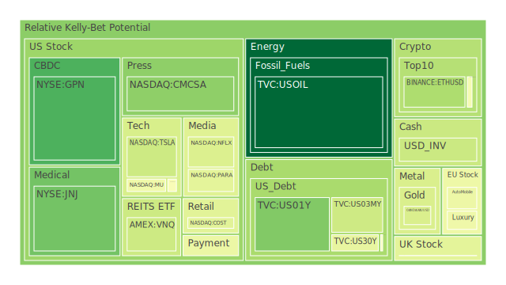
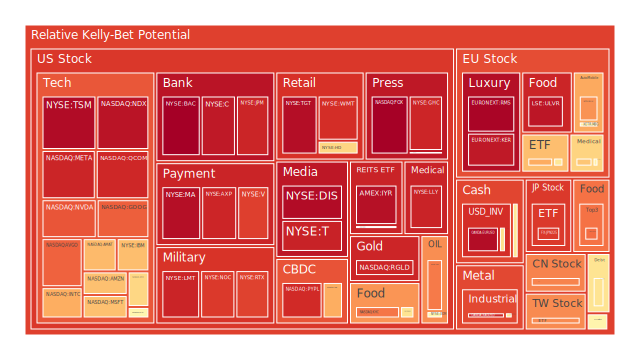
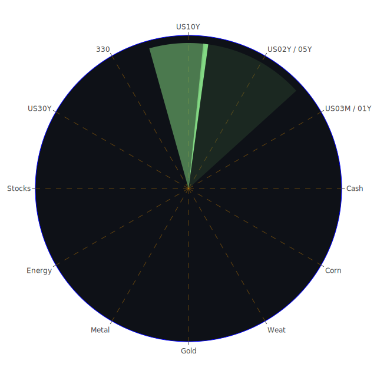

# **投資商品泡沫分析**

在深入探討各類資產之前，我們需理解數據中的泡沫指數意涵。D1代表當日泡沫分數，D7、D14、D30則分別代表過去一週、兩週及一個月的平均泡沫分數。分數越接近1，表示潛在泡沫風險越高；分數越接近0，則風險越低。PP100為分析當日的參考價格。

* 美國國債 (US Treasuries)  
  觀察美國國債收益率曲線，截至2025年5月3日，短期國債如3個月期 (US03M) 收益率為4.32%，1年期 (US01Y) 為4.01%，2年期 (US02Y) 為3.82%。中長期方面，5年期 (US05Y) 為3.92%，10年期 (US10Y) 為4.31%，20年期 (US20Y) 為4.81%，30年期 (US30Y) 為4.79%。值得注意的是，10年期與3個月期利差 (10Y-03M) 為-0.01%，顯示收益率曲線仍然呈現倒掛或極度平坦的狀態，歷史上這種情況往往預示著經濟衰退的風險，儘管近期倒掛程度有所緩和 (從去年-1.36%改善)。從泡沫指數來看，短期國債如3個月期 (US03MY) 的風險分數在過去一個月內有所上升 (D30: 0.338, D1: 0.388)，1年期 (US01Y) 的D1分數 (0.258) 顯著低於其月平均 (0.477)，顯示短期風險有所緩和，但一個月維度看仍有壓力。2年期 (US02Y) 風險分數穩定在0.6左右，顯示市場對其定價相對穩定但風險意識較高。中長期債券如5年期 (US05Y)、10年期 (US10Y)、30年期 (US30Y) 的泡沫分數在0.4至0.55之間波動，顯示市場對未來利率路徑和通膨預期存在一定的不確定性。FED經濟數據顯示，聯準會總資產持續下降 (QT)，但聯邦基金有效利率交易量 (EFFR Volume) 龐大且近期趨勢反轉，隔夜逆回購 (RRP) 規模下降，而貨幣市場基金總資產 (Money Market Funds Total Assets) 持續上升，顯示大量流動性尋求短期、相對安全的停泊處。聯準會近期三次鷹派發言也強化了市場對高利率維持更長時間的預期。從心理學角度看，持續的利率不確定性可能導致投資者在債券久期選擇上猶豫不決。社會學層面，高利率環境對借貸成本敏感的群體（如首次購房者、中小企業）產生壓力。博弈論觀點，市場參與者正在與聯準會的政策意圖進行博弈，試圖預判利率峰值與降息時點。  
* 美國零售股 (Retail Stocks)  
  以沃爾瑪 (WMT) 和塔吉特 (TGT) 為例。WMT 現價98.75美元，泡沫分數極高且持續攀升 (D1: 0.903, D7: 0.884, D14: 0.857, D30: 0.782)，顯示市場對其定價極度樂觀，可能已脫離基本面，風險顯著。TGT 現價97.37美元，同樣呈現非常高的泡沫風險 (D1: 0.966, D7: 0.965, D14: 0.935, D30: 0.851)，風險甚至高於WMT。好市多 (COST) 現價1008.30美元，泡沫分數相對較低但仍處於中等水平 (D1: 0.433, D30: 0.502)，顯示風險有所回落。家得寶 (HD) 現價364.52美元，泡沫分數處於中高水平 (D1: 0.624, D30: 0.694)。新聞顯示沃爾瑪墨西哥業務消費回暖 (Positive, 94%)，但麥當勞 (雖非零售股，但反映消費趨勢) 提及消費者壓力導致客流下降 (Negative, 97%)。美國第一季GDP出現萎縮 (Negative, 95%)，消費者拖欠率處於相對高位 (Consumer Delinquent is at relatively high level)，這些都對零售業構成挑戰。經濟學角度，高利率和通膨壓力侵蝕消費者購買力，可能導致消費降級或支出縮減。社會學層面，消費習慣的改變（線上vs線下，必需品vs非必需品）影響不同零售商的表現。心理學角度，高泡沫分數可能反映了投資者對大型零售商防禦性特徵的過度追捧，或是對其定價能力的樂觀預期。歷史上看，消費支出是經濟的重要支柱，零售股的表現常被視為經濟健康的晴雨表，目前的高風險信號值得警惕。  
* 美國科技股 (Tech Stocks)  
  科技股表現分化。蘋果 (AAPL) 現價205.35美元，泡沫分數從中等水平快速上升 (D1: 0.492 vs D30: 0.628)，顯示風險正在積聚，可能與近期法官裁定其違反App Store改革命令 (Negative, 84%) 有關。微軟 (MSFT) 現價435.28美元，泡沫分數處於中高水平且穩定 (D1: 0.666, D30: 0.688)，其第三季財報超預期 (Positive, 91%)，但同時預警AI產能限制 (Negative, 96%)，顯示增長與瓶頸並存。谷歌 (GOOG) 現價165.81美元，泡沫分數近期大幅上升 (D1: 0.823 vs D30: 0.669)，可能受到Gemini升級 (Positive, 82%) 及CEO警告分拆後果 (Negative, 94%) 等多重消息影響。Meta (META) 現價597.02美元，泡沫分數極高 (D1: 0.920, D30: 0.912)，財報超預期並增加AI投入 (Positive, 94%, 92%)，但關稅影響廣告的擔憂仍存，高風險顯著。亞馬遜 (AMZN) 現價189.98美元，泡沫分數高企且持續上升 (D1: 0.668 vs D30: 0.803)，財報發布後市場反應可能較為負面 (Stock market today...Amazon results signal trouble ahead, Negative, 96%)。特斯拉 (TSLA) 現價287.21美元，泡沫分數在中低水平徘徊 (D1: 0.386, D30: 0.390)，顯示相較於其他大型科技股，其近期風險評估較低。整體納斯達克100指數 (NDX) 現價20102.61點，泡沫分數非常高 (D1: 0.955, D30: 0.753)，顯示科技股整體風險偏高。  
  從經濟學角度，科技股對利率敏感，高利率環境通常不利於其估值，但AI的敘事似乎提供了強勁的支撐。社會學上，科技巨頭對社會的影響力巨大，涉及數據隱私、壟斷等問題。心理學層面，AI熱潮引發的FOMO（錯失恐懼症）情緒可能是推高估值的重要因素。博弈論中，科技巨頭間的平台競爭、AI軍備競賽是核心焦點。歷史警示我們，科技泡沫（如2000年）破裂可能對市場造成巨大衝擊。  
* 美國房地產指數 (Real Estate Index)  
  以VNQ、RWO、IYR為代表。VNQ現價89.71美元，泡沫分數處於中低水平 (D1: 0.387, D30: 0.448)。RWO現價44.15美元，泡沫分數處於中等水平 (D1: 0.546, D30: 0.495)。IYR現價94.96美元，泡沫分數極高 (D1: 0.962, D30: 0.773)，風險顯著。數據顯示美國30年期固定抵押貸款利率高達6.76%，顯著高於去年同期的2.94%，對房地產市場構成巨大壓力。同時，商業地產拖欠率 (Commercial Real Estate Delinquent) 和房地產拖欠率 (Real Estate Delinquent) 均處於相對高位。經濟學原理指出，高利率會增加購房和融資成本，抑制房地產交易和投資。社會學上，住房可負擔性問題日益突出。心理學角度，對房價只漲不跌的信仰可能在高利率環境下面臨考驗。IYR的高泡沫分數可能反映了市場對某些特定房地產領域（如數據中心、物流倉儲）的過度樂觀，或與指數成分股有關。  
* 加密貨幣 (Cryptocurrency)  
  比特幣 (BTCUSD) 現價約96945美元，泡沫分數處於中等水平，且近期有所回落 (D1: 0.540, D30: 0.430)。以太坊 (ETHUSD) 現價約1842.61美元，泡沫分數處於中等水平，相對穩定 (D1: 0.328, D30: 0.505)。狗狗幣 (DOGEUSD) 現價約0.1811美元，泡沫分數處於中等水平 (D1: 0.481, D30: 0.492)。相較於許多傳統資產，主流加密貨幣的泡沫風險評估並不突出，可能反映了經歷過多輪劇烈波動後市場的謹慎情緒，或是部分資金尋求非傳統資產配置。經濟學上，加密貨幣常被視為高風險投機資產，其價值基礎仍在爭議中。社會學層面，加密貨幣代表了一種去中心化的思潮和社群文化。心理學角度，其價格波動巨大，容易引發極端的貪婪與恐懼。博弈論視角下，早期採用者的優勢、監管政策的不確定性、以及「挖礦」的算力競賽都是關鍵因素。  
* 金/銀/銅 (Gold/Silver/Copper)  
  黃金 (XAUUSD) 現價3240.95美元，泡沫分數從歷史高位回落至中等水平 (D1: 0.412 vs D30: 0.438)，但絕對價格處於歷史高位。白銀 (XAGUSD) 現價32.01美元，泡沫分數非常高，且居高不下 (D1: 0.916, D30: 0.859)，風險極高。銅 (COPPER) 現價4.70美元，泡沫分數從高位回落至中等水平 (D1: 0.585 vs D30: 0.773)。黃金/石油比率 (GOLD OIL RATIO) 為55.54，遠高於去年的28.21，顯示黃金相對石油表現強勁。黃金/銅比率 (GOLD COPPER RATIO) 為689.64，略高於去年，顯示黃金相對銅也較強。經濟學上，黃金通常被視為避險資產和抗通膨工具，高利率環境對其構成壓力（持有成本），但地緣政治風險和對法定貨幣體系的擔憂可能提供支撐。白銀兼具貴金屬和工業金屬屬性，其高泡沫分數可能與投機活動或對工業需求（如太陽能）的樂觀預期有關。銅價通常被視為全球經濟活動的領先指標（「銅博士」），其風險回落可能反映對經濟前景的擔憂。新聞中提到美國與烏克蘭簽署自然資源協議 (Positive, 92%) 可能間接影響資源類商品。心理學角度，黃金的歷史地位使其在不確定時期備受青睞。  
* 黃豆 / 小麥 / 玉米 (Soybean/Wheat/Corn)  
  黃豆 (SOYB) 現價21.75美元，泡沫分數從高位回落至中等水平 (D1: 0.500 vs D30: 0.522)，但近期波動較大 (D7: 0.561, D14: 0.627)。小麥 (WEAT) 現價4.61美元，泡沫分數處於中等水平 (D1: 0.508, D30: 0.403)，近期有所上升。玉米 (CORN) 現價18.81美元，泡沫分數大幅上升至高位 (D1: 0.801 vs D30: 0.453)，風險快速積聚。農產品價格受天氣、地緣政治（如烏克蘭戰爭影響糧食出口）、能源價格（影響化肥和運輸成本）、以及全球供需關係等多重因素影響。經濟學上，糧食是必需品，其價格波動直接影響通膨和民生。社會學層面，糧食安全是各國政府關注的焦點。心理學上，對極端天氣或供應中斷的擔憂可能引發囤積行為或投機交易。玉米價格風險的急劇上升需要特別關注，可能與特定的供需失衡或天氣預期有關。  
* 石油/ 鈾期貨 (Oil/Uranium Futures)  
  美國原油 (USOIL) 現價58.35美元，泡沫分數極低 (D1: 0.019, D30: 0.243)，顯示近期風險很低。新聞報導油價創下2021年來最大月度跌幅，因貿易戰擔憂引發衰退和需求疑慮 (Negative, 95%)。鈾期貨 (UX1\!) 現價69.60美元，泡沫分數處於中等水平 (D1: 0.504, D30: 0.498)。石油作為關鍵能源，其價格受OPEC+產量政策、全球經濟增長、地緣政治衝突、美元匯率以及能源轉型等多方面影響。低泡沫分數反映了市場對需求前景的悲觀預期。鈾是核燃料，其價格與核電發展前景、地緣政治（供應國集中度高）以及能源政策相關。經濟學上，能源價格是通膨的重要驅動因素。社會學層面，能源轉型與氣候變化是長期趨勢。心理學上，對能源供應穩定性的擔憂普遍存在。博弈論中，OPEC+與消費國、傳統能源與新能源之間的博弈持續進行。  
* 各國外匯市場 (Forex Market)  
  美元/日圓 (USDJPY) 現價144.96，泡沫分數從極高水平回落至中高位 (D1: 0.576, D30: 0.561)，但過去一個月平均值曾達1.00，顯示極度風險後有所緩和，但仍處高位。歐元/美元 (EURUSD) 現價1.13，泡沫分數極高 (D1: 0.969, D30: 0.700)，顯示對歐元相對美元的看空情緒達到極致，或存在巨大的反轉風險。英鎊/美元 (GBPUSD) 現價1.33，泡沫分數處於中低水平 (D1: 0.382, D30: 0.464)。澳元/美元 (AUDUSD) 現價0.64，泡沫分數處於中高水平 (D1: 0.602, D30: 0.388)，近期風險上升。外匯市場受各國利率差異、經濟增長前景、通膨水平、央行政策、資本流動及風險偏好等多重因素影響。美元的強勢（相對於日圓和歐元的高泡沫分數）可能與美國相對較高的利率和避險需求有關。歐元/美元的極端風險讀數尤其值得關注，可能預示著匯率的劇烈波動。經濟學中的購買力平價理論、利率平價理論是分析匯率的基礎，但短期內常被市場情緒和資本流動所主導。  
* 各國大盤指數 (Major Indices)  
  除美國納斯達克100指數外，觀察其他主要市場。德國DAX指數 (GDAXI) 現價23111.70點，泡沫分數處於中高水平 (D1: 0.582, D30: 0.553)，相對穩定。英國富時100指數 (FTSE) 現價8632.00點，泡沫分數從高位回落至中等水平 (D1: 0.437 vs D30: 0.639)。法國CAC40指數 (FCHI) 現價7803.40點，泡沫分數處於中高水平 (D1: 0.706, D30: 0.558)，近期有所上升。日本日經225指數 (JPN225) 現價37252.45點，泡沫分數高企 (D1: 0.884, D30: 0.741)。中國滬深300指數 (000300) 現價3770.57點，泡沫分數處於中高水平 (D1: 0.767, D30: 0.479)，近期風險顯著上升。台灣加權指數相關ETF (0050) 現價173.50元新台幣，泡沫分數高企 (D1: 0.754, D30: 0.770)。總體來看，全球主要股指普遍處於中高至高風險水平，日本、台灣和中國A股近期風險尤為突出。新聞中提到德國大眾工廠達成百萬電動車產量但面臨裁員 (Positive/Negative mix, 89%)，西班牙停電造成損失 (Negative, 96%)，英國商界信心因特朗普關稅逆轉而上升 (Positive, 72%)，這些都反映了區域經濟的具體情況。全球股市聯動性高，但區域差異依然存在，受各自經濟基本面、政策環境和地緣政治影響。  
* 美國半導體股 (Semiconductor Stocks)  
  英偉達 (NVDA) 現價114.50美元，泡沫分數極高且持續上升 (D1: 0.838 vs D30: 0.616)，AI龍頭地位使其備受追捧，但風險極高。超微 (AMD) 現價98.80美元，泡沫分數處於中高水平 (D1: 0.621, D30: 0.625)。英特爾 (INTC) 現價20.62美元，泡沫分數處於中高水平，近期快速上升 (D1: 0.703 vs D30: 0.498)，顯示市場對其轉型前景的看法可能有所改善，但風險也在增加。台積電 (TSM) 現價179.28美元，泡沫分數極高且持續處於頂峰 (D1: 0.971, D7: 0.980, D14: 0.984, D30: 0.985)，風險極度集中。高通 (QCOM) 現價139.81美元，泡沫分數很高 (D1: 0.916, D30: 0.800)，但近期財報預測疲軟引發關稅擔憂 (Negative, 94%)。應用材料 (AMAT) 現價155.10美元，泡沫分數很高 (D1: 0.678, D30: 0.834)，風險有所緩和但仍處高位。KLA Corp (KLAC) 現價698.16美元，泡沫分數處於中等水平 (D1: 0.539, D30: 0.479)，財報預測超預期 (Positive, 95%)。  
  半導體行業處於技術變革（AI）、地緣政治（晶片戰爭、供應鏈安全）和經濟週期（需求波動）的交匯點。經濟學上，這是資本密集且週期性強的行業。社會學層面，晶片是現代社會的基石。心理學上，對技術突破的期待和對供應鏈斷裂的恐懼交織。博弈論中，國家間的科技競賽、企業間的市場份額爭奪異常激烈。黃仁勳稱中美晶片競賽接近 (Positive, 65%)，暗示競爭格局的動態變化。TSM的極高泡沫分數反映了其在全球供應鏈中的關鍵地位以及市場的高度依賴，但也蘊含巨大風險。  
* 美國銀行股 (Bank Stocks)  
  摩根大通 (JPM) 現價252.51美元，泡沫分數非常高 (D1: 0.920, D30: 0.748)，風險顯著上升。美國銀行 (BAC) 現價41.07美元，泡沫分數達到極限水平 (D1: 0.995, D7: 0.995, D14: 0.995, D30: 0.931)，風險極高。花旗集團 (C) 現價70.59美元，泡沫分數同樣很高 (D1: 0.943, D30: 0.861)。Capital One Financial (COF) 現價187.83美元，泡沫分數處於中等水平 (D1: 0.459, D30: 0.466)。FED數據顯示，信用卡壞賬率 (Charge-off Rate on Credit Card / 100S) 和商業地產拖欠率處於高位，這對銀行資產質量構成壓力。然而，銀行總存款 (US Bank Total Deposits) 仍處於高位，顯示體系流動性尚可。高利率環境有利於擴大淨息差，但同時也增加信用風險和融資成本。銀行股的高泡沫分數可能反映了市場對其盈利能力的樂觀預期，或是認為其規模足以抵禦風險（「大到不能倒」的心理預期），但這與基本面壓力存在矛盾。經濟學上，銀行是信用創造的核心，其健康狀況關乎整體經濟。歷史上，銀行危機往往引發系統性風險。  
* 美國軍工股 (Defense Stocks)  
  洛克希德·馬丁 (LMT) 現價472.80美元，泡沫分數非常高 (D1: 0.922, D30: 0.758)，風險顯著。諾斯洛普·格魯曼 (NOC) 現價491.42美元，泡沫分數很高 (D1: 0.883, D30: 0.735)。雷神技術 (RTX) 現價130.21美元，泡沫分數很高 (D1: 0.869, D30: 0.758)。軍工股的表現與地緣政治緊張局勢、國防預算開支密切相關。近期國際衝突和地區緊張局勢（如烏克蘭戰爭、中東局勢、阿爾及利亞戰時動員法案草案 (Negative, 81%)）可能推高了市場對軍工企業訂單和盈利的預期。經濟學角度，國防開支具有一定的逆週期調節作用，但在和平時期可能被視為非生產性支出。社會學層面，軍工複合體對政治和社會的影響深遠。心理學上，對國家安全的擔憂情緒會提升軍工股的吸引力。高泡沫分數顯示市場可能已充分甚至過度計入了地緣政治風險溢價。  
* 美國電子支付股 (Electronic Payment Stocks)  
  Visa (V) 現價347.60美元，泡沫分數很高 (D1: 0.874, D30: 0.769)。萬事達卡 (MA) 現價559.39美元，泡沫分數極高 (D1: 0.964, D30: 0.821)。PayPal (PYPL) 現價67.24美元，泡沫分數非常高且持續攀升 (D1: 0.910, D7: 0.935, D14: 0.948, D30: 0.955)，風險極度集中。Global Payments (GPN) 現價78.85美元，泡沫分數較低且波動 (D1: 0.182 vs D30: 0.711)，近期風險大幅下降。美國運通 (AXP) 現價276.85美元，泡沫分數很高 (D1: 0.919, D30: 0.794)。電子支付行業受益於現金使用減少和電子商務普及的長期趨勢。然而，競爭加劇（來自金融科技新創）、監管壓力以及宏觀經濟波動（影響消費支出）是其面臨的挑戰。高泡沫分數反映了市場對其商業模式和網絡效應的高度認可，但PYPL的極高且持續上升的風險讀數需要特別警惕，可能存在特定的負面預期或風險事件。  
* 美國藥商股 (Pharmaceutical Stocks)  
  嬌生 (JNJ) 現價156.12美元，泡沫分數處於低位 (D1: 0.235, D30: 0.270)，相對安全。默克 (MRK) 現價83.18美元，泡沫分數處於中等水平 (D1: 0.554, D30: 0.524)。禮來 (LLY) 現價823.62美元，泡沫分數非常高 (D1: 0.924, D30: 0.925)，風險持續高企。諾和諾德 (NVO) 現價69.23美元，泡沫分數處於中高水平 (D1: 0.655, D30: 0.718)。大型製藥公司通常被視為防禦性板塊，受益於人口老化和醫療保健需求的穩定增長。然而，藥品定價壓力、專利懸崖、以及新藥研發的風險是其固有挑戰。禮來和諾和諾德的高估值和高風險可能與其在減肥藥和糖尿病藥物領域的突破性進展相關，市場寄予厚望。特朗普警告對藥企加徵關稅 (Negative, 69%) 可能帶來政策風險。心理學上，對健康長壽的追求使得醫療保健支出具有剛性。  
* 美國影視股 (Entertainment Stocks)  
  Netflix (NFLX) 現價1156.49美元，泡沫分數處於中等水平 (D1: 0.418, D30: 0.486)。迪士尼 (DIS) 現價92.49美元，泡沫分數極高 (D1: 0.970, D30: 0.700)，風險顯著上升。影視娛樂行業面臨流媒體競爭白熱化、內容成本上升、以及宏觀經濟影響廣告收入和用戶訂閱意願等挑戰。迪士尼的高風險可能與其業務轉型（流媒體盈利壓力、傳統業務挑戰）和潛在的激進投資者壓力有關。Netflix的風險相對可控。  
* 美國媒體股 (Media Stocks)  
  派拉蒙全球 (PARA) 現價11.43美元，泡沫分數處於中等水平 (D1: 0.438, D30: 0.510)。福斯公司 (FOX) 現價46.17美元，泡沫分數達到極限水平 (D1: 0.993, D30: 0.825)，風險極高。康卡斯特 (CMCSA) 現價34.46美元，泡沫分數處於低位 (D1: 0.277, D30: 0.478)，近期風險下降。紐約時報 (NYT) 現價52.31美元，泡沫分數處於中等偏高水平 (D1: 0.527, D30: 0.751)，風險有所回落但仍需關注。傳統媒體行業普遍面臨數位化轉型的挑戰，廣告收入受到科技巨頭擠壓，用戶習慣也在改變。福斯公司的極高風險可能與其特定的政治立場、業務結構或潛在的訴訟風險有關。  
* 石油防禦股 (Oil Defensive Stocks)  
  埃克森美孚 (XOM) 現價106.21美元，泡沫分數處於中等偏高水平 (D1: 0.540, D30: 0.767)，風險有所回落但仍顯著。西方石油 (OXY) 現價40.61美元，泡沫分數高企且穩定 (D1: 0.780, D30: 0.761)。雖然油價近期下跌，但大型石油公司的股票風險評估仍然較高。這可能反映了市場對其自由現金流、股息和股票回購計劃的偏好，或是認為其在能源轉型過程中仍能維持較長時間的盈利能力。巴菲特對西方石油的持續投資也可能提振了市場信心。然而，高分數也暗示其估值可能已充分反映利好。  
* 金礦防禦股 (Gold Mining Defensive Stocks)  
  以Royal Gold (RGLD) 為例，現價176.51美元，泡沫分數非常高 (D1: 0.919, D30: 0.921)，風險持續高企。金礦股的表現通常與金價正相關，但同時也受自身運營效率、開採成本、儲量狀況以及政治風險（礦區所在地）的影響。其高於黃金本身的泡沫分數，可能意味著市場預期金價將進一步上漲，或者對其盈利槓桿效應有較高期待，但也放大了風險。  
* 歐洲奢侈品股 (European Luxury Stocks)  
  LVMH (MC) 現價495.85歐元，泡沫分數處於中等水平 (D1: 0.465, D30: 0.459)。開雲集團 (KER) 現價184.72歐元，泡沫分數非常高 (D1: 0.944, D30: 0.695)，風險近期急劇上升。愛馬仕 (RMS) 現價2452.00歐元，泡沫分數極高 (D1: 0.985, D30: 0.676)，風險同樣近期急升。奢侈品行業對宏觀經濟，特別是高淨值人群的財富效應敏感。雖然通常被認為具有一定的品牌護城河和定價能力，但全球經濟放緩、地緣政治風險以及消費者偏好變化都可能帶來影響。KER和RMS的極高風險讀數值得警惕，可能反映了市場對其未來增長的過度樂觀預期或特定風險。  
* 歐洲汽車股 (European Auto Stocks)  
  保時捷汽車控股 (PAH3) 現價36.76歐元，泡沫分數處於中等水平 (D1: 0.460, D30: 0.533)。賓士集團 (MBG) 現價53.30歐元，泡沫分數處於中等水平 (D1: 0.557, D30: 0.505)。寶馬 (BMW) 現價74.82歐元，泡沫分數處於中高水平 (D1: 0.743, D30: 0.568)，近期風險有所上升。歐洲汽車製造商面臨電動化轉型、來自中國車企的競爭、供應鏈問題以及宏觀經濟壓力等多重挑戰。德國大眾百萬電動車產量的新聞也伴隨著裁員陰影。相對溫和的泡沫分數可能反映了市場對這些挑戰的認知。  
* 歐美食品股 (European/American Food Stocks)  
  可口可樂 (KO) 現價71.65美元，泡沫分數處於中高水平 (D1: 0.592, D30: 0.771)，風險有所回落但仍顯著。雀巢 (NESN) 現價87.60瑞士法郎，泡沫分數處於中等水平 (D1: 0.536, D30: 0.547)。卡夫亨氏 (KHC) 現價28.64美元，泡沫分數高企 (D1: 0.787, D30: 0.750)。聯合利華 (ULVR) 現價4766.00英鎊，泡沫分數極高且穩定 (D1: 0.951, D30: 0.950)，風險極高。食品飲料行業通常被視為防禦性板塊，但同樣面臨成本上漲（原料、能源、勞動力）、消費者購買力下降以及對健康、環保產品的偏好轉變等壓力。聯合利華的極高風險可能與其特定的業務組合、重組計劃或市場對其定價能力的極度樂觀預期有關。Woolworths（雖未直接提供數據，但新聞提及）銷售增長因消費者尋求折扣 (Positive, 82%)，也反映了消費降級的趨勢。

# **宏觀經濟傳導路徑分析**

綜合來看，當前宏觀經濟呈現複雜交織的圖景。

* **正向路徑（Thesis \- 政策緊縮與經濟承壓）**：聯準會維持高利率並縮減資產負債表（高利率環境、FED Total Assets下降、3次鷹派發言） → 提高借貸成本（抵押貸款利率6.76%） → 抑制企業投資和居民消費（Q1 GDP萎縮） → 經濟活動放緩 → 企業盈利承壓（油價大跌反映需求擔憂、麥當勞客流下降） → 信用風險上升（各類拖欠率處於高位）。  
* **反向路徑（Antithesis \- 市場韌性與流動性充裕）**：儘管經濟承壓，但金融市場部分資產估值仍處高位（多個資產泡沫分數高企） → 可能原因包括：AI敘事驅動的結構性機會（科技股高風險）、避險情緒推升特定資產（黃金、美元、軍工股高風險）、流動性依然充裕（貨幣市場基金規模上升、銀行存款高位、EFFR交易量龐大）。  
* **綜合路徑（Synthesis \- 分化、風險積聚與潛在拐點）**：宏觀緊縮政策的影響正在逐步顯現，實體經濟壓力增大，信用風險點狀爆發的可能性增加。然而，市場並未出現一致性的風險規避，資金在不同主題（AI、避險、高息）和資產間流動，導致部分資產泡沫化風險極高。這種實體經濟壓力與金融市場估值的分化蘊含風險。未來的傳導路徑可能包括：  
  1. **信用事件觸發**：高企的拖欠率若演變為大規模違約，可能衝擊銀行體系（銀行股極高風險），引發信貸緊縮，進而拖累整體經濟和風險資產。  
  2. **政策轉向預期**：若經濟數據持續惡化，市場可能強化對聯準會降息的預期，導致債券收益率下降，利好成長股和房地產，但可能加劇通膨擔憂。  
  3. **地緣政治衝擊**：國際衝突升級可能導致能源價格飆升（儘管目前油價低迷）、供應鏈中斷，加劇通膨並衝擊全球經濟，利好軍工和部分避險資產。  
  4. **技術泡沫破裂**：若AI發展不及預期或監管加強，科技股（尤其是半導體）的高估值可能難以維繫，引發市場大幅回調。

# **微觀經濟傳導路徑分析**

從企業和行業層面觀察，傳導路徑更為具體：

* **成本傳導**：能源、原材料、勞動力成本上升 → 擠壓企業利潤 → 企業試圖向下游轉嫁成本 → 若消費者承受能力有限（零售數據顯示壓力） → 需求下降 → 企業盈利惡化。食品股（KHC, ULVR）、零售股（WMT, TGT）的高風險可能部分反映了市場對其成本轉嫁能力的過度自信。  
* **技術創新傳導**：AI技術突破（新聞：Meta增加AI投入、Google Gemini升級） → 相關企業（NVDA, MSFT, META, GOOG, TSM）獲得估值溢價 → 帶動產業鏈投資（半導體設備AMAT, KLAC）→ 但可能面臨產能瓶頸（MSFT預警）、激烈競爭（中美晶片競賽）和應用落地挑戰。  
* **供應鏈傳導**：地緣政治或突發事件導致供應鏈瓶頸（歷史：疫情；新聞：西班牙停電） → 影響生產（Spirit Aero影響波音）→ 推高成本或導致收入下降。半導體供應鏈的集中度（TSM極高風險）是一個顯著的微觀風險點。  
* **消費習慣傳導**：消費者偏好轉變（健康飲食、環保、線上購物、體驗經濟） → 利好相關企業（減肥藥LLY, NVO；電商AMZN；支付V, MA） → 衝擊傳統模式企業（部分傳統零售、媒體）。麥當勞客流下降是消費習慣和經濟壓力共同作用的結果。  
* **監管政策傳導**：反壟斷調查（Google）、數據隱私法規、行業特定監管（銀行資本要求、藥品定價） → 影響企業經營策略和盈利能力。蘋果App Store案敗訴、特朗普對藥企關稅警告是具體例子。

**資產類別間傳導路徑分析**

不同資產類別之間存在複雜的相互影響和資金流動：

* **利率與股債輪動**：高利率 → 提升債券吸引力（理論上）→ 資金流出股市，尤其是高估值成長股（科技股）→ 流入債券或高股息股票。但目前數據顯示，債券風險評估中等，而科技股、銀行股、甚至黃金白銀風險極高，表明此輪動不暢或被其他因素（如AI敘事、避險需求）壓倒。  
* **風險偏好傳導**：風險偏好上升 → 資金流入風險資產（股市、加密貨幣、高收益債）→ 流出避險資產（國債、黃金）。風險偏好下降則反之。當前市場信號矛盾：科技股、銀行股、奢侈品股、白銀泡沫分數極高（風險偏好高），同時黃金價格高企、美元強勢、短期國債受追捧（風險偏好低）。這反映了市場的高度不確定性和投資者行為的分化。可能是不同類型投資者主導不同市場，或者投資者同時進行風險對沖。  
* **通膨預期傳導**：通膨預期上升 → 利好實物資產（黃金、大宗商品、房地產）→ 不利於固定收益債券 → 對股市影響複雜（成本壓力vs定價能力）。目前CPI年增率2.40%，較去年顯著回落，但高利率和地緣風險使得通膨預期仍不穩定。  
* **美元匯率傳導**：美元升值（USDJPY, EURUSD數據反映） → 增加美國進口購買力，抑制出口 → 對美國跨國公司盈利產生匯兌損失 → 壓低以美元計價的大宗商品價格（如石油、銅） → 新興市場面臨資本外流和償債壓力。  
* **商品價格傳導**：能源、金屬、農產品價格波動 → 影響相關企業盈利（石油股、礦業股、農業相關）→ 傳導至消費品價格（通膨）→ 影響消費者支出和整體經濟。  
* **危機傳染路徑**：某一資產類別或區域出現危機（如銀行危機、房地產泡沫破裂、主權債務違約） → 可能通過金融機構關聯、信心崩潰、流動性枯竭等途徑 → 蔓延至其他資產和市場，引發系統性風險。目前銀行股和部分房地產指數的高風險值得警惕。

# **投資建議**

基於當前市場的高度不確定性、多個資產類別的極高泡沫風險以及相互矛盾的市場信號，投資者應極度審慎，並根據自身的風險承受能力和投資目標進行配置。以下提供三種不同風險偏好的配置建議，旨在通過分散化來應對潛在波動，追求在當前環境下的相對優化。**請注意，所有比例建議僅供參考，且三大類總和為100%。**

1. **穩健型投資組合 (Stable Portfolio \- 追求資本保值和低波動)**  
   * **配置理念**：側重於降低波動性，抵禦下行風險，獲取相對穩定的收益。  
   * **建議配置比例**：  
     * **40% 短期美國國債/貨幣市場工具**：鑒於短期國債 (如US01Y, US03MY) 相對較低的泡沫分數和較高的即期收益率，以及貨幣市場基金的高吸納能力，此部分可提供流動性和相對安全性。  
     * **35% 優質醫療保健股**：選擇如嬌生 (JNJ) 這類泡沫分數低、業務穩健、具有防禦屬性的龍頭企業。雖然禮來 (LLY) 和諾和諾德 (NVO) 增長潛力巨大，但其極高的泡沫分數不適合穩健型組合的核心配置。  
     * **25% 全球必需消費品股**：選擇如雀巢 (NESN) 這類地域和產品線多元化、泡沫分數相對可控的全球食品飲料巨頭，以分散單一市場風險。避開泡沫分數極高的聯合利華 (ULVR) 和風險顯著的可口可樂 (KO)。  
   * **理由**：此組合偏重於低風險的固定收益和防禦性較強的必需消費、醫療板塊，旨在降低市場Beta，並在不確定環境中保全資本。  
2. **成長型投資組合 (Growth Portfolio \- 追求長期資本增值，承受中等波動)**  
   * **配置理念**：在風險可控的前提下，捕捉結構性增長機會，平衡不同行業的風險暴露。  
   * **建議配置比例**：  
     * **35% 核心科技股**：配置於泡沫分數雖高但基本面相對紮實、擁有護城河的科技巨頭，如微軟 (MSFT) 或谷歌 (GOOG)，分享雲計算和AI發展紅利，但需認識到其高估值風險。  
     * **35% 電子支付龍頭**：配置於Visa (V) 或萬事達卡 (MA)，雖然泡沫分數高，但其雙寡頭壟斷地位和網絡效應提供了較強的定價能力和長期增長前景。避開風險極度集中的PayPal (PYPL)。  
     * **30% 精選工業/半導體設備股**：配置於如KLA Corp (KLAC) 或其他泡沫分數相對可控、受益於全球製造業升級或半導體週期復甦預期的工業/設備股。避免直接配置風險極高的NVDA或TSM，而是選擇產業鏈上相對穩健的環節。  
   * **理由**：此組合試圖在科技、金融科技和工業領域尋找增長動力，同時通過選擇龍頭企業和相對風險可控的子行業來管理風險。承認高估值，但押注長期趨勢。  
3. **高風險型投資組合 (High-Risk Portfolio \- 追求高回報，能承受較大波動和潛在損失)**  
   * **配置理念**：承擔高風險以博取高額回報，配置於高波動性、高話題性或具有高潛在回報的資產。  
   * **建議配置比例**：  
     * **40% AI/半導體領導者**：集中配置於泡沫分數極高但處於AI浪潮核心的企業，如英偉達 (NVDA) 或台積電 (TSM)。此為高風險高波動的核心倉位，押注其技術領先地位和市場主導力能持續。  
     * **30% 貴金屬/礦業股**：配置於白銀 (XAGUSD) 或高風險的金礦股 (RGLD)。白銀的高泡沫分數和高波動性提供了潛在的投機機會，同時貴金屬屬性也提供了對沖尾部風險的可能。  
     * **30% 加密貨幣**：配置於比特幣 (BTCUSD) 或以太坊 (ETHUSD)。雖然目前泡沫分數中等，但其高波動性和與傳統資產的潛在低相關性（或高風險同向性）使其成為高風險組合的一部分，用於捕捉非傳統資產的爆發潛力。  
   * **理由**：此組合極度激進，集中投資於當前市場熱點（AI）、高波動投機品（白銀）和新興資產類別（加密貨幣）。潛在回報高，但潛在損失也巨大，僅適合風險承受能力極高的投資者。

# **風險提示**

本報告所有分析和建議均基於所提供的有限數據和特定時間點（2025年5月3日）的觀察。金融市場瞬息萬變，充滿不確定性。泡沫指數僅為基於歷史數據模式的風險評估工具，不代表未來必然發生泡沫破裂，也不能預測其發生的確切時間。新聞事件的影響可能被市場迅速消化或產生非預期效果。宏觀經濟和地緣政治的發展路徑難以精確預測。

投資涉及重大風險，可能導致本金損失。過去的表現不代表未來的回報。本報告內容不構成任何形式的投資邀約或保證。投資者在做出任何投資決策前，應充分考慮自身的財務狀況、投資目標、風險承受能力，並尋求獨立的專業財務建議。市場總是正確的，直到它不再正確為止。請務必謹慎行事。

 
Daily Buy Map:

 
Daily Sell Map:

 
Daily Radar Chart:

 
