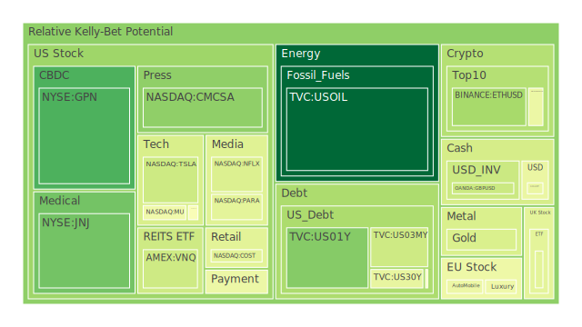
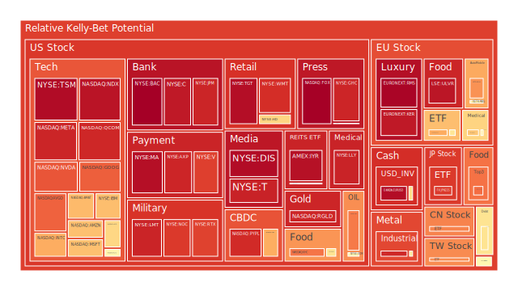
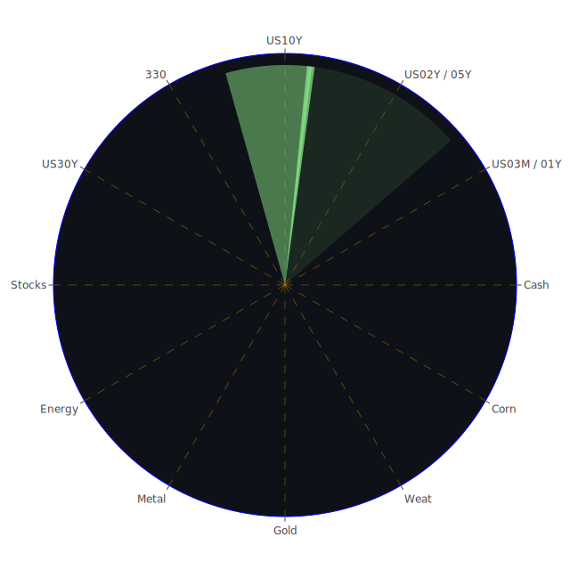

# **投資商品泡沫分析**

當前全球金融市場環境呈現高度複雜且多變的局面。在分析各類資產的潛在泡沫風險時，我們必須採取一種客觀中立的態度，將市場波動視為多重因素交互作用下的自然現象，避免過度情緒化的解讀。以下將針對各主要投資類別，結合近期數據、歷史經驗、相關新聞事件以及不同學科理論視角，進行深入的泡沫風險評估與觀察。

* 美國國債  
  觀察美國各年期國債的價格與風險數據，可以發現市場正處於一個微妙的平衡點。短期國債如三個月期 (US03MY) 與一年期 (US01Y) 的現價穩定，但泡沫指數顯示出短期波動性。例如，US03MY 的 D1 泡沫分數 (0.388) 顯著高於其月平均 (0.338)，一年期國債 (US01Y) 也有類似情況 (D1: 0.263 vs D30: 0.477，顯示近期風險感知下降)。這可能反映了市場對於聯準會短期利率政策路徑的高度不確定性，交易者在積極定價短期內的政策變動，導致價格波動與風險感知的快速變化。從經濟學角度看，短期利率主要受中央銀行政策利率影響，而當前的數據顯示聯準會總資產下降、貨幣市場基金總資產上升，以及近期偏鷹派的官員發言，都指向流動性可能趨緊，但市場仍在博弈降息的可能性與時點。  
  中長期國債方面，十年期 (US10Y) 與三十年期 (US30Y) 的收益率近期有所回落（價格相對穩定），泡沫指數 D1 相較於 D30 也有所下降（US10Y: 0.547 vs 0.460; US30Y: 0.448 持平）。然而，其月平均泡沫指數仍處於中等水平 (0.4-0.5 區間)，暗示中長期通膨預期、經濟增長前景以及全球資金流動對其價格仍構成潛在壓力。從博弈論角度看，長期債券的持有者與發行者（政府）之間存在一種持續的博弈。高企的政府公共債務佔 GDP 比例，以及持續增發的美國國債總量，雖然目前由國內公眾和外國持有的比例仍高，但長期償債壓力不容忽視。近期殖利率曲線部分倒掛現象（例如 10 年期減 3 個月期為 \-0.01）雖然較去年大幅改善，但歷史上這種倒掛往往預示著經濟衰退風險，增加了債券市場的不確定性。聯準會數據顯示，商業房地產和消費者拖欠率上升，高收益債券利率處於高位，這些都是經濟承壓的信號，可能在中長期內影響投資者對國債風險的評估。  
* 美國零售股  
  零售行業直接反映消費者信心與支出能力。觀察 Costco (COST) 和 Walmart (WMT)，兩者均顯示較高的泡沫指數，特別是月平均指數 (COST D30: 0.502, WMT D30: 0.782)。Target (TGT) 的泡沫指數更是居高不下 (D30: 0.851)。這反映出市場對這些零售巨頭的穩定性與市場份額給予了高估值，但也潛藏著較高的回調風險。近期新聞顯示，麥當勞、星巴克等餐飲零售業出現客流量下降，歸因於消費者壓力增大，這是一個值得警惕的社會現象信號。即使像 Costco 這樣以提供價值著稱的零售商，其高企的股價也需要持續的強勁增長來支撐。經濟學上，消費支出是 GDP 的重要組成部分，若消費者因通膨壓力、高利率或對未來經濟前景擔憂而縮減開支，零售股的盈利將首當其衝。心理學角度看，品牌忠誠度和購物習慣可能在一定程度上支撐股價，但當經濟壓力達到臨界點時，消費降級可能成為普遍現象。Home Depot (HD) 的泡沫指數也處於偏高水平 (D30: 0.694)，顯示市場對房地產相關消費的預期仍較樂觀，但這與聯準會數據中房地產拖欠率上升以及 30 年期固定抵押貸款利率高企 (6.76%) 的宏觀背景存在一定張力。若房市景氣進一步下滑，HD 的表現可能面臨挑戰。  
* 美國科技股  
  科技股，特別是大型科技股，一直是市場關注的焦點。以納斯達克 100 指數 (NDX) 為代表，其泡沫指數居高不下 (D30: 0.753)，顯示整體科技板塊估值偏高。個股方面，Microsoft (MSFT)、Apple (AAPL)、Google (GOOG)、Amazon (AMZN)、Meta (META) 等巨頭的泡沫指數普遍處於中高至高位水平。例如，META 的 D30 高達 0.912，MSFT 為 0.688，AAPL 為 0.628，GOOG 為 0.669，AMZN 為 0.803。這反映了市場對這些公司在人工智能 (AI)、雲計算、數位廣告等領域的領導地位和未來增長潛力的極高期望。  
  然而，風險亦不容忽視。從經濟學角度看，高利率環境對成長型科技股的估值構成壓力，因為未來現金流的折現值會降低。近期新聞顯示，即使是 Amazon 和 Apple 這樣的巨頭，也可能因貿易關稅（如 Apple 警告貿易戰影響、Microsoft 提高 Xbox 價格）或宏觀經濟放緩而給出謹慎的業績指引，導致股價波動。社會學角度，AI 技術的快速發展引發了關於就業、倫理和監管的廣泛討論，這些都可能影響行業的長期發展。心理學上，科技股容易受到市場情緒驅動，形成「錯失恐懼症」(FOMO) 推動的動能交易，但也容易在負面消息出現時引發恐慌性拋售。歷史經驗表明，科技泡沫（如 2000 年的網路泡沫）破裂時，跌幅往往巨大。雖然當前科技巨頭的盈利能力遠超當年，但高估值本身就是風險來源。NVIDIA (NVDA) 作為 AI 熱潮的核心受益者，泡沫指數雖高 (D30: 0.616)，但近期 D1 (0.838) 反而上升，顯示短期動能強勁，但這種高度依賴單一敘事的上漲，其脆弱性也相對較高。Tesla (TSLA) 的泡沫指數相對較低 (D30: 0.390)，可能反映了市場對其電動車市場競爭加劇、自動駕駛技術落地挑戰以及 CEO 個人爭議等因素的擔憂。  
* 美國房地產指數  
  以 VNQ 和 IYR 這類房地產投資信託 (REITs) ETF 為觀察對象，VNQ 的泡沫指數處於中等水平 (D30: 0.448)，而 IYR 的泡沫指數則顯著偏高 (D30: 0.773)。RWO (全球房地產 ETF) 的泡沫指數也處於中等水平 (D30: 0.495)。這顯示市場對房地產市場的看法存在分歧。一方面，REITs 提供相對穩定的租金收入，具有一定的抗通膨特性。另一方面，房地產市場對利率極為敏感。當前美國 30 年期固定抵押貸款利率高達 6.76%，遠高於一年前的水平，這無疑增加了購房者的負擔，抑制了交易活動。聯準會數據顯示，商業房地產和整體房地產的拖欠率均處於相對高位，這對持有商業地產（如辦公樓、零售物業）的 REITs 構成了直接壓力。社會學角度看，遠程辦公的普及對商業辦公空間需求產生了結構性影響，而高房價和高利率可能加劇社會住房負擔能力問題。心理學上，房地產通常被視為穩健資產，但在利率急劇上升和經濟前景不明朗時，投資者信心可能動搖。IYR 的高泡沫指數可能包含了對某些特定房地產板塊（如數據中心、物流倉儲）的樂觀預期，但也可能反映了市場對整體風險的低估。  
* 加密貨幣  
  比特幣 (BTCUSD) 和以太坊 (ETHUSD) 作為主要的加密貨幣，其泡沫指數近期有所回落，但月平均值仍處於中等水平 (BTC D30: 0.435, ETH D30: 0.504)。狗狗幣 (DOGEUSD) 的泡沫指數也類似 (D30: 0.491)。加密貨幣市場以其高波動性著稱，其價格受到多種因素影響，包括宏觀流動性、市場情緒、技術採用進展、監管政策以及特定事件驅動。經濟學上，加密貨幣常被視為一種投機性資產，與風險偏好高度相關。當市場流動性充裕、風險偏好高漲時（例如預期降息），資金可能流入加密貨幣。反之，則可能流出。近期聯準會偏鷹派的立場和下降的總資產規模，可能對加密貨幣構成壓力。社會學角度，加密貨幣的去中心化理念吸引了一批忠實的社群支持者，但也面臨著詐騙、洗錢等負面問題，引發監管機構的密切關注。心理學上，加密貨幣市場極易受到名人效應、社群媒體討論以及暴富故事的影響，導致價格劇烈波動。歷史上，加密貨幣經歷過多次大幅回撤，顯示其內在風險極高。近期泡沫指數的回落可能反映了市場在消化前期漲幅，並對宏觀不確定性做出反應，但其高風險、高波動的本質並未改變。MicroStrategy (新聞中提到其連續虧損和發行股票) 這類將比特幣作為主要資產的公司，其股價波動往往與比特幣價格高度相關，放大了相關風險。  
* 金/銀/銅  
  黃金 (XAUUSD) 和白銀 (XAGUSD) 作為傳統的避險資產，其泡沫指數呈現不同景象。黃金的月平均泡沫指數處於中等水平 (D30: 0.438)，而白銀則顯著偏高 (D30: 0.859)。銅 (COPPER) 作為重要的工業金屬，其泡沫指數也非常高 (D30: 0.773)。  
  黃金價格通常受到實際利率（名義利率減去通膨預期）、美元匯率、地緣政治風險以及央行購金等多重因素影響。當前全球地緣政治緊張局勢（新聞提及美伊、以色列、肯亞、剛果等地的衝突或不穩定）為黃金提供了一定的支撐。同時，黃金相對石油 (GOLD OIL RATIO 顯著上升至 55.54) 和銅 (GOLD COPPER RATIO 維持高位) 的比率處於歷史高位，顯示其相對強勢。然而，若聯準會維持高利率，將抑制黃金的上漲空間。  
  白銀兼具貴金屬和工業金屬屬性。其高企的泡沫指數可能反映了市場對其在綠色能源轉型（如太陽能電池板）中工業需求的樂觀預期，同時也受到黃金價格上漲的帶動。但其相對於黃金的波動性更大，高泡沫指數意味著回調風險也更高。  
  銅價的高泡沫指數則主要反映了市場對全球經濟復甦（特別是中國）以及能源轉型帶來需求的預期。然而，全球經濟前景仍不明朗，中國經濟復甦力度尚待觀察，高銅價的可持續性存疑。從經濟學角度看，工業金屬價格是經濟活動的晴雨表，但有時也受到供應鏈問題、庫存水平和投機資金的影響。高銅價若不能被實體經濟需求所驗證，則泡沫破裂的風險較大。Royal Gold (RGLD) 作為金礦權益公司，其泡沫指數極高 (D30: 0.921)，顯示市場對金價和礦業公司盈利前景的樂觀預期已達極致，風險積聚。  
* 黃豆 / 小麥 / 玉米  
  農產品期貨方面，黃豆 (SOYB)、小麥 (WEAT) 和玉米 (CORN) 的泡沫指數呈現分化。黃豆 (D30: 0.522) 和玉米 (D30: 0.453) 處於中等水平，而小麥 (D30: 0.403) 相對較低，但其近期波動較大 (D1: 0.508 vs D7: 0.562)。農產品價格主要受供需關係、天氣狀況、地緣政治（影響貿易流）、能源價格（影響生產成本和生物燃料需求）以及美元匯率等多重因素影響。從經濟學角度看，全球人口增長和飲食結構變化是長期需求驅動力，但短期內，產區天氣（如新聞中提到的紐西蘭惡劣天氣可能影響其他地區）和主要進出口國的政策（如貿易關稅）會導致價格波動。社會學角度，糧食安全是各國政府高度關注的問題，相關政策可能影響市場供需。心理學上，對極端天氣或地緣衝突影響供應的擔憂，可能引發市場的囤積行為或投機性買盤。目前農產品泡沫指數總體不算極高，但仍需關注天氣變化和地緣政治風險對供應鏈的潛在衝擊。  
* 石油/ 鈾期貨UX\!  
  能源期貨方面，美國原油 (USOIL) 的泡沫指數相對較低 (D30: 0.243)，顯示市場對當前油價的評估相對謹慎。鈾期貨 (UX1\!) 的泡沫指數則處於中等偏高水平 (D30: 0.498)。石油價格受到全球經濟增長預期、OPEC+ 產量政策、地緣政治風險（尤其是中東地區）、美元匯率以及替代能源發展等多重因素影響。近期油價相對穩定，低泡沫指數可能反映了市場對全球經濟放緩導致需求減弱的擔憂，與 OPEC+ 可能維持減產以支撐價格的預期相互平衡。然而，地緣政治風險仍是潛在的推升油價因素（如新聞中美國警告伊朗支持胡塞武裝）。  
  鈾價的中高泡沫指數則反映了市場對核能復興的預期。在全球推動能源轉型和能源獨立的背景下，核能作為一種低碳的基載電力來源重新受到重視。多國計劃新建或延長現有核電站壽命，推動了對鈾的需求預期。然而，核能發展也面臨安全擔憂、核廢料處理以及建設週期長、成本高等挑戰。鈾價的長期上漲趨勢能否持續，取決於核能政策的落實程度和公眾接受度。從博弈論角度看，鈾市場供應相對集中，主要生產國的政策和產量決策對價格有顯著影響。  
* 各國外匯市場  
  外匯市場的波動反映了各國經濟基本面、利率差異、資本流動以及風險偏好的變化。美元兌日元 (USDJPY) 的泡沫指數處於中高位 (D30: 0.557)，且近期波動劇烈 (D1: 0.454 vs D7: 0.688)，反映了市場對美日利差、日本央行干預預期以及避險情緒變化的敏感反應。歐元兌美元 (EURUSD) 的泡沫指數極高 (D30: 0.700)，英鎊兌美元 (GBPUSD) 處於中等水平 (D30: 0.464)，澳元兌美元 (AUDUSD) 相對較低 (D30: 0.388)。  
  高企的美日利差是支撐 USDJPY 的主要因素，但日本央行潛在的干預行動構成了下行風險。EURUSD 的高泡沫指數可能反映了市場對歐洲央行降息預期慢於聯準會，或者對歐洲經濟相對韌性的預期，但也使其容易受到歐洲經濟數據不及預期的衝擊。GBPUSD 的表現則受到英國國內經濟狀況（通膨、增長）和央行政策的影響，近期新聞中英國地方選舉結果可能影響政治穩定性預期。AUDUSD 作為商品貨幣，其走勢與全球風險偏好、大宗商品價格（特別是鐵礦石、煤炭）以及澳美利差相關，低泡沫指數可能反映了市場對全球經濟前景和商品需求的擔憂。從經濟學的購買力平價理論和利率平價理論來看，當前匯率水平可能已部分偏離理論值，高泡沫指數的貨幣對存在均值回歸的風險。  
* 各國大盤指數  
  除了美股，其他主要股指也呈現不同程度的泡沫風險。英國富時指數 (FTSE) 的泡沫指數處於中高水平 (D30: 0.639)，德國 DAX 指數 (GDAXI) 處於中等偏高水平 (D30: 0.553)，法國 CAC 指數 (FCHI) 也處於中等偏高水平 (D30: 0.558)，日經 225 指數 (JPN225) 泡沫指數較高 (D30: 0.741)，中國滬深 300 指數 (000300) 處於中等水平 (D30: 0.479)，台灣加權指數 ETF (0050) 泡沫指數較高 (D30: 0.770)。  
  歐洲股市的表現受到區域內通膨、利率政策、俄烏衝突持續影響以及能源供應穩定性的挑戰。高企的奢侈品股 (如 MC, RMS, KER) 泡沫指數（D30 分別為 0.459, 0.676, 0.695）反映了市場對全球富裕階層消費韌性的預期，但也使其容易受到全球經濟放緩和消費趨勢變化的衝擊。汽車股 (PAH3, MBG, BMW) 泡沫指數處於中等偏高水平，面臨電動化轉型、全球競爭和潛在關稅壁壘的壓力。  
  日經指數的高泡沫指數受益於公司治理改革、日元貶值有利出口以及資金流入等因素，但需警惕日本央行政策轉向和全球經濟放緩的風險。  
  滬深 300 指數的泡沫指數相對較低，反映了市場對中國經濟復甦力度和房地產風險的擔憂，但也可能意味著估值相對安全。  
  台灣加權指數 ETF 的高泡沫指數主要由以台積電 (TSM) 為代表的半導體產業驅動，受益於全球 AI 發展趨勢。然而，高度集中的產業結構和地緣政治風險是其潛在的脆弱性來源。  
* 美國半導體股  
  半導體是科技產業的基石，也是當前市場的熱點。除了前述的 NVDA 和 TSM (其 ADR 泡沫指數極高，D30: 0.985)，其他相關個股如 AMD (D30: 0.625), Intel (INTC) (D30: 0.498), Micron (MU) (D30: 0.382), Qualcomm (QCOM) (D30: 0.800), Applied Materials (AMAT) (D30: 0.834), KLA Corp (KLAC) (D30: 0.479), Broadcom (AVGO) (D30: 0.840) 等，泡沫指數差異較大。  
  高指數個股 (TSM, QCOM, AMAT, AVGO) 反映了市場對其在 AI、5G、數據中心等領域的領導地位或強勁需求的預期。然而，半導體行業具有週期性，且受到地緣政治（如晶片禁令、供應鏈安全）、產能擴張與潛在過剩、以及終端需求變化的影響。經濟學上，庫存周期是觀察半導體行業景氣的重要指標。社會學角度，晶片技術的戰略重要性日益凸顯，各國政府紛紛投入巨資支持本土產業發展，可能改變全球競爭格局。心理學上，對技術突破的預期容易引發投資熱潮。Intel 和 Micron 的泡沫指數相對較低，可能反映了市場對其在先進製程競爭中相對落後或受特定終端市場（如 PC、記憶體）需求波動影響的擔憂。AMD 的泡沫指數介於中間，顯示市場對其挑戰 Intel 和 NVIDIA 的能力既有期待也有疑慮。  
* 美國銀行股  
  銀行股的表現與宏觀經濟、利率水平和監管環境密切相關。大型銀行如 JPMorgan Chase (JPM)、Bank of America (BAC)、Citigroup (C) 的泡沫指數均處於高位 (JPM D30: 0.748, BAC D30: 0.931, C D30: 0.861)。Capital One (COF) 的泡沫指數也處於中等偏高水平 (D30: 0.466)。高泡沫指數可能反映了市場預期銀行將受益於較高的淨息差（儘管可能已見頂）以及相對穩健的經濟。然而，風險依然存在。聯準會數據顯示的商業房地產、消費者和信用卡拖欠率上升，可能導致銀行壞賬撥備增加，侵蝕利潤。此外，未實現的債券投資組合損失在高利率環境下仍然是一個潛在風險點，儘管近期有所緩解。歷史上，銀行業危機往往伴隨著經濟衰退。當前的數據信號（如拖欠率上升、聯準會總資產下降、部分殖利率曲線倒掛）提示我們不能忽視潛在的金融穩定風險。心理學上，銀行作為金融體系的核心，其穩定性對市場信心至關重要，任何關於大型銀行風險的傳聞都可能引發系統性擔憂。  
* 美國軍工股  
  在地緣政治緊張局勢加劇的背景下，軍工股受到市場關注。Lockheed Martin (LMT)、Northrop Grumman (NOC)、RTX Corp (RTX) 的泡沫指數均處於高位 (LMT D30: 0.758, NOC D30: 0.735, RTX D30: 0.758)。這反映了市場預期國防開支將持續增長。從經濟學角度看，國防開支屬於政府支出，具有一定的逆週期調節作用，但在和平時期或財政壓力增大時可能面臨削減。社會學角度，軍工產業的發展與國家安全戰略、國際關係以及公眾對軍事力量的態度密切相關。新聞中關於美伊緊張關係、以色列衝突以及其他地區衝突的報導，都為軍工股提供了持續的敘事支撐。然而，高估值意味著市場已經計入了相當樂觀的預期，若地緣政治局勢緩和或政府預算受限，可能導致股價回調。此外，軍工合同的執行也可能面臨成本超支、技術延誤等風險。  
* 美國電子支付股  
  電子支付行業受益於現金使用減少和電子商務普及的長期趨勢。Visa (V)、Mastercard (MA)、American Express (AXP) 的泡沫指數均處於高位 (V D30: 0.769, MA D30: 0.821, AXP D30: 0.794)。PayPal (PYPL) 和 Global Payments (GPN) 的泡沫指數也較高 (PYPL D30: 0.957, GPN D30: 0.711)。高泡沫指數反映了市場對這些公司在支付網絡中的主導地位、強勁的盈利能力和持續增長的預期。經濟學上，支付公司的收入與交易量和交易額密切相關，因此會受到整體經濟活動和消費支出的影響。社會學角度，支付習慣的變遷、新興支付方式（如先買後付、數字錢包）的競爭以及數據隱私和安全問題，都可能影響行業格局。心理學上，品牌認知度和用戶粘性是這些公司的重要護城河。PayPal 的極高泡沫指數可能還包含了對其轉型和成本削減措施成功的預期，但其面臨的競爭壓力也更大。GPN 的高泡沫指數也反映了市場對其整合收購和服務擴展的樂觀預期。總體而言，該板塊估值偏高，對宏觀經濟放緩和競爭加劇的抵抗力有待觀察。  
* 美國藥商股  
  大型藥商股通常被視為防禦性板塊，因為藥品需求相對剛性。然而，個股表現和風險評估差異較大。Eli Lilly (LLY) 的泡沫指數極高 (D30: 0.925)，主要受益於其在減肥藥和阿爾茨海默症藥物領域的突破性進展。Johnson & Johnson (JNJ) 的泡沫指數相對較低 (D30: 0.270)，可能反映了市場對其訴訟風險和分拆後增長前景的擔憂。Merck (MRK) 的泡沫指數處於中等偏高水平 (D30: 0.524)，Novo Nordisk (NVO) 的泡沫指數也較高 (D30: 0.718)，同樣受益於減肥藥熱潮。  
  經濟學上，藥品定價、專利懸崖、研發管線成功率以及醫保政策是影響藥企業績的關鍵因素。新聞中提到禮來 CEO 對 CVS 與諾和諾德合作的評論，以及美國政府指控醫療保險公司和經紀人使用非法回扣，都反映了行業面臨的定價壓力和監管審查。社會學角度，藥品可及性、倫理問題（如基因編輯）以及公眾對藥企的信任度，都是重要的影響因素。心理學上，對新藥突破的期待往往能推動股價大幅上漲，但也可能因臨床試驗失敗或副作用問題而暴跌。LLY 和 NVO 的高泡沫指數顯示市場對其重磅藥物的銷售預期極高，任何關於銷售增長放緩、競爭加劇或定價壓力的負面消息都可能引發劇烈回調。  
* 美國影視股  
  影視娛樂行業正面臨流媒體競爭加劇、內容成本上升以及消費者訂閱疲勞等多重挑戰。Netflix (NFLX) 的泡沫指數處於中等水平 (D30: 0.486)，Paramount (PARA) 也處於中等水平 (D30: 0.510)，而 Disney (DIS) 的泡沫指數則偏高 (D30: 0.700)。NFLX 作為流媒體領導者，其泡沫指數相對溫和，可能反映了市場對其在打擊密碼共享和推出廣告訂閱方案後增長前景的謹慎樂觀，但也擔憂競爭壓力。PARA 的中等泡沫指數可能包含了對其潛在併購交易的預期。DIS 的高泡沫指數則可能反映了市場對其主題公園業務復甦、流媒體業務扭虧為盈以及成本削減措施的期待。  
  經濟學上，廣告收入、訂閱用戶增長和內容投資回報率是關鍵指標。宏觀經濟放緩可能影響廣告支出和用戶的娛樂消費預算。社會學角度，內容創作的多元化、文化影響力以及版權保護是行業關注點。心理學上，熱門 IP 和內容的吸引力是核心競爭力，但用戶偏好變化迅速。高昂的內容製作成本和激烈的用戶爭奪戰使得該行業的盈利壓力普遍較大，高泡沫指數個股的回調風險值得關注。  
* 美國媒體股  
  傳統媒體和新媒體公司都在經歷數位化轉型和廣告市場變化的挑戰。Comcast (CMCSA) 的泡沫指數處於中等水平 (D30: 0.478)，Fox Corp (FOX) 的泡沫指數極高 (D30: 0.825)，New York Times (NYT) 的泡沫指數也偏高 (D30: 0.751)。CMCSA 的中等泡沫指數可能反映了其寬帶業務的穩定性與傳統有線電視業務下滑之間的平衡。FOX 的極高泡沫指數可能與其在體育和新聞領域的地位以及潛在的政治週期受益預期有關。NYT 的高泡沫指數則反映了市場對其數位訂閱轉型成功的認可。  
  經濟學上，廣告收入（易受經濟週期影響）和訂閱收入是主要來源。行業整合、內容版權價值以及監管政策（如媒體所有權限制）是重要變量。社會學角度，媒體公信力、信息傳播方式變革以及虛假信息治理是關鍵挑戰。心理學上，品牌影響力和內容質量決定了用戶粘性。總體而言，媒體行業變革劇烈，高泡沫指數的公司需要持續證明其商業模式的韌性和增長潛力。  
* 石油防禦股  
  大型綜合性石油公司如 ExxonMobil (XOM) 和 Occidental Petroleum (OXY) 的泡沫指數均處於偏高水平 (XOM D30: 0.767, OXY D30: 0.761)。這類股票通常在油價上漲時表現良好，並提供相對較高的股息，具有一定的防禦特性。高泡沫指數可能反映了市場對持續高油價、公司成本控制能力以及資本回報計劃（如股票回購和股息）的預期。然而，它們也面臨能源轉型帶來的長期挑戰，以及油價波動帶來的短期盈利不確定性。若油價因需求疲軟或供應增加而下跌，這些股票可能面臨回調壓力。此外，環境、社會和治理 (ESG) 因素也可能影響投資者對傳統能源股的偏好。  
* 金礦防禦股  
  如前所述，金礦權益公司 Royal Gold (RGLD) 的泡沫指數極高 (D30: 0.921)。其他金礦生產商的表現也與金價高度相關。雖然黃金本身具有避險屬性，但金礦股的股價波動性通常遠大於黃金本身，因為它們的盈利受到金價、開採成本、儲量發現、運營效率以及政治風險（礦區所在地）等多重因素的槓桿影響。極高的泡沫指數表明市場對金價和礦商盈利的預期已經非常樂觀，一旦金價回落或公司運營出現問題，股價可能大幅下跌。投資者應區分黃金本身的避險價值和金礦股的高風險投機屬性。  
* 歐洲奢侈品股  
  LVMH (MC)、Kering (KER)、Hermes (RMS) 等歐洲奢侈品巨頭的泡沫指數處於中高至極高水平 (MC D30: 0.459, KER D30: 0.695, RMS D30: 0.676)。這些公司受益於全球財富增長和品牌的高端定位。高泡沫指數反映了市場對其品牌價值、定價能力和在新興市場（尤其是亞洲）持續擴張的信心。然而，奢侈品消費對宏觀經濟狀況和富裕階層的信心水平較為敏感。全球經濟放緩、地緣政治緊張、主要市場（如中國）消費趨勢變化或反腐政策等都可能影響其銷售。高估值本身也意味著較低的安全邊際。  
* 歐洲汽車股  
  歐洲汽車製造商如 Porsche Automobil Holding (PAH3)、Mercedes-Benz Group (MBG)、BMW (BMW) 的泡沫指數處於中等偏高水平 (PAH3 D30: 0.533, MBG D30: 0.505, BMW D30: 0.568)。這些傳統汽車巨頭正處於向電動化轉型的關鍵時期，面臨來自特斯拉以及中國電動車企的激烈競爭。它們的估值相對科技股較低，但也反映了市場對轉型挑戰、資本支出巨大以及未來盈利不確定性的擔憂。供應鏈問題、能源成本、潛在的貿易壁壘以及各國環保法規的變化都是影響其股價的重要因素。  
* 歐美食品股  
  大型食品和飲料公司如 Nestle (NESN)、Coca-Cola (KO)、Kraft Heinz (KHC)、Unilever (ULVR) 通常被視為防禦性股票，因為食品和飲料需求相對穩定。然而，它們的泡沫指數呈現分化。KO (D30: 0.771)、KHC (D30: 0.750) 和 ULVR (D30: 0.950) 的泡沫指數偏高甚至極高，而 NESN (D30: 0.547) 相對溫和。高泡沫指數可能反映了市場對其品牌實力、定價能力（以應對成本上漲）和穩定現金流的認可。然而，它們也面臨原材料成本波動、消費者健康意識提升導致的產品結構調整壓力、以及零售商議價能力增強等挑戰。特別是 KHC 和 ULVR 的極高泡沫指數，可能已過度反映其防禦性，忽略了潛在的增長瓶頸和利潤壓力。近期新聞中麥當勞等快餐連鎖面臨的客流壓力，也可能間接影響上游食品供應商。

# **宏觀經濟傳導路徑分析**

當前的宏觀經濟環境呈現多重力量交織的複雜局面。一個主要的傳導路徑始於持續的（儘管可能已見頂的）通膨壓力 (CPIYOY 2.40%) 和相對偏緊的貨幣政策。聯準會近期雖未加息，但維持高利率水平，總資產持續下降，且官員發言偏鷹派。這導致：

1. **高借貸成本：** 高的基準利率（如 EFFR、SOFR）和國債收益率（各年期均處於相對高位）推高了企業和個人的借貸成本。30 年期固定抵押貸款利率 (6.76%) 抑制房地產市場活動，增加房地產相關拖欠風險 (數據顯示商業地產和房地產拖欠率處於高位)。企業發債成本上升，可能抑制投資擴張。  
2. **金融條件收緊：** 儘管部分風險資產價格高企，但整體流動性環境趨緊（聯準會縮表、貨幣市場基金資產增加）。這可能增加金融市場的脆弱性，特別是對於依賴外部融資的企業和高槓桿的投資者。高收益債券利率處於高位，反映風險溢價擴大。  
3. **經濟增長放緩壓力：** 高利率和緊縮的金融條件旨在抑制總需求，以控制通膨，但同時也可能導致經濟增長放緩甚至衰退。新聞中提到的麥當勞、星巴克客流量下降，以及對四月就業報告顯示招聘放緩的預期，都是經濟降溫的跡象。消費者和信用卡拖欠率的上升也印證了這一點。  
4. **全球溢出效應：** 美國的貨幣政策和經濟狀況通過美元匯率、資本流動和貿易渠道影響全球。強勢美元和高利率可能導致資本從新興市場流出，增加其償債壓力。全球貿易緊張局勢（如新聞中提及的中美關稅討論、蘋果受影響）可能擾亂供應鏈，加劇通膨壓力或抑制全球貿易量。

另一個重要的宏觀路徑源於地緣政治風險。中東緊張局勢、俄烏衝突持續以及其他地區的不穩定因素（如肯亞、剛果），可能通過以下方式傳導：

1. **能源價格波動：** 地緣衝突可能擾亂石油和天然氣供應，推高能源價格 (儘管目前油價泡沫指數不高，但風險猶存)，進一步加劇全球通膨壓力，增加企業成本。  
2. **供應鏈中斷：** 衝突可能影響關鍵運輸路線或重要原材料供應，加劇供應鏈瓶頸。  
3. **避險情緒升溫：** 地緣政治不確定性通常會推升避險情緒，導致資金流向黃金、美元和美國國債等避險資產，同時打壓風險資產（如股票、新興市場貨幣）。  
4. **國防開支增加：** 長期的地緣政治緊張可能促使各國增加國防開支，利好軍工行業，但也可能擠占其他公共開支，增加財政負擔。

這兩條主要的宏觀路徑相互作用。例如，地緣政治引發的能源價格上漲可能使聯準會更難控制通膨，迫使其維持更長時間的高利率，從而加劇經濟放緩的壓力。

# **微觀經濟傳導路徑分析**

在微觀層面，宏觀因素通過影響企業決策和消費者行為來傳導。

1. **企業盈利壓力：** 高利率增加了企業的利息支出。原材料和勞動力成本上升（儘管增速可能放緩）壓縮利潤空間。需求放緩（如零售數據所示）導致收入增長面臨挑戰。這迫使企業採取措施應對，如：  
   * **成本削減：** 裁員、減少資本開支、優化供應鏈。新聞中提及鋼鐵廠閒置、科爾百貨 CEO 因不當行為被解僱（可能涉及成本或管理問題）。  
   * **價格調整：** 企業試圖將成本轉嫁給消費者，但面臨需求彈性的制約（如麥當勞銷售下滑）。微軟提高 Xbox 價格是轉嫁成本（部分歸因於關稅）的例子。  
   * **策略調整：** 加速轉型（如汽車業電動化）、尋求併購（如傳聞中的派拉蒙）、增加股票回購以支撐股價（如 GoDaddy）。  
2. **消費者行為變化：**  
   * **購買力下降：** 持續的通膨侵蝕了實際工資增長，高利率增加了借貸成本（如房貸、車貸、信用卡）。  
   * **消費降級：** 消費者可能轉向更便宜的替代品，減少非必需品支出，對價格更加敏感。麥當勞、星巴克的客流下降是典型例證。Airbnb 提到外國赴美遊客減少也可能與成本或經濟擔憂有關。  
   * **儲蓄意願變化：** 對未來經濟前景的擔憂可能增加預防性儲蓄，進一步抑制消費。  
   * **財富效應減弱：** 如果股市或房市出現回調，可能通過負向財富效應影響消費者信心和支出。  
3. **信貸市場緊縮的影響：** 銀行可能因風險擔憂而收緊信貸標準，使得企業（特別是中小企業）和個人獲得貸款更加困難，進一步抑制投資和消費。信用卡和消費貸款拖欠率上升可能導致銀行更加謹慎。

這些微觀層面的變化最終會反饋到宏觀經濟數據（如 GDP、就業、通膨）和資產價格上。例如，企業盈利普遍下滑會導致股市整體承壓；消費者支出疲軟會影響零售、服務等行業的表現。

# **資產類別間傳導路徑分析**

不同資產類別之間存在複雜的相互影響和傳導路徑，這些路徑可能符合傳統理論，也可能出現非典型關聯。

1. **利率與股債關係：** 傳統理論認為，利率上升對債券價格構成直接壓力（反向關係），同時也通過提高貼現率和增加借貸成本而壓低股票估值（特別是成長股）。當前數據基本印證了這一點，美債收益率處於高位，而高估值的科技股（NDX, META, AMZN 等）泡沫指數也高企，暗示了利率風險。然而，有時市場可能因預期未來降息而提前反應，導致股債在短期內同向波動。  
2. **風險偏好傳導：** 市場風險偏好的變化會在不同資產間傳導。當風險偏好高漲時，資金可能從避險資產（黃金、美債）流向風險資產（股票、加密貨幣、高收益債）。反之，避險情緒升溫時，資金流向相反。加密貨幣（BTC, ETH）的波動往往與納斯達克指數等科技股存在一定的正相關性，反映了它們同受流動性和風險偏好驅動的特徵。近期加密貨幣泡沫指數回落，可能與科技股面臨的回調壓力有關。  
3. **商品與相關股票：** 商品價格的變動直接影響相關行業股票。油價 (USOIL) 波動影響能源股 (XOM, OXY)；金價 (XAUUSD) 影響金礦股 (RGLD)；銅價 (COPPER) 影響礦業股和工業部門；農產品價格 (SOYB, WEAT, CORN) 影響農業相關公司和食品股 (KHC, NESN)。然而，股票價格還受到公司自身基本面、管理效率和市場預期的影響，其波動幅度可能與商品價格不同步甚至背離。例如，RGLD 的極高泡沫指數遠超黃金本身，顯示了市場預期和槓桿效應。  
4. **美元與其他資產：** 美元匯率的變化影響廣泛。強勢美元通常對以美元計價的商品（黃金、石油）構成壓力，增加美國跨國公司的匯兌損失，但也可能吸引尋求避險的國際資本流入美元資產。弱勢美元則反之。USDJPY 的高波動性影響日本出口企業和日經指數，EURUSD 的強勢可能反映了對歐洲經濟的相對信心，但也可能削弱歐洲出口競爭力。  
5. **行業內傳導：** 特定行業的龍頭企業或關鍵公司的消息會影響整個板塊。例如，TSM 的業績和預期會影響全球半導體供應鏈上的其他公司 (AMAT, ASML, AVGO 等)。大型科技公司 (MSFT, GOOG, AMZN) 的財報和指引會影響市場對整個科技板塊的情緒。銀行股之間的關聯性也很高，一家大型銀行的負面消息可能引發對整個系統的擔憂。  
6. **非典型關聯：** 有時會出現傳統理論難以解釋的關聯。例如，在特定時期，黃金和比特幣可能因都被視為「另類價值儲存」或「抗法定貨幣貶值」工具而呈現一定的正相關性。地緣政治風險可能同時推升黃金和石油價格，但也可能因引發經濟衰退擔憂而打壓銅等工業金屬。AI 熱潮不僅推動了科技股，也可能間接影響了對能源（數據中心耗電）和相關基礎設施的需求。

**漣漪效應假設路徑示例：**

* **路徑一（通膨頑固 \-\> 利率維持高位）：** CPI 數據持續高於預期 \-\> 聯準會維持鷹派立場，推遲降息 \-\> 美債收益率保持高位或再次上行 \-\> 壓制科技股、房地產等利率敏感板塊估值 (NDX, VNQ, IYR 下跌) \-\> 資金流向短期國債或現金 \-\> 美元走強 (USDJPY 上升, EURUSD 下降) \-\> 黃金 (XAUUSD) 承壓 \-\> 經濟增長預期下調 \-\> 工業金屬 (COPPER) 和石油 (USOIL) 需求減弱，價格下跌 \-\> 消費者信心下降，零售股 (COST, WMT, TGT) 承壓。  
* **路徑二（地緣政治升級 \-\> 避險 \+ 供應衝擊）：** 中東衝突擴大 \-\> 油價 (USOIL) 飆升 \-\> 加劇全球通膨壓力 \-\> 黃金 (XAUUSD) 因避險需求上漲 \-\> 軍工股 (LMT, NOC, RTX) 上漲 \-\> 全球股市因不確定性增加而下跌 (NDX, FTSE, DAX 下跌) \-\> 資金湧入美元和美債 \-\> 美元走強 \-\> 新興市場貨幣貶值，資本外流 \-\> 全球供應鏈受擾，部分商品價格（除石油外）可能因運輸問題而上漲。  
* **路徑三（AI 泡沫破裂 \-\> 科技股領跌）：** 市場對 AI 的過高預期未能兌現，或出現重大技術瓶頸/監管打擊 \-\> NVDA, MSFT, GOOG 等龍頭科技股大幅回調 \-\> 引發納斯達克指數 (NDX) 恐慌性拋售 \-\> 拖累全球股市 \-\> 加密貨幣 (BTC, ETH) 跟隨下跌 \-\> 投資者信心受挫，風險偏好急劇下降 \-\> 資金流向避險資產 (黃金、美債) \-\> 可能引發部分基金或高槓桿投資者的流動性問題，衝擊銀行體系 (JPM, BAC)。

這些路徑僅為假設，實際市場的傳導往往更為複雜，多重因素相互疊加，且可能隨時被新的事件或數據所改變。

# **投資建議**

基於上述分析，當前市場環境充滿不確定性，高估值與宏觀經濟下行風險並存。投資者應根據自身的風險承受能力、投資目標和投資期限，採取審慎的資產配置策略。以下提供三種不同風險偏好的配置建議，僅供參考：

**1\. 穩健型投資組合 (風險承受能力較低，追求資本保值和穩定收益)**

* **核心配置理念：** 以低風險、低波動性的資產為主，注重防禦性和流動性。  
* **建議資產配置比例：**  
  * 短期美國國債/貨幣市場工具：50%  
  * 黃金：20%  
  * 防禦性股票/ETF：30%  
* **具體子投資項目建議：**  
  * **短期美國國債/貨幣市場工具 (50%)：** 可考慮投資於 3 個月至 1 年期美國國債 (US03MY, US01Y) 或相關 ETF，或者高質量的貨幣市場基金。這些工具流動性好，風險低，能在不確定環境下提供相對穩定的收益並保全資本。雖然泡沫指數短期波動，但整體風險可控。  
  * **黃金 (XAUUSD) (20%)：** 黃金作為傳統避險資產，在地緣政治不確定和潛在金融風險下具有配置價值。儘管近期價格已在高位，泡沫指數中等，但考慮到其避險屬性和相對於其他資產的潛在負相關性，適度配置有助於分散風險。  
  * **防禦性股票/ETF (30%)：** 選擇盈利穩定、現金流良好、估值相對合理、泡沫指數較低的防禦性行業龍頭。  
    * **Johnson & Johnson (JNJ):** 醫療保健巨頭，業務多元化，歷史上表現穩健，當前泡沫指數相對較低 (D30: 0.270)。  
    * **可口可樂 (KO) 或 雀巢 (NESN):** 必需消費品代表，品牌力強，需求穩定。KO 泡沫指數偏高 (D30: 0.771)，NESN 相對溫和 (D30: 0.547)，可根據對估值的判斷選擇其一或分散配置。  
    * **公用事業 ETF (例如 XLU \- 未在數據中，僅為示例):** 公用事業通常提供穩定的股息，且受經濟週期影響較小，是典型的防禦性板塊。

**2\. 成長型投資組合 (風險承受能力中等，追求長期資本增值，能承受一定波動)**

* **核心配置理念：** 在控制風險的前提下，均衡配置於具有長期增長潛力的資產和部分防禦性資產。  
* **建議資產配置比例：**  
  * 全球科技股/ETF：40%  
  * 美國國債 (中短期)：20%  
  * 黃金/大宗商品：15%  
  * 多元化股票 (非科技)：25%  
* **具體子投資項目建議：**  
  * **全球科技股/ETF (40%)：** 選擇具有核心競爭力、賽道前景廣闊但估值泡沫相對可控的科技股。  
    * **Microsoft (MSFT) 或 Google (GOOG):** 在 AI、雲計算等領域處於領先地位，盈利能力強，泡沫指數雖不低但相對 META、NVDA 等較為溫和 (MSFT D30: 0.688, GOOG D30: 0.669)。可考慮配置其中之一或兩者。  
    * **納斯達克 100 ETF (NDX):** 分散投資於大型科技股，雖然整體泡沫指數偏高 (D30: 0.753)，但可捕捉科技行業的整體成長趨勢，適合長期持有。  
    * **台積電 (TSM):** 全球晶圓代工龍頭，AI 趨勢核心受益者。儘管泡沫指數極高 (D30: 0.985)，但其行業地位難以替代，可適度配置並關注風險。  
  * **美國國債 (中短期) (20%)：** 配置 2 年期或 5 年期美國國債 (US02Y, US05Y) 或相關 ETF，提供一定的穩定性，並可在未來降息時獲得資本利得潛力。其泡沫指數處於中等水平。  
  * **黃金/大宗商品 (15%)：**  
    * **黃金 (XAUUSD):** 提供避險功能。  
    * **銅 (COPPER) 或 能源 ETF (例如 XLE \- 未在數據中):** 銅泡沫指數高 (D30: 0.773)，反映了對經濟復甦和能源轉型的預期，波動性較大；能源股如 XOM (D30: 0.767) 泡沫指數也偏高，但可能受益於地緣政治。少量配置可捕捉週期性機會，但需嚴控風險。  
  * **多元化股票 (非科技) (25%)：**  
    * **JPMorgan Chase (JPM) 或 American Express (AXP):** 金融板塊龍頭，受益於經濟活動，但需注意信貸風險。JPM 泡沫指數高 (D30: 0.748)，AXP 也很高 (D30: 0.794)，需謹慎。  
    * **Costco (COST):** 優質零售商，泡沫指數偏高 (D30: 0.502)，但商業模式有韌性。  
    * **Eli Lilly (LLY):** 醫藥股，高增長但泡沫指數極高 (D30: 0.925)，高風險高潛在回報，需謹慎評估。

**3\. 高風險型投資組合 (風險承受能力較高，追求最大化資本增值，能承受較大波動甚至本金損失)**

* **核心配置理念：** 集中配置於高增長潛力、高波動性或具有事件驅動機會的資產，同時也保留少量避險資產以應對極端風險。  
* **建議資產配置比例：**  
  * 高增長科技股/半導體：50%  
  * 加密貨幣：15%  
  * 新興市場/特定主題股票：25%  
  * 黃金/短期美債：10%  
* **具體子投資項目建議：**  
  * **高增長科技股/半導體 (50%)：** 選擇處於技術前沿、市場預期高、動能強勁的個股，接受其高泡沫指數帶來的風險。  
    * **NVIDIA (NVDA):** AI 晶片龍頭，泡沫指數高 (D30: 0.616)，近期 D1 上升，動能強勁，但回調風險也大。  
    * **AMD (AMD):** 作為 NVDA 和 Intel 的挑戰者，具有較高彈性，泡沫指數中等偏高 (D30: 0.625)。  
    * **Tesla (TSLA):** 儘管泡沫指數相對較低 (D30: 0.390)，但其在電動車和自動駕駛領域的顛覆性潛力仍吸引高風險偏好投資者，股價波動巨大。  
  * **加密貨幣 (15%)：**  
    * **比特幣 (BTCUSD):** 作為市值最大的加密貨幣，具有一定的市場共識，泡沫指數中等 (D30: 0.435)。  
    * **以太坊 (ETHUSD):** 作為智能合約平台龍頭，具有廣泛的應用生態，泡沫指數中等 (D30: 0.504)。加密貨幣配置比例不宜過高，且需有歸零的風險準備。  
  * **新興市場/特定主題股票 (25%)：**  
    * **Meta Platforms (META):** 社交媒體巨頭，積極投入元宇宙和 AI，泡沫指數高 (D30: 0.912)，高風險選擇。  
    * **Occidental Petroleum (OXY) 或 Uranium ETF (例如 URA \- 未在數據中):** OXY 泡沫指數高 (D30: 0.761)，可能受益於高油價或併購傳聞；鈾 (UX1\! D30: 0.498) 代表核能復興主題，具有潛在爆發力但風險也高。  
    * **特定高風險高回報個股:** 例如 PayPal (PYPL, D30: 0.957) 或 Paramount (PARA, D30: 0.510)，前者賭其轉型成功，後者賭其併購落地。  
  * **黃金/短期美債 (10%)：** 保留少量避險資產，作為極端風險下的緩衝。

**重要提示：** 以上比例和子項目僅為示例性質，投資者應根據自身的具體情況（如資金量、投資期限、風險偏好、對特定資產的理解程度）進行調整。在做出任何投資決策前，建議進行更深入的研究，並諮詢專業的財務顧問。

# **風險提示**

**泡沫風險顯著：** 分析顯示，當前多個資產類別，特別是科技股、半導體、部分銀行股、支付股、軍工股、特定消費股（如 TGT, PYPL, ULVR）、白銀、銅以及部分區域股指（如日經、台股 ETF、IYR）和個股（如 LLY, TSM, META, RGLD）存在較高的泡沫風險（D30 指數 \> 0.8，甚至 \> 0.9）。高泡沫指數意味著市場價格可能已嚴重偏離內在價值，對負面消息極為敏感，未來可能面臨劇烈回調。投資者應對持有高泡沫指數資產保持高度警惕。

**宏觀經濟不確定性：** 全球經濟面臨通膨壓力、高利率環境、增長放緩以及潛在衰退風險。聯準會政策路徑、地緣政治衝突的演變、全球貿易關係的變化都可能對市場產生重大影響。

**信貸風險上升：** 聯準會數據顯示的各類拖欠率上升，是經濟承壓和潛在金融風險的重要信號。若信貸狀況進一步惡化，可能引發更廣泛的經濟和市場動盪。

**市場波動性：** 金融市場本質上具有波動性。即使是基本面良好的資產，其價格也可能因市場情緒、資金流動或突發事件而出現短期大幅波動。

**過度依賴歷史數據：** 本報告分析基於歷史數據和當前信息，但未來市場表現可能與歷史模式不同。新的技術變革、不可預見的事件都可能改變市場格局。

**個體決策偏差：** 投資者容易受到認知偏差（如過度自信、錨定效應、羊群效應）的影響，做出非理性的投資決策。

**結論：** 投資有風險，市場總是充滿不確定性。我們的建議僅供參考，不構成任何投資邀約。投資者應充分認識相關風險，結合自身的風險承受能力和投資目標，獨立思考，審慎決策，並對自己的投資行為負責。建議採取分散投資的原則，定期審視和調整投資組合，以應對變幻莫測的市場環境。

 
Daily Buy Map:

 
Daily Sell Map:

 
Daily Radar Chart:

 
