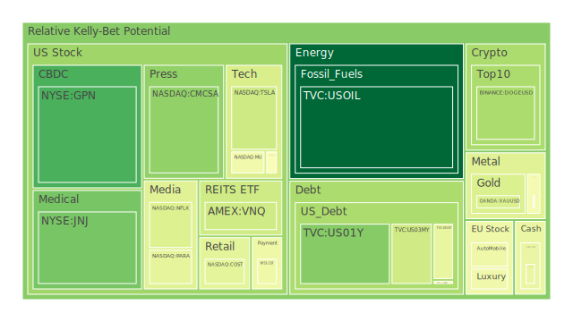
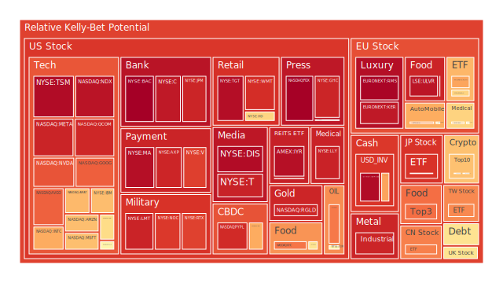
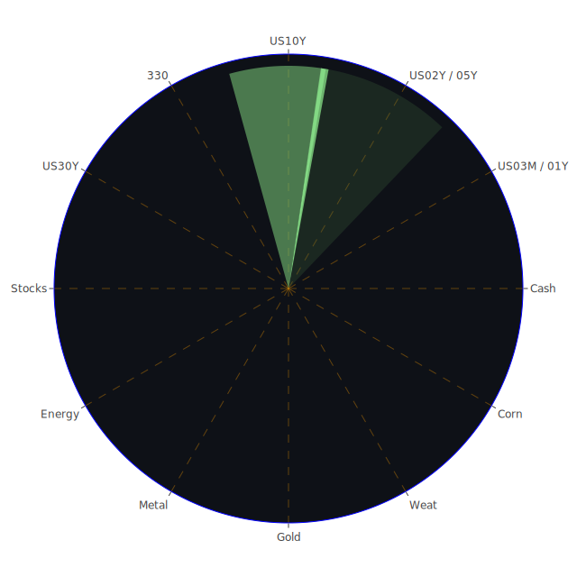

# **投資商品泡沫分析**

當前全球金融市場正處於一個複雜多變的環境中。透過分析各類資產的價格行為與潛在風險指標，我們可以觀察到不同資產類別所呈現的多元景象。以下將針對各主要投資類別進行深入探討，結合近期市場動態、歷史經驗及相關理論，提供一個全面的觀察視角。

* 美國國債  
  目前觀察美國國債市場，不同期限的債券呈現出分化的風險態勢。短期國債方面，例如三個月期國債（US03MY），其現價為 4.32，近期風險評估指標顯示其短期風險相對較低（D1約0.39），但仍需注意其在過去一個月內風險曾有波動。一年期國債（US01Y）現價約 4.01，風險評估分數（D1約0.26）亦處於相對偏低水平，但七天至一個月的平均風險分數則顯著較高（D7至D30約0.41-0.48），暗示市場對短期利率路徑仍有疑慮。  
  中期國債如二年期（US02Y）現價 3.82，五年期（US05Y）現價 3.92，十年期（US10Y）現價 4.31，其風險評估分數呈現中等偏高水平（D1分別約0.61, 0.50, 0.55）。值得注意的是，二年期國債的各週期風險分數相當一致且偏高，反映市場對未來兩年政策利率變化的不確定性定價較為充分。十年期國債的短期風險評估（D1約0.55）高於其兩週及月平均（D14約0.44, D30約0.46），顯示近期波動加劇。  
  長期國債方面，三十年期國債（US30Y）現價 4.79，其風險評估分數（D1至D30均約0.45）相對穩定在中等水平。  
  從殖利率曲線觀察（截至2025年5月5日），三個月期殖利率為 4.32%，二年期為 3.82%，十年期為 4.31%，三十年期為 4.79%。相較於去年同期（當時殖利率分別為 5.41%,4.84%,4.44%,4.62%)，目前短端利率顯著下降，長端利率亦有回落但幅度較小。殖利率曲線雖不再深度倒掛（如去年同期10Y-3M為 −1.36%)，但十年期與三個月期利差仍接近零（-0.01%），顯示市場對於短期內經濟走向與聯準會政策路徑的判斷仍存在分歧。歷史上，殖利率曲線趨平或倒掛往往預示著經濟增長放緩甚至衰退的風險。  
  聯準會的經濟數據顯示，其總資產持續下降，信貸市場出現壓力跡象（信用卡和商業地產的拖欠率處於較高水平），但同時聯準會準備金仍在高位，貨幣市場基金總資產增加，顯示市場流動性狀況複雜。聯準會官員近期的三次鷹派發言也加劇了市場對未來利率路徑的擔憂。這些宏觀因素共同作用於債券市場，短期債券對政策利率變動更為敏感，而長期債券則更多反映對未來經濟增長和通膨的預期。從博弈論角度看，市場參與者正在與聯準會就利率的未來路徑進行博弈，任何超預期的經濟數據或政策聲明都可能引發債券價格的劇烈波動。社會心理層面，對經濟衰退的擔憂可能增加對長債的避險需求，但對持續通膨的恐懼又會抑制這種需求，形成拉鋸。  
* 美國零售股  
  觀察代表性零售股，沃爾瑪（WMT）現價 98.75，其風險評估分數極高（D1約0.90，D7至D30介於0.78-0.88），顯示市場對其短期波動風險有高度警惕。塔吉特（TGT）現價 97.37，風險評估分數同樣非常高（D1約0.97，D7至D30介於0.85-0.96），甚至高於沃爾瑪。好市多（COST）現價 1008.30，風險評估分數處於中等水平（D1約0.43，D7至D30約0.50-0.56）。家得寶（HD）現價 364.52，風險評估分數較高（D1約0.62，D7至D30約0.69-0.72）。  
  這些數據呈現出零售行業內部的分化。沃爾瑪和塔吉特作為面向大眾市場的零售商，其極高的風險分數可能反映了市場對消費者支出前景的擔憂，特別是在聯準會數據顯示消費者拖欠率處於較高水平的背景下。近期新聞如 Kohl's CEO 因不當行為被解僱，也可能對零售業整體情緒產生負面影響。  
  好市多的風險評估相對較低，可能與其會員制模式及相對穩定的客戶群有關。家得寶的風險介於中間，可能受到房地產市場景氣（如抵押貸款利率上升）和消費者對大件商品需求的影響。  
  從社會學角度看，消費者的信心和支出習慣是零售業的生命線。高通膨、高利率環境可能改變消費結構，使消費者更傾向於必需品而非可選消費品，或轉向更具價格優勢的零售商。心理層面上，對經濟前景的不確定性會抑制消費意願。經濟學上，零售業績直接關聯到總體經濟的消費需求部分。歷史經驗顯示，在經濟下行週期中，必需消費品零售商通常比非必需消費品零售商更具防禦性。沃爾瑪和塔吉特的高風險分數，或許暗示市場預期它們將面臨更大的挑戰，或者其股價已經反映了過於樂觀的預期，存在回調壓力。  
* 美國科技股  
  科技股板塊整體風險偏高，但內部存在顯著差異。納斯達克100指數（NDX）現價 20102.61，風險評估分數極高（D1約0.95，D7至D30約0.75-0.77），顯示大型科技股整體面臨較大的波動風險。  
  個股方面，蘋果（AAPL）現價 205.35，風險評估為中等偏高（D1約0.49，D7至D30約0.55-0.63）。微軟（MSFT）現價 435.28，風險評估為中高水平（D1約0.67，D7至D30約0.61-0.69）。亞馬遜（AMZN）現價 189.98，風險評估為中高水平且持續上升（D1約0.67，D7至D30從0.73升至0.80）。谷歌（GOOG）現價 165.81，風險評估顯著偏高（D1約0.82，但D7至D30介於0.53-0.67之間），顯示短期風險急劇升高。Meta（META）現價 597.02，風險評估極高（D1約0.92，D7至D30介於0.78-0.91）。特斯拉（TSLA）現價 287.21，風險評估為中等（D1約0.38，D7至D30介於0.39-0.46）。IBM（IBM）現價 245.55，風險評估為中高水平（D1約0.67，D7至D30約0.59-0.65）。  
  近期新聞顯示，科技股如微軟和Meta的強勁業績（部分得益於AI發展）提振了市場信心，但同時也存在擔憂，如蘋果在中國的銷售下滑（受關稅影響）、Reddit的用戶增長擔憂、特斯拉在歐洲銷量下滑等。Nvidia CEO獲得加薪的消息可能被視為行業信心的體現，但也可能加劇對估值過高的擔憂。  
  從經濟學角度看，科技股的增長前景與利率環境密切相關。高利率會增加其未來現金流的折現率，對估值造成壓力。然而，AI等技術革新又提供了新的增長敘事。社會學層面，科技產品和服務已深度融入現代生活，但也面臨數據隱私、壟斷等社會問題的審視。心理學上，科技股常伴隨著較高的投資者期望和情緒波動，容易出現泡沫和快速修正。歷史上，科技股經歷過多次繁榮與蕭條的週期，如2000年的互聯網泡沫。目前的高風險分數，特別是META、NDX等，警示投資者需關注其估值是否合理，以及宏觀經濟和監管環境的變化。特斯拉的相對較低風險評估可能反映其股價已有所調整，或市場對其未來有不同看法。  
* 美國房地產指數  
  美國房地產指數（VNQ）現價 89.71，風險評估處於中等偏低水平（D1約0.39，D7至D30介於0.33-0.45）。另一個房地產相關指數（IYR）現價 94.96，風險評估則顯著偏高（D1約0.96，D7至D30介於0.77-0.96）。全球房地產指數（RWO）現價 44.15，風險評估處於中等水平（D1約0.54，D7至D30介於0.48-0.58）。  
  這種差異可能來自指數構成的不同，IYR可能更集中於某些風險較高的房地產領域（如商業地產）。聯準會數據明確指出商業地產拖欠率處於較高水平，這與IYR的高風險評估相符。新聞中提到佛羅里達州老舊公寓銷售困難的問題，也反映了房地產市場面臨的結構性挑戰。  
  經濟學上，房地產市場對利率極為敏感。美國30年期固定抵押貸款利率目前為 6.76%，遠高於去年的 2.94%，這無疑會抑制購房需求和房價上漲潛力。歷史經驗表明，利率快速上升週期通常對房地產市場不利。社會層面，住房可負擔性已成為重要的社會議題。心理層面，房價預期的轉變會影響買賣雙方的決策。VNQ相對較低的風險評估可能表明其構成更為多元化，或市場認為部分房地產領域（如某些住宅或工業地產）仍具韌性。但IYR的極高風險分數是一個強烈的警告信號，提示投資者需仔細甄別房地產投資標的。  
* 加密貨幣  
  比特幣（BTCUSD）現價約 94280，以太坊（ETHUSD）現價約 1811.61，狗狗幣（DOGEUSD）現價約 0.1708。  
  比特幣的風險評估在近期有所上升（D1約0.66），但仍低於前段時間，七天至月平均風險分數則相對較低（D7至D30約0.43-0.51），顯示近期波動加劇但整體風險評估仍屬中等偏高。以太坊的風險評估軌跡類似（D1約0.67，D7至D30約0.44-0.52），短期風險亦有抬升。狗狗幣的短期風險評估相對較低（D1約0.32），但七天及兩週平均風險則較高（D7約0.49, D14約0.48），月平均亦接近0.49，顯示其波動性歷史。  
  加密貨幣市場本質上具有高波動性，其價格受到宏觀流動性、市場情緒、監管政策、技術發展等多重因素影響。從心理學角度看，加密貨幣市場常被視為投機情緒的風向標，容易受到社交媒體和市場熱點事件的驅動。經濟學上，其價值儲存和交易媒介的功能仍在確立過程中，與傳統資產的關聯性也不穩定。博弈論觀點下，這是一個充滿資訊不對稱和策略互動的市場。目前中等偏高的風險評估，結合近期價格從高位回落的背景，可能暗示市場正在尋找新的平衡點。其高波動性意味著潛在的高回報與高風險並存。  
* 金/銀/銅  
  黃金（XAUUSD）現價約 3245.34，風險評估處於中等水平（D1約0.41，D7至D30介於0.43-0.49）。白銀（XAGUSD）現價約 32.04，風險評估極高（D1約0.92，D7至D30介於0.86-0.88）。銅（COPPER）現價約 4.66，風險評估處於中等偏高水平（D1約0.48），但長期風險評估較高（D30約0.76）。  
  黃金作為傳統的避險資產，其中等風險評估可能反映了地緣政治緊張局勢（如新聞中提及的加薩、克什米爾等）與高利率環境之間的平衡。黃金/石油比率（GOLD OIL RATIO）目前為58.06，遠高於去年的28.46，顯示黃金相對於石油的強勢。黃金/銅比率（GOLD COPPER RATIO）為695.77，略低於上週但仍處於歷史高位。  
  白銀的風險評估遠高於黃金，這符合其歷史上波動性更大的特性，也可能因為其工業屬性更強，受到經濟前景不確定性的影響更大。其極高的風險分數（接近0.92）是顯著的警示。  
  銅價的風險評估呈現短期回落但長期偏高的模式，可能反映了短期需求擔憂與長期供應趨緊（如能源轉型需求）預期之間的拉鋸。銅價常被視為全球經濟的晴雨表。  
  從歷史角度看，貴金屬在地緣政治風險上升或貨幣信用下降時通常表現良好。工業金屬則與全球經濟週期密切相關。當前環境下，黃金的避險屬性與抗通膨屬性得到體現，而白銀和銅則夾雜了更多經濟週期的不確定性。  
* 黃豆 / 小麥 / 玉米  
  黃豆ETF（SOYB）現價 21.75，風險評估處於中等水平（D1約0.50，D7至D30介於0.52-0.63）。小麥ETF（WEAT）現價 4.61，風險評估處於中等水平（D1約0.51，D7至D30介於0.40-0.56）。玉米ETF（CORN）現價 18.81，風險評估顯著偏高（D1約0.80，D7至D30介於0.45-0.57），顯示短期風險急劇上升。  
  農產品價格受到天氣、地緣政治（影響供應鏈和化肥成本）、全球需求、美元匯率等多重因素影響。新聞中提及印度首都遭遇惡劣天氣，雖然地點不同，但極端天氣事件頻發是影響農業產出的重要因素。經濟學上，農產品是生活必需品，但也受到生物燃料政策、貿易政策等影響。社會學角度，糧食安全是各國政府高度關注的問題。  
  玉米ETF的短期高風險評估值得關注，可能與特定的供需狀況或投機活動有關。黃豆和小麥的風險評估相對溫和。歷史上，農產品價格波動劇烈，常受到供應衝擊的影響。投資農產品需要密切關注氣候變化、地緣政治局勢和各國農業政策。  
* 石油/ 鈾期貨UX\!  
  美國原油（USOIL）現價 55.87，風險評估顯著偏低（D1約0.01，D7至D30介於0.16-0.23），顯示近期市場對石油價格波動的擔憂大幅減輕。鈾期貨（UX1\!）現價 69.60，風險評估處於中等水平（D1約0.50，D7至D30介於0.47-0.50）。  
  石油風險評估的急劇下降可能與新聞中高盛預期OPEC+六月增產有關，緩解了供應擔憂。然而，地緣政治風險（如中東局勢）依然是潛在的影響因素。金油比大幅上升也顯示相對而言，市場對黃金的偏好強於石油。  
  鈾作為核燃料，其價格與能源政策、核電發展前景相關。中等的風險評估可能反映了市場對核能長期需求的穩定預期與短期供需變化的平衡。  
  經濟學上，能源價格是影響通膨和經濟活動的重要因素。博弈論在石油市場中尤為明顯，OPEC+的產量決策是典型的策略互動。歷史上看，石油價格常因地緣政治衝突或供應中斷而劇烈波動。  
* 各國外匯市場  
  美元/日圓（USDJPY）現價 144.65，風險評估處於中等偏高水平（D1約0.51），但低於前幾日的評估，七天至月平均風險則較高（D7至D30介於0.55-0.68），顯示近期波動有所緩和但整體風險仍存。歐元/美元（EURUSD）現價 1.1300，風險評估極高（D1約0.97，七天及兩週平均亦高達0.96），月平均稍低（0.72），顯示短期存在極高的波動風險。英鎊/美元（GBPUSD）現價 1.3300，風險評估處於中等水平（D1約0.45，D7至D30介於0.41-0.46）。澳元/美元（AUDUSD）現價 0.6400，風險評估較高（D1約0.71），但七天及之後平均風險較低（D7至D30介於0.34-0.44），顯示短期風險顯著增加。  
  外匯市場受到各國經濟基本面、利率差異、央行政策、資本流動和市場情緒的共同影響。美元指數的強弱是觀察全球風險偏好的重要指標之一。USDJPY的高波動歷史與日本央行的貨幣政策正常化進程、美日利差變化息息相關。EURUSD的極高短期風險可能與歐洲經濟數據、歐洲央行政策預期或特定事件有關。GBPUSD相對穩定。AUDUSD作為商品貨幣，其短期風險飆升可能與大宗商品價格波動或市場對全球經濟前景的擔憂加劇有關。  
  從歷史經驗看，美元在避險時期通常走強。不同貨幣對之間的相對強弱反映了各經濟體的相對表現和風險狀況。外匯市場的博弈體現在各國央行政策的相互影響以及市場參與者對政策意圖的解讀。  
* 各國大盤指數  
  除了已提及的納斯達克100指數（NDX），其他主要股指風險評估如下：英國富時100（FTSE）現價 8595.50，風險評估中等偏高（D1約0.59，D7至D30介於0.51-0.63）。德國DAX（GDAXI）現價 23018.70，風險評估中等偏高（D1約0.63，D7至D30介於0.53-0.56）。法國CAC40（FCHI）現價 7732.90，風險評估較高（D1約0.71，D7至D30介於0.56-0.61）。日本日經225（JPN225）現價 37108.70，風險評估極高（D1約0.89，D7至D30介於0.74-0.87）。台灣加權股價指數（0050 ETF代表）現價 173.50，風險評估較高（D1約0.76，D7至D30介於0.68-0.77）。中國滬深300（000300）現價 3770.57，風險評估較高（D1約0.77，D7至D30介于0.48-0.64之間），長期風險評估相對較低。  
  全球主要股指普遍呈現較高或極高的風險評估，反映了全球市場的普遍擔憂情緒。日本股市的高風險評估可能與日圓匯率波動、企業治理改革進展以及全球經濟前景有關。歐洲股市的風險評估雖然也偏高，但相對低於日經和納指，可能反映了不同的經濟週期位置或估值水平。台股的高風險評估可能與其科技股權重較高、地緣政治風險等因素有關。滬深300的風險評估呈現短期高、長期相對較低的特點，可能暗示市場對中國經濟短期挑戰的擔憂，但對長期前景看法不一。  
  從空間維度看，全球股市聯動性強，但各區域面臨的具體挑戰不同（歐洲的能源與增長、日本的貨幣政策、中國的結構性問題、美國的利率與通膨）。時間維度上，當前的高風險環境與歷史上多次市場調整前的狀況有相似之處。概念維度上，全球化資本流動、各國宏觀政策差異、產業結構變遷共同塑造了各國股市的表現。  
* 美國半導體股  
  半導體行業整體風險評估非常高。英偉達（NVDA）現價 114.50，風險評估極高（D1約0.84，D7至D30介於0.62-0.77）。AMD（AMD）現價 98.80，風險評估中等偏高（D1約0.61，D7至D30介於0.60-0.68）。英特爾（INTC）現價 20.62，風險評估較高（D1約0.70，D7至D30介於0.47-0.62）。應用材料（AMAT）現價 155.10，風險評估中高（D1約0.68），但長期風險評估極高（D14/D30約0.84）。科磊（KLAC）現價 698.16，風險評估中等（D1約0.54，D7至D30約0.48-0.52）。美光（MU）現價 80.72，風險評估中等（D1約0.47，D7至D30介於0.38-0.43）。高通（QCOM）現價 139.81，風險評估極高（D1約0.92，D7至D30介於0.74-0.80）。博通（AVGO）現價 203.64，風險評估極高（D1約0.82，D7至D30均高於0.81）。台積電（TSM）現價 179.28，風險評估達到了極限水平（D1約0.97，D7至D30均接近0.98）。  
  半導體是科技行業的核心，也是地緣政治和貿易摩擦的焦點。AI熱潮推動了對高性能芯片的需求，但也使得該行業估值處於高位，風險積聚。TSM、NVDA、AVGO、QCOM的極高風險評估反映了市場對這些領導廠商的高度關注和潛在的巨大波動性。AMAT的長期高風險可能與設備週期的不確定性有關。相對而言，MU、KLAC、AMD、INTC的風險評估稍低，但仍不容忽視。  
  經濟學上，半導體行業具有強烈的週期性。地緣政治因素（如芯片管制）對供應鏈格局產生深遠影響。心理層面，對技術領先者的追捧容易形成估值泡沫。歷史上，半導體行業經歷過多次供需失衡導致的劇烈調整。當前的極高風險分數表明，該行業可能正處於一個關鍵時刻，任何關於需求、供應、競爭格局或政策的變化都可能觸發顯著的價格反應。  
* 美國銀行股  
  美國主要銀行股普遍呈現極高的風險評估。摩根大通（JPM）現價 252.51，風險評估極高（D1約0.92，D7至D30介於0.71-0.83）。花旗集團（C）現價 70.59，風險評估極高（D1約0.94，D7至D30介於0.83-0.91）。美國銀行（BAC）現價 41.07，風險評估達到極限水平（D1至D14均約0.99，D30約0.93）。第一資本金融（COF）現價 187.83，風險評估處於中等水平（D1約0.46，D7至D30介於0.46-0.48）。  
  大型銀行的極高風險評估可能反映了市場對信貸風險（如聯準會數據顯示的信用卡和商業地產拖欠率上升）、利率環境變化對淨息差的影響以及潛在經濟放緩的擔憂。歷史上，銀行股在經濟衰退期間通常表現不佳。然而，與去年相比，當前殖利率曲線形態對銀行盈利能力的壓力可能有所減輕。COF的風險評估相對較低，可能與其業務結構（偏重信用卡）和市場對其風險管理的看法有關。巴菲特旗下波克夏海威近期的財報顯示獲利下降（部分因野火損失），但現金儲備創紀錄，這也反映了這位價值投資大師的謹慎態度，其對金融股的持倉變化值得關注。  
* 美國軍工股  
  主要軍工股風險評估較高。雷神技術（RTX）現價 130.21，風險評估極高（D1約0.87，D7至D30介於0.76-0.88）。諾斯洛普·格魯曼（NOC）現價 491.42，風險評估極高（D1約0.88，D7至D30介於0.64-0.82）。洛克希德·馬丁（LMT）現價 472.80，風險評估極高（D1約0.92，D7至D30介於0.72-0.78）。  
  軍工股的表現與地緣政治緊張局勢和國防預算密切相關。當前全球多地衝突和緊張局勢（烏克蘭、中東、台海等）為軍工行業提供了訂單預期。新聞中提到美國尋求削減司法部執法辦公室預算，但國防開支是否受影響尚不確定。從經濟學角度看，國防開支具有一定的逆週期性，但在財政壓力下也可能面臨削減。社會學角度，軍工行業的發展與國家安全觀念和國際關係格局緊密相連。其高風險評估可能反映了股價已計入較高預期，對地緣政治局勢緩和或預算變動較為敏感。  
* 美國電子支付股  
  電子支付行業風險評估普遍很高。Visa（V）現價 347.60，風險評估極高（D1約0.87，D7至D30介於0.77-0.81）。萬事達卡（MA）現價 559.39，風險評估極高（D1約0.96，D7至D30介於0.70-0.82）。PayPal（PYPL）現價 67.24，風險評估極高且穩定（D1至D30均在0.91-0.96之間）。Global Payments（GPN）現價 78.85，風險評估相對較低（D1約0.17，D7至D30介於0.35-0.71），長期風險評估較高。美國運通（AXP）現價 276.85，風險評估極高（D1約0.92，D7至D30介於0.79-0.93）。  
  支付行業受益於現金向電子支付的長期轉移趨勢，但也面臨日益激烈的競爭和監管壓力。高風險評估可能反映了市場對消費者支出放緩、信貸損失（對AXP等發卡機構）以及競爭格局變化的擔憂。PYPL的持續高風險可能與其轉型挑戰和市場份額壓力有關。GPN的短期低風險與長期高風險形成對比，可能暗示近期有特定利好因素，但長期挑戰仍存。  
* 美國藥商股  
  大型藥商股風險評估呈現分化。嬌生（JNJ）現價 156.12，風險評估一直處於較低水平（D1至D30均在0.24-0.27之間）。默克（MRK）現價 83.18，風險評估處於中等水平（D1約0.55，D7至D30介於0.47-0.58）。禮來（LLY）現價 823.62，風險評估極高（D1約0.93，D7至D30均在0.92-0.93之間）。諾和諾德（NVO）現價 69.23，風險評估中等偏高（D1約0.65，D7至D30介於0.49-0.72）。  
  嬌生作為業務多元化的醫療保健巨頭，其低風險評估符合其傳統防禦性股票的特徵。默克的風險評估居中。禮來和諾和諾德則因其在減肥藥和糖尿病領域的突破性產品而備受市場追捧，股價大幅上漲，但也積累了極高的風險評估分數。新聞中提到禮來股價之前的拋售被分析師視為“過度反應”，反映了市場對這些熱門股票的高度關注和分歧。  
  從經濟學角度看，醫療保健支出具有剛性需求，但藥品定價常受到政策壓力。社會學角度，人口老化和慢性病增加是行業長期驅動力。心理層面，對突破性新藥的期望容易推高相關公司估值。禮來和諾和諾德的極高風險，顯示市場可能已計入非常樂觀的預期，對任何關於藥品效果、競爭、定價或監管的消息都極為敏感。  
* 美國影視股  
  迪士尼（DIS）現價 92.49，風險評估極高（D1約0.97，D7至D30介於0.70-0.89）。Netflix（NFLX）現價 1156.49，風險評估處於中等水平（D1約0.42，D7至D30介於0.42-0.49）。派拉蒙全球（PARA）現價 11.43，風險評估處於中等水平（D1約0.44，D7至D30介於0.47-0.51）。  
  影視娛樂行業正經歷流媒體轉型和內容競爭加劇的挑戰。迪士尼的高風險評估可能與其流媒體業務盈利壓力、主題公園業務受經濟週期影響以及近期的管理層變動和代理權之爭有關。Netflix的風險評估相對較低，可能表明市場對其商業模式和全球擴張的信心較為穩定。派拉蒙的風險評估居中，可能反映了市場對其潛在併購交易的預期與其自身經營挑戰的平衡。從社會學角度看，內容創作和消費趨勢不斷變化。經濟學上，廣告收入和訂閱收入是主要來源，易受宏觀經濟影響。  
* 美國媒體股  
  康卡斯特（CMCSA）現價 34.46，風險評估處於中等偏低水平（D1約0.28，D7至D30介於0.48-0.51）。紐約時報（NYT）現價 52.31，風險評估較高（D1約0.53），且長期風險評估非常高（D14/D30約0.73-0.75）。福斯公司（FOX）現價 46.17，風險評估極高（D1約0.99，D7至D30介於0.80-0.86）。美國電話電報公司（T）現價 27.61，風險評估極高（D1約0.93，D7約0.94，D14/D30約0.75-0.78）。  
  傳統媒體公司面臨數位化轉型和廣告市場變化的挑戰。康卡斯特的相對低風險可能與其寬頻業務的穩定性有關。紐約時報的高風險，特別是長期風險，可能反映了市場對其數位訂閱增長可持續性的擔憂。福斯和AT\&T的極高風險評估，可能與其業務結構、債務水平（對T而言）以及市場對傳統媒體前景的悲觀預期有關。新聞中提到美國法院暫停要求美國之音員工重返工作崗位的裁決，這類事件也可能影響媒體行業的運營環境。  
* 石油防禦股  
  埃克森美孚（XOM）現價 106.21，風險評估中等（D1約0.54），但七天和兩週平均風險很高（D7/D14約0.84-0.88），月平均風險也較高（0.77）。西方石油（OXY）現價 40.61，風險評估較高且穩定（D1至D30均在0.76-0.78之間）。  
  這些大型石油公司通常被視為具有一定的防禦性，因為能源是必需品。然而，它們的股價與油價密切相關，也受到能源轉型政策的長期影響。XOM的風險評估呈現短期回落但中期極高的特點，波動性顯著。OXY的風險評估持續偏高，可能與其特定的資產組合或財務狀況有關（例如巴菲特的持股）。儘管油價本身的風險評估近期下降，但相關股票的風險評估依然偏高，這可能反映了市場對行業盈利前景、資本支出計劃或政策風險的擔憂。  
* 金礦防禦股  
  皇家黃金（RGLD）現價 176.51，風險評估極高（D1約0.92，D7至D30均在0.92-0.94之間）。格雷厄姆控股（GHC）現價 946.22（雖然名字含Graham，但業務多元，非純金礦股，此處可能分類有誤或指其某部分業務，風險評估極高，D1至D30均在0.92-0.93之間）。  
  金礦股的表現通常與金價正相關，但其波動性往往更大，因為它們還受到運營成本、開採風險、管理效率等因素的影響。RGLD的極高風險評估，甚至高於黃金本身的中等風險評估，說明市場對金礦行業的預期波動非常大，或者認為其股價已過度反映金價上漲。這類股票在金價上漲時可能提供槓桿效應，但在金價下跌或成本上升時風險也更大。  
* 歐洲奢侈品股  
  LVMH集團（MC \- Euronext）現價 €495.85，風險評估處於中等水平（D1約0.47，D7至D30介於0.46-0.53）。開雲集團（KER \- Euronext）現價 €184.72，風險評估極高（D1約0.94，D7至D30介於0.70-0.80）。愛馬仕（RMS \- Euronext）現價 €2452.00，風險評估極高（D1約0.99，D7至D30介於0.68-0.85）。  
  奢侈品行業對全球經濟狀況和高淨值人群的消費能力敏感。LVMH作為行業龍頭，業務更多元化，風險評估相對較低。開雲和愛馬仕的極高風險評估可能反映了市場對其特定品牌表現、地區銷售（尤其是亞洲市場）以及整體宏觀經濟放緩影響的擔憂。從社會心理學角度看，奢侈品消費與社會地位、炫耀性消費等相關，經濟不確定性可能影響這類消費。  
* 歐洲汽車股  
  寶馬（BMW \- Xetra）現價 €74.82，風險評估較高（D1約0.74，D7至D30介於0.57-0.65）。梅賽德斯-賓士（MBG \- Xetra）現價 €53.30$，風險評估中等（D1約0.56，D7至D30介於0.49-0.51）。保時捷控股（PAH3 \- Xetra）現價 €36.76$，風險評估中等（D1約0.46，D7至D30介於0.53-0.60）。  
  歐洲汽車行業正經歷電動化轉型、來自中國品牌的競爭加劇以及供應鏈問題等多重挑戰。寶馬較高的風險評估可能反映了其在轉型和競爭中面臨的壓力。賓士和保時捷控股的風險評估相對較低。新聞中提到特斯拉在歐洲銷量下滑，這對歐洲本土品牌可能是短期利好，但也凸顯了市場需求的波動性。經濟學上，汽車是大件消費品，對利率和經濟週期敏感。  
* 歐美食品股  
  雀巢（NESN \- SIX）現價 CHF 87.60，風險評估處於中等水平（D1約0.54，D7至D30穩定在0.53-0.55）。可口可樂（KO）現價 71.65，風險評估較高（D1約0.59，D7至D30介於0.68-0.77）。卡夫亨氏（KHC）現價 28.64，風險評估較高（D1約0.79，D7至D30介於0.75-0.90），且長期風險非常高。聯合利華（ULVR \- LSE）現價 £4766.00，風險評估極高（D1至D30均在0.95左右）。  
  食品飲料行業通常被視為防禦性板塊，但在高通膨環境下，它們也面臨成本上升和定價能力的考驗。雀巢的風險評估相對穩定。可口可樂和卡夫亨氏的風險評估較高，特別是卡夫亨氏的長期風險評估，可能反映了市場對其品牌力、成本控制或增長前景的擔憂。聯合利華的極高風險評估值得警惕，可能與其業務重組、新興市場風險或投資者對其策略的看法有關。

# **宏觀經濟傳導路徑分析**

當前宏觀經濟環境呈現多條相互交織的傳導路徑：

1. **聯準會緊縮路徑**：聯準會持續縮減資產負債表，儘管近期有三次鷹派發言，但市場對未來利率路徑仍存分歧（體現於各期限美債殖利率變化及風險評估）。高利率環境（如30年期抵押貸款利率達6.76%）正通過信貸渠道傳導壓力，信用卡和商業地產的拖欠率上升是明顯信號。這條路徑直接抑制房地產市場活動（VNQ、IYR表現分化，IYR風險極高），增加企業融資成本（尤其對成長型科技股估值造成壓力，如NDX、META風險高企），並可能最終影響消費者支出（衝擊零售股，如WMT、TGT風險極高）。然而，貨幣市場基金資產增加和聯準會儲備仍在高位，顯示部分流動性尋找避風港，尚未完全退出市場。  
2. **地緣政治與貿易摩擦路徑**：新聞中反覆提及的貿易關稅問題（如川普威脅、對中國關稅影響蘋果銷量）、地區衝突（加薩援助船遇襲、克什米爾緊張局勢、海地幫派問題）以及潛在的供應鏈風險（如鋼鐵廠閒置、OPEC+供應調整）共同構成這條路徑。其傳導效應包括：推升特定商品價格（黃金作為避險資產風險中等但價格處於高位，白銀風險極高），加劇匯率波動（USDJPY、EURUSD、AUDUSD風險評估變化），影響跨國企業營運（如蘋果、特斯拉在海外市場的表現），並可能引發特定行業的供應鏈重構（如半導體）。這條路徑增加了市場的不確定性，使得避險情緒升溫（黃金/石油比率高企）。  
3. **經濟增長與通膨預期路徑**：儘管美國四月就業數據強勁（新增17.7萬），緩解了部分經濟衰退擔憂，但市場對前景仍感不安（如Airbnb CFO提及外國遊客減少，多個公司股價因業績指引下跌）。CPI年增率 2.40% 雖較去年 3.48% 回落，但高利率環境和部分領域的成本壓力（如高收益債利率仍高）使得通膨預期管理成為焦點。這條路徑影響企業盈利預期（如科技股業績雖好但前景仍有疑慮），消費者信心（影響零售、非必需消費品），以及大宗商品需求（銅的長期風險評估高企）。市場在“軟著陸”、“滯脹”或“衰退”的多重可能性之間搖擺，導致資產價格波動。  
4. **技術革新與產業變革路徑**：以AI為代表的技術革新正在重塑產業格局。這條路徑主要體現在科技和半導體行業（Nvidia、MSFT、META、Google受益，相關股票風險評估普遍偏高，尤其是TSM風險達極限），但也可能逐步擴散至其他行業（如提升生產力）。其傳導效應是雙重的：一方面帶來增長潛力，支撐相關公司估值；另一方面加劇行業競爭，並可能催生新的泡沫風險。同時，能源轉型也影響著傳統能源（石油、鈾）和相關材料（銅）的長期供需格局。

# **微觀經濟傳導路徑分析**

從企業和行業層面觀察，存在以下傳導路徑：

1. **盈利表現與預期傳導**：企業財報是重要的微觀信號。強勁的盈利（如微軟、Meta）能短時提振股價和市場信心，但若未來指引不及預期或存在隱憂（如亞馬遜展望不明、蘋果中國銷售下滑），則可能迅速逆轉。盈利不及預期或負面消息（如SEM、LMAT、GDDY、COLM股價下跌，Kohl's CEO被解僱，Geico裁員）會直接打擊股價，並可能引發對整個行業的擔憂。這條路徑體現了市場對企業基本面的反應，並通過影響投資者情緒傳導至更廣泛的市場。  
2. **成本與定價能力傳導**：在高利率和潛在成本壓力下，企業的成本控制和向下游轉嫁成本的能力變得至關重要。這在零售（WMT、TGT高風險）、食品飲料（KHC、ULVR高風險）和部分工業領域（如鋼鐵廠閒置）尤為明顯。無法有效管理成本或轉嫁壓力的企業，其利潤空間將被壓縮，進而影響其股價表現和風險評估。  
3. **行業內部競爭與整合傳導**：特定行業內的競爭格局變化（如電動車市場特斯拉面臨歐洲本土和中國品牌競爭，支付領域PYPL的挑戰）或潛在的併購活動（如派拉蒙）會影響相關企業的估值和風險。技術革新（如AI對半導體行業的影響）會加劇領先者和追趕者之間的分化。  
4. **監管與政策風險傳導**：特定行業的監管變化（如對大型科技公司的反壟斷審查、藥品定價政策）或突發政策（如川普威脅取消哈佛免稅地位、關稅政策）會直接影響相關企業的經營環境和盈利前景。這條路徑具有突發性和不確定性，可能導致相關股票風險評估急劇變化。  
5. **消費者行為變化傳導**：如新聞提及外國遊客赴美意願下降，直接影響旅遊、航空、酒店等行業。消費者對特定產品或服務的偏好轉變（如流媒體 vs. 傳統影視）也會重塑行業格局。這種變化通過影響企業收入和市場份額，最終傳導至股價。

# **資產類別間傳導路徑分析**

不同資產類別之間存在複雜的相互影響和傳導機制：

1. **利率對各類資產的傳導**：美債殖利率（尤其是長端利率）的變動是核心傳導樞紐。利率上升通常：  
   * 壓低債券價格（尤其是長久期債券）。  
   * 提高借貸成本，不利於房地產（IYR高風險）和資本密集型行業。  
   * 增加未來現金流的折現率，對高估值的成長股（科技股NDX、META、TSM風險高）壓力更大。  
   * 可能支撐美元（USDJPY風險仍存，EURUSD風險極高可能反映相對利差預期變化），壓制以美元計價的商品（黃金價格堅挺顯示避險需求，但白銀、銅風險高）。  
   * 影響銀行淨息差，對銀行股（JPM、C、BAC風險極高）產生複雜影響。  
2. **風險情緒的跨市場傳導**：市場風險偏好的變化會在不同資產間傳導。  
   * 避險情緒升溫時：資金可能流向美國國債（尤其是短債）、黃金（XAUUSD風險中等）、美元，而流出風險較高的股市（特別是新興市場和高Beta股票）、加密貨幣（BTC、ETH風險評估中高）和部分商品（如銅）。  
   * 風險偏好回升時：情況則相反。加密貨幣市場的劇烈波動有時被視為散戶風險情緒的極端體現，可能對科技股等高風險偏好領域產生溢出效應。  
3. **商品價格對相關股票和通膨的傳導**：  
   * 油價（USOIL）波動直接影響能源股（XOM、OXY風險偏高）和運輸成本，並是通膨的重要組成部分。  
   * 工業金屬（如銅）價格反映全球工業活動景氣度，影響相關礦業股和製造業成本。  
   * 農產品價格（SOYB、WEAT、CORN）影響食品股（KHC、ULVR風險高）成本和消費者物價指數。  
   * 貴金屬價格（黃金、白銀）影響金礦股（RGLD風險極高）。  
4. **匯率變動的傳導**：  
   * 美元強弱影響美國跨國公司的海外營收（如蘋果、特斯拉）和進口成本。  
   * 日圓匯率影響日本出口企業和股市（JPN225風險極高）。  
   * 商品貨幣（如澳元AUDUSD）與大宗商品價格和全球貿易相關。  
5. **信貸市場狀況的傳導**：  
   * 信貸利差（如高收益債利率）擴大或信貸拖欠率上升，是經濟承壓的信號，會增加銀行股的風險（JPM、C、BAC），並可能抑制企業投資和消費者信貸，進而影響整體經濟和股市。

這些傳導路徑並非單向，而是相互作用、相互反饋的複雜網絡。例如，聯準會的政策會影響利率，利率影響經濟和風險情緒，進而影響商品價格和匯率，這些變化又可能反過來影響通膨預期和聯準會的後續決策。理解這些漣漪效應對於把握市場整體脈絡至關重要。

# **投資建議**

基於上述分析，當前市場環境充滿不確定性，多個資產類別呈現較高甚至極高的風險評估。投資策略應注重風險管理和多元化配置。以下提供三種不同風險偏好的投資組合建議，總比例為100%：

1. 穩健型投資組合 (佔總資產 50%)  
   此組合旨在保本和對抗波動，適合風險承受能力較低的投資者。  
   * **美國短期國債 (例如 US01Y 或 US03MY 為代表的資產) (20%)**: 鑒於其相對較低的短期風險評估和對利率變動相對不敏感的特性，可作為流動性和穩定性的基石。需關注殖利率曲線變化和聯準會政策動向。  
   * **黃金 (XAUUSD) (15%)**: 雖然近期價格已在高位，但考慮到持續的地緣政治風險和潛在的貨幣信用擔憂，黃金仍具備避險價值。其中等的風險評估也相對可控。  
   * **防禦性消費必需品/醫療保健股 (例如 JNJ) (15%)**: 嬌生（JNJ）展現出持續較低的風險評估，其業務多元化且需求相對剛性，能在不確定環境中提供穩定性。  
2. 成長型投資組合 (佔總資產 35%)  
   此組合旨在尋求長期資本增值，願意承擔中等偏高風險，適合對市場復甦有信心且投資期限較長的投資者。  
   * **全球多元化股票指數 (例如 NDX 或 FTSE 為代表的資產，但需注意其高風險) (15%)**: 儘管風險評估高企，但投資於大型股指可分散個股風險，捕捉市場整體（尤其是科技驅動）的長期增長潛力。建議採用定投等方式平滑成本。  
   * **精選科技龍頭股 (例如 MSFT) (10%)**: 微軟（MSFT）在AI領域佈局領先，近期財報強勁，雖風險評估偏高，但相對於部分同業更具確定性，可作為科技板塊的核心配置。  
   * **具有長期趨勢支撐的行業 (例如以 COPPER 代表的工業金屬相關資產，或特定醫療主題如 NVO，但需極度注意風險) (10%)**: 選擇性配置於受益於長期結構性趨勢（如能源轉型對銅的需求，或人口老化和特定疾病領域對醫療的需求）的資產。鑑於NVO等風險極高，或銅的長期風險評估也偏高，此部分配置需極為謹慎，嚴控倉位，並密切跟踪基本面變化。  
3. 高風險/機會型投資組合 (佔總資產 15%)  
   此組合旨在博取高額回報，但需承受極高的波動性和潛在損失風險，僅適合風險承受能力非常強且對特定領域有深入了解的投資者。  
   * **加密貨幣 (例如 BTC 或 ETH) (5%)**: 加密貨幣市場波動巨大，但作為一種新興資產類別，可能提供與傳統資產不同的回報來源。配置比例應嚴格控制，僅投入可承受損失的資金。  
   * **高波動性個股/主題 (例如 TSLA 或 半導體行業ETF) (5%)**: 特斯拉（TSLA）雖風險評估中等，但歷史波動性極大，代表了顛覆性技術和市場情緒的交織。或可考慮風險極高但代表AI趨勢的半導體ETF（如SMH，雖未在列表中，但其成分股如NVDA、TSM風險極高）。  
   * **事件驅動/困境反轉標的 (例如 PARA 或 特定高風險銀行股 C/BAC) (5%)**: 派拉蒙（PARA）的中等風險可能包含併購預期，屬於事件驅動型機會。或者，極度看好銀行業能在高風險環境下突圍的投資者，可少量配置如花旗（C）或美國銀行（BAC），但其極限級別的風險分數意味著潛在風險極大。

# **風險提示**

本報告基於截至2025年5月5日的可用數據和新聞進行分析，旨在提供客觀的觀察視角和潛在的投資思路。所有分析和建議均帶有假設前提，未來市場發展可能與預期存在顯著差異。

金融市場本質上充滿不確定性和波動性，各類資產的價格可能受到宏觀經濟、地緣政治、政策變動、市場情緒等多重不可預測因素的影響。特別需要警惕的是，數據顯示當前多個重要資產類別（包括主要股指、科技股、半導體股、銀行股、支付股、部分奢侈品股、白銀、部分農產品等）的風險評估處於較高甚至極高水平，這意味著潛在的泡沫風險和未來發生劇烈調整的可能性不容忽視。

投資者在做出任何投資決策前，應充分認識到相關風險，結合自身的財務狀況、投資目標、風險承受能力和投資期限，進行獨立的思考和判斷。過往業績不代表未來表現，投資可能帶來本金損失。建議在需要時尋求獨立的專業財務顧問的意見。

 
Daily Buy Map:

 
Daily Sell Map:

 
Daily Radar Chart:

 
