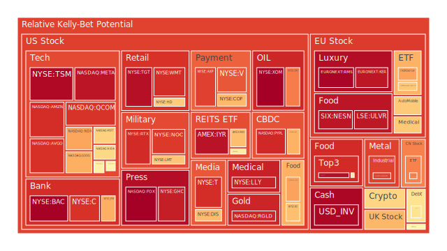

# **投資商品泡沫分析**

當前全球金融市場，猶如一艘航行在資訊洪流中的巨艦，受到經濟數據、地緣政治、社會情緒與技術革新等多重力量的牽引與衝擊。我們觀察到，截至2025年5月6日，不同資產類別呈現出顯著分化的泡沫風險態勢。此處的泡沫風險評估，並非精確預測，而是基於歷史價格行為模式與當前數據點進行的概率性衡量，分數越高，意味著短期內價格偏離其歷史常態的可能性越大，潛在的回調風險也相對較高。

**美國國債 (US Treasuries)**

美國國債市場是全球金融體系的基石，其殖利率曲線的形態與變動，深刻反映了市場對經濟增長、通貨膨脹及貨幣政策的預期。目前觀察到，短天期國債（如 TVC:US01Y 4.03%，泡沫分數 D1 約 0.33；TVC:US03MY 4.32%，D1 約 0.37；TVC:US02Y 3.84%，D1 約 0.61）與長天期國債（如 TVC:US10Y 4.35%，D1 約 0.54；TVC:US30Y 4.84%，D1 約 0.45）的泡沫風險分數普遍處於中等水平。值得注意的是，2年期國債的 D1 分數相對較高，但其 D7/D14/D30 分數穩定在 0.6 左右，顯示近期波動有所加大，但中長期風險評估相對穩定。

從經濟學角度看，當前殖利率水平顯著高於去年，特別是房貸利率（Fixed Morgage 30Y Rate 6.76%），反映了聯準會（FED）過去緊縮政策的滯後效應。然而，相較於去年深度倒掛的狀態，殖利率曲線已明顯趨於平坦甚至部分轉正（例如 US Yield 10Y-03M 為 0.03），這在歷史上常被解讀為市場對未來經濟放緩甚至衰退的預期有所減弱，或是對未來降息的預期正在逐步消化。FED 經濟數據顯示，聯準會總資產（FED Total Assets）持續下降，但銀行儲備（FED Reserve）仍處高位，貨幣市場基金總資產（Money Market Funds Total Assets）增加，顯示市場流動性尋求避險與收益。從心理學角度，聯準會近期的3次鷹派發言與0次鴿派發言，與市場對降息的期待形成博弈，增加了市場的不確定性。歷史經驗告訴我們，在貨幣政策轉向的模糊期，債券市場往往波動加劇。短期風險分數的波動，可能反映了市場對經濟數據（如 CPIYOY 2.40%，相對溫和）和 FED 信號的快速反應與重新定價。

**美國零售股 (US Retail Stocks)**

零售板塊直接關係到終端消費者的經濟狀況與信心。觀察的股票中，沃爾瑪（NYSE:WMT，現價 99.33）與塔吉特（NYSE:TGT，現價 94.02）的泡沫風險分數極高，D1 分數均超過 0.9，且 D7/D14/D30 分數也維持在高位。好市多（NASDAQ:COST，現價 1014.89）的風險分數相對較低，D1 約 0.43，但仍處於中等偏高水平。家得寶（NYSE:HD，現價 361.73）的風險分數也偏高，D1 約 0.64。

經濟層面，FED 數據顯示信用卡及消費者貸款的沖銷率（Charge-off Rate）與拖欠率（Consumer Delinquent）處於相對高位，暗示部分消費者財務壓力增大，這對非必需消費品零售構成潛在威脅。然而，沃爾瑪、好市多等可能因其必需品屬性或會員制模式而展現出一定的防禦性。社會學角度看，就業市場的結構性變化（如新聞中提到的 Geico、PwC 裁員）可能影響消費者的可支配收入與消費意願。心理層面上，高企的泡沫分數可能反映了市場對這些零售巨頭在壓力環境下維持業績能力的樂觀預期，但也可能是一種「擁擠交易」的體現，一旦業績不及預期，回調壓力巨大。新聞中關於川普關稅影響的擔憂（如 NYSE:F 的盈利預警）也可能傳導至依賴進口的零售商。歷史上，在經濟放緩週期中，必需消費品通常表現優於非必需消費品，但估值過高始終是風險。

**美國科技股 (US Technology Stocks)**

科技股是近年來市場的領頭羊，但也常伴隨著較高的估值與波動性。大型科技股表現分化：微軟（NASDAQ:MSFT，現價 436.17）和亞馬遜（NASDAQ:AMZN，現價 186.35）的 D1 分數分別為 0.63 和 0.91，谷歌（NASDAQ:GOOG，現價 166.05）D1 約 0.70，Meta（NASDAQ:META，現價 599.27）D1 高達 0.96。蘋果（NASDAQ:AAPL，現價 198.89）相對較低，D1 約 0.45。特斯拉（NASDAQ:TSLA，現價 280.26）D1 約 0.55，但其歷史波動性較大。IBM（NYSE:IBM，現價 249.18）D1 約 0.51。

經濟學上，科技股，特別是成長型科技股，對利率變動較為敏感。當前高利率環境對其估值構成壓力。然而，人工智慧（AI）的浪潮為許多科技公司注入了新的增長敘事。新聞顯示，微軟和 Meta 的業績超預期，部分得益於 AI，但亞馬遜的展望存在陰霾，蘋果則受到中國銷售下滑及關稅影響。社會層面，AI 對就業的潛在衝擊（如新聞中 Duolingo 的例子）已成為新的討論焦點，可能引發更廣泛的社會與監管反應。心理學上，AI 帶來的興奮感與對經濟放緩和高估值的擔憂交織，市場情緒波動較大。Meta 的高泡沫分數可能反映了其在廣告市場的強勁表現和對元宇宙的持續投入預期，但也累積了相當風險。博弈論視角下，科技巨頭在 AI 領域的軍備競賽既是機遇也是巨大的成本投入，最終的贏家尚不明朗。

**美國房地產指數 (US Real Estate Index)**

房地產投資信託（REITs）提供了投資房地產市場的流動性工具。觀察的指數如 AMEX:VNQ（現價 89.51）D1 分數約 0.56，AMEX:IYR（現價 94.86）D1 分數高達 0.96，AMEX:RWO（現價 44.14）D1 約 0.67。

經濟上，房地產市場受到利率的直接影響。FED 數據顯示，30年期固定房貸利率（Fixed Morgage 30Y Rate）高達 6.76%，顯著高於去年水平，這對住宅銷售和再融資活動構成壓力。同時，商業地產的拖欠率（Commercial Real Estate Delinquent）處於相對高位，反映了辦公室、零售等領域面臨的挑戰。社會學角度，遠程工作的普及改變了辦公空間需求，而高房價和高利率則加劇了住房負擔能力問題。新聞中佛羅里達州老化公寓難以出售的困境，是市場壓力的一個縮影。心理層面，對利率路徑和經濟前景的不確定性，使得投資者對房地產市場的態度謹慎，IYR 的高泡沫分數可能反映了特定構成的 REITs 的短期強勢，但也可能是風險集中的信號。

**加密貨幣 (Cryptocurrencies)**

加密貨幣市場以高波動性著稱。比特幣（BITSTAMP:BTCUSD，現價約 94700）和以太坊（BINANCE:ETHUSD，現價約 1819）的 D1 泡沫分數均在 0.5-0.65 區間，處於中等水平，較前兩日有所下降或持平。狗狗幣（BINANCE:DOGEUSD，現價約 0.17）D1 約 0.32，相對較低。

經濟學上，加密貨幣常被視為高風險資產，其價格與宏觀流動性、市場風險偏好高度相關。在高利率和 FED 縮表的背景下，其上行空間可能受到限制。社會學角度，加密貨幣的普及度和應用場景仍在發展中，監管政策的不確定性是持續存在的風險。心理層面，加密市場極易受到新聞事件、名人效應和社群情緒的影響，呈現出典型的「反射性」特徵。博弈論中，監管機構、開發者社群、投資者之間的互動，共同塑造市場格局。當前中等水平的泡沫分數，可能意味著市場在經歷了過去的劇烈波動後，進入了一個相對平衡或觀望的階段，但其內在的高風險屬性並未改變。

**金屬 (Gold/Silver/Copper)**

貴金屬和工業金屬表現強勁。黃金（OANDA:XAUUSD，現價約 3334）泡沫分數 D1 約 0.41，處於中等水平，但其價格已創歷史新高。白銀（OANDA:XAGUSD，現價約 32.52）D1 分數極高，達到 0.87。銅（FX:COPPER，現價約 4.70）D1 分數約 0.42，但其 D30 分數高達 0.74，顯示長期風險正在累積。

經濟學視角，黃金通常被視為對沖通脹和地緣政治風險的工具。儘管當前 CPI 相對溫和，但地緣政治緊張（新聞中加薩走廊、印巴關係等）以及對全球經濟前景的擔憂，支撐了金價。FED 數據顯示黃金/石油比率（GOLD OIL RATIO 58.36）和黃金/銅比率（GOLD COPPER RATIO 709.93）均處於歷史高位，顯示黃金相對強勢。白銀兼具貴金屬和工業金屬屬性，其高泡沫分數可能受到投機資金追捧和工業需求（如太陽能）預期的雙重推動。銅價與全球工業活動密切相關，其長期風險分數的上升可能反映了對綠色轉型（電動車、電網升級）帶來長期需求的預期，但也容易受到短期經濟放緩擔憂的影響。心理層面，黃金的避險屬性深入人心，而白銀和銅則更具週期性預期。

**農產品 (Soybeans/Wheat/Corn)**

農產品市場受天氣、地緣政治和供需關係影響。黃豆ETF（AMEX:SOYB，現價 21.62）D1 分數極高，達到 0.97。小麥ETF（AMEX:WEAT，現價 4.52）D1 約 0.47，玉米ETF（AMEX:CORN，現價 18.37）D1 約 0.58，均處於中等偏高水平。

經濟學上，農產品價格是構成 CPI 的重要部分，也影響食品加工和畜牧業成本。供應鏈穩定性、主要生產國的天氣狀況、地緣政治衝突（影響黑海糧食出口等）都是關鍵變數。社會學角度，糧食安全是各國政府高度關注的問題，相關政策（如出口限制、戰略儲備）會影響市場。心理層面，天氣預報、災害新聞等容易引發市場對供應短缺的擔憂，從而推高價格預期。SOYB 的極高分數可能反映了特定的供應擔憂或投機活動，需要警惕。

**能源 (Oil/Uranium)**

能源市場表現分化。美國原油（TVC:USOIL，現價 57.10）的泡沫風險分數極低，D1 僅 0.003，顯示近期價格相對穩定，甚至可能處於相對低估狀態。鈾期貨（COMEX:UX1\!，現價 69.80）D1 分數約 0.41，處於中等水平。

經濟學角度，油價受全球供需平衡、OPEC+ 產量政策、地緣政治風險（中東局勢）等多重因素影響。當前油價的低風險分數可能反映了市場對全球經濟放緩導致需求減弱的擔憂，蓋過了地緣政治風險溢價。鈾價則主要受到核能復興趨勢的推動，各國為實現能源轉型和能源安全目標，重新考慮核電，帶動了對鈾的需求預期。社會層面，關於能源轉型路徑（化石燃料 vs. 核能 vs. 再生能源）的爭論持續影響政策和投資。心理上，油價波動直接影響通脹預期和消費者支出，而鈾市場則相對較小眾，更多受產業長期趨勢預期驅動。

**外匯市場 (Forex)**

主要貨幣對呈現不同風險狀況。美元兌日元（OANDA:USDJPY，現價 143.74）D1 約 0.45，歐元兌美元（OANDA:EURUSD，現價 1.13）D1 高達 0.98，英鎊兌美元（OANDA:GBPUSD，現價 1.33）D1 約 0.39，澳元兌美元（OANDA:AUDUSD，現價 0.65）D1 約 0.49。

經濟學上，匯率主要由利差、經濟增長前景、貿易平衡和資本流動決定。USDJPY 的中等風險分數反映了美日之間巨大的利差，但也潛藏著日本央行干預的風險。EURUSD 的極高分數非常值得關注，可能預示著市場預期歐美貨幣政策或經濟前景將發生顯著轉變，或者存在大量的投機性倉位，反轉風險極高。GBPUSD 和 AUDUSD 的中等分數則反映了各自經濟體面臨的挑戰和不確定性（英國脫歐後續影響、澳洲對華貿易關係等）。社會心理層面，對美元全球地位的討論（新聞提及 Is The Damage to the Dollar's Status Permanent?）可能影響長期預期。博弈論視角下，各國央行之間的政策協調與競爭，以及投機者與央行之間的博弈，都在塑造匯率走勢。

**各國大盤指數 (Global Indices)**

全球主要股指普遍處於中高泡沫風險區域。納斯達克100（NASDAQ:NDX，現價 19967）D1 約 0.71，英國富時100（SPREADEX:FTSE，現價 8625）D1 約 0.68，德國DAX（SPREADEX:GDAXI，現價 23328）D1 約 0.65，法國CAC40（FXOPEN:FCHI，現價 7720）D1 約 0.72，日經225（FX:JPN225，現價 37149）D1 約 0.36（但 D7/D14/D30 仍高），台灣加權ETF（TWSE:0050，現價 171.95）D1 約 0.53（但 D7/D14/D30 高），滬深300（SSE:000300，現價 3770）D1 約 0.77。

經濟學上，全球股指是各國經濟健康狀況和市場信心的晴雨表。AI 熱潮推動了以科技股為主的 NDX，但高利率和全球增長放緩擔憂也帶來壓力。歐洲股指受到能源危機後續、俄烏衝突以及自身經濟結構問題的影響。日經指數的強勢與日本公司治理改革、日元貶值以及資金迴流有關，但近期風險分數有所回落。台股受半導體週期驅動。A 股則反映了中國經濟復甦的力度和政策支持。社會心理層面，全球性的負面新聞（地緣政治、經濟擔憂、裁員潮）普遍壓制市場情緒，但結構性機會（如 AI）仍吸引資金。高泡沫分數普遍存在，暗示全球範圍內的風險偏好可能已達階段性高點，或估值普遍偏高。

**美國半導體股 (US Semiconductor Stocks)**

半導體是科技產業的核心，也是地緣政治的焦點。該板塊泡沫風險普遍極高。台積電ADR（NYSE:TSM，現價 176.40）D1 分數接近 1.0 (0.98)。博通（NASDAQ:AVGO，現價 200.72）D1 約 0.90。高通（NASDAQ:QCOM，現價 139.44）D1 約 0.90。應用材料（NASDAQ:AMAT，現價 154.61）D1 約 0.45，但 D7/D14/D30 均在 0.77 以上。輝達（NASDAQ:NVDA，現價 113.82）D1 約 0.62，較前期有所回落但仍高。AMD（NASDAQ:AMD，現價 100.59）D1 約 0.39。英特爾（NASDAQ:INTC，現價 20.27）D1 約 0.45。美光（NASDAQ:MU，現價 80.42）D1 約 0.49。科磊（NASDAQ:KLAC，現價 693.29）D1 約 0.54。

經濟學上，半導體行業具有明顯的週期性，但 AI 的爆發式需求打破了傳統週期，特別是在高性能計算和數據中心領域。這推動了相關公司（尤其是 NVDA、TSM、AVGO）的業績和股價飆升。然而，行業也面臨高庫存、資本支出巨大、地緣政治風險（晶片法案、出口管制）等挑戰。社會學角度，半導體供應鏈的韌性已成為國家安全議題。心理層面，AI 的巨大憧憬使得投資者願意給予極高估值，形成了強烈的趨勢追隨效應，泡沫分數居高不下正是這種情緒的體現。博弈論中，各國政府、晶片設計公司、代工廠、設備製造商之間的戰略互動，決定了產業格局和利潤分配。TSM 的極高分數尤其值得警惕。

**美國銀行股 (US Banking Stocks)**

大型銀行股的泡沫風險分數異常之高。美國銀行（NYSE:BAC，現價 41.12）D1 接近 1.0 (0.997)。花旗集團（NYSE:C，現價 70.24）D1 約 0.90。摩根大通（NYSE:JPM，現價 252.56）D1 約 0.70。第一資本金融（NYSE:COF，現價 187.90）D1 約 0.68。

經濟學上，銀行業績受益於過去的升息週期帶來的淨息差擴大，但目前面臨潛在的壓力。FED 數據顯示信用卡和商業地產的沖銷率與拖欠率上升，預示著信用風險可能增加。經濟若放緩，貸款需求也將減弱。此外，對區域性銀行的擔憂雖有所緩解，但潛在風險猶存。社會層面，銀行在經濟體系中扮演關鍵角色，其穩定性至關重要。高管薪酬、風險管理文化等也受到公眾關注。心理層面，如此之高的泡沫分數可能反映了市場對大型銀行「大到不能倒」的隱性預期，或者對其盈利韌性的過度自信，但也可能是系統性風險積聚的危險信號。歷史上，銀行業危機往往具有突發性和傳染性。巴菲特旗下波克夏（新聞提及）的業績也包含金融板塊，其盈利下滑可能間接反映行業壓力。

**美國軍工股 (US Defense Stocks)**

軍工股在當前地緣政治背景下備受關注，泡沫風險分數極高。洛克希德馬丁（NYSE:LMT，現價 471.56）D1 約 0.65（但 D7/D14/D30 仍在 0.75 以上）。諾斯洛普格魯曼（NYSE:NOC，現價 493.33）D1 約 0.88。雷神技術（NYSE:RTX，現價 128.59）D1 約 0.91。

經濟學上，軍工企業的收入主要依賴各國政府的國防預算。當前全球地緣政治緊張局勢（俄烏衝突、中東衝突、印太地區潛在風險）促使多國增加國防開支，為軍工企業帶來了訂單增長預期。社會層面，國防工業的發展涉及國家安全、就業以及倫理等多方面考量。心理層面，在市場動盪時期，軍工股常被視為「避險資產」或「地緣政治受益者」，吸引資金流入，推高估值。極高的泡沫分數反映了市場對地緣政治風險持續甚至升級的預期，但也意味著一旦局勢緩和，股價可能面臨回調壓力。

**美國電子支付股 (US Electronic Payment Stocks)**

電子支付公司處於金融科技的前沿，但其泡沫風險分數也普遍偏高。Visa（NYSE:V，現價 348.64）D1 約 0.84。萬事達卡（NYSE:MA，現價 561.12）D1 約 0.39（但 D7/D14/D30 仍在 0.66 以上）。PayPal（NASDAQ:PYPL，現價 68.54）D1 高達 0.92。美國運通（NYSE:AXP，現價 278.03）D1 約 0.87。Global Payments（NYSE:GPN，現價 79.25）D1 相對較低，約 0.10。

經濟學上，電子支付公司的業績與消費者支出、跨境交易量、電子商務滲透率等密切相關。雖然高利率和通脹可能抑制部分消費，但支付電子化的長期趨勢仍在持續。行業競爭激烈，且面臨監管壓力（如交易費用）。FED 數據顯示信用卡拖欠率低位，但沖銷率高位，對發卡機構（如 AXP, COF）構成潛在風險。社會層面，無現金社會的趨勢、數據隱私和安全是關鍵議題。心理層面，Visa 和萬事達卡的雙寡頭壟斷地位以及強大的網絡效應給予了投資者信心，而 PayPal 的高分數可能反映了對其轉型努力的期待或市場的劇烈波動。GPN 的低分數可能暗示其基本面或市場預期存在差異。

**美國藥商股 (US Pharmaceutical Stocks)**

大型製藥公司通常被視為防禦性板塊，但內部表現分化。禮來（NYSE:LLY，現價 821.46）的泡沫風險分數極高，D1 約 0.93。諾和諾德（NYSE:NVO，現價 69.12）D1 約 0.65。默克（NYSE:MRK，現價 82.84）D1 約 0.49。嬌生（NYSE:JNJ，現價 155.00）D1 約 0.39，相對較低。

經濟學上，製藥行業受到人口老齡化、醫療保健支出增加等長期趨勢的支撐。然而，也面臨藥品專利懸崖、藥價談判壓力、研發失敗風險等挑戰。禮來和諾和諾德的強勢表現主要得益於其在減肥藥和糖尿病藥物領域的突破性產品，市場需求極其旺盛，推動了股價和估值的大幅上漲。社會層面，藥品的可及性和定價一直是公眾關注的焦點。心理層面，重磅新藥的成功往往能引發市場極大的熱情，禮來的極高分數正是這種現象的體現，但也意味著一旦增長不及預期或出現新的競爭，調整壓力會非常大。嬌生和默克相對較低的分數可能反映了其產品線的多元化或市場對其短期增長潛力的不同看法。

**美國影視股 (US Film/Entertainment Stocks)**

影視娛樂行業正經歷深刻變革。Netflix（NASDAQ:NFLX，現價 1134.06）D1 分數約 0.42，處於中等水平。迪士尼（NYSE:DIS，現價 92.11）D1 約 0.67，處於中高水平。

經濟學上，流媒體平台的競爭日趨激烈，內容成本高昂，用戶增長放緩是普遍挑戰。廣告收入成為新的增長點。傳統影視製作和發行模式也受到衝擊。社會層面，觀眾消費習慣的改變（從有線電視轉向流媒體、短視頻的興起）正在重塑行業格局。心理層面，內容的吸引力、用戶粘性以及對未來盈利模式的預期，共同影響投資者情緒。新聞中提到川普威脅對外國製作的電影徵收 100% 關稅，這對依賴全球內容採購或製作的平台（如 Netflix）以及擁有國際業務的製片廠（如迪士尼）都構成了潛在的重大利空，可能是近期股價承壓或風險分數波動的原因之一。

**美國媒體股 (US Media Stocks)**

傳統與新興媒體公司面臨不同的機遇與挑戰。福斯公司（NASDAQ:FOX，現價 45.82）D1 分數達到極值 1.0。紐約時報（NYSE:NYT，現價 52.27）D1 約 0.41。康卡斯特（NASDAQ:CMCSA，現價 34.45）D1 約 0.32。派拉蒙全球（NASDAQ:PARA，現價 11.25）D1 約 0.48。

經濟學上，媒體行業的收入來源（廣告、訂閱、授權）受到經濟週期和技術變革的影響。傳統媒體（有線電視、報紙）面臨用戶流失和廣告下滑的壓力，而數字媒體則在探索可持續的商業模式。社會層面，媒體在信息傳播、輿論塑造和政治進程中扮演重要角色，但也面臨公信力挑戰和內容監管問題。心理層面，不同媒體品牌的影響力、內容策略以及對行業整合的預期，影響著投資者判斷。FOX 的極高分數非常引人注目，可能與其在特定受眾中的影響力、即將到來的選舉週期或潛在的併購傳聞有關，但如此極端的分數暗示著極高的不確定性和風險。其他媒體股相對較低或中等的分數，則反映了市場對其轉型前景的不同評估。

**石油防禦股 (Oil Defense Stocks)**

大型綜合性石油公司通常具有較強的現金流和分紅能力。埃克森美孚（NYSE:XOM，現價 103.27）的 D1 泡沫分數達到極值 1.0。西方石油（NYSE:OXY，現價 38.81）D1 約 0.78。

經濟學上，這些公司的盈利能力與油價高度相關，但也受到煉油利潤、天然氣價格、生產成本、資本支出規劃等多方面因素影響。它們通常擁有較為穩健的資產負債表，並在油價高企時產生大量自由現金流，用於回購股票和支付股息，這使其在特定市場環境下具有防禦屬性。社會層面，這些公司處於能源轉型和氣候變化爭議的中心，面臨來自投資者和社會的 ESG 壓力。心理層面，高股息和相對穩定的業務模式吸引了尋求收益和價值導向的投資者。然而，XOM 的 D1 分數達到 1.0，而 OXY 的分數也很高，這與同期原油（USOIL）極低的泡沫分數形成了鮮明對比。這可能意味著市場極度看好這些公司的盈利能力（即使油價不處於高位）、資本回報計劃，或者是巴菲特投資 OXY 等事件帶來的光環效應，但也可能是一種與基礎能源價格脫節的估值泡沫，風險極高。

**金礦防禦股 (Gold Mining Defense Stocks)**

金礦公司是投資黃金的槓桿化方式。皇家黃金（NASDAQ:RGLD，現價 179.24）D1 分數高達 0.92。

經濟學上，金礦公司的股價通常與金價正相關，但其波動性（beta）往往高於黃金本身。公司的盈利能力還受到開採成本、礦產儲量、品位、地緣政治風險（礦山所在地）、管理效率等多重因素影響。皇家黃金採用權利金模式，相對傳統開採企業風險較低，但也使其股價對金價變動更為敏感。社會層面，採礦業的環境和社會影響（ESG）日益受到重視。心理層面，在金價上漲週期中，金礦股往往受到追捧，其高泡沫分數反映了當前市場對金價持續強勢或進一步上漲的高度預期，但也累積了較大的回調風險，尤其是在金價本身泡沫分數尚處中等的情況下。

**歐洲奢侈品股 (European Luxury Stocks)**

歐洲奢侈品公司在全球市場具有重要地位。LVMH（EURONEXT:MC，現價 492.25）D1 約 0.47。開雲集團（EURONEXT:KER，現價 176.14）D1 高達 0.95。愛馬仕（EURONEXT:RMS，現價 2467.00）D1 亦高達 0.99。

經濟學上，奢侈品行業的表現與全球財富效應、高淨值人群的消費能力、主要市場（尤其是中國和美國）的經濟狀況密切相關。匯率波動也對其以歐元計價的業績產生影響。該行業通常具有較高的品牌壁壘和定價權。社會層面，奢侈品消費反映了社會階層、文化品味和消費觀念的變遷。心理層面，強大的品牌形象和稀缺性使其具有一定的抗週期能力，被部分投資者視為「另類」防禦資產。然而，KER 和 RMS 的極高泡沫分數，可能反映了市場對其品牌護城河和未來增長潛力的極度樂觀預期，甚至可能超出了基本面的支撐，特別是在全球經濟面臨不確定性、中國復甦力度尚待觀察的背景下，風險不容忽視。LVMH 相對較低的分數可能因其業務更多元化。

**歐洲汽車股 (European Auto Stocks)**

歐洲傳統汽車製造商正處於向電動化轉型的關鍵時期。保時捷控股（XETR:PAH3，現價 36.45）D1 約 0.21，相對較低。賓士集團（XETR:MBG，現價 53.93）D1 約 0.51。寶馬（XETR:BMW，現價 75.02）D1 約 0.65。

經濟學上，歐洲汽車業面臨來自特斯拉以及中國電動車企的激烈競爭，同時還需應對高昂的轉型成本、供應鏈重塑、歐盟嚴格的排放法規以及宏觀經濟波動對需求的影響。利率上升也增加了消費者的購車貸款成本。新聞中提到的美國關稅威脅（如福特預計損失 15 億美元）對這些在全球市場銷售的歐洲車企同樣構成風險。社會層面，電動化轉型對就業結構、基礎設施（充電樁）以及消費者接受度都帶來深遠影響。心理層面，市場對傳統車企能否成功轉型存在分歧，這反映在相對中等或偏高的泡沫分數上，顯示投資者仍在評估其風險與機遇。PAH3 的低分數可能與其控股結構或特定基本面因素有關。

**歐美食品股 (European/American Food Stocks)**

大型食品飲料公司通常被視為典型的防禦性投資。可口可樂（NYSE:KO，現價 71.70）D1 約 0.66。卡夫亨氏（NASDAQ:KHC，現價 28.59）D1 約 0.72。雀巢（SIX:NESN，現價 87.34）D1 極高，達到 0.96。聯合利華（LSE:ULVR，現價 4766.00）D1 亦高達 0.95。

經濟學上，食品飲料屬於必需消費品，需求相對穩定，不易受經濟週期影響。這些公司通常擁有強大的品牌組合和廣泛的分銷網絡，具備一定的定價權以應對成本上漲（如原材料、運輸）。然而，它們也面臨消費者口味變化、健康趨勢（減糖、天然成分）、零售商議價能力增強等挑戰。社會層面，食品安全、可持續採購、包裝環保等議題日益重要。心理層面，其穩定的業務模式和持續的分紅能力吸引了尋求低風險和穩定收益的投資者。然而，雀巢和聯合利華的極高泡沫分數，以及可口可樂和卡夫亨氏的偏高分數，可能表明即使是防禦性板塊，在當前的市場環境下也可能出現估值過高或資金過度集中的情況，需要審慎評估其風險收益比。

# **宏觀經濟傳導路徑分析**

當前宏觀經濟環境錯綜複雜，多條傳導路徑相互交織，影響著各類資產的表現。

首先，**貨幣政策與利率路徑**是核心主線。聯準會維持高利率，並通過縮減資產負債表（QT）回收流動性。高利率環境通過提高借貸成本，抑制企業投資和消費者信貸，對經濟增長構成壓力，尤其不利於對利率敏感的成長股（如部分科技股）、房地產（REITs）以及高負債企業。同時，高利率支撐美元匯率，對非美貨幣（如日元、澳元）構成壓力，並可能影響美國出口企業的競爭力。FED 數據顯示的殖利率曲線趨平，暗示市場預期未來可能降息，這又為債券和利率敏感型股票帶來潛在的支撐預期，形成了政策現實與市場預期之間的博弈。Money Market Funds 規模擴大顯示資金尋求短期高利率下的避險。

其次，**通脹預期與消費者/企業行為路徑**。雖然 CPI YoY 已降至 2.40% 的相對溫和水平，但高位的信用卡沖銷率、消費者及商業地產拖欠率表明，部分經濟主體仍感受到壓力。高利率與過去累積的通脹壓力可能滯後地影響消費意願和企業盈利能力。這對零售股（WMT, TGT 高風險）、銀行股（BAC, C 高風險）的未來業績構成潛在威脅。企業層面，若成本壓力（如部分商品價格仍高）難以轉嫁，將侵蝕利潤率，這對食品飲料（KHC, NESN, ULVR 高風險）、汽車（BMW）等行業構成挑戰。

第三，**地緣政治風險與避險情緒路徑**。新聞中頻繁提及的地緣政治緊張局勢（加薩、印巴、英國恐襲調查等）直接刺激了國防開支預期，推高軍工股（LMT, NOC, RTX 高風險）估值。同時，不確定性也推升了黃金、白銀等傳統避險資產的需求（XAU, XAG 風險分數高企）。若局勢升級，可能導致能源供應中斷（推高油價，儘管目前油價風險分數低）、全球貿易受阻，進一步打擊本已脆弱的全球經濟增長，加劇市場的避險情緒，資金可能從風險資產流向債券、黃金和美元。

第四，**全球貿易與關稅政策路徑**。新聞中反覆出現的關稅議題（川普威脅、福特盈利預警、蘋果中國銷售受挫、對外國電影的關稅威脅）是重要的外部衝擊。關稅的實施或威脅會直接影響相關企業（汽車、科技、零售、影視）的成本和收入，擾亂全球供應鏈，可能引發貿易夥伴的反制措施，加劇通脹壓力，並損害全球經濟增長前景。這對依賴全球市場的跨國公司（如歐洲奢侈品、汽車製造商）和全球指數（NDX, FTSE, GDAXI 等）都構成負面影響。

第五，**技術革新（AI）與產業結構路徑**。AI 的快速發展正在重塑科技行業格局，為半導體（TSM, NVDA, AVGO 高風險）、軟件（MSFT）等帶來巨大增長機遇，但也引發了對就業市場衝擊（AI job crisis）和泡沫化的擔憂。AI 的應用可能提高生產效率，但也可能加劇行業內的「贏家通吃」現象。這條路徑的影響是結構性的，既創造了巨大的投資機會，也伴隨著極高的估值風險和潛在的社會經濟影響。

這些宏觀路徑並非獨立作用，而是相互關聯、動態演變。例如，地緣政治風險可能加劇通脹壓力，迫使央行維持緊縮政策，從而進一步抑制經濟增長。AI 的發展可能在提高效率的同時，加劇失業問題，影響社會穩定和消費能力。關稅政策則可能同時影響通脹、增長和國際關係。

# **微觀經濟傳導路徑分析**

宏觀力量最終通過微觀層面的企業行為和市場互動得以體現。

其一，**盈利預期與估值變動路徑**。企業發布的財報和業績指引直接影響其股價。新聞顯示，微軟、Meta 的超預期增長（部分由 AI 驅動）支撐了其股價，而福特、Palantir、Westpac 的業績不佳或預警則導致股價下跌。市場根據這些信息調整對企業未來盈利能力的預期，並重新評估其合理估值。當前許多高泡沫分數的股票（如 TSM, BAC, XOM, LLY, META）反映了市場對其未來盈利增長給予了極高的預期，一旦預期未能實現，估值回調的壓力巨大。

其二，**成本壓力與利潤空間傳導路徑**。原材料（如銅、農產品）、勞動力、融資成本的變化，會影響企業的生產成本。企業能否將增加的成本轉嫁給消費者（定價權），決定了其利潤空間。奢侈品（MC, KER, RMS）和部分必需消費品（KO, NESN）通常具有較強的定價權，而競爭激烈的行業（如部分零售、汽車）則面臨較大利潤壓力。FED 數據顯示的高收益債券利率（High Yield Bond Interest Rate）意味著信用資質較差的企業融資成本高昂。

其三，**消費者財務狀況與需求傳導路徑**。消費者的收入水平、儲蓄率、信貸可得性及負債狀況，直接影響其消費能力和意願。高位的消費者貸款拖欠率和沖銷率（FED 數據）是危險信號，可能預示著未來消費支出放緩，這將首先衝擊非必需消費品零售（TGT）、汽車、旅遊娛樂（DIS）等行業，並可能傳導至支付處理公司（V, MA, PYPL）。必需品消費（WMT, COST, KHC）相對穩定，但難以完全免疫。

其四，**行業競爭格局與技術變革路徑**。特定行業內的競爭態勢和技術突破，是微觀層面的重要驅動力。AI 對半導體和科技行業的顛覆性影響，電動化對汽車行業的重塑，流媒體對影視娛樂行業的衝擊，減肥藥對製藥行業的變革，都是顯著的例子。這些變革創造了新的領先者（如 NVDA, LLY）和落後者，導致行業內公司表現的巨大分化。

其五，**管理層決策與公司治理路徑**。企業管理層的戰略決策（如併購、剝離、資本支出、股票回購、股息政策）、風險管理能力以及公司治理水平，都對公司長期價值產生影響。新聞中巴菲特接班人選定、Geico 和 PwC 的裁員決策、伯克希爾潛在的大型交易等，都屬於此類影響因素。良好的公司治理和審慎的資本配置通常能提升企業的抗風險能力。

這些微觀路徑與宏觀環境相互作用。例如，宏觀的高利率環境會加劇企業的融資成本壓力（路徑二），並影響消費者信貸（路徑三）。技術變革（路徑四）可能在宏觀經濟放緩時，成為少數的增長亮點。

# **資產類別間傳導路徑分析**

不同資產類別之間並非孤立存在，而是通過多種機制相互影響，形成複雜的傳導網絡。

1. **利率敏感性傳導**：美國國債殖利率的變動是關鍵樞紐。殖利率上升，通常對債券價格（負相關）、成長型股票（負相關，因貼現率提高）、房地產（負相關，因融資成本上升）構成壓力，但可能利好銀行股（淨息差擴大，但需考慮信貸風險）。當前中等偏高的債券泡沫分數和高企的科技股、銀行股、房地產指數（IYR）泡沫分數，可能反映了市場對未來降息的預期與當前高利率現實之間的複雜博弈，或者存在其他更強的驅動力（如 AI、信貸質量擔憂）。  
2. **風險偏好傳導**：市場風險偏好的變化會在不同資產間引發資金流動。當風險偏好上升時，資金傾向於流入股票（尤其是科技股、週期股）、加密貨幣、新興市場資產，而流出債券、黃金、日元等避險資產。反之亦然。當前新聞普遍偏負面，但許多風險資產（如 NDX, TSM, META, XAG）泡沫分數高企，而避險資產（XAU）分數中等，債券分數中等，這可能暗示市場結構性分化，部分領域（如 AI、貴金屬投機）的樂觀情緒壓倒了普遍的謹慎，或者避險需求尚未完全轉化為價格的大幅上漲。  
3. **商品價格傳導**：商品價格（尤其是能源和農產品）的變動會影響通脹預期，進而影響貨幣政策預期和利率敏感型資產。同時，商品價格直接影響相關生產商（如 XOM, RGLD, SOYB）和消費商（如食品飲料 KHC, 汽車 BMW）的利潤。例如，銅價上漲可能預示全球經濟復甦（利好週期股），但也增加製造業成本。金價上漲通常伴隨避險情緒升溫或通脹預期，利好金礦股。當前油價風險分數低但能源股（XOM）分數極高，金價分數中等但金礦股（RGLD）和白銀（XAG）分數極高，顯示出資產內部及資產間的複雜關係，可能存在預期差或相對價值交易。  
4. **匯率變動傳導**：匯率波動影響跨國公司的盈利（以本幣計價）和國際資本流動。強勢美元會壓低美國以外資產以美元計價的回報，但也可能吸引尋求避險的國際資本流入美元資產。日元貶值利好日本出口企業和股市（JPN225 高分），但增加進口成本。歐元（EURUSD 高分）的潛在變動將影響歐洲出口商（如奢侈品、汽車）的競爭力。  
5. **信貸週期傳導**：信貸市場的狀況（如利差、違約率）是經濟健康的重要指標。信貸收緊或違約率上升，會抑制經濟活動，打擊股市，尤其是對融資依賴度高的行業。銀行股的表現與信貸週期密切相關。FED 數據顯示的高沖銷率和高位的銀行股泡沫分數（BAC, C）之間存在一種緊張關係，可能預示著潛在的信貸風險正在被市場低估或以不同方式定價。  
6. **跨市場情緒傳染**：某個市場的劇烈波動或危機可能通過信心渠道傳染到其他市場。例如，科技股的大幅回調可能引發對整體市場的擔憂，導致避險資產上漲。加密貨幣市場的崩潰可能影響投資者的風險承受能力，波及其他風險資產。目前多個板塊（半導體、銀行、支付、國防、奢侈品、部分消費股）同時出現極高泡沫分數，本身就增加了市場的脆弱性，一旦某個板塊出現問題，可能引發連鎖反應。

理解這些傳導路徑有助於識別潛在的系統性風險和跨資產的對沖機會。例如，在高利率和地緣政治風險並存的環境下，做多黃金或軍工股，同時做空對利率敏感的成長股或房地產，可能是一種潛在的對沖策略（但需注意各資產自身的高估值風險）。

# **投資建議**

基於上述分析，當前市場環境的關鍵特徵是：宏觀經濟不確定性高、地緣政治風險持續、部分資產泡沫風險顯著、利率處於高位但市場預期未來可能放鬆、AI 等結構性趨勢帶來機會與風險。在此背景下，投資組合的構建應兼顧風險管理與機會捕捉。以下提供三種不同風險偏好的配置建議，請注意這僅為示例，實際投資需結合個人具體情況：

**一、 穩健型投資組合 (總比例 100%)**

此組合旨在降低波動性，保全資本，並獲取相對穩定的回報。

1. **短期美國國債 (例如，通過 ETF 間接持有，對應 TVC:US01Y, TVC:US03MY 低風險分數資產): 40%**  
   * 理由：當前短期利率較高，提供穩定票息收入。國債信用風險低，流動性好。泡沫風險分數相對較低 (D1 分別約 0.33, 0.37)。可作為抵禦市場波動的壓艙石。  
2. **優質防禦性股票 (精選個股): 30%**  
   * 子項目一：嬌生 (NYSE:JNJ): 15% (製藥龍頭，業務多元化，股息穩定，泡沫風險分數相對較低，D1 約 0.39)。  
   * 子項目二：可口可樂 (NYSE:KO): 10% (必需消費品，強大品牌護城河，定價能力強，儘管 D1 分數 0.66 偏高，但防禦屬性明顯)。  
   * 子項目三：康卡斯特 (NASDAQ:CMCSA): 5% (電信媒體巨頭，現金流穩定，業務多元，泡沫風險分數低，D1 約 0.32)。  
   * 理由：選擇業務相對穩定、現金流良好、受經濟週期影響較小、且泡沫風險分數相對可控（或具有強防禦性）的公司。  
3. **黃金 (例如，通過 ETF 間接持有，對應 OANDA:XAUUSD): 30%**  
   * 理由：對沖地緣政治風險、潛在的通脹抬頭風險以及市場不確定性。歷史證明其在危機時具有避險價值。當前泡沫風險分數中等 (D1 約 0.41)，價格雖高但仍具配置價值。

**二、 成長型投資組合 (總比例 100%)**

此組合旨在尋求資本增值，願意承受中等程度的風險，捕捉結構性增長機會。

1. **全球多元化指數 (精選 ETF): 40%**  
   * 子項目一：納斯達克100 指數 ETF (對應 NASDAQ:NDX): 20% (捕捉美國科技股，尤其是 AI 趨勢的增長，但需注意其 D1=0.71 的高風險分數)。  
   * 子項目二：德國 DAX 指數 ETF (對應 SPREADEX:GDAXI): 10% (配置歐洲核心經濟體，工業基礎雄厚，風險分數 D1=0.65 處於中高)。  
   * 子項目三：台灣加權指數 ETF (對應 TWSE:0050): 10% (分享全球半導體產業鏈的增長紅利，風險分數 D1=0.53，但長期分數較高)。  
   * 理由：分散投資於不同區域和行業的領先企業，平衡風險。  
2. **精選科技與半導體股票: 40%**  
   * 子項目一：微軟 (NASDAQ:MSFT): 15% (AI 應用領先者，雲計算業務強勁，儘管 D1=0.63 分數偏高，但基本面穩固)。  
   * 子項目二：谷歌 (NASDAQ:GOOG): 15% (AI 技術儲備深厚，數字廣告市場領導者，風險分數 D1=0.70 偏高，需關注競爭)。  
   * 子項目三：AMD (NASDAQ:AMD): 10% (在 CPU/GPU 市場具備競爭力，受益於 AI 數據中心需求，風險分數 D1=0.39 相對可控)。  
   * 理由：聚焦於具有長期增長潛力，尤其是在 AI 領域具有核心競爭力的公司，但需嚴控倉位並接受較高波動性。  
3. **工業金屬 \- 銅 (例如，通過 ETF 或期貨間接持有，對應 FX:COPPER): 10%**  
   * 理由：押注全球經濟復甦和能源轉型帶來的長期需求。銅價長期風險分數 D30=0.74 較高，但短期 D1=0.42 尚可，具備潛在增長空間。  
4. **中期美國國債 (例如，通過 ETF 間接持有，對應 TVC:US10Y): 10%**  
   * 理由：在組合中加入部分債券以平衡風險，若未來降息則可獲取資本利得。10年期國債風險分數 D1=0.54 處於中等。

**三、 高風險投資組合 (總比例 100%)**

此組合旨在最大化潛在回報，願意承受較高波動性和潛在損失，主要配置於高風險高預期的資產。

1. **高動能半導體股票: 40%**  
   * 子項目一：台積電 ADR (NYSE:TSM): 15% (全球晶圓代工龍頭，AI 核心受益者，但 D1=0.98 風險極高，需極度謹慎)。  
   * 子項目二：輝達 (NASDAQ:NVDA): 15% (AI 晶片領導者，業績增長迅猛，但 D1=0.62 風險高，估值昂貴)。  
   * 子項目三：博通 (NASDAQ:AVGO): 10% (業務多元，受益於 AI 網絡和定製晶片，D1=0.90 風險極高)。  
   * 理由：集中投資於當前市場最熱門、增長預期最強勁的 AI 核心標的，追求極致彈性，但也承擔極高回調風險。  
2. **數字資產與貴金屬投機: 40%**  
   * 子項目一：比特幣 (BITSTAMP:BTCUSD): 10% (市值最大的加密貨幣，具備一定的共識基礎，當前 D1=0.54 風險中等)。  
   * 子項目二：以太坊 (BINANCE:ETHUSD): 10% (應用生態最豐富的公鏈，具備通縮預期，當前 D1=0.64 風險中等偏高)。  
   * 子項目三：白銀 (OANDA:XAGUSD): 10% (價格彈性通常大於黃金，工業+金融屬性，但 D1=0.87 風險極高)。  
   * 子項目四：皇家黃金 (NASDAQ:RGLD): 10% (金礦權利金公司，對金價敏感度高，D1=0.92 風險極高)。  
   * 理由：配置於高波動、高潛在回報但也可能劇烈下跌的另類資產，捕捉非對稱性機會。  
3. **地緣政治與特定主題投機: 20%**  
   * 子項目一：洛克希德馬丁 (NYSE:LMT): 10% (全球最大軍工企業，直接受益於地緣政治緊張，D1=0.65 風險高)。  
   * 子項目二：日經 225 指數 ETF (對應 FX:JPN225): 5% (押注日本經濟結構性改革和資金迴流，但 D1=0.36，長期分數高，近期波動加大)。  
   * 子項目三：禮來 (NYSE:LLY): 5% (減肥藥龍頭，增長確定性高，但 D1=0.93 風險極高，估值已計入極高預期)。  
   * 理由：押注特定宏觀主題（地緣政治、國家復甦）和行業顛覆者（創新藥），尋求超額收益，風險極高。

**重要提示**：以上比例和子項目僅為示例說明，投資者應根據自身的風險承受能力、投資期限、財務狀況和對市場的獨立判斷，進行審慎決策。高泡沫風險分數意味著潛在的回調可能性增大，追高需格外謹慎。

# **風險提示**

投資涉及風險，過往業績並不代表未來表現，市場價格可能隨時波動。本報告基於提供的有限數據進行分析，並不能完全預測市場的未來走向。宏觀經濟、地緣政治、政策法規以及特定公司基本面的變化都可能對資產價格產生重大影響。報告中提及的泡沫風險分數僅為基於歷史數據的量化評估，不應作為唯一的投資依據。投資者在做出任何投資決策前，應充分了解相關風險，尋求獨立的財務建議，並確保其決策符合自身的投資目標和風險承受能力。市場總是充滿不確定性，請謹慎投資。

 
Daily Buy Map:

 
Daily Sell Map:

 
Daily Radar Chart:

 
