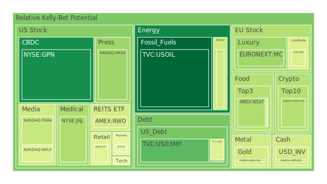
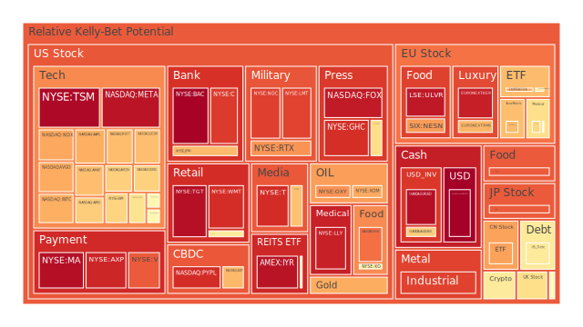
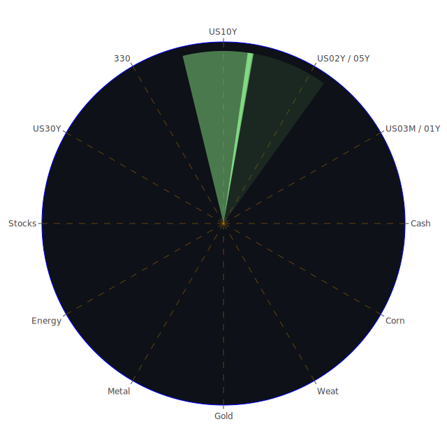

# **投資商品泡沫分析**

當前全球金融市場在多重因素交織下，呈現複雜且多變的格局。我們將依據近期數據，對各大類資產的潛在泡沫風險進行深入剖析，並結合相關新聞事件、歷史場景及既有理論，提供多元觀察視角。

**美國國債**

美國國債市場近期波動顯著，各期限殖利率呈現不同走勢。根據2025年5月7日的數據，美國3月期國債（US03MY）殖利率為4.32%，其當日泡沫指數（D1）為0.2166，月平均（D30）為0.3248，顯示短期風險相對較低，但仍有溫和的泡沫累積。1年期國債（US01Y）殖利率4.01%，D1為0.4424，D30為0.4677，泡沫程度略高於3月期。2年期國債（US02Y）殖利率3.78%，D1與D30均在0.61至0.62之間，泡沫程度中等偏高。5年期國債（US05Y）殖利率3.89%，D1與D30均在0.495左右，泡沫程度中等。10年期國債（US10Y）殖利率4.30%，D1為0.5497，D30為0.4571，顯示近期風險上升。30年期國債（US30Y）殖利率4.80%，D1為0.5685，D30為0.4520，同樣呈現近期風險攀升的態勢。

從經濟學角度看，聯準會的貨幣政策是影響國債價格的核心因素。近期聯準會持續釋放鷹派訊號（自2025年3月7日以來有3次鷹派發言，0次鴿派發言），加上聯準會總資產持續下降，顯示其仍在執行量化緊縮政策。這通常會推高殖利率，壓低債券價格。然而，市場對未來經濟衰退的預期（新聞提及「看跌的預測者呼籲2025年出現衰退」）可能部分抵銷此效應，因衰退預期會增加避險需求，推升債券價格。

社會心理學層面，投資者對通膨預期、經濟增長前景以及聯準會政策可信度的集體感知，共同塑造了國債市場的均衡價格。當前，信用卡拖欠率（Charge-off Rate on Credit Card 100S）處於相對高位，商業地產拖欠率（Commercial Real Estate Delinquent）亦高，這些都是經濟承壓的信號，可能引發市場的避險情緒。

博弈論觀點下，市場參與者正在聯準會的政策意圖、經濟數據的實際表現以及其他主要經濟體的政策走向之間進行博弈。例如，新聞中提到「川普排除解僱鮑威爾，同時敦促他降息」，以及「川普暗示願意『在某個時候』降低中國關稅」，這些政治博弈的訊號為市場增添了不確定性。

歷史上，殖利率曲線倒掛（例如10年期與3月期殖利率US10Y-03M為-0.02）往往被視為經濟衰退的前兆。儘管此數據較去年同期的-1.35已大幅收窄，但仍處於倒掛狀態，值得警惕。同時，美國公眾持有的債務佔GDP比例處於高位，外國機構持有的美國國債流通量則處於低位，這可能反映了國際投資者對美元資產長期信心的一些微妙變化，如新聞所言「美元地位的損害是永久性的嗎？」

**美國零售股**

零售股如好市多（COST）、沃爾瑪（WMT）、家得寶（HD）及塔吉特（TGT）等，其泡沫指數普遍偏高。好市多（COST）PP100為1010.50，D1為0.4422，D30為0.4941，風險中等。沃爾瑪（WMT）PP100為98.55，D1高達0.9092，D30亦有0.7813，泡沫風險顯著。家得寶（HD）PP100為359.38，D1為0.5791，D30為0.6806，風險較高。塔吉特（TGT）PP100為93.65，D1高達0.9684，D30亦有0.8510，泡沫風險極高。

經濟學上，零售股的表現與消費者信心、可支配收入、就業狀況及通膨水平密切相關。聯準會數據顯示消費者拖欠率（Consumer Delinquent）處於相對高位，這對零售業而言並非利好消息。新聞中，「川普突然改變關稅政策正影響紐約一家小型服裝製造商：『人人都嚇壞了』」以及福特汽車預計今年因關稅損失15億美元，均顯示貿易保護主義對零售成本和供應鏈的潛在衝擊。美泰公司計劃提高部分玩具價格以抵銷關稅成本，最終可能轉嫁給消費者，影響消費意願。

從社會學角度看，消費習慣的改變，例如電商的持續滲透、對「體驗式消費」的偏好，以及AI可能引發的就業危機（新聞「多鄰國是AI就業危機的代表嗎？」）導致的收入預期下降，都可能對傳統零售業構成挑戰。

心理學上，「口紅效應」或「末日消費」等概念或許能在特定時期解釋部分消費行為，但高通膨和高利率環境下，消費者通常會變得更加謹慎。巴菲特「長期趨勢是向上的」的樂觀言論，或能在一定程度上提振市場信心，但具體到零售業，仍需關注實際的消費能力。

**美國科技股**

科技股板塊呈現分化，但整體泡沫水平不容忽視。以那斯達克100指數（NDX）為例，PP100為19791.34，D1為0.7187，D30為0.7553，顯示整體科技股泡沫處於較高水平。蘋果（AAPL）PP100為198.51，D1為0.7076，D30為0.6190。微軟（MSFT）PP100為433.31，D1為0.6819，D30為0.6789。亞馬遜（AMZN）PP100為185.01，D1為0.6473，D30為0.7916，月平均風險較高。輝達（NVDA）PP100為113.54，D1為0.6038，D30為0.6038。谷歌（GOOG）PP100為165.20，D1為0.6428，D30為0.6607。Meta（META）PP100為587.31，其D1高達0.9598，D30亦有0.9115，泡沫風險極高，需重點關注。特斯拉（TSLA）PP100為275.35，D1為0.5427，D30為0.3982，近期風險高於月平均。

經濟學角度分析，科技股，特別是成長型科技股，對利率變動極為敏感。當前高利率環境會增加其融資成本，並降低其未來現金流的折現值。新聞中提到「蘋果、通用汽車面臨債券投資者的壓力，因貿易擔憂加劇」，以及「Netflix、華納兄弟股價下滑，因川普威脅對外國製造的電影徵收100%關稅」，這些都對科技和媒體娛樂相關的股票構成直接利空。亞馬遜第一季財報電話會議顯示其雲端、零售和AI業務的表現好壞參半，也反映了科技巨頭面臨的複雜經營環境。

社會學上，AI的快速發展是科技股的核心驅動之一，新聞中Revelo的拉丁美洲人才網絡因AI而需求強勁，以及DUOL第一季財報電話會議強調AI驅動的產品擴展，均為正面信號。然而，「多鄰國是AI就業危機的代表嗎？」也揭示了社會對AI倫理和就業影響的擔憂，這可能間接影響相關企業的長期發展環境和監管壓力。

心理學角度，市場對科技股往往存在較高的期望值，容易形成「信念驅動型」泡沫。一旦業績不及預期或出現重大利空（如Palantir銷售預測未達華爾街預期），便可能引發劇烈回調。不過，Palantir同時也上調了2025年營收展望，理由是美國企業需求強勁，顯示市場情緒的複雜性。

**美國房地產指數**

美國房地產指數（VNQ）PP100為88.82，D1為0.5493，D30為0.4522，近期風險上升。另一房地產指數（IYR）PP100為94.16，D1高達0.9607，D30為0.7906，泡沫風險極高。這與聯準會數據中商業地產拖欠率（Commercial Real Estate Delinquent）和住宅地產拖欠率（Real Estate Delinquent）均處於相對高位的情況相符。

經濟學上，房地產市場對利率極為敏感。美國30年期固定抵押貸款利率高達6.76%，遠高於去年的2.94%，這無疑加重了購房者的負擔，抑制了需求。儘管新聞提及「2025年5月4日抵押貸款和再融資利率：在高利率環境中獲得好交易」，但整體環境依然嚴峻。

歷史上，房地產泡沫的破裂往往是金融危機的導火線，如2008年的次貸危機。當前雖然銀行體系看似穩健（美國銀行總存款處於高位），但商業地產的困境不容小覷，可能透過金融系統產生漣漪效應。

**加密貨幣**

比特幣（BTCUSD）PP100約96885，D1為0.5244，D30為0.4400，風險中等偏高。以太坊（ETHUSD）PP100約1819，D1為0.5970，D30為0.5377，風險與比特幣相似。狗狗幣（DOGEUSD）PP100約0.1724，D1為0.3535，D30為0.4860，波動較大。

經濟學角度，加密貨幣作為一種新興資產類別，其價格受到市場流動性、投機情緒、監管政策以及宏觀經濟環境等多重因素影響。新聞中「川普的加密貨幣事業使穩定幣立法之路複雜化，民主黨人反抗」，突顯了監管的不確定性，這是加密貨幣市場面臨的主要風險之一。

社會心理學上，加密貨幣的追捧者往往具有較高的風險偏好和對新技術的信仰。市場情緒的波動，例如因某個KOL的言論或某個項目的進展，都可能引發價格的劇烈震盪。

博弈論視角下，加密貨幣市場充滿了資訊不對稱和早期參與者的優勢。投資者需警惕「龐氏騙局」或市場操縱的風險。

**金/銀/銅**

黃金（XAUUSD）PP100為3398.60，D1為0.4075，D30為0.4316，泡沫風險中等，但考慮到其避險屬性，在當前宏觀環境下，此價格水平可能具有一定支撐。白銀（XAGUSD）PP100為33.15，D1高達0.9416，D30為0.8564，泡沫風險極高，需警惕回調。銅（COPPER）PP100為4.79，D1為0.6125，D30為0.7254，泡沫風險較高，可能反映了對未來工業需求或綠色轉型所需金屬的預期，但也可能包含過度投機成分。

黃金石油比率（GOLD OIL RATIO）為56.87，遠高於去年的28.76；黃金銅比率（GOLD COPPER RATIO）為708.83，亦高於去年的615.17。這些比率的上升通常被解讀為市場避險情緒升溫，或黃金相對於工業品價格的強勢。

**黃豆 / 小麥 / 玉米**

黃豆ETF（SOYB）PP100為21.49，D1為0.8365，D30為0.5489，近期泡沫急劇升高。小麥ETF（WEAT）PP100為4.54，D1為0.3429，D30為0.4101，泡沫風險相對溫和。玉米ETF（CORN）PP100為18.37，D1為0.4860，D30為0.4602，泡沫風險中等。

農產品價格受天氣、地緣政治（影響化肥和糧食出口）、全球供需關係及投機資金等多重因素影響。俄烏衝突持續以及其他潛在供應鏈瓶頸都可能對糧食安全構成威脅，從而推高價格。然而，近期黃豆ETF泡沫的急升值得關注，可能存在短期過熱。

**石油/ 鈾期貨UX\!**

石油（USOIL）PP100為59.56，D1為0.0351，D30為0.1845，泡沫指數相對較低，顯示市場對當前油價的認可度較高，或預期未來需求可能受經濟放緩影響。新聞中「儘管油價下跌，大型石油公司仍維持股息穩定」，顯示生產商對未來仍有一定信心。鈾期貨（UX1\!）PP100為69.80，D1為0.4051，D30為0.4916，泡沫風險中等，核能作為清潔能源的選項之一，其長期需求看好，但短期價格波動受政策和項目進展影響。

**各國外匯市場**

美元日圓（USDJPY）PP100為142.92，D1達到1.0000的極值，D30為0.5668，顯示日圓近期面臨極大貶值壓力，泡沫風險極高，可能與日本央行持續的寬鬆政策以及美日利差擴大有關。英鎊美元（GBPUSD）PP100為1.34，D1為0.4097，D30為0.4706，泡沫風險中等。歐元美元（EURUSD）PP100為1.13，D1為0.9699，D30為0.7490，泡沫風險極高，可能反映市場對歐元區經濟前景或歐洲央行政策的擔憂。澳元美元（AUDUSD）PP100為0.65，D1為0.6502，D30為0.4158，近期風險上升。

外匯市場是各國經濟基本面、貨幣政策、資本流動以及地緣政治風險的綜合反映。新聞中「美元地位的損害是永久性的嗎？」引發對美元長期走勢的思考，而澳洲西太平洋銀行未達獲利預期並警示全球貿易風險，也可能對澳元構成壓力。

**各國大盤指數**

日本日經225指數（JPN225）PP100為36937.19，D1為0.8359，D30為0.7220，泡沫風險高。英國富時100指數（FTSE）PP100為8595.00，D1為0.6150，D30為0.6052，風險較高。德國DAX指數（GDAXI）PP100為23306.50，D1為0.5826，D30為0.5566，風險中等偏高。法國CAC40指数（FCHI）PP100為7703.40，D1為0.7212，D30為0.5796，泡沫風險較高。台灣加權指數（0050）PP100為171.00，D1為0.5290，D30為0.7423，月平均風險較高。中國滬深300指數（000300）PP100為3808.54，D1為0.7283，D30為0.4961，近期風險顯著上升。

各國股市的表現受到其國內經濟狀況、利率政策、通膨水平以及全球宏觀環境的共同影響。例如，德國部長預計今年尋求庇護者人數將急劇下降，以及德國新任內政部長對禁止極右翼AfD持懷疑態度，這些內部政治動態也可能影響市場情緒。

**美國半導體股**

半導體股如輝達（NVDA）已在前述科技股中提及，泡沫風險較高。美光（MU）PP100為80.51，D1為0.4856，D30為0.3826，近期風險高於月平均。應用材料（AMAT）PP100為153.03，D1為0.6772，D30為0.8066，整體泡沫風險高。科磊（KLAC）PP100為679.42，D1為0.5411，D30為0.4883，風險中等偏高。英特爾（INTC）PP100為19.94，D1為0.7076，D30為0.4974，近期風險顯著上升。高通（QCOM）PP100為139.90，D1為0.6786，D30為0.7915，整體泡沫風險高。博通（AVGO）PP100為200.09，D1為0.7133，D30為0.8324，整體泡沫風險高。台積電（TSM）PP100為172.28，D1高達0.9822，D30亦有0.9852，泡沫風險極高，需高度警惕。

半導體行業具有強烈的週期性，且受到地緣政治（如晶片法案、出口管制）、技術迭代以及終端需求（如PC、手機、AI伺服器）的深刻影響。AI的爆發式增長為半導體帶來巨大需求，但也推高了相關股票的估值。

**美國銀行股**

摩根大通（JPM）PP100為249.25，D1為0.6850，D30為0.7313。美國銀行（BAC）PP100為40.84，D1高達0.9946，D30為0.9472，泡沫風險極高。花旗集團（C）PP100為69.47，D1為0.8878，D30為0.8608，泡沫風險極高。第一資本金融（COF）PP100為185.71，D1為0.4652，D30為0.4721，風險中等。

銀行股的表現與利率環境、信貸品質及經濟景氣密切相關。當前高利率環境雖然有利於擴大淨息差，但也可能導致信貸需求萎縮和壞帳風險上升。聯準會數據顯示信用卡拖欠率和商業地產拖欠率高企，對銀行資產品質構成潛在威脅。Rite Aid再次申請破產保護，也為銀行業敲響了警鐘。

**美國軍工股**

洛克希德馬丁（LMT）PP100為468.21，D1為0.8742，D30為0.7499。諾斯洛普格魯曼（NOC）PP100為487.48，D1為0.8806，D30為0.7349。雷神技術（RTX）PP100為128.16，D1為0.7498，D30為0.7542。三者泡沫指數均處於高位。

地緣政治緊張局勢，如新聞中提及的以色列未能攔截胡塞導彈、南蘇丹瀕臨內戰邊緣、多哥的「憲法政變」等，都可能刺激各國增加國防開支，利好軍工股。然而，其高企的泡沫指數也暗示市場可能已過度反應這些預期。

**美國電子支付股**

Visa（V）PP100為347.70，D1為0.8354，D30為0.7698。萬事達卡（MA）PP100為558.99，D1為0.9691，D30為0.8027。PayPal（PYPL）PP100為68.05，D1為0.9112，D30為0.9522。Global Payments（GPN）PP100為79.28，D1為0.1125，D30為0.6525，近期風險較低但月平均風險高。

電子支付行業受益於現金交易向數位支付的長期轉型趨勢。然而，其業績也與整體消費支出和經濟活動水平相關。高泡沫指數可能反映了市場對其穩定增長和高利潤率的樂觀預期，但也需警惕經濟下行帶來的衝擊。

**美國藥商股**

嬌生（JNJ）PP100為154.47，D1為0.3411，D30為0.2643，泡沫風險相對較低。默克（MRK）PP100為79.04，D1為0.5490，D30為0.5056，風險中等。禮來（LLY）PP100為775.12，D1高達0.9350，D30亦有0.9341，泡沫風險極高。諾和諾德（NVO）PP100為66.29，D1為0.6362，D30為0.6936，風險較高。

藥商股通常被視為防禦性板塊，但在特定藥品（如減肥藥）取得突破性進展時，也可能出現顯著的股價上漲和估值泡沫。禮來和諾和諾德的高泡沫指數可能與其在減肥藥和糖尿病藥物市場的強勁表現有關。

**美國影視股**

奈飛（NFLX）PP100為1137.69，D1為0.4318，D30為0.4826，風險中等。派拉蒙全球（PARA）PP100為11.50，D1為0.3868，D30為0.5061，風險中等。迪士尼（DIS）PP100為92.17，D1為0.6715，D30為0.7000，風險較高。

影視股面臨串流媒體競爭加劇、內容成本上升以及潛在的關稅影響（新聞「Netflix、華納兄弟股價下滑，因川普威脅對外國製造的電影徵收100%關稅」）。迪士尼的高泡沫指數可能與市場對其主題公園業務復甦和串流媒體策略調整的預期有關。

**美國媒體股**

康卡斯特（CMCSA）PP100為34.49，D1為0.3155，D30為0.4754，風險中等。福斯（FOX）PP100為45.97，D1高達0.9451，D30為0.8253，泡沫風險極高。紐約時報（NYT）PP100為52.66，D1為0.6187，D30為0.7355，風險較高。

傳統媒體面臨數位化轉型的挑戰，廣告收入和訂閱模式均受到考驗。福斯和紐約時報的高泡沫指數值得投資者警惕。

**石油防禦股**

艾克森美孚（XOM）PP100為104.71，D1為0.7168，D30為0.7674。西方石油（OXY）PP100為39.28，D1為0.7504，D30為0.7552。兩者泡沫指數均處於高位。

儘管油價本身泡沫不高，但石油公司的股票泡沫指數偏高，可能反映了市場對其盈利能力、股息穩定性（新聞提及大型石油公司維持股息）以及能源轉型背景下傳統能源仍具價值的預期。

**金礦防禦股**

皇家黃金（RGLD）PP100為184.53，D1為0.7126，D30為0.9147，泡沫風險高，尤其是月平均風險極高。

金礦股的表現與黃金價格、開採成本、地緣政治風險（影響礦區運營）等因素相關。在黃金價格中等泡沫的背景下，金礦股的高泡沫可能反映了市場對金價進一步上漲或公司盈利超預期的樂觀情緒。

**歐洲奢侈品股**

LVMH（MC）PP100為489.10，D1為0.3188，D30為0.4556，泡沫風險中等。開雲集團（KER）PP100為176.00，D1為0.9372，D30為0.7115，泡沫風險極高。愛馬仕（RMS）PP100為2440.00，D1為0.6958，D30為0.6876，風險較高。

奢侈品行業的增長依賴全球高淨值人群的消費能力和意願。經濟放緩、地緣政治衝突以及對財富不均的關注都可能對其構成壓力。開雲集團的極高泡沫指數尤其值得警惕。

**歐洲汽車股**

賓士（MBG）PP100為54.12，D1為0.5080，D30為0.5072，風險中等。寶馬（BMW）PP100為74.86，D1為0.4278，D30為0.5775，風險中等。保時捷（PAH3）PP100為36.66，D1為0.6846，D30為0.5192，近期風險上升。福特（F）雖為美國公司，但其財報（Q1利潤下降三分之二，預計關稅打擊15億美元）也反映了汽車行業面臨的普遍挑戰，如供應鏈問題、關稅壁壘及向電動化轉型的巨大投入。

**歐美食品股**

卡夫亨氏（KHC）PP100為28.40，D1為0.8033，D30為0.7597，泡沫風險高。雀巢（NESN）PP100為88.16，D1為0.7382，D30為0.5494，近期風險顯著上升。可口可樂（KO）PP100為71.72，D1為0.5614，D30為0.7508，整體泡沫風險較高。聯合利華（ULVR）PP100為4780.00，D1為0.9506，D30為0.9502，泡沫風險極高。

食品股通常被認為是防禦性資產，但在成本推動型通膨（如原材料、運輸成本上升）和消費者購買力下降的背景下，其盈利能力也面臨考驗。聯合利華的極高泡沫指數需要特別關注。BellRing Brands (BRBR) 第一季銷售額超預期但股價下跌，也顯示了市場情緒的複雜。

# **宏觀經濟傳導路徑分析**

當前宏觀經濟的核心線索圍繞著聯準會的緊縮政策、持續的通膨壓力（儘管CPI年增率已從去年的3.48%降至2.40%）、高企的政府債務以及日益緊張的國際貿易關係。

1. **聯準會政策與市場流動性**：聯準會總資產下降、聯邦基金實際利率（EFFR）成交量上升、貨幣市場基金總資產上升，表明市場流動性趨緊，資金尋求避風港或更高收益的短期工具。逆回購協議（RRP）下降也反映了市場上過剩流動性的減少。鷹派發言進一步強化了緊縮預期。  
2. **利率與信貸市場**：高利率環境（各期限美債殖利率均顯著高於歷史低位，30年期固定抵押貸款利率高達6.76%）直接衝擊信貸市場。信用卡拖欠率、商業地產拖欠率、消費者拖欠率均處於高位，高收益債券利率亦高，顯示信貸風險正在累積。這可能抑制企業投資和消費者支出。  
3. **經濟增長與衰退風險**：殖利率曲線部分倒掛（10年期-3月期為負），歷史經驗暗示經濟衰退風險增加。新聞中「看跌的預測者呼籲2025年出現衰退」以及澳洲西太平洋銀行警示全球貿易風險，均指向黯淡的增長前景。  
4. **通膨與購買力**：儘管CPI有所回落，但仍可能高於聯準會的舒適區。持續的通膨壓力侵蝕消費者購買力，對零售、非必需消費品等行業構成挑戰。  
5. **國際貿易與地緣政治**：川普的關稅政策威脅（影響汽車、影視、服裝製造等多個行業）以及「美元地位損害」的討論，加劇了全球經濟的不確定性。中東（哈瑪斯、胡塞導彈）、非洲（南蘇丹、多哥）、歐洲（德國庇護者問題、英國恐襲調查）的地緣政治事件，則可能引發避險情緒，推升黃金等資產價格，並擾亂全球供應鏈。

**空間三位一體（Spatial Trinity）的體現**：

* **經濟學**：聯準會緊縮 \-\> 利率上升 \-\> 信貸成本增加 \-\> 企業投資與消費意願下降 \-\> 經濟放緩。新聞中的關稅威脅直接衝擊特定產業的成本與利潤。  
* **社會學**：AI引發的就業焦慮（新聞：多鄰國）可能改變長期消費模式。地緣政治衝突（新聞：哈瑪斯、南蘇丹）引發的難民流與社會不安定感，影響區域經濟穩定。  
* **心理學**：巴菲特的樂觀言論（新聞）對市場情緒有短期提振，但持續的負面經濟數據（如高拖欠率）和衰退預期（新聞）則累積悲觀情緒。對關稅的「恐懼」（新聞）導致避險行為。  
* **博弈論**：各國央行在通膨與增長間的政策平衡，川普政府與貿易夥伴間的關稅博弈，以及市場參與者對這些博弈結果的預期，共同決定資產價格走向。

# **微觀經濟傳導路徑分析**

微觀層面，企業盈利能力、成本控制及市場需求是核心。

1. **成本壓力**：關稅（福特、美泰、服裝製造商）、原材料價格波動（食品股）、勞動力成本上升，均對企業利潤構成擠壓。普華永道在美國裁員約1500人，部分反映了企業應對成本壓力及需求放緩的舉措。  
2. **需求變化**：高利率和通膨侵蝕消費者購買力，影響零售（沃爾瑪、塔吉特泡沫高企）、汽車（福特利潤下滑）、影視娛樂（迪士尼、奈飛面臨挑戰）等行業。然而，特定領域如AI（Revelo、Palantir部分業務、DUOL）和國防（軍工股泡沫高）仍呈現結構性需求。  
3. **企業財報與預期管理**：多家公司財報好壞參半（亞馬遜、Palantir銷售預測 vs. 營收展望），顯示經營環境複雜。市場對財報的反應極為敏感，不及預期的結果可能導致股價大幅波動。蘋果、通用汽車面臨來自債券投資者的壓力，也反映了市場對企業財務健康的擔憂。

**時間三位一體（Temporal Trinity）的體現**：

* **經濟學**：歷史上的高通膨時期，央行通常採取持續緊縮政策，導致經濟硬著陸。當前的聯準會政策路徑與歷史有相似之處，但全球化程度和債務水平遠超以往。  
* **社會學**：過去的技術革命（如工業革命、網路革命）在提升效率的同時，也帶來了結構性失業和社會轉型陣痛。AI的發展可能遵循類似路徑。  
* **心理學**：市場對「黑天鵝」事件的記憶（如2008年金融危機）會影響其在當前風險累積時的反應模式，可能放大恐慌或過早避險。  
* **博弈論**：企業在過去的貿易戰中學到的經驗，會影響其當前供應鏈佈局和對沖策略。

# **資產類別間傳導路徑分析**

1. **股債關係**：傳統上，經濟下行預期升溫時，資金從股市流向債市避險。但當前若通膨頑固，聯準會被迫持續緊縮，則股債可能雙殺。目前10年期美債殖利率處於高位，其泡沫指數D1高於D30，暗示債券價格近期承壓。  
2. **美元與商品**：美元強勢（USDJPY泡沫極高）通常會壓抑以美元計價的商品價格。然而，若避險情緒主導，黃金（XAUUSD泡沫中等）可能與美元同漲。黃金石油比和黃金銅比高企，支持此觀點。  
3. **利率與房地產/科技股**：高利率對房地產（VNQ、IYR泡沫高）和高估值的科技股（NDX、META、TSM泡沫高）構成直接壓力。  
4. **地緣政治與避險資產**：地緣政治緊張（新聞多處提及）利好黃金、軍工股（LMT、NOC、RTX泡沫高）和某種程度上的美元。  
5. **經濟預期與週期股/防禦股**：經濟衰退預期不利於週期股（如零售、部分工業），相對利好防禦股（如必需消費品、醫療保健）。但部分「防禦股」如聯合利華、禮來泡沫已極高，其防禦性值得懷疑。  
6. **產業鏈傳導**：半導體（TSM、NVDA泡沫高）作為科技產業鏈上游，其景氣度直接影響下游的消費電子、AI應用等。關稅對汽車業（福特）的衝擊，會向上游零部件供應商傳導。

**概念三位一體（Conceptional Trinity）的體現**：

* **經濟學**：「風險溢價」概念解釋了為何高風險資產（如高泡沫股票）在特定時期仍被追捧（預期更高回報），但也意味著一旦風險偏好逆轉，跌幅會更深。「安全港」概念則解釋了資金流向黃金、短期美債的現象。  
* **社會學**：「羊群效應」在加密貨幣市場和部分熱門股票中表現明顯，投資者跟隨大眾情緒而非基本面分析。「信任危機」可能導致對傳統金融體系或特定貨幣（如美元地位受質疑）的信心動搖。  
* **心理學**：「錨定效應」（投資者將資產價格錨定在近期高點，不願止損）和「處置效應」（過早賣出盈利資產，過久持有虧損資產）影響投資決策。「FOMO」（害怕錯過）情緒助長泡沫。  
* **博弈論**：「囚徒困境」可見於貿易戰中，各國單方面追求自身利益最大化可能導致整體福利受損。「懦夫博弈」則體現在聯準會與市場對賭政策拐點上。

**風險對沖組合機會（尋求相位120度，相關係數約-0.5為理想目標，實際操作中需動態調整）**

1. **股票多頭 vs. VIX指數期貨多頭/股指期貨空頭**：當股市下跌時，VIX（恐慌指數）通常上漲。  
2. **成長股多頭 vs. 價值股多頭/黃金多頭**：在不同經濟週期或市場風格下，成長股與價值股表現可能分化。黃金通常在股市承壓或通膨高漲時表現較好。  
3. **長期美國國債多頭 vs. 通膨連結債券（TIPS）多頭/大宗商品多頭**：若預期通縮或經濟嚴重衰退，長債有利；若預期通膨持續，TIPS或大宗商品更有優勢。  
4. **美元多頭 vs. 新興市場貨幣空頭/特定商品貨幣空頭**：在全球避險情緒升溫或美國經濟相對強勢時，美元可能走強，壓抑新興市場貨幣和商品貨幣（如澳元、加元）。  
5. **房地產多頭 vs. REITs反向ETF/高利率環境下的金融股空頭**：房地產本身與利率負相關，若利率持續走高，REITs可能承壓。

**漣漪效應傳導路徑假設**：

1. **聯準會鷹派超預期 \-\> 美元指數急升 (USDJPY已現極端泡沫) \-\> 新興市場資本外流，貨幣貶值 (可能衝擊000300, TWSE0050等) \-\> 全球貿易萎縮 \-\> 大宗商品需求下降 (USOIL, COPPER承壓，但COPPER泡沫已高，可能先擠泡沫) \-\> 依賴出口的經濟體 (如德國GDAXI) 股市受挫。**  
2. **美國商業地產風險暴露 (FED數據顯示高拖欠) \-\> 區域性銀行壞帳增加 (BAC, C泡沫已極高，可能率先破裂) \-\> 信貸緊縮加劇 \-\> 中小企業融資困難，破產增加 (Rite Aid已是案例) \-\> 失業率上升 \-\> 消費者信心崩潰 (零售股WMT, TGT高泡沫難以為繼) \-\> 經濟全面衰退 \-\> 聯準會被迫轉向降息 (美債長端US10Y, US30Y價格反彈)。**  
3. **AI技術發展引發大規模結構性失業 (新聞憂慮) \-\> 社會財富分配惡化 \-\> 消費降級，社會矛盾激化 \-\> 政府被迫擴大財政支出進行補貼 \-\> 主權債務風險上升 (美國已處高位) \-\> 民粹主義抬頭，貿易保護主義加劇 (川普關稅是前兆) \-\> 全球供應鏈重組，通膨壓力結構化。**  
4. **地緣政治衝突升級 (中東、俄烏等) \-\> 能源價格飆升 (USOIL泡沫雖低，但有此風險) \-\> 全球通膨再度惡化 \-\> 各國央行被迫進一步加息 \-\> 金融市場劇烈動盪 (股市、債市、加密貨幣均受衝擊) \-\> 黃金 (XAUUSD) 作为最終避險資產價格創新高。**

# **投資建議**

鑑於當前市場多數資產泡沫指數偏高，地緣政治風險加劇，以及全球主要央行政策前景不明朗，建議投資者採取相對謹慎的姿態。以下配置比例僅供參考，投資者應根據自身風險承受能力進行調整。

**總體配置建議**：

* **穩健型配置：50%**  
* **成長型配置：30%**  
* **高風險配置：20%**

**各類別子項目配置建議**：

1\. 穩健型配置 (佔總資產50%)  
\* 美國短期國債 (如US03MY, US01Y): 50%  
\* 專業論述：當前3個月期美債殖利率約4.32%，1年期約4.01%。泡沫指數（D1分別為0.22, 0.44）相對較低，流動性好，在不確定性較高的市場環境下，能提供穩定的票息收入和資本保護。聯準會持續釋放鷹派訊號，短期內利率大幅下行空間有限，但作為現金管理工具仍具吸引力。歷史上，在市場動盪初期，短期國債往往是資金首選的避風港。  
\* 黃金 (XAUUSD): 30%  
\* 專業論述：黃金現價約3398美元，泡沫指數 (D1 0.41) 中等。黃金石油比、黃金銅比均處於高位，反映市場避險情緒及對紙幣信用的擔憂。地緣政治風險頻發（中東衝突、俄烏戰爭等新聞均有體現）以及對全球經濟衰退的擔憂，為黃金提供了支撐。從資產配置角度，黃金與其他金融資產的相關性較低，有助於分散風險。  
\* 現金或貨幣市場基金: 20%  
\* 專業論述：持有充足現金或投資於高流動性的貨幣市場基金，可以在市場出現大幅回調時把握買入機會，同時應對突發的流動性需求。聯準會數據顯示貨幣市場基金總資產持續增長，反映了市場的謹慎情緒。  
2\. 成長型配置 (佔總資產30%)  
\* 特定國防工業股 (如RTX): 40%  
\* 專業論述：雷神技術（RTX）現價約128美元，泡沫指數 (D1 0.75) 偏高，但全球地緣政治緊張局勢持續（新聞中以色列與胡塞衝突、南蘇丹等），各國國防預算預期增加，為軍工行業提供了較確定的需求前景。需注意其估值已不便宜，適合具備一定風險承受能力的投資者。  
\* 具備AI應用前景的半導體/科技股 (如NVDA，但需謹慎，或選擇產業ETF如SOXX並拉長持有期): 30%  
\* 專業論述：輝達（NVDA）現價約113美元，泡沫指數 (D1 0.60) 較高。AI是未來數年科技發展的主軸，輝達作為核心晶片供應商，長期成長潛力巨大。然而，短期估值偏高，且面臨技術快速迭代和市場競爭風險。投資者可考慮分批買入或定投相關產業ETF，以分散個股風險，並著眼於長期回報。新聞提及Revelo因AI帶動拉美人才需求，DUOL也強調AI驅動，顯示AI仍在滲透各行業。  
\* 鈾期貨 (UX1\!) 或相關鈾礦公司股票: 30%  
\* 專業論述：鈾期貨現價約69.8美元，泡沫指數 (D1 0.41) 中等。在全球推動能源轉型和減少碳排放的背景下，核能作為一種低碳的基載電力來源，其重要性日益凸顯。多國宣布新建核電站或延長現有核電站壽命，對鈾的長期需求構成支撐。但鈾價波動較大，受政策、礦產開發進度等多方面影響。  
3\. 高風險配置 (佔總資產20%)  
\* 比特幣 (BTCUSD): 50%  
\* 專業論述：比特幣現價約96885美元，泡沫指數 (D1 0.52) 中等偏高。作為市值最大的加密貨幣，比特幣被部分投資者視為「數位黃金」，具有一定的抗通膨和避險屬性。然而，其價格波動極大，且面臨嚴格的監管不確定性（新聞提及美國穩定幣立法複雜化）。此配置僅適合風險承受能力極高的投資者，且應控制倉位。  
\* 白銀 (XAGUSD) \- 短期波段操作，嚴設停損: 25%  
\* 專業論述：白銀現價約33.15美元，泡沫指數 (D1 0.94) 極高，顯示短期投機成分濃厚，風險極大。白銀兼具貴金屬和工業金屬屬性，其價格彈性通常大於黃金。鑑於其極高的泡沫讀數，任何多頭倉位都應視為短期博弈，並設定嚴格的停損點，以防範價格大幅回調的風險。  
\* 特定高泡沫但具備強勢題材的個股 (如META，極度謹慎): 25%  
\* 專業論述：Meta現價約587美元，泡沫指數 (D1 0.96) 極高。這類股票通常具備市場高度關注的題材（如AI元宇宙概念），資金追捧熱烈，短期可能維持強勢。但極高的泡沫意味著一旦市場情緒轉向或公司基本面出現利空，下跌風險亦極大。此配置屬於高度投機，務必謹慎評估，投入資金不宜過多，且需密切關注市場動態。

# **風險提示**

投資有風險，市場總是充滿不確定性。本報告所有分析和建議均基於當前獲取的有限數據和新聞資訊，僅為觀察視角和思考方向的提供，不構成任何操作建議。過去的表現不預示未來的結果。

泡沫風險高的警告：  
根據提供的數據，以下資產類別或個股的泡沫指數（尤其是D1或D30超過0.8，甚至0.9的）需要高度警惕：

* **股票**：沃爾瑪（WMT）、塔吉特（TGT）、Meta（META）、台積電（TSM）、美國銀行（BAC）、花旗集團（C）、萬事達卡（MA）、PayPal（PYPL）、禮來（LLY）、福斯（FOX）、聯合利華（ULVR）、開雲集團（KER）。  
* **外匯**：美元兌日圓（USDJPY）的D1達到1.0，歐元兌美元（EURUSD）的D1接近0.97。  
* **貴金屬**：白銀（XAGUSD）的D1高達0.94。  
* **農產品**：黃豆ETF（SOYB）的D1為0.84。  
* **房地產指數**：IYR的D1高達0.96。

投資者應根據自身的風險承受能力、財務狀況和投資目標，在充分了解相關風險的前提下，做出獨立的投資決策。在做出任何投資決策前，建議諮詢專業的財務顧問。市場狀況瞬息萬變，請持續關注最新的市場動態和風險指標。

 
Daily Buy Map:

 
Daily Sell Map:

 
Daily Radar Chart:

 
