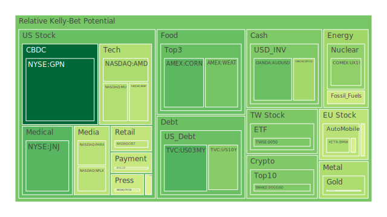
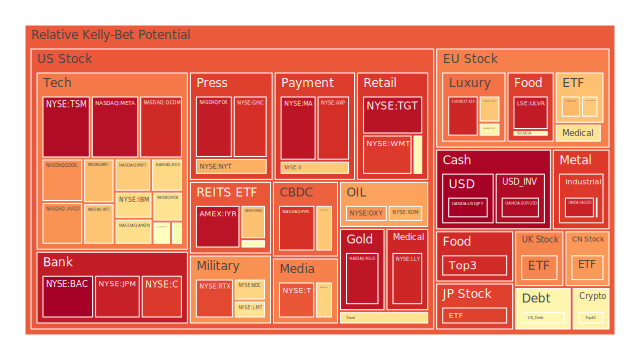
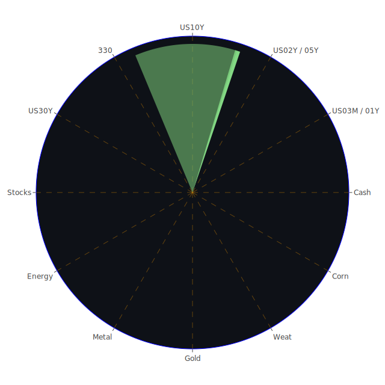

好的，這是一份根據您提供的資料所撰寫的市場分析報告。

# **投資商品泡沫分析**

當前全球金融市場呈現高度複雜且相互關聯的局面。在深入探討各類資產之前，我們必須理解，市場價格的波動不僅是經濟基本面的反映，更是社會情緒、心理預期以及參與者間博弈的綜合結果。歷史經驗一再提醒我們，無論是17世紀的鬱金香狂熱，或是21世紀初的網路泡沫，當資產價格脫離其內在價值，過度受到投機情緒驅使時，泡沫的風險便隨之而生。目前提供的數據顯示，部分資產的泡沫指數，特別是月平均風險分數（D30），已達到值得警惕的水平。

從經濟學角度觀之，供給與需求是決定價格的基礎。然而，當預期心理介入，例如預期未來價格將持續上漲，便會吸引更多追逐短期利潤的資金，進一步推升價格，形成正向回饋循環。社會學的觀點則可從「羊群效應」來解釋，個體投資者往往會模仿群體的行為，即使這些行為可能並不理性。心理學上，過度自信、損失厭惡等認知偏誤，也常使投資者在泡沫形成與破裂過程中做出不利決策。博弈論則揭示了市場參與者之間的策略互動，例如「囚徒困境」可能導致即使個體理性，群體結果卻非最優。

以下將針對各主要資產類別，結合當前數據、新聞事件、歷史場景及相關理論，進行泡沫風險與潛在傳導路徑的分析。

* **美國國債 (US03MY, US01Y, US02Y, US05Y, US10Y, US30Y)**  
  觀察美國各年期國債，短期國債如三個月期 (US03MY) 與一年期 (US01Y) 的泡沫指數相對較低，D30 分別為 0.317534 及 0.474721 (截至2025-05-08)。這反映了市場對於短期內聯準會政策路徑的相對確定性，以及短期資金尋求避險的需求。然而，兩年期 (US02Y) 的泡沫指數D30達到0.622607，五年期 (US05Y) 與十年期 (US10Y) 的D30分別為0.495440和0.457042，三十年期 (US30Y) 的D30則為0.456388。  
  從經濟學角度看，聯準會的貨幣政策是影響債券價格的核心因素。當前聯準會總資產下降、有效聯邦基金利率 (EFFR) 交易量上升、逆回購 (RRP) 規模下降，均顯示市場流動性有所收緊的跡象。同時，聯準會官員近期發表了3次鷹派言論，暗示短期內降息的可能性降低，這對中短期債券價格構成壓力。歷史上，1970年代末至1980年代初，保羅·沃爾克領導下的聯準會為對抗高通脹而急劇提升利率，導致債券價格大幅下跌，便是前車之鑑。  
  社會心理層面，市場對通膨持續性的擔憂以及對未來經濟成長放緩的預期，使得投資者在長短期債券之間的配置出現分歧。博弈論觀點下，市場參與者正在猜測聯準會的下一步動作，任何超乎預期的經濟數據（如高於預期的通膨或就業數據）都可能引發債券市場的劇烈波動。新聞中提到，「蘋果、通用汽車等公司面臨債券投資者的壓力，因貿易擔憂加劇」，顯示企業債也受到波及，進而影響整體債券市場情緒。美國公債殖利率曲線部分倒掛（如十年期與三個月期殖利率倒掛-0.06個基點），傳統上被視為經濟衰退的訊號，這使得長期債券的吸引力在避險情緒下有所提升，但同時也反映了對未來經濟前景的悲觀預期。泡沫分數D1的波動，如US10Y從0.536663(5/6)降至0.351050(5/8)，可能反映了短期消息面或資金流動的影響。  
* **美國零售股 (COST, WMT, TGT, HD)**  
  美國零售股呈現分化。Costco (COST) 的D30泡沫指數為0.494035，Walmart (WMT) 為0.788595，Target (TGT) 為0.851188，Home Depot (HD) 為0.671876。其中，Walmart和Target的泡沫指數相對較高。  
  經濟學上，零售股的表現與消費者信心、可支配收入以及整體經濟狀況密切相關。當前消費者拖欠率處於相對高位，信用卡拖欠率亦在高位，這對零售業的銷售前景構成壓力。社會學角度看，消費習慣的轉變（如線上購物興起）以及不同收入群體消費能力的差異，導致零售商之間業績出現分化。心理學上，價格敏感度的提升可能使消費者更傾向於選擇性價比較高的商家，或減少非必需品支出。新聞中提到「美泰計劃提高部分玩具價格以抵消關稅成本」，這可能轉嫁給消費者，若消費者不買單，則影響銷售。歷史上，經濟衰退期，非必需消費品零售商往往受創較重，而必需消費品零售商則相對穩健。沃爾瑪(WMT) D1分數從0.906588(5/6)降至0.897895(5/8)，塔吉特(TGT) D1分數從0.967344(5/6)降至0.965137(5/8)，家得寶(HD) D1分數則從0.640389(5/6)降至0.583811(5/8)，顯示短期風險略有變化，但整體仍偏高。  
* **美國科技股 (AAPL, MSFT, GOOG, AMZN, META, NVDA, TSLA)**  
  科技巨頭普遍面臨較高的泡沫風險。Apple (AAPL) D30為0.618958，Microsoft (MSFT) 為0.671248，Google (GOOG) 為0.664849，Amazon (AMZN) 為0.780662，Meta (META) 為0.911953，Nvidia (NVDA) 為0.595051，Tesla (TSLA) 為0.404729。其中Meta的泡沫指數尤其突出，而Tesla的D30相對較低，但其波動性眾所周知。  
  經濟學角度，高利率環境對成長型科技股的估值構成壓力，因為未來現金流的折現值會下降。同時，全球貿易緊張局勢，如新聞中「川普威脅對外國製造的電影徵收100%關稅」以及「蘋果、通用汽車等公司面臨債券投資者的壓力，因貿易擔憂加劇」，可能影響科技產品的供應鏈與海外市場。社會學上，科技產品的普及率與更新換代速度，以及公眾對數據隱私、人工智能倫理等議題的關注，都會影響科技股的長期發展。心理學層面，「錯失恐懼症」(FOMO) 與對革命性技術的過度樂觀，可能助長科技股泡沫。例如，儘管Palantir的銷售預測未達預期，但其早前亦因AI熱潮受到追捧。新聞中，「AMZN第一季度財報電話會議：雲、零售和AI計劃凸顯了混合的部門業績」，「蘋果第一季度財報電話會議：核心產品增長，AI整合和關稅風險」，以及「AMD公佈強勁的收益和展望，受‘AI動力’推動」，均顯示市場對AI主題的高度關注與分歧。歷史上，2000年的網路泡沫破裂，即是科技股估值過高後大幅修正的典型案例。近期NVDA的D1分數從0.615563(5/6)升至0.640078(5/8)，MSFT則從0.631010(5/6)升至0.687511(5/8)，顯示短期風險有所增加。  
* **美國房地產指數 (VNQ, IYR, RWO)**  
  美國房地產指數相關ETF，如VNQ的D30為0.457416，IYR為0.799617，RWO為0.486322。IYR的泡沫指數相對較高。  
  經濟學上，房地產市場對利率極為敏感。當前30年期固定抵押貸款利率高達6.76%，遠高於去年的2.94%，這顯著增加了購房成本，抑制了需求。商業房地產拖欠率和房地產總體拖欠率均處於相對高位，顯示房地產市場面臨壓力。社會學角度，人口結構變化、遠程辦公趨勢對商業地產的影響，以及住房可負擔性問題，都是影響房地產市場的重要因素。心理學上，對房價只漲不跌的信念一旦被打破，可能引發恐慌性拋售。歷史上，2008年的次貸危機便是由房地產泡沫破裂引發的全球金融危機。新聞中未直接提及房地產指數，但高利率和商業地產困境是已知的宏觀背景。IYR的D1分數從0.961332(5/6)微升至0.963866(5/8)，風險居高不下。  
* **加密貨幣 (BTCUSD, ETHUSD, DOGEUSD)**  
  加密貨幣市場波動劇烈。Bitcoin (BTCUSD) D30為0.438988，Ethereum (ETHUSD) 為0.539984，Dogecoin (DOGEUSD) 為0.477641。泡沫指數處於中等水平，但其日內和短期波動極大。  
  經濟學上，加密貨幣的價值基礎仍存爭議，部分觀點認為其是數位黃金或未來支付手段，另一部分則認為其缺乏內在價值，純屬投機。其價格易受市場流動性、監管政策以及宏觀避險情緒影響。社會學角度，加密貨幣社群的共識與信仰，以及意見領袖的影響力，對價格有顯著作用。心理學上，極端的價格波動容易引發投資者的貪婪與恐懼，放大市場波動。新聞中提到「川普的加密貨幣投資使穩定幣立法之路複雜化，民主黨人反抗」，顯示監管不確定性仍是主要風險。歷史上，加密貨幣經歷過多次暴漲暴跌，如2017年、2021年的牛市及其後的大幅回调。BTCUSD的PP100價格從94700(5/6)升至97049(5/8)，D1分數則從0.538412(5/6)升至0.555479(5/8)，顯示近期價格上漲伴隨短期風險升高。  
* **金/銀/銅 (XAUUSD, XAGUSD, COPPER)**  
  貴金屬與工業金屬表現各異。黃金 (XAUUSD) D30為0.429903，白銀 (XAGUSD) D30為0.856659，銅 (COPPER) D30為0.711041。白銀和銅的泡沫指數相對較高。  
  經濟學上，黃金通常被視為避險資產和抗通膨工具。當前全球地緣政治緊張（如新聞中以色列未能攔截胡塞導彈、克什米爾緊張局勢），以及對主權貨幣信心的潛在擔憂，都可能推升黃金需求。黃金石油比率 (58.09) 和黃金銅比率 (728.24) 均遠高於去年，顯示黃金相對強勢。白銀兼具貴金屬和工業金屬屬性，其價格波動通常大於黃金。銅作為重要的工業金屬，其價格與全球經濟成長預期密切相關，高泡沫指數可能反映了對未來經濟復甦的樂觀預期或供應鏈瓶頸。歷史上，在經濟不確定性高或通膨時期，黃金往往表現良好。XAUUSD的PP100價格從3334.12(5/6)升至3374.70(5/8)，D1分數從0.413532(5/6)降至0.402766(5/8)，顯示價格上漲但短期風險有所緩和。白銀XAGUSD的D1分數從0.873306(5/6)大幅升至0.939939(5/8)，風險顯著增加。  
* **黃豆 / 小麥 / 玉米 (SOYB, WEAT, CORN)**  
  農產品方面，黃豆ETF (SOYB) D30為0.563047，小麥ETF (WEAT) 為0.410920，玉米ETF (CORN) 為0.455653。黃豆的泡沫指數相對較高。  
  經濟學上，農產品價格受天氣、地緣政治（影響出口）、能源價格（影響種植和運輸成本）、全球供需平衡等多重因素影響。社會學角度，糧食安全問題在全球日益受到重視。心理學上，對極端天氣事件或供應中斷的擔憂可能引發囤積行為或投機性購買。歷史上，戰爭、乾旱等因素都曾導致農產品價格飆升。SOYB的D1分數從0.967877(5/6)降至0.923216(5/8)，雖有回落但仍處於高位。  
* **石油/ 鈾期貨 (USOIL, UX1\!)**  
  能源方面，石油 (USOIL) D30為0.184826，泡沫指數相對較低。鈾期貨 (UX1\!) D30為0.486566，處於中等水平。  
  經濟學上，石油價格受OPEC+產量政策、全球經濟需求、地緣政治風險（尤其在中東）、美元匯率以及庫存水平影響。新聞中「大型石油公司儘管油價下跌仍維持股息穩定」，顯示行業對未來仍有一定信心。鈾作為核燃料，其價格與核電發展前景、全球能源轉型政策以及地緣政治因素（如對俄羅斯鈾的依賴）相關。歷史上，石油危機曾對全球經濟產生巨大衝擊。USOIL的PP100價格從57.10(5/6)升至58.07(5/8)，但其D1分數從0.003230(5/6)大幅升至0.456222(5/8)，顯示短期風險急劇上升。  
* **各國外匯市場 (EURUSD, GBPUSD, USDJPY, AUDUSD)**  
  外匯市場方面，EURUSD的D30為0.760658，GBPUSD為0.452289，USDJPY為0.579434，AUDUSD為0.415642。歐元兌美元的泡沫指數相對較高。  
  經濟學上，匯率主要受各國利率差異、經濟增長前景、國際貿易差額、資本流動以及央行政策影響。USDJPY的PP100價格從143.74(5/6)變動至143.88(5/8)，其D1泡沫指數始終為1.000000，顯示日圓持續面臨貶值壓力，市場對此風險高度關注。美元作為全球主要的儲備貨幣和避險貨幣，其強弱對全球資產價格有廣泛影響。高盛與花旗等機構可能針對此類波動調整其外匯曝險。歷史上，廣場協議等國際協調曾導致主要貨幣匯率劇烈調整。EURUSD的D1分數從0.984625(5/6)降至0.978704(5/8)，仍處於極高水平。  
* **各國大盤指數 (NDX, JPN225, FTSE, GDAXI, FCHI, 0050, 000300\)**  
  全球主要股指泡沫指數普遍偏高。美國納斯達克100指數 (NDX) D30為0.753869，日本日經225指數 (JPN225) 為0.721750，英國富時100指數 (FTSE) 為0.599128，德國DAX指數 (GDAXI) 為0.557061，法國CAC40指數 (FCHI) 為0.588629，台灣50指數 (0050) 為0.721702，中國滬深300指數 (000300) 為0.505313。  
  經濟學角度，全球股市受到全球經濟增長、企業盈利、通膨預期、利率水平以及地緣政治等多重因素影響。新聞中「S\&P 500指數在聯準會會議前結束連漲」，「由於關稅風險重現，道瓊、標普500、納斯達克期貨持穩」，「股市今日：道瓊、標普500、納斯達克指數在聯準會決議前下滑，因關稅恐懼重燃」，均顯示市場情緒的脆弱和對宏觀風險的高度敏感。社會學上，投資者信心和市場情緒的傳染效應顯著。心理學上，追漲殺跌的行為模式常見。博弈論角度，各國央行政策的協同與分歧，以及國際貿易關係的演變，都影響著全球股市的博弈格局。歷史上，全球性股災往往伴隨著經濟衰退或重大地緣政治事件。NDX的D1分數從0.713240(5/6)降至0.662500(5/8)，但仍處高位。JPN225的D1分數從0.357960(5/6)大幅升至0.889103(5/8)，風險急升。  
* **美國半導體股 (NVDA, AMD, INTC, TSM, QCOM, AVGO, AMAT, KLAC, MU)**  
  半導體股呈現高泡沫與高成長預期並存的局面。Nvidia (NVDA) D30為0.595051，AMD D30為0.610699，Intel (INTC) 為0.501267，TSM D30高達0.985155，Qualcomm (QCOM) 為0.791499，Broadcom (AVGO) 為0.827138，Applied Materials (AMAT) 為0.788837，KLA Corp (KLAC) 為0.489904，Micron (MU) 為0.380244。台積電(TSM)的泡沫指數極高，值得特別關注。  
  經濟學上，半導體是現代經濟的基石，AI、5G、物聯網等趨勢推動其需求。然而，行業具有周期性，且易受地緣政治（如晶片禁令）、產能過剩或不足、以及技術迭代風險的影響。新聞中「Super Micro預測第四季度營收低於預期；股價下跌」，「Supermicro股價下跌，因伺服器製造商以關稅、經濟不確定性為由下調營收展望」，均對半導體行業情緒造成負面衝擊。然而，「AMD公佈強勁的收益和展望，受‘AI動力’推動」，則帶來正面消息。社會學角度，對國家科技競爭力的重視，促使各國加大對半導體產業的投入。心理學上，對AI等新技術的樂觀預期可能推高相關晶片股的估值。TSM的D1分數從0.980434(5/6)微降至0.978735(5/8)，持續處於極高風險水平。NVDA的D1從0.615563(5/6)升至0.640078(5/8)。  
* **美國銀行股 (JPM, BAC, C, COF)**  
  美國主要銀行股泡沫指數普遍偏高。JPMorgan Chase (JPM) D30為0.730629，Bank of America (BAC) 高達0.963018，Citigroup (C) 為0.861297，Capital One (COF) 為0.470665。美國銀行的泡沫指數尤其需要警惕。  
  經濟學上，銀行股的盈利能力與利率環境（淨息差）、信貸質量、經濟增長（貸款需求）以及監管政策密切相關。當前信用卡拖欠率、商業房地產拖欠率均處於高位，對銀行資產質量構成潛在威脅。聯準會資產負債表縮減可能影響銀行準備金和放貸能力。社會學角度，金融科技的發展對傳統銀行業務構成挑戰。心理學上，對系統性金融風險的擔憂可能在市場承壓時被放大。歷史上，銀行業危機往往對整體經濟產生嚴重衝擊，如2008年金融海嘯。BAC的D1分數從0.996551(5/6)微升至0.997804(5/8)，幾乎達到極限風險。  
* **美國軍工股 (LMT, NOC, RTX)**  
  美國軍工股泡沫指數處於高位。Lockheed Martin (LMT) D30為0.743296，Northrop Grumman (NOC) 為0.727828，RTX Corp (RTX) 為0.754333。  
  經濟學上，軍工股的表現與國防預算、地緣政治緊張局勢以及國際軍售訂單密切相關。當前全球多點衝突，如烏克蘭戰爭、中東局勢緊張，以及印太地區潛在摩擦，均推升了對軍工產品的需求。社會學角度，國家安全考量以及對國防工業就業的依賴，使得國防支出具有一定剛性。心理學上，對衝突升級的擔憂可能刺激對軍工股的避險性或投機性買入。歷史上，戰爭時期或冷戰期間，軍工股往往表現突出。LMT的D1分數從0.652162(5/6)降至0.639721(5/8)，NOC的D1分數從0.884813(5/6)降至0.671066(5/8)，RTX的D1分數從0.911200(5/6)降至0.877432(5/8)，短期風險雖有回落，但整體D30仍高。  
* **美國電子支付股 (V, MA, PYPL, GPN)**  
  電子支付股泡沫指數分化。Visa (V) D30為0.763280，Mastercard (MA) 為0.801641，PayPal (PYPL) 高達0.950634，Global Payments (GPN) 為0.624239。PayPal的泡沫指數極高。  
  經濟學上，電子支付行業受益於現金交易向數位支付的長期轉型趨勢，其收入與交易量和交易額密切相關，因此也受到整體消費支出的影響。利率上升可能增加其融資成本或影響合作商戶的經營。競爭加劇（來自銀行、科技巨頭和新興金融科技公司）是行業面臨的主要挑戰。社會學角度，支付習慣的改變和對便捷、安全支付方式的需求是主要驅動因素。心理學上，品牌信任度和用戶體驗至關重要。PYPL的D1分數從0.916381(5/6)微降至0.912666(5/8)，仍處於極高風險。MA的D1分數從0.392846(5/6)大幅飆升至0.959731(5/8)，風險急劇放大。  
* **美國藥商股 (JNJ, LLY, MRK, NVO)**  
  大型藥廠泡沫指數不一。Johnson & Johnson (JNJ) D30為0.263448，Eli Lilly (LLY) 高達0.933773，Merck (MRK) 為0.499696，Novo Nordisk (NVO) 為0.682726。禮來(LLY)的泡沫指數極高，可能與其減肥藥等爆款產品的市場預期有關。  
  經濟學上，藥企業績受藥品研發成功率、專利保護期、醫保政策、藥品定價以及市場競爭等因素影響。人口老化和醫療保健支出持續增長是長期利好。社會學角度，公眾對藥品可負擔性和藥品質量的關注度高。心理學上，對突破性新藥的期望可能推高相關公司估值。新聞中未直接提及大型藥商的重大負面消息，但「S\&P 500指數今日漲跌：股市連續第二天因Palantir、製藥股下跌而下跌」間接提及製藥股整體承壓。LLY的D1分數從0.932765(5/6)微降至0.930435(5/8)，仍居高不下。JNJ的D1分數則從0.388291(5/6)降至0.287110(5/8)，風險相對較低。  
* **美國影視股 (NFLX, DIS, PARA)**  
  影視娛樂股泡沫指數中等偏高。Netflix (NFLX) D30為0.482715，Disney (DIS) 為0.699997，Paramount (PARA) 為0.505225。  
  經濟學上，影視行業面臨串流媒體競爭白熱化、內容成本上升、廣告市場波動以及消費者訂閱疲勞等挑戰。新聞中「川普威脅對外國製造的電影徵收100%關稅」，以及「Netflix和其他媒體股因川普承諾對外國電影徵收100%關稅而暴跌」，直接點明了政策風險。社會學角度，觀眾口味變化、盜版問題以及文化產品的全球傳播是重要議題。心理學上，爆款內容的吸引力和品牌忠誠度影響用戶選擇。NFLX的D1分數從0.424776(5/6)微升至0.424221(5/8)，DIS的D1分數則從0.672448(5/6)微升至0.672515(5/8)。  
* **美國媒體股 (CMCSA, NYT, FOX)**  
  傳統媒體與新媒體股表現不一。Comcast (CMCSA) D30為0.482339，New York Times (NYT) 為0.733622，Fox Corp (FOX) 高達0.834224。Fox的泡沫指數較高。  
  經濟學上，傳統媒體面臨廣告收入向數位平台流失、訂閱模式轉型困難等挑戰。新聞媒體則需應對假新聞、公信力下降等問題。CMCSA的D1分數從0.315628(5/6)升至0.455951(5/8)。NYT的D1分數從0.411098(5/6)大幅升至0.733723(5/8)，風險顯著增加。FOX的D1分數從1.000000(5/6)降至0.949766(5/8)，雖有回落但仍極高。  
* **石油防禦股 (XOM, OXY)**  
  石油防禦股，通常指大型綜合石油公司，如ExxonMobil (XOM) D30為0.765322，Occidental Petroleum (OXY) 為0.752374，泡沫指數均偏高。  
  經濟學上，這類股票在油價上漲時通常受益，但在油價下跌或能源轉型加速時可能面臨壓力。其股息政策和資本支出計劃是市場關注焦點。新聞中提到「大型石油公司儘管油價下跌仍維持股息穩定」。XOM的D1分數從1.000000(5/6)降至0.727273(5/8)，OXY的D1分數從0.775789(5/6)微降至0.774904(5/8)。  
* **金礦防禦股 (RGLD)**  
  金礦股如Royal Gold (RGLD) 的D30高達0.916323，泡沫指數極高。  
  經濟學上，金礦股的表現與黃金價格、開採成本、礦山儲量以及政治風險（礦山所在地）相關。其股價彈性通常大於黃金本身。在黃金價格上漲預期下，金礦股可能受到追捧，但也需警惕其高波動性和經營風險。RGLD的D1分數從0.922345(5/6)升至0.958149(5/8)，風險持續攀升。  
* **歐洲奢侈品股 (MC, KER, RMS)**  
  歐洲奢侈品股泡沫指數普遍偏高。LVMH (MC) D30為0.466298，Kering (KER) 為0.715459，Richemont (RMS) 為0.688188。  
  經濟學上，奢侈品行業對全球經濟狀況、高淨值人群消費能力、匯率波動以及品牌吸引力高度敏感。新興市場的需求是重要增長動力，但地緣政治和貿易摩擦可能帶來不確定性。社會學角度，品牌形象、稀缺性以及社會地位的象徵意義是奢侈品消費的重要驅動因素。心理學上，炫耀性消費和對品質、工藝的追求影響購買決策。KER的D1分數從0.951615(5/6)降至0.930399(5/8)，RMS的D1分數則從0.989270(5/6)大幅降至0.695754(5/8)，MC的D1分數從0.470888(5/6)升至0.601737(5/8)，顯示板塊內風險變化不一但整體偏高。  
* **歐洲汽車股 (PAH3, MBG, BMW)**  
  歐洲汽車股泡沫指數處於中等水平。Porsche Automobil Holding (PAH3) D30為0.524683，Mercedes-Benz Group (MBG) 為0.504093，BMW D30為0.573564。  
  經濟學上，汽車行業是典型的周期性行業，受到經濟增長、消費者信貸、油價、以及向電動汽車轉型的巨大影響。供應鏈問題（如晶片短缺的後遺症）、激烈的市場競爭以及環保法規是主要挑戰。新聞中福特利潤下降並預計受關稅打擊，可能也反映了汽車行業面臨的普遍壓力。PAH3的D1分數從0.210854(5/6)升至0.476034(5/8)。  
* **歐美食品股 (KO, KHC, ULVR, NESN)**  
  大型食品飲料公司泡沫指數普遍偏高。Coca-Cola (KO) D30為0.740159，Kraft Heinz (KHC) 為0.754279，Unilever (ULVR) 高達0.950331，Nestle (NESN) 為0.553021。聯合利華的泡沫指數尤其值得關注。  
  經濟學上，食品飲料行業通常被視為防禦性行業，因其需求相對穩定。但成本上漲（原材料、運輸、包裝）、消費者口味變化、健康意識提升以及市場競爭對其盈利能力構成挑戰。社會學角度，食品安全、可持續發展和健康飲食趨勢影響深遠。心理學上，品牌忠誠度和價格敏感度是影響消費者選擇的關鍵。KO的D1分數從0.664341(5/6)降至0.642252(5/8)。KHC的D1分數從0.717820(5/6)降至0.489661(5/8)，風險顯著下降。ULVR的D1分數從0.951190(5/6)微升至0.951485(5/8)，持續高位。

# **宏觀經濟傳導路徑分析**

當前宏觀經濟環境的核心特徵是：聯準會維持緊縮姿態（資產負債表縮減、鷹派言論）、通膨雖有回落但仍具黏性（CPIYOY 2.4%）、利率維持高位（各期限美債殖利率均顯著高於歷史常態，30年期抵押貸款利率6.76%）、經濟數據顯示部分領域承壓（信用卡及各類貸款拖欠率上升，商業地產困境）、以及地緣政治與貿易摩擦風險（新聞中多次提及關稅威脅）。

1. **正向傳導（假設情境）：通膨頑固 \-\> 聯準會持續鷹派 \-\> 利率維持高檔或進一步上升。**  
   * **經濟學效應：** 借貸成本上升，企業投資意願下降，消費者支出減少（尤其耐用品和房地產）。美元可能因利差擴大而走強。  
   * **社會學效應：** 失業率可能上升，貧富差距擴大，社會不滿情緒增加。  
   * **心理學效應：** 市場避險情緒升溫，投資者信心受挫，風險資產遭拋售。  
   * **博弈論效應：** 各國央行被迫跟進升息以防資本外流和本幣劇貶，全球緊縮競賽。  
   * **市場影響：** 債券價格下跌（尤其是長債），成長股估值受壓，房地產市場降溫，大宗商品價格（除黃金外）可能因需求減弱而下跌。黃金可能因避險和抗通膨預期而受益。  
2. **反向傳導（假設情境）：經濟數據急劇惡化（如就業市場崩潰、GDP大幅負成長） \-\> 聯準會被迫轉向鴿派 \-\> 降息預期升溫。**  
   * **經濟學效應：** 借貸成本下降，刺激投資和消費，美元可能走弱。  
   * **社會學效應：** 若政策及時，可緩解失業壓力，穩定社會情緒。  
   * **心理學效應：** 市場風險偏好回升，投資者信心逐步恢復。  
   * **博弈論效應：** 各國央行獲得更多貨幣政策空間，可能採取協同寬鬆。  
   * **市場影響：** 債券價格上漲，成長股估值修復，房地產市場可能回暖，大宗商品價格可能因需求預期改善和美元走弱而上漲。  
3. **綜合/混沌傳導（當前更可能的情境）：經濟數據好壞參半，通膨黏性，聯準會政策搖擺不定，地緣政治與貿易衝突時有發生。**  
   * **經濟學效應：** 經濟呈現「走走停停」或「滯脹」特徵，不同部門表現分化。  
   * **社會學效應：** 特定行業和人群受到不成比例的衝擊，社會矛盾潛藏。  
   * **心理學效應：** 市場情緒極度不穩定，短期波動加劇，投資者難以形成一致預期。  
   * **博弈論效應：** 政策制定者面臨多重目標衝突，市場參與者不斷調整策略以應對不確定性。新聞中「川普威脅對外國製造的電影徵收100%關稅」、「福特預計因關稅損失15億美元」等，就是典型的非經濟因素干擾，加劇了市場的複雜性。  
   * **市場影響：** 資產價格呈現大幅震盪，行業輪動加速，避險資產（黃金、短期美債）與特定主題（如AI、軍工）可能階段性受捧。泡沫的生成和破裂更為頻繁和局部化。

# **微觀經濟傳導路徑分析**

企業層面的事件，如財報、裁員、併購、新產品發布、關稅影響等，會沿著產業鏈和競爭格局產生漣漪效應。

1. **正向傳導（企業利多）：某龍頭企業（如AMD）發布超預期財報，並上調業績指引。**  
   * **產業鏈效應：** 帶動其供應商（如半導體設備AMAT、KLAC，代工廠TSM）股價上漲；其客戶（如PC製造商、數據中心運營商）可能因預期成本穩定或產品升級而間接受益。  
   * **競爭格局效應：** 對競爭對手（如INTC、NVDA部分業務）構成壓力，但也可能提升整個賽道的景氣預期。  
   * **投資者情緒效應：** 提升對該行業乃至科技板塊的整體信心。  
   * **新聞佐證：** 「AMD公佈強勁的收益和展望，受‘AI動力’推動」。  
2. **反向傳導（企業利空）：某重要企業（如Super Micro）下調營收展望，提及關稅和經濟不確定性。**  
   * **產業鏈效應：** 其供應商可能面臨訂單減少風險；其客戶可能開始尋找替代方案或推遲採購。  
   * **競爭格局效應：** 若是行業普遍問題，則整個板塊承壓；若是個別公司問題，則競爭對手可能受益。  
   * **投資者情緒效應：** 引發對該行業乃至相關領域（如AI伺服器、半導體）的擔憂。  
   * **新聞佐證：** 「Super Micro預測第四季度營收低於預期；股價下跌」，「Supermicro股價下跌，因伺服器製造商以關稅、經濟不確定性為由下調營收展望」。  
3. **綜合/跨行業傳導：關稅政策的實施或威脅（如新聞中對外國電影、福特汽車的關稅影響）。**  
   * **直接影響行業：** 被加徵關稅的行業（如汽車、影視）成本上升，利潤受損，可能導致裁員（如PwC裁員1500人，雖非直接關稅導致，但反映企業在不確定環境下的成本控制）、價格上漲（如美泰計劃提價）或市場份額丟失。  
   * **間接影響行業：**  
     * **上游：** 原材料、零部件供應商面臨需求下降。  
     * **下游：** 消費者可能因價格上漲而減少購買，影響零售業 (WMT, TGT, COST)。  
     * **替代品：** 未受關稅影響的國內產品或替代品可能受益。  
     * **物流運輸：** 國際貿易量下降可能影響航運、港口等。  
     * **金融市場：** 貿易摩擦加劇避險情緒，利好黃金 (XAUUSD)、美元，利空風險資產和與貿易相關的貨幣。

# **資產類別間傳導路徑分析**

資產價格的變動並非孤立，而是相互影響、相互傳導。

1. **利率 \-\> 各類資產：**  
   * **正相關（理論上）：** 利率上升通常利好現金、短期債券的收益率。  
   * **負相關（理論上）：**  
     * **債券：** 利率上升 \-\> 新發行債券票息更高 \-\> 現有債券吸引力下降 \-\> 價格下跌（美債US10Y等）。  
     * **股票（尤其是成長股）：** 利率上升 \-\> 融資成本增加，未來現金流折現值下降 \-\> 估值受壓（科技股AAPL, MSFT, NVDA等）。  
     * **房地產：** 利率上升 \-\> 抵押貸款成本增加 \-\> 購房需求下降 \-\> 房價受壓（VNQ, IYR）。  
     * **商品：** 利率上升 \-\> 持有成本增加，美元可能走強 \-\> 商品價格受壓（COPPER, USOIL）。但若利率上升是為對抗通膨，而商品本身是通膨源頭，則關係可能複雜化。  
2. **美元匯率 \-\> 各類資產：**  
   * **美元走強：**  
     * **利空：** 以美元計價的商品（XAUUSD, USOIL, COPPER），美國出口型企業（因海外收入換算回美元後減少），新興市場資產（資本外流壓力）。  
     * **利好：** 美國進口型企業（成本降低），外國投資者持有的美元資產吸引力增加。  
   * **美元走弱：** 則反之。當前USDJPY的持續高位（日圓弱勢）即是顯例。  
3. **石油價格 \-\> 各類資產：**  
   * **石油上漲：**  
     * **利好：** 石油公司（XOM, OXY），能源相關ETF，通膨預期。  
     * **利空：** 運輸成本增加的行業（航空、物流），依賴石油為原材料的行業，消費者可支配收入（因能源支出增加），可能加劇通膨引發央行緊縮，不利整體股市。  
     * **黃金：** 可能因通膨預期升溫而受益。  
4. **風險情緒（VIX等指標的反映）-\> 各類資產：**  
   * **避險情緒上升：**  
     * **資金流入：** 黃金 (XAUUSD)、美元、短期美債 (US03MY, US01Y)、日圓（傳統避險貨幣，但近期特殊）、瑞士法郎。  
     * **資金流出：** 股票（尤其高Beta、小型股、新興市場股 JPN225, 0050, 000300）、高收益債、加密貨幣 (BTCUSD, ETHUSD)。  
   * **風險偏好上升：** 則反之。新聞中地緣政治緊張（以色列、克什米爾）和貿易摩擦均會推升避險情緒。  
5. **黃金 \-\> 白銀/礦業股：**  
   * 黃金價格上漲通常會帶動白銀 (XAGUSD) 和金礦股 (RGLD) 上漲，且後者彈性更大。但需注意，白銀的工業屬性使其也受工業需求影響，金礦股則有其自身經營風險。當前XAGUSD和RGLD的泡沫指數均高於XAUUSD，可能反映了這種高彈性下的投機追逐。  
6. **科技股內部傳導：**  
   * AI晶片龍頭（如NVDA, AMD）的表現，會直接影響伺服器製造商（如Super Micro雖未在列，但新聞提及）、雲服務商（AMZN AWS, MSFT Azure, GOOG Cloud）以及相關軟體應用開發商的預期。TSM作為晶圓代工巨頭，其產能和技術進程是整個半導體行業的風向標，其極高的泡沫指數也反映了市場對其關鍵地位的高度依賴和擔憂。  
7. **跨國市場傳導：**  
   * 美國市場（尤其是NDX, S\&P500）的走勢對全球市場有強烈指引作用。美股下跌往往引發亞太（JPN225, 0050, 000300）和歐洲市場（FTSE, GDAXI, FCHI）的跟隨效應。歐洲奢侈品股（MC, KER）的表現則與全球富裕階層的消費能力和信心，特別是亞洲市場的需求密切相關。

透過上述分析，可見各資產類別並非孤島，而是透過宏觀經濟變數、產業鏈、市場情緒等多重路徑緊密相連，形成一個複雜的動態系統。任何一個節點的劇烈變動，都可能引發意想不到的連鎖反應。

# **投資建議**

基於當前的市場環境分析，泡沫風險普遍存在於多個資產類別，尤其是在部分科技股、銀行股、支付公司以及特定商品和ETF中。聯準會政策前景不明朗，地緣政治和貿易摩擦持續，市場波動性可能維持高位。因此，投資組合的構建應格外注重風險管理和資產配置的平衡性。

以下是針對穩健型、成長型與高風險偏好投資者的配置建議，總比例為100%，各選三個子投資項目。請注意，此處子項目的選擇更多是基於其資產類別屬性及當前數據提供的觀察視角，實際投資需更細緻的個股基本面分析。

**一、穩健型投資組合 (追求資本保值與穩定收益)**

* **總體配置思路：** 在當前高利率且經濟前景不明的環境下，以短期固定收益和傳統避險資產為主，降低波動性，獲取相對穩定的票息或避險收益。  
* **配置比例：** 45%  
  1. **美國短期國債 (US01Y): 20%**  
     * **理由：** 目前一年期美債殖利率約4.01%，提供了相對不錯的無風險回報。泡沫指數D30為0.474721，相對可控。在聯準會政策前景未明朗前，短期債券的利率風險較低。  
     * **觀察視角：** 經濟學上，鎖定短期較高利率。心理學上，提供安全感。  
  2. **黃金 (XAUUSD): 15%**  
     * **理由：** 地緣政治風險頻發，通膨壓力猶存，黃金的避險和價值儲存功能凸顯。D30泡沫指數0.429903，相對其他避險炒作標的而言尚可。黃金石油比與黃金銅比均處高位，顯示其相對強勢。  
     * **觀察視角：** 歷史上，亂世買黃金。社會學上，全球央行增持黃金儲備趨勢。  
  3. **高股息低波動藍籌股 (概念，可參考如JNJ): 10%**  
     * **理由：** 選擇如嬌生(JNJ)這類業務穩定、現金流充裕、派息歷史悠久且波動性相對較低的醫療保健龍頭。JNJ的D30泡沫指數0.263448，在大型股中屬較低水平。其產品需求相對剛性，受經濟週期影響較小。  
     * **觀察視角：** 經濟學上，穩定的現金流和股息回報。心理學上，防禦性較強。

**二、成長型投資組合 (追求長期資本增值，可承受一定波動)**

* **總體配置思路：** 選擇具有長期增長潛力但當前估值相對合理的行業龍頭，或受益於結構性趨勢的資產，同時注意分散風險。  
* **配置比例：** 35%  
  1. **美國科技股中的AI驅動型公司 (如AMD): 15%**  
     * **理由：** AMD在AI晶片領域展現出強勁增長勢頭，新聞亦正面肯定其AI動力。其D30泡沫指數0.610699，雖不低但相較於部分同業已算溫和，考慮到其成長性，值得關注。  
     * **觀察視角：** 經濟學上，高成長潛力。社會學上，AI是未來發展大趨勢。  
  2. **美國大盤指數ETF (概念，可參考NDX部分成分股如GOOG): 10%**  
     * **理由：** 投資於如Google (GOOG)這類在AI、雲計算、數位廣告等多領域具有領先地位且現金流強勁的科技巨頭，作為美國大盤成長性的代表。GOOG的D30泡沫指數0.664849，高於AMD，需謹慎。  
     * **觀察視角：** 博弈論上，龍頭企業具有更強的市場定價權和抗風險能力。  
  3. **全球基礎設施/公用事業ETF (概念，數據中無直接對應，但可聯想至如IBM的部分業務屬性): 10%**  
     * **理由：** IBM (IBM) D30泡沫指數0.585521，其企業服務、雲計算和AI諮詢業務具有一定防禦性和成長性。雖然不是純粹的基礎設施，但其業務的穩定性和對企業客戶的服務類似於此概念。  
     * **觀察視角：** 經濟學上，需求相對穩定，部分業務有抗通膨特性。

**三、高風險型投資組合 (追求高回報，能承受較大虧損風險)**

* **總體配置思路：** 尋求高波動性、高潛在回報的資產，可能包括新興市場、特定主題或投機性較強的品種。需嚴格控制倉位。  
* **配置比例：** 20%  
  1. **加密貨幣 (BTCUSD): 8%**  
     * **理由：** 比特幣作為市值最大的加密貨幣，雖然波動巨大且D30泡沫指數0.438988，但其在部分投資者眼中具有數位黃金的潛力，且機構參與度有所提升。適合作為高風險組合中的衛星配置。  
     * **觀察視角：** 社會學上，社群共識和新技術採用曲線。心理學上，市場情緒極端化。  
  2. **特定新興市場股指 (如JPN225或TWSE:0050): 7%**  
     * **理由：** 日本股市(JPN225) D30泡沫指數0.721750，台灣股市(0050) D30泡沫指數0.721702，兩者均處於相對高位，但可能受益於全球供應鏈重組、特定產業（如半導體）的景氣或國內政策支持。波動較大，風險也較高。  
     * **觀察視角：** 經濟學上，出口導向型經濟體對全球景氣敏感。博弈論上，大國博弈下的受益或受損方。  
  3. **高Beta科技股/主題股 (如TSLA或META): 5%**  
     * **理由：** 特斯拉(TSLA) D30泡沫指數0.404729，相對較低，但其股價波動劇烈，受創始人言行、市場競爭、技術創新等多重因素影響。Meta (META) D30泡沫指數高達0.911953，反映其在AI和元宇宙領域的高預期與高風險。此類股票潛在回報高，風險亦極大。  
     * **觀察視角：** 心理學上，領袖魅力與市場狂熱。經濟學上，破壞式創新。

上述配置僅為示例，實際投資需根據個人具體的風險承受能力、投資目標、財務狀況以及對市場的獨立判斷進行調整。同時，定期檢視和再平衡投資組合至關重要。

# **風險提示**

投資有風險，市場總是充滿不確定性。本報告所有分析和建議均基於當前可得數據和公開信息，並融入了經濟學、社會學、心理學、博弈論及歷史視角進行推演，但未來市場的實際發展可能與預期存在差異。任何資產的價格都可能上漲或下跌，過去的表現並不代表未來的結果。

特別需要警惕的是，數據顯示多個資產類別（包括但不限於部分科技股如TSM, META；銀行股如BAC；支付股如PYPL；金礦股如RGLD；食品股如ULVR；以及部分ETF如IYR）的泡沫指數（尤其是D30月平均風險分數）已處於較高乃至極高水平。高泡沫指數意味著資產價格可能已嚴重偏離其內在價值，一旦市場情緒逆轉或基本面惡化，可能面臨劇烈的價格回调風險。

投資者應充分理解各類資產的風險收益特徵，結合自身的風險承受能力和投資目標，在進行任何投資決策前，務必進行獨立思考和深入研究，並在必要時尋求專業財務顧問的意見。市場的自然現象包含漲跌，保持理性與紀律是長期投資成功的關鍵。

 
Daily Buy Map:

 
Daily Sell Map:

 
Daily Radar Chart:

 
