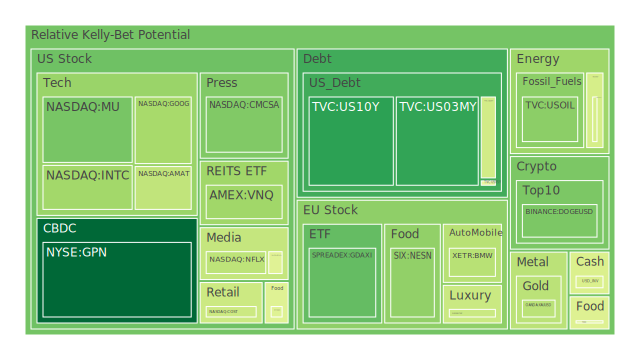
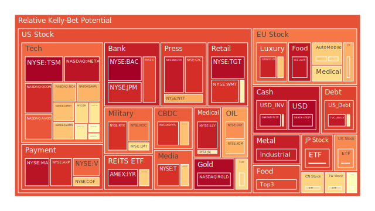
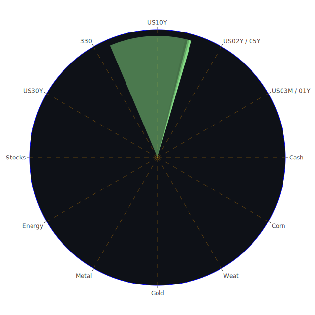

# **投資商品泡沫分析**

當前全球金融市場在多重因素交織下，呈現複雜多變的格局。我們將深入剖析各類主要投資商品，評估其潛在的泡沫風險，並結合近期市場動態與宏觀經濟數據，提供客觀的觀察視角。我們的分析將秉持公正客觀的態度，將市場波動視為多種力量交互作用下的自然現象。

* **美國國債**

美國國債市場近期波動顯著，各期限債券的殖利率走勢反映出市場對未來經濟及政策預期的分歧。從數據來看，三年期美國國債（US03MY）的當前價格為4.340，其短期風險指標（D1）為0.220094，月平均風險分數（D30）為0.314602，顯示其風險水平相對溫和，但短期波動有所增加。一年期美國國債（US01Y）現價4.080，短期風險0.948035，顯著高於其月平均風險0.484398，暗示短期內市場對其定價存在較大不確定性或避險情緒的快速轉變。五年期美國國債（US05Y）現價3.990，其各期風險指標（D1, D7, D14, D30均為0.495440）呈現高度一致性，暗示市場對此期限債券的風險評估在中短期內相對穩定，但此穩定水平本身處於中等。

十年期美國國債（US10Y）現價4.380，短期風險0.212632，月平均風險0.445513，顯示長期債券殖利率的波動在短期內有所收斂，但整體風險仍不容小覷。三十年期美國國債（US30Y）現價4.850，短期風險0.448025，與月平均風險0.456388相近，處於中等偏高水平。值得注意的是，二年期美國國債（US02Y）現價3.880，其各期風險指標（D1, D7, D14為0.609932，D30為0.622607）均處於較高水平，反映出市場對未來兩年內利率路徑的高度不確定性，這通常與聯準會政策預期的搖擺有關。

從經濟學角度看，聯準會持續釋放鷹派信號，即便消費者物價指數年增率（CPIYOY）已降至2.40%，但整體資產負債表規模處於相對低位，聯邦基金有效利率（EFFR）成交量維持高檔，均顯示緊縮的貨幣政策環境。高收益債券利率高企，商業房地產及消費信貸的拖欠率上升，這些都是經濟承壓的信號。殖利率曲線方面，十年期與三個月期利差（US Yield 10Y-03M）為0.04，幾乎持平，歷史上這種極度平坦甚至倒掛的殖利率曲線往往被視為經濟衰退的前兆。然而，心理學層面，投資者可能在「這次不一樣」的預期與歷史經驗的警示之間搖擺。博弈論觀點下，市場參與者正試圖預測聯準會的政策拐點，任何風吹草動都可能引發債市的連鎖反應。近期新聞中，關於聯準會官員鷹派言論以及對經濟風險上升的警告，都加劇了債券市場的敏感度。

* **美國零售股**

美國零售股，如沃爾瑪（WMT）現價97.430，其短期風險高達0.907215，月平均風險為0.796340；塔吉特（TGT）現價96.930，短期風險0.969546，月平均風險0.851495；家得寶（HD）現價364.860，短期風險0.582317，月平均風險0.663580；好市多（COST）現價1007.710，短期風險0.436071，月平均風險0.493934。這些數據普遍顯示零售股，尤其是非必需消費品相關的企業，面臨較高的風險。

經濟學上看，消費者信貸拖欠率上升，特別是信用卡信貸的拖欠率處於高位，直接削弱了消費者的購買力。社會學角度，若失業率上升（新聞提及PwC及Google等大型企業裁員），將進一步衝擊消費者信心。心理學上，對經濟前景的悲觀預期會促使消費者縮減開支，優先滿足基本需求。近期新聞中AMC娛樂因上座率下降導致營收減少，也間接反映了消費者在非必需娛樂消費上的謹慎。儘管部分公司如迪士尼（DIS）提升了盈利預期，主要得益於其公園和串流媒體業務，但整體零售環境的壓力依然存在。高風險的零售股可能正在消化未來消費需求減弱的預期。

* **美國科技股**

美國科技股呈現分化格局。大型科技股如微軟（MSFT）現價438.170，短期風險0.694502，月平均風險0.664367；蘋果（AAPL）現價197.490，短期風險0.716961，月平均風險0.627633；谷歌（GOOG）現價155.750，短期風險0.373426，月平均風險0.646077；亞馬遜（AMZN）現價192.080，短期風險0.687759，月平均風險0.771980；Meta（META）現價598.010，短期風險0.954297，月平均風險0.911855。其中Meta的風險顯著偏高。

從經濟學視角，科技行業對利率敏感度較高，聯準會的鷹派立場對其估值構成壓力。然而，AI的革命性進展為部分科技股注入了強心劑。新聞中AMD（AMD）因AI動能強勁而發布樂觀財報，輝達（NVDA）執行長黃仁勳認為AI將影響所有工作，這些都凸顯了AI的巨大潛力。但同時，Super Micro因關稅和經濟不確定性下調營收預期，導致股價下跌，以及Arista Networks財報優於預期但股價仍下跌，顯示市場對科技股的預期非常高，任何不及預期的消息都可能引發拋售。心理學上，AI的熱潮可能帶有非理性成分，投資者需警惕概念炒作與實際盈利能力的脫節。博弈論角度，科技巨頭在AI領域的軍備競賽，以及中美科技摩擦（如AMD預計美國對中國晶片出口限制將影響其15億美元營收），都增加了行業的不確定性。納斯達克指數（NDX）現價20063.570，短期風險0.717255，月平均風險0.754427，整體科技板塊風險處於中高位。

* **美國房地產指數**

美國房地產指數相關的ETF，如VNQ現價88.570，短期風險0.363091，月平均風險0.447712；IYR現價93.740，短期風險0.962684，月平均風險0.808520；RWO現價43.660，短期風險0.667436，月平均風險0.485692。數據顯示房地產投資信託基金（REITs）的風險水平不一，但整體而言，IYR的風險顯著偏高。

經濟學上，三十年期固定抵押貸款利率高達6.76%，遠高於去年同期的2.94%，大幅增加了購房成本，抑制了需求。商業房地產拖欠率處於相對高位，顯示商業地產市場面臨困境。聯準會的緊縮政策以及整體經濟前景的不確定性，也對房地產市場構成壓力。社會學角度，居家辦公趨勢的延續可能改變對商業辦公空間的需求，而高房價和高利率則可能加劇年輕一代的住房困境。心理層面，對房價持續上漲的預期已經減弱，甚至出現悲觀情緒。歷史上，房地產市場的調整往往伴隨著更廣泛的經濟下行。

* **加密貨幣**

比特幣（BTCUSD）現價103100.000，短期風險0.538207，月平均風險0.443895。以太幣（ETHUSD）現價2193.270，短期風險0.541726，月平均風險0.536853。狗狗幣（DOGEUSD）現價0.198，短期風險0.312261，月平均風險0.473543。加密貨幣市場的風險評分整體處於中等偏高水平，且波動性較大。

經濟學上，加密貨幣作為一種高風險資產，其價格容易受到市場流動性和風險偏好的影響。聯準會緊縮政策通常不利於加密貨幣。然而，部分投資者將其視為對沖法定貨幣貶值或地緣政治風險的工具。社會學層面，加密貨幣社群的共識和熱情對其價格有重要影響，但同時也使其容易受到市場操縱和監管政策變化的衝擊。心理學上，FOMO（害怕錯過）和FUD（恐懼、不確定、懷疑）情緒交替主導市場，導致價格劇烈波動。博弈論觀點，早期採用者與後期追隨者的利益博弈，以及監管機構與市場參與者之間的博弈，共同塑造了加密貨幣的發展路徑。新聞中提到特斯拉「Robotaxi」商標因過於通用而被拒，雖然與加密貨幣無直接關聯，但反映了監管機構對新興技術和概念的審慎態度，這種態度也可能延伸至加密貨幣領域。

* **金/銀/銅**

黃金（XAUUSD）現價3318.960，短期風險0.407834，月平均風險0.429511。白銀（XAGUSD）現價32.460，短期風險0.948585，月平均風險0.857694。銅（COPPER）現價4.590，短期風險0.510278，月平均風險0.695025。黃金風險相對穩定在中等水平，白銀風險顯著偏高，銅的風險則從高位有所回落但仍不可忽視。

經濟學上，黃金通常被視為避險資產和抗通膨工具。當前CPIYOY雖回落，但聯準會鷹派立場、地緣政治不確定性（如烏克蘭無人機襲擊莫斯科、以色列與胡塞武裝衝突升級）以及對經濟衰退的擔憂，都可能支撐金價。金油比（GOLD OIL RATIO）為55.21，高於上月和去年同期，顯示黃金相對石油表現強勢。白銀兼具貴金屬和工業金屬屬性，其高風險可能與工業需求預期的波動以及投機資金的湧入有關。銅作為重要的工業金屬，其價格波動與全球經濟增長預期密切相關，近期風險回落可能反映了對經濟前景的些許改善或供應鏈問題的緩解，但月平均風險仍高，顯示中長期不確定性。心理學上，亂世買黃金的傳統觀念，以及對白銀「窮人的黃金」的認知，都影響著投資者行為。

* **黃豆 / 小麥 / 玉米**

黃豆ETF（SOYB）現價21.610，短期風險0.899152，月平均風險0.576354，短期風險顯著上升。小麥ETF（WEAT）現價4.510，短期風險0.471437，月平均風險0.416200。玉米ETF（CORN）現價18.160，短期風險0.536711，月平均風險0.459343。農產品價格波動受天氣、地緣政治、供應鏈以及投機等多重因素影響。

經濟學上，全球糧食供應格局因俄烏衝突、極端天氣事件而變得脆弱。近期黃豆短期風險急劇拉高，可能與特定的供應擔憂或季節性因素有關。社會學層面，糧食安全是各國政府高度關注的問題，相關政策可能引發市場波動。心理學上，對糧食短缺的恐慌可能導致囤積行為和價格的非理性上漲。新聞中提及南非因雞隻挨餓而進行撲殺，雖非直接關聯，但反映了全球供應鏈和農業生產面臨的挑戰。歷史上，糧食危機往往伴隨著社會動盪和人道主義災難。

* **石油/ 鈾期貨UX\!**

美國原油（USOIL）現價60.060，短期風險0.334085，月平均風險0.176018，整體風險水平相對較低且穩定。鈾期貨（UX1\!）現價69.650，短期風險0.454482，月平均風險0.484692，處於中等風險水平。

經濟學上，原油價格受OPEC+產量政策、全球經濟需求、地緣政治風險（如美國與胡塞武裝達成停火協議的消息可能緩和油價上行壓力）以及能源轉型等多重因素影響。當前油價處於相對低位，可能反映了市場對全球經濟增長放緩的擔憂。鈾作為核燃料，其價格與核電發展前景密切相關。在能源轉型和追求能源獨立的背景下，核能的戰略地位有所提升，但其發展仍面臨環保、安全等多方面挑戰。社會學角度，能源價格直接影響民生和工業成本，對通膨有顯著傳導效應。心理層面，對能源短缺的恐懼和對新能源技術的期望，共同影響著市場情緒。

* **各國外匯市場**

美元兌日圓（USDJPY）現價145.920，短期風險0.982922，月平均風險0.599638，風險極高且短期內急劇上升。歐元兌美元（EURUSD）現價1.120，短期風險0.972542，月平均風險0.778569，風險亦非常高。英鎊兌美元（GBPUSD）現價1.320，短期風險0.463780，月平均風險0.446803，風險中等。澳元兌美元（AUDUSD）現價0.640，短期風險0.564891，月平均風險0.419310，短期風險有所抬升。

經濟學上，匯率波動主要受各國經濟基本面、利率差異、央行政策以及資本流動影響。美元兌日圓的極高風險，可能與日本央行緩慢的貨幣政策正常化步伐，以及市場對美日利差持續擴大的預期有關。美國聯準會的鷹派立場持續支撐美元強勢，而歐洲央行在通膨壓力下政策空間受限，導致歐元承壓。外匯市場的劇烈波動，也反映了全球經濟格局的重塑和地緣政治風險的溢出效應。心理學上，對一國經濟前景的信心直接影響其貨幣價值。博弈論視角，各國央行在制定貨幣政策時，既要考慮本國經濟狀況，也要權衡對全球金融市場的影響，這是一場複雜的博弈。

* **各國大盤指數**

納斯達克指數（NDX）已在前述科技股部分提及，風險中高。台灣加權股價指數相關ETF（0050）現價172.600，短期風險0.646498，月平均風險0.711133，風險處於中高水平。德國DAX指數（GDAXI）現價23362.200，短期風險0.279619，月平均風險0.545998，短期風險顯著下降但中長期仍有壓力。英國富時100指数（FTSE）現價8538.900，短期風險0.779001，月平均風險0.592454，風險較高。法國CAC40指數（FCHI）現價7702.100，短期風險0.721647，月平均風險0.597658，風險較高。滬深300指數（000300）現價3852.900，短期風險0.659628，月平均風險0.510527，風險中等偏高。日經225指數（JPN225）現價37458.100，短期風險0.880245，月平均風險0.721287，風險非常高。

全球主要股指普遍面臨壓力，反映了對全球經濟增長放緩、通膨持續、地緣政治緊張以及貨幣政策緊縮的共同擔憂。新聞中提及德國議會挫敗準總理梅爾茨，可能引發政治不確定性，影響德國股市。中國市場則在努力平衡經濟增長與結構性改革。日本股市的高風險可能與日圓大幅貶值帶來的輸入性通膨壓力以及後續政策調整的不確定性有關。各國市場的表現，是其內部經濟、社會、政治因素與全球宏觀環境相互作用的結果。

* **美國半導體股**

除已提及的NVDA、AMD、INTC外，應用材料（AMAT）現價156.000，短期風險0.416696，月平均風險0.771103，短期風險回落但長期仍高。科磊（KLAC）現價703.330，短期風險0.602933，月平均風險0.489225。美光科技（MU）現價85.150，短期風險0.305802，月平均風險0.374818，風險相對較低。高通（QCOM）現價145.100，短期風險0.919596，月平均風險0.791410，風險很高。博通（AVGO）現價207.770，短期風險0.850554，月平均風險0.824385，風險很高。台積電（TSM）現價175.220，短期風險0.988623，月平均風險0.985330，風險極高。

半導體行業身處AI革命的核心，同時也位於中美科技競爭的前沿。AMD的強勁財報與NVDA對AI前景的樂觀展望，為行業帶來動力。但Super Micro因關稅和經濟不確定性下調營收預期，以及AMD預計美國對中國晶片出口限制將帶來巨大營收影響，都凸顯了行業面臨的挑戰。台積電作為全球晶圓代工龍頭，其極高的風險評分可能反映了地緣政治風險、產能過剩擔憂以及終端需求不確定性等多重因素。高通和博通的高風險則可能與智慧型手機市場的飽和、競爭加劇以及對宏觀經濟的敏感性有關。半導體行業的博弈不僅在企業間，更在大國之間展開，其走勢對全球科技產業鏈具有指標意義。

* **美國銀行股**

摩根大通（JPM）現價253.470，短期風險0.924060，月平均風險0.729714。美國銀行（BAC）現價41.600，短期風險0.995790，月平均風險0.963009。花旗集團（C）現價71.640，短期風險0.879184，月平均風險0.860910。第一資本金融（COF）現價189.500，短期風險0.673875，月平均風險0.480673。美國銀行股普遍處於高風險區間，尤其是美國銀行和摩根大通。

經濟學上，銀行業績與利率水平和經濟景氣度密切相關。聯準會的鷹派立場在初期可能擴大淨息差，但若經濟因此陷入衰退，則信貸損失將大幅增加。目前，信用卡、商業房地產及消費貸款的拖欠率均處於高位，對銀行資產品質構成威脅。聯準會數據顯示，銀行總存款處於相對高位，但與外國相關辦事處的淨應付款項也處於高位，顯示跨境資金流動活躍。DBS銀行因不確定性增加而提高備抵呆帳準備金，雖第一季利潤超預期，但也反映了銀行業對未來風險的警惕。歷史上，銀行危機往往是系統性金融風險的導火索。

* **美國軍工股**

洛克希德馬丁（LMT）現價474.530，短期風險0.632503，月平均風險0.742387。諾斯洛普格魯曼（NOC）現價484.370，短期風險0.801226，月平均風險0.744255。雷神技術（RTX）現價128.670，短期風險0.906954，月平均風險0.756821。美國軍工股風險普遍較高。

經濟學和地緣政治角度，全球地緣政治緊張局勢，如烏克蘭衝突、中東衝突持續，以及大國競爭加劇，均推升了國防開支預期，利好軍工企業。然而，高企的股價也可能已織入了這些預期。社會學上，對國家安全的重視程度上升，可能為軍工行業提供持續的訂單。心理學層面，衝突和不安全感會刺激避險情緒，但對軍工股而言，這反而可能成為股價催化劑。博弈論視角，國際軍備競賽的動態直接影響軍工企業的景氣程度。

* **美國電子支付股**

Visa（V）現價351.270，短期風險0.827408，月平均風險0.760129。萬事達卡（MA）現價567.120，短期風險0.960894，月平均風險0.801220。PayPal（PYPL）現價70.480，短期風險0.910857，月平均風險0.949147。Global Payments（GPN）現價79.570，短期風險0.102147，月平均風險0.595339，風險相對較低。美國運通（AXP）現價283.660，短期風險0.912056，月平均風險0.785452。電子支付行業巨頭普遍風險較高，PayPal尤甚，而Global Payments是個例外。

經濟學上，電子支付行業受益於消費從現金轉向電子的長期趨勢，但其收入與消費支出密切相關，因此也受到宏觀經濟波動的影響。消費者信貸狀況惡化可能影響交易量和壞帳風險。行業競爭激烈，金融科技的創新也帶來挑戰。社會學角度，支付習慣的改變是深刻的社會變革。心理學上，便捷性和安全性是用戶選擇支付方式的重要考量。

* **美國藥商股**

嬌生（JNJ）現價155.660，短期風險0.574501，月平均風險0.274075，短期風險有所上升但中長期仍相對較低。默克（MRK）現價77.650，短期風險0.575284，月平均風險0.494023。禮來（LLY）現價751.450，短期風險0.939994，月平均風險0.934047，風險極高。諾和諾德（NVO）現價64.850，短期風險0.670321，月平均風險0.671858。

經濟學上，醫藥行業具有一定的防禦性，因醫療需求相對剛性。然而，藥品專利懸崖、藥價談判壓力、研發失敗風險等因素也影響行業表現。禮來和諾和諾德因其在減肥藥和糖尿病治療領域的突破性產品而備受市場追捧，但也因此積聚了較高的估值風險。嬌生和默克作為傳統大型藥企，風險相對較為可控。新聞中，GoodRx因營收符合預期股價上漲，顯示市場對醫藥相關服務企業的關注。

* **美國影視股**

迪士尼（DIS）現價105.120，短期風險0.670735，月平均風險0.699936。Netflix（NFLX）現價1144.430，短期風險0.410431，月平均風險0.474012。派拉蒙全球（PARA）現價11.680，短期風險0.476563，月平均風險0.508544。

經濟學上，影視行業面臨串流媒體競爭加劇、內容製作成本上升、廣告收入波動等挑戰。迪士尼近期提升盈利預期，主要得益於公園業務和串流媒體成本控制，但其傳統媒體業務仍面臨壓力。Netflix的風險相對較低，可能與其在全球市場的領先地位和持續的內容投入有關。派拉蒙全球的風險則反映了其在行業轉型中的掙扎。社會學角度，觀影習慣的改變（從院線到家庭娛樂）深刻影響行業格局。心理學上，優質內容的吸引力是核心競爭力。

* **美國媒體股**

紐約時報（NYT）現價52.610，短期風險0.729353，月平均風險0.732937。福斯公司（FOX）現價46.960，短期風險0.945371，月平均風險0.835620。康卡斯特（CMCSA）現價34.220，短期風險0.318335，月平均風險0.477752。美國媒體股風險普遍較高，尤其是福斯公司。康卡斯特風險相對較低。

經濟學上，傳統媒體面臨數位化轉型的巨大挑戰，廣告收入向線上平台轉移，訂閱模式的競爭也日益激烈。紐約時報在數位化轉型方面取得一定成效，但仍面臨挑戰。福斯公司的高風險可能與其業務結構和政治敏感性有關。康卡斯特作為綜合性媒體和電信巨頭，業務相對多元化，風險也因此較低。社會學角度，媒體在塑造公眾輿論和傳播資訊方面扮演重要角色，但也面臨信任危機。

* **石油防禦股**

埃克森美孚（XOM）現價106.070，短期風險0.721175，月平均風險0.766959。西方石油（OXY）現價41.440，短期風險0.770814，月平均風險0.752003。石油防禦股通常指大型綜合性石油公司，其業務鏈完整，在油價波動時具有一定抗風險能力。然而，當前這兩家公司的風險評分均處於較高水平。

經濟學上，雖然油價目前處於相對低位（USOIL約60美元），但這些大型石油公司的股價可能已反映了對未來能源市場格局的預期，包括傳統能源與新能源的博弈、地緣政治風險以及ESG（環境、社會和治理）投資趨勢的影響。社會學角度，能源轉型對這些傳統能源巨頭構成長期挑戰。

* **金礦防禦股**

皇家黃金（RGLD）現價178.720，短期風險0.976208，月平均風險0.918345。金礦股通常被視為黃金價格的槓桿，同時也具有一定的防禦屬性。然而，皇家黃金的風險評分極高。

經濟學上，金礦公司的盈利能力除了受金價影響外，還與開采成本、礦山儲量、政治風險等多種因素相關。儘管黃金本身被視為避險資產，但金礦股的波動性可能遠大於黃金本身。皇家黃金的極高風險可能反映了市場對其特定基本面或未來金價走勢的極端預期。

* **歐洲奢侈品股**

LVMH集團（MC）現價487.300，短期風險0.434160，月平均風險0.472972。開雲集團（KER）現價175.460，短期風險0.930427，月平均風險0.720718。愛馬仕（RMS）現價2445.000，短期風險0.680264，月平均風險0.688255。歐洲奢侈品股表現分化，LVMH風險相對較低，開雲集團風險很高，愛馬仕居中。

經濟學上，奢侈品消費對經濟景氣度高度敏感，尤其依賴高淨值人群的消費能力和意願。全球經濟增長放緩、財富效應減弱以及地緣政治不確定性都可能影響奢侈品銷售。中國市場作為奢侈品消費的重要引擎，其經濟復甦力度對行業至關重要。開雲集團的高風險可能與其旗下品牌（如Gucci）的轉型挑戰有關。LVMH和愛馬仕憑藉其強大的品牌力和多元化的產品組合，展現出更強的韌性。

* **歐洲汽車股**

寶馬（BMW）現價78.240，短期風險0.400936，月平均風險0.569336。賓士（MBG）現價50.870，短期風險0.662584，月平均風險0.509246。保時捷（PAH3）現價37.040，短期風險0.682088，月平均風險0.521422。歐洲汽車股風險普遍處於中等偏高水平。

經濟學上，汽車行業正經歷向電動化和智慧化的深刻轉型，傳統汽車製造商面臨來自新興電動車企業的激烈競爭，同時也需要投入巨額資金進行研發和產線改造。供應鏈問題（如晶片短缺的後續影響）、能源價格波動、以及各國環保政策的變化，都對汽車行業構成挑戰。新聞中提及福特汽車因關稅不確定性暫停發布業績展望，也反映了行業面臨的宏觀壓力。

* **歐美食品股**

可口可樂（KO）現價71.170，短期風險0.474447，月平均風險0.724743。卡夫亨氏（KHC）現價28.490，短期風險0.657632，月平均風險0.754378。雀巢（NESN）現價87.060，短期風險0.341881，月平均風險0.550768。聯合利華（ULVR）現價4701.000，短期風險0.951255，月平均風險0.950482，風險極高。

經濟學上，食品飲料行業通常被視為防禦性行業，因其需求相對穩定。然而，成本上漲（原材料、運輸、包裝）、消費者偏好轉變（對健康、可持續產品的需求增加）以及零售渠道的議價能力，都對食品公司的盈利能力構成影響。聯合利華的極高風險可能與其特定的業務重組、成本壓力或市場競爭有關。雀巢的風險相對較低，顯示其品牌力和多元化業務的優勢。可口可樂和卡夫亨氏的風險處於中高水平，反映了行業普遍面臨的挑戰。

# **宏觀經濟傳導路徑分析**

當前宏觀經濟的核心驅動力來自聯準會的貨幣政策、持續的地緣政治緊張以及全球供應鏈的重塑。聯準會資產負債表規模處於低位，且官員持續釋放鷹派信號，意圖控制通膨預期，這導致全球流動性收緊，推高融資成本。高收益債券利率高企，信用卡、商業地產及消費貸款的拖欠率攀升，是信貸環境惡化的直接體現。這條路徑的傳導效應是：企業借貸成本上升，投資意願下降，擴張放緩；消費者因借貸成本增加和對未來收入預期轉差而減少支出，尤其是非必需品消費。這將首先衝擊對利率敏感的行業，如房地產、汽車，以及依賴消費者支出的零售業、影視娛樂業。

地緣政治風險（烏克蘭、中東、中美關係等）通過多種途徑影響經濟。首先是能源和糧食等大宗商品的供應和價格波動，直接影響通膨水平和企業成本。其次是全球供應鏈的擾動和重構，新聞中提及的關稅問題（如Super Micro擔憂關稅影響，福特暫停展望，歐盟考慮對美國商品徵收關稅）正是體現。企業被迫調整供應鏈佈局，增加運營成本和不確定性。這種不確定性會抑制企業的長期投資，並可能導致全球貿易格局的碎片化。

勞動力市場的變化也是重要的傳導路徑。新聞中PwC、Google等企業的裁員，雖然目前美國整體失業率可能仍處於低位，但這些領先企業的動作可能預示著更廣泛的就業市場降溫。失業率上升或薪資增長放緩將直接打擊消費者信心和支出能力，進一步加劇經濟下行壓力。

從博弈論角度看，聯準會的政策制定是一場與市場預期的博弈。若市場過度預期政策轉向鴿派，可能導致金融條件過早放鬆，反而助長通膨；若政策過度緊縮，則可能引發不必要的經濟衰退。各國政府在貿易和產業政策上的博弈（如晶片管制、關稅壁壘）則加劇了全球經濟的複雜性。

從心理學角度，持續的負面新聞（裁員、地緣衝突、經濟數據不佳）會強化市場的悲觀預期，形成負向反饋循環。投資者風險偏好下降，資金流向避險資產，高風險資產估值承壓。

歷史經驗表明，當殖利率曲線平坦或倒掛（如當前10Y-3M利差極小），疊加信貸條件收緊和企業盈利預期下調時，經濟衰退的風險顯著增加。目前的宏觀環境具備了這些特徵，需要密切關注後續經濟數據的演變。

# **微觀經濟傳導路徑分析**

在企業層面，宏觀經濟的壓力正通過多種方式傳導。首先是融資成本的上升。對於高負債經營或依賴外部融資進行擴張的企業，利率上升直接增加了財務負擔，侵蝕了利潤空間，甚至可能引發債務違約風險。這在成長型科技股、部分房地產企業和資本密集型製造業中尤為明顯。

其次是需求端的萎縮。消費者因實際收入增長乏力、儲蓄消耗以及對未來經濟前景的擔憂而變得更加謹慎。這直接影響零售業（如WMT、TGT業績壓力）、非必需消費品（如汽車、奢侈品銷售放緩）、影視娛樂（如AMC上座率下降）等行業。企業客戶也可能因自身經營壓力而削減資本開支和採購訂單，影響B2B企業的業績。

再次是成本端的壓力。雖然部分大宗商品價格有所回落，但勞動力成本、供應鏈重構帶來的物流和採購成本，以及合規成本（如環保、數據安全）仍然高企。這對利潤率本已不高的行業（如部分製造業、食品加工業）構成擠壓。新聞中Super Micro提及關稅導致的成本上升，是供應鏈問題的一個縮影。

行業競爭格局的變化也是重要的微觀傳導路徑。在經濟下行週期，行業龍頭企業憑藉其規模優勢、品牌實力、技術壁壘和更強的融資能力，往往能更好地抵禦風險，甚至可能藉機擴大市場份額。而中小型企業或競爭力較弱的企業則可能面臨更大的生存壓力。例如，在AI領域，NVDA和AMD等巨頭持續受益，而一些缺乏核心技術或應用場景不明確的小公司則可能被淘汰。電子支付領域，儘管整體承壓，但GPN的風險顯著低於PYPL、V、MA，可能反映了其業務模式或市場定位的差異。

從博弈論角度，企業間的價格戰、市場份額爭奪在經濟下行期可能更趨激烈。供應商和採購商之間的議價能力也會發生轉變。例如，當終端需求疲軟時，零售商對供應商的議價能力可能增強。

心理學層面，企業管理層的信心和預期會影響其投資決策和經營策略。若管理層普遍悲觀，可能會縮減投資、裁員，進一步加劇經濟下行。反之，若部分企業家能洞察危機中的機遇，果斷投入，則可能實現逆勢增長。

歷史上，經濟下行期往往是行業洗牌和優勝劣汰的過程。那些能夠有效控制成本、持續創新、並擁有穩健現金流的企業，更有可能穿越週期，迎來新的發展機遇。

# **資產類別間傳導路徑分析**

資產類別之間的價格傳導是複雜且動態的。首先，債券市場的波動，特別是美國國債殖利率的變化，對其他資產類別具有基礎性的影響。當國債殖利率上升（如近期趨勢），無風險利率的抬高會增加所有風險資產的折現率，從而對股票估值構成壓力，尤其是高成長、高估值的科技股。同時，較高的債券殖利率也可能吸引部分資金從股市流向債市，尋求相對更安全的收益。

股票市場內部，不同板塊之間的傳導也值得關注。例如，科技股的AI熱潮（如NVDA、AMD）可能吸引大量資金，導致其他傳統行業或非AI概念股的資金流出，形成「抽血效應」。若AI泡沫破裂，則可能引發科技股整體回調，並通過市場情緒傳導至其他板塊。軍工股的上漲與地緣政治緊張局勢密切相關，而地緣政治風險的升級可能打壓整體市場的風險偏好，導致避險資產（如黃金，儘管其自身風險也不低）受到追捧。

商品市場與股債市場之間也存在傳導。原油、銅等工業品價格的上漲會增加企業生產成本，推高通膨預期，進而影響聯準會的貨幣政策和債券殖利率，最終傳導至股市。黃金價格的變動通常與避險情緒、美元走勢和實際利率水平相關。金油比（Gold Oil Ratio）和金銅比（Gold Copper Ratio）的變化，可以反映市場對通膨、經濟增長和避險需求的相對權衡。當前金油比處於歷史相對高位，顯示黃金相對原油強勢，可能暗示市場對經濟前景的擔憂或避險需求的提升。

外匯市場的波動是全球資本流動和風險偏好的重要體現。美元的強勢（如USDJPY、EURUSD所反映的）通常伴隨著新興市場貨幣的貶值和資本外流壓力，也可能對美國出口企業的盈利構成不利影響。日圓大幅貶值可能刺激日本出口，但也帶來輸入性通膨，迫使日本央行調整政策，進而影響全球金融市場。

加密貨幣市場與傳統金融市場的聯動性近年來有所增強。在市場風險偏好較高時，加密貨幣可能與科技股等成長型資產同向上漲；而在避險情緒升溫時，則可能出現同步下跌。然而，其「數位黃金」的敘事有時也會使其在特定情境下表現出一定的避險屬性，但其高波動性和監管不確定性使其難以成為主流的避險工具。

房地產市場的下行壓力，如三十年期抵押貸款利率高企和商業地產拖欠率上升，不僅直接影響REITs等相關資產，還可能通過財富效應影響消費者支出，進而傳導至零售、消費等股票板塊。同時，房地產市場的困境也可能增加銀行系統的信貸風險，影響銀行股表現。

從博弈論角度看，不同資產類別的投資者在進行資產配置時，會根據對未來宏觀經濟、政策走向和各類資產相對吸引力的判斷，進行動態調整。例如，若預期經濟衰退，資金可能從股票轉向債券或黃金；若預期通膨加劇，資金可能流向抗通膨資產。這種跨資產的資金流動本身就會強化或逆轉某些趨勢。

心理學上，羊群效應和趨勢跟隨在資產價格傳導中扮演重要角色。某一資產類別的強勢或弱勢表現，可能吸引更多資金流入或流出，從而放大初始的價格波動，並可能蔓延至相關性較高的其他資產。

# **投資建議**

基於上述分析，我們在當前市場環境下，提出以下三種不同風險偏好的資產配置建議。請注意，所有配置比例均為建議，投資者應根據自身情況進行調整。

**一、穩健型配置（總計100%）**

此配置旨在保本增值，優先考慮風險控制，適合風險承受能力較低的投資者。

1. **短期美國國債（例如US03MY或US01Y，考慮到US01Y短期風險較高，可偏重US03MY或更短期限品種，若無則謹慎選擇US03MY）：35%**  
   * 理由：儘管殖利率曲線平坦，且短期債券也存在一定波動，但在避險需求上升時，高品質短期政府債券仍是相對安全的選擇。US03MY的風險評分相對溫和。  
2. **精選防禦性股票（例如嬌生JNJ，雀巢NESN）：35%**  
   * 理由：醫藥和必需消費品行業在經濟下行週期中通常表現出較強的韌性。嬌生（JNJ）和雀巢（NESN）的月平均風險相對可控，且業務基本面較為穩健。需關注其短期風險指標的變化。  
3. **黃金（XAUUSD）：30%**  
   * 理由：在地緣政治不確定性持續、全球經濟增長面臨挑戰以及市場對潛在衰退擔憂的背景下，黃金作為傳統避險資產，仍具配置價值。其風險評分處於中等水平，相對其他高風險資產仍有優勢。

**二、成長型配置（總計100%）**

此配置旨在追求較高的長期回報，同時願意承擔中等程度的市場波動，適合有一定風險承受能力的投資者。

1. **精選科技股（例如谷歌GOOG，微軟MSFT，或風險相對較低的美光科技MU）：40%**  
   * 理由：科技創新，特別是AI領域的發展，仍是未來經濟增長的重要引擎。谷歌和微軟在AI領域佈局深入，基本面良好，其風險評分雖不低但尚可接受。美光科技（MU）的風險評分在半導體股中相對較低，可作為分散選擇。  
2. **美國大盤指數ETF（例如追蹤S\&P 500的ETF，若無則參考NDX，但需注意NDX風險較高）：30%**  
   * 理由：通過投資大盤指數ETF可以實現對市場整體的分散投資，捕捉市場長期增長潛力。考慮到納斯達克指數（NDX）風險偏高，若有更廣泛的S\&P 500指數ETF則更佳。  
3. **歐洲奢侈品龍頭（例如LVMH集團MC）：30%**  
   * 理由：LVMH集團作為全球奢侈品行業的領導者，品牌力強大，歷史業績證明其具有穿越週期的能力。其當前風險評分在同類股中相對較低，且奢侈品消費在經濟復甦期往往表現突出。

**三、高風險型配置（總計100%）**

此配置旨在追求最大化的潛在回報，投資者需有較強的風險承受能力和心理素質，能夠承受較大的市場波動和潛在損失。

1. **精選高成長半導體股（例如輝達NVDA，超微AMD，或風險極高但潛力也被市場關注的台積電TSM）：40%**  
   * 理由：半導體是AI和未來科技發展的基石，頭部企業具有高成長潛力。輝達和超微在AI晶片領域佔據領先地位。台積電雖然風險極高，但其行業地位獨特。此類股票波動巨大，需謹慎。  
2. **加密貨幣（例如比特幣BTCUSD，以太幣ETHUSD）：30%**  
   * 理由：加密貨幣作為新興資產類別，具有較高的潛在回報和極高的風險。比特幣和以太幣是市場上規模和共識度最高的加密貨幣，適合願意承擔高風險以博取高收益的投資者。其價格波動劇烈，風險極高。  
3. **高風險美國銀行股或電子支付股（例如美國銀行BAC，PayPal PYPL）：30%**  
   * 理由：銀行股在高利率環境下，若能有效控制信貸風險，則有盈利改善空間；電子支付行業受益於數位化趨勢。美國銀行（BAC）和PayPal（PYPL）的風險評分均非常高，反映市場對其未來表現存在較大分歧，但也可能蘊含困境反轉的機會，或在市場情緒好轉時有較大彈性。

# **風險提示**

投資有風險，市場總是充滿不確定性。本報告所有分析和建議僅基於當前獲取的有限數據和信息，僅供參考之用，不構成任何投資要約或承諾。過去的表現不預示未來的結果。投資者應充分理解相關風險，並根據自身的風險承受能力、投資目標、財務狀況以及獨立的專業意見，謹慎做出投資決策。任何投資決策產生的後果均由投資者自行承擔。市場情況瞬息萬變，本報告的觀點可能隨市場變化而調整，恕不另行通知。請務必警惕各類資產的泡沫風險，理性對待市場波動。

 
Daily Buy Map:

 
Daily Sell Map:

 
Daily Radar Chart:

 
