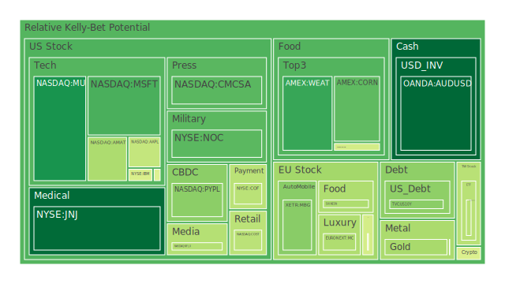
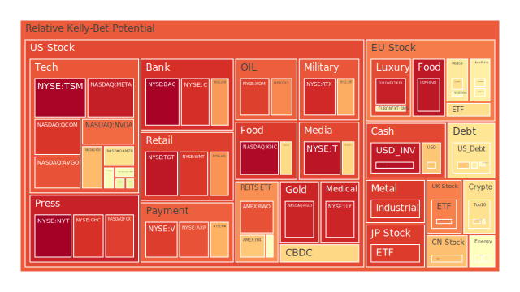
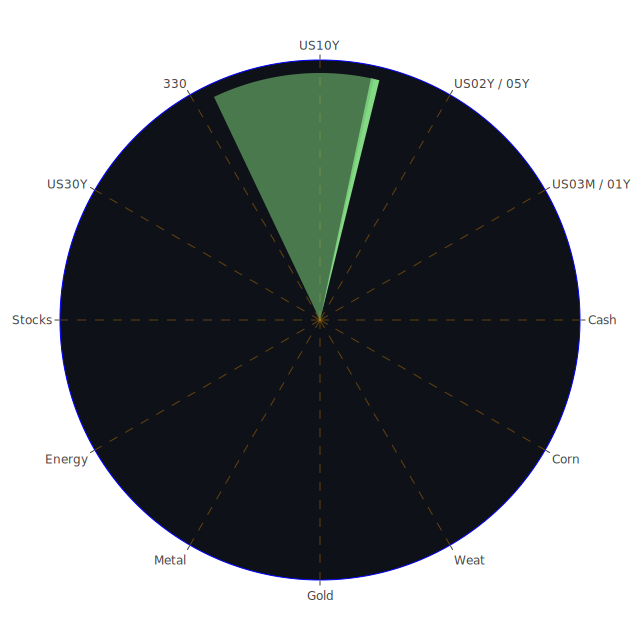

# **投資商品泡沫分析**

在當前錯綜複雜的全球經濟環境下，各類資產的價格波動與潛在泡沫風險成為市場參與者高度關注的焦點。本報告旨在基於提供的數據，秉持公正客觀的立場，深入剖析各大類投資商品的現狀，並探討其潛在的風險與機會。我們將從經濟學、社會學、心理學、博弈論等多個維度，結合歷史數據與新聞事件，進行全面的分析。

首先，我們觀察到一系列資產的泡沫指數呈現出值得警惕的訊號。泡沫指數，無論是單日（D1）或是平均值（D7, D14, D30），越高意味著該資產脫離基本面的可能性越大，潛在的下行風險也隨之增加。

* **美國國債** 美國國債市場近期呈現出微妙的動態。以美國十年期國債（US10Y）為例，其當日泡沫指數（D1）在2025年5月10日為0.3618，相較於前兩日的0.3511和0.2126有所波動，但仍處於一個中等水平。然而，觀察其30日平均泡沫指數（D30）約為0.44至0.45，顯示過去一個月內市場對其定價的偏離程度整體高於當前。短期國債如三個月期（US03MY）的D1指數在5月10日為0.5291，高於十年期，且其D30約為0.31，顯示短期波動加劇。一年期（US01Y）、二年期（US02Y）、五年期（US05Y）乃至三十年期（US30Y）國債均呈現不同程度的泡沫指數讀數，其中二年期國債的D1指數達到0.6099，且D30亦在0.6以上，顯示短期至中期債券的風險溢價可能被壓縮。

從經濟學角度看，聯準會的貨幣政策是影響國債價格的核心因素。提供的FED經濟關鍵數據顯示，EFFR成交量上升而RRP下降，可能暗示市場流動性偏好發生轉變。聯準會總資產處於相對低位，顯示縮表仍在進行或已產生效果。然而，多項信用違約指標，如信用卡壞帳率、商業地產和消費貸款拖欠率均處於高位，這通常會增加避險情緒，理論上利好國債。但與此同時，高收益債券利率亦處於高位，反映市場對風險的定價提升。聯準會近期兩次鷹派發言，暗示短期內政策轉向鴿派的可能性不大。這使得國債市場處於多空交織的狀態：一方面經濟放緩的擔憂和避險需求支撐債券價格，另一方面持續的緊縮預期和高通膨（儘管CPI年增率已從去年的3.48%降至2.40%）壓力限制其上行空間。歷史上，當經濟衰退預期增強而央行尚未大幅降息時，債券市場常出現劇烈波動。當前10年期與3個月期美債殖利率差（US Yield 10Y-03M）為0.06，雖已轉正，但不久前仍處於倒掛狀態，歷史經驗告訴我們這通常是經濟衰退的先行指標。

心理學層面，市場對於聯準會政策路徑的預期高度敏感，任何風吹草動都可能引發債券價格的波動。博弈論觀點下，投資者在預判聯準會行動與經濟數據之間進行博弈，試圖領先市場做出反應。新聞事件中，聯準會維持利率不變並警告經濟風險上升的消息（2025-05-08, negative 93%），以及英格蘭銀行可能降息的預期（negative 87%），都對債券市場情緒產生影響。

* **美國零售股** 沃爾瑪（WMT）和塔吉特（TGT）等大型零售股的泡沫指數持續偏高。沃爾瑪在5月10日的D1指數高達0.9037，其D30也達到0.80左右。塔吉特的D1指數更是達到0.9564，D30為0.85。家得寶（HD）的D1為0.7762，D30約0.67。好市多（COST）D1為0.4330，D30約0.49。這些數據表明，市場對大型零售商的估值可能已達較高水平。

經濟學上看，零售業績與消費者信心、就業市場及可支配收入密切相關。FED數據顯示消費者貸款拖欠率處於高位，這對零售業而言並非積極信號。儘管如此，大型零售商憑藉其規模效應、供應鏈管理能力以及在通膨環境下對必需品的定價能力，可能仍受到部分投資者青睞。歷史上，在經濟不確定性增加但尚未陷入嚴重衰退的時期，一些具有防禦性的零售股（如沃爾瑪）可能因其穩定的現金流而表現相對抗跌。然而，高泡沫指數警示我們，這種預期可能已被過度計入股價。心理層面，品牌忠誠度和消費習慣的黏性可能支撐這些公司的市場份額，但若整體消費能力下滑，即便是龍頭企業也難免受到衝擊。新聞中關於AMC娛樂因上座率下降導致營收降低（negative 96%），間接反映了消費者在非必需品上的支出可能趨於謹慎。

* **美國科技股** 科技股板塊呈現顯著分化。以納斯達克100指數（NDX）為代表，其D1泡沫指數在5月10日為0.7178，D30為0.75，整體處於較高水平。蘋果（AAPL）D1為0.4477，D30約0.62；微軟（MSFT）D1為0.2796（相較前兩日大幅下降），D30約0.65；亞馬遜（AMZN）D1為0.6533，D30約0.76；谷歌（GOOG）D1為0.4944，D30約0.63。特斯拉（TSLA）D1為0.5247，D30約0.40，波動性較大。

經濟學角度，科技股尤其是成長型科技股，對利率變動極為敏感。高利率環境會增加其未來現金流的折現成本，從而壓低估值。FED持續的鷹派立場對此板塊構成壓力。然而，「AI浪潮」成為了重要的支撐因素。新聞中提到微軟敦促加速AI相關許可（positive 82%），以及輝達（NVIDIA）因傳言美國計劃廢除AI晶片限制而股價上漲（positive 75%，但此為05-08新聞），均反映了市場對AI前景的樂觀預期。谷歌削減全球業務部門約200名員工（negative 96%）則顯示了行業內部調整和成本控制的壓力。從歷史上看，科技泡沫並不罕見，例如2000年的互聯網泡沫。當前AI的熱潮是否會重蹈覆轍，取決於其盈利能力的兌現速度和廣度。心理學上，FOMO（害怕錯過）情緒在AI相關股票中尤為明顯。博弈論角度，企業在AI領域的軍備競賽以及投資者對龍頭企業的追逐，共同推高了部分股票的估值。

* **美國房地產指數** 美國房地產指數（VNQ）在5月10日的D1泡沫指數為0.5656，D30約為0.44。另一個房地產指數（IYR）的D1高達0.6970，D30約0.81。RWO的D1也高達0.8673，D30約0.49。這表明房地產投資信託（REITs）市場的泡沫風險正在積聚。

經濟學上，房地產市場與利率水平、信貸條件和經濟增長前景密切相關。FED數據顯示商業地產和一般房地產貸款拖欠率均處於高位，30年期固定抵押貸款利率高達6.76%，遠高於去年的3.00%。這些因素對房地產市場構成顯著壓力。歷史經驗表明，利率急劇上升往往會導致房地產市場降溫甚至回調。社會學角度，居家辦公趨勢的延續可能影響商業地產（尤其是辦公樓）的需求，而住房短缺和高昂的購房成本則影響住宅市場。心理預期在房地產市場中扮演重要角色，一旦形成下跌預期，可能引發連鎖反應。穆迪警告零售業對私人信貸的風險敞口增加（negative 80%），這也可能間接影響到作為抵押品的商業地產價值。

* **加密貨幣** 比特幣（BTCUSD）在5月10日的D1泡沫指數為0.6770，D30約0.45。以太幣（ETHUSD）D1為0.5976，D30約0.53。狗狗幣（DOGEUSD）D1為0.4879，D30約0.47。加密貨幣市場的泡沫指數處於中高水平，且波動較大。

經濟學上，加密貨幣作為一種新興資產類別，其價值基礎仍在探索之中。它受到市場流動性、監管政策、技術發展以及投資者情緒等多重因素影響。高利率環境通常不利於風險資產，加密貨幣也不例外。然而，部分投資者將其視為對抗通膨或傳統金融體系風險的工具。歷史上，加密貨幣經歷過多次劇烈的牛熊轉換，顯示其高度的投機性和波動性。心理學層面，FOMO情緒和對暴富的渴望是驅動加密貨幣市場的重要力量。同時，監管的不確定性和安全事件也常常引發市場恐慌。博弈論視角下，早期採用者和大型持有者（巨鯨）的行為對市場價格有顯著影響。

* **金/銀/銅** 黃金（XAUUSD）在5月10日的D1泡沫指數為0.4029，D30約0.43。白銀（XAGUSD）D1高達0.9014，D30約0.86。銅（COPPER）D1為0.4958，D30約0.69。黃金泡沫度相對溫和，白銀則顯著偏高，銅介於兩者之間。

經濟學角度，黃金通常被視為避險資產和抗通膨工具。美元強弱、實際利率水平、地緣政治風險以及全球央行的購金行為都會影響金價。當前FED數據顯示的美國經濟信用風險上升、以及新聞中頻繁提及的國際衝突（如俄烏衝突持續、印巴衝突升級、加薩援助問題等），理論上應支持金價。然而，美元的相對強勢（USDJPY的D1高達0.6985）可能對金價構成一定壓力。白銀兼具貴金屬和工業金屬屬性，其價格波動通常大於黃金。銅作為重要的工業金屬，其價格與全球經濟增長前景密切相關。金油比（GOLD OIL RATIO）目前為54.52，顯著高於去年的29.31，顯示黃金相對於石油強勢。金銅比（GOLD COPPER RATIO）為714.80，也高於去年的610.35。歷史上，貴金屬在經濟不確定性高或通膨預期上升時往往表現較好。心理層面，黃金的千年貨幣屬性使其在投資者心中具有特殊地位。白銀的高泡沫指數可能反映了部分投機資金的湧入或對其工業需求的樂觀預期。

* **黃豆 / 小麥 / 玉米** 黃豆（SOYB）在5月10日的D1泡沫指數為0.4733，D30約0.58。小麥（WEAT）D1為0.2586，D30約0.41。玉米（CORN）D1為0.3038，D30約0.46。農產品的泡沫指數整體處於中低水平，小麥相對最低。

經濟學上，農產品價格受供需關係、氣候條件、地緣政治（如影響黑海糧食走廊的俄烏衝突）、貿易政策以及能源價格（影響化肥和運輸成本）等多重因素影響。歷史上，極端天氣事件或主要出口國的政策變動都可能導致農產品價格劇烈波動。社會學角度，糧食安全是各國政府高度重視的問題。心理預期在農產品期貨市場中也扮演一定角色。當前數據顯示，其泡沫程度不高，可能反映了市場對供應相對充足或需求平穩的預期。

* **石油/ 鈾期貨UX\!** 美國原油（USOIL）在5月10日的D1泡沫指數為0.5659，但其D7/D14/D30均值僅0.20左右，顯示近期價格有所反彈，但整體泡沫程度不高。鈾期貨（UX1\!）D1為0.5711，D30約0.49。

經濟學角度，原油價格受OPEC+產量政策、全球經濟增長（影響需求）、地緣政治風險（影響供應）、美元匯率以及替代能源發展等多方面因素影響。當前全球多地地緣政治緊張局勢為油價提供支撐，但對全球經濟放緩的擔憂則可能抑制需求。鈾作為核燃料，其價格與核電發展前景密切相關。隨著全球對清潔能源和能源獨立性的重視，核電在中長期可能扮演更重要角色，從而推升鈾價。歷史上，石油危機曾對全球經濟產生巨大衝擊。當前金油比處於高位，顯示黃金比石油更受追捧。石油防禦股（如XOM, OXY）的泡沫指數相對較高，XOM的D1達到0.8918，OXY的D1為0.7921，這可能反映了市場對能源行業盈利能力的預期或者對沖地緣政治風險的需求。

* **各國外匯市場** 美元兌日圓（USDJPY）在5月10日的D1泡沫指數高達0.6985，D30約0.59，顯示美元相對日圓極度強勢，或日圓極度弱勢，已累積較高泡沫。歐元兌美元（EURUSD）D1為0.9718，D30約0.78，顯示歐元相對美元也處於高估或強勢區域。英鎊兌美元（GBPUSD）D1為0.5193，D30約0.45。澳幣兌美元（AUDUSD）D1為0.1393，D30約0.41，泡沫度相對較低。

經濟學上，匯率主要受各國經濟基本面（增長、通膨）、利率差異、國際收支、資本流動以及央行政策等因素影響。美國FED的鷹派立場和相對較高的利率水平支撐美元強勢。日本央行長期維持超寬鬆貨幣政策導致日圓持續貶值。歐洲央行和英國央行的政策則介於美日之間。新聞中提到英格蘭銀行可能降息（negative 87%），若實現，可能對英鎊構成壓力。歷史上，主要貨幣之間的匯率波動是常態，但極端的匯率水平往往難以持續。心理層面，對一國經濟前景的信心會影響其貨幣價值。博弈論角度，各國央行在制定貨幣政策時，既要考慮國內經濟目標，也要顧及匯率波動對進出口和資本流動的影響。

* **各國大盤指數** 除美股外，其他主要市場指數也呈現不同泡沫水平。台灣加權指數（0050）D1為0.4292，D30約0.69。德國DAX指數（GDAXI）D1為0.6545，D30約0.56。法國CAC40指數（FCHI）D1為0.4750，D30約0.59。英國富時100指數（FTSE）D1為0.8022，D30約0.59。日經225指數（JPN225）D1為0.8965，D30約0.72。滬深300指數（000300）D1為0.7120，D30約0.52。總體來看，多國股市泡沫指數處於中高位，其中日本和英國股市的泡沫指數尤為突出。

經濟學上，各國股市表現是其經濟健康狀況、企業盈利能力、利率水平以及全球風險偏好的綜合反映。全球經濟增長放緩、地緣政治緊張以及持續的通膨壓力是普遍面臨的挑戰。然而，各國的產業結構、政策應對和外部依賴程度不同，導致股市表現分化。歷史經驗表明，全球股市聯動性較高，但區域性因素也可能導致行情差異。心理因素，如本土投資者的信心和國際資本的流向，對各國股市均有影響。

* **美國半導體股** 半導體行業是科技股中的核心。輝達（NVDA）D1泡沫指數在5月10日為0.8323，D30約0.60，顯示其估值極高。超微（AMD）D1為0.5513，D30約0.61。英特爾（INTC）D1為0.5591，D30約0.49。美光（MU）D1為0.2191，D30約0.37。應用材料（AMAT）D1為0.4093，D30約0.75。科磊（KLAC）D1為0.5279，D30約0.49。台積電（TSM）D1更是高達0.9908，D30為0.985。

半導體行業受益於AI、物聯網、新能源汽車等新興技術的發展，需求前景廣闊。然而，該行業也具有週期性強、資本支出大、技術迭代快等特點。當前，AI晶片的強勁需求是推動龍頭企業估值的主要動力。但與此同時，行業也面臨地緣政治（如晶片法案、出口管制）、供應鏈瓶頸以及潛在的需求波動風險。台積電的極高泡沫指數反映了其在全球晶圓代工領域的壟斷地位以及市場對其未來增長的極度樂觀預期。歷史上，半導體行業經歷過多次景氣循環。當前的高估值是否可持續，取決於行業能否持續兌現高增長預期。

* **美國銀行股** 美國主要銀行股泡沫指數普遍偏高。美國銀行（BAC）D1高達0.9951，D30為0.96。摩根大通（JPM）D1為0.7688，D30約0.72。花旗集團（C）D1為0.9183，D30約0.86。第一資本金融（COF）D1為0.4319，D30約0.48。

銀行股的表現與利率水平、信貸質量、經濟增長和監管政策密切相關。一方面，利率上升有助於擴大銀行淨息差；另一方面，經濟放緩可能導致貸款需求下降和壞帳增加。FED數據顯示多項貸款拖欠率上升，這對銀行資產質量構成威脅。儘管如此，大型銀行股的高泡沫指數可能反映了市場對其在利率正常化環境下盈利能力的樂觀預期，或是其作為價值股在不確定環境下的吸引力。然而，如此高的泡沫讀數也意味著一旦風險暴露（如超預期的信用損失），股價可能面臨較大回調壓力。DBS銀行利潤超預期（positive 92%）和巴西布拉德斯科銀行（negative 83%）的業績快照，顯示了銀行業績的地區差異。

* **美國軍工股** 洛克希德馬丁（LMT）D1泡沫指數0.7426，D30約0.74。諾斯洛普格魯曼（NOC）D1為0.2989（大幅下降），D30約0.73。雷神技術（RTX）D1為0.9265，D30約0.76。軍工股的泡沫指數整體處於高位。

軍工行業的景氣度與全球地緣政治緊張程度和各國國防開支密切相關。當前，俄烏衝突、中東局勢以及印太地區的緊張態勢，均推升了全球國防預算。新聞中頻繁出現的國際衝突報導（如俄羅斯擊落烏克蘭無人機、印度空襲巴基斯坦、美國轟炸葉門胡塞武裝、拜登加薩碼頭遇襲等），都為軍工股提供了持續的催化劑。歐洲國家增加軍費開支（negative 94%）的分析也支持了這一趨勢。歷史上，戰爭和軍備競賽時期往往是軍工股的黃金時代。然而，過高的估值也反映了市場對未來訂單增長的樂觀預期已被充分計入。一旦地緣政治局勢緩和，軍工股可能面臨回調壓力。

* **美國電子支付股** Visa（V）D1泡沫指數0.8955，D30約0.76。萬事達卡（MA）D1為0.7351，D30約0.79。PayPal（PYPL）D1為0.3627，D30高達0.93。Global Payments（GPN）D1為0.5679，D30約0.58。電子支付行業泡沫指數分化，傳統巨頭Visa和萬事達卡以及PayPal的長期泡沫較高，而Global Payments則相對溫和，但其近期D1指數明顯上升。

電子支付行業受益於全球數字化轉型和無現金化趨勢。其商業模式通常具有網絡效應和高利潤率。然而，行業也面臨日益激烈的競爭（來自金融科技初創企業和大型科技公司的跨界競爭）、監管加強以及潛在的經濟放緩導致交易量萎縮的風險。PayPal的極高月度泡沫指數可能反映了市場對其轉型或被併購的猜測，但其D1指數相對較低，表明近期有所降溫。Genpact（GPN）的Q1業績符合預期但股價大跌15.3%（negative 97%）的事件，雖非直接支付公司，但同屬金融科技服務領域，顯示市場對該領域業績和前景的高敏感度。

* **美國藥商股** 嬌生（JNJ）D1泡沫指數0.1441，D30約0.27，相對健康。默克（MRK）D1為0.6537，D30約0.50。禮來（LLY）D1高達0.9338，D30高達0.93。諾和諾德（NVO）D1為0.5770，D30約0.66。

藥股通常被視為防禦性板塊，受宏觀經濟波動影響相對較小。其增長主要依靠新藥研發、專利保護和人口老化帶來的持續需求。然而，藥股也面臨藥品定價壓力、專利懸崖、研發失敗風險以及日趨嚴格的監管。禮來和諾和諾德的極高泡沫指數，主要歸功於其在減肥藥和糖尿病治療領域的突破性產品，市場對其未來銷售增長寄予厚望。嬌生作為綜合性醫療保健巨頭，估值相對合理。諾和諾德未能達成Wegovy銷售預期（negative 77%）的新聞，以及Collegium Pharmaceutical（positive 95%）和Natera（positive 94%）超預期的Q1業績，顯示了藥企個股表現的巨大差異。

* **美國影視股** 迪士尼（DIS）D1泡沫指數0.6696，D30約0.70。派拉蒙全球（PARA）D1為0.4997，D30約0.51。Netflix（NFLX）D1為0.4230，D30約0.47。

影視娛樂行業正經歷流媒體轉型帶來的深刻變革。內容為王、用戶增長、廣告收入以及成本控制是影響行業公司業績的關鍵因素。迪士尼樂園業務和流媒體業務的穩健表現使其上調了利潤預期（positive 92%）。Netflix作為流媒體巨頭，其泡沫指數相對溫和，可能反映了市場對其全球擴張和盈利能力的認可，但也存在對內容投入和競爭加劇的擔憂。AMC Entertainment上座率下降導致營收降低（negative 96%）的新聞，也從側面反映了線下娛樂的挑戰。

* **美國媒體股** 紐約時報（NYT）D1泡沫指數達到1.0000（5月10日數據），D30約0.73，極高。福斯公司（FOX）D1為0.8934，D30約0.84，同樣很高。康卡斯特（CMCSA）D1為0.2982，D30約0.47，相對溫和。

媒體行業面臨傳統廣告模式的衰落和數字化轉型的挑戰。新聞媒體需要應對虛假信息傳播和讀者信任度下降的問題。擁有強大品牌和優質內容的媒體公司，在向訂閱模式轉型中可能更具優勢。紐約時報和福斯的高泡沫指數，可能反映了市場對其在特定細分市場的影響力或轉型成功的樂觀預期，但也暗示了較高的風險。

* 石油防禦股  
  艾克森美孚（XOM）D1泡沫指數0.8918，D30約0.77。西方石油（OXY）D1為0.7921，D30約0.75。這些石油巨頭的泡沫指數均處於高位。在全球能源轉型的大背景下，傳統石油公司的估值受到地緣政治、油價波動以及ESG投資理念的多重影響。高油價和對能源安全的擔憂，短期內利好這些公司。但長期來看，向低碳經濟轉型是必然趨勢。這些公司的高泡沫指數可能包含了對短期高油價持續的預期以及其在傳統能源領域的壟斷地位。  
* 金礦防禦股  
  皇家黃金（RGLD）D1泡沫指數0.9352，D30約0.92，極高。金礦股的表現與金價密切相關，但同時也受自身開采成本、儲量、管理效率等因素影響。在金價上漲預期下，金礦股通常會吸引資金流入，其股價彈性也往往大於黃金本身。RGLD的極高泡沫指數，反映了市場對金價持續上漲以及該公司盈利能力的極度樂觀預期。  
* 歐洲奢侈品股  
  LVMH集團（MC）D1泡沫指數0.4141，D30約0.48。開雲集團（KER）D1高達0.9438，D30約0.72。愛馬仕（RMS）D1為0.6142，D30約0.69。歐洲奢侈品股泡沫指數分化，開雲集團尤為突出。

奢侈品行業的需求與全球高淨值人群的財富效應和消費信心密切相關。中國市場的復甦情況對奢侈品行業影響巨大。匯率波動（如歐元強勢）也可能影響其盈利。開雲集團的高泡沫指數可能與旗下特定品牌的強勁表現或市場對其未來策略的樂觀預期有關，但同時也意味著較高的風險。

* **歐洲汽車股** 寶馬（BMW）D1泡沫指數0.6130，D30約0.58。賓士（MBG）D1為0.3589，D30約0.50。保時捷（PAH3）D1為0.6086，D30約0.53。歐洲汽車股泡沫指數處於中等偏高水平。

傳統汽車製造商正處於向電動化、智能化轉型的關鍵時期。它們面臨來自特斯拉以及中國新能源車企的激烈競爭。供應鏈問題（如晶片短缺）、能源價格以及各國環保政策都會影響其業績。其估值反映了市場對其轉型成功與否以及傳統燃油車業務盈利能力的綜合評估。

* **歐美食品股** 卡夫亨氏（KHC）D1泡沫指數0.9808，D30約0.76，極高。雀巢（NESN）D1為0.4120，D30約0.53。可口可樂（KO）D1為0.6642，D30約0.72。聯合利華（ULVR）D1高達0.9562，D30亦高達0.95。歐美大型食品飲料公司泡沫指數普遍偏高，尤其是卡夫亨氏和聯合利華。

食品飲料行業通常被視為防禦性板塊，需求相對穩定。然而，它們也面臨原材料成本上漲、消費者偏好變化（如對健康食品的需求增加）以及零售渠道的議價壓力。高泡沫指數可能反映了市場在不確定環境下對這些現金牛企業的追捧，但也可能忽略了其增長潛力有限以及成本壓力對利潤的侵蝕。Monster Beverage銷售額意外下滑（negative 97%）的消息，顯示了即使是知名品牌也可能面臨需求波動。

# **宏觀經濟傳導路徑分析**

當前宏觀經濟的核心矛盾在於，聯準會等主要央行為抑制通膨而採取的緊縮貨幣政策，與日益顯現的經濟下行風險之間的博弈。

1. **利率路徑**：聯準會的鷹派立場及高利率環境（如30年期抵押貸款利率6.76%，高收益債利率高企）直接推高了企業和個人的融資成本。這條路徑傳導至：  
   * **企業投資與擴張意願下降**：尤其是對利率敏感的資本密集型行業和成長型科技公司。  
   * **房地產市場降溫**：商業地產和住宅地產的拖欠率上升是直接體現。  
   * **消費信貸壓力增大**：信用卡和消費貸款拖欠率上升，抑制消費支出，進而影響零售和服務業。  
   * **金融市場估值重估**：高利率提升折現率，對高估值資產（如部分科技股、高風險債券）構成壓力。同時，美元因利差擴大而保持強勢（USDJPY高泡沫），影響國際貿易和資本流動。  
2. **通膨路徑**：CPI年增率雖已從高位回落至2.40%，但仍高於聯準會目標，且油價等大宗商品價格仍具不確定性。持續的通膨壓力使得聯準會難以輕易轉向鴿派。這條路徑傳導至：  
   * **企業成本壓力**：原材料和勞動力成本上升侵蝕企業利潤，迫使企業提價或壓縮利潤空間。  
   * **消費者實際購買力下降**：侵蝕家庭預算，影響消費信心。  
   * **薪資增長預期**：勞工要求更高的薪資以彌補通膨損失，可能形成薪資-物價螺旋上升的風險。  
3. **信用風險路徑**：多項信用指標惡化（信用卡壞帳率、商業地產拖欠率、消費者拖欠率均處於高位），顯示經濟體系中的信用風險正在積聚。這條路徑傳導至：  
   * **銀行系統壓力**：銀行需計提更多壞帳準備，影響其盈利能力和放貸意願（銀行股泡沫指數高企可能部分反映對此風險的忽視或對其應對能力的信心）。  
   * **信貸緊縮**：銀行收緊信貸標準，進一步加劇企業融資困難，可能引發連鎖違約。  
   * **金融市場波動**：信用事件的爆發往往引發市場恐慌和資產拋售。  
4. **地緣政治風險路徑**：全球多點衝突（俄烏、中東、印巴等）以及大國博弈加劇。新聞中充斥著此類負面消息。這條路徑傳導至：  
   * **能源與大宗商品價格波動**：影響供應鏈穩定，推升通膨預期（石油、鈾期貨泡沫指數中高）。  
   * **避險情緒升溫**：資金流向黃金（金油比、金銅比高企）、美元等避險資產。  
   * **國防開支增加**：利好軍工板塊（軍工股泡沫指數高企）。  
   * **全球貿易與供應鏈重構**：增加企業運營成本和不確定性。

從資訊航母表格的**空間三位一體**視角看（市場高估值 vs. 負面新聞頻發 \-\> 脆弱的市場情緒），宏觀層面，市場對AI等少數敘事的狂熱追逐（正方），與全球經濟增長放緩、信用風險暴露、地緣政治緊張的現實（反方），共同構成了當前極度不穩定的宏觀格局（合方）。政策制定者（尤其是聯準會）在抗通膨和穩增長之間艱難平衡，其決策的微小偏差都可能引發市場巨震。

從**時間三位一體**視角看（過去的寬鬆與投機 vs. 當前的緊縮與風險暴露 \-\> 未來路徑高度不確定），過去長時間的低利率和量化寬鬆為資產泡沫的形成埋下了伏筆（正方）。當前全球主要央行同步緊縮，疊加疫情後遺症和地緣衝突，導致風險集中暴露（反方）。未來是成功實現軟著陸、還是陷入滯脹甚至衰退，充滿變數（合方）。歷史經驗顯示，利率急升和信用收縮的環境下，經濟衰退的風險顯著增加。

# **微觀經濟傳導路徑分析**

在企業和行業層面，宏觀因素通過更具體的渠道產生影響：

1. **企業盈利路徑**：  
   * **需求端**：消費者信心不足（消費者拖欠率高企）和企業投資意願下降，直接影響企業的銷售收入。例如AMC娛樂上座率下降導致營收降低，Monster Beverage銷售額意外下滑。  
   * **成本端**：原材料價格（雖有回落但仍處高位）、能源價格、勞動力成本以及融資成本（高利率）共同擠壓企業利潤空間。谷歌等科技公司裁員，部分原因即為控制成本。  
   * **競爭格局**：行業內競爭加劇，尤其是在成長放緩的市場，企業為爭奪市場份額可能採取價格戰等手段，進一步損害盈利。例如電子支付領域和新能源汽車領域。  
2. **行業分化路徑**：  
   * **AI驅動的科技行業**：儘管整體科技股面臨估值壓力，但AI相關領域（如輝達、台積電）因其巨大的增長潛力和敘事吸引力，仍受到資金追捧，泡沫指數高企。這是一種典型的「概念驅動型」行情。  
   * **利率敏感行業**：房地產、部分公用事業、高負債成長股受高利率衝擊較大。  
   * **防禦性行業**：必需消費品（如部分食品飲料、大型零售商）、醫療保健（如嬌生）在經濟下行期通常表現相對穩健，但也需警惕其估值是否過高（如卡夫亨氏、聯合利華的高泡沫）。  
   * **週期性行業**：工業（銅價泡沫中等）、能源（油價泡沫中等偏下但石油股泡沫高）受經濟週期和供需關係影響顯著。  
3. **創新與淘汰路徑**：  
   * 技術變革（如AI、新能源）推動新興產業發展，同時也對傳統行業構成挑戰。例如傳統汽車廠商面臨電動化轉型壓力，傳統媒體面臨數字化轉型壓力。  
   * 在緊縮環境下，缺乏核心競爭力或現金流緊張的企業更容易被市場淘汰。

從資訊航母表格的**概念三位一體**視角看（AI等科技樂觀敘事 vs. 傳統行業壓力與信用風險 \-\> 市場結構性分化與潛在系統性風險），微觀層面，部分企業憑藉技術壁壘或行業壟斷地位（如AI晶片龍頭、減肥藥巨頭）享受高估值溢價（正方）。但更多企業面臨需求萎縮、成本上升、融資困難的窘境，甚至出現裁員、盈利預警（如Genpact股價大跌）（反方）。這種巨大的分化，使得市場整體看似尚可，但內部結構極不健康，一旦少數支撐點崩塌，可能引發系統性風險（合方）。例如，如果AI的產業化進程不及預期，或者關鍵龍頭企業出現問題，可能導致整個科技板塊甚至市場整體信心受挫。

## **資產類別間傳導路徑分析**

不同資產類別之間並非孤立存在，而是通過多種路徑相互影響、相互傳導：

1. **利率與股債傳導**：  
   * 美國國債殖利率（尤其是10年期）是全球資產定價之錨。殖利率上升，一方面提升無風險報酬率，降低股票等風險資產的吸引力；另一方面提高企業融資成本和股票折現率，對成長股估值壓力尤大。當前美國國債泡沫指數處於中等水平，若進一步走低（即殖利率上升），可能加劇股市波動。  
   * 信用利差（高收益債與國債利差）擴大，反映市場風險偏好下降，通常利空股市，利好國債。  
2. **美元與大宗商品/新興市場傳導**：  
   * 美元強勢（USDJPY高泡沫）通常對以美元計價的大宗商品（如黃金、原油）構成壓力。但當地緣政治風險主導時，黃金和原油可能與美元同漲。  
   * 美元強勢增加新興市場國家的美元債務負擔，可能引發資本外流和貨幣貶值，衝擊其股市和債市。  
3. **黃金與通膨/避險情緒傳導**：  
   * 黃金是傳統的通膨對沖工具和避險資產。通膨預期上升或市場避險情緒升溫時，金價通常上漲（黃金泡沫指數溫和，但金礦股RGLD泡沫極高）。  
   * 金油比、金銅比等相對價格關係，可以反映市場對經濟增長、通膨和避險需求的相對權衡。當前金油比和金銅比均處於歷史高位，顯示避險需求和對黃金的偏好強於對經濟增長帶動的工業需求。  
4. **原油與通膨/經濟增長傳導**：  
   * 原油價格是影響通膨的重要因素。油價上漲會推升通膨預期，增加央行緊縮壓力，同時也增加企業成本和消費者負擔，可能拖累經濟增長。  
   * 石油股（XOM, OXY）的高泡沫指數反映了市場對能源價格維持高位或企業盈利能力的樂觀預期。  
5. **房地產與金融系統/消費傳導**：  
   * 房地產是重要的抵押品和家庭財富組成部分。房地產市場下行（VNQ, IYR, RWO泡沫指數偏高，拖欠率上升）會削弱家庭財富效應，影響消費支出，同時也可能引發銀行系統的信用風險。  
6. **科技股與市場情緒傳導**：  
   * 大型科技股（尤其是AI相關）是當前市場人氣的核心。其股價波動對整體市場情緒有顯著影響。若科技股大幅回調，可能引發市場整體信心崩潰，導致資金從風險資產全面撤退。

從資訊航母表格的**歷史與新聞事件**疊加**既有理論內外**的視角分析，我們可以觀察到一些潛在的漣漪效應傳導路徑：

* **路徑一（滯脹深化）**：FED持續鷹派 \-\> 利率維持高位 \-\> 企業融資成本居高不下，投資萎縮 \-\> 失業率上升（新聞中谷歌裁員等可能是前兆） \-\> 消費者信心和支出進一步下滑（零售股高泡沫面臨考驗） \-\> 經濟陷入更深層次的衰退，而通膨因供應鏈問題（地緣政治衝突加劇）和能源價格（OPEC+減產）難以下降 \-\> 形成滯脹局面。此情景下，現金和短期國債相對安全，黃金可能有表現，大部分股票和長期債券將承壓。  
* **路徑二（AI泡沫破裂引發連鎖反應）**：AI產業發展不及預期或關鍵技術瓶頸出現 \-\> AI相關股票（NVDA, TSM等高泡沫資產）估值大幅回調 \-\> 由於AI在當前市場的權重和情緒影響力，引發科技股整體拋售潮 \-\> 蔓延至整個股票市場（納斯達克指數高泡沫）-\> 觸發信用市場風險（高收益債利差擴大） \-\> 企業違約增加，波及銀行系統（銀行股高泡沫面臨壓力）。  
* **路徑三（地緣政治衝突升級）**：新聞中多個潛在衝突點（俄烏、中東、印巴）若進一步惡化 \-\> 能源價格飆升（石油、鈾期貨）-\> 全球通膨再度加劇 \-\> 央行被迫更激進緊縮 \-\> 全球經濟硬著陸風險大增 \-\> 軍工股（LMT, RTX）可能短期受益，但全球貿易和供應鏈將受重創，避險資產（黃金、美元）受追捧。  
* **路徑四（信用危機爆發）**：商業地產和消費信貸的拖欠率持續攀升（FED數據） \-\> 最終導致部分金融機構出現問題（類似小型銀行危機重演） \-\> 信貸市場急劇收縮 \-\> 流動性危機 \-\> 波及所有風險資產。美國銀行、花旗等高泡沫銀行股值得警惕。

這些傳導路徑並非相互獨立，可能同時發生或相互強化。例如，滯脹深化本身就會增加信用風險；地緣衝突升級也會加劇滯脹。理解這些潛在的傳導路徑，有助於我們更好地評估各類資產的風險收益特徵。

# **投資建議**

基於上述分析，當前市場環境充滿不確定性，泡沫風險在多個資產類別中積聚。投資者應謹慎行事，並根據自身的風險承受能力和投資目標進行資產配置。以下是針對穩健、成長與高風險偏好投資者的配置建議，各選三個子投資項目，總比例為100%。

**1\. 穩健型配置 (佔總資產45%)**

此類配置旨在保本並尋求溫和增長，同時對沖部分下行風險。

* **美國短期國債 (US03MY / US01Y) \- 20%**：儘管短期國債也顯示一定的泡沫指數（如US03MY的D1為0.5291，US01Y的D1為0.6972），但相較於長期資產，其久期短，利率風險較低，流動性好。在經濟不確定性高、聯準會維持鷹派立場的背景下，短期國債可以提供相對穩定的票息收入和避風港作用。FED數據顯示各期限殖利率仍處高位，提供了不錯的持有收益。  
* **黃金 (XAUUSD) \- 15%**：黃金D1泡沫指數0.4029，相對溫和。在信用風險上升、地緣政治緊張和潛在滯脹威脅下，黃金的避險屬性和抗通膨屬性凸顯。金油比和金銅比高企也支持黃金的相對強勢。  
* **醫療保健龍頭股 (JNJ) \- 10%**：嬌生（JNJ）的D1泡沫指數僅0.1441，D30為0.27，估值相對健康。醫療保健行業需求剛性，受經濟週期影響較小，具有良好的防禦性。嬌生業務多元，現金流穩定，派息可靠。

**2\. 成長型配置 (佔總資產35%)**

此類配置旨在參與市場中仍具成長潛力的領域，但需警惕波動風險。

* **特定半導體股 (MU / INTC) \- 15%**：相較於NVDA和TSM的極高泡沫，美光（MU）D1泡沫指數0.2191，英特爾（INTC）D1為0.5591，相對較低，且其D30分別為0.37和0.49。半導體行業長期需求仍在，這兩者在AI及數據中心領域亦有佈局，若估值回歸或行業出現結構性機會，可能有一定成長空間，但需密切關注其基本面改善情況。  
* **全球大型科技股中的相對價值者 (GOOG / MSFT) \- 10%**：谷歌（GOOG）D1泡沫指數0.4944，微軟（MSFT）D1為0.2796（5月10日數據，較前幾日大幅回落），D30均在0.63-0.65。儘管其月度泡沫仍高，但作為AI領域的核心參與者，其技術實力和市場地位穩固。選擇它們是基於其在科技巨頭中相對可能存在的估值修復空間和持續的創新能力，但高泡沫的D30仍需警惕。  
* **鈾期貨 (UX1\!) \- 10%**：鈾期貨D1泡沫指數0.5711，D30約0.49。在全球能源轉型和追求能源獨立的背景下，核能作為清潔、穩定的基載電力來源，其重要性可能重新得到評估。中長期來看，鈾需求有望增加，但短期價格波動較大。

**3\. 高風險型配置 (佔總資產20%)**

此類配置追求高回報，但同時承擔高波動和本金損失的風險。

* **加密貨幣 (BTCUSD / ETHUSD) \- 10%**：比特幣D1泡沫指數0.6770，以太幣D1為0.5976。加密貨幣市場仍處於發展早期，波動巨大，但也是潛在回報較高的領域。適合對該領域有深入了解且風險承受能力極強的投資者少量配置，博弈其長期潛力或短期事件驅動的行情。  
* **高泡沫科技股/概念股 (TSLA / NVDA) \- 5%**：特斯拉（TSLA）D1泡沫指數0.5247，輝達（NVDA）D1高達0.8323。這類股票代表了市場對未來顛覆性技術的極高預期，但也伴隨著極高的估值泡沫。投資此類股票類似於買入期權，潛在回報高，但下行風險也巨大。  
* **特定高泡沫歐洲奢侈品股 (KER) 或 金礦股 (RGLD) \- 5%**：開雲集團（KER）D1泡沫指數0.9438，皇家黃金（RGLD）D1為0.9352。這類資產的高泡沫反映了市場的極端情緒或對特定敘事的追捧。前者博弈全球財富效應和品牌價值，後者博弈金價的進一步大幅上漲。風險極高，僅適合極小倉位參與。

此投資組合試圖在不同風險偏好的資產之間取得一定的平衡，並考慮到其潛在的相關性。例如，黃金和短期國債通常與高風險科技股呈負相關或低相關。鈾期貨則與傳統能源和整體經濟週期有一定關聯。穩健型配置中的JNJ與成長型配置中的科技股也存在一定的風險分散效果。然而，在極端市場條件下，所有資產的相關性可能趨同。

# **風險提示**

投資有風險，市場總是充滿不確定性。本報告所有分析和建議均基於所提供的有限數據和特定假設，僅為學術探討和觀察視角之呈現，不構成任何投資建議或操作指引。讀者應意識到，任何基於歷史數據和當前狀況的分析都無法完全預測未來市場的走向。

所提及的「泡沫指數」僅為一種量化觀察工具，其本身並不直接預示資產價格必然下跌，但確實揭示了該資產價格相對於其歷史波動模式或某些均衡水平的偏離程度，偏離越大，潛在的價格回歸風險或波動風險也可能越高。

所有投資決策都應由投資者本人根據自身的財務狀況、風險承受能力、投資目標以及對市場的獨立判斷而做出。在進行任何投資之前，建議尋求專業財務顧問的意見。市場波動可能導致本金損失，過往業績並不代表未來表現。請務必謹慎評估，理性投資。

 
Daily Buy Map:

 
Daily Sell Map:

 
Daily Radar Chart:

 
