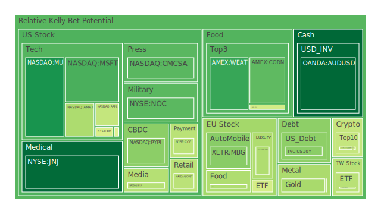
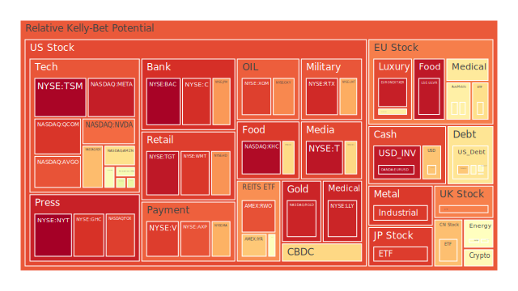
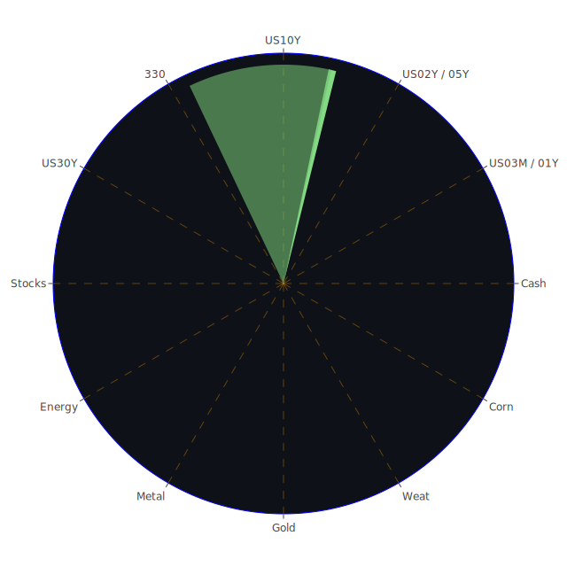

# **投資商品泡沫分析**

在當前全球市場環境下，各類資產的價格波動與潛在風險成為投資者關注的焦點。以下將針對各主要投資類別，結合最新的泡沫指數數據（D1為當日風險分數，D7、D14、D30分別為七天、兩週、月平均風險分數，PP100為當日現價）以及相關新聞事件與宏觀經濟數據，進行深入分析。

* 美國國債 (US10Y, US03MY, US30Y, US05Y, US02Y, US01Y)  
  美國國債市場近期呈現複雜景象。從泡沫指數來看，短天期國債如1年期(US01Y)的D1達到0.698，月平均(D30)為0.492；2年期(US02Y)的D1為0.6099，月平均為0.6158。這反映出市場對短期利率路徑的高度不確定性。長天期如10年期(US10Y)的D1為0.361，月平均0.443；30年期(US30Y)的D1為0.581，月平均0.460。  
  從經濟學角度看，聯準會(FED)的鷹派言論（過去數月2次鷹派發言，0次鴿派）以及相對較高的各類利率（如OIS FED Fund Rate 4.33%，去年同期0.08%；固定30年房貸利率6.76%，去年同期3.00%）對債券價格構成壓力（殖利率與價格反向）。美國10年期與3個月期公債殖利率差(10Y-03M)為0.06，雖然脫離上週的負值，但仍處於歷史低位，歷史上這種極低的利差往往被視為經濟衰退的前兆。  
  社會心理層面，投資者在通膨預期（CPIYOY 2.40%，雖較去年3.48%下降，但仍受關注）和經濟衰退擔憂之間搖擺。新聞中「更多聯準會官員警告川普關稅可能產生更高的通膨和更慢的成長」以及「聯準會庫克警告關稅可能降低生產力，加劇通膨」等消息，加劇了市場對未來政策走向和通膨壓力的焦慮。博弈論觀點下，市場參與者正在揣測聯準會的下一步行動，任何風吹草動都可能引發債市波動。  
  值得注意的是，FED總資產處於相對低位，而聯準會準備金處於相對高位，顯示銀行體系流動性尚可。然而，美國公眾持有的債務佔GDP比例持續上升，長期財政壓力不容忽視。美國公債泡沫分數整體處於中等偏高水平，特別是短債，反映了對聯準會政策不確定性的定價。歷史上，利率急遽上升期，債券市場均面臨較大調整壓力。  
* 美國零售股 (COST, WMT, TGT, HD)  
  零售股表現分化，但整體泡沫風險較高。沃爾瑪(WMT)的D1高達0.9037，月平均0.8042；塔吉特(TGT)D1為0.9564，月平均0.8507；家得寶(HD)D1為0.7762，月平均0.6691。好市多(COST)的D1為0.4329，月平均0.4939，相對較低。  
  經濟學上，消費者拖欠率(Consumer Delinquent)及信用卡拖欠率(Charge-off Rate on Credit Card)處於相對高位，顯示部分消費者財務壓力增加，可能影響非必需品的消費。然而，高就業率和薪資成長在一定程度上支撐了消費。  
  社會心理學角度，品牌忠誠度和消費習慣在通膨環境下受到考驗，消費者可能轉向更具價格優勢的商家或商品。「Monster Beverage季度淨銷售額意外下滑，因需求波動」這類新聞，反映了消費市場的變幻莫測。  
  博弈論視角，零售商在定價策略、庫存管理和供應鏈優化方面面臨激烈競爭。既有理論認為，必需消費品在經濟下行期表現相對穩健，但目前高泡沫指數警示我們，即使是龍頭零售股，其估值也可能已大幅超越基本面。歷史上，消費降級時期，折扣零售商往往表現更佳。  
* 美國科技股 (GOOG, NFLX, AMZN, MSFT, AAPL, TSLA, META)  
  科技股是市場關注的焦點，其泡沫指數普遍偏高。Meta(META) D1高達0.9468，月平均0.9116；蘋果(AAPL) D1為0.4477，月平均0.6189；亞馬遜(AMZN) D1為0.6532，月平均0.7637；微軟(MSFT) D1為0.2797，月平均0.6453，其當日泡沫分數顯著下降，但月平均仍高；谷歌(GOOG) D1為0.4944，月平均0.6327；特斯拉(TSLA) D1為0.5247，月平均0.4037，其泡沫風險相對較低。網飛(NFLX) D1為0.4230，月平均0.4727。  
  經濟學觀點，科技巨頭的盈利能力和市場主導地位是支撐其高估值的部分原因。AI浪潮為相關企業帶來新的成長想像空間。然而，高利率環境對成長股估值構成壓力。「Alphabet股價重挫1380億美元，因搜索警告響起」以及「Palantir股價本週下跌，因投資者擔憂估值過高」等新聞，反映了市場對科技股高估值的擔憂情緒。  
  社會心理層面，「炒作」和「錯失恐懼症」(FOMO)在科技股投資中扮演重要角色。投資者對颠覆性技術的期待，可能導致對短期盈利能力的忽視。然而，「主要公司今年裁員名單，包括摩根史坦利、Wayfair、UPS和Meta」等新聞，則顯示科技業亦面臨成本壓力與成長放緩的挑戰。  
  博弈論角度，科技行業贏家通吃的特性顯著。投資者在追逐潛在贏家的同時，也需警惕技術路徑變化和競爭格局演變的風險。歷史上，科技泡沫（如2000年網路泡沫）的破裂，往往伴隨著市場情緒的急劇逆轉和資本的快速撤離。  
* 美國房地產指數 (VNQ, IYR, RWO)  
  美國房地產指數的泡沫風險顯著。IYR的D1為0.6970，月平均0.8085；VNQ的D1為0.5656，月平均0.4444；RWO的D1為0.8671，月平均0.4917。  
  經濟學上，固定30年期抵押貸款利率高達6.76%，顯著高於去年的3.00%，這大幅增加了購房成本，理論上會抑制需求。同時，商業地產拖欠率(Commercial Real Estate Delinquent)和房地產拖欠率(Real Estate Delinquent)均處於相對高位，顯示房地產市場，特別是商業地產，面臨壓力。  
  社會心理學方面，擁有房產在許多文化中被視為財富和成功的象徵，這種觀念可能在一定程度上支撐需求。然而，對經濟前景的擔憂和高昂的借貸成本，可能使潛在購房者持觀望態度。  
  博弈論觀點，開發商、貸方和購房者之間的預期相互影響。若市場普遍預期房價下跌，可能引發拋售潮。從歷史經驗看，2008年次貸危機的導火索即是房地產泡沫的破裂，其連鎖反應波及全球金融體系。  
* 加密貨幣 (BTCUSD, ETHUSD, DOGEUSD)  
  加密貨幣市場波動性大，其泡沫指數也呈現較大變化。比特幣(BTCUSD) D1為0.4858，月平均0.4571；以太坊(ETHUSD) D1為0.4410，月平均0.5315；狗狗幣(DOGEUSD) D1為0.5852，月平均0.4788。  
  經濟學角度，加密貨幣作為一種新興資產類別，其內在價值和定價模型仍在探索中。部分投資者將其視為抗通膨工具或新型價值儲存手段，類似「數位黃金」。新聞「比特幣突破102,000美元，觸及1月以來最高水平，因Coinbase、關稅協議」顯示其價格易受消息面影響。  
  社會心理學層面，社群效應和名人喊單對加密貨幣價格影響顯著。「美國聯邦人力資源機構領導DOGE裁員，取消了Workday的獨家採購獎勵」這類看似不直接相關的新聞也可能透過社群情緒影響DOGE價格。市場情緒極端化是常態。  
  博弈論視角，加密貨幣市場存在顯著的資訊不對稱和操縱風險。早期參與者和巨鯨的行為，對市場價格有巨大影響力。其高波動性和缺乏傳統金融監管的特性，使其風險遠高於傳統資產。歷史上，加密貨幣經歷過多次暴漲暴跌，投資者需有清醒認識。  
* 金/銀/銅 (XAUUSD, XAGUSD, COPPER)  
  貴金屬和工業金屬表現各異。黃金(XAUUSD) D1為0.4027，月平均0.4293，處於中等水平。白銀(XAGUSD) D1高達0.9015，月平均0.8561，泡沫風險顯著。銅(COPPER) D1為0.4952，月平均0.6945，也處於較高水平。  
  經濟學上，黃金通常被視為避險資產和通膨對沖工具。高盛石油比率(GOLD OIL RATIO)為54.52，遠高於去年的29.31，顯示黃金相對石油強勢。高盛銅比率(GOLD COPPER RATIO)為714.80，也高於去年的610.35。銅作為重要的工業金屬，其價格與全球經濟景氣度密切相關。  
  社會心理學角度，地緣政治緊張（如新聞中提及的以色列國防部長警告葉門胡塞武裝、俄烏衝突、習普會談深化中俄關係）會推升黃金等避險資產的需求。對經濟衰退的擔憂情緒也會增加黃金的吸引力。  
  博弈論視角，主要國家央行的黃金儲備策略、大型基金的配置行為，都會對金銀價格產生影響。銅市場則更受主要經濟體工業生產預期和庫存週期的博弈影響。「獨家：中國購買加拿大、澳洲小麥，因高溫影響作物，貿易」間接反映了全球供應鏈的脆弱性和大宗商品價格的潛在波動。  
  歷史上，戰爭、惡性通膨時期，黃金和白銀等貴金屬往往表現出色。銅價則與工業革命和全球化進程中的需求擴張緊密相連。目前白銀和銅的高泡沫指數值得警惕，可能反映了市場對供應短缺或特定需求的過度預期。  
* 黃豆 / 小麥 / 玉米 (SOYB, WEAT, CORN)  
  農產品市場泡沫指數差異較大。黃豆(SOYB) D1為0.4733，月平均0.5755。小麥(WEAT) D1為0.2585，月平均0.4148，相對較低。玉米(CORN) D1為0.3038，月平均0.4553。  
  經濟學上，農產品價格受供需基本面、天氣狀況、能源價格（影響農資成本）、貿易政策和地緣政治等多重因素影響。「獨家：中國購買加拿大、澳洲小麥，因高溫影響作物，貿易」即為典型案例。  
  社會心理學觀點，糧食安全擔憂會影響各國的採購和儲備行為，進而影響國際市場價格。極端天氣事件的新聞報導，也容易引發市場對供應短缺的恐慌。  
  博弈論視角，大型農業公司、國家級儲備機構、投機基金在農產品期貨市場的博弈，對價格形成有重要影響。貿易保護主義和出口限制等政策，會改變市場參與者的策略。  
  歷史上，重大自然災害或戰爭時期，農產品價格往往劇烈波動。目前農產品整體泡沫指數尚可，但需關注特定品種因天氣或地緣政治引發的突發性風險。  
* 石油/ 鈾期貨UX\! (USOIL, UX1\!)  
  能源市場方面，石油(USOIL) D1為0.5591，但月平均僅0.1835，顯示近期風險有所上升，但長期看泡沫程度不高。鈾期貨(UX1\!) D1為0.5765，月平均0.4869，處於中等水平。  
  經濟學上，石油價格與全球經濟成長、OPEC+產量政策、地緣政治風險（如中東局勢）密切相關。鈾作為核燃料，其價格與核電發展前景、能源轉型政策及相關地緣政治（如俄羅斯是主要濃縮鈾供應國）有關。  
  社會心理學角度，對能源短缺的恐懼和對環境保護的訴求，交織影響著能源市場的預期。例如，「以色列國防部長警告葉門胡塞武裝將遭猛烈報復」可能引發對石油供應的擔憂。  
  博弈論視角，產油國之間的合作與競爭，消費國的能源安全策略，以及新能源技術的發展，都是影響油價和鈾價的博弈因素。  
  歷史上看，石油危機曾多次對全球經濟造成巨大衝擊。鈾價則在核能發展的起伏中波動。目前石油月平均泡沫指數不高，可能反映了市場對經濟放緩導致需求下降的預期。  
* 各國外匯市場 (EURUSD, GBPUSD, AUDUSD, USDJPY)  
  外匯市場中，歐元兌美元(EURUSD) D1高達0.9718，月平均0.7785，泡沫風險極高。英鎊兌美元(GBPUSD) D1為0.5193，月平均0.4487。澳元兌美元(AUDUSD) D1僅0.1393，月平均0.4051，泡沫風險相對較低。美元兌日圓(USDJPY) D1為0.7040，月平均0.5903。  
  經濟學角度，匯率主要受各國利率差異、經濟成長前景、國際收支狀況及央行政策影響。聯準會的鷹派立場及相對較高的美國利率，對美元構成支撐。  
  社會心理學觀點，市場對各國經濟前景的信心、政治穩定性以及突發事件的反應，都會影響匯率波動。例如，「墨西哥從美國遣返人數最近幾週增加」可能影響美元兌墨西哥披索，進而間接影響其他貨幣對。  
  博弈論視角，各國央行在匯率政策上的博弈（如競爭性貶值、干預市場），以及大型跨國公司和對沖基金的套利和投機行為，共同塑造外匯市場格局。  
  歷史上，廣場協議等重大國際協調行動曾劇烈改變主要貨幣匯率。目前EURUSD的極高泡沫指數，可能反映了市場對歐洲央行政策或歐元區經濟前景的某種極端預期，或美元強勢下的資金流動。  
* 各國大盤指數 (NDX, 0050, 000300, GDAXI, FCHI, FTSE, JPN225)  
  各國股指泡沫程度不一。納斯達克100指數(NDX) D1為0.7178，月平均0.7549，處於高位。台灣50 (0050) D1為0.4292，月平均0.6935。滬深300 (000300) D1為0.7120，月平均0.5178。德國DAX (GDAXI) D1為0.6545，月平均0.5585。法國CAC40 (FCHI) D1為0.4750，月平均0.5894。英國FTSE100 (FTSE) D1為0.8022，月平均0.5932。日經225 (JPN225) D1高達0.8965，月平均0.7218。  
  經濟學觀點，股指是反映一國經濟整體狀況和企業盈利能力的晴雨表。全球貿易緊張局勢（「貿易戰一個月後，中國對美出口已暴跌超過20%」、「貨櫃航運公司削減亞洲-美國航線，因川普關稅導致貿易崩潰」）對各國股市均構成壓力。  
  社會心理學層面，投資者情緒（貪婪與恐懼）對股指影響巨大。「股市今日：道瓊、標普500、那斯達克期貨因貿易談判重燃希望而平盤整理」與「股市今日：道瓊、標普500、那斯達克因貿易樂觀情緒上漲，川普稱‘現在買股票’」形成鮮明對比，顯示市場情緒極易受消息面左右。  
  博弈論視角，各國政府的經濟刺激政策、央行的貨幣政策以及國際資本流動，都是影響股指的博弈因素。  
  歷史上，全球性金融危機（如2008年）往往導致各國股指聯動下跌。目前多國股指，特別是日經225和納斯達克100，泡沫指數偏高，需警惕全球性風險事件引發的共振效應。  
* 美國半導體股 (NVDA, MU, INTC, AMAT, KLAC, QCOM, AVGO, TSM)  
  半導體股普遍呈現高泡沫風險。台積電(TSM) D1高達0.9908，月平均0.9856，風險極高。輝達(NVDA) D1為0.8323，月平均0.5972。博通(AVGO) D1為0.8640，月平均0.8223。高通(QCOM) D1為0.9068，月平均0.7911。應用材料(AMAT) D1為0.4093，月平均0.7528。科磊(KLAC) D1為0.5279，月平均0.4931。美光(MU) D1為0.2187，月平均0.3664，相對較低。英特爾(INTC) D1為0.5591，月平均0.4932。  
  經濟學角度，半導體是現代經濟的基石，AI、5G、物聯網等新興應用帶來巨大需求。然而，行業週期性、高資本支出和技術迭代風險也是其固有特徵。「Microchip預測第一季度利潤和營收高於預期」帶來正面信號。  
  社會心理學觀點，對新技術的樂觀預期容易催生泡沫。投資者對特定龍頭企業的追捧，可能使其估值遠超行業平均水平。  
  博弈論視角，半導體行業涉及複雜的國際分工和地緣政治博弈（如晶片法案、出口管制）。企業間在技術標準、產能擴張和人才爭奪方面的競爭異常激烈。  
  歷史上，半導體行業經歷過多次景氣循環。目前的高泡沫指數，特別是TSM、NVDA等龍頭企業，反映了市場對其未來成長的極高預期，但也積聚了較大風險。  
* 美國銀行股 (JPM, C, COF, BAC)  
  美國銀行股泡沫指數普遍處於高位。美國銀行(BAC) D1高達0.9951，月平均0.9629，風險極高。花旗(C) D1為0.9183，月平均0.8628。摩根大通(JPM) D1為0.7691，月平均0.7239。第一資本(COF) D1為0.4317，月平均0.4791，相對較低。  
  經濟學觀點，銀行股的表現與利率水平、信貸週期和經濟景氣度密切相關。目前FED數據顯示，各類信用卡拖欠率和商業地產拖欠率處於相對高位，對銀行資產品質構成潛在威脅。然而，淨息差可能因利率上升而擴大。  
  社會心理學觀點，銀行作為金融體系的核心，其穩定性直接影響公眾信心。重大銀行倒閉事件會引發系統性恐慌。  
  博弈論視角，銀行在風險管理、業務擴張和應對監管方面需要精妙平衡。大型銀行間的競爭以及與金融科技公司的競合關係，也充滿博弈。  
  歷史上，銀行危機往往是金融風暴的先導。目前銀行股，特別是BAC和C的極高泡沫指數，可能反映了市場對其在當前高利率環境下盈利能力的樂觀預期，但也可能忽視了潛在的信貸風險。  
* 美國軍工股 (LMT, NOC, RTX)  
  軍工股泡沫指數高企。洛克希德馬丁(LMT) D1為0.7426，月平均0.7391。諾斯洛普格魯曼(NOC) D1為0.2989，月平均0.7306，當日風險顯著下降但月平均仍高。雷神(RTX) D1為0.9265，月平均0.7588。  
  經濟學角度，軍工股的表現在很大程度上受地緣政治局勢和國防預算影響。當前全球多點衝突（俄烏、中東）以及大國競爭加劇，為軍工企業帶來訂單預期。新聞「以色列國防部長警告葉門胡塞武裝將遭猛烈報復」、「習普會談同意在莫斯科會談中‘深化’中俄關係」等地緣政治新聞均可能刺激軍工股。  
  社會心理學觀點，對國家安全的擔憂和愛國主義情緒，可能在一定程度上支持軍工股的估值。  
  博弈論視角，國家間的軍備競賽、軍售協議以及國防採購政策，是影響軍工股的重要博弈因素。  
  歷史上，戰爭時期或冷戰等長期對峙階段，軍工股往往有較好表現。目前的高泡沫指數反映了市場對持續地緣政治緊張和國防支出增加的預期。  
* 美國電子支付股 (PYPL, V, MA, AXP, GPN)  
  電子支付股泡沫指數分化。PayPal(PYPL) D1為0.3627，月平均高達0.9292，月度風險極高但當日有所回落。Visa(V) D1為0.8954，月平均0.7619。萬事達(MA) D1為0.7351，月平均0.7926。美國運通(AXP) D1為0.8643，月平均0.7828。Global Payments(GPN) D1為0.5679，月平均0.5817。  
  經濟學角度，電子支付的普及率持續提升，受益於電商發展和消費者支付習慣的轉變。然而，行業競爭激烈，面臨監管壓力和新技術（如加密支付）的挑戰。  
  社會心理學觀點，便捷性和安全性是影響消費者選擇支付方式的關鍵因素。品牌信任度和用戶體驗至關重要。  
  博弈論視角，支付平台間的網絡效應顯著。商戶費率、用戶補貼和技術標準的制定，都是平台博弈的焦點。  
  PYPL的月平均泡沫指數極高，值得特別關注，可能反映了市場對其轉型或未來盈利能力的某種過度預期或擔憂。整體而言，支付行業巨頭享有護城河，但也因高估值而泡沫風險較高。  
* 美國藥商股 (JNJ, MRK, LLY, NVO)  
  大型藥商股泡沫指數不一。禮來(LLY) D1高達0.9338，月平均0.9341，風險極高。嬌生(JNJ) D1僅0.1448，月平均0.2665，泡沫風險較低。默克(MRK) D1為0.6536，月平均0.4954。諾和諾德(NVO) D1為0.5771，月平均0.6580。  
  經濟學角度，醫藥行業具有研發週期長、投入高、專利保護和政策監管影響大的特點。人口老化和醫療保健需求持續成長是行業長期驅動力。「Collegium Pharmaceutical (NASDAQ:COLL) 超出Q1預期」、「Insulet (NASDAQ:PODD) Q1：強勁銷售，股價飆升」、「Natera (NASDAQ:NTRA) Q1表現強勁，全年銷售指引強勁」等正面新聞提振板塊。  
  社會心理學觀點，對健康長壽的追求使得創新藥物和療法備受期待。然而，藥價問題也常常引發社會爭議。  
  博弈論視角，藥企在藥物研發、專利佈局、市場准入和價格談判等方面面臨複雜博弈。  
  禮來(LLY)的極高泡沫指數可能與其減肥藥等爆款產品的巨大市場預期有關，但需警惕預期過高或競爭加劇的風險。嬌生(JNJ)相對穩健。  
* 美國影視股 (NFLX, DIS, PARA)  
  影視股中，迪士尼(DIS) D1為0.6696，月平均0.6999。派拉蒙(PARA) D1為0.4996，月平均0.5106。網飛(NFLX)已在科技股中分析，D1為0.4230，月平均0.4727。  
  經濟學角度，流媒體競爭白熱化，內容成本高昂，用戶成長放緩，盈利壓力增大。廣告市場的表現也直接影響其收入。  
  社會心理學觀點，優質內容是吸引和保留用戶的核心。消費者在眾多平台間的選擇，受口碑、獨家內容和價格等因素影響。  
  博弈論視角，平台間在內容採購、定價策略和用戶獲取方面競爭激烈。傳統影視公司與流媒體平台的關係也在重塑。  
  「Paramount (NASDAQ:PARA) Q1銷售額超預期」為派拉蒙帶來一些正面消息，但整體行業仍面臨挑戰。迪士尼的泡沫指數相對較高，反映了市場對其IP價值和轉型努力的複雜看法。  
* 美國媒體股 (CMCSA, FOX, NYT)  
  媒體股中，康卡斯特(CMCSA) D1為0.2982，月平均0.4725。福斯(FOX) D1高達0.8934，月平均0.8444。紐約時報(NYT) D1達到1.0000的滿值，月平均0.7331，泡沫風險極高。  
  經濟學角度，傳統媒體面臨數位化轉型的巨大挑戰，廣告收入受到科技平台擠壓。訂閱模式成為重要收入來源。  
  社會心理學觀點，媒體公信力、內容品質和政治立場，都會影響其受眾和市場表現。  
  博弈論視角，媒體在爭奪用戶注意力、應對假新聞挑戰和探索新商業模式方面，面臨艱難博弈。  
  紐約時報和福斯的極高泡沫指數值得高度警惕，可能反映了市場對其特定品牌價值或轉型成功的過高預期，但也可能與其在特定受眾中的影響力有關。  
* 石油防禦股 (XOM, OXY)  
  石油防禦股（大型綜合石油公司）泡沫指數高企。埃克森美孚(XOM) D1為0.8918，月平均0.7747。西方石油(OXY) D1為0.7920，月平均0.7532。  
  經濟學角度，這類公司受益於高油價，但同時也需投入巨資進行勘探開發和能源轉型。其盈利與油價週期密切相關。  
  社會心理學觀點，在能源安全擔憂加劇時，傳統能源巨頭的價值可能被重估。但同時也面臨環保壓力和ESG投資趨勢的挑戰。  
  博弈論視角，這些公司在產量決策、併購策略和應對氣候變化政策方面，與政府、環保組織和其他能源公司進行博弈。  
  高泡沫指數反映了市場在高油價和地緣政治不穩定背景下對其盈利能力的樂觀預期。  
* 金礦防禦股 (RGLD)  
  皇家黃金(RGLD)作為金礦權益公司，其D1高達0.9351，月平均0.9192，泡沫風險極高。  
  經濟學角度，其表現與金價正相關，同時也受自身礦山運營（儘管其主要是權益模式）和勘探前景影響。  
  社會心理學觀點，在避險情緒升溫時，黃金及相關股票受到追捧。  
  博弈論視角，金礦公司的盈利能力取決於其能否有效控制成本、成功勘探新礦以及應對環保和地緣政治風險。  
  RGLD的極高泡沫指數，除了反映金價上漲預期外，也可能包含了對其商業模式和成長性的樂觀看法，但風險不容忽視。  
* 歐洲奢侈品股 (MC, RMS, KER)  
  歐洲奢侈品股泡沫指數普遍較高。LVMH (MC) D1為0.4142，月平均0.4771。愛馬仕(RMS) D1為0.6142，月平均0.6863。開雲(KER) D1高達0.9438，月平均0.7242。  
  經濟學角度，奢侈品消費與全球高淨值人群的財富效應和消費信心密切相關。新興市場的崛起是重要成長動力。  
  社會心理學觀點，品牌稀缺性、歷史傳承和社會地位象徵是奢侈品的核心價值。潮流變化和年輕一代消費觀念的轉變也帶來挑戰。  
  博弈論視角，奢侈品集團在品牌定位、市場擴張、供應鏈管理（特別是稀有原材料）和應對仿冒品方面競爭激烈。  
  開雲集團的高泡沫指數尤其突出，可能反映了市場對其旗下特定品牌或轉型策略的極端預期。整體而言，奢侈品行業在高估值下，對全球宏觀經濟波動的敏感性增加。  
* 歐洲汽車股 (BMW, MBG, PAH3)  
  歐洲汽車股泡沫指數處於中高水平。寶馬(BMW) D1為0.6130，月平均0.5802。賓士(MBG) D1為0.3590，月平均0.5043。保時捷控股(PAH3) D1為0.6086，月平均0.5281。  
  經濟學角度，汽車行業正經歷向電動化和智慧化的巨大轉型，面臨高額研發投入和來自科技公司及中國品牌的激烈競爭。供應鏈問題（如晶片短缺曾造成困擾）和全球經濟狀況也影響汽車銷量。  
  社會心理學觀點，品牌形象、駕駛體驗、環保理念和科技配置，共同影響消費者的購車決策。  
  博弈論視角，傳統車企、新能源車企、供應商和政府（透過補貼和排放法規）在汽車市場的未來格局中展開激烈博弈。  
  目前泡沫指數反映了市場對這些傳統豪華車企轉型前景的複雜看法，既有對其品牌和技術積累的認可，也有對其能否成功應對挑戰的疑慮。  
* 歐美食品股 (NESN, KHC, ULVR, KO)  
  食品股作為必需消費品，通常被認為具有防禦性。雀巢(NESN) D1為0.4120，月平均0.5323。卡夫亨氏(KHC) D1高達0.9808，月平均0.7645。聯合利華(ULVR) D1為0.9562，月平均0.9508。可口可樂(KO) D1為0.6641，月平均0.7156。  
  經濟學角度，食品飲料行業的需求相對穩定，但面臨原材料成本波動、消費者口味變化和健康趨勢的挑戰。通膨環境下，企業的成本轉嫁能力至關重要。  
  社會心理學觀點，品牌忠誠度、健康意識和便利性是影響消費者選擇的重要因素。  
  博弈論視角，大型食品公司在與零售商的價格談判、供應鏈管理和產品創新方面持續博弈。  
  卡夫亨氏和聯合利華的極高泡沫指數令人意外，可能與特定的公司重組、成本控制或市場對其提價能力的樂觀預期有關，但也顯示其估值可能已嚴重偏高，防禦性減弱。可口可樂和雀巢相對穩健一些，但仍需關注其高估值下的潛在風險。

# **宏觀經濟傳導路徑分析**

當前宏觀經濟環境的核心特徵是：聯準會維持鷹派立場，各期限利率仍處高位，通膨（CPIYOY 2.4%）雖有回落但壓力猶存，多項經濟數據（如各類拖欠率上升）顯示經濟潛在放緩跡象，同時地緣政治緊張局勢頻發。

資訊航母之**空間三位一體 (經濟學、社會學、心理學、博弈論同步觀察)**：

* **正 (Thesis \- 經濟現象):** 高利率、持續通膨壓力、貿易摩擦、地緣政治衝突。  
* **反 (Antithesis \- 社會心理反應與博弈):**  
  * *經濟學/博弈論:* 企業在成本上升和需求可能萎縮的環境下，被迫進行價格調整、裁員（新聞提及多家公司裁員）或延緩投資，央行則在抑制通膨與避免衰退間進行政策博弈。  
  * *社會學/心理學:* 民眾生活成本上升，消費信心受挫，避險情緒增加（黃金受追捧，貨幣市場基金規模上升）。對政府和機構的信任度可能下降，社會分化加劇。國際間，信任缺失導致貿易保護主義抬頭（新聞提及中美貿易摩擦、關稅影響）。  
* **合 (Synthesis \- 傳導路徑):**  
  1. **利率路徑：** 聯準會鷹派 \-\> 高利率持續 \-\> 企業借貸成本上升，投資意願下降 \-\> 經濟活動趨緩 \-\> 企業盈利預期下調 \-\> 股市（尤其是成長股）估值壓力增大。同時，高利率吸引資本流入美元區，導致非美貨幣貶值壓力（如EURUSD泡沫高企）。  
  2. **通膨路徑：** 供應鏈瓶頸（部分源於貿易摩擦和地緣政治）+ 勞動力成本上升 \-\> 通膨壓力持續 \-\> 侵蝕消費者購買力 \-\> 必需消費品佔比增加，可選消費品需求下降（Monster Beverage銷售下滑） \-\> 相關企業營收及利潤受影響。  
  3. **貿易路徑：** 貿易保護主義（關稅） \-\> 進口商品價格上漲，加劇國內通膨 \-\> 企業供應鏈重構，成本增加 \-\> 出口受阻（中國對美出口下降） \-\> 影響相關國家經濟成長及企業盈利。  
  4. **地緣政治路徑：** 區域衝突加劇 \-\> 能源、農產品價格波動風險增加 \-\> 全球供應鏈不確定性提高 \-\> 避險資產（黃金、特定貨幣）需求上升，軍工等特定行業受益 \-\> 整體市場風險溢價提高，投資者情緒趨於謹慎。  
  5. **信心路徑：** 經濟前景不明朗 \+ 社會矛盾（如對腐敗不滿） \-\> 消費者和投資者信心下降 \-\> 預防性儲蓄增加，風險資產配置減少 \-\> 經濟動能進一步減弱。

資訊航母之**時間三位一體 (歷史參照與演化)**：

* **正 (Thesis \- 當前困境):** 類似1970年代的停滯性通膨（高通膨、低成長）風險。  
* **反 (Antithesis \- 歷史差異與演化):**  
  * *經濟學/博弈論:* 與1970年代不同，當前全球化程度更高（雖有逆流），科技發展更快（AI），央行應對通膨的工具和決心也可能更強。但政府債務水平遠超以往，政策空間受限。  
  * *社會學/心理學:* 社交媒體加速信息傳播和情緒放大，民粹主義和地緣政治博弈的複雜性增加。  
* **合 (Synthesis \- 可能的歷史借鑒與演化路徑):** 若通膨持續頑固，央行被迫長期維持高利率，可能重演歷史上為抑制通膨而引發經濟衰退的局面（如沃爾克時刻）。但與歷史不同的是，當前金融市場的複雜性和關聯性更高，一次局部的信用事件（如商業地產危機）也可能透過衍生品和全球資本流動迅速擴散。

# **微觀經濟傳導路徑分析**

企業層面，宏觀壓力透過以下路徑傳導：

資訊航母之**概念三位一體 (模型與現實)**：

* **正 (Thesis \- 標準模型):** 成本加成定價、供需決定產量、理性人假設。  
* **反 (Antithesis \- 現實複雜性):**  
  * *經濟學/博弈論:* 企業在寡占市場中可能採取策略性定價，而非簡單成本加成。供應鏈的脆弱性和長鞭效應影響庫存和生產決策。非理性行為（如CEO個人決策風格）影響企業戰略。  
  * *社會學/心理學:* 企業ESG責任、品牌聲譽、員工士氣、消費者偏好變化（如對健康、環保的追求）均影響企業決策和績效。  
* **合 (Synthesis \- 企業應對與傳導):**  
  1. **成本端：** 原材料（石油、金屬、農產品）價格上漲 \+ 勞動力短缺及薪資上漲 \+ 融資成本（高利率）增加 \-\> 企業利潤空間被壓縮。  
     * *觀察視角（新聞/數據）:* 「Hub Group第一季度營收下降8%至9.15億美元」、「1-800-FLOWERS第一季度銷售額低於分析師預期，股價下跌」。FED數據顯示高收益債利率高企。  
  2. **需求端：** 消費者購買力下降（通膨侵蝕）+ 信心不足（經濟前景不明） \-\> 產品需求疲軟（尤其非必需品） \-\> 企業營收成長放緩或下滑。  
     * *觀察視角（新聞/數據）:* 「Monster Beverage季度淨銷售額意外下滑，因需求波動」。消費者拖欠率上升。  
  3. **競爭與創新：** 市場競爭加劇（尤其科技、汽車、零售） \-\> 企業被迫加大研發投入（如AI、電動車）或進行價格戰 \-\> 利潤率可能進一步受壓。  
     * *觀察視角（新聞/數據）:* 特斯拉股價上漲，但面臨激烈競爭。科技巨頭間的AI競賽。  
  4. **供應鏈與全球化：** 地緣政治風險 \+ 貿易保護主義 \-\> 供應鏈多元化、區域化成本增加 \-\> 效率可能降低。  
     * *觀察視角（新聞/數據）:* 「貨櫃航運公司削減亞洲-美國航線，因川普關稅導致貿易崩潰」。  
  5. **企業財務健康：** 盈利下降 \+ 借貸成本上升 \-\> 現金流壓力增大 \-\> 信用評級可能下調，再融資困難 \-\> 嚴重時可能導致債務違約或破產。  
     * *觀察視角（數據）:* 信用卡和商業地產拖欠率上升。

# **資產類別間傳導路徑分析**

資產價格的變動並非孤立，而是相互關聯、相互影響的。

資訊航母之**正反合綜合應用 (跨資產關聯)**：

1. **利率敏感性路徑 (正向傳導為主軸，但有反向避險效應)：**  
   * **正 (Thesis):** 聯準會升息/維持高利率 \-\>  
   * **反 (Antithesis \- 市場反應與博弈):**  
     * *債券市場:* 短期國債殖利率上升，價格下跌 (US01Y, US02Y高泡沫指數部分反映此預期)。長債價格亦承壓，但若衰退預期增強，長債可能因避險需求反而上漲（殖利率下降）。  
     * *股票市場:* 估值壓力（尤其是高成長科技股NDX, NVDA, MSFT），融資成本上升，企業盈利預期下調 \-\> 股價下跌。但某些利率上升受益行業（如部分銀行股，但需注意其資產品質風險）可能例外。  
     * *房地產市場:* 抵押貸款利率上升 \-\> 購房成本增加，需求降溫 \-\> 房價承壓 (VNQ, IYR高泡沫指數警示風險)。商業地產風險更高。  
     * *外匯市場:* 美元因利差擴大而走強 (USDJPY, EURUSD的泡沫指數反映此趨勢)。  
   * **合 (Synthesis \- 連鎖反應):** 股市資金可能流向債市或貨幣市場基金避險。美元強勢不利於美國出口企業，也增加新興市場美元債務壓力。  
2. **通膨預期路徑 (資產表現分化)：**  
   * **正 (Thesis):** 通膨預期上升/持續 \-\>  
   * **反 (Antithesis \- 資產反應與博弈):**  
     * *商品市場:* 原物料（石油USOIL, 銅COPPER, 農產品SOYB, WEAT, CORN）價格上漲，因其具有抗通膨屬性。黃金(XAUUSD)、白銀(XAGUSD)等貴金屬作為價值儲存手段受到追捧。  
     * *股票市場:* 成本推動型通膨侵蝕企業利潤，需求拉動型早期可能推升名目獲利。能源、原物料等抗通膨板塊可能受益。高估值成長股承壓。  
     * *債券市場:* 固定收益債券實際回報率下降，價格下跌（殖利率上升）。通膨連結債券(TIPS)受青睞。  
     * *房地產市場:* 實物資產具有一定抗通膨性，但若通膨引發急劇升息，則弊大於利。  
   * **合 (Synthesis \- 財富轉移):** 資金可能從債券、現金流向實物資產和抗通膨股票。高通膨若失控，將嚴重打擊經濟信心，引發全面資產拋售。  
3. **經濟成長預期路徑 (順週期資產與逆週期資產互動)：**  
   * **正 (Thesis):** 經濟衰退預期增強 \-\>  
   * **反 (Antithesis \- 市場行為與博弈):**  
     * *股票市場:* 週期性行業（工業、非必需消費）受創最重。防禦性行業（必需消費KO, NESN, 醫藥JNJ, LLY）相對抗跌。整體股市承壓。  
     * *債券市場:* 避險需求推升優質主權債（如美國長債）價格，殖利率下降。信用利差擴大，高收益債下跌。  
     * *商品市場:* 工業金屬（銅COPPER）、能源（石油USOIL）需求下降，價格下跌。黃金(XAUUSD)可能因避險需求上漲。  
     * *外匯市場:* 避險貨幣（美元、日圓、瑞郎）可能走強。商品貨幣（澳元AUDUSD、加元）走弱。  
   * **合 (Synthesis \- 風險趨避與資產輪動):** 資金從高風險股票、商品流向債券、黃金和現金。市場波動性加劇。  
4. **地緣政治風險路徑 (避險資產與特定行業的反應)：**  
   * **正 (Thesis):** 地緣政治衝突加劇（新聞中多處提及）-\>  
   * **反 (Antithesis \- 資金流向與博弈):**  
     * *避險資產:* 黃金(XAUUSD)、美元、美國國債等傳統避險資產需求上升。  
     * *特定行業:* 軍工股(LMT, NOC, RTX)因國防開支預期增加而上漲。能源價格（石油USOIL, 鈾UX1\!）因供應中斷擔憂而波動。  
     * *全球股市:* 整體市場不確定性增加，風險偏好下降，股市承壓，尤其是與衝突地區有較高貿易或投資關聯的市場。  
   * **合 (Synthesis \- 結構性影響):** 長期地緣政治緊張可能導致全球供應鏈重組，推升特定區域的通膨和生產成本，並改變國際資本流動格局。

**漣漪效應傳導路徑舉例：**

* **起點：美國科技股泡沫破裂 (NVDA, META等高泡沫股下跌)**  
  1. \-\> 納斯達克100指數(NDX)大幅回調。  
  2. \-\> 市場避險情緒升溫，資金流向美國國債 (US10Y, US30Y價格上漲，殖利率下降)。  
  3. \-\> 黃金(XAUUSD)作為避險資產受到追捧，價格上漲。  
  4. \-\> 美元因避險需求短期走強 (USDJPY下跌，EURUSD下跌)。  
  5. \-\> 依賴科技股帶動的相關市場（如台灣0050，因其科技股權重高）可能跟隨下跌。  
  6. \-\> 科技公司財富效應減弱，可能影響其對高端消費品（如奢侈品MC, RMS, KER，高端汽車BMW, MBG）的需求。  
  7. \-\> 科技業若出現大規模裁員潮（新聞已提及部分公司裁員），將進一步打擊消費者信心，影響零售股(WMT, TGT)和電子支付股(V, MA, PYPL)的表現。  
  8. \-\> 企業盈利預期普遍下調，可能引發信用利差擴大，銀行股(BAC, C, JPM)面臨資產品質惡化風險。

# **投資建議**

基於上述分析，當前市場環境的關鍵詞是：**高估值、高利率、高通膨、高不確定性**。泡沫風險在多個資產類別中積聚，尤其是部分科技股、銀行股、奢侈品股、以及與特定敘事（如AI、減肥藥）緊密相關的個股。聯準會政策走向、通膨演進、地緣政治發展以及即將到來的貿易談判（新聞提及）將是影響市場的關鍵變數。

**資產配置總體思路：** 在泡沫警告頻現的環境下，應採取相對謹慎的姿態，注重資產的多元化和風險管理。然而，完全規避風險也可能錯失結構性機會。因此，建議在穩健的基礎上，適度配置具備長期成長潛力且估值相對合理的資產，並用少量資金捕捉高風險高回報的機會。

**配置比例建議：**

* **穩健型資產：45%**  
  * **短期美國國債 (例如 US01Y, US03MY): 15%**  
    * *理由:* 當前殖利率具吸引力 (US01Y 約4.07%，US03MY 約4.32%)，流動性好，利率風險相對較低。在市場不確定性高時可提供穩定現金流和避險功能。FED數據顯示貨幣市場基金總資產上升，反映市場對此類資產的需求。泡沫指數D1 (US01Y: 0.698, US03MY: 0.527) 雖不低，但更多反映當前利率水平而非投機泡沫。  
  * **黃金 (XAUUSD): 15%**  
    * *理由:* 傳統避險資產，對沖通膨和地緣政治風險。高盛石油比率和高盛銅比率均顯示黃金相對強勢。泡沫指數D1 (0.403) 尚在中等水平。新聞中地緣政治緊張局勢有利黃金。  
  * **全球高股息防禦型股票 (例如部分必需消費品龍頭，但需精選估值相對合理的，如雀巢NESN，可口可樂KO，或相關ETF): 15%**  
    * *理由:* 必需消費品需求相對穩定，龍頭企業通常有較強的定價能力和穩定的現金流，能夠提供股息回報。雀巢(NESN) D1泡沫0.412，可口可樂(KO) D1泡沫0.664，需謹慎選擇買入點位，避免追高。  
* **成長型資產：30%**  
  * **全球優質科技股 (例如微軟MSFT，谷歌GOOG，但需注意其高估值風險，可考慮分批買入或等待回調): 10%**  
    * *理由:* 長期而言，科技創新仍是經濟成長的主要驅動力。AI等技術的發展為龍頭科技企業帶來想像空間。微軟(MSFT) D1泡沫0.280，谷歌(GOOG) D1泡沫0.494，相對其他科技巨頭當日風險較低，但月平均仍高，顯示市場對其長期價值仍有認可但短期波動大。  
  * **優質醫療保健股 (例如嬌生JNJ，部分估值合理的創新藥企): 10%**  
    * *理由:* 人口老化和醫療需求持續成長提供長期支撐。嬌生(JNJ) D1泡沫僅0.145，估值相對合理，具備防禦性。禮來(LLY)雖然成長性強勁但D1泡沫0.934過高，需極度謹慎。  
  * **新興市場指數基金 (需分散投資於基本面較好、估值合理的市場): 10%**  
    * *理由:* 長期成長潛力較大，與成熟市場關聯度可能較低，有助於分散風險。但需注意其波動性較高，且易受全球宏觀環境及地緣政治影響。目前滬深300(000300)D1泡沫0.712，台灣50(0050)D1泡沫0.429，可擇機配置。  
* **高風險/機會型資產：25%**  
  * **比特幣 (BTCUSD) 及以太坊 (ETHUSD): 10%**  
    * *理由:* 作為另類資產，與傳統金融資產相關性較低，具備高成長潛力，但也伴隨極高波動性。新聞「比特幣突破102,000美元」顯示其市場熱度。BTCUSD D1泡沫0.486，ETHUSD D1泡沫0.441，目前泡沫水平尚可，但需嚴格控制倉位。  
  * **鈾期貨 (UX1\!) 或相關鈾礦公司股票: 7.5%**  
    * *理由:* 在能源轉型和能源安全背景下，核能的戰略地位可能提升，對鈾的需求有望增加。UX1\! D1泡沫0.577，處於中等水平。  
  * **特定主題性投資（如AI產業鏈中非龍頭但具技術特色之中小型半導體股，或受惠於供應鏈重組的特定行業，需深入研究精選個股）: 7.5%**  
    * *理由:* 捕捉特定行業趨勢或事件驱动的投資機會。例如，半導體股中美光(MU) D1泡沫0.219相對較低，英特爾(INTC) D1泡沫0.559，可研究其在AI產業鏈中的機會。但此類投資專業性要求高，風險極大。

**重要觀察視角與深思熟慮的結論引導：**

1. **泡沫的相對性與絕對性：** 泡沫指數高並不意味著立刻崩盤，低也不代表絕對安全。它反映的是一種偏離合理價值的程度和市場情緒的亢奮狀態。例如TSM的泡沫指數長期處於高位，反映的是市場對其行業龍頭地位和技術領先的極高溢價，這種溢價何時以及如何修正，是需要持續觀察的。  
2. **新聞的情緒價值與事實價值：** 新聞事件對市場的影響，既有基於事實的理性反應，也有大量情緒驅動的非理性波動。例如「川普稱‘現在買股票’」更多是情緒引導，而「中國對美出口暴跌」則是影響基本面的事實。投資者需辨別其差異。  
3. **歷史的韻腳與變奏：** 當前環境與歷史上某些時期（如1970年代）有相似之處，但全球化、科技水平、金融工具的複雜性已遠超以往。歷史可為鏡，但不可刻舟求劍。例如，過去升息週期對房地產的打擊模式，在當前供需結構和居民槓桿率不同的情況下，其傳導速度和幅度可能不同。  
4. **既有理論的適用性與局限性：** 傳統的有效市場假說、CAPM模型等，在解釋當前市場的極端波動和部分資產的「非理性繁榮」時可能顯得力不從心。行為金融學、博弈論的視角更具解釋力。例如，加密貨幣的漲跌很難用傳統估值理論解釋，更多是社群共識和資金博弈的結果。  
5. **資產間的非典型關聯：** 除了教科書式的股債蹺蹺板效應，資產間還存在許多隱蔽的、動態的關聯。例如，地緣政治緊張可能同時推升黃金、石油和軍工股，打破傳統的避險邏ASTEROID。美元的強弱不僅影響外匯，也透過影響大宗商品價格（通常以美元計價）和跨國企業的匯兌損益，間接影響股市和債市。

# **風險提示**

投資有風險，市場總是充滿不確定性。本報告內容基於當前可獲得的數據和資訊進行分析，僅為中立的觀察視角和學術探討，不構成任何具体的投資操作建議。過去的表現不能預示未來的結果。泡沫分數是用於評估相對風險的工具，並非精確的預測指標。

所有投資決策都應基於投資者自身的風險承受能力、財務狀況、投資目標以及對特定投資品種的深入理解。在做出任何投資決策前，建議諮詢專業的財務顧問。市場波動可能導致本金損失，請務必謹慎行事。請注意，報告中提及的泡沫指數和價格數據具有時效性，僅反映特定時間點的狀況。

 
Daily Buy Map:

 
Daily Sell Map:

 
Daily Radar Chart:

 
