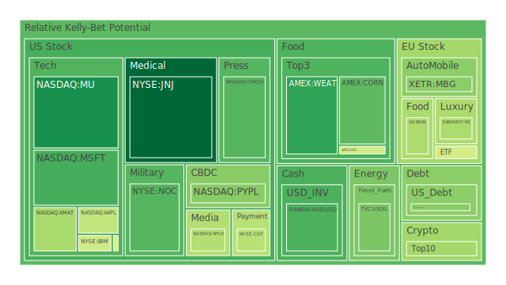
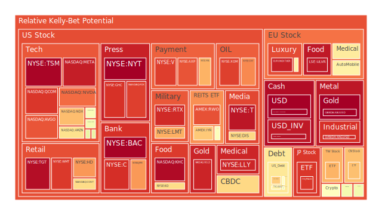
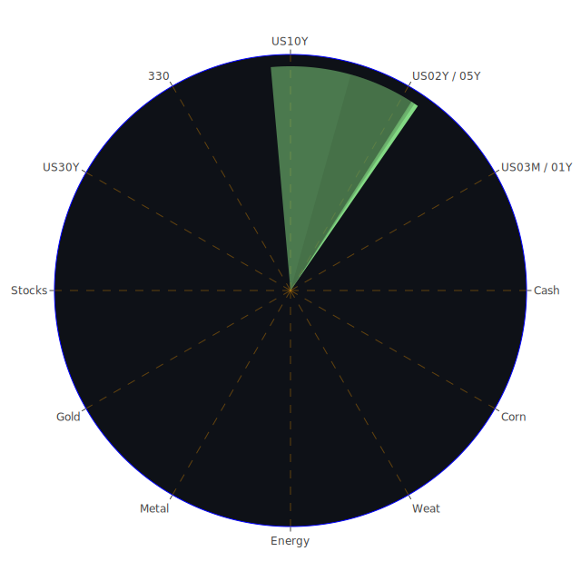

# **投資商品泡沫分析**

在深入探討各類資產之前，我們必須認知到，評估資產是否存在「泡沫」本身就是一個複雜的過程。高風險評分並不必然意味著即將崩盤，低風險評分也不代表絕對安全。這些評分更多是反映了當前價格相對於歷史波動、市場情緒、資金流動等多重因素的綜合狀態。我們的分析將結合這些量化指標與宏觀背景、新聞事件進行解讀。

* 美國國債 (US03MY, US01Y, US02Y, US05Y, US10Y, US20Y, US30Y)  
  觀察美國國債收益率曲線，短期收益率（如3個月期4.32%、1年期4.07%、2年期3.89%）相較於去年高點雖有回落，但仍處於相對較高水平，反映市場對聯準會短期內維持限制性政策的預期，或至少降息步伐緩慢。中長期收益率（如5年期4.00%、10年期4.38%、30年期4.84%）亦維持高位，且近期有所上揚。值得注意的是，10年期與3個月期利差（US10Y-03M）僅為0.06%，遠離去年的深度倒掛（-1.34%），但仍處於歷史低位，這通常被視為經濟衰退風險的警示信號，儘管其預測能力並非百分之百。從風險評分來看，短期國債（US03MY, US01Y, US02Y）的近期風險讀數呈現中高水平，特別是2年期國債的各週期風險評分均在0.6以上，可能反映了市場對於短期利率路徑的高度不確定性與頻繁交易。中長期國債（US10Y, US30Y）的風險評分則處於中等偏高水平。從經濟學角度看，國債收益率是全球資產定價的錨。當前的高利率環境對依賴融資的行業（如房地產、部分科技公司）構成壓力。社會心理層面，持續的利率不確定性可能加劇投資者焦慮，導致資金在避險資產（如短期國債、貨幣市場基金）和風險資產間頻繁流動。聯準會近期的鷹派言論（2次鷹派，0次鴿派）以及相對較高的聯邦基金有效利率（EFFR）交易量、高位的準備金餘額（FED Reserve）與持續縮減的總資產規模（FED Total Assets），都強化了市場對緊縮環境可能持續的預期。歷史上，持續的收益率曲線平坦化或倒掛往往預示著經濟放緩。博弈論視角下，市場正在與聯準會就未來的政策路徑進行博弈，任何超預期的經濟數據或政策信號都可能引發收益率的劇烈波動。  
* 美國零售股 (COST, WMT, TGT, HD)  
  零售股表現分化。必需消費品相關的COST和WMT展現出一定的韌性，但其風險評分也處於中高至高位（COST近期D1約0.66，WMT D1約0.90），顯示市場對其高估值可能存在擔憂，尤其是在消費者信貸拖欠率（Consumer Delinquent）相對較高的背景下。非必需消費品的TGT風險評分極高（近期D1高達0.97），可能反映了市場對其在經濟放緩預期下盈利能力的擔憂，以及競爭加劇的壓力。家裝零售商HD的風險評分也處於高位（D1約0.77），雖然固定抵押貸款利率（Fixed Mortgage 30Y Rate）近期從高點略有回落，但仍高達6.76%，顯著高於去年同期的3.00%，這對房地產市場活躍度和相關的家裝需求構成壓力。經濟學上，零售業績是觀察消費者健康狀況的窗口。高利率、高通脹（儘管CPI年增率回落至2.40%）以及信用卡拖欠率上升（Charge-off Rate on Credit Card 100S相對高位）可能侵蝕消費者的購買力。社會學角度，消費習慣的改變（線上購物、追求性價比）和對經濟前景的擔憂影響消費決策。心理層面，財富效應（股市、房市波動）和對未來收入的預期直接影響消費信心。新聞中提及的大公司裁員潮（如Meta, UPS等）也加劇了對就業市場和未來消費能力的擔憂。  
* 美國科技股 (MSFT, AAPL, GOOG, AMZN, META, NVDA, TSLA, IBM)  
  大型科技股普遍呈現中高至極高的風險評分（MSFT D1約0.28但D30達0.65，AAPL D1約0.45，GOOG D1約0.49，AMZN D1約0.65，META D1高達0.95，NVDA D1約0.83，TSLA D1約0.52）。這反映了該板塊在經歷了顯著上漲後，市場對其估值水平、未來增長持續性以及潛在監管風險的高度關注。AI（人工智能）是推動許多科技股（特別是MSFT, GOOG, NVDA, META）估值的重要敘事（Conceptional/Psychology），但高估值本身也意味著更高的風險。新聞提到Palantir因估值過高而下跌，Alphabet因搜索業務警告而市值蒸發，顯示市場對科技股估值敏感度提高。TSLA股價雖有反彈，但其風險評分仍在中等偏高水平，面臨電動車市場競爭加劇和宏觀經濟壓力。IBM風險評分中等。經濟學角度，科技股對利率變動敏感，高利率環境增加其融資成本並降低未來現金流的折現價值。社會層面，科技巨頭面臨數據隱私（如Google在德州的和解案）、反壟斷等多重審查壓力。心理上，AI熱潮帶來了FOMO（害怕錯過）情緒，但也伴隨著對泡沫的擔憂。博弈論看，科技公司在AI領域的軍備競賽、與監管機構的互動都是重要的博弈場景。歷史經驗（如2000年網路泡沫）警示我們需警惕過度樂觀的預期。  
* 美國房地產指數 (VNQ, IYR, RWO)  
  房地產投資信託（REITs）相關的ETF風險評分處於中高至高位（VNQ D1約0.57，IYR D1約0.70，RWO D1約0.87）。這與持續高企的抵押貸款利率（30年期固定利率6.76%）密切相關。高利率不僅增加了購房者的負擔，也提高了REITs的融資成本和資本化率，對其估值構成壓力。FED數據顯示，商業地產拖欠率（Commercial Real Estate Delinquent）和房地產總體拖欠率（Real Estate Delinquent）均處於相對高位，紐約上州某中型城市被指為最艱難的房市，這些都印證了房地產市場面臨的困境。經濟學上，房地產是利率敏感性行業，也是經濟的重要支柱。社會學角度，居家辦公趨勢對商業地產（特別是辦公樓）需求產生長期影響，而高房價則加劇了社會不平等問題。心理層面，對房價下跌的預期可能導致買家持幣觀望。歷史上，房地產危機往往伴隨著金融系統的動盪。  
* 加密貨幣 (BTCUSD, ETHUSD, DOGEUSD)  
  加密貨幣市場波動性極高，風險評分也普遍處於中高水平（BTC D1約0.40，ETH D1約0.58，DOGE D1約0.50）。儘管價格相較於歷史高點可能有顯著距離（取決於比較的基準點），但其內在價值支撐仍存爭議，使其極易受到市場情緒、監管政策和宏觀流動性變化的影響。經濟學上，加密貨幣常被視為一種投機性資產，其與傳統金融市場的關聯性時有變化。在風險偏好上升時可能吸引資金，但在避險情緒主導時則可能被拋售。社會心理層面，加密貨幣社群文化、名人效應（如DOGE）以及對法定貨幣體系的不信任感都影響其價格。博弈論視角下，早期採用者、大型持有者（鯨魚）和監管機構之間的互動深刻影響市場走向。新聞中提到美國聯邦HR機構取消Workday合約可能涉及DOGE相關工作裁減，雖間接，但也反映了加密貨幣與實體經濟的某些聯繫以及潛在的監管或政策風險。  
* 金/銀/銅 (XAUUSD, XAGUSD, COPPER)  
  貴金屬黃金（XAUUSD）和白銀（XAGUSD）的風險評分處於極高水平（XAUUSD D1雖下降至接近1，但前幾日中等偏高；XAGUSD D1約0.93）。銅（COPPER）的風險評分也處於中高位（D1約0.51），且月度風險（D30）顯著偏高（0.68）。黃金價格接近歷史高位，受到地緣政治不確定性、央行購買以及對沖法定貨幣貶值風險等多重因素支撐。分析師甚至預期金價可能因資金流出美國資產而飆升（新聞）。白銀兼具貴金屬和工業金屬屬性，其價格波動通常比黃金更劇烈。銅價則與全球工業活動和經濟增長預期密切相關，近期的高風險評分可能反映了供應擔憂或對綠色能源轉型需求的預期。經濟學上，黃金通常被視為避險資產和通脹對沖工具，但其與利率呈負相關關係（高利率增加持有黃金的機會成本）。銅是經濟的晴雨表。社會心理層面，黃金是文化意義上的價值儲存手段，市場恐慌時易受追捧。博弈論中，央行購金行為、主要生產國的供應策略都是影響因素。金油比（53.65）和金銅比（700.30）均處於相對高位，可能暗示相對於能源和工業金屬，黃金的避險屬性或貨幣屬性在當前更受重視。  
* 黃豆 / 小麥 / 玉米 (SOYB, WEAT, CORN)  
  農產品相關ETF的風險評分處於中低至中等水平（SOYB D1約0.47, WEAT D1約0.26, CORN D1約0.31）。這類商品價格主要受全球供需關係、天氣狀況、地緣政治（如影響黑海糧食走廊）以及貿易政策（如關稅）影響。新聞提到中國因自身作物受高溫影響而購買加拿大和澳大利亞小麥，顯示了天氣和貿易流向的變化。經濟學上，糧食價格是影響CPI的重要因素，也關係到全球糧食安全。社會學角度，糧食價格波動對低收入群體影響尤甚。心理層面，對極端天氣或供應鏈中斷的擔憂可能引發囤積行為或投機交易。  
* 石油/ 鈾期貨 (USOIL, UX1\!)  
  石油（USOIL）價格相對較低（約61.21美元），其風險評分近期從高位回落至中低水平（D1約0.35），但先前波動較大。這可能反映了市場對全球經濟增長放緩導致需求減弱的擔憂，以及OPEC+產量政策、地緣政治風險（影響供應）等多空因素的拉鋸。鈾期貨（UX1\!）風險評分處於中等偏高水平（D1約0.55），可能受到核能復興趨勢、能源轉型需求以及供應鏈穩定性等因素影響。經濟學上，油價是通脹的重要驅動因素，也影響全球經濟成本。鈾價則關係到核電的經濟性。社會心理層面，能源安全擔憂和環保壓力影響能源政策和投資流向。博弈論視角，產油國之間的合作與競爭、大國能源戰略是關鍵。  
* 各國外匯市場 (AUDUSD, GBPUSD, EURUSD, USDJPY)  
  美元（以相對其他貨幣衡量，如USDJPY）表現強勢，USDJPY的風險評分極高（D1接近1），顯示市場對日元持續貶值或干預預期的高度關注。歐元兌美元（EURUSD）風險評分極高（D1約0.97），英鎊兌美元（GBPUSD）風險評分中等偏高（D1約0.52），澳元兌美元（AUDUSD）風險評分則從低位跳升至中等（D1約0.29）。這反映了在全球經濟不確定性、利率差異（美國利率相對較高）以及避險情緒下，美元的相對吸引力。經濟學上，匯率受利率差、經濟增長前景、貿易平衡和資本流動影響。社會心理層面，對各國經濟政策的信心、地緣政治風險感知都會影響貨幣流向。博弈論中，各國央行的貨幣政策獨立性與協調性、干預市場的意願與能力是關鍵。美元強勢通常對美國進口有利（抑制通脹）但對出口不利，同時增加其他國家償還美元債務的壓力。  
* 各國大盤指數 (NDX, 0050, FCHI, GDAXI, FTSE, JPN225, 000300\)  
  全球主要股指風險評分普遍偏高。美國納斯達克100指數（NDX）風險評分高（D1約0.72），台灣50指數（0050）風險評分亦處於高位且近期有所上升（D1約0.73），日本日經225指數（JPN225）風險評分極高（D1約0.91），中國滬深300指數（000300）風險評分高（D1約0.71），歐洲主要股指如法國CAC40（FCHI）、德國DAX（GDAXI）、英國富時100（FTSE）也處於中高至高風險水平。這表明儘管各地經濟基本面存在差異，但全球市場普遍受到宏觀不確定性（特別是美中貿易戰、全球利率環境）和高估值的困擾。經濟學角度，股指是經濟的晴雨表，但也受流動性、市場情緒影響。社會心理層面，全球化背景下市場情緒容易相互傳染，地緣政治風險（如新聞中烏克蘭危機、波蘭/匈牙利政治動態）也打壓風險偏好。博弈論看，國際資本流動、各國刺激政策效果、貿易談判結果都是影響因素。新聞中提及美中貿易談判是市場焦點，顯示其對全球風險資產的重要性。  
* 美國半導體股 (NVDA, AVGO, TSM, MU, AMAT, KLAC, INTC, QCOM)  
  半導體行業內部風險評分分化但普遍偏高。AI驅動的龍頭如NVDA（D1約0.83）、AVGO（D1約0.86）以及代工巨頭TSM（D1接近1）風險評分極高，反映了市場對其高增長預期和高估值的定價，同時也蘊含較大波動風險。其他如AMAT（D1約0.41）、KLAC（D1約0.53）、QCOM（D1約0.91）風險評分也處於中高至極高水平。相對而言，MU（D1約0.22）和INTC（D1約0.56）風險評分稍低或處於中等偏高。經濟學上，半導體是現代經濟的基石，具有週期性，目前受到AI需求的結構性提振，但也面臨宏觀經濟放緩和地緣政治（如出口管制）的挑戰。社會層面，半導體技術競賽關乎國家競爭力。心理層面，AI敘事主導了市場對該板塊的看法，容易產生羊群效應。博弈論視角，供應鏈韌性、技術標準之爭、國家補貼政策都是關鍵。  
* 美國銀行股 (JPM, BAC, C, COF)  
  大型銀行股風險評分處於高至極高水平（JPM D1約0.77，BAC D1接近1，C D1約0.92，COF D1約0.43但月度風險也高）。這可能反映了市場對信貸質量惡化（如FED數據顯示的各類拖欠率上升）、潛在監管加強以及高利率環境對銀行淨息差影響的擔憂。儘管銀行存款總額（US Bank Total Deposits）仍相對較高，但商業地產貸款風險、信用卡違約風險依然是關注點。經濟學上，銀行是經濟的血液，其健康狀況與宏觀經濟緊密相連。社會心理層面，對金融系統穩定性的擔憂可能在壓力時期被放大。博弈論中，銀行在風險管理、應對監管和市場競爭中的策略至關重要。  
* 美國軍工股 (LMT, NOC, RTX)  
  軍工股風險評分處於高位（LMT D1約0.74，NOC D1約0.30但週度和月度風險高達0.7以上，RTX D1約0.93）。地緣政治緊張局勢（如烏克蘭戰爭、潛在的台海衝突、中東局勢等）通常被視為利好軍工行業的因素，推動國防開支增加。然而，高風險評分可能也反映了估值偏高、政府預算限制或對衝突緩和的預期。經濟學上，國防開支受政府預算和地緣政治驅動。社會心理層面，安全焦慮感上升可能增加對軍工企業的支持。新聞中提及對俄羅斯施壓要求停火，以及烏克蘭發現匈牙利間諜網絡等，都凸顯了持續的地緣政治風險。  
* 美國電子支付股 (V, MA, PYPL, AXP, GPN)  
  支付公司風險評分普遍偏高（V D1約0.90，MA D1約0.74，AXP D1約0.86，PYPL D1約0.36但週度和月度風險極高，GPN D1約0.57但月度風險也高）。這類公司受益於消費從現金轉向電子的長期趨勢，但也面臨宏觀經濟放緩（影響交易量）、競爭加劇（金融科技挑戰）和監管壓力。高風險評分可能反映了對經濟放緩影響消費支出、以及估值偏高的擔憂。PYPL的極高週度和月度風險可能與其特定的轉型挑戰或市場預期有關。經濟學上，支付行業與消費支出和經濟活動密切相關。社會學角度，支付習慣變革、金融普惠性是重要議題。  
* 美國藥商股 (JNJ, LLY, MRK, NVO)  
  大型製藥公司風險評分分化。LLY（D1約0.93）和NVO（D1約0.58但月度風險高）風險評分高，可能與其減肥藥等重磅產品的熱銷和高市場預期有關，但也伴隨著估值擔憂和潛在的藥價監管風險。JNJ（D1約0.15）風險評分相對較低，可能因其業務多元化和相對穩定的特性。MRK（D1約0.65）處於中高水平。經濟學上，醫藥行業具有一定的防禦性，但也受專利懸崖、研發成功率和醫保政策影響。社會層面，藥品可及性、定價倫理是持續關注的焦點。心理層面，對突破性療法的期待可能推高相關公司估值。  
* 美國影視股 (NFLX, DIS, PARA)  
  影視媒體股風險評分處於中高至高位（NFLX D1約0.42，DIS D1約0.67，PARA D1約0.50）。該行業面臨流媒體競爭白熱化、內容成本上升、廣告市場疲軟以及消費者訂閱疲勞等挑戰。高風險評分反映了市場對其盈利模式可持續性和激烈競爭格局的擔憂。經濟學上，廣告收入和訂閱收入對經濟週期敏感。社會學角度，內容創作的文化影響力、媒體所有權集中度是關注點。心理層面，用戶對內容的偏好快速變化。  
* 美國媒體股 (CMCSA, FOX, NYT)  
  傳統媒體與新媒體融合的公司風險評分亦不低。CMCSA（D1約0.30）風險相對較低，但FOX（D1約0.89）和NYT（D1為1，最高）風險評分極高。這可能反映了廣告市場的壓力、向數位化轉型的挑戰、以及在日益分化的社會中維持公信力和讀者/觀眾基礎的困難。NYT的極高風險評分可能與其特定經營狀況或市場預期有關。  
* 石油防禦股 (XOM, OXY)  
  大型石油公司風險評分處於高位（XOM D1約0.89，OXY D1約0.79）。儘管油價本身近期有所回落，但這些公司的股價可能受到派息穩定性、能源轉型中的戰略定位以及地緣政治風險溢價等多重因素影響。高風險評分可能反映了對油價長期前景的不確定性、環保壓力以及高額資本開支的需求。  
* 金礦防禦股 (RGLD)  
  金礦股RGLD風險評分極高（D1約0.94）。金礦股通常與金價正相關，但其波動性更大，因為它們還受到運營成本、開採風險、政治風險（礦區所在地）等因素影響。極高的風險評分伴隨著近期黃金價格的高位運行，可能反映了市場的高度關注和對未來金價走勢的博弈，同時也意味著較大的下行風險。  
* 歐洲奢侈品股 (MC, RMS, KER)  
  歐洲奢侈品巨頭風險評分分化。LVMH (MC) 風險評分中等偏高（D1約0.41），Hermes (RMS) 風險評分高（D1約0.61），而Kering (KER) 風險評分極高（D1約0.94）。奢侈品行業對全球宏觀經濟，特別是高淨值人群的財富效應和消費信心敏感。KER的極高風險可能與其旗下品牌（如Gucci）的轉型挑戰有關。新聞中提及的美中貿易戰升級可能影響全球貿易和消費者信心，對奢侈品銷售構成潛在威脅。經濟學上，奢侈品是典型的順週期消費。社會心理層面，品牌形象、社會地位象徵、文化潮流影響需求。  
* 歐洲汽車股 (MBG, BMW, PAH3)  
  歐洲汽車製造商風險評分處於中高水平（MBG D1約0.37，BMW D1約0.61，PAH3 D1約0.61）。傳統汽車製造商面臨向電動化轉型的巨大挑戰，同時還要應對來自特斯拉和中國電動車企的激烈競爭，以及全球經濟放緩對汽車需求的影響。歐盟試圖反制美國關稅的舉措（新聞）可能涉及汽車行業，增加了政策不確定性。  
* 歐美食品股 (NESN, ULVR, KHC, KO)  
  大型食品飲料公司風險評分處於中高至極高水平。雀巢（NESN）風險評分中等偏高（D1約0.41），聯合利華（ULVR）風險評分極高（D1約0.96），卡夫亨氏（KHC）風險評分極高（D1約0.98），可口可樂（KO）風險評分高（D1約0.66）。作為必需消費品，這些公司通常被認為具有防禦性，但在成本上升（原材料、運輸）、定價能力受限以及消費者轉向更廉價替代品或自有品牌的壓力下，其利潤空間可能受到擠壓。高風險評分可能反映了市場對其應對成本壓力和維持增長能力的擔憂。

# **宏觀經濟傳導路徑分析**

當前的宏觀環境呈現出多條潛在的傳導路徑：

1. **美聯儲政策 \-\> 全球利率 \-\> 資產估值與經濟活動：** 聯準會維持相對鷹派的立場（近期鷹派發言，高企的短期利率，縮表持續），通過全球美元流動性和利率預期，推高全球融資成本。這直接壓抑利率敏感性資產的估值（如成長型科技股、房地產），增加企業和個人的借貸成本，可能抑制投資和消費，最終傳導至經濟增長放緩。FED數據顯示的高收益債利率（High Yield Bond Interest Rate）、信用卡及各類貸款拖欠率上升是這一路徑的體現。歷史上，緊縮週期往往伴隨著經濟下行壓力。  
2. **美中貿易摩擦 \-\> 全球供應鏈與通脹 \-\> 企業利潤與市場情緒：** 新聞密集報導貿易戰升級（中國對美出口驟降、關稅威脅、談判持續但緊張），這可能擾亂全球供應鏈，推高特定商品成本（如聯準會官員警告關稅可能推高通脹、降低生產率），侵蝕企業利潤（特別是依賴國際貿易的公司），並打擊市場信心（股市波動加劇）。這從經濟學（貿易理論）、社會學（就業影響）和博弈論（國家間策略互動）角度都可解釋。  
3. **地緣政治風險 \-\> 能源/商品價格與避險情緒 \-\> 資本流動：** 烏克蘭衝突持續、中東潛在風險、以及其他地區的不穩定因素（新聞提及多個地區），可能導致能源和部分商品價格波動（如石油、黃金），推升避險情緒。這會促使資金流向避險資產（如美元、黃金、短期國債），流出風險較高的資產或地區（如新興市場、風險較高的股票）。FED數據中貨幣市場基金資產（Money Market Funds Total Assets）走高可能部分反映了這種避險傾向。  
4. **通脹回落與經濟韌性 \-\> 政策路徑預期 \-\> 市場反應：** 儘管存在風險，但CPI年增率已從高點回落（至2.40%），且部分經濟數據（如公用事業需求強勁）顯示出一定韌性。若通脹持續受控且經濟未出現硬著陸，可能改變市場對聯準會政策路徑的預期（轉向鴿派），從而提振風險資產。然而，當前FED的鷹派表態和高企的拖欠率數據使得這一路徑的可能性降低，市場更多處於對滯脹或衰退的擔憂中。心理層面，市場在希望（軟著陸）與恐懼（衰退）之間搖擺。

# **微觀經濟傳導路徑分析**

1. **企業盈利壓力 \-\> 裁員與成本控制 \-\> 消費與投資意願：** 新聞報導多家大型企業裁員（Morgan Stanley, Wayfair, UPS, Meta等），這直接影響家庭收入和消費信心（社會學、心理學），可能進一步抑制零售銷售（如TGT, HD）。企業為維持利潤可能削減資本開支，影響相關供應鏈（經濟學）。  
2. **特定行業趨勢（如AI） \-\> 投資集中與估值分化 \-\> 風險積聚：** AI熱潮帶動半導體（NVDA, TSM）和部分科技股（MSFT, GOOG）的強勁表現，吸引大量資金流入，但也推高了估值，使得這些股票對負面消息（如監管、競爭加劇、業績不及預期）的敏感度增加。這種集中投資可能放大行業性風險（如Palantir因估值擔憂下跌）。  
3. **信貸環境收緊 \-\> 企業融資困難與違約風險 \-\> 金融穩定性：** 高利率和銀行可能更審慎的放貸標準，增加了企業（特別是中小企業和高負債企業）的融資難度。FED數據顯示的信用卡、商業地產和消費者貸款拖欠率上升，是信貸壓力增大的跡象。若違約事件增多，可能傳導至銀行體系，影響金融穩定（經濟學、歷史經驗）。

# **資產類別間傳導路徑分析**

1. **利率 \-\> 股債關係與風格輪動：** 國債收益率上升通常對股市（特別是成長股）構成壓力，因為它提高了貼現率並提供了更具吸引力的替代投資。資金可能從股票流向債券，或在股票內部從成長風格轉向價值/防禦風格（如公用事業、部分必需消費品）。當前高利率環境下，科技股與國債收益率的負相關性可能較為顯著。  
2. **美元 \-\> 商品與國際資產：** 強勢美元通常壓低以美元計價的商品價格（如黃金、石油、銅），因為對持有其他貨幣的買家來說更貴了。同時，強美元也可能導致資金從新興市場回流美國，對新興市場貨幣和股市造成壓力。USDJPY的極高風險評分與日元的疲軟是例證。  
3. **風險情緒 \-\> 跨資產流動（Risk-on/Risk-off）：** 市場情緒的變化會引發資金在不同風險等級資產間的流動。避險情緒升溫時（如貿易戰擔憂加劇），資金可能從股票、高收益債、加密貨幣流向美元、黃金、美國國債。反之，風險偏好改善時，資金流向可能逆轉。加密貨幣（BTC, ETH）與科技股（NDX）之間有時呈現正相關性，共同反映市場的風險偏好。  
4. **通脹預期 \-\> 商品與債券：** 對通脹預期的變化影響商品價格（黃金、石油、農產品）和通脹保值債券（TIPS，未在數據中列出）。若通脹預期升溫，可能推高商品價格，壓低名義債券價格（因實際收益率下降）。  
5. **相對價值關係的潛在變化（超越既有理論）：** 在當前複雜環境下，傳統的資產相關性可能被打破。例如，地緣政治風險可能同時推高黃金（避險）和石油（供應擔憂）價格，打破其通常的負相關性。AI對生產力的潛在提升可能在長期內改變成長股與價值股的相對吸引力，即使在利率上升的環境下。需要警惕基於歷史數據的相關性假設失效的風險。

# **投資建議**

基於上述分析，當前市場環境 характеризуется 高度不確定性、多數資產估值偏高（高風險評分普遍）、宏觀經濟下行風險（高利率、高拖欠率、貿易戰陰影）與結構性機會（如AI）並存。投資策略應側重風險管理、分散化配置，並根據自身的風險承受能力進行調整。

**投資組合配置建議 (總和100%)：**

* **穩健型 (Stable): 45%**  
  * 目標：資本保值，低波動，對沖風險。  
  * 配置思路：側重低風險評分資產、避險資產和短期現金等價物。  
  * **子項目配置建議:**  
    1. **短期美國國債/貨幣市場基金 (例如，參考 US03MY, US01Y 收益率，或相關ETF): 20%** \- 提供流動性和相對穩定的收益，受益於當前較高利率，風險評分相對可控。  
    2. **黃金 (XAUUSD 或相關ETF): 15%** \- 作為地緣政治和宏觀不確定性的對沖工具，儘管近期風險評分高，但其避險屬性在當前環境下仍有價值。關注其價格波動。  
    3. **低風險防禦性股票 (例如 JNJ): 10%** \- 選擇風險評分顯著較低、業務相對穩健、受經濟週期影響較小的公司，如醫療保健領域的JNJ（D1評分最低檔）。  
* **成長型 (Growth): 35%**  
  * 目標：尋求長期資本增值，承受中等波動。  
  * 配置思路：精選具有長期增長潛力但估值相對合理的資產，注重行業和地區分散。  
  * **子項目配置建議:**  
    1. **優質大型科技股 (例如 MSFT 或 NDX 指數ETF): 15%** \- 儘管風險評分不低，但如MSFT等在AI領域具有領先地位，長期增長潛力仍被看好。通過指數ETF可分散單一公司風險。需密切關注估值和宏觀環境變化。  
    2. **全球多元化股票指數ETF (排除風險極高的市場): 10%** \- 分散地域風險，但需謹慎選擇，避開風險評分極高（如接近1）的市場或區域指數。  
    3. **特定成長主題 (例如 醫療創新 NVO 或 半導體設備 AMAT): 10%** \- 選擇受益於長期結構性趨勢（如人口老齡化、AI基礎設施建設）且風險評分雖高但有基本面支撐的領域。例如NVO（D1中高）受益於減肥藥趨勢，AMAT（D1中等）受益於半導體資本開支。需嚴格風險控制。  
* **高風險型 (High-Risk): 20%**  
  * 目標：追求高回報，能承受較大波動甚至本金損失風險。  
  * 配置思路：配置於高波動性、高潛在回報但也伴隨極高風險的資產類別，或進行特定事件驅動的交易。  
  * **子項目配置建議:**  
    1. **加密貨幣 (例如 BTCUSD / ETHUSD 組合): 7%** \- 鑑於其高波動性和投機性，僅配置少量比例。認識到其風險評分（中高）和潛在的巨大價格波動。  
    2. **高風險/高估值科技股 (例如 NVDA 或 META): 8%** \- 選擇在AI等領域最具爆發力但風險評分也極高的股票（NVDA D1 0.83, META D1 0.95），押注其能持續超預期增長。風險極高。  
    3. **受特定事件影響的資產 (例如 交易波動性 或 特定受貿易戰影響的商品/股票): 5%** \- 進行短期、基於特定宏觀事件（如貿易談判結果）或市場情緒變化的交易，需要高度專業知識和風險管理能力。例如，利用波動性衍生品，或做多/做空受關稅影響顯著的資產。

# **風險提示**

上述所有分析和建議均基於截至報告日期的可用信息和數據。金融市場瞬息萬變，充滿不確定性。各類資產的風險評分（泡沫分數）僅為參考指標，不構成未來價格走勢的保證。特別需要警惕的是，數據顯示當前眾多資產類別，包括主要股指、科技股、銀行股、貴金屬、部分貨幣對等，均呈現出中高乃至極高的風險讀數，這提示投資者需要對潛在的市場調整或泡沫破裂風險保持高度警惕。

投資涉及風險，過往表現不預示未來回報。本報告提供的信息和觀點僅供參考，不應被視為任何投資建議或邀約。投資者在做出任何投資決策前，應充分考慮自身的財務狀況、投資目標、風險承受能力，並在必要時尋求獨立的專業財務顧問意見。市場波動可能導致本金損失。

 
Daily Buy Map:

 
Daily Sell Map:

 
Daily Radar Chart:

 
