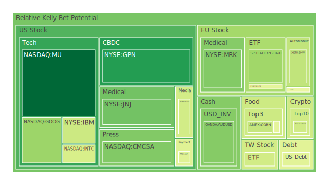
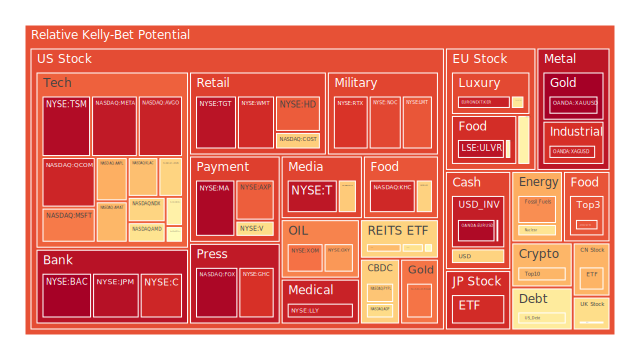
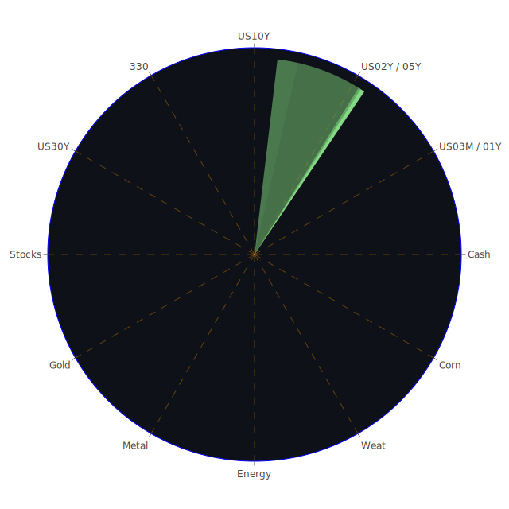

# **投資商品泡沫分析**

在當前複雜的全球金融環境下，各類資產的泡沫風險評估成為投資決策中至關重要的一環。以下將針對您提供的各類投資商品，基於2025年5月13日的數據（PP100為當日現價，泡沫分數越高即風險越高，泡沫指數D1/D7/D14/D30分別代表當日、七日平均、兩週平均及月平均風險分數），並結合相關新聞事件、歷史場景、相對價格關係及既有理論與潛在關聯性，進行專業論述。

**美國國債 (US01Y, US02Y, US03MY, US05Y, US10Y, US30Y)**

美國國債市場近期呈現複雜的 картина。以2025年5月13日的數據觀察，短天期國債如三個月期美債 (US03MY) 的PP100為4.40，其D1泡沫指數為0.457，但月平均D30則為相對較低的0.317，顯示短期波動可能加劇，但長期平均風險尚在控制範圍。一年期美債 (US01Y) PP100為4.13，D1為0.483，D30為0.495，風險水平較為一致。二年期美債 (US02Y) PP100為4.01，D1與D30均在0.61左右，顯示其風險感知在中短期內趨於穩定但偏高。

值得注意的是十年期美債 (US10Y)，PP100為4.47，D1泡沫指數達到0.609，顯著高於其月平均的0.446。這通常反映了市場對未來通膨預期、經濟增長及聯準會政策路徑的短期不確定性增加。三十年期美債 (US30Y) PP100為4.90，D1為0.554，D30為0.464，長天期債券的風險溢價在短期內有所提升。

從新聞事件來看，聯準會近期釋放的兩次鷹派言論，以及市場對美國與中國貿易談判結果的觀望（儘管最新消息指稱「取得實質進展」），都可能對國債殖利率產生影響。歷史上，在聯準會緊縮週期末期或經濟前景不明朗時，國債市場常出現波動。例如，1970年代末至1980年代初的高通膨及後續的緊縮政策，導致債券市場劇烈震盪。

經濟學角度，殖利率曲線的形態至關重要。目前美國10年期與3個月期公債殖利率差 (US Yield 10Y-03M) 為0.08，剛由負轉正，歷史上殖利率曲線倒掛常被視為經濟衰退的先行指標。社會學層面，公眾對政府財政赤字及債務上限問題的擔憂，也可能影響國債的吸引力。心理學上，市場避險情緒的升溫或降溫，會直接驅動資金流向或流出國債。博弈論觀點，大型機構投資者對聯準會政策的預判及倉位調整，形成了市場的主要動態。

FED經濟數據顯示，儘管「由公眾持有的債務佔GDP百分比」處於相對高位，且「美國公債總流通量」相對較低，但「聯準會持有的美國公債流通量」及「國內公眾持有的美國公債流通量」均處於高位，顯示內部需求尚可。然而，「外國機構持有的美國公債流通量」偏低，可能暗示國際投資者信心不足或尋求更高收益的替代品。

**美國零售股 (COST, HD, TGT, WMT)**

零售股表現分化。Costco (COST) PP100為1016.15，D1為0.663，D30為0.501，顯示其泡沫風險在近期有所上升，但月平均尚可。Walmart (WMT) PP100為96.75，D1高達0.917，月平均D30亦有0.812，泡沫風險顯著。Target (TGT) PP100為101.08，D1及D30均在0.96以上，風險極高。Home Depot (HD) PP100為376.59，D1為0.839，D30為0.669，風險亦偏高。

新聞中提及「中產階級在『輕奢品』上的支出減少」，以及「酒類消費下降，大麻二酚(THC)趁勢而起」，反映了消費習慣的轉變及潛在的消費降級趨勢，這對零售業，特別是非必需消費品零售商，可能構成壓力。然而，「DEI在股東戰役中勝出」可能提升企業形象，吸引特定消費者群體。歷史上，經濟衰退預期升溫時，必需消費品零售商（如Walmart）通常較非必需消費品零售商（如Target, Home Depot部分業務）更具防禦性。

經濟學上，零售銷售數據是衡量消費者信心的重要指標。高利率環境及潛在的就業市場不確定性（新聞提及「2025畢業生面臨不確定的就業市場」）可能抑制消費支出。社會學角度，消費習慣的變遷，如對永續性、性價比的重視，影響零售商的策略。心理學上，消費者的「口紅效應」或「末日消費」心態，在不同經濟階段會影響不同品類的零售表現。博弈論觀點，零售商之間的價格戰、供應鏈管理效率及會員制度的吸引力，是競爭的關鍵。

值得注意的是，美國信用卡拖欠率（Charge-off Rate on Credit Card 100S）處於相對高位，消費者拖欠率亦高，這對依賴信貸消費的零售業是不利信號。

**美國科技股 (AAPL, AMZN, GOOG, META, MSFT, NVDA, PLTR-indirectly, TSLA)**

科技股普遍呈現較高的泡沫風險。Microsoft (MSFT) PP100為449.26，D1高達0.796，D30為0.642。Apple (AAPL) PP100為210.79，D1為0.720，D30為0.595。Nvidia (NVDA) PP100為123.00，D1為0.579（相較前幾日有所回落），D30為0.593。Meta (META) PP100為639.43，D1及D30均在0.9以上，風險極高。Alphabet (GOOG) PP100為159.58，D1為0.340，D30為0.621，相對風險較低但月均仍高。Amazon (AMZN) PP100為208.64，D1為0.652，D30為0.755。Tesla (TSLA) PP100為318.38，D1為0.545，D30為0.403，月平均風險相對較低。

新聞事件中，「OpenAI企業採用加速」對MSFT及整體AI產業鏈是正面消息，但「Palantir股價因估值過高而下跌」則敲響了警鐘，顯示市場對高估值科技股的審慎態度。Tesla股價連漲三週，顯示其市場情緒有所回暖。然而，「微軟與OpenAI可能重新談判合作夥伴關係」以及「川普解僱版權局局長，因報告引發對AI訓練的質疑」為AI領域帶來不確定性。

歷史上，2000年的科網泡沫破裂是深刻的教訓，當時市場對缺乏堅實盈利支撐的「新經濟」概念過度追捧。當前AI熱潮雖有實際應用支持，但部分個股估值已達歷史高位，需警惕情緒降溫後的修正。經濟學上，科技股的增長預期、利率敏感性及創新能力是核心驅動因素。高利率環境對成長型科技股的估值構成壓力。社會學角度，科技發展對社會結構、就業及倫理的影響，引發廣泛討論。心理學上，「錯失恐懼症」(FOMO)常驅動散戶追高，而機構投資者則更關注長期價值與風險控制。博弈論觀點，科技巨頭間的平台競爭、標準制定及人才爭奪日趨激烈。

**美國房地產指數 (IYR, VNQ, RWO)**

美國房地產指數普遍泡沫風險較高。IYR PP100為94.66，D1為0.698，D30高達0.808。VNQ PP100為89.60，D1為0.550，D30為0.440。RWO PP100為44.13，D1為0.623，D30為0.489。

新聞提及「紐約州北部一中型城市成為春季最嚴峻的房地產市場」，以及「房貸利率雖較上月下降，但仍遠高於去年同期」（FRED數據顯示30年期固定房貸利率為6.76%，去年為3.00%）。這反映了高利率環境對房地產市場的持續壓力。歷史上，房地產市場的繁榮與衰退往往與信貸條件、人口結構及經濟週期密切相關。2008年的次貸危機即是房地產泡沫破裂引發系統性風險的典型案例。

經濟學上，房地產市場受供需關係、利率水平、建築成本及居民收入預期影響。FED數據顯示「商業房地產拖欠率」及「房地產拖欠率」均處於相對高位，是危險信號。社會學角度，住房擁有率、代際差異及城市化進程均影響房地產市場格局。心理學上，購房者的預期（漲價或降價）會自我實現，影響市場動能。博弈論觀點，開發商、銀行、購房者及監管機構間的互動決定市場走向。

**加密貨幣 (BTCUSD, ETHUSD, DOGEUSD)**

加密貨幣市場近期波動，泡沫風險中等偏高。Bitcoin (BTCUSD) PP100為102586.00，D1為0.738，D30為0.470，短期風險上升但月平均尚可。Ethereum (ETHUSD) PP100為2480.01，D1為0.429，D30為0.530。Dogecoin (DOGEUSD) PP100為0.2299，D1為0.547，D30為0.479。

新聞事件中並未直接提及加密貨幣，但科技股的風險偏好變化，以及全球金融市場的流動性狀況，都可能間接影響加密貨幣。歷史上，加密貨幣市場經歷過多次暴漲暴跌，其高波動性及監管不確定性是主要特徵。

經濟學上，加密貨幣的價值來源、交易媒介功能及通縮/通膨特性仍具爭議。部分觀點認為其可作為另類價值儲存或對沖法定貨幣風險的工具。社會學角度，加密貨幣代表了一種去中心化的思潮，吸引了特定社群。心理學上，投機心態、羊群效應及對新技術的狂熱，在加密貨幣市場中表現得淋漓盡致。博弈論觀點，早期採用者的優勢、礦工的算力競爭以及交易所的影響力，共同塑造市場格局。FED數據中的「貨幣市場基金總資產」持續走高，顯示部分資金可能在尋求避險或更高收益，這與加密市場的資金流動可能存在微妙的互動關係。

**金/銀/銅 (XAUUSD, XAGUSD, FX:COPPER)**

貴金屬與工業金屬表現各異。黃金 (XAUUSD) PP100為3237.33，D1泡沫指數飆升至0.998，但D30僅為0.465，顯示當日有極端波動，需警惕短期過熱。白銀 (XAGUSD) PP100為32.58，D1高達0.926，D30亦有0.855，整體泡沫風險非常高。銅 (FX:COPPER) PP100為4.62，D1為0.521，D30高達0.663，顯示工業需求預期強勁，但月平均風險偏高。

新聞事件中，「黃金若美國資產吸引力微降，則可能飆升80%至6000美元」，反映市場對黃金避險及價值重估的預期。地緣政治緊張局勢（如美對烏克蘭盟友施壓普丁，印巴衝突雖有停火但水資源條約仍中止）通常利好黃金。歷史上，黃金在經濟不確定性、高通膨及地緣政治衝突時期常被視為避風港。

經濟學上，黃金價格受利率（實際利率）、美元匯率、通膨預期及避險需求影響。白銀兼具貴金屬與工業屬性。銅價則被視為全球經濟的「晴雨表」。黃金石油比率 (GOLD OIL RATIO) 為52.32，黃金銅比率 (GOLD COPPER RATIO) 為700.24，這些相對價格關係可反映市場對不同資產的偏好及經濟預期。社會學角度，黃金在多種文化中具有儲值保值的傳統觀念。心理學上，恐慌指數上升時，黃金吸引力增強。博弈論觀點，各國央行對黃金儲備的調整，以及大型基金的配置策略，對金價有顯著影響。

**黃豆 / 小麥 / 玉米 (SOYB, WEAT, CORN)**

農產品方面，黃豆 (SOYB) PP100為22.22，D1高達0.851，D30為0.603，風險顯著。小麥 (WEAT) PP100為4.39，D1為0.474，D30為0.419，風險相對溫和。玉米 (CORN) PP100為18.30，D1為0.408，D30為0.455，風險亦屬溫和。

新聞事件中未直接提及農產品，但地緣政治（如烏克蘭相關局勢）及極端天氣事件，歷史上均為影響農產品價格的重要因素。經濟學上，農產品價格受供需基本面、天氣、庫存、能源價格（影響農機及化肥成本）及貿易政策影響。社會學角度，糧食安全是各國政府高度重視的議題。心理學上，對糧食短缺的恐慌可能引發囤積行為及價格上漲。博弈論觀點，主要糧食出口國的政策、大型貿易商的庫存管理及投機基金的參與，共同影響市場。

**石油/ 鈾期貨UX\! (USOIL, UX1\!)**

能源市場中，石油 (USOIL) PP100為61.84，D1飆升至0.768，但D30僅為0.203，顯示短期投機或事件驅動導致價格劇烈波動，但月平均風險仍低。鈾期貨 (UX1\!) PP100為71.60，D1為0.614，D30為0.489，風險偏高，可能反映了市場對核能復興及供應緊張的預期。

新聞提及「川普渴望廉價石油惹惱其鍾愛的產業」及「川普貿易戰衝擊沙烏地石油巨頭利潤」，顯示政治因素對油價的干擾。歷史上，OPEC政策、地緣政治衝突（特別是中東地區）及全球經濟增長狀況是影響油價的主導因素。經濟學上，油價與全球經濟活動密切相關，同時也受美元匯率及投機活動影響。社會學角度，能源轉型及環保議題對傳統化石能源構成長期挑戰。心理學上，對能源短缺的擔憂會推高價格預期。博弈論觀點，產油國組織的產量協調、主要消費國的戰略儲備釋放，以及能源公司與金融機構的對賭，構成了複雜的市場博弈。

**各國外匯市場 (AUDUSD, EURUSD, GBPUSD, USDJPY)**

澳元兌美元 (AUDUSD) PP100為0.6400，D1為0.307，D30為0.391，泡沫風險相對較低。歐元兌美元 (EURUSD) PP100為1.1100，D1高達0.979，D30為0.815，泡沫風險極高，可能反映市場對歐洲央行政策或經濟前景的劇烈反應。英鎊兌美元 (GBPUSD) PP100為1.3200，D1為0.547，D30為0.447，風險中等。美元兌日圓 (USDJPY) PP100為148.23，D1為0.654，D30為0.627，風險偏高，可能與美日利差及日本央行政策預期有關。

新聞中，「美國與中國貿易談判取得實質進展」可能提振風險偏好，影響澳元等商品貨幣。同時，「歐盟積極反制川普關稅」顯示貿易保護主義抬頭，增加外匯市場不確定性。歷史上，各國經濟基本面差異、利率政策分歧及資本流動是驅動匯率變動的主要因素。經濟學的購買力平價理論、利率平價理論是分析匯率的基礎框架。社會學角度，國民對本國貨幣的信心、移民及跨境旅遊等因素亦有影響。心理學上，市場對一國經濟前景的集體預期，會顯著影響該國貨幣。博弈論觀點，各國央行在外匯市場的干預、大型跨國企業的匯率風險管理及外匯交易員的策略，共同決定匯率走勢。FED數據中「各商業銀行與外國相關辦事處淨應付款」處於高位，可能反映資金流動的某些趨勢。

**各國大盤指數 (0050, FCHI, GDAXI, FTSE, JPN225, NDX, 000300\)**

台灣50 (0050) PP100為176.70，D1為0.432，D30為0.676，月平均風險偏高。法國CAC40 (FCHI) PP100為7861.90，D1為0.472，D30為0.590。德國DAX (GDAXI) PP100為23607.00，D1為0.345，D30為0.546。英國FTSE100 (FTSE) PP100為8615.30，D1為0.632，D30為0.568。日經225 (JPN225) PP100為38579.72，D1高達0.915，D30為0.729，泡沫風險極高。納斯達ック100 (NDX) PP100為20868.15，D1為0.649，D30為0.753，風險亦高。滬深300 (000300) PP100為3890.61，D1為0.711，D30為0.535。

全球股市普遍呈現一定泡沫風險，尤其日經指數。新聞中「美股三大指數上週震盪收低，因華爾街為美中會談做準備」及「『五月賣股走人』？歷史性波動正衝擊投資人最愛的季節性指標」均指向市場的謹慎情緒。然而，「美中貿易談判取得實質進展」的後續報導，可能為市場帶來短期提振。歷史經驗顯示，全球股市聯動性高，一個主要市場的劇烈波動可能引發連鎖反應。

經濟學角度，股市是經濟的晴雨表，反映了對未來企業盈利和宏觀經濟的預期。社會學層面，投資者結構（散戶與機構佔比）、社會事件（如學運：新聞提及「哥倫比亞大學因圖書館佔領事件開除逾65名學生」）引發的社會情緒，都可能間接影響市場。心理學上，市場的貪婪與恐懼情緒交替主導，形成週期性波動。博弈論觀點，不同市場參與者基於自身資訊和預期的博弈，決定了資產價格。

**美國半導體股 (AMAT, AVGO, INTC, KLAC, MU, NVDA, QCOM, TSM)**

半導體股多數處於高泡沫風險區。Applied Materials (AMAT) PP100為167.99，D1為0.706，D30為0.744。Broadcom (AVGO) PP100為221.58，D1高達0.933，D30為0.822。Intel (INTC) PP100為22.18，D1為0.444，D30為0.489，相對風險較低。KLA Corp (KLAC) PP100為760.47，D1為0.690，D30為0.502。Micron Technology (MU) PP100為92.29，D1大幅下降至0.077，但D30仍有0.363，需觀察其風險是否持續降低。Nvidia (NVDA) 見科技股分析。Qualcomm (QCOM) PP100為152.12，D1高達0.926，D30為0.791。TSMC (TSM) PP100為186.98，D1及D30均在0.97以上，泡沫風險極端嚴重。

半導體產業受益於AI、5G、物聯網等長期趨勢，但也具有高度週期性。新聞事件中AI相關消息對半導體產業影響重大。歷史上，半導體庫存週期及產能擴張競賽常導致供需失衡和價格波動。經濟學上，半導體是現代經濟的基石，其景氣度與全球宏觀經濟緊密相連。社會學角度，晶片技術的戰略重要性日益凸顯，引發「晶片戰爭」等地緣政治競爭。心理學上，對新技術應用的樂觀預期容易推高估值。博弈論觀點，晶圓代工廠的定價權、IC設計公司與設備商之間的合作與競爭，共同塑造產業格局。

**美國銀行股 (AXP, BAC, C, COF, JPM)**

美國主要銀行股普遍泡沫風險極高。American Express (AXP) PP100為298.92，D1為0.837，D30為0.789。Bank of America (BAC) PP100為43.36，D1高達0.995，D30亦有0.962。Citigroup (C) PP100為74.91，D1為0.925，D30為0.865。Capital One (COF) PP100為199.95，D1為0.463，D30為0.480，風險相對其他大型銀行較低。JPMorgan Chase (JPM) PP100為260.05，D1高達0.966，D30為0.724。

銀行股的表現與利率環境、信貸品質及經濟前景密切相關。FED數據顯示「信用卡百強銀行壞帳率」及「消費者拖欠率」高企，對銀行資產品質構成威脅。然而，高利率環境有助於擴大銀行淨息差。歷史上，金融危機往往伴隨著銀行股的重挫。經濟學上，銀行的中介功能、風險管理能力及盈利模式是核心。社會學角度，公眾對銀行體系的信任至關重要。心理學上，對系統性金融風險的擔憂會導致銀行股被拋售。博弈論觀點，銀行間的競爭、監管機構的政策及大型客戶的選擇，影響銀行經營。

**美國軍工股 (LMT, NOC, RTX)**

軍工股泡沫風險顯著。Lockheed Martin (LMT) PP100為473.16，D1為0.849，D30為0.746。Northrop Grumman (NOC) PP100為479.16，D1為0.871，D30為0.730。RTX Corp (RTX) PP100為130.56，D1高達0.901，D30為0.759。

新聞中地緣政治緊張局勢（烏克蘭、印巴）持續，理論上利好軍工股。歷史上，戰爭及地區衝突頻發時期，軍工訂單增加，股價上漲。經濟學上，國防開支是軍工企業的主要收入來源。社會學角度，軍工產業的發展與國家安全觀念、國際關係格局相關。心理學上，對國家安全的擔憂及愛國主義情緒可能影響對軍工股的投資偏好。博弈論觀點，國家間的軍備競賽、軍火出口管制及軍事同盟關係，均影響軍工產業。

**美國電子支付股 (AXP, GPN, MA, PYPL, V)**

電子支付股風險普遍偏高。American Express (AXP) 見銀行股。Global Payments (GPN) PP100為83.14，D1大幅下降至0.180，月平均D30為0.555，顯示短期風險驟降但月均仍高。Mastercard (MA) PP100為578.27，D1高達0.983，D30為0.793，風險極高。PayPal (PYPL) PP100為72.31，D1為0.679，D30為0.919，月均風險極高。Visa (V) PP100為355.85，D1為0.633，D30為0.752。

電子支付行業受益於現金交易減少及電子商務普及的長期趨勢。但同時面臨日益激烈的競爭及監管壓力。經濟學上，交易額、手續費率及市場滲透率是關鍵指標。社會學角度，支付習慣的改變、普惠金融的發展及數據隱私問題是重要議題。心理學上，便利性及安全性是影響用戶選擇的主要因素。博弈論觀點，支付平台間的網絡效應、與商戶的議價能力及在新興支付技術（如數字貨幣）上的佈局，決定其競爭地位。

**美國藥商股 (JNJ, LLY, MRK, NVO)**

大型藥廠表現不一。Johnson & Johnson (JNJ) PP100為154.14，D1為0.279，D30為0.264，泡沫風險相對較低。Eli Lilly (LLY) PP100為755.57，D1及D30均高達0.93以上，泡沫風險極端嚴重，儘管新聞提及「禮來Zepbound減肥藥試驗效果優於諾和諾德Wegovy」。Merck (MRK) PP100為80.43，D1為0.303，D30為0.485，風險溫和。Novo Nordisk (NVO) PP100為67.74，D1為0.494，D30為0.641，風險偏高。

藥廠股通常被視為防禦性板塊，但個別藥物的研發成功或失敗會對股價產生巨大影響。減肥藥市場的競爭白熱化是近期焦點。歷史上，藥物專利到期、藥品定價壓力及監管審批是影響藥廠的關鍵因素。經濟學上，研發投入、藥品定價、醫保覆蓋及人口老化趨勢是核心驅動。社會學角度，藥品可及性、醫療倫理及公共衛生政策影響深遠。心理學上，對健康長壽的追求及對新藥的期望，支持藥廠估值。博弈論觀點，藥廠間的專利競爭、與政府及保險公司的藥價談判，以及併購策略，塑造產業格局。

**美國影視股 (DIS, NFLX, PARA)**

影視股風險普遍較高。Disney (DIS) PP100為110.49，D1為0.670，D30為0.699。Netflix (NFLX) PP100為1110.00，D1為0.433，D30為0.471，風險相對溫和。Paramount (PARA) PP100為11.95，D1為0.498，D30為0.510，風險中等。

影視行業面臨串流媒體競爭加劇、內容成本上升及廣告市場疲軟等挑戰。經濟學上，訂閱用戶數、廣告收入、內容製作與發行能力是關鍵。社會學角度，文化產品的輸出與傳播、觀眾口味的變遷及知識產權保護是重要議題。心理學上，內容的吸引力、品牌忠誠度及懷舊情懷影響消費選擇。博弈論觀點，各大影視巨頭在內容版權、串流平台及影院發行等領域的競爭激烈。

**美國媒體股 (CMCSA, FOX, NYT)**

媒體股風險狀況不一。Comcast (CMCSA) PP100為34.72，D1為0.301，D30為0.467，風險溫和。Fox Corp (FOX) PP100為48.72，D1高達0.985，D30為0.855，泡沫風險極高。New York Times (NYT) PP100為54.24，D1為0.500，D30為0.729，風險偏高。

傳統媒體面臨數位化轉型挑戰，廣告收入受到科技平台擠壓。新聞媒體的公信力及商業模式亦在重塑。經濟學上，廣告收入、訂閱收入、受眾規模及內容影響力是核心。社會學角度，媒體在輿論引導、信息傳播及社會監督方面的角色至關重要。心理學上，受眾的信息選擇偏好、確認偏誤及對假新聞的辨別能力影響媒體生態。博弈論觀點，媒體集團間的競爭、與社交平台的合作與博弈，以及應對新興自媒體的挑戰，是當前重點。

**石油防禦股 (OXY, XOM)**

石油巨頭泡沫風險高企。Occidental Petroleum (OXY) PP100為43.86，D1為0.753，D30為0.752。ExxonMobil (XOM) PP100為109.16，D1為0.808，D30為0.782。

儘管油價（USOIL）月平均泡沫指數不高，但石油公司股票的泡沫指數卻很高，這可能反映了市場對其未來盈利能力、股息政策或能源轉型前景的樂觀預期，但也可能包含了地緣政治風險溢價。分析參見石油及軍工股部分。這些公司通常被視為在通膨環境和地緣政治緊張時具有一定防禦性，但其高泡沫指數提示了潛在的下行風險。

**金礦防禦股 (RGLD)**

Royal Gold (RGLD) PP100為170.87，D1高達0.804，D30亦有0.916，泡沫風險極高。

金礦股通常與金價正相關，但在市場情緒極端時可能出現背離。RGLD作為權利金公司，其商業模式與直接開採黃金的公司有所不同，但仍受金價及行業前景影響。其極高的泡沫指數可能反映了市場對黃金長期牛市的極度樂觀預期，但也可能包含了過度投機的成分。

**歐洲奢侈品股 (KER, MC, RMS)**

歐洲奢侈品股泡沫風險極高。Kering (KER) PP100為188.34，D1為0.934，D30為0.726。LVMH (MC) PP100為530.50，D1為0.488，D30為0.486，風險相對溫和。Hermes (RMS) PP100為2539.00，D1為0.609，D30為0.684。

新聞提及「中產階級在『輕奢品』上的支出減少，威脅高端市場多年來的繁榮」，這對奢侈品行業是個警訊。然而，頂級奢侈品牌因其稀缺性及強大的品牌護城河，可能表現出更強的韌性。歷史上，奢侈品消費在經濟上行期表現強勁，但在衰退期則面臨壓力，不過富裕階層的消費受經濟週期影響相對較小。經濟學上，品牌價值、目標客戶群的財富狀況及全球旅遊零售是關鍵因素。社會學角度，奢侈品消費與社會地位、文化認同及炫耀性消費心理相關。心理學上，對獨特性、高品質及品牌故事的追求驅動消費。博弈論觀點，奢侈品集團間的品牌併購、設計師爭奪及新興市場拓展是競爭焦點。

**歐洲汽車股 (BMW, MBG, PAH3)**

歐洲汽車股風險狀況不一。BMW (BMW) PP100為81.52，D1為0.401，D30為0.576，風險中等。Mercedes-Benz Group (MBG) PP100為52.86，D1為0.516，D30為0.498，風險中等。Porsche Automobil Holding (PAH3) PP100為37.30，D1為0.587，D30為0.535，風險亦中等。

汽車行業正經歷向電動化、智能化轉型的深刻變革。傳統汽車製造商面臨來自新興電動車企（如Tesla）的激烈競爭。經濟學上，汽車銷量、平均售價、生產成本及技術創新是關鍵。社會學角度，環保法規、共享出行趨勢及消費者對汽車功能期望的轉變，影響行業發展。心理學上，品牌忠誠度、駕駛體驗及科技配置影響購買決策。博弈論觀點，車企在供應鏈管理（特別是電池和晶片）、新技術標準制定及全球市場佈局方面的競爭日趨白熱化。

**歐美食品股 (KHC, NESN, ULVR)**

食品股風險普遍較高，但內部有分化。Kraft Heinz (KHC) PP100為28.15，D1高達0.922，D30為0.772，泡沫風險極高。Nestle (NESN) PP100為86.21，D1為0.561，D30為0.537，風險中等。Unilever (ULVR) PP100為4644.00，D1高達0.960，D30亦有0.951，泡沫風險極高。

食品股通常被視為防禦性板塊，因其需求相對穩定。然而，成本上漲（原材料、運輸、包裝）、消費者品牌忠誠度下降及對健康、永續食品的需求增加，給傳統食品巨頭帶來挑戰。經濟學上，定價能力、成本控制、品牌組合及分銷網絡是核心競爭力。社會學角度，飲食結構的變遷、食品安全問題及企業社會責任受到關注。心理學上，品牌信任、口味偏好及便利性影響消費。博弈論觀點，食品公司與零售商的議價能力、在新興市場的競爭及產品創新競賽，共同塑造市場。

# **宏觀經濟傳導路徑分析**

當前宏觀經濟環境的核心特徵是：聯準會的鷹派立場（近期兩次鷹派發言，總資產持續下降）、相對較高的利率水平（各期限美債殖利率、房貸利率均顯著高於一年前）、通膨壓力有所緩解但仍受關注（CPI YoY 2.40%）、以及信貸市場出現的壓力信號（各類拖欠率上升，高收益債券利率高企）。

傳導路徑假設一：鷹派貨幣政策 \-\> 信貸緊縮 \-\> 經濟放緩  
聯準會維持緊縮政策或釋放鷹派信號，推高市場利率（OIS FED Fund Rate 4.33%，遠高於去年的0.08%），導致企業融資成本上升，家庭借貸成本增加（30年期固定房貸利率6.76%）。這會抑制企業投資擴張和居民消費（特別是大額消費如房產、汽車）。FRED數據顯示，商業房地產拖欠率、消費者拖欠率和信用卡壞帳率均處於相對高位，表明信貸壓力已開始顯現。此路徑下，對利率敏感的行業如房地產（IYR、VNQ高泡沫）、成長型科技股（NDX高泡沫）將首先承壓。若經濟顯著放緩，失業率可能上升（新聞提及「畢業生就業市場不確定」），進一步打擊消費信心，形成負向循環。  
傳導路徑假設二：地緣政治與貿易摩擦 \-\> 供應鏈擾動 \-\> 通膨與避險  
新聞中提及的美中貿易談判（雖有進展但仍存變數）、烏克蘭局勢、印巴緊張關係等，均可能擾亂全球供應鏈，推高特定商品價格，加劇通膨壓力或預期。此路徑下，黃金（XAUUSD日D1極高）、石油（USOIL日D1高）等避險資產和戰略商品可能受到追捧。軍工股（LMT、NOC、RTX均高泡沫）也可能受益。然而，貿易保護主義（如歐盟反制川普關稅）會損害全球貿易，拖累整體經濟增長。  
傳導路徑假設三：市場情緒與預期自我實現  
在高泡沫資產佔比較高的市場環境下（如TSM、BAC、META、LLY等D值極高），任何負面催化劑（如超預期的經濟數據惡化、重要企業財報不及預期、地緣政治突發事件）都可能觸發市場情緒的急劇轉變，導致資金從高風險資產快速撤離，引發連鎖反應和資產價格的螺旋式下跌。新聞中「『五月賣股走人』？歷史性波動正衝擊投資人最愛的季節性指標」即反映了這種脆弱的市場心理。反之，若貿易談判等關鍵事件結果持續向好，也可能短暫提振市場情緒，但需警惕其持續性。  
從**博弈論**角度觀察，當前市場是多方力量的複雜博弈。聯準會在通膨控制與經濟增長間尋求平衡；投資者在追逐收益與規避風險間進行權衡；各國政府在全球經濟與地緣政治格局中謀求自身利益最大化。這種博弈的結果充滿不確定性，增加了市場波動。

從**社會學**角度，貧富差距的擴大、中產階級的焦慮（新聞提及「中產階級減少輕奢品消費」）、以及社會事件（如學生運動）引發的社會情緒，都可能間接影響經濟政策的制定和市場的整體氛圍。

從**心理學**角度，「確認偏誤」（只關注支持自身觀點的信息）和「羊群效應」在當前信息爆炸的時代尤為明顯。對AI等熱門主題的過度樂觀，可能導致忽略潛在風險，而一旦市場轉向，恐慌情緒也容易蔓延。

**既有理論之外的可能關聯性**：例如，加密貨幣市場的情緒波動，是否會通過年輕一代投資者的行為，間接影響到傳統股票市場的某些「迷因股」或小型科技股？又或者，氣候變化引發的極端天氣事件頻率增加，除了直接影響農產品和保險業，是否會通過影響基礎設施和供應鏈的穩定性，對更廣泛的經濟活動產生長遠且難以預測的涟漪效应？

# **微觀經濟傳導路徑分析**

在企業層面，宏觀經濟的影響通過多種路徑傳導。

路徑一：融資成本與資本支出  
高利率環境直接增加了企業的債務融資成本。對於高槓桿或依賴持續融資進行研發和擴張的企業（尤其是部分科技股、半導體股），這意味著利息支出增加，侵蝕利潤，並可能迫使其削減資本支出或研發投入，從而影響長期增長潛力。  
路徑二：消費者需求與定價能力  
消費者信心和可支配收入的變化直接影響企業的銷售收入。例如，新聞中「中產階級減少輕奢品消費」直接影響奢侈品行業（KER、RMS）。「酒類消費下降，THC趁勢而起」則影響相關消費品公司。企業的定價能力在此環境下受到考驗，成本上升能否順利轉嫁給消費者，取決於其品牌實力、市場競爭格局以及產品的需求彈性。食品股如KHC、ULVR的高泡沫指數，可能部分反映了市場對其轉嫁成本能力的樂觀預期，但若消費者轉向更廉價的替代品，則預期可能落空。  
路徑三：供應鏈韌性與成本控制  
地緣政治緊張和貿易摩擦可能導致原材料價格上漲、物流受阻，增加企業的運營成本。例如，汽車行業（BMW、MBG）和半導體行業（TSM、AVGO）都曾面臨晶片短缺等供應鏈問題。企業在供應鏈多元化、庫存管理和成本控制方面的能力，將直接影響其盈利水平。  
路徑四：創新與競爭格局  
技術創新是企業獲得競爭優勢的關鍵。AI領域的突破（如OpenAI）為微軟等公司帶來機遇，但也加劇了行業競爭（新聞提及微軟與OpenAI可能重新談判合作關係，以及Palantir估值受質疑）。醫藥行業的藥物研發（如禮來Zepbound）同樣如此。無法跟上創新步伐或在新技術浪潮中選錯方向的企業，可能面臨市場份額被侵蝕的風險。

# **資產類別間傳導路徑分析**

不同資產類別之間存在複雜的相互影響和傳導機制。

路徑一：利率 \-\> 股債匯  
美國國債殖利率（特別是10年期美債殖利率）是全球資產定價的錨。殖利率上升，通常會壓低股票估值（尤其是成長股），因為未來現金流的折現率提高。同時，利差擴大可能吸引資金流入美元，導致美元升值（USDJPY泡沫偏高），而其他貨幣相對貶值（EURUSD泡沫極高，可能反映市場對歐元區的擔憂加劇）。  
路徑二：經濟預期 \-\> 商品與股市  
對全球經濟增長的預期，會影響工業金屬（如銅）和能源（如石油）的需求和價格。若經濟前景樂觀，商品價格上漲，可能帶動相關股票（如礦業、能源股）上漲，並提振整體股市情緒。反之，若衰退預期增強，商品價格下跌，股市亦承壓。黃金在此路徑中較為特殊，經濟極度繁榮或極度衰退（引發避險）時都可能上漲。  
路徑三：風險偏好 \-\> 另類資產與傳統資產  
市場風險偏好的變化，會導致資金在不同風險等級的資產間流動。當風險偏好高時，資金可能流向高波動性的加密貨幣（BTC、ETH）、高成長科技股或新興市場。當風險偏好降低時，資金則可能回流至避險資產如黃金、美元、高評級債券，或防禦性股票（如公用事業、必需消費品）。新聞中「公用事業股跑贏標普500，電力需求無衰退跡象」可能反映了部分避險需求。  
路徑四：地緣政治 \-\> 能源、黃金與軍工  
地緣政治事件爆發，往往推升石油等能源價格（因供應擔憂）、黃金價格（因避險需求）以及軍工股（因國防開支預期增加）。這些資產的上漲，可能會吸走市場中部分流動性，對其他資產類別造成間接影響。  
**漣漪效應篩選假設分析 (多項資產之間)：**

1. **假設起點：聯準會持續鷹派，高利率維持更長時間。**  
   * **第一層漣漪：** 美國國債殖利率保持高位或進一步上升 (US10Y, US02Y)。美元強勢 (USDJPY)。  
   * **第二層漣漪：** 成長型科技股 (NDX, MSFT, AAPL, NVDA) 估值持續承壓，泡沫指數高的個股風險加劇。房地產市場 (IYR, VNQ) 進一步降溫，拖欠率上升。銀行股 (BAC, JPM) 面臨信貸品質惡化和潛在淨息差見頂的雙重壓力，儘管短期高利率可能有利淨息差，但其極高的泡沫指數顯示風險已定價過高。  
   * **第三層漣漪：** 企業盈利預期下調，導致整體股市 (NDX, SPREADEX:GDAXI, FXOPEN:FCHI) 表現疲軟。消費降級趨勢明顯，非必需消費品零售 (TGT) 和奢侈品 (KER) 需求下滑。  
   * **第四層漣漪：** 全球經濟增長放緩，拖累石油 (USOIL) 和工業金屬 (FX:COPPER) 需求，但地緣政治因素可能使其價格維持高位震盪。避險情緒升溫，黃金 (XAUUSD) 可能受到追捧，但其短期波動劇烈。  
2. **假設起點：美中貿易關係顯著惡化，或出現新的地緣政治衝突熱點。**  
   * **第一層漣漪：** 市場避險情緒急劇升溫。黃金 (XAUUSD)、美元 (USDJPY) 快速上漲。軍工股 (LMT, NOC, RTX) 受益。  
   * **第二層漣漪：** 全球供應鏈受到衝擊，推高運輸成本和部分商品價格，加劇通膨擔憂。股市普遍下跌，尤其是對國際貿易敏感的板塊和新興市場。  
   * **第三層漣漪：** 企業盈利前景惡化，投資者信心受挫。石油等戰略資源價格因供應擔憂而飆升，加劇滯脹風險。  
   * **第四層漣漪：** 各國央行可能面臨在控制通膨和穩定經濟之間的更艱難抉擇，政策不確定性增加。  
3. **假設起點：AI技術發展遭遇瓶頸或重大負面事件（如監管重擊、倫理危機）。**  
   * **第一層漣漪：** 高度依賴AI敘事的科技股和半導體股 (NVDA, TSM, AVGO, MSFT) 估值大幅回調。  
   * **第二層漣漪：** 市場對整體科技板塊的信心動搖，資金流出科技ETF和相關基金。納斯達克指數 (NDX) 領跌。  
   * **第三層漣漪：** 由於科技股在主要股指中權重較大，可能拖累整體市場表現。與AI相關的上下游產業鏈（如數據中心、軟件服務）亦受影響。  
   * **第四層漣漪：** 可能引發對其他高估值成長領域的重新審視，市場風格轉向價值或防禦。

**彼此相位盡量滿足120度，相關係數約-0.5的風險對沖組合機會 (概念性)：**

* **核心多頭：** 高風險成長股組合 (如部分科技股、半導體股，但需極度謹慎選擇，並意識到其高泡沫)。  
* **對沖一 (約-0.5相關性，相位偏離)：** 做多長期美國國債 (US10Y, US30Y)。邏輯：若經濟因高利率或外部衝擊而顯著放緩乃至衰退，聯準會可能被迫轉向降息，利好長債。  
* **對沖二 (約-0.5相關性，另一相位偏離)：** 做多黃金 (XAUUSD)。邏輯：地緣政治風險、通膨失控、或對法定貨幣體系的信任危機，均可能推升金價。  
* **輔助對沖/分散：**  
  * 做多美元 (若預期全球避險情緒升溫)。  
  * 配置於特定防禦性行業且泡沫較低的股票 (如JNJ，必需消費品中的低泡沫者)。  
  * 反向ETF或賣出股指期貨 (操作複雜，風險高)。

此類對沖組合的有效性高度依賴於市場環境和資產間相關性的動態變化，實際操作中需密切監控並調整。目前數據顯示多數避險資產本身也存在一定的泡沫，增加了對沖的難度。

# **投資建議**

鑑於當前多數資產類別呈現中高乃至極高的泡沫風險，整體投資策略應以**謹慎**和**風險控制**為首要原則。

泡沫風險高的投資警告：  
TSMC (TSM)、美國銀行股 (BAC, C, JPM, MA)、部分科技股 (META, AVGO, PYPL月均)、奢侈品 (KER, ULVR)、零售股 (WMT, TGT)、金銀 (XAGUSD, XAUUSD日D1)、部分食品股 (KHC) 等，其泡沫指數（尤其是D1或D30）均處於極高水平，投資者應極度審慎，避免過度追高，並考慮逐步降低倉位或採取對沖措施。  
以下配置建議僅為基於當前數據和分析的原則性方向，具體投資項目需結合個人風險承受能力、投資目標和進一步的深入研究來確定。

**一、穩健型配置 (總佔比 50%)**

此類配置旨在保本和獲取相對穩定的低收益，對沖市場大幅下行風險。

1. **短期美國國債 (例如 US01Y, US03MY，或相關ETF) \- 20%：** 鑒於其相對較低的泡沫指數（D30分別為0.495, 0.317）和當前尚可的殖利率（PP100分別為4.13%, 4.40%），在市場不確定性較高時，可提供一定的流動性和安全性。  
2. **黃金 (XAUUSD實物或ETF) \- 15%：** 儘管其D1泡沫指數極高，但D30為0.465尚可接受。考慮到地緣政治風險和潛在的通膨反覆，黃金仍是重要的避險工具。新聞亦有黃金潛在上漲空間的分析。  
3. **低泡沫防禦性股票 (例如 Johnson & Johnson \- JNJ) \- 15%：** JNJ的PP100為154.14，D1為0.279，D30為0.264，泡沫風險顯著低於市場平均水平，且業務具有防禦性。可考慮其他泡沫指數持續較低且基本面穩健的公用事業或必需消費品龍頭。

**二、成長型配置 (總佔比 30%)**

此類配置旨在尋求長期資本增值，但需在當前高泡沫環境下精選標的並控制風險。

1. **全球科技龍頭精選 (例如 Alphabet \- GOOG) \- 10%：** GOOG的PP100為159.58，D1為0.340相對較低，D30為0.621。相較於其他一些科技巨頭，其短期泡沫風險控制稍好，且在AI等領域仍具領導地位。  
2. **優質半導體股 (例如 Micron Technology \- MU) \- 10%：** MU的PP100為92.29，D1泡沫指數今日大幅回落至0.077，D30為0.363，顯示短期風險可能正在釋放。半導體行業長期需求仍在，但需關注其風險是否持續改善。  
3. **特定消費領域龍頭 (例如 Costco \- COST) \- 10%：** COST的PP100為1016.15，D1為0.663，D30為0.501。其獨特的會員制商業模式在高通膨和經濟不確定時期可能展現韌性，但需注意其泡沫指數已不低。

**三、高風險/機會型配置 (總佔比 20%)**

此類配置旨在博取高收益，但僅適合風險承受能力較強的投資者，且倉位嚴格控制。

1. **加密貨幣 (例如 Bitcoin \- BTCUSD) \- 7%：** BTCUSD的PP100為102586.00，D1為0.738，D30為0.470。作為市值最大的加密貨幣，仍具備一定的市場關注度和潛在波動帶來的機會，但風險極高。  
2. **鈾期貨或相關股票 (COMEX:UX1\!) \- 7%：** UX1\! PP100為71.60，D1為0.614，D30為0.489。在全球能源轉型和對核能重新重視的背景下，鈾的供需格局可能持續緊張，但這是一個高度專業化且波動劇烈的市場。  
3. **特定高泡沫但具備短期催化劑的個股/行業 (例如 Tesla \- TSLA) \- 6%：** TSLA的PP100為318.38，D1為0.545，D30為0.403，月平均泡沫指數相對其行業較低，且近期股價有所表現（新聞提及連漲三週）。但此類投資屬於高度投機，需密切關注市場動態和公司基本面變化。

# **風險提示**

投資有風險，市場總是充滿不確定性。本報告所有分析和建議均基於當前數據和假設，未來市場走勢可能與預期存在重大差異。過去的表現並不代表未來的回報。投資者應充分理解各類資產的風險特徵，結合自身的財務狀況、風險承受能力和投資目標，在必要時尋求專業的財務顧問意見，做出獨立的投資決策。請務必警惕任何泡沫風險過高的投資品種，避免盲目跟風。

 
Daily Buy Map:

 
Daily Sell Map:

 
Daily Radar Chart:

 
