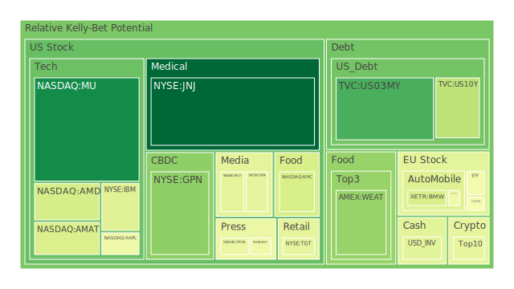
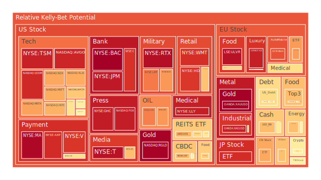
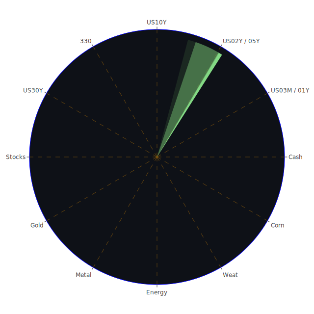

# **投資商品泡沫分析**

在當前錯綜複雜的全球經濟環境下，各類資產的價格波動與潛在泡沫風險成為投資者關注的焦點。以下將針對各主要投資商品，結合所提供的泡沫指數數據、聯準會經濟數據以及相關新聞事件，進行深入剖析。

* 美國國債 (TVC:US10Y, US05Y, US02Y, US01Y, US03MY, US30Y)  
  當前美國國債市場呈現出複雜的景象。從泡沫指數來看，短天期國債如3個月期 (US03MY) 的D1泡沫分數相對較低 (約0.457)，但其D7至D30數據顯示近期風險有所下降後趨穩。1年期 (US01Y) 與2年期 (US02Y) 國債的泡沫指數在0.48至0.61區間，其中2年期國債的各週期泡沫分數相當一致且偏高 (約0.61)，暗示短期內市場對其定價的猶疑。長天期如10年期 (US10Y) 的D1泡沫分數顯著上升至0.609，高於其月平均的0.446，顯示近期有資金流入避險或對未來利率預期轉變。30年期 (US30Y) 泡沫指數也呈現類似的短期上揚趨勢。  
  聯準會數據顯示，各天期公債殖利率近期普遍上揚，例如10年期公債殖利率來到4.47%，高於上週的4.31%及上月的4.21%。30年期房貸固定利率也攀升至6.76%。值得注意的是，殖利率曲線方面，10年期與3個月期利差 (US10Y-03M) 回到正值0.08，但仍處於歷史低位，先前長期倒掛的狀況是經濟衰退的傳統警示信號。即便轉正，幅度微弱，市場對經濟前景的擔憂並未完全消散。聯準會資產負債表規模處於相對低位，持續的量化緊縮政策對長債價格構成壓力（推高殖利率）。然而，全球地緣政治緊張（如新聞中提及的美中關係緊張、印巴衝突、烏克蘭危機等）可能促使部分資金流向被視為避險資產的美國國債，尤其是在市場波動加劇時。  
  從資訊航母的**空間**三位一體來看，（正）美國國債作為全球定價之錨，其殖利率影響全球資產估值。（反）聯準會鷹派立場與持續的通膨壓力，對債券價格構成壓力。（合）地緣政治風險與經濟衰退預期，又可能催生避險需求，支撐債券價格。**時間**三位一體則可觀察為：（正）過去低利率環境導致債券價格高估。（反）通膨與升息週期導致債券價格大幅修正。（合）市場在新利率中樞下尋找平衡，殖利率波動反映政策預期與避險情緒的拉鋸。**概念**三位一體是：（正）避險屬性。（反）利率風險。（合）流動性與信用利差的綜合考量。  
* 美國零售股 (NASDAQ:COST, NYSE:WMT, NYSE:TGT, NYSE:HD)  
  零售股表現分化。好市多 (COST) 的泡沫指數D1為0.663，月平均約0.501，顯示近期風險略有上升但整體尚可。沃爾瑪 (WMT) D1高達0.917，月平均0.812，整體泡沫風險偏高。塔吉特 (TGT) 的泡沫指數極高，D1達到0.960，月平均亦有0.851，警示信號強烈。家得寶 (HD) D1為0.839，月平均0.669，風險顯著上升。  
  新聞中提到「中產階級正在減少對‘願望型’奢侈品的支出，威脅著高端市場長達數年的繁榮」，以及「畢業生進入不確定的就業市場」，這些因素可能對整體零售業績構成壓力。聯準會數據中，消費者拖欠率 (Consumer Delinquent) 和信用卡費用沖銷率 (Charge-off Rate on Credit Card) 處於相對高位，也反映消費者財務壓力增加。儘管如此，「公用事業股表現優於標普500指數，電力需求‘沒有衰退跡象’」這類新聞可能暗示部分必需消費的韌性。  
  空間三位一體：（正）消費是美國經濟主要驅動力。（反）高通膨、高利率侵蝕消費者購買力。（合）不同收入階層消費能力分化，必需消費與非必需消費表現各異。時間三位一體：（正）疫情期間的財政刺激一度提振消費。（反）刺激消退與通膨壓力導致消費降溫。（合）消費模式轉變，線上與線下零售競爭，以及對價格敏感度提高。概念三位一體：（正）品牌忠誠度。（反）價格競爭與促銷壓力。（合）消費者信心與就業市場的晴雨表。  
* 美國科技股 (NASDAQ:MSFT, NASDAQ:AAPL, NASDAQ:GOOG, NASDAQ:AMZN, NASDAQ:NVDA, NASDAQ:TSLA, NASDAQ:META)  
  大型科技股泡沫指數普遍偏高。微軟 (MSFT) D1為0.796，月平均0.642，近期風險顯著增加。蘋果 (AAPL) D1為0.720，月平均0.595，同樣呈現風險上升。谷歌 (GOOG) D1為0.340，月平均0.621，近期風險意外下降，值得關注其原因。亞馬遜 (AMZN) D1為0.652，月平均0.755，風險自高位略有回落。輝達 (NVDA) D1為0.579，月平均0.593，風險處於高位但近期略降。特斯拉 (TSLA) D1為0.545，月平均0.403，近期風險上升。Meta (META) D1高達0.948，月平均0.911，泡沫風險極高。  
  新聞事件中，「Palantir股價因投資者對其高估值的擔憂而下跌」反映市場對部分AI概念股估值的審慎態度。「OpenAI的企業採用似乎正在加速，犧牲了競爭對手」以及「微軟和OpenAI可能正在重新談判他們的合作夥伴關係」顯示AI領域的競爭與合作格局仍在快速演變，對相關公司估值產生影響。「特斯拉股價跳漲至二月以來最高水平」則顯示特定公司利多消息仍能帶動股價。聯準會鷹派立場及高利率環境對成長型科技股的估值構成壓力。  
  空間三位一體：（正）科技創新引領經濟發展，AI浪潮帶來想像空間。（反）高利率環境壓縮成長股估值，反壟斷監管壓力。（合）龍頭企業憑藉現金流與生態優勢持續投入研發，但市場對估值合理性要求更高。時間三位一體：（正）長期成長趨勢與數位轉型需求。（反）週期性調整與技術迭代風險。（合）AI等新興技術的發展路徑與商業化前景，決定了科技股能否持續領跑。概念三位一體：（正）成長預期。（反）估值泡沫。（合）創新能力與護城河的持續性。  
* 美國房地產指數 (AMEX:VNQ, AMEX:IYR, AMEX:RWO)  
  房地產指數相關ETF的泡沫指數普遍偏高。VNQ 的D1為0.550，月平均0.440，近期風險上升。IYR 的D1為0.698，月平均0.808，雖自高位回落但仍處警示區。RWO 的D1為0.623，月平均0.489，近期風險顯著增加。  
  新聞中「紐約州北部一個中等城市是今年春天全國最艱難的房地產市場」以及「抵押貸款和再融資利率在過去一個月下降，但仍處高位」揭示了房地產市場的困境。聯準會數據顯示，30年期固定抵押貸款利率高達6.76%，遠高於去年同期的3.00%。商業地產拖欠率 (Commercial Real Estate Delinquent) 和房地產拖欠率 (Real Estate Delinquent) 均處於相對高位，顯示房地產市場，特別是商業地產，面臨顯著壓力。  
  空間三位一體：（正）房地產作為重要的財富儲存手段和居住需求。（反）高利率大幅提高購房和持有成本，打擊需求與負擔能力。（合）不同區域、不同類型房地產（住宅、商業、工業）表現分化，遠程辦公趨勢對商業地產構成長期挑戰。時間三位一體：（正）長期人口增長與城市化帶來住房需求。（反）金融週期與信貸條件收緊導致市場降溫。（合）政策調控（如稅收、補貼）與建築成本影響市場供需平衡。概念三位一體：（正）抗通膨特性（特定條件下）。（反）流動性較差，交易成本高。（合）經濟周期敏感性與利率敏感性的雙重考驗。  
* 加密貨幣 (BITSTAMP:BTCUSD, BINANCE:ETHUSD, BINANCE:DOGEUSD)  
  比特幣 (BTCUSD) 的D1泡沫指數為0.738，高於月平均的0.470，顯示近期投機情緒再度升溫。以太坊 (ETHUSD) D1為0.429，月平均0.530，風險自高位回落。狗狗幣 (DOGEUSD) D1為0.547，月平均0.479，風險溫和。  
  加密貨幣市場高度波動，受市場情緒、監管政策、宏觀流動性等多重因素影響。新聞中未直接提及加密貨幣，但全球金融市場的避險情緒、科技股的走勢（部分投資者將其視為科技資產的延伸）都可能間接影響加密貨幣。聯準會的貨幣政策立場，特別是對流動性的調控，對加密市場有重要影響。  
  空間三位一體：（正）去中心化理念與區塊鏈技術的應用前景。（反）監管不確定性、市場操縱與高波動性風險。（合）機構投資者參與度提升與散戶投機情緒並存，市場基礎設施仍在發展。時間三位一體：（正）早期採用者的巨大回報效應。（反）多次泡沫破裂的歷史教訓。（合）技術創新（如DeFi, NFT, Layer2）與宏觀環境共同塑造市場週期。概念三位一體：（正）數位黃金/價值儲存。（反）純粹投機工具。（合）社群共識與網路效應的實驗場。  
* 金/銀/銅 (OANDA:XAUUSD, OANDA:XAGUSD, FX:COPPER)  
  黃金 (XAUUSD) 的D1泡沫指數高達0.998，月平均0.465，顯示近期泡沫風險急劇升高，價格可能已嚴重偏離基本面，或是市場極度避險情緒的體現。白銀 (XAGUSD) D1亦高達0.926，月平均0.855，持續處於高泡沫風險區。銅 (COPPER) D1為0.521，月平均0.663，風險自高位回落，但仍需關注。  
  新聞提到「如果美國資產發生極小規模的轉移，黃金價格可能飆升80%至6000美元」，反映市場對黃金避險功能的期待。聯準會數據顯示，黃金石油比 (GOLD OIL RATIO) 為52.32，黃金銅比 (GOLD COPPER RATIO) 為700.24，均處於相對高位，顯示黃金相對於這兩種工業相關大宗商品非常昂貴。這可能反映了對經濟前景的擔憂（工業需求預期下降）以及強烈的避險需求。地緣政治風險新聞頻傳，也為貴金屬提供支撐。  
  空間三位一體：（正）黃金的避險屬性與抗通膨預期。（反）高利率環境下持有黃金的機會成本增加（無孳息）。（合）美元強弱、實際利率水平、地緣政治風險共同決定金價，白銀兼具貴金屬與工業屬性，銅價則更反映全球工業景氣。時間三位一體：（正）歷史上作為價值儲存和危機對沖工具。（反）特定時期內表現可能落後於風險資產。（合）全球央行購金行為、ETF持倉變化、實物需求共同影響價格。概念三位一體：（正）最終支付手段/硬通貨。（反）投機炒作標的。（合）市場恐慌指數的替代指標之一。  
* 黃豆 / 小麥 / 玉米 (AMEX:SOYB, AMEX:WEAT, AMEX:CORN)  
  農產品方面，黃豆 (SOYB) D1泡沫指數為0.851，月平均0.603，近期風險顯著攀升。小麥 (WEAT) D1為0.474，月平均0.419，風險溫和且近期略有下降。玉米 (CORN) D1為0.408，月平均0.455，風險相對較低。  
  農產品價格受天氣、地緣政治（影響供應鏈）、能源價格（影響種植成本）、全球供需等多重因素影響。新聞中提及的印巴緊張關係可能間接影響部分農產品供應預期（儘管未直接點名）。烏克蘭作為糧食出口大國，其局勢持續緊張對全球糧食安全構成威脅。  
  空間三位一體：（正）全球人口增長帶來的基本需求。（反）極端天氣事件、地緣政治衝突擾亂供應。（合）各國農業政策、貿易壁壘、化肥與運輸成本共同塑造價格。時間三位一體：（正）農業生產的季節性與週期性。（反）庫存水平與新作前景的變化。（合）投機資金的湧入與退出加劇價格波動。概念三位一體：（正）生活必需品。（反）供應鏈脆弱性。（合）通膨壓力的重要組成部分。  
* 石油/ 鈾期貨 (TVC:USOIL, COMEX:UX1\!)  
  美國原油 (USOIL) 的D1泡沫指數為0.768，月平均僅0.203，顯示近期油價波動劇烈，泡沫風險急升。鈾期貨 (UX1\!) D1為0.614，月平均0.489，風險溫和上升。  
  新聞中提到「沙烏地石油巨頭的利潤受到貿易戰打擊」以及「川普對廉價石油的渴望惹惱了他喜歡讚揚的行業」，暗示地緣政治與大國政策對油價的影響。聯準會數據顯示黃金石油比處於高位，可能意味著相對於黃金，石油價格被低估，或者市場對經濟衰退導致需求下降的預期超過了對供應緊張的擔憂。然而，近期油價泡沫指數的急升可能反映了新的供應擔憂或地緣政治溢價。  
  空間三位一體：（正）全球經濟增長的血液，需求剛性。（反）新能源轉型與環保政策的長期壓力，OPEC+產量政策。（合）地緣政治衝突（如中東、俄烏）對供應的直接影響，以及全球經濟復甦力度共同決定油價。時間三位一體：（正）工業化進程與交通運輸需求。（反）經濟衰退導致需求銳減。（合）庫存水平、產能投資、替代能源發展共同影響長期均衡價格。概念三位一體：（正）戰略資源。（反）價格波動劇烈。（合）通膨的直接推手。  
* 各國外匯市場 (OANDA:AUDUSD, OANDA:GBPUSD, OANDA:USDJPY, OANDA:EURUSD)  
  澳元兌美元 (AUDUSD) D1泡沫指數0.307，月平均0.391，風險偏低。英鎊兌美元 (GBPUSD) D1為0.547，月平均0.447，風險溫和。美元兌日圓 (USDJPY) D1為0.654，月平均0.627，近期風險上升，考慮到其價格148.23，可能與日圓持續弱勢有關。歐元兌美元 (EURUSD) D1高達0.979，月平均0.815，泡沫風險極高，值得警惕。  
  外匯市場受各國利率政策、經濟基本面、資本流動、地緣政治等多重因素影響。新聞中「美國與中國就關稅問題的談判仍在繼續」以及「歐盟採取攻勢以留住企業並反制川普的關稅」等，都可能影響主要貨幣對的走勢。聯準會的鷹派立場和相對強勁的美國經濟數據（儘管有隱憂）是支撐美元強勢的重要因素。而歐洲經濟若持續疲軟，可能導致歐元承壓，這與EURUSD的高泡沫指數所暗示的下行風險（或近期過度升值後的調整風險）相符。  
  空間三位一體：（正）反映各國經濟實力與利率政策差異。（反）資本的避險流動與投機衝擊。（合）全球貿易格局、央行干預、市場情緒共同作用。時間三位一體：（正）經濟周期的不同步性創造交易機會。（反）突發事件導致的匯率劇烈波動。（合）長期購買力平價與短期利率平價的動態調整。概念三位一體：（正）國家信用的體現。（反）政策不確定性的犧牲品。（合）全球資產配置的轉換媒介。  
* 各國大盤指數 (TWSE:0050, FXOPEN:FCHI, SPREADEX:GDAXI, SSE:000300, NASDAQ:NDX, SPREADEX:FTSE, FX:JPN225)  
  台灣50 (0050) D1泡沫指數0.432，月平均0.676，風險自高位回落。法國CAC40 (FCHI) D1為0.472，月平均0.590，風險下降。德國DAX (GDAXI) D1為0.345，月平均0.546，風險顯著下降。滬深300 (000300) D1為0.711，月平均0.535，近期風險上升。納斯達克100 (NDX) D1為0.649，月平均0.753，風險自高位回落但仍偏高。英國富時100 (FTSE) D1為0.632，月平均0.568，風險溫和上升。日經225 (JPN225) D1高達0.915，月平均0.729，泡沫風險顯著升高。  
  全球股市受美中貿易談判進展消息影響。「美國與中國在日內瓦貿易談判中取得‘實質性進展’」以及「股市期貨在美中貿易談判取得‘實質性進展’後上漲」對全球股市構成利多。然而，「華爾街策略師表示，股市的痛苦不會隨著川普的貿易協議而結束」以及「賣在五月走人？歷史性的波動正在摧毀投資者最喜歡的季節性指標」等觀點提醒投資者保持謹慎。各國經濟基本面、央行政策差異、地緣政治影響是造成各國指數表現分化的主因。日本股市的高泡沫風險可能與日圓貶值刺激出口企業利潤以及結構性改革預期有關，但需警惕後續回調。  
  空間三位一體：（正）全球經濟聯動與產業鏈合作。（反）貿易保護主義與地緣政治衝突的割裂。（合）資金跨國流動在不同市場間尋找相對價值窪地與成長機會。時間三位一體：（正）長期經濟增長與企業盈利提升。（反）金融危機與經濟衰退的週期性衝擊。（合）各國政策應對與產業結構調整決定了復甦路徑與牛熊轉換。概念三位一體：（正）經濟晴雨表。（反）群體情緒的放大器。（合）多元化投資組合的重要組成。  
* 美國半導體股 (NASDAQ:MU, NASDAQ:AMAT, NASDAQ:KLAC, NASDAQ:AMD, NASDAQ:INTC, NASDAQ:NVDA, NASDAQ:AVGO, NASDAQ:QCOM, NYSE:TSM)  
  半導體股泡沫指數普遍較高，但內部有所分化。美光 (MU) D1僅0.077，月平均0.363，風險顯著下降，可能與其價格92.29已反映部分預期有關。應用材料 (AMAT) D1為0.706，月平均0.744，高位震盪。科磊 (KLAC) D1為0.690，月平均0.502，近期風險上升。AMD D1為0.621，月平均0.608，高位持穩。英特爾 (INTC) D1為0.444，月平均0.489，風險溫和。輝達 (NVDA) 已在科技股中分析，風險仍高。博通 (AVGO) D1高達0.933，月平均0.822，泡沫風險持續攀升。高通 (QCOM) D1為0.926，月平均0.791，風險顯著增高。台積電 (TSM) D1極高，達0.975，月平均0.985，持續處於極高泡沫警告區。  
  半導體行業受益於AI、5G、物聯網等長期趨勢，但同時也具有高度週期性。AI晶片的強勁需求是支撐如NVDA、AVGO、TSM等公司高估值的重要原因。然而，全球經濟若放緩，對消費電子、工業等領域的晶片需求可能減弱。美中科技戰對半導體產業鏈的影響深遠。  
  空間三位一體：（正）數位經濟的基石，AI浪潮的核心驅動力。（反）供應鏈瓶頸與地緣政治風險（如台灣海峽緊張局勢對TSM的潛在影響），高資本支出與技術迭代壓力。（合）不同細分市場（記憶體、邏輯、模擬、功率）景氣度各異，龍頭企業憑藉技術與產能優勢掌握定價權。時間三位一體：（正）摩爾定律（或已放緩）驅動的長期技術進步。（反）庫存周期與產能過剩風險。（合）新應用場景的拓展（如自動駕駛、元宇宙）與宏觀經濟波動共同決定行業興衰。概念三位一體：（正）技術密集與資本密集。（反）景氣循環顯著。（合）國家科技實力的重要體現。  
* 美國銀行股 (NYSE:JPM, NYSE:COF, NYSE:C, NYSE:BAC)  
  大型銀行股泡沫指數普遍極高。摩根大通 (JPM) D1為0.966，月平均0.724，風險急劇拉升。第一資本 (COF) D1為0.463，月平均0.480，相對溫和，但考慮到其近期價格波動，仍需留意。花旗 (C) D1為0.925，月平均0.865，持續高風險。美國銀行 (BAC) D1高達0.995，月平均0.962，泡沫風險極其嚴重。  
  聯準會數據顯示，商業銀行淨來自外國相關辦事處的應付款項 (Net Due to Related Foreign Offices All Commercial Banks) 處於高位，美國銀行總存款 (US Bank Total Deposits) 亦處高位，顯示銀行體系流動性尚可。然而，信用卡費用沖銷率、商業地產拖欠率、消費者拖欠率均在高位，對銀行資產品質構成潛在威脅。高利率環境雖然擴大了淨息差，但也可能增加信貸風險和抑制貸款需求。新聞中提到「強制基金投資英國‘有讓儲戶更窮的風險’」，雖非直接針對美國銀行，但也反映了金融監管與政策可能帶來的間接影響。  
  空間三位一體：（正）金融體系的核心，受益於利差擴大（初期）。（反）經濟衰退預期導致的信貸損失風險，監管壓力增加。（合）大型銀行憑藉多元業務與規模優勢抵禦風險，但中小銀行可能面臨更大壓力。時間三位一體：（正）經濟擴張期的信貸增長。（反）金融危機時期的系統性風險。（合）利率週期、監管環境、金融創新共同塑造銀行業格局。概念三位一體：（正）順週期行業。（反）高槓桿經營。（合）系統重要性與道德風險。  
* 美國軍工股 (NYSE:NOC, NYSE:LMT, NYSE:RTX)  
  軍工股泡沫指數普遍偏高。諾斯洛普格拉曼 (NOC) D1為0.871，月平均0.730，風險顯著。洛克希德馬丁 (LMT) D1為0.849，月平均0.746，風險持續偏高。雷神技術 (RTX) D1高達0.901，月平均0.759，泡沫風險加劇。  
  全球地緣政治緊張局勢是軍工股的重要催化劑。新聞中多次提及美中關係、俄烏衝突、印巴緊張等，均可能刺激各國增加國防開支。美國及其盟友對烏克蘭的軍事援助，以及各國自身軍備更新換代需求，為軍工企業提供了訂單保障。  
  空間三位一體：（正）地緣政治衝突加劇，國防預算提升。（反）和平預期或財政壓力可能導致訂單減少。（合）國際軍售、國內採購、技術研發共同構成軍工企業增長動力。時間三位一體：（正）戰爭與衝突時期的需求激增。（反）和平時期的需求平穩或下降。（合）技術代差與軍備競賽推動行業發展。概念三位一體：（正）國家安全基石。（反）道德倫理爭議。（合）高技術壁壘與訂單驅動。  
* 美國電子支付股 (NASDAQ:PYPL, NYSE:GPN, NYSE:MA, NYSE:AXP, NYSE:V)  
  電子支付股泡沫指數分化。PayPal (PYPL) D1為0.679，月平均高達0.919，顯示其風險自極高位有所回落，但仍需警惕。Global Payments (GPN) D1僅0.180，月平均0.555，風險顯著下降，可能價格已大幅調整。萬事達卡 (MA) D1高達0.983，月平均0.793，泡沫風險急升至極高水平。美國運通 (AXP) D1為0.837，月平均0.789，風險在高位。Visa (V) D1為0.633，月平均0.752，風險自高位回落。  
  電子支付行業受益於現金交易減少和電子商務的普及。然而，競爭加劇（來自新創企業和大型科技公司的支付解決方案）、監管審查以及經濟放緩對消費支出的影響是其面臨的挑戰。高利率環境也可能影響消費者信貸擴張，對依賴交易費和信貸業務的支付公司不利。  
  空間三位一體：（正）數位化支付趨勢與消費習慣轉變。（反）市場競爭白熱化，利潤率受壓，監管趨嚴。（合）跨境支付、B2B支付、新興市場拓展成為新的增長點，但需應對技術變革（如加密貨幣支付）的潛在衝擊。時間三位一體：（正）無現金社會的長期趨勢。（反）經濟衰退導致交易量萎縮。（合）併購整合與技術創新推動行業演進。概念三位一體：（正）網絡效應顯著。（反）數據安全與隱私保護挑戰。（合）金融科技（FinTech）的重要代表。  
* 美國藥商股 (NYSE:JNJ, NASDAQ:RGLD, NYSE:LLY, NYSE:MRK, NYSE:NVO)  
  藥廠股表現不一。嬌生 (JNJ) D1為0.279，月平均0.264，泡沫風險相對較低。Royal Gold (RGLD) 是一家貴金屬權益公司，其泡沫指數D1為0.804，月平均0.916，風險自高位回落但仍偏高，其走勢更關聯金價。禮來 (LLY) D1高達0.933，月平均亦為0.934，持續處於極高泡沫風險區域，可能與其減肥藥等爆款產品的極高市場預期有關。默克 (MRK) D1為0.303，月平均0.485，風險下降。諾和諾德 (NVO) D1為0.494，月平均0.641，風險自高位回落。  
  新聞中「禮來的Zepbound在試驗中減肥效果優於諾和諾德的Wegovy」直接影響這兩家公司的股價和市場預期。大型藥廠通常具有較強的防禦性，但在專利懸崖、藥品定價壓力、研發失敗風險等方面也面臨挑戰。人口老化和醫療保健支出增加是行業長期驅動力。  
  空間三位一體：（正）人口老化與健康需求增長，創新藥物帶來高回報。（反）藥品專利懸崖，政府醫保控費壓力，研發失敗風險高。（合）大型藥廠通過併購與合作拓展產品線，生物科技新藥備受關注，但估值需謹慎。時間三位一體：（正）醫學進步與新療法不斷湧現。（反）藥品審批周期的不確定性。（合）流行性疾病（如疫情）的爆發可能短期改變市場格局。概念三位一體：（正）防禦性與成長性兼具（部分個股）。（反）政策風險顯著。（合）研發能力與產品管線是核心競爭力。  
* 美國影視股 (NASDAQ:NFLX, NYSE:DIS, NASDAQ:PARA)  
  影視股泡沫指數冷熱不均。Netflix (NFLX) D1為0.433，月平均0.471，風險溫和。迪士尼 (DIS) D1為0.670，月平均0.699，風險維持在較高水平。派拉蒙 (PARA) D1為0.498，月平均0.510，風險溫和。  
  串流媒體競爭激烈，內容成本高昂，用戶增長放緩是行業普遍面臨的挑戰。廣告市場的表現、影院業務的復甦情況（對DIS、PARA）以及內容庫的吸引力是影響這些公司業績的關鍵。新聞中提到「哥倫比亞大學因圖書館佔領事件暫停超過65名學生的學籍」這類社會事件，雖然與影視股無直接關聯，但社會氛圍的變化可能間接影響娛樂消費偏好。  
  空間三位一體：（正）全球娛樂內容需求持續增長，串流媒體訂閱模式改變行業。（反）內容製作成本高昂，用戶獲取與留存競爭激烈，盜版風險。（合）大型媒體集團整合資源，探索廣告支持的低價訂閱模式，IP價值最大化成為關鍵。時間三位一體：（正）傳統媒體向數位化轉型。（反）用戶審美疲勞與選擇過多。（合）技術（如VR/AR）可能帶來新的內容消費體驗。概念三位一體：（正）內容為王。（反）高投入高風險。（合）文化影響力與品牌價值。  
* 美國媒體股 (NASDAQ:CMCSA, NASDAQ:FOX, NYSE:NYT)  
  康卡斯特 (CMCSA) D1為0.301，月平均0.467，風險下降。福斯 (FOX) D1高達0.985，月平均0.855，泡沫風險極高且持續攀升。紐約時報 (NYT) D1為0.500，月平均0.729，風險自高位回落。  
  傳統媒體面臨數位化轉型的挑戰，廣告收入向線上平台轉移。新聞媒體的公信力、內容質量以及訂閱模式的成功與否是其生存和發展的關鍵。福斯的高泡沫風險可能與其在特定政治光譜中的影響力以及由此產生的市場預期有關，但也需警惕其可持續性。  
  空間三位一體：（正）資訊傳播與輿論引導的重要性。（反）傳統廣告模式式微，假新聞與資訊繭房挑戰公信力。（合）優質內容與獨立調查仍有市場，付費訂閱與多元化經營（如活動、播客）成為轉型方向。時間三位一體：（正）從紙媒到數位媒體的演變。（反）社交媒體的衝擊與新聞碎片化。（合）權威媒體與新興自媒體的競爭與共生。概念三位一體：（正）第四權。（反）政治極化與媒體偏見。（合）公眾知情權與媒體社會責任的平衡。  
* 石油防禦股 (NYSE:XOM, NYSE:OXY)  
  埃克森美孚 (XOM) D1為0.808，月平均0.782，風險持續在高位。西方石油 (OXY) D1為0.753，月平均0.752，風險穩定在較高水平。  
  這些大型石油公司在油價上漲時通常受益，並提供相對穩定的股息。然而，其股價表現與原油價格高度相關。近期油價泡沫指數急升，也推高了這些股票的風險。長期來看，能源轉型壓力是其不得不面對的挑戰。  
  空間三位一體：（正）高油價帶來豐厚利潤與現金流。（反）能源轉型壓力，碳排放限制，ESG投資趨勢的負面影響。（合）大型石油公司利用現金流投資低碳能源或進行股票回購與分紅，以維持股東回報。時間三位一體：（正）傳統能源在可預見未來仍是主力。（反）新能源技術突破與成本下降的替代效應。（合）在保障能源安全的同時，逐步向低碳轉型。概念三位一體：（正）現金牛。（反）夕陽產業（長期視角）。（合）地緣政治博弈的重要籌碼。  
* 金礦防禦股 (NASDAQ:RGLD)  
  Royal Gold (RGLD) 的泡沫指數D1為0.804，月平均0.916，風險自高位回落但仍偏高。作為一家貴金屬權益公司，其股價與黃金價格高度相關，黃金近期泡沫指數急升，對其構成支撐但也累積了風險。金礦股通常在金價上漲和市場避險情緒升溫時表現較好，具有一定的防禦屬性，但也受自身經營成本、礦山品位、政治風險等因素影響。  
* 歐洲奢侈品股 (EURONEXT:MC, EURONEXT:RMS, EURONEXT:KER)  
  LVMH (MC) D1為0.488，月平均0.486，風險溫和且穩定。愛馬仕 (RMS) D1為0.609，月平均0.684，風險自高位回落。開雲集團 (KER) D1高達0.934，月平均0.726，泡沫風險急劇拉升，警示信號強烈。  
  新聞提到「中產階級正在減少對‘願望型’奢侈品的支出，威脅著高端市場長達數年的繁榮」，這對整個奢侈品行業都是一個重要的負面信號。開雲集團旗下品牌（如Gucci）可能對此更為敏感，導致其泡沫指數飆升。而LVMH和愛馬仕憑藉其更強的品牌護城河和超高淨值客戶群體，可能表現出更強的韌性。  
  空間三位一體：（正）品牌稀缺性與工藝傳承，高淨值人群的穩定需求。（反）全球經濟放緩，中產消費降級，反腐與共同富裕政策的潛在影響（尤其對新興市場）。（合）頂級奢侈品牌憑藉定價權與客戶忠誠度維持增長，但二三線品牌壓力較大，二手市場與永續時尚興起。時間三位一體：（正）財富效應與炫耀性消費。（反）經濟危機與社會風氣轉變。（合）數位化行銷與年輕化轉型，同時保持品牌傳統與調性。概念三位一體：（正）身份的象徵。（反）貧富差距的體現。（合）文化價值與情感溢價。  
* 歐洲汽車股 (XETR:MBG, XETR:BMW, XETR:PAH3)  
  賓士 (MBG) D1為0.516，月平均0.498，風險溫和。寶馬 (BMW) D1為0.401，月平均0.576，風險下降。保時捷 (PAH3) D1為0.587，月平均0.535，風險溫和上升。  
  歐洲汽車股面臨電動化轉型、來自中國電動車企的競爭、以及全球供應鏈重塑的挑戰。傳統豪華品牌在電動化進程中相對謹慎，同時也需應對歐盟日益嚴格的排放法規。  
  空間三位一體：（正）強大的品牌力與工程技術積累。（反）電動化轉型緩慢，中國市場競爭加劇，供應鏈依賴。（合）在高端市場仍有優勢，但需加快電動化與智能化佈局，應對軟體定義汽車的趨勢。時間三位一體：（正）內燃機時代的輝煌。（反）電動化浪潮的顛覆性衝擊。（合）轉型期的陣痛與機遇並存，能否成功切換賽道是關鍵。概念三位一體：（正）德國製造/歐洲工藝。（反）路徑依賴與轉型包袱。（合）出行方式變革的參與者與適應者。  
* 歐美食品股 (SIX:NESN, NYSE:KO, NASDAQ:KHC, LSE:ULVR)  
  雀巢 (NESN) D1為0.561，月平均0.537，風險溫和。可口可樂 (KO) D1為0.655，月平均0.707，風險自高位回落但仍偏高。卡夫亨氏 (KHC) D1高達0.922，月平均0.772，泡沫風險加劇。聯合利華 (ULVR) D1高達0.960，月平均0.951，持續處於極高泡沫風險區。  
  大型食品飲料公司通常被視為防禦性股票，因其產品需求相對穩定。然而，它們也面臨原材料成本上漲、消費者口味變化、以及來自新興品牌的競爭。卡夫亨氏和聯合利華的高泡沫指數可能反映了市場對其應對成本壓力、實現增長以及品牌老化等問題的擔憂，或者近期股價漲幅過大。  
  空間三位一體：（正）必需消費品的穩定需求，強大的品牌組合與分銷網絡。（反）原材料成本波動，低毛利競爭，健康飲食趨勢的挑戰。（合）通過漲價轉嫁成本，拓展新興市場，投資健康與永續產品線。時間三位一體：（正）經典品牌的長期積累。（反）消費習慣變遷與新品牌的衝擊。（合）併購整合與品類創新是維持增長的重要手段。概念三位一體：（正）現金牛與穩定股息。（反）增長潛力有限（部分成熟品牌）。（合）通膨環境下的價格傳導能力。

# **宏觀經濟傳導路徑分析**

當前宏觀經濟環境的核心特徵是：聯準會維持相對鷹派立場，通膨壓力雖有緩解但仍具黏性，全球經濟增長前景不明，地緣政治風險高企。

1. **聯準會政策 \-\> 利率與流動性 \-\> 資產估值與經濟活動:**  
   * **正向路徑(緊縮):** 聯準會鷹派言論 (新聞數據: 2次鷹派，0次鴿派) 及相對較低的資產負債表規模，推高各期限美國公債殖利率 (FED數據: 各期限殖利率均高於去年)。這導致：  
     * 企業借貸成本上升，投資意願下降，可能拖累經濟增長。  
     * 房地產市場受創 (FED數據: 30年期抵押貸款利率6.76%，遠高於去年；商業地產及住宅地產拖欠率高)。  
     * 成長型股票 (如部分科技股、半導體股) 的估值模型中折現率提高，導致估值下修壓力 (泡沫數據: MSFT, AAPL, NVDA等D1較高)。  
     * 高收益債券利率高企 (FED數據)，反映風險溢價上升。  
   * **反向制約(避險):** 若市場對經濟衰退的擔憂加劇 (新聞: 「畢業生進入不確定的就業市場」)，或地緣政治風險升級 (新聞: 美中、印巴、烏克蘭等)，資金可能湧入美元及美國國債避險，短暫壓低殖利率或限制其上行空間。貨幣市場基金總資產上升 (FED數據) 也反映了避險情緒。  
   * **綜合效應:** 市場在「高利率抑制通膨但損害增長」與「避險需求」之間搖擺。殖利率曲線部分倒掛雖緩解 (10Y-3M轉正為0.08)，但幅度微弱，仍暗示經濟前景不明。  
2. **通膨預期與現實 \-\> 消費與企業行為 \-\> 經濟增長:**  
   * **持續通膨路徑:** CPI年增率雖從高位回落至2.40% (FED數據)，但若服務性通膨頑固，或能源價格 (USOIL泡沫指數D1急升) 再次上漲，將強化聯準會緊縮預期。  
     * 消費者實際購買力下降 (新聞: 中產減少奢侈品支出；FED數據: 消費者拖欠率、信用卡沖銷率高)，衝擊零售股 (TGT, WMT泡沫指數高)。  
     * 企業面臨成本壓力，若無法有效轉嫁，則利潤受損。部分食品股 (KHC, ULVR泡沫指數高) 可能反映此擔憂。  
   * **通膨回落路徑:** 若通膨能持續溫和下降，則給予聯準會政策轉向的空間，有利於風險資產。  
   * **綜合效應:** 目前市場對通膨的擔憂與對經濟放緩的憂慮並存，形成「滯脹」陰影。  
3. **全球貿易與地緣政治 \-\> 供應鏈與市場情緒 \-\> 跨國資產影響:**  
   * **美中關係 (主導性因素):**  
     * **緩和:** 新聞中「美中貿易談判取得實質性進展」對全球股市 (尤其是對華出口或在華有業務的企業) 構成短期利多，有助於緩解供應鏈壓力，提振市場情緒。  
     * **緊張:** 長期結構性矛盾、「川普關稅」陰影 (新聞: 歐盟反制川普關稅、沙烏地石油利潤受貿易戰打擊) 依然存在。若摩擦再起，將打擊全球貿易，推高避險情緒 (利好黃金XAUUSD，美元)。  
   * **其他地緣政治風險 (烏克兰、印巴等):**  
     * 推高能源、糧食價格 (USOIL, WEAT, SOYB等泡沫指數的波動性)。  
     * 增加軍工股需求 (NOC, LMT, RTX泡沫指數高)。  
     * 強化黃金等避險資產的吸引力 (XAUUSD, XAGUSD泡沫指數極高)。  
   * **綜合效應:** 地緣政治成為市場波動的重要來源，短期消息面主導情緒，長期則影響全球產業鏈重構和國家經濟安全考量。

# **微觀經濟傳導路徑分析**

微觀層面的傳導更側重於特定行業或公司的動態如何影響相關股票及整體市場。

1. **科技行業內部動態 (AI為例):**  
   * **龍頭效應與競爭格局:** 「OpenAI企業採用加速，犧牲對手」及「微軟與OpenAI或重新談判合作」這類新聞，直接影響MSFT, GOOG等AI巨頭的估值與市場地位。投資者會評估其在AI浪潮中的實際受益程度和護城河。  
   * **估值壓力:** 「Palantir股價因高估值擔憂下跌」顯示市場對AI概念股的狂熱開始降溫，更注重基本面和實際盈利能力。這可能導致AI相關但缺乏堅實業績支撐的公司面臨回調壓力。  
   * **產業鏈傳導:** AI的發展利好上游晶片製造商 (TSM, NVDA, AVGO泡沫指數高企)，但也可能引發對算力成本、能耗等問題的關注。  
2. **特定消費領域的變革 (減肥藥市場為例):**  
   * **產品競爭與市場份額:** 「禮來Zepbound減肥效果優於諾和諾德Wegovy」直接導致LLY股價預期走高 (泡沫指數持續高位)，而NVO則面臨壓力。這種單一產品的突破性進展能迅速改變相關公司的市值和行業格局。  
   * **供應鏈與擴產能力:** 巨大的市場需求也考驗著相關藥企的生產能力和供應鏈管理，任何瓶頸都可能影響業績。  
3. **企業盈利與成本控制 (零售、食品業):**  
   * **成本轉嫁能力:** 在通膨背景下，企業能否將上漲的原材料和勞動力成本轉嫁給消費者，直接影響其利潤率。KHC, ULVR等食品股的高泡沫指數，可能部分反映市場對其成本壓力及定價能力的擔憂。  
   * **消費降級影響:** 「中產階級減少奢侈品支出」不僅影響奢侈品股 (KER泡沫指數飆升)，也可能促使消費者轉向更具性價比的品牌或自有品牌，對WMT, COST等折扣零售商可能是相對利好，但對TGT這類定位於中間或略偏高端的零售商則構成挑戰。  
4. **金融行業的風險暴露 (銀行、房地產):**  
   * **利率敏感性:** 銀行股 (JPM, BAC, C泡沫指數極高) 在利率上升初期可能受益於淨息差擴大，但持續高利率會增加信貸違約風險，並抑制貸款需求。  
   * **資產品質惡化:** FED數據顯示的商業地產、消費信貸拖欠率上升，對銀行資產負債表構成壓力。房地產指數ETF (IYR, VNQ, RWO) 的高泡沫指數也反映了對房地產市場的悲觀預期。

# **資產類別間傳導路徑分析**

1. **利率 \-\> 股債匯市:**  
   * 美國國債殖利率上升 (TVC:US10Y等) → 提升無風險回報率 → 壓低股票估值 (尤其是成長股如NDX, MSFT, AAPL) → 可能吸引資金從股市流向債市（但目前債市本身也因價格下跌而吸引力有限，更多是流向現金或貨幣市場基金）。  
   * 美元利率高於其他主要經濟體 → 利差交易吸引資金流入美元 → 美元走強 (USDJPY維持高位，EURUSD泡沫指數極高可能暗示調整壓力) → 對美國以外經濟體構成資本外流壓力，也影響美國跨國企業的匯兌收益。  
2. **商品價格 \-\> 通膨 \-\> 貨幣政策 \-\> 股市/債市:**  
   * 原油 (USOIL)、基本金屬 (COPPER)、農產品 (SOYB, WEAT, CORN) 價格上漲 → 推升通膨預期 (CPIYOY) → 迫使央行維持緊縮政策 (FED鷹派) → 不利於債券價格 (殖利率上升) 和股票估值。  
   * 黃金 (XAUUSD) 在此路徑中較特殊：通膨上升時，黃金作為抗通膨資產可能受益；但若央行強力緊縮導致實際利率上升，則對無息資產黃金不利。目前金價飆升更可能反映避險及對法定貨幣體系的擔憂。黃金石油比、黃金銅比高企，顯示黃金漲幅遠超工業相關大宗商品，強化了避險邏輯。  
3. **風險情緒 \-\> 避險資產與風險資產的蹺蹺板效應:**  
   * 地緣政治緊張 (新聞中多處提及)、經濟衰退擔憂 (新聞: 就業市場不確定) → 市場避險情緒升溫。  
   * 資金流向：美元、短期美國國債、黃金 (XAUUSD, XAGUSD泡沫指數極高)、日圓 (傳統避險貨幣，但目前因日本自身政策而弱勢)、瑞士法郎。  
   * 資金流出：新興市場貨幣與股市、高收益債、對經濟敏感的週期股 (如部分工業、非必需消費)。加密貨幣 (BTCUSD, ETHUSD) 在此情境下表現不一，有時被視為另類避險，有時則與高風險科技股同步下跌。  
4. **行業內部傳導 (例：半導體 \-\> 科技股 \-\> 大盤):**  
   * TSM (晶圓代工龍頭，泡沫指數極高) 的業績展望或資本支出計畫 → 影響其客戶 (AAPL, NVDA, AMD等) 的成本與供應 → 進而影響整個半導體板塊 (SMH等ETF) → 由於半導體在科技指數 (NDX) 中權重較大，會進一步傳導至整體市場。  
   * AI晶片需求 (利好NVDA, AVGO) → 帶動相關軟硬體生態 (MSFT的雲服務、伺服器製造商等) → 形成AI產業鏈的整體上漲或調整。  
5. **信貸市場 \-\> 實體經濟 \-\> 金融市場:**  
   * 銀行信貸收緊 (高利率、擔憂經濟前景) 或信貸違約率上升 (FED數據: 信用卡、商業地產、消費者拖欠率高) → 企業融資困難，投資擴張受阻；消費者支出減少 → 拖累實體經濟增長 → 上市公司盈利下降 → 股市承壓。  
   * 銀行股 (JPM, BAC, C) 的資產品質惡化或盈利不及預期 → 可能引發對金融系統穩定性的擔憂 → 導致市場波動加劇。

這些傳導路徑並非單向或孤立的，而是相互交織、動態演變的複雜網絡。例如，聯準會的政策會影響利率，利率影響信貸市場和風險情緒，進而通過多個渠道傳導至各類資產。

# **投資建議**

基於上述分析，當前市場環境充滿不確定性，高通膨、高利率、地緣政治風險和經濟衰退陰霾交織。建議投資者採取謹慎和多元化的策略。

**投資組合配置建議 (總和100%)**

1. **穩健型配置 (總佔比 50%)**  
   * **美國短期國債ETF (例如SHY, VGSH等代表短期國債的ETF) (20%):** 鑒於殖利率曲線扁平甚至部分倒掛，短期國債提供了相對不錯的收益率和較低的利率風險。聯準會數據顯示3個月期、1年期、2年期殖利率均在4%以上。泡沫指數相對可控。  
   * **黃金 (GLD或實物黃金) (15%):** 鑒於XAUUSD極高的D1泡沫指數，追高需謹慎，但考慮到強烈的避險需求、地緣政治不確定性以及對法定貨幣體系的潛在不信任，黃金仍是重要的避險配置。可待回調後逐步建立倉位，或採取定投。  
   * **必需消費品/公用事業龍頭股 (例如PG, JNJ, NEE等代表性公司) (15%):** JNJ泡沫指數較低，顯示相對安全。這類公司在經濟下行期通常表現出較強的防禦性，現金流穩定，股息可靠。新聞也提及「公用事業股表現優於標普500」。  
2. **成長型配置 (總佔比 30%)**  
   * **大型科技股龍頭 (例如MSFT, GOOG) (15%):** 儘管MSFT泡沫指數D1偏高，GOOG近期D1回落，但這兩家公司在AI領域具有領先優勢，現金流充裕，長期成長前景依然看好。但需注意估值，可逢調整吸納。  
   * **全球/美國大盤指數ETF (例如VT, VOO/IVV) (10%):** 透過指數化投資分散個股風險，捕捉市場整體成長機會。NDX、0050等指數泡沫分數近期有所回落，但仍需關注美中貿易等宏觀因素。  
   * **特定高成長潛力醫藥股 (例如LLY，但需極度謹慎) (5%):** LLY因減肥藥展現巨大潛力，但其泡沫指數已極高 (0.933)，意味著市場預期已非常充分，風險極大。僅適合風險承受能力極高的投資者，且應嚴格控制倉位，密切關注後續財報與競爭格局。  
3. **高風險/機會型配置 (總佔比 20%)**  
   * **半導體產業鏈相關個股/ETF (例如SMH，或TSM、NVDA等，但需極度謹慎) (10%):** TSM、NVDA泡沫指數極高，顯示短期過熱，但AI驅動的長期需求仍在。投資此類標的需承受巨大波動風險，更適合波段操作或等待顯著回調。MU近期泡沫指數大幅回落，可關注其基本面是否改善。  
   * **原油/能源股 (例如XOM, OXY，或USO等原油ETF) (5%):** USOIL近期D1泡沫指數急升，XOM、OXY泡沫指數亦在高位。若地緣政治衝突加劇或供應出現問題，油價仍有上行空間，但波動劇烈。  
   * **比特幣 (BTCUSD) (5%):** 比特幣D1泡沫指數回升至0.738，顯示投機情緒再起。作為高波動性資產，僅適合風險承受能力極高的投資者，且應是長期閒置資金。

**配置理由與觀察視角：**

* **穩健部分**旨在保本和應對市場下行風險。短期國債提供流動性和相對穩定的收益。黃金對沖地緣政治和極端風險。必需消費和公用事業在經濟放緩時提供防禦。  
* **成長部分**旨在捕捉長期趨勢。科技龍頭和醫藥創新是未來主要驅動力，但需注意其高估值風險。大盤指數提供市場平均回報。  
* **高風險部分**尋求超額回報，但伴隨高波動。半導體和能源是當前熱點，但泡沫風險不容忽視。比特幣則代表另類資產的潛在機會。

**重要提示：** 上述比例和標的僅為示例，投資者應根據自身風險承受能力、投資目標和對市場的獨立判斷進行調整。對於泡沫指數持續處於0.9以上的資產，如TSM, BAC, LLY, META, XAUUSD, EURUSD, KHC, ULVR, FOX, MA, KER等，應極度謹慎，避免過度追高，這些資產短期內大幅回調的風險非常高。

# **風險提示**

投資有風險，市場總是充滿不確定性。本報告所有分析和建議均基於所提供的歷史數據和新聞事件，不構成任何投資邀約或承諾。過去的表現不預示未來結果。數據中的泡沫指數是基於特定模型計算得出，本身也具有局限性，僅能作為參考指標之一，而非絕對的買賣依據。

投資者應充分理解各類資產的風險收益特徵，結合自身的財務狀況、風險承受能力和投資目標，在必要時尋求專業財務顧問的意見，做出獨立的投資決策。請注意，市場波動可能導致投資本金的損失。對於報告中提及泡沫風險較高的資產，應給予特別關注，謹慎評估其投資價值。

 
Daily Buy Map:

 
Daily Sell Map:

 
Daily Radar Chart:

 
