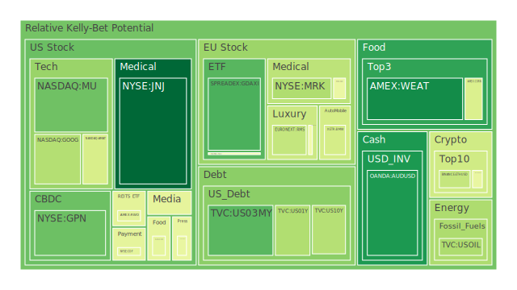
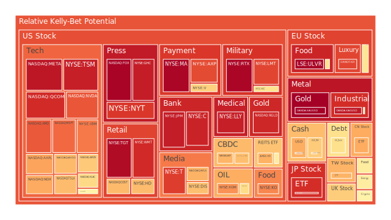
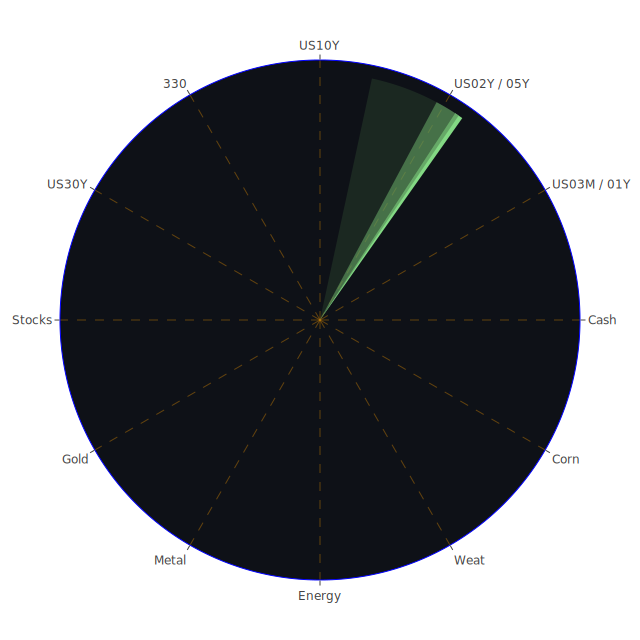

# **投資商品泡沫分析**

在當前複雜的全球經濟環境下，評估各類投資商品的泡沫風險及其潛在傳導路徑至關重要。本報告旨在透過多維度視角，包含經濟學、社會學、心理學、博弈論、歷史經驗及近期新聞事件，對主要資產類別進行深入剖析，並提出相應的投資策略建議。我們將秉持公正客觀的態度，將市場波動視為多重因素交織下的自然現象。

**美國國債**

美國國債市場近期呈現複雜的局面。從泡沫數據觀察，短期國債如 TVC:US03MY (3個月期) 在2025年5月15日的當日泡沫分數D1為0.2048，相對較低，但長期國債如 TVC:US30Y (30年期) D1則達到0.6011，顯示市場對長短期利率預期存在分歧。

經濟學角度：聯準會(FED)數據顯示，EFFR成交量處於高位，逆回購(RRP)量下降，顯示銀行體系流動性充裕。然而，聯準會總資產處於相對低位，且持續縮表（2023年8月14日惡化），暗示緊縮政策的持續。近期聯準會官員兩次鷹派發言，零鴿派發言，強化了市場對高利率環境將持續一段時間的預期。30年期固定房貸利率高達6.76%，遠高於去年的3.00%，這對長期經濟活動構成壓力。10年期與3個月期國債殖利率差 (US Yield 10Y-03M) 為0.15，雖為正值，但遠低於歷史正常水平，且去年同期為-1.32的深度倒掛，顯示市場對短期經濟衰退的擔憂有所緩解，但長期增長前景仍不明朗。

社會學與心理學角度：市場對通膨的預期（CPIYOY目前2.33%，低於去年3.33%）與聯準會鷹派立場形成拉鋸。投資者心理在「通膨見頂」的樂觀與「高利率持續」的悲觀之間搖擺。新聞中提及「四月CPI報告預期顯示川普關稅的通膨影響初步跡象」，這類預期會加劇市場的觀望情緒。

博弈論角度：聯準會試圖在控制通膨和避免經濟硬著陸之間取得平衡，其政策宣示與市場預期形成博弈。市場參與者則試圖預判聯準會的下一步行動，導致殖利率曲線波動。

歷史視角：歷史上，長期高利率環境往往伴隨著經濟增長放緩。目前的高信用卡拖欠率 (Charge-off Rate on Credit Card) 及商業不動產拖欠率 (Commercial Real Estate Delinquent) 均處於高位，與歷史上經濟壓力期有相似之處。

資產間關聯：國債殖利率是全球資產定價之錨。若殖利率持續攀升，將對科技股等成長型股票的估值構成壓力，同時可能吸引資金流向固定收益產品，但高企的拖欠率又為債券信用利差帶來不確定性。

**美國零售股**

零售股表現分化，泡沫數據亦呈現差異。例如，NYSE:WMT (沃爾瑪) D1泡沫分數高達0.9152，月平均D30亦有0.8363，顯示短期風險較高。NYSE:TGT (塔吉特百貨) D1為0.9741，亦處於高風險區間。然而，NASDAQ:COST (好市多) D1為0.6830，相對較低。

經濟學角度：消費者拖欠率 (Consumer Delinquent) 處於高位，信用卡拖欠率亦在高位，顯示消費者財務壓力增大，這對非必需消費品零售商構成挑戰。然而，「四月食品通膨創五年最大降幅，蛋價大跌」等新聞可能暫時緩解部分生活成本壓力。

社會學與心理學角度：消費者信心是零售業的晴雨表。高通膨和高利率環境下，消費者可能轉向更具性價比的商品或減少非必要開支。沃爾瑪和好市多這類折扣零售商可能相對受益，但其高泡沫評分暗示市場可能已過度預期此趨勢。美國鷹牌服飾 (American Eagle) 下調財測導致股價下跌的新聞，反映了服飾零售業的壓力。

博弈論角度：零售商在定價策略、庫存管理及促銷活動方面進行博弈，試圖在維持利潤率和吸引消費者之間找到平衡。

新聞視角：「汽車經銷商四月為買家分擔關稅漲價壓力」顯示部分零售環節試圖緩衝政策影響，但這可能無法持久。

**美國科技股**

科技股板塊內部差異顯著。大型科技股如 NASDAQ:MSFT (微軟) D1為0.8093，NASDAQ:GOOG (谷歌) D1為0.3429，NASDAQ:AAPL (蘋果) D1為0.7213，而 NASDAQ:AMZN (亞馬遜) D1為0.6532。科技股整體 NASDAQ:NDX (納斯達克100指數) D1為0.7102，月平均D30達0.7543，顯示整體板塊熱度較高。

經濟學角度：科技股對利率極為敏感。聯準會的鷹派立場和高企的美國10年期國債殖利率 (4.54%) 對科技股估值構成壓力。然而，AI相關的需求持續火熱，「富士康預計AI伺服器需求帶動第一季獲利強勁增長」等新聞為部分科技股提供支撐。

社會學與心理學角度：AI技術的突破引發了市場的巨大熱情，甚至帶有非理性繁榮的色彩，如新聞「輝達CEO因沙烏地晶片交易股價飆升，身價近1200億美元」。但也有「『推理』AI模型進展可能很快放緩的分析」提出警示。投資者在追逐AI浪潮的同時，也需警惕情緒降溫後的修正。

博弈論角度：科技巨頭在AI領域的軍備競賽，以及中美科技競爭，都塑造了行業格局。美國試圖限制對華晶片出口，而中國則力求技術突破，這是一場複雜的科技博弈。

歷史視角：歷史上的科技泡沫（如2000年網路泡沫）提醒我們，即使是革命性的技術，其市場估值也可能遠超短期基本面。

泡沫警告：NASDAQ:NVDA (輝達) D1高達0.8406，NASDAQ:AMD (超微) D1亦有0.8357，顯示半導體AI概念股的短期泡沫風險極高。

**美國房地產指數**

美國房地產指數如 AMEX:VNQ 的D1泡沫分數為0.5723，月平均D30為0.4221，處於中等水平。然而，FED數據顯示商業不動產拖欠率和住宅不動產拖欠率均處於高位。

經濟學角度：30年期固定房貸利率高達6.76%，嚴重壓抑了購房需求和房地產市場的流動性。儘管如此，由於供應緊張，房價並未出現大幅崩落。

社會學與心理學角度：擁有住房仍是許多美國人的夢想，但在高利率和高房價的雙重壓力下，觀望情緒濃厚。新聞「加州批准州農保險房屋保費調漲17%」以及「州農保險在洛杉磯大火後贏得房屋緊急費率調漲17%」，增加了持有房產的成本，可能進一步影響市場情緒。

資產間關聯：房地產市場的健康狀況與銀行業、建材業等緊密相關。商業地產的困境可能對區域性銀行構成壓力。

**加密貨幣**

加密貨幣市場波動性極高。BITSTAMP:BTCUSD (比特幣) D1泡沫分數為0.5526，而 BINANCE:ETHUSD (以太坊) D1為0.3761，相對較低。BINANCE:DOGEUSD (狗狗幣) D1為0.4545。

經濟學角度：加密貨幣作為一種另類資產，其價格受宏觀流動性、市場風險偏好及監管政策影響。聯準會緊縮週期通常不利於加密貨幣等風險資產。

社會學與心理學角度：加密貨幣社群的共識和情緒對價格有巨大影響。新聞「Coinbase股價飆漲24%，納入標普500指數象徵加密產業『戲劇性轉捩點』」以及「Coinbase Global股票上漲，公司將加入標普500指數」極大提振了市場信心，顯示主流金融市場對加密貨幣的接納度有所提升。然而，監管的不確定性仍是潛在風險。

博弈論角度：早期採用者、機構投資者、散戶以及監管機構在加密市場中的互動和博弈，共同塑造了價格走勢。

**金/銀/銅**

貴金屬方面，OANDA:XAUUSD (黃金) D1泡沫分數高達0.9979，顯示短期過熱風險極高。OANDA:XAGUSD (白銀) D1亦達0.9482。工業金屬 FX:COPPER (銅) D1為0.5493。

經濟學角度：黃金通常被視為避險資產，在通膨和地緣政治不確定性高企時受追捧。黃金石油比 (GOLD OIL RATIO) 為51.16，高於去年同期的30.46，顯示黃金相對石油強勢。黃金銅比 (GOLD COPPER RATIO) 為686.33，亦高於去年。銅價則與全球工業活動和經濟復甦預期相關。

社會學與心理學角度：市場對全球經濟前景的擔憂、地緣政治緊張（如伊朗警告歐洲、印巴衝突後達成脆弱停火協議等新聞）可能推升了對黃金等避險資產的需求。然而，如此高的泡沫分數也暗示了短期內可能存在大量投機性買盤。

泡沫警告：黃金和白銀的D1及D7、D14泡沫分數均處於極高水平，顯示短期回檔修正的風險巨大。

**黃豆 / 小麥 / 玉米**

農產品方面，AMEX:SOYB (黃豆ETF) D1為0.5713，AMEX:WEAT (小麥ETF) D1為0.0971，AMEX:CORN (玉米ETF) D1為0.4190。

經濟學角度：農產品價格受天氣、地緣政治（烏克蘭是重要糧倉）、能源價格（影響農資成本）及全球供需關係影響。美元強勢通常不利於以美元計價的商品價格。

社會學與心理學角度：糧食安全是各國政府關注的焦點。極端天氣事件或地緣衝突可能引發市場對供應短缺的擔憂，推高價格。

新聞視角：「烏克蘭完成與美國礦產協議步驟」間接反映了該地區資源的重要性及地緣政治對商品的影響。

**石油/ 鈾期貨UX\!**

能源方面，TVC:USOIL (美國原油) D1泡沫分數為0.3320，月平均D30僅0.2130，顯示目前泡沫風險相對較低。COMEX:UX1\! (鈾期貨) D1為0.5674。

經濟學角度：石油價格受OPEC+產量政策、全球經濟增長（影響需求）、地緣政治風險（中東局勢）及美元匯率影響。鈾則與核能發展前景相關。

新聞視角：「NexGen Energy：第一季財報摘要」、「Denison Mine：第一季財報摘要」等鈾礦公司財報，以及「伊朗警告歐洲，重新實施制裁可能產生不可逆轉的後果」等地緣政治新聞，均可能對能源市場產生影響。

石油防禦股如 NYSE:XOM (埃克森美孚) D1為0.7487，NYSE:OXY (西方石油) D1為0.6149，泡沫程度中等偏高，可能反映了市場對能源股在通膨環境下的偏好。

**各國外匯市場**

OANDA:EURUSD (歐元兌美元) D1泡沫分數為0.6706，月平均D30高達0.8366。OANDA:USDJPY (美元兌日圓) D1為0.7063。OANDA:AUDUSD (澳幣兌美元) D1為0.1250。OANDA:GBPUSD (英鎊兌美元) D1為0.5315。

經濟學角度：匯率主要受各國利率政策差異、經濟增長前景、資本流動及貿易差額影響。聯準會的鷹派立場使美元維持相對強勢。日本央行若不改變其超寬鬆政策，日圓可能持續承壓。

社會學與心理學角度：市場對主要經濟體政策走向的預期差，會引發匯率波動。例如，「全球對美國觀感降至中國之下」這類調查結果，長期可能影響資本流動和美元的儲備貨幣地位，但短期影響有限。

新聞視角：「美國與中國達成削減關稅協議，同時減輕廉價包裹負擔」這類貿易新聞會直接影響相關國家的貨幣。

泡沫警告：歐元兌美元的月平均泡沫指數較高，需留意其趨勢。

**各國大盤指數**

SPREADEX:FTSE (英國富時100) D1為0.6448。SPREADEX:GDAXI (德國DAX) D1為0.1850。FXOPEN:FCHI (法國CAC40) D1為0.4814。SSE:000300 (滬深300) D1為0.7090。FX:JPN225 (日經225) D1高達0.9072。TWSE:0050 (台灣50) D1為0.6952。

經濟學角度：各國股市受其國內經濟狀況、利率政策、通膨水平及全球宏觀環境影響。中國股市在經歷長期調整後，近期有所反彈，但其房地產問題和地方政府債務仍是隱憂。日本股市在企業治理改革和日圓貶值的推動下表現強勁，但泡沫指數已高。

新聞視角：「美股今日：道瓊、標普500、納指期貨在華爾街慶祝美中貿易休戰後平盤交易」以及「美股今日：道瓊跳漲1100點，標普500和納指飆升，美中關稅回撤引發搶購潮」顯示了重大宏觀消息對全球股市的聯動效應。

泡沫警告：日經225指數的D1泡沫分數非常高，需警惕短期回檔風險。

**美國半導體股**

除已提及的 NVDA 和 AMD 外，NASDAQ:INTC (英特爾) D1為0.5505，NASDAQ:MU (美光) D1為0.2342，NASDAQ:QCOM (高通) D1為0.9130，NASDAQ:AVGO (博通) D1為0.6822，NYSE:TSM (台積電) D1高達0.9342。半導體檢測設備商 NASDAQ:KLAC D1為0.6210，應用材料 NASDAQ:AMAT D1為0.4118。

經濟學與產業角度：半導體產業具有週期性，同時也受技術革新（如AI）和地緣政治（晶片戰爭）的深刻影響。台積電作為行業龍頭，其高泡沫分數反映了市場對其技術領先地位和AI需求的極高預期。高通的泡沫指數也極高，可能與市場對其在移動通訊和AI邊緣運算領域的預期有關。

泡沫警告：台積電、高通、輝達、超微均處於高泡沫風險區間。

**美國銀行股**

NYSE:JPM (摩根大通) D1泡沫分數為0.9397，NYSE:BAC (美國銀行) D1為0.5220 (但其D7、D14、D30均在0.9以上，暗示前期風險極高，近期有所回落但仍需警惕)，NYSE:C (花旗集團) D1為0.9267。NYSE:COF (第一資本) D1為0.4453。

經濟學角度：銀行股受益於利率上升（擴大利差），但同時也面臨經濟下行導致的信貸損失風險。FED數據顯示，信用卡和商業地產的拖欠率高企，對銀行資產品質構成威脅。美國銀行總存款處於高位，顯示系統流動性尚可，但信貸緊縮的影響不容忽視。

新聞視角：「巴西Nubank第一季調整後淨利潤增長37%」，「澳洲聯邦銀行第三季現金利潤因貸款增長而上升；利潤率穩定」等國際銀行業正面消息，可能對美國銀行股情緒有間接提振，但本土的信貸風險是主要考量。

泡沫警告：摩根大通和花旗集團的D1泡沫分數非常高。美國銀行雖然D1回落，但其長期泡沫指數仍在高位。

**美國軍工股**

NYSE:LMT (洛克希德馬丁) D1泡沫分數為0.8674，NYSE:NOC (諾斯洛普格魯曼) D1為0.6009，NYSE:RTX (雷神技術) D1高達0.9852。

經濟學與地緣政治角度：全球地緣政治緊張局勢加劇，各國國防開支增加，是軍工股的主要驅動力。俄烏衝突、中東局勢、以及亞太地區的緊張態勢，都為軍工企業提供了持續的訂單預期。

社會學與心理學角度：在不確定性增加的時代，國防工業被視為具有確定性的增長領域，吸引避險資金和追求穩定增長的投資者。

新聞視角：「印度總理莫迪警告巴基斯坦，若有『恐怖攻擊』將有更多打擊」，「以色列赫佐格呼籲國際社會協助新的加薩援助計畫」等新聞，均反映了持續的地緣政治不穩定性。

泡沫警告：雷神技術和洛克希德馬丁的泡沫分數非常高，可能已過度反映利多預期。

**美國電子支付股**

NYSE:V (Visa) D1泡沫分數為0.6387，NYSE:MA (萬事達) D1為0.9861，NASDAQ:PYPL (PayPal) D1為0.6733，NYSE:AXP (美國運通) D1為0.8575，NYSE:GPN (Global Payments) D1為0.2307。

經濟學角度：電子支付行業受益於現金交易向數位支付的長期結構性轉變。然而，行業競爭激烈，且易受消費者支出和整體經濟狀況影響。高利率和通膨可能抑制消費者支出，對交易量構成壓力。

社會學與心理學角度：支付便捷性和安全性是消費者選擇支付方式的主要考量。新興支付技術（如先買後付BNPL）的興起也帶來了市場格局的變化。

泡沫警告：萬事達和美國運通的D1泡沫分數很高。PayPal的月平均泡沫指數D30 (0.8969) 也非常高，顯示其長期處於高風險狀態。

**美國藥商股**

NYSE:JNJ (嬌生) D1泡沫分數為0.0251，相對健康。NYSE:MRK (默克) D1為0.3361。NYSE:LLY (禮來) D1高達0.9345。NYSE:NVO (諾和諾德，雖為丹麥公司但在美股交易活躍) D1為0.4614。

經濟學與產業角度：醫藥行業具有防禦性，因醫療需求相對剛性。然而，藥品專利懸崖、藥價談判壓力以及研發失敗風險是行業固有挑戰。禮來和諾和諾德因其在減肥藥和糖尿病領域的突破性產品而受到市場熱捧，推高了估值。

新聞視角：「聯合健康股價暴跌，因其執行長突然下台」對醫療保健板塊可能造成短期負面情緒。

泡沫警告：禮來的泡沫分數持續處於極高水平 (D1/D7/D14/D30均在0.93以上)，顯示其股價可能已嚴重透支未來增長預期，泡沫風險極高。

**美國影視股**

NASDAQ:NFLX (網飛) D1泡沫分數為0.6961。NYSE:DIS (迪士尼) D1為0.6706。NASDAQ:PARA (派拉蒙全球) D1為0.4464。

經濟學與產業角度：串流媒體行業競爭白熱化，內容成本高昂，用戶增長趨緩。廣告市場的表現也直接影響含有廣告方案的串流媒體收入。迪士尼的樂園業務則受旅遊業景氣影響。

社會學與心理學角度：消費者對娛樂內容的偏好快速變化，對平台的忠誠度不高。如何持續產出優質內容並有效變現，是影視公司面臨的核心挑戰。

**美國媒體股**

NASDAQ:CMCSA (康卡斯特) D1泡沫分數為0.4559。NASDAQ:FOX (福斯公司) D1高達0.9901。NYSE:NYT (紐約時報) D1為0.8910。

經濟學與產業角度：傳統媒體面臨數位化轉型的挑戰，廣告收入受到科技平台擠壓。新聞媒體則在努力探索訂閱模式的可持續性。福斯公司的高泡沫可能與其在特定政治光譜中的影響力及體育內容有關。紐約時報的高泡沫則可能反映市場對其數位訂閱轉型成功的認可。

泡沫警告：福斯公司和紐約時報的泡沫分數極高。

**歐洲奢侈品股**

EURONEXT:MC (LVMH) D1泡沫分數為0.4784。EURONEXT:RMS (愛馬仕) D1為0.3747。EURONEXT:KER (開雲集團) D1高達0.8676。

經濟學角度：奢侈品消費對經濟週期敏感，尤其依賴高淨值人群的消費能力和新興市場中產階級的崛起。全球經濟放緩、地緣政治不確定性以及中國市場的復甦力度，都是影響奢侈品行業的重要因素。

社會學與心理學角度：奢侈品消費與身份認同、社會地位及品牌敘事緊密相關。年輕一代消費者的偏好變化也驅動品牌不斷創新。

泡沫警告：開雲集團的泡沫指數偏高。

**歐洲汽車股**

XETR:BMW (寶馬) D1泡沫分數為0.4064。XETR:MBG (賓士) D1為0.5080。XETR:PAH3 (保時捷控股) D1為0.6001。

經濟學與產業角度：歐洲汽車製造商面臨向電動化轉型的巨大挑戰，同時也受到來自美國（如特斯拉）和中國電動車企的激烈競爭。供應鏈問題、能源成本以及歐盟的環保法規都對行業產生影響。新聞「本田股價因擔心30億美元關稅衝擊而下跌」，「全球電動車四月銷量 trotz 貿易干擾上升」反映了行業的機遇與挑戰。

**歐美食品股**

SIX:NESN (雀巢) D1泡沫分數為0.5990。LSE:ULVR (聯合利華) D1高達0.9901。NASDAQ:KHC (卡夫亨氏) D1為0.4482。NYSE:KO (可口可樂) D1為0.7660。

經濟學角度：食品飲料行業通常被視為防禦性板塊，因其需求相對穩定。然而，原物料成本上漲、供應鏈瓶頸、以及消費者對健康和永續性產品的偏好轉變，都對企業的盈利能力和市場策略構成影響。「蛋價四月大跌，食品通膨創五年最大降幅」可能對部分企業的成本壓力有所緩解。

泡沫警告：聯合利華的泡沫分數極高。

# **宏觀經濟傳導路徑分析**

當前宏觀經濟的核心特徵是高利率、持續的（儘管有所放緩的）通膨壓力、以及地緣政治不確定性。聯準會的鷹派立場是主導力量，其持續縮表和潛在的進一步加息（或維持高利率更長時間）意圖，通過以下路徑傳導：

1. **利率路徑**：高基準利率推高各期限國債殖利率。美國10年期國債殖利率維持在4.54%的高位，直接增加了企業的融資成本，尤其是對債務敏感的行業（如房地產、公用事業）和成長型科技公司（其估值依賴遠期現金流貼現）。高房貸利率（6.76%）抑制房地產市場，進而影響相關產業鏈。  
2. **信貸路徑**：高利率環境下，銀行放貸標準趨嚴。FED數據顯示信用卡、商業不動產、消費性和一般房地產的拖欠率均處於高位，這可能導致銀行進一步收緊信貸，形成負向循環，增加經濟下行風險。  
3. **匯率路徑**：美國相對強勢的利率政策支撐美元。強美元不利於美國出口企業的競爭力，同時對新興市場國家構成資本外流和償債壓力。OANDA:USDJPY 的強勢（日圓弱勢）是此現象的顯著體現。  
4. **預期路徑**：聯準會的鷹派溝通（近期2次鷹派發言）影響市場參與者的預期，使其為更長時間的緊縮環境做準備。這可能導致投資者降低風險偏好，從高風險資產轉向更安全的資產。  
5. **全球貿易與地緣政治路徑**：新聞中提及的美中貿易關係緩和（「美中達成削減關稅協議」）可能短期提振市場情緒，有利於全球供應鏈的修復和降低部分商品成本。然而，諸如伊朗問題、印巴緊張關係等地緣政治事件，以及「全球對美觀感降至中國之下」的調查，都增加了全球經濟前景的不確定性，可能推升能源價格、擾亂供應鏈，並促使避險情緒升溫，資金流向黃金等資產。

# **微觀經濟傳導路徑分析**

微觀層面，企業和消費者的行為及預期也在塑造經濟走向：

1. **企業盈利與投資路徑**：高融資成本和潛在的需求放緩壓力，迫使企業重新評估投資計畫和成本控制。科技行業的AI熱潮是個例外，相關企業（如輝達、富士康）仍在積極擴張。然而，部分企業如美國鷹牌服飾已下調財測，聯合健康CEO的突然離職也引發市場對該公司前景的擔憂。  
2. **消費者行為路徑**：高通膨和高利率侵蝕了消費者的購買力。信用卡拖欠率上升是明顯警訊。消費者可能更傾向於必需品和折扣商品，減少非必要開支。這解釋了為何部分零售股（如沃爾瑪）雖估值偏高，但仍受市場關注，同時也解釋了為何部分非必需消費品行業面臨壓力。  
3. **勞動力市場路徑**：雖然本次資料未直接提供詳細勞動力市場數據，但歷史經驗表明，持續的信貸緊縮和經濟放緩最終會傳導至就業市場。若失業率上升，將進一步打擊消費者信心和支出。  
4. **產業內部競爭與創新路徑**：特定產業的內部動態也影響深遠。例如，加密貨幣產業因Coinbase納入標普500而受到鼓舞，可能加速該行業的合規化和主流化進程。汽車行業向電動化的轉型，以及AI技術的快速發展，都在重塑相關產業的競爭格局。

# **資產類別間傳導路徑分析**

各資產類別並非孤立存在，其價格波動和風險會相互傳導：

1. **債券市場對股市的傳導**：美國國債殖利率上升，特別是長天期殖利率，會提高股票的風險溢價要求，對成長股（如科技股）的估值壓力尤為明顯。反之，若市場預期經濟衰退導致聯準會降息，則債券價格可能上漲，股市則可能因衰退預期而下跌，但降息預期又可能為股市提供支撐，形成複雜互動。  
2. **商品市場對通膨及政策的傳導**：石油、銅等大宗商品價格上漲，會推升通膨預期，迫使央行維持緊縮政策，進而影響債市和股市。黃金價格的飆升（D1達0.9979）通常反映避險情緒和通膨擔憂，但過高的泡沫指數也可能預示短期回調，屆時資金可能輪動至其他資產。農產品價格波動直接影響食品通膨和相關企業的成本與利潤。  
3. **外匯市場對跨國資產的傳導**：美元強勢會使以美元計價的資產對外國投資者而言更昂貴，同時影響美國跨國企業的海外營收換算。日圓持續貶值雖然有利於日本出口和股市（如日經225的高泡沫指數），但也增加了輸入性通膨的壓力。  
4. **房地產對金融體系的傳導**：商業地產和住宅地產的困境，特別是高拖欠率，可能對持有相關貸款的銀行構成壓力，甚至引發區域性金融風險，進而波及整體市場信心。  
5. **加密貨幣與傳統金融市場的傳導**：隨著Coinbase等公司進入主流指數，加密市場與傳統金融市場的聯動性可能增強。宏觀流動性收緊或風險偏好下降時，加密市場可能與科技股等風險資產一同承壓。  
6. **「三位一體」的漣漪效應**：從「空間」維度看，一個地區的經濟事件（如美國的利率政策）會迅速擴散到全球市場。從「時間」維度看，歷史上的泡沫與危機（如網路泡沫、金融海嘯）為當前市場提供了鏡鑑，過去的政策應對也塑造了當前的預期。從「概念」維度看，經濟學的供需理論、社會學的羊群效應、心理學的恐懼與貪婪指數、博弈論的央行與市場互動，這些概念共同解釋了市場動態。一個新聞事件（例如美中貿易休戰），在經濟學上可能被解讀為成本下降、需求上升（正），但從博弈論角度可能是一方暫時的策略性讓步，未來仍存變數（反），綜合來看市場可能出現短期樂觀但長期謹慎的反應（合）。這種正反合的分析適用於所有資產的漣漪傳導。例如，聯準會鷹派（正）可能引發衰退擔憂導致商品需求下降（反），但同時避險需求可能推高黃金（合）。

# **投資建議**

基於上述分析，並考慮到當前市場環境下各類資產的泡沫風險和潛在回報，我們提出以下三種風險偏好的資產配置建議，總和為100%：

**一、 穩健型投資組合 (佔總資金40%)**

此組合旨在保本並獲取穩定收益，適合風險承受能力較低的投資者。

1. **短期美國國債 (TVC:US01Y \- 1年期)** (佔穩健型組合35%，即總資金14%)：當前殖利率約4.14%，泡沫分數D1為0.3372，相對安全，流動性好。在利率環境不確定時，短期債券能較好地規避久期風險。  
2. **黃金 (OANDA:XAUUSD)** (佔穩健型組合30%，即總資金12%)：雖然D1泡沫高達0.9979，但考慮到持續的通膨預期、地緣政治風險及FED數據中黃金相對原油和銅的強勢，黃金仍是重要的避險工具。建議分批介入或等待回調，並嚴格設定停損。  
3. **高品質食品股 (SIX:NESN \- 雀巢)** (佔穩健型組合35%，即總資金14%)：雀巢D1泡沫分數0.5990，相對合理。作為全球最大的食品公司之一，其業務多元化，具有較強的抗週期能力和定價能力。

**二、 成長型投資組合 (佔總資金35%)**

此組合旨在尋求高於市場平均的回報，同時控制一定風險，適合有一定風險承受能力的投資者。

1. **美國科技股 (NASDAQ:GOOG \- 谷歌)** (佔成長型組合35%，即總資金12.25%)：谷歌在AI領域佈局完整，廣告業務基本盤穩固，當前D1泡沫分數0.3429相對大型科技股中較低，具有長期增長潛力。  
2. **全球指數ETF (德國 SPREADEX:GDAXI)** (佔成長型組合30%，即總資金10.5%)：GDAXI D1泡沫分數0.1850，處於低位，有助於分散單一市場風險，捕捉歐洲工業復甦和優質企業的增長機會。  
3. **美國半導體股 (NASDAQ:MU \- 美光科技)** (佔成長型組合35%，即總資金12.25%)：美光科技D1泡沫分數0.2342，在半導體股中相對較低。記憶體行業具有週期性，但AI發展對高頻寬記憶體(HBM)的需求將是長期利多。

**三、 高風險型投資組合 (佔總資金25%)**

此組合追求最大化回報，願意承擔較高波動和潛在損失，適合風險承受能力強且對市場有深入理解的投資者。

1. **加密貨幣 (BINANCE:ETHUSD \- 以太坊)** (佔高風險型組合30%，即總資金7.5%)：以太坊D1泡沫分數0.3761，相對比特幣及其他高風險資產較低。其在DeFi、NFTs及Layer2解決方案中的核心地位使其具備較高成長想像空間。Coinbase納入標普亦為行業帶來正面催化。  
2. **美國科技股/AI龍頭 (NASDAQ:NVDA \- 輝達)** (佔高風險型組合40%，即總資金10%)：儘管輝達D1泡沫分數高達0.8406，但其在AI晶片市場的絕對龍頭地位以及持續的強勁需求，使其仍是高風險高回報的代表。需密切關注其估值變化和行業競爭態勢，並設嚴格風控。  
3. **美國軍工股 (NYSE:RTX \- 雷神技術)** (佔高風險型組合30%，即總資金7.5%)：雷神技術D1泡沫分數0.9852，極高。然而，全球國防開支上升趨勢明確，地緣政治衝突頻發為軍工股提供了持續的訂單預期。此選擇基於事件驅動和行業趨勢，風險極高，需謹慎。

# **風險提示**

投資有風險，市場總是充滿不確定性。本報告所有分析和建議僅基於當前獲取之數據和資訊，不構成任何投資的最終決策依據。過去的表現不代表未來的結果。各類資產的泡沫評分是動態變化的，可能受到突發事件、政策調整、市場情緒等多重因素影響而快速改變。投資者應充分了解各類投資工具的風險收益特徵，結合自身的財務狀況、風險承受能力、投資目標和投資期限，獨立判斷和審慎做出投資決策，並在必要時尋求專業財務顧問的意見。市場波動可能導致本金損失。請務必注意，高泡沫分數的資產意味著其當前價格可能遠高於內在價值，存在較大的下行風險。

 
Daily Buy Map:

 
Daily Sell Map:

 
Daily Radar Chart:

 
