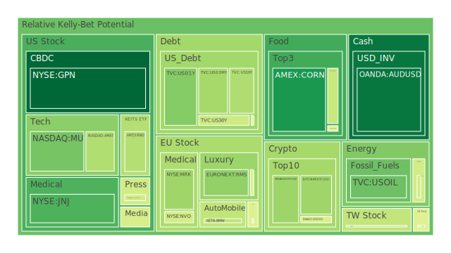
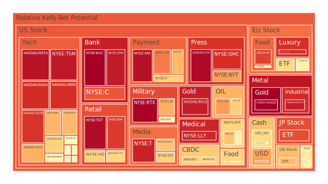
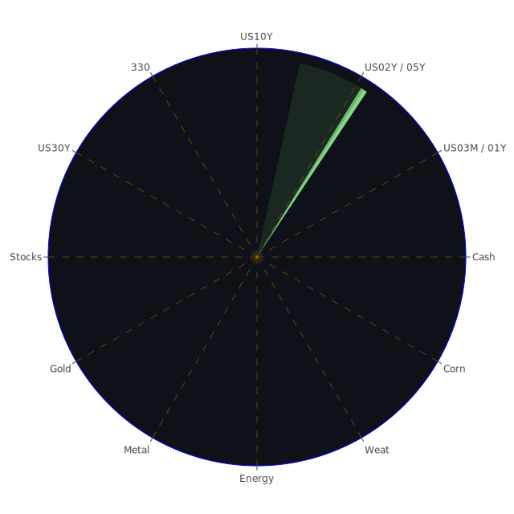

# **投資商品泡沫分析**

當前全球金融市場呈現複雜多變的格局，各類資產在不同因素驅動下展現出迥異的風險收益特徵。以下將針對主要投資類別進行深入剖析，評估其潛在的泡沫風險及未來展望。觀察整體市場，一個顯著的現象是多項資產的即時風險評估指標近期急劇攀升，部分甚至達到極端水平，這警示我們必須以更審慎的態度檢視潛在的系統性風險與個別資產的過熱情況。

**美國國債 (TVC:US02Y, US03MY, US01Y, US05Y, US10Y, US30Y)**

美國國債市場作為全球金融的基石，其殖利率曲線的形態與變動深刻影響著所有風險資產的定價。從數據觀察，短期國債如三個月期 (US03MY 現價4.37) 的即時風險指標由0.18水平上升至0.38，一年期 (US01Y 現價4.10) 由0.64回落後再微升至0.33，二年期 (US02Y 現價3.95) 風險指標則相對穩定維持在0.60高位。中長期方面，五年期 (US05Y 現價4.05) 風險指標約在0.49，十年期 (US10Y 現價4.43) 風險指標從0.35水平微升至接近0.40，三十年期 (US30Y 現價4.89) 風險指標則由0.57回落至0.44。

聯邦準備理事會的經濟數據顯示，其總資產規模處於相對低位，反映持續的縮表政策。然而，有效聯邦基金利率交易量 (EFFR Volume) 處於高位，顯示市場對流動性的需求依然旺盛。短期利率如三個月期殖利率 (4.37%) 高於十年期殖利率 (4.43%) 的現象雖已有所緩解（十年期減三月期利差由負轉為微正的0.06），但整體殖利率曲線仍然相對平坦，部分倒掛的壓力有所減輕，這在歷史上常被視為經濟前景不明朗或衰退風險的信號，儘管近期有所改善。從社會心理學角度看，市場對於聯準會政策路徑的預期高度敏感，任何風吹草動都可能引發債券價格的波動。博弈論的視角下，投資者與聯準會之間正在進行一場預期管理的博弈，聯準會試圖在不引發過度恐慌的前提下控制通膨，而投資者則試圖預判其政策轉向的時點。近期聯準會官員一次鷹派的發言，也為市場增添了緊縮預期。值得注意的是，雖然CPI年增率已降至2.33%，但各類貸款的拖欠率，特別是商業地產和信用卡（100大銀行之外）的沖銷率處於高位，這與國債市場中某些期限債券相對較高的風險指標，共同描繪出一幅經濟承壓的圖景。

歷史上，殖利率曲線的變動往往預示著經濟週期的轉折。當前的高利率環境對新興市場國家的美元債務構成壓力，可能引發資本外流，進而影響全球金融穩定。從空間維度考量，美國國內的財政赤字和高企的公共債務佔GDP比率，是支撐長期利率的潛在因素。

**美國零售股 (NYSE:TGT, WMT, HD)**

零售業的表現直接反映消費者信心和支出能力。觀察家得寶 (HD 現價378.63)，其即時風險指標從0.88回落至0.67，月平均風險亦在0.67左右，顯示風險有所緩和但仍在中高位。目標百貨 (TGT 現價97.07) 的即時風險指標則從0.44急升至駭人的0.97，月平均風險也高達0.85，泡沫警訊強烈。沃爾瑪 (WMT 現價96.35) 的即時風險指標則由0.90微降至0.89，月平均風險0.84，同樣處於極高風險區域。

新聞事件中，American Eagle Outfitters (AEO) 因撤回財測導致股價下跌，顯示服飾零售領域面臨壓力。另一方面，蛋價四月份大幅下跌，食品通膨壓力減緩，這對依賴食品銷售的零售商可能是好壞參半的消息（銷量可能增加，但利潤率或受影響）。聯準會數據中，消費者拖欠率處於相對高位，但信用卡拖欠率（特別是百大銀行）卻相對較低，這可能反映了消費分層的現象：部分消費者財務壓力巨大，而另一部分則相對穩健。零售股的表現與此息息相關。

從社會學角度看，消費者的購物習慣在後疫情時代持續演變，線上購物與實體店的融合，以及對價格敏感度的提升，都對零售商的經營策略構成挑戰。心理學上，高通膨預期（儘管CPI已回落）和對經濟前景的擔憂可能壓抑非必需品的消費。博弈論的觀點則體現在零售商之間的價格戰與促銷策略，以及與供應商之間的議價能力。歷史上，零售股在經濟衰退前夕往往表現脆弱，高庫存和低利潤率是常見的警訊。TGT和WMT極高的風險指標值得投資人高度警惕。

**美國科技股 (NASDAQ:AAPL, MSFT, GOOG, AMZN, NVDA, META, TSLA)**

科技股一直是市場的焦點，特別是大型科技巨頭。蘋果 (AAPL 現價211.45) 即時風險指標從0.46升至0.72後維持，月平均風險約0.59，處於中高位。微軟 (MSFT 現價453.13) 即時風險指標經歷從0.70升至0.80再回落至0.53的波動，月平均風險0.63，顯示其風險評估波動較大但整體偏高。谷歌 (GOOG 現價165.40) 即時風險指標從0.56降至0.34後回升至0.52，月平均風險0.57，亦屬中等偏高。亞馬遜 (AMZN 現價205.17) 即時風險指標從0.65大幅攀升至0.91，月平均風險0.73，風險急劇升高。輝達 (NVDA 現價134.83) 受益於AI熱潮，股價飆升，其即時風險指標從0.59一路狂飆至0.91，月平均風險僅0.58，顯示近期風險聚集速度驚人，新聞提及沙烏地阿拉伯的晶片交易以及其市值突破，均為推波助瀾的因素。Meta (META 現價643.88) 的即時風險指標同樣從0.72飆升至0.96，月平均風險0.90，警示信號強烈。特斯拉 (TSLA 現價342.82) 的即時風險指標在0.54至0.67之間波動，最新為0.54，月平均風險0.42，相對其他科技巨頭稍低但仍不容忽視，關於馬斯克薪酬方案的報導可能為股價帶來短期波動。

科技股的「正反合」體現在：正方是創新驅動的成長潛力（AI、雲端運算、電動車）；反方則是高估值、反壟斷監管壓力、以及宏觀經濟下行對廣告和消費電子需求的衝擊。新聞中提到亞馬遜設備與服務部門裁員，以及科技股整體引領市場上漲，這本身就構成一種多空交織的局面。聯準會數據中高殖利率環境對成長股的估值構成壓力。從心理學角度，市場對科技股，尤其是AI概念股，存在高度的樂觀情緒，甚至可能是FOMO（害怕錯過）心態，這可能助長泡沫。博弈論觀點下，科技巨頭之間的平台競爭、生態系統構建以及對新興技術的搶先佈局，都是影響其未來價值的關鍵。歷史上，科技泡沫（如2000年網路泡沫）的破裂往往伴隨著巨大的財富毀滅效應。NVDA、AMZN、META的極高即時風險指標，以及AAPL、MSFT較高的風險水平，都值得密切關注。

**美國房地產指數 (AMEX:VNQ, IYR, RWO)**

房地產市場對利率極為敏感。VNQ (現價89.19) 即時風險指標從0.58微升至0.60，月平均風險0.41。IYR (現價94.30) 風險指標從0.69升至0.77後穩定在0.69水平，月平均風險0.80，顯示風險較高。RWO (現價44.05) 風險指標從0.62降至0.40，月平均風險0.46。

聯準會數據顯示，30年期固定抵押貸款利率高達6.76%，遠高於去年的3.00%，這對房地產市場構成顯著壓力。同時，商業地產拖欠率和房地產總體拖欠率均處於高位。新聞亦指出，由於關稅問題，房地產市場今年可能「失落一年」。然而，State Farm獲准在加州提升17%的房屋保費，這反映了保險成本的上升，間接增加了房屋持有成本，但對保險公司本身是利多。

房地產的「空間」三位一体體現在核心都市圈的高需求與部分地區的人口外流和供應過剩。時間上，疫情期間的低利率和居家辦公潮推升了房價，如今高利率和重返辦公室趨勢則帶來逆風。概念上，房地產不僅是居住需求，也是投資工具，其金融屬性使其易受市場情緒和信貸環境影響。IYR較高的風險指標，以及整體信貸環境的緊張，使得美國房地產市場前景承壓。

**加密貨幣 (BINANCE:BTCUSD, ETHUSD, DOGEUSD)**

加密貨幣市場以高波動性著稱。比特幣 (BTCUSD 現價103787) 即時風險指標從0.57降至0.37，月平均風險0.47，風險有所下降但仍處於中等水平。以太坊 (ETHUSD 現價2549.79) 即時風險指標從0.44降至0.36，月平均風險0.52，亦呈現下降趨勢。狗狗幣 (DOGEUSD 現價0.2201) 即時風險指標從0.55降至0.47，月平均風險0.47。

新聞方面，Coinbase獲納入標普500指數被視為加密產業的重大利好，可能吸引更多傳統資金流入。其執行長對穩定幣立法前景表示樂觀，這有助於提升市場的合規預期。

加密貨幣的「正反合」邏輯是：正方為其去中心化、抗審查、創新支付解決方案的潛力；反方則是監管不確定性、駭客攻擊風險、以及與實體經濟連結薄弱的問題。目前，加密貨幣市場正處於從「蠻荒西部」向更規範化、機構化發展的過渡階段，這是其「合」的表現。心理學上，加密市場極易受到社群情緒和意見領袖言論的影響。博弈論在其中體現為早期採用者的巨大收益與後來者的追逐風險。雖然近期風險指標有所回落，但其內在的高波動性和政策風險依然存在。

**金/銀/銅 (OANDA:XAUUSD, XAGUSD, FX:COPPER)**

貴金屬和工業金屬是觀察經濟健康和避險情緒的重要窗口。黃金 (XAUUSD 現價3236.80) 的即時風險指標在過去三天從0.992攀升至1.000，達到最高警示級別，儘管其月平均風險為0.52，顯示近期避險情緒或投機行為急劇升溫。白銀 (XAGUSD 現價32.64) 即時風險指標亦從0.928微升至0.943，月平均風險0.86，同樣處於極高風險區。銅 (COPPER 現價4.69) 即時風險指標則相對穩定在0.52-0.54之間，月平均風險0.62。

黃金石油比 (52.84) 和黃金銅比 (690.45) 均處於歷史相對高位，顯示黃金相對於這兩種商品價格偏高。新聞中，地緣政治緊張局勢（如加薩、烏克蘭、巴基斯坦與印度之間的微妙停火）通常會推升黃金的避險需求。然而，美國與中國達成削減關稅的協議，若能緩和貿易緊張，則可能略微削弱黃金的吸引力。但FED數據中，美國公債佔GDP比重高企，長期來看對法定貨幣的信心構成挑戰，利好黃金。

黃金的極高即時風險值得高度關注，這可能反映了市場對未知的極端恐慌，或是短期資金的非理性追捧。從歷史視角看，黃金在滯脹環境或金融系統壓力增大時表現優異。白銀兼具貴金屬和工業屬性，其高風險可能與黃金聯動，也受工業需求預期影響。銅價相對穩定，但其中等偏高的風險也反映了全球經濟復甦的不確定性。

**黃豆 / 小麥 / 玉米 (AMEX:SOYB, WEAT, CORN)**

農產品價格關係到民生和通膨。黃豆ETF (SOYB 現價21.78) 即時風險指標從0.61降至0.49，月平均風險0.63。小麥ETF (WEAT 現價4.51) 風險指標波動較大，從0.29降至0.09後再飆升至0.43，月平均風險0.41。玉米ETF (CORN 現價18.11) 即時風險指標從0.70降至0.41再回落至0.20，月平均風險0.45。

新聞提到蛋價四月大跌，食品通膨壓力有所緩解。這可能對農產品價格形成一定壓力。從歷史上看，極端天氣事件、地緣政治衝突（影響黑海糧食出口）以及各國農業政策（如關稅、補貼）都會顯著影響農產品價格。社會層面，糧食安全是各國政府高度重視的議題。心理層面，對未來供應短缺的恐慌可能引發囤積和價格上漲。目前農產品ETF的風險指標多處於中等水平，波動較大，反映了供需多方面因素的複雜互動。

**石油/ 鈾期貨 (TVC:USOIL, COMEX:UX1\!)**

能源市場對全球經濟至關重要。美國原油 (USOIL 現價61.28) 即時風險指標從0.67大幅下降至0.30，月平均風險僅0.20，顯示近期油價壓力顯著，風險評估走低。新聞指出，美國原油庫存增加引發供應過剩擔憂，導致油價下跌超過1美元。鈾期貨 (UX1\! 現價71.55) 即時風險指標從0.55微降至0.45，月平均風險0.49，處於中等水平。

石油市場的「正反合」邏輯是：正方為全球經濟復甦帶來的需求增長；反方為新能源轉型、主要產油國的供應策略（OPEC+減產或增產）、以及地緣政治對供應鏈的擾動。目前油價下跌反映了對經濟前景的擔憂和短期供應的充足。博弈論在產油國組織的決策中扮演核心角色。鈾作為核燃料，其價格與全球對核能的態度和核電站建設進度相關，烏克蘭的衝突也可能間接影響到鈾的供應鏈和市場情緒。

**各國外匯市場 (OANDA:AUDUSD, GBPUSD, USDJPY, EURUSD)**

外匯市場是全球資本流動和相對經濟實力的體現。澳元兌美元 (AUDUSD 現價0.6400) 即時風險指標從0.43降至0.12再回升至0.14，月平均風險0.37，處於中低水平。英鎊兌美元 (GBPUSD 現價1.3300) 即時風險指標從0.53微升至0.57，月平均風險0.44。美元兌日圓 (USDJPY 現價145.33) 即時風險指標從0.57大幅攀升至0.74，月平均風險0.65，顯示日圓貶值壓力巨大，相關風險升高。歐元兌美元 (EURUSD 現價1.1200) 即時風險指標從0.70微降至0.68，月平均風險高達0.84，顯示其波動風險較高。

美元的強勢（或日圓的極度弱勢）是當前外匯市場的一個主要特徵。聯準會的鷹派立場和相對較高的利率水平支撐美元。日本央行則長期維持超寬鬆政策，導致利差持續擴大。從空間角度，不同經濟體的復甦步伐和貨幣政策差異是匯率波動的主要驅動因素。歷史上，美元的急劇升值往往對新興市場造成壓力。EURUSD的高風險指標可能反映了歐洲經濟前景的不確定性以及歐洲央行政策的兩難。

**各國大盤指數 (SPREADEX:FTSE, GDAXI, FXOPEN:FCHI, SSE:000300, TWSE:0050, FX:JPN225, NASDAQ:NDX)**

全球主要股指表現分化。英國富時100 (FTSE 現價8647.60) 即時風險指標從0.66降至0.48，月平均風險0.53。德國DAX (GDAXI 現價23738.10) 即時風險指標從0.73降至0.18後回升至0.65，波動劇烈，月平均風險0.54。法國CAC40 (FCHI 現價7872.80) 即時風險指標從0.47微升至0.48，月平均風險0.57。中國滬深300 (000300 現價3907.20) 即時風險指標穩定在0.71左右，月平均風險0.56。台灣加權股價指數原型 (0050 現價182.50) 即時風險指標從0.55降至0.42，月平均風險0.64。日經225 (JPN225 現價37738.66) 即時風險指標從0.90降至0.86，月平均風險0.75，仍處於高風險區。納斯達克100 (NDX 現價21335.82) 即時風險指標穩定在0.71水平，月平均風險0.75，顯示科技股集中的指數風險偏高。

新聞提到美股科技股帶動納指連漲六日，而同時歐洲市場則出現波動。這反映了不同區域經濟基本面和市場情緒的差異。中國股市在經歷長期調整後，其風險指標處於相對高位，可能意味著市場仍在尋找方向。日股在日圓貶值的背景下，出口型企業受益，但其高風險指標也需留意。NDX的高風險與其中科技巨頭的高風險一脈相承。

**美國半導體股 (NASDAQ:MU, AMD, AMAT, INTC, NVDA, QCOM, AVGO, NYSE:TSM)**

半導體是科技產業的核心，也是地緣政治博弈的焦點。美光 (MU 現價95.45) 即時風險從0.09升至0.31，風險溫和上升。超微 (AMD 現價114.99) 即時風險從0.40經0.83回落至0.59，波動較大。應用材料 (AMAT 現價174.75) 即時風險從0.41微降至0.39，月平均風險0.70。英特爾 (INTC 現價21.55) 即時風險從0.69降至0.56，月平均風險0.49。輝達 (NVDA) 前已述及，風險極高。高通 (QCOM 現價152.61) 即時風險從0.91微降至0.90，月平均風險0.79，極高風險。博通 (AVGO 現價232.64) 即時風險從0.92降至0.68再回升至0.72，月平均風險0.80，高風險。台積電 (TSM 現價194.22) 即時風險從0.92持續攀升至0.95，月平均風險高達0.98，是所有資產中泡沫風險最高的之一。

新聞中富士康預期AI伺服器需求帶動獲利強勁增長，直接利好半導體產業。美國對華的科技管制以及各國對半導體自主可控的追求，重塑了全球半導體供應鏈的空間格局。時間維度上，半導體行業具有明顯的周期性，目前正處於AI需求爆發的新周期，但對泛消費電子的需求依然疲弱。概念上，半導體技術的迭代速度極快，掌握核心技術的公司享有巨大議價權。TSM、QCOM、NVDA的極高風險指標，反映了市場對其未來成長的高度預期已遠超基本面，或已進入情緒驅動的泡沫階段。

**美國銀行股 (NYSE:JPM, BAC, C, COF)**

銀行股的表現與宏觀經濟和利率環境密切相關。摩根大通 (JPM 現價267.49) 即時風險指標從0.94微升至0.95，月平均風險0.72，極高風險。美國銀行 (BAC 現價44.38) 即時風險指標從0.99經歷0.52的短暫回落後再次飆升至0.99，月平均風險0.96，風險極端。花旗集團 (C 現價75.96) 即時風險指標從0.89降至0.85，月平均風險0.86，極高風險。第一資本 (COF 現價197.50) 即時風險指標從0.60經0.44回升至0.71，月平均風險0.49，相對較低但仍在上升。

聯準會數據顯示，銀行存款總額處於高位，但各類貸款拖欠率和沖銷率上升，對銀行資產品質構成壓力。高利率環境下，銀行的淨息差可能受益，但也可能因經濟放緩導致信貸損失增加。巴西Nubank第一季調整後淨利潤大增，澳洲CBA第三季現金利潤增長，顯示部分國際銀行業務表現良好，但美國本土銀行，特別是大型銀行的極高風險指標，可能反映了市場對其在複雜的信貸週期和潛在經濟下行風險中的擔憂，以及近期股價漲幅過大。BAC和JPM的風險指標尤其值得警惕。

**美國軍工股 (NYSE:LMT, NOC, RTX)**

地緣政治緊張局勢往往利好軍工股。洛克希德馬丁 (LMT 現價465.14) 即時風險指標從0.78經0.86回落至0.73，月平均風險0.76，高風險。諾斯洛普格魯曼 (NOC 現價469.05) 即時風險指標從0.73經0.60回落至0.58，月平均風險0.70，高風險。雷神技術 (RTX 現價135.52) 即時風險指標從0.96持續攀升至0.99，月平均風險0.79，風險極高。

新聞中關於加薩、烏克蘭以及其他地區衝突的消息，都為軍工企業提供了持續的訂單預期。從空間維度看，各國增加國防開支已成為趨勢。時間維度上，大國博弈的長期化使得軍工產業景氣度有望維持。RTX的極高風險指標，以及LMT、NOC的高風險，反映了市場對此類股票的追捧，但也可能積累了較大泡沫。

**美國電子支付股 (NYSE:V, MA, PYPL, GPN)**

電子支付行業受益於現金交易的減少和數位經濟的發展。Visa (V 現價362.30) 即時風險指標從0.89降至0.63再回升至0.67，月平均風險0.74，高風險。萬事達卡 (MA 現價582.20) 即時風險指標從0.97微降至0.96，月平均風險0.79，極高風險。PayPal (PYPL 現價71.57) 即時風險指標從0.55升至0.67，月平均風險0.90，極高風險。Global Payments (GPN 現價82.98) 即時風險指標從0.27降至0.23再大幅回落至0.11，月平均風險0.53，風險相對較低且在下降。

高利率環境和潛在的消費支出放緩可能對交易額增長構成挑戰。PYPL和MA的極高風險指標，以及V的高風險，顯示市場對這些支付巨頭的估值已較為充分，若未來增長不及預期，可能面臨回調壓力。GPN風險相對較低，可能因其業務結構或市場預期不同。

**美國藥商股 (NYSE:JNJ, MRK, LLY, NVO)**

醫藥股通常被視為防禦性板塊，但也受到藥品研發、專利懸崖和政策變動的影響。嬌生 (JNJ 現價149.61) 即時風險指標從0.02大幅上升至0.26，月平均風險0.22，低風險但近期有所抬頭。默克 (MRK 現價74.80) 即時風險指標從0.60降至0.33再回升至0.37，月平均風險0.48，中等風險。禮來 (LLY 現價733.29) 即時風險指標穩定在0.93的極高水平，月平均風險亦為0.93。諾和諾德 (NVO 現價66.15) 即時風險指標從0.61降至0.46後維持，月平均風險0.62。

新聞中UnitedHealth執行長突然離職導致股價大跌，顯示了健康管理領域的突發風險。禮來公司因其減肥藥等重磅產品，股價持續上漲，但也使其泡沫風險居高不下。JNJ的低風險可能與其業務多元化和穩健的現金流有關。藥企的「正反合」在於：新藥研發成功帶來巨大收益（正），但研發失敗和專利到期則構成威脅（反），通過併購和持續創新以維持增長（合）。LLY的極高風險指標需要投資人審慎對待。

**美國影視股 (NASDAQ:NFLX, DIS, PARA)**

影視娛樂行業面臨流媒體競爭加劇和內容成本上升的挑戰。Netflix (NFLX 現價1177.98) 即時風險指標從0.44升至0.69，月平均風險0.47，風險顯著上升。迪士尼 (DIS 現價112.22) 即時風險指標穩定在0.67，月平均風險0.69，高風險。派拉蒙 (PARA 現價11.90) 即時風險指標穩定在0.44-0.46之間，月平均風險0.50，中等風險。

內容為王的時代，各大平台在原創內容上的投入巨大。廣告市場的景氣程度也影響其收入。社會心理學角度，大眾娛樂偏好的轉變和對新敘事方式的需求，促使行業不斷革新。NFLX風險上升和DIS持續高風險，反映了市場對其盈利能力和用戶增長持續性的關注。

**美國媒體股 (NASDAQ:CMCSA, FOX, NYSE:NYT)**

媒體行業受到數位化轉型和廣告市場變化的深刻影響。康卡斯特 (CMCSA 現價35.33) 即時風險指標從0.45微升至0.45，月平均風險0.46（但D7/D14較低），中等風險。福斯 (FOX 現價51.31) 即時風險指標從0.93持續攀升至0.98，月平均風險0.86，極高風險。紐約時報 (NYT 現價55.55) 即時風險指標從0.46大幅上升至0.89再回落至0.75，月平均風險0.72，高風險且波動。

傳統媒體向數位訂閱和多元化經營轉型是生存之道。假新聞的泛濫和公眾對媒體信任度的變化，是社會學層面值得關注的現象。FOX的極高風險和NYT的高風險，可能與其在特定細分市場的影響力以及市場對其轉型成效的評估有關。

**石油防禦股 (NYSE:XOM, OXY)**

大型石油公司在油價波動中尋求穩定經營。艾克森美孚 (XOM 現價108.58) 即時風險指標從0.77微降至0.75，月平均風險0.78，高風險。西方石油 (OXY 現價43.37) 即時風險指標從0.73降至0.61再回升至0.68，月平均風險0.75，高風險。

儘管近期油價下跌，但這些大型石油公司的風險指標依然偏高，可能反映了市場對其長期盈利能力、資本回報計劃（如股息和回購）以及在能源轉型中的定位的綜合考量。巴菲特對西方石油的持續增持也為市場提供了一定的心理支撐。

**金礦防禦股 (NASDAQ:RGLD)**

金礦股與黃金價格聯動，但也受自身經營效率和儲量影響。Royal Gold (RGLD 現價169.29) 即時風險指標從0.99降至0.91再回升至0.94，月平均風險0.91，極高風險。其風險狀況與黃金本身極高的即時風險指標相互呼應，顯示整個黃金相關產業鏈都處於高度亢奮或緊張狀態。

**歐洲奢侈品股 (EURONEXT:MC, RMS, KER)**

奢侈品行業對全球經濟景氣度，特別是高淨值人群的消費能力敏感。LVMH (MC 現價507.30) 即時風險指標從0.48微降至0.48，月平均風險0.48，中等風險。歷峰集團 (RMS 現價2567.00) 即時風險指標從0.53降至0.37再微降至0.35，月平均風險0.67，風險有所下降但整體仍偏高。開雲集團 (KER 現價175.74) 即時風險指標從0.93降至0.86再大幅攀升至0.91，月平均風險0.72，極高風險且波動劇烈。

奢侈品消費具有顯著的社會心理學特徵，品牌價值、稀缺性以及身份認同是重要驅動力。KER的極高風險可能與其旗下特定品牌的表現或市場對其轉型策略的擔憂有關。MC相對穩健。

**歐洲汽車股 (XETR:BMW, MBG, PAH3)**

歐洲汽車製造商面臨電動化轉型和全球競爭的壓力。寶馬 (BMW 現價77.58) 即時風險指標從0.41微升至0.42，月平均風險0.57。賓士 (MBG 現價53.23) 即時風險指標穩定在0.50水平，月平均風險0.49。保時捷 (PAH3 現價37.98) 即時風險指標從0.84大幅回落至0.60，月平均風險0.55。

新聞中提到本田汽車因關稅問題股價下跌，這也可能波及其他出口導向的汽車製造商。全球電動車銷量四月雖有增長，但貿易摩擦可能帶來阻礙。歐洲汽車股的風險指標多處於中等水平，PAH3的風險顯著下降值得注意，可能與市場對其估值回歸的預期有關。

**歐美食品股 (NASDAQ:KHC, SIX:NESN, LSE:ULVR, NYSE:KO)**

食品股通常被視為防禦性投資，但亦受成本波動和消費趨勢影響。卡夫亨氏 (KHC 現價27.49) 即時風險指標從0.40大幅上升至0.67，月平均風險0.75，風險顯著增加。雀巢 (NESN 現價86.59) 即時風險指標從0.62降至0.58，月平均風險0.54。聯合利華 (ULVR 現價4599.00) 即時風險指標從0.95大幅回落至0.88，月平均風險0.95，仍處於極高水平。可口可樂 (KO 現價71.61) 即時風險指標從0.64大幅回落至0.50，月平均風險0.70，風險有所下降但整體仍偏高。

KHC的風險急升，ULVR的持續高風險，可能與其應對成本上漲和維持市場份額的挑戰有關。可口可樂風險下降可能與其品牌護城河及穩定的市場需求有關。

# **宏觀經濟傳導路徑分析**

當前宏觀經濟環境的核心特徵是聯準會的緊縮貨幣政策與持續的地緣政治不確定性。聯準會總資產下降，顯示其正從市場回收流動性。然而，EFFR交易量高企，暗示銀行間市場對短期資金的需求依然強勁。鷹派發言進一步強化了市場對利率可能在更長時間內維持高位的預期。這一政策姿態通過以下路徑傳導：

1. **利率路徑**：高基準利率（OIS FED Fund Rate 4.33%，儘管低於去年，但仍顯著高於疫情前水平）直接推高各期限美國國債殖利率。這使得企業融資成本上升，尤其對依賴債務融資的成長型科技公司估值構成壓力。同時，30年期固定抵押貸款利率高達6.76%，嚴重抑制房地產市場活動，導致相關產業鏈（建材、家居）需求疲軟，商業地產和總體房地產拖欠率上升印證了這一點。  
2. **信貸路徑**：利率上升導致銀行信貸標準收緊。信用卡（百大銀行外）沖銷率和消費者總體拖欠率上升，表明部分家庭財務狀況惡化，將影響消費支出，特別是非必需消費品和服務，對零售業、影視娛樂業構成壓力。  
3. **匯率路徑**：相對強勢的美元（如USDJPY的強勁升值）對美國進口有利（緩解部分通膨壓力），但對出口不利。同時，強美元增加新興市場國家的償債壓力，可能引發區域性金融不穩定，進而通過避險情緒傳導回美國市場，推高黃金等避險資產價格。  
4. **通膨預期路徑**：CPI年增率雖已降至2.33%，但核心通膨的粘性及地緣政治對供應鏈的潛在衝擊（如紅海危機影響海運）仍使市場對通膨卷土重來抱有警惕。這影響長期利率定價，也使聯準會短期內難以轉向鴿派。  
5. **財政路徑**：美國政府高企的公共債務佔GDP比率以及相對較低的財政部普通帳戶餘額（TGA），意味著未來可能需要大量發行新債，這將對債券市場構成供給壓力，可能推高長期利率，除非聯準會或其他買家（如外國機構，但其美債持有量相對較低）積極吸納。

新聞中，美國貿易談判代表稱10%的普遍關稅將重建國內製造業，這代表了一種試圖通過貿易壁壘影響國內產業結構和就業的政策取向，但同時也可能推高進口成本，加劇通膨，並引發貿易夥伴的反制，其淨效應有待觀察。美中關稅削減協議則朝相反方向作用，顯示政策的動態調整和多重目標的平衡。

從歷史視角看，上世紀70年代的滯脹時期，以及2008年金融危機後的漫長復甦，都為理解當前宏觀傳導路徑提供了借鑒。當時的政策應對、市場反應以及資產表現輪動，對於判斷當前各類資產的相對強弱具有參考意義。

# **微觀經濟傳導路徑分析**

企業層面的事件和決策，通過其供應鏈、競爭格局和投資者預期，對相關股票乃至整個行業產生影響。

1. **企業財報與展望**：新聞中多家公司（如American Eagle, Wyndham, TFX, CSV）發布了不及預期或謹慎的財報/展望，直接導致其股價下跌。這種負面情緒會傳導至其同業，引發市場對整個行業增長前景的擔憂。例如，CSV的財報電話會議中提到運營投資和對全年展望的謹慎，TFX則直接下調指引並提及關稅的負面影響。  
2. **管理層變動**：UnitedHealth執行長的突然離職導致股價暴跌，這反映了關鍵人物風險對企業價值的巨大影響。投資者擔憂管理層的不確定性會影響公司戰略的連續性和執行力。  
3. **產業特定利好/利空**：富士康預期AI伺服器需求強勁，利好其自身及整個AI供應鏈（如NVDA）。Coinbase獲納入標普500指數，對加密貨幣行業而言是里程碑事件，可能吸引更多機構資金流入，並提升其他加密相關公司的估值預期。相反，本田汽車對關稅影響的擔憂則對汽車行業構成壓力。  
4. **企業戰略調整**：亞馬遜設備與服務部門的裁員，雖然短期內可能被市場解讀為削減成本的積極舉措，但也可能暗示該業務線增長乏力或公司戰略重點轉移。特斯拉關於馬斯克新薪酬方案的傳聞，則可能影響投資者對公司治理和未來走向的判斷。  
5. **監管與政策影響**：Coinbase執行長對穩定幣立法前景的樂觀表態，若能實現，將降低加密行業的政策不確定性，有利於行業長期發展。反之，若監管趨嚴，則可能對相關企業構成打擊。  
6. **併購與重組**：Bain Capital退出對澳洲Insignia的收購，顯示了市場環境變化對大型交易的影響。企業間的併購活動往往能反映行業整合趨勢和企業對未來發展的信心。

從社會心理學角度，特定行業或公司的「故事」是否吸引人，往往會影響其股票的短期表現。AI概念的火爆即是一例。博弈論的視角則體現在企業之間的競爭策略，例如在流媒體領域，各大平台在內容投入和定價策略上的博弈。

# **資產類別間傳導路徑分析**

不同資產類別之間並非孤立存在，而是通過利率、匯率、通膨預期、風險偏好等多重渠道相互影響，形成複雜的漣漪效應。

1. **債券市場對股市的影響**：美國國債殖利率是股市估值的錨。特別是十年期國債殖利率的上升，會提高股票的貼現率，對高成長、高估值的科技股（如NDX及其成分股）壓力尤大。殖利率曲線的形態（如倒掛的緩解）也會影響市場對經濟前景的判斷，進而影響股市板塊輪動。  
2. **美元匯率對商品及新興市場的影響**：強勢美元（如USDJPY的表現）通常會壓低以美元計價的商品價格（如黃金、石油）。然而，當前黃金價格飆升至歷史新高，顯示避險需求或特定因素的影響力超過了傳統的美元負相關性。強美元也會增加新興市場國家的償債負擔，可能引發資本外流，衝擊其股市和匯市。  
3. **商品價格對通膨及相關股票的影響**：原油價格的波動直接影響運輸成本和通膨預期，進而影響聯準會的政策。油價下跌（如近期USOIL表現）有助於緩解通膨壓力，但若因需求疲軟導致，則非經濟佳音。油價也直接影響石油開採和煉化企業（如XOM, OXY）的盈利。農產品價格（SOYB, WEAT, CORN）則影響食品通膨和相關食品加工企業（KHC, NESN, KO）的成本。  
4. **黃金與其他避險資產/風險資產的關係**：黃金（XAUUSD）的極端泡沫風險指標與白銀（XAGUSD）的高風險相互印證。在地緣政治緊張或金融市場動盪時，資金通常會流向黃金。加密貨幣（BTCUSD, ETHUSD）有時被視為「數位黃金」，但在避險屬性上尚未完全得到市場共識，其與黃金的關係更像是一種既競爭又互補的狀態。股市大跌時，黃金的避險功能或更為凸顯。  
5. **房地產與利率及銀行體系的關係**：高抵押貸款利率直接衝擊房地產市場（VNQ, IYR），交易量萎縮，價格承壓。商業地產的困境則可能通過銀行貸款損失傳導至銀行體系（JPM, BAC），尤其是在區域性銀行風險尚未完全消除的背景下。  
6. **科技股內部的傳導**：AI的繁榮不僅推高了NVDA等核心晶片股的估值，也帶動了相關軟硬體（如伺服器、雲服務AMZN, MSFT, GOOG）的需求預期。然而，若AI泡沫破裂，則可能引發整個科技板塊的連鎖反應。半導體行業內，TSM的極高風險也對其主要客戶（如AAPL, AMD）的供應鏈穩定性和成本構成潛在影響。

從「資訊航母表格」的概念來看，一個市場的「正」面因素（如AI帶來的技術突破），可能引發其他市場的「反」應（如傳統行業資金被虹吸，或對AI倫理和就業的擔憂），最終市場會在新的均衡點上達成「合」的狀態（如AI技術的逐步落地和社會適應）。當前黃金的極高風險，與多數銀行股、科技股的高風險並存，可能暗示市場正處於一個高度不確定的尋頂或轉折的關鍵時期，不同資產的風險收益特徵正在被重新評估。

# **投資建議**

鑑於當前市場環境的高度不確定性、部分資產顯現的極端泡沫跡象、以及聯準會持續的緊縮傾向，投資者應採取極為審慎的態度，並注重資產配置的均衡性與風險管理。

**穩健型配置 (總佔比 45%)**

此類配置旨在保本並獲取適度回報，重點關注資產的低波動性和防禦性。

1. **短期美國國債 (例如，1-3年期美國國債ETF) (20%)**: 鑒於殖利率曲線部分倒掛有所緩解，且短期利率仍具吸引力，配置部分短期國債可提供相對穩定的票息收入和較高的流動性。US01Y目前風險指標0.33，US03MY風險指標0.38，相對可控。  
2. **優質必需消費品股票 (例如，JNJ, 或必需消費品ETF) (15%)**: 嬌生 (JNJ) 的即時風險指標雖有上升但仍處於0.26的低位，且其業務遍及全球，具有較強的防禦性。選擇此類公司或涵蓋此類公司的ETF，可以在市場波動時提供相對保護。  
3. **現金或貨幣市場基金 (10%)**: 在高度不確定的環境下，持有部分現金能提供靈活性，以便在市場出現大幅回調時把握機會，同時也能降低整體投資組合的波動。

**成長型配置 (總佔比 35%)**

此類配置旨在尋求高於市場平均的回報，但需承擔相應風險，重點關注具有長期增長潛力但當前估值相對合理的領域。

1. **部分基本面穩健的科技股 (例如，GOOG, MSFT，但需控制倉位) (15%)**: 雖然科技巨頭整體風險偏高，但谷歌和微軟在AI、雲計算等領域仍具備長期增長潛力。其即時風險指標分別為0.52和0.53，相較NVDA、META等略低。投資者可考慮在股價回調時分批介入，並嚴格設定止損。  
2. **全球基礎建設相關ETF (10%)**: 考慮到全球範圍內對基礎建設（包括傳統基建和數位基建）的持續投入，以及部分國家推動製造業回流的趨勢，相關ETF具備長期增長潛力，且可能與主流科技股相關性較低。  
3. **醫療保健創新領域 (不包括已極高風險的個股) (10%)**: 排除如LLY這樣即時風險已達0.93的個股，可以關注在生物技術、醫療器械等領域有持續創新能力，且估值尚未極度泡沫化的二線龍頭企業或相關ETF。MRK的風險指標0.37相對溫和。

**高風險配置 (總佔比 20%)**

此類配置旨在博取高額回報，但可能面臨巨大波動甚至本金損失的風險，僅適合風險承受能力極強的投資者，且倉位務必嚴格控制。

1. **波動性較大的半導體股 (例如，MU，作為產業風向標之一) (7%)**: 美光 (MU) 即時風險指標0.31，在半導體股中相對較低，但其行業週期性強，可作為觀察半導體行業復甦情況的指標之一，小倉位參與。避免追高TSM、NVDA等風險已極高的個股。  
2. **黃金或金礦股 (作為短期對沖工具，見好就收) (7%)**: 鑒於黃金 (XAUUSD) 和Royal Gold (RGLD) 的即時風險指標分別高達1.00和0.94，顯示市場極度亢奮。若作為短期對沖地緣政治風險或市場劇烈波動的工具，可極小倉位參與，但需認識到其已處於泡沫高位，風險極大，應設定嚴格的退出機制。  
3. **特定新興市場ETF (選擇基本面改善且估值合理的國家) (6%)**: 在美元強勢背景下，部分新興市場面臨壓力，但也可能出現錯殺的機會。需仔細甄別，選擇那些受益於大宗商品價格（若有反彈）、國內改革或特定產業發展，且整體市場估值偏低的國家ETF。

以上配置比例僅為參考，投資者應根據自身情況動態調整。特別需要強調的是，當前眾多資產的泡沫風險評估指標（如TSM 0.95, META 0.96, RTX 0.99, BAC 0.99, XAUUSD 1.00, LLY 0.93, MA 0.96, PYPL 0.90, XAGUSD 0.94, JPM 0.95, WMT 0.89, TGT 0.97, NVDA 0.91）已達到令人警惕的水平，這意味著市場情緒可能極度樂觀或恐慌，價格已嚴重偏離基本面。在這種情況下，"安全邊際"變得尤為重要。

# **風險提示**

投資有風險，市場總是充滿不確定性。本報告所載資料和分析判斷僅基於截至報告日的公開信息，並不構成任何投資邀約或最終操作建議。過往的業績不代表未來的表現。各類資產的泡沫風險評估是一個動態變化的過程，本報告提及的風險指標僅為參考之一。

投資者應充分理解各類投資工具的特性和風險，根據自身的風險承受能力、投資目標、財務狀況以及獨立的專業判斷，審慎做出投資決策，並自行承擔由此產生的全部風險。在做出任何投資決策前，建議諮詢專業的財務顧問。市場波動可能導致本金損失，請務必謹慎。特別警惕那些泡沫風險指標持續處於極高位的資產，其價格回調的風險不容忽視。

 
Daily Buy Map:

 
Daily Sell Map:

 
Daily Radar Chart:

 
