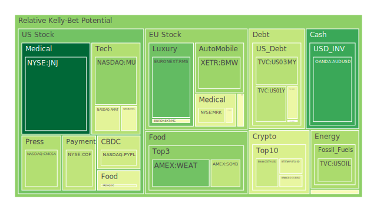
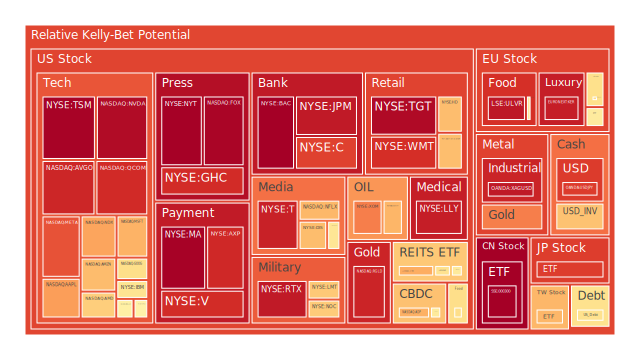
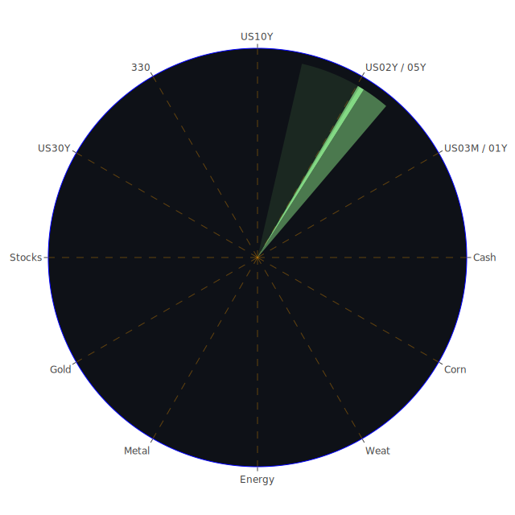

# **投資商品泡沫分析**

當前全球金融市場在多重因素交織下，呈現複雜多變的格局。我們將依據近期數據，對各類主要投資商品進行深入的泡沫分析，並融入經濟學、社會學、心理學及博弈論等多維度視角，同時參考歷史經驗與新聞事件，力求提供客觀且具深度的觀察。

**美國國債**

美國國債市場近期波動顯著，不同期限的殖利率呈現分化。以2025年5月17日的數據觀察，美國二年期國債殖利率為3.99%，相較於上週的3.88%及上月的3.64%有所上升，但仍低於去年的4.68%。十年期國債殖利率為4.45%，亦高於上週的4.38%及上月的4.00%，但略高於去年的4.33%。三十年期國債殖利率則為4.90%。值得注意的是，殖利率曲線方面，十年期與三個月期利差為0.09，雖仍扁平，但已脫離去年的深度倒掛(-1.29)，這在經濟學上通常被視為衰退風險的緩和，但也可能預示著市場對短期通膨的擔憂或對聯準會政策路徑的不確定性。

從提供的泡沫數據來看，各期限美國國債的風險評分呈現差異。例如，US01Y（一年期美債）在5月15日的當日風險評分為0.337，月平均風險評分為0.488；US02Y（二年期美債）在5月17日的風險評分則穩定在0.609左右；US10Y（十年期美債）在5月17日的當日風險評分為0.558，月平均風險評分為0.447；US30Y（三十年期美債）在5月17日的當日風險評分為0.448，月平均風險評分亦在0.473左右。這些數據表明，短期債券的波動性與風險感知可能相對較高，而長期債券則受到對未來經濟預期和通膨路徑的影響。

新聞事件中，聯準會的鷹派言論（2025年4月4日以來有1次鷹派發言，0次鴿派發言）以及持續的經濟數據（如EFFR交易量上升、貨幣市場基金總資產上升）均對債券市場產生影響。社會心理層面，投資者對通膨持續性的擔憂以及對經濟前景的不確定感，使得避險情緒與尋求固定收益的需求並存。博弈論角度觀之，市場參與者正在預判聯準會的下一步行動，任何超乎預期的政策訊號都可能引發債市的劇烈波動。歷史上，在通膨高漲及政策緊縮時期，債券市場往往經歷較大調整，但長期而言，國債作為避險資產的地位依然穩固。當前，聯準會總資產處於相對低位，而聯準會儲備處於相對高位，顯示系統流動性尚可，但公共債務佔GDP比重處於高位，是潛在的長期隱憂。

**美國零售股**

美國零售股，如WMT（沃爾瑪）和TGT（塔吉特），其泡沫風險評分處於較高水平。WMT在5月17日的當日風險評分為0.901，月平均風險評分約為0.851。TGT在同日的當日風險評分為0.975，月平均風險評分亦高達0.850。COST（好市多）的當日風險評分也達到0.665，月平均為0.524。這些高風險評分反映了市場對零售業前景的擔憂與樂觀情緒並存。

新聞事件中，「沃爾瑪警告嬰兒車、電子產品和玩具價格將上漲，這對百思買、美泰等公司來說可能是壞消息」(2025-05-16, negative, 96%) 以及「由於關稅問題，房地產市場面臨‘失落的一年’」(2025-05-15, negative, 96%) 等消息，均對零售業構成壓力。關稅的實施直接增加了進口成本，可能侵蝕零售商的利潤空間或轉嫁給消費者，進而影響消費意願。然而，也有正面消息如「Dick's Sporting Goods接近達成收購競爭對手Foot Locker的交易」(2025-05-15, positive, 71%)，顯示行業內部可能出現整合機會。

經濟學角度看，零售業的表現與消費者信心、可支配收入、就業狀況以及通膨水平密切相關。當前美國消費者拖欠率處於相對高位，信用卡核銷率也處於高位，這對消費支出構成潛在威脅。社會學層面，消費習慣的轉變，如線上購物的普及，對傳統零售商的經營模式提出挑戰。心理學上，價格上漲的預期可能導致部分消費者提前購買，但也可能因對未來經濟前景的擔憂而縮減開支。博弈論視角下，零售商在定價策略、庫存管理以及供應鏈優化方面面臨複雜決策，既要應對成本壓力，又要維持市場份額。歷史上，經濟衰退或高通膨時期，非必需品零售受到的衝擊往往較大。

**美國科技股**

美國科技股，尤其是大型科技股和半導體股，呈現出複雜的風險態勢。以大型科技股為例，GOOG（谷歌）在5月17日的當日風險評分為0.600，月平均風險評分為0.569。MSFT（微軟）同日的當日風險評分為0.686，月平均風險評分為0.627。AAPL（蘋果）當日風險評分為0.722，月平均風險評分為0.597。AMZN（亞馬遜）當日風險評分為0.669，月平均風險評分為0.731。META（臉書）當日風險評分則高達0.841，月平均風險評分為0.900。NFLX（網飛）當日風險評分為0.677，月平均風險評分為0.493。

半導體領域，NVDA（輝達）在5月17日的當日風險評分飆升至0.971，儘管其月平均風險評分為0.624，顯示近期風險急劇拉高。TSM（台積電）的當日風險評分也高達0.990，月平均風險評分亦在0.980的高位。AMD（超微）當日風險評分為0.634，月平均風險評分為0.609。INTC（英特爾）當日風險評分為0.451，月平均風險評分為0.493，相對較低。MU（美光）當日風險評分為0.265，月平均風險評分為0.346。AVGO（博通）當日風險評分為0.917，月平均風險評分為0.806。QCOM（高通）當日風險評分為0.909，月平均風險評分為0.805。AMAT（應用材料）當日風險評分為0.424，月平均風險評分為0.698。KLAC（科磊）當日風險評分為0.547，月平均風險評分為0.522。

從新聞事件看，「亞馬遜削減設備和服務部門的工作崗位」(2025-05-15, negative, 96%) 反映了大型科技公司在經濟前景不明朗時可能進行成本控制。然而，「納斯達克指數連續第六天上涨，輝達和晶片股引領科技股反彈」(2025-05-15, positive, 93%) 以及「Super Micro Computer在分析師看好其處於AI交易‘甜蜜點’後，兩天漲幅擴大至35%」(2025-05-15, positive, 91%)，則顯示市場對特定領域（如AI）的熱情依舊高漲。經濟學上，科技股的估值高度依賴於未來增長預期和利率水平。當前利率環境相對較高，對成長型科技股構成壓力。社會學角度，科技的快速迭代和普及，使得科技股始終是市場關注的焦點，但也容易形成羊群效應。心理學上，對創新技術的興奮感與對泡沫破裂的恐懼感交織。博弈論中，科技巨頭之間的競爭與合作，以及各國政府對科技產業的政策導向，都深刻影響著行業格局。歷史上，科技泡沫（如2000年互聯網泡沫）的破裂曾對市場造成巨大衝擊，但優質科技企業最終能穿越週期。

**美國房地產指數**

美國房地產指數，如VNQ（Vanguard Real Estate ETF）和IYR（iShares U.S. Real Estate ETF），其泡沫風險評分處於中高水平。VNQ在5月17日的當日風險評分為0.565，月平均風險評分為0.413。IYR同日的當日風險評分為0.698，月平均風險評分高達0.790。RWO（SPDR Dow Jones Global Real Estate ETF）當日風險評分為0.591，月平均風險評分為0.471。HD（家得寶）作為與房地產市場密切相關的零售商，其當日風險評分為0.667，月平均風險評分為0.679。

新聞事件中，「由於關稅問題，房地產市場面臨‘失落的一年’」(2025-05-15, negative, 96%) 指出了宏觀經濟因素對房地產市場的負面影響。聯準會數據顯示，30年期固定抵押貸款利率為6.81%，遠高於去年的2.95%，這顯著增加了購房成本，抑制了需求。同時，商業房地產拖欠率處於相對高位，房地產拖欠率也處於相對高位。經濟學上，房地產市場對利率極為敏感，高利率環境通常會導致市場降溫。社會學角度，住房是民生之本，房價的劇烈波動可能引發社會問題。心理學上，對房價持續上漲的預期一旦逆轉，可能觸發恐慌性拋售。博弈論視角，開發商、購房者、投資者和金融機構在市場中的互動決定了價格走勢。歷史上，房地產泡沫的破裂（如2008年次貸危機）曾引發全球金融危機。

**加密貨幣**

加密貨幣市場，以BTCUSD（比特幣）和ETHUSD（以太坊）為代表，其泡沫風險評分處於中等偏高水平，且波動性較大。BTCUSD在5月17日的當日風險評分為0.427，月平均風險評分為0.470。ETHUSD同日的當日風險評分為0.370，月平均風險評分為0.512。DOGEUSD（狗狗幣）的當日風險評分為0.440，月平均風險評分為0.479。

新聞事件中，「Coinbase CEO Armstrong對穩定幣立法能夠在參議院通過持‘樂觀’態度，儘管面臨阻力」(2025-05-15, positive, 93%)，以及「Coinbase股價在遭受網絡攻擊和美國證券交易委員會調查消息後下跌」(2025-05-16, negative, 94%)，反映了監管動態和安全事件對加密貨幣市場的重大影響。經濟學上，加密貨幣的價值基礎仍在探索之中，其價格更多受到市場情緒、資金流動和技術發展的影響。社會學角度，加密貨幣社群的共識和信仰對其價格有重要支撐作用。心理學上，FOMO（害怕錯過）和FUD（恐懼、不確定、懷疑）情緒常常主導市場。博弈論視角，大型投資者（巨鯨）的行為、交易所的運營策略以及監管機構的態度，共同塑造了市場格局。歷史上，加密貨幣經歷了多次暴漲暴跌，其高風險高回報的特性十分突出。

**金/銀/銅**

貴金屬和工業金屬方面，黃金（XAUUSD）的泡沫風險評分在近期顯著上升，5月17日當日風險評分為0.771，而其月平均風險評分僅為0.514，顯示短期風險聚集。白銀（XAGUSD）的當日風險評分高達0.944，月平均風險評分亦在0.864的高位。銅（COPPER）的當日風險評分為0.525，月平均風險評分為0.620。

新聞事件並未直接提及金銀銅的具體驅動因素，但全球經濟放緩的擔憂、地緣政治風險以及通膨預期均可能影響其價格。經濟學上，黃金通常被視為避險資產和抗通膨工具，其價格與美元匯率和實際利率呈負相關。白銀兼具貴金屬和工業屬性。銅作為重要的工業金屬，其需求與全球經濟增長密切相關。聯準會數據顯示，黃金/石油比率為51.79，黃金/銅比率為698.18，這些相對價格關係可以提供一些觀察視角。社會學角度，黃金在歷史上長期扮演貨幣角色，具有文化和心理層面的價值認同。心理學上，市場恐慌時黃金的避險需求會上升。博弈論視角，主要生產國的供應策略、大型基金的頭寸調整以及央行的購金行為都會影響市場。

**黃豆 / 小麥 / 玉米**

農產品方面，黃豆（SOYB）、小麥（WEAT）和玉米（CORN）的泡沫風險評分處於中等水平。SOYB在5月17日的當日風險評分為0.351，但其七日和十四日平均風險評分較高（0.607, 0.646），月平均為0.650。WEAT同日的當日風險評分為0.218，月平均風險評分為0.413。CORN當日風險評分為0.499，月平均風險評分為0.447。

新聞事件未直接提及農產品，但其價格受到天氣、地緣政治（如影響黑海糧食出口的衝突）、能源價格（影響農業生產成本）、貿易政策和全球供需基本面的影響。經濟學上，農產品價格彈性較小，易受供給衝擊影響。社會學角度，糧食安全是各國政府高度重視的問題。心理學上，對糧食短缺的恐慌可能導致囤積行為和價格上漲。博弈論視角，主要出口國的貿易政策、大型糧商的庫存管理等因素均很重要。

**石油/ 鈾期貨UX\!**

能源市場方面，石油（USOIL）的泡沫風險評分處於中低水平，5月17日當日風險評分為0.308，月平均風險評分為0.207。鈾期貨（UX1\!）當日風險評分為0.510，月平均風險評分為0.491。

新聞事件中，「美國石油價格下跌超過1美元，因庫存增加引發供應過剩擔憂」(2025-05-15, negative, 94%) 以及「沙特阿美削減股息」(2025-05-16, negative, 94%)，均對油價構成壓力。經濟學上，石油需求與全球經濟活動密切相關，供給則受到OPEC+產量政策、地緣政治衝突以及新能源發展等多重因素影響。鈾作為核能發電的關鍵原料，其需求與核電發展前景和能源轉型政策相關。社會心理層面，能源價格的波動直接影響民生成本和通膨預期。博弈論中，產油國之間的協調與競爭是影響油價的關鍵。

**各國外匯市場**

主要貨幣對方面，AUDUSD在5月17日的當日風險評分為0.141，月平均風險評分為0.371。GBPUSD同日的當日風險評分為0.545，月平均風險評分為0.448。EURUSD當日風險評分為0.684，月平均風險評分高達0.844，顯示歐元兌美元的風險預期較高。USDJPY當日風險評分為0.878，月平均風險評分為0.656，日元貶值壓力持續。

外匯市場的波動受到各國經濟基本面差異、利率政策分化、國際資本流動以及地緣政治風險的影響。經濟學的利率平價理論、購買力平價理論是分析匯率的基礎框架。新聞中關於貿易戰、關稅等消息會直接影響相關國家的貨幣。例如，美國的貿易政策和經濟數據會主導美元走勢，進而影響其他貨幣。社會心理層面，對一國經濟前景的信心會影響其貨幣價值。博弈論視角下，各國央行的政策博弈（如競爭性貶值或協同干預）是重要看點。

**各國大盤指數**

全球主要股市指數表現各異。GDAXI（德國DAX）在5月17日的當日風險評分為0.561，月平均風險評分為0.538。FCHI（法國CAC）當日風險評分為0.477，月平均風險評分為0.571。FTSE（英國富時100）當日風險評分為0.482，月平均風險評分為0.539。JPN225（日經225）當日風險評分為0.875，月平均風險評分為0.750，日本股市風險較高。000300（滬深300）當日風險評分高達0.996，但月平均風險評分為0.581，顯示近期風險急升。0050（台灣50）當日風險評分為0.679，月平均風險評分為0.635。NDX（納斯達克100）當日風險評分為0.711，月平均風險評分為0.756。

新聞中「股市今日：道瓊斯、標普500、納斯達克期貨交易平淡，投資者情緒在貿易緊張局勢緩解下趨於穩定」(2025-05-15, negative, 95%) 和「Point72的Cohen在關稅混亂中預見經濟放緩」(2025-05-15, negative, 95%)，以及「聯合國預測，在特朗普的關稅和貿易緊張局勢之後，全球經濟增長將放緩」(2025-05-16, negative, 94%)，均反映了宏觀經濟和貿易摩擦對全球股市的普遍影響。經濟學上，股市是經濟的晴雨表，但也受流動性、利率和市場情緒影響。社會心理層面，投資者信心和風險偏好是重要驅動力。博弈論視角，大型機構投資者的資產配置策略和跨市場套利行為會影響指數聯動。

**美國半導體股** （已在美國科技股中詳細分析）

**美國銀行股**

美國銀行股，如BAC（美國銀行）、JPM（摩根大通）、C（花旗集團）和COF（第一資本金融），其泡沫風險評分普遍較高。BAC在5月17日的當日風險評分高達0.995，月平均風險評分也達0.964。JPM當日風險評分為0.943，月平均風險評分為0.733。C當日風險評分為0.868，月平均風險評分為0.866。COF當日風險評分為0.349，月平均風險評分為0.491，相對較低。

銀行股的表現與利率環境、信貸週期、監管政策和整體經濟健康狀況密切相關。聯準會數據顯示，信用卡核銷率、商業房地產拖欠率和消費者拖欠率均處於相對高位，這對銀行資產品質構成挑戰。然而，淨息差可能因利率上升而擴大。經濟學上，銀行的盈利能力受淨息差和信貸損失準備的影響。社會心理層面，對金融系統穩定性的信心至關重要。博弈論視角，銀行在風險管理、業務擴張和應對監管方面的策略選擇影響其業績。歷史上，銀行業危機往往伴隨著嚴重的經濟衰退。

**美國軍工股**

美國軍工股，如LMT（洛克希德馬丁）、NOC（諾斯洛普格魯曼）和RTX（雷神技術），其泡沫風險評分處於中高水平。LMT在5月17日的當日風險評分為0.644，月平均風險評分為0.768。NOC當日風險評分為0.639，月平均風險評分為0.697。RTX當日風險評分為0.942，月平均風險評分為0.801。

軍工股的驅動因素通常與地緣政治緊張局勢、國防預算以及國際軍售訂單相關。新聞事件中提及的「以色列在加沙醫院罷工中針對哈馬斯領導人穆罕默德·辛瓦爾」(2025-05-15, negative, 84%)、「俄羅斯西伯利亞地區嚴重野火肆虐60萬公頃森林」(2025-05-15, negative, 82%)、「以色列稱其攔截了來自也門的導彈，胡塞武裝聲稱負責」(2025-05-15, negative, 52%) 以及「卡塔爾稱以色列最近在加沙的襲擊表明他們對談判停火不感興趣」(2025-05-15, negative, 50%)，均可能間接提升市場對軍工需求的預期。經濟學上，國防開支具有一定的逆週期性。社會心理層面，安全感的缺失可能推升對國防的重視。博弈論視角，國際軍備競賽和地區衝突的演變是重要影響因素。

**美國電子支付股**

美國電子支付股，如V（Visa）、MA（萬事達）、PYPL（PayPal）和GPN（Global Payments），其泡沫風險評分呈現分化。V在5月17日的當日風險評分為0.906，月平均風險評分為0.738。MA當日風險評分為0.992，月平均風險評分為0.802。PYPL當日風險評分為0.381，但其月平均風險評分高達0.867，顯示近期風險有所回落但整體仍高。GPN當日風險評分為0.566，月平均風險評分為0.464。

電子支付行業的增長受益於現金交易的減少和電子商務的普及。新聞事件「Fiserv股價下跌，因首席財務官警告平台增長緩慢」(2025-05-16, negative, 96%) 可能對行業情緒產生一定影響。經濟學上，其收入與交易量和費率相關。社會學角度，支付方式的便捷性和安全性是用戶考量的重點。心理學上，消費者對新支付技術的接受程度影響其普及。博弈論視角，支付公司在技術創新、市場拓展和應對監管方面的競爭激烈。

**美國藥商股**

美國藥商股，如JNJ（嬌生）、MRK（默克）、LLY（禮來）和NVO（諾和諾德），其泡沫風險評分各不相同。JNJ在5月17日的當日風險評分為0.000，月平均風險評分為0.222，風險相對較低。MRK當日風險評分為0.406，月平均風險評分為0.468。LLY當日風險評分高達0.933，月平均風險評分亦在0.933的高位。NVO當日風險評分為0.472，月平均風險評分為0.582。

藥商股的表現受到藥品研發成功率、專利保護、醫保政策和人口老齡化趨勢的影響。經濟學上，藥品需求相對剛性，但研發投入巨大且風險高。社會心理層面，對健康和長壽的追求是長期驅動力。博弈論視角，藥企在研發競賽、定價策略和併購整合方面的決策至關重要。

**美國影視股**

美國影視股，如DIS（迪士尼）和NFLX（網飛），PARA（派拉蒙）。DIS在5月17日的當日風險評分為0.668，月平均風險評分為0.699。NFLX當日風險評分為0.677，月平均風險評分為0.493。PARA當日風險評分為0.578，月平均風險評分為0.491。

影視行業面臨流媒體競爭加劇、內容成本上升以及消費者娛樂方式多樣化的挑戰。經濟學上，其收入依賴於訂閱用戶數、廣告收入和內容的吸引力。社會學角度，文化產品的傳播力和影響力是核心競爭力。心理學上，優質內容引發的情感共鳴是成功的關鍵。博弈論視角，平台之間的內容爭奪和版權合作影響行業格局。

**美國媒體股**

美國媒體股，如GOOG（谷歌，亦屬科技股）、META（臉書，亦屬科技股）、CMCSA（康卡斯特）、NYT（紐約時報）和FOX（福斯）。CMCSA在5月17日的當日風險評分為0.324，月平均風險評分為0.467。NYT當日風險評分高達0.995，月平均風險評分為0.726。FOX當日風險評分亦高達0.986，月平均風險評分為0.878。

媒體行業受到廣告市場景氣度、新媒體衝擊和信息傳播方式變革的影響。經濟學上，廣告收入和訂閱收入是主要來源。社會學角度，媒體的公信力和社會責任日益重要。心理學上，信息的及時性和客觀性影響用戶信任。博弈論視角，傳統媒體與新媒體的競爭與融合是行業趨勢。

**石油防禦股**

石油防禦股，通常指大型綜合性石油公司，如XOM（埃克森美孚）和OXY（西方石油）。XOM在5月17日的當日風險評分為0.770，月平均風險評分為0.791。OXY當日風險評分為0.681，月平均風險評分為0.747。

這些公司在油價上漲時通常受益，但在油價下跌時也具有一定的抗風險能力，因其業務鏈較長，包含上下游。其風險狀況與油價波動、行業政策和公司自身經營狀況相關，已在石油部分有所提及。

**金礦防禦股**

金礦防禦股，如RGLD（皇家黃金），其泡沫風險評分較高。RGLD在5月17日的當日風險評分為0.920，月平均風險評分亦高達0.920。

金礦股的表現與黃金價格密切相關，但同時也受到公司自身開采成本、儲量、經營管理和政治風險的影響。在金價上漲預期下，金礦股往往表現出更高的彈性。

**歐洲奢侈品股**

歐洲奢侈品股，如RMS（歷峰集團）、MC（LVMH）和KER（開雲集團）。RMS在5月17日的當日風險評分為0.194，月平均風險評分為0.642。MC當日風險評分為0.474，月平均風險評分為0.474。KER當日風險評分高達0.933，月平均風險評分為0.748。

奢侈品行業的表現與全球高淨值人群的財富效應、消費信心以及品牌影響力相關。近期部分奢侈品股風險評分較高，可能反映了對全球經濟放緩和消費降級的擔憂。經濟學上，奢侈品需求彈性較大。社會心理層面，品牌所代表的身份認同和稀缺性是重要驅動力。

**歐洲汽車股**

歐洲汽車股，如BMW（寶馬）、MBG（賓士）和PAH3（保時捷控股）。BMW在5月17日的當日風險評分為0.284，月平均風險評分為0.572。MBG當日風險評分為0.508，月平均風險評分穩定在0.497左右。PAH3當日風險評分為0.602，月平均風險評分為0.575。

歐洲汽車行業面臨向電動化轉型的挑戰、日益嚴格的環保法規以及來自全球的競爭壓力。新聞中關於關稅的討論也可能對汽車出口造成影響。經濟學上，汽車是大宗消費品，其需求與經濟週期和信貸條件相關。

**歐美食品股**

歐美食品股，如KHC（卡夫亨氏）、NESN（雀巢）和ULVR（聯合利華）。KHC在5月17日的當日風險評分為0.427，月平均風險評分為0.749。NESN當日風險評分為0.564，月平均風險評分為0.546。ULVR當日風險評分高達0.948，月平均風險評分亦在0.951的高位。KO（可口可樂）當日風險評分為0.600，月平均風險評分為0.679。

食品飲料行業屬於必需消費品，具有較強的防禦性，但在成本上升（如原材料、運輸）和消費習慣改變的背景下也面臨挑戰。部分食品股的高風險評分可能反映了市場對其成本轉嫁能力和利潤空間的擔憂。

# **宏觀經濟傳導路徑分析**

當前宏觀經濟環境的核心主題是通膨壓力、利率政策的不確定性以及地緣政治風險。聯準會的鷹派立場及持續的量化緊縮（總資產處於相對低位）旨在抑制通膨，但同時也推高了借貸成本。美國各期限國債殖利率的上升，特別是短期殖利率維持高位（如二年期3.99%，一年期4.13%），反映了市場對短期內利率不會大幅下降的預期。這條傳導路徑首先影響固定收益市場，進而對權益市場估值構成壓力，尤其是對利率敏感的成長型股票（如部分科技股）和房地產行業。

新聞事件中反覆提及的「關稅」問題是另一條重要的宏觀傳導路徑。貿易保護主義抬頭（如「Point72的Cohen在關稅混亂中預見經濟放緩」、「聯合國預測，在特朗普的關稅和貿易緊張局勢之後，全球經濟增長將放緩」），直接導致進口商品成本上升，加劇通膨壓力（體現在零售股如WMT的價格上漲預警），並可能引發貿易夥伴的反制措施，進一步擾亂全球供應鏈，拖累全球經濟增長。這對依賴國際貿易的經濟體及其股市（如GDAXI, FTSE, JPN225, 000300）均構成負面影響。

地緣政治緊張局勢（如中東衝突、俄烏戰爭的持續影響雖未直接在新聞中詳述，但背景存在）則通過能源價格（間接影響USOIL, UX1\!）、供應鏈安全和市場避險情緒傳導。避險情緒升溫時，資金可能流向黃金（XAUUSD風險近期顯著上升）、美元或特定避險貨幣，同時對風險資產構成壓力。軍工股（LMT, NOC, RTX）則可能因衝突預期而受到提振。

從聯準會的數據看，EFFR交易量上升、貨幣市場基金總資產上升，顯示市場流動性尋求短期停泊，可能反映了對未來市場波動的謹慎態度。同時，公共債務佔GDP比重高企，以及美國銀行總存款處於高位但流通中公債總量偏低，暗示未來政府融資成本和壓力不容小覷。

# **微觀經濟傳導路徑分析**

在企業層面，成本上升是普遍面臨的挑戰。這包括原材料成本（影響製造業、食品業如KHC）、勞動力成本（雖未直接數據化，但通膨背景下壓力存在）以及融資成本（高利率環境）。企業將成本壓力轉嫁給消費者的能力，直接影響其利潤率和股價表現。新聞中「CSV Q1 Earnings Call: Volume Growth, Operational Investments, and Cautious Full-Year Outlook」和「TFX Q1 Earnings Call: Guidance Cut and Strategic Shifts Dominate Amid Tariff Headwinds」均反映了企業在當前環境下的運營壓力及對前景的謹慎。

科技行業內部的傳導路徑值得關注。AI領域的強勁需求（如對NVDA, SMCI的樂觀預期）帶動了相關產業鏈的景氣，但也可能導致其他非AI領域科技投入的排擠或估值分化。亞馬遜削減非核心業務崗位，顯示大型科技公司也在進行戰略調整和成本優化。

金融行業，尤其是銀行（BAC, JPM, C），其信貸質量是核心。聯準會數據顯示的信用卡、商業地產和消費者貸款拖欠率上升，直接傳導為銀行的壞賬風險和撥備壓力。儘管淨息差可能受益於高利率，但信貸成本的上升可能抵消部分利好。

零售業（WMT, TGT, COST）則直接感受到消費者購買力的變化。高通膨和高利率環境下，消費者可能更傾向於必需品，減少非必需品開支，或轉向更具性價比的商品，這對不同定位的零售商影響各異。

# **資產類別間傳導路徑分析**

資產類別間的傳導路徑錯綜複雜，呈現正反饋與負反饋並存的局面。

1. **債券市場與股票市場**：傳統上，債券殖利率上升對股票估值構成壓力，尤其是高成長股票。當前美國國債殖利率處於高位，對科技股（NDX, GOOG, MSFT, AAPL等）的估值形成制約。若市場對經濟衰退的擔憂加劇，資金可能從股市流向債市避險，壓低殖利率，反之亦然。目前殖利率曲線雖然脫離深度倒掛，但仍扁平，暗示市場對未來經濟路徑的看法仍存分歧。  
2. **商品市場與通膨預期/股票市場**：石油（USOIL）、銅（COPPER）等工業商品的價格上漲會推高通膨預期，進而影響央行政策和債券殖利率，間接作用於股市。農產品（SOYB, WEAT, CORN）價格波動直接影響食品股（KHC, NESN）成本和CPI。黃金（XAUUSD）作為避險資產，其價格上漲往往伴隨著市場對經濟或地產政治風險的擔憂，可能與股市呈負相關，或在特定滯脹環境下與股市同跌。當前黃金與石油比率（51.79）和黃金與銅比率（698.18）處於一定水平，反映了不同商品間的相對強弱。黃金價格近期急升，可能預示市場避險情緒的增強或對美元信用的擔憂。  
3. **美元與其他資產**：美元強勢通常對以美元計價的商品（如石油、黃金）構成壓力，並可能導致資金從新興市場流出。當前USDJPY的強勢（日元弱勢）是顯著特徵，可能與日本央行的寬鬆政策及美日利差有關。EURUSD的風險評分較高，暗示市場對歐元區經濟前景或歐洲央行政策路徑的擔憂。  
4. **房地產與金融體系**：房地產市場的健康狀況（VNQ, IYR）直接關聯到銀行業（BAC, JPM）的信貸風險，因為房地產是重要的抵押品。商業地產拖欠率的上升已對部分銀行構成壓力。  
5. **加密貨幣與風險偏好**：加密貨幣（BTCUSD, ETHUSD）的表現常被視為市場風險偏好的溫度計。當市場風險偏好高漲時，資金傾向流入這類高波動性資產；反之則流出。近期加密貨幣風險評分處於中等偏高，顯示市場仍有一定投機情緒，但也受到監管和安全事件的擾動。

一個潛在的漣漪效應路徑可能是：持續的貿易摩擦和關稅 \-\> 全球供應鏈受阻，成本推動型通膨加劇 \-\> 迫使各國央行（尤其是聯準會）維持緊縮政策，利率居高不下 \-\> 企業融資成本和經營壓力增大，盈利預期下調（如部分財報所顯示） \-\> 股市（尤其是對利率敏感的成長股和周期股）承壓，同時高利率也抑制房地產市場 \-\> 經濟放緩擔憂加劇，推升避險情緒，資金流向黃金、短期美債或現金 \-\> 消費者信心受挫，進一步影響零售和服務業。這個過程中，地緣政治風險可能隨時放大波動。

# **投資建議**

基於上述分析，我們需要構建能夠應對當前複雜市場環境的投資組合。泡沫風險數據顯示，部分資產如TSM, BAC, MA, FOX, NYT, ULVR, RTX, TGT, XAGUSD, LLY, META, JPM, KER, QCOM, AVGO, WMT, RGLD, AXPBAC, JPM, C, LMT, RTX, V, MA, PYPL, TGT, WMT, HD, META, LLY, NVDA, TSM, AVGO, QCOM, IYR, XAGUSD, JPN225, 000300 (近期D1高), XAUUSD (近期D1高), RTX, NYT, FOX, ULVR, TSM, MA, BAC等，其短期或中長期泡沫風險評分較高，投資者應審慎對待。

我們建議以下三種不同風險偏好的配置方案：

**一、穩健型投資組合 (總佔比 40%)**

此組合旨在保本並獲取穩健收益，適合風險承受能力較低的投資者。

1. **短期美國國債 (佔穩健型20%，即總資產8%)**: 如US01Y或US03MY。鑑於當前殖利率尚可，且聯準會政策未明顯轉向鴿派，短期國債可提供相對穩定的票息收入和較高的流動性。儘管其短期風險評分不算極低，但相較於權益資產仍具防禦性。  
2. **優質大型藥商股 (佔穩健型10%，即總資產4%)**: 如JNJ。其泡沫風險評分目前極低（D1為0.000），且醫藥需求具有剛性，受經濟週期影響較小，股息發放穩定。  
3. **黃金 (佔穩健型10%，即總資產4%)**: XAUUSD。儘管近期D1風險評分上升較快，但考慮到地緣政治不確定性及潛在的通膨壓力，黃金作為傳統避險資產仍具配置價值。建議逢低逐步吸納，不追高。

**二、成長型投資組合 (總佔比 40%)**

此組合旨在尋求長期資本增值，適合有一定風險承受能力的投資者。

1. **部分估值相對合理的科技股龍頭 (佔成長型15%，即總資產6%)**: 如MSFT或GOOG。雖然整體科技板塊估值不低，但這些公司在AI、雲計算等領域具有領先地位和持續的盈利能力。其泡沫風險評分（MSFT D1 0.686, GOOG D1 0.600）雖不低，但相較於部分熱炒概念股更為穩健。需關注其財報和行業競爭格局。  
2. **全球房地產指數ETF中的優質選擇 (佔成長型10%，即總資產4%)**: 如VNQ。其泡沫風險評分（D1 0.565）相較於IYR（D1 0.698）略低。房地產市場雖受利率影響，但長期而言，優質地產仍具抗通膨和增值潛力。需關注利率走勢和租金回報率。  
3. **石油或綜合能源股 (佔成長型15%，即總資產6%)**: 如USOIL相關ETF或XOM。石油（USOIL D1 0.308）當前泡沫風險評分不高，考慮到全球經濟仍有增長（雖放緩），且地緣政治可能擾動供給，能源價格仍有支撐。XOM（D1 0.770）風險稍高，但其綜合業務有助於分散風險。

**三、高風險型投資組合 (總佔比 20%)**

此組合旨在博取高額回報，僅適合風險承受能力強且對相關領域有深入了解的投資者。

1. **特定半導體股 (佔高風險型8%，即總資產1.6%)**: 如AMD或MU。AMD（D1 0.634）和MU（D1 0.265）的當前泡沫風險評分相較於NVDA（D1 0.971）和TSM（D1 0.990）為低，但仍屬高波動板塊。半導體行業週期性強，但也是未來科技發展的基石。  
2. **新興市場指數ETF (佔高風險型6%，即總資產1.2%)**: 雖然數據中未直接提供具體新興市場ETF，但可考慮如印度、巴西等具有增長潛力且與已開發市場相關性可能較低的市場。此類市場波動較大，但長期增長潛力也較高。  
3. **加密貨幣 (佔高風險型6%，即總資產1.2%)**: 如BTCUSD或ETHUSD。其泡沫風險評分（BTC D1 0.427, ETH D1 0.370）尚可，但行業本身波動巨大。僅建議以小部分資金參與，並密切關注監管動態和技術發展。

上述比例分配僅為參考，投資者應根據自身情況進行調整。重要的是分散投資，並定期檢視和調整投資組合。

# **風險提示**

投資有風險，市場總是充滿不確定性。本報告所有分析和建議均基於當前獲取的有限數據和信息，並不能完全預測未來市場的實際走勢。所提及的泡沫風險評分僅為一種量化參考，不構成唯一的投資決策依據。

宏觀經濟政策的變化、地緣政治衝突的升級、未預期到的黑天鵝事件等，都可能對市場造成重大影響。例如，聯準會的政策路徑若超乎市場預期，可能引發資產價格的劇烈重估。貿易摩擦若進一步加劇，全球經濟前景將面臨更大挑戰。

投資者在做出任何投資決策前，應充分了解相關投資產品的特性和風險，結合自身的財務狀況、投資目標和風險承受能力，進行獨立思考和判斷。在必要時，應尋求專業的財務顧問意見。過往的業績表現並不預示未來回報。請謹慎評估各類資產的高泡沫風險警告，切勿盲目追高。市場價格可能隨時發生大幅波動，投資者需對此有充分準備。

 
Daily Buy Map:

 
Daily Sell Map:

 
Daily Radar Chart:

 
