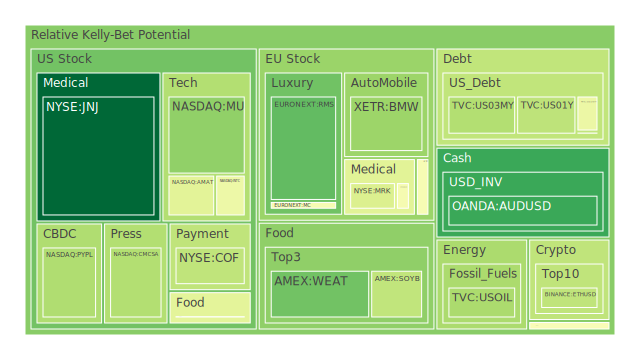
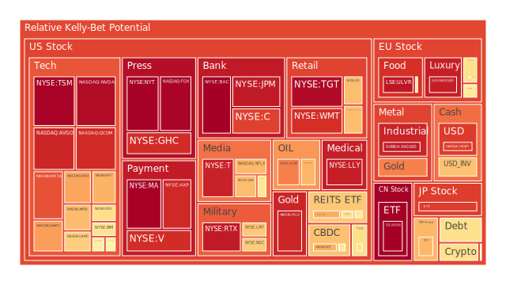
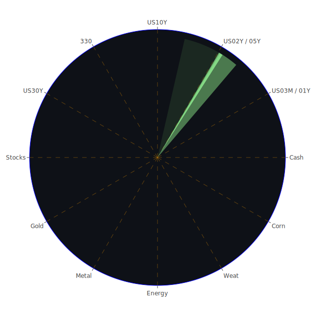

# **投資商品泡沫分析**

在當前複雜的全球經濟環境下，各類資產的價格波動與潛在泡沫風險成為市場參與者高度關注的焦點。我們將秉持公正客觀的態度，基於所提供的數據與資訊，對各主要投資類別進行深入剖析，探討其現狀、潛在風險以及可能的演變路徑。這一切的市場波動，皆可視為在特定時空條件下，多重因素交互作用下的自然現象。

**美國國債**

美國國債市場作為全球金融的基石，其殖利率的變動深刻影響著全球資本的流動與定價。觀察數據顯示，美國各年期國債的泡沫指數在近期呈現中等水平。例如，一年期美國國債 (US01Y) 的泡沫指數D30約為0.48，十年期美國國債 (US10Y) 的D30約為0.44，而二年期 (US02Y) 與五年期 (US05Y) 的D30則略高，分別約為0.61和0.495。這反映了市場對於未來利率路徑、通膨預期以及經濟增長前景存在一定的分歧。

從經濟學角度看（空間三位一體之正），國債殖利率的上升通常反映了市場對經濟增長和通膨的預期增強，或是聯準會貨幣政策的緊縮。然而，若殖利率上升過快，則可能對經濟活動產生抑制作用，增加企業融資成本，並對股市等風險資產構成壓力（反）。最終，市場可能在新的殖利率水平上尋找均衡，或是促使政策制定者調整策略以維持金融穩定（合）。

新聞事件中，穆迪下調美國信用評級，以及聯準會主席鮑爾計劃裁員的消息，均對市場情緒產生了負面影響。歷史上，政府債務水平的持續攀升，若未伴隨相應的經濟增長，往往會引發市場對其償債能力的擔憂，進而推高風險溢價。目前，美國公債佔GDP比重處於相對高位，而聯準會持有的美國公債數量亦處於高位，這是一個需要密切關注的結構性因素。30年期與3個月期美債殖利率差 (US Yield 30Y-03M) 為0.55，相較於去年的深度倒掛 (-0.99)，顯示殖利率曲線已逐步正常化，但10年期與3個月期殖利率差 (US Yield 10Y-03M) 僅為0.09，表明短期內市場對經濟前景的樂觀情緒仍顯不足。聯準會資產負債表規模處於相對低位，貨幣市場基金總資產持續走高，顯示市場避險情緒依然存在，資金流向短期流動性資產。

從博弈論角度（概念三位一體之正），聯準會、財政部、大型機構投資者以及外國央行等主要參與者在國債市場的互動，共同決定了殖利率的走向。聯準會的鷹派言論（正）可能引導市場預期利率將維持高位，但若經濟數據顯著惡化（反），市場將押注聯準會轉向，從而壓低遠期利率（合）。當前聯準會的鷹派發言，以及固定抵押貸款利率的高企 (6.81%)，均對長期債券價格構成壓力。

**美國零售股**

美國零售股的表現與消費者信心、就業市場及整體經濟狀況息息相關。數據顯示，沃爾瑪 (WMT) 與塔吉特 (TGT) 的泡沫指數D30分別高達約0.85和0.85，家得寶 (HD) 的D30約為0.68，好市多 (COST) 的D30約為0.52。這些較高的泡沫指數，尤其是在沃爾瑪和塔吉特這類直接面向大眾消費者的企業中，值得警惕。

經濟學上（空間三位一體之正），零售業的繁榮依賴於強勁的消費支出。當前，雖然名目通膨有所回落 (CPIYOY 2.33%)，但消費者信心指數卻創下歷史次低，這構成了潛在的矛盾（反）。企業若能成功將成本轉嫁給消費者並維持利潤率，股價或能維持強勢；但若消費者購買力持續受損，零售額下滑，則高估值難以爲繼（合）。新聞中，沃爾瑪警告因貿易戰導致的價格上漲，以及消費者信用卡拖欠率處於高位，均是負面訊號。然而，沃爾瑪股價在分析師肯定其信心後回升，顯示市場對龍頭企業的韌性仍有期待。

社會學角度（概念三位一體之正），消費習慣的改變，如線上購物的普及、對可持續性的追求，都在重塑零售業的格局。疫情期間形成的消費模式和儲蓄行為，其影響仍在持續（反）。那些未能適應變革的零售商將面臨淘汰，而成功轉型的企業則能獲得市場份額（合）。心理學上，消費者的恐慌性購物或報復性消費都可能造成短期需求波動，但長期而言，對未來經濟前景的預期才是決定消費意願的關鍵。當前消費者信心低迷，反映了普遍的悲觀預期。

**美國科技股**

科技股，特別是大型科技股，一直是市場關注的焦點。微軟 (MSFT) 的泡沫指數D30約為0.63，亞馬遜 (AMZN) 約0.73，蘋果 (AAPL) 約0.60，谷歌 (GOOG) 約0.57，Meta (META) 約0.90，輝達 (NVDA) 約0.62，特斯拉 (TSLA) 約0.43。其中，Meta的泡沫指數相對較高，而特斯拉則在經歷大幅波動後有所回落。

經濟學角度（時間三位一體之正），科技股的增長故事在過去十年深入人心，低利率環境為其高估值提供了支撐。然而，隨著利率中樞的上移，對未來現金流的折現率提高，科技股的估值邏輯面臨重估（反）。人工智能 (AI) 的興起為科技行業注入了新的活力，成為支撐部分科技股估值的核心動力（合）。新聞中，Meta推遲大型AI模型的發布，可能引發市場對其AI進展的擔憂。輝達股價因AI晶片需求強勁而錄得顯著週漲幅，則是AI熱潮的直接體現。

博弈論視角（空間三位一體之正），大型科技公司之間的競爭與合作，以及各國政府對科技行業的監管政策，都在影響行業格局。例如，對Meta的反壟斷訴訟（反）若成立，可能改變其市場地位和盈利模式。而各國在AI領域的競賽，則可能催生更多的政府支持和投入（合）。歷史上，科技泡沫的破裂往往伴隨著過度投資和不切實際的預期。當前AI領域的火熱，需要警惕是否重蹈覆轍。

**美國房地產指數**

美國房地產市場的健康狀況對整體經濟有著重要影響。房地產指數 (VNQ, IYR, RWO) 的泡沫指數D30分別約為0.41, 0.79, 0.47。其中，IYR的泡沫指數相對較高。

經濟學角度（時間三位一體之正），房地產市場對利率極為敏感。過去的低利率環境刺激了房地產價格的快速上漲。如今，固定抵押貸款30年期利率高達6.81%，遠高於去年的2.95%，顯著增加了購房成本，對需求構成壓制（反）。商業地產的拖欠率處於高位，住宅房地產拖欠率亦在高位，這是不容忽視的風險信號。若房價出現顯著調整，可能引發負財富效應，進一步拖累消費（合）。

社會學角度（概念三位一體之正），居家辦公趨勢的普及，改變了人們對居住空間和辦公空間的需求（反）。城市中心區商業地產面臨空置率上升的壓力，而郊區住宅需求可能相對穩定。人口結構的變化，如千禧一代進入購房年齡，也對市場需求產生影響（合）。從心理預期看，一旦房價下跌預期形成，可能引發拋售，加速價格下行。

**加密貨幣**

比特幣 (BTCUSD) 和以太坊 (ETHUSD) 的泡沫指數D30分別約為0.48和0.51，狗狗幣 (DOGEUSD) 約為0.48。這些中等水平的泡沫指數表明，在經歷了前期的劇烈波動和監管壓力後，市場情緒趨於謹慎。

經濟學角度（概念三位一體之正），加密貨幣作為一種新興資產類別，其內在價值和未來前景仍存在較大爭議。部分投資者將其視為抗通膨工具或新的價值儲存手段（正）。然而，其價格波動劇烈，缺乏傳統資產的估值錨點，且面臨嚴格的監管不確定性（反）。未來，加密貨幣能否被主流金融體系廣泛接納，將是決定其長期價值的關鍵（合）。新聞中，Coinbase遭受網絡攻擊及面臨SEC調查，凸顯了行業面臨的運營風險和監管壓力。

博弈論視角（空間三位一體之正），大型機構的參與、監管政策的明確化以及技術本身的進展（如以太坊升級）都是影響價格的重要因素。早期參與者的拋售壓力、新入場者的購買意願以及“巨鯨”的市場操作，共同構成了複雜的博弈格局。心理學上，FOMO（害怕錯過）情緒和恐慌性拋售在加密市場表現得尤為突出。

**金/銀/銅**

貴金屬和工業金屬在投資組合中扮演不同角色。黃金 (XAUUSD) 的泡沫指數D30約為0.51，白銀 (XAGUSD) 高達約0.86，銅 (COPPER) 約0.62。黃金的價格在近期有所回落，但白銀的泡沫指數顯著偏高。

經濟學角度（時間三位一體之正），黃金通常被視為避險資產和抗通膨工具。在全球經濟不確定性增加、地緣政治緊張的背景下，黃金的吸引力上升（正）。然而，強勢美元和上升的實際利率會對金價構成壓力（反）。金油比 (GOLD OIL RATIO) 目前為51.79，高於歷史均值，顯示黃金相對石油較貴。金銅比 (GOLD COPPER RATIO) 為698.18，亦處於高位，可能反映了市場對經濟前景的擔憂超過了對通膨的擔憂，或者工業需求預期轉弱（合）。白銀兼具貴金屬和工業金屬屬性，其高泡沫指數可能與投機資金炒作或特定工業需求預期有關。銅價則更多反映全球工業活動的景氣程度。

心理學角度（概念三位一體之正），在恐慌時期，黃金的避險需求會被放大。歷史上，黃金在多次危機中都扮演了價值儲藏的角色。然而，當市場情緒極度樂觀時，黃金可能跑輸風險資產。白銀由於市場規模相對較小，更容易受到投機情緒的影響。

**黃豆 / 小麥 / 玉米**

農產品期貨價格受供需關係、氣候條件、地緣政治以及貿易政策等多重因素影響。黃豆 (SOYB) 的泡沫指數D30約為0.65，小麥 (WEAT) 約0.41，玉米 (CORN) 約0.45。黃豆的泡沫指數相對較高。

經濟學角度（空間三位一體之正），全球糧食供應鏈的穩定性至關重要。極端天氣事件、主要出口國的政策調整（如出口限制）都可能引發價格劇烈波動（反）。長期來看，人口增長和飲食結構的改變將持續推動農產品需求增長（合）。當前，地緣政治衝突和貿易保護主義對全球農產品貿易格局構成挑戰。

社會學角度（概念三位一體之正），糧食安全問題關乎國計民生，各國政府對農業的補貼和戰略儲備政策，深刻影響市場供需。消費者對食品價格的敏感度，以及對轉基因等技術的接受程度，也會間接影響農產品價格。

**石油/ 鈾期貨UX\!**

能源價格是影響全球經濟和通膨的關鍵變量。石油 (USOIL) 的泡沫指數D30約為0.21，處於相對低位，鈾期貨 (UX1\!) 的D30約為0.49，處於中等水平。

經濟學角度（時間三位一體之正），石油價格主要由OPEC+的產量政策、全球經濟增長前景（需求端）以及地緣政治風險（供給端）決定。近期油價下跌，或與市場對全球經濟增長放緩的擔憂以及美國可能與伊朗達成核協議的預期有關（正）。然而，若供應端出現意外中斷，或需求超預期恢復，油價仍有上行風險（反）。鈾作為核燃料，其價格與核電行業的發展前景密切相關。在能源轉型和追求能源獨立的背景下，核電的戰略價值重新受到重視，可能為鈾價提供支撐（合）。

博弈論視角（概念三位一體之正），OPEC+國家間的利益博弈，以及消費國與生產國之間的角力，是影響油價的核心因素。沙特阿美削減股息的消息，可能反映了其對未來油價或自身盈利能力的預期調整。

**各國外匯市場**

外匯市場的波動反映了各國經濟基本面、貨幣政策差異以及資本流動的變化。澳元/美元 (AUDUSD) 的泡沫指數D30約為0.37，歐元/美元 (EURUSD) 約0.84，英鎊/美元 (GBPUSD) 約0.45，美元/日元 (USDJPY) 約0.65。歐元/美元的泡沫指數顯著偏高。

經濟學角度（空間三位一體之正），一國貨幣的強弱取決於其經濟增長、利率水平、通膨狀況以及國際收支。聯準會的鷹派立場和相對較高的利率水平，為美元提供了支撐（正）。然而，若美國經濟出現衰退風險，或聯準會被迫轉向，美元可能承壓。歐元區和英國面臨自身的經濟挑戰，日本則長期處於超寬鬆貨幣政策環境（反）。各國央行貨幣政策的異同，以及對未來政策路徑的預期管理，是外匯波動的主要驅動力（合）。新聞中，華爾街看空美元，因貿易緊張局勢持續，顯示市場對美元前景存在分歧。

**各國大盤指數**

全球主要股市指數表現各異，反映了不同經濟體的增長前景和市場情緒。台灣加權股價指數ETF (0050.TWSE) 的泡沫指數D30約為0.64，法國CAC40指數 (FCHI.FXOPEN) 約0.57，英國富時100指數 (FTSE.SPREADEX) 約0.54，德國DAX指數 (GDAXI.SPREADEX) 約0.54，日經225指數 (JPN225.FX) 約0.75，中國滬深300指數 (000300.SSE) 約0.58，美國納斯達克100指數 (NDX.NASDAQ) 約0.76。日經225和納斯達克100的泡沫指數相對較高。

經濟學角度（時間三位一體之正），股市是經濟的晴雨表，但也受市場情緒和流動性等因素影響。全球經濟增長放緩的預期，以及持續的貿易緊張局勢，對各國股市構成壓力（反）。然而，特定行業的結構性機會（如AI）或區域性的經濟復甦，可能帶來局部牛市（正）。例如，日本股市的強勢可能與其擺脫通縮、公司治理改革以及日元貶值等多重因素有關。中國股市則在努力擺脫低迷。美國科技股的強勢推動納指走高，但高估值隱含風險（合）。

**美國半導體股**

半導體行業具有高度的週期性和技術敏感性。輝達 (NVDA) 的泡沫指數D30約為0.62，超微 (AMD) 約0.61，英特爾 (INTC) 約0.49，應用材料 (AMAT) 約0.70，科磊 (KLAC) 約0.52，美光 (MU) 約0.35，台積電 (TSM) 高達約0.98。台積電的泡沫指數極高，應用材料也處於較高水平，而美光則相對較低。

經濟學角度（概念三位一體之正），半導體是現代經濟的核心組件，需求廣泛。AI的爆發式增長對高性能計算晶片的需求激增，成為行業的主要驅動力（正）。然而，半導體行業投資巨大，產能擴張具有滯後性，容易出現供需錯配導致的週期性波動。宏觀經濟下行、消費電子需求疲軟等因素可能抑制整體需求（反）。各國政府對半導體產業的戰略扶持和出口管制政策，也為行業增添了不確定性（合）。台積電作為行業龍頭，其極高的泡沫指數反映了市場對其技術領先地位和AI紅利的極度樂觀預期，但也意味著一旦增長不及預期，調整壓力巨大。

**美國銀行股**

銀行股的表現與利率環境、信貸質量和經濟景氣度密切相關。摩根大通 (JPM) 的泡沫指數D30約為0.73，美國銀行 (BAC) 約0.96，花旗集團 (C) 約0.87，第一資本 (COF) 約0.49。美國銀行和花旗的泡沫指數非常高。

經濟學角度（空間三位一體之正），淨息差的擴大通常有利於銀行盈利。當前利率上升有助於改善銀行淨息差（正）。然而，經濟下行壓力增加，商業地產和消費信貸的拖欠率上升，可能導致銀行壞賬撥備增加，侵蝕利潤（反）。巴菲特減持花旗等銀行股的消息，引發市場關注。大型銀行的“大到不能倒”特性，以及聯準會提供的流動性支持工具（如BTFP處於低位，貼現窗口使用率低），在一定程度上緩解了系統性風險，但也可能導致道德風險（合）。高泡沫指數可能反映了市場對銀行在加息週期中盈利能力的樂觀預期，但信貸風險不容忽視。

**美國軍工股**

軍工股的表現與地緣政治緊張局勢和國防開支密切相關。洛克希德馬丁 (LMT) 的泡沫指數D30約為0.77，諾斯洛普格魯曼 (NOC) 約0.70，雷神技術 (RTX) 約0.79。這些龍頭軍工企業的泡沫指數均處於較高水平。

經濟學與社會學角度（時間三位一體之正），全球地緣政治衝突的加劇，以及各國國防預算的增加，為軍工行業帶來了訂單和增長預期（正）。歷史上，戰爭和軍備競賽時期，軍工股往往表現突出。然而，和平預期的出現或國防開支的削減，則可能對行業構成利空（反）。軍工行業的發展也受到技術進步和戰爭形態演變的影響，對創新能力要求較高（合）。當前的高泡沫指數反映了市場對持續地緣政治不穩定和國防開支增加的預期。

**美國電子支付股**

電子支付行業受益於現金交易的減少和數位經濟的發展。Visa (V) 的泡沫指數D30約為0.74，萬事達卡 (MA) 約0.80，PayPal (PYPL) 約0.87，環匯公司 (GPN) 約0.46。PayPal、Visa和萬事達卡的泡沫指數較高。

經濟學角度（概念三位一體之正），電子支付的普及是大勢所趨，交易量的持續增長為行業提供了基礎支撐（正）。然而，行業競爭激烈，利潤率可能受到擠壓。監管政策的變化，以及新興支付技術（如加密貨幣支付、央行數字貨幣）的出現，也可能對現有格局構成挑戰（反）。Fiserv首席財務官警告平台增長放緩，導致股價下跌，便是一個警示。高泡沫指數可能反映了市場對行業領導者持續增長和強大護城河的信心，但需關注競爭和監管風險（合）。

**美國藥商股**

藥品行業具有較強的防禦性和持續的需求。嬌生 (JNJ) 的泡沫指數D30約為0.22，默沙東 (MRK) 約0.47，禮來 (LLY) 高達約0.93，諾和諾德 (NVO) 約0.58。禮來的泡沫指數極高。

經濟學角度（時間三位一體之正），人口老齡化和醫療保健需求的持續增長為藥品行業提供了長期驅動力（正）。藥品研發投入巨大，專利保護是藥企盈利的核心。然而，藥品價格面臨政府和保險公司的壓力，專利懸崖也對藥企業績構成挑戰（反）。特定重磅藥物的成功（如禮來和諾和諾德的減肥藥）可以帶來巨大的商業回報，但也可能導致股價過度反應（合）。禮來的極高泡沫指數顯然與其GLP-1藥物的市場預期有關。諾和諾德CEO的意外離職，以及對市場挑戰的擔憂，為該領域帶來一絲不確定性。

**美國影視股**

影視娛樂行業面臨內容創作、發行渠道和消費者偏好的多重挑戰。迪士尼 (DIS) 的泡沫指數D30約為0.70，派拉蒙全球 (PARA) 約0.49，奈飛 (NFLX) 約0.49。迪士尼的泡沫指數相對較高。

經濟學與社會學角度（概念三位一體之正），流媒體的興起改變了影視行業的傳統模式，但也加劇了內容和用戶的競爭（正）。高昂的內容製作成本、用戶增長放緩以及廣告市場的波動，都對盈利能力構成壓力（反）。如何平衡影院發行與流媒體策略，以及如何持續產出吸引用戶的優質內容，是行業面臨的共同挑戰（合）。派拉蒙的低迷股價反映了其在轉型中的困境。

**美國媒體股**

傳統媒體與新媒體在資訊傳播和廣告市場中競爭激烈。康卡斯特 (CMCSA) 的泡沫指數D30約為0.47，福克斯 (FOX) 約0.88，紐約時報 (NYT) 約0.73。福克斯和紐約時報的泡沫指數較高。

經濟學與社會學角度（時間三位一體之正），數位化轉型是媒體行業的必然趨勢。傳統媒體的廣告收入受到社交媒體和搜索引擎的侵蝕（反）。然而，擁有強大品牌和優質內容的媒體機構，仍能在訂閱和多元化經營中找到增長點（正）。例如，紐約時報在數位訂閱方面的成功。但整體而言，行業面臨用戶注意力碎片化和資訊可信度的挑戰（合）。福克斯的高泡沫指數可能與其在特定受眾中的影響力及潛在的政治週期相關性有關。

**石油防禦股**

石油行業的大型綜合性石油公司，在油價波動中通常被視為具有一定防禦性。埃克森美孚 (XOM) 的泡沫指數D30約為0.79，西方石油 (OXY) 約0.75。這兩家公司的泡沫指數均處於較高水平。

經濟學角度（空間三位一體之正），這些公司擁有從上游勘探到下游煉化的完整產業鏈，能夠在一定程度上平抑單純原油價格波動的風險。油價上漲時，上游業務利潤豐厚；油價下跌時，下游業務的成本壓力可能減輕（正）。然而，全球能源轉型的大趨勢對傳統化石能源公司構成長期挑戰，資本開支的壓力以及對ESG（環境、社會和治理）的考量，都限制了其估值空間（反）。這些公司也在積極佈局新能源和碳捕捉技術，試圖在轉型中尋找新的增長點（合）。高泡沫指數可能反映了在當前地緣政治和能源供應緊張背景下，市場對其短期盈利能力和現金流的樂觀預期。

**金礦防禦股**

金礦公司的股價與黃金價格密切相關，但也受自身運營效率、開採成本和儲量等因素影響。皇家黃金 (RGLD) 的泡沫指數D30高達約0.92。

經濟學角度（概念三位一體之正），金價上漲時，金礦公司的盈利能力和股價通常會得到提振（正）。然而，金礦開採屬於資本密集型行業，面臨地質勘探風險、環保法規以及所在國政治穩定性等多重挑戰。運營成本（如能源、勞動力）的上升也會侵蝕利潤（反）。成功的金礦公司需要具備優良的礦產資源、高效的運營管理和穩健的財務狀況（合）。皇家黃金作為一家貴金屬權益公司，其商業模式使其能從金價上漲中受益，同時避免部分直接開採風險，但其極高的泡沫指數仍需警惕金價波動和項目運營風險。

**歐洲奢侈品股**

歐洲奢侈品行業在全球市場，特別是新興市場，擁有強大的品牌影響力。LVMH集團 (MC.EURONEXT) 的泡沫指數D30約為0.47，開雲集團 (KER.EURONEXT) 約0.75，愛馬仕 (RMS.EURONEXT) 約0.64。開雲集團的泡沫指數相對較高。

經濟學與社會學角度（時間三位一體之正），奢侈品消費具有一定的抗週期性，尤其是在高淨值人群中。品牌歷史、稀缺性和工藝是其核心價值主張（正）。然而，全球經濟增長放緩、地緣政治衝突以及特定市場（如中國）的消費趨勢變化，都可能對奢侈品銷售產生影響（反）。年輕一代消費者對可持續性、數位化體驗和個性化表達的追求，也促使奢侈品牌不斷創新和調整策略（合）。開雲集團旗下品牌（如Gucci）的轉型挑戰，可能是其泡沫指數相對較高的原因之一。

**歐洲汽車股**

歐洲汽車製造商在全球市場中佔有重要地位，目前正經歷向電動化和智能化轉型的關鍵時期。寶馬 (BMW.XETR) 的泡沫指數D30約為0.57，賓士 (MBG.XETR) 約0.50，保時捷 (PAH3.XETR) 約0.58。這些品牌的泡沫指數處於中等水平。

經濟學角度（空間三位一體之正），傳統燃油車的市場份額面臨電動車的激烈競爭，尤其來自中國和美國的競爭者（反）。歐洲汽車製造商在品牌、技術和製造工藝方面仍有優勢，並積極投入電動化轉型（正）。供應鏈的穩定性（如晶片供應）、充電基礎設施的完善以及各國政府的補貼政策，都對轉型進程產生影響。成功實現轉型並在電動車市場佔據一席之地，是這些老牌車企面臨的共同課題（合）。

**歐美食品股**

食品飲料行業屬於典型的必需消費品，具有較強的防禦性。可口可樂 (KO) 的泡沫指數D30約為0.68，卡夫亨氏 (KHC) 約0.76，雀巢 (NESN.SIX) 約0.55，聯合利華 (ULVR.LSE) 高達約0.95。聯合利華的泡沫指數極高。

經濟學角度（時間三位一體之正），無論經濟週期如何，消費者對食品飲料的基本需求保持穩定（正）。然而，原材料成本上漲、供應鏈瓶頸以及消費者對健康和價格的敏感度提高，都對食品公司的盈利能力構成挑戰（反）。成功的食品公司需要具備強大的品牌力、廣泛的分銷網絡、高效的成本控制以及持續的產品創新能力（合）。聯合利華的高泡沫指數可能與其品牌組合的防禦性以及市場對其提價能力的信心有關，但也需關注其在新興市場的增長和成本壓力。

# **宏觀經濟傳導路徑分析**

當前宏觀經濟環境的核心特徵是：通膨壓力雖有緩解但依然存在，主要央行維持緊縮貨幣政策，全球經濟增長前景不明朗，地緣政治風險持續。

正向傳導路徑（Thesis）：聯準會鷹派立場與高利率環境  
聯準會持續釋放鷹派信號，OIS聯邦基金利率高達4.33%，遠超去年水平。高利率環境旨在抑制通膨（CPIYOY 2.33%，較去年顯著下降），但也同時推高了企業和個人的借貸成本。固定抵押貸款30年期利率高達6.81%，對房地產市場構成顯著壓力。  
反向傳導路徑（Antithesis）：經濟活動降溫與信用風險暴露  
高利率環境已開始對經濟活動產生抑制作用。消費者信心指數處於歷史次低，商業地產、消費信貸及房地產拖欠率均處於高位，顯示信用風險正在積聚。新聞中穆迪下調美國信用評級，以及聯合國預測全球經濟增長放緩，均印證了這一趨勢。企業方面，Fiserv等公司警告增長放緩。高收益債券利率雖然處於相對低位，但若經濟持續下行，違約風險可能上升。  
合向傳導路徑（Synthesis）：市場避險情緒與資產價格重估  
面對經濟下行和信用風險，市場避險情緒升溫。貨幣市場基金總資產持續走高，顯示資金尋求短期安全資產。美元因利差優勢和避險需求可能階段性走強，但華爾街對此看法分歧。各類資產價格面臨重估壓力：高估值的成長股對利率敏感，風險較高；價值股和防禦性板塊可能相對抗跌；債券市場則在通膨預期和避險需求間搖擺。一個潛在的傳導路徑是：持續的緊縮政策 \-\> 企業盈利能力下降與信用事件增加 \-\> 金融市場波動加劇 \-\> 最終可能迫使央行重新評估政策立場，但短期內轉向的可能性不大。FED總資產規模處於相對低位，也反映了其縮表決心。  
從博弈論角度看，市場與聯準會的博弈仍在繼續。市場試圖預判聯準會的政策拐點，而聯準會則力圖管理市場預期，避免過早放鬆導致通膨反彈。每一次重要的經濟數據發布和央行官員講話，都會成為博弈雙方調整策略的依據。

# **微觀經濟傳導路徑分析**

微觀層面，企業的經營狀況和行業趨勢構成了經濟的微觀基礎。

正向傳導路徑（Thesis）：特定行業的結構性機會與企業韌性  
儘管宏觀環境充滿挑戰，但特定行業如AI相關的半導體（輝達、台積電）、部分大型科技公司（微軟）以及具有強大品牌護城河的消費品公司（沃爾瑪、可口可樂），依然展現出較強的增長潛力或經營韌性。新聞中，輝達股價的強勁表現，沃爾瑪在預警後股價回升，均是例證。國防航太公司如Voyager的IPO申請，也顯示了特定領域的投資熱度。  
反向傳導路徑（Antithesis）：成本壓力、需求疲軟與競爭加劇  
許多企業面臨成本上升（原材料、勞動力、融資成本）和需求疲軟的雙重壓力。零售業如沃爾瑪警告價格上漲可能影響消費者。科技行業如Meta推遲AI模型發布，遊戲行業如Take-Two業績展望不及預期。電子支付領域如Fiserv警告增長放緩。汽車行業面臨電動化轉型的巨大投入和激烈競爭。這些都對企業的盈利能力構成挑戰。  
合向傳導路徑（Synthesis）：行業分化與優勝劣汰  
在當前環境下，行業內部和行業之間的分化將更趨明顯。能夠有效控制成本、成功轉嫁壓力、抓住結構性機會（如AI、能源轉型、特定藥品研發）的企業將脫穎而出。而那些缺乏競爭力、無法適應變革的企業則可能面臨困境，甚至被淘汰。例如，在零售領域，適應線上線下融合趨勢的企業更具優勢。在科技領域，擁有核心技術和應用場景的AI公司將持續受到追捧，但估值過高的風險亦需警惕。股價表現將更依賴於企業的基本面和未來展望，而非單純的市場beta。  
從心理學角度，投資者情緒在樂觀（如對AI的追捧）與悲觀（如對經濟衰退的擔憂）之間快速切換，加劇了個股和板塊的波動。羊群效應在特定熱門股上表現明顯，可能導致短期價格偏離基本面。

# **資產類別間傳導路徑分析**

不同資產類別之間的價格變動並非孤立，而是相互影響、相互傳導的。

正向傳導路徑（Thesis）：風險偏好變化引發的聯動  
當市場風險偏好上升時（例如，通膨受控且經濟軟著陸預期增強），資金傾向於從避險資產流向風險資產。這可能表現為：股市上漲（特別是成長型科技股），高收益債券受追捧，大宗商品價格（如銅、石油）因需求預期改善而上漲，黃金等避險資產吸引力下降，美元可能因全球經濟同步復甦而相對走弱。  
反向傳導路徑（Antithesis）：避險情緒驅動的資金流向  
當市場避險情緒升溫時（例如，經濟衰退擔憂加劇、地緣政治衝突升級、信用事件爆發），資金則從風險資產流向避險資產。這通常表現為：股市下跌，避險貨幣（如美元、日元在特定時期）走強，美國國債等高品質債券受青睞（殖利率下降），黃金價格上漲。加密貨幣在此類情景下表現往往不確定，有時跟隨風險資產下跌，有時則被部分投資者視為另類避險。  
合向傳導路徑（Synthesis）：複雜的跨資產互動與相對價值變化  
現實中的傳導路徑更為複雜，多種因素交織影響。例如：

1. **利率與股債關係**：傳統上，利率上升不利於股市（尤其是成長股）和債市（債券價格下跌）。然而，若利率上升是因經濟強勁，股市可能在初期仍有表現。當前，高利率環境對各類資產的估值中樞都產生了影響。  
2. **通膨與商品/黃金**：高通膨預期通常利好大宗商品和黃金。但若央行強力緊縮以對抗通膨，導致經濟衰退預期，則可能反過來壓制商品需求，而黃金的避險屬性可能凸顯。金油比和金銅比的變化，反映了市場對通膨、增長和避險的相對權衡。  
3. **美元與新興市場**：強勢美元通常對新興市場資產構成壓力，因其增加新興市場國家的美元債務負擔，並可能引發資本外流。  
4. **地緣政治與能源/軍工**：地緣政治緊張局勢升級，往往推升石油等能源價格，利好軍工股，同時也可能刺激黃金等避險資產的需求。

歷史經驗表明，在市場轉折點或危機時期，資產相關性可能急劇變化，傳統的負相關關係可能失效。例如，在流動性危機時，幾乎所有資產都可能被拋售。當前，美國公債殖利率曲線雖已部分正常化，但仍預示經濟前景存在不確定性。高企的房地產和消費信貸拖欠率，疊加穆迪對美國的信用降級，若引發連鎖反應，可能導致信貸緊縮，進一步衝擊風險資產，並可能改變資金在股票、債券、商品和現金之間的配置格局。例如，若信貸市場壓力增大，企業融資困難，可能優先衝擊高杠桿企業和依賴外部融資的成長型企業，資金可能湧向短期國債和現金，黃金的吸引力也會增加。

# **投資建議**

基於上述分析，當前市場環境呈現高不確定性、高利率、經濟增長放緩以及部分資產泡沫風險較高的特點。投資者應採取謹慎態度，注重資產配置的平衡性和風險管理。

**穩健型投資組合 (Conservative Portfolio)**

此組合旨在保本增值，對抗通膨，波動性較低。

1. **短期美國國債 (e.g., US01Y, US03MY)**：40%。鑑於當前較高的短期利率和市場不確定性，短期國債提供了相對安全的票息收入和流動性。其泡沫指數D30均在0.5以下，風險可控。  
2. **黃金 (XAUUSD)**：30%。作為傳統的避險資產，在地緣政治風險和潛在經濟衰退陰影下，黃金具有配置價值。其D30泡沫指數約0.51，處於中等水平，但相較於其他避險資產，其歷史地位穩固。  
3. **醫療保健龍頭股 (e.g., JNJ)**：30%。嬌生 (JNJ) 泡沫指數D30僅約0.22，估值相對合理，且醫療保健行業需求剛性，具有防禦屬性。

**成長型投資組合 (Growth Portfolio)**

此組合旨在尋求長期資本增值，願意承擔中等風險。

1. **精選科技股 (e.g., MSFT, MU)**：40%。微軟 (MSFT) 雖然D30泡沫指數約0.63，但在AI領域具有領導地位和強勁盈利能力。美光 (MU) D30泡沫指數約0.35，處於行業週期底部，若半導體需求回暖，具有較大反彈潛力。此處選擇一個穩健增長和一個週期反轉潛力股。  
2. **全球多元化指數ETF (e.g., 追蹤MSCI ACWI指數的ETF，若無則以NDX.NASDAQ代表示例，但需注意其高科技股集中度)**：30%。考慮到全球經濟復甦的地域差異性，分散投資於不同市場有助於降低單一市場風險。納斯達克100指數 (NDX.NASDAQ) D30泡沫指數約0.76，風險較高，但代表了創新驅動的成長力量。投資者可尋找波動更低的全球或特定區域指數。  
3. **新能源/鈾期貨 (e.g., COMEX:UX1\!)**：30%。鈾期貨 (UX1\!) D30泡沫指數約0.49，處於中等水平。在能源轉型和地緣政治推動能源獨立的背景下，核能作為清潔能源的戰略價值提升，為鈾價提供長期支撐。

**高風險型投資組合 (High-Risk Portfolio)**

此組合旨在追求高額回報，願意承擔較大波動和本金損失風險。

1. **加密貨幣 (e.g., BTCUSD, ETHUSD)**：30%。比特幣 (BTCUSD) 和以太坊 (ETHUSD) 的D30泡沫指數均在0.5左右，雖經歷大幅回調，但仍具備高增長潛力，同時波動性極高。  
2. **小型半導體/AI概念股 (e.g., AMD)**：40%。超微 (AMD) D30泡沫指數約0.61，在AI晶片領域是輝達的有力競爭者，股價彈性較大。此類股票受行業景氣度和技術突破影響顯著。  
3. **受創但具轉機潛力的媒體/科技股 (e.g., PARA)**：30%。派拉蒙全球 (PARA) D30泡沫指數約0.49，股價長期低迷，但若公司重組成功或行業出現併購機會，可能存在較大反彈空間。此類投資屬於典型的逆向投資，風險與機會並存。

以上配置比例僅為參考，投資者應根據自身的風險承受能力、投資目標和對市場的獨立判斷進行調整。特別需要注意的是，多個資產類別如台積電 (TSM)、禮來 (LLY)、聯合利華 (ULVR)、皇家黃金 (RGLD)、美國銀行 (BAC)、開雲集團 (KER) 等，其D30泡沫指數均超過0.7甚至0.9，顯示市場對其預期極高，一旦基本面或市場情緒逆轉，可能面臨較大的回調風險，在納入投資組合時需格外謹慎。

# **風險提示**

投資有風險，市場總是充滿不確定性。本報告所有分析和建議均基於當前數據和歷史觀察，但未來市場表現可能與預期存在差異。任何投資決策都應在充分了解相關風險的前提下，由投資者根據自身的財務狀況、風險承受能力和投資目標獨立做出。過往業績並不預示未來回報，投資可能帶來本金損失。請謹慎評估，理性投資。

 
Daily Buy Map:

 
Daily Sell Map:

 
Daily Radar Chart:

 
