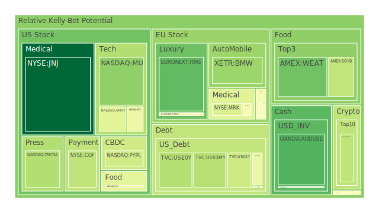
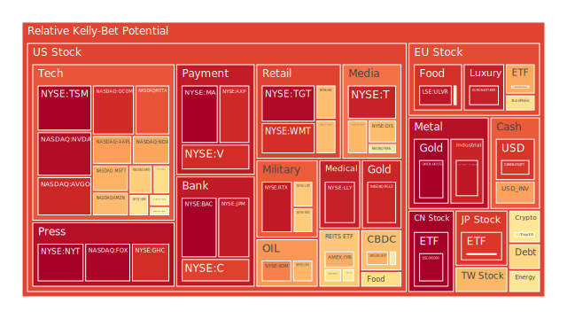
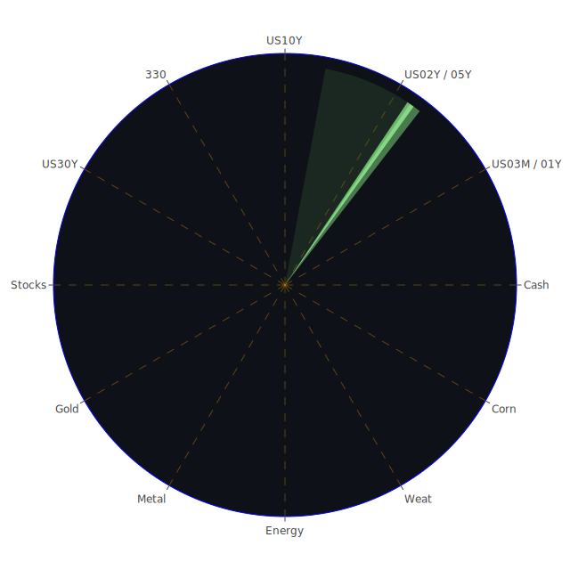

# **投資商品泡沫分析**

當前全球金融市場呈現高度複雜與分化的局面。在經濟數據、央行政策、地緣政治以及特定產業趨勢的多重影響下，各類資產的價格波動與潛在風險值得深入剖析。本報告旨在透過對各類投資商品的泡沫程度、宏觀與微觀經濟傳導路徑，以及資產類別間的相互作用進行分析，提供一個全面的市場觀察視角，並據此提出相應的投資建議與風險提示。觀察時間點為2025年5月19日，所有分析皆基於此時點可得的數據與新聞事件。

從資訊航母的**空間**維度觀察，全球市場的三位一體互動顯著。例如，美國的信用評級遭穆迪下調，此負面新聞不僅衝擊美國本土市場信心（心理學層面），亦透過全球資本流動的經濟學原理，影響其他主要經濟體的金融市場。各國投資者依據博弈論的思維，預期其他市場參與者的反應，進而調整自身策略，形成了跨市場的連鎖反應。

從**時間**維度看，歷史經驗的三位一體對當前市場判斷至關重要。過去的金融危機（如2008年）的發生與演變（歷史事件），塑造了當前監管框架與投資者對風險的認知（心理學）。當前的新聞事件（如聯準會官員鷹派言論）疊加歷史記憶，共同影響市場對未來經濟走向的預期（經濟學預測）。

從**概念**維度審視，抽象概念的三位一體在市場中扮演核心角色。「創新」與「顛覆」的概念，結合特定科技（如人工智慧）的新聞報導，推動了相關股票的估值（經濟學的成長預期），同時也引發了社會層面的討論（社會學影響）與投資者的追捧或疑慮（心理學的FOMO與恐懼）。

以下將針對各主要資產類別進行詳細論述。

* 美國國債  
  美國國債市場近期波動顯著。觀察數據顯示，各年期美國國債的殖利率均呈現上升趨勢。例如，美國1年期國債殖利率為4.13%，10年期為4.45%，30年期為4.90%。相較於一個月前，殖利率普遍上揚，反映市場對未來利率預期及通膨擔憂的調整。值得注意的是，10年期與3個月期國債殖利率利差（US Yield 10Y-03M）為0.09，雖為正值，但遠低於歷史正常水平，且去年同期為-1.29的深度倒掛，顯示市場對短期經濟前景的判斷仍存分歧。  
  新聞事件方面，穆迪於2025年5月17日發布報告，指出由於美國政府債務不斷上升，決定下調美國信用評級。此事件的市場影響評估為「負面，96%」，直接衝擊了市場對美國償債能力的信心，理論上會推高美國國債的風險溢價，導致價格下跌、殖利率上升。聯準會主席鮑爾關於未來幾年計劃裁員10%的新聞，以及聯準會總資產處於相對低位、持續縮表的背景，亦強化了緊縮預期。  
  從泡沫指數來看，美國1年期國債（US01Y）的月平均風險分數約為0.465，3個月期國債（US03MY）月平均風險分數約為0.298，10年期國債（US10Y）月平均風險分數約為0.438，30年期國債（US30Y）月平均風險分數約為0.473。這些數值尚處於中等水平，未顯示極端泡沫，但殖利率的快速上揚本身即是風險的體現。歷史上，政府債務急遽膨脹疊加信用評級下調，往往是市場動盪的前兆。  
  資訊航母的經濟學觀點認為，持續的財政赤字和高企的政府債務，將迫使財政部發行更多債券，若需求未能同步跟上，殖利率將面臨上行壓力。社會學角度看，公眾對政府財政紀律的信心下降，可能影響長期投資意願。心理學上，評級下調會放大投資者的避險情緒，短期內可能出現資金流出。博弈論視角下，市場參與者預期聯準會為抑制通膨將維持高利率，因此提前拋售長期債券以避免更大損失。既有理論如費雪效應指出名目利率等於實質利率加預期通膨率，當前的高通膨預期是推高名目殖利率的主因。理論之外，地緣政治風險的升高，有時反而會增加對美元資產（包括美債）的避險需求，形成複雜的價格拉鋸。  
* 美國零售股  
  美國零售股表現分化，但整體面臨消費者信心不足的挑戰。數據顯示，沃爾瑪（WMT）的月平均風險分數高達0.851，塔吉特（TGT）月平均風險分數為0.850，好市多（COST）月平均風險分數為0.525，家得寶（HD）月平均風險分數為0.679。這些高企的泡沫指數反映出其股價可能已大幅偏離基本面，尤其是在消費者信心疲弱的背景下。  
  新聞事件中，「消費者信心指數創下歷史次低」以及「消費者信心暴跌至接近歷史最低點」均被評為「負面，96%」及「負面，94%」的重大影響。這直接反映了消費者對未來經濟前景的悲觀預期，可能導致消費支出縮減，進而影響零售企業的營收與利潤。然而，也有分析師肯定沃爾瑪的報導（正面，93%），暗示部分具有防禦性或能夠提供性價比的零售商可能在逆境中表現更佳。  
  歷史上，經濟衰退預期升溫時，非必需消費品零售受創往往較重，而必需消費品零售則相對穩健。目前信用卡拖欠率處於相對低位，但沖銷率（Charge-off Rate on Credit Card）處於高位，顯示消費者還款壓力增大。  
  從資訊航母的經濟學角度，零售業績直接關聯居民可支配收入、就業狀況及信貸成本。高利率環境抑制消費信貸，並增加企業融資成本。社會學觀點則關注消費習慣的變遷，例如線上購物對實體店的衝擊，以及經濟壓力下消費者更傾向於折扣零售商。心理學上，持續的負面經濟新聞會降低消費意願，即使收入未減，預防性儲蓄的動機也會增強。博弈論中，零售商之間的價格戰與促銷策略，以及對供應鏈的掌控能力，成為競爭的關鍵。相對價格理論指出，當整體物價上漲時，提供相對廉價商品的企業市占率可能提升。理論之外，品牌忠誠度、供應鏈韌性以及對線上渠道的適應能力，也是影響零售股表現的重要差異化因素。  
* 美國科技股  
  美國科技股，特別是與人工智慧（AI）相關的領域，近期表現強勁，但也積聚了較高風險。以輝達（NVDA）為例，其當日泡沫分數高達0.97，月平均風險分數約0.62，顯示市場情緒極度亢奮，股價波動劇烈。其他大型科技股如Meta（META）月平均風險分數達0.90，微軟（MSFT）約0.63，亞馬遜（AMZN）約0.73，蘋果（AAPL）約0.60，谷歌（GOOG）約0.57。納斯達克100指數（NDX）的月平均風險分數也達到0.756。  
  正面新聞包括「輝達股價單週上漲16%，貿易消息提振AI晶片製造商」（正面，94%），「輝達計劃在上海設研發中心擴大在華業務」（正面，84%），以及「CoreWeave在輝達披露更大持股後股價創紀錄」（正面，83%）。這些消息強化了市場對AI產業前景的樂觀預期。然而，「聯準會主席鮑爾計劃未來幾年裁員10%」及美國信用評級遭下調等宏觀負面消息，亦對整體市場構成壓力。  
  歷史上，科技股泡沫並不罕見，例如2000年的互聯網泡沫。當時同樣是革命性的技術概念引發市場狂熱，但最終許多公司因缺乏堅實的盈利模式而崩潰。當前AI的發展無疑具有巨大潛力，但部分公司的估值是否已過度透支未來，值得警惕。  
  資訊航母的經濟學視角強調技術創新帶來的生產力提升和潛在市場規模。社會學關注AI技術對就業結構、倫理道德的深遠影響。心理學層面，FOMO（害怕錯過）情緒在科技股投資中尤為明顯，容易形成羊群效應。博弈論中，科技巨頭間的平台競爭、標準制定以及人才爭奪異常激烈。既有理論如成長股估值模型高度依賴對未來現金流的預期，而這些預期在快速變化的科技行業中不確定性極高。理論之外，全球供應鏈的穩定性（尤其在半導體領域）、各國政府的監管政策（反壟斷、數據安全）以及技術突破的實際進程，都將對科技股產生重大影響。  
* 美國房地產指數  
  美國房地產市場持續承壓。房地產指數如AMEX:VNQ的月平均風險分數約為0.41，AMEX:IYR約0.79，AMEX:RWO約0.47。其中IYR的泡沫程度相對較高。聯準會數據顯示，商業房地產拖欠率（Commercial Real Estate Delinquent）處於相對高位，30年期固定抵押貸款利率（Fixed Morgage 30Y Rate）高達6.81%，遠高於去年的2.95%。  
  新聞事件中雖未直接提及房地產指數，但「消費者信心疲弱」、「穆迪下調美國信用評級」等宏觀因素，均不利於房地產市場。高昂的借貸成本直接抑制了購房需求，並增加了房地產開發商和持有者的財務壓力。  
  歷史上，利率急劇上升往往導致房地產市場降溫甚至衰退。例如2006-2008年美國次貸危機前夕，利率上升刺破了房地產泡沫。當前，居家辦公趨勢對商業辦公樓需求的結構性影響，以及高利率對住宅可負擔性的衝擊，都是市場面臨的挑戰。  
  從資訊航母的經濟學角度，房地產是利率敏感性行業，同時也受就業市場、家庭收入及建築成本影響。社會學層面，住房是重要的民生問題，房價過高可能引發社會矛盾；人口結構變化（如老齡化、少子化）也影響長期住房需求。心理學上，對房價持續上漲的預期一旦逆轉，可能觸發恐慌性拋售。博弈論觀點下，開發商、銀行、購房者和監管機構之間的互動決定了市場的穩定性。既有理論如庫存週期、供需關係對房地產價格有解釋力。理論之外，城市規劃政策、區域經濟發展差異、以及氣候變遷對特定地區房產價值的影響，也日益受到重視。  
* 加密貨幣  
  加密貨幣市場呈現波動性，其泡沫程度處於中等偏高水平。比特幣（BTCUSD）的月平均風險分數約為0.48，以太坊（ETHUSD）月平均風險分數約0.50，狗狗幣（DOGEUSD）月平均風險分數約0.48。  
  新聞方面，「Coinbase獲納入標普500指數」（正面，66%）為市場帶來些許積極情緒，儘管其同時面臨駭客攻擊和調查風險。這反映了主流金融市場對加密資產的逐步接納，但也突顯了其固有的風險。  
  歷史上，加密貨幣經歷了多次劇烈的牛熊轉換，其價格受到宏觀流動性、市場情緒、監管政策以及技術進展等多重因素影響。  
  資訊航母的經濟學視角將加密貨幣視為一種新型態的投機性資產，部分具有支付或價值儲存的潛力，但缺乏內在價值支撐。社會學層面，加密貨幣的興起反映了部分人群對傳統金融體系的不信任，以及對去中心化理念的追求。心理學上，暴富神話吸引了大量投機者，市場情緒極易受到消息面影響而劇烈波動。博弈論中，早期採用者的優勢、礦工的算力競爭以及交易所的市場操縱風險均是重要考量。既有理論難以完全解釋加密貨幣的價格行為，其更像是技術採用週期理論與資產泡沫理論的結合體。理論之外，「社群共識」的力量、關鍵意見領袖的影響力以及不可預測的監管突襲，都是加密貨幣市場獨有的特徵。  
* 金/銀/銅  
  貴金屬和工業金屬表現各異。黃金（XAUUSD）價格近期大幅上揚，2025年5月19日的當日泡沫分數甚至高達0.997，月平均風險分數約0.53，顯示短期內市場高度關注，價格波動劇烈。白銀（XAGUSD）的月平均風險分數亦高達0.87。銅（FX:COPPER）的月平均風險分數約為0.61。黃金石油比（GOLD OIL RATIO）為52.14，高於上月及去年同期，顯示黃金相對石油強勢。黃金銅比（GOLD COPPER RATIO）為704.34，亦處於相對高位。  
  新聞中雖無直接針對貴金屬的重大消息，但「穆迪下調美國信用評級」、「消費者信心疲弱」以及「華爾街看空美元，貿易不安情緒持續」等事件，均可能提升黃金的避險吸引力。  
  歷史上，黃金在經濟不確定性高、通膨預期上揚或地緣政治緊張時，往往表現良好。白銀兼具貴金屬和工業金屬屬性。銅作為重要的工業原料，其價格與全球經濟景氣度密切相關。  
  資訊航母的經濟學視角認為，黃金是傳統的避險資產和通膨對沖工具，其價格受實質利率、美元匯率、全球風險偏好等因素影響。銅價則反映工業生產活動的榮枯。社會學角度看，黃金在許多文化中具有特殊的價值儲存地位。心理學上，恐慌情緒蔓延時，資金傾向流入黃金。博弈論中，央行儲備黃金的行為、大型基金的配置策略均影響金價。既有理論如購買力平價說、避險天堂理論可用於分析黃金。銅的價格則與供需基本面、庫存水平、主要經濟體製造業PMI等指標緊密相連。理論之外，地緣衝突對供應鏈的擾動、綠色能源轉型（如電動車、太陽能板對銅的大量需求）等新興因素，正重塑這些金屬的市場格局。金礦防禦股（RGLD）的月平均風險分數高達0.92，亦反映了市場對黃金相關資產的追捧。  
* 黃豆 / 小麥 / 玉米  
  農產品市場的泡沫程度不一。黃豆（SOYB）的月平均風險分數約為0.65，相對較高。小麥（WEAT）月平均風險分數約0.41，玉米（CORN）月平均風險分數約0.45，均處於中等水平。  
  新聞事件中，雖然沒有直接關於這些農產品的具體報導，但全球貿易緊張局勢（如APEC警告關稅阻礙貿易）以及潛在的供應鏈中斷（如烏克蘭局勢的持續影響），都可能對農產品價格產生影響。  
  歷史上，極端天氣事件、地緣政治衝突、貿易政策以及能源價格（影響農業生產成本和運輸成本）是影響農產品價格的主要因素。  
  資訊航母的經濟學視角關注全球供需平衡、庫存水平、種植面積及氣候條件。社會學角度則涉及糧食安全、農民收入以及發展中國家的民生問題。心理學上，對未來糧食短缺的恐懼可能引發囤積行為和價格上漲預期。博弈論中，主要出口國的貿易政策、大型糧商的市場操作均對價格有顯著影響。既有理論如蛛網理論可解釋農產品價格的週期性波動。理論之外，生物燃料的發展對玉米等作物的需求結構產生了改變，而氣候變遷帶來的常態化極端天氣，也增加了農產品市場的不可預測性。  
* 石油/ 鈾期貨UX\!  
  能源市場方面，石油（USOIL）價格近期有所回升，當日泡沫指數為0.58，月平均風險分數約為0.23，整體泡沫程度不高，但短期波動加劇。鈾期貨（UX1\!）月平均風險分數約為0.49，處於中等水平。  
  新聞中沒有直接提及石油或鈾的重大供需變化，但地緣政治緊張局勢，如以色列在加薩醫院的行動、俄羅斯西伯利亞的嚴重野火等，都可能間接影響市場對能源供應穩定性的擔憂。石油防禦股如XOM（月平均風險分數0.79）和OXY（月平均風險分數0.75）的泡沫指數相對較高，顯示資金在尋求能源相關的避險或通膨對沖標的。  
  歷史上，石油價格易受OPEC產量政策、全球經濟增長、地緣政治衝突以及美元匯率的影響。鈾作為核燃料，其需求與核電發展前景密切相關。  
  資訊航母的經濟學角度分析石油市場的供給彈性、需求前景（受經濟增長和能源轉型影響）及投機資本的流動。鈾市場則與各國能源政策、核電技術安全性及公眾接受度有關。社會學層面，能源價格波動直接影響民生及通膨水平，能源轉型亦帶來社會結構的調整。心理學上，對能源短缺的恐懼會推高價格預期。博弈論中，產油國之間的合作與競爭（如OPEC+的決策）是影響油價的核心因素。既有理論如霍特林模型（Hotelling's rule）試圖解釋可耗竭資源的定價。理論之外，ESG投資趨勢對化石能源企業的融資約束，以及新能源技術的突破速度，正深刻改變能源市場的長期格局。  
* 各國外匯市場  
  外匯市場波動加劇，美元指數面臨壓力。歐元兌美元（EURUSD）的月平均風險分數高達0.84至0.93之間，顯示市場對歐元區的某些預期可能過於樂觀或波動性極大。美元兌日圓（USDJPY）月平均風險分數約0.66至0.68，日圓持續弱勢。澳幣兌美元（AUDUSD）月平均風險分數約0.37，英鎊兌美元（GBPUSD）月平均風險分數約0.45。  
  新聞事件中，「華爾街看空美元，貿易不安情緒持續」（負面，95%）以及「穆迪下調美國信用評級」等，均對美元構成利空。美國聯準會官員的鷹派講話，雖然短期內可能支撐美元，但若市場擔憂其政策可能導致經濟硬著陸，反而會削弱美元。  
  歷史上，主要貨幣匯率受各國利率政策差異、經濟增長前景、國際收支狀況及避險情緒等多重因素影響。  
  資訊航母的經濟學視角關注利率平價理論、購買力平價理論以及國際收支平衡對匯率的影響。社會學角度分析，一國貨幣的強弱也關乎其國際地位和國民信心。心理學上，市場對某國央行政策的信任度、對經濟前景的集體預期，會放大匯率波動。博弈論中，各國央行之間的政策協調或競爭（如貨幣戰）是重要考量。既有理論之外，地緣政治衝突引發的資本流動方向、全球供應鏈重組對貿易格局的影響，以及數位貨幣的興起對傳統外匯體系的潛在衝擊，都是值得關注的新變量。  
* 各國大盤指數  
  全球主要股市表現不一。美國納斯達克100指數（NDX）月平均風險分數0.756，日本日經225指數（JPN225）月平均風險分數0.751，均處於高位。英國富時100指數（FTSE）月平均風險分數約0.54，德國DAX指數（GDAXI）約0.54，法國CAC40指數（FCHI）約0.57，台灣加權股價指數（0050）約0.64，中國滬深300指數（000300）約0.58。整體而言，發達市場指數泡沫程度高於部分新興市場。  
  新聞中，美國信用評級遭下調、消費者信心低迷等負面消息對全球股市構成壓力。然而，特定板塊如AI的強勁表現，也為部分市場提供了支撐。APEC警告關稅阻礙貿易，暗示全球經濟面臨的共同挑戰。  
  歷史上，全球股市聯動性較高，但各國經濟週期、產業結構及政策差異會導致表現分化。  
  資訊航母的經濟學觀點認為，股市是經濟的晴雨表，反映了對未來企業盈利和宏觀經濟的預期。社會學角度看，股市的財富效應影響社會消費和投資信心。心理學上，市場情緒的傳染性極強，羊群效應和恐慌拋售時常發生。博弈論中，大型機構投資者的資金流向和策略對市場有引導作用。既有理論如效率市場假說、資本資產定價模型（CAPM）是分析股市的基礎。理論之外，全球化與逆全球化的趨勢、地緣政治格局的演變、以及各國產業政策的導向，都對不同國家股市的相對表現產生深遠影響。  
* 美國半導體股  
  半導體行業因AI浪潮而備受矚目，但泡沫風險亦不容忽視。台積電（TSM）的月平均風險分數高達0.98，顯示極高的市場熱度。高通（QCOM）月平均風險分數0.81，博通（AVGO）月平均風險分數0.81，科磊（KLAC）約0.52，美光（MU）約0.35，應用材料（AMAT）約0.70，英特爾（INTC）約0.49。整體呈現分化，龍頭企業和直接受益於AI的企業泡沫程度較高。  
  新聞中「輝達股價單週上漲16%」及「英特爾新晶片製造技術是其復甦的最大希望也是最大風險」（正面，80%）等消息，持續推升行業景氣預期。然而，半導體行業具有高度週期性，且易受地緣政治（如美中科技競爭）、供應鏈瓶頸及下游需求波動的影響。  
  歷史上，半導體行業經歷過多次景氣循環，技術換代迅速，投資風險與回報均較高。  
  資訊航母的經濟學視角關注供需關係、產能利用率、資本支出週期及技術創新速度。社會學層面，半導體是數位經濟的基石，其發展水平關乎國家科技競爭力。心理學上，對新技術的過度樂觀預期容易催生泡沫。博弈論中，晶圓代工廠的定價權、IC設計公司與設備製造商之間的合作與競爭格局複雜。既有理論如摩爾定律（雖已放緩但精神猶存）描述了行業的技術進步路徑。理論之外，各國政府對半導體產業的補貼和扶持政策、出口管制措施以及供應鏈的區域化趨勢，正深刻影響全球半導體產業的版圖。  
* 美國銀行股  
  美國銀行股的泡沫指數普遍偏高。美國銀行（BAC）月平均風險分數高達0.96，花旗集團（C）約0.87，摩根大通（JPM）約0.73。第一資本金融公司（COF）月平均風險分數約0.49，相對較低。  
  新聞方面，「第一資本金融將支付4.25億美元就儲蓄帳戶相關訴訟達成和解」（負面，51%）對個別銀行構成壓力。更宏觀的層面，聯準會數據顯示信用卡沖銷率處於高位，商業房地產拖欠率高企，這些都可能侵蝕銀行資產品質。然而，淨息差可能在高利率環境初期擴大，但若經濟大幅放緩或衰退，信用損失的增加將抵銷息差擴大的利好。  
  歷史上，銀行業是順週期行業，在經濟擴張期利潤增長，在經濟萎縮期則面臨壞帳風險。金融監管的鬆緊週期也對銀行業績有重大影響。  
  資訊航母的經濟學觀點分析銀行的淨利差、非利息收入、資產品質（壞帳率、撥備覆蓋率）以及資本充足率。社會學層面，銀行在金融體系中扮演關鍵角色，其穩定性關乎整體經濟。心理學上，對經濟前景的悲觀預期會導致儲戶擠兌風險（儘管有存款保險）和銀行惜貸。博弈論中，銀行間的同業競爭、對優質客戶的爭奪以及與監管機構的互動至關重要。既有理論如信貸週期理論、系統性風險理論是分析銀行業的基礎。理論之外，金融科技（FinTech）的挑戰、數位貨幣的發展、以及氣候變遷相關的融資風險（如對高碳行業的貸款），都是銀行業面臨的新課題。  
* 美國軍工股  
  美國軍工股因地緣政治緊張而受到關注。洛克希德馬丁（LMT）月平均風險分數約0.77，諾斯洛普格魯曼（NOC）約0.70，雷神技術（RTX）約0.80。這些數值處於中高水平，反映市場對國防支出的預期。  
  新聞事件中，「國防與太空科技公司Voyager在美國IPO申請文件中披露年度營收增長」（正面，94%）以及「魯比歐稱北約成員國將在6月峰會前同意未來十年國防開支佔GDP 5%」（正面，84%），均為軍工行業帶來利好。持續的地區衝突和主要大國間的戰略競爭，為國防預算提供了支撐。  
  歷史上，戰爭和地緣政治緊張時期，軍工股往往有超額收益。  
  資訊航母的經濟學視角關注政府國防預算、武器訂單、技術研發能力及出口市場。社會學層面，軍工產業的發展與國家安全觀念、國際關係格局緊密相連。心理學上，對安全威脅的感知程度影響公眾對國防開支的支持度。博弈論中，國家間的軍備競賽、軍火採購的國際談判等均是重要因素。既有理論如公共選擇理論可分析國防預算的決定過程。理論之外，新興軍事技術（如AI、無人系統、高超音速武器）的發展方向，以及國際武器擴散條約的約束力，都將影響軍工企業的長期前景。  
* 美國電子支付股  
  電子支付行業股票泡沫程度普遍較高。萬事達卡（MA）月平均風險分數0.80，Visa（V）約0.74，美國運通（AXP）約0.81，PayPal（PYPL）約0.87。Global Payments（GPN）月平均風險分數約0.46，相對較低。  
  這些公司受益於消費從現金轉向電子的長期趨勢，但同時也面臨日益激烈的競爭和監管壓力。新聞中雖無直接針對這些公司的重大消息，但消費者信心的低迷和潛在的消費支出放緩，可能對其交易量增長構成挑戰。  
  歷史上，電子支付行業的增長與宏觀經濟、消費者支出以及技術創新（如移動支付、跨境支付）密切相關。  
  資訊航母的經濟學視角分析交易手續費率、交易量、活躍用戶數、市場滲透率及競爭格局。社會學層面，支付方式的變革影響消費行為和普惠金融。心理學上，便利性和安全性是用戶選擇支付方式的重要考量。博弈論中，支付網絡的規模效應、與商戶和銀行的合作關係、以及對新興支付技術的佈局是競爭關鍵。既有理論如網絡外部性理論可以解釋支付平台的成功要素。理論之外，央行數位貨幣（CBDC）的發展、跨境支付領域的創新（如區塊鏈支付）、以及數據隱私和反壟斷監管的加強，都是該行業未來發展的重要變數。  
* 美國藥商股  
  美國大型藥商股表現分化。禮來（LLY）因其減肥藥等產品的市場預期，月平均風險分數高達0.93。諾和諾德（NVO）月平均風險分數約0.58，默克（MRK）約0.47，嬌生（JNJ）則僅約0.22，泡沫程度最低。  
  新聞事件中，「諾和諾德CEO意外離職，市場挑戰令這家減肥藥製造商承壓」（負面，92%），顯示即使是熱門領域也面臨挑戰。藥品研發的高投入、高風險、長週期特性，以及專利懸崖、藥品定價政策等因素，都影響藥商股的表現。  
  歷史上，藥商股常被視為防禦性板塊，受經濟週期影響較小，但個別公司的股價對其新藥研發成果和專利保護狀況高度敏感。  
  資訊航母的經濟學視角關注研發管線、藥品專利期、市場規模、藥品定價及醫保報銷政策。社會學層面，藥品可及性、公共衛生體系以及人口老齡化趨勢是重要背景。心理學上，對健康和長壽的追求是藥品需求的根本動力。博弈論中，藥廠間的專利競爭、與監管機構的審批博弈、以及與保險公司的價格談判均十分重要。既有理論如產品生命週期理論適用於藥品。理論之外，基因療法、細胞療法等新興生物技術的突破，以及AI在藥物研發中的應用，正為行業帶來革命性變化。  
* 美國影視股  
  美國影視娛樂行業面臨轉型陣痛。迪士尼（DIS）月平均風險分數約0.70，奈飛（NFLX）約0.49，派拉蒙全球（PARA）約0.49，康卡斯特（CMCSA）約0.47。  
  這些公司普遍受到流媒體競爭加劇、內容成本上升、廣告市場疲軟以及傳統有線電視訂戶流失的影響。新聞中雖無直接針對這些公司的重大事件，但消費者信心不足可能影響其在娛樂上的支出。  
  歷史上，影視行業的成功依賴於爆款內容的創造能力和有效的發行渠道。技術變革（如從影院到電視，再到流媒體）不斷重塑行業格局。  
  資訊航母的經濟學視角分析訂戶增長、每用戶平均收入（ARPU）、內容製作與採購成本、廣告收入及版權價值。社會學層面，影視內容是文化傳播的重要載體，也反映社會思潮和價值觀。心理學上，觀眾對內容的偏好、明星效應以及社群討論度影響作品的成功。博弈論中，流媒體平台間的用戶爭奪戰、與內容創作者的合作與分成模式、以及對體育賽事等獨家內容的競爭是關鍵。既有理論如注意力經濟學可解釋部分現象。理論之外，AI在內容創作（劇本、特效）中的應用、元宇宙等新興娛樂形態的探索，以及全球市場的文化差異和准入壁壘，都是行業面臨的新挑戰與機遇。  
* 美國媒體股  
  美國傳統媒體與新媒體均面臨挑戰。福斯公司（FOX）月平均風險分數高達0.88，紐約時報（NYT）約0.73。這些傳統媒體在努力向數位化轉型的同時，也面臨廣告收入下滑和公信力挑戰。  
  新聞事件中雖無直接針對這些公司的消息，但整體信息環境的複雜化、假新聞的泛濫以及社交媒體對傳統新聞渠道的衝擊，是行業共同面對的困境。  
  歷史上，媒體是重要的社會公器，但也受到政治和商業利益的影響。技術進步不斷改變新聞的生產和傳播方式。  
  資訊航母的經濟學視角分析廣告收入、訂閱收入、用戶流量、內容成本及數位化轉型進度。社會學層面，媒體的議程設置功能、對公共輿論的影響以及在民主社會中的角色至關重要。心理學上，受眾的閱讀習慣、信息過載以及對特定媒體的信任度影響其消費行為。博弈論中，媒體間對獨家新聞和影響力人物的爭奪、與社交媒體平台的競合關係是重要方面。既有理論如守門人理論、涵化理論有助於理解媒體影響。理論之外，AI在新聞寫作和個性化推薦中的應用、對抗虛假信息的技術和策略、以及在日益分化的社會中如何重建公信力，是媒體行業亟待解決的問題。  
* 歐洲奢侈品股  
  歐洲奢侈品股票泡沫程度較高。愛馬仕（RMS）月平均風險分數約0.64，LVMH集團（MC）約0.47，開雲集團（KER）高達0.75。  
  這些公司業績高度依賴全球宏觀經濟，特別是富裕階層的消費能力和信心。中國市場的表現對其影響尤為顯著。新聞中雖無直接針對這些公司的消息，但全球貿易的緊張局勢和部分地區經濟增長放緩，可能對奢侈品消費構成壓力。  
  歷史上，奢侈品行業具有一定的抗週期性，但在嚴重經濟衰退時仍會受到衝擊。品牌價值和稀缺性是其核心競爭力。  
  資訊航母的經濟學視角分析品牌溢價、目標客戶群的財富狀況、新興市場的增長潛力以及匯率波動的影響。社會學層面，奢侈品消費與社會地位、身份認同和文化品味相關。心理學上，購買奢侈品滿足了消費者的情感需求和自我獎勵心理。博弈論中，奢侈品牌之間的定位差異化、對稀缺原材料的控制以及對銷售渠道的精細管理是競爭關鍵。既有理論如凡勃倫效應（Veblen good）解釋了部分奢侈品的價格行為。理論之外，年輕一代消費者的價值觀轉變（如對可持續性和道德採購的重視）、二手奢侈品市場的興起以及數位化行銷和電商渠道的拓展，是行業發展的新趨勢。  
* 歐洲汽車股  
  歐洲汽車股泡沫程度處於中等水平。寶馬（BMW）月平均風險分數約0.57，賓士（MBG）約0.50，保時捷（PAH3）約0.58。  
  傳統汽車製造商正處於向電動化、智能化轉型的關鍵時期，面臨來自新興電動車企業的激烈競爭，同時也需應對供應鏈重組、能源價格波動以及各國環保政策的挑戰。新聞中，德國部長稱自新政府加強邊境檢查以來，邊境驅逐人數增加了45%，這類社會政治穩定性的消息間接影響投資環境。  
  歷史上，汽車行業是典型的週期性行業，且資本密集，技術更新快。  
  資訊航母的經濟學視角分析汽車銷量、產能利用率、研發投入、供應鏈管理、以及在新能源汽車市場的競爭力。社會學層面，汽車不僅是交通工具，也關乎城市規劃、環境保護和生活方式。心理學上，品牌形象、駕駛體驗和技術創新影響消費者購買決策。博弈論中，傳統車企與科技公司在自動駕駛、車聯網等領域的合縱連橫，以及各國政府對新能源汽車的補貼政策和貿易壁壘，都是重要因素。既有理論如規模經濟理論、學習曲線效應適用於汽車製造。理論之外，共享出行模式的發展、自動駕駛技術的成熟度及倫理法規的制定、以及全球電池供應鏈的安全性，都將深刻影響汽車行業的未來。  
* 歐美食品股  
  歐美大型食品飲料公司股票的泡沫程度不一。聯合利華（ULVR）月平均風險分數高達0.95，卡夫亨氏（KHC）約0.75，雀巢（NESN）約0.55，可口可樂（KO）約0.68。這些公司通常被視為防禦性股票，但在高通膨環境下，其成本轉嫁能力和消費者購買力受到考驗。  
  新聞中雖無直接針對這些公司的重大消息，但消費者信心低迷和原材料、運輸成本的波動是行業普遍面臨的挑戰。  
  歷史上，食品飲料行業因其需求的相對剛性，在經濟下行期表現通常較為穩健。品牌忠誠度、分銷網絡和成本控制是其競爭優勢。  
  資訊航母的經濟學視角分析銷售額增長、毛利率、市場份額、品牌價值以及對沖大宗商品價格波動的能力。社會學層面，食品安全、健康飲食趨勢以及企業社會責任受到日益關注。心理學上，消費者的口味偏好、品牌信任和便利性需求影響購買行為。博弈論中，食品公司與大型零售商之間的議價能力、廣告行銷的有效性以及在新興市場的擴張策略是競爭焦點。既有理論如品牌資產理論、渠道管理理論有助於分析。理論之外，植物基食品、功能性食品等創新產品的市場接受度，以及供應鏈的可持續性和透明度要求，正成為食品行業發展的新動力和新約束。

# **宏觀經濟傳導路徑分析**

當前宏觀經濟環境的核心特徵是通膨壓力猶存、利率高企、政府債務高築以及消費者信心疲弱。聯準會（FED）數據顯示，多項預警指標亮起：信用卡沖銷率高、商業房地產拖欠率高、消費者拖欠率高。儘管整體信用卡拖欠率尚處低位，但壓力已現。聯準會總資產處於相對低位，顯示縮表仍在進行。EFFR（聯邦基金有效利率）成交量上升趨緩或反轉，SOFR（有擔保隔夜融資利率）成交量上升趨緩或反轉，暗示市場流動性可能在邊際上收緊。聯準會官員近期一次鷹派講話，進一步強化了緊縮預期。

傳導路徑一：高通膨 \-\> 央行緊縮 \-\> 經濟降溫 \-\> 資產價格重估  
持續的通膨壓力（CPI年增率2.33%，雖較去年3.33%回落，但仍高於目標）迫使聯準會維持鷹派立場，透過提高政策利率（OIS FED Fund Rate 4.33%，FRA SOFR 4.31%）和縮減資產負債表來抑制總需求。這導致市場利率全面上行（各期限美債殖利率、抵押貸款利率均處高位），增加了企業和個人的借貸成本，抑制了投資和消費。例如，高昂的抵押貸款利率（6.81%）直接衝擊房地產市場。最終，經濟活動降溫，企業盈利預期下修，風險資產（如股票，特別是高估值的成長股）面臨重估壓力。  
傳導路徑二：政府高債務 \-\> 信用評級下調 \-\> 主權風險溢價上升 \-\> 融資成本增加與市場波動  
美國政府債務佔GDP比重處於高位，穆迪因此下調美國信用評級。這一事件直接提升了美國主權債務的風險溢價，推高了美國國債殖利率。這不僅增加了政府自身的融資成本，也透過無風險利率的基準作用，抬高了整個經濟體的融資成本。同時，評級下調打擊了市場信心，可能引發資本外流或轉向更安全的資產，加劇金融市場波動。新聞中「華爾街看空美元」也與此相關。  
傳導路徑三：消費者信心疲弱 \-\> 消費支出減少 \-\> 企業營收下降 \-\> 經濟增長放緩  
消費者信心指數接近歷史低點，反映了公眾對未來經濟前景的擔憂。這將導致預防性儲蓄增加，消費支出（尤其是非必需品）減少。零售股（如WMT、TGT）雖然部分依靠必需品消費，但高泡沫指數已反映市場對其過高預期，一旦消費全面轉弱，將面臨較大回調壓力。企業營收和利潤下降，進而拖累整體經濟增長。  
傳導路徑四：地緣政治緊張/貿易摩擦 \-\> 供應鏈擾動 \-\> 成本推動型通膨/避險情緒升溫  
新聞中提及APEC警告關稅阻礙貿易，以及多地地緣政治衝突（如以色列在加薩的行動）。這些因素可能導致全球供應鏈受阻，關鍵原材料和商品價格上漲，加劇成本推動型通膨壓力，迫使央行維持緊縮。另一方面，地緣政治風險也會推升市場避險情緒，資金可能流向黃金（XAUUSD泡沫指數短期飆升）、美元（儘管面臨自身問題，但仍具避險屬性）或特定防禦性板塊（如軍工股LMT、NOC、RTX）。

# **微觀經濟傳導路徑分析**

微觀層面，企業和行業的動態也呈現出複雜的傳導路徑。

傳導路徑一：AI技術突破 \-\> 產業鏈重構與資本追捧 \-\> 特定板塊泡沫化與分化  
以輝達（NVDA）為代表的AI晶片製造商，因其在AI浪潮中的核心地位，股價大幅上漲，泡沫指數高企。這股熱潮向上游傳導至半導體設備（如AMAT、KLAC）、材料供應商，向下游傳導至雲端運算（如MSFT Azure、AMZN AWS）、AI軟體應用開發商以及需要大量算力的行業。資本大量湧入AI相關領域，推高了這些公司的估值。然而，缺乏實質性AI應用落地或盈利模式尚不清晰的公司，則可能面臨被市場拋棄的風險，導致科技板塊內部嚴重分化。英特爾（INTC）試圖透過新技術追趕，但其風險與機遇並存。  
傳導路徑二：特定藥品（如減肥藥）市場爆發 \-\> 相關藥企業績預期高漲 \-\> 股價脫離傳統估值框架 \-\> 行業競爭加劇與政策風險  
禮來（LLY）和諾和諾德（NVO）因其在減肥藥和糖尿病治療領域的突破性產品，股價表現強勁，泡沫指數（尤其是LLY）處於極高水平。市場對這些藥品的潛在銷售額給予了極高預期。然而，諾和諾德CEO的變動及其提及的「市場挑戰」暗示了高增長背後並非一帆風順，包括產能限制、競爭對手（如安進等）的加入、醫保支付壓力以及潛在的副作用和長期安全性問題，都可能成為股價回調的催化劑。  
傳導路徑三：供應鏈本土化/多元化趨勢 \-\> 相關製造業投資增加 \-\> 成本結構變化  
地緣政治和貿易摩擦促使各國重視供應鏈安全，推動關鍵產業（如半導體、新能源）的本土化或多元化佈局。這可能導致短期內資本支出增加，但也可能因規模效應減弱或效率降低而推高生產成本。例如，台積電（TSM）在全球多地設廠，既是應對地緣政治風險，也面臨管理和成本控制的新挑戰。  
傳導路徑四：消費者行為轉變 \-\> 行業內部優勝劣汰  
在經濟壓力下，消費者可能更注重性價比，導致折扣零售商（如沃爾瑪）相對受益，而中高端或非必需品消費則可能承壓。線上消費趨勢持續，對實體零售和支付方式（如PYPL、V、MA）提出更高要求。流媒體領域，內容為王但成本高昂，用戶對價格敏感，導致競爭白熱化，盈利壓力增大（如DIS、NFLX、PARA）。

# **資產類別間傳導路徑分析**

資產類別之間的價格聯動和風險傳導，是理解當前市場的關鍵。

路徑一：美債殖利率上升 \-\> 權益資產估值壓力 與 資金流向轉換  
美國國債殖利率被視為全球資產定價之錨。當其上升時，權益資產（尤其是成長型股票，如科技股）的折現率提高，導致其理論估值下降。資金可能從高風險的權益市場流出，轉向提供相對確定收益的債券市場或貨幣市場基金（數據顯示貨幣市場基金總資產正在上升）。然而，若殖利率上升過快，引發對經濟衰退的擔憂，則可能出現股債雙殺的局面。黃金（XAUUSD）作為無息資產，理論上在高利率環境下吸引力下降，但若殖利率上升伴隨避險情緒升溫或對美元信心的動搖，金價反而可能上漲，近期黃金的強勢表現（日泡沫分數0.997）與美元相對弱勢（新聞提及華爾街看空美元）及美債評級下調事件時間點吻合，反映了這種複雜互動。  
路徑二：美元指數波動 \-\> 大宗商品價格 與 新興市場資產影響  
美元是國際大宗商品的主要計價貨幣。美元強勢通常會壓低大宗商品價格（如石油USOIL、銅COPPER），反之亦然。當前美元因美國信用評級下調等因素承壓，可能為大宗商品價格提供支撐。對於新興市場而言，美元走弱有助於緩解其償債壓力並吸引資本流入，利好其股市和債市。反之，美元強勢則構成壓力。美元兌日圓（USDJPY）居高不下，反映美日利差及日本央行政策預期。  
路徑三：油價波動 \-\> 通膨預期 \-\> 央行政策 \-\> 整體市場風險偏好  
石油價格（USOIL）是影響通膨預期的重要因素。油價上漲會推高通膨，迫使央行採取或維持緊縮政策，進而打壓整體市場風險偏好。油價下跌則有助於緩解通膨壓力，給予央行更大的政策空間。當前油價處於相對平穩但略有回升的態勢，其未來走向對市場至關重要。  
路徑四：科技股情緒外溢 \-\> 加密貨幣市場 與 其他風險資產  
以科技股為代表的風險偏好情緒，往往會外溢到其他高風險資產類別，如加密貨幣（BTCUSD、ETHUSD）。當科技股強勢上漲時，市場風險偏好提升，加密貨幣等資產也傾向於跟隨上漲。反之，若科技股大幅回調，則可能引發對加密貨幣等資產的拋售潮。Coinbase被納入標普500指數，可視為傳統金融與加密資產聯動性增強的一個信號。  
路徑五：房地產市場困境 \-\> 金融體系穩定性 \-\> 信貸市場  
美國商業房地產拖欠率高企，對持有相關資產的銀行構成潛在風險。若房地產市場進一步惡化，可能引發區域性銀行危機，衝擊金融系統穩定性，導致信貸緊縮，進而影響實體經濟。銀行股（如BAC、C、JPM）的高泡沫指數可能部分反映了市場對其在高利率環境下淨息差擴大的預期，但忽略了潛在的信用風險。

# **投資建議**

鑑於當前市場環境的複雜性——通膨壓力、高利率、地緣政治風險、特定行業的過熱以及消費者信心的脆弱——投資者應採取更為謹慎和多元化的配置策略。以下配置建議基於穩健、成長與高風險三個類別，每個類別選擇三個子投資項目，總比例為100%。

**一、穩健型配置 (總佔比 50%)**

此部分旨在保本、對沖風險並尋求穩定現金流。

1. **短期美國國債 (例如 US01Y 或類似ETF) (20%)**:  
   * **理由**: 在利率高企且前景不明朗的環境下，短期國債提供相對較高的票息收入，且久期短，利率風險較低。當前1年期美債殖利率約4.13%，具有吸引力。其月平均風險分數約0.465，處於中等水平，波動性相對可控。適合存放短期流動性並獲取穩定收益。  
2. **黃金 (XAUUSD 或黃金ETF) (15%)**:  
   * **理由**: 黃金是傳統的避險資產，在美國信用評級下調、地緣政治緊張以及市場對美元長期信心動搖的背景下，其戰略價值凸顯。近期黃金價格強勢，日泡沫指數雖高，但月平均風險分數約0.53尚可接受，可作為對沖信用風險和通膨的工具。  
3. **嬌生 (JNJ) (15%)**:  
   * **理由**: 嬌生作為大型製藥和消費品公司，業務多元化，具有較強的防禦性。其當前泡沫指數在所有提供數據的股票中最低（月平均風險分數約0.22），顯示市場對其估值相對理性。在經濟下行風險增加時，此類股票往往表現更具韌性。

**二、成長型配置 (總佔比 30%)**

此部分旨在捕捉特定行業的長期增長機會，但需注意估值風險。

1. **微軟 (MSFT) (10%)**:  
   * **理由**: 微軟在雲端計算 (Azure) 和人工智慧領域佈局領先，擁有強大的企業客戶基礎和持續的創新能力。其月平均風險分數約0.63，雖高於市場平均，但在大型科技股中相對穩健，具有長期增長潛力。  
2. **谷歌 (GOOG) (10%)**:  
   * **理由**: 谷歌在搜尋引擎、數位廣告、雲端計算及AI領域均有深厚積累。其業務多元化，現金流充裕。月平均風險分數約0.57，相較於其他部分AI概念股更為合理，AI技術的賦能有望為其帶來新的增長點。  
3. **台積電 (TSM) (10%)**:  
   * **理由**: 作為全球最大的晶圓代工企業，台積電在先進製程方面具有絕對領先優勢，是AI、高效能運算等趨勢的核心受益者。儘管其月平均風險分數高達0.98，顯示短期過熱，但其行業地位和長期需求前景依然看好。投資者需認識到其高估值風險，或可考慮分批介入。

**三、高風險型配置 (總佔比 20%)**

此部分旨在追求較高回報，但須承受較大波動性和潛在損失。

1. **輝達 (NVDA) (7%)**:  
   * **理由**: 輝達是本輪AI浪潮的最大受益者，其GPU在AI運算領域佔據主導地位。市場對其未來增長給予極高預期。月平均風險分數約0.62，但當日泡沫分數常有極高表現，波動劇烈。適合風險承受能力強，看好AI長期革命性影響的投資者，但倉位不宜過重。  
2. **比特幣 (BTCUSD) (7%)**:  
   * **理由**: 比特幣作為市值最大的加密貨幣，被部分投資者視為「數位黃金」，具有抗通膨和避險屬性，同時也是高風險高回報的投機資產。月平均風險分數約0.48。Coinbase納入標普500指數等事件也提升了加密資產的市場關注度。適合對區塊鏈技術有信心且能承受高波動的投資者。  
3. **禮來 (LLY) (6%)**:  
   * **理由**: 禮來公司憑藉其在減肥藥和糖尿病藥物領域的突破性產品，市場預期極高，股價表現強勁。其月平均風險分數高達0.93，是典型的高風險高預期成長股。投資者需密切關注其產品的市場推廣、競爭格局及潛在的政策風險。

此投資組合試圖在規避部分宏觀風險的同時，捕捉結構性增長機會。穩健配置提供了基礎防禦，成長配置聚焦於具有長期潛力的行業龍頭，高風險配置則小部分參與可能帶來超額收益但波動巨大的領域。投資者應根據自身情況動態調整。

# **風險提示**

投資有風險，市場總是充滿不確定性。本報告所提供的分析、觀點和建議僅基於當前可獲得的數據和信息，並不能預測市場的全部動態或保證任何投資回報。

**泡沫風險**: 如報告中多次提及，當前多個資產類別，特別是部分科技股、半導體股、美國銀行股、零售股、奢侈品股以及貴金屬短期內，其泡沫指數（尤其是月平均風險分數D30）處於較高甚至極高水平。例如，TSM、BAC、META、LLY、ULVR、RGLD等資產的月平均風險分數均超過0.9，輝達（NVDA）當日現價的泡沫分數（D1）也時常處於極高位。高泡沫指數意味著資產價格可能已嚴重偏離其內在價值，市場情緒亢奮，一旦市場情緒逆轉或基本面不及預期，可能面臨劇烈的價格回調風險。

**宏觀經濟風險**: 美國信用評級下調、持續的通膨壓力、高利率環境、地緣政治衝突以及全球貿易緊張局勢，都對金融市場構成顯著威脅。這些因素可能導致經濟增長放緩甚至衰退，企業盈利下降，市場波動加劇。

**政策風險**: 各國央行的貨幣政策（如聯準會的利率決策和縮表進程）、政府的財政政策以及針對特定行業的監管政策（如對科技巨頭的反壟斷、對金融機構的資本要求、對醫藥價格的控制等）都可能對相關資產價格產生重大影響。

**流動性風險**: 在市場劇烈波動時，部分資產可能面臨流動性枯竭的風險，導致難以按合理價格成交。

**集中度風險**: 過度集中投資於單一資產、行業或地區，將放大特定風險事件的衝擊。

我們的建議僅供參考，投資者應充分理解各類資產的風險收益特徵，結合自身的風險承受能力、投資目標、財務狀況和投資經驗，在必要時尋求獨立的專業財務建議，做出審慎的投資決策。歷史表現不能預示未來回報，投資者需對自己的投資行為負全部責任。

 
Daily Buy Map:

 
Daily Sell Map:

 
Daily Radar Chart:

 
